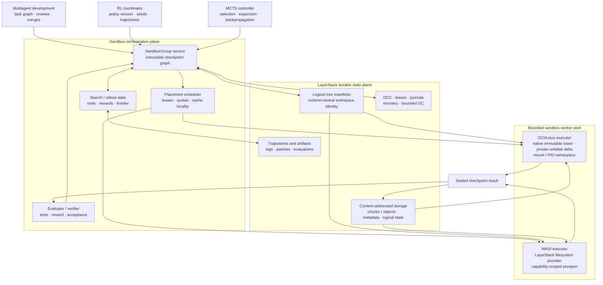
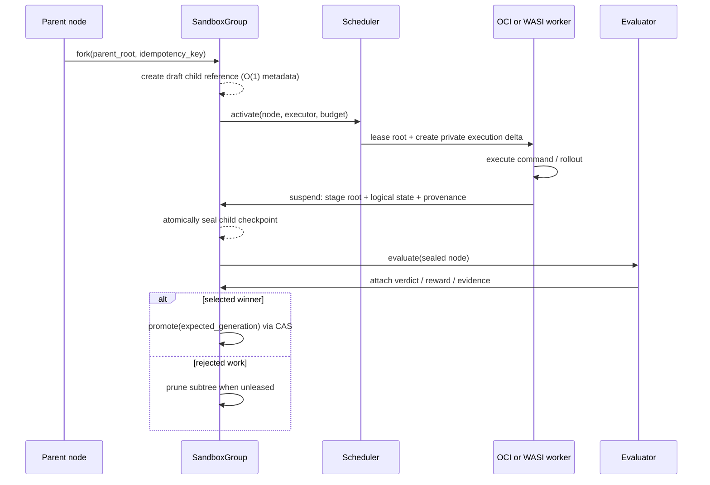
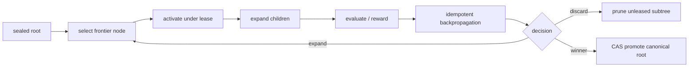

# Ephemeral Sandbox 0.2.0 — Product Requirements Document

| Field | Value |
| --- | --- |
| Status | Proposed; implementation and default-on release are evidence-gated |
| Product release | 0.2.0 |
| Primary abstraction | `SandboxGroup`: a durable graph of immutable sandbox checkpoints |
| Execution targets | OCI/Linux first; WASI is a first-class logical-state consumer |
| Primary workloads | Multiagent code development, parallel RL rollout, and MCTS rollout |
| Compatibility posture | Additive migration from current workspace sessions |
| Owners | Runtime, storage, orchestration, evaluation, and platform qualification |

## 1. Executive summary

Ephemeral Sandbox 0.2.0 changes the durable unit of work from a mutable
workspace session to a **SandboxGroup**: a durable, immutable checkpoint graph
whose nodes can be activated as short-lived isolated executions. A group lets a
coding agent fork a task, an RL coordinator fan out reproducible trajectories,
and an MCTS controller expand a search tree without keeping one container,
mount, or process resident for every logical branch.

The release separates **portable state** from **backend-specific projection**:

- LayerStack manifests, content-addressed objects, provenance, leases,
  evaluations, and logical agent state are durable identities.
- An OCI/Linux worker projects a selected root as a native execution
  filesystem, using a private writable delta per attempt.
- A WASI worker opens the same logical root through capability-scoped
  preopens; it does not emulate Linux mounts or processes.
- A running container, OverlayFS mount, upperdir, PID namespace, and worker
  path are disposable execution details, never durable product identity.

The result is a single product model that fits development branches, RL
rollouts, and MCTS search while remaining honest about platform constraints.
Linux OverlayFS needs mount capability at the trusted worker boundary; that
capability is never delegated to sandbox code. FUSE, host-volume workspaces,
kernel patches, and a custom user-space filesystem are not required for the
0.2.0 core.

The storage substrate is deliberately **not pre-selected**. The four active
storage approaches (L1–L4) must implement the same `RootStore` behavioral
contract and pass the same correctness, portability, and resource gates. A
candidate may become the default only after it produces sealed evidence on the
supported Docker platform matrix. This preserves the useful work in every lane
and prevents a benchmark preference from becoming an unverified product claim.

## 2. Product decision and problem

### 2.1 Problem

Current workspace sessions are useful live execution handles, but they are poor
durable branch identities. Multiagent development, policy rollout, and tree
search routinely create more branches than the system can or should keep live.
When the durable state is coupled to a mutable upperdir, container, or mount:

1. cost grows with the number of historical branches and live sandboxes;
2. recovery depends on worker-local paths and backend-specific state;
3. a parent can be accidentally forked while still mutable;
4. promotion and merge can silently race; and
5. a second executor such as WASI cannot reuse the same durable workspace
   semantics.

### 2.2 Product decision

0.2.0 introduces a graph-shaped state model and bounded executor pool:



### 2.3 Product hypothesis

If sealed roots are cheap to branch, all writable state is private per attempt,
and the number of active attempts is independently bounded, then we can support
large speculative trees with predictable storage, recovery, and isolation
semantics. A hot fork should need no duplicate lower-directory payload bytes;
the durable node record should require only O(1) metadata in workspace size.

These are target outcomes, not shipped claims. The relevant storage path must
prove them with the evidence rules in §13.

## 3. Goals, non-goals, and design principles

### 3.1 Goals

| ID | Goal | Product outcome |
| --- | --- | --- |
| G-01 | Make durable branching explicit | A sealed `SandboxNode` is selectable without retaining a live process or mount. |
| G-02 | Preserve isolation at fan-out | Siblings and parent/child attempts never share a writable delta. |
| G-03 | Reuse the same durable root across execution backends | OCI/Linux and WASI consume a common logical manifest and object contract. |
| G-04 | Bound active resources | Graph size does not determine concurrent containers, mounts, PID namespaces, or memory residency. |
| G-05 | Make speculative work safe | Only explicit OCC-backed merge or promote can advance canonical state. |
| G-06 | Make outcomes reproducible | A result retains root, parents, environment, policy/evaluator version, seed, attempt, and evidence. |
| G-07 | Keep Docker-first portability | Qualify Linux containers on Linux hosts and Docker Desktop Linux VMs on macOS and Windows by probe, not by host-name assumption. |

### 3.2 Non-goals for 0.2.0

- Native macOS filesystem execution, native Windows containers, and standalone
  WSL execution. The portable OCI contract is Linux containers; macOS and
  Windows are qualified through their Docker Desktop Linux backends.
- Unprivileged Linux OverlayFS. `mount(2)` remains a trusted executor
  capability; the release scopes it rather than claiming to eliminate it.
- FUSE, a user-space VFS, or an agent-installed helper in the command I/O path.
- A custom fixed-size ext4 appliance as the required execution substrate. It
  may be explored as a backend implementation only if it meets the same Docker
  and privilege gates, but it is not the portable product contract.
- Kernel patches, Docker Desktop configuration changes, host plug-ins, loop
  devices, or privileged workload containers to manufacture storage sharing.
- Live process time travel. Filesystem/logical checkpoints are the base;
  CRIU-compatible process images are an optional future adapter.
- Automatic semantic merge, unlimited history retention, or an unlimited live
  worker fleet.

### 3.3 Design principles

1. **Seal before fork.** Fork only immutable roots; a mutable upperdir is
   never a shared parent lowerdir.
2. **Identity is logical.** Manifests and content hashes, not inode numbers,
   mount paths, containers, or runtime sessions, identify durable state.
3. **One writable owner.** An execution attempt owns exactly one private
   writable delta.
4. **Fast path is native; truth is portable.** OCI/Linux uses native Linux
   filesystem semantics on the hot path. Durable truth remains independent of
   the execution backend.
5. **Fail closed on capability and evidence.** Unsupported storage behavior
   chooses a correct fallback or disables the feature; it never upgrades an
   unproven optimization into a guarantee.
6. **Evidence travels with decisions.** Evaluations, rewards, tests, policy
   version, environment, and provenance are first-class state.

## 4. Users and jobs to be done

| User | Job | Success condition |
| --- | --- | --- |
| Multiagent developer | Fork isolated work from a known checkpoint, review evidence, and integrate a compatible winner. | One agent’s unsealed writes never appear in another agent’s view; the accepted result is traceable. |
| Review or merge agent | Inspect ancestry, patch/evaluation evidence, and promote only against the expected head. | A stale decision fails explicitly rather than overwriting newer work. |
| RL coordinator | Launch reproducible rollouts from a pinned policy/root pair and retain selected trajectories. | Seed, policy version, root, environment, reward, and artifacts are queryable after workers exit. |
| MCTS controller | Select, expand, evaluate, backpropagate, and prune a large search tree using a bounded worker pool. | Inactive nodes remain durable but do not consume a sandbox slot. |
| Platform operator | Recover after a crash, enforce quotas, and garbage collect only unreachable history. | No selectable or leased root is lost; a failed attempt does not create a half-visible node. |

## 5. Product model

### 5.1 Durable objects

```text
SandboxGroup
└── SandboxNode root (sealed)
    ├── SandboxNode candidate-a (sealed)
    │   ├── SandboxNode candidate-a1 (terminal)
    │   └── SandboxNode candidate-a2 (sealed)
    ├── SandboxNode candidate-b (pruned)
    └── SandboxNode candidate-c (active through one ExecutionAttempt)
```

| Object | Responsibility | Durable fields |
| --- | --- | --- |
| `SandboxGroup` | Owns one immutable checkpoint graph and canonical generation. | `group_id`, `canonical_node_id`, `generation`, policy, retention/quota policy |
| `SandboxNode` | Selectable immutable checkpoint with ancestry. | `node_id`, `parents[]`, `root_id`, `logical_state_id`, provenance, status |
| `ExecutionAttempt` | Disposable activation of one node on one backend. | `attempt_id`, `node_id`, executor, environment, lease, private-delta reference, status |
| `Evaluation` | Versioned result of tests, reward, review, or acceptance. | evaluator version, verdict, reward, evidence/artifact refs |
| `Lease` | Keeps a root and ancestor closure live through activation, evaluation, or selection. | holder, scope, expiry/renewal, reason |

`SandboxNode` is the durable branch identity. `ExecutionAttempt` is intentionally
not: an attempt can fail, be retried, or be released without rewriting the node
or another attempt’s evidence.

### 5.2 Lifecycle



Node states: `draft → sealed → terminal | pruned`.

Attempt states: `queued → active → quiescing → sealed | failed → released`.

A node is selectable only when its root, logical state, provenance, and status
commit atomically. A failed or abandoned attempt never makes a draft node
selectable.

## 6. Functional requirements

### 6.1 Graph and checkpoint requirements

| ID | Requirement | Acceptance evidence |
| --- | --- | --- |
| FR-01 | `create_group` creates a group from an existing immutable root without copying workspace payload. | Creation trace shows referenced root and no parent payload copy. |
| FR-02 | `fork` creates O(1) child-node metadata relative to workspace size and references a sealed parent only. | Fork microbenchmark plus rejection of a mutable-parent request. |
| FR-03 | Sealing atomically publishes filesystem root, logical state, provenance, and node status. | Crash injection at every journal boundary yields either no node or one complete node. |
| FR-04 | A node is activated only by a valid lease; selected nodes retain their ancestor closure. | Concurrent activate/prune/GC test never loses a leased root. |
| FR-05 | `prune` is reachability-based and idempotent. It does not reclaim any canonical, selected, evaluated-retained, or leased node. | Repeated prune and bounded-GC test with retained/winner roots. |
| FR-06 | Retry creates a fresh `ExecutionAttempt` and never overwrites prior attempt or evaluation evidence. | Two retries retain distinct IDs, logs, and verdicts. |

### 6.2 Execution and isolation requirements

| ID | Requirement | Acceptance evidence |
| --- | --- | --- |
| FR-07 | Each active attempt receives one isolated writable delta and isolated process/workspace context appropriate to the executor. | Concurrent sibling write/read test proves neither sibling observes the other’s unsealed change. |
| FR-08 | OCI/Linux activation projects a LayerStack root as a native execution filesystem. Target images require no LayerStack binary, agent helper, repository tool, host bind mount, or FUSE daemon. | Minimal compatible OCI image executes read/write/test workflow using only worker-provided projection. |
| FR-09 | OCI/Linux mount capability is held by the trusted worker boundary only. Sandboxed commands cannot invoke or inherit the capability for arbitrary mounts. | Capability inspection and mount-attempt rejection from sandbox command. |
| FR-10 | The same logical root opens with equivalent filesystem content through supported OCI/Linux and WASI adapters. | Cross-backend manifest walk matches path, type, bytes, mode, symlink target, and supported metadata. |
| FR-11 | The live attempt pool is quota-bounded independently of durable graph size. | Large inactive graph load test stays within configured attempt, process, mount, and memory limits. |
| FR-12 | Suspension quiesces new command admission, drains/stops the attempt according to policy, and seals a new child root without mutating the source node. | Quiesce race test and source-root digest comparison. |

### 6.3 Coordination, integration, and provenance requirements

| ID | Requirement | Acceptance evidence |
| --- | --- | --- |
| FR-13 | All mutating public operations accept an idempotency key. | Duplicate-delivery test returns the original result without duplicate node, reward, or transition. |
| FR-14 | `promote` and `merge` require an expected canonical generation/root and reject stale writers. | Competing promotion test proves at most one advance succeeds. |
| FR-15 | Every sealed result records ancestry, root, environment/base image or module, executor, policy/evaluator version, seed when relevant, and artifact refs. | Provenance referential-integrity audit of exported result. |
| FR-16 | Evaluation is attachable, versioned, and independent of node selection; tests, reviews, reward, and acceptance can coexist. | Multiple evaluator records attach to one sealed node without mutation of the root. |
| FR-17 | MCTS backpropagation and RL accounting are idempotent and keyed to a sealed result/evaluation. | Replayed evaluator event leaves visit/reward aggregates unchanged. |
| FR-18 | Export materializes a root, patch, or artifact with provenance and verifies content integrity before use. | Export/re-import digest and manifest comparison. |

## 7. Public API contract

The initial API is deliberately small. Adapters may expose CLI, MCP, RPC, or
HTTP shapes, but all share these semantics and idempotency rules.

```rust
create_group(source_root, policy, idempotency_key) -> SandboxGroup
fork(node_id, count, idempotency_key) -> Vec<SandboxNode>
inspect(node_or_group_id) -> GraphView
activate(node_id, executor, environment, budget, idempotency_key) -> ExecutionAttempt
exec(attempt_id, command_or_pty, idempotency_key) -> CommandResult
suspend(attempt_id, checkpoint_mode, idempotency_key) -> SandboxNode
evaluate(node_id, evaluator, evidence, idempotency_key) -> Evaluation
merge(node_ids, expected_generation, idempotency_key) -> SandboxNode
promote(node_id, expected_generation, idempotency_key) -> RootId
prune(node_id, idempotency_key) -> PruneReceipt
export(node_id, format, idempotency_key) -> ExportReceipt
```

Rules:

- Mutations return the resource created by the first successful idempotency key
  delivery; they do not recreate it on retry.
- `fork` requires a sealed parent. For an active parent, callers must
  `suspend` first or explicitly request a separate snapshot operation.
- `activate` makes no canonical-state change.
- `suspend` produces a new immutable child; it never edits the activated node.
- `promote` is a compare-and-swap of the group’s canonical generation.
- `merge` is explicit integration work; the product provides OCC and evidence,
  not generic automatic semantic conflict resolution.

## 8. Execution model and platform contract

### 8.1 OCI/Linux projection

For a hot root available on a worker, the expected activation path is:

```text
acquire immutable root lease
→ allocate empty private upper/work state
→ create execution namespaces and cgroup
→ project native execution filesystem
→ run commands
→ seal changed root and release or renew lease
```

No repository copy or object-store reconstruction occurs per fork. Shared
immutable lower content consumes **O(0) additional lower payload space per hot
child**; each child consumes only its private metadata and divergent writes.
This is a data-sharing target, not a statement that metadata, mount state, or
divergent writes cost zero.

The worker may use native OverlayFS when the exact Linux kernel and Docker
storage domain support it. The product does not mount host workspaces over
LayerStack state: the LayerStack root is the source of truth and is projected
inside the worker’s Linux execution environment. Each target image sees an
ordinary filesystem and remains unaware of the implementation.

### 8.2 WASI projection

WASI uses the logical manifest and content store directly through a
capability-scoped filesystem provider. A WASI attempt gets only its allowed
preopens and resource capabilities. It shares checkpoint and provenance
semantics with OCI/Linux but does not pretend to have Linux mounts, PID
namespaces, PTYs, or arbitrary container-image behavior.

### 8.3 Host and image compatibility

| Environment | 0.2.0 contract | Qualification rule |
| --- | --- | --- |
| Ubuntu/Linux host, arm64 or amd64 | Linux OCI container execution. | Run the full storage, isolation, and recovery suite on the production Docker path. |
| macOS host, arm64 | Linux containers inside Docker Desktop’s Linux VM. | Do not infer behavior from macOS APFS; probe the actual Docker storage domain. |
| Windows host | Linux containers inside stock Docker Desktop WSL 2 backend. | Qualify that exact backend; do not claim native Windows-container support. |
| Arbitrary supported Linux OCI image | Ordinary filesystem interface with no image modification. | Validate the pinned support corpus plus Alpine, Debian/Ubuntu, and scratch/distroless semantic extremes. |
| WASI module | Capability-scoped filesystem provider. | Cross-backend logical-root equivalence suite. |

## 9. Storage substrate decision framework

The storage implementation must expose the `RootStore` contract below. L1–L4
are evaluated as peers against this contract; no approach is rejected on
architecture preference alone.

```text
RootStore
  seal(delta, parent_root) -> immutable RootId
  materialize(root_id, worker) -> verified native/lazy projection input
  inspect(root_id) -> manifest + integrity + provenance
  lease(root_id, scope) -> Lease
  retain/release(root_id) -> reachability accounting
  collect() -> bounded, safe reclamation
```

### 9.1 Selection gates

| Gate | Required result | Consequence of failure |
| --- | --- | --- |
| Correctness | Isolation, atomic seal, recovery, integrity, provenance, and GC invariants pass. | Candidate cannot be used, even as an optimization. |
| Docker portability | Exact supported Docker backend cells pass without host plug-in, FUSE, loop device, kernel patch, or image helper. | Mark that cell unsupported; do not generalize from another OS/architecture. |
| Capability posture | Required mount capability is confined to trusted worker; sandbox code remains de-privileged. | Reject or redesign the projection path. |
| Storage efficiency | Measured lower sharing and divergent-write behavior meet the declared candidate target. | Retain correct fallback; do not claim near-1.0× sharing. |
| Performance | Fork/activate/seal/restore latency and command-I/O overhead meet release budgets. | Keep candidate experimental or tune before default-on. |
| Operational limits | Memory, WAL, queues, transient space, and GC behavior remain bounded. | Block release until backpressure/recovery is proven. |

`LayerStack 2.0` documents one proposed reflink-backed OverlayFS route and is
currently blocked by its independent feasibility gate. See
[`../implementation-plan/layerstack_2.0/README.md`](../implementation-plan/layerstack_2.0/README.md).
The 0.2.0 product API must not rely on reflink being available: it is a
measured optimization, not the semantic foundation.

## 10. Quality requirements and release budgets

| Area | Requirement | Release evidence |
| --- | --- | --- |
| Fork cost | O(1) durable metadata in workspace size; no copying of sealed parent payload for a hot local fork. | N-fork benchmark with logical and allocated byte accounting. |
| Space efficiency | Near-1.0× lower payload sharing is an aspirational fast-path target; correctness does not depend on it. | Per-storage-candidate extent/object accounting and mutation test. |
| Command I/O | OCI/Linux command I/O stays on native filesystem APIs, not a FUSE/userspace data path. | Profiling and architecture review. |
| Durability | Every visible node and promotion is replayable or abortable without ambiguity after crash. | Fault-injection matrix over all journal/commit boundaries. |
| Latency | Publish p50/p95/p99 and fork/activate/suspend budgets are declared per qualified backend before default-on. | Benchmark receipt with hardware, image, kernel, and backend metadata. |
| Scalability | Durable graph growth is decoupled from live attempts and worker residency. | Large inactive-graph plus bounded-pool load test. |
| Observability | All transitions have correlated group, node, attempt, root, lease, trace, and evaluation identifiers. | Trace completeness audit. |
| Security | Sandboxed commands receive no worker mount authority or broader host/daemon authority. | Capability, namespace, seccomp, and negative mount tests. |

No numeric p95/p99 target is invented in this PRD because the relevant Docker
storage candidates are still under evaluation. The performance owner must
propose candidate-specific budgets from a reproducible baseline before release
approval; the correctness and isolation requirements above are non-negotiable.

## 11. Multiagent, RL, and MCTS behavior

### 11.1 Multiagent development

1. Create a group from an accepted project root.
2. Fork sealed task checkpoints for agents or reviewers.
3. Activate only the number of attempts permitted by quota.
4. Seal each candidate with tests, review evidence, and provenance.
5. Merge or promote a winner with OCC; prune rejected subtrees after retention
   policy permits.

The current workspace-session API remains a compatibility execution handle in
0.2.0. New group APIs are the durable product abstraction; sessions are an
implementation detail of an `ExecutionAttempt`.

### 11.2 RL rollout

- A rollout node pins `root_id`, policy version, environment digest, seed,
  action/state record, and evaluator/reward function version.
- A worker pool schedules only active rollouts. Completed trajectories seal as
  nodes or artifacts according to retention policy.
- Replay is deterministic to the degree promised by the selected executor and
  environment. Nondeterministic sources must be declared in provenance.

### 11.3 MCTS rollout



Search metadata (visits, values, policy priors, frontier state) is durable but
separate from filesystem identity. A search controller may reconstruct a
frontier from sealed nodes after a crash without treating a dead process as a
checkpoint.

## 12. Migration and compatibility

| Release slice | Change | Compatibility guarantee |
| --- | --- | --- |
| 0.2.0-A | Introduce manifests, root leases, provenance schema, and read-only graph inspection. | Existing workspace/session APIs and output shapes remain unchanged. |
| 0.2.0-B | Add opt-in `SandboxGroup`, sealed-node, activation, and evaluation APIs. | Existing callers continue using sessions; no automatic data migration. |
| 0.2.0-C | Add OCI/Linux adapter and cross-backend logical-root contract tests. | New behavior is opt-in per group/policy. |
| 0.2.0-D | Enable bounded rollout/search scheduling and guarded promotion. | Canonical session-based behavior remains available as fallback. |
| Post-qualification | Select default storage fast path per qualified platform/backend cell. | Unsupported or unproven cells retain a correct supported mode or remain explicitly unavailable. |

Migration never treats a live mutable session upperdir as a durable branch
without first sealing it. Imports create a new immutable root with explicit
source provenance; they do not preserve worker-local paths as identity.

## 13. Verification, rollout, and operational readiness

### 13.1 Required test suites

| Suite | Minimum proof |
| --- | --- |
| Isolation | Parent/child/sibling concurrent writes, same path and disjoint paths, no unsealed visibility. |
| Checkpointing | Seal/retry/restore, crash during every commit step, root and provenance atomicity. |
| Coordination | Stale promotion, idempotent retries, concurrent merge, duplicate backpropagation, lease races. |
| Storage | Hot fork accounting, divergent write accounting, candidate comparison, integrity failure, safe GC. |
| Execution | OCI/Linux minimal image, support corpus extremes, command/PTY where supported, WASI preopen semantics. |
| Portability | macOS Docker Desktop arm64, Ubuntu/Linux arm64 and amd64, Windows Docker Desktop WSL 2 Linux backend. |
| Security | Negative mount/capability tests, namespace boundary, secret/network policy provenance. |
| Recovery | Worker loss, coordinator restart, lease expiry, incomplete staging cleanup, journal replay. |
| Workloads | Multiagent merge, RL fan-out/replay, MCTS expand/prune/promote with bounded active workers. |

### 13.2 Rollout policy

1. Ship graph schema and inspection behind an opt-in feature gate.
2. Enable activation only on qualified platform/backend cells.
3. Start with bounded concurrency, durable audit logs, and conservative leases.
4. Compare the selected storage candidate with the correct fallback using
   production-like workloads and anonymized metrics.
5. Promote the candidate to default only after all release gates are sealed.
6. Keep a rollback path that disables the new activation/storage adapter while
   preserving sealed roots and their evidence for diagnosis.

### 13.3 Release exit criteria

0.2.0 may be declared complete only when:

- all functional requirements FR-01 through FR-18 have passing evidence;
- at least one OCI/Linux backend cell and the WASI logical-root suite pass;
- every public operation has idempotency and stale-write tests;
- the platform matrix accurately labels qualified, fallback, and unavailable
  cells without extrapolating across hosts or architectures;
- the chosen storage candidate has a sealed decision record, and every
  non-selected candidate has its findings preserved;
- documentation distinguishes implemented guarantees, conditional properties,
  and non-goals; and
- a recovery drill proves no selectable canonical or leased root is lost.

## 14. Risks and decisions requiring evidence

| Risk | Why it matters | Mitigation / decision rule |
| --- | --- | --- |
| OverlayFS/storage behavior differs by Docker backend | A passing Linux host result does not prove Docker Desktop VM behavior. | Qualify the exact Docker-managed storage domain on each matrix cell. |
| Reflink availability or copy-up sharing is absent | Near-1.0× sharing cannot be assumed. | Treat reflink as optional; use correct clone/copy fallback and keep the optimization gate closed. |
| `SYS_ADMIN` becomes visible to workload code | Mount authority would break the security boundary. | Keep capability in trusted worker/holder; test that sandbox commands cannot mount. |
| Graph retention grows without bound | Search and rollouts can produce unlimited history. | Quotas, leases, reachability, retention policy, and bounded GC admission control. |
| MCTS/RL event replay duplicates accounting | Distributed retries can inflate value or reward. | Idempotency keys and event identity tied to sealed node/evaluation. |
| OCI and WASI semantics drift | A root may become backend-specific by accident. | Manifest equivalence tests and explicit executor capability declarations. |
| Premature storage selection | It would strand work from parallel lanes and bake assumptions into public APIs. | Keep `RootStore` adapter boundary and evidence ledger until decision gate closes. |

## 15. Open questions

1. Which L1–L4 implementation satisfies the full storage decision matrix on
   each production Docker cell, and does a single default exist across cells?
2. Which checkpoint modes are required in 0.2.0: `FilesystemOnly`,
   `LogicalReplay`, and/or an optional `FilesystemAndCriu` adapter?
3. What are the initial per-tenant quotas for active attempts, roots, retained
   bytes, WAL, queue depth, and evaluation artifacts?
4. Which environment fields are mandatory for a reproducible RL result, and
   how should declared nondeterminism be represented?
5. What user-facing conflict-resolution workflow should wrap explicit `merge`
   for coding agents without promising generic automatic semantic merge?
6. Which subset of OCI image metadata and filesystem metadata is supported by
   the first WASI equivalence contract?

## 16. Related documents

- [LayerStack 2.0 decision and evidence gate](../implementation-plan/layerstack_2.0/README.md)
- [LayerStack 2.0 architecture and invariants](../implementation-plan/layerstack_2.0/01-architecture.md)
- [Current workspace runtime specification](../architecture/01-workspace-runtime/SPEC.md)
- [Current system overview](../architecture/00-foundations/01-system-overview.md)
- [Current isolation model](../architecture/02-security-model/01-isolation-model.md)
- [Multiagent design](../multiagent/DESIGN.md)

## Appendix A — Glossary

| Term | Meaning |
| --- | --- |
| Root | Immutable, content-addressed filesystem tree plus logical manifest. |
| Lower | Read-only execution input derived from a root; it is never a mutable parent delta. |
| Delta | Private writable state owned by exactly one execution attempt. |
| Seal | Atomically commit a new root, logical state, provenance, and selectable node. |
| Activate | Bind a sealed node to one temporary executor attempt under a lease. |
| Promote | Advance the group’s canonical node by compare-and-swap. |
| OCC | Optimistic concurrency control using expected generation/root checks. |
| Hot root | A verified root already materialized or cached on the selected worker. |
| Logical state | Non-filesystem state required to resume/interpret a branch, such as agent state or rollout state. |
