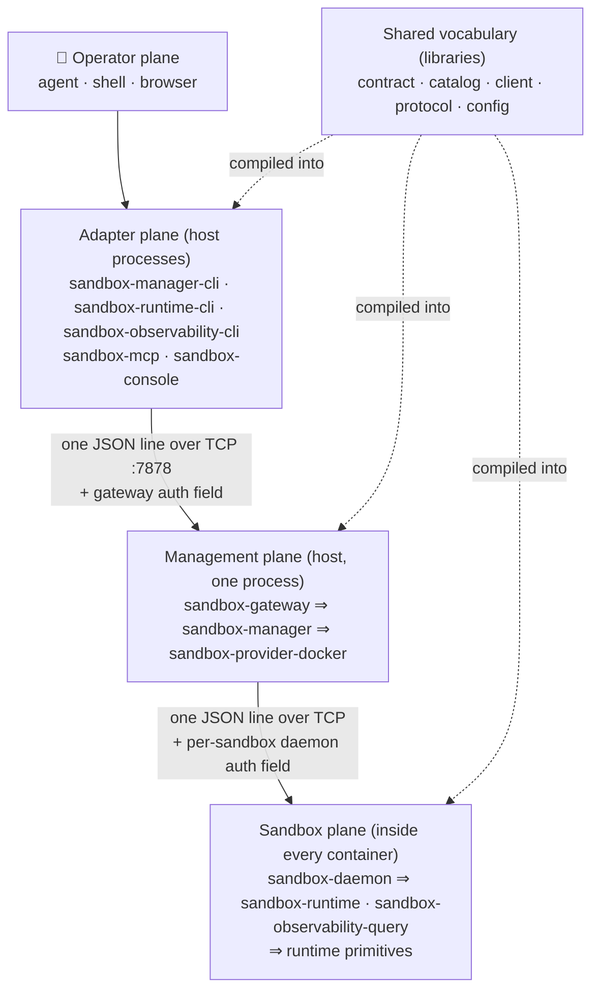
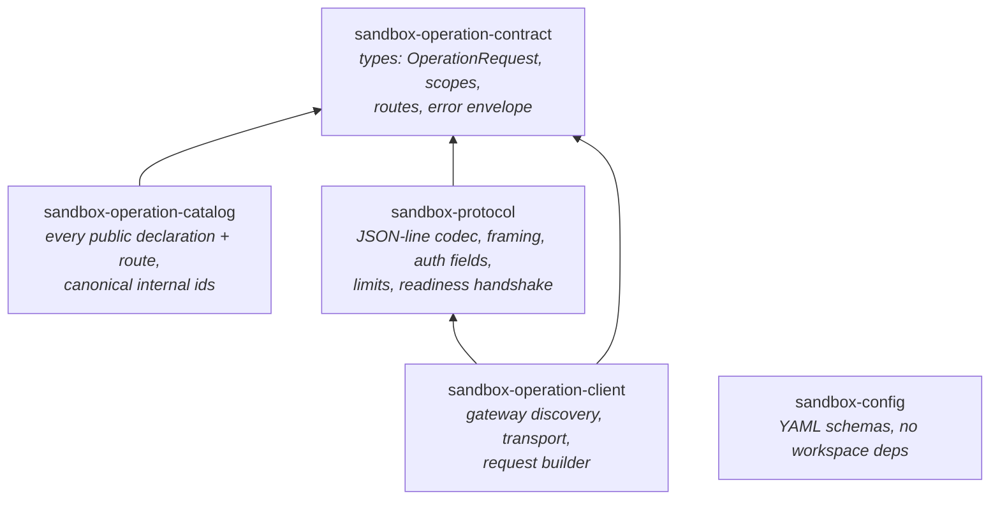
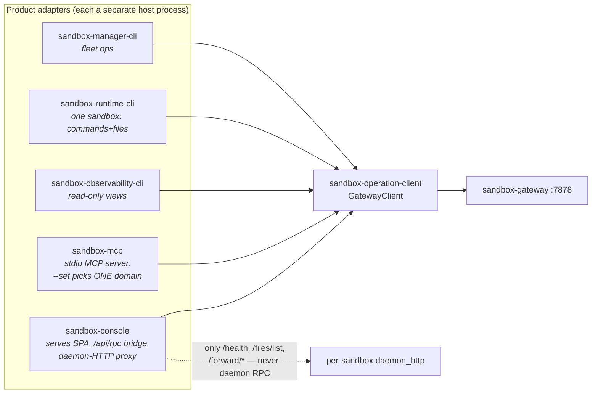
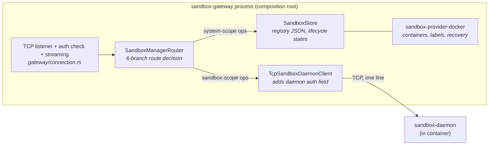
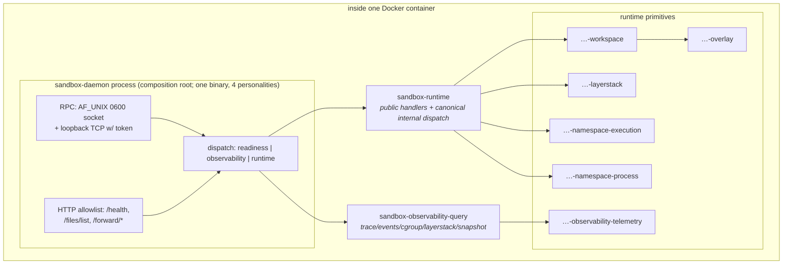

# System overview: planes, crates, and the boundary law

> **Cluster 00 — Foundations, page 1 of 3.**
> Next: [02 — Wire protocol & request lifecycle](02-wire-protocol.md) ·
> [03 — The operation catalog](03-operation-catalog.md)

## Why this page exists

EphemeralOS Sandbox is a 21-crate Rust workspace whose original architecture
spec was deleted from the repository (`docs/` is empty; the README's links into
`docs/obsidian/...` and `docs/daemon-http/` dangle). What survives is the root
`README.md` component table, `CLAUDE.md`, code comments that still cite the
dead spec, and a machine-checked dependency law inside `xtask`. This page
reassembles the map: **which crates exist, which plane each one lives on, what
each is allowed to know, and where those rules are enforced**. Everything here
was verified against the code as of 2026-07-11; citations are
`path:line` relative to the `ephemeral-sandbox` repo root.

Read this page first. [Page 02](02-wire-protocol.md) follows one request
across every hop shown here; [page 03](03-operation-catalog.md) explains how
the operation vocabulary is declared once and projected onto every surface.

## The system in one paragraph

A **gateway** process on the host manages a fleet of Docker-contained
**sandboxes**, each running a static **daemon** binary that executes commands
and file operations inside layered, disposable workspaces. Every user-visible
action — create a sandbox, run a command, read a file, take a snapshot — is an
**operation**: one JSON object, sent as one newline-terminated line over one
TCP connection, through a fixed chain of hops. The architecture's central
discipline is that *the vocabulary of operations is owned in exactly one
place* (the contract and catalog crates) and *every other crate is either a
projection of that vocabulary, a transport for it, or an implementation behind
it* — never a second definition.

## The planes

The workspace divides into four planes plus a shared-vocabulary column that
every plane reads but none redefines.



*What to notice: there are exactly two network hops (adapter→gateway,
gateway→daemon), and the vocabulary crates are compiled into every plane
rather than served from anywhere.*

Each plane in detail follows — deliberately as four small graphs, not one
mural.

### The shared vocabulary column



*What to notice: `contract` is the root — it depends on nothing. `catalog`
depends **only** on contract; `protocol` depends **only** on contract; `client`
on both contract and protocol; `config` on nothing. These five edges are the
whole graph for this column.*

- `OperationRequest { op, request_id, scope, args }` —
  `crates/sandbox-operations/contract/src/request.rs:7`.
- Route metadata (`OperationRouteSpec`: scope policy, scope kind, execution
  owner, visibility) — `crates/sandbox-operations/contract/src/route.rs:24`.
- The one place operation names/routes are declared — the catalog's
  feature-gated domain modules plus its always-compiled `internal` module
  (`crates/sandbox-operations/catalog/src/lib.rs:9-18`).
- The wire codec and both auth field names —
  `crates/sandbox-protocol/src/auth.rs:1-2`.

### The adapter plane



*What to notice: all five adapters funnel through the one shared
`GatewayClient`; the console additionally proxies a tiny per-sandbox HTTP
surface, but no adapter ever speaks daemon RPC directly.*

Adapters are *thin projections*: they own presentation (CLI flags, MCP JSON
schemas, HTTP routes) and nothing else. The three CLI binaries live in one
crate but are feature-isolated so no binary can even name another domain's
operations — `required-features` per binary in
`crates/sandbox-cli/Cargo.toml:14-27`. `sandbox-mcp` picks its single domain
at runtime via a mandatory `--set management|runtime|observability`
(`crates/sandbox-mcp/src/config.rs:16-17`). [Page 03 §Authority
isolation](03-operation-catalog.md#authority-isolation-compile-time-vs-runtime)
contrasts the two mechanisms.

### The host management plane



*What to notice: the gateway binary owns no application behavior — it
composes the manager (application), the Docker provider (infrastructure
adapter), and the wire client for daemon forwarding
(`crates/sandbox-gateway/src/gateway/main.rs:104,177-186`).*

`sandbox-manager` is the application layer: sandbox lifecycle, the operation
router, system-scoped handlers, and the *ports* (traits) that the provider and
daemon client implement. It never touches `sandbox-protocol` — the gateway
hands it decoded `OperationRequest` values and a `SandboxDaemonClient`
implementation. Details of lifecycle/recovery belong to
`05-management-plane/`; the router itself is dissected in
[page 03 §choke points](03-operation-catalog.md#choke-point-2--the-manager-router).

### The sandbox plane



*What to notice: the daemon is a composition root like the gateway — dispatch
plus listeners, no domain logic. `sandbox-runtime` (the crate at
`crates/sandbox-runtime/operation/`) is the application; the six primitives
below it never see operations at all.*

The same static binary runs four personalities selected by subcommand —
`serve`, `ns-runner`, `ns-holder`, `gate-probe`
(`crates/sandbox-daemon/src/main.rs:41-67`) — because runners and holders
re-exec `current_exe`. Process-model details live in `03-daemon/01`; workspace
and layer mechanics in `01-workspace-runtime/`.

## Crate ownership matrix

The root `README.md:35-56` table is normative; this is the distilled version
with the load-bearing "must never" clauses. When you are unsure whether a
change belongs in a crate, this table is the tiebreaker.

| Crate | Kind | Owns | Must never |
|---|---|---|---|
| `sandbox-operation-contract` | lib | operation/argument/scope/route/request/response/error types | depend on any workspace crate; own wire or presentation behavior |
| `sandbox-operation-catalog` | lib | every public declaration + route (feature-gated per domain); canonical internal ids (always compiled) | depend on anything but the contract; own CLI metadata; contain handlers |
| `sandbox-operation-client` | lib | gateway discovery, wire transport, value-based request building | depend on the catalog, applications, adapters, or `sandbox-config` |
| `sandbox-protocol` | lib | JSON-line codec, framing, auth fields, limits, readiness handshake | own operation declarations/help; depend on catalog/applications/client/adapters |
| `sandbox-gateway` | bin+lib | compose listener + manager + Docker provider + daemon wire client | own application behavior; depend on CLI/MCP/console or the shared client |
| `sandbox-manager` | lib | sandbox lifecycle, endpoint tracking, system-scoped handlers, routing, ports | depend on protocol/client/adapters/composition roots; implement runtime semantics |
| `sandbox-daemon` | bin+lib | authenticated RPC, the exact HTTP allowlist, runtime+observability dispatch, lifecycle | depend on product adapters/client/manager; expose HTTP routes beyond `file_list` |
| `sandbox-runtime` | lib | public runtime handlers + canonical internal workspace/layerstack dispatch | depend on protocol/client/adapters/composition roots; own low-level primitives |
| `sandbox-observability-query` | lib | observability query selection + response construction behind an input port | depend on protocol/client/adapters/daemon or the concrete runtime application |
| `sandbox-cli` | lib + 3 bins | CLI paths, flags, positionals, help, output; feature-isolated executables | depend on protocol/applications/other adapters; ship a combined binary |
| `sandbox-mcp` | bin | project exactly one selected domain as a stdio MCP server | define a second catalog; expose a combined set; depend on protocol/applications/CLI/console |
| `sandbox-console` | bin | serve the SPA; validate public `/api/rpc` routes; proxy the daemon HTTP allowlist | define operation vocabulary; contact daemon RPC; expose gateway credentials to the browser |
| `sandbox-provider-docker` | lib | implement manager ports with Docker; protocol only for readiness | own generic lifecycle/rollback, handlers, client behavior; depend on `sandbox-daemon` |
| `sandbox-config` | lib | YAML load/merge/validate + typed section schemas | depend on any workspace crate; own runtime behavior |
| `sandbox-observability-telemetry` | lib | tracing/events/sampling/collection primitives | depend on any workspace crate |
| `sandbox-runtime-workspace` | lib | workspace session lifecycle, namespace handles, capture/destroy | own command process state |
| `sandbox-runtime-layerstack` | lib | content hashes, manifests, storage, leases (+ CAS fixtures) | own command execution |
| `sandbox-runtime-namespace-execution` | lib | execution engine, PTY I/O, transcript windowing | own workspace lifecycle |
| `sandbox-runtime-namespace-process` | lib | holder/runner process bodies, setns execution | own operation dispatch |
| `sandbox-runtime-overlay` | lib | raw overlay mount/unmount primitives | own workspace lifecycle |

*What to notice: the "must never" column is not advice — every row is enforced
by the dependency law below, and several rows additionally by behavior tests.*

## The boundary law

The README states it in one dense paragraph (`README.md:58-70`); unpacked,
it is five ownership rules and three dependency rules:

**Ownership** — each kind of knowledge has exactly one home:

1. Semantic and application-envelope vocabulary →
   `crates/sandbox-operations/contract`.
2. Every public declaration, route, and canonical internal identifier →
   `crates/sandbox-operations/catalog`.
3. Shared gateway-client behavior (discovery, transport, request building) →
   `crates/sandbox-operations/client`.
4. CLI presentation metadata → `crates/sandbox-cli/src/projection` and nowhere
   else.
5. Wire-only codec, framing, authentication fields, limits, and readiness →
   `crates/sandbox-protocol`.

**Dependencies** — the applications and leaves are kept clean:

6. Applications (`sandbox-manager`, `sandbox-runtime`,
   `sandbox-observability-query`) never depend on protocol, the client,
   product adapters, composition roots, or each other's implementations.
7. `contract`, `config`, `telemetry`, `layerstack`, and `overlay` have **zero**
   workspace dependencies.
8. `catalog` → contract only; `protocol` → contract only; `client` → contract
   + protocol only.

One deliberate consequence: because applications can't see `sandbox-protocol`,
the **gateway** decodes wire bytes before the manager runs
(`crates/sandbox-gateway/src/gateway/connection.rs:69-87`) and the **daemon**
decodes before the runtime runs
(`crates/sandbox-daemon/src/rpc/dispatch.rs:18-47`). Composition roots are the
only places wire and application vocabulary meet.

> **Known drift you will meet in the code.** The progress-streaming dialect
> (`_stream_logs` request field, `cli_log(...)` response frames) and the
> mechanics of auth-field *injection/stripping* are implemented in the client,
> gateway, and daemon — not in `sandbox-protocol`, which owns only the two
> field *names*. Three independent audits flagged this as a boundary-law
> violation. It is documented as reality in
> [page 02 §the streaming dialect](02-wire-protocol.md#the-streaming-dialect-_stream_logs-and-cli_log);
> a maintainer should rule whether it migrates into `sandbox-protocol` or is
> blessed as shared ownership.

### The three grouping-only namespaces

Exactly three directories under `crates/` are namespaces: `sandbox-operations/`,
`sandbox-observability/`, and `sandbox-runtime/`. They group packages and do
**nothing else** — no root `Cargo.toml`, no facade crate, no re-export layer
(`README.md:72-77`, `CLAUDE.md:92-94`). If you find yourself wanting
`sandbox-runtime/Cargo.toml`, you are about to create a package identity the
law forbids. Note the naming asymmetry: the *directory* is
`crates/sandbox-runtime/operation/` but the *package* is `sandbox-runtime`;
the directory `crates/sandbox-operations/catalog/` holds package
`sandbox-operation-catalog` (singular).

## The allowed-edge table

The README's link to the spec's "target dependency law" is dead. The
**authoritative machine-checked table now lives in
`xtask/src/operation_architecture/metadata.rs:52-241`** (`PACKAGE_POLICIES`),
with an 11-layer taxonomy at `metadata.rs:19-32`. Reproduced:

| Crate | Layer | May depend on (workspace crates) |
|---|---|---|
| `sandbox-operation-contract` | contract | — |
| `sandbox-operation-catalog` | catalog | contract |
| `sandbox-operation-client` | client | contract, protocol |
| `sandbox-protocol` | protocol | contract |
| `sandbox-manager` | application | contract, catalog, layerstack |
| `sandbox-runtime` | application | contract, catalog, workspace, layerstack, namespace-execution, namespace-process, telemetry |
| `sandbox-observability-query` | application | contract, catalog, telemetry, layerstack |
| `sandbox-cli` | product-adapter | client, contract, catalog |
| `sandbox-mcp` | product-adapter | client, contract, catalog |
| `sandbox-console` | product-adapter | client, contract, catalog, config |
| `sandbox-gateway` | composition-root | contract, catalog, protocol, manager, provider-docker, config |
| `sandbox-daemon` | composition-root | contract, catalog, protocol, runtime, observability-query, telemetry, namespace-process, config, layerstack, workspace |
| `sandbox-provider-docker` | infrastructure-adapter | contract, manager, protocol, config, layerstack |
| `sandbox-config` | configuration | — |
| `sandbox-observability-telemetry` | primitive | — |
| `sandbox-runtime-layerstack` | primitive | — |
| `sandbox-runtime-overlay` | primitive | — |
| `sandbox-runtime-workspace` | primitive | telemetry, layerstack, namespace-execution, namespace-process |
| `sandbox-runtime-namespace-execution` | primitive | telemetry, namespace-process |
| `sandbox-runtime-namespace-process` | primitive | telemetry, overlay |
| `xtask` | tooling | — |

*What to notice: adapters may depend on the **catalog** but never on
**protocol** — they build semantic requests and hand them to the shared
client, which owns the wire. Only the two composition roots and the Docker
provider (readiness handshake only) may name `sandbox-protocol`.*

Two extra rules ride along in the same checker: `sandbox-manager`'s *external*
crates are allowlisted (`base64,rustix,serde,serde_json,tar,thiserror,tokio,zstd`
— `metadata.rs:243-252`), and the workspace must contain **exactly one**
catalog package (`metadata.rs:439-445`).

## Enforcement: how the law stays true

There is no CI in this repository. The law is enforced by locally-run
tooling, so know the commands:

```sh
cargo run -p xtask -- operation-architecture-check   # the full gate
cargo test -p xtask                                  # runs the same checks as tests
```

`operation-architecture-check` (`xtask/src/main.rs:52-56`, implementation
`xtask/src/operation_architecture.rs:138-158`) runs in two phases:

**Phase 1 — fact validation.** Loads `cargo metadata` and the source tree,
then checks the allowed-edge table above, package naming, feature wiring,
binary `required-features`, and stale references.

**Phase 2 — behavior proofs.** Actually compiles and runs named tests
(`operation_architecture.rs:160-348`):

- builds each CLI binary with *only* its own feature
  (`--no-default-features --features manager|runtime|observability`) — the
  compile-time authority-isolation proof;
- catalog integrity: `public_catalogs_are_route_complete`,
  `public_route_manifest_is_exact_and_policy_consistent`,
  `internal_routes_never_leak_into_public_documents`,
  `internal_route_sets_are_exact`
  (`crates/sandbox-operations/catalog/tests/integrity.rs`);
- CLI projection: `cli_projection_is_bidirectional_with_public_routes`;
- manager: `manager_public_routes_and_handler_keys_are_bijective` and the
  internal-route rejection test;
- runtime: public/internal handler bijectivity plus
  `runtime_registry_partitions_are_unique_and_disjoint`;
- observability-query: registry↔route bijectivity;
- console: unknown and internal operations rejected *before* any gateway
  transport.

Sibling `check-*` subcommands (`xtask/src/main.rs:41-51`) enforce code-shape
policies (no inline tests in `src/`, no `#[cfg]` in daemon sources, size
caps); `08-engineering/02` covers them.

> **Caveat:** the docs deletion likely left the stale-reference checker red
> (it verifies git-tracked files under the removed `docs/obsidian/` tree), so
> `cargo test -p xtask` may currently fail for reasons unrelated to your
> change. Verify against `main` before assuming your edit broke it.

## Trust boundaries in one glance

Security has its own cluster ([`02-security-model/`](../02-security-model/)),
but you cannot read the crate map without these three facts:

1. **The gateway token guards the host boundary.** Mandatory for the shipped
   binary (`crates/sandbox-gateway/src/gateway/main.rs:189-202`), optional in
   the library type — a `SandboxGatewayServer` constructed with
   `auth_token: None` accepts everything
   (`crates/sandbox-gateway/src/gateway/connection.rs:81-85`).
2. **Each sandbox daemon has its own token**, injected by the manager's wire
   client on every forwarded request and checked only on the daemon's TCP
   listener (`crates/sandbox-daemon/src/rpc/dispatch.rs:134-149`); the 0600
   unix socket inside the container skips the check.
3. **The daemon HTTP surface is unauthenticated by design** — it is reachable
   only through Docker's loopback port publish, and it exposes exactly four
   routes (`crates/sandbox-daemon/src/http/router.rs:16-28`).

## What you must know before changing this

- **The README table and `PACKAGE_POLICIES` are a matched pair.** Adding a
  crate or a dependency edge means updating
  `xtask/src/operation_architecture/metadata.rs` *and* the README table in the
  same change, or `operation-architecture-check` fails with "unmapped
  workspace package" / a dependency violation.
- **Run the gate yourself.** No CI will catch a boundary break; run
  `cargo run -p xtask -- operation-architecture-check` (or
  `cargo test -p xtask`) before and after your change.
- **Never give a namespace directory a `Cargo.toml`, facade, or re-exports.**
  The three grouping directories are load-bearingly *empty* of package
  identity.
- **New knowledge goes to its owner, not where it's convenient.** A new wire
  field belongs in `sandbox-protocol`; a new operation belongs in the catalog
  (see the [end-to-end checklist](03-operation-catalog.md#adding-an-operation-end-to-end));
  new CLI phrasing belongs in `sandbox-cli/src/projection`. If a change makes
  an application crate import `sandbox-protocol` or the shared client, the
  design is wrong even if it compiles.
- **Composition roots are the only decode sites.** If you need wire bytes
  inside `sandbox-manager` or `sandbox-runtime`, stop — decode at the
  gateway/daemon and pass `OperationRequest` inward.
- **The streaming/auth drift is known.** Don't "fix" it casually in either
  direction: moving the dialect into `sandbox-protocol` or formalizing
  co-ownership both change the law's text. Get a maintainer ruling first
  (open question tracked in the docs plan).
