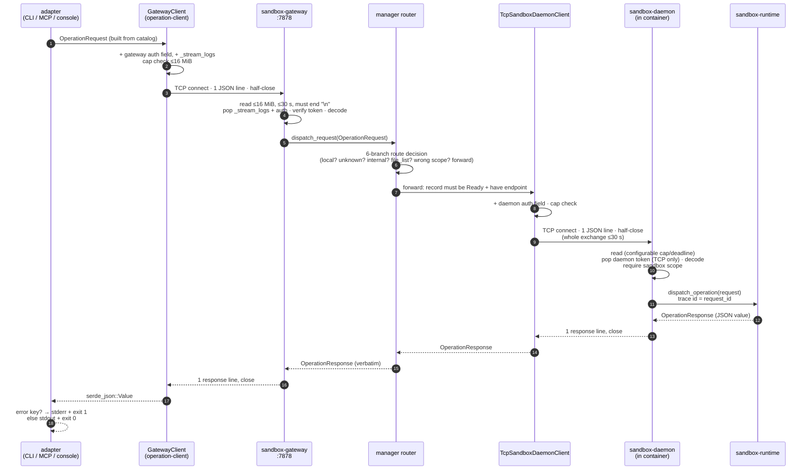
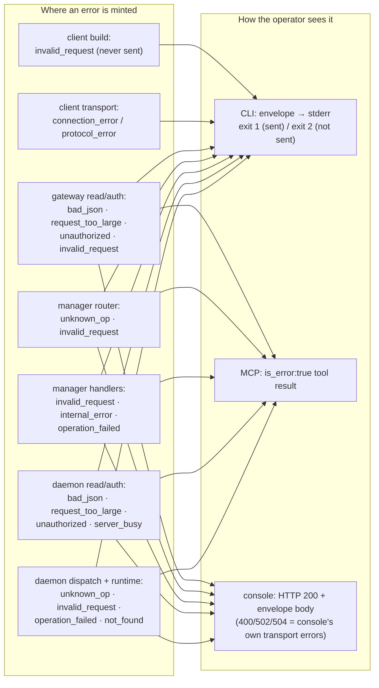

# Wire protocol & request lifecycle

> **Cluster 00 — Foundations, page 2 of 3.**
> Previous: [01 — System overview](01-system-overview.md) ·
> Next: [03 — The operation catalog](03-operation-catalog.md)

## Why this page exists

Every feature of this system — every CLI command, MCP tool call, and console
click — is carried by one wire idiom: **a single JSON object on a single
newline-terminated line, over a single TCP connection, answered by exactly one
line back**. That idiom is small enough to hold in your head, but its
enforcement is scattered across five crates, its limits are hardcoded on one
hop and configurable on the other, its progress-streaming dialect lives
*outside* the protocol crate that supposedly owns framing, and it has **no
version field at all**. Nobody should have to rediscover any of that by
reading four `read_until` loops. This page walks the full life of a request,
shows the exact bytes, and names every place a byte cap, timeout, token check,
or error can intercept it. Citations are `path:line` in the
`ephemeral-sandbox` repo.

## The envelope

One request is one JSON object with exactly four semantic fields
(`crates/sandbox-operations/contract/src/request.rs:7-13`):

```json
{"op":"exec_command","request_id":"req-1","scope":{"kind":"sandbox","sandbox_id":"sbox-1"},"args":{"cmd":"pwd"}}
```

| Field | Type | Decode rule (server side) |
|---|---|---|
| `op` | string | required, non-empty after trim (`codec.rs:44,55-57`) |
| `request_id` | string | required (`codec.rs:45`); preserved verbatim through every hop and reused as the daemon's trace id (`sandbox-daemon/src/rpc/dispatch.rs:62-64`) |
| `scope` | tagged object | required; either `{"kind":"system"}` or `{"kind":"sandbox","sandbox_id":"…"}` (`contract/src/scope.rs:9-14`); a sandbox `sandbox_id` must be non-empty (`scope.rs:55-63`) |
| `args` | object | required, must be a JSON object (`codec.rs:52-60`) |

*What to notice: `sandbox_id` lives in `scope`, never in `args` — the "which
sandbox" question is routing metadata, not an operation argument.
[Page 03](03-operation-catalog.md#why-sandbox_id-travels-in-scope-never-in-args)
explains how all three request builders enforce that.*

Decoding is `sandbox_protocol::decode_request_value`
(`crates/sandbox-protocol/src/codec.rs:6-14,41-67`). Two decode behaviors are
load-bearing:

1. **A non-object payload is `bad_json`; a malformed object is
   `invalid_request`** — the split between "couldn't parse" and "parsed but
   wrong" starts here (`codec.rs:7-11` vs `codec.rs:44-59`).
2. **Unknown top-level fields are silently ignored.** The decoder pulls out
   the four fields it knows and drops the rest. This tolerance is the channel
   the transport fields ride in on — the two auth tokens and `_stream_logs`
   are top-level siblings of `op`, stripped by each hop before decode.

Responses have **no fixed schema**: `OperationResponse` is a transparent
`serde_json::Value` (`contract/src/response.rs:6-10`). The only universal
convention is the error envelope — a response *is* an error iff it has a
top-level `"error"` key:

```json
{"error":{"kind":"invalid_request","message":"cmd is required for exec_command","details":{}}}
```

(`contract/src/error.rs:40-48`; every consumer tests `response.get("error")` —
CLI `output.rs:137`, MCP `tools.rs:52`, gateway streaming `connection.rs:117`.)

## Connection discipline: one request, half-close, one response

All three line servers (gateway RPC, daemon unix RPC, daemon TCP RPC) follow
the same shape; the daemon documents it as its per-connection invariant
(`crates/sandbox-daemon/src/rpc/connection.rs:14-16`):

1. **Accept** — subject to a connection-permit semaphore (gateway
   `gateway/lifecycle.rs:16,40`; daemon shares one semaphore across both
   listeners, `rpc/lifecycle.rs:26,53,99`). No permit → an error line is
   written immediately and the connection closed.
2. **Read exactly one line** — `read_until(b'\n')` behind a byte cap and a
   read deadline (gateway `gateway/connection.rs:95-129`; daemon
   `rpc/connection.rs:69-100`). The gateway additionally rejects a line with
   no trailing newline (`connection.rs:112-114`).
3. **Dispatch** — decode, authorize, route (next section).
4. **Write exactly one line back, then close.** There is no pipelining and no
   keep-alive.

Clients mirror the discipline with **half-close**: write the request line,
then `shutdown()` the write side while keeping the read side open for the
response — `GatewayClient` does it (`client/src/client.rs:48-55`) and so does
the manager's daemon client (`sandbox-gateway/src/daemon_client.rs:83-95`).
The half-close says "no more bytes from me" while the response can still flow
back; a full `close` would discard the response, and *not* closing at all
also works only because servers dispatch at the newline rather than at EOF.

## The full path: one request, five hops



*What to notice: the response travels back **verbatim** — no hop rewrites a
daemon response (the two documented exceptions are the stale-daemon
`unknown_op` translation below, and system-scope operations that never leave
the manager at all).*

The router's 6-branch decision (step 6) is drawn as a flowchart in
[page 03 §choke point 2](03-operation-catalog.md#choke-point-2--the-manager-router);
the code is `crates/sandbox-manager/src/router/dispatch.rs:14-40`.

## Life of one `exec_command`

The same journey with real bytes. Key order inside a JSON line is
insignificant (transport fields are inserted into the object map); shown here
in logical order, each blob is **one line** on the wire.

**1 — Operator runs the runtime CLI:**

```sh
$ sandbox-runtime-cli --sandbox-id eos-4f21 exec_command pwd
```

The CLI resolves `pwd` to the positional `cmd` argument via its projection
(`crates/sandbox-cli/src/projection/runtime.rs:5-10,45-56`), the shared
builder mints a UUID `request_id` and puts `eos-4f21` into scope
(`client/src/request.rs:57-94`).

**2 — Client → gateway** (auth field + streaming flag injected,
`client/src/client.rs:86-109`):

```json
{"op":"exec_command","request_id":"9b7d1f0a-6c2e-4b1f-a2c4-52d0f7f1e8aa","scope":{"kind":"sandbox","sandbox_id":"eos-4f21"},"args":{"cmd":"pwd"},"_sandbox_gateway_auth_token":"hunter2-gateway-token","_stream_logs":false}
```

**3 — Gateway** pops `_stream_logs` and the token, verifies it, decodes
(`gateway/connection.rs:69-87`), and the router finds no local handler for a
sandbox-scoped `exec_command`, no internal-route match, no scope violation —
so it forwards (`router/dispatch.rs:39`), which requires the `eos-4f21`
record to be `Ready` with a daemon endpoint (`router/forward.rs:23-38`).

**4 — Manager's daemon client → daemon** (daemon token injected,
`sandbox-gateway/src/daemon_client.rs:133-141`; note `_stream_logs` did **not**
cross the gateway):

```json
{"op":"exec_command","request_id":"9b7d1f0a-6c2e-4b1f-a2c4-52d0f7f1e8aa","scope":{"kind":"sandbox","sandbox_id":"eos-4f21"},"args":{"cmd":"pwd"},"_sandbox_daemon_auth_token":"c7c2f6de-…-per-sandbox"}
```

**5 — Daemon** pops and checks the token (TCP listener only,
`rpc/dispatch.rs:29-42,134-149`), requires sandbox scope
(`rpc/dispatch.rs:217-226`), and dispatches into `sandbox-runtime` under a
`daemon.dispatch` span whose trace id is the `request_id`
(`rpc/dispatch.rs:59-75`).

**6 — Response line** (shape from
`sandbox-runtime/operation/src/operations/registry/command_operations.rs:129-152`;
status vocabulary `running|ok|error|timed_out|cancelled`,
`command/service/dto.rs:38-46`):

```json
{"status":"ok","exit_code":0,"wall_time_seconds":0.041,"command_total_time_seconds":0.038,"start_offset":0,"end_offset":1,"total_lines":1,"original_token_count":2,"output":"/workspace\n","workspace_session_id":"ws-01HZX…"}
```

A still-running command instead reports `"status":"running"` and includes a
`"command_session_id"` for `read_command_lines` / `write_command_stdin`
paging.

**7 — CLI renders** (`sandbox-cli/src/output.rs:128-144`): success JSON to
stdout, exit `0`. Had the daemon answered with an error envelope, the same
line would have gone to **stderr** with exit `1`:

```sh
$ sandbox-runtime-cli --sandbox-id eos-4f21 exec_command pwd; echo "exit=$?"
{"status":"ok","exit_code":0,...,"output":"/workspace\n","workspace_session_id":"ws-01HZX…"}
exit=0

$ sandbox-runtime-cli --sandbox-id eos-gone exec_command pwd; echo "exit=$?"
{"error":{"kind":"invalid_request","message":"sandbox not found: eos-gone","details":{}}}   # → stderr
exit=1

$ sandbox-runtime-cli --sandbox-id eos-4f21 exec_command; echo "exit=$?"
{"error":{"kind":"invalid_request","message":"COMMAND is required for exec_command","details":{}}}   # → stderr, never sent
exit=2
```

## The two auth fields

Both are top-level JSON fields riding next to `op`, both named in
`crates/sandbox-protocol/src/auth.rs:1-2` — but injection and checking live
with the hops, not the protocol crate:

| | `_sandbox_gateway_auth_token` | `_sandbox_daemon_auth_token` |
|---|---|---|
| Protects | hop 1: adapter → gateway | hop 2: manager → daemon (TCP) |
| Injected by | `GatewayClient` (`client/src/client.rs:92-98`) | manager's wire client (`sandbox-gateway/src/daemon_client.rs:133-141`); Docker provider for the readiness probe (`protocol/src/handshake.rs:8-22`) |
| Checked + stripped by | gateway, *before* decode (`gateway/connection.rs:78-85`) | daemon, TCP listener only — the 0600 unix socket skips it (`rpc/dispatch.rs:29-42,134-149`) |
| Token source | `--auth-token` / `SANDBOX_GATEWAY_AUTH_TOKEN`; **never YAML** (`sandbox-config/src/configs/gateway.rs`, `#[serde(skip)]`) | minted per sandbox at create; daemon receives it via `--auth-token` / `SANDBOX_DAEMON_AUTH_TOKEN` (`sandbox-daemon/src/serve.rs:14,256-264`) |
| If unconfigured | library server accepts everything (`connection.rs:81`); the shipped binary refuses to start (`gateway/main.rs:189-202`) | daemon refuses to enable TCP without a token (`serve.rs:257-264`) |
| On mismatch | `unauthorized` error line | `unauthorized` error line (`rpc/error.rs:23-29`) |

*What to notice: a request that reaches the runtime has been stripped of
**both** fields — applications never see credentials. Token lifecycle,
storage, and rotation live in
[`02-security-model/02-tokens-and-trust-boundaries`](../02-security-model/02-tokens-and-trust-boundaries.md).*

## Limits: who enforces what

The vocabulary and shipped defaults are one struct —
`ProtocolLimits { max_request_bytes: 16 MiB, request_read_timeout_s: 30.0 }`
(`crates/sandbox-protocol/src/limits.rs:14-17`). The asymmetry to remember:
**the gateway hardcodes the defaults; the daemon loads them from YAML.**

| Limit | Value | Config-tunable? | Enforced at |
|---|---|---|---|
| Request line size | 16 MiB | Gateway: **no** — uses the constants (`gateway/connection.rs:101`). Daemon: **yes** — `daemon.server.max_request_bytes`, floor 64 KiB (`serve.rs:50-53`; `sandbox-config/src/configs/daemon.rs:86-90,114-116`) | gateway read (`connection.rs:107`), daemon RPC read (`rpc/connection.rs:84`), daemon HTTP body (`http/api.rs:59`), console `/api/rpc` body (`console/src/rpc.rs:83`) |
| Request pre-send size | 16 MiB | no (client constant, `client/src/lib.rs:18`) | `GatewayClient` before connect (`client.rs:103`); manager's daemon client before connect (`daemon_client.rs:142-146`) |
| Response line size | 16 MiB (+1 newline) | no | `GatewayClient` (`client.rs:160-171`); manager's daemon client (`daemon_client.rs:102-127`) |
| Request read deadline | 30 s | Gateway: no (`connection.rs:117-121`). Daemon: yes — `daemon.server.request_read_timeout_s` | per accepted connection |
| Whole daemon exchange | 30 s default | per-call override by manager code (`daemon_client.rs:26-31,47-49`) | manager→daemon connect+write+read |
| Concurrent connections | 256 | yes on both — `gateway.max_concurrent_connections`, `daemon.server.max_concurrent_connections` (`configs/gateway.rs`, `configs/daemon.rs:110-112`) | permit semaphores; overload answers immediately: gateway → `internal_error` "gateway is at connection capacity" (`gateway/lifecycle.rs:57-70`), daemon → **`server_busy`** (`rpc/lifecycle.rs:182-195`) |
| Console → gateway RPC deadline | `console.rpc_timeout_s` | yes | console one-shot path (`console/src/rpc.rs:38`), timeout → HTTP 504 |

*What to notice: an over-limit request is refused **four times** (client
pre-send, gateway read, daemon-client pre-send, daemon read) — but only the
daemon's copy of the number is tunable, so raising
`daemon.server.max_request_bytes` above 16 MiB is useless: the hardcoded
gateway and client caps still bind first. Practical ceiling = the protocol
default.*

One naming footgun while you're near this code: the client's discovery struct
stores the gateway's **TCP address** in a field typed `PathBuf` and named
`gateway_socket_path` (`client/src/config.rs:11-14`, default `127.0.0.1:7878`).
It has never been a unix socket path; whether UDS was intended is an open
question.

## The streaming dialect: `_stream_logs` and `cli_log`

Long operations (in practice: `create_sandbox`, the only handler wired to a
progress sink — `sandbox-manager/src/operations/dispatch.rs:53-65`) can stream
human-readable progress *before* the final response line:

```text
→ {"op":"create_sandbox", …, "_stream_logs":true, "_sandbox_gateway_auth_token":"…"}
← cli_log("pulling image debian:bookworm")
← cli_log("starting sandbox daemon (1/2)")
← {"id":"eos-4f21","state":"ready", …}
```

Grammar of a progress frame: the ASCII prefix `cli_log(`, one JSON-encoded
string, then `)\n` — written by the gateway
(`gateway/connection.rs:90-93`), parsed back by the client
(`client/src/client.rs:173-186`). Frames are interleaved on the same
connection; the first non-`cli_log(` line is the final response and ends the
exchange (`client.rs:128-152`). Flow: the gateway spawns the dispatch with a
`ProgressSink` (an `Fn(String)` wrapper —
`sandbox-manager/src/progress.rs:3-27`) feeding an unbounded channel it drains
into frames (`gateway/connection.rs:36-67`).

Surface behavior:

- **CLI**: `--progress` (global on `sandbox-manager-cli`, and auto-extracted
  for `create_sandbox` — `sandbox-cli/src/manager.rs:37-38,125-126`) sets
  `_stream_logs:true`; each frame prints to **stderr** as
  `[progress 1.234s] message`, then an `[Output]` separator precedes the final
  stdout JSON (`output.rs:104-121,180-189`).
- **Console**: a browser request with `Accept: text/event-stream` streams the
  same frames as SSE `log` events and finishes with one `result` (or `error`)
  event (`console/src/rpc.rs:52-80`).
- **Any other operation** with `_stream_logs:true` simply streams zero frames
  and then the response — harmless.

> **Boundary-law drift — documented reality.** `sandbox-protocol` claims
> ownership of "framing", yet the `_stream_logs` field name is a bare string
> literal in the client (`client.rs:99`) and the gateway
> (`gateway/connection.rs:74-77`), and the `cli_log(...)` grammar is defined
> twice (gateway writer :90-93, client parser :173-186) — nothing about the
> dialect exists in the protocol crate. Auth-field *names* live in
> `sandbox-protocol`, but injection/stripping are also per-hop code. Until a
> maintainer rules (migrate vs bless — open question in the docs plan), treat
> **client + gateway as co-owners of the streaming dialect**: changing either
> side alone will strand the other.

## The error taxonomy

Three vocabularies share the same envelope shape. What distinguishes them is
**who can mint them**:

| Layer | `kind` values | Minted by |
|---|---|---|
| Wire/transport | `bad_json`, `request_too_large` (details carries `limit`), `unauthorized` (`protocol/src/error.rs:1-3`), `server_busy` (daemon only, `rpc/lifecycle.rs:187`), `invalid_request` for missing-newline (`gateway/error.rs:35`) | gateway + daemon before dispatch |
| Contract | `invalid_request`, `operation_failed`, `internal_error` (`contract/src/error.rs:3-5`), `unknown_op` (`contract/src/response.rs:33-37`) | router, handlers, argument parsing |
| Domain / client-local | `not_found` (file ops — `registry/file_operations.rs:17`), `connection_error`, `protocol_error` (client-side transport failures, `client/src/client.rs:64-72`), `config_error` (CLI discovery, `output.rs:35`), `gateway_timeout` (console, `console/src/rpc.rs:44-48`) | specific handlers or the adapter itself |

*What to notice: a `kind` tells you which layer refused you — transport kinds
mean the request never reached a handler; contract kinds mean it did.*

Manager-side failures map onto contract kinds in one match
(`sandbox-manager/src/error.rs:61-85`): *not-found sandbox, bad ids, wrong
lifecycle state, daemon endpoint missing* → `invalid_request`; *runtime/
install/forwarding/persistence failures* → `internal_error`; *workspace-setup
and export failures* → `operation_failed`.

### Where errors can be born, and how they surface



*What to notice: everything minted at or beyond the gateway comes back inside
a perfectly ordinary response line — transport status (TCP success, HTTP 200)
tells you nothing about operation success. Only the envelope's `error` key
does.*

### Kind → CLI exit code → console HTTP status

CLI exit codes are fixed at `sandbox-cli/src/output.rs:17-19`:
`0` success · `1` failure · `2` usage.

| Situation | `kind` | CLI exit | Console HTTP |
|---|---|---|---|
| Success response | — | `0`, JSON → stdout | 200, body verbatim |
| Request never built (unknown op, bad flag, missing `--sandbox-id`) | `invalid_request` | `2` (`output.rs:96-102`) | 400 (console pre-validation, `rpc.rs:101-105`) |
| Client config invalid | `config_error` | `2` (`output.rs:25-39`) | — (console fails at startup) |
| Gateway unreachable / bad frame | `connection_error` / `protocol_error` | `1` (`output.rs:111-114`) | 502 (`rpc.rs:41-43`) |
| Console RPC deadline | `gateway_timeout` | — | 504 (`rpc.rs:44-49`) |
| Rejected by gateway (auth, size, JSON) | `unauthorized` / `request_too_large` / `bad_json` | `1` | 200 + envelope (gateway *did* answer) |
| Rejected by router or handler | `invalid_request` / `unknown_op` / `operation_failed` / `internal_error` / `not_found` | `1` | 200 + envelope |
| Daemon at capacity | `server_busy` | `1` | 200 + envelope |

*What to notice: exit `2` means the request was never sent; exit `1` with an
envelope means some server answered; console 4xx/5xx describe the console's
own hop, never the operation.*

Two deliberate oddities to keep straight:

- **The console returns HTTP 200 for protocol-level errors** — it is a pipe,
  not a judge; its own 4xx/5xx codes are reserved for failures of *its* hop
  (`console/src/rpc.rs:1-6`).
- **The daemon HTTP surface does the same trick for `file_list`**: transport
  problems (oversized/malformed body) are HTTP 400, but *dispatch* errors —
  including internal ones — come back as HTTP **200** with an envelope body
  (`sandbox-daemon/src/http/api.rs:45-52,109-125`). Whether that 200 is
  contract or accident is an open maintainer question; don't write a client
  that branches on HTTP status alone.

MCP maps the same envelope onto the tool-call result:
`is_error = response.get("error").is_some()`, response as
`structured_content` (`sandbox-mcp/src/tools.rs:51-54`,
`server.rs:66-81`).

## Versioning by absence

Search the envelope again: **there is no protocol version field, and no
capability negotiation anywhere.** This is a choice, and the system has three
mechanisms that stand in for versioning:

**1 — The readiness handshake proves "same language", not "same version".**
At sandbox creation the provider sends the only private operation,
`sandbox_daemon_ready` (id `docker-readiness` —
`protocol/src/handshake.rs:5-6`), authenticated with the daemon token; the
daemon proves it decoded the request, holds sandbox scope, and agrees on the
sandbox id (`rpc/dispatch.rs:186-215`):

```json
→ {"op":"sandbox_daemon_ready","request_id":"docker-readiness","scope":{"kind":"sandbox","sandbox_id":"eos-4f21"},"args":{},"_sandbox_daemon_auth_token":"…"}
← {"status":"ready","sandbox_id":"eos-4f21","daemon":"sandbox-daemon"}
```

**2 — Stale daemons are detected by `unknown_op`, per operation.** A sandbox
keeps the daemon binary it was created with. When a *newer* gateway forwards
an operation an *older* daemon lacks, the daemon's registry answers
`unknown_op` (`sandbox-runtime/operation/src/operations/dispatch.rs:36-37`).
For the two manager operations that fan into internal daemon ops, the manager
translates that into an actionable message
(`operations/management/service/impls/squash_layerstacks.rs:28-38`, same
pattern `export_changes.rs:410`):

```json
{"error":{"kind":"operation_failed","message":"sandbox daemon does not support squash_layerstacks; recreate the sandbox so it uses the current daemon binary","details":{"daemon_op":"squash_layerstack"}}}
```

Any operation *without* such a translation surfaces the raw `unknown_op` to
the caller. "Recreate the sandbox" is the entire upgrade story for running
sandboxes.

**3 — The public surface is frozen by fixture, not negotiated.** The Phase 0
compatibility fixture pins every existing operation's wire-visible shape at
the CLI boundary; additions are allowed, mutations fail tests. That mechanism
belongs to the catalog — see
[page 03 §Phase 0 freeze](03-operation-catalog.md#the-phase-0-compatibility-freeze).

The remaining slack: unknown request fields are ignored (extension channel),
and responses are schemaless values — new response fields are always safe to
add, never safe to require.

## What you must know before changing this

- **Every hop re-implements the read loop.** A change to framing (the
  newline, the cap, the timeout semantics) must land in **five** places:
  `GatewayClient`, gateway connection, manager's daemon client, daemon RPC
  read, and the two HTTP body caps — plus `ProtocolLimits` itself. Grep for
  `read_until` and `MAX_REQUEST_BYTES` before you trust any single-file fix.
- **Do not add a fifth envelope field lightly.** Everything top-level that is
  not `op`/`request_id`/`scope`/`args` is invisible to servers by design; a
  new *semantic* field must be added to the struct
  (`contract/src/request.rs:7-13`) and will be silently dropped by every
  deployed daemon (no version negotiation to save you). New data belongs in
  `args` or in the response value.
- **Never raise only the daemon's byte cap** — the gateway/client hardcoded
  16 MiB still binds. Raising the real ceiling is a protocol-constant change
  (see first bullet).
- **`request_id` is load-bearing beyond logging**: it becomes the daemon's
  trace id (`rpc/dispatch.rs:62-64`), attribution owner strings
  (`operation:<request_id>` for sessionless file writes), and the stale-daemon
  translation reuses it across the internal fan-out. Keep it stable across
  hops.
- **The streaming dialect has two owners** (client parser + gateway writer)
  and zero presence in `sandbox-protocol`. Change both sides together, and
  update this page's drift callout if you migrate it.
- **Error kind strings are wire contract.** The CLI's exit codes, the MCP
  `is_error` flag, the console's status mapping, and the Phase 0 fixture all
  test against these exact strings; renaming a kind is a breaking change even
  though no schema mentions it.
- **A TCP connect is not a readiness signal.** The only valid probe is the
  authenticated `sandbox_daemon_ready` exchange — lifecycle code gates
  forwarding on `Ready`, which is set by that handshake
  (see `03-management-plane/01`).
