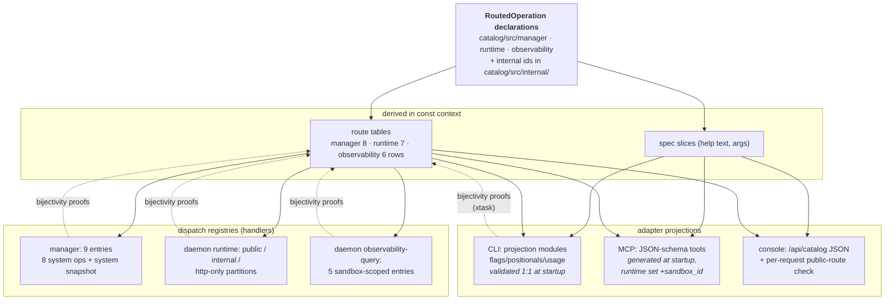
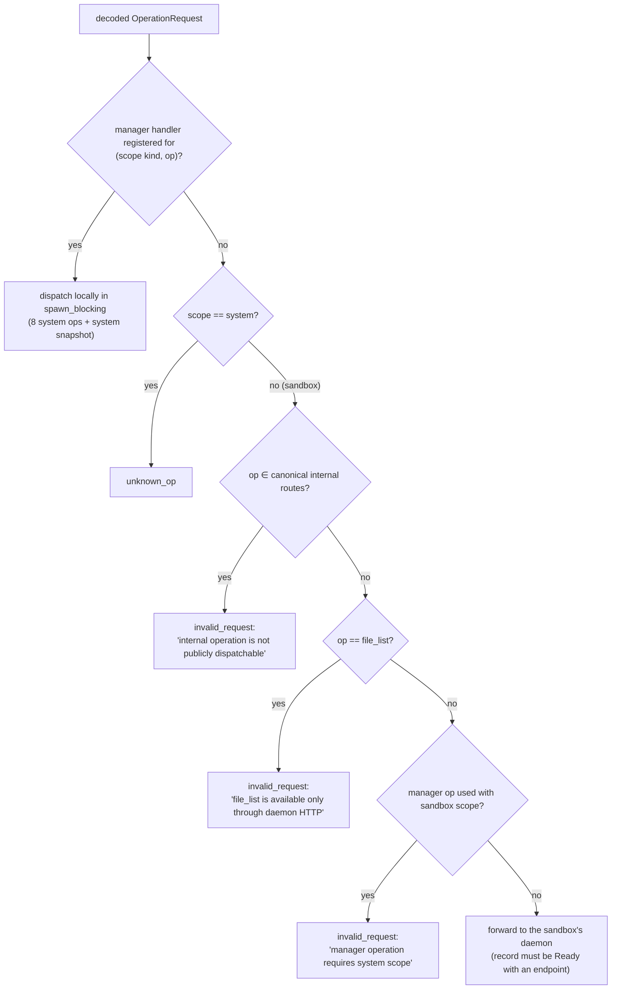

# The operation catalog: one declaration, many surfaces

> **Cluster 00 — Foundations, page 3 of 3.**
> Previous: [01 — System overview](01-system-overview.md) ·
> [02 — Wire protocol & request lifecycle](02-wire-protocol.md)

## Why this page exists

Twenty public operations are visible from five different surfaces — three CLI
binaries, an MCP server, a web console — routed by a host manager and executed
by an in-container daemon. In most systems that means six drifting copies of
"what operations exist and what arguments they take." Here there is exactly
**one** copy: a `static` declaration per operation in
`sandbox-operation-catalog`, from which every route table, CLI help screen,
MCP JSON schema, console validation list, and dispatch registry is *derived* —
at compile time where possible, and cross-checked by tests where not. This
page explains that machinery: how a declaration expands, how the three
enforcement choke points keep public/internal/HTTP-only tiers honest, why
`sandbox_id` never appears in `args`, what the Phase 0 fixture freezes, and
exactly which files you touch to add an operation. Citations are `path:line`
in the `ephemeral-sandbox` repo.

## One declaration…

Here is the *entire* source of truth for `exec_command`
(`crates/sandbox-operations/catalog/src/runtime/command.rs:7-60`, abridged):

```rust
const RUNTIME_OWNED: Routing = Routing::Sandbox(OperationExecutionOwner::Runtime);

pub const EXEC_COMMAND: RoutedOperation = RoutedOperation {
    spec: &EXEC_COMMAND_SPEC,
    routing: RUNTIME_OWNED,
};

pub const EXEC_COMMAND_SPEC: OperationSpec = OperationSpec {
    name: "exec_command",
    family: "command",
    summary: "Start a command in a workspace session.",
    description: "Start a shell command in a workspace session. …",
    args: EXEC_COMMAND_ARGS,       // cmd (required), workspace_session_id,
    related: &["write_command_stdin", "read_command_lines"],
};
```

`RoutedOperation` pairs a semantic spec with its public routing
(`catalog/src/routed.rs:10-25`); `Routing` says which scope(s) the operation
accepts and which application owns execution at each scope:

```rust
pub enum Routing {
    System(OperationExecutionOwner),
    Sandbox(OperationExecutionOwner),
    SystemOrSandbox { system: OperationExecutionOwner, sandbox: OperationExecutionOwner },
}
```

Each domain module lists its operations once and lets two `const fn`s expand
them (`catalog/src/runtime.rs:17-29`):

```rust
const OPERATIONS: &[&RoutedOperation] = &[ &command::EXEC_COMMAND, …, &file::FILE_BLAME ];
const SPECS:  [&OperationSpec; OPERATIONS.len()]                 = routed::specs(OPERATIONS);
const ROUTES: [OperationRouteSpec; routed::route_count(OPERATIONS)] = routed::expand_routes(OPERATIONS);
```

`route_count` counts 1 row per single-scope operation and 2 for
`SystemOrSandbox` (`routed.rs:28-40`); `expand_routes` writes the rows in
declaration order, all `visibility: Public` (`routed.rs:42-92`). Because both
run in `const` context, **a declaration mistake is a compile error, and the
route table costs nothing at runtime**. The integrity suite then pins the
totals: 20 operations expanding to exactly 21 public route rows — `snapshot`
is the only two-row operation
(`catalog/tests/integrity.rs:40-41`, full expected manifest `:45-219`).

## …many surfaces



*What to notice: arrows only ever point **away** from the declaration — no
surface feeds vocabulary back. The dotted edges are the test suite forcing
every projection and registry to stay bijective with the routes it mirrors.*

### The three-way crate split

| Crate | Owns | Concretely |
|---|---|---|
| `sandbox-operation-contract` | the **types** | `OperationSpec`, `ArgSpec`, `OperationRouteSpec` (policy/kind/owner/visibility — `contract/src/route.rs:24-30`), request/response/error envelope, plus the JSON codec for catalogs (`catalog_to_value`/`catalog_from_value` with structural validation, `contract/src/document.rs:283-407`) |
| `sandbox-operation-catalog` | the **declarations** | every public op + route in feature-gated `manager` / `runtime` / `observability` modules; canonical internal ids in always-compiled `internal` (`catalog/src/lib.rs:9-18`) |
| `sandbox-operation-client` | the **use** | gateway discovery, wire transport, and `build_request_from_values` — the one function that turns "spec + policy + selector + arguments" into a valid `OperationRequest` (`client/src/request.rs:57-94`) |

*What to notice: contract = the type system, catalog = the data, client = the
only code that assembles requests from them.*

The catalog deliberately contains **no handlers, no CLI metadata, no wire
code** — handlers live with the applications, CLI phrasing in
`sandbox-cli/src/projection`, transport in protocol/client
([page 01 §boundary law](01-system-overview.md#the-boundary-law)).

## The catalog, in full

### Public operations (20 → 21 route rows)

Verified against the pinned manifest in `catalog/tests/integrity.rs:45-219`.

| Operation | Domain (feature) | Family | Scope policy | Executes in |
|---|---|---|---|---|
| `create_sandbox` | manager | management | System | manager |
| `list_docker_images` | manager | management | System | manager |
| `list_workspace_directories` | manager | management | System | manager |
| `destroy_sandbox` | manager | management | System | manager |
| `list_sandboxes` | manager | management | System | manager |
| `inspect_sandbox` | manager | management | System | manager |
| `squash_layerstacks` | manager | management | System | manager (fans to daemon) |
| `export_changes` | manager | management | System | manager (fans to daemon) |
| `exec_command` | runtime | command | SandboxRequired | runtime |
| `write_command_stdin` | runtime | command | SandboxRequired | runtime |
| `read_command_lines` | runtime | command | SandboxRequired | runtime |
| `file_read` | runtime | file | SandboxRequired | runtime |
| `file_write` | runtime | file | SandboxRequired | runtime |
| `file_edit` | runtime | file | SandboxRequired | runtime |
| `file_blame` | runtime | file | SandboxRequired | runtime |
| `snapshot` | observability | observability | **SystemOrSandbox** | system row → **manager** (aggregate); sandbox row → **observability** |
| `trace` | observability | observability | SandboxRequired | observability |
| `events` | observability | observability | SandboxRequired | observability |
| `cgroup` | observability | observability | SandboxRequired | observability |
| `layerstack` | observability | observability | SandboxRequired | observability |

*What to notice: `snapshot` is the only operation with two routes and two
owners (`catalog/src/observability/snapshot.rs:5-11`) — same name, two
applications. System-scope `snapshot` is answered by the **manager**
aggregating all ready sandboxes; sandbox-scope `snapshot` is answered by the
daemon's observability-query. This is why the manager registry has 9 entries
for 8 manager operations
(`sandbox-manager/src/operations/registry/management_operations.rs:23-69`).*

### Internal operations (5) and the HTTP-only one

The `internal` module is **always compiled** — even a manager-only build knows
the internal names, because the router must recognize them to reject them
(`catalog/src/internal/runtime.rs`):

| Name | Route row? | Reached by |
|---|---|---|
| `create_workspace_session` | yes — `visibility: Internal` (`internal/runtime.rs:13-19`) | manager-minted daemon requests only |
| `destroy_workspace_session` | yes — Internal | 〃 |
| `squash_layerstack` (singular) | yes — Internal | fan-out of public `squash_layerstacks` |
| `export_layerstack` | yes — Internal | fan-out of public `export_changes` |
| `read_export_chunk` | yes — Internal | 〃 (chunk paging) |
| `file_list` | **no route at all** — a bare name const (`internal/runtime.rs:11`) | daemon HTTP `POST /files/list` only |

The integrity suite guarantees the split stays leak-proof: internal names
never appear in any public catalog document
(`integrity.rs:221-243`), and the internal set is pinned exactly
(`integrity.rs:245-267`).

## Scope: policy × selector

A request builder never guesses scope. The route's `scope_policy` plus an
optional **scope selector** (the sandbox id from `--sandbox-id`, an MCP
`sandbox_id` argument, or a browser-supplied scope) decide it, in one shared
matrix (`client/src/request.rs:107-135`):

| | selector **absent** | selector **provided** |
|---|---|---|
| `System` | `{"kind":"system"}` | ✗ `invalid_request` — "system-scoped operation … does not accept a scope selector" |
| `SandboxRequired` | ✗ `invalid_request` — "scope selector is required for …" | `{"kind":"sandbox","sandbox_id":…}` |
| `SystemOrSandbox` | `{"kind":"system"}` | `{"kind":"sandbox","sandbox_id":…}` |

Each adapter resolves the selector differently — this table is the practical
"which flag do I pass" reference:

| Surface | Selector source | Code |
|---|---|---|
| `sandbox-manager-cli` | never accepts one (all ops System-scoped) | `sandbox-cli/src/input.rs:137-138` |
| `sandbox-runtime-cli` | global `--sandbox-id`, **required**, no env/config fallback | `input.rs:139,162-170`; flag `runtime.rs:38-39` |
| `sandbox-observability-cli` | ordinary `--sandbox-id` flag; present → sandbox scope, absent → system (`snapshot` aggregates) | `input.rs:140,144-153` |
| `sandbox-mcp` (runtime set) | `sandbox_id` **injected into every tool's JSON schema as required** | `sandbox-mcp/src/schema.rs:45-54`; resolution `tools.rs:109-139` |
| `sandbox-mcp` (observability set) | optional `sandbox_id` tool argument | `tools.rs:118-137` |
| console `/api/rpc` | browser sends the `scope` object verbatim; console validates (op, scope-kind) against public routes | `console/src/rpc.rs:108-152` |

*What to notice: the same builder sits under every row — adapters differ only
in where the selector comes from, never in what it means.*

For `SystemOrSandbox` the MCP dispatcher additionally re-derives the scope
*kind* from selector presence and re-checks that the (op, kind) route row
exists (`tools.rs:85-99`).

### Why `sandbox_id` travels in scope, never in args

For every sandbox-scoped operation, the sandbox id is **routing metadata** —
the manager consumes it to pick a daemon endpoint
(`router/forward.rs:14-38`) and forwards `args` untouched. Keeping it out of
`args` means a daemon can never be confused about which sandbox it serves and
handlers never re-parse routing data. Three mechanisms hold the line:

1. **The builder strips it.** If a caller also puts `sandbox_id` into the
   arguments of a scope-selected operation, the copy is removed and must equal
   the selector, else `invalid_request`
   (`client/src/request.rs:137-154`); the declared `sandbox_id` arg spec is
   skipped during arg assembly (`request.rs:176-178,192`).
2. **MCP fabricates the argument, then consumes it as scope.** The runtime
   tool schemas *show* agents a `sandbox_id` property (`schema.rs:45-54`), but
   the dispatcher lifts it into scope before building
   (`tools.rs:100-106` via the same stripping builder).
3. **The daemon trusts only scope.** Its HTTP `file_list` handler even
   *synthesizes* the scope from its own configured identity, ignoring any
   body-supplied id (`sandbox-daemon/src/http/api.rs:88-95`).

The mirror-image rule: **system-scoped manager operations take `sandbox_id`
as an ordinary argument** (e.g. `destroy_sandbox`,
`catalog/src/manager.rs:84-88`) because their scope is `system` — "which
sandbox" is *data* for a fleet operation, and the manager mints a new
sandbox-scoped internal request from it when it fans out
(`impls/squash_layerstacks.rs:16-21`).

## The tiers, enforced at three choke points

The public/internal/http-only tiers would be decoration if only one place
checked them. Three independent layers do — an adapter bug, a forged client,
and a confused deputy each hit a different wall:

| Choke point | Where | What it stops |
|---|---|---|
| 1 — client request builder | `client/src/request.rs` (used by CLI + MCP) | mis-scoped requests, unknown arguments, type mismatches, `sandbox_id` smuggling — *before anything is sent* |
| 2 — manager router | `sandbox-manager/src/router/dispatch.rs:14-40` | internal ops arriving over public RPC, `file_list` over RPC, manager ops with sandbox scope, unknown system ops — *on the trusted host, regardless of client* |
| 3 — daemon dispatch | `sandbox-runtime/.../operations/dispatch.rs:30-43` + `sandbox-daemon/src/rpc/dispatch.rs:50-57,120-129` | anything not in a registry partition for that (scope kind, name); non-sandbox scopes; observability ops that aren't public routes → `unknown_op` / `invalid_request` |

*What to notice: the console adds a fourth, softer wall — it refuses to relay
any (op, scope-kind) pair that isn't a public route
(`console/src/rpc.rs:108-119`) — but the system is safe without it; that check
mainly buys friendlier errors and credential hygiene.*

### Choke point 2 — the manager router

Every gateway-decoded request walks this exact ladder
(`router/dispatch.rs:14-40`; each branch is covered by a named test in
`sandbox-manager/tests/manager_router.rs`):



*What to notice: the fall-through is **forward** — the router does not require
the op to be a known public runtime operation. A brand-new runtime op works
against a new daemon without touching the router; a stale daemon answers
`unknown_op` (the versioning-by-absence story,
[page 02 §versioning](02-wire-protocol.md#versioning-by-absence)).*

### Choke point 3 — the daemon registry partitions

The daemon-side registry is one lookup over three disjoint partitions
(`sandbox-runtime/operation/src/operations/registry/mod.rs:7-19`):

- **public** — command + file handlers, each carrying its catalog spec
  (`OperationEntry::public`, `dispatch.rs:20-27`);
- **internal** — workspace-session create/destroy, squash, export handlers,
  spec-less name consts;
- **http-only** — exactly `file_list`
  (`registry/file_operations.rs:21-32`).

Dispatch matches `(scope kind, name)` across all three and answers
`unknown_op` otherwise (`operations/dispatch.rs:30-43`). Partition
uniqueness/disjointness and both bijectivity properties (public handlers ↔
public runtime routes; internal handlers ↔ internal routes) are named xtask
behavior proofs (`tests/operation_registry.rs:8-38`). Because those tests
*derive* both sides, they self-update when you add an op — only the catalog
integrity manifest pins exact sets.

### The `file_list` exception, end to end

`file_list` is the deliberate proof that "HTTP-only" is expressible in this
architecture — by **omission**:

1. Named but **never routed**: a bare const, absent from
   `internal::runtime::ROUTES` (`catalog/src/internal/runtime.rs:11` vs
   `:13-19`).
2. Rejected by name at the router with a pointer to the right door
   (`router/dispatch.rs:27-32`).
3. Registered in the daemon's `http_only` partition — with one honest nuance:
   the daemon's dispatch chains **all three** partitions
   (`operations/dispatch.rs:60-64`), so a caller holding the daemon token
   could technically invoke `file_list` over raw daemon RPC. The
   *public-surface* guarantee is the router rejection in step 2; for
   direct-to-daemon callers the boundary is the per-sandbox token itself
   (and the 0600 unix socket), not the tier.
4. Served at `POST /files/list` with a body of bare args — the daemon
   synthesizes the envelope itself (`http/api.rs:88-95`). The other file ops
   deliberately 404 over HTTP (`http/router.rs:16-28`, `README.md:180-198`).

## Projections and their lockstep proofs

### CLI: hand-written projection, machine-checked mirror

The CLI owns *presentation only*: for each operation a path, usage line,
examples, and per-argument flag/positional bindings
(`sandbox-cli/src/projection/runtime.rs:45-113`). At **every binary startup**,
`catalog_document()` welds projection to catalog and fails closed on any
mismatch — same domain, same operation count, same order, same names, and
per-operation argument lists equal in count, order, and names, with no
duplicate flags/positionals (`projection/document.rs:91-231`). The
projection-integrity suite re-proves it bidirectionally and asserts no
internal name ever gains a projection
(`tests/projection_integrity.rs:11-86`).

So: **you cannot ship a CLI whose help lies about the catalog** — the binary
would refuse to run its own catalog load, and xtask's behavior proofs compile
each binary in feature isolation to catch it earlier.

### MCP: no hand-written schema at all

`sandbox-mcp` generates its tool list from the decoded catalog at startup
(`sandbox-mcp/src/schema.rs:21-36`): one tool per operation, JSON-schema types
derived from `ArgKind` (integer → `{"type":"integer","minimum":0}`, JSON array
→ `{"type":"array"}`, … `schema.rs:71-93`), catalog defaults embedded,
`additionalProperties: false`. The runtime set injects the required
`sandbox_id` property described above. Tool calls come back as
`structured_content` with `is_error` mirroring the envelope
(`server.rs:66-81`). There is nothing to drift — but also nothing frozen:
the MCP surface changes the moment the catalog does.

### Console: verbatim catalogs plus a route gate

The console serves all three semantic catalogs as JSON at `/api/catalog`
(rendered once from the same declarations —
`console/src/catalog.rs:15-27`) so the SPA can build its UI, and enforces the
public-route gate per request rather than at startup
(`console/src/rpc.rs:108-119`). Its xtask proofs pin that unknown *and*
internal operations are rejected **before any gateway transport** happens.

## Authority isolation: compile-time vs runtime

Both CLI and MCP expose one domain at a time, but by two different proofs —
worth understanding because they fail differently:

| | 3 CLI binaries | sandbox-mcp |
|---|---|---|
| Mechanism | Cargo features: each binary has `required-features` for exactly one domain, and the features gate *both* the projection module *and* the catalog's domain module (`sandbox-cli/Cargo.toml:9-27`) | one binary compiles **all three** catalogs (`sandbox-mcp/Cargo.toml:11`); a mandatory `--set management\|runtime\|observability` picks one at process start (`config.rs:16-17`, `catalog.rs:11-20`) |
| The other domains are… | **not in the binary** — `sandbox-manager-cli` contains no runtime declarations to leak | in memory but unreachable — the server holds only the selected catalog and its tools |
| Proof | xtask builds each binary `--no-default-features --features <domain>` (`xtask/src/operation_architecture.rs:161-177`) | server surface: only `tools/list` + `tools/call` over the selected set; register three servers, never a combined one (`README.md:141-169`) |
| Failure smell | feature leak = compile error under the xtask build | wrong `--set` in your MCP registration = wrong toolset, no error |

*What to notice: the CLI proves isolation to the linker, MCP only to the
process arguments — a compromised MCP registration can expose a different
domain; a mis-built CLI cannot.*

The console intentionally has **no** authority isolation — it is the shared
browser bridge and compiles all three domains; its job is credential
confinement, not domain confinement
([06-console/01](../06-console/01-web-console.md)).

## The Phase 0 compatibility freeze

The quiet contract underneath all of this: the file
`crates/sandbox-cli/tests/fixtures/compatibility-catalog.json` is a **frozen
snapshot of the public CLI surface at "Phase 0"**, and
`tests/compatibility.rs` enforces it in a very particular way:

- For each domain, `operation_execution_space` and the **family list must be
  exactly equal** to the fixture (`compatibility.rs:10-17`).
- Every operation in the fixture must still exist and be **deep-equal** —
  spec text, argument specs *and* CLI flag/positional bindings
  (`compatibility.rs:19-33`, comparing the merged semantic+projection
  rendering).
- Operations **not** in the fixture are ignored — additions are legal.

The fixture holds 18 operations (management 6, runtime 7, observability 5).
Today's catalog has 20: `list_docker_images` and `list_workspace_directories`
postdate the freeze — living proof the mechanism is additive-only in practice.

A second fixture freezes failure behavior byte-for-byte: running each binary
with an unknown operation must produce **exactly** this stderr and exit code
(`tests/compatibility.rs:64-112`,
`fixtures/unknown-operation-errors.json`):

```text
$ sandbox-runtime-cli --gateway-socket 127.0.0.1:1 --gateway-auth-token t \
    --sandbox-id eos-phase-0 phase0_unknown_operation
{"error":{"kind":"invalid_request","message":"unknown operation: phase0_unknown_operation","details":{}}}
exit code: 2   (stdout empty — the request was never sent)
```

And `tests/help.rs` pins the rendered help screens
(`fixtures/{manager,runtime,observability}-help.txt`) — so even help wording
is part of the frozen surface.

**Consequences before you edit anything the fixture covers:** renaming an
operation, re-ordering its arguments, changing a default, rewording a
description, or re-binding a flag breaks the freeze; the fix is a conscious
fixture update, which *is* a compatibility decision, not a test chore. The
change policy (additive-only forever? versioned fixtures?) is an open
maintainer question — treat fixture edits as API reviews.

## Adding an operation, end to end

The worked path for a new **sandbox-scoped runtime** operation (`file_stat`,
say). Deviations for other kinds follow below.

1. **Declare it** — `crates/sandbox-operations/catalog/src/runtime/file.rs`:
   an `OperationSpec` (+ its `ArgSpec` list) and a
   `RoutedOperation { spec, routing: Routing::Sandbox(Runtime) }`.
2. **List it** — add the const to `OPERATIONS` in
   `catalog/src/runtime.rs:17-25`. `SPECS`/`ROUTES` re-derive themselves at
   compile time.
3. **Update the pinned integrity manifest** —
   `catalog/tests/integrity.rs`: bump 20→21 / 21→22 (`:40-41`) and add the
   route row to the expected manifest (`:45-219`). This is deliberate
   friction: the exact public surface is reviewed, not inferred.
4. **Implement the handler** —
   `crates/sandbox-runtime/operation/src/operations/registry/file_operations.rs`:
   a `dispatch_file_stat` fn + `OperationEntry::public(&FILE_STAT_SPEC, …)`
   added to `PUBLIC_OPERATIONS`, backed by real service code under
   `src/file/`. The registry bijectivity tests self-update (they derive both
   sides); only add cases for the new behavior itself.
5. **Project it in the CLI** —
   `crates/sandbox-cli/src/projection/runtime.rs`: an `OperationProjection`
   with flags/positionals/usage/examples, inserted **in catalog order**. Until
   counts and order match, every runtime-CLI invocation fails at startup with
   a projection error — that's the lockstep working.
6. **Refresh presentation fixtures** —
   `crates/sandbox-cli/tests/fixtures/runtime-help.txt` (help now lists the
   op). Do **not** touch `compatibility-catalog.json` — additions don't need
   it.
7. **MCP / console: nothing.** Tool schemas, `/api/catalog`, and the console
   route gate all derive from the catalog you already edited. (MCP clients
   see the new tool on next `tools/list`.)
8. **Manager: nothing.** Sandbox-scoped unknowns fall through the router to
   the daemon (the forward branch).
9. **Prove it** — `cargo run -p xtask -- operation-architecture-check`, then
   `cargo test -p sandbox-operation-catalog -p sandbox-cli -p sandbox-runtime`.
10. **Ship the daemon** — existing sandboxes answer `unknown_op` for the new
    op until recreated ([page 02 §versioning](02-wire-protocol.md#versioning-by-absence)).
    Add e2e coverage under `e2e/` when the loop is closed.

**Variations:**

- **System-scoped manager op**: declare in `catalog/src/manager.rs` with
  `MANAGER_OWNED`; handler entry goes in
  `sandbox-manager/src/operations/registry/management_operations.rs:23-69`
  (+ impl under `operations/management/service/impls/`); CLI projection in
  `projection/manager.rs`; the manager-router bijectivity proof derives
  itself.
- **Internal daemon op**: name const + route row in
  `catalog/src/internal/runtime.rs`; handler in the daemon registry's
  **internal** partition; update the pinned internal-set test
  (`integrity.rs:245-267`); *no* CLI/MCP/console work — and the manager op
  that fans out to it decides whether to add a stale-daemon `unknown_op`
  translation (`impls/squash_layerstacks.rs:28-38` is the template).
- **Observability op**: declare in `catalog/src/observability/`; handler
  entry in `sandbox-observability-query/src/registry.rs:19-25`; remember the
  daemon routes public observability ops through the query adapter, not the
  runtime registry (`sandbox-daemon/src/rpc/dispatch.rs:56-57,120-129`).

## What you must know before changing this

- **The declaration is the API review.** Everything a user sees — flags,
  help, MCP schemas, console UI — derives from the `OperationSpec` you write.
  Wording, argument order, and defaults are all wire-visible and all frozen
  once they ship into the Phase 0 fixture's successor snapshots.
- **Never add vocabulary anywhere but the catalog.** A "temporary" op name
  string in an adapter or handler bypasses every proof in this page; the
  xtask semantic checker exists to catch stray declarations
  (`xtask/src/operation_architecture/semantic.rs`).
- **Respect the pinned tests' intent.** `integrity.rs`'s exact manifest and
  the internal-set pin are *meant* to make you re-state the public surface by
  hand. Updating them mechanically defeats their purpose.
- **Scope policy is security metadata.** Changing an op from
  `SandboxRequired` to `SystemOrSandbox` (or moving execution owners) changes
  who answers it and which token protects it — read
  [page 02 §auth fields](02-wire-protocol.md#the-two-auth-fields) and
  [`02-security-model/02`](../02-security-model/02-tokens-and-trust-boundaries.md)
  first.
- **`sandbox_id` placement is not negotiable.** Sandbox-scoped → scope
  (builder strips arg copies); system-scoped fleet ops → ordinary arg. An op
  that "needs both" is two operations.
- **Additive is the only safe direction.** Renames and removals break the
  Phase 0 freeze, stale daemons, and any registered MCP client
  simultaneously. If you must retire an op, plan the fixture change, the
  router behavior for old daemons, and the announcement together.
- **The naming trap:** public `squash_layerstacks` (plural) fans into
  internal `squash_layerstack` (singular); the manager crate is
  `sandbox-manager` but its catalog feature/domain is `manager` while its
  family id is `management`. Copy names from the catalog source, never from
  memory.
