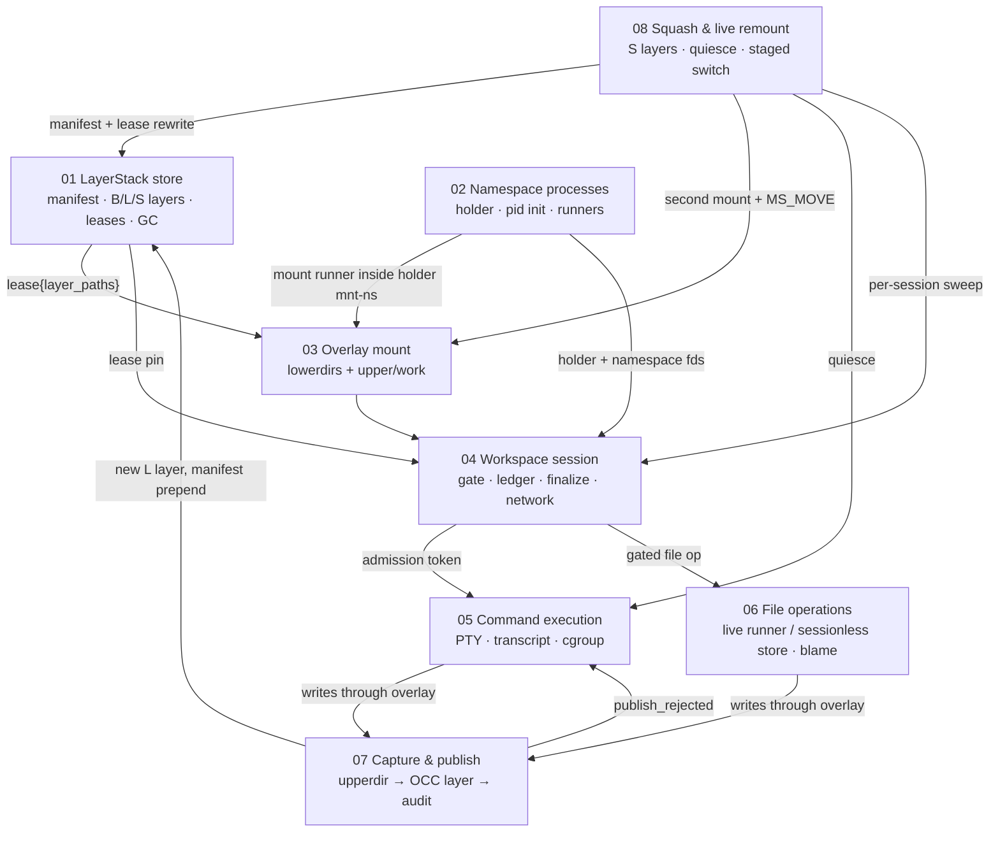

# Runtime tour: one loop, eight mechanisms

> **Cluster 01 — Workspace runtime & storage, page 1 of 9.**
> Prev: [Cluster 00 — Operation catalog](../00-foundations/03-operation-catalog.md) ·
> Next: [01 — LayerStack store](01-layerstack-store.md)

## Why this page exists

This page is the map for the cluster. A workspace is not one subsystem: it is
a lifecycle loop over a persistent layer store, a namespace process tree, one
overlay mount, an admission gate, two mutation surfaces, a publish transaction,
and an optional compaction/remount protocol. The pages are ordered so each
mechanism uses only vocabulary already introduced. Every contract and path
below links to the page that owns it. Verified against `ephemeral-sandbox`
commit `03fdcc440` on **2026-07-12**. Abbreviations: `LS/` =
`crates/sandbox-runtime/layerstack/src/`, `WS/` =
`crates/sandbox-runtime/workspace/src/`, `OV/` =
`crates/sandbox-runtime/overlay/src/`, `NP/` =
`crates/sandbox-runtime/namespace-process/src/`, `NE/` =
`crates/sandbox-runtime/namespace-execution/src/`, and `OP/` =
`crates/sandbox-runtime/operation/src/`; other code anchors are relative to
the repository root.

## The loop



*What to notice: commands and live file operations do not write layer
directories. They write one session upperdir through the overlay. Capture and
publish close the loop by converting that upperdir into a new store layer;
squash later shortens the loop without changing its visible bytes.*

Two facts organize the entire cluster:

1. **There are two independent roots.** Page 01 explains what bytes exist and
   who may reclaim them without mentioning processes. Page 02 explains which
   processes can act in a session without mentioning storage. They first meet
   in page 03, where leased layer paths become an overlay inside the holder's
   mount namespace. Page 04 orchestrates those three roots; it does not invent
   another storage or process primitive (`WS/lifecycle/create.rs:12-119`).
2. **The loop closes through the store.** Every session write lands in the
   host-visible upperdir (`WS/overlay/dirs.rs:1-29`). Page 07 captures that
   upperdir and prepends an `L` layer (`LS/stack/ops/publish.rs:55-127`). Page
   08 folds old `L`/`S` runs into new `S` layers and moves eligible live mounts
   onto the compact chain (`LS/stack/squash.rs:1-14`,
   `WS/lifecycle/remount.rs:197-307`).

## Where every byte lives

```text
/eos/layer-stack/                         page 01 (persistent store)
  manifest.json                           active newest-first chain
  workspace.json                          binding to workspace/base roots
  .storage-writer.lock                    process-lifetime flock target
  layers/{B000001-base,L…,S…}/            immutable layer trees
  base/B000001-base                       shared-base read-only mount
  staging/                                publish/squash/gate scratch
  .layer-metadata/*.{digest,bytes}         digest + advisory byte sidecars

/eos/workspace/                           page 04 directory / page 03 contents
  manager.json                            boot-reap inventory, not recovery state
  <session>/{upper,work,work-remount-*}    session overlay writable state
  <session>/.remount-{staging,rollback}-* staged-switch scratch/mountpoints
  .export/                                export spool directory

/eos/namespace_execution/<command>/       page 05
  transcript.log                          timestamped command output

/eos/storage/file_auditability/           page 06
  file_auditability_0.ndjson              append-only blame snapshots

/eos/runtime/daemon/                      cluster 03
  daemon.sock · daemon.pid · telemetry    daemon transport/observability state

/workspace                                page 03
  ...                                     overlay mount inside each holder mnt-ns

/sys/fs/cgroup/<runtime>/                 pages 05 and 08
  _daemon/ · workspace-<id>/              placement and quiesce discovery
```

The store names are defined across `LS/lib.rs:40-46`,
`LS/workspace_base/{binding.rs:11,layer.rs:17}`, and `LS/storage/lock.rs:12`.
Workspace scratch and per-session dirs come from
`WS/session/manager.rs:108-110` and `WS/overlay/dirs.rs:8-29`. Command scratch
is `OP/command/contract.rs:24`; the audit root is derived as a sibling of the
stack at `OP/services.rs:324-332`; the daemon runtime root is configured in
`crates/sandbox-config/src/configs/runtime.rs`; cgroup leaves are created by
`OP/workspace_session/service/core.rs:144-172`.

Ownership matters more than proximity. `/eos/workspace/<session>/upper` is
allocated and mounted by pages 03/04, read as capture input by page 07, and
deleted by ordinary session teardown (`WS/lifecycle/destroy.rs:27-74`).
`manager.json` records enough paths to reap a dead session after restart, but
never rehydrates a live lease or mount (`WS/lifecycle/persistence.rs:14-62,66-110`).

## The twelve handoff contracts

Each row is a real type, lock, or protocol crossing a page boundary. The
linked section is the owner; the consumer page should point back rather than
redefine it.

| # | Edge | Contract | Code anchor | Owner |
|---|---|---|---|---|
| 1 | 01 → 04 | `Lease { lease_id, manifest, layer_paths }` pins a session chain until destroy; a parked second lease releases there too. | `WS/service/impls/create_workspace.rs:19-35`, `WS/service/impls/destroy_workspace.rs:28-49` | [01 — Leases and GC](01-layerstack-store.md#leases-and-release-time-gc) |
| 2 | 01 → 03 | Lease paths remain newest-first; the first `lowerdir+` receives highest priority. | `OV/kernel_mount.rs:3-7,128-131` | [03 — Ordering chain](03-overlay-mount.md#the-8-hop-ordering-chain) |
| 3 | 04 → 02 | Holder spawn uses `ns-up` / `net-ready` / `ready`; daemon captures namespace fds from `/proc/<pid>/ns/*`. | `WS/lifecycle/create.rs:12-48`, `WS/namespace/fds.rs:33-79` | [02 — Holder handshake](02-namespace-processes.md#the-handshake-three-tokens-work-between-each) |
| 4 | 02 → 03 | `--mount-overlay` runs inside the holder namespace; the mount guard is deliberately forgotten. | `NP/runner/setns/mount_overlay.rs:9-38` | [03 — Who mounts](03-overlay-mount.md#who-mounts-never-the-daemon) |
| 5 | 04 → 05 | `AdmittedCommand` plus RAII `SessionExecutionToken` adds/removes the ledger entry and runs finalize policy. | `OP/workspace_session/service/impls/admission.rs:15-112` | [04 — Gate and ledger](04-workspace-sessions.md#the-gate-and-the-ledger) |
| 6 | 04 → 06 | `with_gated_session` re-resolves a live session under its gate; file ops take no ledger entry and never finalize. | `OP/workspace_session/service/impls/admission.rs:114-144`, `OP/workspace_session/service/impls/run_file_op.rs:9-15` | [06 — Routing decision](06-file-operations-and-blame.md#the-routing-decision) |
| 7 | 06 → 01 | Sessionless reads use `MergedView`; sessionless writes use exclusive `amend_path` RMW. | `LS/stack/file_read.rs:56-131`, `LS/stack/projection/mod.rs:129-229` | [06 — 5×2 matrix](06-file-operations-and-blame.md#the-52-matrix-who-executes-under-what-owning-what) |
| 8 | 03 → 07 | The host-visible session upperdir is capture's only input; capture interprets kernel whiteout metadata. | `WS/service/impls/capture_changes.rs:19-32`, `WS/overlay/capture.rs:1-9` | [07 — Capture](07-capture-and-publish.md#capture-kernel-metadata-only) |
| 9 | 07 → 01 | Publish resolves per-path OCC, promotes staging, writes sidecars, and prepends one `L` layer atomically. | `LS/stack/ops/publish.rs:55-127`, `LS/stack/publish/resolve.rs` | [07 — Commit transaction](07-capture-and-publish.md#the-commit-transaction) |
| 10 | 07 → 05 | Finalize writes `Arc<OnceLock<FinalizeOutcome>>`; terminal command output reads it as `publish_rejected`. | `OP/workspace_session/service/model.rs:37-42`, `OP/command/service/yield.rs:84-118` | [07 — Publish rejection](07-capture-and-publish.md#publish_rejected-how-rejection-reaches-the-caller) |
| 11 | 06 ↔ 07 | LayerStack emits owner-free `Origin`; the file domain mints owners and appends audit events under `audit_gate` after commit. | `OP/file/audit.rs:1-5`, `OP/layerstack/service/impls/publish_changes.rs:44-73` | [06 — Audit pipeline](06-file-operations-and-blame.md#the-audit-pipeline) |
| 12 | 08 → 01/02/03/04/05 | Substitution rewrite, quiesce, a same-upperdir second mount, staged `MS_MOVE`, C5 classification, and gated sweep migrate live sessions. | `LS/stack/lease/rewrite.rs:50-129`, `NE/quiesce.rs:64-192`, `WS/lifecycle/remount.rs:203-379` | [08 — Lease rewrite](08-squash-and-live-remount.md#lease-rewriting-equivalent-chain-overlapping-pins), [C3 switch](08-squash-and-live-remount.md#c3-the-nine-step-staged-switch), [C5](08-squash-and-live-remount.md#c5-report-classification-and-effects) |

## Vocabulary used by every page

| Term | Fixed meaning here |
|---|---|
| **layer** | Immutable changeset tree under `layers/`; `B*` base, `L*` publish, or `S*` squash output. |
| **manifest** | Schema-versioned, newest-first active layer list in `manifest.json`. |
| **lease** | RAM-only pin over one manifest/layer-path chain. |
| **parked lease** | A session's second lease retained after an EBUSY live switch or faulty remount. |
| **snapshot** | Read-only observation of manifest identity/paths; pinned only when backed by a lease. |
| **binding** | `workspace.json` contract tying workspace root, stack root, and base digest together. |
| **scratch root** | Context-qualified writable runtime area: workspace, command, gate, or export scratch—not one global directory. |
| **holder** | Long-lived process whose namespaces define one workspace session. |
| **pid-ns init** | Holder child that becomes PID 1 inside the new pid namespace and keeps it alive. |
| **runner** | Re-exec subprocess that joins holder namespaces and executes one request. |
| **personality / payload** | Daemon subcommand (`ns-holder`, `ns-runner`, `gate-probe`) / runner request kind (shell, file op, mount, remount). |
| **upperdir / workdir / lowerdir** | Overlay writable bytes / kernel transient work state / immutable precedence-ordered inputs. |
| **session** | Orchestrated lease + holder + overlay + network + gate/ledger record. |
| **gate** | One per-session mutex serializing admission, completion, file ops, remount, and destroy. |
| **ledger** | In-memory set of active command ids for a session. |
| **admission token** | RAII proof that a command owns a ledger entry and must complete exactly once. |
| **finalize policy** | What happens when the last admitted command completes: keep, or publish then destroy. |
| **capture / publish** | Scan upperdir into change metadata / resolve and commit that metadata as a layer. |
| **origin / owner** | LayerStack's owner-free line provenance / file domain's public attribution string. |
| **squash block / substitution** | Eligible contiguous layer run / `{S layer → replaced run}` contraction record. |
| **quiesce / pin** | Freeze all observable tasks and inspect them / evidence that OLD cannot detach safely. |
| **staged switch / PONR** | Build/probe NEW then move mounts / first `MS_MOVE` returning success. |
| **sweep** | Context-qualified cleanup: boot storage sweep or post-squash live-session remount sweep. |

Three overloaded words deserve care. A **snapshot** may be a manifest DTO, a
session's stored snapshot reference, or a leased chain; only the last is a GC
pin. A **scratch root** must always name its owner. A **sweep** must say
“storage” or “remount” because the former deletes unreferenced disk entries
while the latter attempts live mount migration.

## Demonstration path

This path introduces exactly one page at each step. It can be followed as a
reading exercise or turned into a narrated Docker e2e.

1. **Tour (00):** locate every `/eos` subtree in the map above and identify
   which page owns a byte before inspecting its implementation.
2. **Store (01):** boot a sandbox; inspect `manifest.json`, `B000001-base`,
   `workspace.json`, `.storage-writer.lock`, and the initially empty lease
   registry/storage sweep result.
3. **Processes (02):** create a session and inspect only its holder process,
   pid-namespace init, readiness/control fds, and `/proc/<holder>/ns/*` links.
4. **Mount (03):** inspect that session's `/workspace` mountinfo row, ordered
   lowerdirs, host-visible upper/work dirs, and `/eos` masks.
5. **Session (04):** compare shared versus isolated creation, then trace the
   per-session gate, empty ledger, `manager.json` record, and guarded destroy.
6. **Command (05):** run `echo hi > hello.txt`; page through the transcript and
   observe that the new bytes exist only in the upperdir while the command is
   live/terminal.
7. **File operations (06):** read/write/edit through the live route, compare a
   sessionless operation, and observe that blame exists only for committed
   audit snapshots.
8. **Capture/publish (07):** finalize or destroy an implicit session; inspect
   the new head `L` layer, manifest version, whiteout encoding, and
   `workspace_session:<id>` audit owner.
9. **Squash/remount (08):** publish several more layers, then squash with one
   idle session and one interactive shell. Expect migration/reclamation for
   the idle session and `pinned:cwd_pinned_workspace` for the shell; restart to
   observe ordinary reap-then-sweep convergence.

## Reading order

- [01 — LayerStack store](01-layerstack-store.md): disk truth, hashes, locks,
  leases, GC, boot sweep, and base binding.
- [02 — Namespace processes](02-namespace-processes.md): holder/runner process
  tree, namespace creation, handshake, protocols, and kill chain.
- [03 — Overlay mount](03-overlay-mount.md): exact kernel object, lowerdir
  ordering, writable dirs, masks, and unmount rules.
- [04 — Workspace sessions](04-workspace-sessions.md): lifecycle orchestration,
  admission gate, ledger, finalize machine, network, and persistence.
- [05 — Command execution](05-command-execution.md): one command from wire to
  PTY/transcript/terminal result and cgroup placement.
- [06 — File operations & blame](06-file-operations-and-blame.md): live versus
  sessionless routes, owners, audit ordering, and blame.
- [07 — Capture & publish](07-capture-and-publish.md): upperdir scan, per-path
  OCC/merge, layer commit, publish rejection, and export.
- [08 — Squash & live remount](08-squash-and-live-remount.md): storage
  compaction, lease rewrite, quiesce, staged switch, classification, and crash
  convergence.

## Corrections

- “Two roots” means two independent conceptual foundations—storage and
  processes—not two filesystem directories. They meet in the overlay mount.
- The loop diagram is a dependency map, not one synchronous call stack.
  Command completion can trigger finalize/publish later through token drop.
- `/eos/workspace` ownership is deliberately shared: page 04 owns lifecycle,
  page 03 owns mounted contents, and page 07 consumes upperdir bytes.
- `manager.json` is cleanup inventory, not durable session recovery; leases,
  namespace fds, substitutions, parked leases, and the remount gate are RAM-only.
- The file-domain “C3 spec” and G1–G3 names are independent of page 08's
  remount C3 and squash gates; the provenance index disambiguates them
  ([`recovered/README.md`](recovered/README.md)).

## What this unlocks

With the map, vocabulary, and handoff contracts fixed, page 01 can begin from
storage truth without prematurely introducing sessions. Reading front-to-back
then reconstructs the complete lifecycle loop exactly once.
