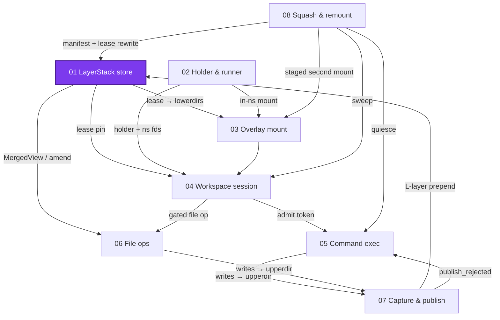
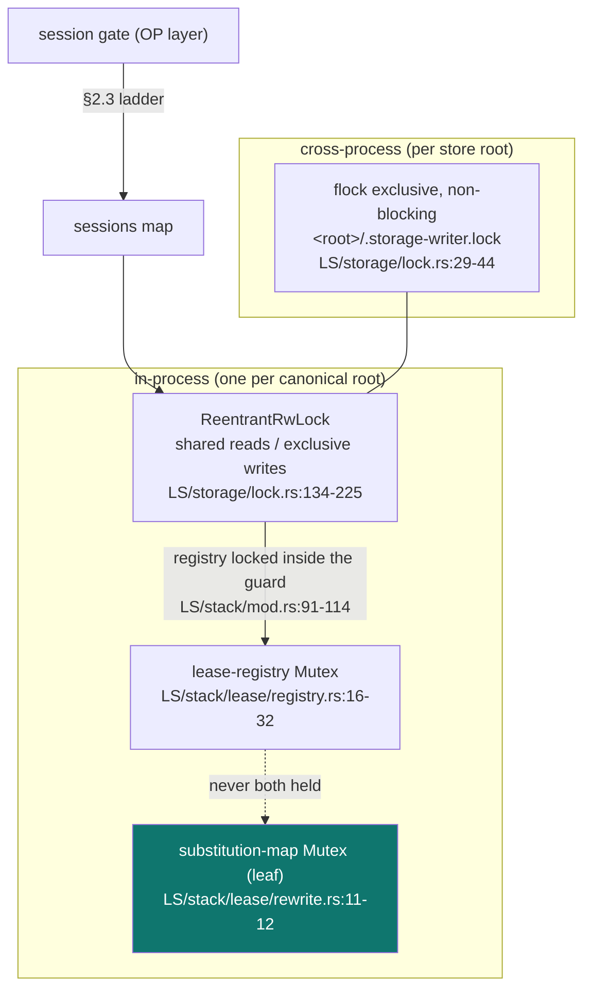
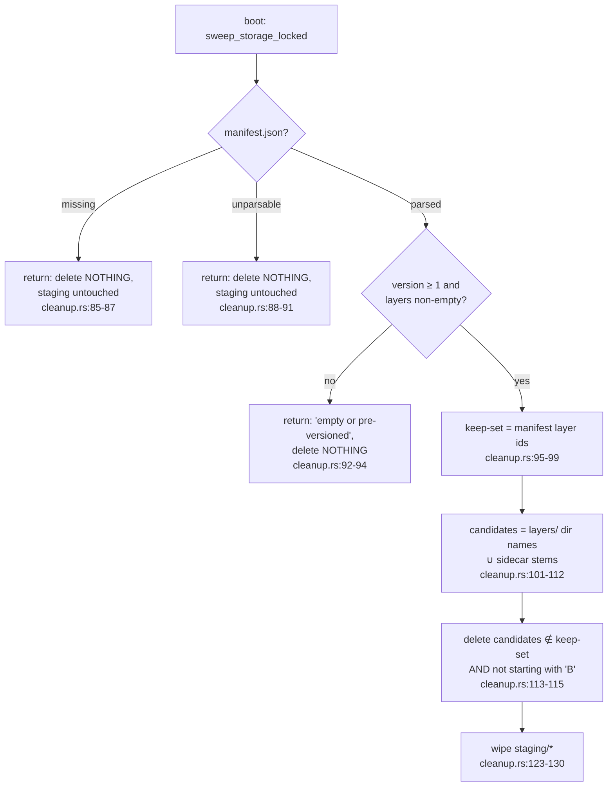

# The LayerStack store: what bytes exist and who may reclaim them

> **Cluster 01 — Workspace runtime & storage, page 2 of 9.**
> Prev: [00 — Runtime tour](00-runtime-tour.md) ·
> Next: [02 — Namespace processes](02-namespace-processes.md)

## Why this page exists

Everything a workspace ever writes ends up in one place: a flat, flock-guarded
directory tree of **layers** described by one **manifest**, pinned by in-memory
**leases**, and cleaned by exactly two collectors — release-time GC and a
fail-closed boot sweep. This page explains that store *without depending on
session semantics*: what is on disk, what each sha256 covers, who may write,
and who may delete. Every claim was verified against the code on **2026-07-11**;
citations are `path:line` relative to the `ephemeral-sandbox` repo root, with
these abbreviations: `LS/` = `crates/sandbox-runtime/layerstack/src/`,
`WS/` = `crates/sandbox-runtime/workspace/src/`,
`OP/` = `crates/sandbox-runtime/operation/src/`,
`OV/` = `crates/sandbox-runtime/overlay/src/`.

Where this page sits in the cluster:



*What to notice: the store is one of the two independent roots of the cluster
(the other is the process substrate, → page 02). Nothing on this page depends
on sessions; three later pages depend on this one.*

## The store on disk

In a production sandbox the store root is `/eos/layer-stack` — an ext4 volume,
deliberately not the container's overlayfs rootfs
(`crates/sandbox-manager/src/operations/management/service/impls/create_sandbox.rs:14`,
`OP/services.rs:225-227`). Layout:

```text
<layer_stack_root>/                      e.g. /eos/layer-stack
├── manifest.json                        the active manifest (atomic replace)
├── workspace.json                       the binding contract (§ below)
├── .storage-writer.lock                 cross-process flock file
├── layers/                              published L* and squashed S* layer dirs
│   └── L000002-00000000/…
├── base/
│   └── B000001-base/…                   shared-seeded base (ro volume in docker flow)
├── staging/                             publish/squash staging; gate-probe scratch
└── .layer-metadata/
    ├── <layer_id>.digest                sha256 sidecar (dedup / base check)
    └── <layer_id>.bytes                 size sidecar (telemetry, advisory)
```

The names are constants, split across their owning modules: `layers/`,
`staging/`, `manifest.json`, `.layer-metadata/` at `LS/lib.rs:40-46`;
`workspace.json` at `LS/workspace_base/binding.rs:11`;
`.storage-writer.lock` at `LS/storage/lock.rs:12`; `base/` at
`LS/workspace_base/layer.rs:17` (re-exported via `LS/lib.rs:34-38`).
One neighbor is deliberately *outside* the stack root: the file-auditability
store lives at `<layer_stack_root>/../storage/file_auditability`
(`OP/services.rs:326-332`) so that nothing this page's collectors touch can
ever delete blame history (→ page 06).

## Layer IDs are counters, not content hashes

Despite the sha256 machinery below, layer identity is allocation order:

- The base layer id is the fixed literal `B000001-base`
  (`LS/workspace_base/layer.rs:16`).
- Published layers are `L{version:06}-{counter:08x}` — prefix `'L'` and
  `version + 1` chosen at `LS/stack/ops/publish.rs:70-72`, formatted in
  `allocate_layer_dirs` (`LS/storage/fs.rs:34-52`, format string `:42`).
- Squash layers use the same allocator with prefix `'S'`
  (`LS/stack/squash.rs:149-150`, → page 08).

The `{counter:08x}` half is a process-wide `AtomicU64` starting at zero
(`LS/storage/fs.rs:30-32,269`) — **not** persisted. Cross-restart uniqueness
rests on the allocator probing for existing staging/layer dirs and retrying up
to 100 times before failing with `LayerIdAllocation`
(`LS/storage/fs.rs:41-51`).

## The manifest and newest-first order

The manifest is the entire catalog of the store: an ordered list of
`LayerRef { layer_id, path }` plus a version counter
(`LS/model/mod.rs:68-79`). On disk it is pretty-printed JSON
`{ schema_version, version, layers: [...] }` written via atomic
tmp-write → fsync → rename → fsync-parent (`LS/storage/fs.rs:215-223`,
`write_atomic` `:113-139`).

Reading is deliberately forgiving in exactly one way and strict in all others
(`LS/storage/fs.rs:188-209`):

> ```rust
> pub(crate) fn read_manifest(path: impl AsRef<Path>) -> Result<Manifest, LayerStackError> {
>     let path = path.as_ref();
>     if !path.exists() {
>         return Manifest::new(0, vec![], MANIFEST_SCHEMA_VERSION).map_err(LayerStackError::from);
>     }
> ```
> — `LS/storage/fs.rs:188-192`

A *missing* file synthesizes an empty manifest with **version counter 0 but
schema_version 1**. There is no readable "schema v0": a missing
`schema_version` field defaults to 1 (`LS/storage/fs.rs:14-21`), a value
greater than 1 is rejected as "newer than this runtime supports"
(`:200-204`), and `Manifest::new` rejects anything ≠ 1
(`LS/model/mod.rs:82-91`). When other pages say "v0 manifest" they mean
`version == 0`, the OCC counter — never a schema variant.

**Newest-first is constructed, never validated.** Exactly two writers create
the order and every reader assumes it:

| Site | What it does | Anchor |
|---|---|---|
| publish | pushes the new layer, then extends with the old list — prepend | `LS/stack/ops/publish.rs:105-110` |
| squash | splices one `S*` ref over the contiguous run it replaces | `LS/stack/squash.rs:196-210` |
| root hash | hashes the list in stored order (order-sensitive) | `LS/model/mod.rs:137-168` |
| `MergedView` | first layer to carry a name wins | `LS/stack/projection/mod.rs:80-229` (doc `:181-184`) |
| overlay mount | first `lowerdir+` = highest priority, iterated as given | `OV/kernel_mount.rs:4-7,128-131` |
| squash planning | `manifest.layers.first()` = each lease's newest layer | `LS/stack/lease/registry.rs:87-92` |

*What to notice: no assertion anywhere checks the order. Corrupt it once in a
manifest edit and every consumer above silently agrees on the wrong answer.*

Layer paths inside the manifest are validated on every read — relative, no
`..`, no NUL, no leading `/` (`check_layer_path`, `LS/storage/fs.rs:79-102`,
run at `:205-207`) — yet `resolve_layer_path` would honor an absolute path
verbatim if one got through (`:104-111`). Validation is the gate; resolution
is lenient.

## The three sha256 roles (plus the one that isn't here)

Three unrelated things are all "a sha256" in this store. Keeping them apart is
half of understanding it:

| Hash | Computed where | Covers | Used for | Ever re-verified? |
|---|---|---|---|---|
| per-layer **changeset digest** | `LS/model/mod.rs:242-278` (`kind\0path\0content\0` over path-sorted changes) | one layer's aggregated changes | head-dedup only: publish no-ops when the new digest equals the head layer's `.digest` sidecar (`LS/stack/ops/publish.rs:60-66,129-139`) | **never** — nothing recomputes a digest from a layer directory after publish |
| **manifest root hash** | `LS/model/mod.rs:162-168` over canonical ASCII-escaped JSON of the layer list (`:137-160`) | layer ids + paths, in order (not `version`, not `schema_version`) | the OCC revision token: `Snapshot.root_hash` (`LS/service/model.rs:5-10`, filled `LS/service/support.rs:7-17`), `Lease::root_hash()` (`LS/stack/mod.rs:50-53`), publish base-revision check (`LS/stack/publish/plan.rs:104-127`) | recomputed on every read; compared at publish |
| **base root hash** | `LS/workspace_base/collect.rs:39-67` (`kind\0path\0[size\0content_hash | link_target]\0`, path-sorted) | the full base tree | the shared-cache key (`LS/workspace_base/build.rs:148-150`) and the binding contract | at **every service init**: base `.digest` sidecar vs `binding.base_root_hash` (`LS/workspace_base/binding.rs:74-90`) |

Two traps the sidecar namespace sets for you:

- The base layer's `.digest` sidecar stores the **base root hash**, not a
  changeset digest — same filename convention, different semantics
  (`LS/workspace_base/build.rs:102` vs `LS/stack/ops/publish.rs:90`).
- A **fourth** sha256 exists in the codebase: the per-path publish
  `content_fingerprint` (`LS/stack/publish/fingerprint.rs:10-28`). It is the
  *real* concurrency control for publish and belongs to → page 07. Don't
  conflate it with any row above.

Hash byte-exactness is pinned by 18 golden CAS fixtures that the tests declare
immutable — "Fixtures are immutable ground truth produced by the live Rust —
never edit them to match code"
(`crates/sandbox-runtime/layerstack/tests/cas_fixtures.rs:1-3,71`).

## Locks: one file, one RW lock, one ladder



*What to notice: the flock is liveness (who owns the root across processes);
the RW lock is correctness (who may mutate in-process); the registry and
substitution mutexes are strictly inner. The ladder never reverses.*

- **flock lease.** Acquired non-blocking-exclusive on open
  (`LS/storage/lock.rs:36`), refcounted per canonical root so every
  `LayerStack` instance in one process shares one OS lock (`:24-27`),
  released when the last instance drops (`:85-101`). Its lifetime *is* the
  open `LayerStack` (`LS/stack/mod.rs:59,69`). A second process gets
  `StorageRootOwned`.
- **Reentrant RW.** The writer thread may re-enter `exclusive()` and may take
  shared guards while writing (`LS/storage/lock.rs:157,186-189`); waiting
  writers block new readers (writer preference, `:157`). There is **no
  shared→exclusive upgrade**: a thread holding a shared guard that calls
  `exclusive()` deadlocks itself, because the write waits for `readers == 0`
  and readers are not thread-attributed (`:192`).
- **Registry inside the guard.** `acquire_snapshot` takes the storage guard,
  *then* the registry mutex (`LS/stack/mod.rs:91-108`); `release_lease` takes
  exclusive, then registry (`:110-114`).
- **The cross-domain ladder** is documented once, on the session gate — quoted
  here because this store is its bottom rung
  (`OP/workspace_session/service/core.rs:49-57`):

> The per-session admission gate: the single serializer for command
> admission, completion, and finalization, session file ops, remounts,
> and guarded/faulty destroys. It does not serialize any public capture —
> capture exists only inside the finalize runner, which runs under the
> gate already held by the completing path. The gates map is locked only
> to clone or drop an Arc — never wait on a gate while holding a map
> (lock order: gate → sessions map → storage writer lock; the gates map
> may briefly take `sessions` inside [`Self::discard_resurrected_gate`],
> so nothing may take the gates map while holding `sessions`).

- **The substitution map is a leaf**, verbatim: "The map mutex is a leaf lock:
  it is never held while acquiring the storage writer lock or the
  lease-registry mutex" (`LS/stack/lease/rewrite.rs:11-12`, → page 08).

Lock semantics are test-pinned: shared guards overlap and block exclusive
(`tests/unit/storage_lock.rs:12`), exclusive is reentrant to depth 2 and
blocks shared until *both* guards drop (`:57`), and the test-only process
reset does not close live flocks (`:90`).

## Leases and release-time GC

A lease pins a manifest snapshot in RAM: `Lease { lease_id, manifest,
layer_paths }` (`LS/stack/mod.rs:37-42`). The registry is a per-root
`HashMap` with zero file I/O (`LS/stack/lease/registry.rs:16-19,103-107`) —
**nothing about leases survives a daemon restart**. (The workspace layer
persists each session's `lease_id` string into `manager.json`
(`WS/lifecycle/persistence.rs:23`), but the registry is never rehydrated from
it; that mismatch is exactly why the boot sweep exists.)

- Acquire: `acquire_snapshot` under a shared guard (`LS/stack/mod.rs:91-108`);
  lease ids are nanos+counter hex, unguessable enough for logs
  (`LS/stack/lease/registry.rs:95-101`).
- The caller's `owner_request_id` is validated non-empty and then **discarded**
  — the stored record has only `lease_id` and `manifest`
  (`LS/stack/lease/registry.rs:51-67,10-14`). Leases are not attributable.
- Release runs the only GC besides the boot sweep
  (`LS/stack/lease/cleanup.rs:16-31`): removable = the released lease's layers
  − active-manifest layers − union of all still-leased layers (`:33-46`).
  Deletion is one shared routine: the layer dir plus its `.digest` and
  `.bytes` sidecars (`:48-58`).

The session-facing edge (handoff #1 of the cluster): a session acquires its
lease at create and keeps it for life
(`WS/service/impls/create_workspace.rs:19-27`, rollback release on failure
`:31-34`); destroy releases it, plus the parked lease when one exists
(`WS/service/impls/destroy_workspace.rs:28-31,36-49`, → pages 04 and 08).

## The boot sweep: fail-closed by construction

On every daemon boot, after reap (→ page 04), the store sweeps itself
(`OP/services.rs:193-195` → `LS/stack/mod.rs:123-126` →
`LS/stack/lease/cleanup.rs:81-136`). The contract, from the function doc
(`LS/stack/lease/cleanup.rs:76-80`): a fail-closed sweep that keeps everything
a parsed `version ≥ 1` manifest references, never deletes `B*` ids, and — on a
missing, unparsable, or degenerate manifest — "deletes nothing and reports
why". *Nothing* includes staging: the three skip branches return before the
staging wipe is ever reached (`:85-94` vs `:123-130`); `staging/*` is cleared
only on the healthy, parsed-manifest path.



*What to notice: every failure path is an early return that deletes nothing at
all — staging included. Only the healthy path reaches the staging wipe. The
`B*` guard exists here (`:113-115`, prefix const `:14`) — and only here;
release-GC has no such guard (see Corrections).*

Details worth knowing:

- Candidates come from `layers/` directory names **and** orphaned sidecar
  stems in `.layer-metadata/` (`cleanup.rs:101-112`) — a crashed publish
  leaves no immortal sidecars.
- The sweep synthesizes candidate paths as `layers/{id}` (`:116-119`);
  a manifest entry with an absolute path is structurally outside its reach.
- Sweep *failure* does not abort boot — it is logged and serving continues
  (`OP/services.rs:196-218`).

The full boot order, from the one function that runs it
(`boot_reap_then_sweep`, `OP/services.rs:168-219`; doc comment `:163-167`:
"Boot cleanup, once, before serving: assert the kernel floor, reap every
persisted session (each is provably dead — PDEATHSIG), then run the
fail-closed storage sweep."):

| # | Step | Anchor |
|---|---|---|
| 1 | `assert_kernel_floor()` — Linux ≥ 5.8 or panic | `OP/services.rs:173,246-256` |
| 2 | `probe_and_set_remount_gate(...)` — → page 08 | `OP/services.rs:174,224-242` |
| 3 | `reap_persisted_sessions()` — → page 04 | `OP/services.rs:175-178` |
| 4 | per-session destroy events + summary log | `OP/services.rs:179-192` |
| 5 | `sweep_storage()` — this section | `OP/services.rs:193-195` |
| 6 | sweep outcome event/log (failure ⇒ log, keep serving) | `OP/services.rs:196-218` |

(Before all of this, still inside service construction: base ensure at
`:70-73`, bind detach at `:85`, export-spool purge at `:114,147-161` — the
spool is `<workspace scratch>/.export`, → page 07.)

The whole story is pinned end-to-end by a docker-restart e2e: holders die by
PDEATHSIG, reap logs before sweep, an orphaned `S*` dir vanishes, and
disk-ids ⊆ manifest-ids afterward
(`e2e/runtime/test_squash_remount.py:262`); the unit matrix covers the
missing/garbage/keep-set/`B*` cases
(`crates/sandbox-runtime/layerstack/tests/unit/squash.rs:1215-1299`).

## Binding and base seeding

`workspace.json` is the store's identity card: `WorkspaceBinding
{ workspace_root, layer_stack_root, base_root_hash }`
(`LS/workspace_base/binding.rs:13-18`). Validation demands absolute roots and
`layer_stack_root` strictly **outside** `workspace_root`
(`binding.rs:101-125`), and a manifest that is v ≥ 1, non-empty, whose layer
paths all exist, with the base layer present and its `.digest` sidecar equal
to `binding.base_root_hash` (`binding.rs:47-99`; digest compare `:74-90`).
The operation layer refuses to construct its layerstack service without a
present, parseable binding (`OP/layerstack/service/core.rs:39-44`); the full
validity checks above run earlier, in `ensure_workspace_base` at boot
(`OP/services.rs:70-73`, `LS/workspace_base/build.rs:33-49`).

Three flows produce a seeded store:

| Flow | Who runs it | Mechanism | Anchors |
|---|---|---|---|
| private in-container build | daemon boot, when no binding exists | walk `workspace_root`, copy into `B000001-base`, write digest + manifest v1 + binding | `LS/workspace_base/build.rs:27-115` |
| host shared-cache build | sandbox-manager on the host | build under `<cache>/.building-<pid>-<n>`, rename to `<cache>/<root_hash>`; losers of the rename race validate and reuse the winner | `LS/workspace_base/build.rs:117-195` (race `:165-189`); cache dir `eos-shared-workspace-base-cache`, env override `EOS_SHARED_BASE_CACHE` (`crates/sandbox-manager/src/operations/management/service/impls/create_sandbox.rs:12-13`) |
| docker import | sandbox-provider-docker | mount the cached base **read-only** at `<root>/base` and tar-seed a pre-written manifest v1 + binding + digest sidecar | volume bind `crates/sandbox-provider-docker/src/runtime.rs:246,339-341`; seed archive `crates/sandbox-provider-docker/src/archive.rs:48-99` |

The build is fail-closed on fidelity: any special file (socket, fifo, device,
unreadable — a file shortened mid-copy surfaces here too) or unstable entry
(deleted mid-walk) aborts the whole build — "workspace base must be a full
copy"
(`LS/workspace_base/layer.rs:87-102`; classification `:260-271,396-404`).
Copying preserves permissions only — no mtimes, no ownership, no xattrs
(`layer.rs:389-391`) — over a fixed 32-thread pool sized "for I/O concurrency
… rather than core count" (`layer.rs:20-26`). A private build also refuses any
non-virgin root: existing binding, a manifest other than (v0, empty), or
anything already in `layers/`/`staging/` (`build.rs:98-99,197-217`).

**The bind detach.** In the docker flow the workspace directory is initially
bind-mounted for seeding; right after the base is ensured, boot unmounts it —
`detach_workspace_bind_after_base` (`OP/services.rs:268-302`). "Not mounted"
is a clean no-op (`Errno::INVAL` → `NotMounted`, `:304-311`); any *real*
unmount failure, or the mountpoint vanishing, **panics the daemon**
(`:283-301`) — a workspace that still shadows the store is not a state worth
serving from.

## The three scratch roots

"Scratch" is one word for three different directories; every later page uses
at least one of them:

| Scratch root | Prod location | Holds | Anchor |
|---|---|---|---|
| workspace scratch | `/eos/workspace` | `manager.json` (`WS/lifecycle/persistence.rs:10-12`), per-session run dirs (`WS/session/manager.rs:108-110`), export spools under `.export/` (`OP/layerstack/service/core.rs:11,62-64`) | wired at `OP/services.rs:48,89` |
| namespace-execution scratch | `/eos/namespace_execution` | per-command dirs + transcripts (→ page 05) | default `OP/command/contract.rs:24` |
| gate-probe scratch | `<layer_stack_root>/staging` | the boot remount-gate probe's scratch overlay | `OP/services.rs:228` |

The third row is a deliberate borrow, per the comment
(`OP/services.rs:225-227`):

> ```rust
> // The probe mounts a scratch overlay, so its scratch must be on a real
> // (non-overlay) filesystem — the layer-stack volume is ext4, unlike the
> // container's overlay rootfs at /eos.
> ```

Nothing is lost by the borrow: on every healthy boot — and a bound store
always has the `version ≥ 1` manifest that makes a boot healthy
(`LS/workspace_base/binding.rs:47-99`) — the sweep clears `staging/*`
(`LS/stack/lease/cleanup.rs:123-130`).

## Whiteouts as stored (storage view only)

A deletion in an upper layer must be *representable* in a stored layer. The
store writes the kernel's own encoding, with a dual fallback
(`LS/storage/whiteout.rs:22-106`):

| Object | Primary encoding | Fallback | Non-Linux |
|---|---|---|---|
| deleted file/dir | mknod char device 0:0, mode 0644 (`:23-34`) | empty file + `trusted.overlay.whiteout` **or** `user.overlay.whiteout` = `"y"` (`:36-59`) | logical `.wh.<name>` file (`:62-70`) |
| opaque dir | `.wh..wh..opq` marker entry (itself whiteout-encoded) **plus** `trusted/user.overlay.opaque` xattr on the dir (`:76-100`) | — | `:102-106` |

Detection accepts either encoding: char dev with rdev 0, or an empty file with
either xattr (`:125-134`); on non-unix it is constantly false (`:136-139`).

Because `.wh.` therefore *means* something to this store, user data may never
say it: publish rejects, as `protected_path`, any top-level
`manifest.json`/`workspace.json`/`layers`/`staging`/`.layer-metadata`, any
`.layer-metadata` path component, and any component beginning with `.wh.` —
while lookalikes "without the trailing dot (`.wh`, `.whx`, `x.wh.y`) are
ordinary paths" (`LS/stack/publish/route.rs:11-33`). How whiteouts get
*written into* a layer during capture/publish, and the third (logical)
encoding used by export streams, belong to → page 07.

## Corrections

Places where a name or an old doc will mislead you, verified today:

- **`.bytes` is advisory.** The size sidecar write is `let _ =` *after* the
  manifest is already durable (`LS/stack/ops/publish.rs:118-122`) — telemetry
  input (`tests/unit/sidecar.rs:23-24`), never correctness. Contrast `.digest`,
  whose write failure rolls the layer back (`:90-93`).
- **Leases are not attributable.** `owner_request_id` is checked non-empty,
  then dropped (`LS/stack/lease/registry.rs:51-67`). Don't design an audit
  trail on top of lease ownership; there is none.
- **`get_snapshot` pins nothing.** It opens the stack, reads the manifest, and
  returns paths with no lease (`LS/service/impls/get_snapshot.rs:1-11`).
  Observation only — the paths may be GC'd under you.
- **Release-GC has no `B*` guard.** The guard exists only in the boot sweep
  (`LS/stack/lease/cleanup.rs:113-115` vs `:33-46`). At release time, base
  safety rests on `B000001-base` being in the active manifest (or still
  referenced by another live lease — `:38-43`).
- **"Snapshot" means three things.** A leaseless `Snapshot` value
  (`LS/service/model.rs:5-10`), the *pinned* manifest inside
  `acquire_snapshot` (`LS/stack/mod.rs:91`), and the workspace-side
  `LayerStackSnapshotRef` (`WS/model.rs:51-58`). This cluster uses "snapshot"
  only for the first and says "lease" otherwise.
- **Publish double-checks what the lock already guarantees.** After promoting
  the layer dir, publish re-reads the manifest and rolls back on mismatch
  (`LS/stack/ops/publish.rs:95-103`) even though it holds the exclusive lock —
  defense-in-depth, practically unreachable (→ page 07).
- **A test failpoint lives in production code**: with
  `SANDBOX_LAYERSTACK_ENABLE_TEST_FAILPOINTS=1` and a consumed marker file
  `.layer-metadata/fail-next-publish`, the next publish fails deliberately
  (`LS/stack/ops/publish.rs:15-16,141-156`). Harmless without the env var;
  surprising in a grep.

## What this unlocks

Page 03 mounts `Lease.layer_paths` in exactly the newest-first order this page
constructed; page 04 pins one lease per session across the create/destroy
edge shown here; page 06 reads and amends through `MergedView` under the same
writer lock; page 07 is the write path that produces every `L*` layer and
sidecar this page catalogued; and page 08 splices `S*` layers into the
manifest, rewrites leases through the substitution map, and leans on the boot
sweep as its crash-recovery story.
