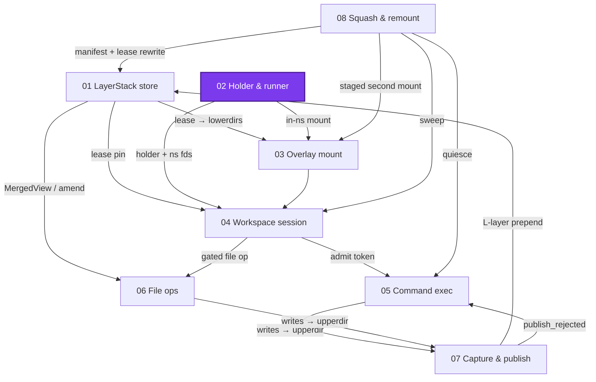
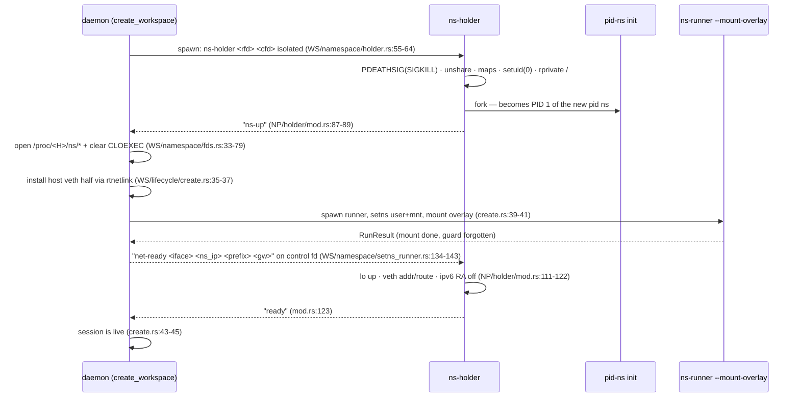
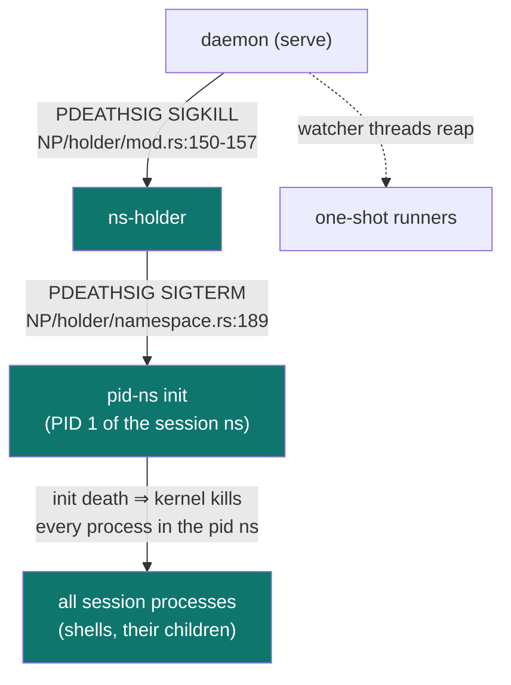

# Namespace processes: the holder, the runner, and the kill chain

> **Cluster 01 — Workspace runtime & storage, page 3 of 9.**
> Prev: [01 — LayerStack store](01-layerstack-store.md) ·
> Next: [03 — Overlay mount](03-overlay-mount.md)

## Why this page exists

Every namespaced thing this system does — mounting an overlay, running a
shell, editing a file in-session, live-remounting — happens inside processes
spawned from **one static binary re-executing itself**. This page explains
that process substrate without any storage semantics: who spawns whom, which
namespaces exist, how bytes cross process boundaries, and exactly what dies
when. Verified against the code on **2026-07-11**; citations are `path:line`
relative to the `ephemeral-sandbox` repo root; abbreviations:
`NP/` = `crates/sandbox-runtime/namespace-process/src/`,
`NE/` = `crates/sandbox-runtime/namespace-execution/src/`,
`WS/` = `crates/sandbox-runtime/workspace/src/`,
`OP/` = `crates/sandbox-runtime/operation/src/`,
`SD/` = `crates/sandbox-daemon/src/`.



*What to notice: like the store (page 01), this substrate is a root — it
depends on nothing else in the cluster. Sessions (04) compose the two; the
overlay (03) is mounted by a process from this page using paths from page 01.*

## Why single-threaded bodies exist

The whole architecture of re-exec'd process bodies follows from one kernel
rule, stated by the crate charter (`NP/lib.rs:1-6`):

> Single-threaded Linux namespace subprocess bodies for
> `sandbox-daemon ns-holder` and `sandbox-daemon ns-runner`.
>
> `unshare(CLONE_NEWUSER)` and `setns()` into a user namespace require a
> single-threaded caller. The daemon stays multithreaded and delegates those
> syscalls to this no-tokio crate.

So the daemon never unshares or setns-es itself. It re-executes
`current_exe` with a subcommand, and the dispatcher routes to the body
(`SD/main.rs:41-63`; arms `serve` / `ns-runner` / `ns-holder` / `gate-probe`
at `:50-53`). The dispatcher's one other job is preserving exit codes
(`SD/main.rs:22-30`):

> \# Exit-code contract (preserved through this dispatcher)
>
> The library errors carry exit codes that MUST survive to the process exit
> status; a blanket `anyhow` fallthrough would collapse them all to `1` and
> silently drop the contract. The dispatcher therefore maps known codes via
> [`std::process::exit`]:
> - ns-holder: `1` (control pipe closed), `2` (unexpected token) —
>   `sandbox_runtime_namespace_process::holder::NsHolderError::{CONTROL_CLOSED_EXIT,
>   UNEXPECTED_TOKEN_EXIT}`.

The four *personalities* (this cluster's term — the code says "subcommand"
and "subprocess bodies", see Corrections):

| Subcommand | Body | Argv contract | Stdio | Exit codes |
|---|---|---|---|---|
| `serve` | the multithreaded daemon | flags incl. `--config-yaml` (`SD/serve.rs:211-212`) | inherited | daemon lifecycle |
| `ns-holder` | `NP/holder/` — unshare, handshake, pause forever | `ns-holder <readiness_fd> <control_fd> <shared\|isolated>` (`SD/holder.rs:7-13`) | stdin/stdout null, **stderr piped** (`WS/namespace/holder.rs:60-62`) | `1` control pipe closed, `2` unexpected token (`SD/holder.rs:15-28`); otherwise 1 |
| `ns-runner` | `NP/runner/` via `SD/runner/mod.rs:16-29` | `ns-runner (--shell\|--mount-overlay\|--remount-overlay\|--file-op) --request-fd N --result-fd N` — exactly one mode flag (`SD/runner/mod.rs:73-136`, `:126-130`) | all null in request/result modes; all three = pty slave in shell mode (`NE/launcher.rs:131-134`) | `0` whenever a `RunResult` was written — **even for payload failures**; `1` for transport/decode/config errors, plus shell-mode setns/spawn failures (`SD/runner/shell.rs:3-7`), which the launcher synthesizes from the exit status |
| `gate-probe` | `NP/gate.rs` — fresh `unshare`, staged-switch witness | `gate-probe <scratch_root>` (`SD/gate_probe.rs:13-23`, `NP/gate.rs:25-59`) | all null (`NP/gate.rs:32-34`) | verdict **is** the exit code: 0 proven / 1 failed |

*What to notice: gate-probe is the odd one out — no pipes, no protocol, no
setns; it unshares its own fresh user+mnt namespaces (`NP/gate.rs:69-91`) and
answers with its exit status. Its job (proving live remount is safe on this
kernel) belongs to → page 08.*

## The holder: one process that *is* the session's namespaces

A holder exists so that namespaces outlive any individual command. Its whole
life (`NP/holder/mod.rs:127-148`):

1. **PDEATHSIG first.** Before anything else it arms
   `PR_SET_PDEATHSIG(SIGKILL)` (`:132`, impl `:153-157`), per the comment
   (`NP/holder/mod.rs:150-152`):

   > Holders provably die with the daemon: `PR_SET_PDEATHSIG(SIGKILL)` is the
   > holder's first act after exec, so the guarantee is kernel-enforced from
   > setup onward (the pid-ns init chains its own death signal to the holder).

2. **Unshare stack** (`NP/holder/namespace.rs:73-114`):
   `unshare(NEWUSER | NEWNS | NEWPID)`, plus `NEWNET` **only when isolated**
   (`:80-84`); `setgroups` = "deny" and single-entry self-maps
   `0 {parent_uid} 1` / `0 {parent_gid} 1` (`:85-93`); `setgid(0)`/`setuid(0)`
   (`:94-95`); `mount_change("/", PRIVATE | REC)` so nothing propagates back
   (`:96-100`). Root inside the userns *is* the daemon's uid outside — one
   mapped identity, namespace-scoped capabilities.
3. **The pid-ns init fork trick** (`NP/holder/namespace.rs:157-174`), quoted
   because it explains the `pid_for_children` file everyone else opens
   (`:162-165`):

   > SAFETY: The holder is a dedicated single-threaded process. `fork` is used
   > here to reproduce `unshare --pid --fork`: the first child becomes PID 1 in
   > the new PID namespace, which materializes `/proc/self/ns/pid_for_children`
   > for the parent holder to pin and later hand to ns-runner children.

   The init closes the inherited handshake fds, installs `_exit(0)` handlers
   for SIGTERM/SIGINT, arms its own `PDEATHSIG(SIGTERM)` (required re-arm —
   fork clears it), guards the race with `if getppid() == 1 { _exit(0) }`,
   and pauses (`:177-201`).
4. **Best-effort `mount --rbind /proc /proc`** — failure ignored
   (`namespace.rs:52-67`).
5. **Handshake** (below), then **pause forever** (`NP/holder/mod.rs:141-147`)
   — the holder never does work again; it just keeps namespaces alive.

Note which side of the pid fence each process is on: the *holder* is **not**
in the new pid namespace (unshare(NEWPID) only moves future children); the
init is PID 1 inside it. That is why both the holder (`namespace.rs:102,106`)
and the daemon (`WS/namespace/mod.rs:51`) open `ns/pid_for_children` — the
namespace the holder's *children* join — and never `ns/pid`. No comment in
the code states this rationale; the fork-trick SAFETY comment above is the
only written trace.

### The handshake: three tokens, work between each

Tokens are byte literals: `ns-up\n`, `net-ready` (prefix — the rest of the
line is payload), `ready\n` (`NP/holder/mod.rs:14-18`). The two holder→daemon
tokens go out with raw `libc::write` on the **readiness fd** passed in argv —
not stdout (`NP/holder/mod.rs:164-182`, `WS/namespace/holder.rs:56-59`); the
one daemon→holder token, `net-ready …`, is written to the **control fd**
(`WS/namespace/setns_runner.rs:134-143`, `WS/namespace/fds.rs:156-162`) and
read byte-wise by the holder (`NP/holder/mod.rs:91-109`).



*What to notice: the daemon does real work between tokens — ns-fd capture,
host-side veth, and the overlay mount all happen between `ns-up` and
`net-ready` (`WS/lifecycle/create.rs:23-45`). The `net-ready` line doubles as
config transport: interface, IP, prefix, gateway ride in the token
(`NP/holder/network.rs:19-35`).*

Two asymmetries worth pinning:

- **Shared-network sessions skip half the dance.** The holder only waits for
  `net-ready` when isolated (`NP/holder/mod.rs:137-139`); for shared it
  writes `ns-up` then `ready` immediately. But the daemon *reads* `ready`
  only on the isolated path (`expect_line`'s two callers:
  `WS/namespace/holder.rs:69` for `ns-up`,
  `WS/namespace/setns_runner.rs:144` for `ready`) — for shared sessions the
  `ready` token sits forever unread in the pipe.
- **Timeout/EOF/garbage all fold holder stderr into the error.**
  `expect_line` polls the nonblocking fd against the `setup_timeout_s`
  deadline (`WS/namespace/fds.rs:93-132`); on failure the daemon kills the
  holder, waits it, and returns `SetupFailed` with
  `"{step}; ns-holder {exit}; stderr: {…}"`
  (`WS/namespace/holder.rs:168-211`). An e2e exercises the path: a tiny
  `setup_timeout_s` deterministically fails create, asserting a
  "did not signal" / "timed out" substring; its docstring records the full
  "ns_holder did not signal ns-up" message
  (`e2e/config/test_daemon_reload.py:72,79-91`).

### ns-fd capture: fds that deliberately survive exec

Once `ns-up` arrives, the daemon opens the holder's namespace files and makes
them inheritable (`WS/namespace/fds.rs:33-79`):

| fd | Path opened | When present |
|---|---|---|
| user | `/proc/<holder>/ns/user` | always |
| mnt | `/proc/<holder>/ns/mnt` | always |
| pid | `/proc/<holder>/ns/pid_for_children` — *children's* ns, not the holder's | always |
| net | `/proc/<holder>/ns/net` | isolated only (`WS/namespace/mod.rs:76-87`) |

Each is opened then **permanently stripped of CLOEXEC**
(`open_inheritable_fd` → `clear_cloexec`, `fds.rs:58-62,76-79`) and stored as
a raw `i32` in `HolderNsFds` (`WS/session/state.rs:25-47`). That is the whole
trick by which runners join namespaces: the integers ride into every spawned
child across `fork`/`exec`, and the runner is told *which* integers via the
request JSON's `ns_fds` field (`NP/runner/protocol.rs:14-19,33`) — not argv,
not env. They are closed exactly once, at teardown
(`WS/lifecycle/destroy.rs:124-130`). The cost of this design is a real
fd-hygiene gap — see Corrections.

## The runner: re-exec, two pipes, one JSON each way

Runners are one-shot. The launcher builds the child
(`NE/launcher.rs:369-385`):

> ```rust
> let mut command = Command::new(env::current_exe().map_err(spawn_error)?);
> command.arg("ns-runner");
> if let Some(mode_flag) = mode_flag {
>     command.arg(mode_flag);
> }
> command
>     .arg("--request-fd")
>     .arg(request_fd.to_string())
>     .arg("--result-fd")
>     .arg(result_fd.to_string());
> ```

- **Pipes, asymmetric CLOEXEC** (`NE/launcher.rs:520-532`): request pipe —
  read end inheritable (the child's `--request-fd`), write end CLOEXEC
  (parent-only, so when the parent finishes writing and drops it, the child
  sees EOF); result pipe — read end CLOEXEC (parent-only), write end
  inheritable (the child's `--result-fd`, whose close-at-exit gives the
  parent EOF). The request is written **after** spawn, then the fd dropped
  (`:251-254,387-392`).
- **One global spawn lock.** `static SPAWN_CRITICAL_SECTION: Mutex<()>`
  (`NE/launcher.rs:118`) is held across pipe creation + `spawn()` + dropping
  the child-facing ends (`spawn_locked`, `:265-297`) — so the transient
  inheritable ends of one spawn cannot leak into a concurrently spawned
  sibling and break EOF framing.
- **EOF-framed one-shot JSON both ways.** DTOs at
  `NP/runner/protocol.rs:21-48`. The runner reads its request to EOF via
  `/proc/self/fd/N` (`SD/runner/mod.rs:139-157`), writes one `RunResult`,
  and exits (`:159-163`). In request/result modes the daemon drains the
  result on a separate thread *before* waiting the child
  (`NE/launcher.rs:315-338`; the shell/PTY mode instead waits, then reads —
  `:300-312`), per the comment (`:315-319`):

  > Wait on a request/result runner. The result fd is drained on a separate
  > thread that starts before the child wait, so a large payload cannot fill
  > the pipe and deadlock a child that blocks on the final write; the drain is
  > capped at the injected [`crate::ExecutionCaps::max_runner_result_bytes`].

  The cap defaults to 8 MiB (`NE/caps.rs:30`); reading continues past the cap
  (discarding) so the child never blocks (`:340-367`).
- **pgid leader.** A `pre_exec` hook calls `setpgid(0,0)`
  (`NE/launcher.rs:410-423`) — the runner leads its own process group, which
  is what every kill ladder below signals.
- **Best-effort cgroup placement**, quoted (`NE/launcher.rs:400-403`):

  > Best-effort placement of the freshly spawned `ns-runner` into the workspace
  > cgroup by writing its pid to the workspace `cgroup.procs`. Membership inherits
  > across the runner re-exec, fork/exec, and setns; a write failure never blocks
  > execution (cgroup accounting degrades to unavailable instead).

  This population is exactly what page 08's quiesce discovery later reads.

### The four payloads

Dispatch at `SD/runner/mod.rs:31-42`, kinds at `:59-65`:

| Flag | Body | Namespaces joined | Called by |
|---|---|---|---|
| `--shell` | `NP/runner/setns/shell.rs:4-10` → `shell_exec` | user→mnt→pid→net, in that fixed order, skipping absent fds (`NP/runner/setns/namespaces.rs:27-36`) | command engine (→ page 05) |
| `--mount-overlay` | `NP/runner/setns/mount_overlay.rs` — mount, then `mem::forget` the guard | user+mnt only (`namespaces.rs:13-25`) | `NamespaceRuntime::mount_overlay` (→ page 03) |
| `--file-op` | `NP/runner/setns/file_op.rs` — fd-relative NOFOLLOW ops | user+mnt only | `run_file_op` (→ page 06) |
| `--remount-overlay` | `NP/runner/setns/remount_overlay.rs` — "C3 steps 1–9 inside the holder namespaces" (`:1`) | user+mnt only | staged switch (→ page 08) |

Two facts about the order `user→mnt→pid→net`: it is enforced by construction
(`namespace_fd_order_with_types`, `namespaces.rs:31-34`, test-pinned at
`namespace-process/tests/unit/runner/setns.rs:5`), and **no comment explains
it** — the mechanical reason (joining the user namespace first grants the
namespace-scoped capabilities the later `setns` calls need) is nowhere
written in the code. Joining pid affects only future children, so the runner
itself stays visible in the host pid namespace — that is what lets the
launcher's kill ladder signal it.

The **mount mask** — a read-only tmpfs (`size=4k,mode=000`,
RDONLY|NOSUID|NODEV|NOEXEC) over each configured path
(`mask_model_shell_paths`, `NP/runner/mod.rs:53-93`; options `:74-75`), driven
by `runner.mount_mask.hidden_paths` (prod: `[/eos]`, `config/prd.yml:19-20`)
— hides the store, scratch, transcripts, and daemon socket from workload
view. Who applies it: the **mount-overlay body** masks right after mounting
(`NP/runner/setns/mount_overlay.rs:32`), and the **remount-overlay body**
lifts and restores the same masks around its switch
(`NP/runner/setns/remount_overlay.rs:195,206`, → page 08). The file-op and
shell bodies never call it — they *inherit* the mask already present in the
holder's mount namespace. Every runner **re-loads the daemon config itself**
and hard-fails without it: "`SANDBOX_DAEMON_CONFIG_YAML` is required for
ns-runner" (`SD/runner/mod.rs:44-49`); note the order — the result fd is
opened *after* config load (`SD/runner/mod.rs:22-24`), so a missing config
kills the runner before any JSON exists and the parent synthesizes an error
from the exit status (`NE/launcher.rs:438-452`).

**Exit-code truth for runners:** if a `RunResult` was written, the process
exits 0 — a *payload* failure is carried inside the JSON
(`exit_code: 1` + error payload from the mount/remount bodies;
"File-op outcomes use exit code 0; the launcher inspects the result payload,
not the exit code" — `SD/runner/file_op.rs` doc). The one quotable statement
of the principle (`WS/namespace/setns_runner.rs:51-55`):

> Launch the staged-switch remount runner in the session's namespaces
> (peer of [`Self::mount_overlay`], with the rewritten chain and the
> fresh sibling workdir overriding the entry): the raw runner
> [`RunResult`] comes back verbatim — its two-boolean report drives the
> caller's C5 policy, so exit codes are never mount failures.

## The kill chain: what dies when the daemon dies



*What to notice: every hop is kernel-enforced — no daemon cleanup code is on
the path. Runners don't need a hop: they are short-lived children the daemon
reaps directly (`NE/engine.rs:248-249`), and a shell runner's own death takes
its pgid down via the scope-kill ladder (→ page 05).*

This chain is why boot recovery can be so blunt. Both justifications, quoted:

> Boot cleanup, once, before serving: assert the kernel floor, reap every
> persisted session (each is provably dead — PDEATHSIG), then run the
> fail-closed storage sweep. Reap records are emitted before any sweep
> deletion record; both ride existing record names, so the feature's
> record budget stays at three.
> — `OP/services.rs:163-167`

> One reaped boot leftover: every persisted handle is a dead session
> (PDEATHSIG makes holders provably dead), so reap destroys its run dir and
> drops the record — no lease recreation, no liveness proof.
> — `WS/lifecycle/persistence.rs:66-68`

And it is e2e-proven: the boot-reap test records `pgrep -f ns-holder` pids,
`docker restart`s the sandbox, and asserts every holder pid is gone —
"holder {pid} outlived the daemon (PDEATHSIG failed)"
(`e2e/runtime/test_squash_remount.py:262,289-292`).

Deliberate teardown uses a softer ladder: `kill_holder` = SIGTERM → poll at
10 ms up to `exit_grace_s` (prod 0.25 s) → SIGKILL → wait
(`WS/namespace/holder.rs:109-124`); a holder pid recovered after daemon
restart is signal-only, never reaped (`:125-135`). The launcher's
setup-timeout ladder for stuck runners: SIGTERM to `-pid` and `pid` → 100 ms
grace → SIGKILL → wait (`NE/launcher.rs:454-479`). The in-shell ladders (scope
kill, pty cancel) belong to → page 05.

Zombie fine print: the pid-ns init's `Drop` sends SIGTERM and reaps with
`WNOHANG` only (`NP/holder/namespace.rs:38-49`), and the holder never
otherwise `wait()`s — an init that dies early stays a zombie inside the
holder until the holder itself dies. Harmless (the pid ns is already dead)
but visible in `ps`.

## Environment and facades

The env contract, complete:

| Variable | Set | Read | Note |
|---|---|---|---|
| `SANDBOX_DAEMON_CONFIG_YAML` | at serve start, in-process (`SD/serve.rs:35,374-376`) | hard-required by every runner (`SD/runner/mod.rs:44-49`) | children inherit it via exec |
| `SANDBOX_DAEMON_AUTH_TOKEN` | on the daemon's internal `--spawn` re-exec (`SD/serve.rs:363-366`); foreground argv deliberately omits `--auth-token` (`:280-313`, fallback parse `:256`) | serve arg parsing | **container-level exception:** the docker provider passes the token as argv (`crates/sandbox-provider-docker/src/launch.rs:43-44`) — visible in container `ps`; analysis → cluster 02 |
| `SANDBOX_DAEMON_SANDBOX_ID` | `SD/serve.rs:16,378-383` | **nothing in-repo** | see Corrections |

Callers never touch any of this directly; they use two facade layers:

- `NsRunnerLauncher` / `RunnerChild` (`NE/launcher.rs:47-87`) behind the
  engine's four methods — `run_shell_interactive`, `mount_overlay`,
  `remount_overlay`, `run_file_op` (`NE/engine.rs:91-220`), with defaults in
  `ExecutionCaps` (max_active 256, setup 30 s, result cap 8 MiB —
  `NE/caps.rs:22-32`).
- `NamespaceRuntime` (`WS/namespace/mod.rs:97-124`) — the workspace crate's
  bundle of holder spawn + ns fds + a *dedicated* mount engine capped at
  `MOUNT_MAX_ACTIVE = 64` (`WS/namespace/mod.rs:13`). This is one of **two**
  `NamespaceExecutionEngine`s in the daemon; the other runs commands
  (→ page 04 for the service graph).

## Corrections

- **"Fork" in `ForkRunnerLauncher` is historical.** There is no `fork()` in
  `NE/launcher.rs` — the only process creation is `Command::spawn`
  (`NE/launcher.rs:89-101,278`). The name predates the re-exec design.
- **Holder spawn happens outside the spawn lock.** `spawn_ns_holder`
  (`WS/namespace/holder.rs:36-92`) creates its handshake pipes and spawns
  without `SPAWN_CRITICAL_SECTION` (referenced only inside `NE/launcher.rs`
  — `:118,269,425-429`). Observed asymmetry, not documented intent: a holder
  spawned concurrently with a runner spawn can inherit that runner's
  momentarily-inheritable pipe ends — and holders live forever.
- **The fd-hygiene gap is real and permanent.** CLOEXEC is cleared once and
  never re-set (`WS/namespace/fds.rs:76-79`); there is no `close_range`, no
  fd-closing `pre_exec` (the only `pre_exec` on the daemon's spawn paths is
  the pgid hook, `NE/launcher.rs:410-423`; the runner's own shell-child spawn
  adds setpgid + security policy, `NP/runner/shell_exec.rs:91-104`).
  Consequence: the ns fds of **all** live sessions are inherited by every
  subsequently spawned runner and holder, until each session's destroy closes
  its four (`WS/lifecycle/destroy.rs:124-130`).
- **`SANDBOX_DAEMON_SANDBOX_ID` is write-only.** Set at
  `SD/serve.rs:378-383`; a repo-wide search finds no reader. The sandbox id
  that *is* consumed flows separately as `ServerConfig.sandbox_id`
  (`SD/serve.rs:47`).
- **"Personality" is doc-coinage.** The word appears nowhere in the code;
  the code says *subcommand* (`SD/main.rs:14-16`) and *subprocess bodies*
  (`NP/lib.rs:1-2`). This cluster keeps the term because it names the
  concept well — but grep for `ns-runner`, not "personality".
- **The setns ordering rationale is unwritten.** The `user→mnt→pid→net`
  order is load-bearing (user first grants the capabilities the rest need)
  and test-pinned, but no code comment says why
  (`NP/runner/setns/namespaces.rs:27-36`).
- **PDEATHSIG rests on an unstated credential assumption.** The holder arms
  it *before* `unshare`, the uid/gid map writes, and `setuid(0)`/`setgid(0)`
  (`NP/holder/mod.rs:132` vs `NP/holder/namespace.rs:84-95`), and never
  re-arms. `PDEATHSIG` clears on credential *change* — here the single-entry
  self-map makes ns-uid 0 resolve to the same kernel uid, so nothing
  actually changes and the tether survives. The pid-ns init *does* re-arm
  after fork (`namespace.rs:189`) because fork clears it. If the map design
  ever changes, this silent dependency breaks the kill chain.

## What this unlocks

Page 03 is one specific runner payload (`--mount-overlay`) examined
syscall-by-syscall; page 04 composes holder spawn + handshake + ns-fd capture
into session create/destroy and owns the *other* execution engine; page 05
runs the `--shell` payload under a PTY with the scope-kill ladder; page 06
uses `--file-op` for live-session file operations; page 08 sends
`--remount-overlay` and `gate-probe`, quiesces via the cgroup population
noted here, and trusts this page's kill chain for its crash story.
