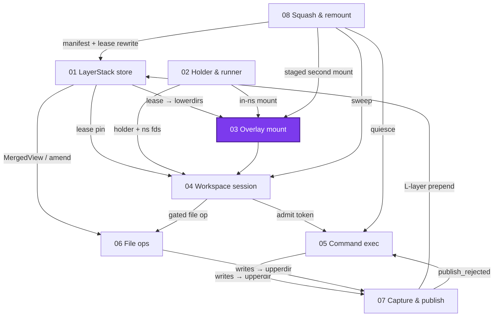
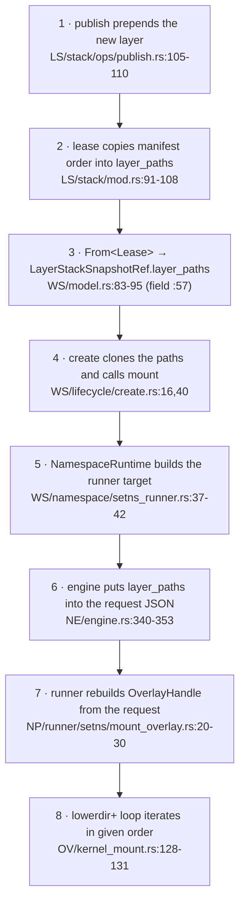

# Overlay mount: exactly one kernel object

> **Cluster 01 — Workspace runtime & storage, page 4 of 9.**
> Prev: [02 — Namespace processes](02-namespace-processes.md) ·
> Next: [04 — Workspace sessions](04-workspace-sessions.md)

## Why this page exists

Pages 01 and 02 meet here for the first time: a lease's `layer_paths`
(page 01) are mounted as overlayfs lowerdirs by a one-shot runner inside the
holder's namespaces (page 02). This page examines that single kernel object —
how it is assembled, in exactly what order, by whom, and how it *really* gets
torn down (mostly: it doesn't; the namespace dies). Verified 2026-07-11;
citations `path:line` from the repo root; abbreviations:
`OV/` = `crates/sandbox-runtime/overlay/src/`,
`NP/` = `crates/sandbox-runtime/namespace-process/src/`,
`NE/` = `crates/sandbox-runtime/namespace-execution/src/`,
`WS/` = `crates/sandbox-runtime/workspace/src/`,
`LS/` = `crates/sandbox-runtime/layerstack/src/`,
`OP/` = `crates/sandbox-runtime/operation/src/`,
`SD/` = `crates/sandbox-daemon/src/`.



*What to notice: two arrows in (lease paths from 01, in-ns execution from 02),
one arrow out (the mounted `/workspace` that sessions orchestrate). Page 08
returns with a second mount over the same upperdir.*

## The syscall sequence — and the complete option set

The crate's own invariant (`OV/lib.rs:3-6`):

> \# Invariant
>
> The overlay mount itself is built with the RAW new-mount API
> (`fsopen`/`fsconfig`/`fsmount`/`move_mount`) — NOT the `mount(8)` binary.

`mount_overlay` (`OV/kernel_mount.rs:120-155`) issues, in order:

| # | Syscall | Key / argument | Value | Anchor |
|---|---|---|---|---|
| 1 | `fsopen` | `"overlay"`, `FSOPEN_CLOEXEC` | — | `OV/kernel_mount.rs:126-127` |
| 2…N+1 | `fsconfig` SET_STRING | `lowerdir+` (once per layer) | `/proc/self/fd/N` magic path, iterated **newest-first** | `:128-131` |
| N+2 | `fsconfig` **SET_FLAG** | `userxattr` | — (a flag, not a string) | `:132` |
| N+3 | `fsconfig` SET_STRING | `upperdir` | **real path** | `:133-134` |
| N+4 | `fsconfig` SET_STRING | `workdir` | **real path** | `:135-136` |
| N+5 | `fsconfig_create` | — | — | `:137` |
| N+6 | `fsmount` | `FSMOUNT_CLOEXEC`, `MountAttrFlags::empty()` → read-write | — | `:138-143` |
| N+7 | `move_mount` | mount fd → `workspace_root`, `MOVE_MOUNT_F_EMPTY_PATH` | — | `:144-151` |

**Nothing else is set.** A grep of the whole overlay crate for `index=`,
`metacopy`, `redirect_dir`, `nfs_export`, `xino`, `uuid`, `volatile` finds
zero hits. What you *will* see in a live sandbox's mountinfo is the kernel
appending its own defaults — today's e2e witness records
`…upperdir=…/upper,workdir=…/work,redirect_dir=nofollow,uuid=on,userxattr`
(`e2e/manager/management/squash/test-reports/squash-20260711-091741/MED-03/witness-mountinfo.txt:1`)
— kernel-added, not ours. The same witness shows the permanent scar of the
magic-path trick: mountinfo records dangling `/proc/self/fd/N` strings of the
dead one-shot mounter; the real lower paths are unrecoverable from mountinfo.

Why upper/work are real paths while lowerdirs are fd paths
(`OV/kernel_mount.rs:111-114`):

> `fsconfig_create`, `fsmount`, and finally `move_mount` onto the real
> `workspace_root` (NOT a `/proc/self/fd` symlink — `move_mount(2)` rejects
> that as a destination, and overlayfs rejects fd-backed upper/work paths on
> common kernels).

And the ordering invariant that makes hop 8 of the chain below correct
(`OV/kernel_mount.rs:3-7`):

> The overlay is built with `fsopen`/`fsconfig`/`fsmount`/`move_mount` (NOT the
> `mount(8)` binary). Ordering invariant: the first
> `fsconfig(SET_STRING, "lowerdir+", path)` call is the highest-priority lower
> layer, so [`OverlayHandle::layer_paths`] is iterated in its given
> newest-first order.

### Validation and pinning, precisely

`ValidatedMountInputs::open` (`OV/kernel_mount.rs:243-299`) opens **all four
roles** — every lowerdir, upperdir, workdir, and the mountpoint — with
`RDONLY|DIRECTORY|NOFOLLOW|CLOEXEC` (`open_dir_no_follow`, `:323-331`) and
holds the fds through `move_mount`. The *asymmetry* is which strings the
kernel receives: lowerdirs are consumed via their fd magic paths (rename/swap
of the real path after open cannot redirect them), while upper/work/root are
re-resolved by the kernel from real paths. That asymmetry is pinned by the
test `mount_inputs_pin_only_lowerdirs_with_fd_paths`
(`crates/sandbox-runtime/overlay/tests/unit/kernel_mount.rs:4-24`).

Other input rules: `layer_paths` must be non-empty
(`InvalidMountInput("layer_paths must not be empty")`, `:247-251`); the
mountpoint must pre-exist and not be a symlink — it is never created
(`:260,303-320`; the gate probe restates it: "The production builder requires
the mountpoint to exist (it creates only upper/work)", `NP/gate.rs:107-108`);
upperdir/workdir are `create_dir_all`'d if missing (`:272-290`); and seven
substrings are rejected in any of the four roles — `,` `:` `\` `\n` `\r`
`\t` NUL (`reject_forbidden_chars`, `:370-381`, applied `:253-258`). There is
**no code cap on layer count**: the kernel's ~500-lowerdir stack limit
surfaces as raw `EINVAL`, proven by the over-cap e2e (a 500-lowerdir session
mounts; 501 fails create with an EINVAL-shaped mount-build error —
`e2e/manager/management/squash/helpers.py:1732-1813`).

Failure taxonomy: pre-syscall problems return
`OverlayError::InvalidMountInput`; each syscall failure returns
`OverlayError::MountSyscall { context, source }` with contexts like
`"fsconfig lowerdir+"`, `"fsmount"`, `"move_mount workspace_root"`
(`OV/lib.rs:31-59`). A partial mount cannot leak: `fsfd` and the mount fd are
owned fds, so a failed `move_mount` drops them and the kernel discards the
never-attached mount (`OV/kernel_mount.rs:126-151`).

## The 8-hop ordering chain

One property — *element 0 = newest layer = directly under the upperdir; the
base is always last* — travels through eight hops without ever being
re-validated:



*What to notice: hops 2–7 are pure plumbing — clone, convert, serialize,
deserialize. Only hop 1 constructs the order (page 01: constructed, never
validated) and only hop 8 gives it kernel meaning. Corrupting any middle hop
would silently reprioritize every file in the workspace.*

## upperdir and workdir: created early, reused across remount

The writable half lives in the session's run dir under the workspace scratch
root: `create_overlay_dirs` makes `run_dir/upper` and `run_dir/work` as
**siblings** — same filesystem by construction, as overlayfs requires
(`WS/overlay/dirs.rs:16-29`) — during create, *before the holder exists*
(`WS/lifecycle/create.rs:85-90` in `open()`, holder spawn later at `:24-26`).

The load-bearing subtlety for page 08, from the remount runner's own header
(`NP/runner/setns/remount_overlay.rs:3-4`):

> Build the NEW overlay at a staging point under the session run dir (same
> upperdir, fresh sibling workdir, production builder) inside the unmask

**The same upperdir carries across a live remount; only the workdir is
fresh** — a sibling named `work-remount-{id}` (`WS/lifecycle/remount.rs:253-256`),
swapped into the session record only after a verified switch (`:192`;
upperdir is never reassigned). Workdir emptiness is never checked, and never
needs to be, because a workdir is never reused. That same-upperdir
OLD/NEW coexistence is exactly the kernel behavior the boot gate proves
before any live remount is allowed (→ page 08).

## Who mounts: never the daemon

The daemon's own mount namespace never gains an overlay. The full path:

1. `create` calls `NamespaceRuntime::mount_overlay`
   (`WS/lifecycle/create.rs:40` → `WS/namespace/setns_runner.rs:25-49`),
2. which calls the *mount* engine (`NE/engine.rs:137-160`),
3. which spawns `ns-runner --mount-overlay` (`NE/launcher.rs:24`,
   dispatch `SD/runner/mod.rs:89` → `SD/runner/mount_overlay.rs:8-13`),
4. which joins the holder's **user+mnt only**
   (`NP/runner/setns/mount_overlay.rs:13`,
   `NP/runner/setns/namespaces.rs:13-25`),
5. mounts (`:31`), masks (`:32`), and then deliberately leaks the guard
   (`NP/runner/setns/mount_overlay.rs:33-36`):

> ```rust
> // The setns mount helper is a one-shot process. The mounted overlay must
> // outlive this helper and remain pinned by the target mount namespace until
> // isolated teardown, so the unmount-on-drop guard is deliberately leaked.
> std::mem::forget(guard);
> ```

After the forget, no userspace object owns the mount — the holder's mount
namespace pins it by kernel refcount, which is the whole teardown design
(below). A mount failure comes back as `RunResult { exit_code: 1 }` with
payload `"ns-runner setns overlay mount failed: {error}"`
(`SD/runner/mount_overlay.rs:20-27`) — the runner *process* still exits
cleanly (page 02's exit-code truth).

The **masks** applied at step 5: an empty tmpfs (`size=4k,mode=000`,
`MS_RDONLY|MS_NOSUID|MS_NODEV|MS_NOEXEC`) over each *existing*
`runner.mount_mask.hidden_paths` entry (missing paths are silently skipped,
`NP/runner/mod.rs:54-58`) — prod masks `/eos`
(`NP/runner/mod.rs:53-93`, `config/prd.yml:17-20`), hiding the store,
scratch, transcripts, and daemon socket from every workload. Note the masks
are *legacy-API* `libc::mount` tmpfs mounts (`NP/runner/mod.rs:53-80`) — the
"raw new API" invariant covers the overlay object only, and each hidden path
is a second, ordinary kernel mount object.

Where the mountpoint string comes from: `/workspace` is
`DEFAULT_CONTAINER_WORKSPACE_ROOT` in config
(`crates/sandbox-config/src/configs/manager.rs:137`), passed by the docker
provider as `--workspace-root` daemon argv
(`crates/sandbox-provider-docker/src/launch.rs:29-30`), parsed
required-and-absolute (`SD/serve.rs:214-216,248-253`), and threaded through
`WorkspaceEntry` → `NamespaceTarget` → request JSON to the runner
(`WS/model.rs:273-361`, `NE/engine.rs:343`).

## Unmount truths

| Path | What it does | Callers | Anchor |
|---|---|---|---|
| production teardown | **nobody unmounts** — holder killed ⇒ mount namespace dies ⇒ kernel drops the mount; destroy just kills, closes fds, removes the run dir | every session destroy | `WS/lifecycle/destroy.rs:28-75` (no unmount call in the file) |
| `OverlayMount::Drop` | best-effort peel: up to 64 plain `umount2(path, 0)`; EINVAL/ENOENT = done; **no** `MNT_DETACH` | never runs in production (guards are forgotten) | `OV/kernel_mount.rs:95-103,339-368` (`MAX_UNMOUNT_PEELS` `:34`) |
| `OverlayMount::unmount()` | consuming peel **with** per-iteration `MNT_DETACH` fallback; errors after 64 attempts | **zero callers** (see Corrections) | `OV/kernel_mount.rs:76-81,349-352` |
| `strict_unmount` | exactly one `umount2(path, 0)`; "`EBUSY` surfaces verbatim", no lazy fallback | remount runner + gate probe only | `OV/kernel_mount.rs:207-220`; used throughout the staged switch (e.g. `NP/runner/setns/remount_overlay.rs:90,161` — and at `:182` to lift the tmpfs *masks*, not an overlay), `NP/gate.rs:134,147` |
| `move_mountpoint` | atomic re-attach of a live mount via two pre-opened `O_PATH` fds — "masked or renamed paths cannot break a staged switch mid-flight" | remount runner + gate probe only | `OV/kernel_mount.rs:170-192`; used `remount_overlay.rs:126,145`, `NP/gate.rs:141,143` |

*What to notice: the answer to "who unmounts?" is "nobody — the namespace
dies", with exactly two exceptions, both belonging to page 08's staged-switch
protocol. `strict_unmount`'s EBUSY-verbatim contract is what makes the
protocol's "park" outcome detectable rather than papered over by a lazy
detach.*

Exactly three call sites invoke this crate's mount machinery: the mount
runner, the remount runner, and the gate probe
(`NP/runner/setns/mount_overlay.rs:31`,
`NP/runner/setns/remount_overlay.rs:75`, `NP/gate.rs:118,131`; plus
error-type plumbing at `NP/runner/mod.rs:26-46`). The workspace crate never
links the overlay crate — it reaches these syscalls only through the
`ns-runner` subprocess.

## Corrections

- **`OverlayMount::unmount()` has zero callers**, and its doc is stale
  (`OV/kernel_mount.rs:67-69`): "`Drop` remains best-effort for callers that
  only need cleanup, but audited runners use this consuming method so
  unmount duration/failure can be recorded in their result payload." No
  runner does; all three production sites `mem::forget` the guard. The only
  lazy-detach code in the crate is on this never-taken path.
- **`WS/overlay/tree.rs` is not a mount tree.** It is `TreeResourceStats`, a
  recursive walker (files/dirs/symlinks/bytes, 50,000-entry limit,
  truncation flag) used for upperdir stats at destroy
  (`WS/overlay/tree.rs:3-15`, `WS/lifecycle/destroy.rs:101`).
- **`allocate_overlay_writable_dirs` is production-dead.** Its only caller is
  its own unit test (`OV/lib.rs:71-93`,
  `overlay/tests/unit/writable_dirs.rs:8`); production uses
  `WS/overlay/dirs.rs`. Two allocators exist, one unused.
- **Non-Linux behavior is asymmetric.** The overlay crate returns
  `OverlayError::Unsupported` off-Linux (`OV/lib.rs:8-15`,
  `OV/kernel_mount.rs:162-168`), but `NamespaceRuntime::mount_overlay`
  silently returns `Ok(())` (`WS/namespace/setns_runner.rs:30-34`) — a
  dev-host "mount" succeeds doing nothing, while remount and file ops return
  `SetupFailed`. `cargo check`/unit parity, not a feature.
- **The boot kernel assert under-covers this page.** `assert_kernel_floor`
  checks Linux ≥ 5.8 only — chosen for `syncfs` error reporting
  (`OP/services.rs:244-256`) — but `userxattr` needs ≥ 5.11 and `lowerdir+`
  needs ≥ 6.8. Nothing else probes kernel features except the remount gate
  (which gates only remount). **The first session mount is the de-facto
  probe** for the mount feature set.
- **No comment explains the fd-pinning rationale.** Grep for TOCTOU finds
  nothing; the intent lives in the test name
  (`mount_inputs_pin_only_lowerdirs_with_fd_paths`) and, obliquely, in the
  `move_mountpoint`/`strict_unmount` docs about magic paths
  (`OV/kernel_mount.rs:170-172,209-211`).
- **Vocabulary trap:** `OverlayHandle` is a pure *input spec* (upperdir,
  workdir, layer_paths — no mountpoint field; `OV/kernel_mount.rs:40-48`);
  the live resource is `OverlayMount`. "lowerdir" never appears as a field —
  the code says `layer_paths`. And the mount magic-path formatter is
  implemented three separate times with no shared helper
  (`OV/kernel_mount.rs:334-336`, `NP/runner/setns/remount_overlay.rs:231-233`,
  `NP/gate.rs:176-179`).

## What this unlocks

Page 04 orchestrates this mount as one step of session create and never
touches it again until destroy kills the namespace. Page 05's commands and
page 06's file ops read and write *through* this mount, which is why every
byte they produce lands in the page-01 upperdir that page 07 captures. Page
08 builds a **second** overlay over the same upperdir, moves it onto
`/workspace` with `move_mountpoint`, and retires the old one with
`strict_unmount` — the two exceptional unmount paths this page catalogued.
