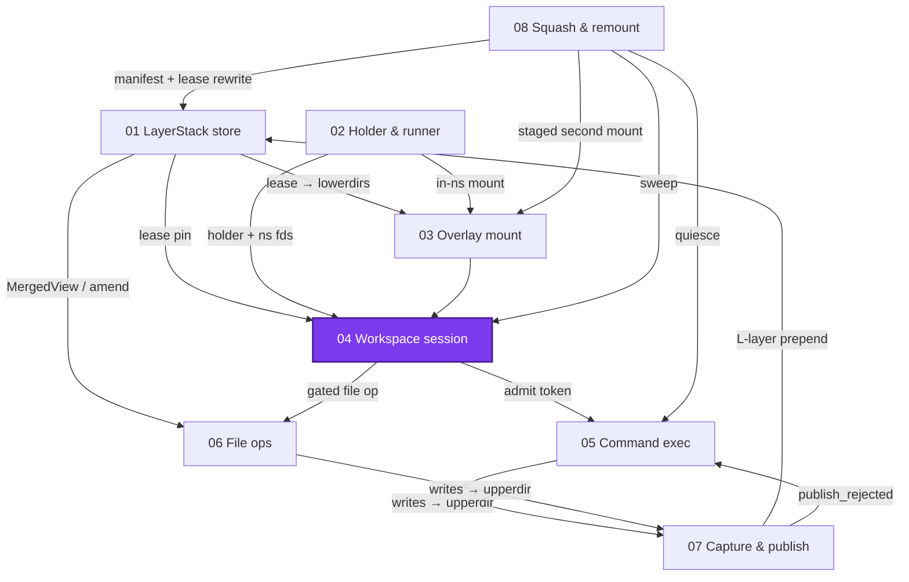
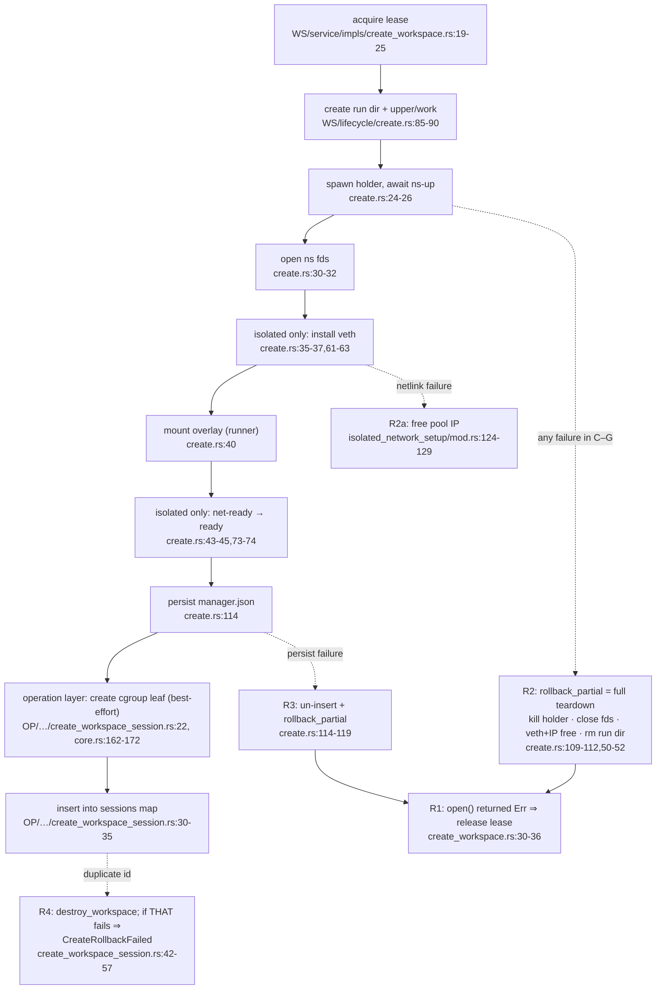
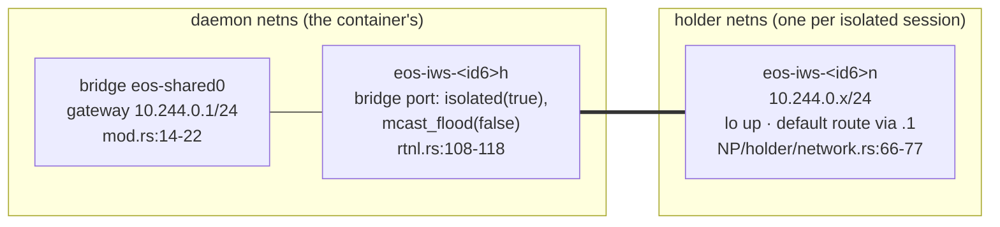

# Workspace sessions: the gate, the ledger, and the finalize machine

> **Cluster 01 — Workspace runtime & storage, page 5 of 9.**
> Prev: [03 — Overlay mount](03-overlay-mount.md) ·
> Next: [05 — Command execution](05-command-execution.md)

## Why this page exists

Pages 01–03 built the parts: a store that leases layer chains, a process
substrate that holds namespaces, a mount that composes them. A **workspace
session** is pure orchestration over those parts — every arrow in
create/destroy is a call into 01/02/03 — plus the two pieces of genuinely new
machinery this page owns: the **admission gate** (one serializer per session)
and the **finalize state machine** (what happens when the last command
completes). The design spec this layer was built against (§2.1–§2.7, the
F-rules) was deleted from the repo; it is restored at
[`recovered/finalize-policy-spec.md`](recovered/finalize-policy-spec.md), and
every `§2.x` the code still cites is quoted below with its anchor. Verified
2026-07-11; abbreviations: `WS/` = `crates/sandbox-runtime/workspace/src/`,
`OP/` = `crates/sandbox-runtime/operation/src/`,
`NE/` = `crates/sandbox-runtime/namespace-execution/src/`,
`NP/` = `crates/sandbox-runtime/namespace-process/src/`,
`SD/` = `crates/sandbox-daemon/src/`.



*What to notice: three arrows in (lease, holder+fds, mount), and every
outgoing arrow is a gate crossing — commands are admitted (05), file ops run
gated (06), the squash sweep runs per-session under the same gates (08).*

## Orientation: the service graph and boot order

Everything below lives inside services built once, in a fixed order, by the
composition root (`OP/services.rs:46-117`):

| # | Constructed | Anchor |
|---|---|---|
| 1 | `FileService::open` | `OP/services.rs:49-52` |
| 2 | `WorkspaceManager::new` → `WorkspaceRuntimeService::new` | `:53-65` |
| 3 | `ensure_workspace_base` (panics on failure) | `:70-84` |
| 4 | `detach_workspace_bind_after_base` (panics on real failure, → page 01) | `:85` |
| 5 | `LayerStackService::new` | `:86-95` |
| 6 | `WorkspaceSessionService::with_cgroup_root` | `:96-101` |
| 7 | `CommandOperationService::new` | `:102-113` |
| 8 | `boot_remove_export_spools` | `:114,147-161` |
| 9 | `boot_reap_then_sweep` — kernel floor ≥ 5.8, gate probe, reap, sweep | `:115,168-219` |

Two facts to carry out of this table. First, there are **two distinct
`NamespaceExecutionEngine`s**: the *mount* engine inside `NamespaceRuntime`,
capped at `MOUNT_MAX_ACTIVE = 64` (`WS/namespace/mod.rs:13,111-123`), and the
*command* engine, capped by config at 256
(`OP/command/service/core.rs:28-40`; default `OP/services.rs:353-361`). They
share nothing but the binary. Second, the reap-then-sweep pair is the entire
crash-recovery story (§ Persistence below).

## Create, with its rollback edges



*What to notice: the ladder has **four** rollback edges (plus the netlink
micro-rollback), not one per step — R2 is one big compensator for every
workspace-layer phase, and R1 wraps them all because the lease is acquired
before `open()` and released on any `open()` error. R4 is the only edge that
can itself fail loudly: a duplicate-id insert whose compensating destroy also
fails returns `CreateRollbackFailed { workspace_session_id, insert_error,
rollback_error }`
(`OP/workspace_session/service/impls/create_workspace_session.rs:47-51`,
`OP/workspace_session/error.rs:40`).*

Undo inventory per edge: **R1** releases the lease (page 01's GC may reclaim
layers). **R2** (`rollback_partial` → `teardown_handle`,
`WS/lifecycle/create.rs:50-52`, `WS/lifecycle/destroy.rs:28-75`) kills the
holder with a hardcoded 1.0 s grace, closes the ns/readiness/control fds,
deletes the host veth and frees the pool IP, and removes the run dir. **R3**
adds un-inserting the in-memory handle before R2's teardown. **R4** runs the
ordinary full destroy plus cgroup-leaf removal
(`create_workspace_session.rs:53-55`).

There is no end-to-end create deadline: `setup_timeout_s` (default 30 s,
`sandbox-config/src/configs/runtime.rs:179-198`) bounds holder readiness and
the net-ready handshake (`WS/session/manager.rs:83`,
`WS/lifecycle/create.rs:74`), but dir creation, netlink, and persist fsyncs
are unbounded.

## The gate and the ledger

One `Arc<Mutex<()>>` per session is the whole concurrency design
(`OP/workspace_session/service/core.rs:13-20`: `sessions` map + `gates` map).
The gate's doc comment is the layer's constitution — quoted in full
(`core.rs:49-57`):

> The per-session admission gate: the single serializer for command
> admission, completion, and finalization, session file ops, remounts,
> and guarded/faulty destroys. It does not serialize any public capture —
> capture exists only inside the finalize runner, which runs under the
> gate already held by the completing path. The gates map is locked only
> to clone or drop an Arc — never wait on a gate while holding a map
> (lock order: gate → sessions map → storage writer lock; the gates map
> may briefly take `sessions` inside [`Self::discard_resurrected_gate`],
> so nothing may take the gates map while holding `sessions`).

The **ledger** is the humblest data structure in the daemon:
`active_commands: BTreeSet<NamespaceExecutionId>` on `WorkspaceSession`
(`OP/workspace_session/service/model.rs:60-68`) — in-memory, never
persisted, entries are bare command ids. "Ledger" is comment vocabulary; no
type carries the name. Exactly one site adds (`admit_command_locked`,
`OP/…/impls/admission.rs:95`) and one removes (`complete_under_gate`,
`:188-227`).

Admission mechanics, in the code's own words:

- Proof-of-lock (`admission.rs:68-72`): "Admit one command into the session's
  ledger. The caller must already hold `gate`'s guard and keep holding it
  through transcript prep, launch, and attach (§2.3); `admission` is the
  proof-of-lock. A destroyed or finalizing session fails `not_found` and
  cleans the gates-map entry the lookup may have resurrected."
- The take-once slot (`admission.rs:15-18`): "Take-once slot shared between
  `exec_command`'s failure path and the engine `on_complete` closure; exactly
  one side takes the token and completes it (§2.3)."
- Token RAII (`admission.rs:29-32`): "RAII completion for one admitted
  command: dropping the token removes the command's ledger entry and runs the
  finalize policy when the ledger drained. Completion against a missing
  session or ledger entry is a silent no-op; the drop is panic-contained and
  never poisons the watcher."
- The silent-no-op rule, F5 (`admission.rs:146-149`): "Command-completion
  edge (token drop): locks the gate itself on the calling thread, removes the
  ledger entry, and runs the finalize policy when the ledger drained. A
  missing session or ledger entry is a silent no-op (§2.3 / F5)."
- Failure-path completion (`admission.rs:166-168`): "Completion for failure
  paths that already hold the admission guard (§2.3): consumes the token
  without re-locking the gate. The token's own drop is defused first, so
  unwinding cannot double-complete."
- The synchronous side door (`admission.rs:114-117`): "Resolve the session
  inside its admission gate and run `f` on the fresh handler while the gate
  is held. Synchronous file ops and remounts route through here: no ledger
  mutation, no finalization (§2.3 / F1), and no pre-gate stale handler."
  (`run_file_op` restates it: "Session file ops never publish, take no ledger
  entry, and never trigger the finalize policy" —
  `OP/…/impls/run_file_op.rs:9-15`; so does the remount sweep —
  `OP/…/impls/remount_session.rs:27-32`, § page 08.)

One subtlety earns its own paragraph: **resurrected gates.** `session_gate`
uses `entry(id).or_default()` (`core.rs:58-65`), so merely *asking* for a
dead id creates a gate. Every not-found path must therefore call
`discard_resurrected_gate`, whose rule is precise (`core.rs:74-78`):
"Gates-map hygiene (§2.3): a gate-then-resolve path that failed `not_found`
removes the gates-map entry it may have resurrected — only when the map entry
is still the same `Arc` and the sessions map has no entry for the id, so a
concurrently re-created session or a stuck `finalize_failed` session keeps
its gate." A test drives all five entry points against dead ids and asserts
the map stays empty
(`operation/tests/workspace_session.rs:511`).

## The finalize state machine

```mermaid
stateDiagram-v2
    [*] --> Active : create (model.rs:82)
    Active --> Finalizing : last ledger entry removed ∧ policy = PublishThenDestroy<br/>complete_under_gate, admission.rs:214-226
    Finalizing --> [*] : capture → publish → destroy OK<br/>finalize_session.rs:27-72 (entry removed)
    Finalizing --> FinalizeFailed : destroy failed<br/>finalize_session.rs:108-125
    Active --> [*] : guarded_destroy (ledger empty)<br/>guarded_destroy.rs:21-50
    FinalizeFailed --> [*] : guarded_destroy (recovery, §2.5)
    Finalizing --> [*] : guarded_destroy (stuck-finalizing recovery,<br/>model.rs:51-52)
    Active --> [*] : destroy_faulty_session (§2.6, ledger NOT checked;<br/>resolve_session has no state filter)<br/>remount_session.rs:99-119
```



*What to notice: there is no `Destroyed` state — success is map-entry
removal (`destroy_session.rs:61-63`). The enum is `FinalizationState
{ Active, Finalizing, FinalizeFailed }`
(`OP/workspace_session/service/model.rs:51-58`), and its doc already names
the only exit from the failure state: "`FinalizeFailed` and a session stuck
in `Finalizing` are destroyable through `guarded_destroy` only." Non-Active
states refuse new admissions (`admission.rs:89,133`).*

The transition into `Finalizing` is set by the *completion edge*, not by the
finalize runner: `complete_under_gate` flips state under the sessions lock,
then calls the runner with the lock dropped and the gate still held
(`admission.rs:214-226`). The runner itself is **infallible by construction**
— its observability-scope closure is typed `Result<(), std::convert::Infallible>`
(`finalize_session.rs:32`) and its doc says why
(`OP/…/impls/finalize_session.rs:19-26`):

> The `publish_then_destroy` policy runner … Runs under the admission gate
> held by the completing path and never holds the `sessions` map across
> capture, publish, or destroy I/O. Infallible: a rejected publish is
> surfaced via span status, the `finalize.publish_failed` event, and the
> completing command's outcome slot, and the destroy still proceeds; a
> failed destroy leaves the session `finalize_failed` for `guarded_destroy`
> recovery.

Concretely: a capture error becomes only a span attribute — the session's
changes are silently lost and destroy proceeds (`finalize_session.rs:60-62`,
see Corrections); a publish rejection is classified into a once-set slot
(§2.5, `model.rs:37-38`: "Publish outcome of a finalize run, surfaced on the
completing command's terminal response through a once-set slot stored at
attach (§2.5)") — note the slot lives on the **command's** exec value, not
the session (`OP/command/exec_value.rs:14-21`, § page 07 for the full chain);
and a destroy failure marks `FinalizeFailed` (`finalize_session.rs:115`).

### Implicit sessions

`FinalizePolicy` has two values and one setter worth quoting whole
(`OP/workspace_session/service/model.rs:8-16`):

> What happens when a command completion empties the session's command
> ledger. Fixed at creation; sessions created through the CLI are always
> `NoOp`, `PublishThenDestroy` is set only by `exec_command`'s implicit
> create.

`exec_command` without a `workspace_session_id` creates a Shared,
`PublishThenDestroy` session on the spot
(`OP/command/service/exec_command.rs:34-48`); with an id, the session keeps
its creation-time policy — there is no per-exec override. Pre-admission
failures clean up the implicit session under §2.4/F10
(`exec_command.rs:168-171`): "Pre-admission failure cleanup: destroy the
implicitly created session directly. If that destroy itself fails, the
original command error still surfaces and the destroy failure is recorded as
a `workspace_session.cleanup_failed` event (§2.4 / F10)."

### Destroy variants

| Variant | Gate | Ledger check | Reaches | Anchor |
|---|---|---|---|---|
| `guarded_destroy` — **the public operation** (`destroy_workspace_session` dispatches here, `OP/operations/registry/workspace_session_operations.rs:60-68`) | takes it | refuses `ActiveCommands` with the id list | any state incl. `FinalizeFailed`/stuck `Finalizing` | `OP/…/impls/guarded_destroy.rs:11-50` |
| `destroy_session` — low-level | **no** (callers hold it) | **none** | faulty destroy, implicit cleanup (the finalize runner uses `snapshot_for_destroy` + `destroy_snapshot` directly so it can absorb the error — `finalize_session.rs:103-107`) | `OP/…/impls/destroy_session.rs:22-31` |
| `destroy_faulty_session` | takes it | **deliberately skipped** (§2.6) | post-remount Faulty sessions | `OP/…/impls/remount_session.rs:99-119` |
| implicit cleanup (§2.4/F10) | held by exec | pre-admission, ledger untouched | failed implicit exec | `OP/command/service/exec_command.rs:168-196` |

The two §-numbered docs, verbatim. `guarded_destroy`
(`guarded_destroy.rs:11-15`):

> Guarded explicit destroy: hold the session admission gate, refuse while
> the command ledger is non-empty, otherwise snapshot-and-destroy without
> publishing regardless of policy. Sessions in `finalize_failed` or stuck
> `finalizing` state pass the ledger check and are destroyed — this is
> the recovery path for a failed finalize (§2.5).

`destroy_faulty_session` (`remount_session.rs:99-104`):

> Destroy a faulty session through the ordinary destroy path (still
> under its gate) and report the lease-release errors for the result
> line. The session's frozen tasks die with the namespace; the ledger is
> deliberately not checked — this is the one documented
> destroy-under-live-command path (§2.6), and a dead command's late
> completion no-ops against the missing session.

Shared plumbing: destroys snapshot state under a brief `sessions` lock so
"the lock is never held across the workspace teardown I/O (§2.3 hard rule)"
(`destroy_session.rs:13-14`); a failed raw destroy leaves the map entry and
gate intact — retryable (`destroy_session.rs:72`); on success the lease(s)
are released first, inside the workspace-layer destroy — main plus parked,
errors concatenated into `lease_release_error`
(`destroy_session.rs:59` → `WS/service/impls/destroy_workspace.rs:28-72`) —
then the map entry is removed, the gate dropped, and the cgroup leaf removed
(`destroy_session.rs:61-67`). `grace_s` flows from the
operation (`workspace_session_operations.rs:90-93`) down to `kill_holder`'s
SIGTERM→poll→SIGKILL ladder, defaulting to `exit_grace_s` = 0.25 s
(`WS/namespace/holder.rs:94-135`, `config/prd.yml`).

### Predicting the failure surface

| Failure point | What the caller sees |
|---|---|
| publish rejected during finalize | command's terminal response gains `publish_rejected` class (§2.5, → page 07); session destroyed |
| capture error during finalize | nothing — span attr only; session destroyed (Corrections) |
| destroy fails during finalize | session parked in `FinalizeFailed`; recover via `guarded_destroy` |
| implicit-create exec fails pre-admission | original error + `workspace_session.cleanup_failed` event if cleanup also failed — suppressed for a `NotFound` cleanup failure (§2.4/F10, `exec_command.rs:183-196`) |
| duplicate id at create | `insert_error`; or `CreateRollbackFailed` if the compensating destroy failed |

## Network modes

The axis, quoted from the type (`WS/model.rs:97-114`):

> Network boundary applied to a private mounted workspace.
>
> This selector encodes one axis only: whether the workspace shares the host
> network namespace or gets a dedicated, isolated one. Every workspace is
> otherwise isolated (private overlay plus mount/pid/user namespaces)
> regardless of this value. It does not encode lifecycle length, publication
> behavior, or a finalize policy; those decisions belong to the runtime or
> operation layer that owns the handle.

("Host" here means the daemon's netns — which, in a containerized
deployment, is the **container's** network namespace, never the machine host;
the daemon itself runs inside the container whose rootfs is `/eos`'s parent,
`OP/services.rs:225-227`.)

Isolated mode, one figure:



*What to notice: bridge-**port isolation** is the security mechanism —
isolated ports cannot talk to each other, only to the gateway — and it is
the one netlink step with **no tolerated error class**: every other step
forgives EEXIST/ENOENT-shaped errors, this one fails create on anything
(`WS/isolated_network_setup/rtnl.rs:108-118,140-152`). There is **no NAT, no
nftables, no forwarding** anywhere: the grep is clean, the `netfilter/` dir
is empty, and commit `d3c0538e1` ("Remove nft dependency from isolated
networking", 2026-06-30) is where it left.*

Mechanics: constants `BRIDGE_NAME = "eos-shared0"`, `GATEWAY = "10.244.0.1"`,
`VETH_PREFIX = "eos-iws-"`, `/24`, pool hosts 2..=254
(`WS/isolated_network_setup/mod.rs:14-24`); names are
`eos-iws-{first 6 id chars}h|n` (`:33-40`); the daemon does the host half on
a throwaway thread running a current-thread tokio runtime
(`WS/isolated_network_setup/rtnl.rs:10-30`), moves the `n` end into the
holder's netns by pid (`:80-93`), and the **holder** does the in-ns half
between `net-ready` and `ready` (`NP/holder/mod.rs:111-125`,
`NP/holder/network.rs:37-77`; → page 02 for the handshake). The IP pool is
in-memory (`mod.rs:42-63`) — 253 addresses is the de-facto isolated-session
cap, surfaced as `isolated_ip_pool_exhausted`; there is no other session
count limit anywhere. E2e proof of the peer-isolation contract: three
isolated sessions, distinct IPs, six cross-workspace requests all fail
(`e2e/runtime/network_isolation/test_network_isolation.py:88`).

`rfc1918_egress: deny` is accepted by config
(`OP/services.rs:448-462`) and rejected at create time, verbatim
(`WS/isolated_network_setup/mod.rs:95-103`):

> ```rust
> if self.rfc1918_egress == Rfc1918Egress::Deny {
>     return Err(WorkspaceManagerError::NetworkUnavailable(
>         "rfc1918_egress=deny requires packet filtering; no-install isolated networking supports workspace peer isolation only"
>             .to_owned(),
>     ));
> }
> ```

## Persistence and the boot reap

`manager.json` lives at `<scratch_root>/manager.json`, `schema_version: 1`,
written atomically (tmp → write+fsync → rename → dir fsync) on every handle
change (`WS/lifecycle/persistence.rs:10-63`). Per-record fields include
`workspace_handle_id`, `lease_id`, manifest version/root-hash, network
profile, dirs, `holder_pid`, veth names/IP (null for shared sessions), and
two timestamps (`:21-38`). Three traps:

- The run dir is persisted under the key **`scratch_dir`** (`:28`) — naming
  drift against the code's `run_dir`.
- `created_at`/`last_activity` use a **process-relative monotonic clock**
  (`WS/lifecycle/leases.rs:13-16`) — meaningless across restarts; and
  `last_activity` is write-only (set at create, never updated or read).
- `parked_lease_id` is deliberately absent, per its doc
  (`WS/session/state.rs:19-22`):

> The session's second lease when one exists: the OLD lease after an
> EBUSY-parked switch, or the NEW lease on a faulty remount. In-memory
> only — never persisted — and released by the ordinary destroy path.

Boot reap is correspondingly blunt (`WS/lifecycle/persistence.rs:66-68`):

> One reaped boot leftover: every persisted handle is a dead session
> (PDEATHSIG makes holders provably dead), so reap destroys its run dir and
> drops the record — no lease recreation, no liveness proof.

Per record it removes the run dir **only if contained**:
`run_dir.starts_with(scratch_root)` (`persistence.rs:102-104`), then rewrites
`manager.json` from the (empty at boot) in-memory map (`:111`); garbage JSON
is tolerated and reset (`:82-85`; test
`workspace/tests/unit/recover.rs:30,76`). Dead sessions' leases need no
release — they were RAM-only and the storage sweep that runs next handles
their layers (page 01). Finally, the squash sweep batches its persistence:
"collapsing the sweep's `Θ(M·N)` serialized handle rewrites + `2M` fsyncs
into one `Θ(N)` write"
(`WS/service/impls/remount_workspace.rs:50-53`, → page 08).

## §2.x concordance

Every `§`-citation in the session/command code, its anchor, and where this
page quotes it — the recovered spec resolves the numbers:

| Cite | Anchor | Quoted |
|---|---|---|
| gate charter + lock order (the §2.3 design, no literal `§` in this doc) | `OP/workspace_session/service/core.rs:49-57` | § gate |
| §2.3 gates-map hygiene | `core.rs:74-78` | § gate |
| §2.3 take-once slot | `admission.rs:15-18` | § gate |
| §2.3 caller-locks realization (`AdmittedCommand`: "What admission hands back to `exec_command` while the caller still holds the session admission gate (caller-locks realization of §2.3)") | `admission.rs:20-21` | this row |
| §2.3 proof-of-lock admission | `admission.rs:68-72` | § gate |
| §2.3 / F1 gated side door | `admission.rs:114-117` | § gate |
| §2.3 / F5 silent no-op completion | `admission.rs:146-149` | § gate |
| §2.3 failure-path completion | `admission.rs:166-168` | § gate |
| §2.3 exec failure path takes token | `OP/command/service/exec_command.rs:153-155` | § gate (paraphrased) |
| §2.3 hard rule (no lock across teardown I/O) | `destroy_session.rs:13-14` | § destroy variants |
| §2.3 / F1 remount skip + no finalize | `remount_session.rs:27-32` | § gate / page 08 |
| §2.4 / F10 implicit cleanup | `exec_command.rs:168-171` | § implicit sessions |
| §2.5 outcome slot at attach | `model.rs:37-38` | § finalize machine |
| §2.5 slot on the exec value | `OP/command/exec_value.rs:14-21` | § finalize machine |
| §2.5 guarded recovery | `guarded_destroy.rs:11-15` | § destroy variants |
| §2.6 destroy-under-live-command | `remount_session.rs:99-104` | § destroy variants |
| §2.6 id ≠ liveness promise | `OP/command/service/dto.rs:53-57` | → page 05/07 |

(No `§2.1`, `§2.2`, or `§2.7` citations exist in the code; the spec's §2.7
"known limits" — the workspace-crate state-lock ceiling — is acknowledged
only in the recovered document itself.)

## Corrections

- **Finalize capture error = silent data loss.** `finalize_session.rs:60-62`
  sets a `capture_error` span attribute and nothing else — no event, no log,
  no error status; the session's writes are gone and destroy proceeds.
  Whether that is contract or gap is an open maintainer question
  (SPEC-DRIFT + `SPEC.md` §8a).
- **`latest_snapshot`/`ReadonlySnapshotHandle` has no production caller.**
  Defined at `WS/service/impls/latest_snapshot.rs:7`, `WS/model.rs:447`;
  every call site is a test.
- **`Rfc1918Egress::Deny` makes isolated sessions *uncreatable*, not
  filtered** — validation errors at veth setup; shared sessions unaffected;
  and no test anywhere exercises the rejection.
- **Name traps:** the state enum is `FinalizationState`, not a "lifecycle"
  enum; the finalize outcome slot lives on the command's `CommandExecValue`,
  not on the session; "session" itself is three things in code (the OP
  registry entry, the WS `MountedWorkspace`, and command *sessions* — this
  cluster says "session" only for the first); and the public destroy op is
  `guarded_destroy` under the hood.
- **The SPEC's "R1–R6" rollback ladder is really R1–R4** (+ the netlink IP
  micro-rollback). Six distinct edges do not exist in today's code.
- **`CreateRollbackFailed` is untested** — the rollback-succeeds path has a
  test (`operation/tests/workspace_session.rs:99`); the rollback-fails
  variant is pinned only by its error type.

## What this unlocks

Page 05 runs inside the admission window this page defined — allocate, admit,
prep, launch, attach, all under one gate hold — and its watcher thread drops
the token that drives the finalize machine. Page 06's session route is
`with_gated_session` (F1: no ledger, no finalize). Page 07 is the body of
`finalize_session_snapshot` — capture → publish → destroy — and the
`publish_rejected` chain whose slot this page located. Page 08's sweep visits
every session under these same gates and parks the leases this page promised
never to persist.
