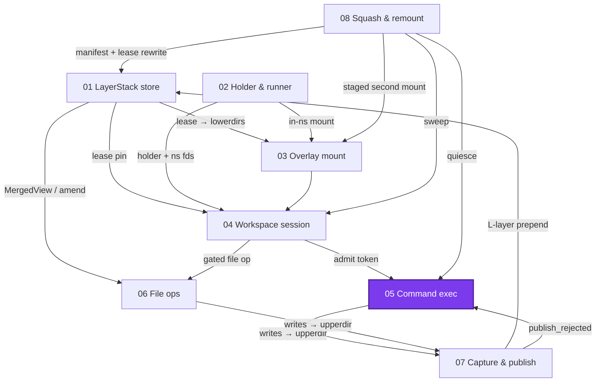

# Command execution: one exec_command, wire to terminal result

> **Cluster 01 — Workspace runtime & storage, page 6 of 9.**
> Prev: [04 — Workspace sessions](04-workspace-sessions.md) ·
> Next: [06 — File operations & blame](06-file-operations-and-blame.md)

## Why this page exists

`exec_command` is the operation users actually feel: it crosses every earlier
page — an implicit session (04), a `--shell` runner joining all four
namespaces (02), a cwd inside the overlay (03), writes destined for the
upperdir (01 → 07) — and adds the machinery this page owns: the PTY, the
transcript, the yield/poll surface, and the exit-code contract. One command
is traced end to end; every claim is anchored. Verified 2026-07-11;
abbreviations: `OP/` = `crates/sandbox-runtime/operation/src/`,
`NE/` = `crates/sandbox-runtime/namespace-execution/src/`,
`NP/` = `crates/sandbox-runtime/namespace-process/src/`,
`WS/` = `crates/sandbox-runtime/workspace/src/`,
`SD/` = `crates/sandbox-daemon/src/`.



*What to notice: both arrows into CMD come from page 04 (the admission
token) — and both arrows out are consequences of running: writes flow to
capture, and page 08's quiesce freezes what this page started.*

## End to end: the gate window and the four actors

```mermaid
sequenceDiagram
    participant OT as op thread (exec_command)
    participant EN as engine + launcher
    participant WA as watcher thread
    participant RN as ns-runner --shell
    participant SH as bash child

    OT->>OT: allocate id "namespace_execution_N" (exec_command.rs:50, NE/engine.rs:58-61)
    OT->>OT: lock session gate (exec_command.rs:53)
    OT->>OT: admit — ledger insert (:54-64, admission.rs:95)
    OT->>OT: create <scratch>/<id>/ + transcript path (:67-75, :198-208)
    OT->>EN: run_shell_interactive (:106-121)
    EN->>EN: try_reserve (cap 256, NE/registry.rs:59-69)
    EN->>EN: open PTY pair NOCTTY (NE/pty.rs:162-182)
    EN->>RN: spawn under SPAWN_CRITICAL_SECTION;<br/>pid → cgroup.procs (NE/launcher.rs:265-297,400-408)
    EN->>WA: spawn watcher (NE/engine.rs:237-274)
    OT->>OT: attach CommandExecValue (:135-146)
    OT->>OT: drop admission guard (:147)
    OT->>OT: yield — wait on promise (yield.rs:10-46)
    RN->>RN: setns user→mnt→pid→net (NP/runner/setns/shell.rs:8)
    RN->>SH: fork/exec bash --noprofile --norc -c<br/>pre_exec: setpgid + security policy (NP/runner/shell_exec.rs:91-104)
    SH-->>EN: bytes → pty master → reader thread → transcript.log (NE/pty.rs:118-160)
    SH->>RN: exits; scope-wait: root reaped ∧ no live pgid member (wait.rs:33-66)
    RN-->>WA: RunResult JSON via result fd
    WA->>WA: on_terminal (span) → finalize → token drop<br/>(ledger drain → maybe finalize policy, → page 04)
    WA->>WA: registry.complete — evict oldest terminal > 512 (registry.rs:100-107)
    WA->>OT: promise.resolve → yield wakes (engine.rs:272, yield.rs:44)
```

*What to notice: everything from gate lock to attach happens under one guard
— admit, transcript prep, launch, attach (§2.3, → page 04; the id allocation
at `:50` precedes the lock) — and the guard drops **before** the yield wait. The watcher's terminal order is
fixed: span finish → finalize (token drop) → registry complete → promise
resolve (`NE/engine.rs:248-273`), so when a yield wakes, finalize outcome and
registry state are already settled.*

Failure inside the window cleans up under the still-held guard: the
transcript dir is removed and the token completed without re-locking —
"Take the token from the slot and complete it under the held admission guard
(§2.3 failure path)" (`OP/command/service/exec_command.rs:122-133,153-155`).
The watcher is panic-proof: finalize runs under `catch_unwind`, a panic
becoming `NamespaceExecutionError::Finalize("finalize panicked: …")`
(`NE/engine.rs:277-288`).

## Yield and poll

`wait_for_command_yield` is condvar-based, not polling: it blocks on the
completion promise with the remaining deadline
(`OP/command/service/yield.rs:10-46`; `CompletionPromise` =
`Mutex<Option<…>> + Condvar`, `NE/promise.rs:16-70`), resolved exactly once
by the watcher (`NE/engine.rs:272`). Results are retained and peeked
non-consumingly — `CommandTerminalResult` is deliberately `Copy`: "`Copy` so
the non-consuming `resolved()` peek that serves terminal reads is trivial"
(`OP/command/contract.rs:36-43`, `NE/promise.rs:72-78`).

Output never repeats across *running* yields: a per-command **row cursor**
(`next_snapshot_offset: Cell<u64>`, `OP/command/exec_value.rs:62-68`) is read
and advanced on each running yield (`yield.rs:54-56`). Two asymmetries to
know:

- **Terminal reads do not advance the cursor** (`yield.rs:78-95` has no
  advance) — repeated terminal yields re-return the same remaining tail.
  Idempotent, not draining.
- `read_command_lines` ignores the cursor entirely — explicit `start_offset`
  paging with a clamped limit (`read_command_lines.rs:12-15`).

A terminal yield tells you when to page: on the `exec_command` path,
`command_session_id` is echoed on terminal responses exactly when the window
was truncated (`yield.rs:106-108`; stdin-write yields pass
`include_terminal_command_session_id = true` and always echo it,
`write_command_stdin.rs:62`), and `publish_rejected` appears on terminal
responses only (`OP/command/service/dto.rs:55-57`, → page 07 for the chain).

## The PTY and the transcript

The daemon owns the PTY: `openpt(RDWR|NOCTTY)` → `grantpt` → `unlockpt` →
`ioctl_tiocgptpeer` with the same NOCTTY flags (`NE/pty.rs:162-182`). Three
negative facts define the terminal experience, all grep-verified:

| Not done | Consequence | Evidence |
|---|---|---|
| no controlling terminal (`NOCTTY` both ends; zero `TIOCSCTTY`/`setsid` hits) | line-discipline `^C` cannot signal anyone — there is no foreground pgrp | `NE/pty.rs:163,171` |
| no `TIOCSWINSZ`, ever | programs see a 0×0/default winsize; TUIs misrender | grep: zero hits |
| no `tcsetattr`/`cfmakeraw` | default line discipline: **echo on**, canonical mode — the command's own input echoes into the transcript | grep: zero hits |

stdin, stdout, and stderr of the shell child are all clones of the one pty
slave (`NE/launcher.rs:130-134`) — **stdout and stderr are merged**;
`stream: "stderr"` can only appear via structured JSONL test rows, never from
the production PTY (`NE/transcript_rows.rs:205-220`).

The transcript is `<scratch>/<id>/transcript.log` under
`/eos/namespace_execution` (`exec_command.rs:198-208`,
`OP/command/contract.rs:24`), appended by one reader thread per command
(8192-byte buffer, blocking poll — `NE/pty.rs:136-160`), every line prefixed
by a UTC millisecond timestamp (`NE/pty.rs:245-256`). A real row looks like:

```text
[2026-06-18T01:02:03.004Z] first
```

(sample from `operation/tests/command_transcript_rows.rs:141-145`; readers
strip the prefix back off and re-expose rows as
`{"offset":0,"stream":"stdout","text":"first"}` —
`transcript_rows.rs:263-304`).

Reads are always a **tail window**: seek to `len − 1 MiB` (default
`max_transcript_window_bytes`, `NE/caps.rs:29`), align forward to a newline,
count everything before as `truncated_before`
(`NE/transcript_rows.rs:108-203`). Bytes beyond the cap stay on disk but
become unreachable through the API. Retention is separate: terminal entries
are capped at 512 — a caps/config default (`max_terminal_entries`,
`NE/caps.rs:28`, `sandbox-config/src/configs/runtime.rs:309-311`), **not** a
registry constant — and per the registry doc, "Marking an entry terminal
evicts the oldest terminal entry beyond `max_terminal`, dropping its value
(which closes the pty master fd and releases whatever the value's own `Drop`
owns)" (`NE/registry.rs:8-11,100-107`). That value `Drop` is what deletes the
transcript dir — eviction, engine teardown, but **not** session destroy
(`OP/command/exec_value.rs:94-100`; §2.5 doc `:14-21`; pinned by
`operation/tests/namespace_execution_registry.rs:67` and e2e EX-08, which
drains 520 commands against the 512 cap,
`e2e/runtime/workspace_session/test_exec_finalize.py:232`).

## Stdin, cancel, and the exit-code contract

`write_command_stdin` takes **no session gate** — it goes straight to the
engine value (`OP/command/service/write_command_stdin.rs:6-63`). Its kill
test is byte-containment, quoted whole because there is no doc comment:

> ```rust
> fn is_kill_input(stdin: &str) -> bool {
>     stdin.contains('\u{3}') || stdin.contains('\u{4}')
> }
> ```
> — `OP/command/service/write_command_stdin.rs:72-74`

ETX (`^C`) or EOT (`^D`) **anywhere** in the payload cancels the command
instead of delivering anything (`:38-45`) — so a literal Ctrl-C byte is
undeliverable, and Ctrl-D is a cancel, not an EOF. Delivered writes go
through a 2-second backpressure deadline
(`stdin_write_deadline`, `NE/caps.rs:27`) and then fail with
"stdin_backpressure: consumer is not draining its stdin"
(`NE/pty.rs:78-106,207-212`). Cancel is a fixed two-beat ladder:

> ```rust
> pub(crate) fn terminate_pgid(pgid: i32) {
>     signal_pgid_and_pid(pgid, Signal::SIGTERM);
>     thread::sleep(Duration::from_millis(100));
>     signal_pgid_and_pid(pgid, Signal::SIGKILL);
> }
> ```
> — `NE/pty.rs:184-189`

Completion is **pgid-scoped**, not process-scoped: the runner returns only
when the root child is reaped *and* no live non-zombie process remains in
the pgid (`NP/runner/shell_exec/wait.rs:33-66`; zombie filter `state != 'Z'`
`:177,207`). A backgrounded child keeps the command running.

| Exit code | Meaning | Produced at |
|---|---|---|
| 0 | clean exit | shell child, passed through (`NP/runner/shell_exec.rs:71-77`) |
| 130 | cancelled — the engine **overrides status and code even over a real clean exit** (`cancelled_outcome_overrides_status_and_exit_code`, `namespace-execution/tests/status.rs:50`); the runner also self-reports 130 on SIGTERM/SIGINT | `NE/shell.rs:51-61`; `NP/runner/shell_exec/wait.rs:16,56-59` |
| 124 | timeout (`timeout_ms` from the request; **no config default — no timeout means run forever**) | `NP/runner/shell_exec.rs:68`; deadline `wait.rs:136-140` |
| −signo | root killed by signal | `wait.rs:142-149` |
| 128 | runner-side fallback: no code, no signal | `wait.rs:148` |
| 1 | launcher-side synthesis when a dead runner left no valid JSON **and** the exit status carried neither a code nor a signal (a real code passes through; signal death yields −signo; exit 0 with no envelope is a `Completion` error instead) | `NE/launcher.rs:438-452` |

Command statuses are `running / ok / error / timed_out / cancelled`
(`CommandStatus`, `OP/command/service/dto.rs:27-46`; the engine-side
*terminal* enum has exactly the last four,
`NamespaceExecutionTerminalStatus`, `NE/shell.rs:9-15`) — not
"completed"/"failed".

## cgroups: placement here, discovery in page 08

The whole daemon-side story is best-effort by charter
(`SD/cgroup_setup.rs:1-7`):

> Daemon-side cgroup v2 root discovery and self-vacation.
>
> The daemon owns only the discovery of its delegated cgroup root `R` and the
> move of its own processes into `R/_daemon` so `R` can enable controllers for
> the per-workspace child cgroups the runtime creates. Everything here is
> best-effort: any failure yields `None` and cgroup accounting degrades to
> `cgroup_available = false` without ever blocking the daemon.

Chain: root discovered from `/proc/self/cgroup`, daemon vacated to
`R/_daemon`, `+cpu +memory` enabled (`SD/cgroup_setup.rs:18-67`) →
per-session leaf `R/workspace-<wsid>` created best-effort at session create
(`OP/workspace_session/service/core.rs:159-172`) → **the launcher writes each
runner pid into `cgroup.procs`** (`NE/launcher.rs:400-408`, path built at
`exec_command.rs:100-104`; unit-pinned by
`operation/tests/exec_command.rs:540`). Membership inherits across re-exec,
fork/exec, and setns — this population is exactly what page 08's quiesce
enumerates when it must freeze a session.

## The shell's world: cwd, env, and the security hooks

- **cwd is jailed to the overlay.** The engine always sends `cwd: "."`
  (`NE/engine.rs:321-323`); the runner lexically normalizes, requires
  containment in `workspace_root` ("cwd escapes workspace replacement
  root"), and `create_dir_all`s it (`NP/runner/shell_exec/request.rs:62-94`).
- **argv is fixed**: `bash --noprofile --norc -c <command>` (fallback
  `sh -c`); raw argv arrays are rejected (`request.rs:44-60`).
- **env is `env_clear()` + allowlist**: `PATH HOME USER LANG LC_ALL TERM TZ`
  plus 8 proxy variables (`request.rs:10-26`); request-supplied env is
  filtered against a 9-key RESTRICTED list (LD_*, DYLD_*, PATH, PYTHONPATH,
  BASH_ENV, ENV — `:111-121`); `GIT_OPTIONAL_LOCKS=0` always (`:152`); and
  PATH is force-prefixed, hardcoded (`request.rs:136-139`):

> ```rust
>     env.insert(
>         "PATH".to_owned(),
>         format!("/opt/miniconda3/envs/testbed/bin:/opt/miniconda3/bin:{suffix}"),
>     );
> ```

The security hooks apply to the **shell child only** — the holder, the
runner, and the pid-init keep full userns capabilities and no seccomp
(→ page 02). Inventory with anchors; analysis belongs to
`02-security-model/01`:

| Hook | Content | Anchor (`NP/runner/shell_security.rs`) |
|---|---|---|
| module charter | "Seccomp is a deny table … every other syscall is allowed"; filters prebuilt in the parent, installed in `pre_exec` before `execve` | `:1-7`; applied `NP/runner/shell_exec.rs:96-103` |
| mount family → EPERM | mount, umount2, pivot_root, move_mount, open_tree, fsopen, fsconfig, fsmount, fspick, mount_setattr | `:78-89` |
| namespace → EPERM | setns, unshare; plus `clone` with any `CLONE_NEW*` flag | `:91,63-72,253-272` |
| kernel/system → EPERM | init_module, finit_module, delete_module, kexec_load, kexec_file_load, reboot | `:93-100` |
| observability → EPERM | bpf, perf_event_open, userfaultfd, fanotify_init, io_uring_{setup,enter,register} | `:102-110` |
| keys/resource → EPERM | open_by_handle_at, add_key, request_key, keyctl, swapon, swapoff, quotactl | `:112-120` |
| device mknod guard | mknod/mknodat char+block (S_IFMT-masked) → EPERM | `:74-76,274-302` |
| clone3 | → ENOSYS (forces clone, where flags are inspectable) | `:220-228` |
| x32 ABI | → SECCOMP_RET_KILL_PROCESS | `:315-323` |
| no_new_privs | prctl before filters | `:328-332` |
| bounding set | 12 kept: CHOWN, DAC_OVERRIDE, DAC_READ_SEARCH, FOWNER, FSETID, SETUID, SETGID, SETFCAP, KILL, NET_BIND_SERVICE, NET_RAW, MKNOD | `:40-53,334-396` |

One more runner subtlety: the runner opens a `/proc` dirfd **before** the
mount mask is applied, "so scope-wait can still enumerate same-pgid
descendant processes if a custom config hides it"
(`NP/runner/shell_exec.rs:39-46`).

## Corrections

- **A literal Ctrl-C is undeliverable, twice over.** `is_kill_input`
  intercepts the byte, and even if delivered, no controlling terminal exists
  for the line discipline to translate it (`NOCTTY` both ends, zero
  `TIOCSCTTY` hits). Cancellation is the API's job, not the terminal's.
- **Not-found semantics diverge by operation.** `read_command_lines` on an
  unknown or evicted id fabricates a `status: ok` + empty-window response
  (`read_command_lines.rs:17-22,58-67`) while `write_command_stdin` and
  yield return `CommandNotFound` (`write_command_stdin.rs:25`,
  `yield.rs:21-23`).
- **`NamespaceExecutionError::Timeout` is never constructed.** Defined at
  `NE/error.rs:7`; the launcher's timeout path builds
  `Spawn(format!("ns-runner {mode_flag} timed out"))` instead
  (`NE/launcher.rs:510-512`). Dead variant.
- **The miniconda PATH prefix is hardcoded** for a `testbed` conda env
  (`request.rs:136-139`) — image-specific policy baked into the runner.
- **No boot reaper exists for orphaned command scratch dirs.** Boot cleans
  export spools only ("[t]he session boot reap is registry-driven and never
  walks scratch for unknown directories", `OP/services.rs:147-160`); a crash
  leaves `/eos/namespace_execution/<id>/` dirs behind forever.
- **Transcripts are never fsynced**, and a write error silently drops the
  sink — further output stops landing on disk while `output_len` (always
  read from file metadata for file-backed transcripts, `NE/pty.rs:111-113`)
  keeps reporting what made it (`:127-133`).
- **Word collision:** `original_token_count` in command output is an LLM
  token *estimate* (`ceil(chars/4)`, `OP/command/service/render.rs:40-46`) —
  unrelated to page 04's admission token.
- **"C6 / PTY physics" is spec vocabulary, not production code.** "PTY
  physics" has zero hits anywhere; "C6" survives only in a layerstack bench
  comment and the e2e's "C6 physics" notes
  (`layerstack/tests/occ_merge_bench.rs:7,938`,
  `e2e/runtime/test_squash_remount.py:16,220`). The C6 facts live in
  [`recovered/squash-spec.md`](recovered/squash-spec.md) and surface here as
  the NOCTTY/no-winsize/no-raw-mode table (and in page 08's
  `cwd_pinned_workspace` story).

## What this unlocks

Page 06 reuses this page's engine and caps for the *file-op* runner but pays
none of its ledger costs (F1). Page 07 begins where the watcher ends: the
token drop this page traced is the completion edge that drives
capture → publish, and `publish_rejected` lands on the terminal responses
described here. Page 08 freezes the processes this page placed into
`workspace-<id>` cgroups, and its C6 story — an interactive shell's cwd
pinning the workspace — is a direct consequence of this page's cwd jail.
