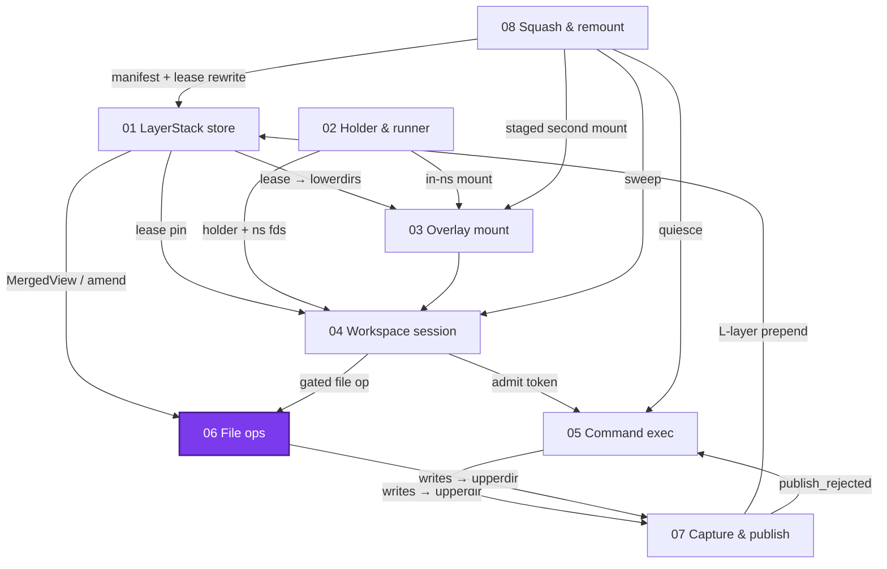
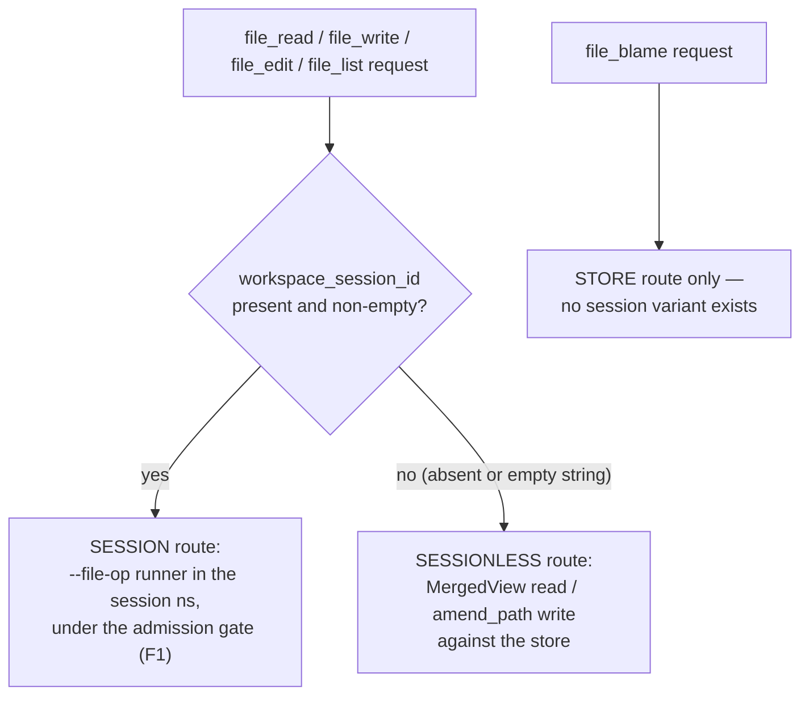
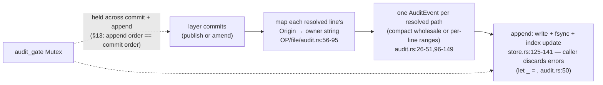

# File operations & blame: two routes, one owner per line

> **Cluster 01 — Workspace runtime & storage, page 7 of 9.**
> Prev: [05 — Command execution](05-command-execution.md) ·
> Next: [07 — Capture & publish](07-capture-and-publish.md)

## Why this page exists

There are exactly two ways to touch a file in this system — inside a live
session's namespace, or directly against the store — and one way to ask who
wrote any line of any published file. This page documents the routing
decision, the mechanics of all five operations on both routes, and the audit
pipeline that turns page 07's structural origins into opaque **owners**.

> **Numbering collision, restated deliberately:** the "C3 spec" this domain
> cites (`OP/file/audit.rs:1`, `OP/file/service/store.rs:1`,
> `OP/file/service/impls/blame.rs:1`) is **phase C3 of the OCC-merge-publish
> plan** — recovered at
> [`recovered/occ-merge-publish-c3-spec.md`](recovered/occ-merge-publish-c3-spec.md)
> (§7 stores, §9 attribution, §10 event schema, §11 blame, §13 commit path)
> — **not** remount step C3 (page 08's staged switch).

Verified 2026-07-11; abbreviations:
`OP/` = `crates/sandbox-runtime/operation/src/`,
`LS/` = `crates/sandbox-runtime/layerstack/src/`,
`NP/` = `crates/sandbox-runtime/namespace-process/src/`,
`WS/` = `crates/sandbox-runtime/workspace/src/`,
`SD/` = `crates/sandbox-daemon/src/`.



*What to notice: FIL has two incoming arrows — the gated session route (04)
and the store route (01) — and its session-route writes exit through the same
capture path as commands (07). Blame is the one facility with no arrow at
all: a pure read of its own store.*

## The routing decision



*What to notice: the decision is nothing but field presence — checked
per-op (`OP/file/service/impls/{read.rs:26, write.rs:32, edit.rs:34,
list.rs:34}`), with the empty string filtered to "absent" at dispatch
(`OP/operations/registry/file_operations.rs:182-189`).*

Two rules keep the session route honest:

- **Pre-gate resolve is path-mapping only.** The op maps `path` to a
  workspace-relative `LayerPath` before the gate, but "The handler is
  resolved fresh inside the session's admission gate by
  [`WorkspaceSessionService::run_file_op`]; only the session id crosses"
  (`OP/file/service/namespace.rs:31-34`).
- **Session ops are free of session lifecycle**, per the doc quoted in
  page 04: "Session file ops never publish, take no ledger entry, and never
  trigger the finalize policy" (`OP/workspace_session/service/impls/run_file_op.rs:9-14`,
  §2.3/F1).

Route support (`OP/operations/registry/file_operations.rs:20-32`,
`SD/http/router.rs:21-22`):

| Op | Session route | Sessionless route | Surface |
|---|---|---|---|
| `file_read` | ✓ | ✓ | RPC, public catalog |
| `file_write` | ✓ | ✓ | RPC, public catalog |
| `file_edit` | ✓ | ✓ | RPC, public catalog |
| `file_list` | ✓ | ✓ | **HTTP-only**: `POST /files/list` on the daemon's unauthenticated loopback listener; no public catalog spec (`spec: None`), and the manager's RPC route refuses it — "file_list is available only through daemon HTTP" (`crates/sandbox-manager/src/router/dispatch.rs:27-32`) |
| `file_blame` | — | store only | RPC, public catalog; its args are `path` only — a client-side `workspace_session_id` is rejected as an unknown argument |

## The 5×2 matrix: who executes, under what, owning what

| Op × route | Executor | Lock / gate | Publishes? | Owner |
|---|---|---|---|---|
| read · session | `--file-op` runner, `ReadWindow` (`OP/file/service/impls/read.rs:39-49` → `NP/runner/setns/file_op.rs:104-135`) | admission gate | no | — |
| read · sessionless | `MergedView::read_classified` (`OP/layerstack/service/impls/read.rs:19-62`, `LS/stack/file_read.rs:56-65`) | shared writer lock | no | — |
| write · session | runner `Write`: tmp `.<name>.tmp.<pid>` + `fchmod` (mode preserved) + rename + parent fsync (`NP/runner/setns/file_op.rs:165-209`) | admission gate | **no** — attributed at finalize | deferred → `workspace_session:<id>` |
| write · sessionless | `amend_path` RMW (`OP/file/service/impls/write.rs:71-87` → `OP/layerstack/service/impls/amend.rs:21-51` → `LS/stack/file_read.rs:75-131`) | **exclusive** writer lock + `audit_gate` | yes, one `L*` layer | `operation:<request_id>` |
| edit · session | **two separately-gated runner ops**: `ReadFile` (≤ 4 MiB) → in-process `apply_edits` → `Write` (`OP/file/service/impls/edit.rs:43-78`) | admission gate ×2, released between — a lost-update window | no | deferred |
| edit · sessionless | `amend_path` RMW (`edit.rs:96-132`) | exclusive writer lock + `audit_gate` | yes, one `L*` layer | `operation:<request_id>` |
| list · session | runner `ListDir` (`list.rs:43-57`, `NP/runner/setns/file_op.rs:50-102`) | admission gate | no | — |
| list · sessionless | `MergedView::list_dir` (`list.rs:78`, `LS/stack/dir_list.rs:57-62`, `LS/stack/projection/mod.rs:185-229`) | shared writer lock | no | — |
| blame · store | `FileAuditabilityStore::latest` + tiling (`OP/file/service/impls/blame.rs:17-24`) | store index mutex only | no | reads owners verbatim |

Per-op mechanics worth spelling out:

- **The session runner never follows symlinks in user paths.** Fd-relative
  walk from the workspace root (the trusted root anchor itself is opened
  without NOFOLLOW, `NP/runner/setns/file_op.rs:225-232`); every *component
  under it* is opened `RDONLY|DIRECTORY|NOFOLLOW|CLOEXEC`; `ELOOP`
  classifies as symlink, leaf `statat(SYMLINK_NOFOLLOW)`, leaf open
  `NOFOLLOW` (`:238-306`). The sessionless route classifies symlinks without
  following, too (`LS/stack/projection/mod.rs:142-147`). No route
  dereferences a symlink in a workspace-relative component — e2e-pinned
  (`e2e/runtime/file/smoke/test_session_only_linux.py:55,82,103`).
- **Edit conflict detection is exact-string matching, not hashing**
  (`OP/file/service/support.rs:58-116`): normalize line endings on both
  sides, then `matches(old_string).count()` — 0 ⇒ `EditNotFound`, >1 without
  `replace_all` ⇒ `EditNotUnique`, net no-op ⇒ `NoChanges`; the original
  line ending — detected from the file's *first* line break, not by
  majority, despite the code doc saying "dominant" — is restored on output
  (`:136-162`, doc `:75`).
- **Sessionless edit/write cannot conflict at all**, per the module header
  (`LS/stack/file_read.rs:1-7`):

> Classified single-path reads of the active manifest, plus `amend_path`: the
> atomic read-modify-write that sessionless file write/edit publish through.
>
> `amend_path` holds the storage **exclusive writer lock** across read →
> transform → resolve → commit, so head cannot move between the read and the
> commit. Because the publish base is that same head, the three-way merge never
> runs and no source/manifest conflict can occur — there is nothing to retry.

  Eight concurrent sessionless writers serialize without a lost update
  (`operation/tests/file_operations.rs:406`); the *session* edit, by
  contrast, deliberately accepts its read-to-write window (`:809`).
- **Reads window in memory.** Both routes load the whole file and cap only
  the selected output — "a large file is never rejected for its total size"
  (`OP/layerstack/service/impls/read.rs:13-16`; runner
  `NP/runner/setns/file_op.rs:120`). `truncated` means "more lines remain",
  never "cap hit" — cap-hit is the `OutputTooLarge` fault.
- **List is one level, capped, whiteout-masked**: `.wh.*` and kernel
  whiteouts become hidden names (`LS/stack/projection/mod.rs:345-356`);
  `.wh..wh..opq` cuts the lower-layer chain (`:223`, reads `:302`); cap 2000
  with `truncated: bool`.

## Owner grammar and the boundary law

The grammar is documented in exactly one place — the catalog's blame
description (`crates/sandbox-operations/catalog/src/runtime/file.rs:40`):

> Return each line's owner for a published path, tiling the whole file from
> the latest auditability event. The owner is an opaque string
> (workspace_session:<id> | operation:<id> | original | unknown).

| Owner form | Minted by | Anchor |
|---|---|---|
| `workspace_session:<id>` | finalize publish (→ page 07) | `OP/workspace_session/service/impls/finalize_session.rs:99` |
| `operation:<request_id>` | sessionless write / edit (the *protocol* request id, not a caller arg) | `OP/file/service/impls/write.rs:71`, `edit.rs:96` |
| `original` | audit resolution: no event exists yet for the path | `OP/file/audit.rs:15,77-85` |
| `unknown` | audit resolution: a line the latest event doesn't cover (e.g. after a dropped append) | `OP/file/audit.rs:16,77-85` |

The **boundary law**, from both sides of the boundary:

> The bytes a publish commits plus, per resolved path, each final line's
> structural [`Origin`]. The owner is **not** here (boundary law): the runtime
> above layerstack maps origin to an owner string after the layer commits.
> — `LS/stack/publish/model.rs:12-14`

> One run of consecutive lines that share an owner. `owner` is opaque — the
> `file` domain never parses `workspace_session:` / `operation:` / `original`.
> — `OP/file/service/core.rs:16-17`

Layerstack computes *structure* (`Origin::Command` = this publish wrote it;
`Origin::Active(i)` = inherited from line *i* of the previous content,
0-based — `LS/stack/publish/merge.rs:18-21`); the file domain mints *owners*
and converts to 1-based audit lines (`OP/file/audit.rs:67` — an off-by-one
trap if you read both layers).

## The audit pipeline



*What to notice: the gate spans both boxes. Both §13 comments, verbatim —
publish: "Serialize the commit with the audit append so two publishes to one
path append in commit order (latest-event-wins stays correct, §13)"
(`OP/layerstack/service/impls/publish_changes.rs:44-45`); amend: "Serialize
the commit with the audit append so amend and publish commits to one path
append their audit events in commit order (§13)"
(`OP/layerstack/service/impls/amend.rs:34-35`). And G3: "After the layer
commits: map each resolved line's origin to an owner string and append one
audit event per path (G3 — never before commit)"
(`publish_changes.rs:69-70`).*

Append is deliberately best-effort: "Never fails the publish: a dropped
event reconciles to `unknown` on the next open (the merged bytes cannot
reconstruct origin)" (`OP/file/audit.rs:24-25`; the call is `let _ =` at
`:50`). "Reconcile" is comment vocabulary only — the mechanism is simply
`active_owner` returning `unknown` for uncovered lines.

The store itself (`OP/file/service/store.rs`): NDJSON segments named
`file_auditability_<seq>.ndjson` at
`<layer_stack_root>/../storage/file_auditability` — "the only root this
crate can reach from `config.workspace.layer_stack_root`" (C3 spec §7.1,
`OP/services.rs:323-332`) — replayed eagerly at boot in `<seq>` order,
**latest line per path wins** (`store.rs:98-123`); appends fsync per event
(`:135`). Events carry owners plus a `content_digest`
(`sha256:` of the committed bytes) that "ties it to the bytes for reconcile
only (blame never reads it)" (`store.rs:28-30`) — no timestamps, no request
ids, no line content; ordering is purely append order under the gate. A real
event, from the spec-§11 example the tests preserve
(`operation/tests/file_blame.rs:43-47`; stored as one NDJSON line, wrapped
here for width):

```json
{"path":"README.md","line_count":4,"default_owner":"original",
 "owner_ranges":[{"start_line":2,"line_count":1,"owner":"workspace_session:ws-7"},
                 {"start_line":4,"line_count":1,"owner":"workspace_session:ws-7"}],
 "content_digest":"sha256:abc"}
```

Which changes get audited (`LS/stack/publish/resolve.rs:52-77`): only writes
produce origin entries — **deletes append no audit event** (blame survives
`rm`; e2e `test_blame_survives_deletion`,
`e2e/runtime/file/correctness/test_correctness_sessionless.py:500`);
gitignored-route and binary writes get a wholesale event with
`line_count: 1` (`OP/file/audit.rs:34-41`).

## Blame

The whole module doc (`OP/file/service/impls/blame.rs:1-4`):

> `blame` (C3 spec §11/§11.1): a **pure store read** — no mount, no layerstack
> read, no live digest check. The latest audit event for a path is tiled over
> `[1..=line_count]` from `default_owner` + sparse `owner_ranges`, coalescing
> equal-owner neighbours.

Tiling: fill with `default_owner`, overlay the sparse ranges, coalesce
equal-owner runs (`blame.rs:27-56`; out-of-bounds ranges silently clipped
`:33-38`). Two structural consequences:

- **Blame survives squash by construction.** The store is path-keyed, its
  only writer is `record_layer_publish` ("This is the only place owner
  strings are minted", `OP/file/audit.rs:1-5`), and the layerstack crate —
  where squash lives — has zero references to it. Compaction cannot touch
  provenance.
- **`default_owner` is a compression artifact**, chosen as the
  *most-covering* owner with the rest as sparse ranges
  (`audit.rs:118-149`) — it is not "the publisher".

A never-published path answers `not_found` with "no auditability record for
path: {path}" (`OP/operations/registry/file_operations.rs:62-67`).

## Limits

| Limit | Value (default) | Site |
|---|---|---|
| read window lines | `read_lines_default` 2000; dispatch-hardcoded ceiling `READ_LIMIT_MAX = 2000` ("limit must be between 1 and 2000") | `OP/services.rs:366-382`, `OP/operations/registry/file_operations.rs:18,153-154` |
| read output bytes | `max_output_bytes` 256 KiB → `OutputTooLarge` | `OP/services.rs:369`; runner check `NP/runner/setns/file_op.rs:122-123` |
| edit file size | `max_edit_bytes` 4 MiB → `FileTooLarge` | `OP/services.rs:371`; `edit.rs:49,100-124` |
| list entries | `max_list_entries` 2000 + `truncated` flag | `OP/services.rs:373`; `NP/runner/setns/file_op.rs:77-79` |
| session write content | **no per-op cap** — bounded only by the transport request limit (`daemon.server.max_request_bytes`, enforced on the RPC connection; the HTTP twin guards `/files/list`) | `SD/rpc/connection.rs:76-86`, `SD/http/api.rs:22-59` |
| sessionless overwrite | classify-only read (`max_bytes 0`) — an arbitrarily large existing file can be overwritten | `write.rs:74`, `LS/stack/projection/mod.rs:150-155` |
| runner result envelope | `max_runner_result_bytes` 8 MiB (drain discards past cap) | `OP/services.rs:425,435`; `NE` launcher drain (→ page 02) |
| merge eligibility | `MERGE_MAX_BYTES` 8 MiB (→ page 07) | `LS/stack/publish/merge.rs:13` |

(The four `runtime.file.*` caps and `max_runner_result_bytes` moved into
typed config on 2026-07-10, commit `c02181c39` —
`sandbox-config/src/configs/runtime.rs:87-125`; `READ_LIMIT_MAX`,
`MERGE_MAX_BYTES`, and the transport bound stayed where the table says.)

## Corrections

- **The domain's own module doc is stale.** Verbatim (`OP/file/mod.rs:1-5`):

  > The `file` runtime operation domain.
  >
  > Phase 1 ships `blame`: a pure read over the append-only file-auditability log
  > (the C3 spec §7 store) that returns each line's owner as an opaque string.
  > `read`/`write`/`edit` plug into the same [`FileService`] and store later.

  Reality: read, write, edit, **and list** are all implemented
  (`OP/file/service/impls/`); the doc predates them and never mentions list.
- **Blame reflects the last *published* content only.** Live session writes
  are invisible until finalize — unit-pinned
  (`operation/tests/file_operations.rs:751-778`: after a session write,
  sessionless read is `NotFound` and blame errors) and e2e-pinned
  (`test_live_session_changes_are_invisible_to_blame`).
- **A missing `content` argument silently writes an empty file.** The
  catalog declares `content` required, but dispatch reads
  `optional_string("content")?.unwrap_or_default()`
  (`OP/operations/registry/file_operations.rs:167`).
- **Error-kind asymmetry:** an invalid path is `not_found` for blame but
  `invalid_request` for read/write/edit
  (`file_operations.rs:50-67,262-272`). And unknown/evicted-command asymmetries from
  page 05 have a cousin here: session-route ops against a destroyed session
  are `not_found` via the gate, not a special class.
- **The store never rotates.** Only `file_auditability_0.ndjson` is ever
  written (`ACTIVE_SEGMENT`, `store.rs:18`); segment sorting is lexical
  (`:164`) — a latent multi-digit trap; replay is eager at boot and panics
  the daemon on store-open failure (`OP/services.rs:49-52`).
- **Parity by copy:** the window/normalize/split helpers are duplicated
  verbatim between the sessionless and runner backends
  (`OP/layerstack/service/impls/read.rs:119-162` vs
  `NP/runner/setns/file_op.rs:405-448`) — drift risk to watch.
- **Encoding:** read/edit reject non-UTF-8 (`NotUtf8`); `file_write` takes a
  `String`, so binary writes are impossible through this API; blame reports
  binary files as one wholesale range.

## What this unlocks

Page 07 is the other half of every row above: the capture that turns session
writes into a layer, the resolve step that emits the owner-free `Origin`s
this page mapped, and the amend/publish transactions whose commit order the
`audit_gate` mirrors into the store. Page 08 can now be read with the
guarantee that nothing it compacts — squash, substitution, sweep — can alter
a single blame answer, because provenance lives in a store the layerstack
crate cannot even name.
