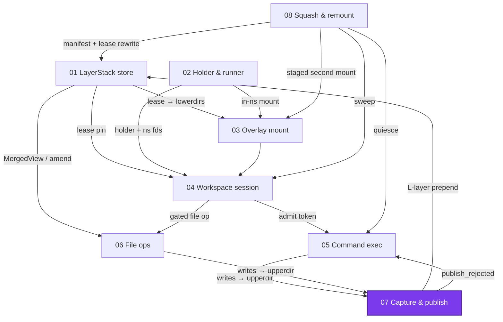
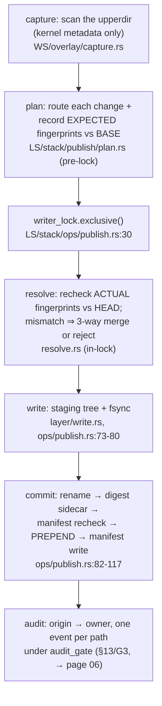

# Capture & publish: how an upperdir becomes a layer, exactly once

> **Cluster 01 — Workspace runtime & storage, page 8 of 9.**
> Prev: [06 — File operations & blame](06-file-operations-and-blame.md) ·
> Next: [08 — Squash & live remount](08-squash-and-live-remount.md)

## Why this page exists

The loop closes here: everything a session wrote into its one upperdir
(page 03) becomes one new `L*` layer at the head of the manifest (page 01),
with per-line attribution handed to the audit pipeline (page 06) and
rejection surfaced on the completing command's terminal response (page 05).
This page walks the pipeline stage by stage and names the *actual*
concurrency control — per-path content fingerprints with a three-way merge —
as distinct from the ceremonial checks around it. Verified 2026-07-11;
abbreviations: `WS/` = `crates/sandbox-runtime/workspace/src/`,
`LS/` = `crates/sandbox-runtime/layerstack/src/`,
`OP/` = `crates/sandbox-runtime/operation/src/`.

*What to notice: CAP's two output arrows are this page's two halves — the
manifest prepend into the store, and the reject class flowing back to the
command that triggered finalize.*

## The pipeline at a glance

*What to notice: plan runs **before** the lock (safe because expected
fingerprints and gitignore matchers read only the session's leased,
immutable base layers); resolve is the in-lock recheck. The call chain:
`finalize_session_snapshot` → `capture_changes` → `publish_changes`
(audit-gated) → `publish_validated_changes` → `record_layer_publish`
(`OP/workspace_session/service/impls/finalize_session.rs:27,39-41`,
`WS/service/impls/capture_changes.rs:10,28`,
`OP/layerstack/service/impls/publish_changes.rs:11,46-49,71-74`,
`LS/stack/ops/publish.rs:25-41`).*

## Capture: kernel metadata only

The module doc is the contract, in full (`WS/overlay/capture.rs:1-9`):

> Workspace-owned capture for overlay upperdirs.
>
> Capture derives `Delete` and `OpaqueDir` changes exclusively from kernel
> overlay metadata — char-device 0:0 whiteouts, `user.overlay.whiteout`
> xattr files, and `{trusted,user}.overlay.opaque` xattr directories. Dirent
> names are never interpreted as markers: `.wh.`-prefixed path components
> are a reserved layerstack-internal namespace, so a user-created `.wh.`
> name flows through as the ordinary write it is and publish admission
> rejects it fail-closed as `protected_path`.

Facts that shape everything downstream:

- **Capture runs host-side, in-process — no runner.** The state lock is held
  only to clone the upperdir path; the walk itself runs on a live tree
  (`WS/service/impls/capture_changes.rs:19-28`), racing in-flight writers by
  design (e2e `test_complex_capture_races_sessionless_writers_hot_path`).
- **Entry kinds** (`capture.rs:190-222`; opaque emission in the dir walk at
  `:171-177,234-242`): whiteout → `Delete`; symlink → `Symlink`; regular
  file → `Write`, which becomes a **`WriteFile` metadata-only reference** —
  "file winners become [`LayerChange::WriteFile`] source-path references and
  publish streams their content, so no payload size bound applies here"
  (`capture.rs:102-105`); FIFO/socket/device → a tolerated
  `UnsupportedSpecialFile` drop (`:215-220`); non-UTF-8 or non-normalizable
  names → an `InvalidLayerPath` drop under a hex placeholder (`:267-304`).
  No modes are recorded — `WriteFile { path, source_path, size }` has no
  mode field (`LS/model/mod.rs:176-180`).
- **The xattr asymmetry:** capture accepts char 0:0 **or**
  `user.overlay.whiteout` only (`capture.rs:332-344` — the session mount is
  `userxattr`, page 03, so that is what the kernel writes), while the store
  reader accepts `trusted.` *or* `user.` (`LS/storage/whiteout.rs:125-134`).
  Opaque detection accepts either namespace (`capture.rs:346-349`).
- **Deterministic order, then it doesn't matter:** entries are name-sorted
  per directory (`capture.rs:150,168-186`), and `aggregate_layer_changes`
  later re-sorts with last-wins per path (`LS/model/mod.rs:216-223`;
  proptest-pinned order-insensitivity).
- Masks make `/eos` structurally invisible here: session writes land under
  the workspace root only, so capture never needs mask logic — but a session
  *can* write `/workspace/layers` etc., which is captured honestly and
  rejected at admission (e2e EX-05).

Protected drops split fates at plan time: any drop whose reason is **not**
`UnsupportedSpecialFile` fails the whole publish closed
(`LS/stack/publish/plan.rs:56-64`); FIFO/socket drops are reported and
tolerated. An empty capture skips publish entirely
(`OP/…/finalize_session.rs:40`) — see Corrections for what that silences.

## Fingerprints: the real OCC

Per-path `ContentFingerprint`s are the concurrency control
(`LS/stack/publish/fingerprint.rs:10-28`): sha256 of the merged file bytes
(symlinks fingerprint their target; dirs and absences are structural), with
`executable: None` — always (`:22`). The protocol:

1. **Plan records the *expected* fingerprint against the BASE** — the
   session's leased snapshot manifest (`plan.rs:77-84`).
2. **Resolve recomputes the *actual* against the HEAD** under the exclusive
   lock (`resolve.rs:107-133`): equal ⇒ clean; mismatch on a file write ⇒
   three-way merge; merge conflict/ineligible or mismatch on a
   delete/symlink ⇒ `SourceConflict` reject carrying both fingerprints.

State this plainly: **this, not the manifest recheck, is the OCC.** The
base-revision checks are self-consistency guards, not freshness checks — the
OP layer recomputes the revision triple from the shipped manifest
(`publish_changes.rs:16-21`) and plan re-checks the same request pair
(`plan.rs:104-127`); neither can fire merely because head moved. A stale
base manifest alone never rejects a publish; staleness is adjudicated
per-path by fingerprints, which is what lets two sessions publish disjoint
(or even mergeable) edits of the same file without coordination.

## Gitignore: routing, not filtering

`RouteKind` has exactly two values — `Source` and `Ignored`
(`LS/stack/publish/route.rs:5-9`; "protected" is a *reject*, not a route).
**Everything is committed either way**; the route decides scrutiny:
`Source` changes get fingerprint validation and per-line origin, `Ignored`
changes skip OCC entirely and take wholesale attribution (empty origin range
list — `plan.rs:78-95`, `resolve.rs:62-64`, `model.rs:16-17`).

Patterns come from `.gitignore` files **in the base manifest, not the live
tree** (`GitignoreOracle::new(view, &request.base.manifest)`,
`gitignore.rs:10-87`, `plan.rs:66`) — test-proven: the active head empties
`.gitignore` and pre-writes the target, yet routing still honors the
session's base snapshot
(`layerstack/tests/unit/publish.rs:153-185`). Git semantics carry over: an
ignored parent seals descendants, negation can't rescue (`gitignore.rs:75-87`);
`.git` paths route as ordinary source since `98b9a73a2` ("first-writer-wins").

## Resolve and merge

The resolve module doc, in full (`LS/stack/publish/resolve.rs:1-5`):

> Publish-time changeset resolution: validate each source path against the
> active manifest and, on a file-content mismatch, attempt a text three-way
> merge instead of rejecting. Returns the bytes to commit plus each resolved
> line's structural [`Origin`] — never an owner (boundary law: the runtime
> above layerstack maps origin to an owner string after the layer commits).

And the atomicity law (`resolve.rs:39`): "All-resolved or a single reject —
no partial changeset escapes" — the code-level form of the recovered C3
spec's G3.

Merge mechanics (`LS/stack/publish/merge.rs`):

- **Byte-exact**: lines split on `\n` keeping the byte in the slice — CRLF
  and a missing final newline survive (`:4,166-187`); no conflict markers
  ever — overlap ⇒ `Conflict` ⇒ reject (B7); identical both-sides edits
  inherit `Active` origin (B12) (`layerstack/tests/unit/merge.rs:1-3,70,81`).
- **Eligibility**: ≤ `MERGE_MAX_BYTES` 8 MiB, no NUL byte, valid UTF-8
  (`:162-164`; the const is duplicated at `resolve.rs:24`).
- **Myers budget**: `MYERS_MAX_D = 200_000` (`:252`); past it the diff
  degrades to whole-file delete+insert (`:307-322`) — a clean write then
  attributes the whole file to `Command`; a concurrent edit at that scale
  conflicts. Not an error.
- **Clean writes still merge** — `three_way_merge(base, base, command)`
  purely to compute diff-based origin (`clean_origin`, `resolve.rs:161-180`).
- **Opaque dirs expand**: up to `OPAQUE_DIR_EXPANSION_LIMIT = 4096` visible
  descendants (`opaque_dir.rs:5-13`), each individually routed — any
  protected descendant, any source/ignored mix, over-limit, or walk error
  rejects (`plan.rs:167-239`).

## Layer write and whiteout encodings

Resolved changes land in a staging tree (`LS/stack/layer/write.rs`):

- Merged content is an in-memory `Write` landed via `fs::write` (`:15-17`);
  clean `WriteFile`s are **copied from the live upperdir with a TOCTOU
  guard** — re-stat before copy ("spool payload changed before publish" on
  size/type change) and a post-copy size recheck (`:19-40`). The guard is
  size-only; see Corrections.
- Deletes write kernel whiteouts; opaque dirs get the dual encoding —
  `.wh..wh..opq` marker (itself whiteout-encoded) plus the kernel opaque
  xattr (`LS/storage/whiteout.rs:23-100`, → page 01 for the table).
- A whiteout over an upperdir-only path is **kept**: plan records an
  `Absent` expected fingerprint (`plan.rs:77-84`), resolve sees
  `Absent == Absent` and passes it (`resolve.rs:108-111`), write persists it
  (`write.rs:41-44`). Publish never folds net-effects — that is squash's job
  (→ page 08).

The three byte locations and their encodings:

| Location | Deletion encoding | Opaque encoding | Anchor |
|---|---|---|---|
| session upperdir (capture input) | kernel: char 0:0 or empty file + `user.overlay.whiteout` (userxattr mount) | `{trusted,user}.overlay.opaque` xattr | `WS/overlay/capture.rs:332-349` |
| stored layer | kernel with dual fallback: mknod char 0:0, else empty file + `trusted.` **and** `user.` whiteout xattrs | `.wh..wh..opq` marker **plus** kernel opaque xattr | `LS/storage/whiteout.rs:23-100` |
| export stream | **logical only**: `.wh.<name>` tar entries — "never kernel whiteouts, which need privileges to extract" | logical `.wh..wh..opq` entry | `LS/stack/projection/emit_stream.rs:1-5` |

## The commit transaction

`publish_layer_unlocked` (`LS/stack/ops/publish.rs:55-127`), step by step:

| # | Step | Anchor |
|---|---|---|
| 1 | digest the aggregated changeset; **no-op if it equals the head layer's `.digest` sidecar** (`created: false`) | `:60-66` |
| 1b | consume the test failpoint marker if armed (→ page 01 Corrections) | `:68,141-156` |
| 2 | allocate `L{version+1:06}-{counter:08x}` + staging dir | `:70-72` |
| 3 | write changes into staging; fsync every file + the dir | `:73-80` |
| 4 | rename staging → `layers/<id>`; fsync parent | `:82-88` |
| 5 | write the `.digest` sidecar (failure rolls the layer back) | `:90-93` |
| 6 | manifest recheck — defense-in-depth; under the double lock it can only fire on out-of-band mutation; mismatch deletes the layer and returns `ManifestConflict` | `:95-103` |
| 7 | **prepend** the new `LayerRef`, atomic manifest write | `:105-117` |
| 8 | best-effort `.bytes` sidecar (`let _ =`) | `:118-122` |

`no_op: true` happens exactly two ways: an empty resolved changeset, which
returns before the transaction ever starts (`:33-40`), or head-digest dedup
inside it (`created: false`, `:60-66`) — and in both, the origin is
discarded before audit, so an idempotent republish mints no blame
(`:38,41-46`; `LS/stack/publish/model.rs:55-56`: "Empty when the publish was
a no-op (nothing committed, so nothing to attribute)").

## `publish_rejected`: how rejection reaches the caller

The chain, end to end (§2.5 — the slot doc is quoted in page 04):

1. Slot minted at admission (`OP/workspace_session/service/impls/admission.rs:98`),
2. attached to the command's exec value
   (`OP/command/service/exec_command.rs:135-146`),
3. set once by finalize when publish rejects, alongside a span error and a
   `workspace_session.finalize.publish_failed` event
   (`OP/…/finalize_session.rs:44-57`),
4. read on **terminal responses only** (`OP/command/service/yield.rs:84-118`,
   `dto.rs:55-70`),
5. projected to the wire as `publish_rejected: true` +
   `publish_reject_class`
   (`OP/operations/registry/command_operations.rs:147-150`).

Note what the wire does **not** carry: the slot is
`FinalizeOutcome { publish_reject_class: &'static str }` — by the time
finalize sets it, the structured reject's path/fingerprints/drop/message are
already discarded (`OP/workspace_session/service/model.rs:40-42`). A full
`publish_reject_value` renderer exists
(`command_operations.rs:158-177`) but only for the command-*error* details
branch, which no production code currently constructs (the
`CommandServiceError::LayerStack(PublishRejected)` variant has an unused
`From` impl and zero producers in `OP/command/service/` —
`OP/command/error.rs:39-43`). Callers get the class string, nothing more.

The class taxonomy, cell-checked against both ends
(`LS/stack/publish/model.rs:117-126` → `OP/…/finalize_session.rs:129-152`):

| Reject class (wire) | Trigger | Anchor |
|---|---|---|
| `invalid_base_revision` | request's revision triple ≠ its own base manifest (self-consistency, not freshness) | `plan.rs:104-127` |
| `protected_path` | reserved namespace hit (top-level `manifest.json`/`workspace.json`/`layers`/`staging`; `.layer-metadata` **at any depth**; any `.wh.*` component) — or any non-tolerated protected drop | `route.rs:11-33`, `plan.rs:56-64,155-158` |
| `source_conflict` | fingerprint mismatch without a clean merge (or on delete/symlink) — the in-process `PublishReject` carries `{path, expected, actual}`; the wire gets the class only | `resolve.rs:112-131,212-222` |
| `opaque_dir_protected_descendant` | opaque dir hides a protected path | `plan.rs:206-213` |
| `opaque_dir_mixed_routes` | opaque dir's descendants mix source+ignored | `plan.rs:227-231` |
| `opaque_dir_expansion_limit` | > 4096 visible descendants | `plan.rs:186-190` |
| `route_preparation_failed` | descendant walk I/O error | `plan.rs:180-185` |
| `publish_error` (fallback) | everything else — including `ManifestConflict` **and the OP-level `InvalidBaseRevision` precheck** (a different error type than the reject class of the same name — see Corrections) | `finalize_session.rs:150`, `publish_changes.rs:16-21` |

E2e proof of the full chain: write `/workspace/layers/evil.txt` in an
implicit session ⇒ terminal response carries `publish_rejected: true`,
`publish_reject_class: "protected_path"`, and the session is still destroyed
(`e2e/runtime/workspace_session/test_exec_finalize.py:132`).

## Amend: the same pipeline, head-pinned

Sessionless write/edit reuse everything above through `amend_path`, whose
doc page 06 quoted: the exclusive lock is held across read → transform →
resolve → commit, the base *is* the locked head, so "the three-way merge
never runs and no source/manifest conflict can occur — there is nothing to
retry" (`LS/stack/file_read.rs:1-7,75-131`). Digest dedup still applies:
unchanged content commits nothing and records no blame
(`file_read.rs:113-124`, `OP/layerstack/service/impls/amend.rs:43-46`).

## Appendix: projection and export

- **`MergedView` consumers** (production): the publish pipeline itself
  (plan/fingerprint/resolve/gitignore/opaque_dir), classified reads and
  `amend_path`, and directory listing (`LS/stack/mod.rs:62,72`; → pages 01
  and 06). `project()` — materializing a merged tree to disk — is
  **test-only**: zero src callers (`LS/stack/projection/mod.rs:263-270`).
- **Export** folds the published delta (never the live upperdir) with
  newest-wins winner selection provably equivalent to `MergedView` ("spec
  inv 2") and to squash's flatten ("spec decision 14")
  (`layerstack/tests/unit/export_delta.rs:1-3`), then spools one
  zstd-compressed tar per the emit doc (`emit_stream.rs:1-5`):

  > Emit the winner map as one whiteout-preserving, zstd-compressed tar
  > spool. Entries carry the source's mode and second-granular mtime;
  > deletions ride the logical OCI encoding (`.wh.<name>`) and opaque cuts as
  > `.wh..wh..opq` — never kernel whiteouts, which need privileges to
  > extract. uid/gid, xattrs, and cross-winner hardlinks are not carried.

  A snapshot lease pins the source layers for the fold's duration
  (`OP/layerstack/service/impls/export.rs:73-90`, partial-spool cleanup
  `:93-96`); spools live under `<workspace scratch>/.export/`, paged to the
  client in base64 chunks with **EOF ⇒ unlink**
  (`export.rs:236-246`; test `export_spools_and_pages_to_eof`,
  `operation/tests/layerstack_export.rs:141`), and boot wipes the spool dir
  wholesale (`OP/services.rs:147-161`). Host-side apply hardening belongs to
  `03-management-plane/02`.

## Corrections

- **Executable-bit loss on merged files.** A merged path is rewritten to an
  in-memory `Write` (`resolve.rs:67-72`) and landed via `fs::write`
  (`write.rs:15-17`) — and since fingerprints never carry a mode
  (`fingerprint.rs:22`), the exec bit neither conflicts nor survives. Clean
  (unmerged) `WriteFile`s keep their bits incidentally via `fs::copy`.
- **Empty-capture-with-drops surfaces nowhere.** When capture yields only
  protected drops and no changes, finalize's empty arm is `{}` —
  no event, no outcome slot, `published=false` span attr only
  (`finalize_session.rs:40,64`). Even `InvalidLayerPath` drops vanish
  silently in that case.
- **The WriteFile TOCTOU guard is size-only** — re-stat checks
  `is_file && len == size` (`write.rs:26`); a same-size content swap between
  the digest read and the copy is undetected. (The guard string also has no
  dedicated test.)
- **`aggregate_layer_changes` is last-wins per path**
  (`LS/model/mod.rs:216-223`) — capture order cannot matter, but neither can
  two same-path changes both survive.
- **`ProtectedPathDropReason::CommandScratchPath` has no production
  producer** — defined, mapped, wire-named, and test-constructed, but
  nothing in live code creates it (`WS/model.rs:424`,
  `finalize_session.rs:176-178`,
  `layerstack/tests/unit/publish.rs:344-346`). Reserved plumbing.
- **Two `InvalidBaseRevision`s exist.** The LS reject class surfaces as
  `invalid_base_revision`; the OP-level precheck error
  (`LayerStackServiceError::InvalidBaseRevision`,
  `publish_changes.rs:16-21`) falls through to class `publish_error`. Same
  name, different wire classes.
- **The export appendix nearly documented a ghost.** A token-gated HTTP
  export stream ("spec decision 19") landed 2026-07-08 and was **removed
  2026-07-10** (`2ee1b4240`, which deleted `SD/http/export.rs` and the
  protocol token field); the tree is back to `read_export_chunk` paging.
  The recovered export spec still records decision 19 as current — code is
  ground truth.
- A non-UTF-8 **symlink target** (unlike a non-UTF-8 name) hard-fails
  capture as `CaptureError::InvalidPathChange` rather than degrading to a
  drop (`capture.rs:244-254,314-321`).

## What this unlocks

Page 08 is the only remaining consumer: squash folds the very layers this
page created (its flatten provably picks the same winners as export's fold),
its substitution map rewrites the leases that pinned this page's base
manifests, and its remount migrates live sessions onto the compacted chain —
all without ever touching the audit store this page fed.
