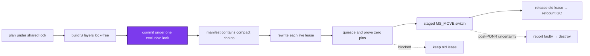
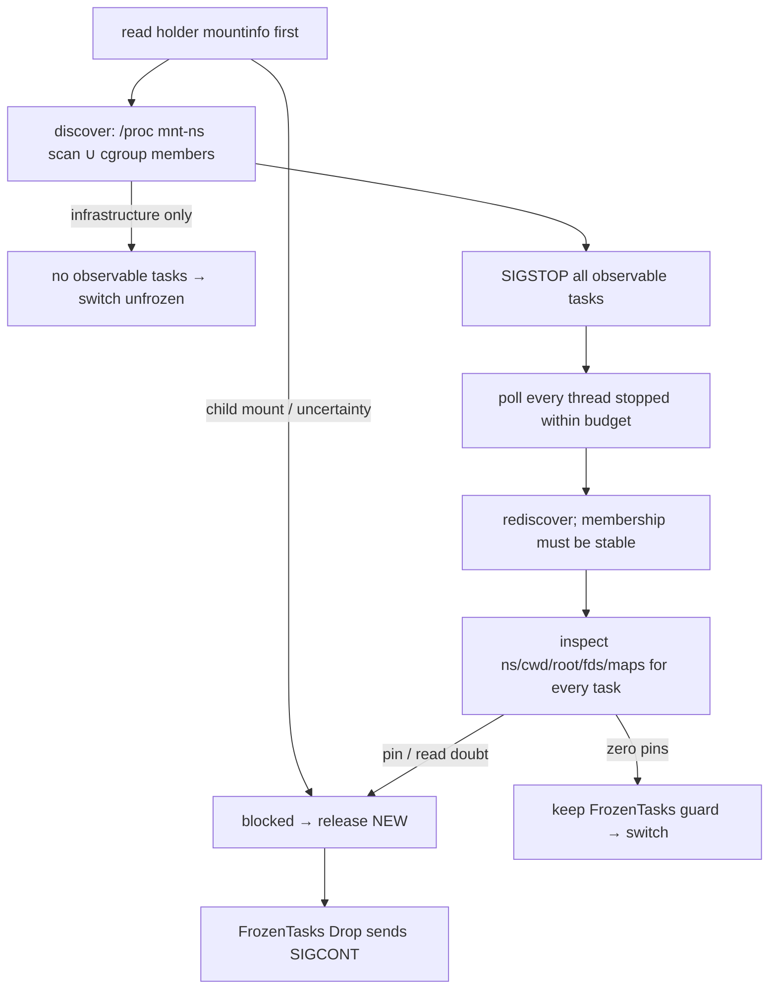

# Squash & live remount: compact storage without stopping the session

> **Cluster 01 — Workspace runtime & storage, page 9 of 9.**
> Prev: [07 — Capture & publish](07-capture-and-publish.md) ·
> Next: [Cluster 02 — Isolation model](../02-security-model/01-isolation-model.md)

## Why this page exists

Page 07 closed the ordinary write loop by turning a session upperdir into a
newest-first `L` layer. Left alone, that loop grows both the manifest and every
future overlay lowerdir chain. **Squash** replaces eligible runs with equivalent
`S` layers; **live remount** then tries to move already-running sessions onto
those shorter chains so their old leases can release immediately. Storage
commit is the correctness boundary. Remount is best-effort garbage-collection
work after that boundary and cannot undo a committed squash
(`LS/stack/squash.rs:1-14`, `OP/layerstack/service/impls/squash.rs:1-10`).

The implementation was built against the deleted C1–C6/G1–G3 design record,
restored at [`recovered/squash-spec.md`](recovered/squash-spec.md). This page
reconciles that record with the shipped code; code anchors are ground truth.
Verified against `ephemeral-sandbox` commit `03fdcc440` on **2026-07-12**.
Abbreviations: `LS/` = `crates/sandbox-runtime/layerstack/src/`, `WS/` =
`crates/sandbox-runtime/workspace/src/`, `OV/` =
`crates/sandbox-runtime/overlay/src/`, `NP/` =
`crates/sandbox-runtime/namespace-process/src/`, `NE/` =
`crates/sandbox-runtime/namespace-execution/src/`, and `OP/` =
`crates/sandbox-runtime/operation/src/`.

The recovered policy says, in part (`recovered/squash-spec.md:32-62`):

> Never mutate or delete a layer directory any live lease references.
> Storage commit is the correctness boundary; it never depends on live remount.
> Live remount is best-effort post-commit cleanup; pre-PONR skip/failure keeps
> the old lease and never fails a committed squash.
> Blocked session = healthy: keep its lease, next squash catches it.
> Any other failure past the point of no return = faulty: report it, then
> destroy it through the ordinary destroy path.



*What to notice: the purple storage commit is the only correctness boundary.
Everything to its right changes reclamation state, not the logical contents of
the active manifest.*

## Why remount exists

Layer reclamation is lease-refcount driven. Releasing a lease deletes only
layers absent from both the active manifest and every remaining lease
(`LS/stack/lease/cleanup.rs:16-45`). A squash can therefore remove raw layers
from `manifest.json` yet leave their directories on disk because an older live
session still leases—and its overlay still mounts—the old chain. Remount
acquires an equivalent compact lease, switches the mount, and only then
releases the old lease (`WS/lifecycle/remount.rs:197-307`).

This gives four invariants carried directly from the recovered record
(`recovered/squash-spec.md:181-217`) and enforced by the code:

1. **Merged-view equivalence:** flatten changes structure, never visible
   content (`LS/stack/squash/flatten.rs:1-12`).
2. **Pin-overlap:** replacement lease acquisition never releases the old lease
   (`LS/stack/lease/rewrite.rs:31-39,59-68`).
3. **Detach-before-delete:** old-lease release happens only after a verified
   switch and strict rollback unmount; namespace death is the faulty-path proof
   (`WS/lifecycle/remount.rs:267-305`, `OV/kernel_mount.rs:207-219`).
4. **Upperdir sanctity:** NEW reuses the session upperdir but receives a fresh
   sibling workdir; retired workdirs stay under the run dir for ordinary
   destroy/boot reap (`WS/lifecycle/remount.rs:249-255`,
   `NP/runner/setns/remount_overlay.rs:46-84`).

## The boot gate: prove the kernel, do not assume it

The runtime gate is a miniature of the production switch. In a fresh
single-threaded `gate-probe` subprocess it enters a scratch user+mount
namespace, mounts OLD and NEW overlays on the **same upperdir** with distinct
workdirs, performs the staged moves through the production overlay builder,
and verifies that `userxattr` whiteouts and opaque directories do not
resurrect deleted content (`NP/gate.rs:1-15,25-59,69-157`,
`crates/sandbox-daemon/src/gate_probe.rs:13-23`). Its module contract is
explicit (`NP/gate.rs:3-10`):

> Live remount stands on one load-bearing kernel assumption: OLD and NEW
> overlays coexist on the same upperdir (NEW with a fresh sibling workdir)
> through the staged `MS_MOVE` switch, with `userxattr` whiteouts honored so
> deleted files stay deleted. … On any failure the daemon keeps squash
> commit-only and every session reports
> `leased(unsupported:kernel_gate_not_proven)`.

The process-wide `LIVE_REMOUNT_GATE` latch has three values: `0` unprobed and
disabled, `1` proven, `2` failed. Only `1` enables remount
(`WS/lifecycle/remount.rs:29-55`). The scratch directory is
`<layer-stack-root>/staging` because the probe must run on the real ext4
layer-stack volume, not the container's overlay rootfs
(`OP/services.rs:221-240`). Non-Linux probe bodies return false, so storage
squash may still commit while every live session remains leased
(`NP/gate.rs:61-65`).

The recovered record names three environment gates. Shipped runtime code
combines **G1** (same-upperdir/fresh-workdir) and **G2** (production-builder
whiteout parity) in this one probe. **G3** is the separate startup
reap-then-sweep invariant and Docker e2e: boot probes first, reaps persisted
dead sessions, then runs the fail-closed store sweep
(`OP/services.rs:163-219`; recovered spec `:1219-1304`). G3 is not another
bit in the runtime latch.

## Squash: plan, build, commit

`squash_layerstack` is a manual, zero-argument operation. A process-global
per-root atomic flag rejects a concurrent squash; the `SquashOutcome` owns the
flag guard, so singleflight lasts through the caller's entire remount sweep
(`LS/stack/squash.rs:43-62,64-102,309-336`,
`OP/layerstack/service/impls/squash.rs:41-65`).

```mermaid
sequenceDiagram
    participant O as operation
    participant L as LayerStack
    participant F as filesystem
    participant R as lease registry

    O->>L: squash()
    L->>L: shared lock: read manifest + boundaries
    L->>R: acquire ordinary plan lease
    L-->>F: unlock; flatten blocks into staging/
    L->>L: exclusive lock: re-read latest manifest
    L->>F: rename S trees into layers/
    L->>F: one syncfs(storage root)
    L->>F: atomically replace manifest.json
    L->>L: record substitutions in RAM
    L->>R: release plan lease → only commit-time GC
    L-->>O: SquashOutcome keeps singleflight alive
    O->>O: bounded live-session sweep
```

*What to notice: building can be slow without holding the writer lock. The
latest manifest is re-read only in the exclusive commit section, and publishes
that raced with the build remain as a new head tail.*

### Planning and boundaries

Planning takes one brief shared writer guard, reads the active manifest, and
asks the lease registry for each live lease's newest layer. Those layers are
**boundaries** (`LS/stack/lease/registry.rs:87-92`,
`LS/stack/squash.rs:104-137`). `partition_blocks` produces maximal contiguous
runs of at least two layers that contain neither a boundary nor a `B*` base
layer (`LS/stack/squash.rs:274-298`). A singleton is not worth replacing; a
base is never squashed; a block never straddles a lease's newest-layer pin.

The plan acquires an ordinary lease over the planned manifest. It is not what
makes lock-free build safe—published layers only prepend, so the planned
sources remain active throughout build—but releasing it after commit reuses
the existing refcount GC and returns exactly the now-unreferenced sources
(`LS/stack/squash.rs:113-137,140-181,244-256`).

### Flattening

Each block is folded newest-first into a nonce-named staging tree. Directory
walks are fd-relative and no-follow; regular-file winners are hardlinked from
immutable sources; symlinks are recreated; directory modes survive
(`LS/stack/squash/flatten.rs:1-12,31-52,197-233`). Whiteouts that mask nothing
below the block disappear. A winning whiteout is re-emitted in kernel form,
and a directory cut inside the block becomes opaque in **both** forms:
`.wh..wh..opq` for `MergedView`/capture and `user.overlay.opaque=y` for the
kernel (`:98-160,300-317,351-362`). This is the same first-hit/newest-wins
view defined on page 01, materialized into one tree.

### The commit transaction

Commit takes one exclusive writer guard and, for every built block, requires
the planned raw run to remain present and contiguous in the **latest**
manifest. It splices in one `S` layer, preserving any racing publish tail
(`LS/stack/squash.rs:183-210`). Then it:

1. renames every staging tree into `layers/S…`;
2. performs one `syncfs` on the storage-root fd;
3. atomically writes the new manifest;
4. records `{S layer → replaced raw run}` in RAM; and
5. releases the plan lease, invoking the only commit-time GC
   (`LS/stack/squash.rs:211-256`, `LS/storage/fs.rs:155-172`).

`S` layers intentionally have no `.digest` or `.bytes` sidecars
(`LS/stack/squash.rs:1-14`). A pre-manifest failure removes promoted `S`
directories in-process and leaves the old manifest valid; after the manifest
rename, cleanup failures cannot invalidate the committed squash
(`LS/stack/squash.rs:74-98,211-230`).

## Lease rewriting: equivalent chain, overlapping pins

The substitution map is per storage root, in memory only, append-ordered, and
a leaf lock: no disk sidecar, schema, or restart recovery exists
(`LS/stack/lease/rewrite.rs:1-12,140-157`). Each record maps an `S` layer to
the raw run it replaced. Rewriting applies records oldest-generation first, so
a later raw run containing an earlier `S` id contracts in a single bounded
pass (`:111-129`). Missing records, a no-op contraction, or a missing rewritten
layer degrades to `Identity`, never a guessed chain (`:59-109`).

```mermaid
sequenceDiagram
    participant O as OLD lease
    participant N as NEW lease
    participant M as mounted overlay

    Note over O: old chain pinned
    N->>N: acquire rewritten equivalent
    Note over O,N: pin-overlap: both chains pinned
    N->>M: stage and verify NEW
    M->>M: switch; resume tasks
    alt strict rollback unmount succeeded
        O-->>O: release → GC may delete raw layers
    else EBUSY park
        Note over O,N: keep both until destroy
    end
```

*What to notice: `acquire_rewritten_lease` never releases OLD. There is no
instant in which neither chain is pinned, and a clean abort releases only the
replacement (`LS/stack/lease/rewrite.rs:31-39,59-68`).*

## Quiesce: C1 decision tree and C4 proof

The remount attempt runs inside the same per-session admission gate used by
commands, file operations, and destroy. It takes no ledger entry and cannot
trigger finalize (§2.3/F1)
(`OP/workspace_session/service/impls/remount_session.rs:27-32`). After a
replacement lease exists, `quiesce_holder_scope` follows three branches:



*What to notice: holder `mountinfo` is checked before discovery, so a child
mount left by an exited task blocks even when there are no tasks to freeze
(`NE/quiesce.rs:59-64,365-385`).*

Discovery is the union of a full `/proc` scan for the holder mount namespace
and the session cgroup's `cgroup.procs`. The holder, its direct child
(pid-namespace init), and `runner_pids` are allowlisted; a cgroup member in a
different mount namespace blocks as `pinned:mount_namespace_escaped`
(`NE/quiesce.rs:145-192`). Production currently passes an empty
`runner_pids` vector (`WS/lifecycle/remount.rs:232-239`).

Every discovered process receives `SIGSTOP`; a resume-on-drop `FrozenTasks`
guard sends `SIGCONT` on every clean exit. All threads must reach stopped,
zombie, or exited state within the configured freeze budget; ptrace-stopped
threads require their tracer inside the frozen set. Discovery then repeats to
close the membership race (`NE/quiesce.rs:38-57,64-126,204-242`).

C4 inspection reads every task's mount namespace, `cwd`, `root`, fds, and
memory maps. A workspace path in any of those positions is a pin. Pipes,
sockets, PTYs, `eventfd`, and `timerfd` are allowed; any other `anon_inode`
kind blocks. Deleted or unparsable mapped files block. **Any inspection read
error is uncertainty and blocks**, rather than proving safety from missing
evidence (`NE/quiesce.rs:270-363`). The recovered C1 rule is therefore true
literally: a blocked session is healthy, resumes immediately, releases only
the replacement lease, and remains on OLD for a later squash attempt.

An interactive PTY shell always starts with its cwd inside `/workspace`, so it
classifies `pinned:cwd_pinned_workspace` while running. The recovered C6 note
calls this “physics, not policy”: moving the mount would leave the shell's cwd
dentry on OLD (`recovered/squash-spec.md:965-987`; command cwd setup is
`NP/runner/shell_exec.rs:50-58`). Batch commands with no cwd/fd/map/child
mount pin can migrate while stopped and continue without observing the switch.

## C3: the nine-step staged switch

The runner joins the holder user and mount namespaces and returns a JSON
`RunResult` on every mount outcome. Its process exit code remains zero because
the **report**, not runner status, carries the C5 mount verdict
(`WS/namespace/setns_runner.rs:51-55`,
`NP/runner/setns/remount_overlay.rs:27-43`).

| Step | Action | Failure classification |
|---|---|---|
| 1 | Lift the configured hidden-path masks. | `stage_failed:*`; `MaskGuard::drop` remasks best-effort. |
| 2 | Create `.remount-staging-*`, `.remount-rollback-*`, and fresh `work-remount-*` under the session run dir. | `stage_failed:scratch_dirs:*`; OLD untouched. |
| 3 | Mount NEW at staging with the same upperdir, compact lowerdirs, fresh workdir; open `O_PATH` fds for staging, rollback, and OLD workspace root. | `stage_failed:*`; strict-unmount staged NEW. |
| 4 | Restore masks, then probe NEW through its pre-opened mount-root fd. | `stage_failed:mask_restore_failed` or `staged_probe_mismatch`; OLD untouched. |
| 5 | `MS_MOVE` OLD workspace mount → rollback. **First successful return is PONR.** | A failed first move is a clean pre-PONR `move_failed:*`. |
| 6 | Reopen the now-underlying workspace path and `MS_MOVE` NEW staging → workspace. | Post-PONR `mount_uncertain:*`. |
| 7 | Probe the visible NEW mount through the staging mount-root fd. | Post-PONR `mount_uncertain:visible_probe:*`. |
| 8 | Drop the OLD-root fd; strict-unmount rollback through `/proc/self/fd/N`, with no lazy fallback. | `EBUSY` parks; another errno is reported with a verified mount but classifies faulty. |
| 9 | Report `first_move_succeeded`, `mount_verified`, and free-form `detail`. | Missing/ambiguous report is resolved by C5 mount-id comparison. |

The implementation is the table in order
(`NP/runner/setns/remount_overlay.rs:46-172`). Masks are restored **before**
step 5, and `MaskGuard::drop` covers all earlier returns (`:174-209`). The
strict unmount is exactly one `umount2(path, 0)`; `MNT_DETACH` is forbidden
because lazy detach is not proof that OLD stopped reading its lowerdirs
(`OV/kernel_mount.rs:207-219`).

## C5: report classification and effects

`classify_remount_report` is a pure function over report presence, its two
booleans, free-form detail, and—only when the report is missing—the workspace
mount ID before/after runner death (`WS/lifecycle/remount.rs:313-379`). This is
the shipped table:

| Runner evidence | Code classification | Session/lease effect |
|---|---|---|
| Report; `first_move=false` | `CleanSkip(detail)` | Release NEW, resume, keep OLD; report `leased(detail)`. |
| Report; `first_move=true`, `mount_verified=false` | `Faulty(detail)` | Keep tasks frozen; park NEW lease; report and ordinary-destroy. |
| Report; both true; detail `switched` | `Verified` | Resume; release OLD; install NEW handle; `migrated`. |
| Report; both true; detail `pinned:rollback_unmount_busy` | `Verified(parked)` | Resume on NEW; install NEW handle; retain OLD in `parked_lease_id`; report `leased`. |
| Report; both true; any other detail | `Faulty(detail)` | Even a verified mount is faulty if rollback cleanup is neither success nor sanctioned EBUSY. |
| No valid report; mount ID unchanged | `CleanSkip(stage_failed:runner_died_before_switch)` | First move did not land; release NEW and resume. |
| No valid report; mount ID changed, missing, or unreadable | `Faulty(mount_uncertain:runner_report_missing)` | PONR cannot be excluded; keep tasks frozen and destroy. |

On clean skip, dropping `FrozenTasks` resumes and only the replacement lease is
released (`WS/lifecycle/remount.rs:267-275`). On verified success, tasks resume
before old-lease release; the state lock is then reacquired briefly to replace
the session snapshot/workdir (`:276-294,115-194`). An EBUSY park never releases
OLD: `parked_lease_id` is in-memory only and ordinary destroy releases both
leases after killing the namespace (`WS/session/state.rs:19-22`,
`WS/service/impls/destroy_workspace.rs:28-49`).

On a faulty result, the code deliberately `mem::forget`s the `FrozenTasks`
guard (`WS/lifecycle/remount.rs:297-305`). The operation reports the session id,
classification detail, and lease-release errors, then calls the ordinary
faulty-destroy path. Holder death collapses the namespace before both leases
release, so no task observes an ambiguous mount state
(`OP/layerstack/service/impls/squash.rs:78-95`,
`OP/workspace_session/service/impls/remount_session.rs:96-123`).

## The bounded post-commit sweep

The operation snapshots live session ids after squash commit and runs remounts
in scoped threads with configurable width (default **4**), preserving result
order by session id (`OP/layerstack/service/impls/squash.rs:153-201`,
`OP/services.rs:384-400`). Each worker takes only that session's admission gate;
expensive quiesce/switch work holds no workspace-manager state lock
(`WS/service/impls/remount_workspace.rs:19-47`).

After workers finish, migrated handles are persisted in **one batched**
`persist_handles` call. That file is only a boot-reap inventory, so persistence
failure changes no live mount (`OP/layerstack/service/impls/squash.rs:65-78`,
`OP/workspace_session/service/impls/remount_session.rs:125-136`,
`WS/lifecycle/persistence.rs:66-110`). Faulty sessions are destroyed after the
sweep. For each block, `replaced_layers` is derived from post-sweep disk truth;
if raw layers remain, blocked reasons are attributed from each session's
pre-attempt manifest. Never-straddle makes the relationship whole-block or
none (`OP/layerstack/service/impls/squash.rs:96-151`).

The `SquashOutcome` remains alive until result assembly completes, so its
singleflight guard covers plan, storage commit, sweep, faulty destroy, and
reporting (`LS/stack/squash.rs:43-50`,
`OP/layerstack/service/impls/squash.rs:55-151`).

## Crash story

The substitution map, live-remount latch, lease registry, and parked lease are
all RAM-only (`LS/stack/lease/rewrite.rs:1-12`,
`WS/lifecycle/remount.rs:29-37`, `WS/session/state.rs:19-22`). No remount state
is recovered. If the daemon dies at any point, holder PDEATHSIG tears down the
mount namespace; on restart `manager.json` is used only to remove dead run
dirs, then the active-manifest sweep reclaims unreferenced layers
(`WS/lifecycle/persistence.rs:66-110`, `OP/services.rs:163-219`). A doubtful
manifest makes the sweep delete nothing, as page 01 details. This is the
recovered G3 contract: every crash converges through ordinary reap then
fail-closed sweep, with no remount-specific branch.

## Recovered-spec concordance and corrections

The C-labels resolve as follows: **C1** is the per-session decision tree;
**C2** is the cross-crate swimlane; **C3** is the nine-step runner switch;
**C4** is `/proc` pin inspection; **C5** is report classification; **C6** is
shell-runner physics (`recovered/squash-spec.md:756-990`). Shipped code has
direct C1/C3/C4/C5 comments at `NE/quiesce.rs:22-23`,
`NP/runner/setns/remount_overlay.rs:1-10`, `NE/quiesce.rs:270-272`, and
`WS/lifecycle/remount.rs:326-329`; C2 and C6 are architecture/explanation,
not separate runtime modes.

Places where the recovered record or nearby names can mislead:

- The recovered record describes three pre-enable “gate tests.” Runtime code
  probes G1+G2 together; G3 remains boot-order behavior/e2e, not a latch input.
- The recovered C5 table says handle refresh/persist precedes resume and old
  lease release. Shipped code resumes, releases OLD, then applies the in-memory
  handle and batches persistence once after the sweep
  (`WS/lifecycle/remount.rs:276-294,115-194`,
  `OP/layerstack/service/impls/squash.rs:65-78`). This is a
  real ordering divergence, but not a detach-before-delete violation: visible
  NEW was verified and OLD strictly unmounted before resume/release.
- `QuiesceSpec.runner_pids` is vestigial in production: every remount passes an
  empty vector (`WS/lifecycle/remount.rs:232-239`).
- Interactive PTY sessions are predictably leased on cwd pin; this is an
  operator-visible limitation, not a policy rejection (C6).
- The file domain's “C3 spec §7/§9/§11/§13” and G1–G3 are from the different
  OCC/file-auditability record. They do **not** name this page's C3 switch or
  squash G1–G3 (`recovered/README.md`; page 06 owns that domain).
- `SquashedBlock` is a committed result type; the plan uses `Vec<LayerRef>`
  runs rather than a public `SquashBlock` type (`LS/stack/squash.rs:35-41,260-272`).
- Live remount is Linux-only. Unsupported systems fail the gate and therefore
  degrade to commit-only squash rather than attempting mount moves
  (`NP/gate.rs:61-65`, `OV/kernel_mount.rs:194-204`).

## What this unlocks

The workspace lifecycle loop is now complete: publish grows the store, squash
compacts it, remount migrates live consumers, and lease release or crash-time
sweep reclaims old storage. Cluster 02 can build its isolation and crash-
recovery arguments on these mechanics without repeating them.
