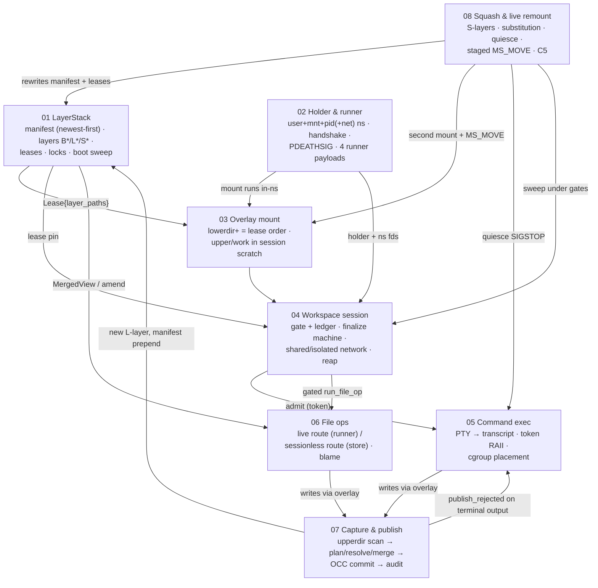

# Cluster 01 — Workspace runtime & storage: writing spec

> Companion to [`../skelenton.md`](../skelenton.md), Cluster 01. This file tells the
> author of each page exactly what to write: goal, prerequisites, outline, must-state
> invariants with code anchors, required figures, corrections to state, and done-when
> checks. Grounded in a 9-agent code deep-dive of 2026-07-11 (agent IDs in §9); every
> anchor below was verified against the code on that date.

**Code root:** `/Users/yifanxu/Ephemeral-AI-Lab/ephemeral-sandbox` — all anchors are
`path:line` relative to it. Crate-path abbreviations used throughout:

| Abbrev | Expands to |
|---|---|
| `LS/` | `crates/sandbox-runtime/layerstack/src/` |
| `WS/` | `crates/sandbox-runtime/workspace/src/` |
| `OV/` | `crates/sandbox-runtime/overlay/src/` |
| `NP/` | `crates/sandbox-runtime/namespace-process/src/` |
| `NE/` | `crates/sandbox-runtime/namespace-execution/src/` |
| `OP/` | `crates/sandbox-runtime/operation/src/` |
| `SD/` | `crates/sandbox-daemon/src/` |

---

## 0. Step zero — import the recovered spec (before writing anything)

The deleted design spec that the code cites (C1–C6, G1–G3, the invariant list, the lock
discipline) is intact in git history. Recover and commit it into this repo first — page
08 is written *against* it, and pages 04/07 quote it.

```bash
cd /Users/yifanxu/Ephemeral-AI-Lab/ephemeral-sandbox
# The main spec (1,420 lines: C1 sweep tree @756, C2 swimlanes @801, C3 staged switch
# @838, C4 /proc inspection map @905, C5 failure policy @942, C6 PTY physics @963):
git show '0f7d02486^:docs/obsidian/ephemeral-os/implementation_plan/squash/spec.md'
# Deleted by the same commit (0f7d02486 "chore: remove obsolete docs..."):
#   .../squash/test-case.md               (785 lines — e2e catalog source; E*/X*/B*/G* ids)
#   .../squash/acceptance_criteria.md
#   .../impl_plan_and_progress_tracker.md
#   .../iteration-report.md
#   .../simplicity_review_results.md
#   docs/remount-rework/{01-remount-removal,02-remount-mechanism,03-command-crate-removal}.md
# Enumerate everything else that ever lived in the deleted tree (hunt for the §2.x
# workspace-session spec, the C3 file-auditability spec, the observability spec):
git log --diff-filter=D --name-only -- docs/ | sort -u
```

Suggested destination: `01-workspace-runtime/recovered/` in this repo, imported verbatim
with a one-line provenance header. **Caveat to carry into every page that cites it:** the
spec's own header marks it a "landed design record", and its file paths predate the
current crate layout — the C1–C6 *semantics* were verified to match shipped code 1:1
(agent `a9d62ea872d7c4782`), but treat code anchors, not spec paths, as ground truth.

Also note the numbering collision: the *file domain's* "C3 spec §7/§9/§11/§13" citations
(`OP/file/audit.rs:1`, `OP/file/service/store.rs:1`) refer to a **different** deleted
spec (file-auditability), not remount step C3. Say this explicitly in pages 06 and 08.

## 1. The mental model every page serves

One workspace lifecycle loop over a storage substrate, with a compaction protocol on top:



Two facts organize the whole cluster; the tour page states them, every page assumes them:

1. **Two independent roots.** `01` (what bytes exist and who may reclaim them) and `02`
   (which processes can act inside a session) have no dependency on each other; they meet
   for the first time in `03`. `04` is *pure orchestration* — every arrow in
   create/destroy is a call into 01/02/03.
2. **The loop closes through the store.** Everything a session writes lands in one
   upperdir (03); capture+publish (07) turns that upperdir into a new newest-first layer
   (01); squash+remount (08) compacts those layers *under* the still-running sessions.

The unified data-root map (tour page reproduces with anchors; ownership per page):

```text
/eos/layer-stack/                     01  (ext4 volume; flock'd store)
  manifest.json · workspace.json · .storage-writer.lock
  layers/{B000001-base, L…, S…}/ · base/B000001-base (shared-base ro mount)
  staging/ (publish+squash staging; gate-probe scratch)  · .layer-metadata/*.{digest,bytes}
/eos/workspace/                       04 (dir) / 03 (contents) / 07 (upper as input)
  manager.json · <session>/{upper,work,work-remount-*,.remount-{staging,rollback}-*} · .export/
/eos/namespace_execution/<cmd>/       05  transcript.log
/eos/storage/file_auditability/       06  file_auditability_*.ndjson
/eos/runtime/daemon/                  (cluster 03-daemon: socket, pid, observability)
/workspace                            03  overlay mountpoint inside each holder mnt-ns
/sys/fs/cgroup/<R>/{_daemon,workspace-<id>}   05 (placement) / 08 (quiesce discovery)
```

## 2. Page order = dependency order

Nine pages; each uses only concepts introduced earlier. This is also the writing order
and the tour's demo order.

| Page | Title | Prereqs | Replaces (old skeleton) |
|---|---|---|---|
| 00 | Runtime tour | — | new |
| 01 | LayerStack store | — | `03-layerstack.md` |
| 02 | Namespace processes | — | new (was split into `02-security-model/01`, `03-daemon/01`) |
| 03 | Overlay mount | 01, 02 | `04-overlay-mounts.md` |
| 04 | Workspace sessions & network | 01–03 | `01-workspace-sessions.md` |
| 05 | Command execution & PTY | 02, 04 | `02-command-execution.md` |
| 06 | File operations & blame | 01, 04 | `06-file-operations-and-blame.md` |
| 07 | Capture & publish | 03, 04, 06 | new (was smeared across old 01+03) |
| 08 | Squash & live remount | all | `05-live-remount-and-squash.md` |

## 3. The twelve handoff contracts

Each edge is a real type/lock/protocol crossing a page boundary. The tour page carries
this table; the **owner page** documents the mechanism, the other side links to it.

| # | Edge | Artifact (the contract) | Anchor | Owner |
|---|---|---|---|---|
| 1 | 01→04 | `Lease{lease_id, manifest, layer_paths}` pinned for the session's life; released (+ parked) at destroy | `WS/service/impls/create_workspace.rs:19-35`, `destroy_workspace.rs:28-49` | 01 |
| 2 | 01→03 | `layer_paths` newest-first → first `lowerdir+` = highest priority | `OV/kernel_mount.rs:3-7,128-131` | 03 |
| 3 | 04→02 | holder spawn + `ns-up`/`net-ready`/`ready` handshake; ns fds from `/proc/<pid>/ns/*` with CLOEXEC cleared | `WS/lifecycle/create.rs:12-48`, `WS/namespace/fds.rs:33-79` | 02 |
| 4 | 02→03 | overlay mounted by the `--mount-overlay` runner *inside* the holder ns; guard `mem::forget` | `NP/runner/setns/mount_overlay.rs:9-38` | 03 |
| 5 | 04→05 | `AdmittedCommand` + `SessionExecutionToken` RAII (ledger entry; drop runs finalize policy) | `OP/workspace_session/service/impls/admission.rs:33-112` | 04 |
| 6 | 04→06 | `with_gated_session` file-op path — no ledger, no finalize (§2.3/F1) | `admission.rs:114-144`, `OP/workspace_session/service/impls/run_file_op.rs` | 06 |
| 7 | 06→01 | sessionless reads via `MergedView`; sessionless writes via `amend_path` (exclusive RMW) | `LS/stack/file_read.rs:56-131`, `LS/stack/projection/mod.rs:129-229` | 06 |
| 8 | 03→07 | the session **upperdir** (host-visible) is capture's only input; kernel whiteout metadata only | `WS/service/impls/capture_changes.rs:19-32`, `WS/overlay/capture.rs:1-9` | 07 |
| 9 | 07→01 | publish OCC txn: staging→fsync→rename→digest sidecar→manifest **prepend**; real OCC = per-path fingerprints + 3-way merge | `LS/stack/ops/publish.rs:55-127`, `LS/stack/publish/resolve.rs` | 07 |
| 10 | 07→05 | `Arc<OnceLock<FinalizeOutcome>>` set by finalize, read as `publish_rejected` on the command's terminal response (§2.5) | `OP/workspace_session/service/model.rs:37-42`, `OP/command/service/yield.rs:84-118` | 07 |
| 11 | 06↔07 | layerstack emits owner-free `Origin`; file domain mints owners and appends audit events under `audit_gate` in commit order (§13/G3) | `OP/file/audit.rs:1-5`, `OP/layerstack/service/impls/publish_changes.rs:44-73` | 06 |
| 12 | 08→01/02/03/04/05 | substitution map + `acquire_rewritten_lease` (01); gate-probe & `--remount-overlay` personalities (02); second `OverlayHandle` same-upperdir + `move_mountpoint`/`strict_unmount` (03); sweep under session gates + `parked_lease_id` (04); quiesce over the session cgroup (05) | `LS/stack/lease/rewrite.rs:50-129`, `NP/gate.rs:25-59`, `NP/runner/setns/remount_overlay.rs:46-172`, `WS/lifecycle/remount.rs:203-307`, `NE/quiesce.rs:64-192` | 08 |

## 4. House rules (every page)

Format — match the shipped `00-foundations` pages:
- H1 title; blockquote nav header (`> **Cluster 01 — Workspace runtime & storage, page N
  of 9.** Prev/Next links`); a "Why this page exists" opener; mermaid diagrams are fine
  (Obsidian renders them); *"What to notice:"* italic captions under figures.
- Citations are `path:line` relative to the `ephemeral-sandbox` repo root, with a
  verified-as-of date near the top.

Content:
1. **Every normative sentence carries an anchor.** No uncited invariants — these pages
   are the spec of record now.
2. **Quote spec-era comments verbatim** wherever the code cites §N / C1–C6 / F-rules /
   G-rules ("spec decision N" too). These quotes are the recovered spec's living
   fragments; blockquote them with their anchor.
3. **Every page has a "Corrections" section** stating where names/docs mislead (the
   per-page lists below are mandatory content, not suggestions). Docs that describe
   intent instead of reality are how the last spec died.
4. **No forward references** except explicit "→ page NN" pointers; a page may freely
   assume anything from earlier pages.
5. **Every page ends with "What this unlocks"** — one short paragraph naming the later
   pages that build on it, mirroring §3's edge table.
6. **Fixed vocabulary** (define once in the tour, use everywhere): *layer, manifest,
   lease, parked lease, snapshot, binding, scratch root, holder, pid-ns init, runner,
   personality, payload, upperdir/workdir/lowerdir, session, gate, ledger, admission
   token, finalize policy, capture, publish, origin, owner, squash block, substitution,
   quiesce, pin, staged switch, PONR, sweep*.
7. Where behavior is platform-gated, say what non-Linux builds do (usually: degrade or
   no-op for `cargo check`/unit-test parity — e.g. `OV/lib.rs:9-15`,
   `WS/namespace/setns_runner.rs:30-34`).

## 5. Per-page specs

### Page 00 — `00-runtime-tour.md` *(spine, ~half page + figures)*

**Goal:** a reader who finishes this page can name where any byte lives and which page
explains any mechanism.

**Outline:** (1) the loop diagram (§1) narrated in one paragraph; (2) the two organizing
facts (two roots; loop closes through the store); (3) the `/eos` data-root map with
anchors; (4) the 12-edge handoff table (§3, kept in sync); (5) the glossary (§4.6);
(6) the demonstration path (§6); (7) reading order with per-page one-liners.

**Done when:** every row of the edge table links to an existing section of the owning
page; the demo path's steps each name exactly one page.

### Page 01 — `01-layerstack-store.md`

**Goal:** the store is fully explainable without mentioning sessions: what's on disk,
what sha256 covers, who may write, who may delete.

**Outline:** layout → IDs and the three hashes → manifest & newest-first → locks → leases
& GC → boot sweep → base seeding & binding → bind detach → scratch roots → whiteout
encodings (storage view only; write path → 07).

**Must state (anchors):**
- Layout constants `LS/lib.rs:40-46`; manifest schema v1 `LS/model/mod.rs:75-97`; a
  missing manifest reads as a synthetic empty v0 `LS/storage/fs.rs:190-192`.
- Layer IDs are **counters, not content hashes**: `B000001-base` fixed
  (`LS/workspace_base/layer.rs:16`), `L{version:06}-{counter:08x}`
  (`LS/stack/ops/publish.rs:71-72`, `LS/storage/fs.rs:34-52`), `S…`
  (`LS/stack/squash.rs:150`).
- The three sha256 roles: per-layer changeset digest (`LS/model/mod.rs:242-278`) used
  **only** for head-dedup (`LS/stack/ops/publish.rs:60-66,129-139` — never re-verified at
  read); manifest root hash (`LS/model/mod.rs:163-168`) = the OCC revision token /
  `Snapshot.root_hash`; base root hash (`LS/workspace_base/collect.rs:39-67`) = the
  shared-cache key, re-verified at every service init (`LS/workspace_base/binding.rs:74-90`).
- Newest-first is **constructed, never validated**: prepend at publish
  (`LS/stack/ops/publish.rs:105-110`), splice at squash (`LS/stack/squash.rs:196-210`);
  consumers list (root hash, `MergedView` first-hit-wins `LS/stack/projection/mod.rs:80-229`,
  `lowerdir+` order, `lease_newest_layers` `LS/stack/lease/registry.rs:87-92`).
- Locks: per-root flock lease, refcounted, lifetime = open `LayerStack`
  (`LS/storage/lock.rs:20-101`); in-process reentrant RW (`:134-225`); registry mutex
  inside the guard (`LS/stack/mod.rs:91-113`); substitution map is a leaf
  (`LS/stack/lease/rewrite.rs:11-12`). Cross-domain lock order: session gate → sessions
  map → storage writer (`OP/workspace_session/service/core.rs:49-57`, quote verbatim).
- Leases are RAM-only; acquire `LS/stack/mod.rs:91-108`; release-time GC is the only GC
  besides the boot sweep (`LS/stack/lease/cleanup.rs:16-58`).
- Boot sweep fail-closed: keep-set from a parsed v≥1 manifest else delete **nothing**;
  `B*` never deleted; `staging/*` wiped (`LS/stack/lease/cleanup.rs:81-136`); boot order
  kernel-assert → gate probe → reap → sweep (`OP/services.rs:168-219`).
- Binding = `workspace.json` contract (roots absolute, stack outside workspace, base
  digest match — `LS/workspace_base/binding.rs:13-18,47-125`); the boot **bind detach**
  `detach_workspace_bind_after_base` (`OP/services.rs:268-316`, panics on real failure).
- Seeding, three flows: private in-container build (`LS/workspace_base/build.rs:27-115`,
  fail-closed on special/raced files `layer.rs:87-102`), host shared-cache build
  (`build.rs:117-195`; live example dir `eos-shared-workspace-base-cache/<hash>/base/…`),
  docker import (ro volume at `<root>/base` + seed archive pre-writing manifest v1 —
  `crates/sandbox-provider-docker/src/{runtime.rs:239-246,337-341, archive.rs:48-99}`).
- The three scratch roots: workspace scratch (`WS/session/manager.rs:108-110`; holds
  `manager.json`, per-session run dirs, `.export/`), namespace-execution scratch
  (`OP/command/contract.rs:24`), gate-probe scratch = `<layer_stack_root>/staging`
  because it must be a real (non-overlay) fs (`OP/services.rs:224-229`, quote).
- Whiteout dual encoding as stored (`LS/storage/whiteout.rs:22-106`) and the reserved
  `.wh.` / store-internals namespace (`LS/stack/publish/route.rs:11-33`) — mechanics of
  *writing* them belong to page 07.

**Figures:** disk-layout tree; 3-hash table (computed where / covers what / used for);
lock-ladder diagram.

**Corrections:** `.bytes` sidecar is best-effort/advisory (`ops/publish.rs:118-122`);
`owner_request_id` is validated then discarded — leases are not attributable
(`LS/stack/lease/registry.rs:51-67`); `get_snapshot` returns unpinned paths — observation
only (`LS/service/impls/get_snapshot.rs`); release-GC has no explicit `B*` guard
(`cleanup.rs:33-46`) — base safety rests on manifest membership.

**Done when:** a reader can predict exactly what a crashed daemon's boot deletes and
keeps, and can say which of the three hashes changes after any given operation.

### Page 02 — `02-namespace-processes.md`

**Goal:** the process substrate is explainable without storage: who spawns whom, which
namespaces exist, how bytes cross process boundaries, what dies when.

**Outline:** why single-threaded bodies exist → personalities → holder (namespaces, maps,
pid-init, handshake) → ns-fd capture → runner (re-exec, pipes, protocol, payloads,
setns) → kill chain → exit codes & env → the launcher API the rest of the system uses.

**Must state (anchors):**
- Crate charter, quote verbatim: single-threaded `unshare`/`setns(NEWUSER)` is the whole
  reason for re-exec personalities (`NP/lib.rs:1-6`); dispatch `SD/main.rs:41-63`; the
  exit-code contract doc (`SD/main.rs:22-30`, quote).
- Holder: PDEATHSIG(SIGKILL) is its **first act** (`NP/holder/mod.rs:150-157`, quote);
  `unshare(NEWUSER|NEWNS|NEWPID[+NEWNET iff isolated])` (`NP/holder/namespace.rs:80-84`);
  single-entry self uid/gid maps (`:85-95`); `mount_change("/", PRIVATE|REC)` (`:96-100`);
  the pid-ns init fork trick — quote the comment (`:157-174`), init's own
  PDEATHSIG(SIGTERM) + `getppid()==1` guard (`:176-201`); why `ns/pid_for_children`, not
  `ns/pid`, on both sides (`:106`, `WS/namespace/mod.rs:45-55`); pause loop
  (`NP/holder/mod.rs:141-147`).
- Handshake: tokens (`NP/holder/mod.rs:14-18`); daemon-side timeouts via `expect_line`
  poll (`WS/namespace/fds.rs:93-144`); stderr folded into startup/runtime errors
  (`WS/namespace/holder.rs:168-211`); shared-net skips `net-ready` entirely
  (`NP/holder/mod.rs:137-139`); what the daemon does *between* tokens (ns-fd capture,
  veth install, overlay mount — `WS/lifecycle/create.rs:24-45`).
- ns-fd capture: opens `/proc/<holder>/ns/{user,mnt,pid_for_children[,net]}` and
  **permanently clears CLOEXEC** so raw fd integers survive into every spawned runner
  (`WS/namespace/fds.rs:33-79`); stored as ints in `HolderNsFds`
  (`WS/session/state.rs:25-47`); closed only at teardown (`WS/lifecycle/destroy.rs:124-130`).
- Runner: `current_exe` re-exec, quote the argv builder (`NE/launcher.rs:369-385`);
  `ForkRunnerLauncher` **does not fork** (`NE/launcher.rs:89-101`); asymmetric-CLOEXEC
  pipe pair (`:520-532`); global `SPAWN_CRITICAL_SECTION` (`:118,265-297`); EOF-framed
  one-shot JSON both ways (`NP/runner/protocol.rs:21-48`; read-to-EOF
  `SD/runner/mod.rs:150-157`); the 8 MiB drain-while-waiting and why (quote
  `NE/launcher.rs:315-338`); the four payload kinds + dispatch
  (`SD/runner/mod.rs:31-65`); setns order user→mnt→pid→net, user first for capability
  grant (`NP/runner/setns/namespaces.rs:27-36`); mount/file-op/remount join user+mnt only
  (`:13-25`); pgid-leader `pre_exec` (`NE/launcher.rs:410-423`); best-effort cgroup
  placement (`:400-408`, quote).
- Kill chain, three hops: daemon→holder SIGKILL (kernel), holder→init SIGTERM (kernel),
  init death ⇒ kernel kills the whole pid ns. Quote the boot-reap justifications
  (`OP/services.rs:163-167`, `WS/lifecycle/persistence.rs:66-68`).
- Env: `SANDBOX_DAEMON_CONFIG_YAML` hard-required by runners (`SD/runner/mod.rs:44-49`;
  set at serve `SD/serve.rs:374-376`); auth token env-only in daemon-internal spawns
  (`SD/serve.rs:363-366`) — but note the container-level argv exception
  (`crates/sandbox-provider-docker/src/launch.rs:43-44`, cross-ref cluster 02).
- The two facade layers callers use: `NsRunnerLauncher`/`RunnerChild`
  (`NE/launcher.rs:47-87`) + engine methods (`NE/engine.rs:91-220`), and
  `NamespaceRuntime` (`WS/namespace/mod.rs:97-124`, mount engine capped at 64 `:13`).

**Figures:** process-tree diagram (serve → holder → pid-init; serve → runner → shell
child inside the ns); handshake sequence diagram (tokens interleaved with daemon work);
payload-kind table (flag → body → joins which namespaces → who calls it).

**Corrections:** "Fork" in `ForkRunnerLauncher` is historical; holder spawn happens
*outside* the spawn lock (`WS/namespace/holder.rs:49-66` vs `NE/launcher.rs:118`) —
observed asymmetry, not documented intent; CLOEXEC-cleared ns fds of **all** live
sessions are visible inside every runner (fd-hygiene gap); `SANDBOX_DAEMON_SANDBOX_ID` is
set (`SD/serve.rs:378-383`) but read by nothing in-repo.

**Done when:** a reader can trace one runner spawn fd-by-fd, and can answer "the daemon
died — enumerate every process that dies and why" from the kill chain alone.

### Page 03 — `03-overlay-mount.md` *(short)*

**Goal:** exactly one kernel object — how it's assembled, in what order, by whom, and how
it really gets torn down.

**Outline:** syscall sequence → fd-pinning asymmetry → the 8-hop ordering chain →
upper/work placement & remount reuse → who mounts (call path) → masks → unmount truths.

**Must state (anchors):**
- Syscall order with every fsconfig key (`OV/kernel_mount.rs:120-155`): `lowerdir+`×N as
  `/proc/self/fd/N` magic paths, `userxattr` (`:132`), upperdir/workdir as **real paths**
  — quote the kernel-restriction comment (`:111-114`); raw-API invariant quote
  (`OV/lib.rs:3-6`); keys deliberately absent (`index`/`metacopy`/`redirect_dir`/… —
  grep-verified zero).
- fd-pinned NOFOLLOW lowerdirs (TOCTOU close; `OV/kernel_mount.rs:242-331`); forbidden
  chars filter (`:370-381`); the pin asymmetry is test-pinned
  (`crates/sandbox-runtime/overlay/tests/unit/kernel_mount.rs:4-24`).
- The 8-hop ordering chain, quote `OV/kernel_mount.rs:4-7`, then each hop:
  `LS/stack/ops/publish.rs:105-110` → `LS/stack/mod.rs:91-108` → `WS/model.rs:83-95` →
  `WS/lifecycle/create.rs:16,40` → `WS/namespace/setns_runner.rs:37-38` →
  `NE/engine.rs:340-353` → `NP/runner/setns/mount_overlay.rs:20-30` →
  `OV/kernel_mount.rs:128-131`. State plainly: element 0 = newest layer = directly under
  the upperdir; the base layer is always last.
- upper/work: created before the holder exists (`WS/overlay/dirs.rs:16-29`,
  `WS/lifecycle/create.rs:85-90`); same-fs by sibling construction; **the same upperdir
  carries across remount, only workdir is fresh** (`NP/runner/setns/remount_overlay.rs:3-4`,
  `WS/lifecycle/remount.rs:192,253-256`) — this is the load-bearing kernel assumption the
  boot gate proves (→ 08).
- Who mounts: daemon never mounts in its own ns; full path create → `NamespaceRuntime::
  mount_overlay` → engine → `--mount-overlay` runner → setns user+mnt → `mount_overlay`
  → masks → **`std::mem::forget(guard)`** (quote `NP/runner/setns/mount_overlay.rs:33-36`).
- Masks: post-mount tmpfs `size=4k,mode=000` over `runner.mount_mask.hidden_paths`
  (prod `[/eos]`) (`SD/runner/mod.rs:52-93`, `config/prd.yml:17-20`) — hides the store,
  scratch, transcripts, daemon socket from workloads.
- Unmount truths: `Drop`/`peel_unmounts` vs `strict_unmount` (EBUSY verbatim, no lazy
  fallback — `OV/kernel_mount.rs:207-230,338-368`); production teardown = holder kill ⇒
  namespace death (`WS/lifecycle/destroy.rs:28-75`); `move_mountpoint`/`strict_unmount`
  exist in this crate *for page 08's protocol* (`:170-230`).

**Figures:** fsconfig option table (complete — "nothing else is set"); ordering-chain
diagram with the 8 anchors.

**Corrections:** `OverlayMount::unmount()` has zero callers (stale "audited runners" doc
`OV/kernel_mount.rs:66-69`); `WS/overlay/tree.rs` is a stats walker, not a mount tree;
`allocate_overlay_writable_dirs` (`OV/lib.rs:71-93`) is production-dead; non-Linux
`mount_overlay` silently no-ops `Ok(())` (`WS/namespace/setns_runner.rs:30-34`); the boot
5.8 kernel assert covers neither `lowerdir+` (≥6.8) nor `userxattr` (≥5.11) — the first
session mount is the de-facto probe.

**Done when:** the fsconfig table provably matches the code ("nothing else is set"), and
a reader can answer "who unmounts?" with "nobody — the namespace dies" plus both
exceptions (remount protocol, gate probe).

### Page 04 — `04-workspace-sessions.md`

**Goal:** the orchestrator — replaces the missing §2.x spec. Everything here is
sequencing and policy over pages 01–03.

**Outline:** service graph & boot (orientation) → create with rollbacks → the gate/ledger
→ finalize state machine & implicit sessions → destroy variants → network modes →
persistence & boot reap.

**Must state (anchors):**
- Service graph from the composition root (`OP/services.rs:46-117`): construction order
  FileService → WorkspaceManager → WorkspaceRuntimeService → base ensure → bind detach →
  LayerStackService → WorkspaceSessionService → CommandOperationService → spool purge →
  reap+sweep; **two distinct `NamespaceExecutionEngine`s** (mount engine capped 64 in
  `WS/namespace/mod.rs:13,110-124` vs the command engine `OP/command/service/core.rs:27-40`).
- Create sequence with every rollback edge R1–R6: lease acquire + release-on-failure
  (`WS/service/impls/create_workspace.rs:15-35`), overlay dirs (`WS/lifecycle/create.rs:85-90`),
  holder spawn / ns-fds / veth / mount / net-ready (`create.rs:12-48`), `rollback_partial`
  = teardown (`create.rs:50-52,109-118`), operation-layer insert + `CreateRollbackFailed`
  (`OP/…/impls/create_workspace_session.rs:36-62`).
- The gate: quote the whole doc comment including the lock order and the gates-map
  hygiene rule (`OP/workspace_session/service/core.rs:49-57,74-99`); admission
  `admit_command_locked` proof-of-lock (§2.3) (`admission.rs:68-112`); token RAII +
  take-once slot (§2.3) (`admission.rs:15-65`); `with_gated_session` (§2.3/F1)
  (`:114-144`).
- Finalize machine `Active→Finalizing→FinalizeFailed` (`OP/…/service/model.rs:53-58`);
  finalize is **infallible by construction** (`finalize_session.rs:19-71`): capture error
  ⇒ span-attr only (silent loss — Corrections), publish reject ⇒ class into the OnceLock
  (§2.5, `model.rs:37-42`), destroy failure ⇒ `FinalizeFailed`; recovery via
  `guarded_destroy` (§2.5, quote `guarded_destroy.rs:11-15`); `destroy_faulty_session` =
  the one destroy-under-live-command path (§2.6, quote `remount_session.rs:99-104`).
- Implicit sessions: only `exec_command` sets `PublishThenDestroy` (quote
  `model.rs:8-16`); creation decision (`OP/command/service/exec_command.rs:34-48`);
  cleanup path §2.4/F10 (`:168-196`).
- Network modes: `NetworkProfile` doc quote — shared = the **container's** netns, never
  the machine host (`WS/model.rs:97-124`); isolated constants bridge `eos-shared0`,
  gateway `10.244.0.1/24`, veth `eos-iws-*` (`WS/isolated_network_setup/mod.rs:13-40`);
  daemon does host-side rtnetlink on a throwaway thread — bridge-port `isolated(true)` +
  `mcast_flood(false)` (`WS/isolated_network_setup/rtnl.rs:10-120`); holder does the
  in-ns half between `net-ready` and `ready` (`NP/holder/{mod.rs:111-125,network.rs:37-77}`);
  **no nft/NAT/forwarding exists** (removed in `d3c0538e1`; `netfilter/` dir is empty);
  `rfc1918_egress: deny` is config-accepted, create-time rejected (quote the error,
  `WS/isolated_network_setup/mod.rs:95-103`); IP pool is in-memory (`:42-63`).
- Persistence: `manager.json` schema + atomic write (`WS/lifecycle/persistence.rs:10-63`);
  `parked_lease_id` never persisted (`WS/session/state.rs:19-22`); boot reap quote —
  "provably dead (PDEATHSIG) … no lease recreation, no liveness proof"
  (`persistence.rs:66-113`); containment guard; batched sweep persistence
  (`WS/service/impls/remount_workspace.rs:50-67`).

**Figures:** lifecycle state diagram with rollback edges; service-graph edge list;
isolated-network topology sketch (bridge/veth/holder).

**Corrections:** finalize capture error = silent data loss (`finalize_session.rs:60-62`);
`latest_snapshot`/`ReadonlySnapshotHandle` has no production caller; `Rfc1918Egress::Deny`
makes isolated sessions *uncreatable* rather than filtered.

**Done when:** every §2.x citation in the code is quoted here with an anchor; the
rollback edges R1–R6 each name what gets undone; a reader can predict `publish_rejected`
vs `FinalizeFailed` vs cleanup-failed for any failure point.

### Page 05 — `05-command-execution.md`

**Goal:** one `exec_command` traced from wire to terminal result, with the PTY and
transcript truths spelled out.

**Outline:** end-to-end walkthrough (dispatch → implicit create → gate window → spawn →
watcher → token drop) → yield/poll → PTY & transcripts → stdin/cancel/exit codes →
cgroups → security hook anchors.

**Must state (anchors):**
- The gate-held window: allocate → admit → transcript prep → launch → attach all under
  one guard (`OP/command/service/exec_command.rs:53-147`); reserve/admission cap
  (`NE/registry.rs:59-69`); watcher thread finalize + `catch_unwind`
  (`NE/engine.rs:237-288`); `on_complete` takes the token on the watcher thread
  (`exec_command.rs:84-97`) → ledger drain → finalize (→ 07).
- Yield/poll: `wait_for_command_yield` loop (`OP/command/service/yield.rs:10-46`);
  results retained and peeked non-consumingly (`CommandTerminalResult` is `Copy`,
  `OP/command/contract.rs:34-43`); streaming cursor so successive yields don't repeat
  output (`OP/command/exec_value.rs:62-68`).
- PTY truths: daemon-side `openpt`/`grantpt`/`unlockpt`/`ioctl_tiocgptpeer`
  (`NE/pty.rs:162-182`); **no controlling terminal, no TIOCSWINSZ, no raw mode** —
  default line discipline, echo lands in transcripts; stdout/stderr merged.
- Transcripts: `<ns-exec scratch>/<id>/transcript.log` (`exec_command.rs:198-213`);
  timestamp prefixer (`NE/pty.rs:214-256`); tail-window reads, 1 MiB cap, dual row format
  (`NE/transcript_rows.rs:66-253`); deleted on 512-entry terminal eviction, **not**
  session destroy (`NE/registry.rs:86-112`, `OP/command/exec_value.rs:94-100`).
- Stdin/cancel: `is_kill_input` = stdin *contains* ETX/EOT — cancels instead of
  delivering (`OP/command/service/write_command_stdin.rs:6-74`); backpressure deadline
  (`NE/pty.rs:207-212`); cancel chain `terminate_pgid` SIGTERM→100ms→SIGKILL
  (`NE/pty.rs:184-194`) with runner-side 130 (`NP/runner/shell_exec/wait.rs:16,56-58`);
  timeout 124 (`NP/runner/shell_exec.rs:67-69`); pgid-scoped completion ("root exited ∧
  no live non-zombie pgid member", `wait.rs:33-113`); exit-code table incl. `-signo`
  synthesis (`NE/launcher.rs:438-452`).
- cgroups: delegated-root discovery + daemon self-vacation (`SD/cgroup_setup.rs:18-67`,
  all best-effort); per-session leaf (`OP/…/core.rs:159-172`); runner pid written to
  `cgroup.procs` (`NE/launcher.rs:400-408`); **this population is what page 08's quiesce
  discovers** — forward pointer.
- Shell environment: cwd jailed to `workspace_root` (= the overlay mount)
  (`NP/runner/shell_exec/request.rs:62-94`); `env_clear` + allowlist + RESTRICTED strip
  (`request.rs:10-26,111-153`); security hooks one-liner inventory with anchors — seccomp
  deny table / clone-newns EPERM / mknod guard / clone3→ENOSYS / x32 kill / no_new_privs
  / 12-cap bounding set (`NP/runner/shell_security.rs:40-120,220-409`) — analysis lives
  in `02-security-model/01`.

**Figures:** swimlane (op thread / engine watcher / ns-runner / shell child); exit-code
table (0/130/124/-signo/128); a transcript sample with the timestamp prefix.

**Corrections:** a literal Ctrl-C byte is undeliverable (and line-discipline ^C wouldn't
work — no controlling tty); `read_command_lines` on an unknown/evicted id returns
`ok` + empty window while write/yield return `CommandNotFound`
(`read_command_lines.rs:58-67`); `NamespaceExecutionError::Timeout` is never constructed
(`NE/error.rs:7`, `launcher.rs:510-512`); the miniconda PATH prefix is hardcoded
(`request.rs:136-139`); no boot reaper for orphaned command scratch dirs was found.

**Done when:** the swimlane names every thread and process; the reader can predict the
exit code and `publish_rejected` field for: clean exit, cancel, timeout, SIGKILL race,
and publish-reject-after-success.

### Page 06 — `06-file-operations-and-blame.md`

**Goal:** the two routes to touch files, and how every published byte gets an owner.

**Outline:** routing decision → per-op mechanics (read/write/edit/list/blame) → owner
grammar & boundary law → the audit pipeline → blame resolution → limits table.

**Must state (anchors):**
- Routing = presence of `workspace_session_id` per op (`OP/file/service/impls/{read.rs:26,
  write.rs:32,edit.rs:34,list.rs:34}`); empty string ⇒ sessionless
  (`OP/operations/registry/file_operations.rs:182-189`); pre-gate resolve is path-mapping
  only, the op re-resolves **inside** the gate (quote `OP/file/service/namespace.rs:32-34`);
  route support matrix (blame = store-only; list additionally HTTP-only —
  `file_operations.rs:21-40`, `SD/http/router.rs:21-22`).
- Session ops never publish, take no ledger entry, never trigger finalize (quote
  `OP/workspace_session/service/impls/run_file_op.rs:13-14`); the runner does fd-relative
  NOFOLLOW walks and atomic tmp+rename writes (`NP/runner/setns/file_op.rs:167-306`).
- Edit conflict detection is **exact-string matching, not hashing**
  (`OP/file/service/support.rs:58-116`; line-ending normalize/restore `:136-162`);
  session edit = two separately-gated runner ops (lost-update window — Corrections);
  sessionless edit = atomic RMW under the exclusive writer lock, quote the "nothing to
  retry" doc (`LS/stack/file_read.rs:1-7,75-131`).
- Owner grammar (documented only in the catalog — quote `crates/sandbox-operations/
  catalog/src/runtime/file.rs:40`): `workspace_session:<id>` (finalize publish,
  `OP/…/finalize_session.rs:99`) | `operation:<request_id>` (sessionless write/edit,
  `write.rs:71`, `edit.rs:96`) | `original`/`unknown` (minted in audit resolution,
  `OP/file/audit.rs:15-25,77-85`). Boundary law: layerstack emits owner-free `Origin`;
  quote `LS/stack/publish/model.rs:12-17` and `OP/file/service/core.rs:16-17`.
- Audit pipeline: one event per resolved path, compact vs per-line forms
  (`OP/file/audit.rs:26-149`); `content_digest` is reconcile-only
  (`OP/file/service/store.rs:29-30`); append is best-effort — quote "a dropped event
  reconciles to `unknown`" (`audit.rs:24-25,50`); the `audit_gate` spans commit+append so
  append order == commit order — quote both §13 comments
  (`OP/layerstack/service/impls/publish_changes.rs:44-49`, `…/amend.rs:34-35`) and G3
  (`publish_changes.rs:69-70`); NDJSON segment store, replay latest-wins
  (`store.rs:16-18,98-141`).
- Blame: pure store read, quote (`OP/file/service/impls/blame.rs:1-4`); tiling algorithm
  (`blame.rs:27-56`); **survives squash by construction** (path-keyed line snapshots;
  squash never touches the store).

**Figures:** routing decision tree; owner-grammar table; one audit-event JSON sample
(from `crates/sandbox-runtime/operation/tests/file_blame.rs:44-49`); limits table
(read window / output 256 KiB / edit 4 MiB / list 2000 / runner result 8 MiB).

**Corrections:** quote the stale module doc verbatim and correct it
(`OP/file/mod.rs:1-5` claims read/write/edit "ship later"; all implemented, list
unmentioned); blame reflects the last *published* content only (live session writes
invisible until finalize — test anchor `OP tests/file_operations.rs:751-806`); symlinks
are never followed on any route (`LS/stack/projection/mod.rs:142-147`,
`NP/runner/setns/file_op.rs:255-306`).

**Done when:** for each of the five ops × two routes the page states: who executes it,
under which lock/gate, whether it publishes, and who the owner is.

### Page 07 — `07-capture-and-publish.md`

**Goal:** the write-back half of the loop — how an upperdir becomes a layer, exactly once,
with attribution, and how rejection surfaces.

**Outline:** capture scan → protected drops → fingerprints (the real OCC) → gitignore
routing → plan/resolve/merge → layer write & whiteout encoding → the commit txn →
`publish_rejected` surfacing → amend → appendix: projection & export.

**Must state (anchors):**
- Capture doc quote in full (`WS/overlay/capture.rs:1-9`): kernel-metadata-only; `.wh.`
  dirent names are ordinary user data, rejected later as `protected_path`. Entry-kind
  table (`:190-222,332-349` — note capture checks only `user.overlay.whiteout` while the
  store reader also accepts `trusted.`); `WriteFile` is a metadata-only reference into
  the live upperdir, streamed at publish (`:100-105`); empty capture skips publish
  (`OP/…/finalize_session.rs:40`); capture runs host-side, no runner
  (`WS/service/impls/capture_changes.rs:19-32`).
- Protected drops: FIFO/socket tolerated as drops; non-UTF-8/non-normalizable names
  fail-close the whole publish (`WS/overlay/capture.rs:215-304`,
  `LS/stack/publish/plan.rs:56-64`).
- Fingerprints: sha256 of merged content, `executable: None` forever
  (`LS/stack/publish/fingerprint.rs:10-28`); recorded at plan against the **base**,
  rechecked at resolve against the **head** (`plan.rs:77-84`, `resolve.rs:107-133`) —
  state plainly: *this*, not the manifest recheck, is the OCC.
- Gitignore: **routing, not filtering** — everything is committed; ignored paths skip
  validation and get wholesale attribution (`LS/stack/publish/gitignore.rs:10-87`,
  `plan.rs:87-95`); patterns come from `.gitignore` files in the **base manifest**, not
  the live tree (test proof `crates/sandbox-runtime/layerstack/tests/unit/publish.rs:153-185`).
- Resolve/merge: module quote incl. the boundary law (`resolve.rs:1-6`); all-resolved-or-
  one-reject (`:39`); clean writes get diff-based origin (`:165-180`); three-way merge
  byte-exact, `MERGE_MAX_BYTES` 8 MiB, Myers cap degrades to whole-file
  (`LS/stack/publish/merge.rs:13-28,48-164,252-324`); opaque-dir expansion cap 4096 +
  mixed-route rejection (`LS/stack/publish/opaque_dir.rs:5-13`, `plan.rs:167-239`).
- Layer write: kernel whiteout encoding + dual opaque encoding, quote
  (`LS/storage/whiteout.rs:22-106`); `WriteFile` re-stat TOCTOU guard
  (`LS/stack/layer/write.rs:19-40`).
- Commit txn step list (`LS/stack/ops/publish.rs:55-127`): head-digest dedup no-op
  (`:60-66`) → allocate `L…` → staging + fsync tree → rename → digest sidecar → manifest
  recheck (defense-in-depth; practically unreachable under the double lock) → **prepend**
  + atomic manifest write → best-effort `.bytes`.
- `publish_rejected` chain end-to-end with the class taxonomy
  (`OP/…/finalize_session.rs:44-58,129-152`): slot created at admission
  (`admission.rs:98`) → attached (`exec_command.rs:135-146`) → read on terminal responses
  only (`yield.rs:84-118`, `dto.rs:55-70`) → wire fields
  (`OP/operations/registry/command_operations.rs:147-150`). Quote §2.5 (`model.rs:37-42`).
- Amend: publishes a new head-pinned layer under one exclusive lock — quote
  (`LS/stack/file_read.rs:1-7`); no-op commits record no blame (`:113-124`).
- Appendix: `MergedView` consumer list; `project()` is test-only
  (`LS/stack/projection/mod.rs:263-270`); export = delta fold + tar.zst spool with
  **logical** `.wh.` encoding — the reverse translation, quote
  (`LS/stack/projection/emit_stream.rs:1-5`); spool lease + boot purge
  (`OP/layerstack/service/impls/export.rs:73-90`, `OP/services.rs:151-161`).

**Figures:** pipeline diagram (capture → plan → resolve → route → write → commit →
audit); reject-class table (class → trigger → what the caller sees); whiteout encoding
matrix (kernel vs logical × upperdir / stored layer / export stream).

**Corrections:** executable-bit loss on merged files (`resolve.rs:66-73` rewrites to
in-memory `Write`, landed via `fs::write` — mode neither conflicts nor survives);
empty-capture-with-drops surfaces nowhere; same-size content swap between digest and copy
is undetected; `aggregate_layer_changes` is last-wins per path (`LS/model/mod.rs:216-223`);
`ProtectedPathDropReason::CommandScratchPath` currently has no production producer.

**Done when:** a reader can predict for any concurrent write pair: clean merge, conflict
class, or silent overwrite (ignored route) — and can say which whiteout encoding appears
in each of the three byte locations.

### Page 08 — `08-squash-and-live-remount.md` *(capstone — write against the recovered spec)*

**Goal:** the C1–C5 protocol as shipped, reconciled line-by-line with the recovered spec.

**Outline:** why remount exists → the boot gate → squash (plan/build/commit) → flatten →
lease rewrite → quiesce (C1/C4) → the staged switch (C3) → classification (C5) → the
sweep → crash story.

**Must state (anchors):**
- Why: GC is lease-refcount only (`LS/stack/lease/cleanup.rs:19-46`); live mounts pin
  old chains; remount migrates running sessions onto the compact chain (spec Goal,
  quote from the recovered file).
- Gate: what it actually proves — same-upperdir OLD/NEW coexistence across a staged
  MS_MOVE with `userxattr` whiteouts honored, run as a miniature of the production
  protocol through the production builder (`NP/gate.rs:1-15,94-157`, quote the module
  doc); single-threaded re-exec personality (`:25-38`, `SD/gate_probe.rs:13-23`); the
  `LIVE_REMOUNT_GATE` latch 0/1/2 with unprobed = fail-safe disabled
  (`WS/lifecycle/remount.rs:29-55`); scratch must be non-overlay ext4
  (`OP/services.rs:224-242`).
- Squash: manual trigger only; singleflight CAS per root, guard **rides the outcome
  through the sweep** (`LS/stack/squash.rs:12-14,43-62,309-336`); plan under a brief
  shared guard — boundaries = every lease's newest layer (`LS/stack/lease/registry.rs:87-92`),
  plan lease acquired (`squash.rs:113-137`), blocks = contiguous runs ≥2, never `B*`,
  never straddling a boundary (`:274-298`); build lock-free, safety quote (`:140-141`);
  commit = one exclusive section: OCC window recheck → splice → rename-promote → **one
  `syncfs`** (`LS/storage/fs.rs:155-172`) → atomic manifest → `record_substitution` →
  plan-lease release = the only GC (`:189-256`); S layers carry zero sidecars (`:12`).
- Flatten: newest-wins fold matching `MergedView`; net-nothing whiteouts vanish;
  hardlinked file winners; opaque dirs dual-encoded (`LS/stack/squash/flatten.rs:1-12,
  98-160,197-233,300-317,351-362`).
- Lease rewrite: in-memory substitution map dies with the daemon (quote
  `LS/stack/lease/rewrite.rs:1-12`); oldest-generation-first contraction (`:115-129`);
  **pin-overlap** — old lease never released by rewrite, quote (`:64-66`); any doubt ⇒
  Identity (`:84-87`).
- Quiesce: holder-mountinfo check **first** (child mount under the workspace blocks even
  with zero tasks, `NE/quiesce.rs:368-385,60-62`); discovery = /proc mnt-ns scan ∪ cgroup
  members (`:148-192`); SIGSTOP + resume-on-drop guard + freeze budget poll (`:39-57,
  83-99,208-242`); C4 pin inspection per task — cwd/root/fds/maps + anon-inode allowlist
  (eventfd/timerfd only), any /proc read error blocks (`:270-363`, quote C1 `:22-23` and
  C4 `:270-272`).
- Staged switch, all 9 steps with the report contract (`NP/runner/setns/remount_overlay.rs:
  27-172`, module doc quote `:1`): MaskGuard lift/restore-before-move + Drop re-mask
  (`:174-209`); **PONR = first MS_MOVE returns success**; strict-unmount rollback through
  the fd magic path, EBUSY ⇒ park (`:161-171`, `OV/kernel_mount.rs:207-216`); report
  always, exit code never a mount failure (quote `WS/namespace/setns_runner.rs:51-55`).
- C5 classification: reproduce the table and verify against
  `classify_remount_report` (`WS/lifecycle/remount.rs:326-379`); outcomes → effects:
  Migrated resumes **then** releases old lease (`:277-287`); Parked keeps both
  (`parked_lease_id`, `WS/session/state.rs:19-22`); Faulty **`mem::forget`s the frozen
  tasks** — quote code and justification (`remount.rs:8-10,297-300`) and destroys via the
  ordinary path; missing report decided by the workspace-mount-id comparison
  (`:128-143,326-329`).
- Sweep: inside the singleflight; width default 4, scoped threads, per-session gate via
  `with_gated_session` (F1), blocked-reason attribution whole-or-none, one batched
  `persist_handles` (`OP/layerstack/service/impls/squash.rs:55-201`,
  `OP/…/remount_session.rs:8-137`).
- Crash story: substitution map / parked leases / gate latch all RAM-only; boot
  reap-then-sweep handles every crash identically (cross-ref page 01 and
  `02-security-model/03`).

**Figures:** C1 decision tree; the C5 table (spec vs code, cell-by-cell); 9-step switch
sequence with a rollback column; a lease-timeline diagram showing pin-overlap
(old/replacement/parked).

**Corrections:** `QuiesceSpec.runner_pids` is vestigial — production always passes empty
(`WS/lifecycle/remount.rs:237`); interactive PTY sessions always classify
`pinned:cwd_pinned_workspace` — "physics, not policy" (spec C6; needs an operator note);
non-Linux degrades to commit-only squash; disambiguate the file domain's "C3 spec"
citations (different deleted spec — see §0).

**Done when:** every C1–C6/G1–G3 reference in the code is quoted with an anchor; the C5
table in the page provably matches `classify_remount_report`; the spec-vs-code
reconciliation notes any divergence found (none known as of 2026-07-11).

## 6. The demonstration path

The tour page ends with this; it is also the outline for an optional narrated e2e. Each
step exercises exactly one new page, in page order, and only uses concepts already shown.

1. **Boot** a sandbox; inspect `/eos/layer-stack` — manifest v1, `B000001-base`, the
   binding, the flock file. *(01)*
2. **`create_workspace_session`** — watch the holder process appear, its
   `/proc/<pid>/ns/*` entries, and `/eos/workspace/<id>/{upper,work}`. *(02, 03, 04)*
3. **`exec_command "echo hi > hello.txt"`** into that session — transcript rows,
   yield/poll, exit 0; the write is only in the upperdir. *(05)*
4. **`file_write`/`file_read`** in the live session; note `file_blame` still errors —
   nothing is published yet. *(06)*
5. **Destroy** (or run a one-shot implicit command) — capture → publish: manifest v2 with
   an `L…` layer; `file_blame` now attributes to `workspace_session:<id>`. *(07)*
6. **Sessionless `file_edit`** — an amend layer appears, owner `operation:<request_id>`.
   *(06/07)*
7. **Publish a few more layers, then `squash_layerstack`** with one idle session (expect
   `migrated`, layers reclaimed live) and one session running an interactive shell
   (expect `leased` with `pinned:cwd_pinned_workspace`). *(08)*
8. **Kill the daemon and restart** — boot reap destroys the dead sessions' run dirs, the
   fail-closed sweep GCs unreferenced layers, the gate re-probes. *(01/04 redux —
   the ephemerality story.)*

## 7. Boundaries — what this cluster does NOT own

- **Security analysis** of Docker hardening, seccomp policy content, and the four-layer
  isolation argument → `02-security-model/01` (this cluster documents *mechanics* and
  hook points).
- **Tokens/auth** → `02-security-model/02`. **The what-survives-what matrix** →
  `02-security-model/03` (it consumes facts from pages 01/04/08).
- **Host-side export apply hardening** → `05-management-plane/02` (page 07 stops at the
  spool).
- **Daemon listeners, HTTP surface, shutdown drain** → `03-daemon/02`/`03` (page 04 only
  summarizes boot order for orientation).
- **Observer/telemetry model** → `07-config-and-observability/02` (page 05 cross-refs the
  one-Observer and trace-handoff invariants).
- **Wire protocol & catalog** → `00-foundations/02`/`03`.

## 8. Questions to settle with maintainers (while writing)

Carried from the skeleton, cluster-01-specific: (a) finalize capture-error silent loss +
invisible protected-drops — contract or gap? (b) release-GC `B*` guard worth adding?
(c) `runner_pids` allowlist — delete or document as reserved? (d) kernel floor authority
(5.8 assert vs `userxattr` 5.11 vs `lowerdir+` 6.8 vs gate probe); (e) egress story for
isolated 10.244.0.0/24; (f) merged-file exec-bit loss; (g) orphaned command-scratch dirs
after crash; (h) stale docs to fix in code while we're here (`OP/file/mod.rs:1-5`,
`OV/kernel_mount.rs:66-69`, empty `netfilter/` dir).

## 9. Source material index

Session agent reports (each with file:line anchors for every claim; reusable as raw
material): layerstack/store `ab285c8232cb4c1b7` · sessions/network `a990922faed3870ce` ·
holder/runner `ab090bba22f959521` · command/PTY `a5af6066852642fd4` · squash/remount
`a9d62ea872d7c4782` (spec recovery) · file-ops/blame `ae13e9ab6baa1ae49` · overlay
`a822ce778471889bc` · capture/publish `a0e4d0230429e2b72` · boot/composition
`a2de128d96c5f5d4a`. Plus the recovered spec (§0) and the live e2e mirror
`e2e/manager/management/squash/test_spec.md`.
