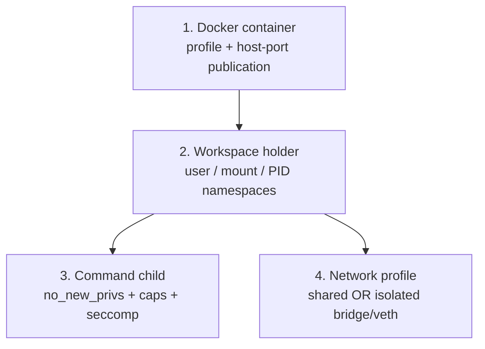
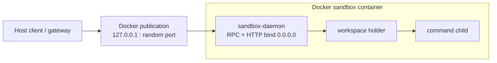
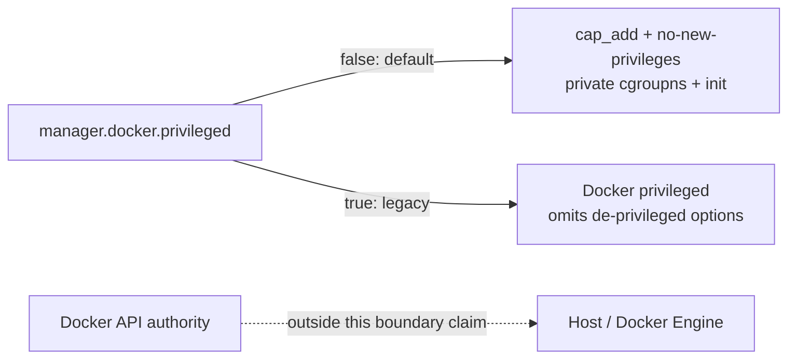
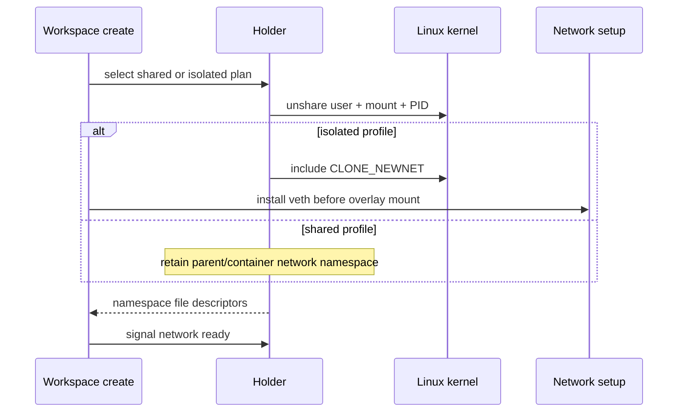
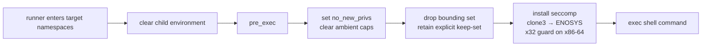
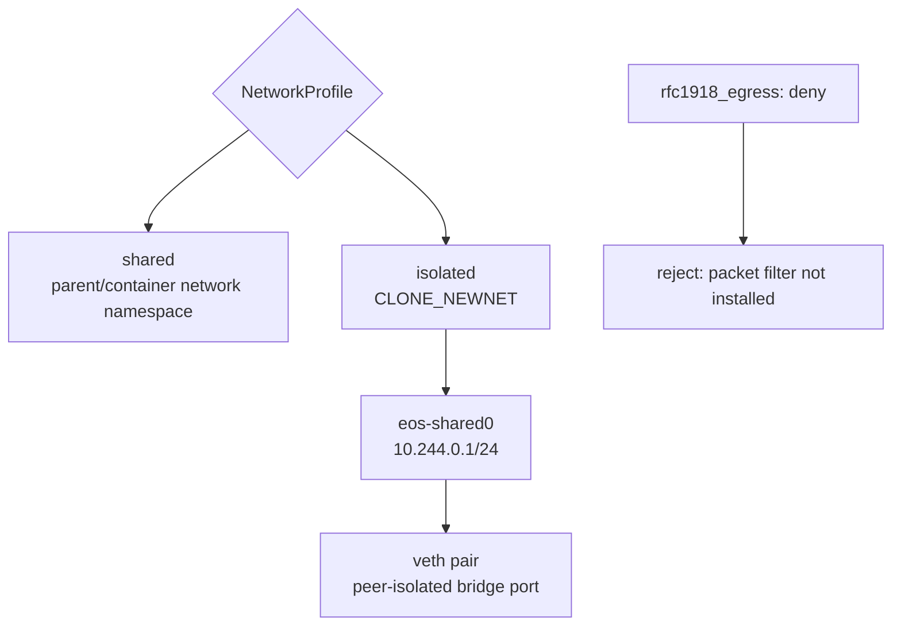

# Isolation model

> **Visual-first reference.** Read the diagrams and tables first; the short
> captions state the boundary claims. Every source citation is relative to the
> `ephemeral-sandbox` repository root. Detailed mechanics remain in
> [namespace processes](../01-workspace-runtime/02-namespace-processes.md),
> [overlay mounting](../01-workspace-runtime/03-overlay-mount.md), [workspace
> sessions](../01-workspace-runtime/04-workspace-sessions.md), and [command
> execution](../01-workspace-runtime/05-command-execution.md). Those links
> supply terminology, not evidence.

## Claim key

| Mark | Reading rule |
| --- | --- |
| **G — Implemented guarantee** | The inspected code asks Docker or the kernel to perform the stated action. |
| **C — Conditional property** | It applies only under the configuration, platform, or runtime condition in the cell. |
| **L — Limitation / non-goal** | Do not infer the stronger boundary named in the cell. |
| **Q — Open question** | Current source does not answer the deployment or policy decision. |

## Boundary ladder: outside to inside

| Layer | Enforced scope | Primary mechanism | Boundary does **not** establish |
| --- | --- | --- | --- |
| 1 — Docker container | daemon plus every workspace holder it starts | Docker `HostConfig`, labels, volumes, and port publishing | **L:** a VM boundary or protection from a principal with Docker-socket/daemon authority. `crates/sandbox-provider-docker/src/engine.rs:169` `crates/sandbox-provider-docker/src/engine.rs:205` |
| 2 — Workspace holder | one workspace’s user, mount, and PID context | `unshare`, UID/GID maps, private mount propagation, namespace FDs | **L:** UTS, IPC, or cgroup namespace separation. `crates/sandbox-runtime/namespace-process/src/holder/namespace.rs:80` `crates/sandbox-runtime/namespace-process/src/holder/namespace.rs:83` |
| 3 — Command child | the shell child immediately before `exec` | `no_new_privs`, non-empty capability keep-set, seccomp rules | **L:** a capability-free child or a syscall allowlist. `crates/sandbox-runtime/namespace-process/src/runner/shell_security.rs:1` `crates/sandbox-runtime/namespace-process/src/runner/shell_security.rs:40` |
| 4 — Network profile | the workspace’s network-namespace choice | parent network namespace, or `CLONE_NEWNET` plus bridge/veth setup | **L:** destination/egress filtering. `crates/sandbox-runtime/workspace/src/isolated_network_setup/mod.rs:95` `crates/sandbox-runtime/workspace/src/isolated_network_setup/mod.rs:103` |

## 1 — Docker container: listener and profile picture

**G:** Docker publishes each daemon port at `127.0.0.1` with host port `0`,
while daemon TCP and HTTP bind `0.0.0.0` *inside* the container. Loopback is
therefore supplied by Docker publication, not the daemon listener.
`crates/sandbox-provider-docker/src/engine.rs:703`
`crates/sandbox-provider-docker/src/engine.rs:720`
`crates/sandbox-provider-docker/src/launch.rs:8`
`crates/sandbox-provider-docker/src/launch.rs:47`

| Docker-profile choice | What code requests | Condition / limit |
| --- | --- | --- |
| Capabilities | **G:** add only `SYS_ADMIN` and `NET_ADMIN` in the de-privileged path. `crates/sandbox-provider-docker/src/engine.rs:33` `crates/sandbox-provider-docker/src/engine.rs:38` | **C:** only when `manager.docker.privileged` is `false`, its default. `crates/sandbox-config/src/configs/manager.rs:215` `crates/sandbox-config/src/configs/manager.rs:277` |
| Hardened container options | **G:** request `no-new-privileges`, private cgroup namespace, Docker init, and leave seccomp unspecified so Docker’s default profile applies. `crates/sandbox-provider-docker/src/engine.rs:33` `crates/sandbox-provider-docker/src/engine.rs:182` `crates/sandbox-provider-docker/src/engine.rs:205` | **C:** the named security options are omitted by the `privileged: true` branch. `crates/sandbox-provider-docker/src/engine.rs:482` `crates/sandbox-provider-docker/src/engine.rs:493` |
| CPU / memory | **C:** pass NanoCPU and memory values only when configured; default values are absent. `crates/sandbox-config/src/configs/manager.rs:241` `crates/sandbox-config/src/configs/manager.rs:244` `crates/sandbox-config/src/configs/manager.rs:274` `crates/sandbox-provider-docker/src/engine.rs:182` `crates/sandbox-provider-docker/src/engine.rs:192` | **L:** no default resource-limit claim. |
| `privileged: true` | **C:** Docker receives privileged mode; it is documented as a legacy escape hatch. `crates/sandbox-config/src/configs/manager.rs:215` `crates/sandbox-config/src/configs/manager.rs:220` | **L:** default-profile claims do not transfer to this mode. |
| Proxy environment | **C:** `container_env` is injected into sandbox containers and explicitly accommodates `HTTP_PROXY`; the effective route depends on that configuration and deployment. `crates/sandbox-config/src/configs/manager.rs:245` `crates/sandbox-config/src/configs/manager.rs:250` `crates/sandbox-provider-docker/src/runtime.rs:239` `crates/sandbox-provider-docker/src/runtime.rs:250` | **L:** this is not runtime egress filtering. |

**L:** the provider itself uses the Docker API to construct containers, labels,
binds, volumes, and publications. The source adds no separate control that
protects the host from Docker-socket or Docker-daemon users.
`crates/sandbox-provider-docker/src/engine.rs:169`
`crates/sandbox-provider-docker/src/engine.rs:215`

## 2 — Workspace namespace formation workflow

| Namespace result | Evidence | Condition / non-protection |
| --- | --- | --- |
| User, mount, PID | **G:** holder unshares these namespaces, maps UID/GID 0 to its parent identity, makes `/` recursively private, and retains descriptors. `crates/sandbox-runtime/namespace-process/src/holder/namespace.rs:73` `crates/sandbox-runtime/namespace-process/src/holder/namespace.rs:113` | **L:** the flag set does not request UTS, IPC, or cgroup namespaces. `crates/sandbox-runtime/namespace-process/src/holder/namespace.rs:80` `crates/sandbox-runtime/namespace-process/src/holder/namespace.rs:83` |
| Network namespace | **C:** `isolated` includes `CLONE_NEWNET`; `shared` retains the parent network namespace. `crates/sandbox-runtime/namespace-process/src/holder/namespace.rs:80` `crates/sandbox-runtime/workspace/src/namespace/mod.rs:62` `crates/sandbox-runtime/workspace/src/namespace/mod.rs:87` | **C:** in a Docker sandbox, that parent is the daemon’s container namespace; this follows from the container daemon launch plus the no-`CLONE_NEWNET` path. `crates/sandbox-provider-docker/src/launch.rs:16` `crates/sandbox-runtime/namespace-process/src/holder/namespace.rs:80` |
| Platform | **C:** unshare support is Linux-specific and startup asserts Linux 5.8+. `crates/sandbox-runtime/namespace-process/src/holder/namespace.rs:116` `crates/sandbox-runtime/namespace-process/src/holder/namespace.rs:123` `crates/sandbox-runtime/operation/src/services.rs:244` `crates/sandbox-runtime/operation/src/services.rs:259` | **Q:** target-kernel support for the complete feature set remains a deployment validation decision. |

## 3 — Command-child restriction workflow

| Restriction | Code-level guarantee | Limit |
| --- | --- | --- |
| Process privilege | **G:** child setup clears ambient capabilities, drops non-kept bounding capabilities, applies the keep-set, and sets `PR_SET_NO_NEW_PRIVS`. `crates/sandbox-runtime/namespace-process/src/runner/shell_exec.rs:91` `crates/sandbox-runtime/namespace-process/src/runner/shell_security.rs:158` `crates/sandbox-runtime/namespace-process/src/runner/shell_security.rs:396` | **L:** the keep-set is explicit and non-empty, including `CAP_NET_RAW`, `CAP_SETUID`, and `CAP_MKNOD`. `crates/sandbox-runtime/namespace-process/src/runner/shell_security.rs:27` `crates/sandbox-runtime/namespace-process/src/runner/shell_security.rs:53` |
| Syscalls | **G:** filters deny listed filesystem, namespace, system, observability, and resource-control families; `clone3` returns `ENOSYS`. `crates/sandbox-runtime/namespace-process/src/runner/shell_security.rs:78` `crates/sandbox-runtime/namespace-process/src/runner/shell_security.rs:120` `crates/sandbox-runtime/namespace-process/src/runner/shell_security.rs:220` `crates/sandbox-runtime/namespace-process/src/runner/shell_security.rs:228` | **C:** the x32 kill guard is active only on x86-64. `crates/sandbox-runtime/namespace-process/src/runner/shell_security.rs:315` `crates/sandbox-runtime/namespace-process/src/runner/shell_security.rs:326` |
| Model-path masking | **C:** existing configured `hidden_paths` directories receive a tmpfs mask with `mode=000`, `nosuid`, `nodev`, `noexec`, and readonly flags. `crates/sandbox-runtime/namespace-process/src/runner/mod.rs:53` `crates/sandbox-runtime/namespace-process/src/runner/mod.rs:92` | **L:** selected-path masking is not a claim about all of `/eos` or a read-only workspace filesystem. |

## 4 — Network-profile decision picture

| Profile / policy | Implemented mechanism | What must not be claimed |
| --- | --- | --- |
| `shared` | **G:** workspace uses the plan without a network namespace and keeps its parent network context. `crates/sandbox-runtime/workspace/src/lifecycle/create.rs:17` `crates/sandbox-runtime/workspace/src/namespace/mod.rs:62` `crates/sandbox-runtime/workspace/src/namespace/mod.rs:87` | **L:** no per-workspace network or egress boundary is introduced by this profile. |
| `isolated` | **G:** create `eos-shared0` at `10.244.0.1/24`, allocate `10.244.0.2`–`10.244.0.254`, move one veth end into the holder namespace, attach the peer to the bridge, and request bridge-port isolation. `crates/sandbox-runtime/workspace/src/isolated_network_setup/mod.rs:13` `crates/sandbox-runtime/workspace/src/isolated_network_setup/mod.rs:62` `crates/sandbox-runtime/workspace/src/isolated_network_setup/rtnl.rs:63` `crates/sandbox-runtime/workspace/src/isolated_network_setup/rtnl.rs:119` | **L:** bridge-port peer isolation is not a packet-filter or egress-control guarantee. |
| `rfc1918_egress: deny` | **G:** runtime rejects this configuration because it would require packet filtering, which it does not install. `crates/sandbox-runtime/workspace/src/isolated_network_setup/mod.rs:82` `crates/sandbox-runtime/workspace/src/isolated_network_setup/mod.rs:103` | **L:** do not infer filtering for RFC1918 ranges, proxy destinations, or Internet reachability. |

## Decisions still outside the code

| Decision | Why it remains open |
| --- | --- |
| **Q — Kernel support** | Linux-only code and a 5.8 floor do not prove the required namespace, mount, veth, and seccomp options on every target kernel. `crates/sandbox-runtime/namespace-process/src/holder/namespace.rs:116` `crates/sandbox-runtime/operation/src/services.rs:244` |
| **Q — `privileged: true`** | Decide whether the legacy bypass belongs in a deployment profile. `crates/sandbox-config/src/configs/manager.rs:215` `crates/sandbox-provider-docker/src/engine.rs:482` |
| **Q — Network egress** | Decide whether to add packet filtering and what destination policy it should implement. `crates/sandbox-runtime/workspace/src/isolated_network_setup/mod.rs:95` |
| **Q — Remote bind / TLS / browser trust** | Docker loopback publication says nothing about remote console or gateway deployment; the corresponding trust model is covered in [tokens and trust boundaries](02-tokens-and-trust-boundaries.md). `crates/sandbox-provider-docker/src/engine.rs:703` |
| **Q — Token rotation** | Per-sandbox token lifecycle is a separate policy decision; see [tokens and trust boundaries](02-tokens-and-trust-boundaries.md). `crates/sandbox-provider-docker/src/launch.rs:19` |
