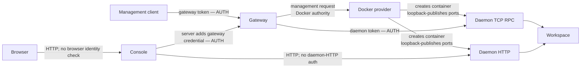
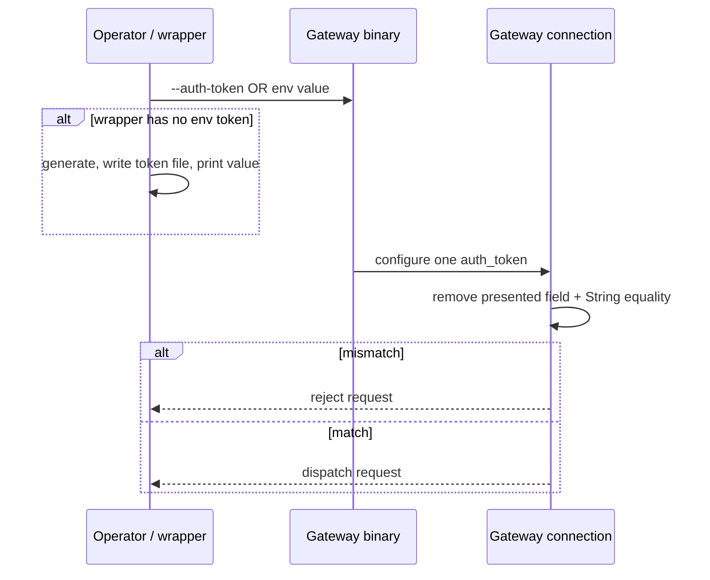
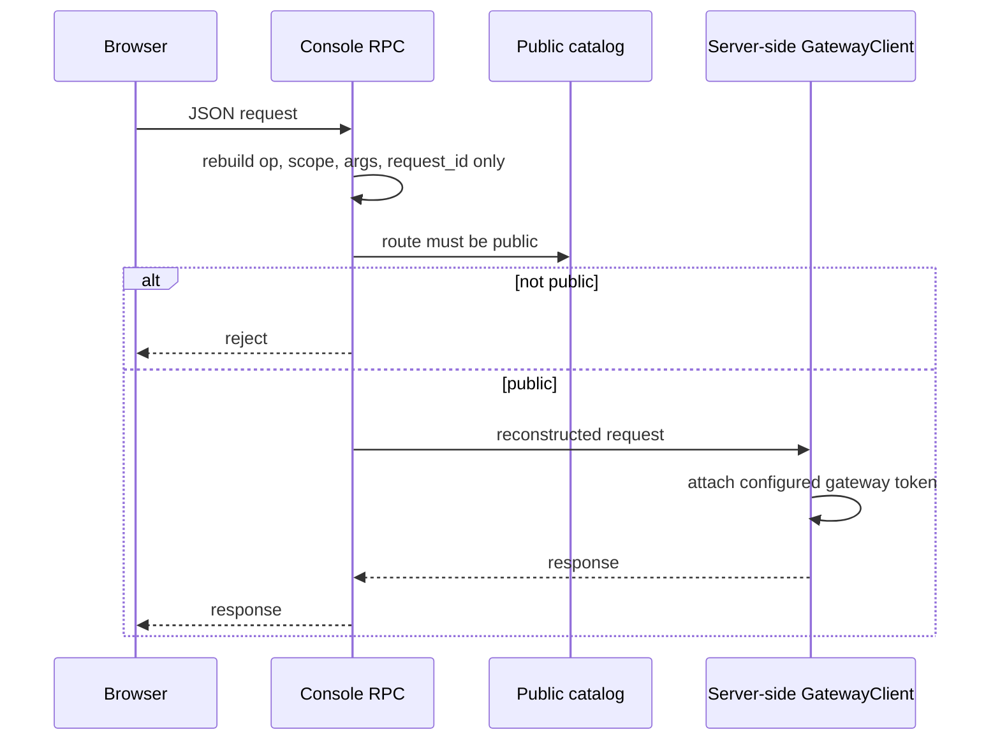
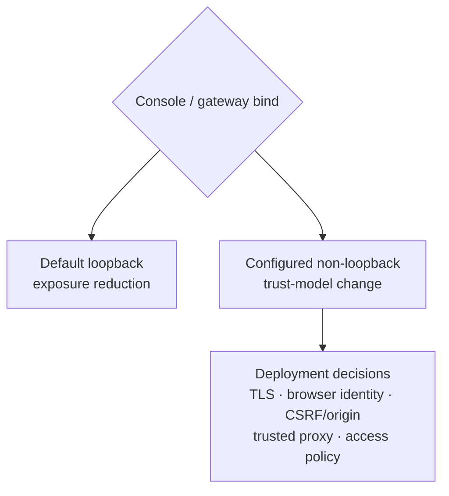

# Tokens and trust boundaries

> **Visual-first reference.** This page distinguishes application-token checks
> from loopback placement, filesystem permissions, Docker authority, and
> browser same-origin placement. Those controls are not interchangeable.
> Source citations are relative to `ephemeral-sandbox`; the linked architecture
> pages supply terminology rather than evidence.

## Claim key

| Mark | Meaning |
| --- | --- |
| **G — Implemented guarantee** | The indicated source path performs the check or stores the state. |
| **C — Conditional property** | It depends on an explicit binary, deployment, bind, or filesystem condition. |
| **L — Limitation / non-goal** | The code does not establish the stronger protection named in the cell. |
| **Q — Open question** | A policy or lifecycle outcome is not defined by current code. |

## Trust-boundary picture: where each request is checked

**G:** gateway token verification happens before gateway dispatch; daemon-token
verification happens on the TCP-RPC branch before daemon dispatch. The
server-side console client constructs gateway requests with its own credential.
`crates/sandbox-gateway/src/gateway/connection.rs:79`
`crates/sandbox-gateway/src/gateway/connection.rs:82`
`crates/sandbox-daemon/src/rpc/dispatch.rs:144`
`crates/sandbox-daemon/src/rpc/dispatch.rs:166`
`crates/sandbox-operations/client/src/client.rs:91`
`crates/sandbox-operations/client/src/client.rs:93`

| Path label in picture | What actually carries the protection | What it does **not** mean |
| --- | --- | --- |
| **AUTH** | **G:** an application bearer value is removed and compared. `crates/sandbox-gateway/src/gateway/connection.rs:79` `crates/sandbox-daemon/src/rpc/dispatch.rs:144` | **L:** both paths use ordinary string equality; neither establishes a constant-time comparison. `crates/sandbox-gateway/src/gateway/connection.rs:82` `crates/sandbox-daemon/src/rpc/dispatch.rs:166` |
| **loopback-published** | **C:** Docker puts daemon ports on random `127.0.0.1` host ports. `crates/sandbox-provider-docker/src/engine.rs:703` `crates/sandbox-provider-docker/src/engine.rs:720` | **L:** loopback is placement, not application authentication. |
| **filesystem permission** | **G:** daemon changes the Unix socket to mode `0600`. `crates/sandbox-daemon/src/rpc/lifecycle.rs:35` `crates/sandbox-daemon/src/rpc/lifecycle.rs:38` | **L:** socket mode is not a daemon bearer-token check. |
| **Docker authority** | **G:** provider constructs and inspects Docker resources through its configured Engine endpoint. `crates/sandbox-config/src/configs/manager.rs:198` `crates/sandbox-provider-docker/src/engine.rs:157` `crates/sandbox-provider-docker/src/engine.rs:652` | **L:** this source supplies no separate host access-control claim for Docker-socket or Docker-daemon users. |
| **same-origin placement** | **C:** browser rules depend on the origin arrangement in which the console is deployed. | **L:** same-origin placement is neither user authentication nor a CORS policy implemented by this console. `crates/sandbox-console/src/router.rs:14` `crates/sandbox-console/src/router.rs:19` |

## Credential inventory

| Surface | Issuer; storage / exposure | Verifier | Transport scope | Restart / rotation | Limitation / non-goal |
| --- | --- | --- | --- | --- | --- |
| **Gateway token** | **G:** gateway binary takes `--auth-token` or `SANDBOX_GATEWAY_AUTH_TOKEN`; blank/absent input is rejected. `crates/sandbox-gateway/src/gateway/main.rs:86` `crates/sandbox-gateway/src/gateway/main.rs:102` `crates/sandbox-gateway/src/gateway/main.rs:189` `crates/sandbox-gateway/src/gateway/main.rs:195`  **C:** supplied Docker wrapper generates, exports, writes, and prints a token; default file is `/tmp/eos-gateway.token`. `bin/start-sandbox-docker-gateway:13` `bin/start-sandbox-docker-gateway:211` `bin/start-sandbox-docker-gateway:222` `bin/start-sandbox-docker-gateway:263` | **G:** gateway removes and compares the field when configured. `crates/sandbox-gateway/src/gateway/connection.rs:79` `crates/sandbox-gateway/src/gateway/connection.rs:82` | **C:** default bind is `127.0.0.1:7878`, but YAML/flag/environment resolution can select another address. `crates/sandbox-config/src/configs/gateway.rs:12` `crates/sandbox-gateway/src/gateway/lifecycle.rs:13` | **G:** binary resolves one value before serving. `crates/sandbox-gateway/src/gateway/main.rs:83` `crates/sandbox-gateway/src/gateway/main.rs:102`  **Q:** no rotation, overlap, or revocation contract is documented. | **L:** library config can hold `auth_token: None`, which accepts requests. `crates/sandbox-config/src/configs/gateway.rs:27` `crates/sandbox-config/src/configs/gateway.rs:37` `crates/sandbox-gateway/src/gateway/connection.rs:81`  **L:** wrapper does not call `chmod`; a new file follows umask and an existing file retains mode. No `0600` gateway-token-file guarantee. `bin/start-sandbox-docker-gateway:221` `bin/start-sandbox-docker-gateway:222` |
| **Per-sandbox daemon token** | **G:** Docker creation generates a UUID, places it in the `eos.auth_token` label and daemon argv, then records it in `SandboxDaemonEndpoint`. `crates/sandbox-provider-docker/src/runtime.rs:218` `crates/sandbox-provider-docker/src/runtime.rs:224` `crates/sandbox-provider-docker/src/runtime.rs:468` `crates/sandbox-provider-docker/src/launch.rs:43` `crates/sandbox-manager/src/model.rs:118`  **C:** optional manager snapshots serialize the endpoint; Unix staged-file creation requests `0600`. `crates/sandbox-manager/src/store.rs:211` `crates/sandbox-manager/src/store.rs:235` | **G:** TCP RPC strips and compares the token; a TCP listener without a non-empty configured token is rejected. `crates/sandbox-daemon/src/rpc/dispatch.rs:144` `crates/sandbox-daemon/src/rpc/dispatch.rs:166` `crates/sandbox-daemon/src/serve.rs:257` `crates/sandbox-daemon/src/serve.rs:261` | **C:** daemon TCP binds `0.0.0.0` in the container; Docker publishes a random loopback port. `crates/sandbox-provider-docker/src/launch.rs:35` `crates/sandbox-provider-docker/src/engine.rs:703` | **G:** Docker recovery reads the label to reconstruct an endpoint. `crates/sandbox-provider-docker/src/engine.rs:676` `crates/sandbox-provider-docker/src/runtime.rs:69` `crates/sandbox-provider-docker/src/runtime.rs:72`  **Q:** no replacement/revocation protocol is exposed. | **L:** ordinary management responses omit the token, but it remains in labels, argv, and manager state. Docker-metadata readers, relevant host users, and registry readers are not shown to be prevented from retrieving it. `crates/sandbox-manager/src/operations/registry/management_operations.rs:257` `crates/sandbox-manager/src/operations/registry/management_operations.rs:277` `crates/sandbox-provider-docker/src/runtime.rs:468` `crates/sandbox-provider-docker/src/launch.rs:43` |
| **Daemon Unix socket** | **G:** daemon creates the configured Unix socket and changes it to `0600`; Docker launch names `/eos/runtime/daemon/runtime.sock`. `crates/sandbox-daemon/src/rpc/lifecycle.rs:35` `crates/sandbox-daemon/src/rpc/lifecycle.rs:38` `crates/sandbox-provider-docker/src/launch.rs:9` `crates/sandbox-provider-docker/src/launch.rs:32` | **G:** Unix connections reach dispatch with `is_tcp = false`; the TCP token path is not used. `crates/sandbox-daemon/src/rpc/lifecycle.rs:51` `crates/sandbox-daemon/src/rpc/lifecycle.rs:63` `crates/sandbox-daemon/src/rpc/dispatch.rs:29` `crates/sandbox-daemon/src/rpc/dispatch.rs:40` | **C:** controls the local socket path while its permissions and surrounding filesystem arrangement remain in place. | **G:** graceful shutdown removes the socket and PID file. `crates/sandbox-daemon/src/rpc/lifecycle.rs:176` `crates/sandbox-daemon/src/rpc/lifecycle.rs:177` | **L:** no application authentication occurs on this Unix branch. |
| **Daemon HTTP** | **G:** `SandboxHttpEndpoint` holds host and port, not a bearer credential. `crates/sandbox-manager/src/model.rs:132` `crates/sandbox-manager/src/model.rs:136` | **L:** HTTP router provides its routes without an application-auth gate. `crates/sandbox-daemon/src/rpc/lifecycle.rs:72` `crates/sandbox-daemon/src/rpc/lifecycle.rs:74` `crates/sandbox-daemon/src/http/router.rs:18` `crates/sandbox-daemon/src/http/router.rs:24` | **C:** runs only when HTTP host and port are configured; Docker publishes it separately to loopback. `crates/sandbox-daemon/src/rpc/runtime.rs:54` `crates/sandbox-daemon/src/rpc/runtime.rs:56` `crates/sandbox-provider-docker/src/engine.rs:712` | **Q:** no HTTP-token lifecycle exists to rotate. | **L:** HTTP/1.1 is served directly over `TcpStream`; no TLS or daemon-HTTP application authentication is established. `crates/sandbox-daemon/src/http/server.rs:70` `crates/sandbox-daemon/src/http/server.rs:75` |
| **Console browser → server** | **G:** console holds gateway credential server-side. Browser RPC reconstruction copies only `op`, `scope`, `args`, and `request_id`. `crates/sandbox-console/src/state.rs:19` `crates/sandbox-console/src/state.rs:21` `crates/sandbox-console/src/rpc.rs:125` `crates/sandbox-console/src/rpc.rs:129` `crates/sandbox-console/src/rpc.rs:133` `crates/sandbox-console/src/rpc.rs:141` | **L:** router has no user/session-authentication gate. It accepts only public catalog operations, which is an operation filter—not identity verification. `crates/sandbox-console/src/router.rs:14` `crates/sandbox-console/src/rpc.rs:108` `crates/sandbox-console/src/rpc.rs:111` | **C:** default bind is `127.0.0.1:7880`; flag, environment, and YAML can change it. `crates/sandbox-config/src/configs/console.rs:7` `crates/sandbox-console/src/config.rs:75` `crates/sandbox-console/src/config.rs:78` | **G:** endpoint cache is process memory and disappears when console `AppState` is recreated. `crates/sandbox-console/src/endpoint.rs:58` `crates/sandbox-console/src/endpoint.rs:59` `crates/sandbox-console/src/state.rs:23` | **L:** direct HTTP/1.1 over `TcpStream` adds no TLS. The only `Origin` branch rejects literal `Origin: null` on `/api/`; it is neither general origin validation nor CORS policy. `crates/sandbox-console/src/server.rs:50` `crates/sandbox-console/src/server.rs:56` `crates/sandbox-console/src/router.rs:19` `crates/sandbox-console/src/router.rs:61` `crates/sandbox-console/src/response.rs:82` |

## Gateway-token workflow

| Gateway boundary decision | Evidence |
| --- | --- |
| **G:** token material is skipped by YAML deserialization; the executable resolves it only from flag/environment. | `crates/sandbox-config/src/configs/gateway.rs:18` `crates/sandbox-config/src/configs/gateway.rs:27` `crates/sandbox-gateway/src/gateway/main.rs:86` `crates/sandbox-gateway/src/gateway/main.rs:189` |
| **C:** mandatory authentication belongs to the binary serve path; a library caller can intentionally construct `auth_token: None`. | `crates/sandbox-gateway/src/gateway/main.rs:83` `crates/sandbox-config/src/configs/gateway.rs:37` `crates/sandbox-gateway/src/gateway/connection.rs:81` |
| **L:** printing and shell-redirection storage do not provide a token-file permission guarantee. | `bin/start-sandbox-docker-gateway:222` `bin/start-sandbox-docker-gateway:263` |

## Console credential-confinement workflow

**G:** the browser cannot supply an arbitrary original operation object through
this reconstruction path, and the gateway credential is inserted server-side.
**L:** this confines the credential; it does not authenticate the browser or
user. `crates/sandbox-console/src/rpc.rs:103`
`crates/sandbox-console/src/rpc.rs:125`
`crates/sandbox-console/src/rpc.rs:151`
`crates/sandbox-operations/client/src/client.rs:91`

## Remote-bind and policy decision board

| Decision still needed | Current-code boundary |
| --- | --- |
| **Q — Kernel support** | Define the Linux/kernel feature matrix; code supplies Linux-gated namespace support and a 5.8 startup floor. `crates/sandbox-runtime/namespace-process/src/holder/namespace.rs:72` `crates/sandbox-runtime/operation/src/services.rs:244` |
| **Q — Remote bind / TLS** | Console and gateway bind configurable addresses; remote binding does not activate TLS or add a remote-deployment security model. `crates/sandbox-gateway/src/gateway/lifecycle.rs:13` `crates/sandbox-console/src/server.rs:25` `crates/sandbox-console/src/server.rs:56` |
| **Q — Browser authentication** | Choose identity/session, CORS/origin, CSRF, and proxy policy before treating console as a multi-user remote surface. `crates/sandbox-console/src/router.rs:14` `crates/sandbox-console/src/router.rs:61` |
| **Q — Token rotation** | Specify issuance, replacement, overlap, revocation, and recovery for gateway and daemon tokens. `crates/sandbox-gateway/src/gateway/main.rs:102` `crates/sandbox-provider-docker/src/runtime.rs:218` `crates/sandbox-provider-docker/src/runtime.rs:72` |
| **Q — `privileged: true`** | Decide whether the legacy Docker bypass belongs in deployed profiles. `crates/sandbox-config/src/configs/manager.rs:215` |
| **Q — isolated-network egress** | Decide whether to add an actual packet-filtering implementation. `crates/sandbox-runtime/workspace/src/isolated_network_setup/mod.rs:95` |

For namespace and network context, see [namespace
processes](../01-workspace-runtime/02-namespace-processes.md) and [workspace
sessions](../01-workspace-runtime/04-workspace-sessions.md).
