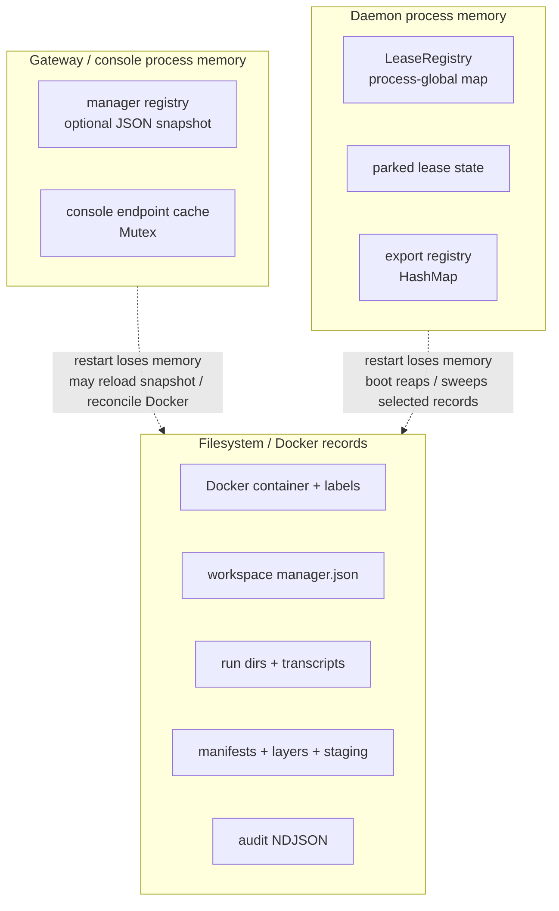
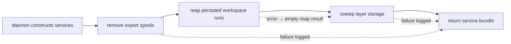
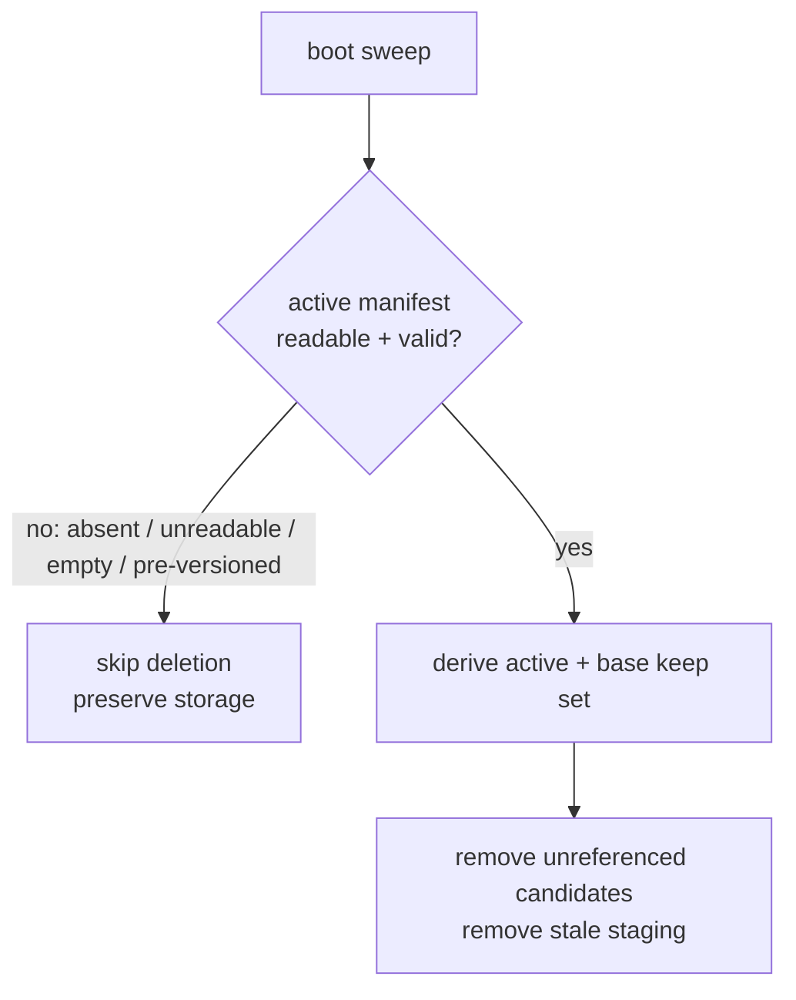
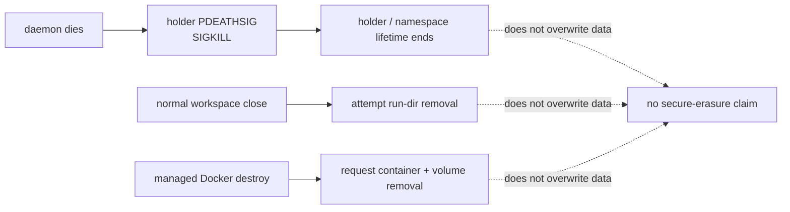

# Ephemerality and crash recovery

> **Visual-first lifecycle reference.** State held in process memory disappears
> when that process is replaced; selected filesystem and Docker records remain
> available for cleanup, reconciliation, or later deletion. “Short-lived” and
> “persistent” therefore coexist in this runtime. Source citations are relative
> to `ephemeral-sandbox`; [workspace sessions](../01-workspace-runtime/04-workspace-sessions.md)
> and [the layer-stack store](../01-workspace-runtime/01-layerstack-store.md)
> provide terminology, not evidence.

## Claim key

| Mark | Meaning |
| --- | --- |
| **G — Implemented guarantee** | The current source path performs the lifecycle action. |
| **C — Conditional property** | It needs the stated restart mode, configuration, or successful lower-layer action. |
| **L — Limitation / non-goal** | Do not infer a stronger deletion, recovery, or durability guarantee. |
| **Q — Open question** | Current code does not establish the outcome. |

## Persistence picture

**G:** the lease registry is a process-global `HashMap`; parked state is
explicitly in-memory; the export registry is an in-memory map; and console
endpoint cache belongs to console `AppState`.
`crates/sandbox-runtime/layerstack/src/stack/lease/registry.rs:17`
`crates/sandbox-runtime/layerstack/src/stack/lease/registry.rs:103`
`crates/sandbox-runtime/workspace/src/session/state.rs:19`
`crates/sandbox-runtime/workspace/src/session/state.rs:21`
`crates/sandbox-runtime/operation/src/layerstack/service/core.rs:13`
`crates/sandbox-console/src/endpoint.rs:58`
`crates/sandbox-console/src/state.rs:23`

## What survives what

**Reading rule:** “not established” deliberately means neither preserved nor
deleted is proven. The matrix covers source-visible behavior rather than Docker
or host assumptions.

| State / location | Gateway restart | Daemon restart / crash | Managed container destruction | Host reboot | Exact guarantee or limitation |
| --- | --- | --- | --- | --- | --- |
| **Docker container + labels** — Docker metadata | **C:** Docker-backed gateway startup lists matching containers and reconstructs records. `crates/sandbox-gateway/src/gateway/main.rs:165` `crates/sandbox-provider-docker/src/engine.rs:406` `crates/sandbox-provider-docker/src/engine.rs:418` | **Q:** daemon-exit behavior is not established; daemon is the container command. `crates/sandbox-provider-docker/src/launch.rs:16` | **C:** provider is asked to remove container then named runtime volumes. `crates/sandbox-manager/src/operations/management/service/impls/destroy_sandbox.rs:26` `crates/sandbox-provider-docker/src/runtime.rs:290` `crates/sandbox-provider-docker/src/runtime.rs:294` | **Q:** not established. | **G:** creation labels identity, instance, token, ports, paths, and cleanup policy. `crates/sandbox-provider-docker/src/runtime.rs:462` `crates/sandbox-provider-docker/src/runtime.rs:484` |
| **Manager registry** — optional gateway JSON snapshot | **C:** configured snapshot loads then reconciles Docker; no path means in-memory store. `crates/sandbox-gateway/src/gateway/main.rs:160` `crates/sandbox-manager/src/store.rs:33` `crates/sandbox-manager/src/store.rs:46` | **L:** daemon boot does not load gateway store in this path. | **G:** manager removes record on success; marks failed on provider error. `crates/sandbox-manager/src/operations/management/service/impls/destroy_sandbox.rs:27` `crates/sandbox-manager/src/operations/management/service/impls/destroy_sandbox.rs:33` | **Q:** not established. | **G:** snapshot mutation stages, syncs, and renames; Unix staged creation requests `0600`. `crates/sandbox-manager/src/store.rs:229` `crates/sandbox-manager/src/store.rs:235` `crates/sandbox-manager/src/store.rs:241` |
| **Workspace `manager.json`** — daemon scratch root | **L:** gateway restart has no shown read path. | **G:** persists run dir, holder PID, and veth data; boot reap reads and rewrites it. `crates/sandbox-runtime/workspace/src/lifecycle/persistence.rs:28` `crates/sandbox-runtime/workspace/src/lifecycle/persistence.rs:77` `crates/sandbox-runtime/workspace/src/lifecycle/persistence.rs:111` | **C:** managed destroy requests scratch-volume removal. `crates/sandbox-provider-docker/src/runtime.rs:294` `crates/sandbox-provider-docker/src/runtime.rs:343` `crates/sandbox-provider-docker/src/runtime.rs:363` | **Q:** not established. | **G:** writes use temp file, sync, rename, and directory sync. `crates/sandbox-runtime/workspace/src/lifecycle/persistence.rs:46` `crates/sandbox-runtime/workspace/src/lifecycle/persistence.rs:60` |
| **Workspace run directories** — recorded `scratch_dir` | **L:** gateway lifecycle does not clean them. | **C:** boot reap removes only paths beneath scratch root and records outcome. `crates/sandbox-runtime/workspace/src/lifecycle/persistence.rs:98` `crates/sandbox-runtime/workspace/src/lifecycle/persistence.rs:103` | **C:** scratch-volume removal is requested. `crates/sandbox-provider-docker/src/runtime.rs:294` `crates/sandbox-provider-docker/src/runtime.rs:346` | **Q:** not established. | **G:** normal close also attempts teardown and run-dir removal. `crates/sandbox-runtime/workspace/src/lifecycle/destroy.rs:35` `crates/sandbox-runtime/workspace/src/lifecycle/destroy.rs:47` |
| **Holder / runner processes** — process table + namespaces | **L:** gateway does not supervise daemon-local children. | **G (Linux holder):** holder installs `PDEATHSIG(SIGKILL)`; PID-namespace init separately sets parent-death `SIGTERM`. **L:** no durable runner record/recovery path. `crates/sandbox-runtime/namespace-process/src/holder/mod.rs:132` `crates/sandbox-runtime/namespace-process/src/holder/mod.rs:155` `crates/sandbox-runtime/namespace-process/src/holder/namespace.rs:189` | **C:** destroy first asks daemon installer to stop daemon then calls provider. `crates/sandbox-manager/src/operations/management/service/impls/destroy_sandbox.rs:23` `crates/sandbox-manager/src/operations/management/service/impls/destroy_sandbox.rs:26` | **Q:** not established. | **L:** ordinary runner process-group termination is not evidence of equivalent crash handling. `crates/sandbox-runtime/namespace-process/src/runner/shell_exec/wait.rs:82` `crates/sandbox-runtime/namespace-process/src/runner/shell_exec/wait.rs:108` |
| **Layer manifest / layers / staging** — layer-stack volume | **L:** gateway restart does not operate daemon layer storage. | **G:** boot reaps sessions then calls storage sweep. `crates/sandbox-runtime/operation/src/services.rs:175` `crates/sandbox-runtime/operation/src/services.rs:193` `crates/sandbox-runtime/operation/src/services.rs:195` | **C:** layer-stack-volume removal is requested. `crates/sandbox-provider-docker/src/runtime.rs:294` `crates/sandbox-provider-docker/src/runtime.rs:345` | **Q:** not established. | **G:** absent, unreadable, empty, or pre-versioned manifest skips sweep; trusted manifest permits removal of unreferenced non-base layers and stale staging. `crates/sandbox-runtime/layerstack/src/stack/lease/cleanup.rs:84` `crates/sandbox-runtime/layerstack/src/stack/lease/cleanup.rs:92` `crates/sandbox-runtime/layerstack/src/stack/lease/cleanup.rs:115` `crates/sandbox-runtime/layerstack/src/stack/lease/cleanup.rs:123` |
| **Leases** — `LeaseRegistry` map | **L:** gateway neither persists nor rebuilds it. | **G:** new daemon gets new map/process memory rather than deserializing leases. `crates/sandbox-runtime/layerstack/src/stack/lease/registry.rs:17` `crates/sandbox-runtime/layerstack/src/stack/lease/registry.rs:103` | **C:** provider requests volume removal, not lease recovery. `crates/sandbox-provider-docker/src/runtime.rs:294` `crates/sandbox-provider-docker/src/runtime.rs:345` | **Q:** not established. | **L:** sweep safety comes from active manifest, not recovered lease state. `crates/sandbox-runtime/layerstack/src/stack/lease/cleanup.rs:76` `crates/sandbox-runtime/layerstack/src/stack/lease/cleanup.rs:95` |
| **Parked state** — `parked_lease_id` | **L:** no gateway persistence path. | **G:** optional second lease is in-memory only and never persisted. `crates/sandbox-runtime/workspace/src/session/state.rs:19` `crates/sandbox-runtime/workspace/src/session/state.rs:21` | **C:** scratch and layer volumes are requested for removal. `crates/sandbox-provider-docker/src/runtime.rs:294` `crates/sandbox-provider-docker/src/runtime.rs:343` | **Q:** not established. | **L:** `manager.json` persists primary snapshot lease, not parked state. `crates/sandbox-runtime/workspace/src/lifecycle/persistence.rs:23` `crates/sandbox-runtime/workspace/src/session/state.rs:20` |
| **Export spools + registry** — `scratch/.export` + map | **L:** gateway does not own spool directory. | **G:** boot calls spool removal; registry is in-memory and export path specifies retry after restart. **C:** removal succeeds only if `remove_dir_all` succeeds. `crates/sandbox-runtime/operation/src/services.rs:147` `crates/sandbox-runtime/operation/src/services.rs:156` `crates/sandbox-runtime/operation/src/layerstack/service/core.rs:13` `crates/sandbox-runtime/operation/src/layerstack/service/core.rs:28` | **C:** scratch-volume removal is requested. `crates/sandbox-provider-docker/src/runtime.rs:294` `crates/sandbox-provider-docker/src/runtime.rs:346` | **Q:** not established. | **L:** directory removal is not secure erasure. |
| **Console endpoint cache** — console `Mutex<HashMap>` | **C:** live console can use unexpired entry; miss resolves through gateway inspect. `crates/sandbox-console/src/endpoint.rs:72` `crates/sandbox-console/src/endpoint.rs:98` | **C:** cached HTTP endpoint remains until TTL expiry; fresh lookup follows. `crates/sandbox-console/src/endpoint.rs:72` `crates/sandbox-console/src/endpoint.rs:114` | **Q:** no destruction invalidation action shown. | **Q:** not established. | **G:** cache is process memory; recreating `AppState` makes a new cache. `crates/sandbox-console/src/endpoint.rs:58` `crates/sandbox-console/src/state.rs:23` |
| **Audit data** — `file_auditability/*.ndjson` beside layer storage | **L:** gateway does not read this daemon-local store. | **C:** readable directory/segments rebuild index; append writes and syncs before in-memory update. `crates/sandbox-runtime/operation/src/services.rs:323` `crates/sandbox-runtime/operation/src/file/service/store.rs:98` `crates/sandbox-runtime/operation/src/file/service/store.rs:135` | **Q:** source does not establish that Docker volume deletion covers sibling audit directory. `crates/sandbox-runtime/operation/src/services.rs:323` `crates/sandbox-runtime/operation/src/services.rs:326` `crates/sandbox-provider-docker/src/runtime.rs:343` | **Q:** not established. | **L:** append-only storage and index rebuild do not establish secure erasure. `crates/sandbox-runtime/operation/src/file/service/store.rs:1` `crates/sandbox-runtime/operation/src/file/service/store.rs:98` |
| **Command transcripts** — `scratch_root/execution-id/transcript.log` | **L:** gateway does not clean transcripts. | **C:** normal command-value drop removes transcript parent; crash before `Drop` is outside that path. `crates/sandbox-runtime/operation/src/command/service/exec_command.rs:198` `crates/sandbox-runtime/operation/src/command/exec_value.rs:94` `crates/sandbox-runtime/operation/src/command/exec_value.rs:97` | **C:** scratch-volume removal is requested. `crates/sandbox-provider-docker/src/runtime.rs:294` `crates/sandbox-provider-docker/src/runtime.rs:346` | **Q:** not established. | **L:** boot reap iterates `manager.json` handles, not every independently created transcript directory. `crates/sandbox-runtime/workspace/src/lifecycle/persistence.rs:77` `crates/sandbox-runtime/workspace/src/lifecycle/persistence.rs:92` |

## Daemon boot-recovery workflow

**G:** service construction calls export removal, then persisted-session reap
and sweep, before returning the service bundle.
`crates/sandbox-runtime/operation/src/services.rs:114`
`crates/sandbox-runtime/operation/src/services.rs:115`
`crates/sandbox-runtime/operation/src/services.rs:147`
`crates/sandbox-runtime/operation/src/services.rs:175`
`crates/sandbox-runtime/operation/src/services.rs:193`

**C:** export-removal and sweep failures are logged, while session-reap errors
become an empty reap result; these paths do not make construction fail.
`crates/sandbox-runtime/operation/src/services.rs:153`
`crates/sandbox-runtime/operation/src/services.rs:156`
`crates/sandbox-runtime/operation/src/services.rs:178`
`crates/sandbox-runtime/operation/src/services.rs:217`

## Layer-sweep decision picture: fail closed

| Sweep outcome | Evidence |
| --- | --- |
| **G:** absent, unreadable, empty, or pre-versioned manifest causes an early return rather than deletion. | `crates/sandbox-runtime/layerstack/src/stack/lease/cleanup.rs:76` `crates/sandbox-runtime/layerstack/src/stack/lease/cleanup.rs:84` `crates/sandbox-runtime/layerstack/src/stack/lease/cleanup.rs:88` `crates/sandbox-runtime/layerstack/src/stack/lease/cleanup.rs:92` |
| **G:** trusted manifest supplies keep data used to remove other candidates and stale staging. | `crates/sandbox-runtime/layerstack/src/stack/lease/cleanup.rs:115` `crates/sandbox-runtime/layerstack/src/stack/lease/cleanup.rs:121` `crates/sandbox-runtime/layerstack/src/stack/lease/cleanup.rs:123` |
| **L:** fail-closed means uncertainty preserves storage; it is intentionally not a deletion guarantee. | `crates/sandbox-runtime/layerstack/src/stack/lease/cleanup.rs:68` `crates/sandbox-runtime/layerstack/src/stack/lease/cleanup.rs:95` |

## Process-death versus data-removal picture

**G:** Linux holder setup installs `PDEATHSIG(SIGKILL)`, and normal workspace
close attempts holder/network teardown plus run-directory removal.
`crates/sandbox-runtime/namespace-process/src/holder/mod.rs:132`
`crates/sandbox-runtime/namespace-process/src/holder/mod.rs:155`
`crates/sandbox-runtime/workspace/src/lifecycle/destroy.rs:35`
`crates/sandbox-runtime/workspace/src/lifecycle/destroy.rs:47`

**L:** parent-death signaling, directory removal, requested Docker-volume
removal, and sweep operations are process/filesystem cleanup—not overwriting,
sanitization, or secure erasure.
`crates/sandbox-runtime/namespace-process/src/holder/mod.rs:155`
`crates/sandbox-runtime/workspace/src/lifecycle/persistence.rs:104`
`crates/sandbox-provider-docker/src/runtime.rs:296`
`crates/sandbox-runtime/layerstack/src/stack/lease/cleanup.rs:53`

## Decisions still outside the code

| Decision | Why it remains open |
| --- | --- |
| **Q — Kernel support** | Define required feature matrix beyond Linux 5.8 floor. `crates/sandbox-runtime/operation/src/services.rs:244` `crates/sandbox-runtime/operation/src/services.rs:258` |
| **Q — Remote bind / TLS** | Define TLS termination and trust model when console/gateway bind addresses change. `crates/sandbox-config/src/configs/gateway.rs:12` `crates/sandbox-config/src/configs/console.rs:7` `crates/sandbox-console/src/server.rs:56` |
| **Q — Browser authentication** | Define browser identity, authorization, and origin/CSRF policy. `crates/sandbox-console/src/router.rs:14` `crates/sandbox-console/src/router.rs:61` |
| **Q — Token rotation** | Define replacement, overlap, revocation, and restart behavior. `crates/sandbox-gateway/src/gateway/main.rs:102` `crates/sandbox-provider-docker/src/runtime.rs:218` |
| **Q — `privileged: true`** | Decide whether legacy Docker bypass is allowed in deployments. `crates/sandbox-config/src/configs/manager.rs:215` |
| **Q — isolated-network egress** | Define egress policy and packet-filter implementation, if needed. `crates/sandbox-runtime/workspace/src/isolated_network_setup/mod.rs:95` |
