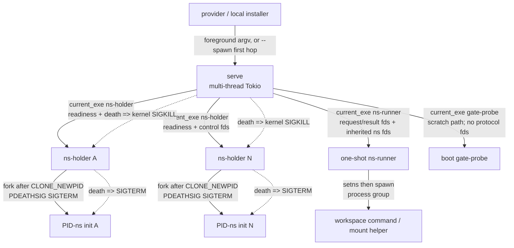
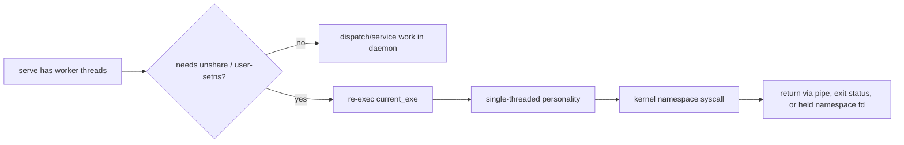
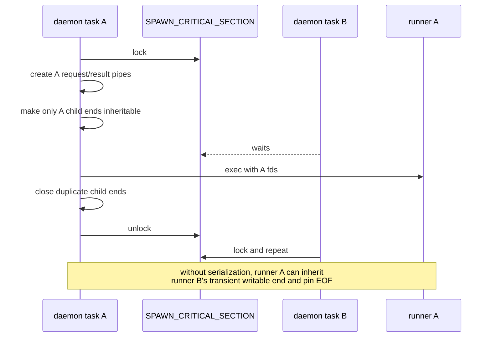
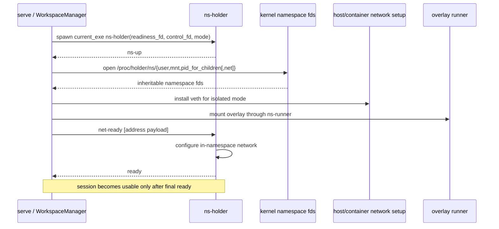
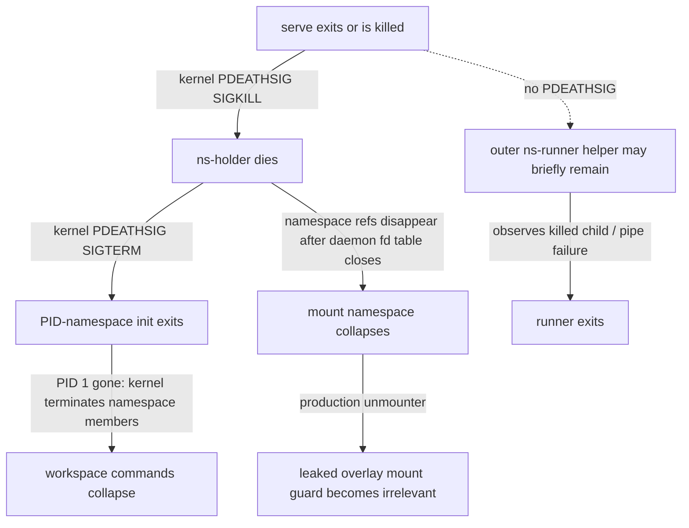

# One binary, four personalities: the daemon process model

> **Cluster 03 — Daemon internals, page 1 of 3.** Previous: [02-security-model/03 — Ephemerality and crash recovery](../02-security-model/03-ephemerality-and-crash-recovery.md) · Next: [02 — Daemon lifecycle](02-daemon-lifecycle.md)

## Why this page exists

The daemon is not one process and it is not four fixed processes. One packaged
Linux-musl binary becomes one long-lived `serve` process, zero or more
session holders, zero or more operation runners, and one boot-time gate probe.
The architecture lives in the edges between them: an inherited fd must not
keep a pipe alive, a child must die with the right parent, and an embedding
binary must preserve subcommands it may never call directly. This page records
those process contracts. Holder token grammar and namespace mechanics remain
owned by [the namespace-process page](../01-workspace-runtime/02-namespace-processes.md).

## Corrections found in the verification sweep

| Contract claim | Working-tree result | Consequence |
|---|---|---|
| “Three” personalities in the `main.rs` module comment | **Stale comment.** Dispatch has four arms: `serve`, `ns-runner`, `ns-holder`, `gate-probe` (`crates/sandbox-daemon/src/main.rs:41-67`). | Treat the match as authority; a fifth personality requires updating both dispatch and every embedder. |
| “One binary, four processes” | Four **personalities**, but holders and runners have per-session/per-operation cardinality. | Capacity and fd exposure scale with live sessions and operations, not with four. |
| “Auth token env-only, never argv” | **False globally.** Docker passes `--auth-token` in PID 1 argv (`crates/sandbox-provider-docker/src/launch.rs:19-47`); only the `--spawn` second hop moves it to the environment (`crates/sandbox-daemon/src/serve.rs:280-313,345-370`). | Do not rely on `ps` secrecy; this is security debt, not a maintained invariant. |
| Holder exit 1 versus 2 changes daemon cleanup | **False.** The codes preserve cause, but both flow through the same startup-failure cleanup and formatted diagnostic (`crates/sandbox-runtime/workspace/src/namespace/holder.rs:167-210,233-245`). | Monitoring may distinguish causes; recovery cannot. |
| `serve --spawn` is e2e-only | **False.** The exported local installer uses it (`crates/sandbox-gateway/src/local_daemon_installer.rs:66-95,98-138`); Docker production deliberately runs foreground (`crates/sandbox-provider-docker/tests/launch.rs:25-46`). | It is a supported local/embedding path, though not wired into the current Docker composition. |

*What to notice: the corrections all concern boundaries—cardinality, secret
transport, exit interpretation, and deployment ownership. Copying a comment
instead of following the edge would produce the wrong architecture.*

## The four personalities

Packaged releases target the two Linux musl targets and ship one daemon binary
(`xtask/src/main.rs:20-25,1102-1109`). Re-exec then makes that single uploaded
artifact sufficient inside a container, with no helper path or dynamic-runtime
dependency to discover.

| Subcommand | Module/body | Threading model | Spawned by | Lifetime | Dies when |
|---|---|---|---|---|---|
| `serve` | `sandbox-daemon/src/serve.rs` | Multi-thread Tokio runtime (`crates/sandbox-daemon/src/serve.rs:57-69`) | Docker foreground `Cmd`, or local installer via a short `--spawn` parent | Container/sandbox lifetime | Container stop, process signal, fatal startup/listener error |
| `ns-holder` | adapter `sandbox-daemon/src/holder.rs` → `namespace-process::holder` | Dedicated synchronous, single-threaded body (`crates/sandbox-daemon/src/holder.rs:7-15`) | `serve`, once per live workspace session | Session lifetime; pauses after `ready` | Normal teardown TERM→grace→KILL, or daemon death delivers PDEATHSIG KILL (`crates/sandbox-runtime/workspace/src/namespace/holder.rs:94-135`) |
| `ns-runner` | `sandbox-daemon/src/runner/` → `namespace-process::runner` | Dedicated synchronous, single-threaded body with shell/mount/remount/file modes (`crates/sandbox-daemon/src/runner/mod.rs:14-41,67-136`) | `serve`, once per namespace operation | One request/result or shell command | Completion, timeout/cancel, process-group termination; it has no PDEATHSIG |
| `gate-probe` | adapter `sandbox-daemon/src/gate_probe.rs` → `namespace-process::gate` | Fresh single-threaded process | `serve`, exactly once during boot | One kernel witness | Exit 0 proves the gate; any other result degrades to commit-only (`crates/sandbox-runtime/namespace-process/src/gate.rs:21-37`) |

*What to notice: `serve` owns concurrency; the other three personalities buy
kernel-safe single-threaded call sites. Their different lifetimes are part of
the correctness proof, not merely implementation organization.*

*What to notice: the tree is asymmetric. Holders form a kernel-enforced death
chain; runners form one-shot request trees. “Daemon death cleans sessions” is
therefore a holder/PID-namespace claim, not a universal child-process claim.*

## Why re-exec, and what an embedder promises

Each launcher resolves `current_exe`, not a configured helper: holder at
`crates/sandbox-runtime/workspace/src/namespace/holder.rs:49-64`, runner at
`crates/sandbox-runtime/namespace-execution/src/launcher.rs:369-385`, and gate
probe at `crates/sandbox-runtime/namespace-process/src/gate.rs:21-37`.
`ForkRunnerLauncher` is therefore a historical name: it builds a `Command` and
re-execs; it does not run the namespace body in a forked copy of `serve`.

| Embedder omits… | First visible failure | Protected invariant |
|---|---|---|
| `ns-holder` dispatch | Session creation never reaches `ns-up`; parent kills/reaps the child and returns setup failure (`crates/sandbox-runtime/workspace/src/namespace/holder.rs:65-90,167-186`). | A session is never published without a live namespace owner. |
| `ns-runner` dispatch | Child produces no valid result; launcher reports/synthesizes a failed run (`crates/sandbox-runtime/namespace-execution/src/launcher.rs:299-337,438-451`). | Namespace work cannot silently execute in the daemon's namespace. |
| `gate-probe` dispatch | Probe returns `false`; the process-wide gate remains commit-only (`crates/sandbox-runtime/namespace-process/src/gate.rs:21-37`). | An unproved kernel never receives live-remount traffic. |

*What to notice: linking runtime crates is an executable-interface contract.
An alternative binary must implement all three internal subcommands even when
its public CLI exposes only `serve`.*

## Why `serve` cannot do namespace work itself

The no-Tokio namespace-process crate states the constraint directly:
`unshare(CLONE_NEWUSER)` and joining a user namespace require a single-threaded
caller, while `serve` is intentionally multi-threaded
(`crates/sandbox-runtime/namespace-process/src/lib.rs:1-6`). The gate witness
has the same reason (`crates/sandbox-runtime/namespace-process/src/gate.rs:12-15,68-90`).

*What to notice: the process boundary converts a global threading precondition
into a local construction guarantee. Calling `unshare` from a Tokio worker
would invalidate the guarantee before any Rust type could detect it.*

## The global runner-spawn lock closes an fd race

All runner modes converge on one process-global mutex
(`crates/sandbox-runtime/namespace-execution/src/launcher.rs:111-120,121-227`).
The critical section covers pipe creation, clearing CLOEXEC on the child ends,
`spawn`, and dropping the parent's duplicate child ends
(`crates/sandbox-runtime/namespace-execution/src/launcher.rs:265-297,520-531`).

*What to notice: this lock is global across runner launches in one daemon, not
across holder or gate spawns. Its purpose is fd atomicity, not operation
serialization; it ends immediately after spawn.*

The lock does **not** solve the permanent inheritance blast radius. Namespace
fds are opened from every holder and deliberately have CLOEXEC cleared
(`crates/sandbox-runtime/workspace/src/namespace/fds.rs:32-61`). Consequently,
every newly exec'd runner can see every live session's namespace fds, although
its request selects which numbers it joins. Teardown closes the daemon copies
(`crates/sandbox-runtime/workspace/src/lifecycle/destroy.rs:124-135`).

| fd class | Boundary crossed | CLOEXEC state at spawn | Owner/closer | If mishandled |
|---|---|---|---|---|
| Holder readiness write | daemon → holder | Cleared only on child end | Holder writes; daemon closes after session setup/teardown | Missing EOF or false readiness; PID-init explicitly closes its copy (`crates/sandbox-runtime/namespace-process/src/holder/namespace.rs:176-193`). |
| Holder control read | daemon → holder | Cleared only on child end | Holder reads `net-ready`; daemon closes at teardown | A leaked writer can prevent `ControlPipeClosed`; a wrong token exits 2. |
| Namespace `user/mnt/pid_for_children[/net]` | holder namespace → daemon → every later runner exec | **Permanently CLOEXEC-cleared** while session lives | Daemon session handle; closed at destroy | Ambient cross-session fd capability; wrong numeric selection could join the wrong session. |
| Runner request read | daemon → runner | Cleared on child end | Daemon writes then closes; runner reads to EOF | Any stray writer pins EOF and can hang decode. |
| Runner result write | runner → daemon | Cleared on child end | Runner writes/closes; daemon drains through EOF | Any stray writer pins the drain; unbounded output is capped while still drained. |
| PTY slave/master | daemon launcher ↔ shell runner/console path | Passed as stdio for shell mode | Runner command group / daemon `PtyMaster` | Leak keeps terminal alive or prevents clean EOF/cancel. |

*What to notice: transient pipe ends need the spawn lock; permanent namespace
fds intentionally violate least ambient authority. These are two distinct fd
policies and must not be “fixed” together.*

## Session creation: daemon-side framing

The holder-side token grammar, uid maps, and setns order are deliberately not
repeated here; see [01-workspace-runtime/02](../01-workspace-runtime/02-namespace-processes.md).
This sequence shows only what the daemon must order around the child boundary.

*What to notice: `ns-up` means “namespaces exist,” not “session ready.” The
daemon must capture capabilities and finish the outside half of networking and
mounting before it releases the holder to publish final readiness
(`crates/sandbox-runtime/workspace/src/lifecycle/create.rs:23-75`; final exchange
`crates/sandbox-runtime/workspace/src/namespace/setns_runner.rs:123-149`).*

## PDEATHSIG is the ephemerality foundation

The holder installs `PR_SET_PDEATHSIG(SIGKILL)` as its first act after exec
(`crates/sandbox-runtime/namespace-process/src/holder/mod.rs:127-157`). It then
creates the namespace stack and forks the PID-namespace init. That init closes
handshake fds, installs TERM/INT exit handlers, sets its own PDEATHSIG to TERM,
checks the parent-race case, and pauses
(`crates/sandbox-runtime/namespace-process/src/holder/namespace.rs:158-227`).

*What to notice: the hard invariant is “no surviving workspace namespace or
workspace process,” not “no orphaned helper PID for even an instant.” The mount
helper deliberately forgets its RAII guard because namespace death is the
production unmount path (`crates/sandbox-runtime/namespace-process/src/runner/setns/mount_overlay.rs:8-37`).*

Normal teardown uses the same dependency in a controlled direction: TERM the
holder, wait a configured grace, KILL if necessary, then close fds and remove
veth/scratch state (`crates/sandbox-runtime/workspace/src/namespace/holder.rs:94-135`;
`crates/sandbox-runtime/workspace/src/lifecycle/destroy.rs:27-48`). The broader
what-survives-what analysis belongs to
[02-security-model/03](../02-security-model/03-ephemerality-and-crash-recovery.md).

## Exit codes preserve diagnosis, not policy

| Holder outcome | Exit | Meaning at holder boundary | What daemon does today |
|---|---:|---|---|
| Control pipe reaches EOF before `net-ready` | 1 | Parent/setup path disappeared (`crates/sandbox-runtime/namespace-process/src/holder/mod.rs:91-108`). | Kills/reaps if needed, formats exit status into one `SetupFailed`, runs ordinary rollback. |
| Line does not start with `net-ready` | 2 | Framing/programming error, not parent disappearance | Same cleanup and same error type; only diagnostic status differs. |
| Other setup/network error | conventional nonzero | Typed holder failure printed on stderr | Same startup failure path, with stderr summary. |

*What to notice: preserving 1 versus 2 prevents diagnostic collapse in the
binary adapter (`crates/sandbox-daemon/src/holder.rs:15-28`). A maintainer who
wants different recovery must add an explicit parent-side branch; none exists.*

## Environment and argv contracts

| Name / value | Set by | Read by | Required? | Boundary warning |
|---|---|---|---|---|
| `SANDBOX_DAEMON_CONFIG_YAML` | `serve` before runtime construction (`crates/sandbox-daemon/src/serve.rs:35,374-376`) | Every `ns-runner` (`crates/sandbox-daemon/src/runner/mod.rs:44-56`) | Yes for runners | Keeps runner configuration aligned with daemon without adding a payload copy. |
| `SANDBOX_DAEMON_AUTH_TOKEN` | `serve --spawn` first hop | Foreground `serve` CLI/env resolution (`crates/sandbox-daemon/src/serve.rs:236-263`) | Only for tokenized TCP when argv omits token | Safer than second-hop argv, but not the production-wide rule. |
| `SANDBOX_DAEMON_SANDBOX_ID` | `serve` sets/removes it (`crates/sandbox-daemon/src/serve.rs:36,378-383`) | **No in-repo reader found** | No | Parsed `--sandbox-id` already enters `ServerConfig`; the env copy is dead contract surface. |
| `--auth-token TOKEN` | Docker provider and local installer first hop | `serve` parser | Required when RPC TCP is enabled | Exposed to process argv; Docker also persists token in `eos.auth_token` label (`crates/sandbox-provider-docker/src/runtime.rs:451-468`). |
| `--sandbox-id ID` | Provider/local installer | `serve` → RPC readiness and HTTP envelope minting | Required for strong identity binding, though config type allows absence | Unlike the unread env mirror, this is live authority. |

*What to notice: the intended `ps` rationale is implemented only across the
`--spawn` re-exec. Production Docker currently crosses two additional secret
surfaces—argv and labels—so documentation must not bless “env-only” as fact.*

## Dispatch is a scope-and-owner edge

After TCP auth is removed, all RPC requests cross one scope check: system scope
is rejected and sandbox scope is required (`crates/sandbox-daemon/src/rpc/dispatch.rs:49-58,217-226`).
The next edge is selected from catalog metadata, not from a parallel string
list.

| Incoming request | Predicate | Consumer | If maintainer bypasses it |
|---|---|---|---|
| `sandbox_daemon_ready` | Sandbox scope first, then private op id | Daemon readiness responder | A port-open check could masquerade as initialized identity. |
| Public observability op | Scope + op + owner=`Observability` + visibility=`Public` (`crates/sandbox-daemon/src/rpc/dispatch.rs:120-129`) | Observability query adapter (`crates/sandbox-daemon/src/rpc/dispatch.rs:94-116`) | Runtime registry sees an operation it does not own, or private query paths become public. |
| Everything else sandbox-scoped | Not the two branches above | Runtime dispatcher in `spawn_blocking` (`crates/sandbox-daemon/src/rpc/dispatch.rs:59-80`) | Tokio workers execute blocking runtime work or owner policy drifts. |

*What to notice: “daemon RPC” is not one executor. The daemon is a trusted
scope gate that hands requests to one of three consumers while keeping the
catalog as the ownership authority.*

## Cluster-wide daemon edge table

| Producer → consumer | Artifact carried | Trust assumption / invariant | Deep-dive owner |
|---|---|---|---|
| Gateway → daemon RPC TCP | Newline JSON envelope + per-sandbox `daemon_auth_token`; client injects token (`crates/sandbox-gateway/src/daemon_client.rs:21-44,73-96`) | Host loopback endpoint and token identify one sandbox; daemon strips auth before common decode (`crates/sandbox-daemon/src/rpc/dispatch.rs:18-46,131-175`). | [00-foundations/02](../00-foundations/02-wire-protocol.md), [02-security-model/02](../02-security-model/02-tokens-and-trust-boundaries.md) |
| Provider → daemon/container | Uploaded musl binary/config, foreground argv, labels, two published ports | Provider must bind container `0.0.0.0` only behind Docker host-loopback publication and keep record identity aligned (`crates/sandbox-provider-docker/src/runtime.rs:199-255`; `crates/sandbox-provider-docker/src/engine.rs:703-720`). | Page 03; planned management-plane page |
| Daemon ↔ holder | Numeric readiness/control fds, signals, holder exit status | Pipe endpoints are unique; holder death owns namespace collapse; final `ready` gates session publication. | This page frames; [01-workspace-runtime/02](../01-workspace-runtime/02-namespace-processes.md) owns grammar/internals. |
| Daemon ↔ runner | Numeric request/result fds, ambient namespace fds, process group | Global spawn lock prevents transient cross-inheritance; request selects the intended session fds. | [01-workspace-runtime/02](../01-workspace-runtime/02-namespace-processes.md) |
| Daemon → runtime dispatch | Validated sandbox-scoped `OperationRequest` | Runtime registry owns non-observability operations and may block, so dispatch uses `spawn_blocking`. | [00-foundations/03](../00-foundations/03-operation-catalog.md) |
| Daemon → observability query | Public catalog-owned observability request + runtime adapter | Only public Observability-owned routes cross this edge. | Planned config/observability page; routing proof above |
| Console → daemon HTTP | `/health`, `/files/list`, or rewritten `/forward/...`; no RPC token | Console resolves the loopback-published endpoint; daemon HTTP remains enumerable and topology-confined. | [Page 03](03-http-surface.md); planned console page |
| Daemon death → kernel/process tree | PDEATHSIG KILL/TERM and namespace lifetime | Kernel, not cooperative cleanup, collapses live workspace processes. | This page; [02-security-model/03](../02-security-model/03-ephemerality-and-crash-recovery.md) |

*What to notice: every daemon boundary carries either authority (token, scope,
fd), lifetime (signal/exit), or both. A component description that omits the
carried artifact omits the actual contract.*

## What you must know before changing this

1. **`current_exe` is an embedding ABI.** Every binary that links these launchers must dispatch `ns-holder`, `ns-runner`, and `gate-probe` exactly as the daemon does.
2. **Never narrow the spawn lock without an fd proof.** The lock protects pipe EOF semantics across concurrent exec, not shared Rust state.
3. **Namespace fds are ambient capabilities.** Every runner inherits every live session's cleared-CLOEXEC fds; changing that requires a targeted fd-passing design, not a casual flag flip.
4. **PDEATHSIG protects workspace ephemerality.** Preserve both holder→daemon and PID-init→holder links, including the parent-race check.
5. **Exit 1 and 2 are diagnostics only today.** Do not claim different recovery without adding and testing parent-side policy.
6. **The token is not env-only.** Fix the Docker/local launch edges before documenting `ps` secrecy as an invariant.

## Open questions for maintainers

- Is the exported local `serve --spawn` installer a supported deployment surface, or only an embedding/test convenience that should be narrowed?
- Which client is intended to use the always-bound, unauthenticated-by-token AF_UNIX RPC socket? The current gateway daemon client is TCP-only, while the socket relies solely on mode `0600` (`crates/sandbox-daemon/src/rpc/lifecycle.rs:23-64`).
- Should `SANDBOX_DAEMON_SANDBOX_ID` be removed, or should subprocesses consume it as an identity cross-check?
- Will production launch move `daemon_auth_token` out of argv and the `eos.auth_token` Docker label? Until then, what is the accepted process-inspection/label-reader threat model?
- Should exit 2 (`UnexpectedToken`) be promoted to a distinct internal-bug signal rather than being folded into ordinary setup failure?
