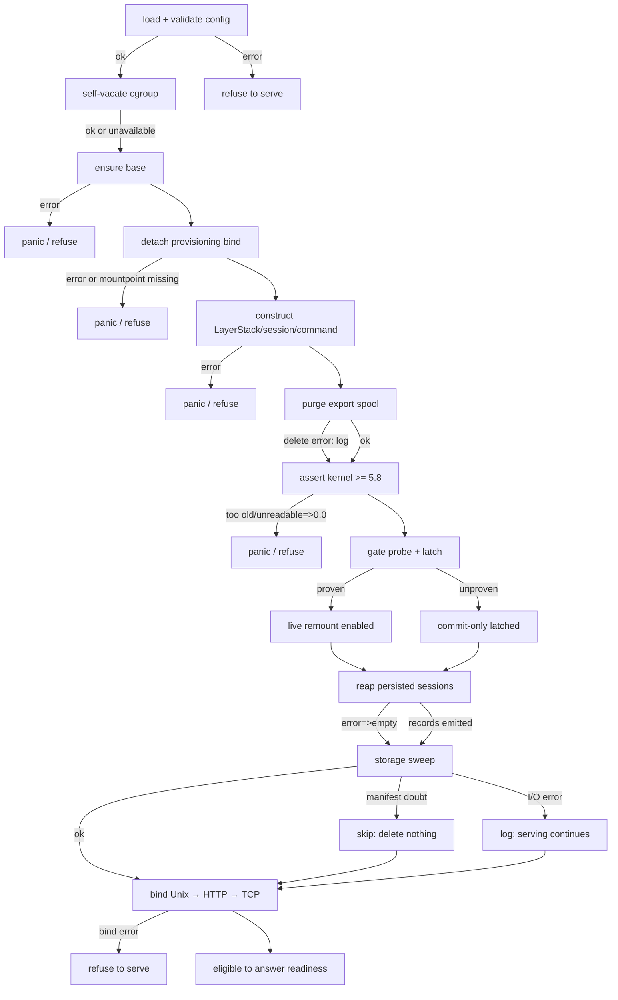
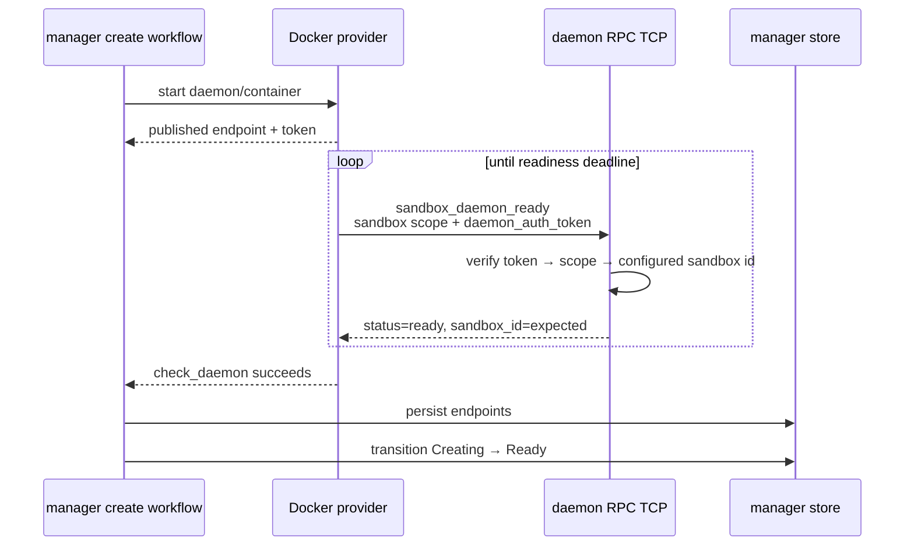

# Daemon lifecycle: startup, boot recovery, shutdown

> **Cluster 03 — Daemon internals, page 2 of 3.** Previous: [01 — Process model](01-process-model.md) · Next: [03 — HTTP surface](03-http-surface.md)

## Why this page exists

Boot is a dependency chain disguised as constructor code. Base storage must be
made true before a provisioning bind is detached; recovery must finish before
the production readiness exchange can succeed; shutdown must stop acceptance
before it waits for accepted RPC work. The failure policy is intentionally
mixed: some doubts refuse service, some latch a lesser capability, and some
cleanup errors are logged and skipped. This page names those differences so a
maintainer does not turn “best effort” into “safe” or “fail closed” into
“transactional.” Citations are relative to the `ephemeral-sandbox` repo.

## Verification corrections

| Earlier claim | Current implementation | Why the difference matters |
|---|---|---|
| Spool purge follows kernel/gate checks | Purge runs **before** kernel assert and gate probe (`crates/sandbox-runtime/operation/src/services.rs:114-115,168-195`). | A gate failure still happens after destructive spool cleanup. |
| Every recovery step fails closed | Cgroup setup, spool purge, session reap, and sweep errors can continue serving. Only specific manifest-doubt cases guarantee delete-nothing. | “Daemon is ready” does not mean all cleanup succeeded. |
| Readiness is the last emitted event | Readiness is a client-driven RPC response, not an emitted event (`crates/sandbox-daemon/src/rpc/dispatch.rs:182-214`). | Its strength depends on which listener the client probes. |
| Shutdown drains all in-flight work | Only tracked AF_UNIX/TCP RPC tasks drain; HTTP connections and upgrade tunnels are untracked (`crates/sandbox-daemon/src/http/server.rs:58-78`). | Long HTTP/tunnel work may outlive the accept loop until runtime exit. |
| `file_list` has a hard 2,000 cap | 2,000 is the shipped default; `runtime.file.max_list_entries` is injectable (`crates/sandbox-runtime/operation/src/services.rs:363-381`; `crates/sandbox-daemon/src/serve.rs:129-134`). | UI and operators must not assume a universal fixed number. |

*What to notice: lifecycle truth is not a single “fail closed” label. Each edge
has its own refusal, degradation, skip, or partial-cleanup semantics.*

## Boot workflow: the dependency spine

`serve::run` loads and validates configuration before process setup, exports
runner state, attempts cgroup preparation, builds Tokio, constructs the entire
runtime graph synchronously, and only then enters listener service
(`crates/sandbox-daemon/src/serve.rs:25-69,138-160`). Recovery is therefore
inside construction, not a background phase racing with requests.

| # | Action | Depends on / what would be wrong without it | Failure behavior | Observable evidence | Anchor |
|---:|---|---|---|---|---|
| 1 | Locate, load, deserialize, validate merged config | Every later path, limit, port, and policy must come from one accepted document. | **Refuse:** returned error; no runtime or listener. | Error only | `crates/sandbox-daemon/src/serve.rs:27-31,138-160` |
| 2 | Parse dynamic CLI endpoints/identity; require token for RPC TCP | Provider-owned identity and ports must overlay static config before construction. | **Refuse:** invalid/partial bind or empty token returns error. | Error only | `crates/sandbox-daemon/src/serve.rs:191-277` |
| 3 | Export runner config; discover delegated cgroup root and self-vacate | Runner re-exec needs the same YAML. The daemon must leave root `R` before `R` can enable controllers for workspace children. | **Degrade:** discovery/setup failure returns `None`; accounting/placement becomes unavailable. | None | `crates/sandbox-daemon/src/serve.rs:35-38`; `crates/sandbox-daemon/src/cgroup_setup.rs:15-23` |
| 4 | Build multi-thread runtime; synchronously construct server/runtime graph | Namespace subprocesses need a running parent; listeners must not expose a half-built graph. | **Refuse:** runtime error or later construction panic. | Error/panic | `crates/sandbox-daemon/src/serve.rs:57-69`; `crates/sandbox-daemon/src/rpc/runtime.rs:72-86` |
| 5 | Open file audit store and construct workspace runtime | Later file operations and recovery need durable roots before services are published. | **Refuse:** audit open panics. | Panic only | `crates/sandbox-runtime/operation/src/services.rs:47-65` |
| 6 | Ensure workspace base while provisioning bind is present | The base must capture the provisioned tree before the bind disappears. Reversing 6/7 would snapshot an empty mountpoint. | **Refuse:** log then panic. | `cli_log` | `crates/sandbox-runtime/operation/src/services.rs:66-84` |
| 7 | Detach provisioning bind; verify mountpoint remains a directory | Subsequent sessions and sweep must see volume/storage truth, not the provisioning view. | **Refuse:** errors except “not mounted,” or missing directory, panic. | `cli_log` | `crates/sandbox-runtime/operation/src/services.rs:85,268-310` |
| 8 | Open LayerStack; construct session and command services | Reap/sweep need registries and lease service; requests need one shared service graph. | **Refuse:** LayerStack initialization panics. | Panic only | `crates/sandbox-runtime/operation/src/services.rs:86-113` |
| 9 | Purge `<scratch>/.export/` wholesale | Session reap never walks unknown export directories; crash-orphaned spools otherwise leak forever. | **Skip:** missing is success; other delete errors log and continue. | `cli_log` only | `crates/sandbox-runtime/operation/src/services.rs:147-160` |
| 10 | Assert Linux kernel release ≥ 5.8 | `syncfs` writeback reporting is treated as a minimum platform contract. | **Refuse:** assertion panic. | Panic text | `crates/sandbox-runtime/operation/src/services.rs:244-259` |
| 11 | Run one `gate-probe` and latch result process-wide | Every later squash must use one stable live-remount capability decision; probing mid-flight could split semantics across sessions. | **Degrade + latch:** any failure → commit-only for this process. | `NAMESPACE_EXEC_REMOUNT_OVERLAY` with `boot_gate` and verdict | `crates/sandbox-runtime/operation/src/services.rs:221-242`; latch `crates/sandbox-runtime/workspace/src/lifecycle/remount.rs:29-49` |
| 12 | Reap persisted session run dirs | PDEATHSIG proves holders are dead after prior process loss; stale registry/run state must be removed before storage is judged. | **Skip on top-level error:** `unwrap_or_default`; per-record cleanup is best effort. | One `WORKSPACE_SESSION_DESTROY` per returned record + count log | `crates/sandbox-runtime/operation/src/services.rs:175-192` |
| 13 | Open stack and sweep orphan/staging storage | Sweep must see the active manifest and post-reap storage state. | **Delete-nothing on manifest doubt; otherwise skip/error may be partial:** open/lock/deletion error logs and serving continues. | `LAYERSTACK_SQUASH` on `Ok`, including skipped report; error log otherwise | `crates/sandbox-runtime/operation/src/services.rs:193-218`; doubt guard `crates/sandbox-runtime/layerstack/src/stack/lease/cleanup.rs:76-94` |
| 14 | Prepare paths, unlink stale socket, bind AF_UNIX, chmod `0600`, write pid | Local RPC ownership and cleanup identity exist before optional listeners. | **Refuse:** returned I/O error; stale-socket removal itself is best effort. | Filesystem artifacts | `crates/sandbox-daemon/src/rpc/lifecycle.rs:28-41` |
| 15 | Start AF_UNIX accept loop; bind HTTP; bind RPC TCP last | Production readiness uses TCP, so success implies synchronous boot plus every configured bind completed. | **Refuse:** bind error. Caveat: AF_UNIX accept starts before optional binds. | Listening sockets | `crates/sandbox-daemon/src/rpc/lifecycle.rs:43-126` |
| 16 | Answer authenticated sandbox-scoped readiness request | A bare Docker proxy connection is not proof of decode/auth/identity agreement. | **Refuse request:** auth/scope/id mismatch returns RPC error. | RPC response, not telemetry | `crates/sandbox-daemon/src/rpc/dispatch.rs:49-55,182-214` |

*What to notice: steps 6→7 and 12→13 are the load-bearing orderings. Step 11
is a capability latch, not recovery success. Step 16 is observationally last
only for the production TCP probe, because TCP is the final bound listener.*

## Failure edges, not a happy-path list



*What to notice: there are three different “safe” reactions—stop, latch a
weaker feature, or preserve uncertain storage. Collapsing them into a shared
error policy would either reduce availability unnecessarily or delete data on
doubt.*

## Cgroup self-vacation creates the workspace hierarchy

The daemon discovers delegated root `R`, moves its own PID into `R/_daemon`,
then asks `R/cgroup.subtree_control` for `+cpu +memory`
(`crates/sandbox-daemon/src/cgroup_setup.rs:1-7,40-66`). Linux cgroup v2 does
not let a populated parent act as the intended controller-bearing interior
node; leaving the daemon in `R` would prevent reliable workspace children and
mix daemon usage into workspace accounting.

| Edge | Success contract | Degraded contract | Maintainer trap |
|---|---|---|---|
| daemon PID → `R/_daemon/cgroup.procs` | Root becomes available as an interior node | Any discovery/create/move failure returns `None` (`crates/sandbox-daemon/src/cgroup_setup.rs:18-22`) | Treating `Some(root)` as proof that every controller enabled: subtree-control writes are ignored on failure. |
| `R/cgroup.controllers` → `R/cgroup.subtree_control` | Enable only controllers the kernel exposes | Missing controller is skipped (`crates/sandbox-daemon/src/cgroup_setup.rs:53-66`) | Making missing memory/cpu fatal would change an intentional observability/placement degradation into startup refusal. |
| session service → workspace leaf | Commands inherit workspace placement | Leaf setup is best effort (`crates/sandbox-runtime/operation/src/workspace_session/service/core.rs:159-171`) | Reporting resource data as authoritative when placement failed. |

*What to notice: self-vacation protects hierarchy shape, but the current API
does not prove controller enablement. `cgroup_root: Some` is a discovered path,
not a certificate of full enforcement.*

## What “fail closed” means during recovery

| Recovery doubt | Deletes data? | Serves? | Why this choice |
|---|---:|---:|---|
| Base cannot be ensured | No further lifecycle work | No | Without a canonical base, every layer and session view is undefined. |
| Provisioning bind cannot detach | No sweep | No | Sweeping through the wrong view could judge live/provisioned data as storage truth. |
| Gate probe cannot prove kernel behavior | No gate-related data change | Yes, commit-only | Availability is preserved while the risky live-remount transition is disabled. |
| Export spool purge fails | May have removed some entries before error | Yes | Spools are scratch, but failure is not transactional; leak is preferred to refusing all runtime work. |
| Persisted-session reap fails | Per-record best effort; top-level error becomes zero records | Yes | Dead session residue is deferred; storage sweep still evaluates manifest reachability. |
| Active manifest missing/unreadable/degenerate | **No sweep candidates deleted** | Yes | Reachability cannot be proved, so retention wins (`crates/sandbox-runtime/layerstack/src/stack/lease/cleanup.rs:76-94`). |
| Sweep deletion fails after some candidates | Possibly partial | Yes | The sweep reports/logs error but has no rollback transaction. |

*What to notice: “fail-closed sweep” applies to uncertainty before candidate
deletion, especially manifest doubt. It does not make filesystem deletion
atomic, and it does not make all recovery errors startup-fatal.*

The ownership details for leases and sweep candidates remain in
[01-workspace-runtime/01](../01-workspace-runtime/01-layerstack-store.md); the
crash-survival matrix remains in
[02-security-model/03](../02-security-model/03-ephemerality-and-crash-recovery.md).

## Readiness is a proved exchange, not a log line

Production Docker polling sends an authenticated, sandbox-scoped
`sandbox_daemon_ready` request until the decoded response reports `ready` and
echoes the expected sandbox id. Its code explicitly rejects “TCP connect
succeeded” as insufficient (`crates/sandbox-provider-docker/src/installer.rs:149-184`;
validation `crates/sandbox-provider-docker/src/readiness.rs:14-38`).



*What to notice: manager state changes only after the provider proves a full
request/response path (`crates/sandbox-manager/src/operations/management/service/impls/create_sandbox.rs:111-136,190-226`). Because RPC TCP binds last,
this proof also implies configured HTTP binding succeeded.*

Two qualifications prevent overclaiming:

| Qualification | Evidence | Risk |
|---|---|---|
| AF_UNIX accept begins before HTTP/TCP bind | Unix task starts at `crates/sandbox-daemon/src/rpc/lifecycle.rs:43-70`; optional binds follow at `crates/sandbox-daemon/src/rpc/lifecycle.rs:72-126`. | An AF_UNIX readiness client could observe ready before all surfaces exist. |
| Local installer checks only TCP connect | `crates/sandbox-gateway/src/local_daemon_installer.rs:159-176` | The local path does not prove auth, identity, or successful dispatch like Docker does. |
| PID-file comment says “after listeners bind,” implementation writes before HTTP/TCP | Comment `crates/sandbox-daemon/src/rpc/runtime.rs:17-20`; implementation `crates/sandbox-daemon/src/rpc/lifecycle.rs:35-41,72-126` | PID presence is not global readiness. |

*What to notice: production Docker readiness is strong because of listener
order and protocol validation. Neither PID existence nor local TCP connect is
an equivalent readiness signal.*

## Connection backpressure

One semaphore is shared by AF_UNIX and authenticated RPC TCP. Both listeners
use `try_acquire_owned`; saturation does not queue a connection waiting for a
permit (`crates/sandbox-daemon/src/rpc/lifecycle.rs:23-27,43-64,87-118`).

| Surface | Bound | Config knob/default | At saturation | Client-visible symptom |
|---|---|---|---|---|
| AF_UNIX JSON-line RPC | Shared RPC semaphore | `daemon.server.max_concurrent_connections`, default 256, minimum 1 (`crates/sandbox-config/src/configs/daemon.rs:24-39,76-85,110-112`) | Accept connection, spawn a small rejection task | One newline error envelope: `kind=server_busy`, configured max in details, then close (`crates/sandbox-daemon/src/rpc/lifecycle.rs:182-195`) |
| TCP JSON-line RPC | Same semaphore, not a separate pool | Same knob | Same immediate rejection | Accepted—not refused—and does not wait for capacity |
| HTTP `/health`, `/files/list`, `/forward` | **No semaphore bound** | None | Every accepted connection is spawned | Resource pressure is scheduler/socket limited; no `server_busy` contract (`crates/sandbox-daemon/src/http/server.rs:58-65`) |

*What to notice: the knob is an RPC connection bound, not a daemon-wide
concurrency bound. Applying its advertised capacity to HTTP would be false.*

## What runs when

| Time class | Work | Why it lives there |
|---|---|---|
| Boot only | Config/cgroup, base ensure/detach, spool purge, kernel assert, gate latch, persisted-session reap, storage sweep, listener binds | Establish one immutable capability/storage baseline before production readiness. |
| Per RPC connection | Read one capped/timed JSON line, dispatch once, write one response, close (`crates/sandbox-daemon/src/rpc/connection.rs:13-41,69-99`) | Simple framing bounds slow/incomplete clients and makes permit lifetime explicit. |
| Per runtime request | `spawn_blocking` runtime operation, then detached observability collection (`crates/sandbox-daemon/src/rpc/dispatch.rs:59-80`; `crates/sandbox-daemon/src/rpc/runtime.rs:95-105`) | Blocking filesystem/namespace work stays off Tokio workers; collection samples post-operation state. |
| Per HTTP connection | Hyper HTTP/1.1 task; optional forward connection and detached upgrade tunnel | HTTP keepalive/upgrades require a different lifetime than one-shot RPC. |
| Release time | Lease release removes layers not retained by active manifest/other leases (`crates/sandbox-runtime/layerstack/src/stack/lease/cleanup.rs:16-45`) | Reclaim when ownership evidence changes. |
| Autonomous background GC | **None** | No periodic task is allowed to infer liveness while service state is changing; full orphan/staging sweep occurs only at boot. |

*What to notice: observability calls `collect()` a “periodic tick,” but the
daemon has no timer. Collection is request-triggered; storage reclamation is
release-time plus one boot sweep, never a background race.*

## Normal shutdown: ordered, but narrower than it sounds

The ordered tail runs when the shared cancellation token or Ctrl-C wins the
main select. Listener-task error branches return early and bypass that tail
(`crates/sandbox-daemon/src/rpc/lifecycle.rs:128-177`). The only installed
signal waiter is Tokio `ctrl_c()` (`crates/sandbox-daemon/src/rpc/lifecycle.rs:202-204`); there is no explicit SIGTERM
handler in this lifecycle module.

```mermaid
sequenceDiagram
    participant X as Ctrl-C / cancellation token
    participant D as serve lifecycle
    participant L as Unix + RPC TCP listeners
    participant H as HTTP accept loop
    participant R as tracked RPC tasks
    participant U as pid/socket files
    X->>D: select wakes
    D->>D: cancel shared token
    D->>L: abort if not already stopped
    D->>H: await accept-loop exit
    Note over H: existing HTTP connections/tunnels are untracked
    D->>R: close TaskTracker to new tasks
    D->>R: wait for every accepted RPC task
    Note over R: no drain timeout; dispatch is awaited, not canceled
    D->>U: best-effort remove pid file, then Unix socket
    D-->>X: return Ok
```

*What to notice: acceptance stops before RPC draining begins
(`crates/sandbox-daemon/src/rpc/lifecycle.rs:157-177,197-200`). The drain is
unbounded and covers RPC only; HTTP shutdown means “stop accepting,” not
“await every request.”*

| In-flight object | On normal cancellation | Bound / abandonment rule | After process exit |
|---|---|---|---|
| Partial RPC request line | Connection task remains tracked | Read timeout bounds incomplete framing (`crates/sandbox-daemon/src/rpc/connection.rs:69-99`) | Socket closes |
| Running runtime/observability dispatch | Awaited by tracked connection; cancellation does not abort `spawn_blocking` (`crates/sandbox-daemon/src/rpc/dispatch.rs:59-116`) | **No dispatch/drain timeout** | Abrupt process termination ends it |
| Existing HTTP request | Not tracked by lifecycle | Neither canceled nor awaited | Tokio runtime/process drop ends task |
| Upgrade tunnel after 101 | Detached raw copy, no cancellation token | No idle timeout; EOF/error/process death only | Socket/process death terminates tunnel |
| Live workspace session | Not explicitly destroyed by `serve()` | Survives drain until daemon process actually exits | Holder PDEATHSIG collapses namespace; next boot reaps persisted residue |
| PID file / AF_UNIX socket | Best-effort unlink at normal tail | Errors ignored despite doc comment | Next boot removes stale socket best effort |

*What to notice: graceful RPC completion and ephemeral session collapse occur
at different moments. The former happens before `serve` returns; the latter is
guaranteed by process death, then repaired on next boot.*

### Signal-path caveat

| Stop source | Current path | Drain guaranteed? |
|---|---|---:|
| Ctrl-C / SIGINT handled by `tokio::signal::ctrl_c` | Cancellation tail above | Yes, unless a listener-error branch already returned |
| Programmatic cancellation token | Same tail | Yes, same qualification |
| SIGTERM from a process/container manager | No explicit handler found in daemon lifecycle | **No code-level guarantee of the ordered tail**; default termination may bypass it |
| Fatal listener task result | Direct `return Err` inside select branch | No; cancel/drain/unlink tail is bypassed |

*What to notice: the documented drain is a normal-path state machine, not a
universal property of every process exit. Container stop semantics should be
aligned with an explicit SIGTERM handler if graceful draining is required.*

## Kernel authority is layered, not one version number

| Check | What it authorizes | Failure behavior | Authority limit |
|---|---|---|---|
| Hard release assert ≥ 5.8 | Minimum supported daemon environment for `syncfs` reporting | Refuse startup | Does not prove `userxattr` or modern OverlayFS options. |
| Feature-specific kernel requirements documented by security/storage pages | Use of particular OverlayFS behaviors such as `userxattr` / `lowerdir+` | Depends on feature path | Static version statements can drift from vendor kernels/backports. |
| Boot gate probe | Exact production same-upperdir staged switch + whiteout witness | Latch commit-only | Proves only the exercised live-remount behavior on this boot environment. |

*What to notice: the 5.8 assert is a platform floor, while the gate probe is
the runtime authority for live remount. Neither should be described as proving
all OverlayFS capabilities. See
[02-security-model/01](../02-security-model/01-isolation-model.md) and the
planned squash/remount page for feature-specific requirements.*

## What you must know before changing this

1. **Boot recovery is synchronous construction.** Moving it behind listener bind breaks the production readiness proof.
2. **Keep base ensure before bind detach.** Reversing them snapshots or serves the wrong filesystem view.
3. **Name failure classes precisely.** Refuse, degrade+latch, skip, delete-nothing-on-doubt, and partial deletion are not synonyms.
4. **Production readiness is an authenticated RPC exchange.** PID existence and bare TCP connect are weaker signals.
5. **The connection semaphore is RPC-only.** HTTP currently has no corresponding admission bound.
6. **Normal RPC drain is unbounded and HTTP is untracked.** Add timeouts/cancellation deliberately, with client-visible semantics.
7. **Session cleanup is process-death plus next-boot repair.** `serve()` does not synchronously destroy live sessions during shutdown.

## Open questions for maintainers

- Which statement is the long-term kernel authority: the hard ≥5.8 floor, documented feature versions (`userxattr` ≥5.11 and `lowerdir+` ≥6.8), or probe-per-feature? The present code uses the floor plus a live-remount witness.
- Should SIGTERM enter the same cancellation/drain path as Ctrl-C, especially for foreground Docker operation?
- Should listener-task failure run the common cancel/drain/unlink tail rather than returning directly?
- Should HTTP connections and upgrade tunnels join the task tracker, and if so, what drain/idle bounds preserve shutdown predictability?
- Is serving after a top-level session-reap or sweep I/O error intentional? If yes, should readiness expose degraded recovery state?
- Should the local installer replace its bare TCP-connect readiness check with the authenticated `sandbox_daemon_ready` exchange?
