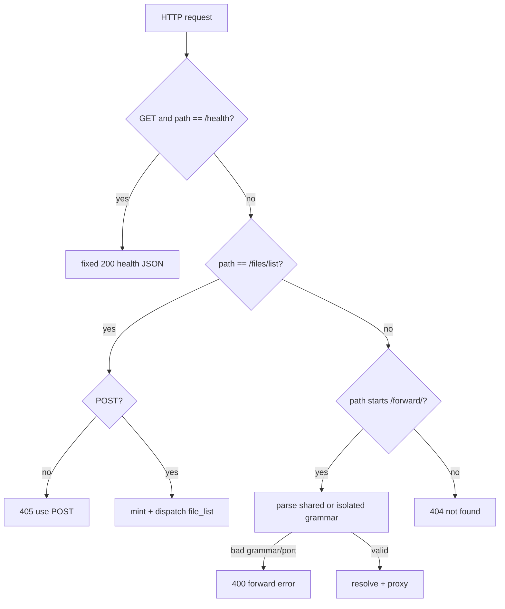
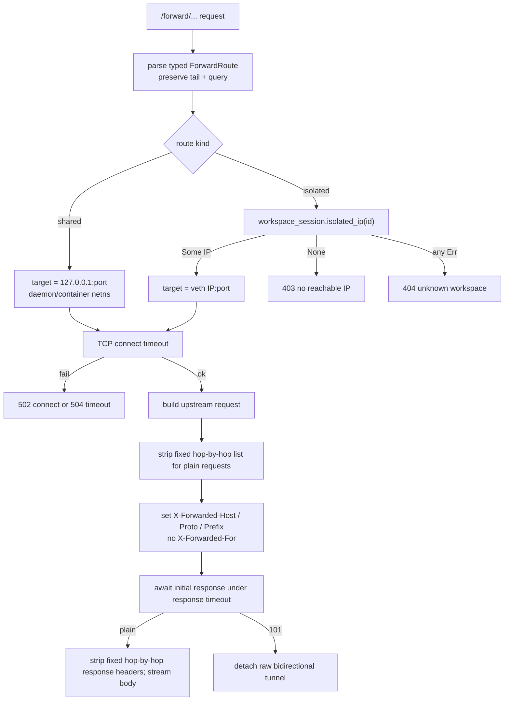
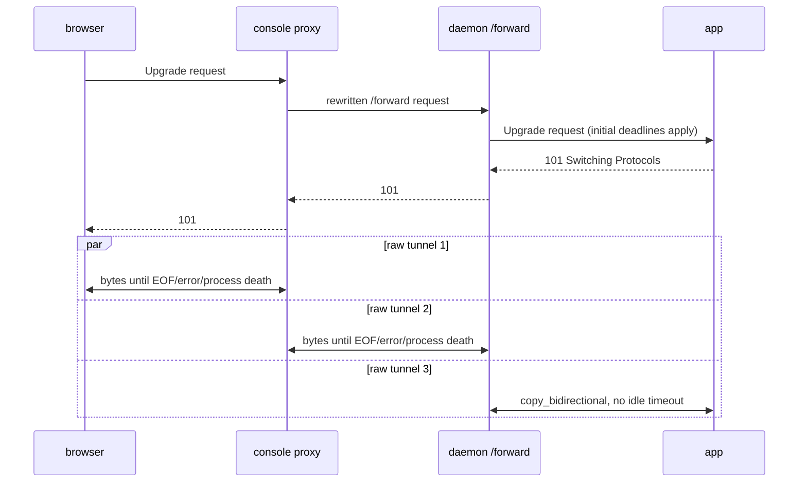
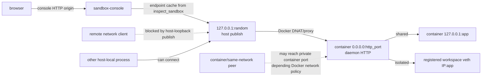

# Daemon HTTP surface: the allowlist and app forwarding

> **Cluster 03 — Daemon internals, page 3 of 3.** Previous: [02 — Daemon lifecycle](02-daemon-lifecycle.md)

## Why this page exists

The daemon HTTP listener has no application authentication. Its safety case is
therefore not “the handler checks a token”; it is the conjunction of an exact
router, daemon-minted identity for the one runtime operation, and deployment
topology that publishes the container port only on host loopback. This page
makes that conjunction auditable and records its two deliberate oddities:
completed dispatch errors are HTTP 200 error envelopes, while upgraded tunnels
have no idle timeout after 101. If any one edge changes, “unauthenticated but
safe” must be re-proved, not assumed.

## Verification corrections

| Earlier claim | Working-tree result | Documentation consequence |
|---|---|---|
| “Four-route allowlist” | Three top-level router branches, but four semantic entries because `/forward/` has shared and isolated grammars (`crates/sandbox-daemon/src/http/router.rs:15-27`; `crates/sandbox-daemon/src/http/forward/route.rs:25-53`). | Enumerate both counts; do not invent a fourth router branch. |
| Daemon has a preview `/s/` prefix | **False.** `/s/...` belongs to the console and is rewritten to daemon `/forward/...` (`crates/sandbox-console/src/proxy.rs:76-105`). | Keep console routing outside the daemon allowlist. |
| Unit tests prove dispatch-error HTTP 200 | Source proves it; daemon HTTP tests directly prove only the 400 transport channel. | Record a contract-test gap rather than citing a nonexistent assertion. |
| File list cap is fixed at 2,000 | 2,000 is a configurable shipped default. | Operation semantics remain in the operations page; flag UI hard-coding as drift risk. |
| Proxy injects all `X-Forwarded-*` | Daemon injects Host/Proto/Prefix, **not For** (`crates/sandbox-daemon/src/http/forward/proxy.rs:117-147`). | Attribute `X-Forwarded-For` to the console, which replaces client input. |

*What to notice: every correction narrows the surface. Precision matters most
here because an unauthenticated endpoint is safe only if its reachable behavior
is enumerable.*

## The exact allowlist

The router is deliberately a short sequence of predicates, not a general route
registry. That keeps absence reviewable: a maintainer can prove what is exposed
from one function, and tests pin sensitive negative space
(`crates/sandbox-daemon/tests/unit/http.rs:92-128`).

| Method | Path grammar | Handler | Auth | Purpose / exact behavior |
|---|---|---|---|---|
| `GET` | exact `/health` | `health::respond` | None | Fixed daemon-process liveness JSON; no runtime initialization is performed by the handler (`crates/sandbox-daemon/tests/unit/http.rs:82-90`). |
| `POST` | exact `/files/list` | `api::handle` | None | Mint a sandbox-scoped internal `file_list` request and use the runtime dispatcher. Other methods on this exact path return 405 `use POST` (`crates/sandbox-daemon/src/http/api.rs:15-20`). |
| Any | `/forward/shared/<port>[/<tail>]` | `forward::handle` | None | Strip route prefix and proxy to `127.0.0.1:<port>` in the daemon/container network namespace. Port must be 1–65535. |
| Any | `/forward/isolated=<workspace_session_id>/<port>[/<tail>]` | `forward::handle` | None | Resolve a registered isolated session's veth IP, then proxy to that IP/port. |
| Deliberate 404 | `POST /health`; `/files/read`, `/files/write`, `/files/edit`, `/files/blame`; observability paths; `/export/*`; `/files/list/extra`; everything else | fixed plain-text 404 | None | These operations are absent **by policy**. They remain on authenticated RPC or do not exist; adding a convenient HTTP bridge expands an unauthenticated authority boundary. |

*What to notice: “four routes” is a semantic presentation of three code
branches. A malformed path *under* `/forward/` reaches its parser and returns
400; a path outside all three branches returns 404
(`crates/sandbox-daemon/src/http/forward/mod.rs:32-49,63-71`).*



*What to notice: method rejection and route rejection are distinct. `POST
/health` is a deliberate 404, while `GET /files/list` reveals only that the
allowlisted resource requires POST.*

## Example: access a sandbox web server from the host

The Docker provider does not publish every application port. Instead, the host
connects to the sandbox's random loopback-only `daemon_http` port and names the
application port in the forwarding path. This example uses an automatic shared
workspace session, so the daemon can reach the server on sandbox loopback.

```sh
export SANDBOX_ID=eos-abc

DAEMON_HTTP=$(
  sandbox-manager-cli inspect_sandbox --sandbox-id "$SANDBOX_ID" |
    jq -er '.daemon_http | select(. != null) | "http://\(.host):\(.port)"'
)

SERVER=$(
  sandbox-runtime-cli --sandbox-id "$SANDBOX_ID" \
    exec_command --yield-time-ms 1000 \
    "python3 -m http.server 8000 --bind 127.0.0.1 --directory ."
)
COMMAND_SESSION_ID=$(
  printf '%s\n' "$SERVER" |
    jq -er '.command_session_id // error("server exited during the initial wait")'
)

APP_URL="$DAEMON_HTTP/forward/shared/8000/"
curl --fail --show-error "$APP_URL"
printf 'Open in a browser: %s\n' "$APP_URL"
```

`http://127.0.0.1:8000/` would target the host, not the sandbox. The actual
path is host `127.0.0.1:<published daemon HTTP port>` → container daemon
`/forward/shared/8000/` → container `127.0.0.1:8000`. Stop the example server
by sending Ctrl-C to its command session (Bash/zsh syntax):

```sh
sandbox-runtime-cli --sandbox-id "$SANDBOX_ID" \
  write_command_stdin --command-session-id "$COMMAND_SESSION_ID" \
  --yield-time-ms 1000 $'\003'
```

The daemon strips the forwarding prefix before contacting the application, so
the URL above arrives upstream as `/`. Applications should use relative URLs
or honor `X-Forwarded-Prefix`; direct daemon forwarding does not rewrite
absolute asset URLs or `Location` headers. An isolated-session server must bind
to `0.0.0.0` and use
`/forward/isolated=<workspace_session_id>/<port>/`, because the daemon dials the
session's veth IP rather than its loopback address.

*What to notice: application ports stay private to the sandbox. The only host
publish is the daemon HTTP endpoint, and the route selects the in-sandbox port.*

## Why only `file_list` crosses HTTP

The console needs a bounded read-only tree view and app preview; it does not
need arbitrary file mutation or the full operation catalog. Keeping only list
on HTTP limits what any host-local or container-local caller can ask the daemon
to execute. The shipped list limit is 2,000 entries but is configurable through
`runtime.file.max_list_entries` (`crates/sandbox-runtime/operation/src/services.rs:363-381`;
injection `crates/sandbox-daemon/src/serve.rs:129-134`).

```mermaid
sequenceDiagram
    participant B as browser FileTree
    participant C as console /api/sandboxes/:id/files/list
    participant H as daemon POST /files/list
    participant R as runtime dispatch_operation
    B->>C: JSON args {path?, workspace_session_id?}
    C->>H: relay body/status unchanged
    H->>H: cap body; decode JSON object only
    alt malformed, non-object, or oversized
        H-->>C: HTTP 400 + error envelope
        C-->>B: non-2xx RpcError(transport=true)
    else valid args object
        H->>H: mint op=file_list<br/>fresh request_id<br/>scope=sandbox(configured daemon id)
        H->>R: same runtime dispatcher used by RPC
        alt operation result contains error
            R-->>H: error envelope
            H-->>C: HTTP 200 + error envelope
            C-->>B: RpcError(transport=false)
        else operation succeeds
            R-->>H: entries/truncation result
            H-->>C: HTTP 200 + result
            C-->>B: render tree
        end
    end
```

*What to notice: the request body is `args`, never an envelope. The handler
hard-codes the internal op, generates the request id, and mints scope from
daemon configuration (`crates/sandbox-daemon/src/http/api.rs:22-48,88-95`).*

Identity-like body keys such as `scope`, `sandbox_id`, or `request_id` remain
ordinary unknown args; they cannot overwrite the minted envelope. The runtime
file-list parser consumes only `path` and `workspace_session_id`
(`crates/sandbox-runtime/operation/src/operations/registry/file_operations.rs:142-149,182-189`).
This kills a confused-deputy class: an unauthenticated caller cannot make the
daemon claim another sandbox identity or select another operation.

| Identity/value | Who chooses it | Caller influence | Failure prevented |
|---|---|---|---|
| Operation id | Handler constant `internal::runtime::FILE_LIST` | None | Smuggling a mutation/observability op through the HTTP body |
| Request id | Fresh UUID in handler | None | Forging trace correlation or replay identity |
| Sandbox scope | `ServerConfig.sandbox_id`, fallback `daemon-http` (`crates/sandbox-daemon/src/http/server.rs:33-36`) | None | Cross-sandbox envelope substitution |
| `workspace_session_id` | Caller, as a documented file-list arg | Yes | This is intentional target selection *inside* the daemon's own session registry, not authority over another daemon. |
| Path | Caller, as a documented file-list arg | Yes | Runtime path/file-list rules remain the enforcement point. |

*What to notice: the handler narrows identity but still delegates semantic
validation to the same runtime operation. Duplicating file-list policy in HTTP
would create a second behavior surface.*

## Two error channels

The HTTP adapter treats “could not form a dispatch request” as transport
failure, but treats “a dispatch ran and reported failure” as a valid protocol
exchange. This mirrors JSON-RPC-like envelopes over HTTP rather than REST status
mapping.

| Condition | HTTP | Body shape | Browser console behavior |
|---|---:|---|---|
| Body exceeds configured protocol cap | 400 | `{error:{kind:"request_too_large", message, details:{}}}` | `RpcError`, `transport=true`, carries HTTP status |
| Malformed JSON | 400 | `bad_json` error envelope | Same transport branch |
| JSON value is not an object | 400 | `invalid_request` error envelope | Same transport branch |
| Wrong method on exact `/files/list` | 405 | Plain text `use POST` | Non-2xx transport error; body may not decode as operation envelope |
| Runtime `file_list` returns e.g. not-found/invalid args | **200** | Normal operation error envelope | Client parses body then throws `RpcError`, `transport=false` |
| `spawn_blocking` canceled/panicked | **200** | `internal_error` operation envelope | Same protocol-error branch |
| Unknown top-level route | 404 | Plain text `not found` | Transport branch |

*What to notice: status answers “did HTTP produce an operation response?”;
the envelope answers “did the operation succeed?” The web client implements
that split explicitly (`web/console/src/api/http.ts:7-43`), and FileTree renders
either channel's message (`web/console/src/pages/sandbox/files/FileTree.tsx:274-286`).*

The source pins HTTP 200 for every completed dispatch and for adapter-internal
join failures (`crates/sandbox-daemon/src/http/api.rs:30-51,116-124`). Tests pin
400 malformed/non-object/oversize behavior
(`crates/sandbox-daemon/tests/unit/http.rs:130-173`), but no current daemon HTTP
test directly asserts “runtime error body + HTTP 200.” That missing proof is why
contract-versus-accident remains an open question.

## Forward resolution: same proxy, different network authority

Shared forwarding never asks the session registry: it resolves directly to
`127.0.0.1` from the daemon's own network namespace. In production the daemon
runs inside the sandbox container, so this means container loopback—not host
loopback. Isolated forwarding must obtain an IP from a live registered session
(`crates/sandbox-daemon/src/http/forward/mod.rs:118-135`).



*What to notice: shared and isolated differ only at target derivation; request
replay is common. An isolated lookup maps **any** registry error to 404, not
only an explicit not-found, which can hide internal lookup failures as absence.*

| Resolution/failure | Status | Why this mapping exists |
|---|---:|---|
| Invalid route grammar or port 0/non-u16 | 400 | Caller did not name an admissible target. |
| Isolated session lookup returns error | 404 | Avoid proxying without a registered live target; current mapping loses internal-error distinction. |
| Registered session has no isolated IP | 403 | Session exists but its network profile cannot be reached through this grammar. |
| Target connect fails | 502 | Route resolved, upstream did not accept. |
| Connect or initial response deadline expires | 504 | Upstream failed the configured boundary deadline. |
| Upstream returns ordinary response | Upstream status | Proxy preserves application semantics after stripping transport headers. |

*What to notice: the proxy is an arbitrary-port dialer only within two derived
address domains: container loopback or a registered isolated veth address. The
route does not accept a caller-supplied host/IP.*

## Header trust is split between console and daemon

| Hop | Removed/overwritten | Injected | Trust result |
|---|---|---|---|
| Browser → console preview | Console preview drops authorization, cookie, origin, proxy-authorization, referer, and all incoming `x-forwarded-*` (`crates/sandbox-console/src/proxy.rs:237-269,291-296`). | Trusted `X-Forwarded-For` from accepted peer | App cannot receive browser credentials through preview, and client cannot spoof the peer chain at this hop. |
| Console → daemon | Daemon plain proxy later removes a fixed seven-name hop list: connection, keep-alive, proxy-connection, transfer-encoding, te, trailer, upgrade (`crates/sandbox-daemon/src/http/forward/proxy.rs:23-31,117-147`). | `X-Forwarded-Host` from Host; `X-Forwarded-Proto: http`; route-derived `X-Forwarded-Prefix` | Upstream learns original host/prefix without choosing its own dial target. |
| Daemon → app response | Same fixed seven names removed (`crates/sandbox-daemon/src/http/forward/proxy.rs:149-155`) | None | Hop-specific response state does not leak back on ordinary responses. |
| Upgrade handshake | Hop list intentionally retained for request; non-101 response returns through ordinary stripping | Existing Upgrade/Connection preserved | The HTTP upgrade can complete; after 101, HTTP header policy no longer governs raw bytes. |

*What to notice: daemon stripping is a fixed list, not a complete dynamic parse
of names nominated by `Connection`. Do not describe it as RFC-complete, and do
not attribute the console's credential stripping or `X-Forwarded-For` policy to
the daemon.*

## WebSocket / upgrade lifetime

Connect and response deadlines protect only TCP establishment and the initial
upstream response (`crates/sandbox-daemon/src/http/forward/proxy.rs:36-66,105-115`).
Once upstream returns 101, both Hyper upgrades are joined and a detached task
runs `copy_bidirectional` without timeout, cancellation token, or task registry
(`crates/sandbox-daemon/src/http/forward/proxy.rs:81-103`).



*What to notice: 101 is a lifetime boundary. Before it, connect/response
timeouts apply; after it, silence is allowed forever. Normal daemon shutdown
tracks neither the HTTP connection nor the detached tunnel.*

| Termination cause after 101 | Tunnel ends? | Current mechanism |
|---|---:|---|
| Browser/app closes | Yes | EOF/error returns from bidirectional copy |
| Network failure | Yes | I/O error |
| Daemon process/runtime exits | Yes | Task/socket drop |
| Daemon cancellation token only | Not directly | Tunnel has no token registration |
| Idle for any duration | No | No `idle_timeout_s` config or timer; config rejects unknown forward keys in tests |

*What to notice: “unbounded” means unbounded idle lifetime, not unbounded
pre-upgrade dialing. Adding an idle timer changes WebSocket application
semantics and needs an explicit close/observability contract.*

## Why no HTTP auth is only topology-safe

Production provider argv binds RPC and HTTP to `0.0.0.0` **inside the
container** (`crates/sandbox-provider-docker/src/launch.rs:24-47`). Docker then
publishes both container ports to random host ports bound to `127.0.0.1` only
(`crates/sandbox-provider-docker/src/engine.rs:169-172,703-720`). The console
learns that loopback endpoint from manager inspection and forwards browser
requests; browsers do not dial the daemon port directly.



*What to notice: confinement is supplied by Docker publication and surrounding
network policy, not by the listener. Changing host binding, Docker networking,
or console deployment invalidates the no-auth argument even if router code is
unchanged.*

| Hop / actor | Present control | Residual risk |
|---|---|---|
| Remote network → host publish | Host bind is loopback-only | Host firewall/proxy re-publication can defeat this assumption. |
| Browser → console | Console route/origin policy; preview sanitizes credentials | DNS rebinding/origin behavior belongs to the console security analysis. |
| Any host-local process → daemon HTTP | **No daemon auth** | Can list files and dial allowlisted forward targets if it discovers the random port. |
| Any process inside sandbox container → daemon HTTP | **No daemon auth** | Can reach `0.0.0.0` listener and exercise all four semantic entries. |
| Same Docker-network peer → container private port | Depends on Docker network isolation; provider does not make HTTP authenticate | Loopback host publication alone does not prove peer-container isolation. |
| Caller → forward target | Host is derived, port is caller-selected | Arbitrary port on container loopback or registered isolated IP may expose unintended app/admin services. |

*What to notice: allowlisting limits verbs and address domains; it does not
identify callers. The detailed token and topology threat models remain in
[02-security-model/01](../02-security-model/01-isolation-model.md) and
[02-security-model/02](../02-security-model/02-tokens-and-trust-boundaries.md).*

## Operation and console boundaries

| Topic | This page owns | Other page owns |
|---|---|---|
| `file_list` | HTTP envelope minting, status channels, unauthenticated exposure | Args, traversal, truncation, and cap semantics: planned operations page |
| `/s/` preview | The daemon receives only rewritten `/forward/...` | Browser route, endpoint cache, credential stripping, DNS-rebinding posture: planned console page |
| Port publication | The hop-by-hop topology dependency | Docker lifecycle/config mechanics: planned management-plane page and security page 01 |
| RPC envelope/auth | Only the contrast with unauthenticated HTTP | [00-foundations/02](../00-foundations/02-wire-protocol.md) |

*What to notice: the daemon HTTP adapter should remain thin. Pulling console
origin policy or operation semantics into this listener would create a second
authority source.*

## What you must know before changing this

1. **The allowlist is the authentication substitute.** Any new route expands an unauthenticated authority boundary and needs topology/security review.
2. **Count it accurately:** three router branches, four semantic entries, no daemon `/s/` route.
3. **`file_list` must mint its own envelope.** Never accept caller-supplied op, request id, or sandbox scope on this surface.
4. **HTTP status and operation status are separate channels.** Changing 200 error-envelope behavior requires coordinated console/client migration.
5. **Shared `127.0.0.1` is container loopback.** Reinterpreting it as host loopback breaks app forwarding.
6. **Header policy is layered.** Console sanitizes credentials/For; daemon strips a fixed hop list and adds Host/Proto/Prefix.
7. **After 101 there is no idle bound or shutdown tracking.** Treat timeout/drain changes as protocol changes.
8. **No-auth safety is deployment-dependent.** Preserve host-loopback publication and review same-network/container-local reachability.

## Open questions for maintainers

- Is HTTP-200-with-error-body a supported console contract or an adapter accident? If supported, add a daemon HTTP test that pins a dispatch-generated error at status 200.
- What idle timeout, if any, should apply after a successful upgrade, and how should the proxy signal timeout to both peers?
- Should HTTP connections/tunnels share lifecycle tracking and admission bounds with RPC, or have their own limits?
- Should isolated-registry internal errors remain indistinguishable from unknown workspace 404?
- Is the fixed hop-by-hop list sufficient, or must the proxy also remove headers dynamically named by `Connection`?
- Is same-Docker-network access to the unauthenticated container port intentionally accepted, or should the provider enforce a dedicated/internal network policy?
- The UI currently says “first 2,000” when truncated even though the daemon cap is configurable (`web/console/src/pages/sandbox/files/FileTree.tsx:303-309`). Should the response expose the effective cap?
