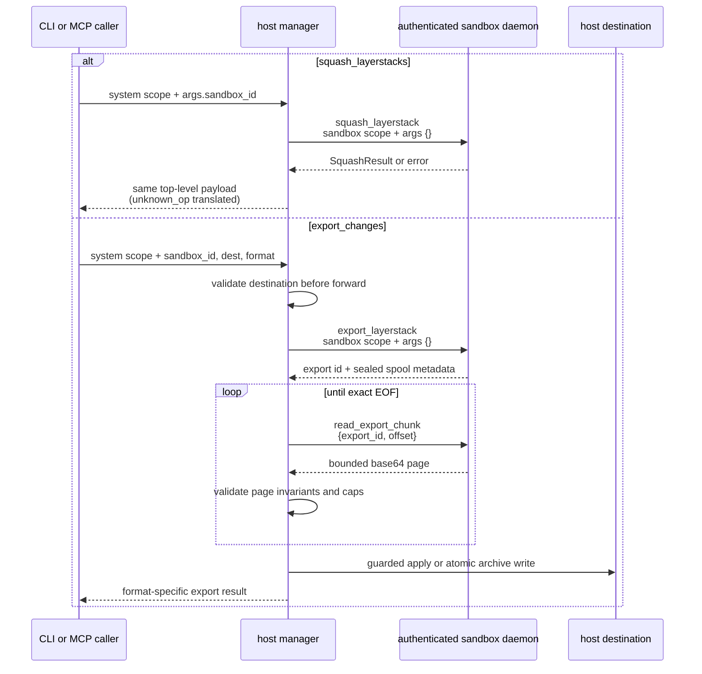

# Management operations: lifecycle, compaction, and export

> **Cluster 04 — Operations, page 1 of 5.** Back to the
> [architecture skeleton](../skelenton.md) · Next:
> [02 — Command and file operations](02-command-and-file-operations.md)

## Why this page exists

The management surface is more than CRUD over sandbox records. Eight public,
system-scoped operations create and remove runtime containers, browse host
resources, forward storage maintenance into authenticated daemons, and write
exported changes back onto the host. This page is the caller contract for those
eight operations and the architectural contract for the three internal daemon
RPCs composed by squash and export.

The result shapes below are labeled **current wire shape** deliberately. Inputs
and routes are declared in the operation catalog; outputs are assembled by
handlers immediately before `OperationResponse::ok(...)` and are pinned to
different degrees by tests. Source anchors are relative to the
`ephemeral-sandbox/` code root.

## Operation census

The implementation currently has:

- **20 public operation names**, expanding to **21 public route rows** because
  `snapshot` has both system and sandbox routes;
- **5 internal operation names**, each with a sandbox-scoped daemon route; and
- **1 HTTP-only operation**, `file_list`, with a runtime handler and no catalog
  route.

That is **26 unique operation names** and **27 callable route/surface
combinations**. Only the 20 public names project into CLI and MCP. The public
and internal sets are pinned by
`crates/sandbox-operations/catalog/tests/integrity.rs:40-267`; the HTTP-only
partition is pinned by
`crates/sandbox-runtime/operation/src/operations/registry/file_operations.rs:20-40`.

| Operation | User job | Visibility / surface | Scope | Execution owner | Canonical reference |
|---|---|---|---|---|---|
| `create_sandbox` | Lifecycle | Public | System | Manager | This page |
| `destroy_sandbox` | Lifecycle | Public | System | Manager | This page |
| `list_sandboxes` | Discovery | Public | System | Manager | This page |
| `inspect_sandbox` | Discovery | Public | System | Manager | This page |
| `list_docker_images` | Discovery | Public | System | Manager | This page |
| `list_workspace_directories` | Discovery | Public | System | Manager | This page |
| `squash_layerstacks` | Storage maintenance | Public | System | Manager, then runtime | This page |
| `export_changes` | Change transfer | Public | System | Manager, then runtime | This page |
| `squash_layerstack` | Storage maintenance | Internal RPC | Sandbox | Runtime | This page |
| `export_layerstack` | Change transfer | Internal RPC | Sandbox | Runtime | This page |
| `read_export_chunk` | Change transfer | Internal RPC | Sandbox | Runtime | This page |
| `exec_command` | Command lifecycle | Public | Sandbox | Runtime | [Page 02](02-command-and-file-operations.md) |
| `write_command_stdin` | Command lifecycle | Public | Sandbox | Runtime | [Page 02](02-command-and-file-operations.md) |
| `read_command_lines` | Command lifecycle | Public | Sandbox | Runtime | [Page 02](02-command-and-file-operations.md) |
| `file_read` | File read | Public | Sandbox | Runtime | [Page 02](02-command-and-file-operations.md) |
| `file_write` | File mutation | Public | Sandbox | Runtime | [Page 02](02-command-and-file-operations.md) |
| `file_edit` | File mutation | Public | Sandbox | Runtime | [Page 02](02-command-and-file-operations.md) |
| `file_blame` | File auditability | Public | Sandbox | Runtime | [Page 02](02-command-and-file-operations.md) |
| `create_workspace_session` | Session lifecycle | Internal RPC | Sandbox | Runtime | [Page 02](02-command-and-file-operations.md) |
| `destroy_workspace_session` | Session lifecycle | Internal RPC | Sandbox | Runtime | [Page 02](02-command-and-file-operations.md) |
| `file_list` | File discovery | Daemon HTTP only | Daemon-minted sandbox identity | Runtime | [Page 02](02-command-and-file-operations.md) |
| `snapshot` | Live state | Public, **two routes** | System or sandbox | Manager or observability | [Page 03](03-observability-operations.md) |
| `trace` | Historical trace | Public | Sandbox | Observability | [Page 03](03-observability-operations.md) |
| `events` | Historical events | Public | Sandbox | Observability | [Page 03](03-observability-operations.md) |
| `cgroup` | Resource history | Public | Sandbox | Manager for `scope=sandbox`; otherwise forwarded (current daemon routing drift) | [Page 03](03-observability-operations.md) |
| `layerstack` | Storage state/history | Public | Sandbox | Observability | [Page 03](03-observability-operations.md) |

*What to notice: routing classification explains authority; user-job
classification explains discoverability. The plural public name
`squash_layerstacks` does not imply fleet fan-out—it selects one sandbox and
mints one singular internal request.*

Catalog domain and execution owner are separate concerns. `cgroup` remains one
of the five public observability names in CLI and MCP, but its current catalog
route is manager-owned. The default `scope="sandbox"` path reads Docker Engine
stats in the manager; other scope values take a manager-to-daemon forwarding
path that currently reaches `unknown_op`. [Page 03](03-observability-operations.md#cgroup)
documents that unresolved routing drift. It does not add a ninth management
command or tool.

## Shared wire contract

All operation transports converge on the same request:

```ts
type OperationRequest = {
  op: string;
  request_id: string;
  scope:
    | { kind: "system" }
    | { kind: "sandbox"; sandbox_id: string };
  args: Record<string, unknown>;
};
```

Every public operation on this page is system-scoped. A public management
`sandbox_id` is therefore ordinary fleet-operation data in `args`; it is not a
scope selector. When the manager composes a daemon call, it moves that value
into sandbox scope and sends only the internal operation's own arguments:

```json
{
  "op": "export_changes",
  "request_id": "req-42",
  "scope": { "kind": "system" },
  "args": {
    "sandbox_id": "sbox-7",
    "dest": "/tmp/delta",
    "format": "dir"
  }
}
```

```json
{
  "op": "export_layerstack",
  "request_id": "req-42",
  "scope": { "kind": "sandbox", "sandbox_id": "sbox-7" },
  "args": {}
}
```

Success is the operation payload itself—there is no `{ "result": ... }`
wrapper. Failure has one stable envelope:

```ts
type OperationError = {
  error: {
    kind: string;
    message: string;
    details: object;
  };
};
```

```json
{
  "error": {
    "kind": "invalid_request",
    "message": "sandbox not found: sbox-missing",
    "details": {}
  }
}
```

Manager-generated errors use `{}` details except the stale-daemon translations
documented under squash and export. `OperationResponse::running` currently
serializes exactly like `ok`; none of the management payloads on this page uses
it. `create_sandbox` progress is an adapter-side stream, not a third response
shape. See [wire protocol and request lifecycle](../00-foundations/02-wire-protocol.md)
and [the operation catalog](../00-foundations/03-operation-catalog.md).

Typed skeleton notation used below:

- `field?: T`: the key may be absent;
- `field: T | null`: the key is always present and may contain JSON `null`;
- `T[]`: an array, including an empty array; and
- literal unions: exact current values proven by enum/assembler behavior.

## Public operation matrix

All eight operations are public, system-scoped, manager-owned, available from
`sandbox-manager-cli`, and projected into the MCP `management` set. The
canonical CLI spellings are pinned by
`crates/sandbox-cli/src/projection/manager.rs:5-101`.

| Operation | CLI usage | Logical `args` | Side effect / result |
|---|---|---|---|
| `create_sandbox` | `sandbox-manager-cli create_sandbox --image IMAGE --workspace-bind-root PATH [--count N]` | `{image, workspace_root, count=1}` | Creates host/runtime state and starts daemon(s); one record or a batch wrapper |
| `list_docker_images` | `sandbox-manager-cli list_docker_images` | `{}` | Read-only Docker discovery; image-reference array |
| `list_workspace_directories` | `sandbox-manager-cli list_workspace_directories [--path PATH]` | `{path?}` | Read-only host directory discovery; bounded listing |
| `destroy_sandbox` | `sandbox-manager-cli destroy_sandbox --sandbox-id ID` | `{sandbox_id}` | Stops daemon, destroys runtime, removes registry row; stopped record |
| `list_sandboxes` | `sandbox-manager-cli list_sandboxes` | `{}` | Read-only registry discovery; record array |
| `inspect_sandbox` | `sandbox-manager-cli inspect_sandbox --sandbox-id ID` | `{sandbox_id}` | Read-only registry lookup; one record |
| `squash_layerstacks` | `sandbox-manager-cli squash_layerstacks --sandbox-id ID` | `{sandbox_id}` | Commits compacted storage and best-effort live remounts; squash result |
| `export_changes` | `sandbox-manager-cli export_changes --sandbox-id ID --dest PATH [--format dir\|tar\|tar-zst]` | `{sandbox_id, dest, format="dir"}` | Reads published layers and writes a guarded host destination; format-specific result |

`--workspace-bind-root` maps to the catalog key `workspace_root`;
`--workspace-root` remains an accepted compatibility alias. Generated CLI and
MCP callers insert catalog defaults before dispatch. A raw request can omit
`count` or `format` because the current manager handler repeats those defaults,
but public callers should rely on the catalog contract.

### Reusable current wire types

```ts
type SandboxState =
  | "creating"
  | "ready"
  | "stopping"
  | "stopped"
  | "failed";

type SandboxRecord = {
  id: string;
  workspace_root: string;
  state: SandboxState;
  daemon: { host: string; port: number } | null;
  daemon_http: { host: string; port: number } | null;
  shared_base: {
    source: string;
    target: string;
    root_hash: string;
    readonly: boolean;
  } | null;
};

type SquashResult = {
  manifest_version: number;
  squashed_blocks: {
    squashed_layer_id: string;
    replaced_layer_ids: string[];
    replaced_layers: "reclaimed" | "leased";
    blocked_reasons?: string[];
  }[];
  faulty_sessions?: {
    session_id: string;
    class_detail: string;
    lease_errors: string[];
  }[];
};
```

All six `SandboxRecord` keys are always present. The two endpoint keys and
`shared_base` are nullable. The authenticated daemon token is intentionally
not exposed. Current creation populates a read-only shared base even when
`count == 1`, but persisted/recovered records make the nullable wire type the
correct contract (`crates/sandbox-manager/src/model.rs:26-104` and
`crates/sandbox-manager/src/operations/registry/management_operations.rs:239-288`).

## `create_sandbox`

**Purpose and side effects.** Create one or more runtime sandboxes for the same
host workspace, persist their records, install/start/check their daemons, and
return only after every requested sandbox is ready.

**Availability.** Public · system scope · manager-owned ·
`sandbox-manager-cli` · MCP `management`.

**Usage.** `sandbox-manager-cli create_sandbox --image IMAGE --workspace-bind-root PATH [--count N]`;
logical RPC args:
`{"image":"ubuntu:24.04","workspace_root":"/work/repo","count":2}`.

| Argument | JSON kind | Required/default | Validation and semantic role |
|---|---|---|---|
| `image` | string | Required | Must be non-empty after trimming; container image passed to the runtime provider. |
| `workspace_root` | path string | Required | Must be absolute. With configured roots it must canonicalize to an existing directory inside the allowlist. The default picker exposes `$HOME` for browsing but intentionally preserves legacy unrestricted create paths. |
| `count` | non-negative integer | Optional, default `1` | Minimum 1; decoded as `u64` then converted to host `usize`. There is no smaller catalog/configured maximum. |

**Current wire shape.** The selection condition is exact and unusual:

```ts
type CreateSandboxResult =
  | SandboxRecord                         // count == 1
  | { sandboxes: SandboxRecord[] };       // count > 1
```

Representative batch result:

```json
{
  "sandboxes": [
    {
      "id": "sbox-101",
      "workspace_root": "/work/repo",
      "state": "ready",
      "daemon": { "host": "127.0.0.1", "port": 7001 },
      "daemon_http": { "host": "127.0.0.1", "port": 7101 },
      "shared_base": {
        "source": "/work/eos-shared-workspace-base-cache/sha256-abcd/base",
        "target": "/eos/layer-stack/base",
        "root_hash": "sha256-abcd",
        "readonly": true
      }
    },
    {
      "id": "sbox-102",
      "workspace_root": "/work/repo",
      "state": "ready",
      "daemon": { "host": "127.0.0.1", "port": 7002 },
      "daemon_http": { "host": "127.0.0.1", "port": 7102 },
      "shared_base": {
        "source": "/work/eos-shared-workspace-base-cache/sha256-abcd/base",
        "target": "/eos/layer-stack/base",
        "root_hash": "sha256-abcd",
        "readonly": true
      }
    }
  ]
}
```

The manager builds/reuses one shared base, then creates sandboxes sequentially.
The externally visible batch outcome is logical all-or-nothing: the first
failure returns one error and never a partial success payload. Already-created
members are rolled back in reverse order. That rollback deliberately ignores
stop, runtime-destroy, and registry-remove failures, so physical cleanup is
**best effort**, not a transactional guarantee. Progress frames are produced
only through the CLI adapter's optional progress sink; they are not fields in
the JSON result.

**Errors.** `invalid_request` covers missing/wrong types,
empty image, a zero/overflowing count, invalid workspace root, or duplicate id.
`operation_failed` covers shared-workspace setup. `internal_error` covers the
runtime provider, daemon install/start/readiness, store, or persistence. On
provisioning failures the manager attempts rollback before returning the
original error.

**Source of truth.** Catalog:
`crates/sandbox-operations/catalog/src/manager.rs:19-46`; parser/assembler:
`crates/sandbox-manager/src/operations/registry/management_operations.rs:82-113,199-228`;
lifecycle and rollback:
`crates/sandbox-manager/src/operations/management/service/impls/create_sandbox.rs:22-58,61-143,189-233`;
workspace policy:
`crates/sandbox-manager/src/workspace_roots.rs:30-76`; contract tests:
`crates/sandbox-manager/tests/manager_core.rs:428-716`.

## `list_docker_images`

**Purpose and side effects.** Read local Docker image references usable by
creation; it does not mutate manager or runtime state.

**Availability.** Public · system scope · manager-owned ·
`sandbox-manager-cli` · MCP `management`.

**Usage.** `sandbox-manager-cli list_docker_images`; logical RPC args: `{}`.

| Argument | JSON kind | Required/default | Validation and semantic role |
|---|---|---|---|
| — | — | No arguments | The generated surfaces send `{}`; the handler does not inspect args. |

**Current wire shape and example.** `images` is always present and may be empty.
References are sorted and deduplicated by the runtime provider; an untagged
image is represented by its image id rather than `<none>:<none>`.

```ts
type ListDockerImagesResult = { images: string[] };
```

```json
{
  "images": ["sha256:9a1b2c", "ubuntu:24.04"]
}
```

There are no output variants.

**Errors.** Runtime-provider discovery failures are `internal_error` with `{}`
details.

**Source of truth.** Catalog:
`crates/sandbox-operations/catalog/src/manager.rs:48-56`; handler/assembler:
`crates/sandbox-manager/src/operations/registry/management_operations.rs:154-161`;
provider normalization:
`crates/sandbox-provider-docker/src/engine.rs:109-135`; test:
`crates/sandbox-manager/tests/manager_core.rs:427-448`.

## `list_workspace_directories`

**Purpose and side effects.** Browse picker-visible host directories without
modifying the filesystem or manager registry.

**Availability.** Public · system scope · manager-owned ·
`sandbox-manager-cli` · MCP `management`.

**Usage.** `sandbox-manager-cli list_workspace_directories [--path PATH]`;
logical RPC args are `{}` for roots or `{"path":"/work"}` for one level of
children.

| Argument | JSON kind | Required/default | Validation and semantic role |
|---|---|---|---|
| `path` | path string | Optional, absent | When present, must be absolute, exist as a directory, canonicalize, and remain inside a picker root. Lists immediate child directories only. |

**Current wire shape.** Every key is present. `path` and `parent` are nullable;
`directories` may be empty. The fixed implementation cap is 500 accepted child
directories.

```ts
type ListWorkspaceDirectoriesResult = {
  path: string | null;
  parent: string | null;
  truncated: boolean;
  directories: { name: string; path: string }[];
};
```

```json
{
  "path": "/work",
  "parent": null,
  "truncated": false,
  "directories": [
    { "name": "alpha", "path": "/work/alpha" },
    { "name": "Beta", "path": "/work/Beta" }
  ]
}
```

With no `path`, both nullable keys are `null` and each root's `name` equals its
full path. With a selected path, the manager filters unreadable, invalid,
outside-root, non-directory, and duplicate entries; accepted entries sort by
case-insensitive name and then path. `truncated` becomes true only when more
than 500 accepted entries exist.

**Errors.** `invalid_request` covers malformed, relative, missing, non-directory, or
outside-root paths. An unconfigured picker or filesystem/read failure maps to
`internal_error`.

**Source of truth.** Catalog:
`crates/sandbox-operations/catalog/src/manager.rs:58-73`; parser/assembler:
`crates/sandbox-manager/src/operations/registry/management_operations.rs:164-176,245-255`;
policy, ordering, and cap:
`crates/sandbox-manager/src/workspace_roots.rs:8,79-166`; tests:
`crates/sandbox-manager/tests/manager_core.rs:428-529`.

## `destroy_sandbox`

**Purpose and side effects.** Stop the daemon, destroy the runtime sandbox,
mark it stopped, remove its manager record, and return the removed record.

**Availability.** Public · system scope · manager-owned ·
`sandbox-manager-cli` · MCP `management`.

**Usage.** `sandbox-manager-cli destroy_sandbox --sandbox-id ID`; logical RPC
args: `{"sandbox_id":"sbox-101"}`.

| Argument | JSON kind | Required/default | Validation and semantic role |
|---|---|---|---|
| `sandbox_id` | string | Required | Ordinary system-operation arg. Non-empty; only ASCII alphanumeric, `-`, `_`, and `.` are accepted. Selects the registry record to destroy. |

**Current wire shape and example.** The result is a bare `SandboxRecord` whose
`state` is `"stopped"`; the record has already been removed from the registry.
Endpoint metadata may remain populated in this returned historical value.

```ts
type DestroySandboxResult = SandboxRecord;
```

```json
{
  "id": "sbox-101",
  "workspace_root": "/work/repo",
  "state": "stopped",
  "daemon": { "host": "127.0.0.1", "port": 7001 },
  "daemon_http": { "host": "127.0.0.1", "port": 7101 },
  "shared_base": {
    "source": "/work/eos-shared-workspace-base-cache/sha256-abcd/base",
    "target": "/eos/layer-stack/base",
    "root_hash": "sha256-abcd",
    "readonly": true
  }
}
```

There is no success variant. Records in `creating` or `stopping` are rejected;
the current implementation permits retry from `failed`. A daemon-stop failure
returns while the record is already `stopping`. A runtime-destroy failure
best-effort marks the record `failed` and preserves it for diagnosis/retry.

**Errors.** `invalid_request` covers invalid/missing ids, a missing record, or an invalid
state transition. Daemon stop, runtime destroy, store, and persistence failures
map to `internal_error`.

**Source of truth.** Catalog:
`crates/sandbox-operations/catalog/src/manager.rs:75-88`; parser/assembler:
`crates/sandbox-manager/src/operations/registry/management_operations.rs:116-128,257-288`;
lifecycle:
`crates/sandbox-manager/src/operations/management/service/impls/destroy_sandbox.rs:4-37`;
tests: `crates/sandbox-manager/tests/manager_core.rs:532-616,883-908`.

## `list_sandboxes`

**Purpose and side effects.** Read every manager registry record; it does not
probe daemon health or mutate lifecycle state.

**Availability.** Public · system scope · manager-owned ·
`sandbox-manager-cli` · MCP `management`.

**Usage.** `sandbox-manager-cli list_sandboxes`; logical RPC args: `{}`.

| Argument | JSON kind | Required/default | Validation and semantic role |
|---|---|---|---|
| — | — | No arguments | The generated surfaces send `{}`; the handler does not inspect args. |

**Current wire shape and example.** `sandboxes` is always present, is empty
when the registry is empty, and is sorted lexicographically by `id`.

```ts
type ListSandboxesResult = { sandboxes: SandboxRecord[] };
```

```json
{
  "sandboxes": [
    {
      "id": "sbox-a",
      "workspace_root": "/work/a",
      "state": "ready",
      "daemon": { "host": "127.0.0.1", "port": 7001 },
      "daemon_http": { "host": "127.0.0.1", "port": 7101 },
      "shared_base": null
    },
    {
      "id": "sbox-b",
      "workspace_root": "/work/b",
      "state": "failed",
      "daemon": null,
      "daemon_http": null,
      "shared_base": null
    }
  ]
}
```

There are no output variants.

**Errors.** Store failures map to `internal_error` with `{}` details.

**Source of truth.** Catalog:
`crates/sandbox-operations/catalog/src/manager.rs:90-97`; handler/assembler:
`crates/sandbox-manager/src/operations/registry/management_operations.rs:144-152,239-288`;
ordering: `crates/sandbox-manager/src/store.rs:123-126`; test:
`crates/sandbox-manager/tests/manager_core.rs:532-579`.

## `inspect_sandbox`

**Purpose and side effects.** Read one persisted sandbox record; it does not
contact the daemon or change lifecycle state.

**Availability.** Public · system scope · manager-owned ·
`sandbox-manager-cli` · MCP `management`.

**Usage.** `sandbox-manager-cli inspect_sandbox --sandbox-id ID`; logical RPC
args: `{"sandbox_id":"sbox-a"}`.

| Argument | JSON kind | Required/default | Validation and semantic role |
|---|---|---|---|
| `sandbox_id` | string | Required | Ordinary system-operation arg. Non-empty and restricted to ASCII alphanumeric plus `-_.`; selects one registry record. |

**Current wire shape and example.** The result is one bare record, not a
single-element wrapper.

```ts
type InspectSandboxResult = SandboxRecord;
```

```json
{
  "id": "sbox-a",
  "workspace_root": "/work/a",
  "state": "ready",
  "daemon": { "host": "127.0.0.1", "port": 7001 },
  "daemon_http": { "host": "127.0.0.1", "port": 7101 },
  "shared_base": null
}
```

There are no output variants.

**Errors.** Invalid syntax, a missing id, and a missing record are
`invalid_request`; store failures are `internal_error`.

**Source of truth.** Catalog:
`crates/sandbox-operations/catalog/src/manager.rs:99-112`; parser/assembler:
`crates/sandbox-manager/src/operations/registry/management_operations.rs:130-142,257-288`;
service: `crates/sandbox-manager/src/operations/management/service/impls/inspect_sandbox.rs`;
test: `crates/sandbox-manager/tests/manager_core.rs:532-570`.

## `squash_layerstacks`

**Purpose and side effects.** Commit compacted replacements for every
squashable block in one sandbox's published layer stack, then attempt to
remount live workspace sessions onto the compact chains.

**Availability.** Public · system scope · manager-owned, composing one
sandbox-scoped runtime RPC · `sandbox-manager-cli` · MCP `management`.

**Usage.** `sandbox-manager-cli squash_layerstacks --sandbox-id ID`; logical
RPC args: `{"sandbox_id":"sbox-a"}`.

| Argument | JSON kind | Required/default | Validation and semantic role |
|---|---|---|---|
| `sandbox_id` | string | Required | Ordinary system-operation arg. Must satisfy sandbox-id syntax; the manager record must be `ready` and carry an authenticated daemon endpoint. |

**Current wire shape.** The manager passes the daemon's `SquashResult` through
at the top level. `squashed_blocks: []` is a successful no-op. A block has
`blocked_reasons` only when its old layers remain leased. `faulty_sessions` is
absent unless at least one session failed the remount sweep.

```ts
type SquashLayerstacksResult = SquashResult;
```

```json
{
  "manifest_version": 12,
  "squashed_blocks": [
    {
      "squashed_layer_id": "L000012-squashed",
      "replaced_layer_ids": ["L000008-a", "L000009-b"],
      "replaced_layers": "leased",
      "blocked_reasons": ["pinned:workspace-session-ws-4"]
    }
  ],
  "faulty_sessions": [
    {
      "session_id": "ws-9",
      "class_detail": "staged remount failed",
      "lease_errors": []
    }
  ]
}
```

The storage commit is the correctness boundary. The post-commit remount sweep
is best effort: migrated sessions persist their new handles, leased sessions
explain why old layers could not yet be reclaimed, and faulty sessions are
reported and destroyed. `faulty_sessions` is therefore successful diagnostic
metadata, not an error envelope.

The public plural name is API vocabulary, not fan-out. The manager mints
exactly one request with the same `request_id`:

```json
{
  "op": "squash_layerstack",
  "request_id": "req-55",
  "scope": { "kind": "sandbox", "sandbox_id": "sbox-a" },
  "args": {}
}
```

**Errors.** `invalid_request` covers bad/missing ids, missing records, non-ready state, or
missing daemon endpoint. Transport forwarding failures are `internal_error`;
runtime storage/squash failures are `operation_failed`. If an older daemon
returns `unknown_op`, the manager replaces it with:

```json
{
  "error": {
    "kind": "operation_failed",
    "message": "sandbox daemon does not support squash_layerstacks; recreate the sandbox so it uses the current daemon binary",
    "details": { "daemon_op": "squash_layerstack" }
  }
}
```

**Source of truth.** Catalog:
`crates/sandbox-operations/catalog/src/manager.rs:114-127`; composition and
stale-daemon translation:
`crates/sandbox-manager/src/operations/management/service/impls/squash_layerstacks.rs:8-42`;
ready/endpoint gate: `crates/sandbox-manager/src/router/forward.rs:5-38`;
runtime assembler:
`crates/sandbox-runtime/operation/src/layerstack/service/impls/squash.rs:41-151`;
tests: `crates/sandbox-manager/tests/manager_core.rs:909-1030` and
`crates/sandbox-runtime/operation/tests/layerstack_squash.rs:58-146`.

## `export_changes`

**Purpose and side effects.** Fold every **published** layer above the base,
page a sealed compressed delta from the selected daemon, validate it as
untrusted input, and either apply it to a host directory or write an archive.
The sandbox layer stack itself is read-only during export; the destination is
mutated.

**Availability.** Public · system scope · manager-owned, composing two
sandbox-scoped runtime RPCs · `sandbox-manager-cli` · MCP `management`.

**Usage.** `sandbox-manager-cli export_changes --sandbox-id ID --dest PATH [--format dir|tar|tar-zst]`;
logical RPC args:
`{"sandbox_id":"sbox-a","dest":"/tmp/delta","format":"dir"}`.

| Argument | JSON kind | Required/default | Validation and semantic role |
|---|---|---|---|
| `sandbox_id` | string | Required | Ordinary system-operation arg. Valid sandbox id; record must be `ready` with a daemon endpoint. |
| `dest` | path string | Required | Absolute host destination. Directory target for `dir`; archive filename for `tar`/`tar-zst`. Subject to the guard below. |
| `format` | string | Optional, default `"dir"` | Exact enum: `"dir"`, `"tar"`, or `"tar-zst"`. |

**Current wire shape.** The `format` literal selects one of two exact result
families. `live_workspace_sessions` is absent when the daemon reported none;
if present, those live unpublished upperdirs were **not** included in the
export.

```ts
type DirectoryExportResult = {
  manifest_version: number;
  format: "dir";
  layers_exported: string[];
  files_written: number;
  symlinks_written: number;
  deletes_applied: number;
  opaque_clears: number;
  skipped_unchanged: number;
  bytes_written: number;
  live_workspace_sessions?: string[];
};

type ArchiveExportResult = {
  manifest_version: number;
  format: "tar" | "tar-zst";
  layers_exported: string[];
  files_written: number;
  symlinks_written: number;
  whiteouts_emitted: number;
  bytes_written: number;
  live_workspace_sessions?: string[];
};

type ExportChangesResult = DirectoryExportResult | ArchiveExportResult;
```

Representative directory result:

```json
{
  "manifest_version": 12,
  "format": "dir",
  "layers_exported": ["L000010-a", "L000011-b"],
  "files_written": 18,
  "symlinks_written": 1,
  "deletes_applied": 2,
  "opaque_clears": 1,
  "skipped_unchanged": 5,
  "bytes_written": 84321,
  "live_workspace_sessions": ["ws-4"]
}
```

| Selected format | Delivery behavior | Fields unique to the variant |
|---|---|---|
| `dir` | Validate the whole archive, then apply opaque clears, deletions, and content inside the destination. Existing directories can be changed in place. | `deletes_applied`, `opaque_clears`, `skipped_unchanged` |
| `tar` | Decompress the daemon's `tar.zst` delivery to a plain tar and atomically rename a temporary sibling into place. | `whiteouts_emitted` |
| `tar-zst` | Atomically write the compressed delivery as received. | `whiteouts_emitted` |

An empty published delta is a successful no-op: arrays are empty and counters
are zero. The deeper fold/whiteout semantics live in
[capture and publish](../01-workspace-runtime/07-capture-and-publish.md); the
planned Cluster 05 host-management pages are indexed in the
[architecture skeleton](../skelenton.md#cluster-05--host-management-plane-05-management-plane).

### Destination and stream guards

Destination validation runs before the first daemon call. The manager rejects:

- relative paths;
- `/`, `$HOME` itself, the manager registry file, the manager state directory,
  and any path with a `.export` component;
- a `dir` destination that exists but is not a directory; and
- an archive destination that is a directory, lacks a filename, or whose
  parent is not an existing directory.

After daemon export succeeds, the manager creates/resolves the target and
rechecks the canonical form so symlinks cannot redirect into a denied root.
The host applier rejects escaping entry paths, hardlinks, and unsafe symlink
walks. Archive writes use a temporary sibling plus atomic rename; directory
apply necessarily mutates an existing tree in place.

Paging is also part of the boundary. The manager reads `spool_bytes`, then
sends monotonically increasing `read_export_chunk` offsets while omitting
`limit` so the daemon owns frame size. It validates base64, echoed offset,
decoded `len`, invariant `total`, configured stream cap, non-empty non-final
chunks, and EOF exactly at the announced total before rendering anything.

| Cap owner | Configuration key | Shipped default | Enforcement |
|---|---|---:|---|
| Manager | `manager.export.max_stream_bytes` | 2 GiB | Announced and accumulated compressed bytes |
| Manager | `manager.export.max_decompressed_bytes` | 8 GiB | Decompressed delivery consumed by apply/archive conversion |
| Manager | `manager.export.max_apply_entries` | 1,000,000 | Archive entries processed |
| Runtime daemon | `runtime.layerstack.export_chunk_bytes` | 2 MiB | Maximum bytes in one internal page |

All four are configurable and validated as at least 1; they are shipped policy,
not literal protocol maxima
(`crates/sandbox-config/src/configs/manager.rs:16-57`,
`crates/sandbox-config/src/configs/runtime.rs:139-170`).

**Errors.** `invalid_request` covers malformed args, bad sandbox id/state/endpoint, bad
format, and destination-policy rejection. Forwarding failures are
`internal_error`. Daemon start/page errors, malformed page metadata, cap
violations, unsafe archive content, decompression, apply, and host writes are
`operation_failed`. An old daemon missing `export_layerstack` produces a
targeted stale-daemon error:

```json
{
  "error": {
    "kind": "operation_failed",
    "message": "sandbox daemon does not support export_changes; recreate the sandbox so it uses the current daemon binary",
    "details": { "daemon_op": "export_layerstack" }
  }
}
```

An `unknown_op` returned later by `read_export_chunk` is treated as a page-read
failure and becomes a generic `operation_failed` with `{}` details; only the
start operation has the targeted stale-daemon translation.

**Source of truth.** Catalog:
`crates/sandbox-operations/catalog/src/manager.rs:129-156`; parser, composition,
paging, guards, and assemblers:
`crates/sandbox-manager/src/operations/management/service/impls/export_changes.rs:53-117,147-258,260-415,417-451`;
host hardening and defaults: `crates/sandbox-manager/src/export_apply.rs:1-40`;
exact-key and behavior tests:
`crates/sandbox-manager/tests/manager_export.rs:569-645,690-843,1089-1358`.

## Manager-to-daemon composition

The public operations preserve their incoming `request_id` across every
internal call. The forwarder resolves a `ready` record, retrieves its
authenticated endpoint, and invokes only that sandbox's daemon.



*What to notice: daemon storage operations never receive a host destination.
Only the manager has host write authority, and it treats the complete daemon
stream as untrusted.*

## Internal fan-out operations

These three names have canonical internal, sandbox-scoped runtime routes, but
no public `OperationSpec`. They do not appear in CLI help, MCP `tools/list`, or
the public catalog. A caller cannot use the manager as a tunnel: its public
router rejects canonical internal requests with `invalid_request` and
`"internal operation is not publicly dispatchable"`
(`crates/sandbox-manager/src/router/dispatch.rs:21-25`). The invocation path is
only manager → authenticated daemon.

The catalog owns their names, route owner, scope, and visibility at
`crates/sandbox-operations/catalog/src/internal/runtime.rs:6-29`. Their argument
and output contracts come from runtime handlers and tests.

## Internal `squash_layerstack`

**Purpose and side effects.** Commit squashable published-layer replacements
inside one sandbox, then perform the same best-effort live-session remount sweep
described for public `squash_layerstacks`.

**Availability.** Internal RPC only · sandbox scope · runtime-owned · no CLI ·
no MCP.

**Usage.** Manager → authenticated daemon only. The manager invokes it once
with the public request's `request_id`:

```json
{
  "op": "squash_layerstack",
  "request_id": "req-55",
  "scope": { "kind": "sandbox", "sandbox_id": "sbox-a" },
  "args": {}
}
```

| Input | JSON kind | Required/default | Validation and semantic role |
|---|---|---|---|
| Sandbox scope selector | string in `scope.sandbox_id` | Required by route | Selects the daemon/runtime instance; never appears in `args`. |
| `args` | object | Manager sends `{}` | No declared arguments. The current handler ignores the object rather than validating exact emptiness. |

**Current wire shape.** Exactly `SquashResult`, including the same conditional
absence rules. An empty `squashed_blocks` array is successful and means there
was no squashable block.

```ts
type InternalSquashLayerstackResult = SquashResult;
```

```json
{
  "manifest_version": 7,
  "squashed_blocks": []
}
```

The operation mutates layer-stack storage when a block can be compacted.
`blocked_reasons` is present only on a `replaced_layers: "leased"` block;
`faulty_sessions` is present only when non-empty.

**Errors.** Storage open/squash failures return `operation_failed` with `{}`
details. Per-session remount problems do not fail the committed squash; they
are expressed by leased blocks or `faulty_sessions` in a success payload. Wrong
scope and unknown operation are dispatcher failures rather than
handler-specific variants.

**Source of truth.** Internal route:
`crates/sandbox-operations/catalog/src/internal/runtime.rs:8,16,21-28`;
manager invocation:
`crates/sandbox-manager/src/operations/management/service/impls/squash_layerstacks.rs:8-25`;
runtime handler/assembler:
`crates/sandbox-runtime/operation/src/layerstack/service/impls/squash.rs:28-151`;
tests:
`crates/sandbox-runtime/operation/tests/layerstack_squash.rs:58-146`.

## Internal `export_layerstack`

**Purpose and side effects.** Take a snapshot lease over published layers,
fold the newest-wins delta above the base, spool a sealed `tar.zst` under the
daemon scratch `.export` directory, register it for paging, and release the
lease. It is read-only with respect to layer-stack content but creates a
temporary spool file.

**Availability.** Internal RPC only · sandbox scope · runtime-owned · no CLI ·
no MCP.

**Usage.** Manager → authenticated daemon only. The manager invokes it after
validating the host destination:

```json
{
  "op": "export_layerstack",
  "request_id": "req-42",
  "scope": { "kind": "sandbox", "sandbox_id": "sbox-a" },
  "args": {}
}
```

| Input | JSON kind | Required/default | Validation and semantic role |
|---|---|---|---|
| Sandbox scope selector | string in `scope.sandbox_id` | Required by route | Selects the runtime whose published stack is folded; removed from `args`. |
| `args` | object | Manager sends `{}` | No declared arguments. The current handler ignores args rather than validating exact emptiness. |

**Current wire shape.** All keys except `live_workspace_sessions` are always
present. `layers_exported` may be empty, and all entry counters may be zero;
even an empty logical delta has a framed archive whose `spool_bytes` is greater
than zero.

```ts
type ExportLayerstackResult = {
  export_id: string;
  manifest_version: number;
  layers_exported: string[];
  entries: {
    files: number;
    symlinks: number;
    whiteouts: number;
    opaques: number;
  };
  spool_bytes: number;
  live_workspace_sessions?: string[];
};
```

```json
{
  "export_id": "exp-2a10-0003",
  "manifest_version": 12,
  "layers_exported": ["L000010-a", "L000011-b"],
  "entries": {
    "files": 18,
    "symlinks": 1,
    "whiteouts": 2,
    "opaques": 1
  },
  "spool_bytes": 39122,
  "live_workspace_sessions": ["ws-4"]
}
```

`live_workspace_sessions` is absent when there are no live sessions; it warns
that live unpublished upperdirs are not in the published-layer export. The
snapshot lease lasts from fold start through successful spool completion, then
is released before any page is served. Construction is single-flight per layer
stack, but completed spools have independent `export_id` keys and can coexist
until paged to EOF.

**Errors.** An already-running construction, layer-stack open/fold failure,
spool/write failure, or lease-release failure returns `operation_failed` with
`{}` details. A failed construction removes its partial spool best-effort.

**Source of truth.** Internal route:
`crates/sandbox-operations/catalog/src/internal/runtime.rs:9,17,21-28`;
manager invocation:
`crates/sandbox-manager/src/operations/management/service/impls/export_changes.rs:81-107,147-163`;
runtime handler, lease, and assembler:
`crates/sandbox-runtime/operation/src/layerstack/service/impls/export.rs:28-130,151-182,265-297`;
tests:
`crates/sandbox-runtime/operation/tests/layerstack_export.rs:125-291`.

## Internal `read_export_chunk`

**Purpose and side effects.** Read one bounded byte range from a registered
compressed export spool and return it as base64. Serving an EOF page unregisters
and best-effort unlinks the spool, so the operation is read-and-consume rather
than purely read-only.

**Availability.** Internal RPC only · sandbox scope · runtime-owned · no CLI ·
no MCP.

**Usage.** Manager → authenticated daemon only. The manager invokes it
repeatedly with the same public `request_id` and omits `limit`:

```json
{
  "op": "read_export_chunk",
  "request_id": "req-42",
  "scope": { "kind": "sandbox", "sandbox_id": "sbox-a" },
  "args": {
    "export_id": "exp-2a10-0003",
    "offset": 2097152
  }
}
```

| Input | JSON kind | Required/default | Validation/cap and semantic role |
|---|---|---|---|
| Sandbox scope selector | string in `scope.sandbox_id` | Required by route | Selects the daemon that owns the spool; never appears in `args`. |
| `export_id` | string | Required | Must be non-empty; selects one registered spool. |
| `offset` | non-negative integer | Required | Unsigned byte offset in the **compressed** spool. The composed manager sends the exact accumulated byte count. |
| `limit` | non-negative integer | Optional, defaults to configured cap | Effective limit is `min(requested, runtime.layerstack.export_chunk_bytes)`. Shipped cap is 2 MiB and configuration requires at least 1. |

**Current wire shape.** Every key is always present. `chunk` is standard base64;
`len`, `offset`, and `total` count raw compressed bytes, not base64 characters.

```ts
type ReadExportChunkResult = {
  chunk: string;
  offset: number;
  len: number;
  total: number;
  eof: boolean;
};
```

```json
{
  "chunk": "KLUv/QBYpQAAc3JjL2EucnM=",
  "offset": 2097152,
  "len": 20,
  "total": 2097172,
  "eof": true
}
```

The normal manager-composed sequence starts at offset 0, requests the next
exact offset, and stops only when `eof: true` coincides with `offset + len ==
total`. The EOF response consumes the spool; a later read of the same
`export_id` returns `operation_failed` (`export not found`) with `{}` details.
**Errors.**
Missing, empty, or wrong-typed `export_id`, and missing/wrong-typed `offset` or
`limit`, are `invalid_request`. Missing/unreadable spools and seek/read failures
are `operation_failed` with `{}` details.

The raw handler currently accepts `limit: 0` and arbitrary unsigned offsets,
including offsets beyond `total`. A zero limit at an ordinary offset yields an
empty non-final page; an offset at or beyond `total` yields an empty EOF page
and consumes the spool. These are implementation quirks, **not** the
manager-composed contract. The manager never sends zero limit, enforces
monotonic offsets, and rejects empty non-final pages or any total/EOF mismatch.

**Source of truth.** Internal route:
`crates/sandbox-operations/catalog/src/internal/runtime.rs:10,18,21-28`;
manager page loop:
`crates/sandbox-manager/src/operations/management/service/impls/export_changes.rs:166-258`;
runtime parser/assembler and EOF cleanup:
`crates/sandbox-runtime/operation/src/layerstack/service/impls/export.rs:184-254`;
configured cap: `crates/sandbox-config/src/configs/runtime.rs:138-170`;
tests:
`crates/sandbox-runtime/operation/tests/layerstack_export.rs:141-287` and
`crates/sandbox-manager/tests/manager_export.rs:1172-1358`.

## Error-kind ownership

The shared envelope is stable, but kind selection belongs to the layer that
detects the fault:

| Kind | Management conditions on this page | `details` |
|---|---|---|
| `invalid_request` | Missing/wrong args; invalid ids/image/count/workspace/destination/format; missing records; lifecycle or daemon-ready gate; internal parser rejection | `{}` |
| `internal_error` | Runtime-provider/installer/store/persistence failures and manager↔daemon forwarding failures | `{}` |
| `operation_failed` | Shared-base setup; runtime squash/export work; daemon page validation; export caps/decode/apply/write | `{}` normally |
| `operation_failed` stale daemon | Public squash/export start receives daemon `unknown_op` | `{ "daemon_op": "squash_layerstack" }` or `{ "daemon_op": "export_layerstack" }` |

The manager mapping is exhaustive at
`crates/sandbox-manager/src/error.rs:61-90`. Do not infer structured fields from
human-readable messages; only `kind` and the documented stale-daemon detail are
machine contracts today.

## Contract reality and maintenance decisions

| Finding | Current behavior | Decision pressure |
|---|---|---|
| Create result is polymorphic | `count == 1` returns a bare record; `count > 1` returns `{sandboxes:[...]}`. | Preserve and test both shapes, or normalize in a versioned contract change. |
| Batch rollback is best effort | A member failure has no partial-success payload, but cleanup errors are discarded. | Do not claim durable transactional rollback until failures are recorded/retried. |
| Output schemas are not catalog data | All success schemas here are inferred from JSON assemblers and exact-key/behavior tests. | Add schema declarations or exact-key tests before treating every key as protocol-frozen. |
| Picker policy and create policy can differ | Default browsing exposes `$HOME`, while legacy create remains unrestricted until roots are configured. | Operators needing an allowlist must set explicit workspace roots. |
| Public plural squash forwards once | `squash_layerstacks` sends one `squash_layerstack` request to one selected daemon. | Rename only with compatibility planning; never document fleet-wide behavior. |
| Internal handlers are deliberately looser | Empty-args operations ignore extra keys; chunk paging accepts zero limit/out-of-range offsets. | Keep generated/public behavior strict and decide whether internal parsers should reject these cases. |
| Export caps have mixed ownership | Manager owns stream/decompression/entry caps; daemon owns page size. | Documentation must state current defaults and configuration owners, not invent a single protocol cap. |

## Related architecture and cluster navigation

Operation request construction and response envelopes are specified in
[wire protocol and request lifecycle](../00-foundations/02-wire-protocol.md);
catalog routing/visibility in
[the operation catalog](../00-foundations/03-operation-catalog.md); and the
daemon's narrow unauthenticated exception in
[the HTTP surface](../03-daemon/03-http-surface.md). Workspace publish behavior
stays in [capture and publish](../01-workspace-runtime/07-capture-and-publish.md).

| Cluster 04 page | Contract owned there |
|---|---|
| **01 — Management operations (this page)** | Eight public manager operations and three composed internal RPCs |
| [02 — Command and file operations](02-command-and-file-operations.md) | Seven public runtime operations, two internal session operations, and HTTP-only `file_list` |
| [03 — Observability operations](03-observability-operations.md) | Five public names, including both `snapshot` routes |
| [04 — CLI adapter](04-cli.md) | Flags, scope lifting, progress, stdout/stderr, and exit status |
| [05 — MCP adapter](05-mcp.md) | Tool sets, generated schemas, scope lifting, and result wrapping |

Back to the [architecture skeleton](../skelenton.md) · Next:
[02 — Command and file operations](02-command-and-file-operations.md)
