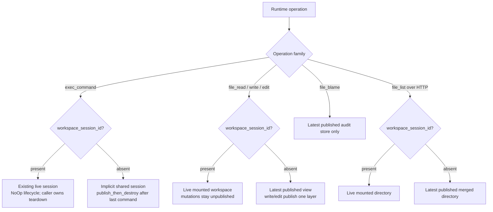

# Command, file, and workspace-session operations

> **Cluster 04 — Operations, page 2 of 5.**
> Previous: [01 — Management operations](01-management-operations.md) ·
> Next: [03 — Observability operations](03-observability-operations.md) ·
> [Architecture skeleton](../skelenton.md)

## Why this page exists

The runtime domain has seven public operations: three drive a command and four
read or mutate files. All seven require sandbox scope and execute in that
sandbox's daemon. Two more workspace-session operations are real runtime
routes but are internal composition APIs, and `file_list` is deliberately
reachable only through daemon HTTP.

This page is the caller contract for those ten operations: arguments,
defaults and caps, state-selection rules, current response shapes, and
operation-specific faults. The mechanics behind a workspace mount, PTY,
transcript, capture, publish, and blame store remain in
[cluster 01](../01-workspace-runtime/04-workspace-sessions.md). Routing and
envelope mechanics remain in
[the operation catalog](../00-foundations/03-operation-catalog.md) and
[wire protocol](../00-foundations/02-wire-protocol.md).

> **Current-wire-shape warning.** The catalog declares inputs, not outputs.
> Every success shape below is the JSON currently assembled by the runtime
> handlers and pinned where tests exist; it is not generated from an output
> schema. Anchors are paths in the `ephemeral-sandbox` code repository.

Verified against source and focused tests on 2026-07-11. Abbreviations used in
citations: `CAT/` = `crates/sandbox-operations/catalog/src/`, `CLI/` =
`crates/sandbox-cli/src/`, and `RT/` =
`crates/sandbox-runtime/operation/src/`.

## Inventory and availability

| Tier | Operations | Scope and route | Public adapters |
|---|---|---|---|
| Public runtime (7) | `exec_command`, `write_command_stdin`, `read_command_lines`, `file_read`, `file_write`, `file_edit`, `file_blame` | sandbox scope; manager forwards to the selected daemon | runtime CLI, MCP runtime set, console/catalog clients |
| Internal runtime (2 on this page) | `create_workspace_session`, `destroy_workspace_session` | sandbox scope; trusted internal daemon route | **none** |
| HTTP-only (1) | `file_list` | daemon synthesizes sandbox scope for `POST /files/list` | daemon HTTP only; **not** CLI, MCP, catalog RPC, or manager forwarding |

The runtime registry keeps public, internal, and HTTP-only entries in three
separate partitions (`RT/operations/registry/mod.rs:7-30`). The canonical
internal table contains five routes total; the other three implement squash
and export composition and are documented on
[page 01](01-management-operations.md#internal-fan-out-operations).
`file_list` is only a name constant and has no catalog route
(`CAT/internal/runtime.rs:6-28`).

## Scope is routing metadata, not an argument

Every public operation on this page uses the same CLI prefix:

```text
sandbox-runtime-cli --sandbox-id ID ...
```

`--sandbox-id` selects the request scope. It does **not** produce an
`args.sandbox_id` field. For example:

```sh
sandbox-runtime-cli --sandbox-id eos-4f21 \
  file_read --path src/main.rs --offset 20 --limit 40
```

becomes, before transport-only authentication fields are added:

```json
{
  "op": "file_read",
  "request_id": "req-7b5f",
  "scope": { "kind": "sandbox", "sandbox_id": "eos-4f21" },
  "args": { "path": "src/main.rs", "offset": 20, "limit": 40 }
}
```

The shared public request builder requires a non-empty selector, lifts a
matching redundant `sandbox_id` copy out of `args`, rejects a conflicting
copy, rejects unknown arguments, validates JSON kinds, and inserts catalog
defaults (`crates/sandbox-operations/client/src/request.rs:68-94,107-204`).
The runtime dispatcher then matches the exact `(scope kind, operation name)`;
the wrong scope does not fall through to a same-named handler.

Successful and running operation responses are the payload object itself.
Failures use the one universal envelope:

```json
{
  "error": {
    "kind": "invalid_request",
    "message": "limit must be between 1 and 2000",
    "details": {}
  }
}
```

Do not confuse that envelope with a command payload whose own
`"status":"error"`. A shell exiting nonzero is a **successfully executed
operation**: no top-level `error` exists, the CLI prints the payload to stdout
and exits 0, while `status` and `exit_code` report the shell failure. A
protocol or runtime-operation failure has a top-level `error`, goes to CLI
stderr, and makes the CLI exit 1. Local CLI usage errors are never sent and
exit 2. See [page 04](04-cli.md#stdout-stderr-and-exit-status).

## State selection: live overlay or published snapshot



Presence is the selector. Public callers should omit
`workspace_session_id` to select the published/implicit route. The raw
handlers currently treat an empty optional session id as absent, but that is
a compatibility behavior rather than a useful public value
(`RT/operations/registry/{command,file}_operations.rs:39-50,182-189`).

## Public operation matrix

The usages are the exact runtime CLI projection
(`CLI/projection/runtime.rs:45-113`). Types and public defaults come from
`CAT/runtime/{command,file}.rs`; integers are unsigned on generated surfaces.

| Operation | Exact usage | Public argument contract |
|---|---|---|
| `exec_command` | `exec_command [--workspace-session-id ID] [--timeout-ms N] [--yield-time-ms N] COMMAND` | `cmd: string` required and non-empty; `workspace_session_id?: string`; `timeout_ms?: integer`; `yield_time_ms?: integer`. No catalog defaults. Runtime default initial wait: 1000 ms; no command timeout when omitted. |
| `write_command_stdin` | `write_command_stdin --command-session-id ID [--yield-time-ms N] TEXT` | non-empty `command_session_id: string` and `stdin: string` required; `yield_time_ms?: integer`. Runtime default post-write wait: 1000 ms. |
| `read_command_lines` | `read_command_lines --command-session-id ID [--start-offset N] [--limit N]` | non-empty `command_session_id: string` required; `start_offset?: integer = 0`; `limit?: integer = 200`, advertised maximum 1000. |
| `file_read` | `file_read --path FILE [--offset N] [--limit N] [--workspace-session-id ID]` | non-empty `path: string` required; `offset?: integer = 1`; `limit?: integer = 2000`, required range `1..=2000`; `workspace_session_id?: string`. |
| `file_write` | `file_write --path FILE --content TEXT [--workspace-session-id ID]` | non-empty `path: string` and present `content: string` required; `content` may be `""`; `workspace_session_id?: string`. Only a **missing** content key is raw-parser drift, described later. |
| `file_edit` | `file_edit --path FILE --edits JSON [--workspace-session-id ID]` | non-empty `path: string` required; `edits: JSON array` required; `workspace_session_id?: string`. Each ordered item is `{old_string: string, new_string: string, replace_all?: boolean}`; omitted or `null` `replace_all` means `false`. |
| `file_blame` | `file_blame --path FILE` | non-empty `path: string` required. There is no session variant. |

### Defaults and caps have different owners

| Value | Shipped value and behavior | Owner |
|---|---|---|
| command yield | `exec_command` and ordinary stdin writes wait 1000 ms when omitted; there is no operation-specific maximum | runtime service (`RT/command/service/{exec_command,write_command_stdin}.rs`) |
| command timeout | omitted means no timeout; a timed-out shell becomes terminal `timed_out` with exit code 124 | caller plus runner; no catalog default |
| command read offset/limit | catalog inserts `0` / `200`; runtime clamps limit to `1..=runtime.command.read_lines_max`, shipped max 1000 | catalog defaults; daemon configuration max (`sandbox-config/src/configs/runtime.rs:42-83`) |
| file read offset/limit | catalog inserts `1` / `2000`; offset 0 also normalizes to line 1; dispatch rejects limit 0 or greater than 2000 | catalog plus fixed runtime dispatch cap (`file_operations.rs:17-18,151-161`) |
| file read rendered window | 256 KiB shipped; exceeding it rejects the selected window rather than truncating it | `runtime.file.max_output_bytes` |
| editable input file | 4 MiB shipped | `runtime.file.max_edit_bytes` |
| listed entries | 2000 shipped; excess entries set `truncated: true` | `runtime.file.max_list_entries` |
| explicit destroy grace | 0.25 seconds shipped when omitted | `runtime.workspace.exit_grace_s` |
| transcript scan window | 1 MiB shipped; older transcript bytes can fall outside the readable tail | `runtime.namespace_execution.max_transcript_window_bytes` |

The file and namespace defaults are in
`sandbox-config/src/configs/runtime.rs:87-126,179-218,225-318`. They are
deployment configuration, not frozen protocol constants. Generated clients
insert catalog defaults before dispatch, so a raw, direct request that omits a
field can expose configured fallback behavior that normal CLI/MCP calls do
not. Wire body and exchange deadlines still apply when an operation itself
has no maximum; see [the wire limits](../00-foundations/02-wire-protocol.md).

## Command operations

The three command calls share one current wire shape, assembled in
`RT/operations/registry/command_operations.rs:95-151`:

```ts
type CommandOutput = {
  status: "running" | "ok" | "error" | "timed_out" | "cancelled";
  exit_code: number | null;
  wall_time_seconds: number;
  command_total_time_seconds: number;
  start_offset: number;
  end_offset: number;
  total_lines: number;
  original_token_count: number;
  output: string;
  command_session_id?: string;
  workspace_session_id?: string;
  publish_rejected?: true;
  publish_reject_class?: string;
};
```

All nine non-optional keys are always present. `exit_code` is `null` while
running or when no terminal result is available. Offsets count rendered
transcript rows: the returned half-open window is
`[start_offset,end_offset)`, and `output` joins row text with `\n` without
preserving a final trailing newline. `original_token_count` is only an
estimate—UTF-8 byte length divided by four, rounded up—not a tokenizer count
(`RT/command/service/render.rs:14-53`). `wall_time_seconds` is elapsed wall
time at this read; `command_total_time_seconds` becomes the runner's fixed
total after terminal completion.

| Status | Terminal? | `exit_code` convention |
|---|---|---|
| `running` | no | `null` |
| `ok` | yes | normally `0` |
| `error` | yes | shell's nonzero code; a failed retained completion read can instead have `null` |
| `timed_out` | yes | 124 in the shell runner |
| `cancelled` | yes | 130; cancellation overrides a coincident clean exit |

The terminal vocabulary comes from `RT/command/service/dto.rs:28-50`; shell
status and exit-code production are in
`crates/sandbox-runtime/namespace-process/src/runner/shell_exec.rs:61-88`
and `namespace-execution/src/shell.rs:51-69`.

### exec_command

**Availability, usage, and arguments.** This is a public, sandbox-scoped,
runtime-owned operation in the runtime CLI and MCP set. Use
`exec_command [--workspace-session-id ID] [--timeout-ms N] [--yield-time-ms N] COMMAND`;
the logical argument object and validation are in the
[public operation matrix](#public-operation-matrix).

**Purpose and side effects.** `exec_command` starts
`bash --noprofile --norc -c COMMAND` in a workspace
session and waits up to `yield_time_ms` for an initial result. With an
explicit session, the command uses that live overlay and does not finalize or
destroy it. Without one, runtime creates a shared session with
`publish_then_destroy`; when the session's last command becomes terminal it
captures, attempts to publish, and destroys the session
(`RT/command/service/exec_command.rs:22-49,149-150`).

**Output and variants.** The operation returns the shared
[`CommandOutput`](#command-operations) shape. ID presence is semantic:

- A running result always has `command_session_id` and
  `workspace_session_id`.
- A fully drained terminal result from `exec_command` normally omits
  `command_session_id`. It retains the id only when more transcript output is
  available to page.
- A terminal result still includes `workspace_session_id`, even if that was
  an implicit session already destroyed by finalization. The id is not a
  liveness promise.
- `publish_rejected: true` and `publish_reject_class` appear together only
  after a terminal implicit-session finalization failed to publish. The
  command result can still be `status: "ok"`; destruction is attempted even
  after publish rejection.

A representative running response is:

```json
{
  "status": "running",
  "exit_code": null,
  "wall_time_seconds": 0.012,
  "command_total_time_seconds": 0.012,
  "start_offset": 0,
  "end_offset": 1,
  "total_lines": 1,
  "original_token_count": 2,
  "output": "ready",
  "command_session_id": "namespace_execution_17",
  "workspace_session_id": "workspace_session_9"
}
```

This shell failure is **not** an error envelope:

```json
{
  "status": "error",
  "exit_code": 7,
  "wall_time_seconds": 0.021,
  "command_total_time_seconds": 0.019,
  "start_offset": 0,
  "end_offset": 1,
  "total_lines": 1,
  "original_token_count": 2,
  "output": "failed",
  "workspace_session_id": "workspace_session_10"
}
```

**Errors.** An empty JSON string is rejected during argument parsing as
`invalid_request`; whitespace-only command text reaches the service and is
currently `operation_failed`. Missing sessions, spawn/I/O failures, and
admission failures are also `operation_failed` with empty details.

**Source and proof.** Catalog and CLI projection:
`CAT/runtime/command.rs` and `CLI/projection/runtime.rs`; parser/assembler:
`RT/operations/registry/command_operations.rs`; lifecycle proofs:
`crates/sandbox-runtime/operation/tests/exec_command.rs`.

### write_command_stdin

**Availability, usage, and arguments.** This is a public, sandbox-scoped,
runtime-owned operation in the runtime CLI and MCP set. Use
`write_command_stdin --command-session-id ID [--yield-time-ms N] TEXT`; its
logical argument object and validation are in the
[public operation matrix](#public-operation-matrix).

**Purpose and side effects.** `write_command_stdin` writes the entire `stdin`
string to a still-running command, then returns another command yield. It
always includes `command_session_id`, whether the post-write result is running
or terminal; real command results also include `workspace_session_id`
(`RT/command/service/write_command_stdin.rs:5-63` and
`command/service/yield.rs:72-119`).

**Output and variants.** The result uses the shared
[`CommandOutput`](#command-operations) shape. Ordinary input can produce any
running or terminal command status; both IDs are present for a retained real
command. For example:

```json
{
  "status": "running",
  "exit_code": null,
  "wall_time_seconds": 0.064,
  "command_total_time_seconds": 0.064,
  "start_offset": 1,
  "end_offset": 2,
  "total_lines": 2,
  "original_token_count": 3,
  "output": "after input",
  "command_session_id": "namespace_execution_17",
  "workspace_session_id": "workspace_session_9"
}
```

Two bytes have control meaning anywhere in the string:

- ETX (`U+0003`, Ctrl-C) or EOT (`U+0004`, Ctrl-D) cancels instead of being
  delivered to stdin.
- A cancel waits a fixed 1000 ms, regardless of the supplied
  `yield_time_ms`. Ctrl-D is cancellation here, **not** an EOF operation.

**Errors.** For ordinary text, omitted `yield_time_ms` is 1000. A completed
command, unknown/evicted command, PTY I/O failure, or finalization failure
returns an `operation_failed` envelope. Only a finalization failure carries
`details.command_session_id`; the other command-service faults currently
carry `{}`.

**Source and proof.** Catalog and CLI projection:
`CAT/runtime/command.rs` and `CLI/projection/runtime.rs`; parser/assembler:
`RT/operations/registry/command_operations.rs`; behavioral proofs:
`crates/sandbox-runtime/operation/tests/exec_command.rs:789-941`.

### read_command_lines

**Availability, usage, and arguments.** This is a public, sandbox-scoped,
runtime-owned operation in the runtime CLI and MCP set. Use
`read_command_lines --command-session-id ID [--start-offset N] [--limit N]`;
its logical argument object, defaults, and cap are in the
[public operation matrix](#public-operation-matrix).

**Purpose and side effects.** `read_command_lines` is a read-only, stable
offset read; it does not consume or advance the incremental cursor used by
command yields. `start_offset` is zero-based.
The handler clamps `limit` to the configured range rather than rejecting it:
under shipped configuration, 0 becomes 1 and values above 1000 become 1000
(`RT/command/service/read_command_lines.rs:7-22`).

**Output and variants.** The result uses the shared
[`CommandOutput`](#command-operations) shape and always includes the requested
`command_session_id`. A found command also includes `workspace_session_id`;
its status and exit code reflect the command's current retained result.
Repeating the same offset read is idempotent. A representative
retained-command window is:

```json
{
  "status": "running",
  "exit_code": null,
  "wall_time_seconds": 0.41,
  "command_total_time_seconds": 0.41,
  "start_offset": 4,
  "end_offset": 6,
  "total_lines": 9,
  "original_token_count": 4,
  "output": "line 5\nline 6",
  "command_session_id": "namespace_execution_17",
  "workspace_session_id": "workspace_session_9"
}
```

> **Current asymmetry:** an unknown or evicted id does **not** return an error.
> It returns a synthetic empty terminal success with `status: "ok"`, null
> exit code, zero timings and offsets, the requested `command_session_id`, and
> no `workspace_session_id` (`read_command_lines.rs:17-22,58-66`). Do not use
> this operation as an existence check. `write_command_stdin` does return
> `operation_failed` for the same missing id.

The exact synthetic variant is:

```json
{
  "status": "ok",
  "exit_code": null,
  "wall_time_seconds": 0.0,
  "command_total_time_seconds": 0.0,
  "start_offset": 0,
  "end_offset": 0,
  "total_lines": 0,
  "original_token_count": 0,
  "output": "",
  "command_session_id": "missing-command"
}
```

**Errors.** Missing, empty, or wrong-kind `command_session_id`, and wrong-kind
or negative numeric arguments, return `invalid_request {}`. Once arguments
parse, this operation does not currently return an operation fault; a missing
command takes the synthetic-success branch above.

**Source and proof.** Catalog and CLI projection:
`CAT/runtime/command.rs` and `CLI/projection/runtime.rs`; parser/assembler:
`RT/operations/registry/command_operations.rs`; read behavior:
`RT/command/service/read_command_lines.rs` and
`crates/sandbox-runtime/operation/tests/command_transcript_rows.rs`.

## Command finalization and publish-rejection faults

Most command-service errors have this current shape:

```json
{
  "error": {
    "kind": "operation_failed",
    "message": "...",
    "details": {}
  }
}
```

A failed command finalization identifies the retained command:

```json
{
  "error": {
    "kind": "operation_failed",
    "message": "command finalization failed for ...",
    "details": { "command_session_id": "namespace_execution_17" }
  }
}
```

When a layerstack publish rejection propagates as an operation fault rather
than the terminal `publish_rejected` marker, the details are structured:

```ts
type PublishRejection = {
  path: string | null;
  reason:
    | "invalid_base_revision"
    | "protected_path"
    | "source_conflict"
    | "opaque_dir_protected_descendant"
    | "opaque_dir_mixed_routes"
    | "opaque_dir_expansion_limit"
    | "route_preparation_failed";
  source_conflict: null | {
    path: string;
    expected: ContentFingerprint;
    actual: ContentFingerprint;
  };
  protected_drop: null | {
    path: string;
    reason:
      | "unsupported_special_file"
      | "invalid_layer_path"
      | "command_scratch_path";
  };
  message: string | null;
};

type ContentFingerprint =
  | { kind: "absent" }
  | { kind: "file"; digest: string; executable: boolean }
  | { kind: "symlink"; target: string }
  | { kind: "directory" };
```

The envelope contains
`details: {"publish_rejection": PublishRejection}`. All nullable keys are
present. The exact serializer and enum spellings are in
`RT/operations/registry/command_operations.rs:107-127,158-238`. The shorter
terminal `publish_reject_class` uses the same reason spellings and can also
be the catch-all `publish_error`
(`RT/workspace_session/service/impls/finalize_session.rs:129-151`). Publish
and capture internals are documented on
[cluster 01 page 07](../01-workspace-runtime/07-capture-and-publish.md).

## File operations

All accepted file paths normalize to a repository-relative result path.
Public `file_read`, `file_write`, and `file_edit` accept either a
repository-relative path or an absolute path under the configured workspace
root. Empty paths, NUL, `..`, and absolute paths outside that root are
invalid. User-path symlinks are classified, not followed; these operations
target regular files. The full path and backend safety model is on
[cluster 01 page 06](../01-workspace-runtime/06-file-operations-and-blame.md).

| Operation | With `workspace_session_id` | Without `workspace_session_id` |
|---|---|---|
| `file_read` | pure read from the mounted live overlay | pure read from the latest published merged view |
| `file_write` | overwrite/create in live overlay; no publish | atomic overwrite/create and one-layer publish, owner `operation:<request_id>` |
| `file_edit` | live read, ordered replacements, live write; no publish | atomic read-modify-write and one-layer publish, owner `operation:<request_id>` |
| `file_blame` | not accepted | read latest published auditability event |

Session mutations become attributable only if a later capture publishes
them, using owner `workspace_session:<id>`. Explicit internal teardown does
not publish them.

### file_read

**Availability, usage, and arguments.** This is a public, sandbox-scoped,
runtime-owned operation in the runtime CLI and MCP set. Use
`file_read --path FILE [--offset N] [--limit N] [--workspace-session-id ID]`;
the logical argument object and validation are in the
[public operation matrix](#public-operation-matrix).

**Purpose and side effects.** `file_read` is read-only and returns a UTF-8
text window from a live overlay or the latest published snapshot. Offset is
1-indexed; 0 and 1 both start at line 1. A read beyond EOF is a successful
empty window. `truncated` means more lines remain, `next_offset` names the
next line when so, and
`next_offset` is otherwise present as JSON `null`. The selected rendered
window must fit `runtime.file.max_output_bytes`; a large total file is valid
when the selected window fits (`RT/file/service/impls/read.rs:12-133`).

**Output and variants.** Every key in the current shape is always present;
`next_offset` is nullable:

```ts
type FileReadOutput = {
  path: string;
  content: string;
  start_line: number;
  num_lines: number;
  total_lines: number;
  bytes_read: number;
  total_bytes: number;
  next_offset: number | null;
  truncated: boolean;
};
```

Representative page:

```json
{
  "path": "notes.txt",
  "content": "beta\ngamma",
  "start_line": 2,
  "num_lines": 2,
  "total_lines": 4,
  "bytes_read": 10,
  "total_bytes": 23,
  "next_offset": 4,
  "truncated": true
}
```

**Errors.** Missing files are `not_found` with `details.path`. A missing live
session is `not_found` with `details.workspace_session_id`. Invalid path,
directory, symlink, non-UTF-8 content, and an oversized output window are
`invalid_request` with empty details; backend failures are
`operation_failed`.

**Source and proof.** Catalog and CLI projection: `CAT/runtime/file.rs` and
`CLI/projection/runtime.rs`; parser/assembler:
`RT/operations/registry/file_operations.rs`; behavior and exact-key proof:
`crates/sandbox-runtime/operation/tests/file_operations.rs`.

### file_write

**Availability, usage, and arguments.** This is a public, sandbox-scoped,
runtime-owned operation in the runtime CLI and MCP set. Use
`file_write --path FILE --content TEXT [--workspace-session-id ID]`; the
logical argument object and validation are in the
[public operation matrix](#public-operation-matrix).

**Purpose and side effects.** `file_write` replaces the whole regular file or
creates it. It does not append. There is no operation-specific content-byte
cap; transport request caps still apply. A live write is atomic inside the
session overlay and stays
unpublished. A sessionless write atomically publishes one layer under the
layerstack writer lock (`RT/file/service/impls/write.rs:17-99`).

**Output and variants.** All three keys are always present. `type` reports
whether the path existed before this write:

```ts
type FileWriteOutput = {
  type: "create" | "update"; // selected by whether the path existed
  path: string;
  bytes_written: number;
};
```

```json
{"type":"create","path":"notes.txt","bytes_written":6}
```

**Errors.** Invalid paths and directory/symlink targets are `invalid_request`;
a missing live session is `not_found` with `details.workspace_session_id`;
storage or session I/O failures are `operation_failed`. See
[Public-versus-raw drift](#public-versus-raw-handler-drift) for the required
`content` missing-key mismatch below the supported public builder.

**Source and proof.** Catalog and CLI projection: `CAT/runtime/file.rs` and
`CLI/projection/runtime.rs`; parser/assembler:
`RT/operations/registry/file_operations.rs`; backend behavior and exact-key
proof: `crates/sandbox-runtime/operation/tests/file_operations.rs`.

### file_edit

**Availability, usage, and arguments.** This is a public, sandbox-scoped,
runtime-owned operation in the runtime CLI and MCP set. Use
`file_edit --path FILE --edits JSON [--workspace-session-id ID]`; the logical
argument object and ordered item contract are in the
[public operation matrix](#public-operation-matrix).

**Purpose and side effects.** `file_edit` loads an existing UTF-8 regular file
and applies edits in array order. Each `old_string` must be non-empty and must
match. With
`replace_all: false`, more than one match rejects the edit; with `true`, all
matches are replaced. Matching normalizes CRLF/CR to LF, then restores the
file's detected line-ending style. A per-item no-op and a net no-op batch are
rejected (`RT/file/service/support.rs:53-115`).

The shipped editable-input cap is 4 MiB. Sessionless edit holds the writer
lock across read, transform, and commit. Live edit performs separate gated
read and write operations, so another live mutator can change the file in
between; callers that require atomicity should use the sessionless route or
coordinate at a higher level.

**Output and variants.** Every key in the one success shape is always present:

```ts
type FileEditOutput = {
  type: "edit";
  path: string;
  edits_applied: number; // number of edit objects
  replacements: number; // total matched occurrences replaced
  bytes_written: number;
};
```

```json
{
  "type": "edit",
  "path": "notes.txt",
  "edits_applied": 2,
  "replacements": 4,
  "bytes_written": 31
}
```

**Errors.** An empty edit array, empty/unmatched/non-unique `old_string`, no-op
result, oversized input file, invalid path, non-regular file, or non-UTF-8
file is `invalid_request` with `{}` details. Missing file is `not_found` with
`details.path`; missing live session is `not_found` with
`details.workspace_session_id`; backend failures are `operation_failed`.

**Source and proof.** Catalog and CLI projection: `CAT/runtime/file.rs` and
`CLI/projection/runtime.rs`; parser/assembler:
`RT/operations/registry/file_operations.rs`; edit semantics and exact-key
proof: `crates/sandbox-runtime/operation/tests/file_operations.rs`.

### file_blame

**Availability, usage, and arguments.** This is a public, sandbox-scoped,
runtime-owned operation in the runtime CLI and MCP set. Use
`file_blame --path FILE`; the logical argument contract is in the
[public operation matrix](#public-operation-matrix). It has no session variant.

**Purpose and side effects.** `file_blame` is read-only and reads only the
latest published audit store. It cannot inspect unpublished session changes.
The response coalesces adjacent lines owned by
the same opaque owner; ranges are 1-indexed and tile the audited file. An
empty file has an empty array (`CAT/runtime/file.rs:36-49` and
`RT/operations/registry/file_operations.rs:282-296`).

**Output and variants.** `path` and `ranges` are always present; an empty file
uses an empty array:

```ts
type FileBlameOutput = {
  path: string;
  ranges: {
    start_line: number;
    line_count: number;
    owner: string;
  }[];
};
```

```json
{
  "path": "notes.txt",
  "ranges": [
    {"start_line":1,"line_count":2,"owner":"original"},
    {"start_line":3,"line_count":2,"owner":"operation:req-7b5f"},
    {"start_line":5,"line_count":1,"owner":"workspace_session:workspace_session_9"}
  ]
}
```

The owner grammar is opaque to callers:
`workspace_session:<id> | operation:<request_id> | original | unknown`.

**Errors.** Missing audit data **and invalid blame paths** both return
`not_found` with `details.path`; there is no `workspace_session_id` argument.

**Source and proof.** Catalog and CLI projection: `CAT/runtime/file.rs` and
`CLI/projection/runtime.rs`; parser/assembler:
`RT/operations/registry/file_operations.rs`; audit-range proof:
`crates/sandbox-runtime/operation/tests/file_operations.rs`.

## File fault reference

The current mapping is centralized in
`RT/operations/registry/file_operations.rs:251-279`:

| Condition | `error.kind` | `error.details` |
|---|---|---|
| target path absent | `not_found` | `{ "path": string }` |
| live session absent | `not_found` | `{ "workspace_session_id": string }` |
| blame path invalid or lacks an audit record | `not_found` | `{ "path": string }` |
| invalid path/type/UTF-8; read output cap; edit input cap or edit semantic rejection | `invalid_request` | `{}` |
| workspace, layerstack, or I/O backend failure | `operation_failed` | `{}` |

Messages carry the human-readable path or edit snippet where useful, but
clients should branch on `kind` and the documented details keys, not parse
messages.

## Internal workspace-session operations

These routes exist so trusted runtime composition can hold one live workspace
across multiple command and file operations. Both are sandbox-scoped,
runtime-owned internal operation RPCs with `spec: None`. Their invocation path
is a trusted internal caller to the selected sandbox daemon's operation
dispatcher—not a user-facing manager call. They are absent from the public
catalog, CLI, MCP tools, and console. The manager's public router explicitly
rejects canonical internal routes with `invalid_request: internal operation
is not publicly dispatchable`
(`crates/sandbox-manager/src/router/dispatch.rs:13-32`).

### create_workspace_session

**Purpose and side effects.** Pin the current snapshot and mount a
caller-owned live workspace. The session remains registered after success;
commands and file mutations use its overlay, and nothing is captured or
published automatically.

**Availability and invocation.** Internal only; sandbox scope; runtime owner;
trusted internal RPC to the selected daemon. A logical request is:

```json
{
  "op": "create_workspace_session",
  "request_id": "req-internal-1",
  "scope": {"kind":"sandbox","sandbox_id":"eos-4f21"},
  "args": {}
}
```

| Argument | JSON kind | Required | Default | Validation/cap | Semantic role |
|---|---|---:|---|---|---|
| `network_profile` | string | no | `"shared"` | exactly `"shared"` or `"isolated"` | choose the session network namespace profile |

**Success output and variants.** All three keys are always present. The only
variant is the selected `network_profile`; `finalize_policy` is always the
literal `"no_op"`:

```ts
type CreateWorkspaceSessionOutput = {
  workspace_session_id: string;
  network_profile: "shared" | "isolated";
  finalize_policy: "no_op";
};
```

Representative current response, exactly matching the dispatch contract
test:

```json
{
  "workspace_session_id": "workspace-1",
  "network_profile": "shared",
  "finalize_policy": "no_op"
}
```

**Errors.** A wrong-kind or out-of-enum profile returns `invalid_request` with
`details: {}` and creates no workspace. Setup, registration, or rollback
failure returns `operation_failed` with `details: {}`.

The handler always selects `FinalizePolicy::NoOp`, regardless of network
profile. This differs intentionally from the implicit `exec_command`
session's `publish_then_destroy` policy.

**Source and proof.** Parser, handler, and output assembler:
`RT/operations/registry/workspace_session_operations.rs:36-50,73-84,104-139`;
exact default/profile/output/error tests:
`crates/sandbox-runtime/operation/tests/workspace_session.rs:603-677`.

### destroy_workspace_session

**Purpose and side effects.** Tear down an explicitly managed session and
discard its unpublished upperdir. The operation refuses while commands are
active; otherwise it destroys without capture or publish, even for a session
in a failed or stuck finalization state.

**Availability and invocation.** Internal only; sandbox scope; runtime owner;
trusted internal RPC to the selected daemon. A logical request is:

```json
{
  "op": "destroy_workspace_session",
  "request_id": "req-internal-2",
  "scope": {"kind":"sandbox","sandbox_id":"eos-4f21"},
  "args": {"workspace_session_id":"workspace-1","grace_s":2.5}
}
```

| Argument | JSON kind | Required | Default | Validation/cap | Semantic role |
|---|---|---:|---|---|---|
| `workspace_session_id` | string | yes | — | non-empty | identify the registered live session |
| `grace_s` | number | no | configured teardown grace; shipped `0.25` | finite and `>= 0`; no operation-specific maximum | graceful wait before forced namespace teardown |

**Success output and variants.** All three keys are always present; there is
one success shape and `destroyed` is always literal `true`:

```ts
type DestroyWorkspaceSessionOutput = {
  workspace_session_id: string;
  destroyed: true;
  evicted_upperdir_bytes: number;
};
```

```json
{
  "workspace_session_id": "workspace-1",
  "destroyed": true,
  "evicted_upperdir_bytes": 4096
}
```

**Errors.** Missing, empty, or wrong-kind id and a wrong-kind, non-finite, or
negative grace return `invalid_request` with `details: {}` before teardown.
An unknown session or teardown failure returns `operation_failed` with
`details: {}`. Active commands return `operation_failed` with the only
operation-specific detail variant:

```json
{
  "error": {
    "kind": "operation_failed",
    "message": "workspace session has active command sessions",
    "details": {
      "active_command_session_ids": ["namespace_execution_1"]
    }
  }
}
```

The admission gate and ledger make the refusal atomic. A teardown failure
leaves the session registered so recovery can retry
(`RT/workspace_session/service/impls/{guarded_destroy,destroy_session}.rs`;
tests at `operation/tests/workspace_session.rs:680-851`). Destruction is
lossy by design: if the caller wanted a publish, it needed the implicit
command lifecycle or another trusted capture/publish composition first. See
[workspace-session lifecycle](../01-workspace-runtime/04-workspace-sessions.md).

**Source and proof.** Parser, handler, error details, and output assembler:
`RT/operations/registry/workspace_session_operations.rs:52-70,86-102,112-147`;
admission and retry semantics:
`RT/workspace_session/service/impls/{guarded_destroy,destroy_session}.rs`;
exact validation/error/output tests:
`crates/sandbox-runtime/operation/tests/workspace_session.rs:679-851`.

## file_list: HTTP-only

**Purpose and side effects.** `file_list` is a pure, read-only, one-level
directory listing. It never mounts, publishes, or mutates a workspace.

**Availability and invocation.** HTTP-only; the daemon binds its own sandbox
identity as sandbox scope and runtime executes the operation. It has no public
catalog route and therefore no CLI, MCP, console, or manager-forwarded form.
Invoke the selected daemon's exact endpoint:

```http
POST /files/list
Content-Type: application/json

{"path":"src","workspace_session_id":"workspace_session_9"}
```

The body is only the argument object—no `op`, `request_id`, or `scope`. The
daemon mints a UUID request id, binds its own sandbox id into sandbox scope,
and dispatches the internal `file_list` name
(`crates/sandbox-daemon/src/http/api.rs:22-48,88-94`). An empty body is `{}`.

| Argument | JSON kind | Required | Default | Validation/cap | Semantic role |
|---|---|---:|---|---|---|
| `path` | string | no | workspace root | omitted, blank, `.`, `/`, or the exact workspace root selects root; otherwise the same repository-relative/root-absolute path rules apply and the target must be a directory | choose the one directory level to list; normalized root output is `""` |
| `workspace_session_id` | string | no | latest published view | non-empty selects a registered live session; empty currently behaves as absent | select live mounted view versus published merged view |

**Success output and variants.** `path`, `entries`, and `truncated` are always
present. Every entry always has `name`, `kind`, and `size`; `size` is nullable:

```ts
type FileListOutput = {
  path: string;
  entries: {
    name: string;
    kind: "file" | "directory" | "symlink" | "other";
    size: number | null;
  }[];
  truncated: boolean;
};
```

Under shipped configuration the listing returns at most 2000 entries, setting
`truncated` when more exist
(`RT/file/service/impls/list.rs:19-89`). A representative published-root
response is:

```json
{
  "path": "",
  "entries": [
    {"name":"README.md","kind":"file","size":8421},
    {"name":"src","kind":"directory","size":null},
    {"name":"latest","kind":"symlink","size":null}
  ],
  "truncated": false
}
```

The live and published backends share the same output shape; the four `kind`
literals and `truncated: true` are its only field-value variants.

**Errors.** A nonexistent target path is `not_found` with `details.path`; a
missing live session is `not_found` with `details.workspace_session_id`;
invalid paths and non-directories are `invalid_request` with `details: {}`;
backend failures are
`operation_failed` with `details: {}`. Validly decoded operation
results—including those error envelopes—use HTTP 200. Malformed
JSON (`bad_json`), a non-object body (`invalid_request`), or an oversized body
(`request_too_large`) uses HTTP 400 with an error envelope. A non-POST method
uses HTTP 405 and plain text `use POST`
(`sandbox-daemon/src/http/api.rs:15-19,55-85,109-124`). The manager RPC route
rejects `file_list` with `invalid_request: file_list is available only
through daemon HTTP`; public request builders do not know the operation.
Listener exposure and transport limits are documented on
[daemon HTTP surface](../03-daemon/03-http-surface.md).

**Source and proof.** HTTP body-to-request synthesis and status mapping:
`crates/sandbox-daemon/src/http/api.rs:11-124`; runtime parser and output
assembler: `RT/operations/registry/file_operations.rs:70-85,142-148,298-313`;
backend: `RT/file/service/impls/list.rs`; exact HTTP transport proof:
`crates/sandbox-daemon/tests/unit/http.rs:131-180`; output/error proof:
`crates/sandbox-runtime/operation/tests/file_operations.rs:972-1160`.

## Public-versus-raw handler drift

The supported contract is the public catalog plus its generated builders.
The runtime dispatcher does not reapply that complete schema before calling
handlers, so direct authenticated daemon requests can observe a few tolerant
parser behaviors:

1. **`file_write.content` is required publicly, but the raw runtime parser
   reads it as optional and substitutes `""` when missing**
   (`RT/operations/registry/file_operations.rs:164-170`). CLI and MCP reject
   the omission before transport. A raw request can therefore truncate or
   create an empty file. This is implementation drift, not a supported
   optional argument.
2. Public `file_edit.edits` has JSON-array kind. The raw parser additionally
   accepts a JSON-encoded array string for compatibility
   (`file_operations.rs:191-207`). Generated builders send an actual array.
3. Public builders reject unknown keys and insert declared defaults; direct
   handlers generally read only known fields and do not reject leftovers.
   Optional empty session ids are filtered to absence. Do not build clients
   around those differences.

Output shape is another deliberate gap: catalogs currently have no output
declarations. The exact assemblers are
`command_operations.rs:129-151`,
`file_operations.rs:282-345`, and
`workspace_session_operations.rs:133-147`. Contract changes should add or
update exact-key tests alongside those assemblers; documentation alone is
not a schema.

## Source and proof map

| Contract area | Primary implementation | Focused proof |
|---|---|---|
| seven names, args, defaults, scope owner | `CAT/runtime/{command,file}.rs`, `catalog/src/runtime.rs` | `crates/sandbox-operations/catalog/tests/{integrity,runtime}.rs` |
| exact CLI usage/flag projection | `CLI/projection/runtime.rs` | `crates/sandbox-cli/tests/projection_integrity.rs` |
| public/internal/HTTP-only partition | `RT/operations/registry/mod.rs` | `crates/sandbox-runtime/operation/tests/operation_registry.rs` |
| command shape, IDs, terminal states | `RT/operations/registry/command_operations.rs`, `RT/command/service/*` | `operation/tests/exec_command.rs` |
| file routing, semantics, output, faults | `RT/file/service/*`, `RT/operations/registry/file_operations.rs` | `operation/tests/file_operations.rs` |
| internal session contracts | `RT/operations/registry/workspace_session_operations.rs` | `operation/tests/workspace_session.rs` |
| HTTP request synthesis and transport statuses | `crates/sandbox-daemon/src/http/api.rs` | `crates/sandbox-daemon/tests/unit/http.rs` |

Continue with [03 — Observability operations](03-observability-operations.md),
or jump to the adapter views for [CLI](04-cli.md) and [MCP](05-mcp.md).
