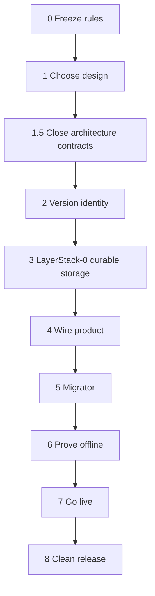
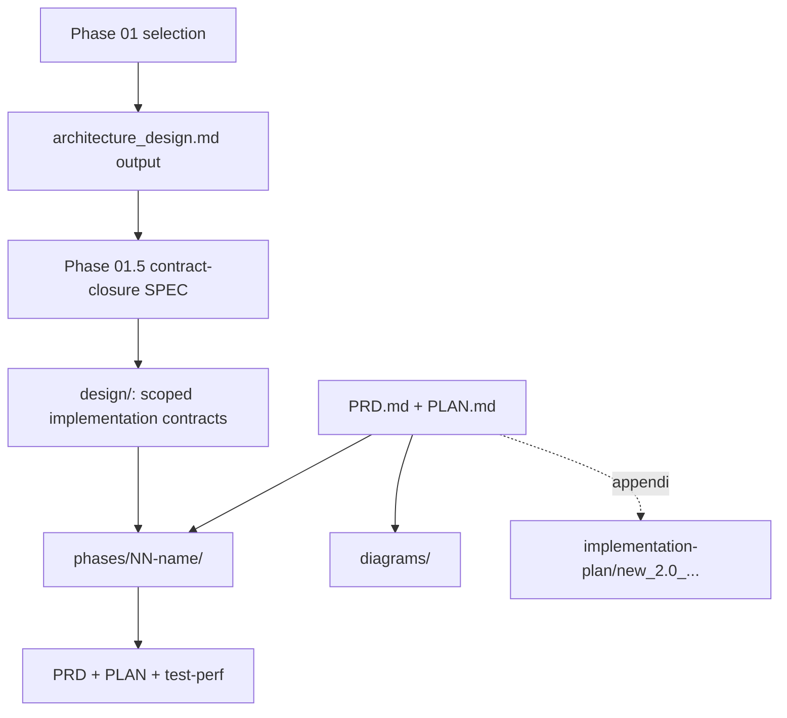
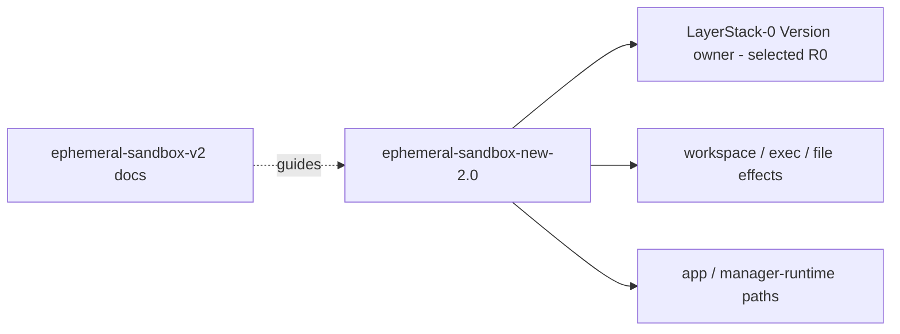

# Implementation plan (index)

**Status:** active program contract; Phases 00–01.5 complete, Phase 02 authorized and not started  
**How to use:** pick the next incomplete phase; open its folder; do PRD → PLAN → test-perf.

## Rules of the road

1. Do phases **in order** unless a phase PLAN explicitly allows parallel work.  
2. Each numbered implementation phase folder has **`PRD.md` + `PLAN.md` +
   `test-perf.md`**. The document-only Phase 01.5 interphase gate has one
   normative **`SPEC.md`**.  
3. **No production cutover** before phase **06 (prove offline)** passes on the **same** build you would ship.  
4. Follow the selected **LayerStack-0 Version owner and complete-Version storage family**. Reopen Phase 01 before changing its owner, truth model, or writer boundary.  
5. Do not invent performance wins; measure only as each `test-perf.md` says.  
6. Temporary migrator code must stay **deletable** (phase 05 / 08).  
7. Implement in the **clean worktree** when writing product code (see below).  
8. Use the authority chain `Candidate -> VersionId -> AcceptedVersion -> AcceptedBinding -> Head + HeadRevision or typed Root`; a raw `VersionId` never authorizes a reference.  
9. Treat archived CAS/CDC, chunk/Merkle DAG, PMSS, reflink-backed, and layer-chain plans as evidence only—not implementation instructions.  

## Diagram — phase order



## Diagram — docs folder map



## Diagram — selected code ownership



The selected owner, storage family, authority boundaries, and algorithmic call
flows are
fixed by [architecture_design.md](architecture_design.md). Exact internal
modules and bounded algorithm details remain with their owning phases. The
[detailed design package](design/README.md) records the fixed constraints,
delegated choices, evidence ownership, and architecture-reopening rules.

## Phase list

| # | Folder | Goal | Depends on | Status |
|---|--------|------|------------|--------|
| 0 | [phases/00-freeze-rules](phases/00-freeze-rules/) | Freeze product facts, fixtures plan, baselines, open questions | — | complete after pass 2 |
| 1 | [phases/01-choose-design](phases/01-choose-design/) | Choose architecture **and** storage approach together (or stop) | 0 | complete — R0 selected |
| 1.5 | [phases/01-5-contract-closure](phases/01-5-contract-closure/) | Close algorithm/API/diagram contracts from finding `019fcd32-b832-7750-9eb5-5f544e39c533` before implementation | 0–1 | complete — `PASS`; Phase 02 `GO` |
| 2 | [phases/02-state-identity](phases/02-state-identity/) | Portable canonical Version identity and validation | 0–1.5 | authorized; not started |
| 3 | [phases/03-state-store](phases/03-state-store/) | LayerStack-0 durable Versions, references, OCC, and recovery | 0–2 | not started |
| 4 | [phases/04-wire-product](phases/04-wire-product/) | App + Linux workspace path; still not live cutover | 0–3 | not started |
| 5 | [phases/05-migrator](phases/05-migrator/) | Legacy import + writer generation fence | 0–4 | not started |
| 6 | [phases/06-prove-offline](phases/06-prove-offline/) | Full offline proof on exact ship candidate | 0–5 | not started |
| 7 | [phases/07-go-live](phases/07-go-live/) | Cut over fleet, observe, keep legacy read-only | 0–6 | not started |
| 8 | [phases/08-clean-release](phases/08-clean-release/) | Remove temp migrator/compat; re-prove; ship clean build | 0–7 | not started |

Optional later (not a numbered phase here): separately approved **delete legacy data**.

## What each phase folder contains

```text
phases/NN-name/
  PRD.md         what this phase owes the product
  PLAN.md        how we do the work (checklist)
  test-perf.md   how we know it is done (tests + measures)
```

## Implementation worktree

```text
path:   /Users/yifanxu/Ephemeral-AI-Lab/ephemeral-sandbox-new-2.0
branch: codex/new-2.0-storage-core
base:   e4974d1f9aac702b35e052629cb070c897989352
```

Verify branch/HEAD before coding. Do not “just use” a dirty feature branch unless the phase PLAN says so.

## Selected code touch map

| Area | Selected placement | Notes |
|------|-------------|--------|
| LayerStack-0 Version owner | `crates/sandbox-runtime/layerstack` (R0) | Main durable-engine rewrite; package name remains unchanged by branding |
| Workspace / overlay / exec | existing runtime effect crates | Do not put portable identity here |
| App ordering / auth | manager / runtime application paths | Keep; don’t invent coordinator service |
| Migrator | temporary module or tool | Delete in phase 08 |
| New packages | **none by default** | Only if phase 01 proves need |

## Reading order for a new person

1. [PRD.md](PRD.md)  
2. This file  
3. [phases/00-freeze-rules/](phases/00-freeze-rules/) end-to-end  
4. Phase 01 [SPEC](phases/01-choose-design/SPEC.md) for the selection contract  
5. [architecture_design.md](architecture_design.md) for the selected result  
6. Phase 01.5 [SPEC](phases/01-5-contract-closure/SPEC.md) for the formal Phase 02 entry gate, then its [execution prompt](phases/01-5-contract-closure/PROMPT.md) to run the closure  
7. [design/README.md](design/README.md), then the files owned by the current phase  
8. If historical evidence is needed, read the [implementation-plan archive map](../implementation-plan/README.md) before opening any archived family.  

## Current program status

```text
architecture winner:      R0 joint ownership/storage direction
architecture contract:    architecture_design.md
detailed design package:  design/
algorithm contracts:      fixed; exact phase-local mechanics deferred to phases 02–03
performance readiness:    TARGET_UNSELECTED
live cutover:             not authorized
human docs:               phases 00–01.5 complete; phase 02 authorized/not started
closure finding trace:    019fcd32-b832-7750-9eb5-5f544e39c533
```
