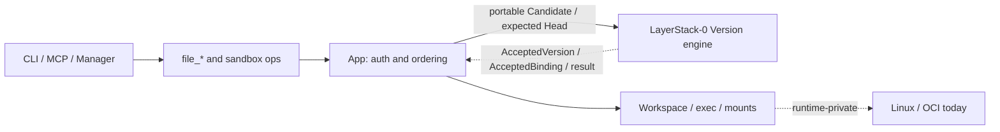
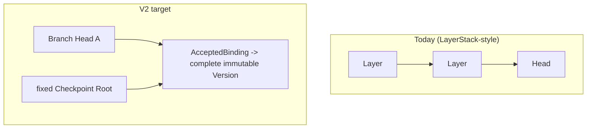
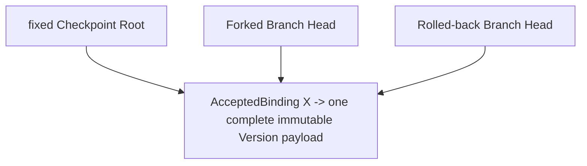

# LayerStack-0 — Ephemeral Sandbox V2 product brief

**Status:** active product contract; hard rules frozen, named owner decisions
remain open · **Audience:** humans implementing or reviewing LayerStack-0

## In one paragraph

Ephemeral Sandbox today keeps history in a LayerStack-style model (layers,
depth, squash, reconstruct-from-parents). That fights portable Checkpoints,
cheap branching, and multi-agent rollouts. **LayerStack-0** makes each accepted
sandbox filesystem a complete immutable **Version** with a typed `VersionId`.
Many Roots and Heads can name the same accepted Version without copying payload.
**EphCoW** composes those reference operations with isolated writable runtime
workspaces. Search/MCTS stays outside LayerStack-0. Migration is one-way and
never permits two writable truths.

## Problem

- Layer history is hard to reason about, migrate, and bound for resources.
- Fork / checkpoint should not mean “copy the world.”
- Callers need a simple file API and durable publish/recover behavior.
- Future runtimes (WASI, Firecracker) must not be hard-coded into identity.

## What we are building

| Outcome | Meaning |
|---------|---------|
| Immutable Version | One admitted complete filesystem value at an occupied `VersionId` |
| Shared payload | N Roots/Heads → one physical payload when they name the same accepted Version |
| Safe publish | Crash recovery never yields a mixed or dangling Version/reference pair |
| Product path | Existing `file_*` and workspace-session flows keep working on Linux |
| Migration | One-way path from LayerStack data with a temporary migrator |
| Neutrality | Portable Version facts have no Docker/OCI/OverlayFS brand in identity |

## What success looks like

- [ ] Publish and recover after process kill or restart  
- [ ] Reference fork / checkpoint / rollback-to-existing: **no** immutable payload copy  
- [ ] Stale concurrent publish fails cleanly (OCC-style head update)  
- [ ] Live Workspace writes do **not** mutate an accepted Version  
- [ ] `file_read` without session reads the selected Version; with session reads that live Workspace generation  
- [ ] After cutover, legacy is not writable; V2 is the only writer  
- [ ] Temp migration code can be removed and the product still works  
- [ ] Resources (memory, disk, FDs, workers) stay finite and cleaned up  

## What we are not doing (yet)

- Guaranteeing “100× Stage 4.6” without a new matched benchmark  
- Shipping WASI / Firecracker as the LayerStack-0 core  
- Selecting a final on-disk algorithm in this PRD  
- Building a plugin framework or new aggregate “Backend” API by default  
- Putting MCTS search inside storage  
- Deleting legacy **data** as part of default success (optional later)  
- Using FUSE or reflink as required mechanisms  

## Hard rules (must never break)

1. **Complete immutable Version** — no logical layer chain as the truth model.  
2. **Same Accepted Version (equal canonical bytes at one occupied `VersionId`) → one payload** on disk for that LayerStack-0 instance.  
3. **Accepted-reference lifecycle ops** (Head create/replace/remove, including
   fork and rollback-to-existing, and fixed typed Root create/remove, including
   checkpoint): payload bytes read = write = copy = 0; binding
   validation, coordination, metadata I/O, fences, and later runtime
   materialization remain separately accounted; no new private payload for that
   Version.  
4. **`VersionId` is not equality or existence proof** — if a candidate ID is already occupied, compare full canonical bytes; mismatch fails closed as collision, with no silent alias.  
5. **One Head transition at a time** under optimistic concurrency — no silent merge/rebase.  
6. **An Accepted Version is never edited in place** by `file_write` / `file_edit`.  
7. **MCTS / rollout policy is outside storage** — storage only offers fixed
   Checkpoint-Root create/remove, Branch-Head create/replace/remove, Candidate
   admission, and read/custody primitives.  
8. **Runtime-private stays private** — mounts, OverlayFS, namespaces are not part of portable identity.  
9. **No dual writable truth** during/after cutover.  
10. **Prefer rewrite in place (R0)** — no new packages/frameworks unless a real failure forces them.  

### Diagram — product context

### Diagram — before vs after

### Diagram — accepted-reference sharing

## How people use it (API sketch)

Public file naming stays `file_{verb}`.

| Operation | Behavior (product intent) |
|-----------|---------------------------|
| `file_read` | No `workspace_session_id` → selected Version view; with id → that live session generation via Workspace owner |
| `file_write` / `file_edit` | Require a live Workspace target; never mutate an accepted Version |
| Workspace session | Create / publish / destroy as today, backed by the V2 Version model after migration |
| Checkpoint / fork / rollback | Compose storage primitives; search policy stays in the caller |

Exact full operation matrix (manager/runtime/observability) is still being dispositioned; see open decisions.

## Open and delegated decisions

| ID | Question | Why it matters |
|----|----------|----------------|
| DEC-001 | Keep exact `file_blame` or accept a break? | Public API surface |
| DEC-011 | How long to observe after cutover before stripping compat? | Live risk |
| DEC-017 | No-session write/edit and related file targets in V2 | Semantics |
| DEC-018 | Auth / revoke ordering under races | Security |
| Phase 02 | Exact canonical codec, digest grammar, and finite identity limits within the selected Version model | Identity implementation |
| Phase 03 | Exact non-overlapping physical root/layout, record encodings, filesystem profile, and durability steps within LayerStack-0 | Storage implementation |

The four `DEC-*` rows remain product-owner decisions. Phase 02 and Phase 03 may
make their delegated implementation choices without changing the selected
owner, storage family, identity boundary, or hard rules.

## Performance stance (product level)

- **No performance guarantee is claimed today.**  
- Historical Stage 4.6 POC was **slower** than its control and is **not** a sealed V2 baseline (`INCOMPARABLE` for matched decisions until re-run with full provenance).  
- The optimization target remains `OPEN: OPTIMIZATION_TARGET_NOT_QUANTIFIED`;
  final performance verdict is `TARGET_UNSELECTED`.  
- We care about: small publication, reference-only COW paths, steady ops cost, bounded memory/disk.  
- Correctness always beats speed; a fast wrong design does not ship.  

Details and phase-level measures live in each phase’s `test-perf.md`.

## R0 disposition

This PRD supplied **R0 — rewrite in place** as the required first candidate and
default preference: repurpose the existing LayerStack ownership home as the
LayerStack-0 owner for complete immutable Versions; delete layer-history
semantics; keep application and Linux-effect owners; add **no** mandatory new
framework. Phase 01 subsequently selected that joint ownership/storage design;
the binding result is [architecture_design.md](architecture_design.md).

Architecture and storage were chosen **together**. Any evidence that requires a
different storage family or authority reopens Phase 01; it is not a Phase 02/03
local optimization.

## Code and docs locations

| Kind | Location |
|------|----------|
| This human package | `ephemeral-sandbox-docs/ephemeral-sandbox-v2/` |
| Implementation worktree | `ephemeral-sandbox-new-2.0` @ `e497…` |
| Historical design appendix (evidence only) | `implementation-plan/new_2.0_migration_implementation_plan/` |

## Related

- Delivery order: [PLAN.md](PLAN.md)  
- Diagram notes: [diagrams/README.md](diagrams/README.md)  
- Phases: [phases/](phases/)  
