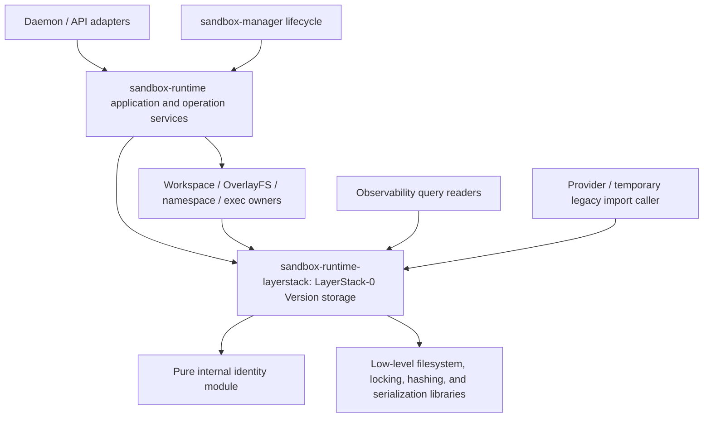

# Ephemeral Sandbox V2 — architecture design

Date: **2026-08-04**  
Status: **SELECTED — Phase 01 output and whole-program architecture contract**

> **WINNER: R0 — LayerStack-0 rewrite-in-place filesystem-native complete-Version storage**

## Authority and purpose

This document is the selected output of Phase 01 and the implementation-facing
architecture contract for Ephemeral Sandbox V2. Phase 01
[SPEC.md](phases/01-choose-design/SPEC.md) is the **input selection contract**:
it defines what must be selected, what makes a candidate admissible, the
evidence threshold, and what this output must contain. This document records
the winning joint ownership/storage design and binds Phases 02–08.

Authority descends from the product [PRD](PRD.md), completed Phase 00 evidence,
the Phase 01 selection specification, and then this selected architecture. If
this document violates a higher-authority rule or the Phase 01 output contract,
the architecture is invalid and Phase 01 must be reopened. For ordinary
implementation questions inside the selected boundaries, this document is the
architecture authority consumed by later phases.

This document must not be used to:

- select a different owner or storage family;
- silently resolve `DEC-001`, `DEC-011`, `DEC-017`, or `DEC-018`;
- treat an exact codec, hash grammar, finite constant, or fsync sequence as
  selected before its owning phase proves it;
- preserve legacy LayerStack behavior as V2 semantics; or
- claim that an unimplemented design has passed executable qualification.

If implementation evidence invalidates the selected ownership or storage
family, stop and reopen Phase 01 rather than editing this document into a
different design without repeating the selection gate.

## 1. Architecture at a glance

| Concern | Selected result |
|---|---|
| Selected-Version authority | **LayerStack-0**, implemented by the existing `sandbox-runtime-layerstack` package, rewritten |
| Application authority | Existing `sandbox-runtime` operation/application services |
| Runtime effects | Existing workspace/workspace-manager, OverlayFS, namespace, and exec owners |
| Lifecycle | Existing manager and daemon owners |
| Payload model | One immutable complete-Version filesystem closure per Accepted Version at an occupied `VersionId` |
| Reference model | Small typed Roots and Heads naming already accepted Versions through AcceptedBindings |
| Publish model | Bounded staging, exact occupied-ID comparison, durable payload, then one OCC Head transition |
| Writer model | One process/filesystem-exclusive selected-Version transition gate |
| Recovery model | Prior or full new truth; bounded cleanup; corrupt or ambiguous readiness fails closed |
| Migration model | Temporary one-way importer under a monotone generation fence; never dual writable truth |
| New architectural boundaries | **Zero** new crate/service/process/facade/coordinator/database boundaries |

The architecture preserves current responsibility boundaries while replacing
the current durable representation and semantics. “Rewrite in place” does not
mean preserving `LayerStack`, layers, squash, depth, merge, or parent-chain
truth. Those are legacy concepts to remove from the permanent V2 path.

**Phase 02 disposition: `GO`.** Phase 02 implements pure Version identity inside
the selected package. Phase 03 may implement LayerStack-0 durable Version
storage after the Phase 02 identity gate passes. Neither phase may select
architecture again.

The companion [ASCII architecture diagrams](diagrams/README.md) explain this
contract through focused before/after, storage, fork/COW, publication/OCC,
rollout, lifetime/recovery, and migration views. They are explanatory and must
be corrected if they ever conflict with this architecture contract.

## Decision provenance

### Evidence seal

| Field | Phase 01 evidence |
|---|---|
| Docs package | `/Users/yifanxu/Ephemeral-AI-Lab/ephemeral-sandbox-docs/ephemeral-sandbox-v2` |
| Product worktree | `/Users/yifanxu/Ephemeral-AI-Lab/ephemeral-sandbox-new-2.0` |
| Branch | `codex/new-2.0-storage-core` |
| HEAD | `e4974d1f9aac702b35e052629cb070c897989352` |
| Dirty at selection? | **No** |
| Matches recorded e497 base? | **Yes** — exact branch and HEAD, clean worktree |
| Base drift | **none** |

Focused e497 source checks established that the existing LayerStack package is
a dependency-neutral low-level library, is already consumed by the relevant
application/effect/lifecycle/diagnostic packages, owns a process/filesystem
exclusive writer-lock family, and contains atomic-write/fsync primitives.
Those facts are **SOURCE-VERIFIED** placement evidence. The V2 composition,
crash state machine, canonical identity, exact limits, and consumer rewrites
are **INFERRED architecture** until their owning phases provide executable
proof.

### Why R0 was selected

R0 was the mandatory first candidate, not a preselected winner. Its selected
product name is **LayerStack-0** and its COW behavior is **EphCoW**. R0 passed every
architecture-level hard-rule gate and no source dependency, privilege,
process, crash, recovery, or resource invariant required extracting a new
authority. It selects both ownership and storage together: the existing
package becomes the LayerStack-0 Version-storage owner and implements the
immutable filesystem payload/Root/Head/OCC/recovery family described below.

### Admitted candidate card

R0 was the only admitted serious candidate. A one-candidate set is valid here:
selection quality comes from testing the mandatory hypothesis against the hard
rules and source placement, not from inventing weaker competitors.

| Candidate field | R0 — rewrite in place |
|---|---|
| Selected Version truth owner | LayerStack-0 in the existing `crates/sandbox-runtime/layerstack` package, rewritten |
| Application ordering owner | Existing `sandbox-runtime` application/operation services retain authorization, request ordering, expected-Head capture, and LayerStack-0 call orchestration |
| Runtime-effect owners | Existing workspace/workspace-manager, OverlayFS, namespace, and exec packages retain live Linux effects |
| Lifecycle/diagnostic owners | Existing daemon/manager lifecycle; observability remains a diagnostic reader |
| Storage approach | Filesystem-native complete immutable payload closures; typed Roots/Heads; bounded staging; exact occupied-ID comparison; durable payload-before-reference publication; one locked OCC Head replacement; fail-closed recovery |
| Identity boundary | Complete portable filesystem facts only; no Docker, OCI, OverlayFS, mount, namespace, host-path, process, lease, or policy facts |
| Writer model | One process/filesystem-exclusive selected-Version transition gate in LayerStack-0 |
| Migration placement | Temporary LayerStack-0-local one-way importer using normal V2 admission under a monotone generation fence; removable as a unit |
| Source disposition | Keep package/dependency position; rewrite public model/storage core; delete layer/depth/squash/merge truth; add only internal identity/store/import modules |
| New dependencies/boundaries | No new crate, service, process, facade, coordinator, database, or framework |
| Resource/cleanup story | Finite admission and population limits; bounded staging/orphan/recovery debt; idempotent cleanup; fail readiness closed when safe bounded operation cannot be established |
| Failure model | Prior or complete new durable truth; collision/stale/corruption fail closed; no reference can name incomplete or unaccepted content |
| Phase handoff | Phase 02 owns pure Version identity in the same package; Phase 03 owns LayerStack-0 durable Version mechanics in the same package |
| Evidence | Placement and existing primitives: **SOURCE-VERIFIED** at e497; V2 algorithms/composition: **INFERRED** pending Phase 02/03 proof; architecture-changing gaps: none **OPEN** |

### Compact comparison

| Candidate | Hard rules | Source-placeable | Joint storage/failure model | Added boundary cost | Architecture-changing blocker | Result |
|---|---|---|---|---|---|---|
| R0 | Passes all 10 at architecture level | Yes; existing low-level owner and consumer direction are source-verified | Complete payload + accepted bindings + typed references + single OCC transition + bounded recovery | None | None found | **Selected** |

### Considered but not admitted

No second shape reached serious-candidate status merely to fill a comparison
table. The credible alternatives were considered and not admitted for concrete
reasons:

| Considered shape | Disposition and reason |
|---|---|
| Fuse store into application operation code | Does not fix an R0 failure; mixes durable truth with auth/API policy and forces current neutral consumers through an application dependency. |
| Fuse store into workspace/workspace-manager | Moves runtime-private mount/path/effect custody toward portable truth and couples durability to effect lifecycle. |
| New replacement storage crate/facade | Adds a package/API migration boundary for naming cleanliness even though the existing home has the required dependency position. |
| Version service/helper/coordinator | Adds protocol, auth, crash ambiguity, queue/retry, resource/deployment, and operating cost without a proved privilege or multi-host writer requirement. |
| SQLite/KV metadata authority | Adds another durability/recovery model and dependency without an evidenced transaction/index requirement. |
| Canonical archive requiring extraction | Adds full-Version materialization/scratch/custody cost to normal filesystem use without fixing correctness. |
| Chunk/object DAG | Adds graph reachability, indexing, multi-object recovery, and GC machinery without a hard-rule need. |

### Correctness-rejected families

Layer/delta truth, per-reference payload copies, digest-only deduplication,
silent stale merge/rebase, writable accepted payloads, LayerStack-0-owned rollout/auth
policy, and dual-write migration were rejected for direct hard-rule conflicts.

### Lower-authority appendix disposition

The older appendix's proposed topologies, component/package counts, algorithm
families, and decision ledger are candidate evidence only. They did not run a
binding Phase 01 selection and are not accepted by reference. In particular,
its 26-row proposed V2 catalog is not the measured current 27-name public/tool
inventory, and its ownership/gate ceremony is not recreated here. Any appendix
proposal that conflicts with this document remains rejected or open evidence;
any compatible low-level idea still has to pass its owning phase's tests.

Historical Stage 4.6 results are `INCOMPARABLE` and were not used to select or
reject R0. No V2 benchmark or product-source spike was needed for this
architecture decision.

## 2. Architecture drivers and hard-rule audit

The normative drivers are product
[hard rules 1–10](PRD.md#hard-rules-must-never-break).

`PASS` below means the selected architecture contains a coherent mechanism and
has no architecture-changing open gap. It does not claim that the unimplemented
mechanism has passed executable qualification.

| Rule | Selected mechanism | Evidence now | Later proof owner | Result |
|---:|---|---|---|---|
| 1. Complete immutable Version | One Accepted Version at an occupied `VersionId` has one complete immutable payload closure; no parent/depth/layer reconstruction in the V2 core | Product/Phase 00 requirement; R0 placement **SOURCE-VERIFIED**; V2 representation **INFERRED** | Phase 02 complete portable facts; Phase 03 read/recovery/source audit | `PASS` |
| 2. Same equal Accepted Version → one payload | Admission converges equal canonical bytes to one occupied payload closure; Roots/Heads contain references only | Exact-equality requirement is frozen; filesystem owner/lock primitives **SOURCE-VERIFIED**; admission state machine **INFERRED** | Phase 03 equal and concurrent admission/physical-count tests | `PASS` |
| 3. Reference-only operations do zero payload I/O | Only an AcceptedBinding and small Root/Head record enter the reference-transition path; the payload is never opened | Interface separation **INFERRED** and source-placeable; no executable V2 counter yet | Phase 03 byte counters plus syscall/fixture tests; Phase 06 integration qualification | `PASS` |
| 4. Digest is not proof | Every occupied candidate ID triggers full canonical-byte comparison; mismatch returns typed collision before reference mutation | Phase 00 collision policy; exact-compare placement **INFERRED** | Phase 02 forced-ID seam; Phase 03 all-ingress forced-collision tests | `PASS` |
| 5. One OCC Head transition | LayerStack-0 rereads the expected `(AcceptedBinding, HeadRevision)` under one exclusive transition gate and performs one atomic complete-record replacement; stale never merges/rebases | Current writer lock/atomic-file primitive family **SOURCE-VERIFIED**; V2 transition **INFERRED** | Phase 03 concurrency histories and crash/fault tests | `PASS` |
| 6. Accepted Version never edited in place | Only runtime-owned Candidates/Workspaces are writable; LayerStack-0 exposes accepted payloads through immutable read custody | Current effect ownership **SOURCE-VERIFIED**; V2 custody/API restriction **INFERRED** | Phase 03 attempted-mutation/concurrent-read tests; Phase 04 consumer wiring audit | `PASS` |
| 7. MCTS/rollout remains outside storage | LayerStack-0 exposes Version/reference primitives only; application services retain semantic orchestration and rollout/search policy | Current application composition ownership **SOURCE-VERIFIED** | Phase 03 dependency/API audit; Phase 04 operation wiring audit | `PASS` |
| 8. Runtime-private stays private | Pure identity module accepts only portable filesystem facts and forbids runtime/effect brands and host paths | Phase 00 owner/identity boundary **SOURCE-VERIFIED**; exact fact grammar **INFERRED** | Phase 02 forbidden-field/source audit and golden vectors | `PASS` |
| 9. No dual writable truth | Monotone generation fence makes legacy read-only before V2 becomes writable; importer is one-way and temporary | Lifecycle placement **SOURCE-VERIFIED**; cutover/import protocol **INFERRED** | Phases 05–07 writer inventory/fence/retry tests; Phase 08 deletion build | `PASS` |
| 10. Prefer R0 | Reuse and rewrite the existing LayerStack durable-ownership home; retain direct consumers; add no architectural boundary by default | Package/dependency position and existing primitives **SOURCE-VERIFIED** | Phase 02/03 dependency and source-layout audits; review gate on any addition | `PASS` |

### Quality attributes

| Attribute | Architecture requirement |
|---|---|
| Correctness/consistency | Exact identity occupancy, immutable payloads, a single OCC linearization point, and prior-or-complete-new recovery take priority over throughput. |
| Portability | Identity contains portable filesystem facts only; runtime adapters may change without changing accepted Version meaning. |
| Durability | Acknowledgement follows payload and reference durability on an explicitly qualified local filesystem profile; unsupported profiles fail readiness. |
| Bounded resources | Every input and persistent/transient population has finite admission/accounting and deterministic cleanup. |
| Security/trust | Candidate facts are untrusted; paths, links, types, metadata, sizes, and counts fail closed before admission. |
| Operability | Startup recovery is bounded and diagnostic; counters expose payload I/O, debt, limits, stale conflicts, and collisions. |
| Testability | Identity is pure; the store has forced-collision, fault, crash-prefix, I/O-accounting, and concurrency seams. |
| Deletion/evolution | Migration code has one-way dependencies and a complete deletion boundary; format changes are versioned and cannot create a second truth. |

### Assumptions and non-goals

- The selected deployment is a local LayerStack-0 engine with one
  process/filesystem-exclusive selected-Version writer gate. Multi-host
  active/active writers are not assumed.
- The qualified filesystem can provide the atomic replacement and durability
  primitives Phase 03 selects and proves; otherwise readiness fails.
- FUSE, reflink, an archive, a database, a service, and a chunk/object DAG are
  neither required nor forbidden as future research; none is part of this
  selected architecture.
- This design does not set Phase 02's exact codec/hash grammar, Phase 03's exact
  fence sequence/constants, public owner-DEC outcomes, a V2 performance
  guarantee, or a live cutover/deletion authorization.

## 3. Component and dependency architecture



Allowed dependency direction is application/effect/lifecycle/diagnostic
consumers → LayerStack-0 Version engine → pure identity and low-level libraries.

Forbidden dependency directions include:

- store → application auth/API/rollout policy;
- identity → store, workspace, manager, provider, observability, mounts, or
  host-runtime adapters;
- store → workspace/OverlayFS/namespace/exec implementations;
- observability → selected-Version write authority;
- permanent V2 identity/store code → temporary legacy-import types; and
- one application package → another application package merely to reach the
  store.

### Responsibility map

| Responsibility | Owner | Must not own |
|---|---|---|
| Canonical portable facts, canonical bytes, typed `VersionId`, validation | Pure internal module in `sandbox-runtime-layerstack` | Filesystem policy, durable publication, auth, mounts, runtime paths, migration |
| Payload admission, occupied-ID exact comparison, roots/heads, OCC, reads, recovery, retirement | `sandbox-runtime-layerstack` | User authorization, operation catalog, workspace writes, command execution, rollout/MCTS |
| Auth, revoke/request ordering, candidate orchestration, expected-head capture, API errors/retries | `sandbox-runtime` application/operation services | Durable truth, collision acceptance, bypass of store OCC |
| Candidate upperdir, writable Workspace, mount/materialization, namespace, execution | Existing runtime-effect packages | Portable identity, durable selected Head, accepted-payload mutation |
| Sandbox/process lifecycle, readiness, cutover fencing | Existing manager/daemon owners | Second selected-Version representation or writer |
| Diagnostics and audit | Existing observability reader and application auditability owner | Selected-Version publication or identity authority |
| Legacy decoding/import invocation | Temporary LayerStack-0-local importer plus existing migration callers | Permanent V2 dependency or dual-write path |

### Process, privilege, trust, and write-authority boundaries

- LayerStack-0 remains an in-process low-level library. No helper daemon, RPC
  protocol, elevated service, or independent crash domain is selected.
- Only LayerStack-0 may create/accept payload closures or replace durable
  Roots/Heads under its transition gate. Application and effect owners cannot
  write those paths directly.
- Existing workspace, mount, namespace, and exec owners retain any runtime
  privileges they require. LayerStack-0 does not acquire mount/namespace authority
  merely because it persists portable filesystem facts.
- Candidate facts, legacy input, selector names, and persistent bytes read at
  startup are untrusted until validated. AcceptedBindings are capabilities
  created or revalidated by LayerStack-0; raw digests are not AcceptedBindings.
- Observability receives read-only diagnostic projections/counters. It cannot
  publish a Version or become a second source of selected truth.
- The exact count of new architectural boundaries is **zero**. New internal
  modules divide implementation work but do not introduce independent authority,
  protocol, deployment, resource pool, or lifecycle.

## 4. Source placement and disposition

The following paths are the selected implementation homes. Internal file names
marked as hypotheses may be adjusted without moving authority.

| Disposition | Source area | Architecture requirement |
|---|---|---|
| `KEEP` | `crates/sandbox-runtime/layerstack/Cargo.toml` | Keep the existing dependency-neutral package as the LayerStack-0 owner. Do not add a replacement storage crate. |
| `REWRITE` | `crates/sandbox-runtime/layerstack/src/lib.rs` | Export narrow V2 identity/store types and operations. Eventually stop exporting permanent V2 layer/squash/depth semantics. |
| `REWRITE` | `crates/sandbox-runtime/layerstack/src/model/**` | Replace legacy layer DTOs with portable facts, `VersionId`, accepted binding, head revision, and root/head records. |
| `ADD` | `crates/sandbox-runtime/layerstack/src/identity.rs` or `src/identity/**` | Phase 02 pure identity module. Internal module only; no new authority. |
| `ADD` | `crates/sandbox-runtime/layerstack/src/store/**` | Phase 03 payload/root/head/publication/recovery/retirement implementation. Internal split is flexible. |
| `REWRITE` | `crates/sandbox-runtime/layerstack/src/storage/{fs.rs,lock.rs}` | Reuse the existing lock and atomic-write/fsync primitive family under V2 semantics. |
| `DELETE` | Permanent V2 use of `src/stack/**`, layer manifests/refs/changes, parent chains, merge, squash, depth, layer leases, and delta/whiteout truth | No fallback may reconstruct the selected V2 Version through these concepts. |
| `DELETE`/`REWRITE` | `src/workspace_base/**` | Replace layer-specific base binding with complete-Version admission or a temporary import path. |
| `KEEP`/`REWRITE` | `crates/sandbox-runtime/operation` | Keep application ownership; remove autosquash, silent merge/rebase, and layer-depth policy from V2 wiring. |
| `KEEP`/`MOVE` | Workspace/workspace-manager packages | Keep effects; move selected-Version lifecycle decisions and durable layer leases into the LayerStack-0/application boundary. |
| `KEEP`/`REWRITE` | Manager, provider-Docker, and observability consumers | Consume `AcceptedBinding` values or temporary import APIs, never legacy V2 truth. |
| `ADD`, temporary | Store-local `legacy_import` module/feature/target | One-way decoder removable with all migration-only callers and types. |

Phase 02 must add identity incrementally without prematurely deleting legacy
APIs still needed to compile current consumers. Phase 03 and later wiring phases
own the controlled replacement/deletion sequence. Temporary coexistence in
source is not permission for two writable truths at runtime.

## 5. Version and identity model

The following are conceptual types; Phase 02 selects exact Rust and wire forms.

| Concept | Meaning |
|---|---|
| Portable Version facts | One complete, validated filesystem value expressed without runtime-private data; this is the mathematical input to identity |
| Canonical bytes | Versioned, domain-separated, unambiguous deterministic encoding of all accepted portable facts |
| `VersionId` | Typed digest derived from the entire canonical byte stream; it may be computed before admission and is not existence or equality proof |
| Accepted Version | A complete immutable payload whose occupied `VersionId` has passed full canonical-byte admission |
| Accepted binding | LayerStack-0-issued or revalidated capability naming one Accepted Version for reference operations |
| `HeadRevision` | Monotone OCC revision associated with one selected head record |
| Head record | Small durable selector record containing an `AcceptedBinding` and revision |
| Root record | Small durable typed reachability record containing an `AcceptedBinding` |
| Read custody | Bounded runtime-local protection for a captured immutable Version while it is read/materialized; never portable identity |

Portable facts may include normalized relative paths, explicitly permitted
portable entry types and metadata/mode, symlink target, regular-file content,
and canonical domain/schema version. Phase 02 must explicitly accept or reject
every relevant entry and metadata class.

Portable identity must not contain Docker image/container identifiers, OCI
runtime descriptors, OverlayFS lower/upper/work paths, whiteout-as-delta
operations, mount IDs/options, namespaces, host absolute paths, workspace or
session IDs, process state, leases, file descriptors, local payload paths,
auth/audit/rollout data, legacy parents/depth, or nondeterministic facts.

## 6. Conceptual storage model

Names below describe logical roles, not a prematurely frozen disk spelling.
`versions/` communicates the accepted Version model; it does not select CDC,
chunks, an object DAG, or a `VersionView` indirection.

```text
<LayerStack0Root>/
  versions/<VersionId>/payload/  # one complete immutable payload closure
  heads/<selector>               # AcceptedBinding + HeadRevision
  roots/<kind>/<root-id>         # typed durable reachability to AcceptedBinding
  staging/<transaction-id>/      # bounded, private, unaccepted candidate
  control/...                    # format/generation/recovery metadata
```

Phase 03 must select the exact physical root and spelling. During migration,
that V2 namespace must not overlap the e497 legacy names `manifest.json`,
`workspace.json`, `layers/`, `staging/`, `.layer-metadata/`, or `base/`. The
current `/eos/layer-stack` mount is placement evidence, not an automatic
branding-driven rename or permission to reuse a legacy path for a new meaning.

### Payload invariants

- There is one physical payload closure for one accepted canonical byte stream
  and `VersionId`.
- A payload is complete: no parent, layer depth, squash, or delta reconstruction
  is required to read it.
- Its canonical descriptor and content permit full canonical-byte equality
  verification.
- It becomes reachable only after its complete content and required admission
  metadata are durable.
- Store APIs and filesystem custody never expose it as a writable live
  workspace.
- Roots and heads do not contain or copy payload data.

### Metadata invariants

- Every root/head names a previously accepted binding, not an unchecked raw
  digest.
- Every durable record is complete, versioned, and integrity-checkable.
- One locked atomic head-record replacement is the OCC linearization point.
- A stale expected `(AcceptedBinding, HeadRevision)` changes no Head and triggers no
  merge/rebase.
- Recovery never invents a reference to unaccepted or incomplete content.

## 7. Conceptual call flows

### 7.0 Conceptual interface contracts

Exact Rust signatures belong to Phases 02–03. The semantic separation below is
fixed because collapsing these operations could bypass collision comparison,
payload-I/O rules, or OCC.

| Operation | Inputs and caller authority | Output | Idempotency/retry | Typed failure classes | Durable/payload side effects |
|---|---|---|---|---|---|
| Admit candidate | Bounded complete portable candidate from an application/effect/import caller; caller does not assert acceptance | Accepted Version/binding and whether an existing payload was reused | Content-idempotent: equal canonical candidate converges on the same accepted payload | Invalid/unsupported facts, limit, collision, resource/ENOSPC, I/O/durability | May create staging and one new immutable payload; never changes a root/head |
| Publish candidate | Authorized/ordered application request, selector, expected accepted binding/revision, and Candidate | Accepted binding plus new Head/revision | Conditional retry: reuse admission is safe, but an old expected revision returns stale | Admission failures, stale, collision, limit/resource, I/O/durability | Payload may be admitted first; exactly one small Head replacement is the OCC transition |
| Reference lifecycle | One of the five operations in §7.2: an admitted binding plus `Expected::Absent` for Head/fixed-Root creation, an exact complete Head plus admitted replacement binding for Head replacement, or an exact complete Head/fixed Root for removal | Typed lifecycle outcome and resulting reference/revision when applicable | Create is absent-state idempotent; exact replacement/removal replays resolve from the complete authoritative record; no fixed Root can be retargeted | `ALREADY_EXISTS`, `NOT_FOUND`, `CONFLICT`, invalid/unknown binding, corrupt record, ambiguous outcome, limit, I/O/durability, or internal failure | One authority creates/removes Heads and fixed Roots and may replace only a Head; small metadata only, with payload read/write/copy counters zero |
| Resolve/capture read | Typed Head/Root selector and bounded custody request | Captured accepted binding/revision plus read-only access token/handle | Read-only; retry resolves a fresh point in time unless caller retains custody | Missing/corrupt/dangling reference, unsupported version, custody/resource limit, I/O | No selected-Version write; bounded runtime-local custody only |
| Recover/readiness | Configured LayerStack-0 root and supported-filesystem profile | Ready store generation or fail-closed diagnostic | Idempotent over the same durable bytes; cleanup/quarantine actions are repeat-safe | Corrupt/unknown record, dangling Root/Head, incomplete payload, ambiguous collision, excessive debt, unsupported filesystem | May remove/quarantine recognizable bounded staging/orphan debt; never invents truth |
| Retire | Accepted Version target or bounded sweep unit under transition authority | Retained, retired, or retry/deferred result | Repeat-safe; final Root/custody revalidation decides unlink | Active Root/custody, limit/debt, corrupt reachability, I/O | May unlink only an unrooted payload after serialized exact revalidation |
| Import legacy view | Temporary importer input plus fenced migration generation | Normal AcceptedVersion, AcceptedBinding, Root, or Head via V2 APIs | Retry-safe through exact admission and explicit migration progress | Legacy decode, validation, collision, stale generation, resource, I/O/durability | Uses normal staging/admission/reference paths; never writes alternate V2 truth |

### 7.1 Candidate-bearing publication

1. The application authorizes/orders the request and captures the expected Head
   binding and revision.
2. A runtime owner supplies bounded complete candidate facts. Accepted payloads
   are not modified to form the candidate.
3. The store validates/canonicalizes the candidate and builds private staging
   while enforcing finite resource limits.
4. The identity module streams canonical bytes and returns a typed `VersionId`.
5. If the ID is occupied, the store compares the full canonical bytes:
   - equal → reuse the existing accepted payload;
   - unequal → typed collision, no reference change, staging cleanup.
6. A new payload, if any, is atomically admitted and made durable/immutable
   before a reference can name it.
7. Under the exclusive store transition gate, the store rereads the head and
   revision. A mismatch returns stale without merge or rebase.
8. A complete replacement head record is synchronized, atomically installed,
   and its directory synchronized. This replacement is the sole OCC
   linearization point.
9. Success is acknowledged only after the selected durability obligations.
   Errors clean private temporary state or leave only bounded recoverable debt.

### 7.2 Reference-only transition

The one reference authority implements these conceptual operations:

```text
CreateHeadIfAbsent(head_identity, Expected::Absent, new_binding)
ReplaceHead(Expected::Exact(expected_head), new_binding)
RemoveHead(Expected::Exact(expected_head))
CreateFixedRootIfAbsent(root_identity, root_kind, Expected::Absent, binding)
RemoveFixedRoot(Expected::Exact(expected_root))
```

A Branch is represented by a Head, a Checkpoint by a fixed typed Root, and no
generic Root retarget/update operation exists. These operations:

1. accept only a store-admitted binding plus expected root/head revision;
2. validate bounded binding metadata without opening the payload;
3. serialize the complete exact expected-state check with the reference change;
4. atomically create, replace, or remove only the small record according to
   the operation; only `ReplaceHead` retargets; and
5. report payload bytes read = written = copied = **0**.

Candidate bytes or a raw/unknown digest cannot enter this path. Candidate input
must use admission, including full occupied-ID comparison.

### 7.3 Read

1. Resolve one Head/Root to a captured accepted binding and, for a Head,
   `HeadRevision`.
2. Acquire bounded read custody for that immutable closure.
3. Read/materialize only that closure even if a concurrent publish advances the
   selector.
4. Release custody; retirement revalidates roots and active custody before
   unlinking.

Local read-only handles, mounts, and paths are runtime implementation details
and cannot enter portable Version facts or durable portable reference records.

### 7.4 Recovery and retirement

Recovery validates versions/checksums, payload completeness, roots, heads, and
recognizable staging/orphan states before readiness. Each crash prefix resolves
to prior or complete new truth; corruption, dangling references, or collision
ambiguity fails readiness closed.

Heads, typed roots, and active read custody are the reachability sources.
Retirement runs under the selected-Version transition gate, performs bounded
exact revalidation, and closes the last-root/read race before unlink. Persistent
refcount truth and an unbounded background GC authority are not selected.

## 8. Failure and concurrency model

| Event | Required behavior |
|---|---|
| Concurrent equal candidate | Both perform exact comparison as needed and converge on one accepted payload; at most one expected-head transition wins. |
| Concurrent unequal candidate with same digest | Typed collision; neither mismatch may alter a reference or alias the accepted payload. |
| Expected head becomes stale | Clean stale result; no merge, rebase, or head mutation. A newly admitted orphan is bounded retirement/recovery work. |
| Crash during staging | No visible accepted reference; staging is recognized and cleaned/quarantined. |
| Crash after payload durability but before head | Old head remains; complete unreferenced payload is safe cleanup debt. |
| Crash during head replacement | Recovery sees prior or complete new checksummed/versioned record, never a partial accepted head. |
| Dangling/corrupt head or root | Readiness/read fails closed with typed diagnostic; no best-effort reconstruction from layers. |
| Reader overlaps head move/retirement | Reader remains on the captured immutable Version; final retirement revalidation observes active custody or the Root. |
| Resource exhaustion/ENOSPC | Admission fails before reference publication; partial private state is cleaned or bounded/recoverable. |
| Unsupported filesystem durability topology | Store fails readiness/configuration rather than weakening acknowledgement semantics. |

The exact crash-prefix ordering and supported filesystem profile are Phase 03
decisions and executable proof obligations. They may optimize fences only while
preserving this failure model.

## 9. Resource and cleanup architecture

Every potentially attacker- or workload-controlled population must have an
explicit finite limit and accounting owner:

- candidate total bytes, entry count, path/link length, and path depth;
- canonicalization metadata memory and streaming buffer sizes;
- simultaneous candidates, canonical streams, and open descriptors;
- staging transactions and scratch/disk reservation;
- roots/heads per store and active read custody;
- recovery work/debt per startup or bounded batch; and
- worker count, cancellation, and deadline behavior.

Admission precharges disk/scratch and relevant memory/FD capacity before
expensive work. Cleanup is deterministic and idempotent. A crash may create
bounded recognizable debt, but it cannot create a dangling committed reference
or require an unbounded cache, worker pool, scanner, or coordinator.

Phase 02 selects identity validation constants and proves their boundaries.
Phase 03 selects store populations/durability constants and proves
limit-minus-one, limit, and limit-plus-one behavior. If required populations
cannot be bounded with the selected exact-scan/custody model, reopen Phase 01.

### Security and untrusted-input policy

- Canonical paths are normalized relative paths. Absolute paths, parent
  traversal, ambiguous separators/encodings, duplicate canonical names, and
  platform-dependent aliases are rejected.
- Symlink targets are represented as portable facts but are never followed
  while canonicalizing or admitting a candidate. Hard links, devices, sockets,
  FIFOs, sparse/extents, xattrs, ACLs, ownership, timestamps, and other metadata
  classes must be explicitly accepted and canonicalized or explicitly rejected
  by Phase 02—never inherited accidentally from a host walk.
- Phase 03 must use descriptor/path-resolution primitives that prevent candidate
  replacement, symlink escape, and time-of-check/time-of-use substitution during
  admission. The exact safe primitive is a Phase 03 choice and proof obligation.
- Store control names and selector/root identifiers are validated and cannot be
  interpreted as paths outside the configured store root.
- Corruption, unknown format versions, digest mismatch, and excessive recovery
  debt fail readiness or the operation closed; the store does not reconstruct
  from legacy layers or silently discard an accepted reference.

### Operations and observability

The store exposes bounded diagnostics, not authority. At minimum, Phase 03's
test/operations seam must account for payload bytes read/written/copied per
operation; accepted/reused payload counts; staging/orphan/recovery debt; roots,
heads, and read custody; open descriptors/workers/scratch reservations; stale
OCC outcomes; collisions; cleanup outcomes; and readiness failures. Cardinality
must remain bounded—raw Version IDs, paths, or tenant-controlled values are not
unbounded metric labels.

Performance measurements in Phases 02–06 are sanity and regression evidence.
They cannot waive a hard rule or become a V2 performance guarantee without a
separately defined matched benchmark and product decision.

## 10. Migration architecture

Migration is subordinate to the permanent V2 admission path:

1. Existing lifecycle owners establish a monotone store-generation fence.
2. Legacy mutating ingress drains/closes and legacy storage becomes read-only.
3. A temporary store-local importer decodes one legacy selected view into
   complete portable candidate facts.
4. The importer calls the normal V2 validation, identity, admission, and
   root/head APIs; it does not write an alternate V2 representation.
5. V2 writes begin only after the V2 generation is the sole writable truth.
6. Retry is idempotent through exact admission and explicit migration state.
7. After the owner-selected `DEC-011` window, the importer module/feature/target,
   decoder types, config, tests, and call sites are deleted as one bounded unit.

Permanent identity/store code cannot depend on legacy types. There is no
dual-write rollback after V2 becomes writable. Actual legacy-data deletion is a
separately authorized later operation.

### Format and version evolution

- Canonical identity has an explicit domain/schema version; store records and
  control metadata are independently versioned and integrity-checked.
- Unknown or incompatible versions fail closed. A reader must not guess a
  layout or reinterpret bytes under an existing occupied `VersionId`.
- A canonicalization change that changes Version meaning or bytes receives a new
  identity domain/version and a one-way conversion plan through normal
  admission. It does not mutate an accepted payload in place.
- Compatible store-record upgrades may be implemented as bounded, restart-safe
  metadata evolution inside the same owner. If compatibility requires a second
  writable truth, a new writer/authority, or indefinite legacy dependencies,
  Phase 01 must be reopened.

## 11. Open product decisions and stable seams

| Open decision | Stable architecture seam |
|---|---|
| `DEC-001` — exact `file_blame` | Existing application-owned auditability side channel may key records by accepted Version/revision/publication; provenance is not canonical selected truth. |
| `DEC-011` — observation window | Changes deletion timing for temporary migration compatibility, never authorizes two writable truths. |
| `DEC-017` — operations, `file_list`, sessionless write/edit | Application may reject sessionless mutations or build a bounded candidate and use the same publish/OCC path. It cannot edit accepted payloads. |
| `DEC-018` — auth/revoke ordering | Application owns the accepted-request/revocation cutoff and disclosure policy; store OCC remains independent and mandatory. |

These seams support the currently stated alternatives without changing the
selected store owner or storage family. A newly expanded requirement for
canonical provenance, direct Accepted-Version mutation, dual writable truth, or
joint auth/store durable authority reopens Phase 01.

The appendix decision ledger remains proposal/open evidence. This architecture
does not silently accept its unrun design DECs; compatible implementation
details must be selected by the phase that owns their proof, and incompatible
ones do not override the product PRD or this selected boundary.

## 12. Phase 02 implementation boundary

Phase 02 implements only pure portable Version identity in
`crates/sandbox-runtime/layerstack/src/identity.rs` or an equivalent internal
module. It owns:

- the exact portable fact set and explicit rejection set;
- canonical version/domain, grammar/codec, and deterministic ordering;
- typed digest algorithm and `VersionId` representation;
- encode/validate/decode or comparison primitives needed for exact bytes;
- streaming/bounded resource behavior and explicit limits;
- stable golden vectors, corrupt/over-limit cases, order independence, and a
  forced-collision test seam; and
- proof that identity types contain no runtime-private brands or fields.

Phase 02 does not implement payload layout, fsync/rename publication, roots,
heads, OCC, recovery, retirement, mounts, application wiring, migration, or
cutover. It must not add a crate/service/facade or delete legacy APIs merely to
finish consumer migration early.

Phase 02 stops and reopens Phase 01 if portable complete-Version identity requires
runtime-private facts or layer reconstruction, cannot support bounded exact
comparison, or requires a different owner/storage family.

## 13. Phase 03 implementation boundary

After Phase 02 passes, Phase 03 implements LayerStack-0 durable Version storage
in the same package. It
owns:

- Candidate admission and one physical payload closure per accepted Version;
- roots/heads and accepted-binding validation;
- single-point OCC publication and clean stale behavior;
- payload-before-reference durability and fail-closed recovery;
- reference-only APIs with observable zero payload I/O;
- captured reads, last-root/read-custody retirement, and cleanup;
- finite resource limits and fault/crash-prefix qualification; and
- the exact physical V2 root/layout contract, including a namespace that cannot
  collide with legacy paths during migration and that Phase 05 must consume
  only through LayerStack-0 APIs; and
- deletion or hard failure of legacy layer/depth/squash/merge truth in the V2
  store path.

Phase 03 may select exact on-disk spellings, record encodings, checksum/version
format, temporary naming, supported local filesystem profile, safe fence
sequence, finite store limits, read-custody representation, and instrumentation.
It may not select another owner, database/service, object DAG/archive truth,
persistent refcount authority, layer reconstruction, or a second OCC writer.

## 14. Implementation sequence

| Order | Owning phase | Outcome |
|---:|---|---|
| 1 | Phase 02 | Add pure identity types/functions and I1–I7 tests without store I/O or consumer rewiring. |
| 2 | Phase 03 | Build offline immutable payload/root/head store and F1–F12/C1–C4 proof surface on top of Phase 02 identity. |
| 3 | Phase 04 | Rewire application/effect/lifecycle/observability consumers and remove V2 autosquash/merge/depth behavior. |
| 4 | Phase 05 | Add the temporary one-way importer and prove its complete deletion boundary. |
| 5 | Phase 06 | Run offline integration, crash, collision, OCC, resource, and zero-payload-I/O qualification. |
| 6 | Phase 07 | Perform separately authorized fenced cutover and observation. |
| 7 | Phase 08 | Delete temporary migration and remaining legacy code/data only under explicit authorization and requalify. |

No later phase may claim success by changing a hard rule or silently selecting a
different architecture. A failed proof either fixes the implementation inside
this design or reopens Phase 01.

## 15. Architecture verification and reopening

| Architecture claim | Required proof |
|---|---|
| Pure, portable identity | Phase 02 I1–I7 and forbidden-field/source audit |
| Complete immutable payload | Phase 03 read/restart/source tests; no parent/depth reconstruction |
| One payload per Accepted Version | Equal/concurrent admission physical-count tests |
| Exact collision rejection | Forced-collision canonical-byte comparison at every occupied-ID ingress |
| Zero-payload-I/O accepted-reference operations | Operation byte counters plus syscall/fixture evidence for exact Head create/replace/remove and fixed-Root create/remove |
| One OCC linearization | Concurrency history and fault-injection tests; stale produces no merge/rebase |
| Durable prior-or-new recovery | Supported-filesystem crash-prefix matrix and corrupt/dangling fail-closed tests |
| Immutable reads | Concurrent head-move/read and attempted live-write tests |
| Bounded cleanup/retirement | Last-root/custody race tests and finite limit boundary tests |
| One writable truth/deletable migration | Later writer inventory, generation-fence tests, and no-reference importer deletion build |
| No new boundary | Dependency/source-layout checks in Phase 02/03 and review of any proposed addition against an exact R0 failure |

### Risks and assumption watchlist

| Trigger | Consequence |
|---|---|
| Product worktree no longer matches e497 in a way that changes package dependencies, write ownership, lock semantics, or filesystem primitives | Recheck placement; reopen Phase 01 if the owner/dependency/storage shape changes |
| Phase 02 cannot define complete bounded portable facts without runtime-private or layer-history information | Selected identity/storage pair is invalid; reopen Phase 01 |
| Phase 03 cannot prove payload-before-reference durability, one OCC point, exact occupied-ID comparison, or zero-payload-I/O for exact Head create/replace/remove and fixed-Root create/remove on a supported filesystem | Do not weaken the rule; fix within R0 or reopen if another storage family/boundary is required |
| Exact reachability/read custody cannot be bounded or close the last-root race | Reopen the retirement/resource design and Phase 01 if ownership or storage family changes |
| Migration requires dual writes, permanent legacy decoding, or a rollback that makes legacy writable after V2 | Stop cutover and reopen the architecture decision |
| A product-owner DEC expands portable identity, store authority, or writer ordering beyond the stable seams in §11 | Reopen Phase 01; do not treat it as a local API choice |
| A new service/crate/database/coordinator becomes necessary for a proved privilege, multi-host, recovery, or resource invariant | Present the exact R0 failure and costs; rerun joint selection before adding it |

Reopen Phase 01 when evidence changes the owner, dependency direction, storage
family, identity boundary, writer/OCC count, crash behavior, migration
one-writer model, or need for a new architectural boundary. Do not reopen for
ordinary internal module naming, codec/hash selection within the portable
contract, safe filesystem step refinement, finite constant selection, or test
instrumentation.

## Glossary

| Term | Normative meaning in V2 |
|---|---|
| Candidate | Unaccepted, bounded complete portable facts being validated/admitted; it is not selected truth. |
| Canonical bytes | Versioned, domain-separated deterministic byte encoding of the complete accepted portable fact set. |
| `VersionId` | Typed digest derived from canonical bytes; it may be computed before admission and is neither proof of equality nor proof that a durable Version exists. |
| Accepted Version | One complete immutable payload admitted at an occupied `VersionId` only after full canonical-byte equality/collision handling. |
| AcceptedBinding | LayerStack-0-created or LayerStack-0-revalidated capability naming an Accepted Version for Roots, Heads, and reference-only operations. |
| Payload closure | One physical, complete, immutable filesystem representation for accepted canonical Version bytes in one LayerStack-0 instance. |
| Head | Mutable selected reference with a monotone OCC revision, naming an accepted binding. |
| Root | Fixed typed durable reachability reference—such as a Checkpoint—naming an accepted binding without payload data; Branch/fork/rollback selection uses a Head. |
| Reference-only transition | Root/head operation over an accepted binding that performs zero payload bytes read, written, or copied. |
| Read custody | Bounded runtime-local protection of one captured immutable payload during a read/materialization; not portable identity or permanent truth. |
| Transition gate | LayerStack-0's single process/filesystem-exclusive serialization point for selected-Version reference changes and final retirement checks. |
| Selected truth | The accepted payload set plus valid durable Roots/Heads under the active LayerStack-0 generation; never a layer chain or observability projection. |
| Architecture reopening | Repeating Phase 01 selection because evidence would change ownership, storage family, dependency direction, identity boundary, writer count, or hard-rule feasibility. |

## References

- [Detailed R0 design package](design/README.md)
- [Phase 01 selection specification](phases/01-choose-design/SPEC.md)
- [Phase 01 PRD](phases/01-choose-design/PRD.md),
  [plan](phases/01-choose-design/PLAN.md), and
  [exit checks](phases/01-choose-design/test-perf.md)
- [Phase 00 specification](phases/00-freeze-rules/SPEC.md)
- [Phase 02 PRD](phases/02-state-identity/PRD.md),
  [plan](phases/02-state-identity/PLAN.md), and
  [tests](phases/02-state-identity/test-perf.md)
- [Phase 03 PRD](phases/03-state-store/PRD.md),
  [plan](phases/03-state-store/PLAN.md), and
  [tests](phases/03-state-store/test-perf.md)
