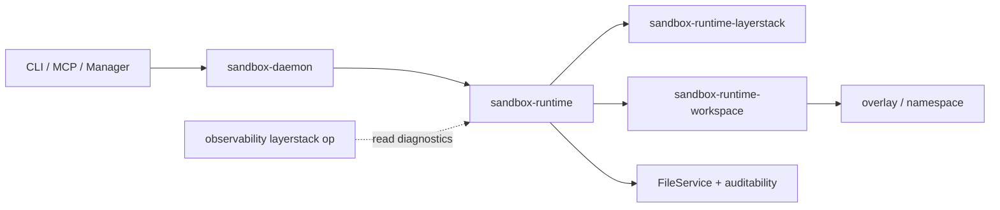

# Phase 00 — Freeze rules — SPEC

> **Post-Phase-01 terminology note (2026-08-04):** this frozen evidence uses
> the historical name `StateId`/“state id.” Current V2 documents use
> `VersionId` per [ADR-002](../../design/decisions/ADR-002-version-id-naming.md).
> The rename does not alter this phase's measured facts or frozen semantics.

**Status:** complete after pass 2 (docs only)  
**Date:** 2026-08-04  
**Phase test-perf:** [test-perf.md](test-perf.md) D1–D5  

Supporting inventories (detail):

- [inventory-surfaces.md](inventory-surfaces.md)
- [inventory-packages.md](inventory-packages.md)
- [fixture-catalog.md](fixture-catalog.md)

---

## 1. Summary

Phase 00 freezes **what “correct” means for later work**: product hard rules as
testable intent, a source-measured inventory of today’s ops, packages, writers,
rejects, provider lifecycle, and adapter projections, an
open-decision register (not closed), a fixture plan for phases 02–06, a
baseline/performance **policy** (how we will measure later), resource envelope
**proposals**, and effort estimates. It deliberately leaves open architecture
winners, on-disk algorithms, the final package graph, public API breaks
(blame / no-session write), and all V2 performance claims.

**Exit status target:** this document plus the three supporting inventories
satisfy [test-perf.md](test-perf.md) **D1–D5** without product code or V2
benchmarks.

| Check | How this SPEC satisfies it |
|-------|----------------------------|
| D1 Worktree identity | §2 Environment seal (real git) |
| D2 Open decisions not closed | §6 — all `open` |
| D3 Fixture categories | §7 + [fixture-catalog.md](fixture-catalog.md) |
| D4 Stage 4.6 historical only | §8 — `INCOMPARABLE`, not a V2 guarantee |
| D5 Hard rules referenced, not contradicted | §3 pointer to product PRD; no new architecture |

---

## 2. Environment seal

Recorded at Phase 00 write time:

```text
cd /Users/yifanxu/Ephemeral-AI-Lab/ephemeral-sandbox-new-2.0
git rev-parse --abbrev-ref HEAD  →  codex/new-2.0-storage-core
git rev-parse HEAD               →  e4974d1f9aac702b35e052629cb070c897989352
git status                       →  clean; up to date with origin/main
```

| Field | Value |
|-------|--------|
| Docs package path | `/Users/yifanxu/Ephemeral-AI-Lab/ephemeral-sandbox-docs/ephemeral-sandbox-v2` |
| Worktree path | `/Users/yifanxu/Ephemeral-AI-Lab/ephemeral-sandbox-new-2.0` |
| Branch | `codex/new-2.0-storage-core` |
| HEAD | `e4974d1f9aac702b35e052629cb070c897989352` |
| Dirty? | **no** (`nothing to commit, working tree clean`) |
| Matches recorded e497 base? | **yes** — HEAD equals recorded base exactly; tip log `e4974d1f9 feat(windows): add named-pipe gateway compatibility (#6)` |
| Tracking note | Branch tracks `origin/main` (clean worktree name is `codex/new-2.0-storage-core`) |
| Day-to-day product repo | `/Users/yifanxu/Ephemeral-AI-Lab/ephemeral-sandbox` — **not** used as implementation base this phase |

**BASE_DRIFT:** none.

Docs repo note (do not clean): unrelated dirty/untracked appendix trees exist under
`ephemeral-sandbox-docs`; this phase only adds/updates
`ephemeral-sandbox-v2/phases/00-freeze-rules/`.

---

## 3. Product rules (pointer + deltas)

### 3.1 Hard rules (authoritative)

Full list: product [PRD.md](../../PRD.md) § “Hard rules (must never break)”.

| # | Rule (short) |
|---|--------------|
| 1 | Complete immutable state — no layer chain as truth model |
| 2 | Same accepted state id (equal canonical bytes) → one payload |
| 3 | Reference-only root ops: payload read = write = copy = 0 |
| 4 | Digest is not proof — full byte compare on id collision; fail closed |
| 5 | One head transition at a time (OCC); no silent merge/rebase |
| 6 | Committed state never edited in place by `file_write` / `file_edit` |
| 7 | MCTS / rollout policy outside storage |
| 8 | Runtime-private (mounts, OverlayFS, namespaces) not in portable identity |
| 9 | No dual writable truth during/after cutover |
| 10 | Prefer rewrite in place (R0); no new packages/frameworks unless forced |

Phase 00 does **not** reinterpret or weaken these.

### 3.2 Clarifications from source (not new architecture)

| Topic | Source finding | Product impact |
|-------|----------------|----------------|
| No-session write/edit | Catalog: omit `workspace_session_id` → publish one layer via `amend_path` under writer lock | Today’s product **does** allow sessionless durable write; V2 must resolve under **DEC-017** (keep / reshape / break) |
| `file_read` dual target | With session → live workspace; without → latest published snapshot | Matches product PRD sketch; keep as intent |
| `file_blame` | Public runtime op over append-only `file_auditability` log beside layerstack | Attribution is a **side channel**, not LayerStack head truth; **DEC-001** whether exact blame stays |
| `file_list` | HTTP-only on daemon; manager gateway rejects it | Transport exception; disposition under **DEC-017** |
| Squash / autosquash | Manager `squash_layerstacks` + optional autosquash engine rewrite published chains | Layer-history maintenance; V2 model removes layer-chain truth (squash role **OPEN** in design phases) |
| Current publish conflict handling | `publish_validated_changes` can accept compatible directory creates and cleanly three-way-merge eligible text writes | Measured legacy behavior only; V2 hard rule 5 still requires OCC with **no silent merge/rebase** |
| Observability `layerstack` | Diagnostics only; “does not read the log” | Non-authority for store decisions |
| No checkpoint/fork/rollback public ops | Catalog has create/publish/destroy session + file/command; no named fork API | V2 primitives may be composed later; not present as public ops today |
| R0 home | Durable history lives in `sandbox-runtime-layerstack` | Aligns with product “prefer rewrite in place” hypothesis — still not a winner claim |

### 3.3 Hard-rule self-audit after pass 2

| Rule | Result | Evidence / repair made in this SPEC set |
|------|--------|-----------------------------------------|
| 1. Complete immutable state | **pass** | Every LayerStack chain/layout statement is labeled measured-current evidence; no layer chain is proposed as V2 truth. |
| 2. Equal canonical state → one payload | **pass** | Fixture F/G wording requires equality of canonical bytes and one physical payload; no digest-only shortcut. |
| 3. Reference-only payload I/O = 0 | **pass** | F1–F4 require payload read/write/copy counters, not timing or digest inference. |
| 4. Full compare on id collision | **pass** | G1–G3 require full canonical byte comparison and fail closed; current hash fixtures are explicitly insufficient. |
| 5. OCC, no silent merge/rebase | **pass with current delta recorded** | §3.2 and the surface inventory disclose current text auto-merge. D1 remains the V2 loser-fails-cleanly oracle and does not bless current behavior. |
| 6. No committed in-place file edit | **pass; DEC-017 open** | Current sessionless amend is recorded as publishing a new layer, not editing committed bytes in place; its V2 public disposition is not assumed. |
| 7. MCTS outside storage | **pass** | Storage inventory contains only state primitives/effects; no rollout policy or algorithm is selected. |
| 8. Runtime-private stays private | **pass** | Mounts, OverlayFS, namespaces, scratch paths, and provider bindings are excluded from portable identity. |
| 9. No dual writable truth | **pass** | E4–E5 require legacy-write rejection and a writer-generation fence; no dual-write migration period is proposed. |
| 10. Prefer R0 | **pass** | Existing ownership home is an inventory fact and R0 remains a preference; no new package/framework or winner is declared. |

This audit closes no DEC and selects no architecture or storage method.

---

## 4. Surface inventory (from source)

**Detail:** [inventory-surfaces.md](inventory-surfaces.md)  
**Completeness:** requested pass-2 G1–G6 evidence is measured at e497, with
bounded residuals (future providers/commits and test-only callers) stated in the
detailed inventory.

### 4.1 Runtime / manager ops touching state or workspace

| Class | Names | Crate / module hints |
|-------|-------|----------------------|
| File API | `file_read`, `file_write`, `file_edit`, `file_blame` | `sandbox-operation-catalog` `runtime/file.rs`; `sandbox-runtime` `file/` |
| File list (HTTP-only) | `file_list` | `catalog/internal/runtime.rs`; `sandbox-daemon` HTTP |
| Workspace session | `create_workspace_session`, `publish_workspace_session`, `destroy_workspace_session` | `catalog/runtime/workspace_session.rs`; `operation/workspace_session/` |
| Command (may auto-publish) | `exec_command`, `write_command_stdin`, `read_command_lines` | `catalog/runtime/command.rs`; `operation/command/` |
| Internal compact / export | `squash_layerstack`, `export_layerstack`, `read_export_chunk` | daemon internal; `layerstack` service |
| Manager lifecycle | `create_sandbox`, `destroy_sandbox`, `list_sandboxes`, `inspect_sandbox` | `catalog/manager/management.rs`; `sandbox-manager` |
| Manager compact / export | `squash_layerstacks`, `export_changes` | manager forwards to daemon |
| Manager discovery | `list_docker_images`, `list_workspace_directories` | provisioning helpers |

The public catalogs contain 26 names (8 manager + 10 runtime + 8
observability); daemon HTTP-only `file_list` makes the current public/tool
inventory 27 names. This is distinct from the appendix's legacy 26-row V2
proposal.

### 4.2 Durable state writers

| Who | Effect on durable published truth |
|-----|-----------------------------------|
| `publish_workspace_session` / auto finalize | `publish_validated_changes` → layer/no-op + manifest; auditability append after commit |
| Sessionless `file_write` / `file_edit` | `amend_path` holds the writer lock across read/transform/commit → layer/no-op; auditability append |
| `squash_layerstack` / autosquash | Both converge at `squash_with_observer` → compact chain / rewrite manifest & leases |
| `ensure_workspace_base` (runtime boot) | Build missing local base/binding or validate provider-seeded binding |
| `build_shared_workspace_base` (manager create) | Content-addressed host cache used to seed the shared Docker base volume |
| Lease sweep | GC unreferenced layer objects (not new content) |
| Layer metadata sidecars | Base/publish writes digest/byte metadata; observability sampling may lazily populate a missing `.bytes` size cache after a complete walk (not head truth) |
| File auditability store | Append blame events (not LayerStack head) |
| Operational side stores | Workspace recovery artifacts, export spools/destinations, daemon telemetry/diagnostics, manager registry, and resource rings; all classified outside published head truth |

The pass-2 `src/` search found no production caller of low-level
`publish_layer` outside its definition; all production validated publication
converges through the LayerStack service. The exact search ledger and bounded
residuals are in the detailed inventory §4.3.

### 4.3 Workspace / overlay / exec owners

| Owner | Path |
|-------|------|
| Workspace | `crates/sandbox-runtime/workspace` (`sandbox-runtime-workspace`) |
| Overlay mount | `crates/sandbox-runtime/overlay` |
| Namespace process | `crates/sandbox-runtime/namespace-process` |
| Namespace execution | `crates/sandbox-runtime/namespace-execution` |
| Layer store | `crates/sandbox-runtime/layerstack` |
| Runtime composition | `crates/sandbox-runtime/operation` |

### 4.4 Observability (storage-like names, non-authority)

| Op | Note |
|----|------|
| `layerstack` | Live per-layer inventory / leases / trend — **not** store authority |
| `snapshot`, `resources`, `cgroup`, `events`, `trace`, `topology`, `daemon` | Telemetry / ops views |

The public `layerstack` request exposes `sandbox_id`, optional `workspace_id`,
and optional `window_ms`. Its default inventory returns manifest/root identity,
leases/bookings, active-layer and complete-storage byte measures, staging count,
and optional trend; workspace view returns mounted layers/sharing and sampled
upperdir bytes. Incomplete disk walks produce `null`, never false zero. The
disk sampler may fill a missing `.layer-metadata/<layer_id>.bytes` cache after
a complete walk, but this does not advance the manifest or grant authority. The
handler's latent `layer_id`/`limit` delta view is absent from the catalog and
therefore absent from CLI/MCP—it is not promoted by this document.

### 4.5 Pass-2 closure ledger

| Backlog | Result | Detailed evidence |
|---------|--------|-------------------|
| G1 publish reject/OCC matrix | **complete at e497** | [inventory-surfaces.md](inventory-surfaces.md) §5: all seven reasons, firing symbols/conditions, public classes/envelopes, late manifest conflict, and current auto-merge delta |
| G2 create/destroy layout | **complete for concrete Docker provider** | Detailed inventory §3: host cache, three named-volume roles, seeded paths, registry, cleanup and partial-failure behavior |
| G3 durable writers | **complete for named production symbols** | Detailed inventory §4: logical/metadata writers plus call-site recheck and residual bound |
| G4 CLI/MCP delta | **complete** | Detailed inventory §2: exact catalog sets, adapter presentation/injection rules, internal exclusions, latent observability mismatch |
| G5 legacy 26-row location | **linked, not adopted** | Detailed inventory §8 and Appendix below; DEC-017 remains open |
| G6 observability fields | **complete** | Detailed inventory §7: public inputs, response fields, null semantics, authority boundary |
| G7 fixture anchors | **complete as a path map** | [fixture-catalog.md](fixture-catalog.md) maps 1–2 existing tests per A–G and states missing V2 oracles |
| G8 PRD self-audit | **pass** | §3.3; no contradiction repaired by weakening a hard rule |

---

## 5. Package / module map (today)

**Detail:** [inventory-packages.md](inventory-packages.md)

| Package or directory | Role | V2 relevance |
|----------------------|------|--------------|
| `sandbox-runtime-layerstack` | Store history (manifest, layers, publish, squash, project) | **R0 primary** rewrite home |
| `sandbox-runtime` (`operation`) | App: file, session, layerstack façade, command, autosquash | Keep ordering; wire later |
| `sandbox-runtime-workspace` | Live workspace / capture / remount | Effects only |
| `sandbox-runtime-overlay` / `namespace-*` | Mounts / namespaces / exec | Runtime-private |
| `sandbox-daemon` | Composition / RPC / HTTP | Composition root |
| `sandbox-manager` | Fleet lifecycle, squash forward, export | Lifecycle / export |
| `sandbox-operation-catalog` | Op names & contracts | Surface freeze source |
| `sandbox-operation-contract` / `client` | Shared contract / client | Shared |
| `sandbox-cli` / `sandbox-mcp` / `sandbox-gateway` | Product adapters | Surfaces |
| `sandbox-config` | Typed config incl. layerstack & cgroup | Resource knobs |
| `sandbox-observability-*` | Diagnostics | Non-authority |
| `sandbox-protocol` / `sandbox-provider-docker` | Wire / Docker provider | Peripheral |
| `xtask` | Dev packaging / architecture checks | Tooling |

**OPEN:** final V2 package graph (product design decision). Default hypothesis
remains R0 (no new packages) until Phase 01 proves otherwise.



---

## 6. Open decisions register

Started from product [PRD.md](../../PRD.md) and appendix
`implementation-plan/new_2.0_migration_implementation_plan/decisions/README.md`.  
**No DEC resolved in this session.**

| ID | Question | Blocks which later phase? | Status | Notes from source |
|----|----------|---------------------------|--------|-------------------|
| DEC-001 | Keep exact `file_blame` or accept a break? | 02–04 public API; attribution storage | **open** | Public op exists; auditability NDJSON under `storage/file_auditability` |
| DEC-011 | How long to observe after cutover before stripping compat? | 07–08 | **open** | Operational risk; not measurable from source alone |
| DEC-017 | No-session write/edit and exact V2 public-operation / file-target set | 01 scope; 04 wire; 06 oracle | **open** | Today: sessionless write **publishes a layer**; V2 hard rule 6 says live writes must not mutate **committed** state in place — product mapping needs owner input |
| DEC-018 | Auth / revoke ordering under races | 04 security fixtures; 06 | **open** | Protocol/auth fields exist; linearization contract not sealed |
| Design | Final package / module graph | 01, 03–04 | **open** | Inventory is today’s map only |
| Design | On-disk / index / publish methods | 01, 03 | **open** | No algorithm selected |
| DEC-002…010, 012–016 | Architecture / profile / durability / topology (appendix) | Primarily Phase 01 design tournament | **open** | Listed in appendix decision ledger; Phase 00 does not choose |

---

## 7. Fixture plan (for later phases)

**Detail:** [fixture-catalog.md](fixture-catalog.md)

The catalog now maps one or two concrete e497 test anchors per category. Those
paths are input/setup sources only; they are not V2 oracles, and no fixture was
implemented in Phase 00.

| Category | Example scenarios (2–5) | Implement in |
|----------|-------------------------|--------------|
| Happy path publish / read / session | Publish then snapshot read; session live read; auto `publish_then_destroy`; destroy-without-publish discards | 03–04, prove 06 |
| Corrupt / invalid input | Bad manifest; missing payload; oversize edit; bad edit uniqueness | 03–04, 06 |
| Crash mid-publish / mid-import | Kill mid-stage; kill mid-head; mid-import; mid-squash; keep crash classes distinct | 03, 05–06 |
| Concurrent OCC / fork | Dual publish race; lease + publish; stale base reject | 03–04, 06 |
| Migration / legacy shape | Multi-layer import; post-squash import; base-only; dual-write reject; generation fence | 05–07 |
| COW multi-reference same state | Checkpoint fixed Roots and fork/rollback Branch Heads share payload; N references; last-reference drop | 02–03, 06 |
| Collision same id different bytes | Fail closed on mismatch; share on equal bytes; optional forced-collision seam | 02–03, 06 |

**Holdout rule:** if a corpus is reserved for Phase 06 ship proof, do **not**
tune implementation against it earlier. Stage 4.6 may inspire fixtures only
after content is re-hashed and recovered — not as free timing oracles.

---

## 8. Baseline and performance policy

### 8.1 Stage 4.6 — historical only

| Label | Value |
|-------|--------|
| Role | Historical POC / campaign evidence |
| Matched classification | **`R_stage46 = INCOMPARABLE`** (appendix `evidence/stage-04-6-baseline.md`) |
| Directional fact (history) | Matched-first-three candidate median **slower** than control (~58.1 ms vs ~36.4 ms; ratio ~1.6× candidate/control) |
| Seal for V2? | **No** — missing full dirty/untracked source closure and matched re-run provenance |
| 100× claim | **Forbidden** — product PRD explicitly does not guarantee “100× Stage 4.6” |

Separate historical note: repository materialization baseline-experiment
(`~9.99 s` cold materialization on ~870 MiB corpus) is also **not** a sealed V2
comparator.

### 8.2 What Phase 00 freezes

Phase 00 freezes **how we will measure later**, not V2 results:

1. Correctness and crash safety always beat speed.  
2. No V2 design may pass or fail on Stage 4.6 numbers.  
3. A comparable baseline requires a **new** attested run (or full reconstruction
   with complete source archive) under a protocol Phase 01+ defines.  
4. Care-abouts (not gates yet): small publication, reference-only COW cost,
   steady ops cost, bounded memory/disk/FDs.  
5. Performance measures appear only where a later phase `test-perf.md` requires
   them — never invented here as winners.

### 8.3 Not claimed

- Architecture or algorithm winner  
- V2 latency / throughput SLA  
- Stage 4.6 as control for Phase 01 tournament  

---

## 9. Resource envelope **proposals**

All items **`PROPOSAL`** — refine with measurement in store/product phases.
Drawn from today’s config defaults and appendix historical peaks as **hints
only**.

| Area | PROPOSAL | Source of thinking |
|------|----------|--------------------|
| Store-side memory | Keep publication/working set finite; avoid unbounded in-memory layer caches; prefer streaming publish where practical | Today’s process-wide locks/lease registries already exist — V2 must still bound caches |
| Store-side FDs | Cap concurrent open payload FDs; release on lease end / request end | Workspace/namespace already track FDs; store must not leak |
| Disk scratch | Bound `staging` / export spool; clean on crash recovery and idle sweep | Today: `STAGING_DIR`, export spool under layerstack service |
| File API request bounds | Retain order-of-magnitude caps similar to today (`max_output_bytes` 256 KiB, `max_edit_bytes` 4 MiB, list/read line caps) until product revises | `runtime.file` defaults |
| Untrusted runtime cgroup | Continue manager/daemon workload cgroup injection (memory high/max, pids, nano CPUs) as **pointer** — exact V2 numbers not sealed | `WorkloadCgroupLimits` / manager cgroup config |
| Historical peak caution | Appendix P1 activation cgroup peak ~102.5 MiB is **incomparable** history; do not treat as pass/fail for V2 96 MiB-style gates | stage-04-6-baseline.md |
| Cleanup | No unbounded auditability/export/spool growth without rotation/GC policy; migrator temps must be deletable (phases 05/08) | Product success criteria |

---

## 10. Effort estimation

### A. This Phase 00 task (writing the spec)

| Workstream | Estimate (person-hours) | Confidence | Notes |
|------------|------------------------:|------------|-------|
| Env verify + tree skim | 0.5–1 | high | Done; clean e497 match |
| Ops / file API inventory | 2–4 | high | Catalog, CLI/MCP projection, and reject matrix measured |
| Writer / package map | 2–4 | high | Production symbol callers and Docker lifecycle mapped |
| Open decisions + appendix skim | 1–2 | high | DEC table + Stage 4.6 policy |
| Fixture + baseline + resources writeup | 1–2 | high | Plans only |
| SPEC polish + self-check vs test-perf | 1 | high | D1–D5 |
| **Total Phase 00 spec** | **~8–14 h** | medium | Two focused documentation passes; no product implementation |

**Execution note:** pass 2 expanded the previously bounded inventory gaps from
the sealed source tree; no V2 benchmark or product-code work was performed.

#### Agent session sizes (~2–4 h focused)

| Session | Outcome |
|---------|---------|
| S0a | Env seal + package map draft |
| S0b | Full surface + writer inventory |
| S0c | Fixtures, baseline, DECs, effort rollup; SPEC complete |
| S0d | Publish-reject matrix + production writer recheck |
| S0e | Docker lifecycle paths + CLI/MCP projection delta |
| S0f | Fixture anchors, hard-rule audit, SPEC/handoff polish |

This deliverable records S0a–S0f across the two documentation passes.

### B. Rough rollup after Phase 00 (planning only, not commitment)

| Phase | Name | Effort band | Notes |
|------:|------|-------------|-------|
| 00 | Freeze rules (this spec) | **S** | docs |
| 01 | Choose design | **S–M** | decision + light spikes; may stop with no winner |
| 02 | State identity | **S–M** | pure code + tests |
| 03 | State store | **L–XL** | main engineering |
| 04 | Wire product | **M–L** | integration |
| 05 | Migrator | **M** | temp code |
| 06 | Prove offline | **M–L** | test time on ship candidate |
| 07 | Go live | **M + calendar** | observation window (DEC-011) |
| 08 | Clean release | **M** | delete migrator + requal |

Bands: **S** ~1–3 d · **M** ~3–8 d · **L** ~1–3 w · **XL** multi-week  
(calendar, one engineer-equivalent; AI-assisted can compress wall time but not
zero review).

**Assumptions:** one engineer + AI; clean worktree base; R0-first; no live fleet
surprises; DEC-001/017/018 resolved before deep public-API wiring; no dual-write
production period.

---

## 11. Stop conditions and risks

### What would block finishing Phase 00

| Blocker | Status now |
|---------|------------|
| Missing / wrong worktree | **Cleared** — e497 clean match |
| Cannot identify durable writers | **Cleared** — publish / amend / squash / base / auditability |
| Team starts store implementation here | Process risk — out of scope for this phase |

### What must not start until Phase 00 test-perf passes

- Phase 01 design tournament treated as “rules already known” without this SPEC  
- V2 product store code claimed complete  
- Using Stage 4.6 numbers as sealed comparators  
- Live cutover, migrator against fleet, legacy data deletion  
- Closing DECs without owner input  

### Risks

| Risk | Mitigation |
|------|------------|
| Sealed e497 inventory ages as code changes | Re-run the named writer/catalog searches before Phase 03/04 implementation and record new drift |
| DEC-017 delay blocks API wiring | Phase 01 can spike store offline; public wire waits |
| Treating observability as authority | Explicit non-authority labeling in §4.4 |
| Premature algorithm choice | Hard rule: Phase 00 forbids winners |

---

## 12. Handoff to Phase 01

### Exact files to read

1. This file: `phases/00-freeze-rules/SPEC.md`  
2. [inventory-surfaces.md](inventory-surfaces.md)  
3. [inventory-packages.md](inventory-packages.md)  
4. [fixture-catalog.md](fixture-catalog.md)  
5. Product [PRD.md](../../PRD.md) hard rules + open decisions  
6. Program [PLAN.md](../../PLAN.md) phase order  
7. Optional appendix (detail only):  
   - `implementation-plan/new_2.0_migration_implementation_plan/design/`  
   - `implementation-plan/new_2.0_migration_implementation_plan/algorithms/`  
   - `implementation-plan/new_2.0_migration_implementation_plan/decisions/README.md`  
   - `implementation-plan/new_2.0_migration_implementation_plan/evidence/stage-04-6-baseline.md`  

### What Phase 01 may assume frozen

- Product hard rules 1–10 (intent)  
- Clean base identity: worktree path, branch, `e497…`  
- Measured-as-of-e497 surface and package inventories, with bounded residuals stated  
- Fixture **categories** and which later phase owns them  
- Stage 4.6 = historical / `INCOMPARABLE`  
- Resource items are proposals only  
- R0 is the **default preference**, not a sealed architecture winner  

### What remains open

- All DEC-001 / 011 / 017 / 018 and design DECs  
- Architecture and storage methods (must be chosen **together** or stop)  
- Final package graph  
- Any performance guarantee  
- Live cutover authorization  

### Phase 01 must not

- Implement production V2 cutover  
- Claim Stage 4.6 as proof of speed  
- Silently close product DECs  

---

## Appendix — sources used

| Kind | Path |
|------|------|
| Product PRD / PLAN | `ephemeral-sandbox-v2/PRD.md`, `PLAN.md` |
| Phase 00 triple | `PRD.md`, `PLAN.md`, `test-perf.md` (this folder) |
| Clean code base | `ephemeral-sandbox-new-2.0` @ `e4974d1f…` |
| Catalog | `crates/sandbox-operations/catalog/src/**` |
| Layerstack / runtime | `crates/sandbox-runtime/layerstack`, `operation` |
| Manager / Docker lifecycle | `crates/sandbox-manager`, `crates/sandbox-provider-docker` |
| Current adapter projection | `crates/sandbox-cli`, `crates/sandbox-mcp` |
| Legacy 26-row proposal | [system-design/api_methods.md](<../../../implementation-plan/2.0 migration/system-design/api_methods.md>) — evidence only |
| Current/legacy/candidate API separation | [design/public-api.md](../../../implementation-plan/new_2.0_migration_implementation_plan/design/public-api.md) |
| Stage 4.6 evidence | `implementation-plan/new_2.0_migration_implementation_plan/evidence/stage-04-6-baseline.md` |
| Decision ledger | `…/decisions/README.md` |
| Materialization baseline README | `…/stage_04_6_ultra_optimization/baseline-experiment/README.md` (historical only) |

---

## Definition of done (self-check)

- [x] `SPEC.md` exists with all required sections  
- [x] Env seal filled from real git  
- [x] Surface + package inventories from source; pass-2 G1–G8 closure/residuals explicit  
- [x] Open decisions not silently closed  
- [x] Fixture plan + baseline policy + resource proposals present  
- [x] Effort estimates for Phase 00 + rough later rollup  
- [x] test-perf D1–D5 satisfiable  
- [x] No product code changes  
- [x] No architecture/algorithm winner declared  

---

[PRD.md](PRD.md) · [PLAN.md](PLAN.md) · [test-perf.md](test-perf.md) · [Index](../../PLAN.md)
