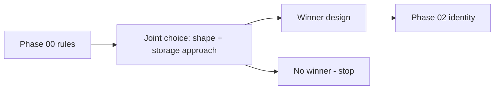

# Phase 01 — Choose design — PRD

**Status:** complete — selected architecture published  
**Inherits:** [../../PRD.md](../../PRD.md) · needs phase 00 outputs

## Goal

Choose **one** implementable design: **where ownership lives** and **how storage works**, together — or stop with **no winner**.

## Why this phase exists

Picking “architecture” first and “disk method” second can force extra boundaries. Physical methods change crash, helpers, and resources. Decide them as one package.

## In scope

- Compare real candidates (at least **R0 rewrite-in-place** plus serious alternatives if needed)  
- Include storage method families only as far as needed to know ownership  
- Disposable spikes for runtime neutrality (Linux today; WASI/FC only as “does this leak into identity?”)  
- Written decision: winner **or** no winner with reasons  

## Out of scope

- Full store implementation  
- Production cutover  
- Declaring package counts as eternal law  
- Performance bake-off as the primary decider (correctness first)  

## Decisions this phase makes

- Selected design direction (or no winner)  
- What may be deleted (e.g. layer-history semantics)  
- Whether any **new** boundary is truly required  

## Decisions this phase must NOT make

- Final micro-optimized publish algorithm without implementation evidence  
- Live migration runbooks as complete  
- Fake certainty on LOC counts  

## Inputs

- Phase 00 inventory, fixtures plan, open decisions  
- Product hard rules (COW, neutrality)  
- [Phase 01 selection specification](SPEC.md): targets, candidate gates,
  evidence threshold, and architecture-output contract  

## Outputs

- Root [architecture design](../../architecture_design.md), containing the
  winner/no-winner result, decision provenance, and whole-program contract  
- Rejected and non-admitted options with concrete reasons  
- Binding guidance for Phases 02–08, especially identity and store ownership  

## Success

Implementers know what to build next without rediscovering architecture in every PR.

### Diagram — selection idea

---

[PLAN.md](PLAN.md) · [test-perf.md](test-perf.md) · [Index](../../PLAN.md)
