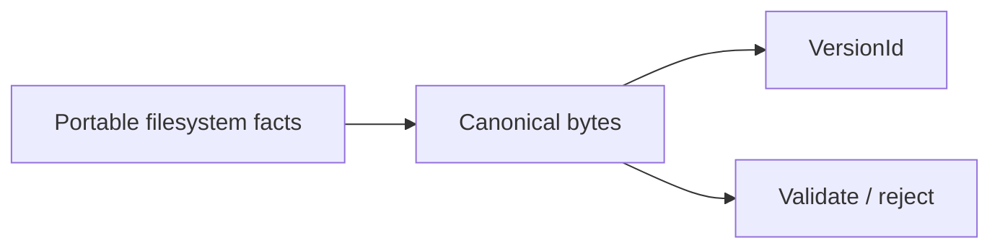

# Phase 02 — Version identity — PRD

**Status:** authorized by Phase 01.5 `PASS`; not started  
**Closure trace:** `019fcd32-b832-7750-9eb5-5f544e39c533`  
**Inherits:** product PRD · selected [architecture design](../../architecture_design.md) · Phase 01.5 [contract closure](../01-5-contract-closure/SPEC.md)

## Goal

Define and implement **portable Version identity**: canonical bytes,
`VersionId`, and validation limits—pure and testable without mounts.

## Why this phase exists

LayerStack-0 must persist **facts**, not host paths or OverlayFS handles.
Identity comes first so the Version engine cannot accidentally bake Linux-only
fields into portable identity.

## In scope

- Canonical representation of filesystem facts needed for a complete Version  
- Domain-separated hashing and typed `VersionId` rules  
- Fail-closed validation (size, depth, corrupt input)  
- Golden vectors and independent-style checks  
- Collision capability: the identity module supplies exact-byte comparison and
  a forced-ID test seam; Phase 03 owns occupied-ID admission and collision classification  

## Out of scope

- Durable commit protocol (phase 03)  
- Workspace mounts  
- Migrator  
- Live fleet  

## Decisions this phase makes

- Concrete canonical encoding and `VersionId` derivation **for the chosen design**  
- Validation limits  

## Decisions this phase must NOT make

- Live cutover  
- Final GC algorithm (unless forced by identity)  

## Inputs

- Selected [architecture design](../../architecture_design.md), especially the
  identity boundary and Phase 02 contract  
- Passed Phase 01.5 [contract-closure gate](../01-5-contract-closure/SPEC.md),
  especially the frozen identity inputs and reference/publication exclusions  
- Product COW/identity laws  

## Outputs

- Identity module/functions usable by LayerStack-0  
- Golden / corrupt test vectors  

## Success

Two environments produce the same `VersionId` for the same qualified facts;
bad inputs fail closed; runtime brands are absent from identity. A computed
`VersionId` does not claim that an Accepted Version exists.

### Diagram

---

[PLAN.md](PLAN.md) · [test-perf.md](test-perf.md) · [Index](../../PLAN.md)
