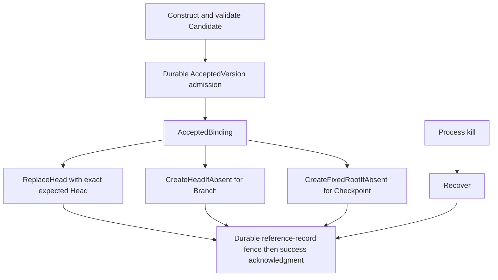

# Phase 03 — LayerStack-0 durable storage — PRD

**Status:** not started  
**Inherits:** product PRD · selected [architecture design](../../architecture_design.md) · phase 02 identity

## Goal

Build **LayerStack-0 offline durable Version storage**: admit, publish, manage
mutable Heads and fixed typed Roots, recover, and perform exact accepted-reference
transitions—without live cutover.

## Why this phase exists

This is the product core. Everything else (wire, migrate, live) calls a
LayerStack-0 engine that already survives crashes and shares payload correctly.

## In scope

- Durable Accepted Versions for the chosen design  
- `CreateHeadIfAbsent`, `ReplaceHead`, and `RemoveHead` with exact expected-state semantics  
- `CreateFixedRootIfAbsent` and `RemoveFixedRoot`; no generic Root retargeting  
- Reference-only Branch creation, Checkpoint creation/removal, and Head rollback-to-existing  
- Recovery after kill / restart  
- Remove or fence **layer-history** semantics from this core path  
- Resource admission and cleanup for LayerStack-0 artifacts  
- Unit/integration tests offline  

## Out of scope

- Full app `file_*` wiring (phase 04)  
- Legacy import tool (phase 05)  
- Production traffic  
- MCTS implementation  

## Decisions this phase makes

- Concrete non-overlapping durable root/layout and commit steps **within** phase 01 design  
- Recovery behavior details  

## Decisions this phase must NOT make

- Live generation fence policy beyond what store needs  
- Deleting migrator requirements  

## Inputs

- Identity APIs from phase 02  
- Selected [architecture design](../../architecture_design.md), especially the
  store owner, storage family, and Phase 03 contract  
- COW law from product PRD  

## Outputs

- LayerStack-0 usable in-process/offline by later phases  
- Exact physical layout/API contract that Phase 05 consumes without direct path writes  
- Tests proving COW zeros and recovery  

## Success

Kill during publish → consistent prior or complete new Version/reference; N
Heads or fixed Roots share one payload; stale OCC preserves accepted immutable
truth and accounts for the accepted orphan; no layer-depth truth in the core;
the V2 namespace cannot collide with legacy paths during migration.

### Diagram — core flows

---

[PLAN.md](PLAN.md) · [test-perf.md](test-perf.md) · [Index](../../PLAN.md)
