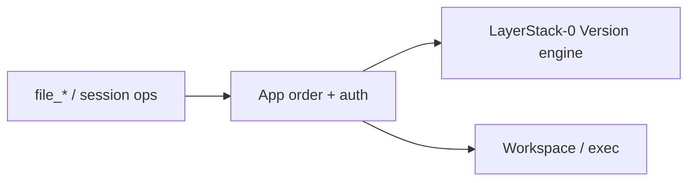

# Phase 04 — Wire product — PRD

**Status:** not started  
**Inherits:** product PRD · store from phase 03

## Goal

Connect **application ordering** and **current Linux Workspace/exec** to
LayerStack-0 so real operations work **offline / non-cutover** — still not a
production flip.

## Why this phase exists

A store alone is not the product. Callers need `file_*`, sessions, and publish flows with correct auth order and no second source of truth.

## In scope

- Wire existing app owners to LayerStack-0 for selected-Version transitions  
- Keep workspace/overlay/exec in existing effect owners  
- `file_read` committed vs session behavior  
- Writes only against a live Workspace, then publish a complete immutable Version  
- Cross-path crash: Version/reference durability versus runtime-effect cleanup  
- E2E tests in non-production setup  

## Out of scope

- Legacy bulk import (phase 05)  
- Fleet generation fence cutover (05–07)  
- Removing all compatibility shims (08)  

## Decisions this phase makes

- Call sequence app ↔ store ↔ effects for each kept operation  
- What stays unsupported/explicit error (e.g. squash-as-history)  

## Decisions this phase must NOT make

- Irreversible live cutover  
- Final perf claims  

## Inputs

- Working store (phase 03)  
- Operation inventory (phase 00)  
- Open API decisions (blame, etc.) — may still be open with explicit errors  

## Outputs

- Product path runnable in lab  
- E2E tests for core file/session flows  

## Success

A developer can create a session, edit files, publish, read the selected
Version, and Fork without copying payload — all without cutting over production.

### Diagram

---

[PLAN.md](PLAN.md) · [test-perf.md](test-perf.md) · [Index](../../PLAN.md)
