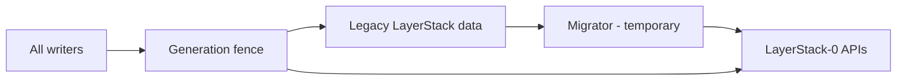

# Phase 05 — Migrator — PRD

**Status:** not started  
**Inherits:** product PRD · wired product from phase 04

## Goal

Build a **temporary** legacy LayerStack → LayerStack-0 path: map selected
legacy views to complete Versions and install a **generation fence** so writers
cannot mix truths—still without flipping production.

## Why this phase exists

Migration is a different job from the permanent store. Keeping it separate (SRP) makes phase 08 deletion possible.

## In scope

- Deterministic `LegacySelectionKey -> complete Candidate -> VersionId -> AcceptedVersion -> AcceptedBinding -> target reference` map  
- Decode one complete selected legacy view and import it through LayerStack-0 APIs  
- Map actual selected heads and explicit restore points; do not turn every historical layer into a checkpoint  
- Keep layers, parents, depth, whiteouts, mounts, host paths, and workspace runtime facts out of Version identity  
- Fail closed on corrupt/unsupported legacy  
- Generation / mode fence design for all writers  
- Read-only shadow compare in lab  
- Side-by-side capacity accounting  
- Exact proof that the Phase 03 V2 namespace cannot alias e497 legacy paths  

## Out of scope

- Permanent dual-write  
- Direct writes to LayerStack-0 physical paths  
- CDC, chunk/object-DAG, or `VersionView` migration formats  
- Making migrator a public long-term API  
- Live irreversible cutover (phase 07)  

## Decisions this phase makes

- Import tool shape (module/CLI) as **temporary**  
- Fence token shape at product level (generation + mode)  
- Migration progress record/cursor encoding; it is not a Checkpoint or Root  

## Decisions this phase must NOT make

- Deleting legacy data  
- Skipping offline full prove (still phase 06)  

## Inputs

- LayerStack-0 + wired product  
- Phase 03 exact root/layout and public API contract  
- Inventory of writers (phase 00)  

## Outputs

- Migrator that can run in lab  
- Fence mechanism ready for rehearsal/cutover  
- Mapping + provenance notes distinguishing `VersionId`, Accepted Version,
  Accepted Binding, branch Head, Checkpoint Root, and migration progress  

## Success

Lab can import a fixture legacy sandbox to V2 and show semantic match; writers reject stale generation in tests.

### Diagram — temporary component

---

[PLAN.md](PLAN.md) · [test-perf.md](test-perf.md) · [Index](../../PLAN.md)
