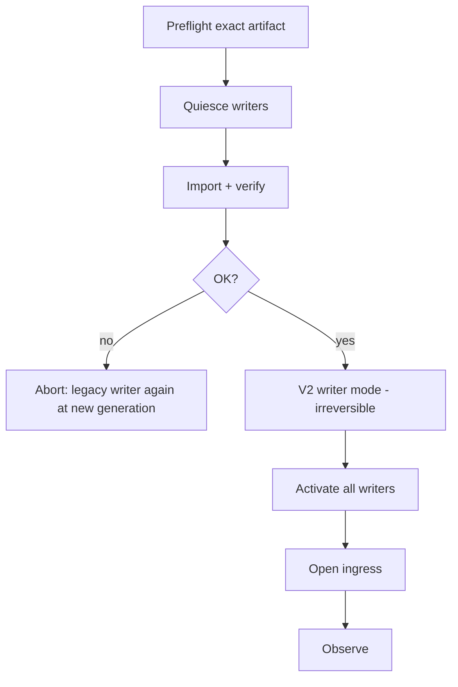

# Phase 07 — Go live — PRD

**Status:** not started  
**Inherits:** product PRD · phase 06 go decision + qualified artifact only

## Goal

Cut production over to the **qualified** V2 artifact carefully, observe it, and keep legacy **read-only** — without deleting migration scaffolding yet.

## Why this phase exists

Live risk is different from lab risk. Only the proven artifact may go live; dual writable truth is forbidden.

## In scope

- Preflight: artifact matches phase 06  
- Quiesce writers / drain work  
- Final import + verify  
- Install fence generation for V2  
- Irreversible “V2 is writer” moment when ready  
- Open traffic only after fleet is consistent  
- Observe for agreed window (see open DEC-011)  
- Incident: fail closed; no writable legacy after V2 writer mode  

## Out of scope

- Removing migrator code (phase 08)  
- Deleting legacy bytes  
- Redesigning the store  

## Decisions this phase makes

- Execute cutover when preflight green  
- Abort before irreversible point if needed  
- Observation go/no-go for phase 08  

## Decisions this phase must NOT make

- “Good enough” on a different binary than phase 06  
- Writable legacy rollback after V2 writer mode  

## Inputs

- Phase 06 qualified artifact + runbooks  
- Writer inventory  
- Explicit live approval from owner  

## Outputs

- Live V2 as sole writer  
- Observation notes / incidents  
- Ready-or-not for cleanup phase  

## Success

Production serves V2; legacy not writable; system observed without Must-class incidents for the window.

### Diagram — cutover sequence

---

[PLAN.md](PLAN.md) · [test-perf.md](test-perf.md) · [Index](../../PLAN.md)
