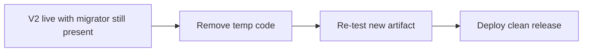

# Phase 08 — Clean release — PRD

**Status:** not started  
**Inherits:** product PRD · live V2 from phase 07

## Goal

Remove **temporary** migration/compat code, build a clean release, **re-prove** it, and deploy that clean build — legacy **data** may still remain.

## Why this phase exists

Deleting scaffolding **changes the binary**. Old offline proof does not automatically cover the new tree. Cleanup is a real release, not a drive-by delete.

## In scope

- Prove nothing still needs migrator entrypoints  
- Delete temp migrator, shadow-only paths, dead compat  
- Keep permanent fence/V2 laws  
- Full or targeted re-test of new artifact  
- Deploy clean build; drain old processes  
- Record that cleanup is done  

## Out of scope

- Deleting legacy **bytes** (optional separate action)  
- New feature work  
- Reopening architecture  

## Decisions this phase makes

- Exact files/paths removed  
- Re-test scope (full vs justified subset)  
- Ship clean release  

## Decisions this phase must NOT make

- Silent “tests still pass from before” without re-run  
- Data destruction without separate approval  

## Inputs

- Phase 07 observation OK  
- Deletion checklist from phase 05  
- Live V2 stable  

## Outputs

- Clean source/binary without temp migrator  
- New qualification + live deploy of clean build  

## Success

Production runs V2 **without** migration scaffolding; tests prove it; legacy data retention is an explicit choice, not an accident.

### Diagram

---

[PLAN.md](PLAN.md) · [test-perf.md](test-perf.md) · [Index](../../PLAN.md)
