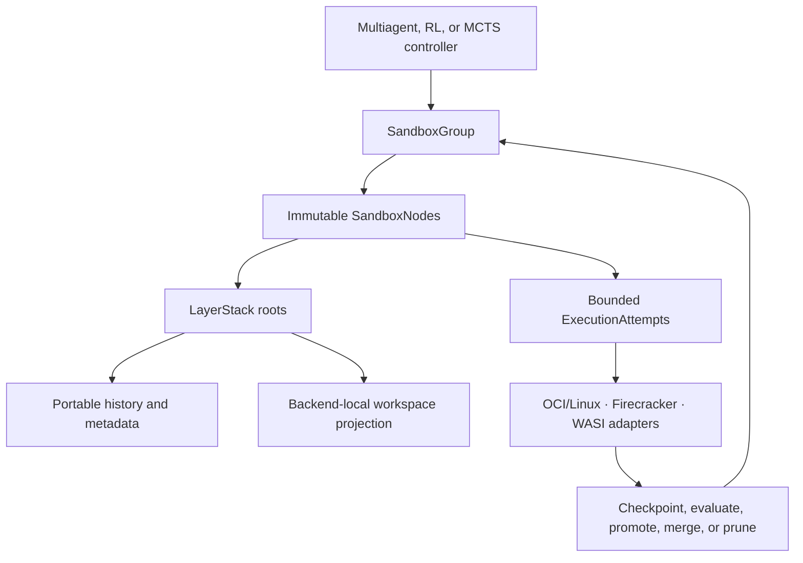

# Ephemeral Sandbox 2.0 migration

> Abstract and dependency order for the public Ephemeral Sandbox **0.2.x**
> roadmap. In this directory, “2.0” is an internal migration name; it does not
> change the public release numbering.

| Field | Decision |
| --- | --- |
| Status | Proposed; evidence-gated |
| Main outcome | A durable checkpoint graph over fast, native sandbox execution |
| Phase 1 | Replace LayerStack history storage with a portable CDC/CAS-backed design |
| Phase 2 | Add branch, checkpoint, rollback, bounded rollout, and MCTS |
| Phase 3 | Reuse the same state plane through Firecracker and WASI execution adapters |
| Execution path | Backend adapters: native OCI/Linux, Firecracker microVM, or capability-scoped WASI |
| Phase 1 qualification | One pinned Ubuntu 24.04 Docker environment |

## 1. The migration in one sentence

Ephemeral Sandbox 2.0 first makes LayerStack checkpoints portable, compact,
recoverable, and independent of a running sandbox; it then uses those
checkpoints as the nodes of a durable branch graph that can activate a bounded
number of isolated sandboxes for multiagent work and MCTS rollouts; finally, it
reuses the same state and graph planes through OCI/Linux, Firecracker, and WASI
execution adapters.

The organizing principle is:

> **Persist checkpoint nodes; rent execution only while work is running.**

## 2. Target product model

The durable graph may be large. Only selected nodes become live sandboxes.
A running container, mount, process tree, or workspace session is an execution
detail, not the durable identity of a branch.

## 3. Core abstractions

| Abstraction | Role in 2.0 |
| --- | --- |
| `RootId` | Stable identity of one immutable LayerStack checkpoint |
| `SandboxGroup` | Owns one checkpoint graph and its canonical accepted node |
| `SandboxNode` | Immutable, selectable branch or checkpoint in the graph |
| `ExecutionAttempt` | Temporary activation of one node in one isolated sandbox |
| `Evaluation` | Versioned tests, review, reward, and evidence for a sealed result |
| `Lease` | Protects roots and active work from reclamation |
| `Checkpoint` | Atomically sealed filesystem state, logical state, and provenance |
| `Promotion` | Explicit compare-and-swap advance of the group’s canonical node |
| `Workspace projection` | Verified backend-local representation used for one execution attempt |
| `Portable history` | CDC/CAS-backed retained history used outside the execution hot path |

Three distinctions are essential:

- A **fork** creates branch intent from an immutable node; it does not clone a
  running process or duplicate the parent workspace payload.
- An **activation** creates a temporary sandbox with its own writable state and
  isolation boundary.
- A **checkpoint** seals the result as a new immutable node. It never mutates
  its parent.

## 4. Three main phases

### Phase 1 — LayerStack 2.0 storage

**Goal:** replace whole-file historical LayerStack retention with a portable,
space-efficient checkpoint store while preserving the current native execution
experience.

Phase 1 introduces:

- portable, versioned LayerStack root identity;
- CDC/CAS-backed retained history;
- verified native materialization for active OCI/Linux workspaces;
- immutable publication with OCC and idempotent recovery;
- durable leases, blame, provenance, retention, and garbage collection;
- compatibility with existing LayerStack roots and workspace-session APIs; and
- a unified baseline that measures materialization, mount/remount, squash,
  command, PTY, publication, recovery, memory, and total physical space.

Phase 1 preserves:

- ordinary native files under `/workspace`;
- the current OverlayFS-based OCI/Linux command path;
- existing namespace, command, PTY, stdin, cancellation, and child-reaping
  behavior;
- one private writable upper per active execution; and
- no target-image helper, FUSE filesystem, external database service, or
  required reflink capability.

CDC/CAS is a history and checkpoint representation. It does not replace
OverlayFS, and it does not reconstruct chunks during ordinary command or PTY
I/O.

**Phase 1 exit:** an old or new immutable root can be published, leased,
recovered, garbage-collected, and materialized correctly; warm native execution
remains close to the existing LayerStack baseline; and the storage design has
bounded memory and no correctness dependence on cached state.

### Phase 2 — SandboxGraph, checkpointing, and MCTS

**Goal:** make immutable LayerStack checkpoints the durable branching model for
multiagent development, parallel rollouts, and MCTS.

Phase 2 introduces:

- durable groups, nodes, execution attempts, evaluations, and artifacts;
- branch, checkpoint, activate, retry, rollback, merge, promote, and prune
  workflows;
- one separate isolated sandbox for each active branch;
- a bounded, preferably prewarmed sandbox pool;
- locality-aware reuse of hot LayerStack materializations;
- durable rollout, frontier, policy, reward, and trajectory records; and
- idempotent evaluation and exactly-once accepted MCTS backpropagation.

For MCTS, the durable tree is not a tree of resident containers. Inactive nodes
remain checkpoint records on disk. The scheduler activates only the frontier
allowed by the configured concurrency and resource limits.

Rollback means abandoning or releasing the current attempt and activating a
chosen immutable node. Exact process-memory time travel is not part of the
portable 2.0 core.

**Phase 2 exit:** a large durable graph can run through a fixed-size sandbox
pool; siblings remain isolated; stale promotion cannot overwrite newer work;
retries cannot double-count evaluation or reward; and recovery preserves
frontier leases and selectable nodes.

### Phase 3 — Firecracker and WASI execution

**Goal:** run the same immutable roots and SandboxGraph attempts through
Firecracker microVMs and WebAssembly/WASI without creating backend-specific
storage or checkpoint truth.

Phase 3 reuses without modification:

- the selected CDC/CAS design and versioned root identity;
- manifests, native carriers, packed objects, and indexes;
- publication, OCC, leases, blame, journals, recovery, and garbage collection;
  and
- SandboxGroup, node, attempt, evaluation, promotion, and rollout semantics.

Phase 3 replaces only the execution-facing adapters:

- the current OCI/Linux OverlayFS workspace projection;
- Linux namespace process execution; and
- their mount, process, stream, cancellation, and lifecycle implementations.

The Firecracker adapter prepares an isolated microVM-local workspace and
executes through a guest-control channel. Firecracker memory snapshots may be
worker-local startup accelerators, but never become LayerStack checkpoint
identity or replace filesystem publication.

The WASI adapter exposes a capability-scoped workspace and command/component
execution. It preserves unsupported Linux metadata in LayerStack and reports
backend capability limits explicitly rather than silently claiming Linux,
signal, or PTY parity.

**Phase 3 exit:** one `RootId` can be activated, changed, checkpointed,
recovered, and rolled back through OCI/Linux, Firecracker, or WASI; the same
durable transaction and retention rules apply; backend-local failure cannot
corrupt or advance a root; and inactive nodes require no resident executor.

See the [Phase 3 overview](phase%203/index.md).

## 5. Dependency order

| Order | Milestone | Depends on | Main proof |
| ---: | --- | --- | --- |
| 0 | Freeze current contracts and baseline | Current runtime | Existing behavior and performance are reproducible |
| 1 | Define portable roots and checkpoint semantics | 0 | Roots are deterministic, versioned, and backend-neutral |
| 2 | Build CDC/CAS history beside the current LayerStack | 1 | New metadata matches existing visible filesystem state |
| 3 | Prove native materialization and storage lifecycle | 2 | Warm execution stays native; old leased roots remain usable |
| 4 | Make 2.0 publication authoritative | 3 | OCC, blame, recovery, and GC pass hard correctness gates |
| 5 | Introduce `SandboxGroup` and immutable nodes | 4 | Branches are durable without resident sandboxes |
| 6 | Activate nodes in separate bounded sandboxes | 5 | Sibling isolation and hot-root reuse hold across containers |
| 7 | Add checkpoint, rollback, merge, and promotion workflows | 6 | No lost updates or ambiguous branch state |
| 8 | Add rollout and MCTS coordination | 7 | Retry-safe evaluation and backpropagation survive failure |
| 9 | Default-on migration and compatibility retirement | 8 | Rollback window and production evidence are complete |
| 10 | Freeze backend-neutral workspace and execution contracts | 9 | Existing OCI/Linux behavior fits behind adapters without changing roots |
| 11 | Add the Firecracker adapter | 10 | The same root executes and checkpoints through a microVM |
| 12 | Add the WASI adapter | 10 | The same root executes and checkpoints through declared capabilities |
| 13 | Prove cross-backend equivalence and routing | 11, 12 | Backend changes preserve durable truth and schedule only compatible work |

This order creates one hard boundary:

> Phase 2 may design its schema in parallel, but it must not depend on the new
> storage path until Phase 1 has proven immutable roots, leases, OCC, recovery,
> blame, and native-path performance.

Phase 3 has the same boundary: adapter design may begin earlier, but Firecracker
and WASI runtime integration must not fork the LayerStack format or bypass the
proven Phase 1 and Phase 2 contracts.

## 6. What can run in parallel

| Lane | When it may start | Constraint |
| --- | --- | --- |
| Baseline and benchmark verification | Immediately | Establishes the comparison contract before optimization claims |
| LayerStack storage implementation | After root and compatibility contracts freeze | Rust implementation; no public graph dependency |
| SandboxGraph schema design | During Phase 1 | Design only until Phase 1 semantics stabilize |
| SandboxGraph runtime | After Phase 1 exit | Must consume the proven root, lease, OCC, and recovery contracts |
| MCTS scheduler and evaluator design | Late Phase 1 or early Phase 2 | Runtime integration waits for durable nodes and idempotency |
| MCTS execution | After bounded sandbox activation | Must not create one resident sandbox per durable node |
| Backend adapter contract | During late Phase 2 | Design only until root, attempt, evaluation, and recovery semantics freeze |
| Firecracker adapter | After the backend contract freezes | Reuses the state plane; requires a KVM-capable Linux worker |
| WASI adapter | After the backend contract freezes | Reuses the state plane; capability differences must be explicit |
| Cross-backend routing | After both adapters reach conformance | Must preserve root identity and reject unsupported workloads |

The benchmark lane should finish before approach results are judged. If an
implementation finishes first, its evaluation clock starts only when the
shared baseline and verifier are ready.

## 7. Storage and performance posture

The product optimizes two different lifecycles across every executor:

- **Hot execution:** keep current, active, recently used, and frontier roots in
  native mount-ready form.
- **Cold history:** retain reusable content and metadata compactly, and
  materialize it only when a cold node becomes active.

Total storage must include native hot roots, retained history, every live
private upper, staging, and metadata. CAS bytes alone are never the total.
Near-one-current-copy storage is a settled target after squash, lease release,
and garbage collection—not a promise during active parallel edits or
publication.

Priority order for evaluation:

1. correctness, isolation, OCC, leases, blame, and recovery;
2. materialization, mount/remount, squash, command, and PTY speed;
3. total physical storage;
4. bounded memory and operational simplicity;
5. portability expansion.

No execution backend may select a different CDC algorithm or packed layout.
The Phase 1 choice remains versioned and shared by OCI/Linux, Firecracker, and
WASI.

## 8. Migration posture

The migration is additive and evidence-gated:

1. read existing roots through a compatibility path;
2. generate 2.0 metadata beside current publication;
3. compare old and new roots before new reads become authoritative;
4. enable 2.0 publication for opted-in groups;
5. keep the old reader through a rollback window; and
6. retire the compatibility path only after usage and recovery evidence show
   it is safe.

The existing workspace-session API becomes a compatibility execution handle.
New functionality belongs to the graph model so that the compatibility layer
does not become a second architecture.

## 9. Explicit non-goals for this migration

- CRIU or instruction-exact process rollback;
- nested workspace sessions as the public branching model;
- one permanently resident container or VM per durable node;
- FUSE, JuiceFS, a CAS-backed VFS, or per-read CAS reconstruction;
- required reflink, host-kernel customization, loop devices, or target-image
  utilities in the shared LayerStack path;
- an external database service or SQLite dependency in the storage core;
- automatic semantic conflict resolution;
- distributed or remote CAS in the first implementation;
- Firecracker VM-memory snapshots as LayerStack checkpoint truth;
- instruction-exact process migration between OCI, Firecracker, and WASI;
- implicit Linux PTY, signal, namespace, or syscall parity on WASI;
- production Firecracker or WASI execution in the initial Ubuntu 24.04
  qualification; and
- broad host or image matrices before the initial Docker path is proven.

The logical root format remains backend-neutral so Firecracker and WASI
qualification can be added without changing checkpoint identity.

## 10. Source authority and superseded direction

The current source of product intent is the public roadmap:

- [Overview](https://ephemeral-sandbox.com/roadmap)
- [System design](https://ephemeral-sandbox.com/roadmap/system-design)
- [CDC storage](https://ephemeral-sandbox.com/roadmap/content-defined-chunking)
- [Product specification](https://ephemeral-sandbox.com/roadmap/product-spec)
- [Delivery plan](https://ephemeral-sandbox.com/roadmap/delivery-plan)

The local [0.2.0 PRD](../../0.2.0/PRD.md) remains useful supporting context.
Where its release slicing differs from the newer public roadmap, the public
roadmap’s dependency order wins.

The older [reflink-backed LayerStack 2.0 proposal](../layerstack_2.0/README.md)
is not the implementation authority for this migration. It is retained as
historical research and may inform correctness or recovery work, but required
reflink behavior and SQLite-backed design do not define the new portable
storage foundation.

## 11. Follow-on specifications

This index intentionally stops at the abstraction and migration order. The
next documents should separately define:

1. Phase 1 storage and compatibility specification;
2. Phase 1 benchmark and acceptance specification;
3. Phase 2 SandboxGraph and checkpoint specification;
4. Phase 2 bounded sandbox activation specification;
5. Phase 2 rollout and MCTS specification;
6. [Phase 3 portable execution overview](phase%203/index.md);
7. Phase 3 backend-neutral adapter and filesystem-semantics specification;
8. Phase 3 Firecracker adapter specification;
9. Phase 3 WASI adapter specification; and
10. production migration, rollback, and observability specification.

No Phase 2 or Phase 3 implementation should begin from this overview alone.
