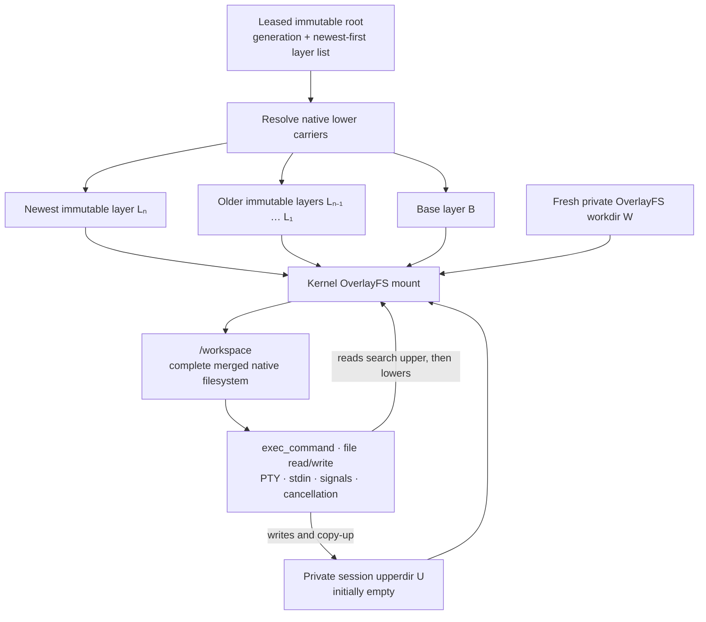
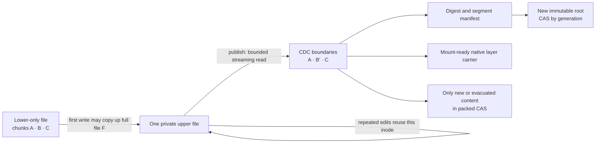
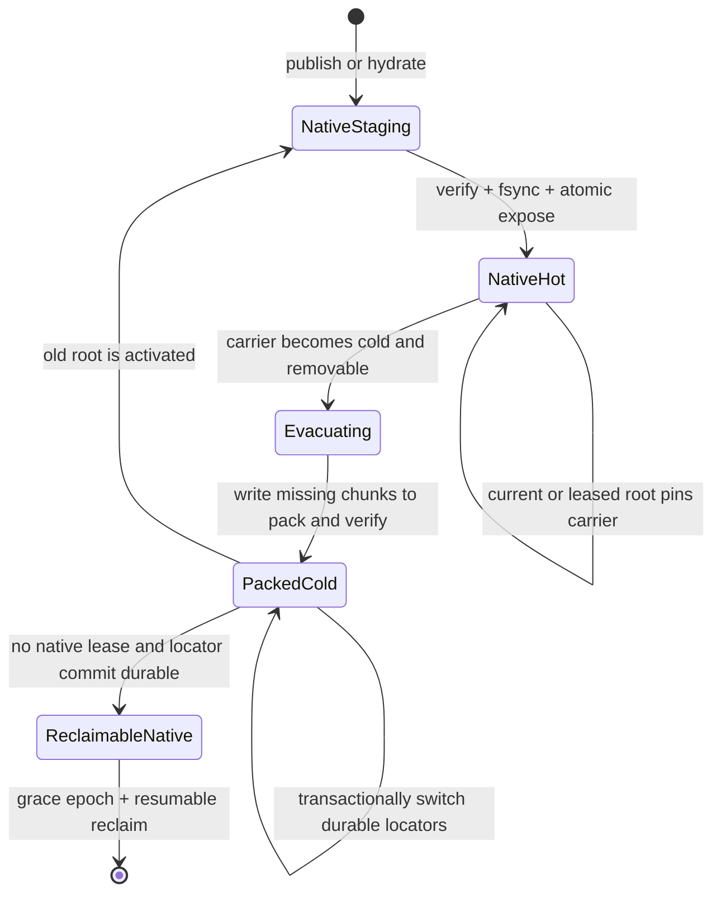
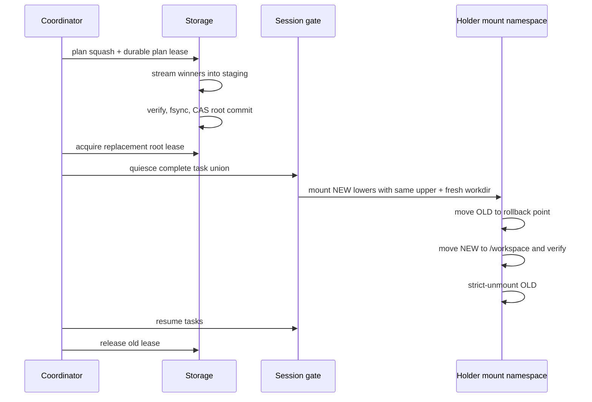

# LayerStack 2.0 CDC/CAS space, time, and materialization specification

> Normative Phase 1 requirements for the storage implementation and its
> benchmark. This document refines the
> [Phase 1 overview](index.md); correctness remains a hard prerequisite.

| Field | Requirement |
| --- | --- |
| Product implementation | Rust, embedded in the Ephemeral Sandbox binary |
| Benchmark orchestration and verification | Python |
| Initial qualification environment | One pinned Ubuntu 24.04 Docker image |
| Execution filesystem | Native OverlayFS over ordinary Linux directories |
| Historical representation | Versioned CDC manifests and content-addressed storage |
| External services | None |
| Required host or target-image packages | None |
| Required reflink, FUSE, kernel module, sidecar, or SQLite | None |
| Fast benchmark wall-clock limit | 5 minutes for one paired raw-baseline + candidate evaluation, including run setup and settled measurement |

## 1. Decision and scope

LayerStack 2.0 keeps the existing native OverlayFS execution model. CDC/CAS
replaces whole-file retention for immutable history; it does not replace the
live workspace filesystem.

The design has two activation paths:

- **warm activation:** lease an already native lower stack and mount it;
- **cold activation:** reconstruct missing native lower carriers from CDC/CAS,
  verify and expose them atomically, then use the same warm mount path.

`/workspace` must expose the complete merged filesystem in both cases. Complete
visibility does **not** require copying every merged file into a new directory
when a session starts. OverlayFS supplies the complete namespace from immutable
lower directories plus the session's private upper directory.

The storage engine is successful only if it:

1. preserves all existing LayerStack behavior;
2. keeps warm materialization, mount/remount, command, and PTY performance close
   to the current raw LayerStack;
3. reduces retained historical payload without hiding native active storage;
4. converges toward one native current representation plus unique retained
   history, rather than permanently storing both a native and CAS copy of all
   current bytes; and
5. uses bounded working memory and disk-backed durable state.

## 2. Normative architecture

### 2.1 Overlay materialization and execution

The immutable lower paths are ordered newest first, matching the current
LayerStack and OverlayFS mount implementation.



The mounted view is logically:

```text
/workspace =
    private upper U
    over immutable lowers [L_n, L_n-1, ..., L_1, B]
```

The following must remain true:

- a clean session creates no workspace-sized payload copy;
- each session has an independent upper and work directory;
- commands read and write ordinary native files;
- no command, file read, PTY operation, or `write_stdin` call reconstructs CAS
  objects;
- no target-image utility participates in mounting or execution; and
- a first write to a lower-only file may cause OverlayFS to copy the complete
  resulting file into that session's upper directory.

CDC cannot remove the last behavior. It reduces immutable history after
publication; it does not turn the active upper directory into a byte-patch
store.

### 2.2 Read, edit, and publish flow



For ten edits before one publication, the session still contains one copied-up
upper file. For ten publications, LayerStack retains ten root transitions, but
unchanged chunks must be shared by identity rather than stored ten times in
cold history.

Publication must scan only the captured upper and required metadata. It must
not scan or materialize the entire merged workspace.

### 2.3 Hot and cold carrier lifecycle

To avoid a permanent `2L` design, a chunk identity may be backed by a verified
extent in an immutable native carrier while that carrier is hot. It need not
also occupy a CAS pack immediately.



The point of no return for evacuation is the durable locator transaction.
Before that point, the native carrier remains authoritative. After that point,
the verified pack is authoritative and native deletion is retryable.

Cold activation must follow this order:

1. acquire a durable root lease;
2. resolve every segment through the disk-backed locator/index;
3. stream into a unique staging carrier with bounded buffers;
4. restore sparse extents, metadata, symlinks, hardlinks, whiteouts, and opaque
   directories;
5. verify bytes and manifest identity;
6. `fsync` files and directories;
7. atomically expose the carrier;
8. acquire its native-carrier lease before returning its path; and
9. create the private upper/work directories and mount OverlayFS.

A failure before exposure removes or journals staging. A crash after exposure
is recovered idempotently from disk. A partial carrier must never be returned
as a lower path.

### 2.4 Squash and live remount

Squash remains a storage operation independent of the live namespace switch.
It constructs a compact mount-ready lower representation and commits a new
immutable root before remount begins.



The existing quiesce, point-of-no-return, rollback, and fail-closed behavior is
unchanged. CDC/CAS work must finish before the short frozen interval. No
chunking, pack lookup, hydration, or GC is allowed while tasks are frozen.

## 3. Space model

### 3.1 Required accounting

At time `t`, total physical LayerStack storage is:

```text
T(t) =
    L_hot(t)
  + H_cold(t)
  + Σ U_active(t)
  + P_staging(t)
  + M(t)
```

| Term | Included physical allocation |
| --- | --- |
| `L_hot` | Unique allocated blocks in all mount-ready immutable native carriers, including current and old leased roots |
| `H_cold` | Unique packed historical payload not already counted as a required hot native representation |
| `Σ U_active` | Allocated bytes and filesystem metadata for every live private upper directory |
| `P_staging` | Publication, hydration, squash, packing, compaction, workdir, trash, and quarantine bytes not yet settled |
| `M` | Manifests, indexes, path records, blame, leases, OCC state, journals, receipts, roots, GC cursors, and recovery state |

CAS bytes alone are never reported as total LayerStack storage.

The verifier must use allocated physical bytes, not only apparent file length.
It must:

- count hardlinked physical extents once;
- count sparse holes as zero payload;
- report filesystem allocation-unit rounding;
- report pack slack and unreachable pack bytes;
- measure staging, trash, and quarantine before and after settled GC;
- report Docker/container writable-layer bytes outside the LayerStack domain
  separately; and
- report operating-system page cache separately from application RSS.

### 3.2 Ideal settled denominator

For a fixed retention and lease set:

```text
D_ideal = C_current + H_unique
```

Where:

- `C_current` is the physical allocation of one correct native materialization
  of the current root; and
- `H_unique` is the unique retained historical payload needed to reconstruct
  leased or retained roots but absent from `C_current`.

The principal storage metric is:

```text
settled_amplification = T_settled / D_ideal
```

`T_settled` is measured only after publication staging is gone, compaction and
GC have reached durable idle cursors, grace-eligible trash is reclaimed, and
only the declared roots and leases remain.

This yields the desired settled shape:

```text
T_settled ≈ C_current + H_unique + metadata
```

It is not a promise that every instant uses `1L`:

- a modified active session may hold a complete copied-up file;
- `N` independently modified sessions may hold `N` private copies;
- hydration temporarily adds a native output while cold history remains;
- publication or squash may require one bounded staging representation; and
- old leases may require additional native carriers.

### 3.3 Required space limits

All thresholds are evaluated against the current raw LayerStack and candidate on
the same filesystem, machine, dataset, retention policy, and lease set.

| Requirement | Target | Hard failure |
| --- | ---: | ---: |
| Settled amplification, mixed and no-dedup corpora of at least 512 MiB | `≤ 1.08 × D_ideal` | `> 1.15 × D_ideal` |
| Settled amplification, many-small-file corpus | `≤ 1.15 × D_ideal` | `> 1.25 × D_ideal` |
| Pack slack after settled compaction | `≤ 2%` | `> 5%` |
| Unreachable unleased payload after settled GC | `0`, except declared grace/quarantine | Any unexplained retained payload |
| Avoidable native-plus-pack duplication after settled GC | `≤ 1%` of retained payload | `> 3%` |
| Publication peak above pre-publish total | At most one captured upper payload plus 5% | More than one unexplained full-payload copy |
| Hydration peak above pre-hydration total | Native output size plus 5% | More than one unexplained native output copy |
| Empty clean session payload growth | `0` payload bytes | Any lower/workspace payload clone |
| Per-session clean state | Constant-size directories, lease, and journal records | Growth with workspace bytes |

The target is more important than the hard ceiling. A candidate between them
requires an explicit exception and evidence that a competing implementation
cannot meet the target without violating a higher-priority correctness or time
gate.

### 3.4 Workload-specific space behavior

| Workload | Required behavior |
| --- | --- |
| Clean session fork | Zero new lower payload; `O(1)` metadata per session |
| First tiny edit to lower-only file of size `F` | Active upper may grow by approximately `F`; this is reported, not attributed to CDC |
| Repeated edits before one publish | One active upper file, not one version per edit |
| Repeated small edits across publishes | New cold payload is bounded by changed CDC regions plus metadata, not another full `F` per root |
| Rename with unchanged bytes | Path/root/blame metadata changes; content payload is reused |
| Full rewrite, compressed, or encrypted content | Up to `O(F)` new unique payload is expected and accepted |
| Sparse file | Extent map and non-hole bytes are retained; holes are not materialized as zero-filled CAS chunks |
| Duplicate files | Content may deduplicate, while path metadata, hardlink identity, and blame remain separate |
| `N` modified active sessions | `Σ U_active` may approach `N × F`; the benchmark must expose this cost |

For a small localized edit to a sufficiently large, CDC-friendly file, the new
unique content for one published version should be bounded by:

```text
new_unique_bytes
    ≤ changed_bytes + 2 × configured_max_chunk + segment_overhead
```

This is a target, not a correctness assumption. Boundary changes can make the
observed value larger; any larger result must be reported, and a result near
`F` falsifies the candidate's small-edit storage hypothesis.

### 3.5 Index and metadata budgets

The implementation must pack small objects and page indexes from disk. The
following are format budgets measured after settling:

| Item | Budget |
| --- | ---: |
| Chunk record, footer, and global lookup index | `≤ 96 bytes` amortized per chunk |
| File segment reference | `≤ 64 bytes` amortized per segment |
| Root/path structural record | `≤ 256 bytes + encoded path length` amortized per changed path |
| Settled journal and recovery residue | `≤ 1 MiB + min(1% of retained payload, 64 MiB)` and no pending transaction |

Blame is measured separately and cannot be omitted to meet a metadata budget.
If blame dominates the budget, the report must show its bytes per changed line,
path transition, and root.

## 4. Time model

### 4.1 Complexity requirements

Let:

- `U` be captured upper bytes;
- `E` be captured filesystem entries;
- `K` be generated chunks;
- `R` be bytes missing from a requested native materialization;
- `D` be mounted lower-layer depth;
- `Q` be changed paths used by OCC/blame; and
- `N` be entries in the relevant disk-backed index; and
- `G` be objects visited by one bounded GC slice.

| Operation | Required time complexity | Hot-path restriction |
| --- | --- | --- |
| Warm root resolution | `O(D)` | No file-content reads and no CAS payload reads |
| Clean session creation | `O(D)` plus namespace/mount syscalls | Independent of merged workspace bytes |
| `exec_command`, file read/write, PTY, stdin | Native filesystem/process cost | No CAS, manifest, or per-file RPC lookup |
| Publish/capture | `O(U + E + K)` streaming | Must not scan merged lower tree |
| CDC chunking | `O(U)` | Fixed-size window and buffers |
| Native cold hydration | `O(R + E)` streaming | Occurs before exposure and execution |
| Root diff/OCC/blame | `O(Q log N)` or bounded sequential page scans | Disk-backed; no full-root buffering |
| Squash | `O(bytes and entries in selected layer run)` | Build outside quiesced interval |
| Remount frozen interval | `O(D + task/fd proof)` | No CDC, hydration, packing, or GC |
| GC | `O(G)` per resumable slice | Fixed slice, queue, and cursor budgets |

Small edits to a large copied-up file may still require `O(F)` publication read
time because OverlayFS presents the resulting full upper file. CDC is expected
to reduce new historical bytes, not magically make the source scan `O(edit)`.

### 4.2 Latency and throughput acceptance

No trustworthy absolute millisecond baseline has yet been recorded for the new
unified benchmark. Therefore the first benchmark lane must freeze the current
raw LayerStack numbers on the same hardware before a candidate is judged.

For latency, define:

```text
allowed(baseline, percent, floor)
    = baseline × (1 + percent) + floor
```

The additive floor prevents sub-millisecond measurement noise from producing a
false regression.

| Operation | Required candidate result |
| --- | --- |
| Warm root resolve + session preparation | p50 and p95 `≤ baseline + 5% + 2 ms`; zero CAS payload reads |
| OverlayFS mount | p50 and p95 `≤ baseline + 5% + 2 ms` |
| Squash live-remount frozen interval | p50 and p95 `≤ baseline + 5% + 2 ms` |
| Full squash plan/build/commit | p50 and p95 `≤ baseline + 10% + 5 ms` |
| No-op `exec_command` | p50 and p95 `≤ baseline + 3% + 0.5 ms` |
| Native command throughput | At least `97%` of baseline |
| PTY create | p50 and p95 `≤ baseline + 3% + 1 ms` |
| PTY resize, signal, stdin, EOF, and drain | p50 and p95 `≤ baseline + 3% + 0.5 ms` |
| Native sequential file read/write throughput | At least `97%` of baseline |
| Concurrent disjoint publication throughput | At least `90%` of baseline while preserving OCC |
| Small-edit publish | p95 `≤ baseline + 15% + 5 ms`; report bytes scanned and bytes newly retained |
| Cold hydration | Verified payload throughput at least `70%` of a same-filesystem native sequential-copy control |
| Cold activation end to end | p95 no more than `1.5 ×` verified native-copy control plus the warm-mount allowance |

The benchmark must also report p99 where at least 100 samples exist, median
absolute deviation, sample count, operations per second, and bytes processed.
The hard gate uses p50 and p95; p99 is diagnostic in the five-minute run.

A materialization result is invalid if Docker container creation, image pull, or
unrelated setup is silently included in one candidate but not another. Report
these intervals separately:

1. Docker/container startup;
2. root lease and native-carrier resolution;
3. cold hydration, if any;
4. upper/work creation;
5. namespace creation;
6. OverlayFS mount;
7. first successful command; and
8. end-to-end session readiness.

### 4.3 Scale requirements

The benchmark must vary root size and layer depth while holding configured
concurrency constant.

The candidate fails if:

- warm activation or command latency grows with logical workspace bytes;
- a warm path reads CAS payload;
- mount/remount cost has a worse depth slope than the raw baseline by more than
  10%;
- cold hydration has superlinear byte or entry cost;
- publish scans unchanged lower trees;
- equivalent settled cycles show monotonically worsening latency;
- a background packer or GC pause enters command/PTY critical paths; or
- an operation exceeds three minutes.

## 5. Bounded-memory requirement

The storage architecture may retain no file, chunk, tree, root, or history in
application RAM. It may use only configured working buffers:

```text
memory =
    O(chunk_window
      + read_buffers
      + write_buffers
      + workers × worker_buffer
      + queue_capacity
      + index_page_budget)
```

After limits are configured, memory must be `O(1)` with respect to stored bytes,
files, chunks, roots, history depth, and lease count beyond the configured
concurrency limit.

Every run must record:

- maximum chunk window;
- read and write buffer sizes;
- workers and queue capacity;
- disk-index page/cache budget;
- per-session memory budget;
- process baseline, peak, and final RSS;
- operating-system page cache separately;
- behavior at every limit;
- cancellation cleanup; and
- panic, `ENOSPC`, and restart cleanup.

The candidate fails on proportional or monotonic RSS growth, an unbounded queue
or cache, full-file/full-tree buffering, cache-dependent correctness, or loss of
durable GC/OCC/lease/recovery state after restart.

## 6. Unified benchmark contract

The shared runner belongs under:

```text
/Users/yifanxu/Ephemeral-AI-Lab/
  ephemeral-sandbox-layerstack-2-experiment/benchmark/
```

Product operations are Rust. Python owns setup, deterministic workloads,
measurement, verification, result validation, and comparison. Python must not
reimplement candidate storage behavior.

The raw baseline and every approach must expose the same semantic adapter:

```text
capabilities()
reset()
seed_root(dataset)
acquire_lease(root)
release_lease(lease)
create_session(root, lease)
materialize(root)
mount(session)
exec_command(session, request)
pty_create(session, request)
pty_resize(command, size)
pty_signal(command, signal)
write_stdin(command, bytes_or_eof)
publish(session, base_root, generation, request_id)
squash(root_range)
remount(session, replacement_root)
gc(retention, grace_epoch)
measure_storage()
recover()
teardown()
```

An approach may reuse existing LayerStack functions internally. It may not omit
or redefine an operation to improve its result. Every result record must state
whether the operation was a baseline, warm candidate, or cold candidate path.

### 6.1 Pinned workload

Use one Ubuntu 24.04 image and pre-generated deterministic data:

| Corpus | Minimum useful content | Purpose |
| --- | --- | --- |
| Mixed tree | 512 MiB, at least 20,000 files | Warm activation, mount, command, metadata, total space |
| Large source file | 256 MiB, deterministic line records | Tiny line edits, insertions, repeated capture, rechunk locality |
| No-dedup binary | 512 MiB deterministic pseudorandom bytes | Representation overhead without dedup benefit |
| Many small files | At least 100,000 files within the time budget | Index, footer, pack, and directory overhead |
| Sparse file | At least 8 GiB logical with bounded allocated extents | Sparse preservation and honest physical accounting |

Run tiny edits, line insertion/deletion, repeated patches, rename, append,
full rewrite, compressed data, duplicate files, concurrent old/current leases,
disjoint publication, conflict, squash, remount, cold hydration, and GC.

### 6.2 Five-minute schedule

One invocation contains an interleaved raw-baseline run and one candidate run;
the pair shares the same system fingerprint, seed, corpus, operation counts,
retention, leases, and concurrency. The timer starts after build artifacts and
deterministic datasets are ready, but includes capability checks, run-directory
setup, resets, cleanup, and report validation.

If an approach is ready before the shared runner and baseline, its evaluation
clock does not start until both are available.

| Time | Work |
| --- | --- |
| `0:00–0:30` | Capability checks, reset, correctness smoke, baseline/candidate identity |
| `0:30–1:30` | Warm materialization, mount, command, native file I/O, PTY, and stdin |
| `1:30–2:45` | Small edits, repeated publish, no-dedup pressure, OCC, and lease churn |
| `2:45–4:15` | Squash, frozen remount interval, cold hydration, crash/recovery, and bounded GC |
| `4:15–5:00` | Settle, final RSS/storage, invariant checks, JSON and report validation |

No phase may exceed 90 seconds and no individual operation may exceed 60
seconds. Use continuous operations rather than sleeps. Use event synchronization,
deterministic failpoints, logical/test lease clocks, fixed worker counts, and
pre-generated inputs. A mandatory operation that cannot finish inside the
contract is a failed result, not a reason to omit the operation.

### 6.3 Required outputs

Each run must emit machine-readable raw samples and a summary containing:

- build, format, chunker, digest, segment, index, and metadata versions;
- hardware, filesystem, Docker, kernel, image digest, and deterministic seed;
- exact configuration and memory bounds;
- operation timestamps and phase durations;
- p50, p95, optional p99, variance statistic, count, throughput, and bytes;
- CAS reads and bytes on every timed path;
- all terms of `T(t)` before publish, at peak, before GC, and after settled GC;
- `C_current`, `H_unique`, `D_ideal`, and settled amplification;
- logical, apparent, allocated, sparse, hardlink, pack-slack, staging, trash,
  quarantine, index, manifest, blame, journal, and active-upper bytes;
- baseline, peak, and final RSS plus page-cache observations;
- queue depth, workers, descriptors, cancellation cleanup, and recovery state;
- correctness/invariant gate results; and
- explicit `measured`, `derived`, `estimated`, or `unknown` evidence labels.

## 7. Pass/fail order

Evaluate in this order:

1. filesystem, namespace, OCC, lease, blame, recovery, and GC correctness;
2. bounded-memory compliance;
3. absence of CAS work on command, file, and PTY hot paths;
4. warm materialization, mount/remount, squash, command, and PTY time gates;
5. total settled and peak physical space gates; and
6. cold hydration and background-maintenance performance.

Never average a correctness or memory failure into a performance score.

Phase 1 is blocked if the selected CDC/CAS design:

- makes warm session activation depend on workspace bytes;
- adds a required execution-time CAS/VFS path;
- permanently stores both a complete native and packed CAS copy of current
  content without a measured lease/retention reason;
- reports CAS size instead of total storage;
- cannot reconstruct an old leased root deterministically;
- cannot settle staging, trash, journals, GC, and compaction after restart; or
- misses the five-minute unified contract.

## 8. Interpretation

The desired common case is:

```text
clean session start:
    time  ≈ namespace + OverlayFS mount
    space ≈ constant per-session metadata

warm execution:
    time  ≈ current raw LayerStack
    space = current native lowers + private active uppers

settled retained history:
    space ≈ one native current materialization
          + unique historical content
          + bounded-format metadata

cold old-root activation:
    time  ≈ bytes that must be reconstructed
          + verification
          + ordinary warm mount
```

This is the Phase 1 optimization boundary. Branching and MCTS may create many
logical roots later, but they must consume these root, lease, materialization,
and accounting semantics rather than weaken them.
