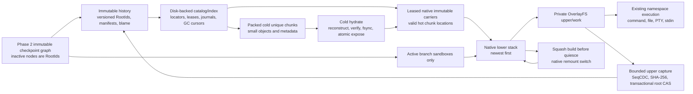

# Phase 1 storage solution examination: StreamCDC versus SeqCDC

This review is a read-only architecture decision. It compares only the two
specified internal implementations and holds the native-carrier, CAS, digest,
manifest, pack, index, transaction, recovery, and collection design constant.
No production implementation is implied by a source-level pass.

Evidence labels used throughout:

- `published`: a claim reported by a primary paper or its authors.
- `source-verified`: a claim checked against the pinned source, current product
  source, or a reproducible source-audit result.
- `inferred`: a design consequence or estimate that has not yet been measured
  in the integrated product.
- `unknown`: evidence is still required; the text must not be read as a pass.

## 1. Decision

**Decision: SeqCDC.**

`source-verified` — The selected algorithm is **not** the
`puntakana/seqcdc-rs` file wrapper. `inferred` — the selected production form is
a small internal, safe, scalar Rust implementation that must match the authors'
increasing-mode boundary semantics and expose only a bounded borrowed-chunk
callback/iterator.

The fixed format parameters are:

| Field | Value |
| --- | ---: |
| Algorithm ID | `seqcdc-scalar-author-v1` |
| Operation mode | increasing |
| Minimum chunk | 8,192 bytes |
| Target/evidence average | 16,384 bytes |
| Maximum chunk/window | 32,768 bytes |
| Consecutive-sequence threshold | 5 |
| Opposing-slope jump trigger | 50 |
| Jump size | 512 bytes |
| Content digest | domain-separated SHA-256 |

`source-verified` — These SeqCDC parameters are the authors' published 16 KiB
configuration, including a 32 KiB input buffer. The matching FastCDC evidence
configuration uses the same 8/16/32 KiB declared bounds, so the decision does
not give either candidate a larger allowed chunk range:
[SeqCDC configuration](https://github.com/UWASL/dedup-bench/blob/8e2697cbf6332ac5da6dc615bfab82a720e820e4/build/config_16kb_middleware24/seqcdc_16kb.conf) and
[FastCDC configuration](https://github.com/UWASL/dedup-bench/blob/8e2697cbf6332ac5da6dc615bfab82a720e820e4/build/config_16kb_middleware24/fastcdc_16kb.conf).

`source-verified` — The authors' boundary loop does not use
`avg_block_size`; 16 KiB is therefore a target and evidence label, not an
input to the SeqCDC cut loop. Equal **effective** average remains a mandatory
measurement before enablement.

`inferred` — The user's latest requirement accepts the published worst observed
13.9% increase in stored fraction versus the paper's DedupBench FCDC baseline,
provided every Phase 1 correctness, total-space, and bounded-memory gate still
passes. That baseline is not byte-for-byte equivalent to the proposed pinned
StreamCDC implementation. The decision is therefore an explicit, conditional
product preference for SeqCDC's smaller projected portable core and its
published speed hypothesis—not a claim that it won the evidence-adjusted score.

## 2. Decision confidence

**Decision confidence: medium.**

StreamCDC receives `0.85`: `source-verified` — its maintained Rust source
already contains a synchronous `Read` implementation and stream-parity
fixtures, although the proposed borrowed-output adapter and common LayerStack
storage system remain unimplemented. SeqCDC receives `0.70`: `source-verified`
— it has sound authors' source and credible published evidence, but the
bounded Rust streaming form is entirely proposed and the audited derivative is
not boundary-identical. Neither has LayerStack-specific end-to-end evidence.

Medium does not mean production-ready. Implementation may proceed behind a
format/feature gate; production enablement remains blocked on differential
boundary tests and the unified five-minute correctness, space, memory,
recovery, and performance contract in the Phase 1 specification.

## 3. Current LayerStack facts verified against source

| Current fact | Finding and evidence |
| --- | --- |
| Lower ordering | `source-verified` — immutable lowers are supplied newest first. Publication prepends the new layer and projection/mount preserve that ordering. `/Users/yifanxu/Ephemeral-AI-Lab/ephemeral-sandbox/crates/sandbox-runtime/layerstack/src/stack/ops/publish.rs:105`, `/Users/yifanxu/Ephemeral-AI-Lab/ephemeral-sandbox/crates/sandbox-runtime/layerstack/src/stack/projection/mod.rs:89`, and `/Users/yifanxu/Ephemeral-AI-Lab/ephemeral-sandbox/crates/sandbox-runtime/overlay/src/kernel_mount.rs:38`. |
| Native workspace | `source-verified` — a session mounts immutable native lowers with one private native upper and work directory. A clean session creates those constant-size paths; it does not clone the merged payload. `/Users/yifanxu/Ephemeral-AI-Lab/ephemeral-sandbox/crates/sandbox-runtime/workspace/src/lifecycle/create.rs:107` and `/Users/yifanxu/Ephemeral-AI-Lab/ephemeral-sandbox/crates/sandbox-runtime/overlay/src/kernel_mount.rs:36`. |
| First and repeated writes | `inferred` — normal kernel OverlayFS copy-up can put a complete lower-only regular file into the private upper on its first write. Later unpublished edits address that same upper file rather than making history versions. This follows the native mount design, but the repository has no direct large-file copy-up accounting test; it must be measured rather than attributed to CDC. |
| Publication input | `source-verified` — capture walks the private upper, not the complete merged workspace. The current implementation accumulates captured tree metadata in memory, which Phase 1 must replace with bounded external ordering. `/Users/yifanxu/Ephemeral-AI-Lab/ephemeral-sandbox/crates/sandbox-runtime/workspace/src/service/impls/capture_changes.rs:21` and `/Users/yifanxu/Ephemeral-AI-Lab/ephemeral-sandbox/crates/sandbox-runtime/workspace/src/overlay/capture.rs:104`. |
| Current immutable format | `source-verified` — current publication stages a raw native layer, fsyncs it, renames it, and performs final head validation. Current layer identity is not yet a content manifest over typed chunks. `/Users/yifanxu/Ephemeral-AI-Lab/ephemeral-sandbox/crates/sandbox-runtime/layerstack/src/stack/ops/publish.rs:55` and `/Users/yifanxu/Ephemeral-AI-Lab/ephemeral-sandbox/crates/sandbox-runtime/layerstack/src/stack/layer/write.rs:9`. |
| Squash | `source-verified` — squash plans, builds, and commits replacement immutable native layers before remount. Regular-file winners are hard-linked from immutable sources when possible. `/Users/yifanxu/Ephemeral-AI-Lab/ephemeral-sandbox/crates/sandbox-runtime/layerstack/src/stack/squash.rs:123`, `:134`, and `:142`; `/Users/yifanxu/Ephemeral-AI-Lab/ephemeral-sandbox/crates/sandbox-runtime/layerstack/src/stack/squash/flatten.rs:9`. |
| Live remount | `source-verified` — remount retains the private upper, creates a fresh work directory and staged mount, quiesces, uses mount moves, verifies the mount identity, and fails closed on uncertain partial-switch states. `/Users/yifanxu/Ephemeral-AI-Lab/ephemeral-sandbox/crates/sandbox-runtime/workspace/src/lifecycle/remount.rs:1`. `unknown` — crash tests do not yet cover every point between the two mount moves. |
| Native execution | `source-verified` — command, file, PTY, stdin, cancellation, and reaping operate through the mounted native filesystem and namespace holder. CDC/CAS is absent from these hot paths. `/Users/yifanxu/Ephemeral-AI-Lab/ephemeral-sandbox/crates/sandbox-runtime/operation/src/command/service/exec_command.rs:67`, `/Users/yifanxu/Ephemeral-AI-Lab/ephemeral-sandbox/crates/sandbox-runtime/namespace-execution/src/pty.rs:51`, and `/Users/yifanxu/Ephemeral-AI-Lab/ephemeral-sandbox/crates/sandbox-runtime/namespace-process/src/runner/setns/file_op.rs:33`. |
| stdin/signal surface | `source-verified` — today's public stdin operation treats control-C/control-D as cancellation behavior; it does not expose a general PTY signal, resize, or literal EOF API. Phase 1 preserves the actual surface and must not claim missing operations were preserved. `/Users/yifanxu/Ephemeral-AI-Lab/ephemeral-sandbox/crates/sandbox-runtime/operation/src/command/service/write_command_stdin.rs:38`. |
| Existing boundedness gaps | `source-verified` — namespace and sessionless read paths currently read a complete file before truncating returned output; edit has an 8 MiB cap, but audit/blame state includes resident maps/vectors. These are common Phase 1 fixes, not chunker advantages. `/Users/yifanxu/Ephemeral-AI-Lab/ephemeral-sandbox/crates/sandbox-runtime/namespace-process/src/runner/setns/file_op.rs:104`, `/Users/yifanxu/Ephemeral-AI-Lab/ephemeral-sandbox/crates/sandbox-runtime/operation/src/layerstack/service/impls/read.rs:13` and `:32`, and `/Users/yifanxu/Ephemeral-AI-Lab/ephemeral-sandbox/crates/sandbox-runtime/operation/src/file/service/store.rs:92`. |
| Durability gaps | `source-verified` — current leases/substitutions are primarily process-resident and publication has no durable request-identity journal. Phase 1 must make leases, pins, request identity, recovery cursors, and locator generations durable. `/Users/yifanxu/Ephemeral-AI-Lab/ephemeral-sandbox/crates/sandbox-runtime/layerstack/src/stack/lease/registry.rs:16` and `/Users/yifanxu/Ephemeral-AI-Lab/ephemeral-sandbox/crates/sandbox-runtime/layerstack/src/stack/lease/rewrite.rs:1`. |

The corrected system boundary is therefore: Phase 1 changes retained immutable
history and its internal capture/materialization machinery; it does not replace
native OverlayFS execution or redefine the existing operation surface.

## 4. Hot/cold and Phase 2 architecture diagram



- `inferred` — warm activation resolves and leases already native lower
  carriers and mounts in `O(D)`; it does not read chunk payload.
- `inferred` — cold activation costs `O(R + E)` sequential reconstruction plus
  bounded index lookups, but exposes no path until digest verification, fsync,
  and atomic rename finish.
- `inferred` — active-upper copy-up is native kernel cost, not retained
  history cost.
- `inferred` — publication performs CDC/CAS outside native execution and outside
  the live-remount frozen interval.
- `inferred` — logical bytes, apparent bytes, allocated blocks, packed bytes,
  and active-upper bytes are reported separately.
- `inferred` — inactive Phase 2 graph nodes retain durable RootIds/pins, not
  resident processes or permanent native workspaces.

## 5. StreamCDC and SeqCDC source audit

Pinned revisions:

- `fastcdc-rs` v4.0.1:
  [`f76938d8c2d77799852415247c9b3e1fd91b73f3`](https://github.com/nlfiedler/fastcdc-rs/commit/f76938d8c2d77799852415247c9b3e1fd91b73f3)
  (`MIT`).
- `seqcdc-rs` v0.1.0:
  [`f1d3e33cb29b08daf27c77aca98261d85e48ba65`](https://github.com/puntakana/seqcdc-rs/commit/f1d3e33cb29b08daf27c77aca98261d85e48ba65)
  (`MIT`; audit reference only).
- authors' DedupBench implementation:
  [`8e2697cbf6332ac5da6dc615bfab82a720e820e4`](https://github.com/UWASL/dedup-bench/commit/8e2697cbf6332ac5da6dc615bfab82a720e820e4)
  (`Apache-2.0`; implementation provenance).
- required audit record:
  [`019f91b6-492d-79f0-8a5b-6e106a8c4c24`](codex://threads/019f91b6-492d-79f0-8a5b-6e106a8c4c24).

### StreamCDC audit

| Required finding | Audit result |
| --- | --- |
| Conventional synchronous v2020 behavior | `source-verified` — the cut loop is mature and the upstream 4/16/65,535 KiB, level-1 profile has boundary and stream-parity fixtures. The scored 8/16/32 KiB, level-2 profile is source-audited but still requires its own product goldens. The loop is in [`src/v2020/mod.rs:350-409`](https://github.com/nlfiedler/fastcdc-rs/blob/f76938d8c2d77799852415247c9b3e1fd91b73f3/src/v2020/mod.rs#L350-L409); upstream fixtures are at [`:995-1018`](https://github.com/nlfiedler/fastcdc-rs/blob/f76938d8c2d77799852415247c9b3e1fd91b73f3/src/v2020/mod.rs#L995-L1018) and [`:1277-1329`](https://github.com/nlfiedler/fastcdc-rs/blob/f76938d8c2d77799852415247c9b3e1fd91b73f3/src/v2020/mod.rs#L1277-L1329). |
| Safe 4/16/64 profile | `source-verified` — 4/16/64 KiB, level 1, seed 0 is safe because all values are even powers of two. It is not required here: the fair published comparison is held at 8/16/32 KiB for both finalists. |
| Scored StreamCDC comparator | `source-verified` — synchronous v2020, 8/16/32 KiB, normalization level 2, seed 0. It matches the paper baseline's declared size/normalization profile, but not its exact Gear table or loop; async and v2016 are not candidates. |
| Odd parameter behavior | `source-verified` — odd values can diverge from v2016; a local differential audit reproduced a v2020 64-byte non-final cut with configured minimum 65. Fixed format validation excludes this entire input class. |
| Async concerns | `source-verified` — async mask construction differs from sync and the audited feature combination has a compile conflict. Async is unnecessary and excluded. |
| Input and returned ownership | `source-verified` — upstream `StreamCDC` owns one `max_size` buffer but allocates/copies each returned `Chunk` into a fresh `Vec<u8>`; see [`:706-763`](https://github.com/nlfiedler/fastcdc-rs/blob/f76938d8c2d77799852415247c9b3e1fd91b73f3/src/v2020/mod.rs#L706-L763) and [`:799-865`](https://github.com/nlfiedler/fastcdc-rs/blob/f76938d8c2d77799852415247c9b3e1fd91b73f3/src/v2020/mod.rs#L799-L865). |
| Retention and queues | `inferred` — collecting owned chunks or placing them on an unbounded queue makes retained memory `O(file size)`. Immediate process/drop is bounded but still allocates and copies. |
| Short reads/errors/final chunk | `source-verified` — upstream fills its buffer across short reads, propagates I/O errors, and emits the remaining final bytes. It does not specially retry `Interrupted`; the internal form will retry only that standard transient error and differential-test all non-error boundaries. |
| Historical stability | `inferred` — format-stamped parameters plus golden boundaries are mandatory; changing implementation, level, seed, or parameters creates a new algorithm version and never rechunks an old root. |

### SeqCDC audit

`source-verified` — The authors compare adjacent bytes after the minimum,
ignore equal-byte comparisons, count increasing runs, and jump after 50
opposing slopes. On reaching a length-5 increasing run, they return
`curr_pos - 1`, leaving the just-inspected boundary byte for the next chunk:
[authors' implementation](https://github.com/UWASL/dedup-bench/blob/8e2697cbf6332ac5da6dc615bfab82a720e820e4/dedup/src/chunking/seq_chunking.cpp#L48-L132).

`source-verified` — The Rust package is not boundary-identical when a jump
fires. It advances by `p + jump_size`, whereas the authors have already
incremented the inspected position and therefore resume at
`p + 1 + jump_size`. The package can also return a cut beyond the supplied
slice through its direct cut-point API, does not validate all zero/ordering
cases, treats its average field as inert, provides no authoritative golden
corpus, and its file helper reads the whole file. See
[`seqcdc-rs/src/chunker.rs:122-224`](https://github.com/puntakana/seqcdc-rs/blob/f1d3e33cb29b08daf27c77aca98261d85e48ba65/src/chunker.rs#L122-L224).
It is therefore rejected as a dependency and as a boundary oracle.

The internal SeqCDC form differs as follows:

1. `source-verified` — the authors' C++ semantics, not the Rust wrapper's skip,
   are the oracle.
2. `inferred` — a 32 KiB circular window is filled before scanning; EOF may
   make the final window shorter. Short input below 8 KiB emits as one chunk.
3. `inferred` — logically, only the previous byte and the already-inspected
   boundary byte are required around a scan/cut. The ring retains the complete
   suffix, so boundary state survives arbitrary input read fragmentation.
4. `inferred` — a cut returns two borrowed ring slices at most and is valid only
   during the caller's synchronous hash/write callback. It cannot be retained.
5. `inferred` — skip arithmetic is checked; moving past the scan window ends
   the search and returns the window length, exactly as the authors' loop does.
   A cut greater than available bytes is an internal invariant failure.
6. `inferred` — fixed configuration plus constructor validation rejects zero
   thresholds/triggers, unsafe addition, invalid size ordering, and a maximum
   different from 32 KiB.
7. `inferred` — byte-for-byte differential tests cover both author modes, every
   jump boundary, short lengths, exact min/max, EOF, and fragmented reads;
   product goldens then lock only the selected increasing-mode profile.

### Published speed and storage evidence

`published` — The SeqCDC paper reports approximately 8.0–8.8 GB/s for scalar
SeqCDC versus approximately 2.0–2.7 GB/s for FastCDC in its AMD EPYC
DedupBench experiments, summarized as a 3.1× chunking-throughput improvement.
This is raw in-memory chunking, not LayerStack publication throughput:
[SeqCDC Middleware 2024 paper](https://sreeharshau.github.io/papers/SeqCDC_Middleware24.pdf).
`source-verified` — DedupBench used SHA-1 after boundary selection, while this
design uses typed SHA-256. The boundary and deduplication comparisons remain
useful; its end-to-end throughput is not transferable.

`source-verified` — The paper's FCDC baseline is also only a surrogate for the
scored StreamCDC comparator: DedupBench uses a different Gear table and a
scalar one-byte C++ loop, whereas pinned `fastcdc-rs` v2020 uses its
MD5-derived Gear table and a two-byte loop. Consequently, neither the 3.1×
speed result nor the storage ratios below are exact measurements against the
proposed internal StreamCDC-equivalent.

`published` — At the declared 16 KiB average and common 8/16/32 KiB bounds, the
same paper reports these deduplication saving ratios. The last column is a
derived stored-fraction ratio,
`(1 - Seq saving)/(1 - Fast saving)`:

| Corpus | Paper FCDC saving | SeqCDC saving | Seq/paper-FCDC stored fraction |
| --- | ---: | ---: | ---: |
| DEB | 27.77% | 27.62% | 1.002× |
| DEV | 97.90% | 97.82% | 1.038× |
| LNX | 33.64% | 33.26% | 1.006× |
| RDS | 90.15% | 88.78% | 1.139× |
| TPCC | 86.17% | 85.83% | 1.025× |

`inferred` — The user's acceptance of the 1.139× RDS result against the paper
baseline resolves the algorithm-level preference, but it does **not** waive the
product specification or prove the result against internal StreamCDC: total
settled amplification must still target `≤ 1.08 × D_ideal` and hard-fail above
`1.15 × D_ideal` on the mixed/no-dedup corpora.

## 6. Hard-gate table for both candidates

This table separates the architecture screen from production qualification.
“Architecture-clears” is an `inferred` finding that the proposed design has no
known violation; it is not an empirical hard-gate pass. “Qualification
pending” is `unknown` and blocks production enablement. A known design
violation or a failed qualification test rejects the candidate before scoring
or enablement respectively.

| Hard rejection gate | Internal StreamCDC | Internal scalar SeqCDC |
| --- | --- | --- |
| Preserve bytes, sparse extents, hardlinks, symlinks, xattrs, modes, ownership, whiteouts, and opaque directories | Architecture-clears by common manifest/hydration design; qualification pending | Same |
| Preserve command, file, PTY, stdin, namespace, squash, and remount semantics | Architecture-clears: no CDC on hot path; qualification pending | Same |
| No silent concurrent-write loss; old leased roots remain valid | Architecture-clears by root OCC, durable leases, and one runner-side path-mutation gate shared by write/edit; qualification pending | Same |
| Blame independent of chunk ownership | Architecture-clears by separate path/range transition log; qualification pending | Same |
| Never expose partial/corrupt hydration | Architecture-clears by common stage, verify, fsync, rename sequence; qualification pending | Same |
| Idempotent publication, hydration, evacuation, compaction, squash, remount, and GC recovery | Architecture-clears by common request journal/catalog generations; crash qualification pending | Same |
| No full-file/tree/mmap, unbounded queue/cache/workers, or history-resident state | Architecture-clears with fixed borrowed StreamCDC pipeline and global byte/worker admission; qualification pending | Architecture-clears with fixed 32 KiB ring, global admission, and disk-backed cursors; qualification pending |
| Do not collect chunk payloads | Architecture-clears: callback lifetime only; qualification pending | Same |
| Do not rely on allocator behavior for limits | Architecture-clears: explicit owned-byte permits and hard capacities; qualification pending | Same |
| No permanent full native plus packed current duplicate | Architecture-clears by mandatory consolidation and carrier evacuation; space qualification pending | Same |
| No CDC/CAS in execution or frozen remount interval | Architecture-clears; qualification pending | Same |
| No SQLite, external service/setup/dependency, target utility, or new privilege | Architecture-clears | Same |
| No resident sandbox/materialization per inactive Phase 2 branch | Architecture-clears; qualification pending | Same |
| Usable license and sufficient faithful algorithm detail | Architecture-clears: MIT pinned source | Architecture-clears: Apache-2.0 authors' source; Rust wrapper not used |
| Falsifiable advantage over current raw LayerStack | Architecture-clears: retained-history deduplication and bounded recovery hypothesis | Same plus a published raw chunking-speed hypothesis; unified benchmark pending |

**Outcome:** neither finalist is rejected by the source-level architecture
screen, but neither is production-qualified. `inferred` — SeqCDC can clear its
algorithm-specific gates because a fixed maximum window is sufficient to
reproduce the authors' whole-buffer semantics without whole-file retention.
Any mismatch against the authors' oracle, memory growth with input size, or
product hard-gate failure rejects the implementation before enablement; scores
cannot average it away.

## 7. Complete technical and adjusted score table

The score concerns the complete proposed Phase 1 form, not the upstream
wrappers.

| Category | Max | StreamCDC | SeqCDC | Rationale |
| --- | ---: | ---: | ---: | --- |
| Existing LayerStack correctness and integration fit | 25 | 24 | 24 | Both are publication-only, fixed-window algorithms. StreamCDC has stronger Rust goldens; SeqCDC has an exact authors' oracle but needs new differential fixtures. |
| Warm materialization, mount/remount, squash, command, file, and PTY performance | 27 | 25 | 25 | Hot paths are identical. Raw chunk-loop evidence is not awarded in this hot-path category. |
| Honest total physical space efficiency | 18 | 18 | 17 | Common layout dominates. The paper's FCDC baseline wins its cited saving ratios; the user accepts SeqCDC's worst cited 1.139× stored-fraction result, subject to direct qualification. |
| Bounded memory plus time/space complexity | 10 | 10 | 10 | Both use a fixed ring, borrowed chunks, bounded queues/workers/pages, and disk cursors. |
| Portability, embeddability, setup, dependency simplicity | 10 | 10 | 10 | Safe scalar internal Rust, no SIMD, async, crate, service, SQLite, image utility, or privilege. |
| Phase 2 branch/checkpoint/rollback/rollout/MCTS compatibility | 5 | 5 | 5 | Root and locator format is versioned; graph behavior is chunker-independent. |
| Recovery, maturity, and implementation risk | 5 | 4 | 3 | StreamCDC has stronger existing Rust coverage. SeqCDC's small author core is implementable, but the audited Rust derivative demonstrates how an off-by-one skip can escape weak tests. |
| **Technical score** | **100** | **96** | **94** | |
| Evidence confidence |  | `0.85` | `0.70` | Stream has maintained applicable Rust streaming source; Seq's bounded Rust form is proposed. Both lack LayerStack evidence. |
| **Adjusted score** |  | **81.6** | **65.8** | `technical × confidence` |

The evidence-adjusted default is therefore StreamCDC, not a tie. The user's
later instruction explicitly accepts the 13.9% paper-baseline stored-fraction
case and directs SeqCDC when it remains gate-compliant and small. The review
honors that higher-authority product preference only as a gated, falsifiable
override: SeqCDC must fit its 300-line production budget and demonstrate a
repeatable integrated publication advantage; otherwise the decision reverts to
StreamCDC before enablement.

## 8. Source-verified versus inferred evidence table

| Claim | Label | Applicability |
| --- | --- | --- |
| Current workspace and execution remain native OverlayFS/namespace paths | `source-verified` | Direct product source |
| Current capture is upper-only but accumulates tree state | `source-verified` | Direct product source; common fix required |
| Synchronous FastCDC v2020 has upstream boundary/stream parity fixtures; the scored profile still needs product goldens | `source-verified` plus `unknown` | Direct pinned source |
| Upstream StreamCDC allocates/copies one owned payload per output chunk | `source-verified` | Direct pinned source; internal candidate deliberately removes it |
| `seqcdc-rs` differs from the authors after a jump and is not a streaming dependency | `source-verified` | Direct differential/source audit |
| Authors' SeqCDC 8/16/32, sequence-5/trigger-50/jump-512 increasing profile | `source-verified` | Direct pinned config/source |
| SeqCDC scalar is about 3.1× the paper's FCDC in the authors' raw benchmark | `published` | Different FCDC table/loop; CPU/corpus-specific; not an internal-StreamCDC or end-to-end claim |
| SeqCDC's worst cited stored fraction is 1.139× the paper's FCDC | `published` plus derived arithmetic | Accepted by user; not a direct comparator or total-space qualification |
| A circular borrowed implementation can remain constant-memory and match whole-buffer boundaries | `inferred` | Must be established by differential/fragmentation tests |
| Removing allocation/copy improves either finalist's integrated publication time | `inferred` | Plausible; magnitude unmeasured |
| Planned StreamCDC production core is 300–400 non-test physical Rust lines | `inferred` | Comparative budget, not an exact completed count |
| Planned SeqCDC production core is 220–300 non-test physical Rust lines and 220–320 test lines | `inferred` | Budget, not an exact completed count |
| Exact new internal Rust line counts | `unknown` | Both implementations are prohibited by this review; report the chosen implementation's exact count in its change |
| Effective SeqCDC mean is within 5% of 16 KiB on Phase 1 corpora | `unknown` | `avg_block_size` does not drive the author loop |
| Unified five-minute time, RSS, settled-space, crash, and metadata gates pass | `unknown` | Required before production enablement |
| Ubuntu 24.04 Docker behavior beyond the pinned image, and macOS/Windows/native-Linux qualification | `unknown` | Algorithm portability is not system qualification |

## 9. Why SeqCDC wins and StreamCDC loses

SeqCDC is selected conditionally despite the lower evidence-adjusted score for
four explicit reasons:

1. `inferred` — the user explicitly prefers SeqCDC after accepting the paper's
   1.139× stored-fraction case, provided all product gates pass.
2. `source-verified` — its authors' reference core is scalar and fully
   available; no SIMD-capable x86 hardware is required.
3. `inferred` — its projected 220–300-line production core is smaller than the
   projected 300–400-line internal StreamCDC core.
4. `inferred` — a 32 KiB ring plus borrowed slices removes the reviewed Rust
   wrapper's full-file behavior without changing the authors' boundaries.

StreamCDC is not rejected and is not technically unsuitable. It has stronger
Rust maturity, the higher evidence-adjusted score, better surrogate published
deduplication, and simple power-of-two validation. It loses this conditional
selection because the user chose to spend that evidence/space margin to test
the smaller SeqCDC core. The paper's faster scalar scan is only a hypothesis to
validate, not a demonstrated whole-system advantage. Upstream StreamCDC's
per-chunk `Vec` allocation is not counted against the internal candidate,
because both candidates use the same borrowed bounded output policy.

`unknown` — If equal-effective-average, end-to-end publication testing does not
retain a meaningful SeqCDC advantage, or if the author-semantic streaming core
exceeds its auditability budget, this rationale is falsified and the decision
must be reopened. This is not authorization for a hybrid format.

## 10. Common on-disk and transaction architecture held constant

### Immutable identity and manifests

- `inferred` — `ObjectId = (sha256-v1, object_kind, digest[32])`.
  Hash input is domain-separated by format version, kind, and canonical length;
  a chunk, manifest page, tree, root, blame segment, and journal record cannot
  alias merely because their payload bytes match.
- `inferred` — `RootId` hashes a canonical root record containing root-format,
  chunker algorithm/parameters, digest, manifest, segment, metadata and index
  versions; parent/base root; canonical tree-manifest ID; and required
  publication identity. Old records name their exact decoder forever.
- `inferred` — canonical path records are byte-sorted using bounded runs and an
  external merge. Records preserve entry kind, mode, uid/gid policy, times,
  xattrs, symlink bytes, hardlink group, sparse extent/hole map,
  whiteout/opaque state, and ordered file segments.
- `inferred` — a chunk reference is
  `(file_offset_delta, length, typed_chunk_id, flags)`, encoded within the
  specification's 64-byte amortized segment budget. Per-chunk pack/footer/index
  metadata must remain at or below 96 bytes amortized.

### Native and packed locations

- `inferred` — after a captured upper is made immutable and verified, its native
  files are valid chunk locations:
  `(carrier_id, inode/path identity, offset, length, digest)`. A lease prevents
  mutation or deletion while a locator references the carrier.
- `inferred` — publication immediately packs canonical manifests, small
  metadata, and small payload objects below a measured packing threshold. It
  does not immediately make a second packed copy of payload already protected
  by an immutable native carrier.
- `inferred` — cold payload uses append-only packs rather than one file per
  chunk. Records contain magic/version, typed ID, logical length, checksum,
  payload, and bounded alignment. A sealed footer indexes record offsets and
  authenticates the pack.

### Pure-Rust disk-backed index

- `inferred` — no SQLite is used. Checksummed copy-on-write 4 KiB radix pages
  key generation-stamped locators by the fixed 256-bit typed digest. The radix
  depth and bucket-page probe count are format-bounded constants; a full bucket
  splits before commit. An atomically replaced catalog root names the live
  index generation and packs. The cache is fixed at 4,096 pages (16 MiB).
- `inferred` — bounded probe counts make batched publish/hydrate locator work
  `O(K)`, rather than `O(K log N)`. Updates append a checksummed journal and
  copy-on-write pages, fsync data, then atomically publish a new catalog
  generation. External path sorting and GC use bounded eight-way disk merges
  with persistent cursors; the complete index is never resident.
- `inferred` — duplicate put under a generation lock first rechecks the index.
  If a verified locator already exists, the staged duplicate is discarded.
  Otherwise pack/carrier data is fsynced before its locator generation becomes
  visible.

### Carrier evacuation, hydration, and retention

- `inferred` — a head may temporarily mount several immutable native carriers,
  but native depth is hard-capped at 64. Before a publish would exceed that
  cap—and before a multi-publication workload may be declared settled—the
  system transactionally installs one verified flat native carrier for the
  current RootId, switches the head/leases using the existing squash/remount
  protocol, then evacuates historical-only chunks from superseded unleased
  carriers into cold packs. RootIds and old-root semantics do not change.
- `inferred` — before reclaiming a native carrier, evacuation copies only
  chunks whose last durable locator is that carrier into a new pack, verifies
  checksums and SHA-256, fsyncs pack/footer, commits the new locator catalog,
  and only then moves the lease-free carrier through grace/trash deletion.
- `inferred` — cold hydration acquires a root lease, resolves manifests through
  bounded index pages, reconstructs one native staging carrier, restores sparse
  extents and metadata, verifies every object and the canonical root, fsyncs
  files/directories, and atomically renames the carrier before mounting it.
- `inferred` — current, old, branch, frontier, and in-flight roots have durable
  lease/pin records. Restart replay is journal- and cursor-based, not a
  history-sized heap rebuild.
- `inferred` — blame is a separate disk-backed log of path/line/byte-range
  transitions keyed by roots. Chunk ownership never assigns blame.
- `inferred` — format upgrades are additive. Old roots keep old chunk
  boundaries and typed IDs; they are never silently rechunked. A deliberate
  migration writes a new root and retains the old one while leased.

## 11. Current-code integration map

| Area and operation | Classification | Required mapping |
| --- | --- | --- |
| LayerStack root create/publish | `modify internally, preserve interface` | Replace raw historical identity with versioned canonical root/manifest publication and durable request/OCC journal; keep prepend and immutable-head behavior. |
| LayerStack resolve/verify/lease/read old root | `modify internally, preserve interface` | Resolve native locators first; hydrate only when absent; make leases durable; verify typed IDs and exact decoder version. |
| Workspace create | `reuse unchanged` | Lease resolved native lower carriers; create empty private upper/work; native mount remains the public behavior. |
| Workspace destroy/recover | `modify internally, preserve interface` | Exchange durable leases and clean transaction-owned staging idempotently while preserving the existing retry-ledger behavior. |
| Capture upper | `modify internally, preserve interface` | Replace full-tree accumulation with fd-relative bounded enumeration, external canonical sorting, fixed workers, and streamed SeqCDC publication. |
| Squash | `modify internally, preserve interface` | Keep native build-before-quiesce and immutable commit; publish/lease the replacement root in the common format. |
| Live remount | `reuse unchanged` for switch; `modify internally` for lease exchange | Prepare/hydrate before freeze. During freeze only verify, mount-move, rollback/lease exchange, and resume; no CDC/CAS. |
| File list | `modify internally, preserve interface` | Native mounted operation remains; make large result pagination/buffering explicit where required. |
| File stat | `reuse unchanged` where internal | No new public stat endpoint is invented. Existing fd-relative metadata use stays native. |
| File read | `modify internally, preserve interface` | Keep native fd-relative read but stop reading the whole file before applying output limits. |
| File write | `modify internally, preserve interface` | Keep native temp-file, fsync, rename and OverlayFS copy-up semantics, but share a per-sandbox/path mutation gate and generation with edit. |
| File edit | `modify internally, preserve interface` | Move the capped read-transform-temp-write sequence into one runner-side operation under that mutation gate, closing the existing read/write race without moving editing through CAS. |
| Upload/download | `reuse unchanged` if invoked through existing read/write surface | There is no distinct public operation today; Phase 1 must not claim or invent one. |
| File metadata | `reuse unchanged` for existing operations | Preserve native modes/xattrs/etc.; there is no complete public metadata mutation API today. |
| File blame | `remove/replace` internal resident ownership store | Preserve public blame semantics with separate disk-backed transition records, never chunk ownership. |
| Overlay lower resolution | `modify internally, preserve interface` | Return verified, leased native carrier paths newest first. |
| Overlay upper/work, mount, unmount | `reuse unchanged` | Kernel OverlayFS and existing privilege/capability model remain unchanged. |
| `exec_command`, stdout/stderr/status | `reuse unchanged` | Existing namespace holder and mounted native filesystem; zero CAS reads. |
| Cancellation and child reaping | `reuse unchanged` | Preserve TERM/KILL/cgroup/reap behavior; CDC worker cancellation is a separate publication concern. |
| PTY create/drain/`write_stdin` and control-C/control-D cancellation | `reuse unchanged` | Preserve the actual current surface and cancellation interpretation; do not claim a literal EOF API. |
| PTY resize/arbitrary signal | `reuse unchanged` as unsupported | Do not pretend Phase 1 supplies missing APIs. |
| Publication stream/chunk/digest/manifest | `new storage method` | Internal SeqCDC ring, borrowed callback, SHA-256 typed IDs, packed metadata, native locators. |
| Publication journal/root CAS | `new storage method` | Durable request identity, base root, write set, expected generation, staged objects, commit marker, deterministic retry result. |
| Concurrency leases/OCC/conflicts/rebase | `modify internally, preserve interface` | Disk generations and durable pins; retain current conflict contract and require explicit deterministic rebase. |
| Warm materialization | `new storage method` behind existing resolve | Lease existing native carriers; no payload reconstruction. |
| Cold materialization | `new storage method` | Bounded hydrate, verify, fsync, atomic expose, then pass native paths to existing mount. |
| Squash plan/build/rollback | `modify internally, preserve interface` | Keep native semantics and add transactional root/locator/lease state. |
| Pack/evacuate/compact/collect/trash/quarantine | `new storage method` | Bounded disk cursors and generation commits; no history-sized resident index. |

## 12. Time, temporary-space, settled-space, and memory complexity

Let `D`, `U`, `E`, `K`, `R`, `Q`, `N`, `G`, and `C` have the meanings in the
prompt. Let `F` be bytes in the file touched by one native file operation and
let `B` denote the fixed configured memory budget below.

| Operation | Expected/worst time | Temporary physical space | Settled physical space | Application memory |
| --- | --- | --- | --- | --- |
| Clean session creation | `O(D)` path/lease resolution and mount, `D ≤ 64` | `O(1)` dirs/journal | `O(1)` per session, zero payload | `O(D + B)` with hard `D ≤ 64`, hence configured `O(1)` |
| Warm materialization/mount | `O(D)`; independent of workspace bytes | `O(1)` | lease/metadata only | `O(B)` |
| Cold hydration | `O(R + E)` streaming; `K = O(R)` and locator probes are format-bounded | one native output `O(R)` plus ≤5% | one required native carrier; cold source remains only while leased/grace-bound | `O(B)` |
| Native file read | `O(F_read)` | none | none | fixed read/output cap, `O(B)` |
| Native file write/edit | `O(F)` worst due OverlayFS copy-up/temp rewrite | active upper up to `O(F)` | none until publish | existing edit cap plus fixed I/O, `O(B)` |
| Large-file publication | `O(U + E + K)` streaming with format-bounded locator probes | at most one captured immutable upper representation plus 5% | new unique retained chunks plus metadata; no forced packed current duplicate | `O(B)` independent of `U` |
| Root lookup | `O(log N + D)` | none | none | fixed index pages, `O(B)` |
| Root diff/OCC | `O(Q log N)` plus output | bounded spill runs/output | change records only | fixed cursor/pages, `O(B)` |
| Blame transition | `O(Q log N)` plus changed ranges | bounded append/run | transition records | fixed pages/cursor, `O(B)` |
| Blame query | `O(log N + result)` | none | none | paged/capped result, `O(B)` |
| Squash | `O(bytes and entries in selected layers)` | one native replacement build plus 5% | replacement carrier plus old leased carriers until release | fixed traversal buffers, `O(B)` |
| Live-remount frozen interval | `O(D + tasks/fds verified)`; no `U`, `R`, or `K` | prebuilt stage only | lease exchange records | fixed quiesce/mount state, `O(B)` |
| Old-root activation | warm `O(D)`, `D ≤ 64`; cold `O(R + E)` | cold: one native output | leased carrier | `O(B)` |
| Pack compaction/collection | `O(G)` per resumable slice with format-bounded locator probes | one bounded target pack/run; live bytes may briefly exist in source and target | reachable payload plus pack slack | fixed merge fan-in/pages, `O(B)` |
| Crash recovery | linear in pending journals, staging records, and bounded cursor work; never all history | pre-existing transaction stages only | removes/finishes residue idempotently | fixed replay page/cursor budget, `O(B)` |

Concrete initial limits (`inferred`, provisional until measured):

| Resource | Hard configuration |
| --- | ---: |
| SeqCDC chunk/window | 32 KiB |
| Per worker chunk ring | 32 KiB |
| Per worker pack read buffer | 256 KiB |
| Per worker pack/hydration output buffer | 256 KiB |
| All storage data-plane/background workers | 4 total globally across publication, hydration, external sort, squash, evacuation, compaction, GC, and recovery |
| In-flight payload chunks | 1 ring-backed borrowed payload per publication worker, 4 globally; no additional owned chunk |
| Downstream queue | 16 metadata descriptors, ≤64 KiB serialized metadata, **0 payload bytes** |
| External merge | 8 input runs, 64 KiB reader buffer each; all buffers charged to the global byte permits |
| Manifest/journal encoding | ≤256 KiB per admitted operation; all buffers charged to the global byte permits |
| Index cache | 4,096 × 4 KiB pages = 16 MiB |
| Per-publication managed memory | ≤4 MiB excluding shared index cache |
| Global storage-owned byte semaphore | 64 MiB, covering worker buffers, queues, sorting, manifests, journals, and the shared index cache |
| Native lower depth | 64; preemptive consolidation before publish/activation would exceed it |
| Qualification RSS | ≤384 MiB absolute and ≤128 MiB above idle raw baseline |

Admission uses the worker slots and explicit 64 MiB owned-byte semaphore, not
RSS. When a worker/byte/queue/page/depth limit is reached, the producer first
backpressures. If capacity cannot be obtained before the operation deadline,
the transaction returns `ResourceExhausted`, exposes no root, and leaves a
recoverable journal. RSS is a qualification and emergency fail-safe metric.

Cancellation first revokes the transaction's commit-generation token, closes
input, and checks between records and bounded reads/writes. Workers get a
five-second join/cleanup deadline. If blocking I/O or `fsync` outlives it, the
journaled stage is left for recovery and its worker/byte permits remain held
until exit; the revoked token prevents that worker from publishing even if I/O
later returns. A caught panic aborts under the same fence; process aborts replay
durable phase markers. ENOSPC never removes the authoritative locator.

Thus, after configuration:

```text
memory =
    O(fixed_chunk_window
      + fixed_IO_buffers
      + fixed_workers * fixed_worker_buffer
      + fixed_queue_capacity
      + fixed_index_page_budget)
```

With the hard 64-layer cap, it is configured `O(1)` in file size, stored bytes,
file count, chunks, roots, leases, and history depth. Before applying the cap,
the honest clean-session expression is `O(D + B)`.

## 13. Large-file memory and allocation analysis

The selected streaming contract is:

```text
fill fixed 32 KiB ring -> find author-semantic cut
-> callback(ChunkParts { first: &[u8], second: &[u8], offset, len })
-> SHA-256/update locator or pack synchronously -> release -> advance ring
```

- `inferred` — `ChunkParts` is lifetime-bound to the callback and is neither
  `Clone` nor owned. A caller can retain only digest/offset/length metadata.
- `inferred` — the ring may wrap, hence at most two slices. SHA-256 accepts both
  slices in order; carrier writes use bounded writes without concatenating them.
- `inferred` — only one payload chunk per publisher is in flight. The queue
  holds descriptors after payload processing, never chunk bytes.
- `inferred` — short `Read` calls fill the same ring. `Interrupted` retries;
  other errors abort. At EOF, a short tail is scanned with the same author
  function; a tail below minimum is emitted whole.
- `inferred` — because the authors inspect the byte at the returned boundary
  but exclude it from the previous chunk, that byte remains in the ring suffix.
  This is the required one-byte lookahead. The previous byte for the next scan
  is naturally inside that next chunk.
- `source-verified` — the audited `seqcdc-rs` whole-file helper and upstream
  StreamCDC owned `Vec` behavior are both excluded.

There is no algorithmic memory leak for a 1 GiB, 1 TiB, or indefinitely long
stream: retained payload remains bounded by the ring and hard worker count.
`unknown` — allocator fragmentation, page cache, hashing implementation, and
filesystem buffering can still raise RSS. Therefore correctness is established
by allocation counters and flat RSS-versus-input-size slopes under a cold page
cache, not by observing that Rust eventually drops a `Vec`.

`inferred` — SeqCDC may perform fewer integer/hash-table operations per byte
than FastCDC, but jump patterns and low-entropy data can change the scan count.
Worst-case scan time remains `O(U)` because every examined position advances
and every jump advances farther; checked arithmetic prevents wraparound.

## 14. Total-physical-space examples

All accounting uses:

```text
T(t) =
    L_hot(t)
  + H_cold(t)
  + sum(U_active(t))
  + P_staging(t)
  + M(t)

D_ideal = C_current + H_unique
settled_amplification = T_settled / D_ideal
```

`L_hot` includes every allocated native immutable carrier, `H_cold` every pack
and its slack, and `M` manifests, index, blame, leases, journals, trash and
quarantine. Apparent/logical sizes never substitute for allocated physical
bytes.

| Scenario | Honest expected accounting |
| --- | --- |
| Clean session | `source-verified` current behavior / `inferred` new accounting — zero payload clone; one upper/work directory, lease, and small journal. |
| First tiny edit to large lower-only file `F` | Active upper may allocate approximately `F` due native copy-up. This is `ΣU_active`, not a CDC failure. |
| Repeated edits before one publish | One upper file near `F`, not ten history copies; capture creates one transition at publish. |
| Ten small-edit publishes | Before consolidation, copied-up files in required layered native carriers can approach `10 × F` and must be counted in `L_hot`. The state is not “settled” until a verified flat carrier for the current root is installed and superseded unleased carriers are evacuated; afterward the target is current native content plus up to ten changed CDC regions and metadata. Per transition, `changed_bytes + 2 × 32 KiB + segment_overhead` is a target; near-`F` new unique bytes falsify locality. |
| Multiple modified sessions | `N` private uppers can approach `N × F`; isolation requires reporting this unavoidable active cost. |
| Duplicate files | Payload chunks may share IDs. Paths, hardlink groups, metadata and blame remain distinct; separate active/native files can still consume current-carrier blocks. |
| Rename | Reuse payload IDs; add path/root/blame metadata. Native carrier layout may retain temporary directory metadata until settle. |
| Sparse file | Store allocated extents and hole maps, never zero-filled logical holes. Hydration recreates holes before verification. |
| Compressed/encrypted/full rewrite | Expect up to `O(F)` new unique payload per version; CDC makes no locality promise. |
| Old leased roots | Their last native/packed locators and metadata remain counted until durable lease release plus grace. |
| Branch checkpoints | Inactive branch costs root/manifest/pin and unique changed payload, not an upper or process. Active branches add private uppers. |
| Hydration | Peak adds one `R`-byte native staging output plus ≤5% while cold source remains; after locator/lease transition and GC, avoidable duplicate payload must settle ≤1%, hard-fail >3%. |
| Squash | Peak includes one native replacement output and any still-leased old carriers. Commit precedes remount/release. |
| Evacuation/compaction/collection | Live payload may temporarily appear in source and bounded target pack. Source deletion follows verified catalog commit; pack slack targets ≤2%, hard-fails >5%. |

`published` — SeqCDC's RDS stored-fraction ratio of 1.139× is accepted as an
algorithm trade-off. `inferred` — this is not 13.9 percentage points and is not
the product's `T_settled/D_ideal`.

The common implementation must satisfy both corpus-specific limits:

| Settled corpus | Target | Hard failure |
| --- | ---: | ---: |
| Mixed and no-dedup, each at least 512 MiB | `≤ 1.08 × D_ideal` | `> 1.15 × D_ideal` |
| Many-small-file | `≤ 1.15 × D_ideal` | `> 1.25 × D_ideal` |

An outcome between target and ceiling requires an explicit exception **and**
evidence that the competing StreamCDC implementation cannot meet the target
without violating a higher-priority correctness or time gate. User acceptance
of the paper's 1.139× algorithm result does not supply that evidence.

For a code repository with many PRD/source/npm files, the size distribution
changes the interpretation:

- `source-verified` — with the fixed 8 KiB minimum, either finalist emits a file
  shorter than 8 KiB as one actual-length chunk; it does not reserve or pad the
  payload to 8 KiB. Thus SeqCDC has no boundary-space disadvantage or advantage
  over StreamCDC for those files.
- `inferred` — exact file content repeated across roots or paths reuses the same
  typed chunk ID. Reinstalling an identical npm tree therefore adds little
  unique payload after settling, although path/root/metadata records remain.
- `inferred` — changing even one byte in a sub-8-KiB file creates a new
  whole-file chunk. Ten distinct 4 KiB versions retain roughly 40 KiB of unique
  payload, not one 4 KiB file plus ten tiny deltas. Both candidates behave this
  way at the fixed minimum.
- `inferred` — 8–32 KiB files produce only a few chunks, so localized reuse is
  coarse and corpus-dependent. Above 32 KiB, CDC boundary quality increasingly
  matters.
- `inferred` — many-small-file efficiency is therefore governed mainly by
  append-only packing, canonical subtree sharing, and the per-chunk (≤96-byte),
  segment (≤64-byte), and changed-path (≤256 bytes plus path) metadata budgets.
  Extremely tiny, frequently rewritten files can fail the 1.15× target even
  when payload deduplication is perfect; only measurement on the actual
  repository can qualify the design.

Illustrative—not predicted—history: 10,000 current files averaging 4 KiB hold
about 40 MB of payload. If 1,000 distinct files acquire new content in each of
10 publishes, their unique history adds about another 40 MB before metadata.
If only 100 do, it adds about 4 MB. Identical rewrites add no unique payload,
while compressed, minified, lockfile, or generated rewrites may add the whole
changed file. These figures are the same for SeqCDC and StreamCDC below 8 KiB.

Worked interpretation: for a hypothetical 1.000 GB corpus with the paper's RDS
reuse pattern, the paper's FCDC baseline at 90.15% saving retains 0.0985 GB and
SeqCDC at 88.78% saving retains 0.1122 GB. SeqCDC therefore retains 0.0137 GB
(about 13.7 MB) more—not 0.139 GB. The 0.1122 GB result is 1.139 times the
baseline's 0.0985 GB result. `inferred` — those corpus ratios cannot be applied
to an isolated, previously unseen 1 GB file: with no reusable content or
history, both algorithms retain about 1 GB of payload plus bounded metadata.

## 15. Failure, recovery, lease, OCC, blame, and collection analysis

| Failure/concurrency point | Required invariant and recovery |
| --- | --- |
| Duplicate object put | Recheck under catalog generation; publish one verified locator; discard the duplicate stage. A retry with the same request returns the same committed result. |
| Publication | Journal request ID, publisher/branch, base root, expected generation, write set, object stages, and phase. Fsync objects/manifest before root CAS. Conflict leaves old head and immutable staged objects reclaimable. |
| Concurrent writes/OCC | Workspace upper remains private. Root CAS validates expected generation and deterministic write-set conflict rules; no silent rebase. |
| Durable leases/pins | Current, old, materializing, active-branch, accepted ancestor, frontier, and in-flight roots pin all required locators. Generation changes cannot invalidate a lease. |
| Carrier evacuation | Pack/verify/fsync, publish replacement locators, then release/trash carrier. Crash before catalog commit uses old locator; crash after uses new generation. |
| Cold hydration | Write only a unique staging carrier. Any missing/corrupt object quarantines the source and exposes nothing. Verify root and metadata, fsync, rename, then lease/mount. |
| Squash/remount | Build and commit replacement before quiesce. Exchange leases only with the mount move transaction; uncertain partial switch remains fail-closed and recoverable. |
| Cancellation/timeout/panic | Revoke the commit-generation token before returning, stop admission, close queues, and join within five seconds. If blocking I/O persists, leave journaled staging for recovery and keep permits charged; the fenced worker may clean up but cannot publish. Retain authoritative data. |
| ENOSPC/I/O error | Abort before root/catalog visibility. Do not delete source locator. Report exact phase and required cleanup. |
| Corruption | Checksum detects record damage; typed SHA-256 verifies content. Quarantine is counted in `T(t)` and requires an explicit repair/re-fetch policy; it is not silently collected. |
| Blame | Commit separate root/path/range transitions transactionally with the root. Missing blame is a publication failure; identical chunk IDs never imply authorship. |
| GC/compaction | Disk-backed mark/sort/merge from durable pins; generation recheck before sweep. Bounded slice `G`, persistent cursor, trash/grace, and idempotent retry. |

`unknown` — The current repository does not yet prove this matrix. Required
failpoints include every fsync/rename/catalog swap, root CAS, locator swap,
lease exchange, both remount moves, trash transition, and recovery restart.

## 16. Dependencies, license, portability, setup, and CPU compatibility

- `source-verified` — implementation provenance is the authors' Apache-2.0
  DedupBench revision `8e2697c…`. The product must retain the license,
  provenance, and any required notice. `seqcdc-rs` is MIT but supplies no
  production code.
- `source-verified` — physical source counts at the pinned revisions are 157
  lines for the authors' `seq_chunking.cpp` plus 63 for its header, 417 for
  `seqcdc-rs`'s chunker plus 210 for its configuration, and 1,392 for
  `fastcdc-rs`'s complete v2020 module (tests and tables included). These are
  reproducible `wc -l` counts, not estimates of the internal product patch.
- `source-verified` — the selected loop is scalar comparisons and counters. It
  has no SIMD instruction, `unsafe`, x86 CPUID, target feature, or alignment
  requirement. SeqCDC therefore does **not** require SIMD-capable x86 hardware.
- `inferred` — safe internal Rust is compiled into the normal Ephemeral Sandbox
  binary. No new Rust crate, async CDC feature, helper process, resident daemon,
  SQLite, external database/service, host/target-image package, FUSE, Docker
  plugin, kernel module, reflink, privilege, capability, or configuration step
  is allowed.
- `source-verified` — SHA-256 is already a workspace dependency:
  `/Users/yifanxu/Ephemeral-AI-Lab/ephemeral-sandbox/Cargo.toml:41` and
  `/Users/yifanxu/Ephemeral-AI-Lab/ephemeral-sandbox/crates/sandbox-runtime/layerstack/Cargo.toml:14`.
- `inferred` — production-code budget is 300 physical non-test Rust lines for
  SeqCDC configuration, author-semantic cut loop, ring adapter, and provenance,
  with at most 320 dedicated test lines. The likely range is 220–300 production
  lines. Exact LOC is `unknown` until implementation and must be reported,
  including generated tables (none are expected).
- `inferred` — the comparable internal StreamCDC-equivalent is budgeted at
  300–400 physical non-test Rust lines for fixed-profile validation, v2020 cut
  logic/table, borrowed ring adapter, and provenance. Its exact count is also
  `unknown`; upstream module counts are not product-patch estimates.
- `inferred` — ordinary Linux directory/file APIs make target-image contents
  irrelevant; execution still depends only on the existing Docker VM/kernel
  mount capabilities.
- `unknown` — system qualification is initially only the pinned Ubuntu 24.04
  Docker image. Scalar algorithm portability does not qualify other images,
  kernels, filesystems, macOS, Windows, or native Linux.
- `unknown` — no patent conclusion is made by this technical review; release
  review must use the project's normal legal process.

## 17. Phase 2 compatibility for branch, checkpoint, rollback, rollout, and MCTS

The common root format, not the chunker's boundary loop, is the Phase 2
foundation.

| Phase 2 action | Cost and behavior |
| --- | --- |
| `branch(parent)` | `O(1)` durable intent/root pin plus policy metadata; no workspace clone. |
| Warm `activate` | `O(D)` lease and native mount; one sandbox/private upper only for an active branch. |
| Cold `activate` | `O(R + E)` verified streaming hydrate before execution; one bounded native output. |
| `checkpoint` | Idempotent streaming publication `O(U + E + K)` with parent/base, branch/publisher ID, request ID, write set, expected generation, and immutable RootId. |
| `rollback` | Release/discard attempt upper under policy, retain its root only if pinned, and warm/cold activate an earlier RootId. |
| `merge/promote` | `O(Q log N + changed publication)` deterministic conflict/merge; promotion is an OCC head update, not process-state rollback. |
| `rollout` | Active rollout count is capped independently of durable node count. Completed nodes settle to RootIds, pins, evaluation and trajectory metadata. |
| `prune` | Remove graph/policy pins transactionally; content becomes eligible for bounded disk-backed GC slices, not an in-memory graph sweep. |

`inferred` — accepted nodes, ancestors, frontier nodes, and in-flight rollouts
have durable pins. Rollout, policy, reward, trajectory, evaluation, and
exactly-once MCTS backpropagation records are separate from storage manifests
and blame. Inactive nodes require neither processes nor permanent native
materializations.

`inferred` — rapid checkpoint churn produces root/manifest/blame/index records
and new unique chunks. SeqCDC's same 16 KiB target means comparable metadata
order; the measured effective average and RDS-like storage pressure must be
reported. No Phase 2 storage-format rewrite is required because each root
records its chunker/version and object IDs are typed.

Phase 2 process-state rollback, graph scheduling, MCTS, and rollout policy are
out of Phase 1 scope.

## 18. Unproven assumptions and evidence still required

1. `unknown` — an internal SeqCDC implementation has not yet matched the
   authors' cut positions on randomized and adversarial inputs, especially
   jump-trigger off-by-one cases.
2. `unknown` — effective average and distribution at the fixed profile have not
   been measured on Phase 1 corpora. The declared average is inert in the
   authors' loop.
3. `unknown` — SeqCDC is faster than internal StreamCDC after Rust bounds
   checks, circular indexing, SHA-256, locator lookups, pack writes, fsync, and
   LayerStack publication. The published scalar speedup used a non-identical
   paper FCDC baseline and does not answer this.
4. `unknown` — the user's accepted 1.139× stored-fraction result generalizes to
   repeated tiny source edits; it does not prove the specification's total
   settled-amplification limits.
5. `unknown` — the 64 MiB owned-byte permits and RSS limits stay flat under concurrent
   publication, hydration, compaction, cancellation, and a cold page cache.
6. `unknown` — manifest/index/blame/journal bytes meet their amortized budgets,
   and packed/native current duplication settles within limits.
7. `unknown` — the full crash matrix is idempotent, including carrier
   evacuation, two-move remount failures, and concurrent lease/GC races.
8. `source-verified` — current full-tree capture, whole-file read paths,
   process-resident lease/substitution state, and resident audit maps require
   common bounded/durable work regardless of chunker.
9. `unknown` — sparse files, hardlink groups, every required xattr/metadata
   case, whiteouts, and opaque directories round-trip byte-for-byte through
   manifests and cold hydration.
10. `unknown` — a unified raw-baseline/candidate run completes in five minutes
    on the pinned Ubuntu 24.04 Docker setup with every mandatory operation.

These unknowns block production enablement, not the start of a gated
implementation. The smallest algorithm proof is a differential cut-position
harness against the pinned authors' source plus fragmented-read golden vectors.

## 19. Minimal implementation order

1. Freeze format IDs, the fixed SeqCDC profile, canonical object hashing,
   parameter validation, author provenance, and hand-audited golden fixtures.
2. Implement only the scalar author-semantic cut loop and differential harness;
   prove every cut is `1..=available` and reproduce jump/EOF edge cases.
3. Add the 32 KiB circular borrowed-stream adapter, allocation counters,
   fragmentation tests, cancellation, hard queue/worker limits, and a
   SeqCDC-versus-internal-StreamCDC equal-profile microbenchmark.
4. Implement canonical bounded manifest construction, typed SHA-256 objects,
   append-only packs, disk runs/catalog, and request journals without changing
   execution APIs.
5. Integrate streamed upper capture and durable root OCC; replace full-tree and
   history-resident state needed by the specification.
6. Add native carrier locators, evacuation, cold hydrate/verify/fsync/rename,
   and durable leases/pins.
7. Add bounded blame, compaction, GC, trash/quarantine, and recovery cursors.
8. Integrate squash/remount lease exchange while keeping all CDC/CAS outside
   quiescence.
9. Run differential, fault-injection, filesystem round-trip, large-file/RSS,
   space-accounting, and unified five-minute qualification. Enable only after
   every hard gate passes.

No Phase 2 graph/MCTS implementation belongs in this order.

## 20. Risks and falsification criteria

The SeqCDC selection is falsified, not merely scored down, if any of these
occurs:

- any internal cut differs from the pinned authors' increasing-mode oracle or
  a cut can be zero, beyond available input, nondeterministic, or dependent on
  read fragmentation;
- effective average differs from 16 KiB by more than 5% on the pinned mixed and
  source corpora without an equally bounded, re-versioned, requalified profile;
- at equal measured average/range, SeqCDC stores more than 1.14× internal
  StreamCDC's unique payload on a required corpus, exceeding the user's
  accepted envelope;
- a localized small edit approaches full-file new unique bytes instead of the
  `changed + 2 × 32 KiB + segment` target;
- settled amplification exceeds `1.15 × D_ideal` on mixed/no-dedup corpora or
  `1.25 × D_ideal` on the many-small-file corpus; a target-to-ceiling exception
  lacks evidence that StreamCDC cannot meet target without violating a
  higher-priority correctness/time gate; avoidable settled native-plus-pack
  duplication exceeds 3%, pack slack exceeds 5%, or unexplained unreachable
  payload remains;
- peak/final RSS grows with file size/history, any payload enters an unbounded
  queue, workers/pages exceed caps, or allocator behavior is the only limit;
- any normal command, file, PTY, stdin, warm mount, or frozen-remount path
  performs CAS reconstruction/lookup or becomes proportional to workspace
  bytes;
- old leased roots cannot be reconstructed exactly, blame is inferred from
  chunk IDs, or a crash exposes a partial root/carrier or loses an authoritative
  locator;
- the internal scalar production core exceeds 300 non-test lines, introduces
  `unsafe`, async CDC, a third-party runtime crate, or external setup without a
  separately approved justification; or
- at equal effective average, the integrated publication benchmark shows less
  than a repeatable 10% improvement over the internal StreamCDC-equivalent.
  In that case SeqCDC has no demonstrated whole-system advantage sufficient to
  offset its lower maturity.

Independent of the choice, any correctness, lease, OCC, namespace, recovery,
blame, bounded-memory, total-space hard ceiling, or five-minute unified-contract
failure blocks Phase 1.

## 21. Final recommendation

Proceed with a **gated Phase 1 implementation of internal scalar SeqCDC** using
increasing mode, 8/16/32 KiB bounds, sequence threshold 5, opposing trigger 50,
jump 512, a fixed 32 KiB circular window, borrowed two-slice chunks, one
ring-backed in-flight payload per publisher, four storage workers globally
across foreground and background work, a 64 MiB owned-byte semaphore, no payload queue,
domain-separated SHA-256 typed object IDs, versioned canonical manifests,
native hot locators, append-only cold packs, a bounded pure-Rust disk index,
durable roots/leases/OCC/blame/journals/recovery/GC, transactional evacuation,
mandatory consolidation at/before 64 native lowers, and verified atomic
hydration.

Do not depend on `seqcdc-rs`, do not use SIMD or async CDC, and do not alter
native command/file/PTY/remount semantics. Old roots always retain their exact
chunker and format versions.

**Implementation may proceed; production rollout remains blocked** until the
author differential suite, equal-effective-average comparison, filesystem
round-trip tests, crash matrix, flat large-file RSS proof, total physical-space
gates including the many-small-file corpus, direct internal-StreamCDC
comparison, and unified five-minute benchmark all pass. The user's acceptance
of the published 13.9% paper-baseline stored-fraction case does not waive any
product hard gate. Because StreamCDC has the higher evidence-adjusted score,
SeqCDC reverts to StreamCDC before enablement if it exceeds the 300-line budget
or fails to retain a repeatable integrated publication advantage.
