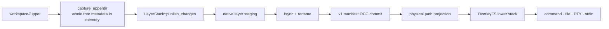
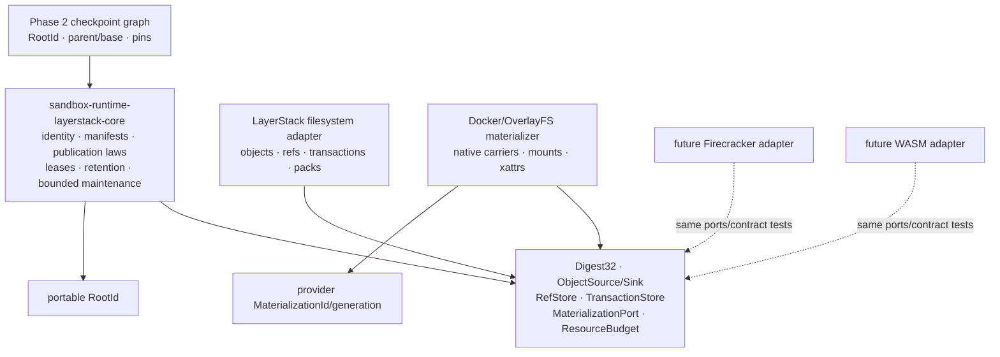
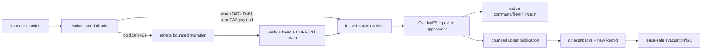
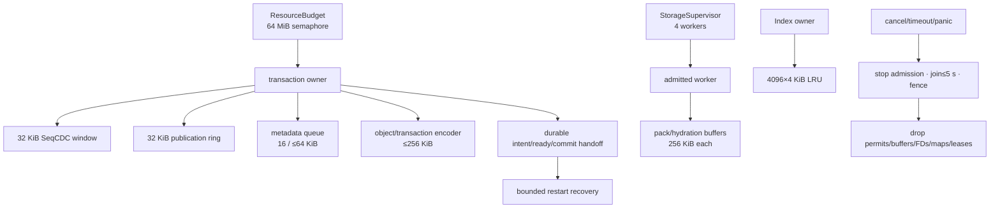
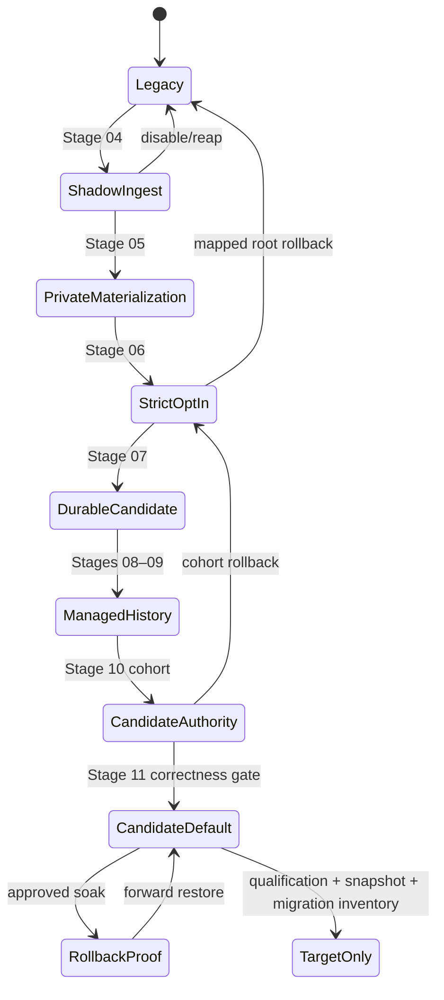

# Phase 1 implementation plan — portable SeqCDC/CAS LayerStack

[Phase 1 overview](../index.md) ·
[Preparation 01](../prep/01-cdc-cas-space-time-materialization-spec.md) ·
[Preparation 02](../prep/02-storage-solution-examination-review.md) ·
[Preparation 03](../prep/03-seqcdc-cas-and-squash-decision.md) ·
[Preparation 04](../prep/04-seqcdc-space-time-complexity-and-acceptance-criteria.md) ·
[simplified LayerStack storage contract](layerstack_storage_contract.md) ·
[Stage 03–11 benchmark scorecard](stage_03_11_benchmark_note.md)

Product root: `/Users/yifanxu/Ephemeral-AI-Lab/ephemeral-sandbox`
Test root: `/Users/yifanxu/Ephemeral-AI-Lab/ephemeral-sandbox-test`
Documentation root: `/Users/yifanxu/Ephemeral-AI-Lab/ephemeral-sandbox-docs`

## 1. Status and decision summary

This is an implementation-ready, planning-only decomposition of Phase 1 into
12 independently provable stages. It changes no product, E2E, benchmark,
deployment, branch, commit, worktree, or remote state.

| Topic | Decision / status |
| --- | --- |
| Purpose | Replace physical-path v1 immutable history with portable logical roots, bounded streaming SeqCDC, content-addressed objects, durable publication/lease/retention state, and provider-owned native materializations while preserving the public runtime surface. |
| Scope | LayerStack identity/storage/publication/hydration/retention/GC/squash; workspace capture and scratch ownership; Docker/OverlayFS materialization; observability, focused E2E, external benchmark, migration, rollback, and retirement. |
| Non-goals | Phase 2 branch/MCTS policy; Phase 3 Firecracker/WASM implementations; a CAS VFS on the command hot path; new PTY features; Windows containers; a native materialization or live sandbox per inactive future branch. |
| Chunker | Selected, gated scalar `seqcdc-scalar-author-v1`, Increasing mode: min 8 KiB, effective average 16 KiB, max/window 32 KiB, threshold 5, opposing trigger 50, jump 512. StreamCDC remains an algorithm-only qualification control, never a storage format or fallback. |
| Logical truth | Typed, domain-separated SHA-256 `RootId` over a canonical root record naming a complete tree manifest, versioned profile/features, parent/base provenance, and publication identity. |
| Provider truth | `MaterializationKey=(RootId,backend_kind,backend_format_version,target_profile)`; locator and materialization generation are excluded from `RootId`. |
| Physical metadata | Filesystem-native only: immutable objects/SSTs, atomic ref and `CURRENT` files, and one common transaction directory shape. No SQLite, embedded database, separate catalog families, or operation-specific journal/staging families. |
| Checkpoints | Every successful publication creates an immutable recoverable root. A named checkpoint is an `O(1)` retention ref when clean; it survives squash because squash changes only materialization `CURRENT`. |
| Execution path | Warm and hydrated roots expose ordinary native lower carriers to existing OverlayFS. Command, file, PTY, and stdin paths do no CDC or CAS payload work. |
| Dependency contract | Exact external package/version set, enabled external feature set, and direct external manifest-edge multiset remain identical. New code uses `std`, an internal workspace crate, and existing adapter dependencies only. |
| Qualification | Correctness first; normative performance/space on macOS arm64 Docker Desktop 4.76.0/Engine 29.5.2; required release contract rows on Ubuntu 24.04 amd64 and Windows 11 24H2 amd64. Stages 00–10 may use the pinned Ubuntu 24.04 cell for focused diagnostics only. Stage 11 qualifies every frozen required-release host/image row over pinned Ubuntu/Debian glibc, Alpine musl, minimal/distroless, shell-less, read-only, and non-root cases; any unverified required row blocks acceptance and retirement. |
| Production status | Proposed and unexecuted. No stage, host, image, dependency comparison, or performance value is passed by this plan. |
| Implementation branch mandate | Phase 1 implementation must use the dedicated Git branch `upgrade-2.0-phase-1`. The implementer creates it from the newest approved immutable product revision, records that base and upstream before edits, and keeps the planning task branch-free. |

Evidence vocabulary:

- **observed**: verified in a named repository/file, Git preflight, tool output,
  or OCI index on 2026-07-24;
- **proposed**: an implementation decision made by this plan;
- **deferred**: a test assigned to a named later stage and not yet run;
- **open**: a decision with a named owner and explicit blocking effect;
- **qualified**: reserved for executed required evidence; there are no
  qualified rows at planning time.

### Normative storage simplification

The [simplified LayerStack storage contract](layerstack_storage_contract.md)
is normative for Stages 03–11. It replaces the earlier implementation sketch
of multiple catalogs, per-operation journal/staging families, flat
complete-tree manifests, reserved future directories, and eager
per-root native materializations. If an older table or preparation document
uses those terms, interpret it through the explicit mapping below; do not
implement both forms.

| Earlier planning term | Normative implementation |
| --- | --- |
| root/retention/lease catalogs | independent atomic files under `refs/` |
| materialization catalog | generation directories plus one atomic `CURRENT` |
| locator/index catalogs | immutable locator SSTs plus one atomic `CURRENT` |
| publication/hydration/squash/compaction/migration journals and staging | `transactions/<TransactionId>/{intent,ready,work/}` |
| complete flat tree manifest | persistent Merkle radix tree and segment-page DAG in `objects/` |
| empty directories reserved for later stages | absent until the owning stage writes the first durable entry |

The simplification changes physical machinery, not the frozen identity,
durability, compatibility, recovery, performance, or portability gates.

## 2. Authority and evidence

Authority is applied in this order: the Phase 1 prompt, preparations 01–04
(04 is normative for acceptance), current product source and maintainer
instructions, current E2E/benchmark harness, then this plan. A proposal here
cannot weaken preparation 04.

### Repository preflight

| Repository | Branch / HEAD at preflight | Upstream / worktrees | Pre-existing state | Plan effect |
| --- | --- | --- | --- | --- |
| docs | `layerstack_2_0` / `f463acbdb4c4d0874cee59a7dc61046ab1c97644` | `origin/layerstack_2_0`, ahead 2; one worktree | Modified migration/Phase 1 indexes and prompt; deleted old Phase 1 plans; untracked `prep/`, staged-plan prompt, and Phase 3 planning | Preserve all pre-existing changes; add only this `phase 1/implementation/` tree. |
| product | `main` / `7e8f4562f9079f27dcb5b514f6e4546b87e5aa04` | synchronized `origin/main`; one worktree | clean | Read-only evidence. No product edit or branch. |
| test | `agent/retire-multi-agent-demo` / `d594f0c72083c39f95334fac685399bca20193f0` | upstream same name, ahead 2; one worktree | clean | Read-only evidence. No E2E/benchmark edit or run. |

Final-validation observation: while this planning task was in progress, both
the product and test checkouts were changed outside this task to the local
branch `upgrade-2.0-phase-1`, without an upstream and without changing either
preflight HEAD. Both worktrees also became dirty, and their status-entry counts
continued changing during final validation, confirming concurrent activity.
This task did not create or switch those branches and did not touch those
changes. Their provenance, approved base, upstream, and worktree contents
therefore remain an implementation-start gate; the branch name alone is not
evidence that Stage 00 has passed.

The product `AGENTS.md` and `CLAUDE.md` observed at preflight require direct
work on `main` and prohibit feature branches/worktrees. The user's explicit
Phase 1 policy decision on 2026-07-24 resolves that conflict for this scoped
implementation: the implementation branch is mandatorily
`upgrade-2.0-phase-1`. Before Stage 00 changes, the implementer must fetch and
verify the newest approved product revision, create that exact branch from it,
and record the repository, immutable base commit, upstream, clean worktree
state, and responsible implementer. This plan neither creates nor switches a
branch.

### Governing evidence

| Authority | Important evidence |
| --- | --- |
| Preparation 01 | Native OverlayFS hot path, hot/cold carrier lifecycle, full physical accounting, bounded memory, unified benchmark and pass order. |
| Preparation 02 | SeqCDC selection rationale, current-source audit, common storage transaction design, integration map, Phase 2 reuse, unproven-evidence ledger. |
| Preparation 03 | Fixed algorithm/profile, stable identities/generations, bounded stream, retention/packing, identity-preserving squash state machine, production gates. |
| Preparation 04 | Exact time, throughput, memory, space, locality, selection, pack, squash, dependency, portability, corpus, artifact, and final go/no requirements. |
| Product architecture | `AGENTS.md`, `CLAUDE.md`, `docs/maintainer-architecture.md`: LayerStack owns storage truth and leases; workspace owns session lifecycle/capture; overlay owns mount adaptation; operation owns orchestration; namespace crates own execution/process mechanics. |
| Product source | Exact paths and symbols in §3 and each stage's evidence table. |
| Test source | `e2e/harness/catalog/declarations.py`, `e2e/harness/runner/`, `benchmark/backend/benchmark_lab/`, existing workspace/squash/export/resource/stress suites. |
| Planning host | Darwin 25.4.0 arm64; Rust/Cargo 1.96.0; Python 3.14.3/pytest 9.1.1; Docker Desktop 4.76.0 build 228118, Engine 29.5.2, LinuxKit arm64 kernel 6.12.76, 4 CPU, about 4.1 GiB. Observed provenance, not qualification. |

## 3. Current state

### Evidence-backed components

| Component | Current path / symbol | Observed behavior | Architectural consequence |
| --- | --- | --- | --- |
| v1 manifest identity | `crates/sandbox-runtime/layerstack/src/model/mod.rs`: `MANIFEST_SCHEMA_VERSION`, `Manifest`, `manifest_root_hash` | Schema v1 hashes serialized physical `LayerRef` paths. | It is not a portable logical root; retain a compatibility reader only through Stage 11. |
| Publication | `crates/sandbox-runtime/layerstack/src/stack/ops/publish.rs`: publication transaction | Builds native staging, fsyncs, renames, rechecks active head, atomically replaces manifest. | Preserve visibility/OCC behavior while adding durable request identity and object/root commit. |
| Layer write | `crates/sandbox-runtime/layerstack/src/stack/layer/write.rs` | Whole-file native immutable layer. | Historical identity and retention must move to manifests/objects without disrupting current native carrier. |
| Storage durability | `crates/sandbox-runtime/layerstack/src/storage/fs.rs`: `write_atomic`, `syncfs_storage_root` | Same-filesystem temp/fsync/rename/parent-fsync; Linux `syncfs`. | Reuse primitives behind ref, `CURRENT`, immutable-object, and common-transaction commits. |
| Leases/substitutions | `crates/sandbox-runtime/layerstack/src/stack/mod.rs`, `crates/sandbox-runtime/layerstack/src/stack/lease/registry.rs`, `crates/sandbox-runtime/layerstack/src/stack/lease/rewrite.rs` | Primarily process-resident. | Durable lease/catalog generations are required for restart-safe GC and squash. |
| Projection | `crates/sandbox-runtime/layerstack/src/stack/projection/mod.rs` | Resolves newest-first native lower paths; current projection materializes whole maps/bytes in places. | Provider adapter remains native; canonical enumeration/indexing becomes streamed/disk-backed. |
| Upper capture | `crates/sandbox-runtime/workspace/src/service/impls/capture_changes.rs`, `workspace/src/overlay/capture.rs`: `capture_upperdir` | Walks only private upper, but accumulates/sorts captured metadata and uses `PathBuf` whole-file sources; invalid path bytes receive a lossy substitute. | Replace with fd-relative byte-path streaming and bounded external ordering. |
| Workspace create | `crates/sandbox-runtime/workspace/src/lifecycle/create.rs` | Creates one empty private upper/work and mounts native lowers. | Preserve public/session contract and zero workspace-sized copy. |
| Squash | `crates/sandbox-runtime/layerstack/src/stack/squash.rs`, `stack/squash/flatten.rs` | Builds replacement native layers, hardlinks winners where possible, rewrites physical manifest and process substitutions. | Preserve build-before-freeze but separate logical root/publication generation from materialization generation. |
| Remount | `crates/sandbox-runtime/workspace/src/lifecycle/remount.rs` | Retains upper, creates work/staged mount, quiesces, move-mounts, verifies, fails closed on uncertainty. | Reuse switch; add durable leases/generation fencing and failpoints. |
| Hot execution | `operation/src/command/service/exec_command.rs`, `namespace-execution/src/pty.rs`, `namespace-process/src/runner/setns/file_op.rs` | Command/file/PTY/stdin operate on native mounted files. | CDC/CAS must never enter these hot paths. |
| Stdin surface | `operation/src/command/service/write_command_stdin.rs` | Supports stdin plus control-C/control-D cancellation semantics; no general resize/signal/literal EOF API. | Preserve the actual surface; do not claim nonexistent parity. |
| Observability | `operation/src/services.rs`: `observability_snapshot`, `ownership_topology_snapshot`, `observe_layerstack`; CLI `projection/observability.rs` | Authenticated bounded snapshot/layerstack projections already exist. | Extend structured aggregates; do not add test-only production APIs or a service. |
| Configuration | `crates/sandbox-config/src/configs/runtime.rs`: `LayerstackConfig::validate`; `config/prd.yml`; `config/bench.yml` | No rollout selector; separate layerstack, workspace, and global namespace-execution roots. | Add a closed staged mode; consolidate command scratch under the workspace session. |
| E2E catalog | test `e2e/harness/catalog/declarations.py`: `e2e_test` | Typed stable metadata and exactly-once validation checkpoints. | Every new public case uses the existing declarations. |
| E2E custody | test `e2e/harness/runner/resources.py` | Run-owned LIFO resource cleanup. | No global prune or second scheduler. |
| Benchmark | test `benchmark/backend/benchmark_lab/runner.py`, `benchmark/backend/benchmark_lab/resource_sampling.py`, `benchmark/backend/benchmark_lab/artifacts.py` | Sequential scheduler, bounded evidence, explicit unavailable measurements. | Extend schemas/presets only; modeled product benchmark is not measured evidence. |

### Current flow and defects



Current behavior worth preserving: upper-only capture; newest-first immutable
lowers; native OverlayFS command path; atomic manifest replacement; native
build-before-remount; public management/observability surfaces.

Current defects that justify disruptive internal changes:

1. physical provider paths participate in v1 identity;
2. publication lacks a durable idempotency receipt and restart transaction;
3. leases and squash substitutions cannot safely govern restart-time GC;
4. capture/projection/read/blame paths contain full-tree/full-file/resident
   structures incompatible with the fixed memory contract;
5. current squash rewrites logical physical identity rather than only a
   materialization generation;
6. history is retained as whole native layer payload rather than shared typed
   objects;
7. global execution scratch has independent ownership/configuration, allowing
   the workspace parent to race transcript owners;
8. no strict route evidence or staged candidate mode exists.

## 4. Target state

The target separates a portable policy/domain core from filesystem and
Docker/OverlayFS adapters:



The internal `sandbox-runtime-layerstack-core` crate depends only on `std` and
internal workspace crates. It owns validated value types, canonical encoding,
the scalar SeqCDC state machine, publication/OCC/lease/retention laws, and
narrow ports. It does not import `/eos`, Docker, OverlayFS, mount, namespace,
guest-agent, or WASM-runtime types. The existing LayerStack crate implements
the ports with current filesystem primitives and existing dependencies such as
`sha2`; the hash algorithm enters the core through `Digest32`.

### Identity and carrier rules

| Concept | Identity-bearing | Strong reconstruction edge | Durable owner | Rule |
| --- | --- | --- | --- | --- |
| `RootId` | canonical root record | persistent tree root | portable core/root store | Stable across location, host, packing, hydration, and squash. |
| parent/base/provenance | yes | weak unless pinned | root/ref stores | Preserves publication graph without retaining all ancestry. |
| persistent tree/segment DAG | yes, named by root | all metadata/content/segment descriptors | object store | Names the complete logical tree while rewriting only affected paths/pages. |
| object/chunk | typed content ID | payload | object/pack stores | Locator may move only after verified transactional replacement. |
| publication generation | publication concurrency | active root mapping | branch head ref | Advances only for publication or explicit reset/revert semantics. |
| materialization key | exact `(RootId, backend_kind, backend_format_version, target_profile)` tuple | none in logical graph | materialization path + manifest | Excludes provider locator and deterministically yields `MaterializationId`. |
| materialization generation | no | current verified carriers | provider adapter `CURRENT` | Advances for hydration/squash/relocation; never changes `RootId`. |
| lease/pin/checkpoint | no | protects named roots/carriers | independent ref files | Durable, expiry/recovery-aware, checked again before deletion. |

### Native hot path and cold history



Active/current bytes may be authoritative in a verified native carrier without
an immediate duplicate pack copy. Historical carriers evacuate missing
objects, transactionally switch locators, wait for leases and a durable grace
epoch, then become reclaimable. Inactive Phase 2 nodes retain roots/pins, not
resident sandboxes or permanent materializations.

### Phase 2 branch/MCTS CoW contract

Phase 1 supplies the immutable-root, publication, materialization, lease, and
retention mechanics. Phase 2 owns graph selection, rollout scheduling,
evaluation, trajectories, and exactly-once backpropagation. Their boundary is
the following CoW contract:

| State transition | Required behavior |
| --- | --- |
| clean `branch(parent)` | Add one bounded graph/policy record and a durable reference/pin to the sealed parent `RootId`. Do not copy its manifest payload, chunks, carriers, or merged workspace. Fork cost is `O(1)` in parent payload size and newly allocated filesystem payload is zero; the pin may still extend the retention lifetime of existing bytes. |
| activate | Resolve the selected `RootId` to at most `D≤64` leased native lowers, then create one private upper/work pair and one flat OverlayFS mount for that rollout. |
| expand an expanded node | Admit another independent child attempt from the immutable selected root. Never mount a child over a live parent merged mount, mutate the parent, or encode MCTS graph depth as native lower depth. |
| dirty checkpoint | Publish the frozen upper through the normal incremental path, rewrite only affected persistent-tree/segment nodes, create an immutable child `RootId`, then add the requested checkpoint ref. |
| clean checkpoint | Reuse the current immutable `RootId` and atomically add one checkpoint ref; `O(1)` metadata and zero payload copy. |
| rollback | Checkout leaves the head unchanged; revert creates a new publication reusing the checkpoint tree; reset uses a generation-checked branch-head CAS. |
| complete/prune | Unmount and release attempt resources. Retain only roots/pins and required search/evaluation records; let bounded lease-safe maintenance reclaim unpinned history and unnecessary materializations. |

Deep or wide graph structure therefore does not multiply ancestor filesystem
payload and does not create recursively nested OverlayFS mounts. It does still
consume bounded metadata per node/edge, private upper bytes per active
rollout, compute/memory/mount resources, publication work, unique new history,
and any retained evaluation artifacts. OverlayFS remains file-granular:
first-write copy-up of a lower-only `F`-byte file may allocate and scan
`O(F)` even for a tiny logical edit. CDC/CAS reduces shared cold-history
retention after safe evacuation; it does not erase active copy-up or required
hot-materialization cost.

This subsection is a downstream compatibility constraint, not a claim that
Phase 1 implements or qualifies MCTS.

## 5. Software architecture quality

### Responsibility and dependency audit

| Component | Single responsibility | Depends on | Used by | Must not own |
| --- | --- | --- | --- | --- |
| core canonical values/codecs | Backend-neutral validation and bytes | `std`, `Digest32` | all core policies/adapters | persistence, clocks, Docker |
| scalar SeqCDC | Deterministic cut selection for one fixed profile | byte stream + bounded window | publication stream | hashing, object I/O, policy |
| publication coordinator | Stream one captured change set into an atomic root | change stream, object/ref/transaction ports, budget | LayerStack service | filesystem paths, materialization |
| lease/retention policy | Define protected roots and deletion eligibility | IDs, clock/epoch/ref ports | activation, GC, squash | mount operations, object encoding |
| maintenance planner | Admit bounded GC/pack/squash slices | ref/locator summaries, budgets | background supervisor | unbounded live sets, worker threads |
| filesystem stores | Persist objects, packs, refs, transactions, locator tables | existing LayerStack fs/digest crates | core ports | logical policy, rollout |
| Docker materializer | Build/verify/swap native OverlayFS carriers | core manifests, existing provider mechanics | workspace resolution | RootId/publication/GC policy |
| workspace scratch owner | Own session upper/work/execution scratch lifecycle | LayerStack leases, overlay adapter | operation orchestration | immutable storage truth |
| operation services | Orchestrate public operations and observations | narrow service traits | daemon/CLI | storage/provider implementation |
| external E2E/benchmark | Schedule public proofs and immutable evidence | public CLIs, host observation | release decision | product authority or cleanup outside run |

God-object rule: no type may own more than one of chunking, persistence,
publication, materialization, policy, rollout, and telemetry. Constructors
receive the smallest port, budget, clock, and supervisor handles needed. Core
errors contain domain state; adapters translate provider errors at boundaries.
Tests live in `tests/`, not production `src/`.

### Dependency direction and exact delta

```text
operation -> workspace -> layerstack -> layerstack-core -> std
                    \-> overlay adapter
layerstack filesystem/Docker adapters -> layerstack-core ports
namespace-execution -> namespace-process
E2E/benchmark -> packaged CLI/API only
```

Proposed internal graph delta:

1. add workspace member `sandbox-runtime-layerstack-core`;
2. add one internal edge
   `sandbox-runtime-layerstack -> sandbox-runtime-layerstack-core`;
3. relocate no existing external edge and add no other direct edge.

The precise baseline is frozen per supported target/feature invocation in
Stage 00. The target must have the exact same external package identity/version
set, external enabled-feature set, and product-wide direct external edge
multiset. Diagnostic planning-host counts—291 resolved packages, 271 external
packages, 116 direct external edges, 490 external feature pairs—are not the
gate; sorted identities are.

Forbidden edges include: core→Docker/OverlayFS/mount/`/eos`/telemetry;
layerstack→operation/E2E/benchmark; workspace→catalog/object implementation;
provider adapter→root/publication/lease/GC policy; product→test support; and
any dependency cycle.

### Shared contracts and change impact

| Change | Core impact | Docker impact | Future Firecracker impact | Future WASM impact |
| --- | --- | --- | --- | --- |
| canonical schema/profile version | one versioned core codec + golden contract | decoder/materializer capability check | same check | same check |
| pack/index implementation | no logical identity change | filesystem adapter only | shared store or its adapter | shared store or its adapter |
| OverlayFS carrier encoding | none | Docker adapter + Docker contract tests | none | none |
| guest block/filesystem image | none | none | Firecracker adapter only | none |
| WASM preopen/snapshot carrier | none | none | none | WASM adapter only |
| Phase 2 branching/pins | immutable IDs/publication/retention ports | materialize active roots only | same | same |

Every materialization backend runs the same root/manifest/path/metadata,
atomic-exposure, cold/warm, lease, and failure contract tests. Phase 1
implements and performance-qualifies only Docker/OverlayFS; Firecracker and
WASM remain designed-compatible until independently implemented and executed.

### Disruptive-change and transitional deletion ledger

| Defect / disruptive change | Benefit | Bridge | Rollback | Transitional component | Delete |
| --- | --- | --- | --- | --- | --- |
| Physical v1 root → canonical v2 root | portable stable checkpoint truth | v1 reader + verified v1→v2 mapping | legacy authority | `legacy_v1` codecs/read selector | Stage 11 after target-only gate |
| Whole-tree capture → streamed byte-path capture | fixed memory and correct non-UTF-8 identity | legacy publication remains authoritative while comparing | legacy capture | comparison adapter/old capture | Stage 10, code removal Stage 11 |
| No durable request record → common transaction/receipt and per-head OCC generation | idempotent restart and Phase 2 publication | shadow write then strict opt-in | ignore/reap candidate txn | shadow transaction/dual route | Stage 10/11 |
| Process leases/substitutions → durable catalogs | restart-safe GC/squash | mirror process and durable state, compare | process-only legacy route | mirror/comparison fields | Stage 11 |
| Physical squash identity → materialization generation | stable `RootId` and OCC | existing native switch behind compatibility route | legacy squash | v1 substitution adapter | Stage 11 |
| Whole native history → object/pack history | shared history and bounded retention | native carriers can remain authoritative locators | retain native source | loose-object/shadow-locator bridge | loose objects may persist by policy; shadow bridge Stage 10 |
| Global execution scratch → session executions | one parent owner and joined teardown | compatibility root accepted/reaped, new writes scoped | legacy root config | global root reader/reaper/config | Stage 11 |
| No rollout evidence → bounded typed observations | prove strict/no-fallback routes | additive versioned fields | remove fields/config | legacy route enums/counters | Stage 11 after evidence retention |

Phase 2 consumes `RootId`, parent/base/provenance, publication generation,
OCC, durable pins/leases, diff/blame query ports, and on-demand
materialization—never Docker locators. Phase 3 implements `MaterializationPort`
and the shared capability/atomic-exposure contract; it does not duplicate root,
object, publication, lease, retention, or GC truth.

## 6. `/eos` storage evolution

Annotation:
`[status; class; owner; create→visible→durable→recover→delete; identity;
route; bound; physical category; exposure]`. Categories are `L_hot`,
`H_cold`, `ΣU_active`, `P_staging`, and `M`.

### Verified current tree

```text
/eos/
├── layer-stack/ [current; truth root; LayerStack; install→open→dir fsync→boot scan→uninstall; v1 physical; legacy R/W; one; M; 0700/masked]
│   ├── .storage-writer.lock [current; coordination; LayerStack; open→lock→kernel durable→reacquire→close; none; legacy R/W; one FD; M; daemon]
│   ├── manifest.json [current; truth; Manifest v1; publish→atomic rename→file+parent fsync→validate→supersede; v1 root; legacy R/W; one; L_hot metadata; daemon]
│   ├── workspace.json [current; base truth; base builder; bootstrap→rename→fsync→validate→uninstall; via v1 layer ref; legacy R/W; one; L_hot metadata; daemon]
│   ├── base/B000001-base/ [current; native carrier; base builder; bootstrap→rename→syncfs→manifest recovery→uninstall; v1 physical ref; legacy R; one; L_hot; lower/masked]
│   ├── layers/<layer_id>/ [current; truth/native carrier; publication; staging rename→manifest visibility→syncfs→manifest keep-set→squash/delete; v1 physical ref; legacy R/W; current depth policy; L_hot; lower/masked]
│   ├── staging/<layer_id>.staging/ [current; txn; publication; admit→private→fsync→rename/boot reap→delete; none; legacy W; one publication; P_staging; 0700/masked]
│   └── .layer-metadata/
│       ├── <layer_id>.digest [current; truth-adjacent; publication; layer visible→atomic write→recompute→layer deletion; v1 comparison only; legacy R/W; O(D); M; daemon]
│       └── <layer_id>.bytes [current; accounting; publication; layer visible→atomic write→recount→layer deletion; none; legacy R/W; O(D); M; daemon]
├── storage/
│   ├── file_auditability/ [current; separate truth; FileService; operation→visible→owner durability→boot recovery→policy cleanup; none; service R/W; configured; M; daemon]
│   └── workspace_recovery/ [current conditional; cleanup recovery; workspace; failed cleanup→fsync→boot retry→successful reap; none; recovery R/W; current cap≤1MiB/1024/depth32; P_staging; daemon]
├── workspace/
│   ├── manager.json [current; recovery truth; WorkspaceManager; handle update→atomic visibility→fsync→boot reap→supersede; none; workspace R/W; active sessions; M; daemon]
│   ├── .export/ [current ephemeral; export owner; request→private/stream→bounded artifact→boot cleanup→delete; none; operation R/W; configured spool; P_staging; daemon]
│   └── <workspace_session_id>/
│       ├── upper/ [current; active scratch; workspace; session create→mount→native writes→recovery→joined teardown; none; workspace R/W; ΣU_active; masked except /workspace]
│       └── work/ [current; provider scratch; overlay; mount→kernel private→kernel use→unmount/reap; none; adapter R/W; one/session; ΣU_active metadata; masked]
├── namespace_execution/<namespace_execution_id>/transcript.log [current remove-later; scratch; CommandExecValue; admission→command use→bounded write→Drop/boot cleanup→delete; none; execution R/W; configured transcript cap; ΣU_active/M; masked]
└── runtime/daemon/
    ├── runtime.sock [current; control scratch; gateway; boot→ready→socket permission→stale recovery→shutdown; none; service R/W; one; M; 0600/masked]
    └── runtime.pid [current; control scratch; gateway; boot→ready→identity check→stale recovery→shutdown; none; service R/W; one; M; daemon]
```

### Cumulative target tree

```text
/eos/
├── layer-stack/ [target; owner-only and workload-masked]
│   ├── .storage-writer.lock [retained; process/open-format coordination only]
│   ├── format-v2.json [format, hash, canonical codec, and SeqCDC profile]
│   ├── objects/
│   │   ├── loose/<prefix>/<ObjectId>.obj [typed immutable metadata or payload]
│   │   ├── packs/<PackId>.pack [typed immutable packed objects]
│   │   └── locators/{tables/<TableId>.sst,CURRENT} [external/pack locations; bounded LSM]
│   ├── roots/<prefix>/<RootId>.root [immutable root record; strong edge to persistent tree]
│   ├── refs/
│   │   ├── heads/<BranchId>.ref [root + generation + publication/transaction ID]
│   │   ├── checkpoints/<CheckpointId>.ref [named retained root]
│   │   ├── pins/<PinId>.ref [policy/search/qualification root]
│   │   ├── leases/<LeaseId>.ref [root/carrier/transaction fence]
│   │   └── legacy/<LegacyCheckpointId>.ref [temporary migration mapping]
│   ├── receipts/<prefix>/<PublicationId>.receipt [idempotent publication result]
│   ├── materializations/<BackendKey>/<RootId>/
│   │   ├── generations/<Generation>/{manifest,carriers/} [verified native carrier set]
│   │   └── CURRENT [atomic materialization generation; excluded from RootId]
│   ├── control/{authority,legacy-shadow} [Stage 10 atomic route/cursor state]
│   ├── transactions/<TransactionId>/{intent,ready,work/} [one mutation/recovery shape]
│   ├── gc/
│   │   ├── ACTIVE [durable concurrent-ref write barrier]
│   │   └── epochs/<Epoch>/{state,mark-runs/,barrier-roots/} [disk-backed tracing]
│   ├── trash/<Epoch>/ [recoverable bounded deletion batches]
│   ├── quarantine/ [bounded corrupt/uncertain evidence; no normal reads]
│   └── locks/ [per-head and subsystem short locks; never durable truth]
├── storage/
│   ├── file_auditability/ [retained; separate truth; FileService; unchanged lifecycle; none; service R/W; configured; M; daemon]
│   └── workspace_recovery/ [retained; cleanup recovery; workspace; failure→fsync→boot retry→delete; none; recovery R/W; ≤1MiB/1024/depth32; P_staging; daemon]
├── workspace/
│   ├── manager.json [retained; recovery truth; WorkspaceManager; update→atomic visibility→fsync→boot reap→supersede; none; workspace R/W; active sessions; M; daemon]
│   ├── .export/ [retained ephemeral; export owner; request→private/stream→bounded artifact→boot cleanup→delete; none; operation R/W; configured bound; P_staging; daemon]
│   └── <workspace_session_id>/
│       ├── upper/ [retained; active scratch; workspace; create→mount→native writes→recovery→joined teardown; none; workspace R/W; ΣU_active; /workspace only]
│       ├── work/ [retained; provider scratch; overlay; mount→kernel private→unmount→delete; none; adapter R/W; per session; ΣU_active metadata; masked]
│       └── executions/<namespace_execution_id>/transcript.log [moved; command scratch; command owner under session; admission→command-visible→bounded write→owner release→parent delete; none; execution R/W; configured cap; ΣU_active/M; 0600/masked]
└── runtime/daemon/
    ├── runtime.sock [retained; control scratch; gateway; boot→ready→socket permission/stale recovery→shutdown; none; service R/W; one; M; 0600/masked]
    └── runtime.pid [retained; control scratch; gateway; boot→ready→identity/stale recovery→shutdown; none; service R/W; one; M; daemon]
```

The final tree has no `/eos/attempts` and no independently configured global
`/eos/namespace_execution`. Legacy v1 entries coexist through Stage 10 and
are removed only by the Stage 11 retirement gate.

### Stage-by-stage delta

| Stage | `/eos` delta and authority                                                                                                                                    |
| ----- | ------------------------------------------------------------------------------------------------------------------------------------------------------------- |
| 00    | No durable-path change; legacy-only route/resource observations.                                                                                              |
| 01    | New execution transcripts are written under `workspace/<session>/executions/`; global scratch is compatibility-read/reap only.                                |
| 02    | No runtime delta; portable root/manifest bytes and golden fixtures are offline only.                                                                          |
| 03    | No authoritative delta; SeqCDC boundary/object descriptors remain test/shadow stream output behind the object-sink contract.                              |
| 04    | Add `format-v2`, immutable roots and persistent-tree metadata objects, v1-carrier locator SSTs/`CURRENT`, receipts, and common shadow transactions. Do not create future storage families; legacy remains sole authority. |
| 05    | Add private native materialization generations and `CURRENT`; reuse compatible warm v1 carriers and hydrate cold roots on demand.                           |
| 06    | Per-root strict opt-in mounts candidate carriers with zero fallback; no new durable storage family; legacy default remains.                                |
| 07    | Add candidate-private branch-head refs, automatic immutable publication roots, named checkpoint refs, leases, receipts, and per-branch CAS.                |
| 08    | Add packs, pins, locator compaction, GC epochs/write barriers, trash/quarantine, and last-locator evacuation; candidate strict route only.                  |
| 09    | Squash writes a verified materialization generation and swaps only its `CURRENT`; `RootId`, refs, and publication generation are unchanged.                |
| 10    | Candidate becomes read/write authority for approved cohort; atomic `control/authority` and `control/legacy-shadow` retain explicit rollback.               |
| 11    | Candidate default, soak, rollback proof, full qualification; then gated removal of v1 entries, global scratch compatibility root, and transitional selectors. |

## 7. Resulting plan tree

```text
implementation/
├── index.md
├── stage_00_baseline_evidence/
│   ├── spec.md
│   └── e2e_test.md
├── stage_01_workspace_scratch/
│   ├── spec.md
│   └── e2e_test.md
├── stage_02_portable_root_contract/
│   ├── spec.md
│   └── e2e_test.md
├── stage_03_streaming_seqcdc/
│   ├── spec.md
│   └── e2e_test.md
├── stage_04_shadow_cas_ingest/
│   ├── spec.md
│   └── e2e_test.md
├── stage_05_candidate_materialization/
│   ├── spec.md
│   └── e2e_test.md
├── stage_06_strict_candidate_activation/
│   ├── spec.md
│   └── e2e_test.md
├── stage_07_durable_publication/
│   ├── spec.md
│   └── e2e_test.md
├── stage_08_retention_gc_packs/
│   ├── spec.md
│   └── e2e_test.md
├── stage_09_identity_preserving_squash/
│   ├── spec.md
│   └── e2e_test.md
├── stage_10_candidate_authority/
│   ├── spec.md
│   └── e2e_test.md
└── stage_11_qualification_retirement/
    ├── spec.md
    └── e2e_test.md
```

Navigation:

| Stage | Specification | E2E/test plan |
| --- | --- | --- |
| 00 | [Baseline and evidence seams](stage_00_baseline_evidence/spec.md) | [Focused proof](stage_00_baseline_evidence/e2e_test.md) |
| 01 | [Workspace-scoped execution scratch](stage_01_workspace_scratch/spec.md) | [Focused proof](stage_01_workspace_scratch/e2e_test.md) |
| 02 | [Portable root contract](stage_02_portable_root_contract/spec.md) | [Focused proof](stage_02_portable_root_contract/e2e_test.md) |
| 03 | [Bounded streaming SeqCDC](stage_03_streaming_seqcdc/spec.md) | [Focused proof](stage_03_streaming_seqcdc/e2e_test.md) |
| 04 | [Shadow CAS ingest](stage_04_shadow_cas_ingest/spec.md) | [Focused proof](stage_04_shadow_cas_ingest/e2e_test.md) |
| 05 | [Candidate materialization](stage_05_candidate_materialization/spec.md) | [Focused proof](stage_05_candidate_materialization/e2e_test.md) |
| 06 | [Strict candidate activation](stage_06_strict_candidate_activation/spec.md) | [Focused proof](stage_06_strict_candidate_activation/e2e_test.md) |
| 07 | [Durable candidate publication](stage_07_durable_publication/spec.md) | [Focused proof](stage_07_durable_publication/e2e_test.md) |
| 08 | [Retention, GC, and packs](stage_08_retention_gc_packs/spec.md) | [Focused proof](stage_08_retention_gc_packs/e2e_test.md) |
| 09 | [Identity-preserving squash](stage_09_identity_preserving_squash/spec.md) | [Focused proof](stage_09_identity_preserving_squash/e2e_test.md) |
| 10 | [Candidate authority and migration](stage_10_candidate_authority/spec.md) | [Focused proof](stage_10_candidate_authority/e2e_test.md) |
| 11 | [Qualification and retirement](stage_11_qualification_retirement/spec.md) | [Cumulative proof](stage_11_qualification_retirement/e2e_test.md) |

### Cumulative proposed source and test tree

```text
ephemeral-sandbox/
├── Cargo.toml                                              [internal member only]
├── Cargo.lock                                              [same external identities/features]
├── config/
│   ├── {prd,bench}.yml                                     [versioned rollout/budgets]
│   └── {linux-amd64,macos-arm64,windows-amd64}.yml         [target format/mode]
├── docs/maintainer-architecture.md                         [portable/provider laws]
├── crates/sandbox-config/src/configs/runtime.rs            [closed rollout/config]
├── crates/sandbox-runtime/layerstack-core/
│   ├── Cargo.toml                                          [std/internal only]
│   ├── src/
│   │   ├── lib.rs
│   │   ├── canonical.rs
│   │   ├── path.rs
│   │   ├── identity.rs
│   │   ├── manifest.rs
│   │   ├── seqcdc.rs
│   │   ├── publication.rs
│   │   ├── lease.rs
│   │   ├── retention.rs
│   │   ├── maintenance.rs
│   │   └── ports.rs
│   └── tests/{golden,fragmentation,contracts,resource_bounds}.rs
├── crates/sandbox-runtime/layerstack/
│   ├── src/{object_store,pack_store,locator_store,ref_store,transaction_store,recovery}.rs
│   ├── src/{docker_materializer,storage_budget,observe}.rs
│   ├── src/legacy_v1/                                      [bridge, removed Stage 11]
│   └── tests/{publication_recovery,materialization,retention_gc,squash_identity,mixed_migration}.rs
├── crates/sandbox-runtime/workspace/
│   ├── src/{scratch_locator,overlay/capture,session/manager}.rs
│   └── tests/{execution_scratch,streaming_capture}.rs
├── crates/sandbox-runtime/operation/
│   ├── src/{services,observability}.rs
│   ├── src/command/{service/exec_command,exec_value}.rs
│   ├── src/layerstack/                                     [orchestration only]
│   └── tests/{candidate_routes,migration,scratch_lifecycle}.rs
├── crates/sandbox-runtime/overlay/                         [mount adapter contract]
├── crates/sandbox-runtime/{namespace-execution,namespace-process}/ [native execution]
└── crates/sandbox-cli/                                     [compatible observations]

ephemeral-sandbox-test/
├── e2e/runtime/layerstack_{baseline,phase1}/
├── e2e/runtime/workspace_session/
├── e2e/manager/management/{squash,export}/
├── e2e/{compound/stress,observability/resource_isolation,observability/resource_efficiency}/
├── e2e/fixtures/layerstack_phase1/{corpora,roots,images,environment}/
├── e2e/schemas/layerstack_phase1/
├── benchmark/presets/layerstack-phase1-{tiny,selection,rss,space,qualification}.yml
└── .{e2e,benchmark}-state/                                 [run-owned evidence]
```

`layerstack-core/src/lib.rs` exposes cohesive modules and value types; it is
not a grouping façade or provider re-export. Tests and test helpers remain
outside production `src/`.

## 8. Stage table

| Stage | Objective | Prerequisites | Authority/mode | Proof tier | Deliverables | Focused E2E proof | Benchmark proof | Memory proof | Dependency/portability proof | Rollback |
| --- | --- | --- | --- | --- | --- | --- | --- | --- | --- | --- |
| [00](stage_00_baseline_evidence/spec.md) | Freeze v1 behavior, environment, dependencies, route and resource evidence | none | v1 / `legacy` | POC | closed rollout enum, golden v1 fixtures, bounded observations/schemas | packaged create/write/publish/read/exec/destroy plus restart | 30–60 s raw tiny control; no normative claim | 20-cycle same-process logical release and raw noise band | exact per-target set snapshot; pinned Ubuntu diagnostic fixture recorded; full host/image qualification deferred 11 | remove additive observations/config/fixtures |
| [01](stage_01_workspace_scratch/spec.md) | Move command transcripts under workspace-session ownership | 00 | v1 / `legacy` | POC | scoped locator, parent-child cancellation/join, compatibility reaper | concurrent commands, cancel/error/timeout, parent destroy/restart | tiny lifecycle timing only | repeated transcript/FD/task/registry release within 5 s | no dependency delta; portable relative ownership, not provider identity | restore global writes; leave compatibility reaper |
| [02](stage_02_portable_root_contract/spec.md) | Establish canonical provider-neutral identity and narrow ports | 00 | v1 authoritative; candidate offline | POC | internal std-only core, canonical codecs/types/goldens/contracts | deferred public route to 04; packaged feature-off equivalence now | codec/hash microloop diagnostic only | bounded encoder/path/descriptor cycles | core build graph zero external; cross-endian/fragment/order goldens | remove internal member/edge; no artifacts |
| [03](stage_03_streaming_seqcdc/spec.md) | Implement safe scalar, fragmentation-independent bounded SeqCDC stream | 02 | v1 authoritative; algorithm offline/dormant | POC | fixed profile, oracle/differential/property/resource tests, `Digest32` usage | packaged feature-off case proves legacy-only authority and zero runtime SeqCDC/candidate work | tiny scalar/oracle diagnostic; integrated StreamCDC selection deferred 11 | 32 KiB window/ring, borrowed-slice/worker/permit sentinel | scalar on supported targets; no unsafe/SIMD/new dep | remove dormant core module and adapter |
| [04](stage_04_shadow_cas_ingest/spec.md) | Write and recover first private v2 roots plus typed object identities and verified v1-carrier locators while v1 commits | 03 | `legacy_with_candidate_shadow` | POC | root/object stores, persistent Merkle tree, locator SST/`CURRENT`, receipt, common transaction recovery; no duplicate chunk payload | public publish proves shadow ran/completed and exact tree, with failpoint/restart | tiny bytes/chunks/new/reused/allocated accounting | repeated success/failure/cancel, transaction/permit/FD quiescence | same graph; artifacts independent of host order/image userland | disable shadow and reap/quarantine unreferenced candidate metadata |
| [05](stage_05_candidate_materialization/spec.md) | Hydrate private verified native carriers from v2 without exposing them | 04 | legacy authoritative + private candidate | POC | generation/`CURRENT` materializations, bounded hydration, Docker adapter | public legacy run plus private candidate exact tree/metadata comparison | tiny cold copy/hydrate diagnostic; final cold gate deferred 11 | 256 KiB buffers, four workers, bounded index and repeated failure cleanup | core/provider boundary test on the pinned Ubuntu diagnostic cell only; no qualification or target-image helper | remove private generation/`CURRENT`; v1 unchanged |
| [06](stage_06_strict_candidate_activation/spec.md) | Mount an opted-in candidate root with no fallback | 05 | `candidate_strict_opt_in` per root; v1 default | POC | strict selector, verified lease/mount, route evidence | packaged command/file/PTY/stdin/workspace case asserts candidate reads and zero fallback | tiny warm/cold/mount diagnostic | repeated activate/command/cancel/destroy; zero CAS on warm hot path | pinned Ubuntu diagnostic cell only; full required host/image matrix deferred 11 | opt root back to v1; candidate data retained |
| [07](stage_07_durable_publication/spec.md) | Make private candidate validation-branch publication atomic, OCC-safe, idempotent, checkpointable, and restartable | 06 | public v1 authority; private candidate branch only | POC | per-branch head CAS, `PublicationId`, receipts, checkpoint/lease refs, common transaction recovery | public legacy publish triggers private no-op/disjoint/conflict/duplicate/checkpoint/crash proof with zero public-head mutation | tiny small-edit/disjoint/checkpoint diagnostic | ≤4 MiB/op excluding cache, zero payload queue, success/failure/cancel/retry release | no edge delta; canonical roots match across fragmentation/order | disable private trigger; leave immutable v2 data |
| [08](stage_08_retention_gc_packs/spec.md) | Add durable leases/pins, packing, bounded compaction and GC | 07 | candidate strict; v1 remains for non-opted | POC | packs, locator SSTs, pins, GC barriers/epochs, trash/quarantine | leased/checkpointed old root remains usable through pack/GC; crash/resume/final recheck | tiny pack/dead/slack/reclaimed accounting; final space deferred 11 | fan-in/buffer/cache/workers bounded; disk-backed mark runs; no global live set | no service/helper/database; target image irrelevant | stop maintenance, restore previous locator `CURRENT` |
| [09](stage_09_identity_preserving_squash/spec.md) | Replace native carrier stack without changing logical publication identity | 08 | candidate strict; v1 remains | POC | common squash transaction, materialization `CURRENT` swap, overlapping leases/remount/evacuation | public live remount proves same `RootId`/publication generation/checkpoints and advanced materialization generation | tiny build/freeze/remount/space diagnostic | build outside freeze, bounded workers/FDs, repeated cancel/fail/retry release | provider operation behind port; no new edge/helper | pre-install abort or prior materialization generation/lease |
| [10](stage_10_candidate_authority/spec.md) | Make candidate authoritative for approved cohort, shadow legacy, migrate mixed roots | 01,09 | `candidate_authoritative_with_legacy_shadow` | POC/soak | atomic authority/legacy-shadow control files, candidate authority, legacy comparison, scratch bridge join | v1/v2/mixed restart, public writes/reads candidate, shadow completed, zero mismatch/fallback | short cohort sentinel only; normative deferred 11 | soak logical/physical stability, migration/cancel cleanup | dependency equality repeated; pinned Ubuntu diagnostic cell on the selected host, no matrix qualification | restore strict opt-in or parity-proven legacy authority; keep verified v2 |
| [11](stage_11_qualification_retirement/spec.md) | Default, cumulative qualify, rollback, then retire legacy | 00–10 and approved soak | `candidate_default`, then target-only v2 | final integration/qualification | full regression/host-release/image-capability evidence, migration inventory/snapshot, staged deletions | all affected suites over every frozen required host/image row; target-only restart | all prep-04 normative campaigns | full cold scale matrix, long-lived logical/physical gates | exact zero delta; pinned Ubuntu/Debian glibc, Alpine musl, minimal/distroless, shell-less, read-only, and non-root matrix; legal provenance | before deletion Stage 10; after deletion snapshot + compatibility-reader restore binary |

Every intermediate stage owns a focused, bounded proof and can pass without a
later stage. A deferred metric is not its exit gate. Only Stage 11 requires
the affected broad E2E regression and normative qualification.

## 9. Dependency graph


The critical path is
`00→02→03→04→05→06→07→08→09→10→11` (11 stages).
Stage 01 may proceed in parallel with Stages 02–09 after Stage 00 and joins
before Stage 10. Within a stage, core/golden tests, external fixture/schema
work, and adapter contract scaffolding may be prepared in parallel only when
they do not cross the stage's authority boundary.

## 10. Rollout-mode and compatibility matrix

| Stage | Configured mode | Write authority | Read authority | Candidate artifact/mount | Fallback | Mixed roots and restart | Rollback |
| --- | --- | --- | --- | --- | --- | --- | --- |
| 00 | `legacy` only | v1 | v1 | none | not applicable | v1 restart unchanged | remove additive seam |
| 01 | `legacy` | v1 | v1 | none; new scratch location | not applicable | both scratch roots reaped; new writes scoped | restore global writes |
| 02 | `legacy` | v1 | v1 | offline canonical bytes only | not applicable | no durable v2 | remove core |
| 03 | `legacy` + algorithm observation | v1 | v1 | no authoritative artifact | no storage fallback | fragmentation/oracle state not persisted | disable chunker |
| 04 | `legacy_with_candidate_shadow` | v1; v2 private shadow | v1; compare private v2 | first candidate roots/objects; never mounted | legacy is declared authority, not fallback | restart derives outcome from `intent`/`ready`/commit; v1 works | disable/reap shadow |
| 05 | same | v1 | v1 plus private comparison | verified private candidate carrier; never exposed | no candidate read fallback because no candidate read is public | rebuild/reap candidate carrier; v1 works | delete private carrier pointer |
| 06 | `candidate_strict_opt_in` | public v1 only | candidate for an explicitly opted root, otherwise v1 | opted candidate carrier mounted | **prohibited** on strict route | explicit v1/v2 pairing; restart retains selector | disable opt-in and return new sessions to v1 |
| 07 | `candidate_publish_private` plus strict read opt-in | public v1; private candidate validation branch writes v2 | candidate only for explicit strict reads, otherwise v1 | committed private v2 root/generation and optional checkpoint ref | prohibited on strict route | common transaction/idempotency recovery; public v1 head is unchanged | disable private trigger; keep immutable v2 data |
| 08 | same public/private authority split | public v1; private candidate maintenance only | same as 07 | packs/locators may replace candidate historical locations | prohibited on strict route | refs, GC barriers, and disk-backed epochs recover without mutating v1 | stop maintenance/use prior locator `CURRENT` |
| 09 | same public/private authority split | public v1; private candidate materialization only | same as 07 | materialization generation changes, root does not | prohibited on strict route | squash state resumes; old/new carrier leases overlap | abort pre-install or finish/restore prior carrier while v1 remains rollback |
| 10 | `candidate_authoritative_with_legacy_shadow` for cohort | v2 | v2; caught-up v1 is explicit rollback/read comparison only | candidate active | prohibited; any fallback is failure | v1-only roots migrate, mixed restart; shadow does not decide output | quiesce and select only a parity-proven legacy read; candidate remains publication authority |
| 11 pre-retirement | `candidate_default` | v2 | v2; compatibility reader present | candidate active | prohibited | soak, rollback, forward restore, all v1 mapped | Stage 10 mode |
| 11 target-only | `candidate_default` with legacy variants removed | v2 only | v2 only | candidate active | impossible by construction | target tree restart/recovery; old binary cannot interpret in place | restore snapshot with compatibility-reader binary |

Mode is closed and validated. No automatic silent fallback is ever a passing
candidate behavior. StreamCDC is never a rollout mode.

## 11. Global invariants

These hold at every stage where the associated concept exists:

1. **Correct tree:** bytes, Linux path bytes, sparse extents, supported
   hardlink groups, symlinks, modes, ownership mapping, xattrs, whiteouts,
   opaque directories, and required timestamps round-trip exactly or the
   backend rejects the root before visibility.
2. **Typed identity:** each domain uses a distinct canonical SHA-256 preimage;
   explicit widths, byte order, lengths, field tags, and deterministic byte
   ordering exclude host paths, word size, locale, time, enumeration order,
   and provider locators.
3. **Immutable truth:** a committed object or root is never mutated.
   Locator replacement cannot change identity.
4. **Atomic exposure:** publication exposes one generation-checked branch ref;
   hydration/squash expose one verified materialization `CURRENT`. Private or
   partial output is never readable.
5. **Durability/recovery:** every multi-step mutation records bounded
   `intent`, optional verified `ready`, and one commit pointer; each is
   fsynced, restart-idempotent, and safe under disk full, cancellation, panic,
   timeout, and retry.
6. **OCC/idempotency:** expected root plus durable `PublicationId` yields one
   deterministic commit or explicit conflict; retries cannot duplicate roots
   or lose disjoint updates.
7. **Lease safety:** root/carrier deletion requires durable reachability,
   lease, pin, generation, grace-epoch, and final rechecks.
8. **Blame separation:** blame is a disk-backed path/range transition record.
   Chunk presence or ownership never assigns authorship.
9. **Squash identity:** `RootId` and publication generation remain unchanged;
   materialization generation advances, and every checkpoint remains valid.
10. **Native hot path:** normal command/file/PTY/stdin, warm mount, and frozen
    remount perform no CDC, manifest scan, pack lookup, or cold CAS
    reconstruction.
11. **Bounded work:** memory is `O(B)`; queues, buffers, caches, workers,
    registries, retries, mappings, FDs, artifacts, live-set scans, and
    maintenance slices all have explicit hard bounds.
12. **Owned lifecycle:** no strong reference cycle, detached worker, orphaned
    future, unbounded terminal registry, or cleanup dependent on process exit.
    Cancellation stops admission, joins within five seconds, and fences late
    visibility.
13. **Namespace isolation:** storage locators, leases, workspace scratch,
    transcripts, and observations cannot cross sandbox/session ownership.
14. **Scratch ownership:** parent session deletion waits for every command to
    cancel/join and retained transcript/FD/task owner to release.
15. **Depth:** native lower depth never exceeds 64; policy enqueues at projected
    depth 48 and compacts/rejects before a 65th carrier becomes active.
16. **No silent fallback:** any candidate-path fallback, unverified comparison,
    or route ambiguity fails the focused test.
17. **Zero external delta:** package identities/versions, features, direct
    external edges, services, helpers, system tools, image prerequisites, and
    runtime downloads are exactly unchanged.
18. **Portability:** scalar correctness is mandatory; target-image userland is
    irrelevant; provider mechanics remain behind an adapter.
19. **Filesystem-native metadata:** no SQLite, embedded database, metadata
    daemon, separate operation-specific journal family, or unbounded
    in-memory live set is permitted.
20. **Concurrent GC barrier:** a ref made visible during an active GC epoch is
    first durably recorded in that epoch; deletion is trash-first, delayed
    through a later complete epoch, and guarded by final ref/lease/locator/
    materialization checks.
19. **Evidence honesty:** planning-only projections are labeled `estimated`
    with their model source and cannot pass a measured gate; missing normative
    data fails rather than becoming zero.
20. **No premature control plane:** `/eos/attempts` is absent in every stage;
    Phase 2 refers to immutable roots, not Phase 1 filesystem attempt identity.
21. **Branch CoW inheritance:** a clean logical fork copies zero parent
    filesystem payload. Only an active rollout owns a private upper/work and
    flat mount; publication creates an immutable child and reuses unchanged
    content identities. “`O(1)` fork” never means zero metadata, mount,
    compute, copy-up, publication, materialization, or evaluation cost.

## 12. Global time and space budgets

### Notation and complexity

| Symbol | Meaning |
| --- | --- |
| `U` | bytes in captured unpublished upper |
| `E` | filesystem entries processed by a full bootstrap, hydration, or rebuild |
| `C` | canonical changed-path events in one incremental publication |
| `K` | chunks generated/consumed |
| `V_delta` | immutable tree/segment nodes read or written because of those changes |
| `F` | size of one file in private upper |
| `R` | bytes missing from requested native materialization |
| `D` | native lower-carrier depth |
| `Q` | changed paths/ranges for OCC/diff/blame |
| `N` | entries in relevant disk-backed index |
| `S`, `E_s` | bytes and entries in squash interval |
| `G` | objects/bytes admitted to one maintenance slice |
| `B` | configured storage-owned memory budget |
| `H_graph` | logical Phase 2 search-graph depth; independent of native carrier depth `D` |
| `C_capture` | allocated payload of one captured upper |
| `C_current` | allocated bytes of one correct current native materialization |
| `C_target` | allocated bytes of one hydration/squash target |
| `H_unique` | unique retained history absent from `C_current` |

Complexity contracts:

- boundary/hash/descriptor path: `O(U+K)=O(U)`;
- first import: `O(R+E)` with bounded memory;
- later publication: `O(U+K+C+V_delta)` plus bounded change-event ordering up
  to `O(C log C)`, memory `O(B)`, and no scan/rewrite proportional to
  unchanged tree or history size;
- warm prepare/materialization/mount: `O(D)`, `D≤64`, zero CAS payload;
- cold hydration: `O(R+E)`; activation: `O(R+E+D)`;
- squash build: `O(S+E_s)`; freeze:
  `O(D+tasks+verified FDs)` with no `U/R/K/S` work;
- GC/compaction: `O(G)` per resumable slice;
- diff/OCC/blame: `O(Q log N)` plus bounded result output;
- downstream clean graph fork: `O(1)` bounded metadata/pin work and zero
  parent-payload copy; rollout activation remains `O(D)`, while graph
  selection/backpropagation may remain `O(H_graph)` and belongs to Phase 2.

Fixed chunk count for nonempty input:

```text
ceil(U / 32 KiB) ≤ K ≤ ceil(U / 8 KiB)
```

The final chunk may be shorter than 8 KiB; a sub-minimum file is one
actual-length chunk, never padded.

### Exact time and throughput gates

For latency,
`allowed(baseline,percent,floor)=baseline×(1+percent)+floor`.

| Operation | Stage-gating result |
| --- | --- |
| warm root resolve/session preparation | p50 and p95 ≤ baseline +5%+2 ms; zero CAS payload |
| OverlayFS mount | p50 and p95 ≤ baseline +5%+2 ms |
| squash frozen remount | p50 and p95 ≤ baseline +5%+2 ms |
| full squash | p50 and p95 ≤ baseline +10%+5 ms |
| no-op command | p50 and p95 ≤ baseline +3%+0.5 ms |
| native command throughput | ≥97% of raw |
| PTY create | p50 and p95 ≤ baseline +3%+1 ms |
| PTY drain, supported stdin, control-C/control-D | p50 and p95 ≤ baseline +3%+0.5 ms |
| unsupported PTY resize/arbitrary signal/literal EOF | exact current deterministic unsupported response |
| native sequential read/write | ≥97% of raw |
| concurrent disjoint publication | ≥90% of raw with OCC preserved |
| small-edit publication | p95 ≤ baseline +15%+5 ms |
| cold hydration | ≥70% same-filesystem verified native-copy throughput |
| cold activation | p95 ≤1.5× verified native copy + warm-mount allowance |
| SeqCDC integrated selection | ≥10% advantage over internal StreamCDC under the matched rules below |

Selection requires localized-large-source and mixed-tree advantage each
`≥0.10`; no-dedup and many-small regress by no more than 3%; three fresh
matched sets; at least five interleaved samples per workload/invocation;
counterbalanced order; paired-bootstrap 95% lower confidence bound `≥0.10`.
Equal distribution means identical 8/32 KiB bounds, measured means within 5%,
and p10/p50/p90 within 10% on identical bytes. An invalid match cannot pass.
No operation may exceed 60 seconds and no matched pair/invocation five minutes.

### Memory observation definitions

| Term | Definition |
| --- | --- |
| baseline | paired raw LayerStack binary/config/corpus/host/image run with identical measurement scope |
| warm | declared warmups complete, daemon identity unchanged, intended cache/materialization state verified |
| peak | maximum from a bounded raw sample stream during the declared operation interval; sampler source/scope included |
| logical release | all product-owned live resources/permits/queues/temporary leases/mappings/FDs/staging return to expected idle/terminal bounds |
| settled | logical release is true and 100 ms bounded polling reaches the predeclared stable observation window within five seconds |
| repeated steady state | one process, repeated success/failure/cancel/retry cycles after warmup, with first/last settled-window medians and robust slope |

Memory gates: RSS ≤384 MiB absolute and ≤128 MiB above paired idle raw at
every cold point. Matrix inputs are 64 MiB, 256 MiB, and 1 GiB × histories
1, 16, and 64, three independent repetitions per point. Adjusted median final
and peak RSS vary ≤16 MiB across the series; no 4× increase in input/history
adds >8 MiB. First-to-last adjusted settled delta and robust slope stay inside
the frozen raw noise band and the same 16 MiB tolerance. Logical release is
an independent mandatory gate.

### Physical accounting and exact space gates

```text
T(t) = L_hot(t) + H_cold(t) + ΣU_active(t) + P_staging(t) + M(t)
D_ideal = C_current + H_unique
```

Allocated physical bytes—not logical/apparent size—are measured by category.
For downstream MCTS product accounting, the equation remains complete only if
every search/evaluation byte is charged exactly once:

```text
T_product(t) =
    T_layerstack(t)
  + M_search_external(t)
  + A_evaluation_external(t)
```

`T_layerstack` is the `T(t)` equation above. Search metadata or evaluation
artifacts stored inside an already measured LayerStack category are not added
again; the `_external` terms contain only bytes outside those categories.
Likewise:

```text
new_payload_bytes(clean branch(parent)) = 0
```

means no parent filesystem clone. Active upper/copy-up bytes remain in
`ΣU_active`; freshly published or cached native carriers remain in `L_hot`;
publication and maintenance staging remains in `P_staging`; graph/root/
manifest/index metadata remains in `M` or `M_search_external`; and retained
evaluation payload remains in its measured filesystem root or
`A_evaluation_external`. A tiny edit can therefore cost `O(F)` while its
lower-only file is copied up even though later cold CDC retention reuses most
unchanged chunks.

“No 2L” is a settled-topology rule against an avoidable second complete
materialization or one full carrier per checkpoint. It is not an
instantaneous `T(t)<2L` promise: active copy-up, one verified replacement
target, leased old generations, and bounded transaction staging remain
visible in their exact categories.

| Area | Target | Hard failure / exact cap |
| --- | --- | --- |
| publication peak | `C_capture` plus staging ≤5% | any unexplained/unbounded second payload |
| hydration peak | `C_target` plus ≤5% | partial target visibility |
| squash peak | one replacement plus leased old | unbounded generations or pre-verification deletion |
| compaction peak | one bounded source+target slice | global rewrite/live set |
| mixed/no-dedup settled amplification | ≤1.08 | >1.15 |
| many-small settled amplification | ≤1.15 | >1.25 |
| avoidable native/pack duplication | ≤1% | >3% |
| pack dead/slack | ≤2% | >5% |
| persistent unexplained unreachable bytes | zero | any nonzero persistent amount |
| metadata | ≤96 B/chunk; ≤64 B/segment ref; ≤256 B+path bytes/changed path | any exceeded category |
| recovery residue | ≤1 MiB + min(1% retained payload,64 MiB) | any pending transaction |
| native depth | ≤64 | >64 |

SeqCDC unique retained bytes must be ≤1.14× StreamCDC. With source
`F≥16MiB` and edit≤64KiB, localized retained bytes target
`changed bytes + 2×32KiB + segment overhead`; algorithm hard failure is a
median >4× that target or any sample ≥25% of `F`.

Autosquash is enqueued at projected `D≥48` and completes or rejects admission
before `D>64`; routine benefit is ≥8 carriers, while a manual selected run
contains at least 2 lowers. Pack payload is
≤64 MiB, record count≤100,000, allocated output≤80 MiB. Individual
compaction admits at≥20% dead; aggregate >5% is urgent and target≤2%;
one slice≤100,000 records or64 MiB. Deletion waits at least one complete
durable epoch and a final check.

Required corpora are: mixed≥512 MiB/20,000 files; deterministic large source
≥256 MiB; no-dedup≥512 MiB; many-small≥100,000 files; sparse≥8 GiB logical
with bounded extents; repeated small-file and repeated large-file histories.

## 13. Memory lifecycle and reclamation

### Bounded ownership graph



Strong ownership runs downward. Back-references are IDs or `Weak`. The
supervisor owns all join handles; no task detaches. Durable transaction ownership
may outlive process memory, but no live buffer does.

### Resource lifecycle inventory

| Resource | Owner / acquire | Hard bound | Normal release | Error/cancel/panic | Shutdown/restart | Evidence |
| --- | --- | --- | --- | --- | --- | --- |
| SeqCDC window + ring | publication worker / admitted file | 32 KiB+32 KiB | final chunk/file | RAII and source-lease release | transaction files hold no buffer | current/high-water bytes |
| borrowed payload | synchronous sink call | ≤1 chunk/worker, ≤4 global, at most 2 slices | hash/write returns | stack unwind | none | borrowed count |
| payload queue | none | exactly 0 bytes | synchronous | synchronous | none | queue bytes |
| metadata queue | publication transaction | 16 and≤64 KiB | consumer acknowledgment | drain/drop/join | replay descriptors from disk | count/bytes |
| encoder | admitted operation | ≤256 KiB | phase fsync | drop; prior phase recoverable | same bound on replay | owned bytes |
| pack/hydration buffers | storage worker | 256 KiB each/worker | phase end | drop/fence | transaction/epoch replay | buffer gauges |
| external merge readers | maintenance slice | fan-in8×64 KiB | run end | close/drop | cursor replay | FDs/bytes |
| index pages | shared index owner | 4096×4 KiB=16 MiB | LRU/shutdown | poisoned state fails closed | cold rebuild | pages/high-water |
| publication managed memory | transaction | ≤4 MiB excluding cache | quiescence | cancel/drop/join | bounded intent/ready only | transaction bytes |
| workers/tasks | supervisor | 4 global | idle pool/shutdown join | panic contained, bounded replacement | boot recovery first | live/high-water |
| byte permits | budget owner | 64 MiB | RAII | unwind/drop | reconstructed ownership, not memory | held/high-water |
| leases/registries | durable refs + bounded handles | active owners + configured terminal cap | release/evict | cleanup guard | recover ref files | counts |
| mappings/FDs | adapter transaction | workers/fan-in/D bound | phase/remount close | RAII/fenced worker | reopen by durable IDs | high-water |
| evidence samples | external runner | fixed ring/stream to disk | case end | run-owned artifact close | recovery command | sample/drop counts |

Quiescence is polled at 100 ms for no more than five seconds. It requires
completed handles, empty payload/metadata queues, zero transaction bytes and
permits, idle worker count, released temporary leases/mappings/FDs, terminal
registries within cap, and no owned staging. Missing a required gauge fails.
An arbitrary sleep, restart, allocator swap, `malloc_trim`, or cache purge is
not a release mechanism.

### Stage-local evidence progression

| Stage | Allocating/async change | Peak proof | Settled/first-last/slope proof |
| --- | --- | --- | --- |
| 00 | bounded observation | fixed encoded snapshot | 20-cycle raw control/noise |
| 01 | transcript tasks/FDs/registry | configured transcript and owner counts | success/error/timeout/cancel/parent teardown |
| 02 | canonical encoders | ≤256 KiB and bounded descriptors | repeated codec/path failures return to idle |
| 03 | SeqCDC worker/window/ring | exact 32/32 KiB, ≤4 borrowed chunks | fragmentation/cancel/panic cycles |
| 04 | object/locator/common-transaction ingest | permits, zero payload queue, ≤4 MiB/op | publish/failpoint/retry/restart handoff |
| 05 | hydration/index/worker buffers | 256 KiB/worker, 16 MiB cache | miss/corrupt/disk-full/cancel cycles |
| 06 | activation leases/mount FDs | D/FD/task bounds, zero warm CAS | activate/command/destroy cycles |
| 07 | durable publication/external ordering | encoder/merge/permit bounds | OCC/conflict/idempotent retry/cancel cycles |
| 08 | pack/GC/compaction | bounded fan-in/cache/slice; no global live set | reclaim bytes and memory separately |
| 09 | squash build/remount | replacement/worker/FD bounds outside freeze | every state/failure/cancel plus lease release |
| 10 | migration/shadow/soak | admitted migration and bounded comparison | long-lived cohort first/last/slope |
| 11 | all cumulative paths | full raw/candidate cold matrix | logical release and physical stability, three reps/point |

LayerStack durable-object GC is separate from process-memory reclamation.
Pack/GC evidence reports durable bytes reclaimed, temporary disk, peak
process memory, logical-release gauges, and settled-memory stability. A flat
RSS cannot excuse growing ownership, and allocator/page-cache retention is not
called a heap leak without attribution. Verdicts are
`bounded-and-released`, `bounded-retained-by-design`,
`allocator-or-page-cache-retained`, `suspected-leak`, `confirmed-leak`, or
`measurement-unavailable`; the last three block a gating stage.

## 14. Dependency and portability proof

### Exact dependency proof

Stage 00 captures and Stage 11 compares, for every supported target/feature
invocation:

- exact sorted external `(source,name,version,checksum)` set;
- exact external `(package,feature)` set;
- product-wide direct external manifest-edge multiset;
- workspace manifest and `Cargo.lock` bytes;
- Python/npm manifests and lockfiles;
- process, socket, service, helper, image-package, and runtime-download
  inventories;
- license/notice inventory.

The target result is equality for every list and an external delta of exactly
zero. The only permitted graph change is the cycle-free internal member/edge
in §5. No CDC/hash/database/allocator/profiler/benchmark/async/Python/npm/
vendored/FFI dependency, system command, service, daemon, sidecar, FUSE,
plugin, kernel module, target-image helper, privilege, or download is added.

### Versioned image capability profile

`linux-image-capability-v1` requires only:

1. a valid Linux OCI rootfs/config;
2. native or explicitly emulated supported architecture;
3. the declared provider-side mount/namespace/filesystem/xattr/security
   semantics;
4. writable externally supplied LayerStack storage such as `/eos`.

It requires no shell, libc utility, package manager, network, or helper
inside the image. Stages 00–10 may prove their focused behavior through public
workspace/file APIs on the pinned Ubuntu diagnostic cell, including local
read-only and non-root variants where available, but those results do not
qualify the Phase 1 portability matrix. Stage 11 proves userland independence
over every frozen required-release host/image row.

### Frozen host release matrix

| Host OS / architecture | Docker | Stage 11 image evidence | Requirement | Planning status | Status after required evidence |
| --- | --- | --- | --- | --- | --- |
| macOS 26.4 / Darwin 25.4.0 arm64 | Desktop 4.76.0 build 228118; Engine 29.5.2; LinuxKit 6.12.76; 4 CPU/~4.1 GiB | every applicable pinned image/capability row below; resolved arm64 manifest recorded | required-release; normative performance/space | `unverified` (host observed only) | `qualified` only after Stage 11 |
| Ubuntu 24.04 LTS amd64 | Engine 29.5.2 | every applicable pinned image/capability row below; resolved amd64 manifest recorded | required-release contract | `unverified` | `qualified` only after Stage 11 |
| Windows 11 24H2 amd64, Linux containers | Desktop 4.76.0; Engine 29.5.2 | every applicable pinned image/capability row below; resolved amd64 manifest recorded | required-release contract | `unverified` | `qualified` only after Stage 11 |
| other supported Docker host triples | frozen when release inventory is approved | every declared applicable image row; resolved platform manifest recorded | informational | `unverified` | at most `contract-tested` when executed |
| Firecracker materializer | provider-specific | Linux guest profile | future informational | `designed-compatible` | cannot become qualified in Phase 1 |
| WASM materializer | provider-specific | WASM capability profile | future informational | `designed-compatible` | cannot become qualified in Phase 1 |

An unverified required-release host/image row is a production no-go. At
planning time, there are no `qualified` or `contract-tested` target rows.

### Pinned Phase 1 image-capability matrix

| Fixture / variant | OCI index and resolved-platform evidence | Stage-local use | Planning status |
| --- | --- | --- | --- |
| Ubuntu 24.04 glibc | index `sha256:4fbb8e6a8395de5a7550b33509421a2bafbc0aab6c06ba2cef9ebffbc7092d90`; amd64 `sha256:52df9b1ee71626e0088f7d400d5c6b5f7bb916f8f0c82b474289a4ece6cf3faf`; arm64 `sha256:7f622ca8766bccb22f04242ecb6f19f770b2f08827dc4b8c707de5e78a6da7ab` | focused diagnostic for Stages 00–10; required matrix cell in Stage 11 | `unverified` |
| Debian glibc | **OPEN:** freeze exact OCI index and each applicable resolved-platform manifest before Stage 11 | Stage 11 only for qualification | `unverified`; missing pin blocks Stage 11 |
| Alpine musl | **OPEN:** freeze exact OCI index and each applicable resolved-platform manifest before Stage 11 | Stage 11 only for qualification | `unverified`; missing pin blocks Stage 11 |
| minimal/distroless | **OPEN:** freeze exact OCI index and each applicable resolved-platform manifest before Stage 11 | Stage 11 only for qualification | `unverified`; missing pin blocks Stage 11 |
| shell-less | **OPEN:** freeze exact OCI index and each applicable resolved-platform manifest before Stage 11 | Stage 11 only for qualification | `unverified`; missing pin blocks Stage 11 |
| read-only | reuse an exact pinned base fixture and record the immutable runtime configuration | local diagnostic where available; required Stage 11 capability row | `unverified` |
| non-root | reuse an exact pinned base fixture and record image user plus immutable runtime configuration | local diagnostic where available; required Stage 11 capability row | `unverified` |

Every executed image row verifies its OCI index identity and records the
resolved platform manifest; tag-only evidence does not count. The frozen
matrix declares which fixture and runtime-variant combinations are applicable
to each host, and Stage 11 must execute every required-release row. Missing
pins, missing cells, or failed/unverified required rows block Phase 1
acceptance and legacy retirement.

### Scalar/acceleration determinism

| Implementation | x86_64 | AArch64 | Other supported CPU | Identity rule |
| --- | --- | --- | --- | --- |
| safe scalar author | required | required | required | sole Phase 1 production path; pinned-author oracle and byte-identical roots |
| optional SIMD/accelerated path | explicitly excluded from Phase 1 | explicitly excluded | unavailable | if later introduced, safe runtime detection, scalar fallback, identical boundaries/IDs, separate qualification |
| internal StreamCDC | test control only | test control only | test control only | never reads/writes production format or handles fallback |

The core uses explicit-width, explicitly ordered persisted fields and Linux
path-byte ordering. Docker-specific whiteouts, opaque xattrs, mount handles,
and carrier locators are adapter encodings. Phase 2 reuses logical contracts;
Phase 3 reuses materialization ports and contract tests without duplicating
truth.

## 15. Acceptance traceability

“First evidence” is the first independently passable stage that measures or
proves the requirement. “Gating” is where failure blocks that stage. Stage 11
reruns every cumulative requirement; a `deferred` row is not passed earlier.

### Preparation 01 traceability

| Preparation 01 requirement | First evidence | First gating stage | Final regression | Evidence artifact |
| --- | --- | --- | --- | --- |
| §1 scope: native execution plus CDC/CAS history, no external service/helper | 00 dependency/runtime inventory | 02 core graph; 04 ingest surface | 11 | dependency snapshot, process/helper inventory |
| §2.1 complete native OverlayFS workspace; clean session no payload copy; zero CAS in hot paths | 06 strict activation | 06 | 11 | route snapshot, public command/file/PTY validations, payload counters |
| §2.2 upper-only bounded publication and first-write copy-up attribution | 04 shadow publication | 04 bounded route; time deferred | 11 | scan/new/reused bytes, upper/tree digest |
| §2.3 hot native locator → packed cold → reclaim after durable switch/lease/grace | 05 hydration and 08 evacuation | 08 | 11 | locator generations, lease/epoch history, physical tree |
| §2.4 squash build before freeze and verified native remount | 09 | 09 | 11 | squash transaction, phase timings, mount identity |
| §3.1 full `T(t)` accounting by category | 04 initial categories | 08 stage-local accounting | 11 normative | allocated-byte evidence |
| §3.2 `D_ideal=C_current+H_unique` denominator | 08 retention/pack | 08 diagnostic completeness | 11 normative | space report |
| §3.3 peak/settled limits | 04 staging and 05 hydration peaks | each owning stage's bounds | 11 normative | checkpoint inventory |
| §3.4 mixed/no-dedup/many-small/sparse/history behavior | 08 tiny history proof | 08 focused thresholds only | 11 normative | corpus manifests and space campaign |
| §3.5 index/metadata budgets | 05 index pages; 04 descriptors | 05/04 | 11 | resource gauges and metadata report |
| §4.1 linear publication/materialization/squash/maintenance complexity | 03,04,05,08,09 per operation | owning stage rejects unbounded design | 11 scale gates | operation traces and scale report |
| §4.2 exact latency/throughput acceptance | 00 raw control; stage diagnostics | deferred to 11 | 11 | qualification observations/report |
| §4.3 required size/history scale | 00 schema/preset design | deferred to 11 | 11 | RSS/time/space matrices |
| §5 bounded memory independent of U/E/K/history | 03 first data plane; every allocating stage | each owning stage | 11 | permit/queue/cache/worker samples |
| §6 unified benchmark, fixed factors and paired controls | 00 runner/preset/evidence seam | 00 validates tiny plan; normative deferred | 11 | plan YAML, manifest, raw observations |
| §6.1 pinned workloads/corpora | 00 tiny manifests | deferred full sizes to 11 | 11 | corpus hashes |
| §6.2 five-minute invocation rules | 00 command contract | deferred to 11 | 11 | scheduler manifest and timestamps |
| §6.3 required machine-readable outputs | 00 schema extension | each stage for its required fields | 11 complete | schema-valid report/export |
| §7 correctness-before-performance pass order | 00 evidence schema/order | every stage | 11 | ordered validation ledger |

### Preparation 02 traceability

| Preparation 02 requirement | First evidence | First gating stage | Final regression | Evidence artifact |
| --- | --- | --- | --- | --- |
| §§1–2 selected SeqCDC remains gated, StreamCDC comparison honest | 03 oracle/differential and tiny diagnostic | 03 correctness; selection deferred | 11 | algorithm IDs, boundaries, matched report |
| §3 current LayerStack facts and boundedness/durability gaps | 00 source/golden baseline | 00 | 11 compatibility | source evidence table, v1 fixture |
| §4 hot/cold and Phase 2 architecture | 02 ports/identities | 02 architecture tests | 11 | dependency audit, contract tests |
| §5 pinned author algorithm/source and Apache-2.0 provenance | 03 author oracle | 03 byte correctness; legal deferred | 11 | source revision, oracle vectors, notice approval |
| §6 common hard gates for both candidate comparison paths | 03 equal-profile test definitions | deferred integrated comparison | 11 | selection verifier |
| §§7–9 technical scoring, assumptions, SeqCDC falsification | 03 diagnostic only | deferred | 11 | per-workload raw data and confidence interval |
| §10 immutable identity/manifests | 02 canonical goldens | 02 | 11 | encoded fixtures/tree roots |
| §10 native and packed locations | 05 native materialization; 08 pack | 05/08 | 11 | locator catalog generations |
| §10 pure-Rust disk-backed index | 05 | 05 | 11 | index bound/rebuild tests |
| §10 carrier evacuation/hydration/retention | 05/08 | 08 deletion safety | 11 | hydration/evacuation/lease evidence |
| §11 complete current-code integration map | stage specs 01–10 | each stage's preserved interface | 11 | focused tests by public operation |
| §12 time/temp/settled/memory complexity | stage contracts 03–09 | owning stage boundedness | 11 normative | complexity/resource reports |
| §13 large-file streaming/no collection | 03 chunk stream, 04 publication | 03/04 | 11 | 1 GiB fragmentation/RSS data |
| §14 total physical accounting examples become measurements | 04 category sampler | stage-local facts only | 11 | allocated-byte report |
| §15 failure/recovery/lease/OCC/blame/collection | 07 publication, 08 retention, 09 squash | 07–09 | 11 | failpoint histories/catalog audits |
| §16 zero dependency, license, portability, CPU fallback | 00 baseline; 03 scalar | 02/03 stage facts; full required host/image execution deferred | 11 | exact graph, legal record, pinned host/image matrix |
| §17 Phase 2 checkpoint/branch/rollback/MCTS reuse, including zero-new-payload fork, flat activation, and separate search/evaluation accounting | 02 ID/ports; 04 reuse/accounting; 07 OCC; 08 pins | 02 architecture and later semantics | 11 contract regression | core contract suite |
| §§18/20 unproven assumptions, risks, falsification | deferred-evidence ledger below | named owner stage | 11 | decision/risk ledger and raw evidence |
| §19 minimal implementation order | dependency DAG | 00 entry requires mandated branch/base record | 11 | stage verdicts |

### Preparation 03 traceability

| Preparation 03 requirement | First evidence | First gating stage | Final regression | Evidence artifact |
| --- | --- | --- | --- | --- |
| §2 `RootId`, publication generation, materialization generation separation | 02 values; 07/09 mutations | 02 identity, 07 publication, 09 squash | 11 | canonical roots/catalog histories |
| §3 fixed Increasing profile and author equivalence | 03 | 03 | 11 | oracle/fragmentation vectors |
| §3.3 scalar portability, optional safe byte-identical acceleration only | 03 cross-target scalar | 03 | 11 release rows | boundary/root matrix |
| §3.4 speed evidence remains unproven until integrated | 03 labels diagnostic | deferred | 11 | matched raw observations |
| §4 one 32 KiB window, bounded borrowed stream, large files | 03 | 03 | 11 | permit/window/borrow gauges |
| §5 CDC/CAS history plus native materialization | 04 objects and 05 carrier | 05 exact private tree | 11 | object/manifest/carrier digests |
| §5.1 materialization speed/warm zero-payload decision | 06 route counters | 06 zero CAS; timings deferred | 11 | warm/cold route and timings |
| §6 13.9% external storage result is not a LayerStack pass | 00 evidence labels | all stages prohibit claim | 11 | provenance field and measured report |
| §7 code/small-file history policy | 04 small files; 08 packs/retention | 08 | 11 | small-history/metadata/pack report |
| §8 coalescing, retention and GC | 07 no-op/idempotency; 08 | 08 | 11 | publication/retention evidence |
| §§9–10 revised identity-preserving squash and state machine | 09 | 09 | 11 | phase failpoints/generation proof |
| §10.6 evacuation/reclaim safety | 08 locator switch + 09 old carrier | 09 | 11 | lease/epoch/deletion record |
| §10.7 pack/retention/compaction policy | 08 | 08 stage-local limits | 11 normative | cursor/pack/dead-slack report |
| §11 depth 48/64 and carrier-benefit scheduling | 09 boundary tests | 09 policy | 11 normative | scheduler decisions |
| §12 crash/cancellation/retry and five-second joins | 04 first durable candidate path | every async owner stage | 11 | failpoint and lifecycle samples |
| §13 small-file churn after revision | 08 tiny many-small | 08 bounds | 11 normative | many-small campaign |
| §14 implementation changes/integration | 01–10 | each focused exit | 11 | stage deliverables |
| §14.1 reusable core/materialization backend | 02/05 | 02 core and 05 port | 11 | import/edge audit, shared contracts |
| §15 strict fallback and production gates | 06 first no-fallback | 06; authority 10; production 11 | 11 | route counters and verdict |
| §16 final decision record | plan decision summary and `upgrade-2.0-phase-1` mandate | exact immutable branch base must be recorded before code start | 11 | final immutable qualification record |

### Preparation 04 traceability

| Preparation 04 requirement | First evidence | First gating stage | Final regression | Evidence artifact |
| --- | --- | --- | --- | --- |
| §§1–2 pass semantics and fixed SeqCDC profile/count | 03 | 03 | 11 | oracle/chunk distribution |
| §§3–4 notation and exact complexity for boundary/publication/materialization/squash/maintenance | owning specs 03–09 | each owning stage rejects unbounded paths | 11 scale | operation and complexity evidence |
| §5 every exact time/throughput gate | raw control 00; diagnostics per stage | deferred | 11 | time/selection reports |
| §6 every configured buffer/queue/worker/cache/permit/depth/RSS bound | 03–09 by owner | each structural bound; RSS scale deferred | 11 | lifecycle and RSS artifacts |
| §6.1 logical release, long-lived stability, first/last/slope, no restart tricks | 00 raw sentinel then every async stage | every owning stage | 11 | bounded NDJSON and summary |
| §7 complete `T(t)` and `D_ideal` physical model | 04 initial storage | 08 complete storage categories | 11 normative | physical-space evidence |
| §8 peak/settled/metadata/recovery limits | 04/05/08 stage-local | owning stage caps | 11 normative | allocation/metadata/residue reports |
| §9 retained/locality/distribution gates | 03 boundaries; 04 retained bytes | deferred | 11 | selection/locality reports |
| §10 depth/squash/pack/GC thresholds and identity | 08/09 | 08/09 structural/functional | 11 normative | scheduler/pack/squash reports |
| §11 portable root versus materialization boundary | 02 core and 05 adapter | 02/05 | 11 | dependency/import/contract audit |
| §11.1 exact zero-new-dependency rule | 00 baseline; 02 internal edge | every stage exact comparison | 11 all required host triples | canonical dependency snapshots |
| §11.2 required-host matrix, userland independence, scalar determinism | 03 scalar; 05 private proof on pinned Ubuntu diagnostic cell | stage-local selected host only; not matrix qualification | 11 full pinned required-release host/image matrix over Ubuntu/Debian glibc, Alpine musl, minimal/distroless, shell-less, read-only, and non-root cases | host/image manifests and capability report |
| §12 all correctness gates precede measurement | first applicable stage | every stage | 11 | ordered test ledger |
| §13 exact corpora and per-point invocation/repetition rules | 00 schemas; fixtures by owner | deferred full scale | 11 | corpus/plan/run manifests |
| §14 every required benchmark output and missing-value rejection | 00 schema | owning stage fields | 11 complete | schema validator/report/export |
| §15 final go/no rule | none before cumulative evidence | deferred | 11 only | signed verdict and artifact index |

### Deferred-evidence ledger

| Deferred evidence | Owner | Earliest stage | Blocking effect if absent/failing |
| --- | --- | --- | --- |
| Integrated SeqCDC selection and equal-distribution confidence intervals | storage performance owner | 11 | SeqCDC cannot be production-enabled |
| Full latency/throughput gates | performance owner | 11 | no production go |
| 27-point cold RSS matrix ×3 with valid raw scope | runtime performance owner | 11 | no memory qualification |
| Full physical-space/history corpora | storage performance owner | 11 | no storage qualification |
| Required Linux and Windows release runners | release owner | 11 entry | unverified required row is no-go |
| Full Prep 04 pinned host/image portability matrix | release/storage owners | 11 | any missing pin or failed/unverified required-release row blocks acceptance, default enablement, and retirement |
| Apache-2.0 adaptation/notice approval | legal owner | before 11 release decision | release blocked |
| Approved candidate cohort and soak duration | storage/release owners | 10 entry/exit | Stage 11 cannot default |
| Restorable pre-retirement snapshot procedure | release/operations owner | 11 before deletion | retirement prohibited |
| Exact supported target/feature invocation inventory | build/release owner | 00 | zero-delta comparison incomplete |
| Optional acceleration | architecture owner | after Phase 1 unless separately approved | no blocker because excluded; introduction triggers complete differential/release qualification |

## 16. Evidence and artifact map

| Evidence | Producer | Schema / contents | Retention location |
| --- | --- | --- | --- |
| v1/v2 golden fixtures | Rust integration/E2E fixture generator | canonical bytes, roots, exact tree/metadata digests, corpus hashes | test `e2e/fixtures/layerstack_phase1/`, product integration fixtures |
| route/authority snapshot | packaged observability CLI | mode, read/write authority, fallback/mismatch/shadow counts, generations | `.e2e-state/evidence/runtime/<case>.ndjson` and validation JSON |
| lifecycle samples | product bounded gauges + external samplers | owned/high-water bytes, queues, permits, workers, tasks, leases, maps, FDs, cache, quiescence | same bounded runtime evidence stream |
| dependency snapshot | Stage 00/11 verifier | exact packages/features/edges/manifests/locks/processes/helpers/licenses | run bundle `dependencies/<triple>/<invocation>/` |
| portability record | release harness | host triple, Docker, OCI index/platform, capability result | qualification run bundle |
| failpoint/recovery record | focused E2E/Rust integration | durable phase, injected side, restart result, residue | case evidence and test-report entry |
| physical tree/accounting | benchmark sampler | allocated `L_hot,H_cold,ΣU_active,P_staging,M`, duplication/slack/unreachable | benchmark observation/evidence |
| raw performance samples | benchmark runner | pair/order/seed/warmup/times/bytes/chunks/source/scope | immutable `.benchmark-state` run |
| selection/RSS/space summary | verifier | raw references, medians/p50/p95/MAD/bootstrap/slope/gates | report/export bundle |
| migration/retirement inventory | product refs/control files + outside oracle | every v1→v2 mapping, leases, snapshot/restore, deletion checkpoints | Stage 11 qualification bundle |
| test execution ledger | E2E implementer | command/intent, commits, custody, Good/Defect/Fix, cleanup | test `e2e/test-report.md` |

Artifacts include product/test commits and dirty states, binary/config digests,
host/runtime/toolchains, image index/platform digests, CPU/memory/storage,
kernel/filesystem/mount/xattrs, cache state, corpus/seed/order, source/scope,
and `measured|derived|estimated|unknown`. Machine-readable schemas reject
missing gating values. Streams are bounded or incrementally written; immutable
run bundles are retained under the existing E2E/benchmark custody policy.

## 17. Implementation and commit strategy

Implementation starts only after `upgrade-2.0-phase-1` has been created from
the newest approved product revision and the exact immutable base, upstream,
clean worktree state, and responsible implementer have been recorded.
The proposed slices are:

1. Stage 00 observations/config/goldens, followed by external fixtures/schemas;
2. Stage 01 ownership refactor, compatibility bridge, focused lifecycle proof;
3. Stage 02 internal crate/value/codec split, then narrow ports and goldens;
4. Stage 03 scalar algorithm and stream adapter, then resource/oracle tests;
5. Stage 04 persistent object graph, locator SST/`CURRENT`, common transaction
   recovery, then shadow route;
6. Stage 05 generation/`CURRENT` hydration, then Docker materializer comparison;
7. Stage 06 strict selector/lease/mount route;
8. Stage 07 durable publication/OCC/idempotency/external ordering;
9. Stage 08 pins/packs/GC barriers/trash and bounded disk-backed maintenance;
10. Stage 09 common squash transaction/`CURRENT` swap/remount/evacuation;
11. Stage 10 control-file migration and authority change after both dependency
    chains join;
12. Stage 11 default/qualification and separately reviewed deletion slices.

Within each stage, commits separate:

- responsibility-preserving refactor/internal edge;
- format or behavior change;
- configuration/rollout change;
- Rust integration tests;
- external fixtures/E2E declarations;
- benchmark schema/preset;
- migration/retirement deletion.

A mixed commit requires a written reason that the slices cannot compile or
remain safe independently. Result-changing fixes invalidate and rerun the
affected evidence. Legacy writer removal, reader removal, compatibility-code
removal, and durable artifact deletion are separate Stage 11 commits.

## 18. Rollout, migration, and rollback



Activation proceeds from private evidence to explicit strict opt-in, then
approved candidate authority, then default. v1 and v2 roots coexist through
Stage 10. Migration is additive and transaction-recorded: claim one v1 root, construct
private v2 truth, verify exact tree/metadata, fsync, commit the mapping, and
retain the v1 source until lease/rollback/deletion gates pass. Restart resumes
or reaps only transaction-owned work; it never bulk rewrites first.

Before retirement, rollback chooses the verified mapping and returns authority
to Stage 10/strict/v1 without deleting v2. Stage 11 proves rollback and forward
restore under the default binary. Retirement then requires:

1. every v1 root has one verified v2 mapping;
2. candidate soak has zero fallback/mismatch/legacy authority;
3. no v1 lease/pin or pending migration exists;
4. a restorable snapshot and compatibility-reader binary are proven;
5. writer, read selector, code/config, and artifact deletions each pass restart
   and focused regression;
6. trash receives a durable rename, grace epoch, and final check before unlink.

After artifact deletion, rollback is restore-from-snapshot with the documented
compatibility binary, never an older binary interpreting v2 in place.

## 19. Risks and open decisions

| Risk / decision | Owner | Blocking effect | Evidence / decision required | Decision stage |
| --- | --- | --- | --- | --- |
| Mandated branch is created from a stale or unrecorded base | implementation owner + repository owner | blocks all implementation, not planning | fetch/verify newest approved product revision; create exact branch `upgrade-2.0-phase-1`; record immutable base, upstream, and clean worktree state | before 00 |
| Required Linux/Windows runner availability and exact supported release inventory | release owner | blocks final qualification | allocated runners and frozen versions | before 11 |
| Exact target/feature invocations for dependency baseline | build/release owner | blocks Stage 00 exit and all zero-delta claims | canonical inventory | 00 |
| Candidate cohort and soak duration are not specified by prep docs | storage/release owners | blocks authority/default | risk-based cohort, duration, rollback window | before 10 |
| Apache-2.0 adapted SeqCDC notice approval | legal owner | blocks production | source revision, adaptation record, approved notice | before 11 |
| Non-UTF-8/path/metadata capability mapping may reveal unsupported current behavior | storage/API owners | blocks canonical format for affected feature | golden matrix; explicit capability rejection or compatible mapping | 02/05 |
| Current remount lacks failpoints between every mount move | workspace/overlay owner | blocks squash qualification | deterministic fault seams and recovery proof | 09 |
| Daemon RSS process identity may be unavailable on some hosts | benchmark/release owner | blocks memory gate without independent source | predeclared cgroup or Docker source with scope proof | before 11 |
| Allocated-byte accounting differs by Docker Desktop backing filesystem | benchmark/release owner | can invalidate cross-row space comparison | normative host-local raw controls and category reconciliation | 11 |
| Many-small corpus may exceed one-operation deadline | performance owner | corpus still required; cannot weaken it | pre-generation and operations partitioned so each≤60 s; aggregate budget separate | 11 |
| Scalar core may exceed 300 physical non-test Rust lines | architecture owner | blocks final gate absent exception | line audit or approved responsibility-preserving exception | 03 then 11 |
| Filesystem-native refs/SSTs must prove bounded lookup, update, and recovery without SQLite | storage owner | blocks 05/07/08 | page/fan-out/rebuild/restart scale tests and dependency/file-format audit | 05–08 |
| Legacy deletion may expose an unmapped operational restore case | release/operations owner | retirement prohibited | snapshot restore drill and target-only restart | 11 |

No open decision permits weakening an acceptance number or silently broadening
scope. If the evidence owner cannot satisfy a required row, the result is
no-go, not “designed-compatible.”

## 20. Final Phase 1 go/no-go gate

Stage 11 owns the only cumulative verdict. Evaluation order:

1. exact content/metadata/path/chunker correctness;
2. durability, failpoint recovery, OCC/idempotency, namespace isolation,
   leases/pins, squash identity, atomic exposure, and no fallback;
3. lifecycle ownership, bounded queues/buffers/workers/caches/permits,
   logical release, and dependency equality;
4. full required-release host/image portability over pinned Ubuntu/Debian
   glibc, Alpine musl, minimal/distroless, shell-less, read-only, and non-root
   cases, including target-image userland independence;
5. only then time/throughput, SeqCDC selection, RSS, physical space, locality,
   pack/GC, and squash scoring;
6. candidate-default soak and demonstrated rollback/forward restore;
7. migration inventory, restorable snapshot, staged legacy retirement, and
   target-only restart.

The normative performance/space statement is specifically the frozen
Docker Desktop 4.76.0/Engine 29.5.2 macOS arm64 environment with the pinned
Ubuntu 24.04 diagnostic fixture. That normative measurement environment does
not shrink the portability gate. Ubuntu 24.04 amd64/Engine 29.5.2 and Windows
11 24H2 amd64/Docker Desktop 4.76.0 remain required-release
correctness/portability hosts, and Stage 11 must execute every applicable
frozen host/image row. The Ubuntu OCI index is already pinned to
`sha256:4fbb8e6a8395de5a7550b33509421a2bafbc0aab6c06ba2cef9ebffbc7092d90`;
the exact Debian glibc, Alpine musl, minimal/distroless, and shell-less indexes
and resolved platform manifests remain open release-entry pins. Read-only and
non-root rows reuse an exact pinned base fixture and record immutable runtime
configuration. All host/image rows are presently **unverified**. Firecracker
and WASM are **designed-compatible**, not implemented or qualified. There are
no planning-time qualified or contract-tested rows.

The verdict is `go` only if every preparation-04 gate passes exactly; the
external dependency delta is zero; scalar code is safe and ≤300 physical
non-test Rust lines or has an approved exception; all required-release host rows
are executed; legal provenance is approved; and the final artifact bundle is
complete and schema-valid. Any missing normative measurement, unverified
required-release host/image row, missing, wrong, or tag-only required image,
corruption, silent fallback, suspected leak,
unexplained persistent byte, dependency/feature/edge change, target-image
helper, cleanup trespass, or artifact gap is `no-go`.

Only after that verdict may Stage 11 permit legacy retirement. The plan itself
does not authorize production enablement or deletion.
