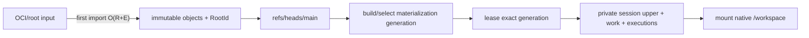
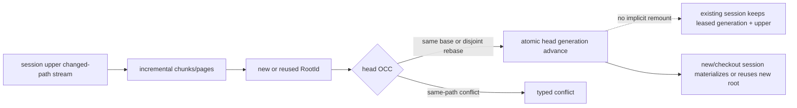
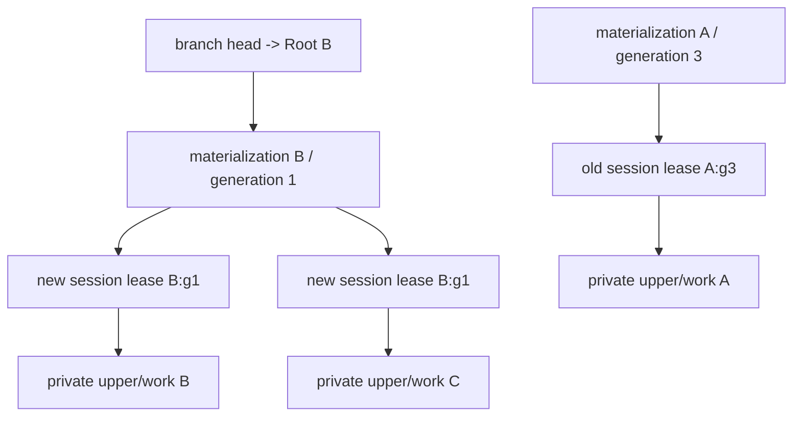
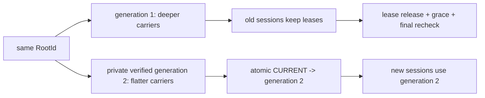
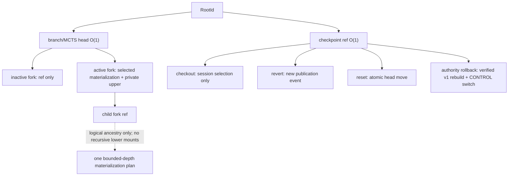
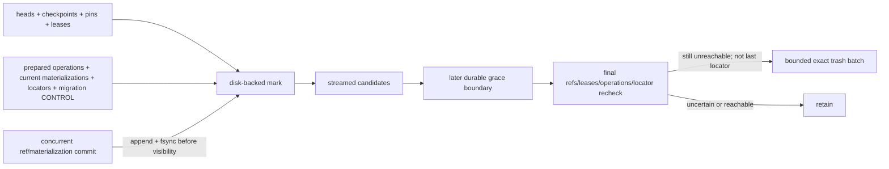
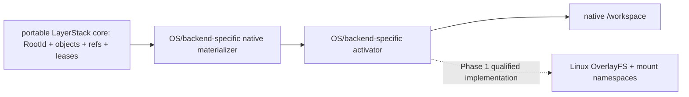

# LayerStack Phase 1 minimal storage contract

Status: proposed replacement contract for Stages 03–07. No Stage 03 implementation may
start until the Stage 02 identity amendment in §3 is owner-approved.

This is the only normative Phase 1 storage contract. Stage documents define delivery
and verification slices; they must not invent another durable layout or identity model.

## 1. Requirements before mechanisms

### 1.1 Evidence-backed problem inventory

| Concrete problem | Evidence | Durable machinery actually required |
| --- | --- | --- |
| The current authority is a small native LayerStack tree, not a logical object store. | `stage_00_baseline_evidence/spec.md:112-144`; `stage_02_portable_root_contract/spec.md:89-190` | A reversible migration boundary; do not mutate legacy paths in place. |
| Stage 02 deliberately writes no candidate state. | `stage_02_portable_root_contract/spec.md:91-97,183-188,386` | The candidate layout can still be redesigned without an on-disk migration. |
| A portable root must exclude host paths, carrier IDs, inode numbers, timestamps of capture, compression, and locator data. | `stage_02_portable_root_contract/spec.md:314-322` | Canonical logical objects and a typed immutable root identity. |
| Later publication may not scan or rewrite the unchanged tree or history. | `../prep/04-seqcdc-space-time-complexity-and-acceptance-criteria.md:144-167` | A bounded-page persistent Merkle tree and a changed-path update algorithm. |
| The hot execution route may not perform CDC, object lookup, packing, GC, or materialization. | `../prep/04-seqcdc-space-time-complexity-and-acceptance-criteria.md:169-186,680-703` | A prebuilt native materialization selected by one bounded activation pointer. |
| Historical roots must share unchanged payload; clean refs must not copy a native tree. | `../prep/04-seqcdc-space-time-complexity-and-acceptance-criteria.md:391-460` | Content-addressed immutable objects plus small mutable refs. |
| Publication must recover automatically and a lost response must be retryable. | Stage 03 and user-required publication idempotency | A durable operation keyed by caller `PublicationId`, plus an atomic branch-head commit. |
| Same-path races conflict while disjoint mutations progress. | Stage 03 and user-required OCC | A branch generation and changed-path comparison against the immutable base and current roots. |
| Materialization, squash, packing, and GC can fail after producing bytes but before visibility. | Existing atomic file helpers in `ephemeral-sandbox/crates/sandbox-runtime/layerstack/src/storage/fs.rs:113-139,151-179,201-240`; Preparation 04 failure gates | Write-private, verify, fsync, atomically replace one pointer, retain the old generation until safe. |
| GC must not miss a ref created during marking and cannot retain all live IDs in RAM. | Preparation 04 `:327-366,498-565`; user-required GC safety | Disk-backed mark runs, a ref-creation barrier, trash/grace, and a final recheck. |
| Candidate authority must roll back to v1 until retirement. | Stages 06–07 migration requirements | One authority fence plus the common migration operation; existing v1 artifacts remain in their current paths until retirement. |
| Phase 2 needs cheap independent branch, checkpoint, and MCTS roots. | Phase 2 compatibility requirement | All logical visibility is a ref to a `RootId`; writable state remains session-private until publication. |
| Phase 3 must change providers without changing logical identity. | Phase 3 compatibility requirement | Physical locators and materializations are outside root/object preimages. |

The current implementation also provides useful boundaries that remain: publication is
already an explicit operation (`stack/ops/publish.rs:25-122`), the logical model is
separate from projection (`model/mod.rs:74-97,170-228` and
`stack/projection/mod.rs:43-181,269-275`), and squash already builds before switching
(`stack/squash.rs:160-348`). Process-only leases
(`stack/lease/registry.rs:17-34,50-83,103-107`) are not sufficient deletion authority
after restart.

### 1.2 Requirement matrix

| Concern | Authoritative value | Mutable? | Persisted representation | Must not be mixed with |
| --- | --- | --- | --- | --- |
| Logical identity | typed immutable object bytes and `RootRecordV3` | no | objects named by typed digest | host paths, generation, provider, compression, authority |
| Mutable visibility | branch, checkpoint, pin, lease | yes | one checksummed atomic ref file per independently changed name | object encoding or carrier layout |
| Physical location | usable locations for a logical object | yes | deterministic loose path or immutable locator run selected by `objects/locators/CURRENT` | logical identity and retention authority |
| Native materialization | one verified native generation for a root/backend/profile | yes, physically | immutable generation plus atomic `CURRENT` | logical root identity |
| Retention | refs, active operation roots, active materializations, policy roots | yes | refs plus operation/GC barrier logs | physical reference counts |
| Recovery | incomplete/terminal operation state | yes | one operation `STATE` and optional bounded work files | a second journal or receipt protocol |
| Authority and migration state | public authority mode plus temporary v1 correspondence/cursor/proof | authority fence yes; migration detail temporary | top-level `CONTROL` plus the active migration operation `STATE` and bounded `work` files | permanent refs or logical object schema |

## 2. Architectural judgment

The previous simplified proposal is still too complex. It retains separate root files,
receipts, control files, lock families, multiple transaction phase files, explicit GC
epoch directory families, quarantine, and permanent trash even though these are not
independent consistency domains.

The minimal design has five primitives:

1. typed immutable objects, including root records;
2. atomic named refs;
3. one resumable operation format;
4. immutable native generations selected by one pointer;
5. immutable physical locator runs selected by one pointer.

One existing writer lock supplies brief linearization for ref, authority, locator, and
GC-barrier changes. Expensive capture, hashing, sorting, materialization, packing, and
marking happen outside that lock. This deliberately favors a small proof surface over
maximum metadata-commit parallelism; the Preparation 04 disjoint-publication throughput
gate decides whether that trade is acceptable.

## 3. Mandatory Stage 02 identity amendment

Stage 02 currently freezes `TreeManifestId` as SHA-256 of the complete canonical flat
tree stream and requires later stages to preserve it unchanged
(`stage_02_portable_root_contract/spec.md:314-324`; the approved counted flat stream is
also in `stage_02_portable_root_contract/contract_v2_owner_decision_d2_5.md:257-263`).
Streaming bounds memory (`stage_02_portable_root_contract/spec.md:346`) but does not
make SHA-256 of a changed middle record incrementally updateable. Every publication
would still read and hash the complete tree, contradicting Preparation 04 `:144-167`.

Before Stage 03:

- keep all v2 golden bytes and IDs immutable and readable;
- owner-approve `RootRecordV3`, whose `tree_root` is a typed `TreeNodeId`;
- define canonical, bounded-size tree pages, directory pages, file segment pages, and
  their exact domain-separated codecs;
- make the complete sorted flat manifest a derived export/validation stream, never an
  identity or publication input;
- import a v2 root to v3 once at `O(R+E)` and assign the resulting v3 `RootId`;
- reject any promise that v2 and v3 roots have the same ID.

Because Stage 02 has no durable candidate state, this amendment creates no candidate
on-disk migration. If owner approval is denied, changed-input-only publication and the
frozen flat identity are mutually inconsistent and Phase 1 must stop.

### 3.1 Logical object graph

All objects use `typed-id = SHA-256(domain || format || canonical-bytes)`. IDs include
the kind; callers cannot reinterpret one kind as another.

| Kind | Bounded content | Strong edges |
| --- | --- | --- |
| `RootRecordV3` | format/capabilities/chunk profile and `tree_root` only | `tree_root` |
| `TreePage` | bounded ordered key ranges and child/page entries | child pages and file/symlink nodes |
| `FileNode` | metadata, length, sparse layout, bounded segment-page root | segment pages |
| `SegmentPage` | bounded ordered chunk/zero extents | chunk payloads |
| `SymlinkNode` or special node | final logical metadata and target/device kind | none |
| `Chunk` | canonical payload bytes | none |

Directory child maps and file segment lists must be paged. An unbounded directory node
or one complete segment vector would merely move the full-rewrite problem. Exact page
size/fanout is a format constant proven by golden vectors and hostile decoder tests.

`parent`, `base`, publication ID, generation, branch name, timestamp, author, blame,
provider, carrier, compression, and physical location are not strong logical edges.
Provenance may be stored in bounded operation diagnostics, but it must not alter
portable content identity.

## 4. Complete `/eos` ownership and storage tree

This is the complete Phase 1 `/eos` ownership model. It is normative for the 2.0
migration. Bracketed v1 entries are pre-existing compatibility artifacts, not a new
`legacy/` namespace. They remain in place while rollback is allowed and are removed by
exact path only after Stage 07 retirement approval.

Directories are created only when their feature first persists a child. A path pattern
below describes where an object goes when present; it does not reserve an empty
directory.

```text
/eos/
├── layer-stack/                                      LayerStack durable owner
│   ├── .storage-writer.lock                          brief cross-process commit fence
│   ├── CONTROL                                       format/authority/retirement fence
│   ├── objects/
│   │   ├── loose/<kind>/<digest-prefix>/<typed-id>   canonical immutable logical bytes
│   │   ├── packs/<pack-id>.pack                      optional immutable compaction output
│   │   └── locators/
│   │       ├── <run-id>.sst                          immutable non-loose location map
│   │       └── CURRENT                               selected locator-run set
│   ├── refs/
│   │   ├── heads/<branch-id>                         mutable branch visibility + OCC
│   │   ├── checkpoints/<checkpoint-id>               named immutable-root retention
│   │   ├── pins/<pin-id>                             explicit policy retention
│   │   └── leases/<lease-id>                         active root/location/generation hold
│   ├── operations/<operation-id>/
│   │   ├── STATE                                     sole recovery/idempotency record
│   │   └── work/                                     bounded private spill/build/mark/trash
│   ├── materializations/<materialization-id>/
│   │   ├── CURRENT                                   selected immutable native generation
│   │   └── generations/<generation>/
│   │       ├── MANIFEST                              verified generation description
│   │       └── carriers/<carrier-id>/...             backend-native immutable tree/carrier
│   ├── gc/
│   │   └── CURRENT                                   active GC operation pointer
│   ├── manifest.json                                 [v1 compatibility window only]
│   ├── workspace.json                                [v1 compatibility window only]
│   ├── base/<base-id>/...                            [v1 compatibility window only]
│   ├── layers/<layer-id>/...                         [v1 compatibility window only]
│   ├── staging/<layer-id>.staging/...                [v1 compatibility window only]
│   └── .layer-metadata/<layer-id>.{digest,bytes}     [v1 compatibility window only]
├── workspace/                                        WorkspaceManager runtime owner
│   ├── manager.json                                  restart recovery catalog
│   ├── .export/<spool-id>                            bounded export scratch
│   └── <workspace-session-id>/
│       ├── upper/                                    unpublished session writes
│       ├── work/                                     OverlayFS kernel work directory
│       └── executions/<execution-id>/
│           └── transcript.log                        command/PTY session scratch
├── storage/                                          non-LayerStack service storage
│   ├── file_auditability/...                         audit service owner
│   └── workspace_recovery/...                        failed-cleanup recovery artifacts
└── runtime/                                          daemon runtime owner
    └── daemon/
        ├── runtime.sock                              local IPC
        └── runtime.pid                               daemon lifecycle
```

There is no durable `/eos/legacy` or `/eos/layer-stack/refs/legacy`. Exact
v1↔v3 correspondence, catch-up cursor, coverage proof, and retirement proof belong to
the active common migration operation. Existing v1 bytes stay in their existing
`manifest.json`, `base`, `layers`, `staging`, and `.layer-metadata` paths until
retirement; renaming them into a new folder would add migration work without adding a
consistency boundary.

The target tree has no `/eos/namespace_execution`. Stage 01 redirects all new
transcripts into the owning session's `executions/` directory. A bounded compatibility
reaper may encounter the old global path during upgrade, but it is residue to remove,
not part of the 2.0 layout. `/workspace` is also not a durable `/eos` directory: it is
the mount presented inside each session's private mount namespace.

### 4.1 Top-level ownership

| Path | Owner and purpose | Lifecycle rule |
| --- | --- | --- |
| `/eos/layer-stack` | LayerStack durable logical objects, refs, recovery state, physical locations, and native materializations. | LayerStack publication/materialization/GC rules apply. |
| `/eos/workspace` | WorkspaceManager session scratch. `upper` is the unpublished writable namespace, `work` is kernel overlay work, and `executions` owns command/PTY scratch. | Session teardown owns cleanup after child tasks, mounts, FDs, and leases release. LayerStack GC never deletes it. |
| `/eos/storage` | Durable state owned by services other than LayerStack. It is not a CAS namespace or a workspace upper. | Each named service owns its own recovery and retention rules. LayerStack must not scan or collect it. |
| `/eos/runtime` | Process-local daemon IPC and lifecycle files. | Daemon startup/shutdown owns cleanup; never a `RootId` or retention input. |

Unpublished bytes in `workspace/<session>/upper` are intentionally session-scoped.
Publication durability begins only when Stage 03 installs immutable objects and
atomically advances a head. Surviving dirty uppers after explicit session destruction
or unrecoverable host-storage loss is not implied; that would require a separate
product requirement.

### 4.2 Justification of every LayerStack path

| Path | Why it must persist | Visibility and deletion |
| --- | --- | --- |
| `.storage-writer.lock` | Reuses the existing cross-process exclusion primitive for brief linearization; avoids a lock namespace. | Kernel lock only; never deletion authority. |
| `CONTROL` | One checksummed atomic store-control record: format version, authority mode/epoch, rollback fence, and optional active migration operation. Detailed migration proof remains in that operation. | Replace temp→fsync→rename→parent-fsync under the writer lock. |
| `objects/loose/...` | Deterministic first durable location for immutable logical bytes. | Publish by no-replace install; delete only through GC. |
| `objects/packs/*.pack` | Optional physical compaction. | Immutable; installed before locator selection; deleted after grace and final recheck. |
| `objects/locators/*.sst` | Bounded immutable mapping only for locations not derivable from a loose ID: pack range or approved existing v1/external carrier range. | Merged/streamed; selected by `CURRENT`. |
| `objects/locators/CURRENT` | One atomic physical-location generation. | Old run set remains usable until readers release and GC grace passes. |
| `refs/heads/*` | Current branch visibility and OCC generation. | Independently atomic; ref creation participates in the GC barrier. |
| `refs/checkpoints/*` | Optional named retention without payload copying. | Root-only atomic ref; deletion removes a retention edge, not payload. |
| `refs/pins/*` | Explicit retention of an otherwise unnamed root or native-materialization policy. | Root-only atomic ref. |
| `refs/leases/*` | Restart-visible protection for an active root/location/materialization with a fence and conservative expiry. | Expiry is evidence for final recheck, never sole deletion authority. |
| `operations/<id>/STATE` | The single recovery and idempotency record for a workflow that crosses a durable failure boundary. | Bounded terminal retention; later collected only after retry window and referenced results are safe. |
| `operations/<id>/work` | Private spill runs, build output, migration proof/cursor, GC mark runs/root log, or trash for that operation. | Exact-owner recovery; never scanned as truth. |
| `materializations/<id>/generations/*` | Verified native carrier generations enable warm native execution and identity-preserving squash. | Immutable after install; only `CURRENT` is selected for new sessions. |
| `materializations/<id>/CURRENT` | One activation point for a verified generation. | Atomic replace; old generation remains protected by exact session leases plus grace/final recheck. |
| `gc/CURRENT` | Names the one active GC operation so ref commits can append barrier roots and restart can retain uncertainty. | Set/clear under writer lock; no separate epoch hierarchy. |
| existing v1 files/directories | Preserve real rollback read/write authority until retirement. | Never moved into a new namespace; exact targets enter deletion only after evacuation proof and destructive approval. |

`materialization-id` is derived from
`(RootId, backend-kind, backend-format-version, target-profile)`. A loose object path is
derived from `(kind, digest)`. Pack/run IDs are hashes of immutable bytes. None needs a
separate identity record.

### 4.3 Minimal persisted record fields

All mutable records have a magic, record version, declared length, checksum, and
monotonic fencing value where noted. Atomic replacement is temp write, file fsync,
rename, and parent fsync.

| Record | Required fields |
| --- | --- |
| top-level `CONTROL` | `format_version`; authority `{legacy,candidate,candidate-retired}`; `authority_epoch`; `rollback_allowed`; optional `active_migration_operation_id` |
| branch head | `root_id`, `generation`, `publication_id` |
| checkpoint | `root_id` |
| pin | `root_id` and bounded reason class |
| lease | protected subject `{root, locator-generation, materialization-generation, operation}`; fence; owner token; conservative expiry/renewal evidence |
| operation `STATE` | kind; scope and caller operation/publication ID; request digest; phase; input refs/generations; prepared result IDs; terminal outcome/error class; retry-retention fence; migration cursor/coverage proof only when kind is migration |
| materialization `MANIFEST` | materialization tuple; generation/fence; ordered relative carrier descriptors; reconstructed capability set; logical verification root/digest; entry/allocated-byte counts; build operation ID |
| materialization `CURRENT` | generation; fence |
| locator `CURRENT` | ordered immutable run IDs; fence |
| GC operation work | phase/cursors; disk-backed root log and sorted mark runs; trash inventory; grace fence |

There is no stored per-path version table. OCC reads the base and current persistent
tree pages for only the changed paths. There is no reference-count deletion authority.
Counts may be diagnostic hints only.

## 5. Values derived instead of stored

- root lookup path from typed `RootId`;
- loose object path and object kind from typed `ObjectId`;
- object length and checksum from the object envelope;
- branch/checkpoint existence from its ref file;
- reachable roots from refs, active operations, materialization pointers, policy, and
  the active GC root log;
- changed-path conflict status by comparing base/current leaf IDs;
- tree entry count, logical bytes, depth, blame, and flat manifest by bounded traversal;
- materialization ID from the root/backend/profile tuple;
- current native path from materialization `CURRENT` and its verified manifest;
- session mount plan from the leased materialization generation plus that session's
  private `upper` and `work`; a later head or `CURRENT` change never rewrites it;
- pack membership and physical ranges from locator runs;
- pack liveness from reachability plus current locator selection;
- v1→v3 correspondence by canonical import; it is retained only as bounded migration
  operation proof while needed, not as a permanent ref class;
- checkpoint survival across squash from its `RootId` ref;
- clean fork ancestry from the root a new head initially references;
- transaction residue and metadata bytes from directory/accounting scans in benchmark
  tooling, not correctness records;
- timestamps, host inode/device numbers, target-image tools, environment variables, and
  provider names from no identity preimage.

Removed as unjustified: a separate roots directory, receipt directory, control
directory, lock hierarchy, catalog hierarchy, journal hierarchy, per-root GC barrier
files, permanent quarantine hierarchy, permanent trash hierarchy, and reserved
directories for future stages. Also removed is a candidate-owned `legacy/` directory:
existing v1 paths plus the common migration operation already supply the required
rollback boundary.

## 6. Operation and concurrency protocol

`operations/` is sparse recovery state, not an audit log. A durable operation exists
only when work can cross a crash boundary and must resume, return a lost response, or
authorize exact cleanup:

| Workflow | Durable common operation? | Reason |
| --- | --- | --- |
| publication, dirty checkpoint publication, revert, reset | yes | idempotent result, OCC input, and head/response crash gap |
| clean checkpoint, clean branch/MCTS fork, checkout | no | one atomic ref write or session-local selection is already the complete commit |
| materialization build | only while building/recovering | private generation may exist before `CURRENT`; same-key callers share one fenced build |
| squash | reuses materialization build | same generation verification and pointer switch; no squash state family |
| pack/locator compaction | only while output is resumable | private pack/run precedes locator `CURRENT` |
| GC | yes | disk mark cursors, barrier roots, grace, and exact trash inventory |
| migration/cutover/authority rollback/retirement | yes | quiesce, parity/coverage proof, authority response recovery, and exact v1 targets |

Terminal state is retained only for its declared retry/ack or recovery window, then its
operation-owned roots/work are released and ordinary GC decides byte liveness. There
is no permanent receipt, transaction, or operation-history family.

### 6.1 Incremental publication

1. Admit a caller-supplied `PublicationId`. Publication idempotency is branch-scoped;
   derive the operation ID from `(publication-kind, BranchId, PublicationId)`.
   Open/create that operation and return its terminal result if already complete;
   different request bytes under the same scoped ID are rejected.
2. Snapshot `{base_root, base_generation}` from the branch head. Capture a bounded
   changed-path stream and build chunks/pages outside the writer lock. Install
   immutable objects idempotently.
3. Persist operation phase `prepared` with result root and changed-path spill/run.
4. Under the writer lock:
   - if the head is unchanged, append/fsync the result root to the active GC root log
     when `gc/CURRENT` exists, then atomically install the new head;
   - if it advanced, release the lock, compare only changed paths in base/current;
     same-path differences produce a typed conflict; disjoint changes rebase on the
     new root outside the lock and retry within a fixed retry/time budget.
5. Before releasing the branch/writer commit exclusion, persist the terminal operation
   outcome. If the process dies after head commit but before this write, the next
   recovery or writer observes `head.publication_id` and repairs the terminal result
   before permitting another head advance. The head, not the outcome record, is
   publication authority.

Only the final metadata commit is serialized. Disjoint progress is a measured
throughput requirement, not inferred from the protocol.

Terminal publication outcomes have an API-visible acknowledgement/retention contract:
within the advertised bounded time/count/byte window, retry returns the exact outcome;
after explicit acknowledgement or expiry it returns `OutcomeExpired` and never
re-executes that ID. Admission rate plus the configured window bounds outcome metadata.
The window, eviction count/bytes, and expired-ID tombstone/fence behavior are measured
and fixed before implementation; indefinite unacknowledged retention is forbidden.

### 6.2 Checkpoint, branch, checkout, revert, reset, and MCTS

- clean checkpoint: atomically write `refs/checkpoints/<id> = RootId`; `O(1)` metadata,
  zero payload allocation;
- dirty checkpoint: perform ordinary incremental publication to obtain a root, then
  install the checkpoint ref;
- clean branch or MCTS fork: create a head pointing to the parent root with generation
  zero; `O(1)` metadata, zero parent payload allocation;
- writable MCTS state: allocate only a private workspace upper/work pair for an active
  fork; inactive forks retain refs only;
- checkout: change which head a session follows; it does not mutate a head;
- revert: publish a new branch event selecting a historical logical tree; content
  identity may reuse that historical `RootId`, while head generation and publication
  outcome advance;
- reset: atomically move the selected head to an existing root with a new generation
  and explicit reset operation; it creates no new logical root;
- authority rollback: atomically switch top-level `CONTROL` to legacy only after the
  migration cursor proves v1 coverage through the candidate public sequence.

Native mount depth is bounded by materialization policy, not logical ancestry. No clean
fork creates a complete native tree.

### 6.3 Materialization and squash

`materializations/` is a managed native view of portable logical state. It is cache-like
because a root can be reconstructed from verified logical objects, but it is not
blindly disposable: a selected generation can serve active sessions and can
temporarily be the last verified physical locator for native carrier data. Deletion
therefore uses leases, last-locator checks, grace, and final recheck rather than cache
eviction alone.

Materialization reconstructs an immutable private generation from a root. Linux Phase
1 stores one or more immutable native carrier directories, ordered newest-first for
the OverlayFS lower plan. It streams objects through bounded buffers, verifies every
typed ID, required capability, and final root, fsyncs the carrier tree and `MANIFEST`,
then switches `CURRENT`.

Admission for the same derived `materialization-id` is single-flight across callers.
One deterministic common build operation and fencing token owns private work; later
callers attach to its result or take over after conservative recovery. The short
writer-lock section selects the winning verified generation. A losing complete
generation remains an unreachable orphan for bounded recovery/GC, never a second
active copy. Global and per-profile build-worker, staging-byte, current-generation,
pinned-generation, FD, and mapping quotas apply backpressure before allocation. An
active leased generation is never evicted to satisfy a quota.

Session admission resolves `CURRENT`, validates its `MANIFEST`, and durably leases that
exact `{materialization-id,generation,fence}` before mounting. Multiple sessions may
share its immutable carriers and host page cache while each owns a different
`/eos/workspace/<session>/{upper,work,executions}` tree and mount namespace. A
`CURRENT` switch affects only later sessions. An existing session is never silently
remounted, and a branch-head update creates/selects a different root key rather than
mutating a materialization in place. Explicit checkout/remount or a new session is
required to observe a new head.

Warm command/file/PTY paths read only the already selected native plan and never invoke
logical traversal or this workflow.

Squash uses exactly the same generation build and pointer switch. It changes physical
carrier shape, not `RootId`, refs, or logical objects. Checkpoints survive because they
name roots, not carrier generations. A squash request for an already satisfactory
generation is idempotent.

### 6.4 Compaction and locators

Loose deterministic paths require no locator. Packing streams verified objects into an
immutable pack and writes an immutable locator run. After both are durable, a short
writer-lock section atomically replaces locator `CURRENT`. Source locations remain
valid through reader leases, at least one completed later durable grace boundary, and
final recheck. The last usable locator is never removed before a verified replacement
is selected.

### 6.5 GC

1. Create a GC operation with disk-backed mark runs and root log; under the writer
   lock set `gc/CURRENT`.
2. Snapshot refs, active/prepared operations, active materializations, current
   locators, and policy roots into the root log. Traverse in bounded batches and
   external-sort/deduplicate mark runs. No all-live `HashSet` is permitted.
3. Every concurrent ref or materialization visibility commit appends/fsyncs its root
   to the same log before visibility. Drain appended roots to a fixed point.
4. Under the writer lock, close the barrier only after no undrained root remains.
5. Stream candidate comparison into private deletion-candidate records while bytes
   remain readable at their normal locations.
6. After at least one complete later durable GC grace boundary, take the mutation
   closure lock and final-recheck all refs, leases, operations, active
   materializations, locator `CURRENT`, and newly conservative state. For one bounded
   batch still unreachable and not the last locator, rename exact paths into the GC
   operation's `work/trash`, fsync, and record `deleting` before releasing the lock.
   New ref creation always validates a complete reachable graph and therefore cannot
   resurrect a now-missing object.
7. Unlink the exact trash batch outside the lock. On restart, ambiguous pre-`deleting`
   trash is restored before ref mutations are admitted; durable `deleting` state may
   resume exact unlink. Uncertainty retains.

Restart resumes from durable cursors or conservatively abandons the cycle and retains
trash. It never guesses that data is dead. GC worker count, run fan-in, queue size,
open files, maps, and deletion batch are fixed configuration bounds.

### 6.6 Lifecycle diagrams

Initial workspace creation imports or selects a logical root before allocating native
or writable session state:



Publication creates immutable logical state and advances visibility; it does not
rewrite a mounted session or unchanged history:



Multiple sessions can use the latest head or keep a leased old generation. Immutable
lowers are shared; writable state is never shared:



Squash changes only the native generation for one materialization key:



Checkpoint, rollback operations, and MCTS all reuse roots rather than copying payload:



GC treats every visibility and active-use mechanism as a root and deletes only after
the concurrent-creation barrier closes:



## 7. Failure boundaries

| Operation / crash point | Durable state after restart | Required recovery |
| --- | --- | --- |
| publication before operation `STATE` | old head only | no publication occurred; retry creates/opens same ID |
| publication while objects/pages are installed | old head plus unreachable immutable bytes | resume preparation or later GC |
| publication after `prepared`, before head | old head and prepared result | resume OCC/commit using recorded base |
| publication after head, before terminal `STATE` | new head names publication ID | repair terminal result and return it |
| checkpoint before atomic ref rename | no checkpoint | retry |
| checkpoint after ref rename | one complete root ref | return existing result; never copy payload |
| ref/barrier append before ref rename | conservative extra GC root | retain; next GC removes if unreachable |
| materialization before verified generation | old `CURRENT`, private work | resume or reap exact operation |
| materialization after generation fsync, before `CURRENT` | old active generation plus orphan complete generation | verify and finish or later collect |
| materialization after `CURRENT` | new active generation | retain old until lease/grace/final recheck |
| squash at any point | same logical `RootId`; old or new physical generation active | same recovery as materialization |
| pack before locator `CURRENT` | source location still selected | orphan pack/run may be collected |
| pack after locator `CURRENT` | replacement selected, sources retained | lease/grace/final recheck before source delete |
| GC during mark | `gc/CURRENT`, durable root log/runs/cursor | resume or abandon conservatively |
| GC after final recheck/move to trash | bounded exact batch recorded; new refs validate and cannot select it | restore ambiguous pre-commit trash, or resume exact durable `deleting` unlink |
| GC during final unlink | some exact candidates deleted after proof | resume exact inventory; never infer a broad directory target |
| authority change before `CONTROL` rename | old authority | retry |
| authority change after `CONTROL` rename | new authority/epoch | resume migration or rollback rules from `CONTROL` and its named operation |

## 8. Complexity, space, and memory

Definitions match Preparation 04: `R` payload bytes, `E` entries, `U` changed input
bytes, `K` emitted chunks/segments, `P` changed logical paths, `N` tree entries, `Q`
OCC compared paths, `D` native depth, `V` live logical objects, `A` allocated physical
objects, and `B` the configured memory budget.

| Operation | Required bound | Payload/space consequence |
| --- | --- | --- |
| first import | `O(R+E)` | one streamed logical import; bounded staging |
| later publication | `O(U+E_changed+K+P log_B N)` plus bounded ordering of changed events | unchanged tree pages and chunks are shared; no total-tree/history pass |
| no-op publication | proportional to captured evidence needed to prove no change; never history size | no new payload |
| OCC attempt | `O(Q log_B N)`; fixed retry/time budget | changed-path spill only |
| clean checkpoint/branch/MCTS fork | `O(1)` metadata | zero copied parent payload/native tree |
| dirty checkpoint | ordinary incremental-publication cost plus one ref | only changed payload/pages |
| warm activation/execution | `O(D)`, final `D≤64` | no CDC/object/pack/GC work |
| cold reconstruction | `O(R+E+D)` streamed | only active or explicitly pinned materialization |
| squash/materialization build | `O(S+E_s)` outside lock; pointer CAS/replace inside | temporary one bounded new generation; old grace-protected |
| same-root concurrent session admission | `O(D)` validation per session; shared immutable carriers/page cache | one private upper/work/execution tree per session; no copied lower payload |
| same-key concurrent cold requests | one fenced build plus bounded waiters | no intentionally duplicated active build; a crash-race orphan is bounded recovery residue |
| locator compaction | proportional to selected objects/bytes; bounded external merge | at most bounded target plus protected sources |
| GC mark | `O(V+strong-edges)` disk-backed | `O(B)` resident memory plus bounded mark runs |
| GC sweep | streamed/sliced `O(A)` | bounded trash batch; no all-live resident set |
| restart | incomplete-operation work plus bounded active metadata | never total history in memory |

The exact Preparation 04 limits remain normative: 32 KiB CDC windows/rings, at most
four CDC workers, zero queued payload chunks, 16 records/64 KiB metadata queue,
eight-way 64 KiB merge readers, 256 KiB operation encoder, 16 MiB cache, 4 MiB
per-publication accounting, 64 MiB global publication semaphore, depth 64, and the RSS
envelopes in Preparation 04 `:286-325`. Registries, caches, queues, buffers, iterators,
workers, retry loops, FDs, mappings, leases, temporary paths, and deletion batches are
all explicitly capped.

New logical storage/GC code is safe Rust. There are no detached tasks, strong ownership
cycles, or permits/FDs/mappings that outlive their operation owner. Shutdown cancels
and joins owned tasks before releasing state. `Arc`/reference counts may protect live
process use but never authorize deletion.

Space must remain near one current native materialization per active or
native-materialization-pinned key plus unique retained history and bounded
metadata/staging. Many sessions on one key share immutable carriers; only their
private uppers/work/execution scratch scale per session. Admission quotas bound
current/pinned keys, builds, staging bytes, per-session upper allocation, and peak
old/new generation overlap. Measure duplicate physical bytes, write amplification,
metadata amplification, pack slack, transaction residue, unreachable bytes, and
materialization residue using Preparation 04 `:391-565`. These are gates, not claims:
all Stage 03–07 benchmark results remain `NOT_RUN` until recorded with commands,
artifacts, environment, and pass/fail values.

## 9. Phase 2 and Phase 3 compatibility

### Phase 2

- Branches, checkpoints, pins, and MCTS frontier nodes all retain the same `RootId`
  object graph; policy chooses the ref class, not a new storage mechanism.
- A clean fork creates one head and no payload. Only admitted active forks allocate
  bounded workspace upper/work state.
- Sessions lease an exact native generation. A head update or squash never mutates an
  admitted mount; checkout/remount/new admission is explicit.
- Publishing a fork uses the same changed-path OCC and operation protocol.
- Checkout, revert, reset, checkpoint deletion, branch deletion, and authority rollback
  remain distinct API operations.
- Materialization removes logical ancestry from native mount depth; flattening does not
  change identity.
- v2 and v3 refs are format-aware. V2 remains readable during migration; it is imported
  to a distinct v3 ID rather than reinterpreted.

### Phase 3

- Logical providers implement get/put of typed immutable bytes, atomic/fenced mutable
  refs, bounded iteration, and physical locator access.
- Each execution platform supplies a separate native materializer and activator for a
  qualified backend capability profile. It may change carrier shape and mount
  mechanism but not logical IDs or ref semantics.
- Provider/backend IDs and physical keys live only in locators/materialization
  manifests. They never enter logical object preimages.
- The same golden codec, mutation/OCC, crash, missing-object, and corruption suites run
  against every provider; native suites additionally run per materializer/activator.
- A provider or native backend that cannot supply required atomic, fencing,
  metadata-preservation, or activation semantics is rejected; the logical contract is
  not weakened to accommodate it.

## 10. Environment, backend, and dependency audit

The correct portability boundary is:



The logical core and CAS algorithm are independent of target-image userland and host
paths. Native execution is not universally host-OS agnostic: Phase 1 implements and
qualifies a Linux materializer and Linux OverlayFS/mount-namespace activator. Docker
Engine on Linux uses that backend directly. Docker Desktop on macOS or Windows can use
it only inside its Linux VM; the effective kernel and backing filesystem are the VM's,
not native APFS or NTFS semantics. Firecracker, WASM, another OS, or another mount
backend requires its own adapter and qualification.

`/eos` must be on a qualified backing filesystem that preserves the required atomic
rename/fsync, permissions, xattrs/whiteouts, hardlink, sparse-file, and crash behavior.
A Docker-managed Linux volume is the preferred Phase 1 deployment. Host bind mounts,
translated APFS/NTFS paths, NFS/SMB, and other remote filesystems are unsupported until
their exact configuration passes the backend suite.

The design adds no SQLite, embedded database, metadata service, sidecar, target-image
helper, or new third-party dependency. It uses safe Rust plus existing mandatory
hashing/serialization/runtime facilities and existing LayerStack atomic filesystem
primitives. Target execution does not depend on shell, libc, coreutils, package
manager, FUSE, reflink, tar, or `cp`. No environment value contributes to identity.
CDC, CAS lookup, packing, and GC do not enter warm command/file/PTY routes.

The supported claim is capability-based, not “all images” or “95% of Docker images”:
standard OCI Linux images are intended to work when their rootfs/config, architecture
or configured emulation, logical node types, security policy, backing filesystem, and
Linux mount capabilities satisfy the qualified profile. The test matrix includes
glibc, musl, minimal/distroless, shell-less, read-only target root, non-root, amd64,
and arm64. A `scratch` image supplies no executable, so command execution cannot
succeed without a workload binary even though file/workspace APIs and storage may
work. Device/FIFO/xattr/sparse/hardlink or security capabilities fail closed when the
backend cannot preserve them. No percentage or universal portability claim is made
until representative measured evidence supports one; Stage 07 records exact image,
kernel, filesystem, architecture, and backend results.

## 11. Acceptance invariants

1. A visible ref names only a fully durable, verifiable root graph.
2. A `RootId` has one portable logical meaning independent of provider and layout.
3. Publication never requires an unchanged-tree or history scan.
4. Clean refs allocate no payload or complete native tree.
5. Warm native paths perform no logical-storage maintenance.
6. Physical compaction and squash do not change logical identity.
7. Idempotent retry returns the committed result or a stable conflict, never duplicates
   a logical publication.
8. GC deletion requires reachability proof plus barrier, grace, and final recheck;
   uncertainty retains.
9. No temporary architecture exists solely to preserve an old stage boundary.
10. Every performance statement is labeled requirement or measured result.
11. A session leases one exact immutable materialization generation and owns a private
    writable upper/work/execution tree; branch or `CURRENT` updates never mutate it.
12. LayerStack GC owns only `/eos/layer-stack`; WorkspaceManager and other services
    retain exclusive lifecycle authority over their `/eos` subtrees.
13. Logical portability does not imply an unqualified native backend or image
    compatibility percentage.
