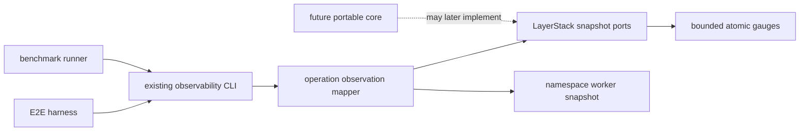
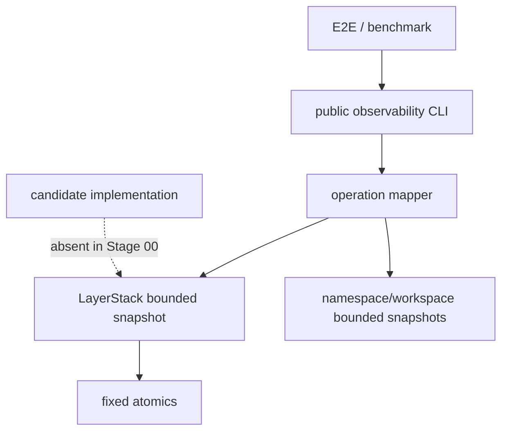
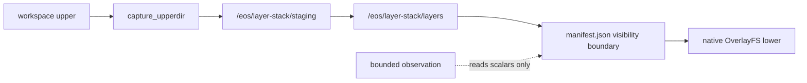
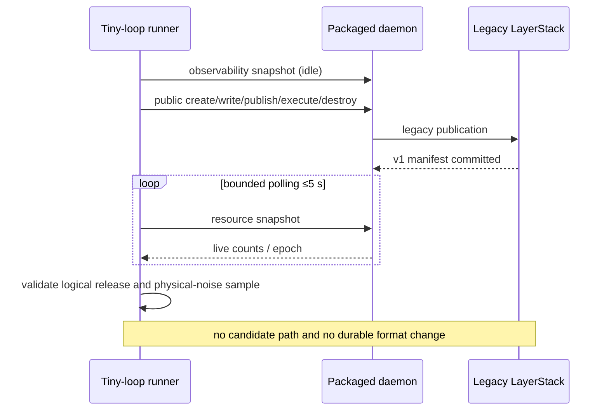

# Stage 00 — Baseline and evidence seams

[Implementation overview](../index.md) · [Stage 00 E2E plan](e2e_test.md) · [Preparation 03](../../prep/03-seqcdc-cas-and-squash-decision.md) · [Preparation 04](../../prep/04-seqcdc-space-time-complexity-and-acceptance-criteria.md)

Product root: `/Users/yifanxu/Ephemeral-AI-Lab/ephemeral-sandbox`
Test root: `/Users/yifanxu/Ephemeral-AI-Lab/ephemeral-sandbox-test`

## 1. Stage contract

| Field | Contract |
| --- | --- |
| Status | Proposed; implementation must start on mandated branch `upgrade-2.0-phase-1` after its newest approved immutable base is recorded |
| Dependencies | None; this is the root stage |
| Owners / affected crates | `sandbox-runtime-layerstack`, the operation modules in `sandbox-runtime`, `sandbox-config`, existing observability CLI projection; external E2E catalog and benchmark laboratory |
| Objective | Freeze an immutable, reproducible legacy baseline and add bounded structured route/resource evidence that every later candidate stage can use without inventing a test-only product API. |
| System-visible outcome | Feature-off operation remains byte-for-byte compatible; the existing observability snapshot/layerstack surfaces identify schema version, authority, route, fallback/mismatch counts, resource ownership, dependency fingerprint, and quiescence. |
| Scope | Git/toolchain/environment manifests, dependency and feature snapshots, current v1 golden data, deterministic tiny corpora, bounded gauges, benchmark result fields, required-host matrix using the sole pinned Ubuntu 24.04 image, baseline noise. |
| Non-goals | No `RootId` v2, SeqCDC, CAS object, candidate write/read, layout migration, scratch relocation, full suite, or production enablement. |
| Entry | Planning observations remain attributable; the implementer has fetched and verified the newest approved product revision, created exact branch `upgrade-2.0-phase-1` from it, and recorded its immutable base, upstream, clean scoped worktrees, and responsible implementer. The planning-time product/test commits below are evidence anchors, not a substitute for that implementation-base record. |
| Exit | Focused Rust/E2E baseline proofs pass; two independently generated dependency snapshots compare equal; feature-off routes all report `legacy`; one 30–60 second long-lived sentinel returns logical gauges to baseline and freezes a raw physical-memory noise band; every artifact validates against its schema. |
| Rollback | Revert the additive observation/schema/config fields and external fixtures. No durable product format changes or candidate artifacts exist. |

Stage 00 provides the evidence contract, not a favorable measurement. A failing baseline is retained as measured evidence and blocks the affected later gate; it is never relabeled as candidate regression.

## 2. Current evidence

| Status | Repository / path | Symbol or evidence | Current fact and stage effect |
| --- | --- | --- | --- |
| observed | product `crates/sandbox-runtime/layerstack/src/model/mod.rs:10,74-79,163-168` | `MANIFEST_SCHEMA_VERSION`, `Manifest`, `manifest_root_hash` | Schema v1 hashes serialized physical `LayerRef` paths. Freeze exact fixtures; do not call this a portable logical root. |
| observed | product `crates/sandbox-runtime/layerstack/src/stack/ops/publish.rs:55-115` | publication transaction | Planning precedes the writer lock; staging is written/fsynced, renamed, then active-manifest OCC is rechecked and atomically replaced. Failpoints must surround every visibility boundary. |
| observed | product `crates/sandbox-runtime/layerstack/src/stack/mod.rs:38-69` | `Lease`, `LayerStack` | Leases and substitutions are process-resident. Stage 00 exposes bounded counts without copying their cardinality into logs. |
| observed | product `crates/sandbox-runtime/layerstack/src/storage/fs.rs` | `write_atomic`, `syncfs_storage_root` | The current manifest write uses same-filesystem temp, fsync, rename, and parent fsync; Linux uses `syncfs`, non-Linux directory fsync. |
| observed | product `crates/sandbox-runtime/layerstack/tests/occ_merge_bench.rs:1-24` | ignored analytical benchmark | It supplies workloads/result conventions but does not measure a future backend. Its outputs are excluded from measured evidence; any retained planning projection is `estimated` and records its model source. |
| observed | product `crates/sandbox-runtime/operation/src/services.rs:411-460` | `observability_snapshot`, `ownership_topology_snapshot`, `observe_layerstack` | A real bounded observability seam already exists; extend it rather than add a diagnostic daemon. |
| observed | product `crates/sandbox-cli/src/projection/observability.rs:45-115` | `snapshot`, `layerstack` | Public authenticated CLI projections already expose the operation observations. |
| observed | product `crates/sandbox-runtime/namespace-execution/src/engine.rs:114-116` | `background_worker_snapshot` | Worker cardinality can be observed without starting the PTY reactor. |
| observed | product `crates/sandbox-config/src/configs/runtime.rs:130-191` | `LayerstackConfig::validate` | No storage rollout selector exists. Stage 00 introduces a typed, legacy-only initial value with validation. |
| observed | product `config/prd.yml:12-21`, `config/bench.yml:30-37` | runtime roots | Current roots are `/eos/layer-stack`, `/eos/workspace`, and `/eos/namespace_execution`. |
| observed | test `e2e/harness/catalog/declarations.py:36-48` | `e2e_test` | Stable typed case declarations exist and are mandatory for new live cases. |
| observed | test `e2e/harness/runner/resources.py:327-405` | run resource controller | Run-owned LIFO cleanup and lifecycle edges already exist; do not create a second scheduler. |
| observed | test `benchmark/backend/benchmark_lab/runner.py` | campaign runner | The benchmark laboratory has one sequential campaign scheduler and bounded evidence. |
| observed | planning host | preflight | Darwin 25.4.0 arm64; Docker Desktop 4.76.0 (228118), Engine 29.5.2, LinuxKit arm64 kernel 6.12.76; Rust/Cargo 1.96.0; Python 3.14.3/pytest 9.1.1. This is observed, not qualification. |
| observed | `cargo metadata --all-features` on current host | dependency baseline | 20 workspace packages, 291 resolved packages, 271 external packages, 116 direct external edges, and 490 enabled external package-feature pairs. These counts are descriptive only; exact sorted identities are the gate. |
| proposed | this stage | `StorageRouteObservationV1`, `StorageResourceObservationV1` | Add bounded fields to existing observations and benchmark artifacts. |
| inferred | current cleanup code | boot sweep | A manifest-only keep set is insufficient for the future CAS graph; Stage 00 records this as a defect but does not change authority. |
| proposed | user policy decision, 2026-07-24 | mandatory implementation branch | Use exact branch `upgrade-2.0-phase-1`; before edits fetch and verify the newest approved product revision and record its immutable base, upstream, clean scoped worktrees, and responsible implementer. Planning creates no branch. |

### Frozen current flow

```text
workspace upper
  -> capture_upperdir (metadata + WriteFile source path)
  -> LayerStack::publish_changes
  -> whole-file native layer staging
  -> fsync + rename
  -> OCC manifest commit
  -> native lower projection / OverlayFS mount
  -> ordinary command, file, PTY, stdin on native files
```

## 3. Resulting file and folder structure

### Proposed source and evidence tree after Stage 00

```text
ephemeral-sandbox/
├── Cargo.toml                                             [unchanged contract]
├── Cargo.lock                                             [unchanged contract]
├── config/
│   ├── prd.yml                                            [modify] — explicit rollout_mode: legacy
│   └── bench.yml                                          [modify] — explicit rollout_mode: legacy
├── crates/sandbox-config/src/configs/runtime.rs            [modify] — closed rollout enum; only legacy admitted
├── crates/sandbox-runtime/layerstack/src/service/observe.rs [modify] — bounded route/resource snapshot
├── crates/sandbox-runtime/layerstack/tests/
│   ├── baseline_v1_golden.rs                              [add]
│   └── resource_observation.rs                            [add]
├── crates/sandbox-runtime/operation/src/observability.rs   [modify] — aggregate bounded storage gauges
├── crates/sandbox-runtime/operation/tests/
│   └── storage_route_observation.rs                       [add]
└── crates/sandbox-cli/tests/observability.rs               [modify] — projection schema compatibility

ephemeral-sandbox-test/
├── e2e/runtime/layerstack_baseline/
│   ├── test_baseline_route.py                             [add]
│   └── SPEC.md                                            [add]
├── e2e/tools/
│   ├── verify_external_dependency_delta.py                 [add] — stdlib-only canonical comparer
│   └── test_verify_external_dependency_delta.py            [add] — synthetic exact-delta fixtures
├── e2e/fixtures/layerstack_phase1/v1/
│   ├── corpus-manifest.json                               [add]
│   ├── expected-tree.json                                 [add]
│   └── expected-roots.json                                [add]
├── e2e/schemas/layerstack_phase1/
│   └── evidence-v1.schema.json                            [add]
├── benchmark/presets/layerstack-phase1-tiny-baseline.yml  [add]
├── benchmark/backend/benchmark_lab/
│   ├── models.py                                          [modify] — bounded Phase 1 fields
│   └── observability.py                                   [modify] — existing public snapshot parser
├── .e2e-state/                                            [unchanged contract] — run-owned, never source
└── .benchmark-state/                                      [unchanged contract] — run-owned, never source
```

Tests remain outside production `src/`; observation is an operational capability, not a test backdoor.

### Runtime storage after Stage 00

Annotation format is
`[change; class; owner; create→visible→durable→recover→delete; RootId; R/W mode; bound; space; permission/exposure]`.
`truth` means authoritative durable state, `cache` rebuildable state, `txn` transaction staging, and `scratch` ephemeral runtime state.

```text
/eos/
├── layer-stack/ [existing; truth-root; LayerStack; boot→open→dir-fsync→boot-scan→installation removal; RootId(v1)=indirect physical hash; legacy R/W; one; M; daemon 0700/masked]
│   ├── .storage-writer.lock [existing; coordination; LayerStack; open→lock-visible→kernel→reacquire→close; no; legacy R/W; one FD; M; daemon-only]
│   ├── manifest.json [existing; truth; Manifest v1; publish→atomic rename→file+parent fsync→parse/validate→supersede; yes-v1 physical; legacy R/W; one active; L_hot metadata; daemon-only]
│   ├── workspace.json [existing; truth; base builder; bootstrap→rename→fsync→validate→installation removal; contributes through v1 layer ref; legacy R/W; one; L_hot metadata; daemon-only]
│   ├── base/
│   │   └── B000001-base/ [existing; native carrier; base builder; bootstrap→rename→syncfs→manifest reachability→installation removal; via physical v1 ref; legacy R; one; L_hot; lower read-only/masked]
│   ├── layers/
│   │   └── <layer_id>/ [existing; truth/native carrier; publish; stage rename→manifest commit→syncfs→manifest keep-set→squash/delete; via physical v1 ref; legacy R/W; D≤current policy, final D≤64; L_hot; lower read-only/masked]
│   ├── staging/
│   │   └── <layer_id>.staging/ [existing; txn; publish; allocate→private→fsync→rename or boot reap→delete; no; legacy W; one admitted publication; P_staging; 0700/masked]
│   └── .layer-metadata/
│       ├── <layer_id>.digest [existing; truth-adjacent metadata; publish; post-layer→visible→atomic write→recompute/validate→layer deletion; affects current v1 comparison, not portable identity; legacy R/W; O(D); M; daemon-only]
│       └── <layer_id>.bytes [existing; accounting metadata; publish; post-layer→visible→atomic write→recompute→layer deletion; no; legacy R/W; O(D); M; daemon-only]
├── storage/
│   ├── file_auditability/ [existing; truth; FileService; file operation→operation visibility→owner durability→boot recovery→policy cleanup; no; service R/W; configured bound; M; daemon-only]
│   └── workspace_recovery/ [existing conditional; recovery truth; holder-exit; failed cleanup→owner-visible→fsync→boot retry→successful reap; no; recovery R/W; bounded by failed sessions; P_staging; daemon-only]
├── workspace/
│   ├── manager.json [existing; recovery truth; WorkspaceManager; handle change→atomic visibility→fsync→boot reap→supersede; no; workspace R/W; active handle count; M; daemon-only]
│   ├── .export/<spool_id> [existing; scratch; export operation; request→private bounded stream→close/API read→exact-spool or boot reap→delete; no; operation R/W; configured spool bound; P_staging; daemon-only/masked]
│   └── <workspace_session_id>/
│       ├── upper/ [existing; scratch/current writable; workspace; session create→mount-visible→native writes→recovery inspect→post-command teardown; no; workspace R/W; ΣU_active; 0700/masked except /workspace projection]
│       └── work/ [existing; OverlayFS scratch; overlay adapter; mount→kernel-private→kernel→unmount/reap→delete; no; provider R/W; per active session; ΣU_active metadata; masked]
├── namespace_execution/
│   └── <namespace_execution_id>/
│       └── transcript.log [existing remove-later; scratch; CommandExecValue; admit→command-visible→buffered file→Drop/boot cleanup→delete; no; namespace execution R/W; transcript cap; M/ΣU_active; 0700/masked]
└── runtime/
    └── daemon/
        ├── runtime.sock [existing; ephemeral control; gateway; boot→ready→socket permissions→stale-socket recovery→shutdown; no; service R/W; one; M; 0600/masked]
        └── runtime.pid [existing; ephemeral control; gateway; boot→ready→file sync policy→identity check→shutdown; no; service R/W; one; M; daemon-only]
```

Delta from current layout: no durable-path delta. Only bounded observation values are exposed through the authenticated existing observability operation; `/eos` remains masked from workloads.

## 4. SRP, SOLID, and coupling design

### Defect and choice

Current evidence is scattered across `StackObservation`, operation topology, logs, E2E probes, and a modeled ignored benchmark. Later stages cannot prove strict route selection or logical release with logs alone. The smaller alternative—test log scraping—cannot distinguish a candidate pass from legacy fallback, is unbounded by path cardinality, and is not a typed compatibility contract. The stage therefore extends existing operational observations with scalar/capped aggregates only.

| Component/type | One responsibility | Dependencies | Dependents | Extension seam | Reason to change | Must not own |
| --- | --- | --- | --- | --- | --- | --- |
| `LayerStackRouteSnapshot` | Report current storage route/authority counters | LayerStack atomics | operation observation | additive schema version | rollout route changes | policy, persistence, test scheduling |
| `LayerStackResourceSnapshot` | Report owned-resource current/high-water counts | bounded gauges | operation/benchmark | additive fields | resource class changes | RSS sampling, cleanup |
| operation observation mapper | Translate runtime snapshots to public projection | narrow snapshots | daemon/CLI | versioned response | public schema change | storage mutation |
| E2E case | Assert packaged route and cleanup | public CLIs | reports | typed declaration | behavior under test | product internals |
| benchmark preset | Schedule paired tiny control samples | existing runner | report/export | plan YAML | factor/corpus change | another scheduler |



Forbidden edges: layerstack → operation/E2E/benchmark; portable core → observability transport/Docker; namespace execution → LayerStack; production → test support. Construction passes observation handles explicitly; no process-global context object is added.

### Dependency delta

| Manifest/graph | Baseline packages/features/edges | Resolved package/version delta | Feature delta | Direct external edge delta or relocation | System/runtime delta | Internal edge change | Evidence |
| --- | --- | --- | --- | --- | --- | --- | --- |
| product, current host/all-features | 291 resolved / 271 external / 116 direct external / 490 external feature pairs | none required | none required | none | none | none | sorted `cargo metadata` snapshots |
| product, each frozen target/feature invocation | Stage 00 captures exact identity sets | none required | none required | none | none | none | `dependencies/<triple>/<invocation>/*.json` |
| Python/npm manifests and locks | current tracked bytes | none | none | none | none | none | hashes before/after |
| image/system/runtime surface | gateway + daemon + Docker only | none | none | none | none | none | process/socket/image-package inventory |

Counts are a diagnostic; the pass condition is exact sorted-set and multiset equality.

### Portability impact

| Boundary | Host/image assumption before | Assumption after | Owner | Evidence now | Later evidence |
| --- | --- | --- | --- | --- | --- |
| observation | host path strings may appear in debug output | closed enums and integers; no path/chunk labels | operation adapter | schema/golden | Stage 11 required-host coverage |
| dependency graph | current host graph only | frozen per target/feature invocation | build evidence | current Darwin snapshot | Stage 11 required-release host rows |
| target image | Ubuntu usually used by tests | every Phase 1 row uses Ubuntu 24.04 OCI index `sha256:4fbb8e6a8395de5a7550b33509421a2bafbc0aab6c06ba2cef9ebffbc7092d90`; storage evidence uses outside observation | Docker adapter | pinned index and resolved platform manifest | Stages 05/11; cross-image portability is after Phase 1 and non-gating |
| CPU | scalar/current code | no candidate CPU claim | future core | N/A | Stage 03 scalar and Stage 11 matrix |

No unexecuted row is qualified. Adding a chunker profile later changes the profile implementation/golden catalog, not observation transport. Adding Firecracker or WASM changes their materialization adapter and capability reporter, not route schema semantics or logical storage. Phase 2 consumes immutable IDs and publications added later; Stage 00 only makes their eventual evidence shape stable.

Transitional ledger: `rollout_mode=legacy` stays as the safe default through Stage 09; legacy route fields remain readable through Stage 11 and are removed only after Stage 11 retirement evidence. No adapter is introduced here.

## 5. Type, class, and field design

```rust
#[derive(Clone, Copy, Debug, Eq, PartialEq, serde::Deserialize)]
#[serde(rename_all = "snake_case")]
pub enum StorageRolloutMode {
    Legacy,
}

#[derive(Clone, Copy, Debug, Eq, PartialEq, serde::Serialize)]
pub enum StorageAuthority {
    LegacyV1,
    CandidateV2,
}

#[derive(Clone, Debug, Eq, PartialEq, serde::Serialize)]
pub struct LayerStackRouteSnapshot {
    pub schema_version: u16,              // 1
    pub configured_mode: StorageRolloutMode,
    pub write_authority: StorageAuthority,
    pub read_authority: StorageAuthority,
    pub fallback_count: u64,
    pub mismatch_count: u64,
    pub shadow_completed_count: u64,
    pub last_quiescence_epoch: u64,
}

#[derive(Clone, Debug, Eq, PartialEq, serde::Serialize)]
pub struct LayerStackResourceSnapshot {
    pub live_owned_bytes: u64,
    pub high_water_owned_bytes: u64,
    pub active_buffers: u32,
    pub active_tasks: u32,
    pub active_workers: u32,
    pub queued_items: u32,
    pub queued_bytes: u64,
    pub byte_permits_in_use: u64,
    pub active_leases: u32,
    pub open_transactions: u32,
    pub open_file_descriptors: Option<u32>,
    pub mapped_bytes: Option<u64>,
}

pub fn route_snapshot(&self) -> LayerStackRouteSnapshot;
pub fn resource_snapshot(&self) -> LayerStackResourceSnapshot;
```

All types are new internal/product-observation values owned by layerstack, except the configuration enum owned by `sandbox-config`. They are serialized only into bounded responses and run artifacts, never persisted under `/eos` and never hashed. Atomics use saturating high-water updates; missing OS values are `None`, not zero. No `Arc` is stored in a snapshot. The existing observer reference remains injected; the snapshots do not own the LayerStack.

Validation admits only `legacy` in this stage, rejects unknown values, and defaults to `legacy` when absent for old configuration compatibility. Later variants are added only by their owning stage. Response lists remain capped by existing snapshot policy; no per-path/per-object labels enter metrics.

The v1 `Manifest`, `LayerPath`, `LayerRef`, `LayerChange`, `Lease`, and public command/file/PTY types remain unchanged.

## 6. Data and compatibility design

Stage 00 freezes, but does not mutate:

- exact v1 JSON bytes and `manifest_root_hash` outputs for empty, one-file, symlink, hard-link-supported, whiteout/opaque, sparse, xattr, mode/owner, and ordered multi-layer fixtures;
- current path normalization behavior as legacy evidence, including its host-string defect;
- exact publication failpoint outcomes around staging fsync, rename, metadata, OCC reread, and active-manifest replacement;
- current export/tree/archive digests as the logical comparison oracle;
- current root, layer, lease, substitution, and autosquash observation fields.

`evidence-v1` uses explicit JSON schema integers and closed strings. Artifact identity is SHA-256 of canonical JSON produced by the existing benchmark artifact layer; it is evidence identity, not `RootId`. Environment records include commits/dirty state, target triple, Docker versions, image tag/index/platform digest, CPU/memory/disk allocation, guest kernel, filesystem/mount/userxattr, Rust/Python, config digest, cache class, seed/corpus, RSS source, and measurement scope.

Corrupt evidence fails schema validation and is quarantined by the existing run-owned artifact mechanism. No v1 fixture is regenerated in place after freeze; a changed expectation creates a new fixture version with an explicit compatibility decision.

## 7. Workflow and failure semantics

Happy path: validate legacy config → build existing services → snapshot zeroed route/resource gauges → execute a legacy public operation → increment only bounded scalar counters → poll product-observable quiescence → capture final snapshot → validate and atomically retain the run artifact.

Failure rules:

- counter overflow saturates and reports `counter_saturated=true`; it never wraps;
- an unavailable RSS/cgroup/FD source is explicit and uses Docker sampling/`docker inspect --size` as the independent outside fallback where applicable;
- observation failure cannot mutate storage or convert a product failure to success;
- cancellation drops the request snapshot; it cannot cancel the underlying owner;
- daemon restart resets transient high-water counters but increments a run epoch; artifacts never compare epochs as one continuous process;
- disk full before artifact promotion leaves a run-owned staging file, never a product transaction;
- product corruption remains a product failure and is not hidden by evidence collection.

### Memory resource lifecycle

| Resource retained in memory | Owner | Acquire point | Hard item/byte bound and permit | Normal release | Error/cancel/panic release | Shutdown/restart behavior | Evidence |
| --- | --- | --- | --- | --- | --- | --- | --- |
| route/resource atomics | `LayerStack` | service construction | fixed fields, <4 KiB | owner drop | RAII | dropped/recreated; epoch changes | snapshot values |
| encoded observation | operation request | CLI request | ≤256 KiB response | after send | request drop | none survives | encoded bytes |
| E2E resource samples | harness run | sampler start | ring of 600 samples or streamed aggregate | report finalize | LIFO cleanup | run recovery marks interrupted | artifact counts |
| benchmark samples | campaign trial | measured phase | existing bounded evidence cap; raw points streamed | trial finalize | runner resource stack | recovery finalizes interrupted run | report schema |
| terminal command records | command engine | command completion | existing `max_terminal_entries`; transcript caps unchanged | eviction/session teardown | command owner cleanup | boot reaping | operation snapshot |
| worker/task counts | existing engines | engine start | existing engine bounds | cancel + join | five-second join evidence; late work fenced | service shutdown joins | worker snapshot |

There are no new background tasks, buffers, queues, mappings, file descriptors, or strong ownership edges. The immutable snapshot copies scalars. Quiescence means: operation handles terminal; active command/publication count zero; queues drained; byte permits zero; active storage worker count at its configured idle cardinality; no transaction/staging owner; terminal registry within configured capacity. Poll every 100 ms for at most 5 seconds; timeout or a missing stage-gating gauge fails. No restart, arbitrary sleep, cache purge, or allocator intervention is permitted.

## 8. Complexity and performance contract

| Operation | Inputs | Expected / worst time | Peak app memory | Temporary / settled disk | I/O |
| --- | --- | --- | --- | --- | --- |
| route/resource snapshot | fixed scalar fields | `O(1)` / `O(1)` | ≤256 KiB encoder | none / none | none |
| dependency snapshot | `P` package-feature/edge records | `O(P log P)` | bounded external command output/artifact ≤16 MiB | one run artifact / retained evidence | sequential metadata |
| v1 golden verify | fixture bytes `F` | `O(F)` | existing streaming behavior; tiny corpus ≤4 MiB | run staging / none | sequential |
| tiny baseline loop | fixed operations `n` | `O(n)`; each <60 s, loop 30–60 s | existing baseline | run-owned artifacts | existing native path |

The fixed SeqCDC profile, publication/cold/squash/maintenance gates, CAS space envelope, pack bounds, and scale matrix are `deferred-to-stage_11`; the mechanisms do not exist. Stage 00 gates these inherited requirements now:

| Inherited gate | State |
| --- | --- |
| No-op exec p50/p95 ≤ baseline +3%+0.5 ms; native command/read/write ≥97%; PTY create ≤+3%+1 ms; drain/stdin/C/D ≤+3%+0.5 ms; unsupported resize/signal/literal EOF preserved | `stage-gating` as raw baseline correctness/timing capture; no candidate pass is claimed |
| Per-operation ≤60 s; tiny loop 30–60 s | `stage-gating` |
| Logical quiescence and no unexplained positive settled trend in short sentinel | `stage-gating` diagnostic |
| Absolute RSS ≤384 MiB and ≤128 MiB above idle raw; scale 64/256 MiB/1 GiB × roots 1/16/64, three reps, ≤16 MiB series and ≤8 MiB per 4× | `deferred-to-stage_11`; Stage 00 freezes sources/noise only |
| SeqCDC 8/16/32 KiB, threshold 5/opposing 50/jump 512, 32 KiB window, ≤2 slices, chunk bounds | `deferred-to-stage_03` |
| publication `O(U+E+K)`, 32 KiB ring, ≤4 MiB/publication, 4 workers, ≤4 borrowed chunks, zero payload queue, 16/64 KiB metadata queue, 64 MiB semaphore | `deferred-to-stage_04` |
| warm/mount ≤+5%+2 ms and zero CAS reads; hydration ≥70%; activation bound | `deferred-to-stage_05` |
| small edit ≤+15%+5 ms; disjoint ≥90%; OCC/durable publication | `deferred-to-stage_07` |
| pack 64 MiB/100k/80 MiB; fan-in 8×64 KiB; slice 100k or64 MiB; dead/slack thresholds; epoch grace | `deferred-to-stage_08` |
| squash/remount timing, 48/64 depth, benefit 8/manual 2, identity preservation | `deferred-to-stage_09` |
| physical `T=L_hot+H_cold+ΣU_active+P_staging+M`, amplification, duplication, metadata, locality, ≤1.14× StreamCDC, ≥10% selection with three matched sets and bootstrap lower CI | `deferred-to-stage_11` |

Warmed idle may retain only existing bounded caches/terminal records. Everything acquired for a snapshot must be gone at quiescence. Short sentinel ratios are non-normative; no p95 claim is made with fewer than sufficient samples.

## 9. Diagrams







## 10. Implementation sequence

1. Fetch and verify the newest approved product revision, create exact branch `upgrade-2.0-phase-1`, and record its immutable base, upstream, clean scoped worktrees, and responsible implementer; abort on a stale/unapproved base or unexplained mutation.
2. Add the legacy-only `StorageRolloutMode` to `sandbox-config`, default it compatibly, reject unknown variants, and add focused config tests. Checkpoint: revert config-only commit.
3. Refactor existing observation construction without behavior change so LayerStack and operation return bounded value snapshots. Preserve response compatibility tests.
4. Add route/resource scalar fields and saturation/high-water tests. No production background work is added.
5. Freeze v1 manifest/tree/export fixtures and failpoint outcomes in layerstack integration tests. Never rewrite previous expected IDs.
6. Extend the existing observability CLI projection and operation integration test to prove all feature-off routes are legacy.
7. Add the typed E2E declaration, corpus manifest, evidence schema, and the standard-library-only `verify_external_dependency_delta.py` canonical comparer with synthetic equality/package/feature/direct-edge failure tests; use run-owned cleanup.
8. Extend existing benchmark models/observability parser, then add the tiny baseline preset. Do not add a scheduler or dependency.
9. Capture target/feature-specific dependency, process/service, image, and tool baselines twice; compare exact canonical records.
10. Run the focused commands in the E2E plan, validate artifacts, and freeze the raw noise band. Rollback remains source-only because `/eos` is unchanged.

Refactor and behavior commits stay separate: observation extraction; additive fields; fixtures/harness; benchmark preset.

## 11. Observability

Required bounded fields:

`schema_version`, `observation_epoch`, `storage_mode`, `write_authority`, `read_authority`, `fallback_count`, `fallback_reason_counts` (closed fixed array), `shadow_comparison_count`, `mismatch_count`, `bytes_scanned/read/written/hashed/reused/newly_retained`, `live/high_water_owned_bytes`, buffer/task/worker/queue/permit/mapping/fd/cache/registry/lease/transaction current/high-water counts, `logical_cleanup_complete`, `quiescence_ms`, root/materialization generations when later available, process RSS scope, anonymous/file-backed RSS availability, cgroup current/peak availability, first/last settled-window medians/delta/slope/sample count/noise band, and allocated bytes by `/eos` category.

No field is labeled by user path, object ID, chunk ID, or unbounded error text. Reasons are closed enums. Raw high-frequency samples are streamed into a fixed ring or aggregate. Missing data is explicit; structured output is primary evidence and logs only diagnose.

## 12. Completion checklist

- [ ] Exact mandated branch `upgrade-2.0-phase-1`, newest approved immutable base, upstream, clean scoped worktrees, and responsible implementer are recorded before implementation.
- [ ] Legacy behavior, v1 fixtures, `/eos` layout, and public CLI output frozen.
- [ ] Focused config, observation, golden, failpoint, and feature-off route tests pass.
- [ ] Existing native command/file/PTY behavior—including unsupported PTY cases—is unchanged.
- [ ] Tiny paired loop and same-process cleanup sentinel complete in 30–60 seconds.
- [ ] Logical gauges return to declared idle; physical samples fall within the predeclared raw noise rule.
- [ ] Exact dependency/package/feature/direct-edge/system/service/helper snapshots compare equal.
- [ ] The shared standard-library dependency-delta verifier rejects package, version, source, checksum, feature, and direct-edge drift and is available for every later stage.
- [ ] Required host rows use the sole pinned Ubuntu 24.04 OCI index, and its resolved platform manifest is recorded without false qualification.
- [ ] All evidence schemas validate and artifacts are retained under run-owned state.
- [ ] SRP/cycle/forbidden-edge audit passes; no test support entered production `src/`.
- [ ] No product durable format, candidate artifact, branch, external dependency, service, or `/eos` path was added.
- [ ] Full normative time/space/RSS/portability qualification remains explicitly deferred to Stage 11.
