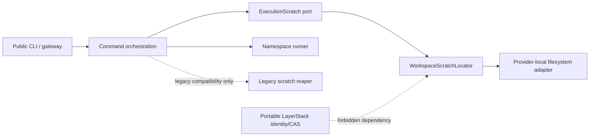
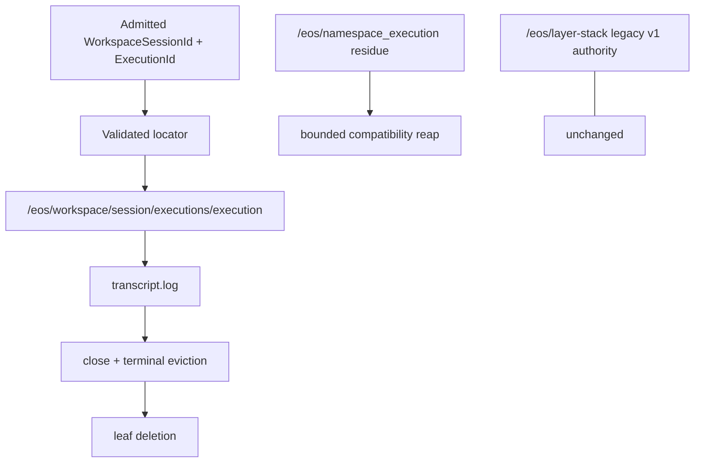
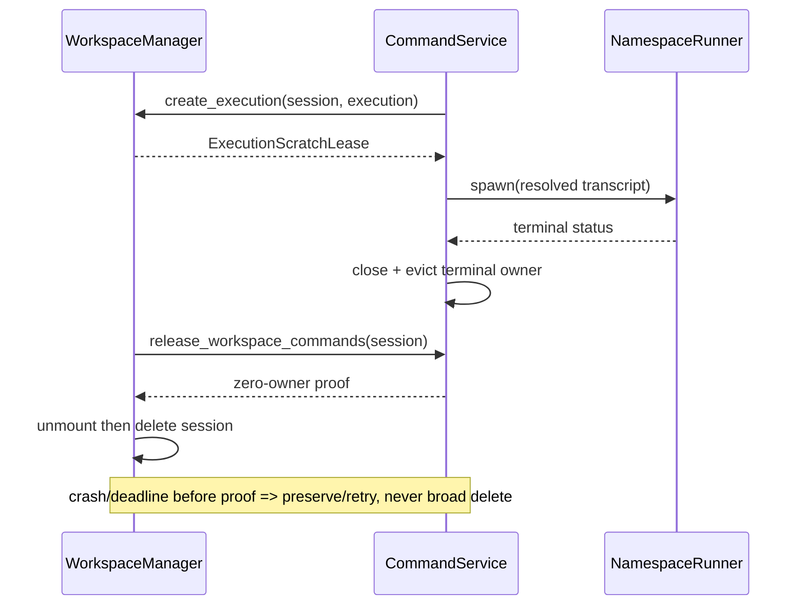

# Stage 01 — Workspace-scoped execution scratch

Links: [implementation overview](../index.md) · [stage E2E plan](e2e_test.md) · [normative storage design](../../prep/01-cdc-cas-space-time-materialization-spec.md) · [quantitative contract](../../prep/04-seqcdc-space-time-complexity-and-acceptance-criteria.md)

Proof tier: **POC proof tier**. This stage changes runtime scratch ownership only; it does not introduce a candidate format, CAS write, or rollout mode.

## 1. Stage contract

| Item | Contract |
| --- | --- |
| Status | Proposed, implementation-ready |
| Depends on | Stage 00 frozen evidence and baseline artifacts |
| Owners / affected crates | `sandbox-runtime-workspace`, `sandbox-runtime`, `sandbox-runtime-namespace-execution`, `sandbox-config`, external E2E workspace-session family |
| Objective | Put every command transcript beneath the command's owning workspace session through one validated locator, while retaining safe cleanup of the old global scratch root. |
| Visible outcome | `/eos/workspace/<session>/executions/<execution>/transcript.log` replaces new writes to `/eos/namespace_execution/<execution>/transcript.log`; `/workspace` and command behavior do not change. |
| In scope | Locator value object; admission plumbing; creation permissions; command teardown ordering; terminal-record release; restart-safe legacy reaper; config deprecation; structured route/resource evidence. |
| Non-goals | No `/eos/attempts`; no transcript in LayerStack/CAS; no `RootId`, CDC, object, publication, materialization, pack, GC, or public API change. |
| Entry | Stage 00 paths, command lifecycle, dependency graph, and benchmark noise are recorded; implementation starts on `upgrade-2.0-phase-1` created from the newest approved immutable product revision. This planning stage creates no branch. |
| Exit gate | Focused Rust and packaged E2E prove implicit/explicit/concurrent command isolation, teardown order, bounded legacy reaping, zero cross-delete, logical resource return, and a sub-minute paired sentinel. |
| Rollback | Stop constructing the workspace locator and restore the legacy configured scratch root for new commands. The compatibility reaper remains safe but may be disabled. Existing workspace-scoped transcripts are ephemeral and need no migration. |

Authority is unchanged: legacy LayerStack v1 is the sole read, write, and publication authority. Fallback, root-format acceptance, and comparison are not applicable because this stage never selects a storage candidate.

## 2. Current evidence

| Status | Repository evidence | Finding / preserved contract |
| --- | --- | --- |
| observed | `ephemeral-sandbox/crates/sandbox-runtime/workspace/src/session/manager.rs:243-245`, `WorkspaceManager::workspace_session_root` | A session already has one physical root below configured workspace scratch. |
| observed | `ephemeral-sandbox/crates/sandbox-runtime/workspace/src/lifecycle/persistence.rs:9-146`, `persisted_handles_path` and manager persistence | `manager.json` is a crash-recovery catalog and must remain outside deletable session subtrees. |
| observed | `ephemeral-sandbox/crates/sandbox-runtime/workspace/src/lifecycle/create.rs:107-153`; `overlay/src/lib.rs:70-92` | Workspace lifecycle creates the session root and OverlayFS `upper/` and `work/`. |
| observed | `ephemeral-sandbox/crates/sandbox-runtime/operation/src/command/service/exec_command.rs:35-64,147-158` | Admission resolves one workspace and records command ownership. |
| observed | same file `:211-225`, `CommandOperationService::prepare_transcript_path` | Transcript paths are instead reconstructed below global namespace-execution scratch. |
| observed | `ephemeral-sandbox/crates/sandbox-runtime/operation/src/command/exec_value.rs:97-102`, `Drop for CommandExecValue` | Dropping an execution value recursively removes its global execution directory. |
| observed | `ephemeral-sandbox/crates/sandbox-runtime/namespace-execution/src/engine.rs:70-74` | Execution identifiers are process-local; restart can reuse an ID. |
| observed | `ephemeral-sandbox/crates/sandbox-runtime/operation/src/namespace_execution.rs:10-17`, trait `WorkspaceCommandTeardown`; `ephemeral-sandbox/crates/sandbox-runtime/operation/src/command/service/core.rs:127-150`, its `NamespaceExecutionEngine<CommandExecValue>` implementation; `ephemeral-sandbox/crates/sandbox-runtime/operation/src/command/service/teardown.rs:10,84-129`, `COMMAND_JOIN_TIMEOUT` and `cancel_and_join_commands` | The workspace-facing port delegates ownership validation, cancellation, and bounded joins to the command engine; the current shared deadline is exactly one second. |
| observed | `ephemeral-sandbox/crates/sandbox-runtime/workspace/src/lifecycle/destroy.rs:403-485` | Workspace destroy owns recursive session deletion after mount and scratch cleanup steps. |
| observed | `ephemeral-sandbox/crates/sandbox-config/src/configs/runtime.rs:130-197,199-318` | Workspace and namespace-execution scratch roots are separately configured; limits remain under namespace execution. |
| observed | `ephemeral-sandbox/crates/sandbox-runtime/operation/src/layerstack/service/core.rs:24-34,85-88` | `.export` is already workspace-scoped and is not an execution transcript directory. |
| inferred | No boot catalog owns `/eos/namespace_execution` | Stale global directories can survive a crash and require a bounded compatibility reaper. |
| proposed | `WorkspaceScratchLocator` is the only constructor of execution paths | Command code must not join a sibling service's private root itself. |
| proposed | Required implementation branch | Implementation uses `upgrade-2.0-phase-1` from the newest approved immutable product revision; planning itself creates no branch. |

## 3. Resulting file and folder structure

### Product, tests, and evidence

```text
ephemeral-sandbox/
├── crates/sandbox-config/src/configs/runtime.rs                         [modify] — deprecate namespace scratch path; retain limits
├── crates/sandbox-runtime/workspace/src/
│   ├── scratch.rs                                                      [add] — validated WorkspaceScratchLocator and paths
│   ├── lib.rs                                                          [modify] — crate-visible locator export
│   ├── lifecycle/create.rs                                             [modify] — create executions/ with session
│   ├── lifecycle/destroy.rs                                            [modify] — require command-owner release proof before delete
│   └── lifecycle/persistence.rs                                        [unchanged contract] — manager.json remains recovery catalog
├── crates/sandbox-runtime/operation/src/
│   ├── command/service/exec_command.rs                                 [modify] — consume admitted session locator
│   ├── command/service/teardown.rs                                     [modify] — release terminal entries, then authorize deletion
│   ├── command/exec_value.rs                                           [modify] — delete only owned execution leaf
│   ├── services.rs                                                     [modify] — construct locator and bounded legacy reaper
│   └── workspace_scratch_compat.rs                                     [add] — legacy-root scan/reap policy
├── crates/sandbox-runtime/operation/tests/workspace_execution_scratch.rs [add] — lifecycle/restart integration proof
└── crates/sandbox-runtime/namespace-execution/src/types.rs             [modify] — accept resolved transcript path, not scratch root

ephemeral-sandbox-test/
├── e2e/runtime/workspace_session/helpers.py                            [modify] — structured scratch/resource inspection helper
├── e2e/runtime/workspace_session/test_execution_scratch.py             [add] — focused packaged route cases
├── e2e/runtime/workspace_session/test_spec.md                          [modify] — stable case declarations
├── benchmark/presets/workspace-scratch-tiny.yml                       [add] — paired sub-minute preset
├── benchmark/tests/fixtures/golden/layerstack_phase1/
│   └── workspace_scratch_v1.json                                      [add] — bounded-result validation fixture
├── .e2e-state/runs/<run-id>/evidence/                                  [add] — emitted at run time; route/tree/resource/dependency evidence
├── .benchmark-state/runs/<run-id>/                                     [add] — emitted at run time; lab-owned raw artifacts
└── .benchmark-state/results/<run-id>/                                  [add] — emitted at run time; lab-owned derived artifacts

ephemeral-sandbox-docs/implementation-plan/2.0 migration/phase 1/implementation/stage_01_workspace_scratch/
├── spec.md                                                             [add]
└── e2e_test.md                                                         [add]
```

No test helper is added to production `src/`. The product exposes bounded structured counters already needed for operation ownership; the E2E harness performs outside inspection.

### Resulting runtime storage

Annotations name state, role, owner/lifecycle, identity, bounds/accounting, and exposure. All entries are `0700` directories or owner-only files unless the existing runtime requires stricter permissions; `/eos` remains masked from workloads.

This is the Stage 01 upgrade-time tree while v1 remains sole authority. The complete
2.0 migration-time and post-retirement ownership model is normative in
[the canonical full `/eos` tree](../layerstack_storage_contract.md#4-complete-eos-ownership-and-storage-tree).
In that model, `workspace/<session>/upper` is the workspace session's unpublished
writable namespace; LayerStack materializations remain separately owned under
`layer-stack/materializations` and are mounted read-only beneath that private upper.

```text
/eos/
├── runtime/daemon/                                                     [existing][unchanged contract]
│   ├── runtime.sock                                                    runtime IPC; runtime owner; not RootId; M
│   └── runtime.pid                                                     daemon lifecycle; not RootId; M
├── layer-stack/                                                        [existing][unchanged contract] legacy v1 sole authority
│   ├── .storage-writer.lock                                            writer exclusion; LayerStack storage; not RootId; M
│   ├── manifest.json                                                   logical legacy head; atomic write/fsync/rename; v1 reader/writer; L_hot+M
│   ├── workspace.json                                                  legacy workspace binding; v1 owner; M
│   ├── base/B000001-base/                                              native base carrier; immutable after visibility; v1 hash input; L_hot
│   ├── layers/<layer_id>/                                              whole-file native layers; legacy publish/read; v1 identity; L_hot+H_cold
│   ├── staging/<layer_id>.staging/                                     transaction staging; delete/recover before visibility; bounded by operation; P_staging
│   └── .layer-metadata/
│       ├── <layer_id>.digest                                           legacy digest sidecar; v1 writer; M
│       └── <layer_id>.bytes                                            legacy size sidecar; v1 writer; M
├── workspace/                                                         [existing parent][migrate descendants] ephemeral provider scratch
│   ├── manager.json                                                    [existing] durable recovery catalog; WorkspaceManager; outside deletion; not RootId; M
│   ├── .export/<spool_id>                                              [existing] bounded export spool; operation owner; boot-reaped; P_staging
│   └── <workspace_session_id>/                                         [existing] session lifecycle owner; not RootId; ΣU_active
│       ├── upper/                                                       [existing] active OverlayFS writes; workspace owner; delete after unmount
│       ├── work/                                                        [existing] OverlayFS workdir; workspace owner; delete after unmount
│       └── executions/                                                  [add] command-owned children, workspace-contained; count ≤ configured executions
│           └── <namespace_execution_id>/                               [migrate] validated encoded ID; command owner; restart-safe containment
│               └── transcript.log                                      [migrate] bounded by existing transcript policy; terminal retention; ephemeral
├── namespace_execution/                                               [compat][remove-later at Stage 07]
│   └── <legacy_execution_id>/transcript.log                            no new writes; bounded reaper validates containment/age/ownership; residue accounting
└── storage/                                                           [existing][unchanged contract]
    ├── file_auditability/                                              audit storage owner; not RootId; M
    └── workspace_recovery/                                             failed-cleanup preservation, ≤1 MiB/1024 entries/depth 32 artifact; M/P_staging
```

Delta from Stage 00: add only `workspace/<session>/executions`; redirect new transcripts; mark the global root compatibility-only. No candidate `/eos/layer-stack` subtree and no `/eos/attempts` are created.

## 4. SRP, SOLID, and coupling design

The defect is physical ownership inversion: command execution knows a global path while workspace lifecycle owns admission and enclosing deletion. Merely changing a configured string cannot validate containment, resolve restart ID collisions, or order owner release. The smallest complete change is one locator plus one compatibility reaper and explicit teardown proof.

| Component | Single responsibility | Depends on | Must not know |
| --- | --- | --- | --- |
| `WorkspaceScratchLocator` | Validate a session root and derive one execution leaf | IDs, provider-local path rules | LayerStack, CAS, Docker, command process |
| `CommandOperationService` | Admit a command and request its owned leaf | locator port, namespace runner | workspace path composition |
| `CommandExecValue` | Own/release one execution leaf | resolved leaf, terminal policy | enclosing recursive session deletion |
| `WorkspaceCommandTeardown` | Reject, cancel, join, evict terminal owners, return deletion proof | command registry | filesystem recursion |
| `WorkspaceManager` | Create/delete session subtree after proof | locator, mount lifecycle | command internals |
| `LegacyExecutionScratchReaper` | Bounded, containment-safe old-root cleanup | deprecated root, clock, scan limits | new session deletion, LayerStack |

Narrow internal interface:

```rust
pub(crate) trait ExecutionScratch {
    fn create_execution(
        &self,
        session: WorkspaceSessionId,
        execution: NamespaceExecutionId,
    ) -> Result<ExecutionScratchLease, WorkspaceScratchError>;
}

pub(crate) struct ExecutionScratchLease {
    pub(crate) directory: PathBuf,
    pub(crate) transcript: PathBuf,
    // private deletion guard and non-owning session ID
}
```

`PathBuf` is deliberately concrete because this is provider-local filesystem scratch, not portable identity. IDs are values, not `Arc`; the lease has no back-reference to a manager. Construction flows `RuntimeConfig -> WorkspaceManager -> WorkspaceScratchLocator -> CommandOperationService`; teardown flows inward through a `WorkspaceCommandTeardown` proof. Workspace errors become typed operation errors at the orchestration boundary and public CLI statuses at the existing projection.

| Manifest/graph | Baseline packages/features/edges | Resolved package/version delta | Feature delta | Direct external edge delta or relocation | System/runtime delta | Internal edge change | Evidence |
| --- | --- | --- | --- | --- | --- | --- | --- |
| Product `cargo metadata` + manifests | Stage 00 canonical JSON and direct-edge multiset | none required | none required | none | none | `sandbox-runtime` consumes a workspace locator already reachable through its workspace edge | canonicalized before/after JSON; manifest/lock diff |
| Test Python environment | Stage 00 lock/snapshot | none required | none | none | none | new cases reuse harness modules | lock and environment snapshots |
| Target image | existing gateway/runtime | none | none | none | no target shell/helper/service dependency | none | helper-independence and process evidence on the pinned Ubuntu 24.04 target |

| Boundary | Host/image assumption before | Assumption after | Core/adapter | Evidence now | Later evidence |
| --- | --- | --- | --- | --- | --- |
| Scratch paths | Host filesystem and Linux permissions | same; path composition centralized | provider-local workspace adapter | sole pinned Ubuntu 24.04 packaged case | required host triples on that same image at Stage 07 |
| Target image | workload cannot see `/eos`; no helper needed | unchanged | namespace/OverlayFS adapter | read-only/non-root runtime variants of pinned Stage 01 OCI index `sha256:4fbb8e6a8395de5a7550b33509421a2bafbc0aab6c06ba2cef9ebffbc7092d90` | Stage 07 target-image and Linux native-backend capability matrix |
| CPU/encoding | native path identifiers | validated byte-safe ID encoding, no CPU-specific code | provider-local | unit vectors on current host only | cross-architecture Stage 07; untested rows remain unverified |

Future-change exercises: a new checkpoint branch references a `WorkspaceSessionId` and does not change this path; a different transcript sink replaces `ExecutionScratch` construction without changing command admission; a Firecracker/WASM provider supplies a different locator while portable Phase 2 root/checkpoint/MCTS types remain path-free. No god object is added, no portable core imports this module, and dependency direction remains orchestration → narrow workspace capability. Transitional global-root config and reaper are removed at Stage 07. SOLID review requires one reason to change per row, no unchecked joins outside the locator, no outward core dependency, no strong cycle, and contract tests for every implementation.

## 5. Type, class, and field design

| Type / status / owner | Exact fields | Ownership, validation, persistence, bounds | Release / concurrency / error |
| --- | --- | --- | --- |
| `WorkspaceScratchLocator` — new, `workspace::scratch`, crate-visible | `workspace_root: PathBuf`; `directory_mode: u32` | Owned once by `WorkspaceManager`; absolute normalized root, no symlink traversal; transient config-derived | `Send + Sync`; no map/cache; typed invalid-root/containment/I/O errors |
| `ExecutionScratchLease` — new, same module, crate-visible fields only as needed | `session_id: WorkspaceSessionId`; `execution_id: NamespaceExecutionId`; `directory: PathBuf`; `transcript: PathBuf`; `cleanup: ExecutionScratchCleanup` | Command record owns it; IDs canonical; leaf created `0700`, transcript owner-only; one per admitted execution; transient | Explicit `finish/cancel` deletes only leaf after handles close; `Drop` is best-effort and observable; no detached task |
| `ExecutionScratchCleanup` — new, private | `state: AtomicU8` (`Live/Released/Failed`) | Inline state, no allocation; one transition | Idempotent compare/exchange; failure retained for manager retry, never broadens target |
| `WorkspaceCommandReleaseProof` — new, `operation::command::teardown`, crate-visible token | `session_id`; `active_count: u32`; `terminal_count: u32`; private constructor | Returned only after reject/cancel/join/evict; transient; counts must be zero | Move-only proof consumed by destroy; deadline error prevents deletion |
| `LegacyExecutionScratchReaper` — new, operation compat module, private | `root: PathBuf`; `max_entries_per_boot: u32 = 1024`; `max_depth: u8 = 3`; `min_age: Duration`; `active_ids: Weak<...>` | Bounded scan; `Weak` avoids registry cycle; no persistent registry; legacy root only | Synchronous/bounded supervisor job, joined at boot; errors counted/quarantined for retry |
| `NamespaceExecutionConfig` — modified | retain concurrency/timeout/transcript limits; `scratch_root: Option<PathBuf>` deprecated/compat-only | Existing deserialization accepts old config; new writes ignore it except reaper | validation rejects overlap with workspace/runtime roots; remove Stage 07 |

Important signatures:

```rust
impl WorkspaceScratchLocator {
    pub(crate) fn session(&self, id: WorkspaceSessionId)
        -> Result<WorkspaceSessionScratch, WorkspaceScratchError>;
}
impl WorkspaceSessionScratch {
    pub(crate) fn create_execution(&self, id: NamespaceExecutionId)
        -> Result<ExecutionScratchLease, WorkspaceScratchError>;
}
pub(crate) async fn release_workspace_commands(
    &self, id: WorkspaceSessionId, deadline: Instant
) -> Result<WorkspaceCommandReleaseProof, CommandTeardownError>;
pub(crate) fn destroy_with_release(
    &self, id: WorkspaceSessionId, proof: WorkspaceCommandReleaseProof
) -> Result<(), WorkspaceDestroyError>;
```

Existing public CLI/API request and result types, `WorkspaceSessionId`, `NamespaceExecutionId`, LayerStack v1 models, workspace `manager.json`, transcript contents, and native execution remain unchanged.

## 6. Data and compatibility design

This stage introduces no root/object schema or hash. Legacy manifest-root identity, whole-file descriptors, ordering, path-byte behavior, and fixtures are byte-for-byte unchanged; no new `RootId` exists here. The new path encoding uses the existing canonical textual ID only after rejecting separators, `.`/`..`, NUL, non-canonical spellings, symlink parents, and paths outside the canonical session root. Files are exposed only after directory creation and owner-only permissions; transcripts are ephemeral and never fsynced as durable LayerStack state.

Old configuration remains readable. During upgrade, new commands write only the workspace path; old global residue is read by no command and reaped in bounded batches only after an age check and proof that it is not active. Downgrade can resume legacy new writes without reading workspace transcripts; transcript durability was never promised. Corrupt/symlinked/ambiguous legacy entries are not followed or deleted; they are reported for quarantine/manual inspection. Candidate formats, typed domain-separated hashes, SeqCDC scalar/acceleration, mixed roots, provider materializations, and physical-lifecycle work are deferred to Stages 02–07.

## 7. Workflow and failure semantics

Happy path: admission resolves session → locator atomically creates a unique execution leaf → namespace runner receives the resolved transcript file → terminal retention holds the leaf → explicit eviction closes handles and removes the leaf → workspace teardown rejects admission, cancels and joins active commands, evicts terminal records, receives a zero-owner proof, unmounts, and recursively removes the session.

Restart: `manager.json` drives workspace recovery; process-local execution IDs may repeat safely because old leaves are inside old/recovered session identity. A collision in the same session fails closed, never truncates another transcript. Boot reaping scans at most 1,024 legacy entries/depth 3 and skips recent, active, symlinked, or uncontained entries.

Cancellation, timeout, command failure, and panic containment all close transcript descriptors and run idempotent leaf cleanup. A one-second current command join budget is preserved unless focused evidence proves a separate change is necessary; expiration blocks enclosing delete and produces the existing bounded workspace recovery artifact. Disk full/permission failure rejects command setup before process launch. LayerStack corruption, OCC, hydration, squash, retention, pack evacuation, and storage GC are unaffected and deferred.

| Resource retained in memory | Owner | Acquire point | Hard item/byte bound and permit | Normal release | Error/cancel/panic release | Shutdown/restart behavior | Evidence |
| --- | --- | --- | --- | --- | --- | --- | --- |
| Locator paths | `WorkspaceManager` | service construction | O(1), two `PathBuf`s per active creation | temporary joins drop | drop on error | reconstructed from config | live-owned path bytes |
| Execution lease | command registry entry | successful leaf creation | ≤ configured active + bounded terminal entries | terminal eviction | cancel/join then cleanup; panic guard | no in-memory survival | lease/registry gauges |
| Transcript FD/buffer | namespace runner | command spawn | existing per-command transcript bound; one FD/command | close before leaf removal | runner guard closes | OS closes on crash; recovery reaps leaf | FD and active-owner gauges |
| Terminal records | command registry | command completion | existing configured terminal capacity/TTL | eviction | teardown forces eviction for session | empty on restart | per-session terminal count |
| Legacy scan batch | boot supervisor | compat reap | ≤1,024 entries, depth ≤3; names processed streaming | batch drops | joined error return | rerun next boot | scanned/skipped/deleted counters |
| Teardown future/join handles | `WorkspaceCommandTeardown` | destroy admission fence | ≤ active commands for one session; existing global concurrency bound | joined before proof | deadline returns no proof | daemon shutdown joins supervisor | tasks/joins/quiescence |

No strong back-edge exists: execution leases contain IDs/paths, the reaper observes active IDs through `Weak`, and workspace deletion consumes a move-only proof. No untracked work detaches. Quiescence (deadline 5 seconds for the POC poll, distinct from command join policy) means active and terminal command owners for the session are zero, execution leases/FDs/tasks are zero, the legacy batch is idle, and observed permits/queues equal warmed idle. Missing stage-gating gauges block the stage.

## 8. Complexity and performance contract

Let `E` be executions in a session, `B_t` transcript bytes, and `D_l` legacy entries scanned in this boot batch.

| Operation | Inputs | Expected time | Worst-case time | Peak app memory | Temporary disk | Settled physical disk | I/O pattern |
| --- | --- | --- | --- | --- | --- | --- | --- |
| Create execution leaf | one session/execution ID | O(path components) | O(path components) | O(path bytes) | one empty dir/file | transcript `B_t` until eviction | mkdir/open, no tree scan |
| Append transcript | command stream | O(`B_t`) | O(`B_t`) | existing bounded stream buffers | growing transcript | zero after eviction/session destroy | sequential append |
| Command cleanup | one leaf | O(files in leaf)=O(1) | O(`B_t`) filesystem reclaim | O(path bytes) | none | zero | close/unlink/rmdir |
| Workspace destroy | `E` owners + upper | O(`E + U`) | O(entries in owned subtree) | bounded walker | recovery artifact on failure | zero or bounded recovery artifact | reject/join/unmount/tree delete |
| Legacy reap | `min(D_l,1024)` | O(batch) | O(1024), depth 3 | O(one entry/path) | none | residue decreases | streaming directory walk |

Scratch participates as `ΣU_active` (including active uppers, workdirs, and transcripts) in the complete envelope `L_hot + H_cold + ΣU_active + P_staging + M`; this stage does not change `L_hot`, `H_cold`, or CAS metadata. It must not duplicate transcript bytes.

| Inherited gate family | Disposition | Exact stage contract |
| --- | --- | --- |
| Scratch isolation/cleanup and operation duration | stage-gating | zero cross-session mixing/deletion; every single operation <60 s |
| No-op command/file throughput | stage-gating | diagnostic POC applies exact final targets as alert lines: no-op ≤+3%+0.5 ms and native command/file throughput ≥97%; insufficient samples cannot claim normative p95 |
| PTY create/drain/stdin/C/D | stage-gating for correctness; deferred-to-final for normative performance | unchanged route; diagnostic alerts use create +3%+1 ms and other actions +3%+0.5 ms |
| Logical memory release | stage-gating | all changed live owners, FDs, tasks, queues, permits return to warmed idle; no suspected/confirmed leak |
| RSS / cgroup ceiling | stage-gating | absolute RSS ≤384 MiB and idle-adjusted ≤128 MiB in sentinel; short slope within frozen control noise |
| Full input/history memory matrix | deferred-to-final | 64 MiB/256 MiB/1 GiB × 1/16/64 roots, three repetitions, ≤16 MiB adjusted range and ≤8 MiB scaling slope need final route |
| SeqCDC profile/chunk count, 32 KiB ring, borrowed chunks | deferred-to-stage_03 | no chunker in this stage |
| Materialization warm/cold and 256 KiB buffers | deferred-to-stage_04 | no materializer |
| Strict activation and mount gates | deferred-to-stage_04 | no candidate reader |
| Publication/OCC/small-edit/disjoint publish | deferred-to-stage_03 | publication unaffected |
| Packs/GC/compaction/space amplification | deferred-to-stage_05 | no CAS pack or GC |
| Squash/remount gates | deferred-to-stage_05 | no candidate squash |
| Candidate authority/mixed-root gates | deferred-to-stage_06 | legacy remains sole authority |
| Full p50/p95, required target-image/native-backend matrix, five-minute pairs | deferred-to-final | Stage 07 owns normative qualification; every pair ≤5 min and unmeasured capability cells remain unsupported |

The changed per-operation working set is `W_scratch = path_bytes + existing_transcript_stream_buffer`; concurrency multiplies only the existing per-command stream buffer up to configured admission. The legacy reaper adds one path plus one bounded batch iterator, not 1,024 retained paths. Nothing new remains at warmed idle except O(1) locator paths and bounded terminal records already governed by capacity.

## 9. Diagrams







## 10. Implementation sequence

1. **Expose the seam without behavior change.** Add `workspace/src/scratch.rs` and locator contract tests; route the old root through the interface temporarily. Check `cargo test -p sandbox-runtime-workspace scratch`. Checkpoint: interface-only commit is removable.
2. **Move new execution leaves.** Modify workspace create, operation construction, command preparation, namespace target types, and `CommandExecValue`; preserve request/results and limits. Check `cargo test -p sandbox-runtime workspace_execution_scratch`. This enables focused packaged route evidence. Rollback: switch construction back to legacy adapter.
3. **Make teardown ownership explicit.** Add release proof and enforce it in workspace destroy; tests inject active, terminal, cancelled, and join-timeout states. Compatibility behavior remains recovery-on-failure. Checkpoint isolates lifecycle change.
4. **Add bounded compatibility cleanup.** Implement the legacy reaper, overlap/symlink/age validation, config deprecation, and boot tests. Never scan or delete the new root. Rollback disables reaper.
5. **Add structured evidence and external tests.** Extend existing operation observation projection, E2E helper/cases, schema, and benchmark preset. Run only [the focused commands](e2e_test.md#9-focused-and-final-stage-commands). Checkpoint contains no production behavior change except bounded counters.
6. **Review and freeze.** Diff dependency graph, run cycle/forbidden-edge checks, verify `/eos` permissions/tree, append test-report entries before each live command, and record POC verdict.

## 11. Observability

Emit one bounded operation record, not per-byte/path logs:

`scratch_layout_version`, `workspace_session_id_hash`, `execution_id_hash`, `scratch_route=workspace_scoped|legacy_compat`, `active_execution_leases`, `terminal_execution_records`, `transcript_open_fds`, `scratch_live_owned_bytes`, `scratch_high_water_bytes`, `teardown_join_count`, `teardown_deadline_exceeded`, `legacy_scanned`, `legacy_deleted`, `legacy_skipped_active`, `legacy_skipped_unsafe`, `logical_cleanup_complete`, and `quiescence_ms`.

The benchmark artifact separately records process RSS, anonymous/file-backed RSS where available, cgroup current/peak, mappings, FDs, task/worker/queue/permit counts, first/last settled-window medians/delta/slope, and allocated bytes for legacy layers, workspace scratch, `.export`, storage metadata, and global legacy residue. IDs are hashed and cardinality is bounded; raw paths are absent. A missing stage-gating route/resource field is a blocker, not zero.

## 12. Completion checklist

- [x] Product and test repositories are on `upgrade-2.0-phase-1`; their starting HEADs, upstreams, complete worktree status, and preserved Stage 00 diff are recorded before Stage 01 edits.
- [x] The frozen Stage 00 functional, dependency, environment, E2E, and benchmark evidence is referenced rather than rerun; the pinned Ubuntu arm64 digest mismatch has an explicit owner-approved resolution before any Stage 01 pass is claimed.
- [x] One validated workspace locator alone composes session, execution, and transcript paths; canonical-ID, separator, dot-segment, NUL, containment, symlink-parent, and out-of-root rejection tests pass.
- [x] New execution directories and transcripts are owner-only; the annotated before/after `/eos` tree proves every new transcript is under `/eos/workspace/<session>/executions/<execution>/transcript.log` and no new write appears under `/eos/namespace_execution`.
- [x] Command completion and cancellation close resources, evict terminal ownership, release the execution lease, and delete its leaf before a move-only zero-owner proof permits recursive session deletion; no strong cycle, detached task, or live-owner deletion exists.
- [x] Join-deadline failure preserves a bounded recovery artifact, blocks unsafe deletion, and completes safely after restart; cleanup and lease release are idempotent.
- [x] The legacy reaper is restart-safe and bounded to 1,024 entries, depth 3, and the declared minimum age; active, recent, foreign, malformed, ambiguous, and symlink entries are preserved while eligible old residue is removed.
- [x] Structured evidence reports the workspace-scoped route, bounded/hashed identity, lease/terminal/FD ownership, live/high-water bytes, teardown/deadline counts, legacy scan outcomes, cleanup state, and quiescence without unbounded labels or path logs.
- [x] LayerStack v1 formats, `/workspace`, public command/CLI output, native execution, limits, `manager.json`, and `.export` compatibility remain unchanged; no `/eos/attempts`, transcript CAS path, or later-stage durable format exists.
- [x] Focused format, clippy, workspace/runtime Rust, configuration, observation, query, CLI, and catalog checks pass without substituting a broad suite for a missing focused filter.
- [x] Packaged cases `phase1.stage01.workspace-scratch.lifecycle` and `phase1.stage01.workspace-scratch.restart-reap` pass with fresh-binary identity, run-owned cleanup, route/permission/cancel/restart/reap evidence, and no legacy-root write.
- [x] Tiny case `phase1.stage01.workspace-scratch.tiny` uses `workspace-scratch-tiny.yml`, seed `0x5A01`, the same-revision legacy adapter control, two warmup pairs, six alternating measured pairs, one cancellation, and the declared operation/run deadlines.
- [x] Tiny benchmark throughput, latency diagnostic, RSS/cgroup, quiescence, logical-owner settlement, allocated-disk, and Theil–Sen trend gates pass; no unsupported p95 or normative Stage 07 claim is made.
- [x] Exact Stage 00-to-Stage 01 external package, feature, direct-edge, and semantic environment comparisons are empty; no Cargo, Python, system, service, runtime, or image helper dependency is added.
- [x] Rollback to the legacy locator is demonstrated without data migration, while recovery never broad-deletes either the workspace-scoped or legacy root.
- [x] Strict machine-readable schemas accept all run-owned artifacts and fail closed on missing, malformed, truncated, wrong-run, or contradictory evidence; the append-only test report records command, timing, binary identity, run ID, artifact links, and cleanup custody.
- [x] CDC/CAS, materialization, publication, packs/GC, squash, candidate authority, affected regression, host/release-runner matrix, sustained soak, and full Phase 1 qualification remain explicitly assigned to Stages 03–07.
