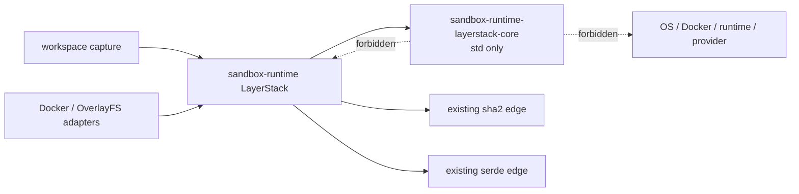
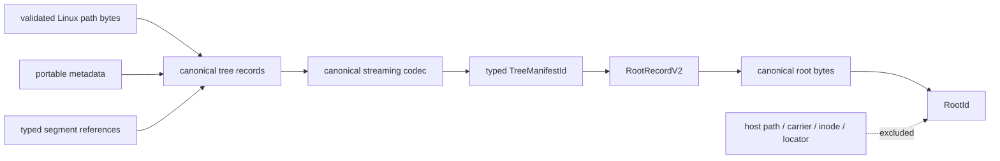
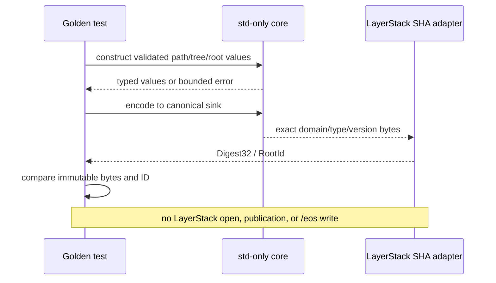
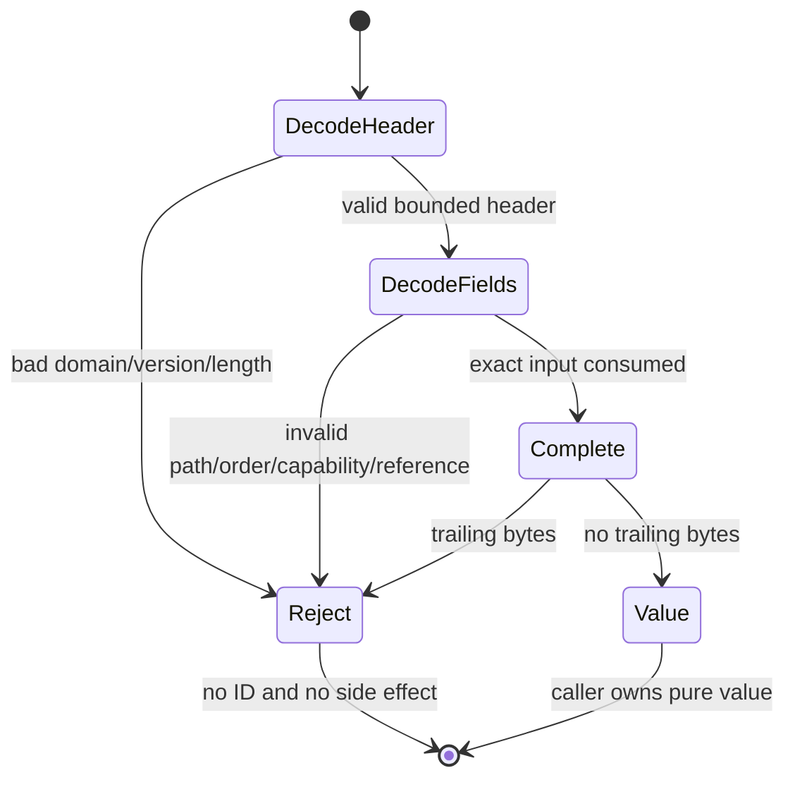

# Stage 02 — Portable root contract

[Implementation overview](../index.md) · [Stage 02 E2E plan](e2e_test.md) · [Preparation 01](../../prep/01-cdc-cas-space-time-materialization-spec.md) · [Preparation 03](../../prep/03-seqcdc-cas-and-squash-decision.md) · [Preparation 04](../../prep/04-seqcdc-space-time-complexity-and-acceptance-criteria.md)

Product root: `/Users/yifanxu/Ephemeral-AI-Lab/ephemeral-sandbox`
Test root: `/Users/yifanxu/Ephemeral-AI-Lab/ephemeral-sandbox-test`

## 1. Stage contract

| Field | Contract |
| --- | --- |
| Status | Proposed; POC proof tier. Planning creates no branch. Implementation requires the exact branch `upgrade-2.0-phase-1`, created from the newest approved immutable product revision, with immutable product/test/doc bases recorded first. |
| Depends on | Stage 00 evidence seams only. Stage 01 is an independent parallel branch and does not join the candidate-storage chain until Stage 10. |
| Owners / affected crates | New internal `sandbox-runtime-layerstack-core`; existing `sandbox-runtime` LayerStack module; workspace manifest/lock; maintainer architecture; focused product and external tests. |
| Objective | Freeze a deterministic, versioned, backend-neutral root/object/path contract without changing the authoritative v1 LayerStack or writing any v2 artifact. |
| System-visible outcome | None. Public commands, files, PTY, mount, publication, `root_hash`, and storage layout remain legacy-v1 behavior. Portable v2 values exist only in pure Rust/golden tests. |
| Scope | Standard-library-only core crate; canonical byte codec; typed identities; raw Linux path-byte validation; capability set; logical tree/root records; narrow ports; existing-crate SHA-256/serde adapters; compatibility and dependency proof. |
| Non-goals | SeqCDC implementation; payload chunking; CAS files/packs/indexes; candidate publication; candidate read/materialization; authoritative `RootId`; migration mapping; SIMD; GC; squash; full/release qualification. |
| Entry | Stage 00 focused exit passes; no unexpected `/eos` artifacts exist; exact branch `upgrade-2.0-phase-1`, its newest approved immutable product base, immutable test/doc bases, upstream, and clean scoped worktrees are recorded; dependency baselines exist for every declared target/feature invocation. Stage 01 may be incomplete. |
| Exit | Canonical golden bytes and typed SHA-256 IDs are deterministic under insertion/read fragmentation and host-independent path inputs; all malformed-contract cases fail closed; `sandbox-runtime-layerstack-core` has no dependency entries; the exact external package/version set, enabled-feature set, and direct external-edge multiset equal the frozen baseline; legacy remains sole read/write/publication authority. |
| Rollback | Remove the new internal crate and internal workspace edge plus its tests/adapters. No durable data migration or `/eos` cleanup is needed because this stage writes no v2 artifact. |

`RootId` in this stage is a value and a deterministic computation, not a published root. The v1 `Manifest::root_hash` remains the only runtime/public revision identity and must never be reinterpreted as a v2 `RootId`.

## 2. Current evidence

| Status | Repository/path | Current fact | Stage decision |
| --- | --- | --- | --- |
| observed | product `crates/sandbox-runtime/layerstack/src/model/mod.rs:10,23-60` | Manifest schema is v1; `LayerPath` stores UTF-8 text and normalizes backslash. | Preserve as v1 compatibility. V2 accepts validated relative Linux path bytes and never applies host-native normalization. |
| observed | product `crates/sandbox-runtime/layerstack/src/model/mod.rs:68-97,137-168` | `Manifest` names physical layer refs; `manifest_root_hash` hashes serialized layer refs with SHA-256. | Do not alias it to logical identity. V2 hashes a canonical logical root record with a domain/type tag. |
| observed | product `crates/sandbox-runtime/layerstack/src/model/mod.rs:170-228` | `LayerChange::WriteFile` carries a host `PathBuf`; aggregation uses a `BTreeMap`. | Host paths remain capture/provider inputs and cannot enter portable identity. Canonical ordering is over validated raw path bytes. |
| observed | product `crates/sandbox-runtime/layerstack/src/model/mod.rs:248-285` | Existing change digests stream with a 64 KiB buffer and existing `sha2`. | Keep `sha2` in LayerStack; add a typed-domain adapter there rather than adding it to the core. |
| observed | product `crates/sandbox-runtime/layerstack/src/lib.rs` | LayerStack already forbids unsafe code and owns storage constants. | New core also forbids unsafe; storage constants and host paths remain in LayerStack. |
| observed | product `crates/sandbox-runtime/layerstack/src/stack/mod.rs:56-138` | `LayerStack` owns storage root, writer lock, leases, substitutions, view, and boot sweep. | No new process owner or global registry. Later persistence/provider adapters are constructed by LayerStack. |
| observed | product `crates/sandbox-runtime/layerstack/src/storage/fs.rs:23-28` | `canonical_key` uses host-native filesystem canonicalization. | It is a physical locator key only and is forbidden from v2 root/object input. |
| observed | product `crates/sandbox-runtime/layerstack/src/storage/fs.rs:113-139,201-240` | LayerStack already owns atomic files, fsync, and serde JSON manifest persistence. | Persistence and diagnostic-envelope adapters stay in this crate, retaining its existing `serde` edge. Stage 02 does not call a v2 persistence adapter. |
| observed | product workspace `Cargo.toml` and `crates/sandbox-runtime/layerstack/Cargo.toml` | LayerStack already directly uses `sha2` and `serde`; no core crate exists. | Add one internal, std-only crate and one internal edge. External packages, features, and direct edges change by exactly zero. |
| observed | product `docs/maintainer-architecture.md` | LayerStack owns content identities/storage/leases; workspace owns capture; provider/mount concerns are separated. | Document the inward LayerStack → portable-core edge and forbid the reverse edge. |
| observed | [Preparation 03 §2](../../prep/03-seqcdc-cas-and-squash-decision.md#2-stable-identities-and-generations) | Logical root, materialization, object, and publication generations are distinct. | Encode distinct nominal types. Backend locators and materialization generations are excluded from `RootId`. |
| observed | [Preparation 04 §11](../../prep/04-seqcdc-space-time-complexity-and-acceptance-criteria.md#11-reusable-architecture-boundary) | The reusable boundary is a platform-neutral checkpoint-storage core. | The core imports no OverlayFS, Docker, mount, namespace, runtime-operation, provider, serde, or SHA implementation type. |
| proposed | implementation branch/base custody | Phase 1 implementation is mandated on exact branch `upgrade-2.0-phase-1`, created from the newest approved immutable product revision. | This planning change creates no branch. Before implementation, record the branch point and immutable product/test/doc revisions and reconcile repository-local execution policy without changing the mandated branch name. |

The defect being fixed is semantic coupling, not a missing abstraction count: current identity includes physical layer references and a host-string path model. The smallest adequate split is one std-only value/codec crate. It does not become a storage service.

## 3. Resulting file and folder structure

### Product source tree

```text
ephemeral-sandbox/
├── Cargo.toml                         [modify] — add workspace member and one internal workspace dependency only
├── Cargo.lock                         [modify] — one local package stanza; no external package/version/feature change
├── docs/maintainer-architecture.md    [modify] — LayerStack -> portable core inward dependency and forbidden reverse edges
└── crates/sandbox-runtime/
    ├── layerstack-core/
    │   ├── Cargo.toml                 [add] — package metadata/lints only; no dependency entries
    │   ├── src/
    │   │   ├── lib.rs                 [add] — public module/re-export boundary; forbid unsafe
    │   │   ├── codec.rs               [add] — canonical sink/source and fixed byte order
    │   │   ├── error.rs               [add] — bounded closed contract errors
    │   │   ├── identity.rs            [add] — Digest32, RootId, ObjectId, ObjectKind
    │   │   ├── path.rs                [add] — validated relative Linux path bytes
    │   │   ├── root.rs                [add] — RootRecordV2 and publication identity
    │   │   ├── tree.rs                [add] — canonical entry/metadata/segment schema
    │   │   └── port.rs                [add] — minimal digest/sink/source contracts
    │   └── tests/
    │       ├── canonical_contract.rs   [add] — exact bytes/ordering/rejection
    │       └── host_independence.rs    [add] — raw-byte, endian, width golden proof
    └── layerstack/
        ├── Cargo.toml                  [modify] — add internal core edge; retain sha2/serde
        ├── src/model/portable.rs       [add] — Sha256TypedDigest + v1/v2 compatibility adapter
        └── tests/
            ├── portable_root_golden.rs [add] — typed-hash golden vectors
            └── fixtures/cas/v2/
                ├── contract-v2.json    [add] — human-readable fixture inventory
                └── contract-v2.bin     [add] — immutable canonical bytes
```

The core contains domain values and canonical transforms. The existing LayerStack crate owns all concrete hashing, serde envelopes, filesystem persistence, and future provider/materialization adapters. No production helper is placed under `src/` solely for tests.

### Complete `/eos` tree after Stage 02

There is deliberately no LayerStack layout delta from Stage 00. The main tree
shows the deterministic Stage 00 workspace/namespace-execution shape and is
the required branch-independent storage state for this stage. Stage 01 is a
parallel branch: if its own exit has already passed, the separately labeled
replacement delta may also be observed, but Stage 02 neither requires nor
evaluates that delta. Each bracket code maps to the complete operational
annotation ledger below.

```text
/eos/                                                   [E0]
├── layer-stack/                                        [L0]
│   ├── .storage-writer.lock                            [L1]
│   ├── manifest.json                                   [L2]
│   ├── workspace.json                                  [L3]
│   ├── base/                                           [L4]
│   │   └── <base_id>/                                  [L5]
│   ├── layers/                                         [L6]
│   │   └── <layer_id>/                                 [L7]
│   ├── staging/                                        [L8]
│   │   └── <layer_id>.staging/                         [L9]
│   └── .layer-metadata/                                [L10]
│       ├── <layer_id>.digest                           [L11]
│       └── <layer_id>.bytes                            [L12]
├── storage/                                            [S0]
│   ├── file_auditability/                              [S1]
│   └── workspace_recovery/                             [S2]
├── workspace/                                          [W0]
│   ├── manager.json                                    [W1]
│   ├── .export/<spool_id>                              [W2]
│   └── <workspace_session_id>/                         [W3]
│       ├── upper/                                      [W4]
│       └── work/                                       [W5]
├── namespace_execution/                                [N0]
│   └── <namespace_execution_id>/                       [N1]
│       └── transcript.log                              [N2]
└── runtime/                                            [R0]
    └── daemon/                                         [R1]
        ├── runtime.sock                                [R2]
        └── runtime.pid                                 [R3]
```

Optional Stage 01 parallel-world replacement delta, only after Stage 01's own
exit passes; it is not a Stage 02 entry, exit, or rollout assumption:

```text
/eos/workspace/<workspace_session_id>/executions/        [PW0]
└── <command_session_id>/                                [PW1]
    └── transcript.log                                   [PW2]
/eos/namespace_execution/                                [PN0; compatibility-only, may be absent]
└── <legacy_namespace_execution_id>/                     [PN1]
    └── transcript.log                                   [PN2]
```

| Code | State and class | Owner | Lifecycle, durability, recovery, deletion | `RootId` participation | Rollout access | Bound; `T(t)` category | Permissions / exposure |
| --- | --- | --- | --- | --- | --- | --- | --- |
| `E0` | existing storage root; namespace | daemon installation | provisioned before boot; mount durability is external; never recursively deleted by a transaction | none | daemon R/W | one; container for all terms | daemon-owned; `/eos` masked from workloads |
| `L0` | existing truth namespace | LayerStack | open/validate on boot; directory fsync by existing writer; installation removal only | no v2 ID; contains v1 authority | legacy R/W; candidate absent | one; `L_hot+P_staging+M` | daemon-only, same filesystem |
| `L1` | existing writer coordination | LayerStack | open → acquire process lock → kernel-held exclusion → reacquire after restart → close with owner | none | legacy coordination R/W; candidate absent | one file/FD; `M` | daemon-only |
| `L2` | existing authoritative truth | legacy publisher | atomic temp → fsync → rename → parent fsync; boot validates; superseded atomically, never inferred from partial staging | expressly excluded from v2 `RootId`; v1 `root_hash` only | legacy R/W and sole publication authority | one; `M` | daemon-only regular file |
| `L3` | existing base/workspace binding truth | base builder | bootstrap → atomic replace/fsync → boot validate → installation removal | contributes only through the physical v1 layer reference; excluded from v2 `RootId` | legacy R/W | one; `M` | daemon-only regular file |
| `L4` | existing carrier namespace | base builder | provision → verify → rename/fsync; recovery validates reachability; installation/approved rebuild removes | physical ref only, excluded from v2 | legacy R | one namespace; `L_hot` | lower read-only/masked |
| `L5` | existing native base carrier | base builder | immutable after install; retained while v1 manifest references it; deletion only under legacy lifecycle | excluded | legacy R | one active base; `L_hot` | daemon owns; projected read-only |
| `L6` | existing carrier namespace | legacy publisher | created at install; child rename/fsync; boot sweep uses v1 reachability | excluded | legacy R/W | `O(D)` children; `L_hot` | daemon-only |
| `L7` | existing authoritative native carrier | legacy publisher | staging rename → metadata → manifest commit; boot keep/reap; squash/retention deletes only when v1-safe | excluded; physical v1 `LayerRef` | legacy R/W | projected depth follows existing policy, final requirement `D≤64`; `L_hot` | lower read-only/masked |
| `L8` | existing transaction namespace | legacy publisher | transaction create; private; parent fsync; boot reaps uncommitted children | none | legacy W | one admitted legacy publication plus bounded maintenance; `P_staging` | `0700`, masked |
| `L9` | existing transaction scratch | legacy publisher | copy/write → tree fsync → rename or abort/boot deletion | none | legacy W | `C_capture`/existing legacy bound; `P_staging` | `0700`, never workload-visible |
| `L10` | existing metadata namespace | LayerStack | installed once; atomic child replacement; boot recomputation allowed | excluded | legacy R/W | `O(D)`; `M` | daemon-only |
| `L11` | existing digest metadata | legacy publisher | written after carrier rename; atomic/fsynced; recover by recomputation; delete with carrier | v1 comparison only; not typed object ID | legacy R/W | one per carrier; `M` | daemon-only |
| `L12` | existing accounting metadata | legacy publisher | atomic write; recover by allocated-byte recount; delete with carrier | none | legacy R/W | one per carrier; `M` | daemon-only |
| `S0` | existing service-storage namespace | runtime services | provisioned/validated at boot; service-specific recovery | none | service R/W | configured services; `M+P_staging` | daemon-only |
| `S1` | existing audit truth | FileService | operation append/update → service durability → boot recovery → retention cleanup | blame/provenance remains separate from content identity | service R/W | configured audit bound; `M` | authenticated projection only |
| `S2` | existing conditional recovery truth | workspace recovery owner | failed teardown records exact owner → fsync → bounded boot retry → delete after successful reap | none | recovery R/W | failed-session count, not history size; `P_staging+M` | daemon-only |
| `W0` | existing active-workspace namespace | WorkspaceManager | boot create/validate; children are case/session owned | none | workspace R/W | active sessions; `ΣU_active+M` | daemon-only except `/workspace` projection |
| `W1` | existing recovery truth | WorkspaceManager | handle change → atomic file/fsync → boot reconcile → supersede | none | workspace R/W | one; `M` | daemon-only |
| `W2` | existing export scratch | export operation | request creates a private bounded spool → close makes it API-readable without truth-publication durability → exact-spool cleanup after consumption/drop; boot reaps the whole `.export` directory | none | operation R/W | configured active-spool bound; `P_staging` | daemon-only, masked |
| `W3` | existing session scratch | WorkspaceManager | session admit → mount → explicit finalize/destroy → exact-id recovery reap | none | workspace R/W | one per active session; `ΣU_active` | `0700`, case-owned |
| `W4` | existing current writable scratch | capture/workspace | session create → native writes → capture → teardown; recovery inspects before deletion | future capture source only; never directly hashed as a host path | workspace R/W | allocated unpublished upper; `ΣU_active` | private, projected through `/workspace` |
| `W5` | existing OverlayFS scratch | overlay adapter/kernel | mount setup → kernel use → unmount → exact-session delete/boot reap | none | provider R/W | one per active mount; `ΣU_active` metadata | private/masked |
| `N0` | existing command-scratch namespace | namespace execution owner | provision/validate → active child visibility → owner cleanup/boot reconcile → remove only with installation | none | command R/W | active commands; `ΣU_active+M` | masked |
| `N1` | existing command scratch | namespace execution owner | admit → execute → terminal record → Drop/explicit cleanup; boot exact-id reap | none | command R/W | active/retained terminal cap | `0700`, exact command owner |
| `N2` | existing transcript scratch | command owner | append under transcript cap → command-visible through API → close/fsync policy → command/boot cleanup | none | command R/W | configured transcript cap; `ΣU_active` | no direct workload path |
| `PW0` | optional Stage 01 execution namespace | namespace execution owner | create under the owning workspace session → bound children → delete after command/session terminal state | none | command R/W only if Stage 01 passed | active commands; `ΣU_active+M` | `0700`, masked |
| `PW1` | optional Stage 01 command scratch | namespace execution owner | admit → execute → terminal record → Drop/explicit cleanup; boot session reap | none | command R/W only if Stage 01 passed | active/retained terminal cap | `0700`, exact session owner |
| `PW2` | optional Stage 01 transcript scratch | command owner | append under transcript cap → close per existing policy → command/session/boot cleanup | none | command R/W only if Stage 01 passed | configured transcript cap; `ΣU_active` | API-only |
| `PN0` | optional Stage 01 compatibility namespace, remove-later | Stage 01 cleanup adapter | **no new creates/writes** → boot/exact-id cleanup only → remove once empty after compatibility window | none | compatibility cleanup only if Stage 01 passed | converges to zero; `P_staging` while present | masked |
| `PN1` | optional legacy orphan scratch, remove-later | cleanup adapter | discover from old owner record → validate exact ID → reap; never adopt or publish | none | cleanup only if Stage 01 passed | pre-upgrade leftovers only | `0700`, masked |
| `PN2` | optional legacy transcript, remove-later | cleanup adapter | close/reap with parent; absence after clean upgrade is expected | none | cleanup only if Stage 01 passed | legacy cap; `P_staging` while present | masked |
| `R0` | existing runtime namespace | daemon | provision at install/boot; service shutdown cleanup | none | daemon R/W | fixed | daemon-only |
| `R1` | existing daemon control namespace | gateway/daemon | boot create; validate stale ownership; shutdown remove | none | daemon R/W | one | private |
| `R2` | existing ephemeral control socket | daemon | bind after stale-socket validation; unlink on shutdown/recovery | none | authenticated control R/W | one; `M` | `0600`, not target-image userland |
| `R3` | existing ephemeral identity file | gateway/daemon | atomic write on boot; identity-check recovery; remove on shutdown | none | daemon R/W | one; `M` | daemon-only |

Within `/eos/layer-stack`, `format-v2.json`, `roots/v2`, `manifests/v2`,
`objects/v1`, `packs/v1`, `indexes/v1`, `catalogs/v1`, `journals/v1`,
`staging/v2`, `leases/v1`, `retention/v1`, `maintenance/v1`,
`materializations/docker-overlayfs/v1`, `quarantine/v1`, and `trash/v1` are
**absent**. The presence of any listed candidate path after a Stage 02 case is
a hard failure.

## 4. SRP, SOLID, and coupling design

### Responsibility and dependency table

| Component | Single responsibility | May depend on | Used by | Changes when | Must not own |
| --- | --- | --- | --- | --- | --- |
| `layerstack-core::identity` | Nominal typed identities and domain/type/version preimages | `core`/`alloc` portions of std | core records, LayerStack hasher | identity format version changes | SHA implementation, filesystem, serde |
| `layerstack-core::codec` | Deterministic fixed-width canonical bytes to/from bounded streams | `std::io` | root/tree codecs | canonical format version changes | JSON, host paths, storage |
| `layerstack-core::path` | Validate/order relative Linux byte paths | byte slices/owned bytes | tree entries | portable path capability changes | `Path`, `PathBuf`, Unicode normalization |
| `layerstack-core::tree` | Logical final-tree entry/metadata/segment schema | core identity/path/codec | root builder and future CAS | filesystem capability contract changes | capture, OverlayFS encodings, persistence |
| `layerstack-core::root` | Logical immutable checkpoint record | core identity/tree/version types | LayerStack | root schema changes | publication lock, leases, physical carriers |
| `layerstack-core::port` | Minimal digest and byte sink/source variation points | core types only | LayerStack adapters | a real backend variation appears | service locator, async runtime, context bag |
| `layerstack::portable` | Implement typed SHA-256 and serde diagnostic/persistence envelopes | existing `sha2`, `serde`, core | LayerStack service/tests | algorithm/adapter implementation changes | portable schema policy |
| existing LayerStack storage/provider | Own host paths, fsync, atomic files, carrier/provider integration | LayerStack + OS/provider crates | later v2 writer/materializer | physical backend changes | logical identity fields |
| workspace capture | Translate Linux upper state into backend-neutral logical events | workspace/overlay + core-facing DTOs later | publication | capture semantics change | hashing, root storage |

Dependency direction is `workspace/provider adapters → layerstack → layerstack-core`. The core cannot import any outward crate. `DigestPort`, `CanonicalSink`, and `CanonicalSource` are the only initial variation points; do not add repository/factory/manager traits until Stage 04 supplies a second concrete behavior.

### Exact dependency delta

| Baseline dimension | Stage 02 permitted delta | Pass condition |
| --- | --- | --- |
| Resolved external package `(name, version, source, checksum)` set | exactly zero | canonical before/after sets are byte-equal for every frozen target/feature invocation |
| Enabled external `(package, feature)` set | exactly zero | canonical before/after sets are byte-equal |
| Product-wide direct external manifest-edge multiset `(from, to, req, features, optional, default_features, target)` | exactly zero additions, removals, or relocations | canonical multisets are byte-equal |
| New core manifest | one local package, no dependency/build-dependency/dev-dependency entries | manifest audit and `cargo metadata` show std-only |
| Internal edges | workspace → core membership; LayerStack → core | graph is acyclic; no core → LayerStack/runtime/provider edge |
| Lockfile | local core package only | no external package/checksum/source stanza changes |
| System/image/runtime | zero | no package, tool, service, sidecar, helper, shell, network, FUSE, database, download, C/C++/FFI addition |

Using LayerStack’s existing `sha2` and `serde` edges is intentional responsibility retention, not edge relocation. The canonical binary format is handwritten std-only; serde is used only by the outward human-readable envelope and legacy compatibility adapter.

### Portability table

| Concern | Canonical rule | Backend adapter responsibility | Stage 02 proof | Later execution proof |
| --- | --- | --- | --- | --- |
| Paths | Non-empty relative byte components separated by byte `/`; reject leading/trailing `/`, NUL, empty, `.` and `..`; byte `\` is ordinary data; no Unicode or case folding | Convert captured Linux names to bytes and reject unsupported source state | golden raw-byte vectors including invalid UTF-8 and backslash | required hosts use the sole pinned Ubuntu 24.04 image in Stage 11 |
| Integers | Explicit-width unsigned/signed fields in big-endian order; checked lengths | none | exact cross-width/endian bytes | cross-architecture build/test |
| Ordering | Lexicographic unsigned byte order; unique paths/xattr keys | external bounded ordering if capture is unordered | permutation property test | large-tree bounded sort |
| Object identity | Type/domain/version/length-separated SHA-256 preimage | LayerStack `sha2` adapter | fixed digest vectors | persisted CAS proof |
| Root identity | Hash canonical `RootRecordV2`; excludes host path, inode, carrier/layer ID, mount/provider locator | persistence and materialization keyed outside identity | mutation/exclusion matrices | migration/materialization |
| CPU | No CPU-specific code in contract | none | ordinary safe Rust | Stage 03 scalar and Stage 11 matrix |
| Target image | No in-image helper or userland assumption | Docker/OverlayFS capture/materialization later | dependency/source audit | sole pinned Ubuntu OCI capability proof |
| Future WASM/Firecracker | Same logical root values | separate `MaterializationKey=(RootId, backend_kind, backend_format_version, target_profile)` | dependency-boundary compile/audit | separate future backend qualification |

## 5. Type, class, and field design

The following is the required shape, not copy-ready implementation. Fields are private where invariants require constructors.

```rust
#![forbid(unsafe_code)]

pub const ROOT_FORMAT_V2: FormatVersion = FormatVersion::new_const(2);

#[repr(transparent)]
pub struct Digest32([u8; 32]);
#[repr(transparent)]
pub struct RootId(Digest32);
#[repr(transparent)]
pub struct TreeManifestId(Digest32);
#[repr(transparent)]
pub struct PublicationId([u8; 16]); // caller-stable, nonzero idempotency value

pub enum ObjectKind {
    FileSegments = 2,
    ChunkPayload = 3,
    Transition = 4,
}

pub struct ObjectId {
    pub kind: ObjectKind,
    pub digest: Digest32,
}

pub struct CanonicalPath(Vec<u8>); // validated relative Linux path bytes

pub struct RootRecordV2 {
    pub format: FormatVersion,
    pub required_capabilities: CapabilitySet,
    pub chunk_profile: ChunkProfileId,
    pub tree_manifest: TreeManifestId,
    pub parent: Option<RootId>,       // provenance, a weak GC edge
    pub base: Option<RootId>,         // provenance, a weak GC edge
    pub publication: PublicationIdentity,
}

pub struct PublicationIdentity {
    pub generation: u64,
    pub id: PublicationId,            // supplied by publication, not host randomness here
}

pub enum TreeEntry {
    Directory { path: CanonicalPath, meta: NodeMetadata },
    RegularFile {
        path: CanonicalPath,
        meta: NodeMetadata,
        logical_len: u64,
        sparse_extents: Vec<SparseExtent>,
        segments: ObjectId,
        hardlink_group: Option<[u8; 16]>,
    },
    Symlink { path: CanonicalPath, meta: NodeMetadata, target: Vec<u8> },
    Device { path: CanonicalPath, meta: NodeMetadata, major: u32, minor: u32 },
    Fifo { path: CanonicalPath, meta: NodeMetadata },
}

pub struct NodeMetadata {
    pub mode: u32,
    pub uid: u32,
    pub gid: u32,
    pub mtime_seconds: i64,
    pub mtime_nanoseconds: u32,
    pub xattrs: Vec<Xattr>,           // codec requires unique raw-byte-key order
}

pub trait TypedDigest {
    fn digest(&mut self, domain: DigestDomain, bytes: &[u8]) -> Result<Digest32, Error>;
}

pub trait CanonicalSink {
    fn write_all(&mut self, bytes: &[u8]) -> Result<(), Error>;
}
```

`TreeManifestId` is introduced here as the domain-separated hash of the complete
canonical tree-manifest byte stream. It is not interchangeable with
`ObjectId`, and every later stage must retain this representation and meaning
unchanged. `RootId` covers the exact root record, including that
tree-manifest ID, root format, chunk-profile ID, parent/base references,
required capabilities, and publication identity. Content object IDs cover
their typed canonical bytes. Blame, physical carrier IDs, locator pages,
native materialization generation, host paths, inode numbers, capture
timestamps, and compression are excluded.

The complete tree manifest is a reconstruction graph. Tree/object/segment/chunk references are future strong GC edges. Parent/base references are provenance and become marked only when an independent lease, pin, active branch, retention window, frontier, or pending transaction selects them.

Canonical records begin with fixed ASCII domain `EOS-LS2\0`, a one-byte record kind, two-byte format version, and explicit field lengths. Decoders reject unknown required capability bits, duplicate/unsorted records, trailing bytes, integer overflow, oversized length prefixes, impossible sparse ranges, dangling segment references, and inconsistent hardlink groups. They do not “repair” bytes before hashing.

Linux whiteout devices and opaque-directory xattrs are not root-tree values. A future transition record uses backend-neutral `RemoveEntry` and `ReplaceSubtree`; the complete tree names the final logical state.

## 6. Data and compatibility design

| Data concern | V1 behavior retained | V2 Stage 02 rule | Failure/compatibility action |
| --- | --- | --- | --- |
| Active manifest | serde JSON with physical `LayerRef`s | no v2 active manifest | v1 remains sole truth |
| Public root hash | hash of serialized v1 layer refs | no public `RootId` | response schema/value unchanged |
| Path | UTF-8 `LayerPath`, legacy backslash normalization | raw validated Linux bytes | v1 reader unchanged; v2 invalid input is rejected |
| Canonical bytes | serde-driven v1 representation | versioned binary contract | immutable golden; profile/schema change creates a new version |
| Hash | existing SHA-256 change/root uses | typed/domain-separated SHA-256 through existing LayerStack edge | digest mismatch fails; never fall back to untyped |
| Root/object lookup | physical layer path | nominal IDs only in memory/tests | no durable lookup this stage |
| Metadata | legacy native carrier semantics | explicit mode/uid/gid/mtime/xattrs/sparse/hardlink/symlink/device/fifo capabilities | unsupported required capability rejects rather than degrades |
| Deletion/opaque | Linux capture encoding | neutral future transition operations | not emitted in Stage 02 |
| Migration | none | no v1→v2 mapping | deferred; never derive v2 identity from v1 `root_hash` alone |

Golden fixtures are append-only by format version. Every fixture includes canonical input, exact binary bytes, object/root ID, required capabilities, expected rejection cases, and a provenance note. A changed expected ID requires a new format/profile and explicit compatibility decision; it must not overwrite the old fixture.

Serialization is streaming. The root record is bounded by the 256 KiB operation encoder budget. Tree entries are encoded record-by-record into a sink and must not require a complete tree map or serialized tree in memory. `Vec` fields above represent bounded per-entry data only; constructors enforce the Stage 04 metadata queue and encoder limits before those paths become runtime-reachable.

## 7. Workflow and failure semantics

### Stage workflow

1. Validate a logical record with pure core constructors.
2. Stream canonical bytes to the caller-provided sink.
3. LayerStack’s `Sha256TypedDigest` consumes the same bytes with the exact domain/type/version preimage.
4. Compare the digest/bytes with immutable golden values.
5. Drop all values. No LayerStack instance, daemon route, host path, `/eos` directory, or publication lock is involved.

### Failure and recovery rules

- Validation is fail-closed and side-effect-free. The first bounded typed error identifies the field class and index, never arbitrary payload/path bytes.
- A sink/source short write, short read, I/O error, or declared-length mismatch aborts the computation and yields no ID.
- Unknown optional capability bits may be preserved only if their versioned rule says so; unknown required bits reject.
- Decoder limits are checked before allocation. A length cannot cause allocation above the per-record/operation budget.
- Hashing cannot silently fall back to a legacy or untyped digest.
- Panics are bugs, not malformed-input handling; property tests require `Result` for hostile bytes.
- Because Stage 02 creates no v2 durable state, crash recovery is “no candidate artifact exists.” Boot behavior and v1 recovery are unchanged.

### Memory resource lifecycle

| Resource | Owner | Acquire | Hard bound | Backpressure / exhaustion | Normal release | Error/cancel/panic | Shutdown/restart evidence |
| --- | --- | --- | --- | --- | --- | --- | --- |
| canonical path bytes | one `CanonicalPath` | validated constructor | path policy plus operation encoder; never whole tree | reject oversized field | value drop | RAII; panic test catches no leak | pure values do not survive request |
| per-entry xattrs/extents | one `TreeEntry` | validated constructor | ≤64 KiB serialized metadata for the future queue; checked before allocate | `ResourceExhausted`/invalid record | entry drop after sink write | RAII | none retained |
| canonical codec scratch | caller/test operation | encode/decode start | ≤256 KiB per admitted operation | caller does not admit more work | operation drop | sink error unwinds | no global cache |
| SHA-256 state | LayerStack adapter | typed digest start | one fixed SHA state | not applicable | finalize/drop | RAII | no worker/task |
| golden fixture bytes | test process | test read | fixed checked-in tiny fixture | test fails if cap exceeded | test end | test process cleanup | not production |
| error detail | failing call | validation failure | closed enum + bounded indices; no raw path/payload | not applicable | response drop | RAII | no registry |

No thread, worker, task, queue, permit pool, file descriptor, mmap, cache, `Arc`, weak reference, or process-global registry is added. Logical quiescence is immediate after the pure call returns. Physical RSS is diagnostic only at this stage; final flatness qualification remains later.

## 8. Complexity and performance contract

### Stage operations

| Operation | Time | Application memory | Disk/I/O |
| --- | --- | --- | --- |
| validate one path/entry | `O(path+xattrs+extents)` | bounded one entry | none |
| encode/decode root | `O(root_record_bytes)` | ≤256 KiB admitted encoder | caller sink/source only |
| encode tree | `O(E + metadata bytes)` assuming canonical input; bounded external ordering later if not ordered | `O(B)`, one entry | sequential sink |
| typed hash | `O(encoded bytes)` | fixed SHA state + codec scratch | none in Stage 02 |
| compare golden vectors | `O(fixture bytes)` | tiny fixed fixture | test reads only |

### Exact Preparation 04 gate disposition

`stage-gating` means Stage 02 must pass it now. `deferred-to-stage_NN` names the first owning implementation/qualification stage. `not-applicable` means this stage intentionally has no such implementation path; it does not waive the Phase 1 gate.

| Preparation 04 requirement | Disposition in Stage 02 |
| --- | --- |
| Canonical roots/objects use explicit width/order; portable identity excludes host path, inode, OverlayFS layer ID, mount handle, backend locator | **stage-gating** |
| Exact external package/version set, enabled-feature set, and direct external-edge multiset unchanged; new crate std/internal only; no system/tool/service/image helper/download | **stage-gating** |
| Core imports no OverlayFS, namespace, mount, guest-agent, WASM-runtime, provider, runtime-operation, `serde`, or `sha2` types; safe Rust/no `unsafe` | **stage-gating** |
| Manifest/journal encoder ≤256 KiB per admitted operation; no whole-tree/history/index collection | **stage-gating** for codec/root golden paths; runtime admission remains `deferred-to-stage_04` |
| Every focused operation ≤60 s; POC loop 30–60 s | **stage-gating** |
| Fixed `seqcdc-scalar-author-v1`: increasing; min 8,192 B; target mean 16,384 B; max/window 32,768 B; threshold 5; opposing slope 50; jump 512; one 32 KiB ring; ≤2 slices; `ceil(U/32KiB)≤K≤ceil(U/8KiB)` | **deferred-to-stage_03** |
| Scalar SeqCDC core ≤300 physical non-test Rust lines and author-oracle/fragmentation correctness | **deferred-to-stage_03** |
| SIMD/accelerated boundary path | **not-applicable**; no accelerated path is introduced. Any later optional path requires safe runtime detection and byte-identical output. |
| Publication `O(U+E+K)`, bounded external ordering, four workers, 32 KiB ring/worker, ≤4 borrowed chunks, zero downstream payload, queue 16/≤64 KiB, ≤4 MiB/publication, 64 MiB semaphore | **deferred-to-stage_04** |
| Publication peak `C_capture + staging≤5% C_capture`; preflight ENOSPC; no deletion of authority | **deferred-to-stage_04** |
| Metadata budgets: chunk ≤96 B, segment ≤64 B, changed path ≤256 B + path | **deferred-to-stage_04** for emitted candidate records; final accounting `deferred-to-stage_11` |
| Warm resolve/session and mount p50/p95 ≤ baseline +5%+2 ms and zero CAS reads; cold hydration ≥70% native copy; cold activation p95 ≤1.5× native copy + warm allowance | **deferred-to-stage_05** |
| Concurrent disjoint publication ≥90% baseline with OCC; small-edit p95 ≤ baseline +15%+5 ms | **deferred-to-stage_07** |
| Pack ≤64 MiB payload/100,000 records/80 MiB allocation; compact ≥20% dead; urgent >5%; settle ≤2%; maintenance slice ≤100,000 or64 MiB; grace ≥1 durable epoch | **deferred-to-stage_08** |
| Depth async ≥48, compact/reject before >64; routine squash benefit ≥8, manual ≥2; merge fan-in 8×64 KiB; squash timing and identity preservation | **deferred-to-stage_09** |
| No-op exec p50/p95 ≤ baseline +3%+0.5 ms; native command and sequential I/O ≥97%; PTY create ≤+3%+1 ms; drain/stdin/C/D ≤+3%+0.5 ms; unsupported resize/signal/literal EOF unchanged | **deferred-to-stage_11**; runtime path is unchanged and Stage 02 POC only checks compatibility |
| SeqCDC selection: localized-source and mixed-tree advantage ≥10%; no-dedup/small-files regression ≤3%; 3 matched sets, ≥5 interleaved samples, counterbalanced, paired-bootstrap 95% LCB≥0.10; equal distribution mean≤5%, p10/p50/p90≤10% | **deferred-to-stage_11** |
| Unique payload ≤1.14× StreamCDC; for `F≥16MiB`, change≤64KiB locality target `change+2×32KiB+segment`, hard median>4× target or any≥25%F | **deferred-to-stage_11** |
| `T=L_hot+H_cold+ΣU_active+P_staging+M`; mixed/no-dedup target≤1.08, hard>1.15; small-file target≤1.15, hard>1.25; duplicates≤1%/hard>3%; slack≤2%/hard>5%; unreachable 0 | **deferred-to-stage_11** |
| RSS ≤384 MiB absolute and ≤128 MiB above idle; 64/256/1024 MiB × roots 1/16/64 ×3 cold-cache matrix; adjusted final/peak range≤16 MiB and each 4× step≤8 MiB | **deferred-to-stage_11** |
| Long-lived logical release separated from physical RSS; no restart, `malloc_trim`, allocator replacement, manual cache purge, or arbitrary sleep | **deferred-to-stage_11**; Stage 02 has no long-lived owner |
| Required-release host matrix using Ubuntu 24.04 OCI index `sha256:4fbb8e6a8395de5a7550b33509421a2bafbc0aab6c06ba2cef9ebffbc7092d90`, recording the resolved platform manifest, with no target-image userland/network/helper/privilege | Contract/source independence **stage-gating**; executed host rows **deferred-to-stage_11**; cross-image portability is beyond Phase 1 and non-gating |
| One candidate/baseline pair ≤5 minutes | **not-applicable** to this pure-contract POC; normative selection/scale pairs are `deferred-to-stage_11` |

No speed or space pass is claimed from Stage 02 micro-measurements.

## 9. Diagrams

### Dependency boundary



### Canonical identity dataflow



### Golden computation sequence



### Malformed-input recovery



## 10. Implementation sequence

1. From the newest approved immutable product revision, create/use exact branch `upgrade-2.0-phase-1`; record immutable product/test/doc bases and verify scoped worktrees. Planning itself creates no branch. Stop on any unexplained mutation.
2. Capture canonical dependency/feature/direct-edge baselines for every declared target/feature invocation twice and prove the snapshots agree.
3. Add `sandbox-runtime-layerstack-core` with package metadata, `#![forbid(unsafe_code)]`, and no dependency tables. Add only the internal workspace/member edges.
4. Implement nominal IDs, versions, closed capabilities, and raw Linux path-byte validation. Add rejection/property tests before root types.
5. Implement the canonical sink/source with explicit domain, kind, version, byte order, checked lengths, exact consumption, and bounded errors.
6. Add tree entry/metadata/segment and root-record codecs. Keep one-entry streaming; do not introduce a whole-tree builder in production.
7. In existing LayerStack, add the typed SHA-256 adapter using its current `sha2` edge and the diagnostic/legacy adapter using its current `serde` edge. Do not move either edge.
8. Freeze v2 canonical bytes and IDs plus v1 non-regression fixtures. Verify permutation, fragmentation, invalid UTF-8, endian/width, excluded-field, and mutation matrices.
9. Update maintainer architecture with allowed/forbidden dependencies and future persistence/materialization ownership.
10. Run focused Rust tests, one POC external compatibility case, dependency comparison, source-boundary audit, and the tiny diagnostic loop from [e2e_test.md](e2e_test.md).
11. Inspect `/eos` through the existing outside evidence mechanism: assert the exact legacy tree, no `v2` namespace, legacy authority, and run-owned cleanup.
12. Commit only after focused evidence passes. A failing vector, dependency delta, or unexpected artifact blocks Stage 03.

Each step is independently revertible. Do not combine the crate split with SeqCDC or a durable writer.

## 11. Observability

Stage 02 adds no per-object/path telemetry and no new daemon metric. Existing bounded Stage 00 observations must report:

| Field/evidence | Required value |
| --- | --- |
| configured storage mode | `legacy` |
| write/read/publication authority | `legacy_v1` |
| candidate/shadow completed | `0` |
| candidate mismatch/fallback | `0` / `0` |
| active candidate workers/queues/permits/transactions | `0` |
| active v2 durable bytes/objects/roots | absent or `0`, never inferred from missing as success |
| v1 public revision | unchanged except operations intentionally performed by the compatibility case |
| dependency fingerprint | exact before/after identity and invocation ID |
| core boundary audit | zero forbidden imports/dependencies |
| golden artifact | format/profile, exact input fixture ID, canonical-byte digest, expected/actual typed ID |

Error observations expose only a closed error kind, format version, field class, and bounded ordinal. Raw paths, xattrs, payload bytes, host paths, and object-cardinality labels are forbidden. Missing resource sources remain explicit `unavailable`, not zero.

## 12. Completion checklist

- [ ] Exact branch `upgrade-2.0-phase-1` is created from the newest approved immutable product revision; immutable product/test/doc bases and clean scoped worktrees are recorded. Planning itself created no branch.
- [ ] Stage 00 focused gate passes. The deterministic Stage 00 scratch layout is accepted independently; the Stage 01 replacement delta is accepted only when Stage 01's own exit passes and is not required by Stage 02.
- [ ] New core crate is std-only, safe Rust, cycle-free, and imports no backend/runtime/hash/serde type.
- [ ] Existing LayerStack retains concrete SHA-256, serde, persistence, and provider responsibilities.
- [ ] Canonical path bytes, ordering, fixed widths, byte order, versions, domains, and capability behavior are explicit.
- [ ] Root/object IDs are nominal and exclude every physical/materialization locator.
- [ ] Golden bytes/IDs pass for valid vectors; hostile/malformed vectors fail closed without panic or allocation escape.
- [ ] V1 manifest bytes, `root_hash`, publication, mount, file, command, and PTY behavior remain compatible.
- [ ] Exact external package/version set, feature set, and direct external-edge multiset have zero delta for every frozen invocation.
- [ ] No system tool/package, service, helper, target-image userland, network, database, FUSE, FFI, vendored source, or download was added.
- [ ] Focused operations remain under 60 seconds; tiny loop is labeled diagnostic, not qualification.
- [ ] `/eos` matches the annotated legacy tree; every explicit candidate path listed in §3 is absent.
- [ ] Logical resources return immediately to zero; no worker/task/queue/cache/FD/mmap/global registry was added.
- [ ] At least three Mermaid diagrams and all required design/gate tables are present and consistent.
- [ ] Stage 02 E2E exit verdict is POC-only and does not claim broad, release, portability-matrix, performance, memory-scale, or production qualification.
