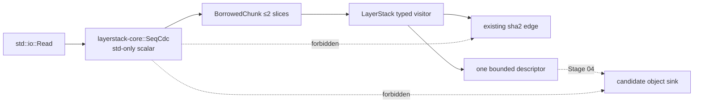
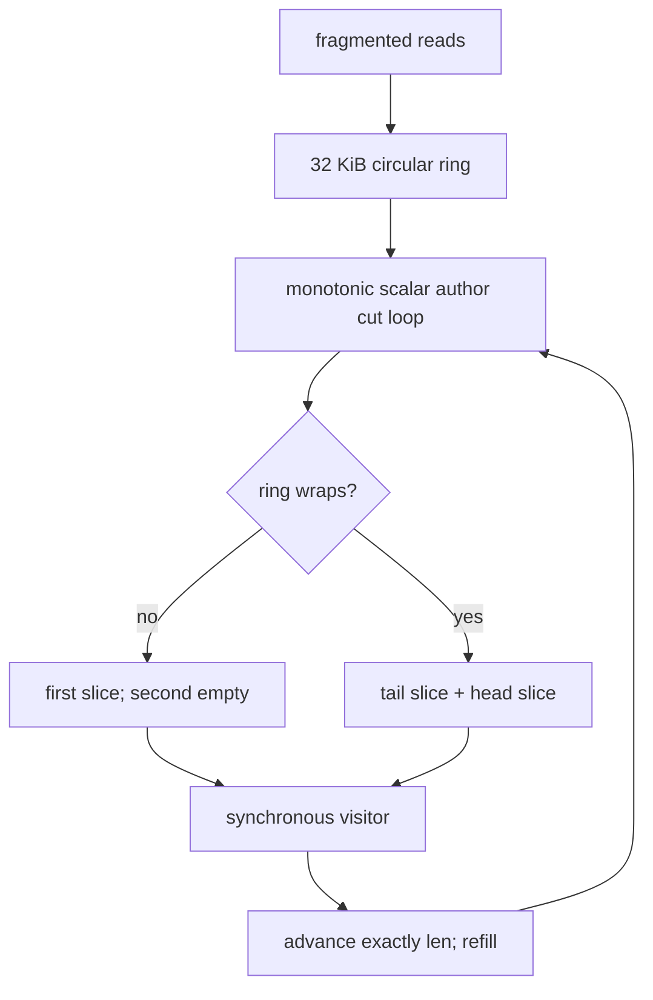
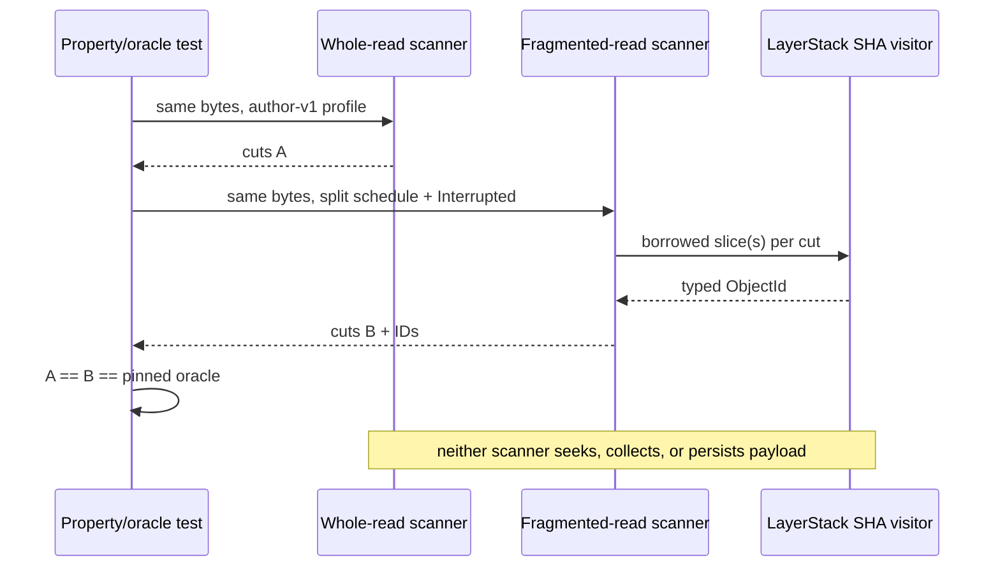

# Stage 03 — Bounded scalar streaming SeqCDC

[Implementation overview](../index.md) · [Stage 03 E2E plan](e2e_test.md) · [Preparation 02](../../prep/02-storage-solution-examination-review.md) · [Preparation 03](../../prep/03-seqcdc-cas-and-squash-decision.md) · [Preparation 04](../../prep/04-seqcdc-space-time-complexity-and-acceptance-criteria.md)

Product root: `/Users/yifanxu/Ephemeral-AI-Lab/ephemeral-sandbox`
Test root: `/Users/yifanxu/Ephemeral-AI-Lab/ephemeral-sandbox-test`

## 1. Stage contract

| Field | Contract |
| --- | --- |
| Status | Proposed; POC proof tier. Planning creates no branch. Implementation requires exact branch `upgrade-2.0-phase-1`, created from the newest approved immutable product revision, with immutable product/test/doc bases recorded first. |
| Depends on | Stage 02 portable root/object contract and its exact-zero dependency proof. |
| Owners / affected crates | `sandbox-runtime-layerstack-core` owns scalar boundary selection; the existing `sandbox-runtime` LayerStack module owns SHA-256 and descriptor adaptation; focused Rust/external POC tests. |
| Objective | Implement the authors’ increasing-mode scalar SeqCDC semantics as one safe, standard-library-only, bounded streaming primitive whose boundaries are deterministic under arbitrary `Read` fragmentation. |
| System-visible outcome | None. No production capture/publication route calls the chunker; no v2 artifact exists; v1 remains sole read/write/publication authority. |
| Fixed profile | `seqcdc-scalar-author-v1`; increasing; min 8,192 B; effective-mean target 16,384 B; max/window 32,768 B; sequence threshold 5; opposing-slope trigger 50; jump 512 B; typed/domain-separated SHA-256 in the existing LayerStack adapter. |
| Scope | Scalar cut loop; 32 KiB circular window; at most two borrowed slices; callback/visitor API; checked offsets/lengths; author-oracle fixtures; fragmentation/boundary/property tests; existing-`sha2` chunk-ID adapter; tiny diagnostic loop; exact dependency/source audit. |
| Non-goals | Runtime shadow writer; CAS persistence; packs/indexes/catalogs; async/SIMD/unsafe; public route; authoritatively selected SeqCDC; integrated 10% advantage; full storage/RSS/portability qualification; StreamCDC fallback implementation; materialization/GC/squash. |
| Entry | Stage 02 POC exit passes; immutable oracle provenance/digest is recorded; exact dependency baselines remain available; no candidate `/eos` subtree exists. |
| Exit | Every cut matches the pinned increasing-mode oracle; cuts are in `1..=available`, deterministic, fragmentation-independent, byte-complete, and profile-bounded; one 32 KiB ring and ≤2 non-retainable slices are enforced; production boundary code is ≤300 physical non-test Rust lines; core remains std-only/safe; external dependency delta is exactly zero; runtime remains legacy-only. |
| Rollback | Remove `seqcdc.rs`, LayerStack adapter, and fixtures/tests. Root format/profile IDs remain reserved but no durable root references them, so no data migration is required. |

Stage 03 makes SeqCDC **eligible for shadow integration**, not selected for production. Selection still requires the integrated Preparation 04 time/space gates against internal synchronous StreamCDC at equal effective chunk distribution.

## 2. Current evidence

| Status | Repository/path | Current fact | Stage decision |
| --- | --- | --- | --- |
| observed | [Preparation 03 §3](../../prep/03-seqcdc-cas-and-squash-decision.md#3-seqcdc-findings) | Available implementations do not by themselves supply authoritative complete validation. | Pin an independently reviewed authors’ increasing-mode oracle and record source revision/digest; generated expected cuts are immutable fixtures. |
| observed | [Preparation 03 §4](../../prep/03-seqcdc-cas-and-squash-decision.md#4-bounded-streaming-and-large-files) | Required adapter uses one 32 KiB window, ≤2 borrowed slices, no owned payload per chunk, and no chunk collection. | These are type/API invariants and measured high-water assertions, not review-only intentions. |
| observed | [Preparation 04 §2](../../prep/04-seqcdc-space-time-complexity-and-acceptance-criteria.md#2-fixed-seqcdc-profile) | The exact profile and approximate chunk-count bounds are frozen. | Expose only `SeqCdcProfile::AUTHOR_V1`; any parameter change creates a new algorithm/profile ID. |
| observed | [Preparation 04 §4.1](../../prep/04-seqcdc-space-time-complexity-and-acceptance-criteria.md#41-seqcdc-boundary-selection) | Scan/hashing/descriptors are linear; jumps advance and never rescan consumed input. | Track monotonically increasing input/scanned offsets in debug/test invariants. |
| observed | product `crates/sandbox-runtime/layerstack/src/model/mod.rs:248-285` | LayerStack already streams SHA-256 with its existing `sha2` dependency. | Chunk payload IDs are computed by a LayerStack visitor over borrowed slices. The core imports no hash crate. |
| observed | product `crates/sandbox-runtime/layerstack/src/lib.rs` | LayerStack forbids unsafe code. | The core continues to forbid unsafe; no SIMD or FFI path is added. |
| observed | product `crates/sandbox-runtime/workspace/src/overlay/capture.rs:104-228` | Current capture walks/collects entries and emits whole-file `WriteFile` sources. | Do not integrate here in Stage 03. Streaming capture and shadow ingest begin together in Stage 04. |
| observed | product `crates/sandbox-runtime/layerstack/src/stack/layer/write.rs:19-39` | Current publication copies the whole source file into a native carrier. | Preserve v1 behavior. SeqCDC is test-only/dormant until Stage 04. |
| observed | product workspace and LayerStack manifests | Existing direct edges include `sha2`, `serde`, `rayon`, and storage crates. | Add no external edge and do not use `rayon`/async in the portable chunker. |
| observed | Stage 02 contract | `ChunkProfileId` and typed `ChunkPayload` object identity are already versioned. | Bind the exact fixed profile ID to root/object metadata; never silently reinterpret an old record. |
| inferred | current `Read` implementations and test doubles | Reads may return any positive fragment size, `Interrupted`, or EOF. | The chunker consumes arbitrary fragmentation and retries `Interrupted`; a zero read is EOF under `Read` semantics. |
| open | performance selection | Paper throughput is not an integrated LayerStack result. | Report diagnostic throughput only; final selection remains Stage 11. |

The implementation target is the smallest safe semantic port. A generic pluggable chunker framework, async stream, SIMD facade, dependency, or whole-file helper is outside this stage.

## 3. Resulting file and folder structure

### Product source tree

```text
ephemeral-sandbox/
├── Cargo.toml                             [unchanged contract] — no external package/version/feature/direct-edge delta
├── Cargo.lock                             [unchanged contract] — no external package/version/feature/direct-edge delta
└── crates/sandbox-runtime/
    ├── layerstack-core/
    │   ├── Cargo.toml                     [unchanged contract] — std-only
    │   ├── src/
    │   │   ├── lib.rs                    [modify] — export seqcdc values
    │   │   └── seqcdc.rs                 [add] — ≤300 non-test physical lines
    │   └── tests/
    │       ├── seqcdc_author_oracle.rs    [add]
    │       ├── seqcdc_fragmentation.rs    [add]
    │       ├── seqcdc_boundaries.rs       [add]
    │       └── seqcdc_tiny_loop.rs        [add] — ignored 30–60 s diagnostic
    └── layerstack/
        ├── Cargo.toml                     [unchanged contract] — external edges
        ├── src/model/portable_chunk.rs    [add] — existing-sha2 borrowed-slice visitor
        └── tests/
            ├── seqcdc_typed_ids.rs        [add]
            └── fixtures/cas/v2/seqcdc/
                ├── ORACLE.md              [add] — source revision/license/digest/method
                ├── cases.json             [add] — inputs/profile/expected cuts/IDs
                └── payloads.bin           [add] — deterministic small corpus
```

`seqcdc.rs` counts only non-test physical Rust lines after ordinary formatting; comments explaining author semantics count toward the review artifact but tests/adapters do not. An exception above 300 lines requires an explicit architecture decision before Stage 04.

### Complete `/eos` tree after Stage 03

No entry is added or renamed. The main tree is the deterministic Stage 00
workspace/namespace-execution shape and is this stage's required
branch-independent storage state. The canonical candidate subtree remains
absent. Stage 01 may finish in parallel, but its replacement delta below is
accepted only after Stage 01's own exit and is not a Stage 03 gate.

```text
/eos/                                                    [E0]
├── layer-stack/                                         [L0]
│   ├── .storage-writer.lock                             [L1]
│   ├── manifest.json                                    [L2]
│   ├── workspace.json                                   [L3]
│   ├── base/<base_id>/                                  [L4]
│   ├── layers/<layer_id>/                               [L5]
│   ├── staging/<layer_id>.staging/                      [L6]
│   └── .layer-metadata/
│       ├── <layer_id>.digest                            [L7]
│       └── <layer_id>.bytes                             [L8]
├── storage/
│   ├── file_auditability/                               [S1]
│   └── workspace_recovery/                              [S2]
├── workspace/
│   ├── manager.json                                     [W1]
│   ├── .export/<spool_id>                               [W2]
│   └── <workspace_session_id>/                          [W3]
│       ├── upper/                                       [W4]
│       └── work/                                        [W5]
├── namespace_execution/                                 [N0]
│   └── <namespace_execution_id>/transcript.log          [N1]
└── runtime/daemon/
    ├── runtime.sock                                     [R1]
    └── runtime.pid                                      [R2]
```

Optional Stage 01 parallel-world replacement delta, not a Stage 03 entry,
exit, or rollout assumption:

```text
/eos/workspace/<workspace_session_id>/executions/<command_session_id>/transcript.log [PW0]
/eos/namespace_execution/<legacy_namespace_execution_id>/transcript.log              [PN0; compatibility-only, may be absent]
```

| Code/path | State; class | Owner | Lifecycle / fsync / recovery / deletion | `RootId` participation | Stage read/write | Bound; `T(t)` | Permissions/exposure |
| --- | --- | --- | --- | --- | --- | --- | --- |
| `E0 /eos` | existing namespace | installation/daemon | external provision → boot validate → installation removal only | none | daemon R/W | one; all terms | masked |
| `L0 layer-stack` | existing truth namespace | LayerStack | open/validate → existing child durability → legacy boot sweep | no v2 | legacy R/W | one; `L_hot+P_staging+M` | daemon-only |
| `L1 .storage-writer.lock` | existing writer coordination | LayerStack | open → acquire process lock → kernel-held exclusion → reacquire after restart → close with owner | none | legacy coordination R/W | one file/FD; `M` | daemon-only |
| `L2 manifest.json` | sole authority | legacy publisher | temp/fsync → rename/parent fsync → boot validate → atomic supersede | v1 hash only, excluded from v2 | legacy R/W/publication | one; `M` | daemon-only |
| `L3 workspace.json` | existing base/workspace binding truth | base builder | bootstrap → atomic replace/fsync → boot validate → installation removal | physical v1 binding only; excluded from v2 | legacy R/W | one; `M` | daemon-only |
| `L4 base/<id>` | native truth/carrier | base builder | verified install/rename/fsync → v1 reachability → approved removal | physical v1 ref only | legacy R | one; `L_hot` | lower read-only/masked |
| `L5 layers/<id>` | native truth/carrier | legacy publisher | staging tree fsync/rename → manifest commit → legacy squash/reap | physical v1 ref only | legacy R/W | existing depth, final `D≤64`; `L_hot` | lower read-only/masked |
| `L6 staging/<id>` | transaction staging | legacy publisher | private allocate/write/fsync → rename or abort/boot reap | none | legacy W | admitted legacy transaction; `P_staging` | `0700`, masked |
| `L7 digest` | v1 truth-adjacent metadata | legacy publisher | atomic write → recompute recovery → carrier deletion | not typed chunk/object ID | legacy R/W | one/carrier; `M` | daemon-only |
| `L8 bytes` | accounting metadata | legacy publisher | atomic write → recount → carrier deletion | none | legacy R/W | one/carrier; `M` | daemon-only |
| `S1 file_auditability` | audit truth | FileService | operation durable update → boot recovery → retention | blame separate from content | service R/W | configured; `M` | authenticated API |
| `S2 workspace_recovery` | conditional recovery truth | recovery owner | exact failed owner/fsync → bounded retry → delete after reap | none | recovery R/W | failed sessions; `P_staging+M` | daemon-only |
| `W1 manager.json` | owner/recovery truth | WorkspaceManager | atomic update/fsync → boot reconcile → supersede | none | workspace R/W | one; `M` | daemon-only |
| `W2 .export/<spool_id>` | existing export scratch | export operation | request creates a private bounded spool → close makes it API-readable without truth-publication durability → exact-spool cleanup after consumption/drop; boot reaps the whole `.export` directory | none | operation R/W | configured active-spool bound; `P_staging` | daemon-only, masked |
| `W3 session` | active scratch | WorkspaceManager | admit → mount/use → publish/destroy → exact-id cleanup | none | workspace R/W | active sessions; `ΣU_active` | `0700` |
| `W4 upper` | current writable scratch | workspace/capture | create/write → legacy capture → teardown/recovery delete | future bytes only; host path excluded | workspace R/W | unpublished allocation; `ΣU_active` | `/workspace` projection only |
| `W5 work` | OverlayFS scratch | overlay/kernel | mount setup → kernel use → unmount/reap | none | provider R/W | one/session; `ΣU_active` | masked |
| `N0 namespace_execution` | existing command-scratch namespace | namespace execution owner | provision/validate → active child visibility → owner cleanup/boot reconcile → installation removal | none | command R/W | active commands; `ΣU_active+M` | masked |
| `N1 command transcript` | existing command scratch | command owner | admit/append under cap → terminal close → Drop/boot exact-id cleanup | none | command R/W | transcript/terminal caps; `ΣU_active+M` | `0700`, API-only |
| `PW0 Stage 01 consolidated transcript` | optional Stage 01 command scratch | command owner | create beneath owning workspace session → append/close → Drop/session/boot cleanup | none | command R/W only if Stage 01 passed | transcript/terminal caps; `ΣU_active+M` | API-only |
| `PN0 Stage 01 legacy transcript` | optional compatibility scratch, remove-later | Stage 01 cleanup adapter | **no new writes** → exact pre-upgrade reap → absence after compatibility window | none | cleanup only if Stage 01 passed | converges zero; legacy cap while present; `P_staging` | `0700`, masked |
| `R1 runtime.sock` | ephemeral control | daemon | stale-owner validate/bind → unlink shutdown/recovery | none | control R/W | one; `M` | `0600` |
| `R2 runtime.pid` | ephemeral identity | gateway/daemon | atomic boot write → identity recovery → remove shutdown | none | daemon R/W | one; `M` | daemon-only |

All of these are forbidden in Stage 03: `/eos/layer-stack/format-v2.json`, `roots/v2`, `manifests/v2`, `objects/v1`, `packs/v1`, `indexes/v1`, `catalogs/v1`, `journals/v1`, `staging/v2`, `leases/v1`, `retention/v1`, `maintenance/v1`, `materializations/docker-overlayfs/v1`, `quarantine/v1`, and `trash/v1`.

## 4. SRP, SOLID, and coupling design

### Responsibility table

| Type/component | One responsibility | Inputs | Output/dependent | Extension seam | Must not own |
| --- | --- | --- | --- | --- | --- |
| `SeqCdcProfile` | Immutable format parameters and ID | constants only | `SeqCdc` | a new named profile/version | dynamic tuning, environment detection |
| `SeqCdc<R>` | Read once, choose author-semantic cuts, expose borrowed bytes | `std::io::Read`, profile | `ChunkVisitor` | reader and visitor generics | hashing, persistence, queue, async task |
| `RingWindow` (private) | Maintain one 32 KiB circular byte window | reader bytes | one/two slices | none | heap growth, payload ownership downstream |
| `BorrowedChunk<'a>` | Describe offset/length plus ≤2 slices valid only for the visit | ring borrow | visitor | none | `Vec<u8>`, `'static`, clone/retain |
| `ScanSummary` | Return bounded counters | scanner counters | tests/adapter | additive non-identity counters | per-cut log/list |
| `TypedChunkVisitor` in LayerStack | Hash borrowed slices with existing `sha2` and emit bounded descriptors | `BorrowedChunk` | future object sink/test | later Stage 04 descriptor sink | cut selection, storage fsync, whole payload |
| Stage 04 writer (absent) | Persist chunks/descriptors transactionally | future visitor records | CAS | bounded sink port | author semantics |

There is one algorithm implementation and one immutable profile. Do not create `ChunkerFactory`, strategy registries, async traits, plugin loading, runtime parameter config, or SIMD dispatch. StreamCDC remains an internal comparison implementation added by its owning qualification work, not a polymorphic production framework in this stage.

### Dependency and portability table

| Boundary | Allowed | Forbidden | Proof |
| --- | --- | --- | --- |
| core | `std::io`, explicit integer/byte operations, Stage 02 core types | sha/serde/rayon/tokio, OS APIs, host paths, libc/FFI, unsafe, SIMD intrinsics | manifest/source audit and all-target build |
| LayerStack adapter | existing `sha2`, core chunk visitor/types | new external edge or moved edge | exact graph diff |
| reader | any conforming `Read` with arbitrary fragmentation | seek/re-read assumption, full-file read, target-image helper | fragmentation matrix and one-pass reader |
| CPU | scalar comparisons/counters/checked arithmetic | compile-time architecture-specific behavior | golden boundaries/IDs |
| endianness/word size | explicit `u64` offsets and `u32` lengths | `usize` persisted identity | exact fixture bytes |
| target image | no in-image code at all | shell/libc utility/package/network/helper | process/image dependency audit |

The new core remains standard-library-only. The existing LayerStack crate retains `sha2` and `serde`; Stage 03 adds no manifest edge of any kind except already-approved internal source use.

## 5. Type, class, and field design

```rust
pub struct SeqCdcProfile {
    pub algorithm: ChunkProfileId, // "seqcdc-scalar-author-v1"
    pub mode: Mode,                // Increasing
    pub min_bytes: u32,            // 8_192
    pub target_mean_bytes: u32,    // 16_384, evidence target not cut-loop input
    pub max_bytes: u32,            // 32_768
    pub sequence_threshold: u8,    // 5
    pub opposing_slope_trigger: u8,// 50
    pub jump_bytes: u16,           // 512
}

pub struct SeqCdc<R> {
    reader: R,
    ring: [u8; 32_768],
    head: u16,
    available: u16,
    consumed: u64,
}

pub struct BorrowedChunk<'a> {
    pub offset: u64,
    pub len: u32,
    pub first: &'a [u8],
    pub second: &'a [u8], // empty unless the ring wraps
}

pub trait ChunkVisitor {
    type Error;
    fn visit(&mut self, chunk: BorrowedChunk<'_>) -> Result<(), Self::Error>;
}

pub struct ScanSummary {
    pub input_bytes: u64,
    pub chunk_count: u64,
    pub min_observed: u32,
    pub max_observed: u32,
    pub wrapped_chunks: u64,
    pub comparison_count: u64,
    pub jump_count: u64,
}

pub fn scan<R: std::io::Read, V: ChunkVisitor>(
    reader: R,
    profile: SeqCdcProfile,
    visitor: &mut V,
) -> Result<ScanSummary, SeqCdcError<V::Error>>;
```

The actual implementation may make fields private or fuse `SeqCdc` and `scan`, but it must preserve the lifetime property: a visitor cannot retain a chunk borrow beyond `visit`. The two slices must cover exactly `len` bytes in order. There is no payload `Vec`, chunk `Vec`, whole-file buffer, `Arc`, channel, or downstream payload byte.

`target_mean_bytes` is recorded/measured but is not secretly fed into the authors’ increasing-mode cut loop. Non-empty chunks use `1..=available`; all non-final chunks satisfy 8,192–32,768 bytes. The final chunk may be smaller than 8,192 bytes. A file shorter than 8,192 bytes yields one actual-length chunk; empty input yields zero chunks.

The scanner:

- retries `std::io::ErrorKind::Interrupted`;
- treats a zero-length read as EOF;
- uses checked `u64` offsets and checked conversion to `u32` chunk lengths;
- never seeks or rescans consumed input;
- stops before a jump would cross available bytes and applies exact oracle tail semantics;
- calls the visitor exactly once per chunk in increasing offset order; and
- returns a visitor failure without emitting later chunks.

LayerStack’s typed visitor hashes:

```text
SHA-256(
  "EOS-LS2\0"
  || object_kind=ChunkPayload
  || object_format_version
  || payload_length_be
  || first_slice
  || second_slice
)
```

It emits only an `ObjectId`, file offset, and length to a bounded descriptor sink. Persistence is absent in Stage 03.

## 6. Data and compatibility design

| Concern | Frozen rule | Compatibility action |
| --- | --- | --- |
| Algorithm identity | Exact `seqcdc-scalar-author-v1`; profile serialized in every future root | Any semantic/parameter change creates a new profile/format; never reinterpret old roots |
| Oracle | Pinned source revision, file digest, extraction method, increasing-mode outputs | Fixture is append-only; changed output blocks and requires review |
| Test input | Deterministic bytes with documented generator/seed, plus tiny explicit literals | No runtime download or package |
| Expected cuts | Ordered cumulative offsets and lengths; final byte count equals input | Never infer from current implementation |
| Expected IDs | Existing LayerStack typed SHA-256 over exact chunk bytes | Core boundary test distinguishes cut defect from hash adapter defect |
| V1 | Current native whole-file publication | Unchanged; no runtime call to SeqCDC |
| Root v2 | Stage 02 profile ID type | In-memory/test only; no root writer |
| Empty/short file | zero chunks for empty; one actual-length chunk for `0<F<8192` | No padding or synthetic empty chunk |
| Read fragmentation | Must not affect cuts or IDs | Exhaustive small split points + deterministic randomized fragment schedules |
| Sparse file | Reader bytes are logical payload bytes | Sparse preservation/capture is Stage 04+; no claim from a byte-stream test |

Oracle corpora include: empty; 1, 8, 7, 8,191, 8,192, 8,193; 16,383–16,385; 32,767–32,769 bytes; monotone increasing/decreasing; equal runs; sawtooth around threshold 5; opposing slope at 49/50/51; jump landing at 511/512/513; wrap across ring end; deterministic pseudorandom; localized insert/delete; and multi-megabyte repeated records. Integer boundaries are explicitly included.

## 7. Workflow and failure semantics

### Happy path

1. Validate the exact author-v1 profile.
2. Fill free ring capacity from `Read` without exceeding 32 KiB.
3. Apply the scalar increasing-mode cut loop only over available bytes.
4. Expose the chosen chunk as one or two borrowed slices.
5. LayerStack hashes/records the descriptor synchronously, then returns the borrow.
6. Advance the ring monotonically and refill; emit the final short chunk at EOF.
7. Return bounded summary counters and drop all state.

### Failure semantics

| Failure | Required behavior |
| --- | --- |
| Invalid/non-author profile | reject before reading |
| Reader `Interrupted` | retry without state/counter drift |
| Other reader error | return typed source error; no later visit |
| Visitor/hash/sink error | stop immediately; return visitor error; no retry/duplicate callback |
| Offset/count overflow | fail closed before wrap |
| Oracle mismatch | test failure; do not update fixture from candidate output |
| Panic | defect; hostile/property tests must use typed errors |
| Cancel/drop between callbacks | scanner/ring drops; no task, payload, descriptor, or durable residue |
| Process crash | no v2 artifact exists; v1 recovery is unchanged |

### Memory and ownership lifecycle

| Resource | Owner | Acquire | Hard bound | Backpressure | Normal release | Error/cancel/panic | Shutdown/restart |
| --- | --- | --- | --- | --- | --- | --- | --- |
| circular payload ring | scanner call | stack/boxed scanner construction | exactly 32 KiB | synchronous reader naturally backpressures | call return | RAII unwind/drop | no survivor |
| borrowed chunk slices | scanner → visitor borrow | one callback | ≤2 slices, total ≤32 KiB | visitor is synchronous | callback return | lifetime forbids retention | no survivor |
| SHA state | LayerStack visitor | callback start | one fixed state | synchronous | finalize/drop | RAII | no survivor |
| descriptor | visitor/sink | after hash | one current descriptor in Stage 03; future queue 16/≤64 KiB | synchronous error | sink return | RAII | none persisted |
| oracle input/output | test | case start | checked fixture size; tiny POC | test scheduling | case end | test owner cleanup | not production |
| summary counters | caller | scan start | fixed scalar struct | N/A | value drop | RAII | no registry |
| workers/tasks/threads | none | never | 0 | N/A | N/A | N/A | 0 |
| FD/mmap/cache/permit | none owned by chunker | never | 0 | N/A | N/A | N/A | 0 |

Logical quiescence is immediate at function return. A memory profiler is not a control mechanism. The API makes unbounded retention unrepresentable in safe callers; Stage 04 separately bounds the descriptor queue and publication permits.

## 8. Complexity and performance contract

### Algorithm complexity

For input bytes `U` and chunks `K`:

```text
read + scalar scan + typed hashing = O(U)
descriptor callbacks               = O(K)
combined                           = O(U + K) = O(U)
application memory                 = O(32 KiB + fixed state) = O(B)
ceil(U / 32 KiB) ≤ K ≤ ceil(U / 8 KiB)  for non-empty input,
with a possibly smaller final chunk.
```

Jumps advance the scan position and never cause rescanning. Diagnostic counters must show `consumed_offset` monotonic; property tests cap comparisons by a reviewed constant multiple of input bytes.

### Exact Preparation 04 gate disposition

| Preparation 04 requirement | Disposition in Stage 03 |
| --- | --- |
| Exact author-v1 profile: increasing, 8,192/16,384/32,768 B, threshold 5, opposing 50, jump 512, typed SHA-256 | **stage-gating** |
| One 32 KiB circular window, ≤2 borrowed slices, no owned chunk, no chunk collection, zero downstream payload | **stage-gating** |
| Every cut matches pinned oracle, `1..=available`, deterministic and `Read`-fragmentation independent; empty/short/tail semantics exact | **stage-gating** |
| `ceil(U/32KiB)≤K≤ceil(U/8KiB)` for non-empty input, final may be short | **stage-gating** |
| Read/scan/hash `O(U)`, descriptors `O(K)`, combined `O(U+K)`; no rescan on jump | **stage-gating** |
| Scalar production cut core ≤300 physical non-test Rust lines, safe Rust/no unsafe | **stage-gating** |
| Exact external package/version set, enabled features, direct external-edge multiset unchanged; no tool/service/helper/download | **stage-gating** |
| Each focused operation ≤60 s; diagnostic loop 30–60 s | **stage-gating** |
| Effective mean within 5% of 16 KiB on final required corpora | **deferred-to-stage_11**; Stage 03 reports tiny diagnostic distribution only |
| SIMD/accelerated path and scalar/SIMD differential | **not-applicable**; Stage 03 intentionally implements scalar only. Any later acceleration needs safe runtime detection and byte-identical boundaries/IDs. |
| Publication `O(U+E+K)`, 4 workers, per-worker 32 KiB ring, ≤4 global borrowed chunks, queue 16/≤64 KiB, ≤4 MiB/publication, 64 MiB global semaphore | Core per-worker ring **stage-gating**; runtime workers/queue/permits **deferred-to-stage_04** |
| 256 KiB pack-read/hydration buffers, 16 MiB page cache, merge fan-in 8×64 KiB | **deferred-to-stage_05** / `stage_08` as owned; not allocated here |
| Publication peak `C_capture + staging≤5%`; ENOSPC preserves authority | **deferred-to-stage_04** |
| Metadata ≤96 B/chunk, ≤64 B/segment, ≤256 B+path changed record | descriptor shape diagnostic now; persisted/accounted gate **deferred-to-stage_04** and final `stage_11` |
| Warm resolve/mount p50/p95 ≤ baseline+5%+2 ms, zero CAS; cold hydrate ≥70% copy; cold activate ≤1.5× copy + warm | **deferred-to-stage_05** |
| Disjoint publication ≥90% baseline/OCC; small-edit p95 ≤baseline+15%+5 ms | **deferred-to-stage_07** |
| Packs ≤64 MiB/100k/80 MiB; dead/slack and maintenance slice/grace thresholds | **deferred-to-stage_08** |
| Depth 48/64, squash benefit 8/manual 2, squash/remount timing | **deferred-to-stage_09** |
| No-op exec p50/p95 ≤+3%+0.5 ms; command/file throughput ≥97%; PTY create ≤+3%+1 ms; drain/stdin/C/D ≤+3%+0.5 ms; unsupported semantics unchanged | **deferred-to-stage_11**; Stage 03 only checks legacy compatibility |
| Selection advantage ≥10% on localized-source and mixed-tree; no-dedup/small-file regression≤3%; 3 fresh matched sets, ≥5 interleaved samples, counterbalance, paired-bootstrap 95% LCB≥0.10; equal distribution mean≤5%, p10/p50/p90≤10% | **deferred-to-stage_11** |
| Unique payload ≤1.14× StreamCDC; locality target for `F≥16MiB`, edit≤64KiB is change+64KiB+segment, hard median>4× or any≥25%F | **deferred-to-stage_11** |
| Total `T`, amplification (1.08/1.15; small-file 1.15/1.25), duplicate (1/3%), slack (2/5%), unreachable 0 | **deferred-to-stage_11** |
| RSS≤384 MiB and≤128 MiB over idle; 64/256/1024MiB×1/16/64 roots×3 cold; ≤16 MiB full variation and≤8 MiB/4× | **deferred-to-stage_11** |
| Long-lived release without restart/trim/cache purge/sleep | Scanner logical release **stage-gating**; full process/RSS slope **deferred-to-stage_11** |
| Required-release host matrix using sole pinned Ubuntu 24.04 OCI index `sha256:4fbb8e6a8395de5a7550b33509421a2bafbc0aab6c06ba2cef9ebffbc7092d90` and recording each resolved platform manifest | source/design independence **stage-gating**; executed host rows **deferred-to-stage_11**; cross-image portability is beyond Phase 1 and non-gating |
| Candidate/baseline invocation ≤5 min | **not-applicable** to the Stage 03 diagnostic; final paired campaigns `deferred-to-stage_11` |

Raw GB/s from a paper or this tiny loop cannot satisfy integrated selection.

## 9. Diagrams

### Dependency and ownership



### Circular-window dataflow



### Fragmentation equivalence sequence



### Error/cancellation state

```mermaid
stateDiagram-v2
  [*] --> Fill
  Fill --> Fill: Interrupted
  Fill --> Scan: bytes available
  Fill --> Tail: EOF with bytes
  Fill --> Complete: EOF empty
  Scan --> Visit: cut selected
  Visit --> Fill: visitor success / advance
  Visit --> Abort: visitor error or cancel
  Fill --> Abort: non-Interrupted read error
  Tail --> Visit
  Abort --> [*]: ring and borrows dropped; no artifact
  Complete --> [*]: bounded summary
```



## 10. Implementation sequence

1. Confirm Stage 02 exit, exact `upgrade-2.0-phase-1` created from the newest approved immutable product revision, recorded immutable product/test/doc bases, clean scoped worktrees, and unchanged dependency fingerprints. Planning itself creates no branch.
2. Freeze oracle provenance: exact upstream revision, relevant source digest, increasing-mode extraction rule, license, and an independent review. Generate expected offsets once; check in deterministic inputs/outputs.
3. Add `SeqCdcProfile::AUTHOR_V1` validation and boundary-size tests before the loop.
4. Implement one private 32 KiB ring and the scalar author loop in `seqcdc.rs`; keep non-test physical line count visible in CI.
5. Expose the lifetime-bound two-slice visitor API, checked offsets, `Interrupted` retry, exact EOF/tail handling, and summary counters.
6. Add boundary-table and oracle tests, then fragmentation/property tests including split points, zero/short reads, wrap, jumps, monotone/sawtooth, and deterministic pseudorandom corpora.
7. Add the LayerStack typed chunk visitor using only the existing `sha2` edge. Verify two-slice hashing equals hashing contiguous fixture bytes.
8. Add cancellation/error visitors and one-pass readers that fail on seek/re-read or over-consumption.
9. Audit code size, unsafe, dependency graph, source imports, heap/payload ownership, threads/tasks/channels, and `/eos` absence.
10. Run focused product tests, exact live legacy-dormancy POC, and ignored 30–60 second diagnostic loop from [e2e_test.md](e2e_test.md).
11. Append exact evidence and defects; do not update an oracle from failing candidate output.
12. Unblock Stage 04 only if all Stage 03 gates pass. A distribution or speed miss is recorded but remains a Stage 11 selection question; a semantic/memory/dependency miss blocks.

## 11. Observability

No production route invokes SeqCDC, so public storage observations remain:

| Runtime field | Required Stage 03 value |
| --- | --- |
| configured/read/write/publication authority | `legacy` / `legacy_v1` |
| candidate/shadow completed, mismatch, fallback | `0`, `0`, `0` |
| candidate workers/tasks/queues/bytes/permits/transactions | all `0` |
| candidate roots/objects/packs/durable bytes | absent or explicit `0`; mandatory fields cannot be silently missing |
| SeqCDC runtime scans/bytes/chunks | `0` |

Focused Rust artifacts, not daemon metrics, report: oracle ID/digest, profile ID/parameters, input bytes, chunk count, ordered cut digest, min/mean/p10/p50/p90/max diagnostic sizes, wrap/comparison/jump counts, fragmentation schedule ID, typed object-ID digest, ring high-water (exactly ≤32 KiB), maximum slices (≤2), current descriptor count, code-line count, elapsed diagnostic time, and errors.

Do not log individual production payload bytes, chunk IDs, or paths. Test failure may reference a bounded case index, expected/actual offset, and fixture digest. Missing memory/dependency evidence is a failure, not zero.

## 12. Completion checklist

- [ ] Exact branch `upgrade-2.0-phase-1` and its newest approved immutable product base, plus immutable test/doc bases, are recorded; planning itself created no branch.
- [ ] Stage 02 portable contract and exact-zero dependency gate pass.
- [ ] Oracle provenance/revision/digest/method/license is pinned and independently reviewed.
- [ ] Profile values exactly match `seqcdc-scalar-author-v1`; target mean is not a cut-loop input.
- [ ] Empty, short, exact-boundary, tail, wrap, slope, threshold, jump, monotone, repeated, random, and localized-edit vectors pass.
- [ ] Every cut matches the oracle and is deterministic under arbitrary `Read` fragmentation and `Interrupted`.
- [ ] Input is consumed once; scan offset never regresses; combined work is linear.
- [ ] One 32 KiB ring and at most two callback-scoped borrowed slices are enforced.
- [ ] No owned payload chunk, chunk collection, whole-file buffer, channel, task, thread, mmap, cache, or permit is introduced.
- [ ] Scalar production cut code is ≤300 physical non-test Rust lines and uses safe Rust only.
- [ ] Existing LayerStack adapter uses existing `sha2`; core remains std-only and imports no outward/backend type.
- [ ] Exact external package/version, feature, and direct-edge deltas are zero; no system/image/runtime dependency exists.
- [ ] V1 publication, mount, command, file, PTY, stdin, and cancellation behavior remains compatible.
- [ ] Complete `/eos` tree remains legacy-only; every canonical candidate subtree is absent.
- [ ] Focused operations are <60 seconds; 30–60 second loop is explicitly diagnostic.
- [ ] POC verdict claims no integrated selection, final memory/space/performance, portability, release, or production approval.
