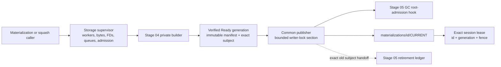

# Stage 04.5 — materialization/GC lifecycle alignment

Status: specification only. The alignment audit found compatible Stage 04
primitives, but the implementation and all evidence in this directory remain
`OPEN`.

Normative dependencies:

- [implementation index](../index.md)
- [minimal storage contract](../layerstack_storage_contract.md)
- [Stage 04](../stage_04_candidate_materialization/spec.md)
- [Stage 05](../stage_05_retention_gc_packs/spec.md)
- [Stage 06](../stage_06_candidate_authority/spec.md)
- [Preparation 04](../../prep/04-seqcdc-space-time-complexity-and-acceptance-criteria.md)

## 1. Outcome and authority boundary

Stage 04.5 is the compatibility gate between Stage 04 materialization and the
Stage 05 common generation lifecycle. It does not add a product capability,
public authority, logical retention policy, GC, grace period, trash owner, or
deletion path.

Its outcome is the smallest Stage 04 producer that Stage 05 can safely consume:

```text
bounded private build -> complete verification and sync -> Ready generation
-> bounded common publication -> exact old-generation handoff
```

Stage 04.5 MUST:

1. separate private materialization construction from selector publication;
2. produce a typed, immutable, verified `Ready` generation;
3. route publication through the common operation and writer-lock protocol;
4. acquire root and physical-source protection before reconstruction starts;
5. preserve exact generation leases for admitted sessions;
6. collapse materialization durability into the common four-state lifecycle;
7. remove Stage 04 generation-deletion authority;
8. place all Stage 04 work under shared bounded resource ownership; and
9. make recovery proportional to capped current work, never materialization
   history; and
10. preserve the warm native command/file/PTY fast paths and prove their time,
    resource, peak-space, and quiescent-space behavior with matched evidence.

The following authority rules are non-negotiable:

- v1 remains the public read/write authority until Stage 06.
- Stage 04.5 MUST NOT delete a logical object, loose carrier, pack, locator run,
  materialization generation, v1 path, or WorkspaceManager path.
- Stage 05 remains the first stage with physical or logical deletion authority.
- Stage 04.5 may clean only incomplete private work named by one validated common
  operation record and proven to be below that operation's `work/` directory.
- Wall time, lease expiry, directory age, and a missing in-memory owner are never
  deletion authority.
- Until Stage 05 retirement is enabled, every previously published generation is
  retained.

## 2. Alignment audit and required delta

The implementation already has several useful Stage 04 primitives:

- logical `RootId` is independent of materialization generation;
- reconstruction and verification happen before `CURRENT` publication;
- generation manifests and `CURRENT` use bounded, checked decoding and atomic
  replacement;
- admitted sessions lease an exact generation and fence; and
- native reconstruction has depth, entry, segment, and worker limits.

Those primitives are retained. The following implementation shapes do not meet
the Stage 05 prerequisite and MUST change before this stage passes:

| Current shape | Why it is not aligned | Stage 04.5 requirement |
| --- | --- | --- |
| Stage 04 `begin_generation_retirement` / `finish_generation_retirement` and `remove_generation` | creates a second, time-based deletion protocol outside the Stage 05 ledger | remove or make unreachable in production; Stage 04.5 has no generation deletion |
| materialization-specific phases from `Owned` through `CurrentDurable` | duplicates the common durable lifecycle and recovery branches | use `Building`, `Ready`, `Published`, `Terminal`; progress is bounded non-authoritative checkpoint data |
| full generation verification and history-derived allocation while holding the writer lock | lock duration can become `O(R)`, `O(E)`, or `O(history)` | do all payload work and complete verification before the lock; lock work is bounded metadata, fence, root admission, selector replace, and fsync |
| generation enumeration returned as one sorted `Vec` | RAM/startup/recovery depends on history | remove from foreground/publication; recovery uses bounded pages and exact operation subjects |
| store-wide lease scan for one generation | deletion and admission can become history-sized | Stage 04.5 performs no deletion; exact lease identity remains available to the Stage 05 typed-hold index/ledger |
| process-global unbounded same-key flight map and unbounded waiters | input-controlled keys can retain unbounded memory and waiters | supervisor-owned registry: at most 64 admitted owners and 16 waiters per key |
| private static build gate and private Rayon pool | workers are not owned by the storage supervisor and have no explicit shutdown/join boundary | inject the shared storage governor and its global four-worker pool |
| recovery collects and sorts all operation paths before truncating | temporary RAM and startup time depend on total history | deterministic paginated cursor with a fixed page cap; never collect total history |
| recognized materialization operation state is skipped by generic recovery | incomplete work can become permanent unexplained residue | one common recovery dispatcher owns every operation kind and reaches a terminal or retained/explained state |
| selector repair searches generation directories for any verified candidate | recovery can silently choose a state not named by durable authority | select only the old `CURRENT`, the new subject named by a valid operation record, or fail closed |

The audit is a design finding, not test evidence. The exact implementation delta
and measured status are recorded by this stage's
[E2E plan](e2e_test.md) and [benchmark note](benchmark_note.md).

## 3. Final ownership model



Ownership is explicit:

| Resource or state | Sole owner |
| --- | --- |
| private reconstruction/squash work | one common operation |
| build tasks, buffers, queues, FDs, and permits | storage supervisor, borrowed by the common operation |
| verified native output before publication | `Ready` common operation |
| `CURRENT` publication | common publisher under the storage writer lock |
| active GC root admission | Stage 05 barrier, invoked by the common publisher |
| exact admitted-session generation | session lease owner |
| old published generation after switch | Stage 05 typed hold and retirement ledger |
| v1 public authority | existing v1 path until Stage 06 |
| irreversible v1 retirement | Stage 07 only |

There is no Stage 04.5 maintenance daemon, retirement worker, grace ticket,
trash hierarchy, generation allocator pointer, or second operation journal.

## 4. Persistent state

Stage 04.5 adds no new top-level directory and no new atomic pointer type. It
uses only:

```text
/eos/layer-stack/
├── .storage-writer.lock
├── operations/<operation-id>/
│   ├── STATE
│   └── work/
├── materializations/<materialization-id>/
│   ├── CURRENT
│   └── generations/<generation>/
│       ├── MANIFEST
│       └── carriers/<carrier-id>/...
└── refs/leases/<lease-id>
```

`STATE` is the sole durable operation/recovery record. `CURRENT` is the sole
materialization selector. A generation manifest is immutable after it becomes
`Ready`. A session lease names the exact
`{materialization-id, generation, fence}`.

No `NEXT`, materialization-specific retirement record, generation grace ticket,
per-materialization trash, or directory-derived allocation state is permitted.
The generation/fence tuple is taken from the exact old selector plus the
fenced common operation. Overflow, collision, an ambiguous existing target, or
inconsistent state fails closed and retains every existing generation.

## 5. One durable operation lifecycle

```mermaid
stateDiagram-v2
    [*] --> Building: admitted and exact protection durable
    Building --> Ready: native output verified and synced
    Ready --> Published: root admitted, CURRENT replaced and parent synced
    Building --> Terminal: cancelled or failed; no visibility
    Ready --> Terminal: cancelled or failed; old CURRENT retained
    Published --> Terminal: exact old subject handed to Stage 05 or no old subject
    Terminal --> [*]: bounded acknowledgement/recovery retention complete
```



The only authoritative phases are:

| Phase | Durable meaning |
| --- | --- |
| `Building` | no new generation is visible; exact root/source holds and private work are recorded |
| `Ready` | immutable target, manifest, identity, counts, checksums, and sync witness are complete; `CURRENT` is unchanged |
| `Published` | the new exact selector is durable; a concurrent GC has admitted the root; the old exact selector is recorded |
| `Terminal` | failure/cancellation retained the old selector, or success handed the old subject to Stage 05; outcome and response witness are durable |

Carrier creation, carrier sync, target installation, and manifest encoding may
be resumable checkpoints inside `Building`, but they do not create additional
visibility or deletion authority. A checkpoint decoder is bounded by the
256-KiB operation-state limit.

For an initial materialization with no old selector, `Published -> Terminal`
requires no retirement handoff. For replacement, repair, or squash,
`Published -> Terminal` requires a durable exact old-generation hold/handoff.
If Stage 05 is disabled, replacement publication is not admitted; the private
`Ready` output may be abandoned or retained as bounded operation work while the
old `CURRENT` remains authoritative.

## 6. Build and publication protocol

### 6.1 Private build

Before reading the logical graph or a physical source, the operation:

1. validates the bounded request and acquires byte/worker/FD/disk admission;
2. joins or owns the bounded per-key single flight;
3. durably records the exact `RootId`, source locator/carrier identities, prior
   selector when present, and typed root/source holds;
4. streams reconstruction in canonical order with fixed buffers;
5. validates every count, length, offset, extent, entry, segment, capability,
   object ID, and checksum before allocation or access;
6. writes only below its exact private `operations/<id>/work/` path;
7. verifies logical identity, native metadata, allocated size, and capabilities;
8. syncs the carrier, generation manifest, and required parent directories; and
9. records `Ready`.

The private builder may implement initial reconstruction, repair, or squash.
Squash preserves `RootId` and `AttributionRootId`, performs streamed
`O(S + E_s)` work, and does not publish its own selector.

### 6.2 Bounded publication

All payload verification completes before acquiring the writer lock. The common
publisher then:

1. revalidates cancellation, operation fence, old selector, ready-manifest
   digest, and pre-acquired permits outside the writer lock;
2. acquires the storage writer lock;
3. rechecks only bounded selector/fence/checksum metadata;
4. when a Stage 05 GC is active, appends and fsyncs the exact logical root in its
   root-admission log;
5. atomically replaces `CURRENT` and fsyncs its parent;
6. records the new selector and exact old subject in `STATE`;
7. releases the writer lock; and
8. durably hands the old subject to Stage 05 before releasing the operation's
   exact old-generation hold.

No tree walk, content hash, carrier verification, generation-directory scan,
lease-directory scan, allocation wait, worker join, single-flight wait, or
provider payload I/O is permitted under the writer lock.

If cancellation or panic occurs before selector replacement, the old selector
remains. After selector replacement, recovery treats publication as committed
and completes the old-subject handoff before admitting retirement. A lost
response returns the durable selected result idempotently.

## 7. Locks, holds, and readers

Required acquisition order:

```text
byte/worker/FD/disk permits
    -> optional per-key single-flight ownership
        -> storage writer lock
```

The single-flight registry lock is held only to insert, inspect, or remove one
bounded entry. It is never held while waiting, building, joining, doing I/O, or
holding the writer lock. Code holding the writer lock cannot acquire a permit or
wait on another owner.

The Stage 04.5 typed protection set is:

- logical root hold for the exact `RootId`;
- source-locator/carrier holds for every last usable physical input;
- prior exact materialization-generation hold during replacement;
- exact session generation lease for each admitted reader; and
- common operation hold while `Building`, `Ready`, or `Published`.

Expiry is scheduling/recovery evidence only. It cannot authorize deletion.
Abandonment requires a durable terminal/takeover fence and Stage 05 final
eligibility checks. Existing readers retain their exact generation even after
`CURRENT` changes; a new reader resolves and leases the new selector. This
prevents stale-generation and ABA substitution.

## 8. Recovery and corruption behavior

Recovery runs before materialization mutation admission and processes a bounded
page of common operations at a time. It never collects or sorts all operations,
leases, or generations and never chooses by maximum generation, mtime, or
directory contents.

| Durable observation | Required recovery |
| --- | --- |
| `Building`, no complete verified target | keep old `CURRENT`; resume or terminally abandon exact private work |
| `Ready`, old `CURRENT` | verify bounded manifest/operation witnesses; publish through the common publisher or retain/abandon |
| `Published`, new `CURRENT`, handoff incomplete | keep new selector and all old generations; complete exact Stage 05 handoff |
| terminal failure/cancellation, old `CURRENT` | reap only validated private operation work; retain published generations |
| new `CURRENT`, response missing | return the committed selection idempotently |
| `CURRENT` corrupt or missing | fail closed; do not search generation history for a substitute |
| `STATE` corrupt, truncated, oversized, or ambiguous | expose no private target; retain all possibly owned data and report residue |
| both expected old and new selectors appear authoritative | stop mutation, retain both, and require repair from exact durable witnesses |
| `ENOSPC` before selector replacement | old selector remains; no source is deleted to make space |
| `ENOSPC` after selector replacement | new selector remains; old exact generation remains protected until handoff can complete |

Recovery residue is not silently ignored. It is counted by owner, age, bytes,
retry count, and reason. Permanent unexplained residue is a stage failure.

## 9. Bounded resources and ownership ledger

Preparation 04 and Stage 05 are normative; the tighter limit wins. These are the
initial Stage 04.5 caps:

| Resource | Hard cap |
| --- | ---: |
| shared storage-owned byte permits | `min(B, 64 MiB)` |
| storage data-plane/background workers | 4 globally, including materialization |
| materialization `Building`/`Ready` targets | 4 globally and aggregate reservation `W_mat` |
| aggregate materialization build reservation `W_mat` | initially the lesser of 4 GiB and 10% of LayerStack capacity |
| nonterminal common operations | 64 across all operation kinds |
| same-key waiters | 16 |
| downstream metadata queue | 16 descriptors and 64 KiB encoded |
| hydration output buffer | 256 KiB per worker |
| operation `STATE` / manifest encoding | 256 KiB each; a stricter existing format cap remains valid |
| open FDs | 16 per operation and 64 storage-global |
| Stage 04.5 memory mappings | 0 |
| active typed holds | 4,096 |
| active or pinned materialization generations `G` | 64 |
| native depth `D` | 64 |
| operation retries | 8 and the caller/maintenance deadline |
| recovery page | 64 common operation records |

An implementation may select a lower cap. Raising a cap requires a specification
and benchmark amendment.

| Operation | Owner | RAM formula and hard cap | Queue | Workers | FDs / mappings | Disk staging | Cancellation/panic cleanup |
| --- | --- | --- | --- | ---: | --- | --- | --- |
| cold build | common operation | fixed page state plus borrowed buffers; total charged to `min(B,64 MiB)` | 16 / 64 KiB | shared pool, 4 global | 16 / 0 | one target; at most 4 targets and `W_mat` aggregate | fence commit, join, return permits, retain or exact-reap private work |
| verification | common operation | streamed pages and 256-KiB worker buffer | no unbounded queue | shared pool | within caps / 0 | no second target | old selector remains until complete |
| publication | common publisher | bounded `STATE`, selector, root-log entry | none | caller task | bounded metadata FDs / 0 | no payload staging | old-or-new determined by durable selector |
| exact session admission | session | `O(D)`, `D≤64` | bounded admission | caller task | provider cap / 0 | one private upper/work pair | unmount, join children, close FDs, release lease last |
| private squash | common operation | streamed `O(B)` | 16 / 64 KiB | shared pool | within caps / 0 | one replacement carrier | old generation and root/source holds remain |
| restart recovery | supervisor | 64-record page plus bounded decoder | no history queue | one recovery worker | within caps / 0 | existing exact work only | repeat page idempotently |

Disk staging is not bounded by RAM because a materialization can be large.
Before admission the operation reserves from `W_mat`:

```text
T_build = predicted allocated target + at most 5% target staging + bounded metadata
```

Across concurrent operations, `sum(T_build) ≤ W_mat`. The source, current
generation, active leased generations, and recovery residue remain counted
outside `W_mat`. If either the reservation or the complete predicted store peak
does not fit, the operation returns `ResourceExhausted` before visibility. It
never removes an authoritative or last usable source to make room. Raising
`W_mat`, the four-target cap, or the percentage requires a measured
specification amendment.

Every cap is checked before map insertion, task spawn, buffer reservation, file
open, or target allocation. On pressure, apply bounded backpressure until the
operation deadline, then return `ResourceExhausted` with no new visibility.

## 10. Rust and process memory safety

Stage 04.5 production code is safe Rust by default and uses no memory mappings.
The implementation audit found no required `unsafe` block in the direct
candidate materialization lifecycle. That observation is not proof.

Any new or transitively used `unsafe` block or mapping is a release blocker
until this specification is amended with:

1. why safe Rust is insufficient;
2. the exact lifetime, aliasing, initialization, bounds, thread, and replacement
   contract;
3. the owner that enforces every precondition;
4. cancellation, panic, shutdown, and generation-switch behavior;
5. Miri or sanitizer evidence plus deterministic/fuzz coverage; and
6. the rejected safe-Rust alternative.

The implementation MUST have:

- no unbounded `Vec`, map, set, channel, cache, registry, task list, or retry
  loop;
- checked arithmetic before `offset + length`, count multiplication,
  reservation, slicing, file seeking, and allocated-byte accounting;
- decoder caps before `Vec`/map allocation or capacity reservation;
- no `Arc` ownership cycle or process-global ownerless object graph;
- no detached task or private permanent thread pool;
- RAII release for permits, buffers, FDs, locks, leases, mounts, and paths on
  normal return, error, cancellation, timeout, and unwind;
- explicit storage-supervisor shutdown and join;
- deterministic lock ordering; and
- quiescence accounting for tasks, permits, queues, FDs, mappings, holds,
  operation state, and private paths.

Required validation is defined in [the E2E plan](e2e_test.md): Miri for pure
state/decoder/ownership code where supported, deterministic concurrency or Loom
models for admission/single-flight/publication interleavings, sanitizers for the
native integration path, bounded decoder fuzzing, persistence fault injection,
and long-running cancellation/restart resource accounting.

## 11. Correctness argument

### 11.1 Logical and physical safety

Before build, exact root and source holds prevent GC or evacuation from removing
the logical graph or its last usable carriers. The target is private until fully
verified and synced. Publication holds the same writer lock used by the Stage 05
GC root barrier, so a root cannot become newly selected without admission to the
active cycle. `CURRENT` replacement is the visibility linearization point.

After replacement, the operation retains the exact old generation until Stage 05
durably accepts it. Existing sessions also retain exact generation/fence leases.
Stage 04.5 never deletes a published generation, so it cannot remove a reachable
object or last usable carrier. Corrupt or ambiguous state exposes no private
target and authorizes no deletion.

### 11.2 Crash safety

Before `CURRENT`, only the old complete state is visible. After durable
`CURRENT`, only the new verified state is selected, while the old state remains
retained. A crash between selection and retirement handoff therefore creates
safe overlap, not loss. Recovery uses only the exact selector and common
operation witness and fails closed on disagreement.

### 11.3 Liveness boundary

Stage 04.5 alone does not reclaim old published generations; that is intentional
and observable, not a claim that retention is a functioning GC. It guarantees
that bounded private failed work can reach `Terminal` and be exactly reaped.

Stage 05 supplies published-generation liveness:

```text
exact old handoff
-> no CURRENT/session/pin/source/operation/authority hold
-> Stage 05 final eligibility recheck
-> bounded retirement ledger
-> exact rename/unlink
```

Stage 04.5 passes only when every retained byte is attributable to a current
selector, exact lease/hold, common operation, v1 rollback authority, or bounded
reported recovery residue.

## 12. Time and space complexity

Use:

- `V`: live logical objects;
- `A`: allocated objects or locator records;
- `E`: strong graph edges or filesystem entries, as stated by the workload;
- `R`: logical root bytes reconstructed;
- `S`: materialization bytes selected for squash;
- `E_s`: squash reconstruction entries/work;
- `P`: packs;
- `L`: active locator runs and encoded bytes;
- `Q`: concurrent foreground requests;
- `B`: configured storage RAM budget;
- `D`: native materialization depth; and
- `G`: active/pinned materialization generations.

Stage 04.5 requires:

| Path | Required shape |
| --- | --- |
| cold private build | streamed `O(R + E + D)` time and `O(B)` RAM |
| private squash | streamed `O(S + E_s)` outside publication |
| warm activation | `O(D)`, with `D≤64`, and zero CAS payload reads |
| warm command/PTY operation | native execution cost plus explicitly transferred input/output bytes; no materialization, GC, locator, or history work |
| warm file operation | native filesystem cost proportional only to explicitly requested bytes/entries; no CAS/locator/materialization scan |
| publication critical section | `O(1)` bounded records plus fsync; independent of `R`, `S`, `V`, `A`, history, `P`, and encoded `L` |
| same-key concurrency | one owner plus at most 16 waiters; no duplicate target |
| disjoint-key concurrency | at most four private targets, bounded by shared workers/bytes/FDs and `W_mat`; excess receives bounded backpressure |
| startup/recovery slice | `O(64)` operation records plus bounded decode; independent of total history |
| resident memory | `O(min(B,64 MiB))` storage-owned work plus fixed shared cache; independent of `V`, `A`, history, and payload size |
| peak materialization disk | current and leased generations + `sum(T_build)≤W_mat` + bounded metadata |
| no-op/read-only command/file disk delta | zero new durable LayerStack-owned bytes after bounded quiescence |
| mutating command/file disk delta | expected session upper/work bytes plus explicit publication bytes; zero unexplained LayerStack-owned residue |
| settled disk before Stage 05 | all published generations are retained and explained |
| settled disk after Stage 05 | Preparation 04 amplification/duplication/residue gates |

`P` and `L` are inputs to source lookup only. Stage 04.5 does not consolidate
them and cannot make their historical count part of activation, publication, or
startup. Stage 05 keeps active locator runs and encoded `CURRENT` bounded.

No foreground request may perform `O(V)`, `O(A)`, `O(R)`, `O(S)`, or
`O(total history)` work. Cold build/squash are explicit asynchronous operations
with admission, progress, cancellation, and backpressure. No large operation is
allowed under the storage writer lock.

For an already warm admitted session, command, file, and PTY paths MUST NOT
implicitly build a materialization, scan logical objects, scan locator or
generation history, append to the GC root log, or admit a maintenance worker.
No-op commands, PTY operations that do not mutate storage, file reads, `stat`,
and `readdir` leave zero new durable LayerStack-owned bytes after bounded
quiescence. File mutations are owned by the session upper/work filesystem until
an explicit publication; every allocated byte and cleanup residue is attributed
separately from materialization and GC state.

Performance and space remain `OPEN` until matched measurements pass
[the benchmark note](benchmark_note.md). Architectural complexity is not a
benchmark result.

## 13. Stage boundaries

### Unchanged

- Stage 03 logical identities, refs, attribution, OCC, and object formats;
- Stage 04 strict native activation, immutable generations, exact session
  leases, per-session private uppers, and no silent v1 fallback;
- Stage 05 two-phase GC admission, common replacement semantics, typed
  retirement ledger, and maintenance supervisor limits;
- Stage 06 authority switch ownership; and
- Stage 07 irreversible retirement and release qualification.

### Merged

- materialization durability into the common four-state operation lifecycle;
- materialization build resources into the shared storage governor;
- materialization recovery into the common bounded recovery dispatcher; and
- squash publication into the common generation publisher.

### Removed

- Stage 04 grace tickets and generation-deletion APIs;
- time-based generation retirement;
- materialization-specific authoritative subphases;
- history-derived generation selection/allocation;
- unbounded process-global single-flight registry/waiters;
- private ownerless worker pool/gate; and
- recovery that first collects total operation history.

### Remains in Stage 04

- private reconstruction and native verification;
- private squash/replacement construction;
- activation and exact session lifecycle; and
- provider-specific native carrier behavior.

### Deferred

- Stage 05: active-GC root log, locator/pack work, GC, old-generation retirement,
  unlink, and maintenance service;
- Stage 06: candidate public authority and authority rollback; and
- Stage 07: legacy-v1 deletion, release qualification, and production default.

## 14. Exit criteria

Stage 04.5 is `GO` only when:

- the production Stage 04 generation retirement/deletion entry points are gone
  or structurally unreachable;
- private build and common publication are separate APIs and ownership domains;
- every visibility change uses the common publisher and can invoke a
  deterministic Stage 05 root-admission hook;
- the durable operation lifecycle has only `Building`, `Ready`, `Published`, and
  `Terminal` authority;
- no heavy verification, directory scan, allocation wait, or task join occurs
  under the writer lock;
- generation allocation and recovery do not scan total history;
- common recovery handles materialization operations in bounded pages;
- single-flight owners, waiters, workers, bytes, FDs, mappings, retries, holds,
  operations, and generations enforce the hard caps above;
- cancellation, panic, timeout, shutdown, and restart reach measured bounded
  quiescence;
- malformed metadata cannot cause overflow, an allocation bomb, or an
  out-of-bounds access;
- all direct and transitive `unsafe`/mapping use has a documented tested
  contract, or the inventory is empty;
- [E2E](e2e_test.md) correctness, crash, corruption, and resource tests pass;
- [benchmarks](benchmark_note.md) pass the exact Preparation 04 time, RAM, peak
  and settled-space gates;
- matched materialization, squash, command, file, and PTY campaigns pass their
  latency, throughput, foreground-interference, and operation-deadline gates;
- no-op/read-only operations create zero durable LayerStack-owned bytes, and
  every mutating-operation peak and quiescent byte is attributed;
- raw artifacts make every retained byte and live resource explainable; and
- public authority remains v1.

Until every item has evidence, the Stage 05 implementation prerequisite is
`OPEN`; architectural alignment alone is not a pass.
