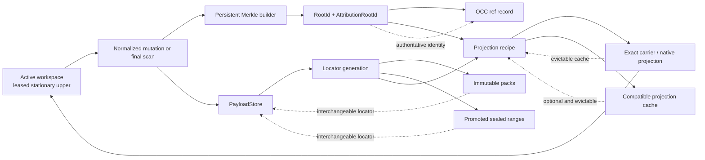
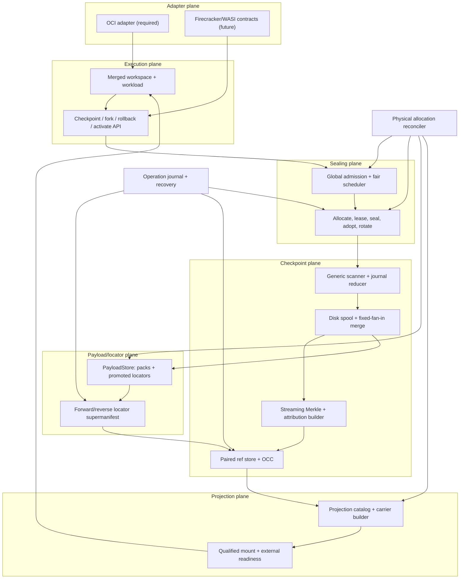
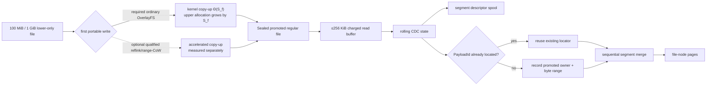
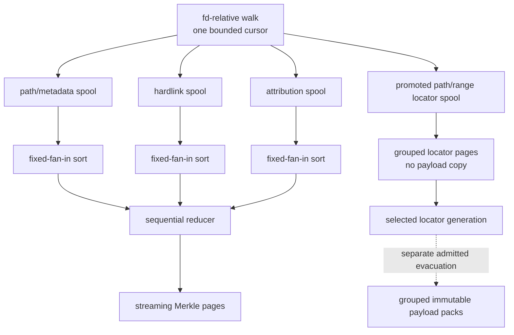
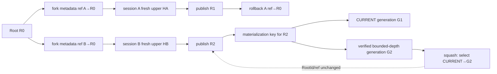
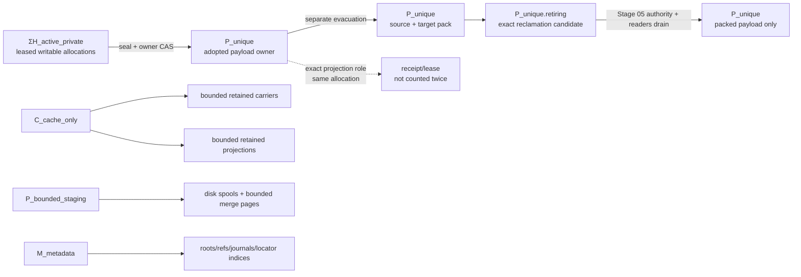
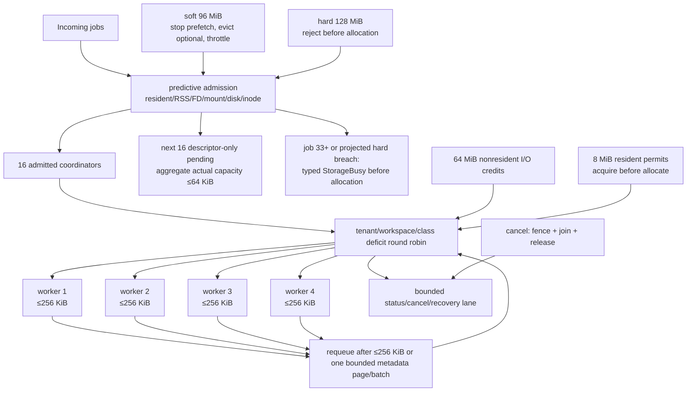
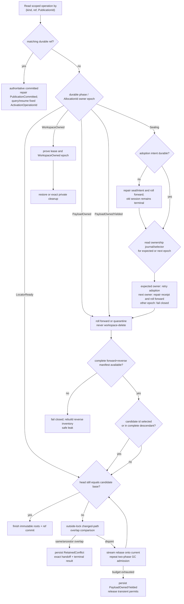
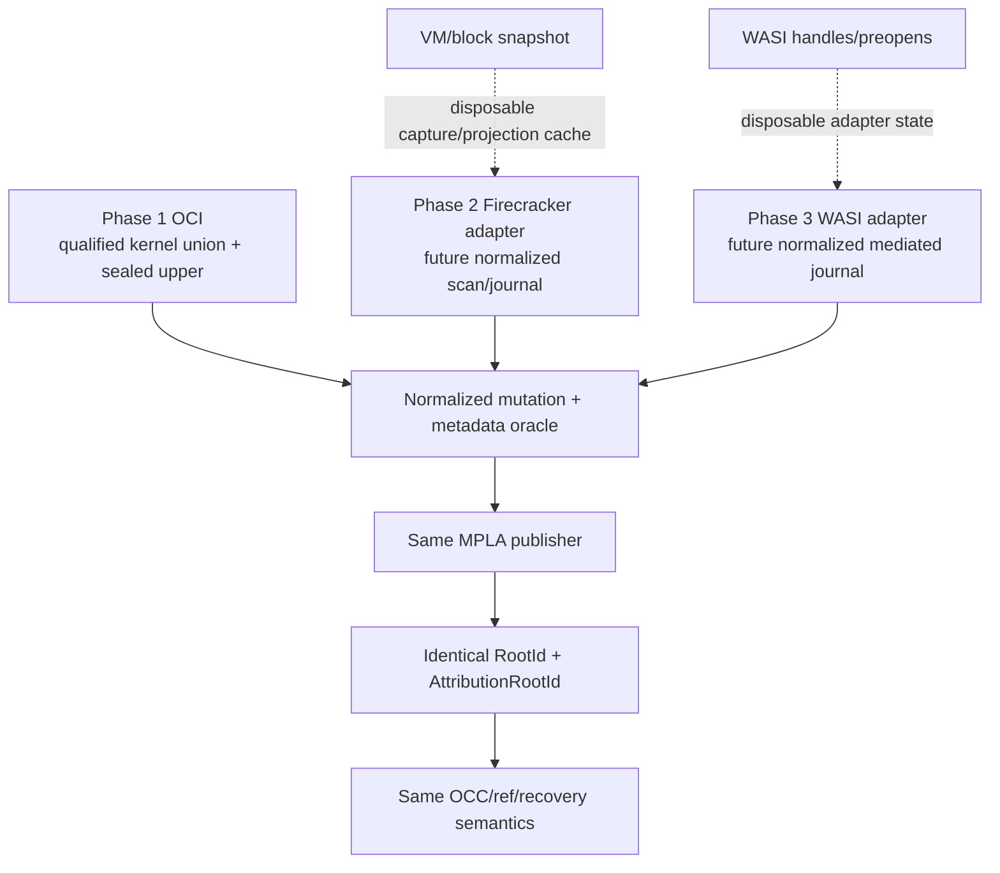

# Stage 04.6 Ultra Optimization
## Merkle–Promoted Locator Architecture (MPLA)

**Status:** selected architecture for implementation and measured qualification; `SD-04.6-001` and `SD-04.6-002` ratified, performance and fault evidence still pending<br>
**Scope:** Phase 1, Stage 04.6 only<br>
**Normative authority:** `requirements_and_prohibitions.md` overrides this document; this document overrides earlier Stage 04.6 proposals where they conflict<br>
**Required production path:** arbitrary OCI images on the qualified host-OS path<br>
**Primary outcome:** filesystem-exact, durable, backend-neutral checkpoints whose optimized publication adopts an existing stationary upper allocation instead of moving or copying it

---

## 1. Executive decision

Stage 04.6 will implement a **canonical Merkle tree plus promoted payload locators and disposable projections**:

1. `RootId` and `AttributionRootId` from LayerStack v3 are the only durable filesystem identity and attribution authority.
2. The normal optimized checkpoint is a **session-closing, quiescent ownership-adoption boundary**. PayloadStore creates a stable `AllocationId` before the session starts and grants WorkspaceManager a mutable lease. Publication stops mutation, seals and unmounts the session, revokes that lease, and durably changes the allocation owner from `WorkspaceOwned` to `PayloadOwned`. The upper bytes and path never move.
3. The promoted tree is first a durable payload locator. It may additionally be an exact native projection only after a strict, boot-time-qualified OverlayFS recipe proves that its parent closure, mount semantics, filesystem profile, and metadata behavior are reproducible. A raw upper is never treated as a generic lower.
4. Canonical objects, forward locators, reverse ownership receipts, and the attribution tree are made durable before the `{RootId, AttributionRootId}` ref. The final ref replacement is the publication linearization point and is last.
5. Continuation, when requested, starts **after commit** from the published root with a fresh upper. Open processes, file descriptors, mappings, and in-memory process state are not checkpointed. Activation failure after the ref commit means “checkpoint committed; activation failed,” never “checkpoint rolled back.”
6. Long-lived packed payload and bounded exact carriers coexist behind a multi-locator generation. Migration or evacuation is separate from publication and reports its own honest old-plus-new peak.

This decision is deliberately narrower than “transparent live checkpoint.” On a portable no-reflink host, keeping the old upper writable while constructing a second durable copy cannot satisfy the required `H + O(M)` optimized-publication peak. The API therefore exposes a closing filesystem checkpoint with optional post-commit restart, which matches the existing explicit publication rule that no active command may remain, rather than pretending to preserve a running process.

Ratified `SD-04.6-001` resolves the former contract conflict. The preserved
64- and 1,000-operation same-upper non-closing campaigns exercise the retired
behavior on pinned `I0`/`I2` only. They are compatibility controls and physical
evidence, never an `I3` candidate gate, a closing-publication speedup
denominator, or a release blocker. Candidate qualification uses the closing
seal-and-publish boundary; post-commit successor restart is measured
separately when requested. Every correctness, portability, resource, and space
constraint remains in force.

Ratified `SD-04.6-002` makes the OCI privilege boundary equally explicit.
The public runtime may invoke a dedicated `mpla-storage-admin-v1`
storage/projection process with `CAP_SYS_ADMIN` and the qualified mount
syscalls. Arbitrary workload commands keep the hardened unprivileged profile
and cannot select or inherit this authority. The capability is therefore
available where OverlayFS lifecycle requires it without becoming a general
workload privilege.

### 1.1 Release assertions

The architecture is qualified only if all of the following remain true:

- The required path needs no reflink, FUSE, KVM, ublk/NBD/device mapper, block dirty map, custom kernel, host snapshot API, payload tmpfs, or helper inside the image.
- The `mpla-storage-admin-v1` storage/projection process may retain
  `CAP_SYS_ADMIN` and permit the qualified `mount`/`umount2`/namespace syscalls.
  Profile selection is authenticated and lease-bound, and the capability is
  neither caller-selectable on general `exec_command` nor passed to the
  workload. Networking privilege is a separate, non-required profile.
- Publication peak is the active upper plus metadata and bounded scratch, not the upper plus a second payload copy.
- Generic mutation handling contains no package, application, filename, or language heuristic.
- Queued work owns descriptors only: zero queued payload, upper, mount, carrier, or staging bytes.
- Stage 04.6 does not delete a root or any published/superseded payload. It deletes only exact operation-owned private or staging artifacts.
- Every benchmark includes its timing boundary and irreducible work. A stored-carrier result is never relabeled as first ingestion, full hydration, or first lower-file write.

---

## 2. Source hierarchy and conflict resolutions

| Priority | Source | How this plan uses it |
|---:|---|---|
| 1 | `requirements_and_prohibitions.md` | All hard constraints, gates, memory limits, lifecycle order, portability boundaries, and prohibitions are represented here. |
| 2 | Frozen LayerStack v3 contracts and Stage 03 owner decision | Preserve backend-neutral root identity, paired attribution, immutable records, OCC refs, and named-worker publication semantics. |
| 3 | `plan.md` and `review.md` | Retain persistent Merkle indexing, CDC, source locators, exact carrier reuse, streaming publication, and benchmark discipline where compatible. |
| 4 | `portable_split_cow.md` | Retain quiesce, sealing, single-allocation ownership change, and upper rotation. Replace its path-transfer mechanism with stationary allocation adoption. |
| 5 | Prior design recommendation and baseline evidence | Use as candidate mechanisms and measurements, never as authority over a hard rule. |
| 6 | Current implementation | Treat as migration seams and test scaffolding, not proof that the new limits are already met. |

### 2.1 Explicit conflict table

| Conflict | Selected rule | Consequence |
|---|---|---|
| Non-rotating live upper versus `H + O(M)` peak | Stationary ownership adoption wins | Normal optimized checkpoint always closes/quiesces the session and adopts the sealed allocation in place. Only a requested continuation activates a successor with a fresh allocation after commit. |
| Pack-first publication versus no second `H` | Promotion-first wins | Packing is later evacuation, not hidden inside the publication number. |
| Raw upper as a generic lower versus OverlayFS-specific metadata | Canonical Merkle truth wins | Raw upper is a locator; exact projection is qualified and recipe-bound or unavailable. |
| Live continuation versus open-FD/mmap safety | Closing filesystem checkpoint wins | No process-state claim; durable `Sealing` makes the old session terminal, the full holder tree is then stopped, reaped, and unmounted, and any requested restart is a separate post-commit activation. |
| Old 16/64/384/512 MiB resource figures versus the new policy | New 8/96/128 MiB policy wins | Old figures are superseded; 64 MiB remains nonresident I/O credit only. |
| Fast path portability versus silent full checkout fallback | Backend capability rejection wins | A backend that cannot provide durable stable allocations, writer revocation, flush, and atomic owner-state transition fails before mutation; it does not clone `B` and call that optimized. |
| Carrier eviction versus Stage 05 GC authority | No-deletion boundary wins | Stage 04.6 records retirement debt and handoff receipts but retains published allocations. |
| Immediate Firecracker/WASI implementation versus Phase 1 OCI scope | OCI implementation plus frozen adapter fixtures wins | Future adapters must reproduce the same normalized publisher semantics; their caches never become truth. |
| Cross-mount path promotion versus host portability | Stationary allocation adoption wins | The upper starts under `layer-stack/objects/allocations/...` with a stable `AllocationId`; the workspace stores only a lease reference. Publication changes durable ownership, not the pathname. `AllocationId` is backend-local locator metadata and never enters `RootId`, `AttributionRootId`, or a ref. |
| Preserved non-closing campaign versus `SPACE-006/007` on the required host | **Resolved by ratified `SD-04.6-001`** | Retain the retired behavior on `I0/I2` as unpooled compatibility controls only. `I3` and every accepted production/public path use closing `seal_publish`; the controls are not equivalent candidate evidence and cannot block release. |
| OverlayFS lifecycle versus the hardened general command child | **Resolved by ratified `SD-04.6-002`** | Public lifecycle operations use the dedicated `mpla-storage-admin-v1` helper/profile with `CAP_SYS_ADMIN` and the required mount syscalls. General workload commands retain the current capability drop and mount-denying seccomp policy. |

### 2.2 Ratified specification decision SD-04.6-001 — closing portable canonical checkpoint

**Status: RATIFIED — 2026-07-27.** The normative policy and preserved
benchmark protocol now record this decision.

| Required decision field | Record |
|---|---|
| Rule changed | The README’s same-upper, no-remount, no-lower-addition non-closing behavior is retired as a candidate pass requirement. It remains a pinned `I0`/`I2` compatibility control only when that legacy evidence is reported. |
| Replacement product contract | `seal_publish` is explicitly closing: quiesce, unmount, adopt the stationary upper allocation, publish, destroy the old session lease, and optionally activate a successor as a separately timed operation. A non-publishing live observation/receipt is not a checkpoint and cannot return a durable `RootId`. |
| Physical reason | After publication the bytes must be both immutable and durable. If the same upper remains writable, future arbitrary writes can mutate the only allocation. Preventing that requires either write interception/range CoW/snapshotting (forbidden as a required dependency) or a second durable payload allocation (forbidden by `SPACE-006/007`). Renaming, hardlinking, bind mounting, or changing permissions does not create CoW isolation. |
| Benchmark evidence and status | The immutable historical `baseline-experiment/baseline.json` (`n=1`, or `n=5` for warm lookup) records the old implementation only and is not qualifying evidence for the closing contract. When the legacy controls are reported, run the 64/1,000 sequences on `I0` and `I2`, preserve their former threshold comparisons, measure their physical source/destination allocation union, and retain crash evidence; these rows do not qualify `I3`. No qualifying closing-`I3` performance, space, or fault evidence existed at ratification, so the evidence status is `PENDING` and the affected gates remain disabled. |
| Gates affected | Non-closing rows are unpooled compatibility controls, not candidate falsifiers or speedup denominators. All closing publication, branch/freeze, activation, space, crash, and 100× matched-comparison gates remain in force. |
| Post-commit continuation failure | The ref commit is the publication linearization point. Successor activation is a separate operation; failure returns `CommittedActivationFailed` without rolling back, repeating, or misreporting publication. |
| Decision | The closing contract is normative. Correctness and the promotion-first peak outrank continuation convenience under the priority order. |

Ratification removes the specification contradiction; it does not supply
implementation, performance, space, or fault evidence. `stage04_6_release`
remains disabled until every remaining gate in this plan passes.

### 2.3 Ratified specification decision SD-04.6-002 — scoped OCI storage authority

**Status: RATIFIED — 2026-07-28.** The required Linux OCI adapter is allowed
to use the maximum additional capability already permitted by `PORT-003`.

| Required decision field | Record |
|---|---|
| Authorized subject | A dedicated runtime-owned storage/projection lifecycle process, or the exact lease-bound MPLA qualification/campaign entrypoint running as that process. |
| Capability/syscalls | Retain `CAP_SYS_ADMIN`; permit only the qualified adapter's `mount(2)`, `umount2(2)`, and namespace syscalls such as `setns(2)` where required. `NoNewPrivs=1` may remain set. |
| Public boundary | `sandbox-manager-cli`, `sandbox-runtime-cli`, and `sandbox-observability-cli` remain the supported transport/control surface. The privileged helper is an implementation detail beneath a typed lifecycle operation, not direct Docker execution. |
| Workload boundary | Arbitrary `exec_command` remains mount-denied and does not inherit `CAP_SYS_ADMIN`. The helper stays separate or drops capability and enters the ordinary workload policy before user code runs. |
| Authorization | Exact executable/operation identity, run ID, execution lease, target namespace, allocation roots, and lifecycle verb are fixed by trusted control-plane input. Missing/mismatched/replayed authorization fails closed. |
| Evidence | Record capability/seccomp/no-new-privileges state, profile and executable identity, mountinfo before/after, mount and strict-unmount receipts, workload-negative probe, and exact cleanup. |
| Decision | A scoped storage-admin profile is required for the authoritative OCI campaign. A generic privileged shell or caller-controlled privileged command is forbidden. |

This decision corrects the integration assumption exposed by M2: the original
architecture allowed `CAP_SYS_ADMIN` and the initial PoC runner supplied it,
but the public-path campaign later placed the mount call inside a hardened
general command child. The architecture itself did not omit the capability;
the PoC handoff failed to bind it to the actual lifecycle process. M2 physical
results remain unknown until the corrected boundary is implemented and run.

---

## 3. Candidate evaluation and mechanism selection

Scoring is ordinal and hard-gated: `2` means a defensible contract-compatible
construction exists, `1` means partial or unproved, `0` means absent or
materially poor, and `0†` is a fatal normative conflict. A total aids
comparison but cannot compensate for a daggered row: a design that loses the
last payload locator or needs a second payload-sized publication allocation
is rejected regardless of unrelated strengths. None of these architecture
scores is benchmark evidence. `PASS` in the decision table means a defensible
construction exists, `UNPROVEN` means performance/resource/crash evidence is
missing, and `CONFLICT` is release-blocking. The fourth candidate is a pure
pack-first Merkle replacement with no durable promoted locator.

| Decision group | Existing non-rotating plan | Portable Split-CoW | **Selected MPLA hybrid** | Pack-first Merkle projection |
|---|---|---|---|---|
| Canonical `RootId` plus paired attribution | `PASS` | `PARTIAL`: carrier-centric proposal needs the Merkle authority added | **`PASS`** | `PASS` |
| Portable publication with no reflink/FUSE/KVM/helper | `CONFLICT`: continued writable upper needs aliasing or another allocation | `PASS`: seal and transfer on a qualified same-filesystem layout | **`PASS`: seal and adopt without a path move** | `CONFLICT`: pack-first duplicates `H` while the upper exists |
| `P_publish_peak(H)=H+O(M)` | `CONFLICT` on the non-rotating path | `PASS` | **`PASS` by stationary allocation adoption** | `CONFLICT` |
| Stored activation, clean fork and rollback | `UNPROVEN` fast activation; metadata model is sound | `PASS` for a retained carrier, incomplete after carrier eviction | **`UNPROVEN` latency; sound exact-carrier and metadata model** | `UNPROVEN`; cold projection build remains |
| Empty-worker reconstruction and long-term packed storage | `PASS` in the Merkle/pack portions | `CONFLICT` as a complete system: native layer accumulation is not a bounded archival format | **`PASS` in design; evacuation evidence required** | `PASS` |
| Many-small-file and 8 MiB application-memory path | `UNPROVEN`; current loose-object/per-task tendencies conflict | `CONFLICT` as written: directory ownership transfer alone does not bound indexing | **`UNPROVEN`; external-sort construction is bounded on paper** | `UNPROVEN`; streaming build is possible |
| Crash ownership, reverse locator accounting, cancellation | `PARTIAL` | `PARTIAL` | **`UNPROVEN`; state machines are explicit but not fault-tested** | `PARTIAL` |
| Arbitrary OCI image and future backend-neutral identity | `PASS` for OCI/Merkle portions | `PARTIAL`: strongly tied to a native directory carrier | **`PASS` at the interface level; cross-backend fixtures still required** | `PASS` |
| Legacy non-closing compatibility control | Retained on pinned `I0/I2`; not qualifying evidence | Retained on pinned `I0/I2`; not qualifying evidence | **Compatible: retain `I0/I2` controls without an `I3` row or release verdict** | Retained on pinned `I0/I2`; not qualifying evidence |
| Operational complexity | High | Medium | **High: ownership journal, multi-locator OCC, projections and evacuation** | Medium-high |
| Current evidence maturity | Partial current-product evidence | Design argument only | **Design argument plus historical baselines; PoC not yet measured** | Design argument only |
| Decision | Reject as qualifying publication path; retain Merkle/CDC/pack work | Retain seal and rotation; replace path transfer; reject as standalone architecture | **Select for implementation and measured qualification; not yet release-qualified** | Retain as cold/evacuation path; reject as optimized publication |

The required full scorecard follows. “Small publication” means the closing,
promotion-first operation. The legacy non-closing campaign is a protocol
compatibility control, not an architecture criterion, and is not scored.

| Criterion | Existing non-rotating plan | Portable Split-CoW alone | **MPLA hybrid** | Pack-first Merkle replacement |
|---|---:|---:|---:|---:|
| Complete semantic oracle / POSIX correctness | 2 | 1 | **2** | 2 |
| Required portable path and privilege profile | 2 | 2 | **2** | 2 |
| Honest first ingestion | 2 | 1 | **2** | 2 |
| Stored-root activation | 1 | 2 | **2** | 1 |
| Exact-key usable activation | 1 | 2 | **2** | 1 |
| Truly empty-worker activation | 2 | 1 | **2** | 2 |
| Ordinary small-delta publication | 1 | 2 | **2** | 1 |
| Tiny edit in a 100 MiB/1 GiB lower file | 1 | 1 | **2** | 1 |
| 100k/1M-file bounded construction | 1 | 0 | **2** | 2 |
| Metadata-only fork | 2 | 2 | **2** | 2 |
| Metadata-only hot rollback | 2 | 2 | **2** | 2 |
| Identity-preserving logical squash | 2 | 1 | **2** | 2 |
| Settled storage without `roots×B` | 2 | 0† | **2** | 2 |
| Optimized publication peak `H+O(M)` | 0† | 2 | **2** | 0† |
| Honest compaction/evacuation peak | 2 | 1 | **2** | 2 |
| One global 8 MiB resident policy | 0† | 0† | **2** | 1 |
| High-concurrency progress/OCC | 1 | 1 | **2** | 1 |
| Crash consistency and idempotency | 1 | 1 | **2** | 1 |
| Cancellation and exact resource unwind | 1 | 1 | **2** | 1 |
| Last-locator and Stage 05 GC safety | 2 | 1 | **2** | 2 |
| Operational simplicity/maintainability | 1 | 2 | **1** | 2 |
| Phase 2 rollout/MCTS fit | 2 | 2 | **2** | 2 |
| Phase 3 OCI/Firecracker/WASI identity | 2 | 1 | **2** | 2 |
| **Ordinal total (non-compensating, `/46`)** | **33** | **29** | **45** | **36** |

The existing plan loses on publication peak and its current unbounded
implementation seams; Split-CoW alone lacks a bounded archival/metadata model;
and pack-first loses on publication peak. MPLA earns the strongest score by
combining sole Merkle authority, stationary allocation adoption,
multi-locator payload truth, bounded external construction and optional exact
projections. It is also the most operationally complex candidate. Ratification
removes the former contract contradiction; selection authorizes implementation
and falsification, not release without the remaining evidence.

Selection therefore means “best architecture to falsify next,” not “already
proved in nearly every field.” MPLA uniquely combines the two mechanisms that
the hard rules require at the same time: backend-neutral Merkle truth and
single-allocation adoption-first publication. Its expected hot-path advantage
comes from removing work, but its actual latency, many-file behavior, kernel
memory, recovery correctness, and operator complexity remain experimental
questions. Section 16 turns every `UNPROVEN` or remaining `CONFLICT` entry into
an explicit measured, blocked, or falsifying case.

The performance review ranked non-rotating continuation higher when live
process continuation was treated as a goal. Ratified `SD-04.6-001` removes that
premise from candidate qualification: a committed checkpoint is a filesystem
restart point, not a process snapshot.

### 3.1 Retained, modified, and rejected mechanisms

| Mechanism | Source | Decision | Required modification or reason |
|---|---|---|---|
| LayerStack v3 Merkle `RootId` | plan/review/current core | Retain | Sole filesystem truth; never contains host paths or carrier identity. |
| Paired `AttributionRootId` | frozen Stage 03 | Retain | Validate and publish atomically with the content root. |
| Persistent path-copying tree | plan/review | Retain | Rebuild changed pages only through streaming sorted cursors. |
| Content-defined chunking | plan/review | Retain | Shared fixed four-worker pipeline; bounded buffers; first ingest remains `Θ(B+F)`. |
| Immutable payload packs | plan/review | Retain | Long-lived representation; creation is evacuation or first ingest, not free publication. |
| Same-key single-flight | plan/review | Retain | One descriptor result, bounded waiter list, typed overflow, no per-waiter payload. |
| Changed-path journal | plan/review | Modify | Advisory only; overflow/gap/ambiguous rename triggers full upper or affected-subtree scan. |
| External sort and disk spools | review | Retain | Disk-backed, fixed fan-in, permit-charged buffers, bounded run registry and FDs. |
| Non-rotating ordinary checkpoint | plan/review | Reject | Cannot guarantee `H + O(M)` without a required cloning primitive. |
| Quiesce, detach, promote, rotate | Portable Split-CoW | Modify | Retain quiescence, sealing, logical promotion, and rotation; replace cross-directory rename with a durable owner-state transition on a stationary allocation. |
| Stable allocation lease and adoption | MPLA synthesis | Add | PayloadStore allocates the upper/work pair before execution, grants a revocable workspace lease, and atomically adopts the sealed upper without moving it. |
| Every promoted upper as native lower | Portable Split-CoW | Reject | OverlayFS metadata and dependency semantics are not generically composable. |
| Qualified promoted projection | synthesis | Retain | Optional role with exact recipe, dependency closure, leases, depth and byte budgets. |
| Adopted upper as PayloadStore locator | synthesis | Retain | Avoids both payload copy and path movement at publication; independent from projection eligibility. |
| Single forward locator `CURRENT` | current source locator | Replace | Atomic forward+reverse supermanifest generation with ownership receipts and reader holds. |
| Loose file per chunk | current object store | Reject for bulk path | Creates per-object fsync/link amplification; retain only as bounded recovery/debug path. |
| Logical squash as representation selection | plan/review/frozen v3 | Modify | Select an already-verified materialization generation for the same root; do not create a logical descriptor or mutate the paired ref. Missing physical construction is separately timed. |
| Full native checkout fallback | Portable proposal | Reject | Violates active-sibling and space requirements; an unsupported backend is rejected. |
| Reflink/range clone | plan/review | Optional accelerator | Must pass a boot probe and preserve identical semantics; never needed for correctness. |
| FUSE/ublk/KVM/block snapshots | alternative designs | Reject on required path | Explicitly prohibited dependencies; future backend caches only where independently allowed. |
| Heuristic package-aware mutation | none | Reject | Generic filesystem semantics only. |

---

## 4. Contract and terminology

### 4.1 Objects and authorities

| Term | Definition | Authority |
|---|---|---|
| `RootId` | Digest of the canonical v3 root record and persistent Merkle tree | Filesystem contents and metadata |
| `AttributionRootId` | Digest of attribution records bound to the content root | Provenance/attribution |
| `PublicationId` | Caller-provided branch/ref-scoped idempotency token stored in the ref and exact terminal | Request deduplication and ref-effect matching |
| `PublicationOperationId` | Internal scoped operation identity `derive(SealPublish, ref, PublicationId)` | Publication journal, recovery, and resource ownership; always distinct from activation identity |
| `ActivationOperationId` | Separate idempotency identity for one post-publication successor activation | Continuation recovery and exact result; never publication identity |
| `PayloadId` | Content digest for a byte extent/chunk | Byte identity, not pathname identity |
| `AllocationId` | Stable backend-local handle for one physical writable/sealed allocation | Location and ownership only; never canonical identity |
| Workspace lease | Epoch-fenced capability allowing one session to mutate an allocation | Workspace mutation authority until sealing |
| Locator generation | Immutable, checksummed forward and reverse payload-location index | Where a `PayloadId` can currently be read |
| Owner receipt | Durable token binding `AllocationId`, allocation generation, owner epoch, seal digest, and reverse payload inventory | Storage ownership and ABA defense |
| Promoted locator | Stationary former upper allocation now owned by PayloadStore and addressable by relative paths/ranges | A durable payload source |
| Exact projection receipt | Recipe proving a native carrier exactly realizes a root under a qualified environment | Disposable activation optimization |
| Active upper `H` | PayloadStore-allocated physical allocation leased exclusively to one running session | Workspace mutation authority; physical allocation remains in the storage arena |
| Pack | Immutable long-lived payload container | PayloadStore |
| Spool | Operation-owned disk staging with a bounded resident cursor | Never canonical truth |

### 4.2 Representation comparison

| Representation | What it identifies | Durable/authoritative | Mutability and ownership | Retention rule |
|---|---|---|---|---|
| Canonical checkpoint | Normalized filesystem tree plus paired attribution | Durable and solely authoritative through `RootId`/`AttributionRootId` | Immutable, LayerStack metadata-owned | Retained by the declared root lifecycle; Stage 04.6 does not delete it. |
| Payload locator | A readable source for one or more content-addressed payload ranges | Durable prerequisite for a visible root, but replaceable | Immutable while selected/held; PayloadStore-owned | Last locator pinned; replacement needs a complete newer generation and drained readers. |
| Exact carrier | A complete native realization for one exact projection key | Durable receipt, never canonical | Immutable, projection/cache-owned or shared-role payload owner | Bounded by bytes, inodes, generations, depth, dependencies and leases. |
| OCI projection | Mount recipe that realizes a root for a qualified OCI profile | Receipt may be durable; mounted instance is disposable | Read-only lower plus workspace-owned fresh upper | Recipe/cache bounded; mount destroyed when session closes. |
| Active writable upper | Private changes for one session | Durable workspace state, not a checkpoint | Writable only through its epoch-fenced lease until sealing | Counts as `H_active_private`; adopted in place by successful promotion. |
| Disposable acceleration cache | Reconstructible pages/carriers/prefetch state | Never authoritative | Cache-owned and evictable | Strict quota; eviction must preserve payload truth and active holds. |

### 4.3 Upper rotation versus continued active upper

| Property | **Selected: seal, adopt, rotate** | Rejected: publish while upper continues |
|---|---|---|
| Published-byte immutability | Exclusive after quiesce, unmount, writer revocation, and owner-state transition | Requires copying or snapshotting while writable aliases may remain |
| Portable publication peak | `H + O(M)` | `H + ΔB_copy + O(M)`, worst case approximately `2H` |
| Open processes/FDs/maps | Explicitly stopped/drained; process state not preserved | Live continuation is attractive but cannot prove a stable byte oracle without another snapshot |
| Post-checkpoint continuation | New session, exact projection if available, fresh empty upper | Same process/upper |
| First later lower-file write | May again cost `Θ(S_f)` | Existing copied-up file remains upper-local but published state needs a separate copy |
| Required-path result | **Qualifies** | Does not qualify without a separately proven accelerator |

There is no code path in which a published locator remains the only durable source while the same writable upper continues to mutate. A diagnostic live-copy implementation, if retained outside release qualification, has a distinct operation name and metrics and cannot satisfy `seal_publish`.

### 4.4 Promotion/adoption versus copy publication

| Property | **Stationary promotion/adoption** | Pack/CAS copy during publication |
|---|---|---|
| Payload allocation at publication | Reclassifies the already-existing upper allocation | Allocates target payload while source upper remains |
| Durability operation | Flush, revoke workspace lease, journaled compare-and-transition to `PayloadOwned`, owner receipt | Stream/write/fsync target plus retain source |
| Peak | `H + O(M)` | `H + up to H + O(M)` |
| Canonical result | Merkle root built from sealed bytes | Same canonical result possible |
| Long-term packing | Separate admitted evacuation | Already packed, but at a disallowed publication peak |
| Failure after ownership point | Roll forward from the durable allocation/owner receipt or quarantine | Source/target ambiguity still needs receipts |
| Required-path decision | **Normal optimized publication** | **Rejected for the optimized publication gate** |

### 4.5 Exact-carrier retention versus packed-payload retention

| Property | Exact native carrier/projection | Immutable packed payload |
|---|---|---|
| Primary benefit | Constant-in-`B,F` usable activation | Dense long-lived payload, dedup and sequential reads |
| Semantic scope | One exact qualified projection key/dependency closure | Backend-neutral `PayloadId` ranges |
| Space behavior | Can approach a complete native tree; strictly cache/quota bounded unless also a payload owner | Counts in `P_unique`; no complete pack per root |
| Required for root validity | No | At least one durable locator is required, which may temporarily be promoted rather than packed |
| Replacement | Evict after projection leases drain and payload remains available | Install alternate locator generation, drain readers, later Stage 05 retirement |
| Cardinality policy | No carrier per historical root | Shared by content identity across roots |
| Miss behavior | Compatible carrier/build/reconstruction with honest timing | Payload remains readable |

### 4.6 Canonical versus disposable



**Diagram 1 — authority split.** Authority ends at the durable paired ref. PayloadStore controls the physical allocation arena; WorkspaceManager temporarily owns the only write lease; PayloadStore owns packs and adopted locators after sealing; ProjectionStore owns optional carrier/cache receipts. Locator durability precedes ref visibility. Exact/compatible projections are optional and independently leased: a miss or projection failure changes activation work, not the committed root, and eviction is legal only while durable payload truth remains.

### 4.7 API semantics

```text
seal_publish(session, expected_base, ref, options)
  precondition: session admits no new command, execution, or mutation
  consumes:     the session's current writable upper
  commits:      filesystem state only
  excludes:     process memory, open-FD position, sockets, timers, locks
  success:      durable paired ref with PublicationId
  continuation: optional activate(root) into a new session and fresh upper
```

The publication operation returns one of:

- `IdempotencyMismatch` or typed `StorageBusy` before publication mutation
- `PublicationCommitted { root, attribution_root, publication_id, publication_operation_id, activation_operation_id? }`
- `RejectedBeforeAdoption { reason, retry_hint }` only before durable `Sealing`; despite the type's compatibility name, it is never returned from `Sealing` or a later phase
- `PublicationConflictRetained { publication_id, publication_operation_id, handoff_id, expected_base, observed_head, conflict_keys_digest }` after a proven same-path/ancestor conflict; the payload remains PayloadStore-owned
- `RecoveryRequired { publication_id, publication_operation_id, phase, retry_hint }` when contact was lost or any bounded nonterminal failure/yield occurred at durable `Sealing` or later, including while the allocation remains `WorkspaceOwned` before adoption; querying/retrying the same scoped id rolls forward or returns its exact result
- `OutcomeExpired { scoped_operation_id }` after the advertised acknowledgement/retention fence; that id is never executed again

If continuation was requested, a separate durable activation operation identified
by `ActivationOperationId` produces `ActivationReady` or `ActivationFailed`.
For a coupled request,
`ActivationOperationId = derive(ActivateAfterPublish, PublicationOperationId,
continuation_request_digest)` is fixed in the publication record before ref
commit. Before durable `Sealing`, its durable intent seed fixes that identity,
the bounded canonical continuation options and digest, and all deterministic
successor resource keys. After any final publication rebase and before the ref
replacement, a durable selected `ActivationTargetBinding` fixes the exact
`RootId` and `AttributionRootId` that activation may expose. Neither record may
be reconstructed or rebound after publication commits.
The combined API response may be
`Committed { publication: PublicationCommitted, activation: ActivationReady }`
or `CommittedActivationFailed { publication: PublicationCommitted,
activation_operation_id, reason }`. Those are projections of two exact
operation results; an activation result never replaces or mutates the
publication terminal.

The API never reports an uncommitted error after observing the matching durable
ref. Within the advertised window, a caller retry with the same scoped
`(kind, branch/ref, PublicationId)` and request digest returns the exact
publication result; reuse with different request bytes returns
`IdempotencyMismatch`. The same caller `PublicationId` on another ref is an
independent scoped operation, not an alias. A publication retry that finds
`PublicationCommitted` skips every publication phase and only queries or
resumes the separately identified activation operation when continuation was
requested.

---

## 5. System architecture



**Diagram 2 — component overview.** The OCI adapter and execution workspace are required now; future adapter contracts and projection caches are optional/future. PayloadStore creates each stable allocation and delegates its mutable lease to WorkspaceManager. The sealing plane revokes that lease and adopts the allocation; canonical authority still passes through the checkpoint plane to the paired ref. Operation, owner-journal, locator, object and ref fsyncs are durability boundaries. Only a failure before durable `Sealing` may restore or abort exact workspace-owned state. At `Sealing` or later, recovery rolls forward under the same publication operation even while the allocation remains `WorkspaceOwned` before adoption. Large builders remain outside the short owner/locator/ref writer-lock sections.

### 5.1 Required component interfaces

| Component | Input | Durable output | Failure rule |
|---|---|---|---|
| Backend qualifier | Exact backend, host/VM, namespace, filesystem, kernel, mount and OCI profile | Signed/hashed boot qualification | Reject before mutation if stable allocation, sealing, writer revocation, durability, or semantic probes fail. |
| Admission controller | Job descriptor and projected resources | Durable admission record where needed | Job 33 is rejected before payload/staging allocation. |
| Ownership controller | `AllocationId`, workspace lease/epoch, expected owner, seal receipt | Durable adoption receipt | Performs one compare-and-transition; never infers ownership from a pathname. |
| Scanner/reducer | Upper dirfd, optional complete journal | Sorted normalized mutation spool | Gap, overflow, or ambiguity broadens scan; never omits. |
| PayloadStore | Byte stream or stable allocation lease | Payload IDs, adopted allocation, and locators | Creates the physical allocation before execution; no root can refer to payload without a durable locator. |
| Merkle builder | Sorted mutations and parent root | Immutable v3 pages and paired roots | Omit no metadata; unsupported metadata is rejected. |
| Locator catalog | Forward mappings, reverse inventory, receipts | One immutable selected supermanifest generation | Expected-generation OCC; reader holds exact generation. |
| Ref store | Expected base, paired roots and branch-scoped `PublicationId` | Frozen atomic head/checkpoint schema | Ref update is last; physical locator identity is never embedded in a root or ref. |
| Projection catalog | Root, locator generation, exact recipe | Optional exact carrier receipt | A cache miss or build failure cannot alter root truth. |
| Recovery | Operation journal and disk observations | Roll-forward or exact private cleanup | Forward-only mapping fails closed; reverse-only residue leaks safely. |

### 5.2 Stable allocation arena and ownership

```text
active qualified OCI session

  canonical {RootId,AttributionRootId}
             │ selects no physical path
             ▼
  ProjectionCatalog ──verified recipe/holds──► immutable lowerdir projection(s)
                                                        │
  AllocationId A ─► objects/allocations/.../A/upper (leased RW) ─┤
                 └► objects/allocations/.../A/work  (disposable) ├─► merged workspace
  /eos/workspace/<session>/LEASE -> {A, lease_epoch}              │   in private mount ns

  seal fence ─► stop holder tree ─► drain writable FD/mmap references
             ─► unmount merged namespace ─► flush and stability-check upper
             ─► remove/retire disposable workdir
             ─► revoke lease and CAS WorkspaceOwned→PayloadOwned

post-adoption

  the same objects/allocations/.../A/upper path and bytes
      PayloadStore-owned immutable locator
      └─ optional exact lower only through a separately verified projection receipt

  optional continuation
      verified immutable projection + new AllocationId B upper/work lease
          └─► new merged workspace; no process state survives
```

**Diagram 3A — runtime layering and rotation.** The paired root is the sole
logical authority and names neither `AllocationId` nor a physical path.
PayloadStore allocates the upper and OverlayFS workdir together in its backend
arena before the session starts. WorkspaceManager receives only an
epoch-fenced mutable lease and stores lightweight session metadata under
`/eos/workspace`; no host-workspace payload copy or payload mount is required.
OverlayFS still needs a mounted merged workspace for OCI execution, and its
upper/work pair must satisfy the kernel's same-backing-store rules, but the
publication protocol does not move either path. After the holder-tree drain,
unmount, flush, stability pass, and writer revocation, one durable owner-state
transition adopts the stationary upper. Durable `Sealing`, not adoption, is
the no-return boundary: recovery rolls forward under the same operation while
the allocation may still be workspace-owned, and then continues from the
owner receipt after adoption. Continuation receives a fresh allocation and
lease only when requested.

```text
/eos/workspace/                                # lightweight WorkspaceManager state
├── manager.json
└── <session>/
    ├── LEASE                                  # {AllocationId, lease_epoch}
    └── executions/<execution-id>/transcript.log

/eos/layer-stack/                              # PayloadStore backing volume
├── .storage-writer.lock
├── objects/
│   ├── allocations/
│   │   ├── _ownership/{JOURNAL,CURRENT}       # durable owner epochs/receipts
│   │   └── <prefix>/<AllocationId>/
│   │       ├── upper/                         # path remains stationary
│   │       ├── work/                          # active-only, disposable
│   │       └── OWNER                          # cached witness; journal is authority
│   ├── loose/<kind>/<prefix>/<typed-id>
│   ├── packs/<pack-id>.pack
│   └── locators/{<run-id>.sst,CURRENT}
├── refs/{heads,checkpoints,pins,leases}/...
├── operations/<operation-id>/{STATE,work/...}
├── materializations/<materialization-id>/
│   ├── CURRENT                                # only for exact native selection
│   └── generations/<generation>/MANIFEST      # may reference AllocationId A
├── gc/CURRENT
└── CONTROL

session creation:
  A = PayloadStore.allocate_mutable()
  lease = PayloadStore.grant_workspace_lease(A, session, lease_epoch)
  mount overlay(lower projection, upper=A/upper, work=A/work)

publication:
  unmount; flush(A/upper); verify seal; remove_or_retire(A/work)
  PayloadStore.compare_and_adopt(
      A,
      expected=WorkspaceOwned(session, lease_epoch),
      new=PayloadOwned(owner_epoch+1, seal_digest, inventory_digest))
  fsync ownership journal/selector
  persist adoption receipt; remove the workspace lease/deletion token
```

**Diagram 3B — stationary allocation adoption.** `objects/allocations` is an
internal payload representation under the existing LayerStack object family,
not a new canonical identity or public root field. The `OWNER` file is only a
local witness; the checksummed ownership journal plus selector is authoritative.
An `AllocationId` may differ across OCI, Firecracker, and WASI while the same
filesystem bytes produce exactly the same `RootId` and `AttributionRootId`.

The fundamental portability property is that no filesystem is asked to perform
an impossible zero-copy cross-mount move. The bytes begin and end in the same
backend allocation. Publication changes logical mutation/deletion authority
only. OCI implements an allocation as a directory on the layer-stack Docker
volume; a future Firecracker adapter may use a block/tree extent; a WASI adapter
may use a host-managed writable tree. All implement the same allocation/lease/
seal/adopt contract.

The cost is an ownership journal, lease fencing, allocation-catalog lookup, and
long-term allocation packing/evacuation. Publication adds bounded metadata
fsyncs but no payload copy and no payload-sized memory. Stationary directories
can accumulate inode and fragmentation debt, so quotas, reconciliation, and
later evacuation remain mandatory. A raw adopted upper is first a payload
locator; it becomes an OverlayFS lower only if the exact projection qualifier
proves that use safe.

### 5.3 Current code migration seams

| Current seam | Useful behavior | Required change |
|---|---|---|
| `layerstack-core/src/v3.rs` | Fixed v3 record kinds and digestable records | Preserve format; add only versioned records through normal compatibility rules. |
| `candidate/tree.rs` | Installs content and attribution roots | Replace repository-sized `Vec` accumulation with disk cursors and streaming page builders. |
| `candidate/operation.rs` | Durable operations and post-ref recovery | Add the five ownership phases, `AllocationId`/epoch bindings, and exact adoption receipts. |
| `candidate/refs.rs` | Paired validation and OCC ref replacement | Preserve the frozen paired schemas and branch `PublicationId`; recheck locator coverage before final ref-last ordering without storing physical locator identity. |
| `candidate/object_store.rs` | Durable temp/fsync/install ordering | Replace per-chunk loose-file bulk path with grouped metadata/locator pages. Build payload packs only for cold ingest or separately accounted evacuation, never promotion publication. |
| `candidate/source.rs` | Initial source locator generation | Replace single forward `CURRENT` with forward+reverse supermanifest OCC. |
| `workspace/overlay/capture.rs` | Directional streaming capture | Remove unbounded sets/vectors and make journal incompleteness fail to broader scan. |
| `workspace/.../publish_session.rs` | Rejects active commands and closes after publish | Extend to full process-tree quiesce, writable-reference drain, unmount, and stationary ownership adoption. |
| `workspace/.../destroy.rs` | Idempotent teardown | Make adopted allocation leases durable exclusions; refuse stale epoch/ABA/token mismatch. |
| `storage/supervisor.rs` | Four Rayon data workers exist | Replace whole-job closures, 64-owner flight map, and stale byte accounting with global quanta and exact permits. |
| `overlay/kernel_mount.rs` | Kernel union mount without in-image helper | Record/probe effective options and dependency semantics; do not infer raw-upper reusability. |
| Docker provider capability profile | Can add `SYS_ADMIN` | Split storage from networking; required storage profile must not require `NET_ADMIN`. |

---

## 6. Boot qualification and portability

Qualification runs once per exact worker image/kernel/filesystem/namespace configuration and is cached by a digest of those facts. It is repeated after any relevant change.

### 6.1 Required probes

| Probe                              | Must prove                                                                        | Failure behavior                                                                           |
| ---------------------------------- | --------------------------------------------------------------------------------- | ------------------------------------------------------------------------------------------ |
| Stable allocation adoption | Allocate, lease, mutate, seal, flush, revoke, durably compare-and-transition owner, reject stale tokens, and replay every crash boundary without moving bytes | Reject the backend before a session upper is created. |
| Union semantics                    | Whiteout, opaque directory, xattr, hardlink, rename, sparse and symlink behavior  | Reject unsupported semantic profile; never drop metadata.                                  |
| Effective OverlayFS options        | `userxattr`, redirect, metacopy, index/origin, idmap and relevant kernel behavior | Exact projection disabled or backend profile rejected if required mutation semantics are unsafe. |
| Ownership/ID mapping               | Required uid/gid representation without granting workload extra capability        | Reject images/workloads outside the declared semantic profile.                             |
| Special metadata                   | Device nodes, file capabilities, security/LSM and immutable flags as declared     | Preserve exactly or reject before mutation.                                                |
| Disk backing                       | Payload and spools are not tmpfs and expose allocation/inode stats                | Reject qualification. Tiny control-only namespace masks are outside payload storage.       |
| External readiness                 | Mount/open/read/metadata probe from adapter, no image command                     | Reject without invoking `/bin/sh`, `stat`, `ls`, libc, or package tools in the image.      |
| Cgroup/accounting                  | Whole storage-domain process tree is visible and controllable                     | Reject if idle memory already exceeds the qualified limit.                                 |

The product contract is host-OS agnostic: canonical identity, allocation
leases, sealing, stationary ownership adoption, recovery, and publication do
not depend on a host pathname, inode identity, rename behavior, or one union
implementation. Projection and execution remain backend-specific. Phase 1's
required OCI adapter uses a stock qualified Linux kernel union, either on a
normal Linux host or inside the Linux worker VM supplied by Docker Desktop on
macOS or Windows. Native macOS and native Windows-container projection
adapters are not implemented or claimed by Stage 04.6. The adoption protocol
has no `EXDEV` branch because it performs no cross-mount rename. The OCI
storage service uses raw host/VM syscalls and supports scratch, distroless,
non-root, and read-only images without executing a helper inside them.
Under `SD-04.6-002`, `CAP_SYS_ADMIN` belongs only to the isolated
`mpla-storage-admin-v1` storage/projection lifecycle process. Its seccomp
profile permits the qualified adapter's mount, unmount, and required namespace
syscalls; it is selected only by an authenticated, lease-bound lifecycle
operation. The workload process uses the ordinary hardened profile and cannot
inherit or request that capability. Optional networking setup may have a
distinct privilege profile but is not part of storage qualification.

### 6.2 Required and optional mechanisms

| Class | Mechanisms |
|---|---|
| Required | Kernel union available in qualified OCI worker; stable backend allocation handle; revocable exclusive writer lease; seal/flush; durable conditional owner transition; ordinary filesystem reads/writes/fsync; disk spools; v3 Merkle records; content hashing; external sort. |
| Optional, separately probed | Reflink/range clone, `openat2`, `statx`, `FIEMAP`, `SEEK_DATA/SEEK_HOLE`, io_uring, idmapped mounts, promoted exact projection. |
| Forbidden dependency | FUSE, KVM, ublk/NBD/device mapper, host block snapshot/dirty map, custom kernel, payload tmpfs, in-image package/runtime/helper. |

An optional probe may improve a constant factor only. It may not change root bytes, attribution, OCC result, recovery decision, or error semantics.

| Mechanism | Required portable OCI path | Optional accelerator/deployment | Acceptance treatment |
|---|---|---|---|
| Stationary filesystem allocation adapter | Required | — | All correctness/space/performance gates run with path-stable allocation adoption and stale-lease rejection. |
| Kernel OverlayFS/qualified stock union | Required for isolated OCI siblings | Platform-equivalent qualified stock union behind adapter | No custom kernel; backend profile rejects if semantic probes fail. |
| Reflink/range clone | Not required | May reduce copy/build constants after probe | Report separate sample key; cannot rescue a portable-path miss. |
| FUSE | Not required or used by selected Stage 04.6 path | A future separately approved projection adapter may experiment with it | Excluded from required acceptance and canonical identity. |
| Block CoW/dirty maps | Not required | Future Firecracker adapter hint/cache only | Excluded from OCI acceptance; complete oracle still required. |
| KVM/VM snapshot | Not required | Future Firecracker execution/projection cache | Never payload/root authority. |
| ublk/NBD/device mapper | Not required or selected | No Stage 04.6 proposal | Cannot appear in a qualifying dependency graph. |
| `openat2`/`statx`/`FIEMAP`/sparse probes/io_uring | Correctness cannot require availability beyond declared semantic support | May improve safety/accounting/I/O constants | Probe and report fallback; root bytes must match. |
| Idmapped mounts | Not universal | May widen a qualified uid/gid profile | Absence yields semantic-profile rejection, not silent chown loss. |

---

## 7. Publication and ownership protocol

### 7.1 Two coupled state machines

```mermaid
stateDiagram-v2
    state CarrierLifecycle {
        [*] --> Building
        Building --> Ready: immutable carrier + receipt fsynced
        Ready --> Published: carrier catalog selected + parent fsync
        Published --> Terminal: durable result recorded
        Building --> Terminal: exact private abort
        Ready --> Terminal: admission declined; exact private cleanup
    }

    state Ownership {
        [*] --> WorkspaceOwned
        WorkspaceOwned --> Sealing: pre-close drain complete; Sealing persisted
        Sealing --> PayloadOwned: writer revoked + owner CAS fsynced
        PayloadOwned --> LocatorReady: locator generation selected
        LocatorReady --> PublicationCommitted: paired ref committed
        LocatorReady --> RetainedConflict: proven path-overlap conflict; handoff durable
        LocatorReady --> PayloadOwnedYielded: bounded disjoint rebase exhausted
    }
```



**Diagram 4 — carrier and ownership phases.** The required `Building→Ready→Published→Terminal` lifecycle belongs to every carrier/projection operation and is persisted under a stable `CarrierOperationId`; `Published` means its exact receipt is durably selected, not that it became checkpoint truth. `WorkspaceOwned→Sealing→PayloadOwned→LocatorReady→PublicationCommitted` separately describes successful stationary adoption. `RetainedConflict` is a durable terminal operation outcome, not deletion: LayerStack keeps the adopted allocation under an exact handoff after a changed-path comparison proves same-path or ancestor/descendant overlap. A disjoint head advance instead rebases outside the lock; exhaustion of its fixed retry/time budget yields durable resumable ownership and no transient permit. Canonical authority changes only at the final paired ref. Once `PayloadOwned`, the old workspace lease and deletion token are permanently invalid. Recovery recognizes the owner receipt by `AllocationId`, owner epoch, operation id, and digest; optional projection selection may fail without changing canonical truth.

### 7.2 Normal optimized checkpoint sequence

```mermaid
sequenceDiagram
    participant C as Caller
    participant A as Admission/Scheduler
    participant W as Workspace owner
    participant J as Mutation evidence
    participant P as PayloadStore
    participant L as Locator catalog
    participant M as Merkle builder
    participant R as Ref store
    participant Q as Projection catalog
    participant X as Execution/Activator

    C->>A: seal_publish(session, expected_base, PublicationId, continuation?)
    A->>A: persist fixed optional activation id/options/resource-key intent seed
    A->>W: fence command/execution/mutation admission on the AllocationId lease
    W->>W: bounded tracked-command pre-close drain
    break drain cannot complete before Sealing
        W->>W: unfence exact session epoch
        W-->>C: RejectedBeforeAdoption { reason=WorkspaceBusy }; session untouched
    end
    W->>W: persist durable Sealing; old session becomes terminal
    W->>W: quiesce/kill/reap full tree; drain FDs/maps; unmount
    W->>W: sync data/dirs/xattrs; verify stable seal
    W->>J: durable seal + journal completeness receipt
    par outside writer lock
        W->>P: CDC/hash sealed ranges + future relative inventory
        J->>M: trusted affected paths or required complete scan
        M->>M: external sort + Merkle/attribution pages; build relative inventory
    end
    W->>P: revoke writer lease; adopt stationary AllocationId by owner CAS
    P-->>W: fsynced PayloadOwned receipt; old lease fenced
    P->>L: fsynced supermanifest candidate
    L->>L: writer lock + expected-generation OCC + select + parent fsync
    L-->>P: LocatorReady
    M->>R: install/fsync immutable objects and paired roots
    A->>A: bind/fsync optional activation intent to final candidate root pair
    R->>R: writer lock; recheck base, locator, owner, GC barrier
    R->>R: atomic paired-ref replace + parent fsync
    R-->>C: PublicationCommitted
    R-->>Q: root eligible for optional projection readiness
    Q->>Q: reuse/build exact receipt, or record miss/failure
    opt caller requested continuation
        C->>X: activate committed RootId with ActivationOperationId
        Q-->>X: exact/compatible/carrier/miss result
        X-->>C: ActivationReady or ActivationFailed; publication unchanged
    end
```

**Diagram 5 — durability order.** The required path freezes execution and records whether mutation evidence is complete. The publisher scans and builds private immutable candidates while the stationary upper is sealed, unmounted, fenced, and still `WorkspaceOwned`; a second stability pass precedes adoption. PayloadStore then revokes the writer lease and durably changes the allocation owner without changing its path. Payload ownership and complete locator selection precede canonical root visibility; the paired-ref fsync is the durability/acknowledgement boundary. Projection selection and execution resume are optional post-commit work. Failure at durable `Sealing` or later rolls forward under the same operation, durably yields, or reaches a proven-overlap retained handoff, even if adoption has not yet occurred; projection/activation failure leaves an authoritative committed ref intact. The writer lock is not held during scan, hashing, sort, rebase, optional evacuation-pack construction, or immutable-candidate fsync.

### 7.3 Exact seal requirements

Sealing is successful only after all of these hold:

1. New command, execution, and mutation admission is atomically fenced by
   session epoch.
2. Tracked active commands drain within the bounded pre-close interval, or the
   operation unfences and returns
   `RejectedBeforeAdoption { reason=WorkspaceBusy }` before `Sealing` with the
   session untouched.
3. After `Sealing` is durable, the complete holder/process tree, including
   background and escaped descendants in the managed namespace/cgroup, is
   stopped, killed if necessary, and reaped. The old session is terminal; a
   failed proof returns durable `RecoveryRequired` and rolls forward.
4. No writable file descriptor, writable mapping, bind mount, overlay mount, or hidden managed mount namespace still references upper/work.
5. Data, directories, xattrs, whiteout/opaque state, and required metadata are synced.
6. A second fd-relative metadata pass proves stable inode/size/mtime/version facts across the seal interval; mismatch repeats within a bound and then returns durable `RecoveryRequired`, never a resumable old session.
7. The private candidate build derives `RootId`, `AttributionRootId`, locator inventory, and optional materialization recipe. The operation record binds `AllocationId`, allocation generation, expected `WorkspaceOwned(session, lease_epoch)` state, seal/inventory digests, request digest, optional fixed `ActivationOperationId`, and expected locator/ref generations. A second fd-relative pass must still match the sealed receipt.
8. The disposable workdir is removed or durably marked for exact private cleanup. One conditional ownership-journal transaction atomically invalidates the workspace lease epoch and appends/fsyncs `PayloadOwned(owner_epoch+1, seal_digest, inventory_digest)`. A stale lease, generation mismatch, writable alias, or failed flush fails closed into durable recovery after `Sealing`; it never reopens the old session.
9. Workspace teardown durably drops the exact lease and deletion token. Any later workspace action carrying the old epoch is rejected even if a pathname or session id is reused.

Software immutability comes from exclusive storage ownership, removal of writable aliases, unmounting, read-only service exposure, and token/lease enforcement. The required path does not depend on `chattr`.

### 7.4 Locator supermanifest

One immutable generation contains:

- forward `PayloadId → [Locator]` mappings;
- reverse `OwnerReceipt → [PayloadRange]` inventory;
- `AllocationId`, backend kind, allocation generation, owner epoch, seal digest, sizes and allocation facts;
- checksums of every page/run and the supermanifest;
- parent/dependency closure for any exact projection role;
- replacement/supersession relationship, publication witnesses, and lease namespace;
- byte, inode, depth, generation, and dependency-budget accounting;
- a proof that every newly referenced payload has at least one selected durable locator.

The selector is updated under the shared storage writer lock using expected-generation OCC: write temp, fsync file, atomic rename, fsync parent. Every candidate has a deterministic identity over `PublicationOperationId`, expected parent generation, and supermanifest digest, and records that identity durably before selector installation. A retry first recognizes its exact candidate in the selected generation or a complete selected descendant; it does not reject its own successful install merely because the operation phase write was interrupted. Unrelated selector advancement triggers a bounded, outside-lock external merge of the operation’s locator delta onto the new complete generation, followed by OCC retry; normal sibling publication does not strand a promoted owner.

The selected candidate id recorded in the scoped operation and locator run is a **publication audit witness**, proving that a complete locator generation covered the candidate pair at commit. It is never stored in `RootId`, `AttributionRootId`, a branch head, or a checkpoint ref, and it is not a permanent reader pin. A new reader acquires the currently selected complete generation and exact owner holds, verifies that each requested `PayloadId` is covered, and keeps those immutable holds until its read ends. Replacement must preserve coverage for every retained canonical payload; after selector switch no new reader enters the old generation, so old holds can drain without rewriting historical refs. The operation witness is bounded recovery/audit metadata and can identify a fallback generation while retained, but cannot force permanent retention. Forward-without-reverse state fails closed. Reverse-only residue is an accounted safe leak.

### 7.5 Promoted locator versus exact projection

| Property                           | Promoted payload locator                                            | Exact native projection                                                                 |
| ---------------------------------- | ------------------------------------------------------------------- | --------------------------------------------------------------------------------------- |
| Required for optimized publication | Yes                                                                 | No                                                                                      |
| Meaning                            | Byte ranges can satisfy specific `PayloadId`s                       | Entire native recipe realizes a specific root                                           |
| Canonical identity                 | No                                                                  | No                                                                                      |
| Dependency closure                 | `AllocationId` and relative path/range receipts                     | Exact ordered parents, lower identities, adopted upper recipe, kernel/fs/mount profile |
| Lease                              | Payload reader/generation hold                                      | Projection activation lease                                                             |
| Eligibility                        | Stable sealed bytes and verified digests                            | All locator rules plus exact OverlayFS semantic qualification                           |
| Eviction/replacement               | Only after durable alternative locator and later deletion authority | Within bounded cache policy if payload truth remains                                    |
| Failure effect                     | Root publication cannot proceed without another locator             | Cache miss; build/use another projection                                                |

Whiteouts, opaque directories, redirect xattrs, metacopy, origin/index data, hardlinks, ownership, and xattrs are interpreted into canonical Merkle semantics. They are retained as native recipe data only when the exact projection qualifier proves them reproducible. Unsupported redirect/metacopy/index combinations fail qualification; they are not approximated.

### 7.6 Bounded outcomes, acknowledgement, and expired-ID fence

Every multi-step mutation that the frozen contract assigns a durable common operation reserves an outcome slot before mutation. The release profile is fixed at `Q_outcome_count=65,536`, `Q_outcome_bytes=64 MiB` on disk, `Q_outcome_record≤1 KiB`, `Q_outcome_tombstone≤64 bytes`, and an advertised exact-retry window of 24 hours. Admission backpressures before it could violate either count or byte capacity. Explicit acknowledgement may replace a full outcome with its tombstone, but neither acknowledgement nor eviction permits re-execution. Clean checkpoint and clean branch/MCTS creation are the deliberate exception: each is one atomic ref create and creates no `operations/<id>` workflow. An immutable checkpoint’s exact name+pair is its effect witness; a clean branch head’s generation-zero `PublicationId` is its effect witness. Checkout is session-local selection and is not a storage mutation.

Stage 04.6 operation IDs use a versioned service-minted envelope containing the caller id, scope, request digest, issuance bucket, expiry and authenticity tag. A compatibility gateway must mint and return that envelope before any legacy-id mutation begins. During the 24-hour window the bounded exact record/tombstone set distinguishes retry, mismatch and acknowledgement. After the window, the authenticated issuance/expiry fence alone returns `OutcomeExpired`, so no unbounded per-ID tombstone is required and a forgotten id cannot become new again. Future-dated, unauthenticated or wrong-scope envelopes reject before mutation.

Outcome records, acknowledgements, evictions, expired responses, admission rejections, count/byte high-water marks and retention age are benchmarked. Their disk-backed lookup window is charged to the single resident pool; the limits do not authorize a second resident operation map.

---

## 8. Core algorithms

All pseudocode below is normative about ordering, ownership, boundedness, and error behavior. Concrete encodings may change without weakening those properties.

### 8.0 Cold first ingest

```text
first_ingest(source, destination_ref, expected_ref, envelope):
  require authenticated, unexpired envelope.scope =
      (ColdIngest, destination_ref)
  request_digest = canonical_digest(
      source contract/identity, destination_ref, expected_ref, ingest options)
  require envelope.request_digest == request_digest
  ColdIngestOperationId =
      derive(ColdIngest, destination_ref, envelope.PublicationId)
  open/recover that durable scoped operation; reject a digest mismatch and
      return its exact terminal result on an identical retry
  qualify source semantic profile and acquire bounded reservations
  fd-walk every entry; stream normalized records to disk spools
  stream every regular payload byte once through four-worker CDC/hash quanta
  aggregate new payload into grouped immutable packs; reuse existing PayloadIds
  external-sort path, segment, attribution and hardlink facts
  stream canonical Merkle and attribution pages
  fsync pack/index/reverse owner inventory
  install/recover the locator with the same deterministic
      {ColdIngestOperationId,parent_generation,candidate_digest}
      selector witness and outside-lock rebase helper as seal_publish
  fsync paired roots
  publish_prepared_pair(ColdIngestOperationId, ColdIngest, destination_ref,
      expected_ref, paired roots, changed-path run)
      # same two-phase GC admission, disjoint rebase, ref witness and ref-last
  persist/repair the exact first-ingest terminal result
```

This is `Θ(B+F)` and may have an honest source-plus-target space peak. It is not the promotion-first active-upper operation, is never included in exact activation timing, and may not claim sublinear cold ingestion. A cold source read, payload write, metadata construction and durability are all inside the total-work boundary. Locator selector loss, paired-ref response loss, and an interrupted terminal record are recognized by stable operation witnesses; cold ingest uses the same two-phase prospective-root admission and current-cycle re-registration as every other root-visible mutation.

### 8.1 `seal_publish`

```text
seal_publish(job):
  # Scope and idempotency are validated before state, payload, or session fencing.
  require authenticated, unexpired job.envelope.scope =
      (SealPublish, job.ref)
  request_digest = canonical_digest(
      session identity/epoch, expected_base, ref, normalized options)
  require job.envelope.request_digest == request_digest
  PublicationId = job.envelope.PublicationId
  PublicationOperationId = derive(SealPublish, job.ref, PublicationId)
  continuation_options_bytes =
      if continuation requested then
          bounded_canonical_encode(normalized continuation options)
      else None
  continuation_digest =
      if continuation requested then
          canonical_digest(continuation_options_bytes)
      else None
  ActivationOperationId =
      if continuation requested then derive(
          ActivateAfterPublish, PublicationOperationId, continuation_digest)
      else None
  ActivationIntentSeed =
      if continuation requested then {
          PublicationOperationId, ActivationOperationId,
          canonical_options=continuation_options_bytes,
          continuation_digest,
          successor_session_id=derive(ActivationOperationId, Session),
          successor_epoch_reservation_id=
              derive(ActivationOperationId, SessionEpoch),
          allocation_request_id=derive(ActivationOperationId, UpperAllocation),
          binding_receipt_id=derive(ActivationOperationId, SessionBinding)
      } else None
  open/recover PublicationOperationId with request_digest
  if same scoped id has different request bytes: return IdempotencyMismatch
  if the authenticated id is beyond its acknowledgement fence:
      return OutcomeExpired(PublicationOperationId); never execute it again
  if durable publication terminal exists:
      if it is PublicationCommitted:
          skip every publication phase and
              finish_or_report_requested_activation(
                  publication terminal,
                  publication_terminal.ActivationOperationId)
      return the exact PublicationConflictRetained result
  reserve one bounded outcome slot or return typed StorageBusy before mutation
  acquire CoordinatorPermit or return typed StorageBusy before mutation
  acquire projected disk/inode/mount/fd reservations
  lease = require_current_workspace_lease(session_epoch)
  persist Operation(
      PublicationOperationId, request_digest, PublicationId, ref,
      session_epoch, expected_base, expected_locator_generation,
      lease.AllocationId, lease.allocation_generation, lease.lease_epoch,
      expected_owner=WorkspaceOwned(session_epoch, lease.lease_epoch),
      candidate_locator_id=None,
      ActivationIntent=durably_reserve_successor_epoch_once(
          ActivationIntentSeed),
      phase=WorkspaceOwned)

  atomically_fence_command_execution_and_mutation_admission(session_epoch)
  if tracked_active_commands_do_not_drain_within_preclose_bound:
      unfence_if_epoch_matches()
      delete_exact_private_operation_record()
      release all coordinator/disk/inode/mount/fd/I/O reservations exactly once
      return RejectedBeforeAdoption(reason=WorkspaceBusy, retry_hint)

  persist phase=Sealing
  # Every failure from here persists RecoveryRequired and rolls the same id
  # forward; the old session is terminal and is never unfenced or reopened.
  stop_kill_reap_managed_tree()
  drain_writable_fds_mmaps_and_mounts()
  unmount_every_upper_reference()
  if complete_holder_and_unmount_quiescence_cannot_be_proved:
      persist phase=SealingRecoveryRequired
      release every transient execution permit and hold exactly once
      return RecoveryRequired(
          PublicationId, PublicationOperationId,
          phase=SealingRecoveryRequired, retry_hint)
      # The same id rolls forward; the old session is never unfenced.
  flush_and_verify_stable_allocation(lease.AllocationId)
  persist SealReceipt(
      AllocationId, allocation_generation, lease_epoch,
      metadata_profile, digest_of_inventory)

  # All large work is prepared while the allocation is sealed, fenced,
  # unmounted, stable, and still WorkspaceOwned.
  enqueue bounded scan/hash/sort quanta
  stream canonical mutation and attribution records to operation work
  build candidate canonical objects and paired roots in operation work
  derive materialization_id from
      (RootId, backend_kind, backend_format_version, target_profile)
  derive generation and carrier_id from
      (PublicationOperationId, seal_receipt, relative_inventory_digest)
  build relative payload-range/reverse inventory for lease.AllocationId
  second_fd_relative_stability_pass_must_match(SealReceipt)
  remove_or_mark_disposable_workdir(lease.AllocationId, lease.lease_epoch)
  persist AdoptionIntent(
      AllocationId, allocation_generation,
      expected_owner=WorkspaceOwned(session_epoch, lease.lease_epoch),
      next_owner_epoch, seal_receipt, roots, carrier/inventory digests)

  with ownership_transition_lock(lease.AllocationId):
      require no writable alias or live mount
      owner_receipt = compare_and_adopt(
          lease.AllocationId,
          expected=WorkspaceOwned(session_epoch, lease.lease_epoch),
          revoke=lease,
          new=PayloadOwned(next_owner_epoch, seal_digest, inventory_digest))
      fsync ownership journal and selector
  durably_remove_workspace_lease_and_deletion_token()
  persist phase=PayloadOwned

  # No ordinary abort/delete is legal after this point.
  fsync capability-declared allocation/locator MANIFEST and exact owner receipt
  install/fsync the prepared canonical objects and attribution objects
  build/fsync immutable locator pages + reverse owner inventory
  candidate_locator_id =
      digest(PublicationOperationId, expected_locator_generation,
          supermanifest_digest)
  persist SelectorCandidate(
      PublicationOperationId, candidate_locator_id,
      expected_locator_generation,
      supermanifest_digest, complete_payload_inventory)

  for bounded_locator_rebase_attempt:
      with storage_writer_lock:
          require owner receipt still matches AllocationId, owner epoch and seal
          if selected_generation_or_descendant_contains(
              PublicationOperationId, candidate_locator_id,
              supermanifest_digest):
              verify it still supplies the complete payload inventory  # retry after install
              locator_publication_witness = complete_selected_descendant
              break
          if selector.generation == candidate.parent_generation:
              select complete locator supermanifest using rename + parent fsync
              locator_publication_witness = candidate_locator_id
              break
          current = acquire immutable selected-generation hold
      # Global locator contention is a normal merge, not a terminal payload leak.
      outside_lock external_merge(current.complete_manifest, operation.locator_delta)
      fsync rebased forward+reverse candidate
      supermanifest_digest = rebased_supermanifest_digest
      candidate_locator_id =
          digest(PublicationOperationId, current.id, supermanifest_digest)
      persist replacement SelectorCandidate(
          PublicationOperationId, candidate_locator_id, current.id,
          supermanifest_digest, complete_payload_inventory)
      release current hold
  else:
      persist PayloadOwnedYielded(
          PublicationOperationId, owner_receipt,
          locator candidate/rebase cursor,
          durable byte+inode quota charge)
      release coordinator/worker/fd/mount/I/O/locator holds exactly once;
          retain no transient execution permit
      return RecoveryRequired(
          PublicationId, PublicationOperationId,
          phase=PayloadOwnedYielded, retry_hint);
          a same-id retry takes over the durable operation, reacquires bounded
          execution permits, and resumes/rebases
  persist phase=LocatorReady(
      candidate_locator_id, locator_publication_witness, supermanifest_digest)

  candidate_base = expected_base
  candidate_pair = installed {RootId, AttributionRootId}
  persist PreparedRootPair(
      candidate_base, candidate_pair, changed_path_run,
      locator_publication_witness)

  for bounded_branch_rebase_attempt within fixed wall-time budget:
      # Phase one of prospective-root GC admission is an explicit lock boundary.
      with storage_writer_lock:
          writer_entry_preflight_repairs_missing_terminal_from_current_ref()
          active_gc = read_active_gc_CURRENT_or_none()
          if active_gc is present:
              append_and_fsync candidate_pair to active_gc.root_log
              admitted_gc_fence = active_gc.fence
          else:
              admitted_gc_fence = None

      validate_complete_graph_incrementally_outside_lock(
          candidate_pair changed closure plus immutable admission receipts for
          every reused subtree, through held verified current locators)

      if ActivationOperationId is present:
          replace_and_fsync ActivationTargetBinding using expected generation:
              {PublicationOperationId, ActivationOperationId, candidate_pair,
               continuation_digest}
          # Earlier uncommitted rebase targets remain historical journal facts;
          # only the binding selected for the ref candidate can authorize activation.

      with storage_writer_lock:
          current_gc = read_active_gc_CURRENT_or_none()
          if current_gc.fence != admitted_gc_fence and current_gc is present:
              append_and_fsync candidate_pair to current_gc.root_log
          # If the admitted cycle ended and no cycle is active, no append is needed.
          require current complete locator generation supplies all new PayloadIds
          require owner receipt and root/attribution pairing are current
          observed_head = read ref
          if observed_head == candidate_base:
              if ActivationOperationId is present:
                  require selected durable ActivationTargetBinding exactly
                      matches PublicationOperationId, ActivationOperationId,
                      candidate_pair and continuation_digest
              atomically replace paired ref with the frozen head fields
                  {RootId, AttributionRootId, generation+1, PublicationId}
              fsync ref parent
              persist exact phase/terminal PublicationCommitted(
                  candidate_pair, PublicationId, PublicationOperationId,
                  ActivationOperationId)
                  before releasing commit exclusion
              committed_pair = candidate_pair
              break
          acquire bounded immutable holds for observed_head

      # Head movement is not itself a conflict. Compare only the spooled conflict
      # keys and their ancestor/descendant closure; never scan either complete tree.
      conflict = compare_changed_paths(candidate_base, observed_head,
          changed_path_run) outside every writer lock
      if conflict proves same-path or ancestor/descendant overlap:
          with storage_writer_lock:
              if ref still equals observed_head:
                  persist RetainedConflictHandoff(
                      PublicationOperationId, expected_base, observed_head,
                      candidate_pair,
                      conflict.keys_digest, locator_publication_witness,
                      owner_receipt, owner=LayerStack, deletion_authority=None)
                  persist phase=RetainedConflict
                  persist exact terminal PublicationConflictRetained
                      before releasing commit exclusion
                  release every permit/lease exactly once
                  return exact terminal result
          continue  # head moved again; compare the new observed head

      candidate_pair = outside_lock_streaming_rebase_changed_pages_and_attribution(
          changed_path_run, from=candidate_base, onto=observed_head)
      install_and_fsync candidate_pair
      candidate_base = observed_head
      persist PreparedRootPair(
          candidate_base, candidate_pair, changed_path_run,
          locator_publication_witness)
      release observed-head holds
      continue  # repeat both phases of GC admission for this new pair
  else:
      persist PayloadOwnedYielded(
          PublicationOperationId, owner_receipt, branch-rebase cursor,
          candidate_base, candidate_pair, locator_publication_witness,
          durable byte+inode quota charge)
      release every transient execution permit and hold exactly once
      return RecoveryRequired(
          PublicationId, PublicationOperationId,
          phase=PayloadOwnedYielded, retry_hint)

  release every permit/lease exactly once
  publication_result = PublicationCommitted(
      committed_pair.RootId, committed_pair.AttributionRootId, PublicationId,
      PublicationOperationId, ActivationOperationId)
  if continuation requested:
      return activate_after_publication(
          publication_result, ActivationOperationId)
  return publication_result
```

The scanner, hasher, external merge, Merkle/rebase builder, encoder, graph validator and payload fsync work execute outside the storage writer lock. Only bounded root-log, selector, ref and result metadata fsyncs occur inside it. Every writer-entry preflight inspects the current head’s branch-scoped `PublicationId`; if its derived `PublicationOperationId` lacks the exact publication terminal, the writer repairs that result before any later head advance. This closes the unavoidable crash window between durable ref replacement and publication-terminal durability. A head advance after `LocatorReady` is never automatically terminal: disjoint path sets rebase; only proven overlap reaches the durable `RetainedConflictHandoff`. Repeated disjoint contention has a bounded resumable yield, releases all transient permits, and preserves the adopted carrier’s accounting. A retry with the same scoped publication id resumes or returns the exact publication result. Only a new explicitly requested publication with a new id may revalidate a terminal retained conflict; Stage 05 alone may later authorize retirement.

Every exit uses one phase-aware unwind routine. Before `Sealing`, it may
restore the exact session only if its lease and epoch are still current. At
`Sealing` or later, the old session is terminal: failure persists resumable
recovery and rolls forward, never unfences or returns a resumable old session.
The unwind removes only proven operation-private state and releases every
coordinator, worker, disk/inode reservation, FD, mount, I/O credit, and lease
exactly once. At `PayloadOwned` or later, a nonterminal yield first persists
owner/cursor/quota takeover state, then releases every transient execution
permit; only the disk-backed allocation’s durable byte/inode quota charge
remains. Terminal publication or retained conflict releases all transient
resources. Cancellation follows the same rule: pre-`Sealing` exact private
cleanup or lease restoration, then forward recovery or durable handoff.

```text
activate_after_publication(publication_result, ActivationOperationId):
  require publication_result is exact PublicationCommitted
  if an exact activation terminal exists for ActivationOperationId:
      return the combined response derived from
          publication_result and that immutable activation terminal
  intent = open/recover the predeclared durable ActivationIntent using
      (publication_result.PublicationOperationId, ActivationOperationId)
  if intent is missing, or its fixed seed does not bind ActivationOperationId,
      successor resource keys, canonical_options and continuation_digest, or
      its selected pre-ref ActivationTargetBinding does not exactly bind
      publication_result.RootId and publication_result.AttributionRootId, or
      canonical_digest(intent.canonical_options) != intent.continuation_digest:
      terminal = persist-if-absent exact ActivationFailed(
          ActivationOperationId,
          reason=CorruptActivationIntentOrBinding)
      # A racing immutable terminal wins. Never reconstruct or bind activation
      # intent after the publication ref has committed.
      return the combined response derived from publication_result and terminal
  continuation_options = decode_and_validate(intent.canonical_options)
      # Durable intent is execution authority. Caller replay bytes may only be
      # checked against the digest before this function is entered.
  if its durable external SessionBindingReceipt exists:
      verify the exact successor session/epoch, allocation lease, mount and probe
      persist/repair exact ActivationReady from that receipt
      return the combined committed response
  select/build an exact qualified projection with honest hit/miss timing,
      keyed by ActivationOperationId
  mount it read-only at the intent's deterministic private mount identity
  idempotently ask PayloadStore for the intent's allocation_request_id and
      exact workspace upper/work lease
  perform external readiness probe
  on success:
      atomically create/select the sole SessionBindingReceipt for
          (ActivationOperationId, successor_session_id, successor_epoch,
           allocation lease, mount receipt)
      persist exact ActivationReady from that binding receipt
      return Committed {
          publication: publication_result,
          activation: exact ActivationReady
      }
  on activation failure:
      clean up only exact activation-private state
      persist exact ActivationFailed(reason)
      return CommittedActivationFailed {
          publication: publication_result,
          activation_operation_id: ActivationOperationId,
          reason
      }
```

The consumed upper never resumes. `CommittedActivationFailed` is a combined
response over an unchanged `PublicationCommitted` result and a separate
`ActivationFailed` result. Retrying the publication never republishes; retrying
the same activation id returns its exact result, while a new explicit
activation attempt uses a new `ActivationOperationId`. No activation path can
mutate or undo the committed ref. Every successor allocation, lease, mount, and
binding is keyed by the durable activation intent, whose bounded canonical
continuation options—not caller replay bytes—are the sole activation execution
authority. Recovery reuses the exact receipt or cleans only never-exposed
activation-private state, so one `ActivationOperationId` can make at most one
successor session externally valid.

### 8.2 Generic mutation discovery

The optional journal is a lower-work hint, not completeness authority.

```text
discover_mutations(sealed_upper, journal):
  if journal is gap-free, non-overflowed, epoch-matched, and every rename is resolved:
      scan_set = normalized affected paths plus required ancestor/subtree closures
  else:
      scan_set = complete sealed upper

  walk fd-relative, one directory cursor and bounded dirfd stack at a time
  for each entry:
      read lstat/xattrs/whiteout/opaque facts without following unsafe links
      append canonical bounded record to disk spool
      stream regular-file bytes to CDC/hash workers in <=256 KiB units
      append hardlink identity and attribution facts to disk spools

  external_sort_each_spool(fixed_fan_in, bounded_buffers)
  sequentially reduce duplicates, rename effects, whiteouts, opaque subtrees,
      hardlink groups, and parent-directory impacts
  return sorted cursor streams, never an in-memory repository collection
```

No branch tests a package database, known filename, application, language, or user intent. An unsupported metadata kind is either represented exactly by the frozen schema/profile or rejected with its path and semantic bit.

The two checkpoint discovery algorithms are explicit:

```text
checkpoint_with_trusted_receipt:
  validate receipt epoch, continuity, overflow bit, rename pairing,
      writer fence and affected-subtree closure
  scan/hash only recorded paths plus required ancestors/subtrees and
      every byte counted in H_scan
  compare seal inventory totals/checksum to the receipt
  on any mismatch, tail-call checkpoint_without_trusted_receipt

checkpoint_without_trusted_receipt:
  fd-walk the complete sealed upper
  interpret every whiteout/opaque/type/metadata fact
  stream all path facts and all H_scan bytes through the bounded pipeline
```

Both yield the same canonical result as a complete final scan. Trusted pre-sealing may remove `H_scan` from finalization latency only when its work is still reported in total publication work.

### 8.3 Fixed-fan-in external sort

```text
external_sort(input_spool):
  while input remains:
      acquire ResidentPermit before allocating run buffer
      read records until charged capacity or record-count boundary
      sort bounded buffer; write immutable run; fsync grouped run set
      append run descriptor to an on-disk run registry
      release buffer permit

  while registry has more than one logical run:
      select at most FAN_IN runs using a bounded registry cursor
      acquire one charged page per selected cursor plus one output page
      merge sequentially into a new immutable run
      fsync output; atomically mark registry replacement
      close input FDs and release pages before next group

  return one sequential cursor
```

The run registry itself is on disk. The first oversized record is streamed to a dedicated extent and represented by a bounded descriptor; it is not admitted into an already-full `Vec`. Fan-in is derived from the 3 MiB shared scratch partition and FD budget, not hard-coded in a way that can exceed either.

### 8.4 Streaming persistent Merkle update

```text
update_root(parent_root, sorted_mutations):
  maintain one bounded path stack and one page builder per current tree level
  merge parent-tree cursor with sorted mutation cursor
  for unchanged subtree:
      emit existing child digest without reading descendant payload
  for changed leaf:
      emit canonical metadata + ordered segment descriptors
  when a page fills:
      hash, install immutably, emit its digest upward, release page buffer
  stream attribution facts through the same ordered boundary
  finalize paired RootV3 and AttributionRootV3 records
```

The depth term `d` is the persistent-tree height, not projection-layer depth. The builder stores segment descriptors and hardlink/attribution group facts in disk runs when they exceed one page. No per-file segment vector, per-directory entry map, all-path vector, or all-hardlink map may scale with input.

### 8.5 Large-file CDC and locator construction



**Diagram 6 — large-file path.** The required portable path uses the active leased upper and accepts the real `Θ(S_f)` kernel copy-up before publication; optional reflink/range-CoW is a separately keyed accelerator and never qualification evidence. After durable sealing and stationary adoption, PayloadStore owns the immutable file ranges, CDC chooses existing versus adopted locators, and the streamed file node becomes canonical only through the later paired ref. A scan/hash/locator failure leaves the root old and the adopted allocation quarantined/roll-forward recoverable. First scan is `Θ(B+F)`, and neither CDC reuse nor metadata-only publication erases copy-up bytes or time. Segment descriptors spill to disk, so segment count does not determine resident memory.

CDC boundaries, digest, encoding, and record bytes are frozen by compatibility fixtures. A promoted range is accepted only after the file remained stable through sealing and its digest was computed from the immutable owner allocation. Optional reflink/range clones can accelerate a later representation change but cannot alter the resulting payload IDs.

### 8.6 Many-small-file pipeline



**Diagram 7 — 100k/1M-file path.** Repository cardinality scales durable metadata/locator spool bytes and I/O, not heap collections, futures, tasks, or open file descriptors. During adoption-first publication, every small-file payload locator names the immutable `AllocationId` plus its fd-relative identity/range; grouped *locator pages* contain no copied payload. Grouped payload packs are optional later evacuation (or cold-ingest output), with their own old-plus-new peak. There is no temporary payload object, fsync, hardlink, or task per file. The canonical tree becomes authoritative only at the final paired ref; any pre-ref failure at durable `Sealing` or later retains the terminal session/allocation state needed for same-id roll-forward. Kernel dentry/inode/slab memory is still real and is measured at the cgroup boundary; if a 1M-file case cannot stay below `memory.max=128 MiB`, the architecture fails rather than raising the limit.

Directory traversal closes dirfds promptly and bounds logical recursion through an on-disk work queue plus a small cursor. Long names/xattrs are streamed to overflow extents with bounded descriptors. Hardlink groups are resolved by external sort over stable file identity; one million links do not become one in-memory group.

### 8.7 Activation

```mermaid
sequenceDiagram
    participant C as Caller
    participant A as Activator
    participant PC as Projection catalog
    participant LC as Locator catalog
    participant W as Workspace

    C->>A: activate(RootId)
    A->>PC: lookup exact qualified projection key
    alt exact carrier hit
        PC->>PC: acquire projection lease + dependency holds
        PC-->>A: exact native recipe
        A->>W: mount carrier + create empty fresh upper
        W->>W: external open/read/metadata readiness probe
        W-->>C: usable session
    else compatible projection hit
        PC-->>A: verified compatible parent/delta receipts
        A->>A: construct exact composition; no complete-root traversal
        A->>W: mount exact composition + fresh upper + readiness
        W-->>C: usable session, compatibility work reported
    else payload-complete carrier hit
        PC-->>A: carrier payload receipt, recipe mismatch
        A->>A: build/verify qualified projection metadata
        A->>W: mount + fresh upper + readiness
        W-->>C: usable session, carrier-conversion work reported
    else truly empty worker miss
        A->>LC: acquire locator generation + owner holds
        A->>A: fetch canonical metadata and stream/hydrate Θ(B+F)
        A->>PC: publish optional exact receipt after verification
        A->>W: mount + fresh upper + readiness probe
        W-->>C: usable session, full transfer/build time reported
    end
```

**Diagram 8 — activation boundary.** The paired root is canonical authority and contains no physical locator field; the current complete locator generation is the durable replaceable location authority. A selected-generation witness belongs only to scoped operation/locator metadata and never to a root or ref. The activator owns transient construction and the workspace owns the new upper, while ProjectionStore owns optional leases/receipts. Only an exact qualified hit is the required constant-in-`B,F` fast path. A compatible hit must produce an exact composition; a carrier mismatch performs real conversion; an empty worker fetches/reconstructs `Θ(B+F)`. Any failure releases holds and returns activation failure without changing the root. The `≤50 ms` same-key and `≤100 ms` 870 MiB timers include mount/setup, fresh-upper creation, and external readiness, and the workload image runs no helper.

Projection key:

```text
ProjectionKey = H(
  RootId,
  ordered parent/projection dependency receipts,
  locator generation compatibility,
  backend adapter version,
  kernel + filesystem + mount-option profile,
  uid/gid/idmap semantic profile,
  projection format version
)
```

A mere warm catalog hit, prefetch request, or background task enqueue is not usable activation.

```text
activate_exact_key(root, key):
  acquire selected projection receipt, dependencies and generation holds
  mount exact recipe; create fresh empty upper
  run external readiness probe; return WorkspaceReady

activate_empty_worker(root):
  resolve and verify paired root; hold the current complete locator manifest
  fetch canonical pages and all payload required for a complete projection
  stream Θ(B+F) through bounded construction; fsync exact receipt
  mount with fresh upper; run external readiness probe
```

The empty-worker cell includes acquisition/transfer and is compared with a direct transfer/native-copy floor, not with stored-projection activation.

#### Activation boundary definitions

| Boundary | Exact stop condition | What it does not imply |
|---|---|---|
| Namespace activation | Required namespaces and mounts exist | Root metadata or payload is readable |
| Mount-ready | Exact recipe mounted read-only with a fresh upper | External file API probe succeeded |
| First metadata access | Named metadata operation returns correct result | File payload has been read |
| First file read | Requested bytes returned and verified | Remaining repository payload is local/read |
| Usable session | External adapter successfully opens, reads and checks required metadata through the merged workspace; command admission may begin | Full repository scan/read, process-state restoration |
| Full repository scan | Every required entry/byte for that cell has been enumerated/hashed | First write has occurred |
| First write | Write syscall and required durability boundary complete | A lower-only large file avoided copy-up |
| First large-file copy-up | Kernel copy-up plus requested write completes and allocated bytes are observed | Later CDC/publication is complete |

`WorkspaceReady` means **usable session** in all user-visible activation gates. A private upper is activated over an already selected exact lower in `O(1)` with respect to `B,F`; creating it does not eagerly copy the lower. Empty-worker reconstruction is a different, explicitly cold cell and cannot use a warm-activation label.

### 8.8 Fork, rollback, and squash



**Diagram 9 — branch and squash operations.** A clean fork is one new ref plus an optional later projection lease and is `O(log R)` in the ref index, independent of `B,F`. Rollback/reset is an OCC ref update with a durable common operation and does not delete the abandoned root or payload. Squash is representation-only: it selects a verified materialization generation for the same derived materialization key. `RootId`, `AttributionRootId`, branch refs and logical ancestry do not change. Building a missing flattened/bounded-depth generation is a separate honestly timed materialization operation; the hot logical squash row measures only validation and pointer selection of an already-ready generation.

Operations:

```text
create_clean_ref(kind in {CleanCheckpoint, CleanBranch}, target_ref,
                 target_pair, envelope):
  validate authenticated scope and request digest before mutation
  # Frozen contract: no operations/<id> workflow for a one-ref clean create.
  validate already-visible target_pair and acquire exact graph/location holds
  with storage_writer_lock:
      active_gc = read_active_gc_CURRENT_or_none()
      if active_gc is present:
          append+fsync target_pair to active_gc.root_log
          admitted_gc_fence = active_gc.fence
      else:
          admitted_gc_fence = None
  outside lock validate the complete selected graph through admission receipts
  with storage_writer_lock:
      current_gc = read_active_gc_CURRENT_or_none()
      if current_gc.fence != admitted_gc_fence and current_gc is present:
          append+fsync target_pair to current_gc.root_log
      if kind == CleanBranch and target_ref contains the same creation PublicationId:
          return the result derived from that head  # lost response
      if kind == CleanCheckpoint and target_ref contains exactly target_pair:
          return the result derived from that immutable named ref  # lost response
      if target_ref exists:
          return typed RefConflict; never replace it
      atomically create the paired ref and fsync its parent
          # checkpoint: {RootId,AttributionRootId}
          # head: {RootId,AttributionRootId,generation=0,PublicationId}
  release every hold on every path

visible_ref_update(RefOperationId, kind in {Revert, Reset, Rollback},
                   ref, expected_ref, target_pair, envelope):
  derive RefOperationId from (kind, ref, envelope caller id)
  open durable operation with authenticated scope and request digest
  reject a digest mismatch; return exact terminal retry/OutcomeExpired result
  reserve the bounded outcome slot before mutation
  validate target envelope and acquire current locator/owner holds outside lock
  with storage_writer_lock:
      writer_entry_preflight_repairs_missing_terminal_from_current_ref()
      if ref contains RefOperationId as its current PublicationId:
          repair/return exact committed result
      active_gc = read_active_gc_CURRENT_or_none()
      if active_gc is present:
          append+fsync provisional typed target_pair to active_gc.root_log
          admitted_gc_fence = active_gc.fence
      else:
          admitted_gc_fence = None
  outside lock validate the complete selected graph using bounded traversal:
      traverse changed closure and validate durable admission receipts for every
      reused immutable subtree; no unchecked edge and no B/F rescan
  with storage_writer_lock:
      current_gc = read_active_gc_CURRENT_or_none()
      if current_gc.fence != admitted_gc_fence and current_gc is present:
          append+fsync target_pair to current_gc.root_log
      recheck current locator coverage and target pair
      if ref != expected_ref:
          persist exact terminal RefConflict(observed generation)
              before releasing commit exclusion
      else:
          atomically replace the frozen paired head fields
              {RootId,AttributionRootId,generation+1,
               PublicationId=RefOperationId}
          fsync its parent
          persist exact committed terminal before releasing commit exclusion
  release provisional holds on every success, conflict, cancellation and I/O path;
      abandoned GC-log roots are conservative only

writer_entry_preflight_repairs_missing_terminal_from_current_ref():
  read the current head's branch-scoped PublicationId
  derive/open the matching durable publication/revert/reset operation when that
      kind requires one
  if the ref is durable and the matching terminal is absent:
      reconstruct and fsync the exact committed terminal before another advance

fork(source_root, new_ref, ForkOperationId):
  validate paired root and visibility
  create_clean_ref(CleanBranch, new_ref,
      same {RootId, AttributionRootId}, ForkOperationId envelope)
  optionally acquire existing projection receipt

rollback_ref_internal(ref, expected_head, target_root, RollbackOperationId):
  validate target paired root
  visible_ref_update(RollbackOperationId, Rollback, ref,
      expected_head, target pair, RollbackOperationId envelope)
  leave old head reachable/retained according to later lifecycle policy

rollback_public_hot(..., RollbackOperationId, ActivationOperationId):
  start outer timer before ProductAccess/CLI invocation
  persist the distinct activation identity and normalized binding intent
      before the visible ref update
  acquire exact target projection and build fresh-upper session; probe it
  time visible_ref_update as the inner service commit span
  bind/probe the prepared target route and return only after public response
  if commit succeeded but final binding fails:
      persist exact ActivationFailed(ActivationOperationId, reason)
      return RollbackCommittedActivationFailed {
          rollback: exact RollbackCommitted(RollbackOperationId),
          activation_operation_id: ActivationOperationId,
          reason
      }

logical_squash(root_or_ref, target_profile, CarrierOperationId):
  resolve root_or_ref to the unchanged paired root and derived materialization-id
  require an already-Ready verified generation for the requested bounded-depth profile
      or return typed MaterializationRequired and time its separately requested build
  use build_and_register_carrier(CarrierOperationId)'s recovery/selection path to OCC-select that
      generation as materialization CURRENT
  return the unchanged {RootId,AttributionRootId}; do not update a ref,
      invent an ancestry descriptor, scan payload, pack, or delete
```

Two-phase admission is required for **every** mutation that can newly expose a root: normal/dirty publication, clean branch/checkpoint/pin creation, rollback/reset/revert, prepared/committing operation, materialization selection and later authority changes. A GC-fence change re-registers only when a new cycle is active; an old cycle ending with no successor requires no append. Complete-graph validation uses already-durable admission receipts for unchanged immutable subtrees, so it proves every edge without violating the ordinary incremental `O(H_scan + ΔP·d + K_delta)` bound; missing/stale receipts force bounded broader validation and disqualify that run from the ordinary fast-path label. The one-atomic-ref clean create uses the ref itself as its idempotency witness and creates no common `operations/<id>` state. Multi-step publication/revert/reset uses the sparse durable operation record and current-head `PublicationId` recovery witness.

### 8.9 Carrier construction, replacement, and evacuation

Carrier construction is asynchronous unless explicitly requested. It is never included in a publication latency claim after the caller was told the checkpoint is usable.

```text
build_and_register_carrier(CarrierOperationId, ProjectionKey):
  open durable operation; return exact terminal result on an identical retry
  reject reuse of the id with different request bytes
  persist Building before target allocation
  reserve cache bytes, inodes, generation/replacement slot and dependencies
  acquire exact source locator/owner/dependency holds
  under writer lock append+fsync the candidate root pair to gc/CURRENT if active
  stream bounded construction outside every writer lock
  fsync immutable carrier, recipe, semantic proof and receipt
  persist Ready(candidate_digest, allocation_token, exact inventory)
  validate the complete root/recipe graph through the held verified sources
  with storage_writer_lock:
      if gc/CURRENT changed and is active:
          append+fsync the candidate root pair to the new cycle
      recheck every dependency/owner hold and exact root/recipe proof
      if catalog already contains {CarrierOperationId, candidate_digest}:
          recognize the prior successful install
      else:
          OCC-select exact receipt and fsync catalog parent
  persist Published, then Terminal with the exact reusable result
  on pre-Published failure remove only the exact operation-private allocation;
      after Published retain it and recover forward

replace_locator(envelope, source_generation, source_owner, target_pack_spec):
  validate authenticated, unexpired scope =
      (LocatorReplacement, objects/locators/CURRENT, source_owner)
  request_digest = canonical_digest(
      source_generation, source_owner, target_pack_spec)
  LocatorOperationId = derive(
      LocatorReplacement, source_owner, envelope.caller_id)
  open/recover the stable scoped operation; reject a digest mismatch and
      return its exact terminal/OutcomeExpired result on retry
  persist Building before target allocation
  reserve honest source+target disk peak, inodes, FD and I/O credits
  classify target as P_unique.target_unselected from its first payload byte
  stream bounded quanta from selected source generation
  build/fsync target pack, index, reverse inventory and checksum
  candidate_digest = digest(target pack, index, reverse inventory)
  candidate_id = digest(
      LocatorOperationId, source_generation.fence, candidate_digest)
  persist Ready with exact target allocation, candidate_id, candidate_digest,
      parent selector fence and complete coverage delta
  for bounded_locator_rebase_attempt within fixed wall-time budget:
      with storage_writer_lock:
          if selected_generation_or_complete_descendant_contains(
              LocatorOperationId, candidate_id, candidate_digest):
              verify selected coverage includes every source PayloadId plus target
              selected_generation = current  # selector succeeded before phase fsync
              break
          if locator_CURRENT.fence == operation.parent_selector_fence:
              OCC-select and parent-fsync a generation containing source+target
                  and the immutable {LocatorOperationId,candidate_id,
                  candidate_digest} witness
              selected_generation = new generation
              break
          current = acquire exact immutable selected-generation hold
      outside lock external_merge(current complete run set,
          operation coverage delta), preserving forward+reverse coverage
      fsync rebased run/candidate carrying the same operation witness
      persist Ready with the new parent fence/candidate and release current hold
  else:
      persist durable LocatorReplacementYielded(
          exact target allocation, merge cursor, coverage delta,
          byte+inode quota charge)
      release all transient workers, FDs, I/O credits and generation holds
      return RecoveryRequired(
          LocatorOperationId, phase=LocatorReplacementYielded, retry_hint)
  persist Published(selected_generation, LocatorOperationId, candidate_digest)
  persist exact Stage 05 handoff, then exact Terminal result
  hand exact old-owner retirement inventory to Stage 05
  retain source owner until Stage 05 authority and all reader generations drain
```

The source and target may coexist. This operation is not charged to optimized publication and cannot be used to conceal its peak. Stage 04.6 may mark an owner replaceable, create an exact handoff receipt, and stop selecting it for new readers after a safe locator generation; it may not delete the owner allocation.

Carrier cache admission is bounded by independent byte, inode, generation, dependency-depth, active-lease and replacement-slot quotas. The cache does not retain one complete carrier per historical root. A promoted owner can serve as a payload locator and an exact projection simultaneously only through separate receipts and holds.

The release qualification profile has hard, non-auto-growing limits:

| Quota | Hard qualification value | Full behavior |
|---|---:|---|
| All cache-only native carrier/projection allocation, including unretired debt | `Q_cache_bytes = 8 GiB` | Decline build/retention before allocation; never evict a sole payload locator. |
| Cache-only native inodes, including unretired debt | `Q_cache_inodes = 2,000,000` | Typed backpressure even when byte headroom remains. |
| Simultaneously selected/leased projection generations | `Q_projection_generations = 17` | Enough for 16 distinct active sibling generations plus one replacement; additional activation/build retries. |
| Locator generations that may be selected or reader-held | `Q_locator_generations = 18` | One selected, up to 16 obsolete reader-held generations, and one replacement; replacement waits/retries when full. |
| Candidate projection depth | `Q_projection_depth = 8` incremental lowers above the mandatory base | Reject/build another exact representation; never silently exceed. |
| Total dependency edges held by the projection catalog | `Q_projection_dependencies = 256` | Admission fails before adding a receipt. |
| Concurrent projection leases | `Q_projection_leases = 64` | Typed retry beyond the bound; lease state remains disk-backed/bounded in memory. |
| Replacement construction slots | One carrier and one locator replacement application-wide | Prevents concurrent old-plus-new peaks from multiplying. |

These are physical/admission limits, not resident-memory allowances; all resident catalog windows still fit the single 8 MiB pool. A deployment with insufficient byte/inode headroom does not qualify. Changing a hard value requires a new qualification artifact and cannot silently scale with `R`.

```text
retain_projection(CarrierOperationId, candidate):
  call build_and_register_carrier(CarrierOperationId, candidate.ProjectionKey)
  # There is no shorter unjournaled catalog-admission path.

evict_projection(receipt):
  require no projection lease
  require every payload range has a selected non-cache truth locator
  remove only cache-catalog selection in Stage 04.6
  if allocation is payload-owned or published, create Stage 05 handoff;
      do not delete it here
```

---

## 9. Complexity and physical lower bounds

Let:

- `B` = logical payload bytes reachable from the complete root;
- `F` = paths/inodes reachable from the complete root;
- `R` = immutable roots, refs, checkpoints, and logical rollout nodes;
- `A` = activated workspace sessions;
- `ΔP` = normalized changed-path operations in one checkpoint;
- `ΔB` = genuinely new durable payload after reuse and deduplication;
- `H` = physical payload bytes allocated in the active private upper being sealed;
- `H_scan` = upper bytes lacking valid pre-sealing or dirty-range evidence and therefore requiring scan/hash;
- `K` = total chunks or payload extents;
- `K_delta` = chunks or payload extents affected by this checkpoint;
- `d` = persistent path/Merkle index depth, normally `O(log F)`;
- `S_f` = size of a lower file receiving its first portable write;
- `X` = bytes requested by a read.

`C_cache` is used only for the number of entries in the strictly bounded local projection/carrier catalog; it is not a payload/cardinality term and is bounded by the cache-generation quota independently of `R`.

| Operation | Required time/work | Resident memory | Durable/transient space | Important floor |
|---|---|---|---|---|
| First ingest, no carrier | `Θ(B + F)` plus encoding/fsync | `O(1)` under global pool | source plus new payload/metadata | Every byte and entry must be observed. |
| Incremental checkpoint | `O(H_scan + ΔP·d + K_delta)` metadata plus bytes actually hashed | `O(1)` | publication reclassifies `H`; metadata/scratch bounded | Incomplete journal may expand `H_scan`. |
| Finalization after valid pre-sealing | `O(ΔP·d + K_delta)` | `O(1)` | metadata plus adopted upper | Pre-sealing work is reported in total publication work. |
| Adopt ownership | `O(1)` owner-journal transition plus flush of dirty upper | `O(1)` | no duplicate payload allocation | Flush time is real; adoption itself is bounded metadata and does not depend on repository size. |
| Exact carrier lookup | expected `O(1)` or `O(log C_cache)` bounded indexed lookup | `O(1)` | lease only | Lookup alone is not usable activation. |
| Exact carrier activation | target `O(1)` in `B,F` | `O(1)` | fresh empty upper plus control metadata | Mount and readiness dominate; must meet outer timer. |
| Activate private upper over exact lower | `O(1)` in `B,F` | `O(1)` | empty private upper | No eager lower copy. |
| Cold build/hydration | `Θ(B + F)` | `O(1)` | source + target | Cannot be advertised as 100 ms for arbitrary 870 MiB. |
| Fork | `O(log R)` metadata | `O(1)` | metadata plus fresh empty upper on activation | No tree traversal or payload copy. |
| Internal rollback ref switch | `O(log R)` metadata | `O(1)` | metadata only | Does not reclaim old head. |
| Public hot rollback to usable target | `O(log R)` metadata plus exact-carrier `O(1)` activation | `O(1)` | metadata, leases, fresh upper | Outer gate ends after target probe. |
| Hot logical squash | `O(1)` or `O(log C_cache)` verification plus one `CURRENT` switch, independent of `B,F` | `O(1)` | metadata only | Requires an already-Ready exact generation; physical construction is a separate operation. |
| First write to lower-only file | `Θ(S_f)` on ordinary OverlayFS | kernel/cgroup bounded by throttling | active upper can grow by `S_f` | CDC cannot run before kernel copy-up cost. |
| Write file already in upper | `Θ(bytes written)` | `O(1)` application memory | growth due to actual write | No complete-root work. |
| Read `X` unchanged bytes | `Θ(X)` plus touched-extent lookup | `O(1)` | none beyond bounded cache | No unrelated scan/materialization. |
| Create `ΔP` genuine small files | at least `Θ(ΔP + ΔB)` | `O(1)` | actual records/payload plus spools | Cannot be constant time or universally 500×. |
| Dedup lookup | expected `O(1)` or `O(log K)` each | bounded index pages | none | Never linearly scans stored chunks. |
| Many-small publication | `Θ(encoded records log_external F + ΔB)` I/O; bounded CPU per record | `O(1)` | disk spools/runs plus grouped output | Inodes and kernel slab may be the limiting resource. |
| Locator evacuation | `Θ(moved bytes + entries)` | `O(1)` | old + new representation | Honest peak may approach twice moved live bytes. |
| Carrier eviction | metadata `O(log C_cache)` after holds drain | `O(1)` | deletion deferred to authorized lifecycle | Stage 04.6 cannot delete published storage. |

The target incremental expression does not include work that the environment has already performed, but its measured checkpoint timer begins at admission and ends only after the durable paired ref. It includes quiesce, flush, writer revocation, ownership adoption, scan, hashing of relevant bytes, canonical construction, locator selection, ref fsync, and any requested readiness boundary.

### 9.1 Why the latency targets imply selection, not reconstruction

| Claim | Implied rate if bytes are reconstructed inside timer | Architectural conclusion |
|---|---:|---|
| 870 MiB usable in 100 ms | about 8.5 GiB/s before per-file/mount costs | Must be an exact stored projection hit; not a general cold build. |
| 870 MiB usable in 20 ms | about 42.5 GiB/s | Only metadata selection/mount is credible. |
| 1 GiB scan in 1 s | at least 1 GiB/s including CDC/hash | Requires sequential batched pipeline and is a measured gate, not a theorem. |
| 4 × 256 KiB buffers at 1 GiB/s | 4,096 completions/s, about 0.977 ms per buffer/worker cycle | Requires deep nonresident I/O credits and batched syscalls. |
| Same buffers at 5 GiB/s | 20,480 completions/s, about 0.195 ms | Hypothesis only; qualify against the bounded-memory baseline. |
| 1M entries in 20 ms | 50M entries/s before fsync and metadata | Not a credible first scan; only a prebuilt exact carrier lookup can be constant in `F`. |

The historic 107.024 s publication, 9.9877 s cold materialization, and 6.3619 s reuse observations are single samples with different timing boundaries. They motivate eliminating loose-object fsync amplification but do not prove a target, the 8 MiB policy, or a 500× claim.

---

## 10. Space accounting, retention, and GC boundary

### 10.1 One physical equation

At every externally visible state:

```text
T = P_unique
  + C_cache_only
  + Σ H_active_private
  + P_bounded_staging
  + M_metadata
```

Definitions are physical, not merely logical:

| Category | Includes | Must never include |
|---|---|---|
| `P_unique` | Physical union of all PayloadStore-owned durable payload allocations: packs, adopted sole/alternate locators, payload-owned orphans, superseded-but-not-retired owners, and retirement debt | Disposable cache that has no payload authority; allocations still under a workspace write lease |
| `C_cache_only` | Bounded projections/carriers that can be discarded while all roots remain reconstructible from `P_unique` | Sole locators, published/superseded payload, unbounded carrier per root |
| `ΣH_active_private` | Each currently writable session allocation, counted once by `AllocationId` even though it resides in the PayloadStore arena | Sealed/adopted owner, complete base checkout |
| `P_bounded_staging` | Exact operation-owned metadata spools, immutable metadata/index candidates, and bounded merge pages | Queued work, any payload-bearing allocation (including an unselected evacuation target), payload-owned allocations, unexplained files |
| `M_metadata` | Merkle/attribution pages, refs, locator indices, reverse inventories, operation journals, receipts, catalogs | Payload bytes relabeled to make a ratio look small |

If reports expose `retiring_bytes`, it is a disjoint subpartition of `P_unique`, not a sixth term. One inode or physical extent serving several paths, payload IDs, or roles counts once. Conversely, two physical allocations with identical content both count until authorized retirement removes one. Sparse, reflinked, and shared extents use physical-union accounting where supported; otherwise admission conservatively reserves the larger allocation.



**Diagram 10 — physical reclassification.** PayloadStore supplies active allocations while WorkspaceManager owns their temporary write leases; adoption durably reclassifies one stationary allocation into payload ownership without a twin. Packs, adopted locators, and reclamation candidates remain in authoritative payload accounting; carriers/projections are optional cache only when independently reconstructible. Staging and canonical metadata have separate bounded categories. Failure during evacuation retains source and target honestly; only Stage 05 plus drained readers can remove a reclamation candidate. Adding a receipt/role does not duplicate accounting, while adding a physical allocation does.

### 10.2 Publication and evacuation peaks

Let `P_base` exclude the active upper being published.

```text
peak_publish =
  P_base + H + O(M_new_metadata + bounded_streaming_scratch)

incremental_publish_peak_over_preoperation =
  O(M_new_metadata + bounded_streaming_scratch)

peak_evacuation =
  P_other + P_source + P_target + O(M_evacuation)
```

The first formula is a gate for the normal optimized path. A copy-based compatibility path, if retained for diagnostics, is explicitly unqualified, off by default, and never included in acceptance results. Workspace metadata and allocation payload may be on different mounts because publication does not transfer a pathname between them; only the backend allocation itself must remain stable and durably addressable.

Evacuation uses an explicit disk reservation `Q_evacuation` and refuses to start if the honest `source + target` peak or inode reservation is unavailable. Its target enters `P_unique.target_unselected` from the first payload byte allocated; “unselected” describes visibility, not staging or ownership. It may move one bounded range/pack at a time, but the report still includes the full currently retained source. It cannot call a state “settled” while unauthorized retirement debt remains.

`P_bounded_staging = O(ΔP records + bounded merge pages)`, queued payload is exactly zero, and application-wide streaming scratch used by publication is `≤3 MiB`. Staging contains no complete `H` and no loose temporary object per payload chunk.

| Space moment | Physical expression | Permitted duplication | Required report/decision |
|---|---|---|---|
| Settled before a checkpoint | `P_unique + C_cache_only + ΣH_active_private + M_metadata` plus any explicit bounded staging | Content-identical physical allocations remain counted if retirement is unauthorized | Logical/allocated/unique/shared/metadata/inodes and retirement debt |
| Optimized publication peak | `P_base + H + O(M_publish + bounded_scratch)` | No second payload-sized allocation | Must pass with `X_unexplained=0`; copy fallback is unqualified |
| Post-publication pre-evacuation | Same promoted `H` now in `P_unique` | Existing content reuse may coexist physically inside promoted owner and is reported | Admission debt/quota visible |
| Evacuation/compaction peak | `P_other + P_source + P_target + O(M)` | Honest old plus new representation | Separately admitted/measured; never publication work |
| Awaiting authorized reclamation | Source remains a `P_unique.retiring` subpartition | Source and target both count | Not “settled”; backpressure when quota fills |
| After Stage 05 retirement | Physical target/shared union only | None beyond selected policy | Requires frozen reachability, alternative locator and readers drained |

### 10.3 Budgets and anti-amplification invariants

| Budget | Invariant |
|---|---|
| Payload allocations | No `A × B` active checkout term and no one-complete-carrier-per-root policy. Growth must trace to actual active uppers, payload allocation, or explicit retirement debt. |
| Cache bytes | `C_cache_only ≤ Q_cache_bytes`, independent of historical root count. |
| Cache inodes | `I_cache_only ≤ Q_cache_inodes`; byte headroom cannot excuse inode exhaustion. |
| Projection generations | Selected/leased generations are bounded; replacement needs a temporary slot reserved before starting. |
| Projection depth | `depth ≤ Q_projection_depth`; over-depth activation builds/chooses another representation or returns typed unavailability, never silently traverses without bound. |
| Dependencies | Parent closure entries and active holds are bounded independently of bytes. |
| Staging | Every staging object has the exact scoped operation identity (`PublicationOperationId` for seal publication), its caller `PublicationId`, exact owner, maximum reservation, phase, and cleanup rule. |
| Queue | Exactly zero payload, upper, mount, carrier, or staging bytes. |
| Unexplained | `X_unexplained = observed physical allocation − categorized physical union = 0` is a release gate. |

The pathological one-byte edit to a 1 GiB lower-only file is accounted honestly: ordinary OverlayFS may place roughly 1 GiB in `H`. Stationary adoption reclassifies that allocation without another 1 GiB publication copy. CDC can discover that most content has existing payload IDs, but the physical promoted allocation remains counted until a later target locator is durable and Stage 05 retires the source. Admission limits this debt; it is never relabeled as free dedup.

### 10.4 Reconciliation

The reconciler walks storage-owned allocation identities with bounded cursors and produces:

- allocated bytes and inodes per owner receipt;
- sharing/reflink extent identity where reliably observable;
- sparse logical versus allocated size;
- selected/leased locator and projection generations;
- private upper reservations and observed allocation;
- staging reservation versus observed allocation;
- retirement debt and Stage 05 handoff state;
- filesystem free bytes/inodes and sampling timestamp;
- `X_unexplained`.

Admission includes sampling-lag guard bands and hysteresis. Accounting metadata must itself fit the global resident pool; the full owner catalog lives on disk with a bounded cache. If the filesystem cannot expose reliable sharing, the conservative value is used and the limitation appears in the report.

### 10.5 Stage 05 boundary

Stage 04.6 may:

- create reverse ownership inventories and exact retirement handoff records;
- hold generations and payload owners;
- publish a replacement locator while retaining the old locator;
- clean exact operation-owned private/staging artifacts before they become payload-owned;
- quarantine ambiguous payload-owned state and backpressure new work.

Stage 04.6 may not:

- retire/delete a root;
- delete loose/packed published payload;
- delete a promoted or superseded payload owner;
- infer deletion authority from refcounts;
- call cache eviction on a sole locator.

Deletion waits for Stage 05’s frozen root set, required negative mark cycles, final shared-writer-lock recheck, verified alternative locator, exact retirement inventory, and reader-generation drain. Until then the bytes remain in `P_unique`.

---

## 11. Resident memory, concurrency, and backpressure

### 11.1 Global 8 MiB resident pool

There is one `ResidentPermitPool = 8,388,608 bytes` for the complete Stage 04.6 storage domain.

| Partition | Exact maximum | Examples charged to it |
|---|---:|---|
| Bounded hot index/cache | 2 MiB | Locator/tree page cache, bounded session/operation catalog cursors |
| Four data-worker buffers | 1 MiB | Four buffers, each `≤256 KiB`, across scan/hash/CDC/encode/merge |
| Coordinators and queue | 1 MiB | 16 coordinator state machines, 16 descriptors, futures/stacks, status and cancel state |
| Shared CDC/hash/encode/merge scratch | 3 MiB | Rolling state, fixed-fan-in cursor pages, page builders, compression state |
| Allocator/accounting/emergency headroom | 1 MiB | Allocator headers, permit book, control/recovery reserve |
| **Total** | **8 MiB** | No borrowing above the total |

The pool charges requested allocation capacity, not logical length, before allocation. It includes `Vec`/map capacity, allocator overhead, task/future stacks, resident mappings, registered buffers, helper-process heap, and control/status response state. Allocation uses fallible reservation and RAII tokens released exactly once. Ordinary data work cannot consume the emergency/control reserve needed to cancel, reject, or recover.

The 64 MiB I/O-credit pool is not resident memory. It represents submitted, nonresident disk byte ranges only. Credit is acquired at submission and released on completion/cancellation; descriptor memory is separately charged. An mmap, page pin, read buffer, or helper heap cannot be hidden as an I/O credit.



**Diagram 11 — concurrency domain.** The scheduler owns only charged transient resources; durable operation state stays on disk and canonical authority stays in refs. Exactly four required global data workers serve every data class, and a coordinator never becomes a fifth. The next 16 jobs own only aggregate-64-KiB descriptors and no payload/staging; job 33 or a projected hard breach fails before allocation. I/O credits are explicitly nonresident, resident permits precede allocation, soft/hard watermarks throttle/reject, and cancellation joins quanta and releases ownership. A crash is recovered from the durable operation phase, not the in-memory queue.

### 11.2 Admission states and typed outcomes

| State | Count/bound | Allowed ownership | Disallowed ownership |
|---|---:|---|---|
| Running coordinator | 16 | Charged state machine, reservations, existing session reference | Uncharged heap, whole-job worker monopoly |
| Pending descriptor | Next 16; aggregate actual capacity `≤65,536` bytes | IDs, class, deadline, disk-spool reference, retry metadata | Payload bytes, upper, mount, lease, staging allocation |
| Rejected | Job 33+ or projected limit breach | Idempotency identity only in response | Partial operation/root, allocation, hidden queue |

Typed rejection:

```text
ResourceExhausted::StorageBusy {
  limiting_resource: Resident | AggregateMemory | Worker | Coordinator |
                     Queue | IoCredit | Fd | Mount | DiskBytes |
                     DiskInodes | ProjectionDepth | LeaseSlot,
  retry_after,
  observed,
  limit,
  publication_id_safe_to_retry: true
}
```

Rejection occurs before mutation or partial durable state unless it is recovery of an already-admitted `PublicationId`. Same-key followers share one bounded flight descriptor/result and never allocate duplicate payload. Waiter overflow receives the same typed rejection.

### 11.3 Fair scheduler

The scheduler is deficit round robin by tenant, workspace, and job class:

1. Each active queue receives age-adjusted deficit.
2. One quantum is at most `256 KiB` of data or one bounded metadata page/batch.
3. The worker checks cancellation and hard/soft pressure between quanta.
4. The coordinator persists the disk cursor, releases transient permits, and requeues.
5. Aging prevents a small checkpoint or recovery task from starving behind one giant file.
6. Status/cancel/recovery has a bounded reserved control lane, but any data work it requests still uses the same four workers.

A long-running exec owns no storage worker, coordinator, or pending slot. Checkpoint admission begins only when the session is ready to seal; otherwise it returns/requeues `RejectedBeforeAdoption { reason=WorkspaceBusy }` rather than parking a coordinator behind an active exec.

### 11.4 Aggregate limits and reactions

| Threshold | Exact policy |
|---|---|
| RSS/domain gate | `RSS ≤ min(96 MiB, paired-idle RSS + 32 MiB)` |
| Aggregate soft | 96 MiB | Stop prefetch, evict only optional bounded caches/mappings, reduce admission, shorten quanta, throttle new I/O. |
| Aggregate hard | 128 MiB | Reject before allocation; do not start a job that projected use could push over the limit. |
| Idle already >96 MiB | Qualification failure | Do not subtract or excuse preexisting helpers. |

The measured domain is the full storage process tree: anonymous memory, resident file mappings/page cache, allocator state, helper processes, kernel dentry/inode/slab attributable to the cgroup, and relevant pinned memory. A helper or kernel cache cannot evade the test. Predictive admission covers memory, FD, mount, inode, disk-byte and credit limits with a sampling-lag margin.

### 11.5 Cancellation

```text
cancel(publication_id):
  fence descriptor and prevent child creation
  dequeue pending work if present
  let active workers observe cancellation at next bounded quantum
  join all child quanta and helper actions
  inspect durable ownership phase
  if before Sealing:
      restore exact workspace if proven safe, or remove exact op-owned staging
  else:
      persist recovery-required state and schedule roll-forward recovery;
      never unfence or resume the old session;
      delete no payload owner or sole locator
  release resident, I/O, coordinator, worker, FD, mount, lease,
      reservation and staging tokens exactly once
```

Cancellation latency is bounded by a quantum plus the longest noninterruptible kernel/fsync action and is measured. It is not claimed to be instantaneous.

---

## 12. Crash consistency and recovery

### 12.1 Recovery decision flow



**Diagram 12 — recovery authority.** The matching ref is authoritative after publication. Before it, `AllocationId`, allocation generation, expected/next owner epoch, workspace lease epoch, adoption intent, and owner receipt determine ownership. Recovery reads the checksummed ownership journal and selector; it never infers ownership from a pathname. A transition record is conditional and idempotent, so the observed state is either the expected workspace owner, the exact adopted owner, or an inconsistent later epoch that fails closed. Recovery recognizes a deterministic locator candidate even if the selector became durable before the `LocatorReady` phase record. A proven same-path or ancestor/descendant conflict completes a durable retained handoff; disjoint head advancement streams a rebase outside the lock and repeats both GC-admission phases. Budget exhaustion persists resumable ownership and releases all transient permits. A missing reverse inventory blocks visibility; it does not justify deletion.

### 12.2 State/failure matrix

| Last durable state / failure point | Externally visible root | Allocation owner | Recovery action | Deletion allowed in Stage 04.6 |
|---|---|---|---|---|
| Before `WorkspaceOwned` record | Old | Workspace | No-op | No new artifacts exist. |
| `WorkspaceOwned`, before fence | Old | Workspace | Cancel admission, remove exact op record | Exact private op metadata only. |
| Before `Sealing`, tracked commands do not drain | Old | Workspace | Unfence matching epoch and return `RejectedBeforeAdoption { reason=WorkspaceBusy }` with the session untouched | Exact private operation metadata only. |
| `Sealing` durable; holder/unmount proof incomplete | Old | Workspace, terminal session | Persist `SealingRecoveryRequired`; same-id recovery repeats stop/reap/drain/unmount and rolls forward, never unfences | None until quiescence and ownership are proven. |
| Seal/candidate receipts durable, before adoption | Old | `WorkspaceOwned(session, lease_epoch)`, terminal session | Verify `AllocationId`, stable seal, and private candidate checksums, then retry adoption; never unfence or restore the old session after `Sealing` is durable | Exact operation-private metadata only; no allocation deletion. |
| Adoption intent durable; owner transition acknowledgement uncertain | Old | Exactly one durable owner epoch | Read ownership journal/selector. Expected workspace epoch means retry adoption; exact next `PayloadOwned` epoch means repair receipt and roll forward; any other state fails closed. The physical path is unchanged, and the old session remains terminal. | None until ownership is proven. |
| `PayloadOwned`, before locator build | Old | PayloadStore adopted allocation | Roll forward manifest/locator install or retain/account | No payload deletion. |
| Candidate locator pages fsynced, selector old | Old | PayloadStore adopted allocation | Rebuild/rebase/select with OCC | Unselected metadata pages only if exact operation-private; never the adopted allocation. |
| Locator selector renamed/fsynced, `LocatorReady` record absent | Old | PayloadStore adopted allocation | Match deterministic candidate id, scoped `PublicationOperationId`, parent generation and digest in the selected generation/complete descendant; persist `LocatorReady` and continue. If absent, retry bounded selector rebase. | No owner deletion. |
| `LocatorReady`, root pair prepared | Old | PayloadStore adopted allocation | Perform explicit two-phase GC admission, validation and branch OCC loop | No payload deletion. |
| Provisional root appended to an active GC, ref still old | Old | PayloadStore adopted allocation | Validate/retry publication; append to a different active successor only; an ended cycle with no active successor needs no append | No payload deletion. |
| Head advanced; changed paths prove disjoint | Competitor | PayloadStore adopted allocation | Rebase Merkle/attribution pages outside lock, fsync a new pair and repeat both GC-admission phases within budget | No payload deletion. |
| Repeated disjoint advance exhausts budget | Competitor | LayerStack under `PayloadOwnedYielded` | Persist rebase cursor/current candidate and quota charge; release transient permits; same-id retry resumes | No payload deletion. |
| Head advanced; same/ancestor path overlap proven, before handoff terminal | Competitor | PayloadStore adopted allocation | Recheck the observed head, persist exact handoff/phase/terminal `PublicationConflictRetained`; same-id retries return it | No payload deletion. |
| `RetainedConflict`, terminal/result response lost | Competitor | LayerStack under exact handoff | Return the recorded outcome; a new publication id may explicitly revalidate, otherwise Stage 05 receives retirement handoff | No payload deletion. |
| Publication ref rename happened, parent fsync/publication state uncertain | Old or new atomically | LayerStack | Query exact head `PublicationId`; fsync parent if required and repair immutable `PublicationCommitted` before any later head advance | None. |
| Matching publication ref and parent fsync durable | New | LayerStack | Repair `PublicationCommitted`, then query/resume the predeclared `ActivationOperationId` if present; never repeat publication | Only obsolete exact publication work. |
| Clean branch/checkpoint ref create response lost | Created ref or competitor ref | LayerStack | A branch head with the same creation `PublicationId`, or an immutable checkpoint name containing the exact requested pair, proves success; any different existing ref is a typed conflict; no durable common operation is invented | None. |
| Revert/reset/rollback ref renamed, terminal absent | Target pair | LayerStack | Current head `PublicationId=RefOperationId` is the commit witness; writer-entry preflight repairs the exact terminal before a later advance | None. |
| Revert/reset/rollback expected-generation mismatch | Existing pair | LayerStack | Persist and return exact terminal `RefConflict`; release all graph/location holds | None. |
| `PublicationCommitted`, selected pre-ref `ActivationTargetBinding` durable, `SessionBindingReceipt` absent | New | LayerStack plus exact activation-private state | Read the canonical continuation options from the durable intent, verify the selected target binding equals the committed root pair, then resume/reuse projection, mount, allocation and lease by its stable resource keys; caller replay options are never execution authority. Clean only proven never-exposed private state; never create a second successor or repeat publication. Missing/mismatched intent, target binding, or digest after commit is corruption: persist exact `ActivationFailed(reason=CorruptActivationIntentOrBinding)` and return `CommittedActivationFailed` without changing publication; recovery never invents or rebinds either record. | Exact never-exposed activation-private state only. |
| `SessionBindingReceipt` durable, `ActivationReady` terminal absent | New | LayerStack plus one externally valid successor | Verify the exact session/epoch, lease, mount and readiness receipt; repair `ActivationReady` and compose the response | No successor deletion or alternate creation. |
| Exact `ActivationFailed` after commit | New | LayerStack | Return exact `CommittedActivationFailed` with both operation identities; a further attempt needs a new explicit `ActivationOperationId` | No publication rollback/deletion. |
| Compaction target durable, selector old | Unchanged | Source plus `P_unique.target_unselected` | Resume/rebase selection; discard exact private target only if never selected and its operation receipt proves deletion authority | Exact operation-private target payload, accounted in `P_unique`, never staging. |
| Locator replacement selector contains `{LocatorOperationId,candidate_digest}`, phase still `Ready` | Unchanged | Both payload-owned | Recognize exact selected generation or complete descendant; repair `Published`, Stage 05 handoff and exact terminal | Neither source nor target. |
| Locator replacement repeatedly loses selector OCC | Unchanged | Source plus accounted target | Persist `LocatorReplacementYielded` cursor/quota; release transient resources; same-id retry merges onto current | Neither source nor target. |
| Locator replacement `Published`, terminal absent | Unchanged | Both payload-owned | Repair and return the exact scoped terminal; drain readers before Stage 05 source handoff can advance | Neither source nor target. |
| Carrier `Building` | Unchanged | Exact operation-private cache allocation | Resume bounded build or exact private cleanup | Only exact pre-selection carrier allocation. |
| Carrier `Ready`, catalog old | Unchanged | Exact operation-private cache allocation | Verify receipt/root graph and retry catalog OCC | Only exact unselected allocation if its receipt proves no selection/hold. |
| Carrier catalog selected, phase not `Published` | Unchanged | ProjectionStore, selected | Recognize `{CarrierOperationId,candidate_digest}`, persist `Published/Terminal` | None; recover forward. |
| Carrier `Published`, terminal absent | Unchanged | ProjectionStore, selected | Return/repair the exact idempotent terminal result | None; Stage 05 handoff after deselection/holds drain. |
| Forward mapping without reverse owner inventory | Fail closed | PayloadStore/unknown | Reconstruct reverse proof or quarantine | None. |
| Reverse residue without forward mapping | Unchanged | PayloadStore | Account safe leak; later authorized retirement | None. |

### 12.3 Linearization and durability

The logical linearization point is the atomic replacement of the paired ref record while holding the shared storage writer lock. The service does not acknowledge success until the new ref file and its parent directory are durable. If a crash occurs between atomic replacement and parent fsync, recovery may observe the complete old or complete new ref; it validates `PublicationId` and never exposes a partial pair.

The final critical-section checks are:

1. expected ref/base generation, or a proven disjoint rebase onto the observed generation;
2. current complete locator coverage and held owner receipts;
3. owner receipt and complete forward/reverse reachability;
4. root/attribution binding;
5. publication idempotency;
6. re-registration when a different `gc/CURRENT` cycle is active; no append to an absent/ended cycle.

No cache or projection selector participates in root linearization.

### 12.4 Fault injection points

Inject process death, host/VM restart where available, `ENOSPC`, short write, `EIO`, cancellation, and timeout:

- before and after every operation-record fsync;
- before and after every data/file/directory/xattr sync;
- before/after the conditional lease-revocation/owner-transition journal record, selector fsync, and owner-receipt fsync;
- before/after workspace lease/deletion-token removal;
- on every immutable locator/root page install;
- before/after locator selector rename and parent fsync;
- before/after paired-ref rename and parent fsync;
- during activation after commit;
- during source-to-target evacuation with a long-lived reader.

Every cell must converge to old root or complete new root, preserve at least one locator for every visible payload, reconcile one durable owner epoch per `AllocationId`, and leak at worst explicitly accounted storage. It must never publish a partial root, delete the last locator, accept a stale writer lease, or let workspace teardown remove payload-owned bytes.

---

## 13. Metadata representation

The structural bound is:

```text
M_metadata =
  O(total_encoded_path_bytes + F + K + R + DeltaP_journal)
```

It contains no payload-sized duplicate term.

| Metadata category | Required ceiling | Measurement |
|---|---:|---|
| Fixed path/index metadata | `≤256 bytes/path` excluding encoded pathname/xattrs | Encoded fixed records, index pages, fanout, allocation slack |
| Chunk/extent descriptor | `≤96 bytes/chunk` | Segment and locator descriptor bytes including page/index share |
| Root/ref/logical-fork record | `≤1 KiB/root` | Records plus catalog/index share |
| Fixed change-journal record | `≤256 bytes/change` excluding encoded paths | Journal/spool fixed fields and index share |
| Payload-dominated corpus metadata | `≤2%` of unique payload | Full physical metadata allocation |
| Application-resident index window | `≤2 MiB` | Actual charged capacity, not logical entries |

Variable pathname bytes, xattrs, labels, ACL/security data, link targets, and other user metadata are charged at actual encoded size. Empty/tiny-file results always report encoded path bytes, fixed bytes/path, bytes/root/chunk, total backing objects and inodes; a payload percentage alone is invalid.

During `seal_publish`, small-payload bytes remain in the promoted owner and are described by grouped range-locator pages; only metadata and locator records are packed or inlined. Payload bytes are packed only during cold ingest or a separately admitted evacuation with honest source-plus-target accounting. No bulk path may create one backing file, temp file, fsync, hardlink, or inode per source file/chunk/record. Page sizes and record grouping are selected by the 8 MiB pool and durability batches, not by repository cardinality.

Reads of `X` unchanged bytes perform `Θ(X)` byte work plus touched-extent lookup; they never materialize unrelated payload. Writes to an already-upper file perform `Θ(bytes written)` absent filesystem-specific behavior. Dedup lookup is expected `O(1)` or `O(log K)` through bounded indexed pages and never scans all stored chunks.

---

## 14. Backend adapters and later phases

Stage 04.6 production-implements OCI and freezes the normalized adapter contract and cross-backend fixtures for later Firecracker and WASI work.



**Diagram 13 — Phase 2/3 boundary.** All adapters yield the same normalized semantic stream or a complete final scan and invoke the same canonical publisher. A VM snapshot, dirty bitmap, WASI handle, or mediated journal can reduce discovery work but cannot identify a root. Adapter gaps fall back to complete semantic observation, not to guessed mutations.

### 14.1 Adapter contract

An adapter supplies:

- stable allocation creation and a backend-local `AllocationId`;
- an exclusive, epoch-fenced mutable workspace lease;
- seal/flush, writable-authority revocation, and durable conditional ownership adoption;
- immutable relative path/range reads and later retirement handoff;
- normalized path operations and complete metadata oracle;
- stable byte readers or sealed payload owners;
- evidence of journal completeness, epoch, gaps, overflow and rename resolution;
- backend qualification digest and unsupported-semantic errors;
- quiescence and exclusive-ownership proof appropriate to that backend;
- external readiness result.

It consumes:

- canonical v3 schema and compatibility fixtures;
- the same CDC/hash/encoding parameters;
- shared PayloadStore and locator generation rules;
- paired root/ref OCC protocol;
- recovery `PublicationId` and failure semantics.

The required allocation state machine is backend-neutral:

```text
allocate -> WorkspaceOwned(session, lease_epoch)
seal + revoke -> Sealing
compare_and_adopt -> PayloadOwned(owner_epoch, seal_digest)
locator select -> LocatorReady
paired ref replace -> PublicationCommitted
```

OCI realizes the allocation as a directory upper plus disposable sibling
workdir on the layer-stack Docker volume. Firecracker may realize it as a
durable block/tree allocation and WASI as a host-managed writable tree. These
representations need not share paths, inode identities, or mount mechanisms.
They must share the canonical normalized stream, owner-transition semantics,
and root bytes. `AllocationId` is therefore a locator field only and may never
be hashed into a root or stored in a canonical ref.

Firecracker may later use block dirty evidence only as an adapter hint; the required OCI architecture does not depend on KVM or snapshots. WASI may use a journal only when mediation is complete, gap-free, and no bypassing preopen/handle exists; otherwise it performs a complete observable scan. Unsupported metadata is preserved through a defined representation or rejected, never silently dropped.

Cross-backend fixtures due in Stage 04.6 run the same mutation oracle through OCI plus emulated Firecracker/WASI adapter streams and require byte-identical root records, attribution records, OCC outcomes, and crash-recovery decisions. Live implementation of future adapters belongs to their phases.

---

## 15. Implementation sequence, gates, and rollback

No milestone starts by editing all affected modules at once. Each produces a runnable vertical slice, a feature gate, a migration test, and a rollback that leaves already-published roots readable.

| Milestone | Principal deliverable | Feature gate | Rollback invariant | Exit summary |
|---|---|---|---|---|
| 0 — Evidence freeze | Versioned fixtures, symbols and historically faithful evidence | Evidence-only; no runtime flag | No format/runtime change | Existing roots decode; deterministic roots; honest outer/total-work spans |
| 1 — Supervisor | Global bounded scheduling and memory policy | `stage04_6_bounded_supervisor` | Legacy supervisor only outside qualification | Worker/queue/8 MiB/soft96/hard128 tests |
| 2 — Streaming builders | Fd walk, disk runs, bounded Merkle/locator construction | `stage04_6_streaming_builder` | Legacy capture only for bounded development fixtures | 100k/1M, oracle and no-cardinality-resident-state gates |
| 3 — Locator catalog | Multi-locator forward/reverse generations and holds | `stage04_6_locator_v2` | Select last complete compatible generation; retain payload | Coverage, OCC, ABA and old-root readability |
| 4 — Allocation adoption | Stable allocation arena, leases, quiescence, and durable owner transition | `stage04_6_promotion_publish` | Stop admissions; recover by owner epoch; never copy/delete adopted bytes | Holder/stale-lease/crash/backend and physical-reclassification gates |
| 5 — MPLA publish | Canonical adoption-first paired-root publisher | `stage04_6_mpla_publish` | Stop new publication; roll forward `PayloadOwned+` | Semantics, idempotency, space, crash and small-publish gates |
| 6 — Projection | Exact bounded carrier selection/build and activation | `stage04_6_exact_projection` | Disable new cache work; canonical locator reads remain | Exact activation, fork/rollback/squash and cache-safety gates |
| 7 — Evacuation | Honest bounded replacement and Stage 05 handoff | `stage04_6_evacuation` | Retain selected source/target; delete only proven private target | Long-reader, crash, debt and zero-unexplained-space gates |
| 8 — Qualification | OCI production evidence and future-adapter goldens | `stage04_6_release` | Prior publisher for new sessions; all MPLA readers/recovery retained | Every normative gate passes or release stays disabled |

### Milestone 0 — Freeze evidence and compatibility

**Work**

- Preserve the baseline corpus and historical results, and preserve every still-applicable timing boundary without rewriting history. Keep the same-upper non-closing `I0/I2` campaign as an explicit compatibility/control experiment; do not pretend the closing MPLA operation satisfies it. Ratified §2.2 makes those rows non-qualifying controls.
- Add canonical fixtures for every semantic-oracle field, CDC boundary, root/attribution pair, locator page and error.
- Add metric fields for every complexity symbol and physical-accounting category.
- Declare old resident figures superseded in Stage 04.6 code/config; keep compatibility readers only.

**Exit**

- Existing v3 roots decode identically.
- Fixture mutation order does not affect `RootId`.
- Timing harness reports outer readiness and total deferred work separately.

**Rollback:** metrics and fixtures remain; no storage format or publisher changes.

### Milestone 1 — Replace resource supervision

**Work**

- Implement the exact global 8 MiB permit pool, 64 MiB nonresident credit pool, four data workers, 16 coordinators and aggregate-64-KiB pending ring.
- Replace whole-job Rayon closures and growing flight/session maps with disk registries, bounded caches, bounded quanta and fair scheduling.
- Add soft/hard cgroup feedback, predictive admission, typed rejection and cancellation token accounting.

**Exit**

- Allocation-fault tests prove acquire-before-allocate and exact release.
- 1/4/16/32/33-job tests prove worker/coordinator/queue bounds and zero queued payload.
- Whole domain passes idle, soft-96 and hard-128 behavior.

**Feature gate:** `stage04_6_bounded_supervisor`<br>
**Rollback:** switch publishers back to the old supervisor only in nonqualification builds; no on-disk change.

### Milestone 2 — Bounded scanner and builders

**Work**

- Implement fd-relative traversal, gap-aware journal reducer, on-disk run registry, fixed-fan-in merge and overflow extents.
- Convert path, segment, attribution, directory and hardlink construction to sequential cursors.
- Remove 4,096-entry/segment/group structural caps and `read_to_end` from the publication domain.
- Group small metadata and promoted-range locator records/fsyncs; pack payload only in cold ingest or separately admitted evacuation.

**Exit**

- 100k and 1M fixtures complete with `O(1)` charged resident state.
- Full-scan equivalence passes for journal success, gap, overflow, ambiguous rename, opaque and whiteout cases.
- No all-path/all-segment/all-group allocation remains on the qualified path.

**Feature gate:** `stage04_6_streaming_builder`<br>
**Rollback:** route only bounded development fixtures through legacy capture; production qualification remains blocked.

### Milestone 3 — Multi-locator ownership catalog

**Work**

- Add immutable locator supermanifest pages, reverse owner inventories, owner receipts, generation holds and writer-lock OCC.
- Migrate current forward-only locator data into a compatibility generation with reconstructed reverse inventories before selection.
- Add replacement-slot reservation and crash-safe selector installation.

**Exit**

- Concurrent publisher, sole-locator reader, generation exhaustion, ABA and forward/reverse corruption tests pass.
- Every selected mapping has a selected reverse owner receipt.
- Old roots remain readable through compatibility locators.

**Feature gate:** `stage04_6_locator_v2`<br>
**Rollback:** retain both selected generations; revert selection to the last complete compatible generation, never delete new payload.

### Milestone 4 — Stable allocation arena and ownership adoption

**Work**

- Add PayloadStore allocation creation, stable `AllocationId`, adjacent OCI upper/work allocation, epoch-fenced workspace lease, and lightweight workspace lease reference.
- Add full holder-tree quiescence, writable-FD/mmap/mount drain, stable seal/flush, writer revocation, conditional durable ownership transition, exact adoption receipts, and teardown exclusions.
- Add the five ownership phases to the operation journal and idempotent recovery.
- Split the required storage capability profile from optional network capability.

**Exit**

- Background writer, inherited FD/mmap, hidden mount, stale lease, teardown race, workspace/payload split-mount, path reuse, and every adoption crash point pass.
- Physical allocation proves reclassification rather than content copy.
- The allocation path and identity are unchanged across adoption; a backend rejects before mutation when its allocation/lease/flush/owner-transition or semantic profile fails.

**Feature gate:** `stage04_6_promotion_publish`<br>
**Rollback:** stop new promotion admissions. Recover every admitted operation by `AllocationId` and owner epoch; retain payload-owned state. Existing roots remain readable. There is no rename or automatic copy fallback.

### Milestone 5 — Canonical adoption-first publisher

**Work**

- Connect streaming scan/build to adopted-allocation range locators and paired v3 roots.
- Enforce locator-before-root and final ref-last protocol with `PublicationId`.
- Make explicit publication session-closing and expose committed/activation-failed separately.
- Implement small and large incremental paths without a second changed-payload copy.

**Exit**

- Semantic oracle, idempotency, OCC races, root pairing, memory, space and crash matrices pass.
- `peak_publish = H + O(M)` is observed with zero unexplained bytes.
- Approximately 1 MiB/10-file publication meets its p95 target on the qualified cell.

**Feature gate:** `stage04_6_mpla_publish`<br>
**Rollback:** stop new Stage 04.6 publications; all v3 roots and locators remain readable. Roll forward any `PayloadOwned+` operation.

### Milestone 6 — Exact projections and activation

**Work**

- Implement strict projection qualification keys, receipts, dependency/reader holds and byte/inode/depth/generation quotas.
- Reuse eligible promoted owners without making them canonical.
- Add exact carrier construction and external readiness; distinguish hit, miss, build and hydration metrics.

**Exit**

- Exact-carrier 870 MiB, same-key, fork, rollback and squash gates pass.
- Cache eviction cannot remove a sole locator.
- Qualification mismatch is a typed miss/rejection, not a semantically approximate mount.

**Feature gate:** `stage04_6_exact_projection`<br>
**Rollback:** disable new projection selection/build. Canonical roots reconstruct from payload locators; already-leased projections drain.

### Milestone 7 — Evacuation and Stage 05 handoff

**Work**

- Add bounded source-to-pack evacuation, honest old-plus-new admission, dual-locator selection and exact retirement receipts.
- Add zero-unexplained physical reconciliation for packs, promoted owners and cache.
- Integrate Stage 05 handoff without deletion authority in Stage 04.6.

**Exit**

- Long-reader, crash, `ENOSPC`, replacement-slot and retirement-debt tests pass.
- Space reports never call unauthorized debt settled.
- Repeated checkpoints backpressure safely when debt/byte/inode quotas are full.

**Feature gate:** `stage04_6_evacuation`<br>
**Rollback:** stop evacuation; retain source and any selected target. Delete only a proven unselected operation-private target.

### Milestone 8 — Cross-backend fixtures and release qualification

**Work**

- Run OCI production path plus Firecracker/WASI normalized adapter goldens.
- Execute the complete performance, memory, failure, semantic, space and concurrency matrix.
- Produce an evidence report with misses as well as passes.

**Exit**

- Every acceptance checklist item passes, or the release remains disabled.
- No claim uses an unmatched baseline or excludes deferred total work.

**Feature gate:** `stage04_6_release`<br>
**Rollback:** default new sessions to the prior production publisher while preserving readers for every MPLA root/locator. If the prior publisher violates new hard rules, rollback means disable Stage 04.6 qualification, not mislabel it compliant.

### 15.1 Mixed-version and migration policy

| Situation | Rule |
|---|---|
| Old v3 root, old payload locator | Read through compatibility adapter; canonical ID unchanged. |
| Old v3 root selected into new locator generation | Reconstruct reverse ownership before selection; never invent owner authority. |
| New MPLA root on old binary | Capability/version negotiation rejects publication/activation cleanly; no partial downgrade. |
| New binary with old operation journal | Recover under the old schema first or translate with exact phase proof. |
| Feature flag disabled with payload-owned operation | Recovery remains enabled and rolls forward; feature flag cannot authorize deletion. |
| Locator generation rollback | Select only a previously complete compatible generation under OCC; reader holds remain valid. |
| Ref publication rollback | Never rewrite a committed ref merely to disable the feature. Create an explicit OCC rollback operation if requested. |

---

## 16. Benchmark and evidence plan

### 16.1 Protocol

Every campaign compares four named implementations on fresh identical fixture copies:

| ID | Compared implementation | Identity that must be frozen |
|---|---|---|
| `I0` | Pinned main/raw-OverlayFS product control | Exact commit and dirty-state evidence, OCI index/platform digest, Docker/kernel/storage-driver/backing-filesystem tuple, mount options and capability receipt |
| `I1` | Direct native-copy physical-floor control | Harness/build digest, copy/sync method and exact source-open through destination readiness boundary |
| `I2` | Current CAS complete-carrier control | Exact commit/dirty state, storage format/config and carrier state |
| `I3` | Stage 04.6 MPLA candidate | Exact commit/dirty state, enabled feature gates, projection key and optional-accelerator mode |

Publication controls use two explicit, unpooled modes. The inherited
`legacy_nonclosing_compatibility` mode on pinned `I0`/`I2` is never a candidate
denominator. A publication ratio may use only a
`matched_closing_publication_control` on pinned `I0` or `I2` with the same
request shape, admission fence/drain, terminal old session, durable root/ref,
session-close boundary, and separately timed optional fresh-upper activation
as `I3`. If neither pinned control can expose that boundary, the matched
publication comparator is `BLOCKED`, the ratio is `UNKNOWN`, and only the
absolute target can receive a verdict.

Use the predeclared Williams crossover in complete blocks: `I0 I1 I3 I2`, `I1 I2 I0 I3`, `I2 I3 I1 I0`, and `I3 I0 I2 I1`. If a complete four-way block is impossible, use separately reported `I3`-versus-control ABBA/BAAB blocks; never pool the two designs. Each ratio names implementation/build, host, filesystem, corpus, mutation, cache/placement, concurrency, timing start/stop and sample count.

Each qualified comparison additionally uses:

- identical hardware, filesystem, kernel/VM configuration, image, corpus and adapter;
- identical four-worker limit and hard-rule-qualified memory profile;
- cache state named as cold, warm metadata, compatible, exact carrier, or reconstructed;
- at least 100 matched measured samples after a declared warmup for every qualified row, so p50, p95 and p99 are all valid; a 20-sample p50/p95 row may be retained only as explicitly unqualified diagnostic evidence, and any sub-millisecond claim still requires at least 100 samples;
- mandatory p50, p95 and p99, confidence interval, elapsed and user/system/total CPU time for every qualified run;
- the fastest **qualified bounded-memory** comparator for the ≤5% lean-memory gate;
- an outer user-visible timer and a total-work timer that ends after deferred work quiesces;
- failure, miss, rejection and unknown-cache results retained rather than discarded.

Each publication/ref, activation, and combined cell reports its own attempt,
success, and failure counts plus success rate. Success-only latency percentiles
are diagnostic; any activation failure fails a cell whose contract requires
activation success, while its paired `PublicationCommitted` sample remains a
publication success.

Historical `baseline.json` samples (`n=1`, or `n=5` for warm lookup) are absolute ceilings, not percentile evidence. A `100×` label requires `candidate_p95 ≤ min(exact_historical_ceiling, matched_current_p95/100)`; a `500×` label requires `candidate_p95 ≤ min(exact_historical_ceiling, matched_current_p95/500)`. The preserved cold-materialization value is `9.987675338 s`, so its exact 100× and 500× ceilings are respectively `99.87675338 ms` and `19.975350676 ms`. No rounded value weakens these tests.

Network time is excluded from offline fake `pip`/`npm` cells by generated local archives/caches; product-required image pulls or remote reads remain inside their operation timer. The mutation workload itself is identical. Publication throughput is never labeled materialization throughput, catalog lookup is never labeled usable activation, and pre-sealed work is reported in mutation-to-durable-root/total-work spans rather than called eliminated.

#### 16.1.1 Operation boundaries after SD-04.6-001

| Operation/cell | Outer start | Required stop and split |
|---|---|---|
| Cold first ingest | Before first source open/walk | Durable resolvable paired root; source read, payload write, metadata, sync and readiness floor separately |
| Closing `seal_publish` | Before admission/tracker enumeration | Publication constituent stops at durable `PublicationCommitted` timestamp/acknowledgement with the session closed and stationary upper ownership adopted; a coupled outer clock stops at the final activation/combined response |
| Matched closing publication control | Before the same admission fence/drain used for `I3` | Durable root/ref with the old session terminal and closed; optional successor activation uses a separate fresh upper and separate clock. Only this pinned `I0`/`I2` boundary may be a publication-ratio denominator. |
| Exact stored activation | Before root/projection selection | Fresh upper plus adapter-owned namespace/open/read/metadata probe succeeds |
| Public logical squash | Before CLI/ProductAccess call | Identical root pair/ref plus the requested verified materialization generation durably selected in `CURRENT`, public response complete; outer and service spans |
| Public hot rollback | Before CLI/ProductAccess call | Target root selected, usable and externally probed; outer and service spans |
| Implicit exec | Before CLI invocation | Terminal command/output, automatic publication durable, session destroyed, and upper ownership adopted; an exact private upper may instead be deleted only when no checkpoint is published |
| Deferred access | Before a fresh identically reset activation/access | First open/byte, selected-file read, metadata walk, checksummed full scan, seeded random reads and first write/copy-up as distinct rows |

When legacy compatibility evidence is reported, the inherited 64/1,000
same-upper non-closing campaigns run only on pinned `I0` and `I2`: before
admission through durable root/ref, recorder-epoch advance in the same upper,
and next-command probe. Their former `≤1.070 s` p95/max and preferred `≤214 ms`
p95 thresholds are compatibility comparisons only. There is no `I3`
non-closing row, ratio, or release verdict, and these samples are never pooled
with or substituted for closing `seal_publish`. Separately run the candidate
64/1,000 closing publish-then-`freeze_for_branch`/fork/activate campaigns with
publication `≤1.070 s`, stored-local activation `≤99.9 ms`, outer max
`≤1.170 s`, `D_proj≤8`, zero debt within `D_settle`, and preferred constituent
p95 `≤214 ms`/`≤20 ms` plus outer `≤234 ms`.

### 16.2 Required measurements per run

| Group | Fields |
|---|---|
| Shape | `B,F,R,A,ΔP,ΔB,H,H_scan,S_f,K,K_delta,d,X`; directory depth; hardlink count; xattr/path bytes |
| Timing | Admission, queue, quiesce, sync, stationary owner adoption, scan, hash/CDC, sort, object fsync, locator select, ref fsync, mount, readiness, first access, first write/copy-up, deferred work, settled time |
| Byte work | Read, scanned, hashed, written, reused, network-acquired, hydrated and reconstructed bytes |
| Space | Logical, allocated, physical-union, unique, shared, private-upper, cache-only, staging, metadata, retirement and unexplained bytes; inodes and backing objects |
| Metadata | Fixed/variable bytes per path, chunk, root and journal record; page fill/slack |
| Memory | Charged capacity by partition, RSS, paired idle RSS, aggregate peak/settled, anon/file/kernel/slab, resident mappings and page cache |
| Load | Workers, coordinators, pending/rejected jobs, quanta, fairness delay, permits, I/O credit, FDs, mounts, leases and active generations |
| Correctness | Root pair, oracle diff, OCC result, recovery phase, locator coverage, residue and final quiescence |
| Operation identity/outcome | Exact `PublicationId`, `PublicationOperationId`/ref-operation id, fixed optional `ActivationOperationId`, separate publication/ref and activation terminals, composed API outcome, attempt/success/failure counts and success rate for every publication/ref, activation and combined denominator, retry count and ref-update count |

Every machine-readable result row uses this schema; additional fields may refine it but may not replace or omit it:

| Field | Required content |
|---|---|
| Workload | Exact versioned corpus, mutation, seed and relevant `B,F,R,A,ΔP,ΔB,H,H_scan,K,K_delta,d` |
| Compared implementation | `I0/I1/I2/I3`, exact source commit/dirty state, build and dependency inventory |
| Cache state | Cold, stored, compatible, exact, warm, remote/local, or unknown with reset proof |
| Timing start | Exact caller/inner boundary |
| Timing stop | Mount-ready, first access/read/write, usable session, durable root, public response or settled work |
| Samples | Warm-up count, measured count, crossover block and exclusions |
| Latency | Raw samples and mandatory p50, p95 and p99 for every qualified run, confidence interval and max where gated; qualification requires at least 100 measured samples |
| Throughput | MiB/s or operations/s with numerator/denominator |
| CPU | User, system and total CPU |
| I/O | Bytes discovered, read, scanned, hashed, written, reused, network-acquired, adopted, packed, deferred and evacuated |
| Space | Logical, allocated, physical-union, unique, shared, private-upper, cache, staging, retirement, metadata and unexplained bytes/inodes |
| Memory | Paired idle RSS, peak/settled RSS, RSS delta, aggregate-domain peak, anon/file/kernel/slab |
| Resources | Workers, coordinators, queue/rejections, permits, I/O credits, FDs, mounts, leases, generations and inodes |
| Receipt/projection | Per-sample receipt status (`HIT`, `MISS`, `STALE`, `INCOMPATIBLE`, `ABSENT`), receipt/projection key and rejection reason; per-workload hit-rate numerator, denominator and rate, including forced-miss rows |
| Operation identity/outcome | Exact `PublicationId`, `PublicationOperationId`/ref-operation id, fixed optional `ActivationOperationId`, separate durable publication/ref and activation outcomes, composed response, retry count and ref-update count |
| Attempt accounting | Separate attempt, success and failure counts plus success rate for every publication/ref, activation and combined denominator; failures remain in qualification |
| Amplification | Scan, path, publication-payload, write, settled-storage, metadata and first-copy-up ratios |
| Status | `MEASURED`, `MODELED`, `PROJECTED`, `UNKNOWN`, or `BLOCKED` |
| Pass/fail | Exact gate expression, observed value and verdict; correctness/resource/space failure invalidates performance |

Required amplification reports:

```text
scan_amplification =
  bytes_scanned / max(H_scan, 1)

path_amplification =
  paths_visited / max(DeltaP, 1)

publication_payload_amplification =
  peak_payload_bytes / max(H, 1)

write_amplification =
  bytes_written / max(changed_bytes, 1)

settled_storage_amplification =
  allocated_settled_bytes / max(unique_payload_bytes, 1)

metadata_amplification =
  metadata_bytes / max(payload_bytes, 1)

first_write_copy_up_amplification =
  first_write_copy_up_bytes / max(logically_changed_bytes, 1)
```

The report additionally separates payload content dedup from physical allocation dedup, so a promoted copy-up allocation cannot disappear behind repeated content hashes.

### 16.3 Baselines, targets, and expected improvements

The numbers below are gates, not forecasts. “Historical” means the preserved single-sample evidence; “matched” means a current crossover distribution with the identical semantic and outer boundary.

| Operation | Preserved or required comparator | Acceptance target | Preferred/stretch target | Claim discipline |
|---|---|---:|---:|---|
| Cold first ingest of the 870.08 MiB corpus | `107.024411507 s`, `8.1298 MiB/s`; matched `I1` one-pass physical floor is decisive | `≤1.25 × matched_I1_floor` **and** the prescribed `≤1.070 s` p95 reference ceiling | `≤214 ms` p95 | Still `Θ(B+F)`; if honest media/fsync floors make either gate impossible, record the falsifier and keep release disabled. |
| Cold complete reconstruction/materialization | `9.987675338 s`, `87.1159 MiB/s` | No universal sublinear cold-build claim; report matched physical floor | — | This is a control for stored activation, not permission to omit reconstruction on a miss. |
| Exact stored-root activation | Cold complete reconstruction above plus matched current `I0/I2` | `≤min(99.87675338 ms, matched_current_p95/100)` | `≤min(19.975350676 ms, matched_current_p95/500)` | A locally stored exact receipt, mount and external probe are all inside the timer. |
| Same-key usable session | Historical same-key `6.361909169 s` plus matched current `I2` | `≤50 ms` p95 **and** `≤matched_current_p95/100` | `≤20 ms` p95 **and** `≤matched_current_p95/500` | The matched-current denominator uses the identical readiness boundary; the historical singleton remains an absolute ceiling, not percentile evidence. |
| Forked exact-carrier activation | Matched current product/component path; no valid historical direct ratio | `≤10 ms` p95 **and** `≤matched_current_p95/100` | `≤2 ms` p95 **and** `≤matched_current_p95/500` | Fork creation itself is `O(log R)` metadata and creates no inactive payload; without a matched current distribution the ratio verdict is `UNKNOWN`, never a pass. |
| Public hot rollback | ProductAccess component/current control; public row blocked until catalogued | `≤20 ms` p95 outer, `≤1 ms` p95 service **and** outer `≤matched_current_p95/100` | `≤10 ms` outer while retaining `≤1 ms` service **and** outer `≤matched_current_p95/500` | Timer stops only after target selection, usable activation and external probe; cold acquisition is separate and an absent matched public route blocks the ratio verdict. |
| Public logical squash | Preserved representation-selection observation `1–6 ms` plus current public control | `≤10 ms` p95 outer **and** `≤1 ms` p95 service | Preserve/report the `1–6 ms` comparison | Root pair/ref stay identical; a missing physical generation is separately timed and cannot be deferred invisibly. |
| Ordinary ~1 MiB/≤10-file publication | Matched `I0/I2` with the same closing/durability boundary; no semantically matched historical ratio is assumed | Absolute `≤100 ms` p95 and, for the normative 100× claim, `≤matched_current_p95/100` | Absolute `≤20 ms` p95; report 500× only under the dual rule | Until a matched control exists, only the absolute result may be labeled; the ratio is `UNKNOWN`, not inferred from first ingest. |
| Large CAS/CDC stream | Matched current bounded-memory stream | `≥1 GiB/s` | `≥5 GiB/s` | Report bytes actually hashed/encoded; cache reuse is a separate numerator. |
| Required 1 GiB scan/hash | Matched current bounded-memory full-dirty stream | `≤1.0 s` | `≤0.2 s` | Checksum verification remains inside the timer. |

Expected architectural effects are explicitly separated from measurements:

| Path | Baseline | Candidate target | Expected multiplier | Work eliminated from this boundary | Deferred work that remains reportable | Irreducible lower bound | Confidence before measurement | Falsifier |
|---|---|---|---|---|---|---|---|---|
| Exact stored activation | `9.987675338 s` cold complete plus matched `I0/I2` | Dual 100× ceiling above; dual 500× stretch | `≥100×`; `≥500×` stretch only if measured | Payload reconstruction and per-object ingest | None for the declared stored-local usable result; later eviction is maintenance | Catalog lookup, mount, namespace setup, fresh upper and external probe | Medium | Receipt miss, hydration, deferred first-read work, or either dual ceiling missed |
| Same-key usable session | `6.361909169 s` historical plus matched `I2` | `≤50 ms` and `≤matched_current_p95/100`; `≤20 ms` and `/500` stretch | Historical arithmetic suggests `≥127×` at 50 ms, but the label and pass require matched current | Redundant carrier rebuild and complete-tree payload work | Bounded cache retention/eviction only | Lookup, leases, mount and probe | Medium | Lookup-only timer, stale receipt, hidden build, boundary mismatch or either matched ratio missed |
| Fork | Matched component path | `O(log R)` fork; exact activation `≤10 ms` and `/100`, with `≤2 ms` and `/500` stretch | `≥100×` required against the matched boundary; `≥500×` stretch | Payload/tree copy and native projection for inactive nodes | Optional exact carrier build only on a separately labeled activation miss | Durable metadata/OCC; empty-upper allocation on activation | High for asymptotics, medium for latency | Any inactive payload, `A×B`, full-tree walk, absent matched distribution or either gate miss |
| Public hot rollback | Matched ProductAccess/component control | Outer `≤20 ms`, service `≤1 ms`, and outer `/100`; outer `≤10 ms` and `/500` stretch | `≥100×` required against the matched public boundary; `≥500×` stretch | Root reconstruction and payload copying on exact hit | Cold acquisition is a separate row, never delayed behind response | Ref OCC, carrier selection, mount and probe | Medium | Metadata-only stop, unprobed target, cold work excluded, public route absent or either matched ratio missed |
| Ordinary incremental publication | Matched current closing `I0/I2`; historical first ingest is not a direct ratio | `≤100 ms` and `≤matched_current_p95/100`; `≤20 ms` stretch | `≥100×` only after matched measurement | Loose-object temp/link/fsync amplification and second payload copy | Only separately requested activation/evacuation; no requested readiness may escape | Quiesce, sync, relevant scan/hash, metadata fsync and ref fsync | Low-to-medium | Immediate-receipt-miss combined cell >`1.070 s`, second copy, omitted forced work, or ratio unavailable |
| Hot logical squash | Preserved `1–6 ms` metadata behavior/current public control | Outer `≤10 ms`, service `≤1 ms` | No speedup requirement; preserve constant-in-`B,F` behavior | Construction, payload scan, CDC and Merkle rebuild | Separately requested materialization build with its own outer/settled row | Metadata lookup, proof validation and durable `CURRENT` selection | High | Root/ref changes, missing generation built outside the timer, or hot selection scales with payload/history |
| Cold first ingest | `107.024411507 s`; matched `I1` one-pass floor | `≤1.25× floor` and `≤1.070 s`; `≤214 ms` preferred | No universal multiplier claim | Per-object loose-file/fsync overhead; not source observation or payload write | None needed for durable resolvable root | `Θ(B+F)`, at least one source observation and durable target write | Low | Second complete pass, weakened 1 GiB fixture, floor ratio >1.25, or numeric gate miss |
| Genuinely empty worker | Matched direct transfer/native-copy floor and current cold acquisition | Physical-floor row; no stored-activation target | Never label 100× stored activation | Nothing that correctness requires; only avoidable orchestration/object overhead | No acquisition/build may escape its timer | Network/transfer if required, `Θ(B+F)` build, sync, mount and probe | Low | Missing payload/projection silently supplied by page cache or timer ends before readiness |
| Large CDC/hash | Matched bounded-memory current stream | `≥1 GiB/s`; `≥5 GiB/s` stretch | Measured throughput ratio only | Avoidable extra passes and syscall/object amplification | None within the scored stream | Read bandwidth, CPU hash/CDC/encode and checksummed sink | Medium | More than one required pass, uncharged RAM, checksum omitted, or ≤5% guards fail |

### 16.4 Workload, semantic, and deferred-cost matrix

Every applicable mutation runs on every declared corpus; omissions are machine-readable failures or justified `NOT_APPLICABLE` rows, never silent filtering.

| Workload / cell | Required variants and boundary | Expected behavior / hard falsifier |
|---|---|---|
| Preserved `B0` 870.08 MiB / 3,602-file corpus | Cold first ingest, cold complete construction, stored exact activation, same-key session, no-op publish | Apply §16.3 without rounding or boundary substitution; keep raw historical samples separate from percentiles. |
| Mixed `B1` 1 GiB repository | New/existing chunks, sparse extents, hardlinks and ordinary source edits | Bounded cursors, exact roots, no unrelated materialization, all byte/space terms reported. |
| `B3a` 100 MiB and `B3b` 1 GiB localized files | One-byte, 4 KiB and 64 KiB edits at deterministic beginning/middle/end; append, truncate; lower-only first write and already-upper write | Measure portable `Θ(S_f)` first-copy-up separately from `K_delta`; promotion adds no second payload allocation; no edit-size-only claim. |
| `B3c` adversarial SeqCDC | 1 GiB near-min-cut stream and synthetic 131,072-range owner manifest | No segment/range cap or repository-sized vector; select/traverse all ranges in at most two 100,000-entry shards; rejection/truncation fails. |
| `B4` no-dedup and retained history | Exactly 1 GiB allocated; base plus 64 deterministic mutations, with unique payload and retained-root coverage measured after every mutation | Exercise the worst-case uniqueness/retention path; no unreported duplicate allocation, locator loss, unauthorized retirement or payload term hidden as cache/staging. |
| `B2a/B2b/B2c` many-small | ≥20k, ≥100k and 1M entries; empty/tiny files, long names/xattrs, one huge directory and deep hierarchy | Metadata ceilings, grouped records/fsync, bounded FDs/inodes/RSS/slab; no 4,096 structural cap or per-source backing object. |
| Hardlink and sparse matrix | ≥100k links, cross-directory rename/unlink, hole extents, mutation through aliases | Canonical hardlink identity/`st_nlink`, exact sparse bytes/holes and disk-backed grouping. |
| Complete semantic oracle | Create/overwrite/append/truncate/unlink; file/dir/symlink type replacement; directory merge and recursive removal; cross-directory rename; relative/absolute symlinks; whiteout/opaque; mode-only, uid/gid, timestamp, xattr/ACL/capability changes; FIFO/device profile | Full final-scan root/attribution equivalence. Unsupported authority/profile rejects before visibility; metadata-only work creates zero payload staging. |
| `B5-pip` offline/fake Python environment | Normal, ≥100k-entry and stress-only 1M-entry shapes; local archives only; install/upgrade/uninstall, duplicate sibling payload, temp+rename, executable/symlink, cancellation; execution, publish, activate and combined clocks | No package/name heuristic or network; package runtime and storage spans remain distinct, total work remains visible and every shape receives its own receipt-hit/miss accounting. |
| `B5-npm` offline/fake Node environment | Normal, ≥100k-entry and stress-only 1M-entry shapes; local archives only; install/update/removal, duplicate sibling payload, temp+rename, executable/symlink, cancellation; execution, publish, activate and combined clocks | Same generic pipeline and evidence rules as `B5-pip`; no Node-specific storage semantic, hidden network, omitted stress row or coalesced result. |
| Primary small edit, forced immediate receipt miss | The quantitative-gate cell is ≤1 MiB across ≤10 ordinary files. Run a separate preserved mutation distributing exactly 1 MiB across ≤100 files. For each, immediately invalidate/withhold the projection receipt in a forced-miss variant. | Each outer forced-miss cell includes mutation, invalidation, scan/hash, dirty writeback, sync, durable root and requested readiness; p95 `≤1.070 s`; no work moved before or after it. Keep the ≤10- and ≤100-file samples distinct and report receipt status plus per-workload hit rate for both hit and forced-miss variants. |
| Deferred-cost audit | Fresh identical reset for first open/byte, selected-file read, metadata walk, checksummed full scan, seeded random reads and lower-only first write; repeat warm lookup | Report every row even when zero. Hidden hydration, copy-up, reconstruction, page-cache dependency or warm-lookup regression falsifies the originating fast-path claim. |
| Cold first-ingest floor | `I1` source-open through durable ready target and `I3` identical boundary; B0/B1/B3b/B3c | `I3≤1.25×I1`, no avoidable second source-payload pass, and all required numeric references in §16.3 reported. |
| Fork/multi-agent | 64 and 1,000 inactive forks; 1/4/16 admitted siblings; 32 sibling tiny-edit publications; warm-local and cold-page-cache/local-projection placements | Inactive fork has no native projection/payload; exactly isolated uppers; first/last ready, admission, queue and completion reported; `D_proj≤8`. |
| Concurrent publication OCC | Barrier-start 2 and at least 3 writers from one immutable base; disjoint paths, identical paths, and ancestor/descendant path pairs; matched single-writer raw-throughput control | Every disjoint mutation becomes visible by bounded outside-lock rebase and repeated two-phase GC admission; aggregate disjoint throughput is `≥90%` of matched raw baseline and every operation completes in `<60 s`. Identical or ancestor/descendant overlap returns the stable typed retained-conflict result; no lost update, starvation, automatic conflict on mere head advance, or transient permit retained across a yield. |
| Genuinely empty worker | Winner reactivation with neither payload nor projection present | Acquisition/build/transfer stays inside timer and is scored against the matched physical floor, never as stored activation. |
| Non-closing logical-layer compatibility control | Exact 64/1,000 same-upper campaigns from §16.1.1 when legacy evidence is reported | Preserve pinned `I0/I2` rows only; create no `I3` row, ratio, or release verdict, and never substitute or pool closing publish. |
| Closing branch projection | Exact 64/1,000 publish→`freeze_for_branch`→fork→activate sequences. Candidate `D_proj` is incremental lowers above one mandatory base: run `D_proj=0,1,4,8` (1, 2, 5 and 9 total lowers). | Enforce publication/activation/outer/depth/settlement gates in §16.7, including max and no rejection/deferred readiness; candidate depth 8 is the declared design bound rather than a claimed kernel maximum. |
| Legacy/control depth and path ceilings | On a pinned new-mount-API-qualified host, run legacy/control total workspace-lower depths 32, 64, 128, 499 and 500, then require capability rejection at 501. On every other host, run the correct legacy mount API through candidate `D_proj=8` and record the serialized `lowerdir=` byte/path ceiling. Record Docker Engine `overlay2` image-layer limits separately. | No depth substitution or silent truncation. Public logical ancestry prune and physical flatten remain separate operations; every capability rejection is typed and leaves no mount, lease or staging residue. |
| Long exec concurrent with closing publication | Long-running explicit command that does no storage operation, then concurrent publish, cancel and teardown variants | The idle command holds no storage worker/coordinator/queue descriptor. Closing publication returns `RejectedBeforeAdoption { reason=WorkspaceBusy }` only if tracked commands fail to drain before durable `Sealing`; at `Sealing` or later the old session remains terminal and recovery rolls forward. It never races mutations or hoards a permit. |
| Adoption and placement | Small/large upper, slow sync, path-stable allocation reuse, separated workspace-metadata/payload mounts, and backend/profile-negative placements | Same `AllocationId` and physical allocation before/after; `H+O(M)` peak; no pathname move; unsupported backend rejected before mutation; no copy fallback. |
| Locator/carrier replacement | Sole/dual locator, exact carrier hit/miss, long reader, slot/generation/dependency/lease exhaustion, crash each phase | Never lose last locator; honest source+target peak; stable operation result and bounded quotas. |
| Journal evidence | Complete, gap, overflow, epoch mismatch, ambiguous rename, opaque subtree and bypass attempts | Complete evidence may narrow work; every bad case broadens to sufficient scan and equals the full-scan oracle. |
| Optional accelerators | Required plain portable path, then separately keyed reflink/io_uring/optional-probe cells | Candidate root/result/error is identical. Accelerator samples cannot rescue a miss by the required path. |
| Throughput guards | Command CPU, sequential/random FS, ordinary publication, stored activation and cold construction | Ordinary and lean-memory regressions stay ≤5%; conditional cold exception is isolated and never applied to a hot path. |

### 16.5 Real public command and lifecycle campaign

For each build, generate the authoritative surface with `sandbox-catalog-export` and fail coverage if any new operation-and-route tuple is unclassified. The currently frozen surface below is a minimum, not a substitute for discovery. Every listed operation covers schema/formats, system and sandbox routes where exposed, success, typed error, cancellation, teardown and response/settled splits. The outer clock starts before CLI process spawn or `ProductAccess` invocation and includes serialization, connection/authentication, IPC, response and the operation-specific probe; an inner gateway/service span never replaces it.

| Surface | Exact operations | Required readiness boundary and variants |
|---|---|---|
| Manager create | `create_sandbox` | Every returned record `Ready` plus direct daemon/workspace probe; image present/pull and base built/reused split; count reports first/last ready. |
| Manager query | `list_docker_images`, `list_workspace_directories`, `list_sandboxes`, `inspect_sandbox` | Complete schema-validated response with expected membership/cardinality; success and missing/invalid cases. |
| Manager destroy | `destroy_sandbox` | Record, daemon/container, mounts and owned storage absent; response and settlement separately. |
| Manager representation | `squash_layerstacks` | After contract switch, identical root pair/ref plus durable selection of an already-Ready verified materialization generation and complete response; outer `≤10 ms`, service `≤1 ms`. A missing-generation build is a separate control through sessions switched/probed and old generation reclaimable. |
| Manager export | `export_changes` | Complete checksum-verified destination in distinct directory, tar and `tar-zst` rows; error/cancel cleans exact private output. |
| Runtime command | `exec_command` | Explicit: terminal result/output, not initial running response. Implicit: terminal command, automatic publication durable, session destroyed, and upper ownership adopted; an exact private upper may instead be deleted only when no checkpoint is published. Successor readiness is included only if the schema promises it. |
| Runtime streaming | `write_command_stdin`, `read_command_lines` | Accepted write/yield and validated stable-offset read over a complete running-command interaction, including EOF/error/cancel. |
| Runtime files | `file_read`, `file_write`, `file_edit`, `file_blame` | Read verifies bytes for snapshot and explicit session. Session write/edit stops when visible live; no-session write/edit stops only after automatic published layer is durable and read back. Blame verifies complete published-file tiling. |
| Runtime sessions | `create_workspace_session`, `publish_workspace_session`, `destroy_workspace_session` | Create includes exact-session probe and shared/isolated network rows. Publish ends at durable root, closed session, and stationary owner adoption. A no-publication destroy may delete only its exact still-workspace-owned upper. Destroy ends at session absence; adopted payload stays inventoried; active-command rejection is explicit. |
| Observability | `snapshot`, `trace`, `events`, `resources`, `daemon`, `topology`, `cgroup`, `layerstack` | Complete bounded schema-validated response, cardinality and response bytes; both system/sandbox routes for `snapshot` and `resources`; prove zero lifecycle/root/projection/payload mutation. These are integrity/overhead cells, not speedup wins. |

`fork`, standalone committed closing `checkpoint`/`seal_publish`,
historical-root `materialize`/`reactivate`, and committed `rollback` are not
invented as CLI commands. Their real component APIs are tested, but their public
rows remain `BLOCKED_PUBLIC_SURFACE` until generated catalog exposure exists.
Stage 04.6 requires ProductAccess rollback plus a catalog entry; only then may
the public hot-rollback gate pass. `create_sandbox --count` is not called fork.

### 16.6 Memory, overload, and failure matrix

| Cell | Required observation |
|---|---|
| 1, 4 and 16 heavy jobs | Exactly four data workers, ≤16 coordinators, 8 MiB resident pool, fairness and no starvation. |
| Jobs 17–32 | Descriptor-only aggregate actual capacity ≤64 KiB; zero payload/staging/mount/upper/lease. |
| Job 33 | Deterministic typed retry before partial state or allocation. |
| Soft 96 MiB | Prefetch stops, optional cache/mappings evict, admission/throttle responds; correctness unchanged. |
| Hard 128 MiB | Predictive rejection; no OOM, unbounded page cache or hidden helper growth. |
| Paired idle | Peak satisfies `min(96 MiB, idle+32 MiB)`; idle >96 MiB fails qualification. |
| 1M entries, 1/4/16 jobs | `anon/file/kernel/slab`, RSS, FDs, mounts and cancellation residue recorded; no silent limit raise. |
| Cancellation each phase | Quantum-bounded worker stop and exact token release; only pre-`Sealing` lease restoration/private cleanup; `Sealing`-or-later roll-forward or retained handoff, with no old-session resume. |
| Crash every durability edge | Old or complete new root only; no ambiguous ownership; no partial ref; payload coverage and exact terminal recovery preserved. |
| ENOSPC/EIO/short write | Fail closed, preserve last selected generations, account residue, idempotent retry. |
| Hidden writer/FD/mmap/mount | Seal refuses or drains it; hash never races mutable bytes. |
| Teardown after `PayloadOwned` | Workspace cannot remove promoted allocation. |
| Concurrent publishers | Base and locator expected-generation OCC prevent lost updates. Disjoint head advances stream rebase outside the lock and repeat both GC-admission phases; only proven identical/ancestor overlap reaches durable `RetainedConflict`; bounded exhaustion yields owned resumable state with no transient permit. |
| Stage 05 unavailable | Retirement debt remains visible and admission eventually backpressures; no unauthorized deletion or false settlement. |

### 16.7 Settlement and gate ledger

For compatibility with the frozen experiment report, also emit:

```text
T_legacy(t) = L_hot(t) + H_cold(t) + sum(U_active(t)) + P_staging(t) + M(t)
D_ideal = C_current + H_unique

D_calc = 2 s + 1.25 * max(B_remaining / R_bytes,
                          E_remaining / R_entries)
D_settle = min(D_calc, 60 s)
```

The report maps these legacy names bijectively to §10’s physical categories so nothing is double-counted. Controls freeze `R_bytes` and `R_entries` as conservative lower 95% confidence bounds. If `D_calc>60 s`, admission pre-evacuates/splits or rejects. `MaintenanceSettled` requires locator evacuation and authorized retirement complete, `P_bounded_staging=0`, no blocking lease, and every duplicate/slack gate satisfied. Stage 04.6 cannot declare that state without Stage 05 authorization; absence of that authority is a measured failure/backpressure outcome, not permission to redefine “settled.”

| Gate | Exact pass condition |
|---|---|
| Cold first ingest | `I3≤1.25×` matched one-pass `I1` physical floor, no avoidable second complete payload pass, required 1 GiB challenge accepted, and `≤1.070 s` reference p95; `≤214 ms` preferred |
| Exact 870 MiB stored activation | `candidate_p95≤min(99.87675338 ms, matched_current_p95/100)`; 500× only at `≤min(19.975350676 ms, matched_current_p95/500)` |
| Same-key usable session | `≤50 ms` p95 and `≤matched_current_p95/100`; stretch `≤20 ms` and `/500`; identical usable-session boundary |
| Forked exact-carrier activation | `≤10 ms` p95 and `≤matched_current_p95/100`; stretch `≤2 ms` and `/500`; fork itself zero inactive payload and `O(log R)` |
| Public hot rollback | Target selected, usable and probed; `≤20 ms` p95 outer, `≤1 ms` p95 service and outer `≤matched_current_p95/100`; stretch outer `/500`; public pass waits for generated catalog exposure |
| Public logical squash | Identical root pair/ref and durable ready-generation `CURRENT` selection; `≤10 ms` p95 outer and `≤1 ms` p95 service; report preserved `1–6 ms`; no hidden physical work |
| ~1 MiB/≤10-file publish | Absolute `≤100 ms` p95 and, for the 100× objective, `≤matched_current_p95/100`; stretch `≤20 ms`; no unsupported historical denominator |
| Forced immediate receipt miss | Mutation through requested durable-root/readiness boundary `≤1.070 s` p95 with invalidation, scan/hash, writeback and sync included |
| Receipt evidence | Every workload reports per-sample receipt status and per-workload hit-rate numerator/denominator/rate; forced-miss rows remain separate and cannot be pooled with hits |
| Large CAS/CDC | `≥1 GiB/s`; stretch `≥5 GiB/s`, within the exact 8 MiB policy |
| Required 1 GiB scan/hash | `≤1.0 s`; stretch `≤0.2 s`; verified checksum inside timer |
| Legacy non-closing 64/1,000 control (non-gating) | If reported, pinned `I0/I2` same-upper rows retain the former `≤1.070 s` p95/max and `≤214 ms` preferred comparisons; no `I3` row, pooled result, speedup denominator, or release verdict |
| Closing branch 64/1,000 | Publication `≤1.070 s`, stored-local activation `≤99.9 ms`, outer max `≤1.170 s`, `D_proj≤8`, zero debt by `D_settle`; preferred p95 `≤214/20/234 ms` for publish/activate/outer |
| Projection-depth matrix | Candidate `D_proj=0/1/4/8`; qualified-host legacy/control total lowers `32/64/128/499/500` and typed rejection at `501`; otherwise serialized-`lowerdir=` path ceiling recorded through candidate depth 8 |
| Multi-agent | 1/4/16 siblings reported, 64/1,000 inactive zero-payload forks, 32 independent publishers, no `A×B`, no cross-upper observation |
| Concurrent disjoint publication | Barrier-start 2 and ≥3 writers; all disjoint results visible; candidate aggregate throughput `≥90%` of matched raw baseline; each operation `<60 s`; no starvation or lost update. Same-path and ancestor/descendant controls return the exact stable typed conflict |
| Deferred access and warm lookup | Every first open/read/metadata/checksummed-scan/random-read/first-write row present; no omitted work and no statistically significant warm-lookup regression |
| Real public surface | Generated catalog fully classified; every listed route/format/success/error/cancel/teardown cell passes; rollback is exposed rather than invented |
| Normal throughput | No more than 5% regression against matched current product |
| Lean-memory throughput | No more than 5% below the fastest qualified bounded-memory configuration |
| Cold materialization exception | At most 48% regression only when hot/correctness/space gates pass and profiling finds no obvious avoidable defect; never applied elsewhere |
| Optimized publication space | No second payload copy; physical peak `H+O(M)`, payload staging ≤5% of captured allocation, metadata-only payload staging zero, and `X_unexplained=0` |
| Settled space | Mixed/no-dedup `≤1.08D_ideal`; many-small `≤1.15D_ideal`; avoidable duplicate payload `≤1%`; pack dead/slack `≤2%`; persistent unexplained bytes zero |
| Per-operation managed disk | Journal `≤256 KiB`; application-wide managed transaction budget `≤4 MiB`; every object has exact owner/reservation/cleanup and remains distinct from payload |
| Settlement deadline | `MaintenanceSettled` by persisted `D_settle` after the last blocking lease; ambiguous restart clock counts expired; otherwise cell fails/backpressures |
| Memory and load | One 8 MiB resident pool, 64 MiB nonresident credit, paired RSS gate, soft96/hard128, exactly four workers, 16 coordinators, aggregate 64 KiB queue, typed job-33 retry, no OOM |
| Dependency contract | Frozen package/version/features/direct manifest-edge multiset, helpers/target-image commands and build/runtime downloads have zero unexplained delta |
| Correctness prerequisite | Any semantic, crash, ownership, memory, space, portability or public-boundary failure invalidates the performance result |

---

## 17. Rejected alternatives

| Alternative | Why it was attractive | Why it is rejected |
|---|---|---|
| Non-rotating pack/CAS checkpoint while upper continues | Preserves live process and avoids remount | Portable peak retains `H` and adds up to another `H`; writable aliases also undermine seal certainty. |
| Cross-mount rename as publication mechanism | Appears to preserve the allocation without copying | `EXDEV` is inherent when mounts differ and host layouts vary. Stationary adoption removes the move from correctness entirely. |
| Copy fallback when allocation adoption is unavailable | Broadens backend coverage | Directly violates the optimized space rule. The backend fails qualification before mutation. |
| Treat every raw upper as the next OverlayFS lower | Fast branch creation | OverlayFS whiteout/opaque/redirect/metacopy/index/origin behavior and parent closure are recipe-specific; a raw upper is not generic canonical truth. |
| One complete native directory per active sibling | Simple isolation | Introduces `Θ(A×B)` payload and violates zero-payload inactive forks. |
| Pure loose-object CAS | Simple durability and dedup | Per-object temp/fsync/link/inode amplification caused the observed order-of-magnitude bottleneck and cannot scale to 1M files. |
| Pack-first publication | Compact settled storage | While upper remains allocated it adds a changed-payload twin; this is evacuation, not qualifying publication. |
| Reflink required for correctness | Can combine low peak with continuation on some filesystems | Not portable or guaranteed; allowed only as a qualified constant-factor accelerator. |
| FUSE/ublk/NBD/device mapper/KVM snapshots | Powerful virtualized CoW | Forbidden dependencies for the required architecture. |
| Full hydration on carrier miss labeled activation | Always works | Performs `Θ(B+F)`, violates constant-in-root activation, and falsifies latency labels. |
| Journal as sole mutation truth | Low incremental work | Gaps/overflow/bypass can omit mutations; journal is evidence only. |
| Per-job buffers and worker pools | Simple local ownership | Violates one global 8 MiB pool and exactly four data workers. |
| Repository-sized `Vec`/map or one future per item | Easy implementation | Violates `O(1)` resident policy and 1M-file/cgroup gates. |
| Refcount-driven deletion | Cheap reclamation | Refcounts are not frozen reachability or reader proof; Stage 04.6 has no deletion authority. |
| Transparent process snapshot claim | Friendly API | Open FDs, mappings, locks and process memory are outside filesystem checkpoint semantics. |
| Package-aware install optimization | Attractive benchmark win | Violates generic mutation semantics and would not cover arbitrary workloads. |

---

## 18. Risks, stop conditions, and revisit triggers

| Risk | Early evidence | Containment / stop condition | Revisit trigger |
|---|---|---|---|
| Legacy non-closing controls are misread as candidate requirements | A report pools `I0/I2` same-upper controls with closing `I3` or uses them as a speedup denominator | Enforce ratified `SD-04.6-001`: preserve the controls, label them non-qualifying, and never relabel closing publication | A future separately ratified process-snapshot contract |
| Full quiescence cannot be proven for the holder tree | Escaped process, hidden namespace, writable mapping remains | Before `Sealing`, return `RejectedBeforeAdoption { reason=WorkspaceBusy }` with the session untouched; at `Sealing` or later, persist `RecoveryRequired` and roll forward without reopening or adopting early | A proven kernel/cgroup ownership mechanism with equivalent tests |
| Native projection semantics vary by kernel/filesystem | Qualification fixture mismatch | Disable exact promoted projection for that profile; keep locator role/canonical reconstruction | New profile passes all semantic fixtures |
| Allocation adapter cannot revoke a stale writer or durably CAS ownership | Crash replay observes multiple writers, ambiguous epoch, or mutable alias after adoption | Reject the backend before mutation; never infer ownership from path; quarantine any inconsistent allocation | Adapter supplies a tested stable handle, flush, revocation, and durable compare-and-transition primitive |
| Allocation catalog/inode fragmentation grows | Many stationary adopted directories increase lookup, inode, or free-space fragmentation | Enforce byte/inode/catalog quotas, reconcile, backpressure, and evacuate separately; no payload-sized resident index | Measured catalog/packing design meets limits |
| Promotion debt grows on repeated large copy-up | `P_unique.retiring` or inode quota rises | Backpressure checkpoint/evacuation admission; expose debt | Stage 05 retirement proves safe deletion or range-CoW accelerator qualifies |
| 8 MiB reduces hashing/CDC throughput >5% | Matched interleaved benchmark miss | Tune legal partitioning/batching within 8 MiB; release blocked if still >5% | Better bounded implementation/algorithm |
| Kernel dentry/inode/slab exceeds 128 MiB on 1M files | Cgroup hard-limit pressure/OOM | Close/throttle/reclaim; if still failing, architecture is unqualified | A representation/traversal that passes unchanged limit |
| Projection depth/dependency closure exceeds quota | Admission refusal or slow mount | Build a separately admitted bounded-depth materialization or reconstruct; never claim a pointer-only squash created missing bytes | Proven bounded compactor with honest work/space |
| Locator catalog OCC contention | Repeated generation loss | Rebase immutable candidate, use short writer section and fairness | Measured p95 misses under required concurrency |
| Sync dominates small checkpoint target | Seal sync p95 >100 ms | Measure filesystem/dirtying policy, bounded pre-sealing with total-work reporting | Qualified durability primitive with same crash semantics |
| Stage 05 is unavailable | Retirement handoff backlog | Retain/account and eventually reject new debt-producing operations | Frozen Stage 05 authority becomes available |
| Future backend cannot express oracle | Cross-backend fixture mismatch | Reject unsupported operation/backend; canonical schema remains truth | Versioned semantic extension approved |
| Storage-admin authority leaks into a workload command | A general `exec_command` can mount, reports `CAP_SYS_ADMIN`, or can select the privileged profile | Fail qualification immediately; keep the helper separate or drop the capability and install the ordinary seccomp profile before workload exec | A narrower, independently verified lifecycle boundary |

No risk permits a silent or caller-controlled capability escalation, image
helper, metadata loss, higher memory cap, hidden copy, or false timing
boundary. The explicit `mpla-storage-admin-v1` grant in `SD-04.6-002` is
qualifying only at the trusted lifecycle boundary and never authorizes a
privileged arbitrary workload.

---

## 19. Normative traceability

| Requirement group | Representation in this plan |
|---|---|
| `PORT-001`, `PORT-002`, `PORT-003`, `PORT-004`, `PORT-005`, `PORT-006` | Sections 1.1, 2.1, 6 and 14: host/product-neutral canonical model, arbitrary OCI images, maximum additional `CAP_SYS_ADMIN`, forbidden dependency list, optional accelerators, shared backend identity. |
| `SEM-001`, `SEM-002`, `SEM-003`, `SEM-004`, `SEM-005`, `SEM-006` | Sections 3.1, 4, 7.5, 8.2, 13 and 16.3: complete metadata oracle, root/attribution authority, immutable visibility, final ref-last, rollback/squash identity and heuristic prohibition. |
| Ratified `SD-04.6-001` | Sections 1, 2.2, 4.7, 7.2–7.3, 8.1, 12 and 16: closing portable publication, immutable `PublicationCommitted`, separate idempotent successor activation, and non-gating `I0/I2` compatibility controls. |
| Ratified `SD-04.6-002` | Sections 1.1, 2.3, 6.1, 16.1 and 18: public lifecycle transport, dedicated lease-bound `mpla-storage-admin-v1` authority, required mount/namespace syscalls, ordinary-workload capability separation, positive/negative evidence, and fail-closed cleanup. |
| `MULTI-001`, `MULTI-002`, `MULTI-003`, `MULTI-004`, `MULTI-005`, `MULTI-006`, `MULTI-007`, `MULTI-008` | Sections 8.8, 10.3, 11 and 16: independent clients/roots, metadata-only rollout nodes, 16 siblings, 1,000 zero-payload forks, no `A×B`, portable activation and no storage permit held by long exec. |
| Complexity symbols and `TIME-001`, `TIME-002`, `TIME-003` | Sections 8 and 9: all required symbols, total-work accounting, incremental bound, first-ingest/cold-build/copy-up lower bounds, read/write/dedup bounds. |
| Quantitative gates and `PERF-001`, `PERF-002`, `PERF-003`, `PERF-004`, `PERF-005` | Sections 9.1 and 16: every p95/throughput gate, 100× requirement, honest 500× stretch, both ≤5% guards and conditional 48% cold exception. |
| `SPACE-001`, `SPACE-002`, `SPACE-003`, `SPACE-004`, `SPACE-005`, `SPACE-006`, `SPACE-007`, `SPACE-008` | Sections 7, 8.9 and 10: physical equation, no active/root carrier multiplication, complete cache budgets, no GC authority, promotion counted once, no copy fallback and bounded staging. |
| `META-001`, `META-002`, `META-003` | Section 13 and benchmark tables: exact ceilings, variable-byte charging, empty/tiny corpus reporting and packed small objects. |
| `MEM-001`, `MEM-002`, `MEM-003`, `MEM-004`, `MEM-005`, `MEM-006`, `MEM-007` | Sections 8.2–8.6 and 11: one exact 8 MiB pool, nonresident 64 MiB credits, pre-allocation permits, full process/cgroup domain, soft/hard reactions and removal of unbounded reads/collections. |
| `LOAD-001`, `LOAD-002`, `LOAD-003`, `LOAD-004`, `LOAD-005`, `LOAD-006` | Section 11 and overload matrix: four shared workers, 16 coordinators, 16 aggregate-64-KiB descriptors, job-33 typed retry, bounded control lane, fairness/cancellation and no OOM/cache explosion. |
| `FAIL-001`, `FAIL-002`, `FAIL-003`, `FAIL-004`, `FAIL-005`, `FAIL-006`, `FAIL-007` | Sections 7 and 12: both durable state machines, exact roll-forward, last-locator pin, locator-before-ref, large work outside lock and fail-closed cancellation/recovery. |
| Evidence policy and `BENCH-001`, `BENCH-002`, `BENCH-003`, `BENCH-004` | Section 16: complete measurement list, required workloads, offline package fixtures, distinct publication/materialization/lookup labels, outer versus total work and matched comparison metadata. |
| Physical layout and locator witness | Sections 2.1, 5.1–5.3, 7.4, 8.7, 8.9 and 12: stable internal allocations under the existing object family, lightweight workspace lease references, roots/refs free of `AllocationId` or physical locator fields, scoped selector witness, adoption receipt, descendant recognition and OCC rebase. |
| Explicit prohibitions | Sections 1.1, 2.1, 6.2, 10.5 and 17: no forbidden accelerator dependency, no image helper, no hidden copy, no unauthorized GC, no unbounded queue/resident state, no heuristic or false complexity claim. |
| Acceptance checklist | Section 16.5 plus milestone exits: all 17 completion conditions have an explicit gate or cross-backend fixture. |

---

## 20. Definition of done

Stage 04.6 is complete only when:

1. the canonical oracle and paired-root fixtures pass for all supported semantics;
2. the required OCI path operates on arbitrary qualified images without forbidden dependencies or an in-image helper;
3. stationary adoption is proven to keep one `AllocationId` and physical allocation across `WorkspaceOwned→PayloadOwned`, reject every stale writer/deleter token, and hold publication peak to `H + O(M)` with zero unexplained bytes;
4. incremental work demonstrates `O(H_scan + ΔP·d + K_delta)` without hidden complete-root work for fixed deltas;
5. the exact-carrier, same-key, fork, rollback, squash, small-publication and large-streaming gates pass;
6. the 100× stored-carrier result passes and the 500× stretch is reported honestly;
7. 16 active siblings and 1,000 inactive forks pass without `Θ(A×B)` or inactive payload;
8. fixed metadata, 8 MiB resident, paired RSS, soft96/hard128 and overload gates pass;
9. normal and lean-memory throughput remain within 5% of their matched qualified comparators;
10. crash/cancel/ENOSPC/EIO tests at every ownership and visibility edge converge without ambiguous ownership, partial root or lost last locator;
11. OCI plus Firecracker/WASI adapter fixtures produce identical canonical roots, attribution, OCC and recovery decisions;
12. large-file copy-up, first ingestion, cold construction and many-small-file floors are measured without a universal speedup claim;
13. every published/superseded allocation remains counted until later authorized deletion;
14. all feature gates, rollback readers and mixed-version recovery tests pass;
15. the final evidence report names every miss and contains no result whose label excludes work required by that operation;
16. ratified `SD-04.6-001` is reflected consistently in the product API and
    evidence labels: closing `seal_publish` qualifies, `PublicationCommitted`
    and post-commit activation have separate exact identities/results, and any
    preserved same-upper `I0/I2` rows remain non-qualifying compatibility
    controls; and
17. ratified `SD-04.6-002` is implemented and independently proven: the
    public lifecycle can mount and strictly unmount through
    `mpla-storage-admin-v1`, while an arbitrary workload command cannot select
    the profile, does not retain `CAP_SYS_ADMIN`, and remains unable to mount.

Until all conditions hold, `stage04_6_release` remains disabled.
