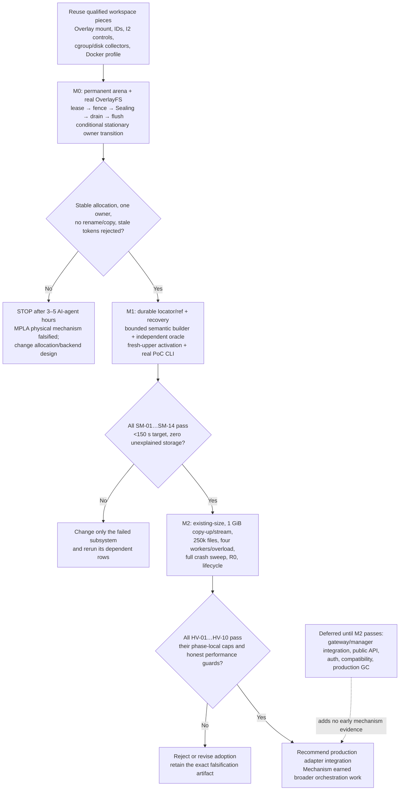

# Stage 04.6 MPLA proof-of-concept implementation plan

Status: M2 revision-ready; M0 and M1 passed, while M2 physical evidence remains
blocked pending `SD-04.6-002` implementation and complete HV-07 operation
wiring
Decision: keep the focused Rust PoC crate and real
OverlayFS/durability/storage behavior. Add only the narrow public-runtime
storage/projection lifecycle seam required to invoke
`mpla-storage-admin-v1`; do not broaden the PoC into a production MPLA API or
replace the existing workload security profile.

This plan is optimized to falsify stationary allocation adoption quickly. The PoC is successful only if it produces the complete, replayable evidence package defined here; passing unit tests alone is insufficient.

## 1. Current-code assessment

### 1.1 Reuse unchanged

| Existing path | Symbols or behavior inspected | PoC use |
| --- | --- | --- |
| `ephemeral-sandbox/crates/sandbox-runtime/overlay/src/kernel_mount.rs` and `overlay/src/lib.rs` | `mount_overlay`, `OverlayHandle`, `OverlayMount::unmount`, `strict_unmount`; `allocate_overlay_writable_dirs` in `lib.rs` | Use the real new mount API and `strict_unmount`. The PoC creates `upper` and adjacent `work` itself at the allocation's permanent location; it must not use the `lib.rs` scratch allocation helper for adopted data. |
| `ephemeral-sandbox/crates/sandbox-runtime/layerstack-core/src/root.rs` and `identity.rs` | `RootId`, digest-backed typed identity | Reuse the typed identity wrappers. Feed them only a PoC semantic-v1 digest whose input excludes physical data. |
| `ephemeral-sandbox/crates/sandbox-runtime/layerstack-core/src/v3.rs` | `CanonicalRecordV3`, `TlvV3`, v3 file/metadata vocabulary | Use as the semantic coverage checklist and test-vector source. The PoC format is deliberately not a LayerStack v3 compatibility implementation. |
| `ephemeral-sandbox/crates/sandbox-runtime/layerstack/src/lib.rs`, `stack/candidate/publication.rs`, `service/mod.rs`, and `service/impls/candidate_materialization.rs` | root re-export `Sha256Digest`; `LayerStack::publish_hidden_validation`; `materialize_hidden_candidate`; hidden generation lookup/acquisition/finalization exports | Reuse digest code. Use the real hidden publisher and native materializer only for the current I2 matched controls. They are not the candidate implementation because they ingest payload bytes into CAS and materialize another carrier. |
| `ephemeral-sandbox/crates/sandbox-observability/telemetry/src/collect/cgroup.rs` | `CgroupSample::read` and cgroup-v2 parsing | Reuse for storage-domain `memory.current`, `memory.peak`, `memory.events`, and CPU/I/O samples. |
| `ephemeral-sandbox/crates/sandbox-observability/telemetry/src/collect/disk.rs` | `sample_upperdir`, logical bytes, `st_blocks * 512`, inode/file counts | Reuse for tree snapshots. Add a PoC union/dedup reconciler because the existing collector does not classify all MPLA categories. |
| `ephemeral-sandbox/crates/sandbox-provider-docker/src/engine.rs` and `runtime.rs` | image/volume/container creation, capability, cgroup namespace, CPU/memory fields, static daemon upload | Reuse its Docker invocation profile and labels as a pattern. Do not depend on the manager/provider lifecycle for the PoC runner. |
| `ephemeral-sandbox/crates/sandbox-runtime/workspace/src/lifecycle/destroy.rs`, `namespace/holder.rs`, and `tests/holder_lifecycle.rs` | holder/command/namespace/mount/lease cleanup ledger, pidfd reap, and mount-reference checks | Reuse the ordering and error cases as test vectors. Implement a smaller PoC quiescence controller because the production destroy path owns scratch deletion that would destroy an adopted upper. |
| `ephemeral-sandbox/crates/sandbox-runtime/namespace-process/src/holder/mod.rs` and runner protocol | public `holder::run`, namespace holder lifecycle, and tracked execution | Reuse the namespace-process binary/protocol where its public boundary is sufficient; otherwise reproduce only its process-group/pidfd lifecycle in the PoC binary. Do not make production internals public merely for the PoC. |
| `ephemeral-sandbox/crates/sandbox-runtime/layerstack/tests/candidate_publication.rs`, `candidate_materialization.rs`, and `layerstack-core/tests/*` | bounded CDC/spool, object/ref failpoints, generation fencing, native reconstruction, allocated-byte and FD checks | Port applicable black-box vectors into PoC integration tests. Keep the existing tests unchanged. |
| `ephemeral-sandbox-test/e2e` and `ephemeral-sandbox-test/benchmark/backend/benchmark_lab/resource_sampling.py` | pytest campaign receipts, Docker execution, and resource sample patterns | Reuse reporting conventions, not the full E2E runner. Its orchestration overhead and product routing are unnecessary for this PoC. |
| `experiment/materialization-benchmark-20260727/repository_materialization_benchmark.rs` and `results/benchmark.json` | preserved R0 corpus and current publication/materialization controls | Reuse the exact corpus and the control procedure. Verify its count and bytes before every R0 run. |

The existing public runtime catalog contains `exec_command`, the file operations, `create_workspace_session`, `publish_workspace_session`, and `destroy_workspace_session`. The manager catalog contains `squash_layerstacks`. It does **not** expose public activation, fork, or rollback operations. `environment/catalog_binding.json` must record that fact. SM-14 exercises those candidate behaviors through the PoC executable; it must not claim they are existing production API operations or add them to the production catalog.

### 1.2 Adapt rather than reuse

The following production mechanisms encode useful policy but cannot be used directly:

- `workspace/src/lifecycle/create.rs` allocates `upper`/`work` below disposable session scratch. MPLA requires the active upper to start at its permanent payload allocation path.
- current workspace capture/recovery copies from a session upper into LayerStack input. That is the behavior under test and is invalid for the candidate.
- LayerStack candidate modules such as `candidate/seqcdc.rs`, `spool.rs`, `refs.rs`, and `native_backend.rs` are `pub(crate)` and still lead to CAS/carrier materialization. Reproduce their small bounded techniques in PoC modules and lock them with copied characterization vectors; do not widen production visibility.
- current `WorkspaceManager` core handles are deliberately private and its destroy ledger deletes scratch. A partial reuse would require architectural changes before evidence exists.
- the production hidden publisher is a valid, real I2 control, but not stationary adoption.

### 1.3 Scoped bypass and required public lifecycle seam

The candidate storage, semantic, publication, and recovery implementation may
remain independent of production workspace publication orchestration,
autosquash policy, production recovery copier, MCP, and the host-workspace bind
model. This avoids confusing broad protocol integration with MPLA correctness.

The authoritative public-path campaign MUST NOT bypass the runtime lifecycle
boundary. It uses the supported manager/runtime/observability CLIs and a
narrow runtime-owned `mpla-storage-admin-v1` helper/profile beneath a typed
lifecycle operation. That helper retains `CAP_SYS_ADMIN` and the qualified
mount/namespace syscalls; ordinary `exec_command` remains mount-denied and
cannot select the profile. Direct Docker execution may be used only for
non-authoritative development diagnostics explicitly labeled as such, never
as M2 pass evidence.

The PoC must still use a real executable boundary, real Linux processes, real
OverlayFS mounts, real Docker volumes, and real on-disk state.

## 2. Selected implementation strategy

### 2.1 Strategies evaluated

| Strategy | Effort / first evidence | Evidence strength | Reuse | OverlayFS / crash / resource realism | CLI coverage | Prototype divergence risk |
| --- | --- | --- | --- | --- | --- | --- |
| Standalone Rust crate outside the workspace | Low / fastest | Medium | Low | Real FS and OverlayFS are possible, but identities, controls, collectors, and build profile would diverge | PoC-only | High |
| **Workspace PoC crate plus selected libraries, bypassing unrelated orchestration** | **Low-medium / 30–60 AI-agent minutes to first Overlay mount receipt; 3–5 elapsed hours to the central M0 adoption slice** | **High for the central mechanism** | **Overlay, core IDs, controls, collectors, Docker patterns** | **Real OverlayFS, fsync, owner/ref files, cgroups, allocated blocks, and process crashes** | **Real PoC executable plus explicit catalog binding** | **Medium and clearly bounded** |
| Partial production workspace/session integration | Medium-high / late | High if completed | High | Real, but scratch ownership and capture paths must first be untangled | Production CLI | Medium |
| Broad end-to-end production-quality implementation | Highest / latest | Highest eventual product confidence | Highest | Real | Full | High delivery risk; too much unrelated surface can hide basic MPLA failure |

### 2.2 Firm recommendation

Implement `sandbox-runtime-mpla-poc` as an explicit workspace member. Build a
static Linux `mpla-poc` binary with serve/control/test-driver modes and a
separately compiled `mpla-poc-oracle` binary that does not import the candidate
scanner/encoder modules, plus a narrow host wrapper at
`ephemeral-sandbox/bin/mpla-poc`. Run the authoritative campaign through the
supported public CLIs in a labeled sandbox with four named volumes: payload,
control, fixtures, and evidence. A runtime-owned storage/projection process
runs with `mpla-storage-admin-v1`, mounts real OverlayFS, and launches or joins
real workload processes only after preserving the ordinary workload privilege
boundary.

This hybrid is the fastest route to credible evidence because it preserves every physical property that matters while avoiding today's intentionally incompatible scratch/copy orchestration. Current LayerStack I2 publication/materialization runs inside the same Linux/Docker/storage profile for matched controls.

Claims this PoC cannot make:

- production MPLA API completeness or backward compatibility beyond the
  narrow public lifecycle/storage-admin seam;
- LayerStack v3 object-format compatibility;
- native macOS, native Windows-container, or non-OverlayFS adapter support;
- power-loss correctness stronger than the process/container crash plus `fsync` model actually tested;
- revocation of a hostile process outside the qualified OCI/cgroup/namespace boundary;
- production-quality multi-tenant authorization, diagnostics, or garbage collection.

If the permanent upper cannot be mounted, quiesced, flushed, and re-opened read-only without moving it in milestone M0, stop. Do not proceed by substituting a copy or rename.

### 2.3 Why this is the fastest effective plan

“Fastest” here means shortest path to a decision-quality falsifier, not shortest path to a demo:

1. **It tests the risky physical seam first.** Steps 0–4 reach real permanent-upper adoption, stale-token rejection, no-copy accounting, and an owner crash edge in about 3–5 elapsed AI-agent hours. A failure there stops before Merkle, control, or heavy-campaign work.
2. **It removes integration work that adds no mechanism evidence.** The gateway, manager registry, production catalog, current scratch lifecycle, and current capture copier do not make an OverlayFS allocation more stationary or an owner transition more durable. Integrating them first would require refactoring code known to encode the opposite storage lifecycle.
3. **It reuses only code whose behavior is already aligned.** The kernel mount implementation, typed IDs, real I2 controls, cgroup/disk collectors, Docker profile, and tested bounded-algorithm patterns save implementation time without inheriting the copy-based candidate path.
4. **It spends code only on matrix-mandated physical claims.** The dedicated owner journal, semantic scanner/oracle, locator/ref store, recovery runner, resource sampler, and executable driver each unlock prohibited-to-mock tests. Production abstractions, remote APIs, auth, general configuration, dashboards, and format compatibility are omitted.
5. **It keeps candidate and controls co-located.** The same Docker VM, filesystem profile, fixtures, clocks, and readiness probes reduce harness work and produce stronger comparisons than a separate standalone experiment.

The implementation workflow makes the schedule advantage explicit:



This is faster than production-first integration because the first decision gate exercises the hardest-to-fake kernel and durability seam. It is more effective than a smaller standalone demo because every success edge above is backed by real physical state and an external oracle. The control/fixture setup is reused across later gates rather than rebuilt. Cross-cutting throughput guards piggyback on HV-02, HV-08, and HV-10 instead of creating another suite.

AI-agent estimates assume a warm repository and Docker image, autonomous tool use, no human approval wait, and compile/test/debug time included. “Elapsed” is wall clock; “agent-hours” sums parallel agents. The fastest safe topology is one lead owning interfaces and the integration branch, plus two bounded agents after M0 (semantic/oracle and recovery/resources), with a fourth slot left for test monitoring or a targeted repair.

| Decision point                             | Cumulative one-agent elapsed |             Cumulative lead + two agents elapsed | Cumulative total agent-hours | Replan threshold |
| ------------------------------------------ | ---------------------------: | -----------------------------------------------: | ---------------------------: | ---------------: |
| First Overlay/arena qualification receipt  |                    30–60 min |                                        30–60 min |                        0.5–1 |           90 min |
| **M0 stationary adoption falsifier**       |                    **3–5 h** | **3–5 h**; core path is intentionally sequential |                      **4–7** |  **8 elapsed h** |
| **M1 complete smoke evidence**             |                  **10–16 h** |                                       **7–11 h** |                    **18–28** | **24 elapsed h** |
| **M2 complete adoption-decision evidence** |                  **20–32 h** |                                      **12–20 h** |                    **36–55** | **48 elapsed h** |

These are implementation-and-verification estimates, not suite budgets. Once
built, the smoke loop retains its own development target; formal heavy
qualification uses only the matrix's independent phase-local caps and has no
aggregate wall-clock target. At a replan threshold, the lead must emit the
failing artifact and reconsider the subsystem or PoC scope; it must not
silently continue toward production integration.

The minimality boundary is test-derived:

| Required code group | Decision evidence it uniquely supplies | Why a lighter substitute is invalid |
| --- | --- | --- |
| Arena + real OverlayFS + quiescence | SM-01–04, HV-03 stable physical adoption and honest copy-up | A tempdir/mock cannot prove kernel copy-up, mount drain, unchanged blocks/inodes, or absence of a second allocation |
| Durable owner/ref/locator + recovery | SM-11/12, HV-07 exact owner and old-or-complete-new visibility | In-memory state or a single happy-path file write cannot support crash claims |
| Bounded semantic builder + independent oracle | SM-06/08/09, HV-01/02/04/08 identity, delta complexity, and correctness | Hashing a pathname/tarball or sharing scanner code would miss normalized semantics and physical-identity leakage |
| Activation/projection + fresh upper | SM-05/14, HV-05/08/10 zero-build readiness and bounded depth | A timing-only lookup does not prove an externally usable OCI session |
| Resource/storage/evidence harness | SM-10/13, HV-06/09 no hidden copy, memory, overload, and reconciliation | Internal counters alone cannot prove physical peak, kernel memory, queue-zero-payload, or `X_unexplained=0` |

Thus a smaller implementation would omit a required non-mockable claim; a broader one would add product integration before the mechanism earns it. M0 maximizes early falsification, M1 closes correctness breadth, and M2 adds scale/performance evidence. This ordering is the main schedule optimization.

## 3. PoC architecture

### 3.1 Qualified execution profile

- Docker Desktop remains at exactly 4 vCPU and 4 GiB. Qualification records the observed values and fails rather than requesting a change.
- Use the Linux/arm64 Ubuntu 24.04 image digest required by `test_matrix.md` (`sha256:4fbb8e6a8395de5a7550b33509421a2bafbc0aab6c06ba2cef9ebffbc7092d90`), with network disabled after image availability is checked.
- The Linux container receives only the mount/cgroup/process capabilities qualification proves necessary. The receipt records architecture, kernel, OverlayFS features/options, filesystem types/mount IDs, cgroup v2, `pidfd`, `syncfs`, xattr/whiteout behavior, and free bytes/inodes.
- The exact storage/projection lifecycle process uses
  `mpla-storage-admin-v1`: effective/permitted/bounding `CAP_SYS_ADMIN`, the
  qualified `mount(2)`, `umount2(2)`, and required namespace syscalls, and
  `NoNewPrivs=1` where compatible. Selection is fixed by trusted operation
  identity, run ID, execution lease, target namespace, and allocation roots.
- Arbitrary workload commands use the ordinary hardened capability/seccomp
  profile. Qualification fails if they retain `CAP_SYS_ADMIN`, can invoke
  `mount(2)`/`umount2(2)`, or can request the storage-admin profile.
- Payload and control are distinct Docker named volumes/mount IDs. No payload pathname is ever renamed into control storage. The R0 host corpus is transferred to the fixtures volume before the suite timer, never bind-mounted into the timed candidate path.
- A delegated `mpla-storage` cgroup sets `memory.high=96 MiB` and `memory.max=128 MiB`. Workload children use separate session cgroups. If writable nested cgroups cannot be qualified, the PoC fails qualification; it does not weaken the memory claim.

The PoC boundary is an implementation of this host-agnostic contract:

```text
allocate() -> (AllocationId, mutable lease)
project_for_execution(base locators, mutable lease) -> execution handle
seal(execution handle, lease epoch) -> stable allocation receipt
compare_and_adopt(stable receipt, expected owner epoch) -> payload lease
open_read(payload lease, locator generation) -> reader
```

Only `project_for_execution` is OverlayFS/Linux-specific. Canonical semantic records enter above this port, and no method exposes a physical path as identity. A future backend may satisfy the same allocate/lease/seal/adopt/read behavior without OverlayFS. In this PoC, P and C deliberately have different mount IDs: adoption changes metadata in place on P and never attempts a payload pathname operation between them. The result therefore does not depend on whether a hypothetical cross-mount rename would return `EXDEV`.

The candidate contains no reflink, copy fallback, cross-mount rename, `renameat2`, FUSE, KVM, ublk, custom kernel, `tmpfs` payload, image helper, or payload-sized mapping/buffer path. Same-directory `rename` is used only for small durable metadata selectors and paired refs.

### 3.2 Minimum components

1. **Allocation arena.** Creates UUIDv4 `AllocationId`, permanent `upper/` and adjacent `work/`, an owner journal, and an immutable allocation descriptor. Allocation happens before a workspace lease is issued.
2. **Lease/epoch store.** Issues a session ID, lease epoch, owner epoch, and scoped writer/deleter capabilities. Every mutating open and delete revalidates both epochs while holding the session admission read guard.
3. **OCI/Overlay adapter.** Acquires lower locator generations, mounts the permanent allocation upper with `sandbox-runtime-overlay`, and launches a tracked process tree in a session cgroup and mount namespace.
4. **Sealing/quiescence controller.** Closes admission, drains commands, makes `Sealing` durable, kills/reaps descendants, audits writable FDs/maps/mount references through `/proc`, and performs a strict unmount. Pre-`Sealing` failure can unfence; post-`Sealing` always rolls forward.
5. **Stationary compare-and-adopt.** Calls `syncfs` on the allocation filesystem, performs two fd-relative stability inventories, then conditionally changes only durable owner metadata from `WorkspaceOwned` to `PayloadOwned`. Path, allocation ID, file inodes, and allocated payload blocks remain unchanged.
6. **Mutation receipt recorder.** PoC write/edit operations durably record exact affected paths and byte ranges. An uninstrumented `exec` marks the receipt incomplete and forces a real full semantic scan; it never guesses.
7. **Streamed scanner and bounded spool.** Uses at most four data workers, 32 KiB streaming hash windows, bounded path/record buffers, 4 MiB managed external-sort runs, fan-in 8, and at most 16 open data descriptors.
8. **PoC semantic-v1 Merkle builder.** Builds immutable path-trie pages for canonical content and attribution, using old pages plus complete receipts on a hit or a full merged-tree scan on a miss.
9. **Locator inventory.** Stores content-to-physical mappings separately from identity, with paired forward/reverse generation pages and a durable generation selector.
10. **Atomic paired ref store.** Stores `{RootId, AttributionRootId, locator_generation, sequence}` as one checksummed ref and replaces it under OCC only after all referenced state is durable.
11. **Activation controller.** Resolves the selected locator generation, pins its allocations/projection recipe, allocates a distinct fresh upper, mounts, probes readiness externally, and only then publishes a new session binding.
12. **Projection compactor.** Outside the publication boundary, folds only net delta uppers into a delta carrier when a chain approaches the configured lower bound. It never copies the multi-GiB base. It is storage-accounted and can leave visible compaction debt.
13. **Recovery runner/fault injector.** Replays scoped operations idempotently after deterministic process/container kills.
14. **Resource sampler/reconciler.** Samples cgroups, `/proc`, mountinfo, filesystems, allocated-block unions, fanotify events, workers/queues, and OOM counters.
15. **CLI/test driver/evidence writer.** Runs exact test cases and emits schema-versioned JSON/JSONL plus a deterministic summary.

Peripheral scheduling is a deterministic in-process harness. Queue callers may be synthetic, but admission state, allocations, mounts, ownership, durability, refs, storage, and memory are real.

### 3.3 Canonical semantic identity

The minimal format is `mpla-poc-semantic-v1`, not LayerStack v3:

- Path keys are normalized raw relative path bytes; `.`/`..`, NUL, absolute paths, and duplicates are rejected.
- Each node includes type; mode; uid/gid; normalized nanosecond mtime; sorted raw xattrs including supported ACL/capability xattrs; and type data.
- Regular files include logical size, ordered DATA/HOLE extents, and ordered content chunks/lengths. Symlinks include raw target. Device nodes include major/minor; FIFO and directory types are explicit.
- Hardlink groups are identified by the sorted member path set plus content semantics, never `(dev, ino)`.
- Overlay whiteouts, opaque directories, deletes, and type changes are interpreted into final-tree semantics. Overlay representation bytes are not canonical truth.
- A content-addressed 16-way path trie gives `O(changed paths × trie depth)` metadata updates on a valid receipt. Attribution uses a parallel trie keyed by the same paths and semantic operation/actor identifiers.
- `AllocationId`, locator generation, pathnames to the arena, device/inode, mount IDs/options, and OverlayFS layer arrangement are prohibited from hash input. A serialization guard rejects structs containing those fields.

The separately compiled `mpla-poc-oracle` binary shares no scanner, record encoder, traversal module, or crate library entry point with the candidate builder. It scans an explicitly reconstructed final tree, emits canonical sorted semantic records, and calculates independent content/attribution roots. SM-09/R0 compare record streams as well as roots. Allocation-substitution tests copy only as an explicit oracle setup operation outside publication timing, change allocation/path/inodes/locator, and require identical roots.

Differences from LayerStack v3 are recorded in every root artifact: smaller PoC page schema, no promise of v3 TLV compatibility, PoC-specific chunking/domain tags, and no production object retention/GC contract. These tests prove semantic and physical separation, not v3 format compatibility.

### 3.4 Control and data flow

1. **Create:** allocator creates permanent allocation; owner journal records `WorkspaceOwned(session, lease_epoch, owner_epoch)`; lease metadata becomes durable; OverlayFS mounts lower locators plus `allocation/upper` and adjacent `allocation/work`.
2. **Execute:** child runs only in the merged workspace. Admission guards and epochs cover command start, file opens, and deletion. Controlled writes produce receipts; arbitrary exec invalidates the fast receipt.
3. **Close/fence:** a publication operation closes admission and drains admitted commands. Before durable `Sealing`, cancellation can restore `Open` if nothing terminal happened.
4. **Seal/quiesce:** persist `Sealing`; stop/reap the holder tree; inspect FDs/maps/mountinfo; strict-unmount; flush and inventory twice.
5. **Adopt:** append owner intent; compare exact owner tuple; append/flush owner transition and selector; emit owner receipt. Payload bytes and path do not change.
6. **Describe:** build or update semantic roots, write immutable canonical pages, construct paired locator generation, and make its selector durable.
7. **Publish:** OCC-check the paired branch head and atomically replace it. Durable parent-directory fsync is the publication linearization point. Response loss is retried by operation ID.
8. **Activate:** independently allocate a new workspace upper, mount selected payload allocations/projection carriers as read-only lowers, externally probe readiness, and durably bind a new lease. Activation never reuses the adopted upper as writable and never hydrates an exact ready hit.
9. **Recover:** start from refs and durable selectors, then converge operation, owner, locator, and activation records. A sealed old session is never returned to `Open`.
10. **Reconcile:** close sessions, release locator readers, drain projection/retirement debt, and classify every remaining allocated block and inode. `X_unexplained` must be zero.

## 4. On-disk layout

Inside the qualified container:

```text
/var/lib/mpla-poc/
  payload/                                  # payload Docker volume, mount P
    allocations/aa/<allocation-id>/
      ALLOCATION.json                       # immutable identity/creation receipt [A]
      upper/                                # physical payload, permanent from creation [A]
      work/                                 # adjacent OverlayFS workdir; empty when unmounted [D]
      owner/
        journal.bin                         # framed checksummed append-only owner records [A]
        generations/<owner-epoch>.json      # immutable owner state [A]
        CURRENT                             # durable owner selector [A]
        receipts/<operation-id>.json        # immutable adoption receipt [A]
    packs/<pack-id>/                        # explicit evacuation/pack target [A]
    retirement/<allocation-id>.json         # durable retirement debt [A]
  control/                                  # control Docker volume, mount C != P
    sessions/<session-id>/
      SESSION.json                          # durable phase and activation binding [A]
      LEASE.json                            # epoch/capability metadata [A]
      mount/                                # disposable merged mountpoint [D]
      receipts.jsonl                        # controlled mutation receipts [A]
    operations/publication/<operation-id>/
      OPERATION.json                        # durable phase/idempotency record [A]
      SEALING.json                          # terminal seal receipt [A]
      owner-intent.json                     # expected/desired owner tuple [A]
      inventory.before.json                 # stable fd-relative inventory [A]
      inventory.after.json                  # stable fd-relative inventory [A]
      candidate-ref.json                    # intended paired ref [A]
      runs/                                 # bounded sort/hash spill [O]
    operations/activation/<operation-id>/   # distinct activation state/receipt [A/O]
    objects/mpla-poc-semantic-v1/<digest>   # immutable metadata only; no payload bytes [I]
    locators/
      generations/<generation>/forward/     # immutable content -> allocation/range pages [I]
      generations/<generation>/reverse/     # immutable allocation -> content pages [I]
      generations/<generation>/MANIFEST     # paired page hashes/counts [I]
      CURRENT                               # durable selector [A]
    refs/heads/<branch>                     # atomic paired root ref [A]
    projections/<projection-id>/            # recipe/status; carrier data remains on P [A/O]
    outcomes/<scope>/<request-id>.json       # scoped idempotent outcome [A]
  fixtures/                                 # read-only fixture Docker volume [F]
    S0/ S1/ S2/ S3/ S4/ S5/ R0/
  evidence/                                 # evidence Docker volume [E]
    runs/<run-id>/...
```

`[A]` is authoritative and durable; `[I]` immutable authoritative; `[D]` disposable; `[O]` operation-private or cache data, never authoritative alone; `[F]` separately prepared fixture input; `[E]` evidence. Cleanup may remove only `[D]`, completed `[O]`, explicitly retired payload after reader drain, and a run's labeled fixture/evidence resources.

The allocation upper starts and remains at the exact path shown. Session directories contain metadata and a mountpoint, not a payload copy. No rename source or destination crosses P and C. Ref files contain locator generation identifiers, never physical paths.

## 5. Durable state machines

### 5.1 Allocation and session ownership

Allocation states:

```text
AllocatedFree
  -> WorkspaceOwned(session, lease_epoch, owner_epoch)
  -> PayloadOwned(publication_id, owner_epoch + 1, seal_digest, inventory_digest)
  -> Evacuating(pack_id) -> PayloadOwned(new physical allocation) + Retired(old)
  -> Reclaimed                         # only after no ref/locator/reader/retirement debt
```

`Sealing` is a session/publication phase, not a second owner. During it the durable owner remains `WorkspaceOwned`, but every token is terminally fenced. A transition is a compare-and-adopt of the exact allocation ID, state, session ID, lease epoch, and owner epoch. There is never an ownerless interval and never two selectors naming current owners.

Session phases:

```text
Open -> Fencing -> Sealing -> Quiescing -> Unmounted -> Stable -> Adopted -> Published -> Closed
          | pre-Sealing failure
          +-------------------------> Open
Sealing or later failure -----------> Recovering -> roll forward; never Open
```

Admission checks phase and lease epoch immediately before acquiring/opening a mutable object. `Fencing` waits for admitted commands. The durable `Sealing.json` write, file fsync, and session-directory fsync make all prior writer/deleter tokens terminal. A stale capability fails with typed `StaleLease { supplied, current, phase }` before resolving the allocation path.

### 5.2 Journal record and selector

Every binary journal record is length-prefixed and contains:

```text
schema, sequence, allocation_id, operation_id, record_kind,
expected_owner {kind, scope_id, lease_epoch, owner_epoch},
new_owner {kind, scope_id, owner_epoch},
seal_digest, inventory_digest, previous_record_hash,
record_hash, monotonic_observed_ns, wall_time, crc32c
```

Diagnostic JSONL is regenerated from `journal.bin` during evidence collection; recovery reads the framed checksummed records. A torn tail is ignored only after verifying that no durable selector points to it.

Owner transition ordering under an allocation-local `flock`:

1. append `AdoptionIntent(expected, desired)` and `fdatasync(journal)`;
2. re-read `CURRENT` and compare every expected field;
3. create `generations/<epoch>.json`, `fsync(file)`, `fsync(generations dir)`;
4. append `OwnerCommitted` and `fdatasync(journal)`;
5. write `CURRENT.tmp.<operation>`, fsync, rename within `owner/`, fsync `owner/`;
6. write immutable receipt, fsync it and `receipts/`;
7. release lock.

A retry with the same scope/request returns the same receipt. A different request observing `PayloadOwned` cannot adopt or delete it.

### 5.3 Publication and ref state

Publication phases:

```text
Planned -> Fenced -> Sealing -> Quiesced -> Flushed -> OwnerIntent
 -> Adopted -> CanonicalDurable -> LocatorDurable -> RefReady
 -> RefReplaced -> ParentSynced -> Acknowledged
```

Canonical objects and both locator directions must be file- and directory-durable before `RefReady`. `refs/heads/<branch>` is a single checksummed structure containing both roots, locator generation, parent sequence, and operation ID. Under a branch lock:

1. re-read the paired head;
2. perform OCC/rebase decision;
3. write/fync a same-directory temp;
4. rename over the head;
5. fsync the refs directory.

Step 5 is the publication linearization point and must be inside the stated publication operation boundary. A crash before it exposes the old ref; a crash after it exposes the complete new ref. Acknowledgement is never the commit point.

Disjoint OCC changes may rebuild only affected metadata and retry before ref replacement. Overlap returns a retained typed conflict; the already adopted allocation remains `PayloadOwned` and explicitly accounted until a resolution or retirement operation.

### 5.4 Activation

Activation phases are distinct:

```text
Planned -> RefSelected -> LocatorPinned -> FreshAllocationOwned
 -> Mounted -> ReadyProbed -> SessionBound -> Acknowledged
```

The new allocation ID must differ from every selected payload allocation. `SessionBound` is a same-directory temp/fsync/rename/parent-fsync replacement. Before it, recovery tears down or retries the private activation. After it, recovery must restore the same binding or report `CommittedActivationFailed`; it cannot roll back publication. Response loss is idempotent by activation operation ID.

### 5.5 Flush, cancellation, and replay

After strict unmount, call `syncfs` on an fd in the allocation filesystem, fsync owner metadata directories, then take two fd-relative inventories separated by a scheduler yield. Inventories include entry semantics, file sizes/extents, link counts, xattrs, allocated blocks, and representative `(dev, ino)` values. Any difference is `UnstableAllocation` and prevents owner change.

Cancellation before durable `Sealing` drains the fence and restores `Open`. Cancellation at or after `Sealing` writes `Recovering` and the recovery runner completes quiescence/adoption/publication or emits a durable terminal error; it never resumes the old session. Replay uses the durable ref first, then ref/locator/owner selectors and scoped outcomes. No in-memory state is authoritative.

## 6. Test implementation mapping

### 6.1 Common harness conventions

- Functions live under `tests/cases/smoke.rs`, `heavy.rs`, and `r0.rs` and are invoked by `mpla-poc suite/test`.
- Every physical dependency in every row is real. There are no mocks for OverlayFS, ownership, durability, epochs, locators/refs, recovery, storage, memory, or semantic comparison. HV-06's extra logical callers and faultpoint timing are synthetic control-plane inputs only; their admission effects are real.
- `Tpub` starts immediately before admission is closed and ends only after ref parent fsync and externally observed response. Scan, hash, flush, adoption, locator, and ref work stay inside it.
- `Tactivate` starts before ref/locator selection and ends after an external process in the new session successfully opens/reads the expected sentinel. Mount and readiness are inside it.
- `Tcopyup+pub` starts before the lower-only write syscall and includes kernel copy-up, mutation, close, and full publication response.
- Fixture generation/transfer is outside suite timers only where the matrix permits it and is always separately timed/reported.
- Cheap repeated cases emit every raw sample, plus median and maximum. One-off/expensive cases emit raw samples and maxima. No p95 is calculated.
- “Real” below means real Docker volume filesystems, kernel OverlayFS, fsync, cgroups, child processes, owner/ref files, and physical accounting. The harness only supplies deterministic callers/fault timing.
- Authoritative physical cases enter through the supported public CLIs. The
  mount lifecycle executes in `mpla-storage-admin-v1`; workload commands remain
  in the ordinary profile. Each campaign records positive mount/strict-unmount
  proof and a negative arbitrary-workload mount probe.

### 6.2 Smoke traceability

| ID / function / command | Component; dependencies | Fixture and mutation | Exact timed boundary | Instrumentation and correctness oracle | Storage and memory expectation | Budget; artifacts; pass/fail; milestone |
| --- | --- | --- | --- | --- | --- | --- |
| **SM-01** `sm_01_qualify_stationary_overlay`; `mpla-poc test SM-01` | Qualification, arena, real OverlayFS; no mocks | S0; create allocation, mount, write sentinel, unmount | Container ready -> qualification receipt durable; mount subspan separately | mountinfo, filesystem/mount IDs, xattr/whiteout probe, cgroup delegation, stat/inode before/after | P and C are distinct mounts; upper/work adjacent; no host payload bind; memory limits observed | 5 s; `qualification.json`, mount snapshots; pass all mandatory features and stable path/ID; **M0/M1 mandatory** |
| **SM-02** `sm_02_current_lease_lifecycle`; `test SM-02` | Lease/admission/exec/cleanup, real processes | S0; create, exec creates/mutates/deletes, close without publish | Each CLI outer call; cleanup until no process/mount/private allocation | response receipts, `/proc`, mountinfo, stale capability log, empty durable refs | private H allocated then zero; no P; storage cgroup within caps | 3 s; lifecycle log/snapshots; exact current lease works and cleanup is clean; **M1** |
| **SM-03** `sm_03_stationary_adopt_small_delta`; `test SM-03 --samples 3` | Full central path, receipt hit/miss, I2 control real | S1 10k/128 MiB; ten edits totaling about 1 MiB | `Tpub`; forced-miss sample includes complete scan | phase spans, owner journal, stat/inode/inventory, fanotify, roots, current I2 matched close control | same allocation ID/path/inodes; peak `H+O(M)`, no second H; 8 MiB pool; hit ≤100 ms (prefer 20), miss ≤1.07 s | 8 s campaign; raw/median/max, control; pass roots/oracle, owner, time, no-copy; **M0 sentinel then M1** |
| **SM-04** `sm_04_stale_tokens`; `test SM-04` | Epoch fencing/deletion, real tokens | Adopted SM-03 allocation; stale writer and deleter attempts | API request -> typed rejection | epoch trace, attempted path resolution counter, fanotify | zero payload writes/deletes/allocations; negligible bounded memory | 1 s; attempts JSONL; every stale attempt rejected before payload open and owner unchanged; **M0/M1** |
| **SM-05** `sm_05_exact_activation`; `test SM-05 --samples 3` | Locator pin, fresh upper, real OverlayFS/readiness | Published S1 | `Tactivate` per sample | selection/mount/readiness spans, allocation IDs, mountinfo, cgroup | no hydration/carrier build; fresh empty upper; ≤100 ms required, ≤20 ms preferred | 2 s; raw/median/max, activation receipts; correct bytes and distinct writable allocation; **M1** |
| **SM-06** `sm_06_sequential_tiny_deltas`; `test SM-06` | Incremental trie/locator/ref | S1 base; 16 sequential tiny edits | `Tpub` each, with current size recorded | per-phase spans, bytes read by mount/allocation, page counts | publication reads only new/affected bytes on receipt hits; storage growth matches deltas+metadata, not old payload | 5 s; 16 samples/growth plot data; no size-correlated old reads or latency slope; **M1** |
| **SM-07** `sm_07_already_upper_large_file`; `test SM-07` | Range receipt/incremental hashing/adopt | S2 256 MiB file already in upper; change 4 KiB | syscall before mutation -> `Tpub` response, mutation and publication spans split | file I/O counters, range receipt, hash pages, oracle | no second 256 MiB payload; bounded buffers/RSS | 5 s; I/O/storage snapshots; correct root and O(changed window) candidate reads; **M1** |
| **SM-08** `sm_08_many_small_files`; `test SM-08` | streamed scan, spool, pool | S3 20k files ≤64 MiB; metadata/content edits | `Tpub` including scan/sort/hash | spool runs, queue/FD/memory samples, independent oracle | pool ≤8 MiB; storage-domain high/max and RSS rule; inode count exact | 20 s; memory JSONL/spool manifest; complete root with no OOM/unbounded growth; **M1** |
| **SM-09** `sm_09_semantic_oracle`; `test SM-09` | semantic-v1 builder and independent oracle | S5 ≤5k/64 MiB; hardlink, sparse, xattr, symlink, mode/uid/gid/mtime, whiteout/opaque/type changes | publication timed; explicit reconstruction/oracle separately timed | candidate/oracle record streams, decoded diff, allocation-substitution roots | reconstruction copy is test-only/oracle category, excluded from publication peak but fully reported | 15 s; record streams/root comparison; exact semantic match and physical-field independence; **M1** |
| **SM-10** `sm_10_four_publishers`; `test SM-10` | four data workers/coordinators/OCC | Four S1 workspaces; disjoint edits | first fence -> all four responses | worker/queue timeline, owner/ref sequence, per-agent spans | ≤4 active data workers; four uppers only for active agents; memory/storage caps | 10 s; concurrency timeline; four exact owners, correct combined root, no fifth worker; **M1** |
| **SM-11** `sm_11_occ`; `test SM-11` | paired ref OCC/rebase/conflict | S1; disjoint pair then overlapping pair | concurrent close calls through response | ref/journal sequence, oracle, retained conflict receipt | conflict allocation remains owned/accounted; no orphan/staging copy | 5 s; ref history/conflict JSON; disjoint converge, overlap typed and no lost update; **M1** |
| **SM-12** `sm_12_crash_smoke`; `test SM-12` | recovery/fault injector, real process/container kills | Small S1 operations | close begins -> recovered terminal response per fault | kill markers, journal/ref/locator snapshots, owner cardinality, oracle | after recovery no orphan temp beyond declared debt; memory restarts within caps | 30 s; crash bundles for fence, Sealing, owner, locator, ref; old-or-complete-new and one exact owner; **M1** |
| **SM-13** `sm_13_reconcile`; `test SM-13` | storage/reader/mount reconciler | All smoke residue after close/drain | reconciliation request -> report durable | allocated-block union, inode union, mount/FD/reader/debt scan | every byte/inode categorized; `X_unexplained=0`; no private H or mount leaks | 5 s; `reconciliation.json`; equality and zero unexplained/leaks; **M1** |
| **SM-14** `sm_14_executable_lifecycle`; `test SM-14` | real PoC executable and catalog binding | S1/S5; create, exec, publish, activate, fork, rollback, squash, close | outer process start -> parsed response for each; service spans nested | argv/exit/JSON receipts, exported production catalogs, cleanup oracle | no allocations for metadata-only fork/rollback; squash categories explicit | 15 s; transcript/catalog binding/timings; all candidate CLI flows real and clean, unsupported production names not claimed; **M1** |

### 6.3 Heavy traceability

| ID / function / command | Component; dependencies | Fixture and mutation | Exact timed boundary | Instrumentation and correctness oracle | Storage and memory expectation | Budget; artifacts; pass/fail; milestone |
| --- | --- | --- | --- | --- | --- | --- |
| **HV-01** `hv_01_existing_size_independence`; `test HV-01` | receipt-hit publication and controls | S4 at 1/5/≤9 GiB; 1 MiB new delta, three matched I2 controls | `Tpub`, identical boundary for every candidate/control | bytes read, phase spans, size/depth, roots | no old payload scan/copy; peak `H+O(M)`; pool/cgroup caps | 35 s; raw candidates/controls; ≤100 ms and ≤control/100 required, ≤20 ms and /500 preferred, no size slope; **M2** |
| **HV-02** `hv_02_stream_one_gib_upper`; `test HV-02` | full stream scanner/hash/adoption plus lean-memory guard | S2 four large, 1 GiB changed upper; three interleaved lean/fastest-qualified-bounded pairs | `Tpub` includes scan/hash/flush/adopt/ref; paired stream boundary identical | phase bytes/throughput, cgroup I/O/RSS, pool permits, oracle | no second 1 GiB H; candidate pool exactly 8 MiB; comparator also obeys the 8 MiB and 96/128 MiB envelope | 20 s; raw paired stream trace/storage union; ≥1 GiB/s required (5 preferred), lean median throughput regression ≤5%, maxima reported, and correct root; **M2** |
| **HV-03** `hv_03_honest_lower_copyup`; `test HV-03` | kernel copy-up plus publication | lower-only 1 GiB file; first 4 KiB write | immediately before write syscall -> published response (`Tcopyup+pub`) | kernel/file I/O deltas, upper allocated growth, wall spans, oracle | honest upper may grow about 1 GiB due copy-up; no *additional* payload-sized copy; bounded memory | 25 s; copy-up trace/snapshots; exact bytes/root, limit and no hidden second copy; **M2 adoption gate** |
| **HV-04** `hv_04_250k_files`; `test HV-04` | scanner/spool/inode admission | S3 250k files ≤1 GiB; specified small edits | `Tpub` full miss | memory/slab/FD/spool/queue/scan samples, oracle | no cardinality reduction; high 96/max128, RSS ≤min(96,idle+32); inode admission exact | 60 s; full memory trace; no OOM, limit violation, or missing entry; **M2 adoption gate** |
| **HV-05** `hv_05_64_deltas`; `test HV-05` | locator chain, bounded delta projection, recovery | 5 GiB base; 64 sequential small deltas | each `Tpub`; projection maintenance separately timed but inside case budget | depth/recipe/carrier sizes, activation probes, recovery/reconcile | lower recipe bounded (base + net carrier + ≤8 deltas); carrier contains delta union only, never 5 GiB base | 50 s; 64 samples/projection debt; correct root/readiness and clean recovery/storage; **M2** |
| **HV-06** `hv_06_overload`; `test HV-06` | scheduler/backpressure | four active + 12 queued logical agents; attempt job 33 | admission call -> queued/rejected response; active publications timed | worker/queue/allocation/mount counts, memory | four active payload/upper/mounts max; queued own zero; 16 coordinators + 16 descriptors ≤64 KiB; job 33 typed reject | 45 s; queue timeline/resource trace; all invariants and eventual correct publications; **M2** |
| **HV-07** `hv_07_crash_sweep`; `test HV-07` | full recovery state space | S1/S5 operations at every owner/locator/ref fault | operation start -> restart/recovery terminal response | durable files before/after kill, exact owners, refs, oracle | no orphan owner/allocation/temp outside explicit recoverable debt; caps on each restart | 60 s; one bundle per fault; old-or-complete-new, one owner, idempotent response; **M2** |
| **HV-08** `hv_08_r0_campaign`; `test HV-08` | real I2 controls, R0 stationary publish/activate, cold exception classification | exact preserved R0; controls, depth 1/4/8, five activations, same-key, ten ≥100 KiB edits totaling ≥1 MiB | exact R0 step boundaries; transfer/fixture time excluded but reported; cold construction is a separate complete-read boundary | current control receipts, candidate spans, root/oracle, memory/storage, cold profile | initial adopted corpus stationary; small delta no corpus copy; fresh activation uppers | 60 s target, 120 s diagnostic cap; R0 artifact set; activation/same-key/small-publish gates pass; cold regression >5% is acceptable only if ≤48%, all hot/correctness/space gates pass, and profile shows no obvious avoidable defect; **M2 adoption gate** |
| **HV-09** `hv_09_evacuation_reader`; `test HV-09` | explicit post-publication evacuation/pack | adopted 1 GiB allocation with held reader; pack then release | pack request -> locator generation durable; reader completion/debt drain separate | locator generations, reader pin, block union, oracle | temporary copy is declared `pack`, not publication; peak and retirement debt exact; old freed only after reader | 60 s; pack/reader/debt traces; uninterrupted reader, exact owner/locator, final zero debt/X; **M2** |
| **HV-10** `hv_10_lifecycle_scale`; `test HV-10` | executable activation/fork/rollback/squash plus normal-throughput guard | lifecycle plus fork fanout 1/64/1000; matched current/candidate command CPU and warmed already-upper sequential/random FS probes | outer CLI process and nested service spans; each throughput probe is a fixed 1 s window after readiness | raw samples, ref counts, allocations, catalog binding, CPU/bytes/IO counters | fork/rollback metadata-only; queued forks own no payload; probe excludes first copy-up but not OverlayFS execution cost | 30 s; CLI transcripts/raw paired times; fork/rollback/squash gates, each normal-throughput paired median regression ≤5%, maxima reported, correctness/cleanup exact; **M2** |

HV-08's bound `HV-08R` subcase is implemented as this fixed sequence:

| Step | Action and required evidence |
| --- | --- |
| `R0-C01` | Three prepared current I2 cold-to-externally-usable materializations; record source/root state, build state, bytes, and exact readiness boundary. |
| `R0-C02` | Three current I2 same-key-to-usable selections with the same external readiness probe and no asymmetric hidden warm-up. |
| `R0-01` | Publish the complete R0 workspace allocation, including real flush, complete semantic scan/hash, stationary adoption, canonical/locator durability, and ref commit. |
| `R0-02` | Attempt stale writes and deletion with the consumed lease; require rejection before payload access. |
| `R0-03` | First exact candidate activation; require zero projection build/hydration/reconstruction and a fresh upper. |
| `R0-04` | Five exact activation samples, with the first three also used for the candidate same-key comparison. |
| `R0-05` | Select the first ten regular files of at least 1 MiB in bytewise sorted relative-path order and mutate exactly 100 KiB in each, for a total delta of at least 1 MiB. |
| `R0-06` | Close/publish the new delta through the full candidate boundary; retain stable original payload and separately adopt the fresh delta allocation. |
| `R0-07` | Independently reconstruct, compare normalized records/roots/bytes, and repeat with changed physical allocation/locator identities. |
| `R0-08` | Close all sessions/readers and reconcile owners, blocks, inodes, locators, refs, mounts, FDs, and debt to `X_unexplained=0`. |

All 24 rows are mandatory. M1 is the first evidence-bearing milestone and includes every smoke row; M2 contains every heavy row. A positive adoption recommendation requires both. If the heavy campaign cannot fit the envelope, the run is failed/incomplete and the omitted rows are named in the summary; fixture cardinality or semantics must not be reduced.

## 7. Measurement and instrumentation

### 7.1 Time and phases

Use `CLOCK_MONOTONIC_RAW` timestamps in the server and host-side monotonic time around the executable request. Emit nested spans for admission fence, command drain, durable Sealing, holder stop/reap, FD/map/mount audit, strict unmount, allocation `syncfs`, stability inventories, owner intent/CAS/receipt, scan, hash, sort, canonical install, locator build/select, ref lock/replace/parent fsync, activation select/mount/readiness, recovery, and reconciliation.

Every span records start/end, input/output logical and physical bytes, entry count, allocation ID, owner/lease epoch, operation/request/scope IDs, worker ID, queue depth, and result. Failed/cancelled spans remain in raw output. Operation boundary fields are immutable and summary generation refuses to omit required phases.

### 7.2 Physical storage and no-copy evidence

At pre-mutation, pre-fence, post-unmount, peak, post-ref, and final reconciliation:

- walk P and C fd-relatively and record logical bytes, `st_blocks*512`, inode count, link count, filesystem/mount ID, and `(st_dev, st_ino)` for deduplication;
- classify `H_active_private`, `P_payload`, canonical metadata, locator metadata, operation scratch, projection cache, explicit pack, retirement debt, fixture, evidence, and unknown;
- calculate peak union over unique physical `(mount_id, st_dev, st_ino)` objects rather than summing pathnames/hardlinks;
- record the stable allocation root plus representative file identities before and after adoption;
- run a bounded fanotify mount audit on P for create/delete/move/write events, summarized continuously to disk, and correlate it with allocator operation IDs;
- capture cgroup `io.stat` and filesystem write deltas.

The no-second-copy oracle requires all of:

1. unchanged `AllocationId` and allocation pathname from workspace creation through ref publication;
2. unchanged allocation-directory identity and unchanged representative payload inodes;
3. zero second payload allocation created by the arena;
4. no payload-sized create/move/write set outside the adopted allocation in fanotify and union snapshots;
5. peak `H + O(metadata/scratch)`, not `H + second H`;
6. no cross-mount rename attempt recorded by the PoC syscall wrapper; the design contains no `renameat2`, reflink, copy fallback, FUSE, image helper, or payload install-to-CAS candidate path;
7. `X_unexplained=0`.

Fanotify/counters are corroboration, not a substitute for physical union accounting.

### 7.3 Memory, processes, and kernel resources

- The explicit application data pool is 8 MiB: index 2 MiB, streaming buffers 1 MiB, coordinator/queue 1 MiB, scratch 3 MiB, headroom 1 MiB. Allocation requests block or return typed backpressure; they cannot fall through to an unbounded vector.
- Storage-domain cgroup samples at 20 ms during cheap tests and 50 ms during heavy tests: `memory.current`, `memory.peak`, `memory.stat` (`anon`, `file`, `kernel`, `slab`, `sock`), `memory.events` including `oom`/`oom_kill`, CPU, and I/O.
- Record idle RSS before a campaign. Assert peak process RSS `<= min(96 MiB, idle + 32 MiB)`, `memory.high=96 MiB`, `memory.max=128 MiB`, and zero OOM events.
- Sample `/proc/<pid>/{status,smaps_rollup,fd,maps,mountinfo,task}` plus descendant membership. Record open FDs, writable mapped files, mount references, threads, and workers.
- Sample global/container slab data where the kernel exposes it and label unavailable fields `unsupported`; never infer zero. HV-04 still relies on cgroup kernel/slab accounting.
- Record active data workers (maximum four), coordinators (maximum sixteen), pending descriptors (next sixteen, each at most 64 KiB), logical callers, queued jobs, active mounts, private allocations, and staging allocations. Job 33 must be rejected before any resource allocation.

### 7.4 Canonical, crash, and environment evidence

Record candidate root/attribution IDs, decoded normalized record hashes, independent oracle roots, locator generation, ref sequence, owner/lease epochs, faultpoint/kill ordinal, recovery decision, and visible ref before/after. `environment.json` records git commit and dirtiness, binary hashes, image digest, Docker/kernel/CPU/memory/filesystems, configuration constants, clock source, and exact commands.

Qualification or collector failure makes affected assertions `FAIL` or `UNQUALIFIED`, never a silent omission. Summary calculations operate from raw JSONL and report raw samples, medians only for cheap repeated cases, and maxima.

## 8. Fault injection

### 8.1 Mechanism

Each durable edge calls `fault::reach("name", operation_id, ordinal)`. A configured point:

1. writes and fsyncs `evidence/.../fault/armed.json`;
2. emits the current phase, selector hashes, and P/C mount IDs;
3. sends `SIGSTOP` to itself so the supervisor can capture files without racing;
4. is killed with `SIGKILL` by the host wrapper;
5. restarts from the same named volumes and invokes `recover --operation-id ...`.

SM-12 uses daemon process kills plus a smaller container-kill subset. HV-07 exercises every edge with both process kill and, where the Docker profile supports it, container kill/recreate. A Docker VM power cut is not claimed. `response-loss.*` commits normally and drops only the response; the harness retries the identical scoped ID and request digest.

The faultpoint name and ordinal are compile-time constants. Unknown names fail before the operation starts. Tests may never inject a crash by sleeping for a guessed interval.

### 8.2 Named points

| Edge | Required points |
| --- | --- |
| Command fencing | `fence.before-close`, `fence.after-close`, `fence.after-drain` |
| Durable terminal seal | `sealing.before-write`, `sealing.after-file-fsync`, `sealing.after-dir-fsync` |
| Holder/unmount/quiescence | `quiesce.before-stop`, `quiesce.after-reap`, `quiesce.after-fd-audit`, `unmount.before-strict`, `unmount.after-strict` |
| Allocation flush/stability | `flush.before-syncfs`, `flush.after-syncfs`, `inventory.after-first`, `inventory.after-stable-second` |
| Ownership intent | `owner.before-intent`, `owner.after-intent-fsync` |
| Conditional owner transition | `owner.before-compare`, `owner.after-generation-fsync`, `owner.after-journal-commit`, `owner.after-selector-rename`, `owner.after-selector-dir-fsync` |
| Owner receipt | `owner.before-receipt`, `owner.after-receipt-dir-fsync` |
| Canonical objects | `canonical.before-install`, `canonical.after-object-fsync`, `canonical.after-object-dir-fsync`, `canonical.after-root-manifest-fsync` |
| Locator generation | `locator.after-forward`, `locator.after-reverse`, `locator.after-manifest-fsync`, `locator.after-selector-rename`, `locator.after-selector-dir-fsync` |
| Paired ref | `ref.before-temp`, `ref.after-temp-fsync`, `ref.after-replace`, `ref.after-parent-fsync` |
| Response | `response-loss.publish`, `response-loss.activate`, `response-loss.rollback` |
| Successor activation | `activate.after-ref-select`, `activate.after-locator-pin`, `activate.after-fresh-owner`, `activate.after-mount`, `activate.after-ready`, `activate.after-binding-fsync` |

### 8.3 Replay oracle

For every killed run, recovery must prove:

- the public ref is either the prior paired ref or the complete intended paired ref, never mixed roots or a ref to missing objects/locators;
- exactly one valid owner selector exists for every allocation, and it agrees with the latest complete journal transition;
- a pre-`Sealing` crash may restore `Open`; a durable-`Sealing` or later crash never does;
- a `WorkspaceOwned` allocation is writable only by the exact live epoch, and a `PayloadOwned` allocation rejects old writer/deleter tokens;
- a forward locator generation is not selected without its reverse inventory and manifest;
- the retry returns the exact stored outcome or completes the same operation, not a second owner/ref transition;
- activation either has no visible successor binding or one complete ready binding with a fresh upper;
- semantic oracle, allocated-byte categories, mount/FD audit, and `X_unexplained=0` pass after debt drain.

The crash bundle contains copies of durable journals/selectors/refs before restart and after convergence, hashes of every immutable record, the recovery decision trace, and old/new external-read results.

## 9. Runtime budget

Build, image availability, and fixture preparation occur before the suite timer and are reported independently. Nothing in an operation boundary—copy-up, scan, hash, flush, adoption, locator/object durability, ref parent fsync, mount, or external readiness—may be moved into fixture setup.

### 9.1 Fixture preparation

| Work outside suite timer | Target | Rule |
| --- | ---: | --- |
| Build/upload static PoC and oracle binaries; verify image digest | ≤120 s warm build, report actual | Amortized across both suites; never counted as a runtime result |
| Generate and seal S0–S5 smoke fixtures | ≤45 s | Record generator seed, logical/allocated bytes, inode count, hashes |
| Generate heavy S2/S3/S4 chains | ≤240 s | Preserve exact 250k count and ≤9 GiB chain; no sparse substitution unless the matrix fixture itself calls for sparse semantics |
| Transfer exact R0 corpus to fixture volume and verify 694 dirs, 3,602 files, 912,350,100 bytes | ≤45 s | Transfer and verification separately reported; volume becomes read-only for the campaign |
| Prepare matched control input states | ≤30 s, excluding any explicitly measured control build | Candidate and control receive identical logical input states; no asymmetric warm-up |

Fixture generation may populate a still-`WorkspaceOwned` permanent allocation before a publication measurement, or immutable lower fixture allocations before an activation measurement. Every case receives a fresh operation/session epoch. Prepared roots are reused unchanged; the harness verifies hashes before reuse.

### 9.2 Smoke envelope

| Category | Budget |
| --- | ---: |
| Daemon/container start and qualification setup | 5 s |
| Non-crash SM case execution | 97 s |
| Kill/restart/recovery work inside SM-12 | 30 s |
| Summary serialization and final reconciliation | 5 s |
| Scheduling/measurement reserve | 13 s |
| **Target** | **150 s** |

The host wrapper arms a 150 s target warning and terminates at 179 s, leaving the required hard stop under 180 s. A timeout is a failed/incomplete suite with raw partial artifacts.

### 9.3 Heavy phase-local envelopes

The heavy rows do not share a wrapper deadline or cumulative budget. Each row
starts a fresh phase-local clock and records its suggested budget, selected
multiplier, calculated cap, and elapsed wall time. `HV-08` has the fixed
`120 s` diagnostic cap; every other heavy row uses the matrix's declared
`1.0×–2.0×` phase-local range. A phase overrun fails that phase only. Unused
time never carries forward, and a fast phase cannot compensate for a slow one.
The heavy qualification still cannot pass with any mandatory matrix row
omitted.

The cross-cutting guards consume existing case budgets rather than adding a suite: HV-02 reserves at most 15 s for six interleaved 1-GiB streams and 5 s for resets/reporting; HV-08 reuses the three required projection constructions at depths 1/4/8 for cold classification; HV-10 reserves 18 s for the three workloads × three pairs × two implementations, 10 s for metadata lifecycle/fanout, and 2 s for in-case reconciliation. Missing these allocations is a case timeout/performance failure, not a reason to move work outside the timer.

### 9.4 Matched-control discipline and performance verdicts

- HV-01 co-schedules three candidate/current I2 closing pairs. The I2 control uses `LayerStack::publish_hidden_validation` over the same about-1-MiB/10-file delta after the same fence/drain/close boundary and includes its object/ref durability. The historical 107.024411507 s R0 first ingestion is never used as the small-publication denominator.
- HV-08 creates three current I2 cold-to-usable and same-key-to-usable pairs with `materialize_hidden_candidate`, then runs candidate exact and same-key activations. R0-03 must show exact zero-build first. `BG-ACTIVATE-EXACT` requires `<= min(99.87675338 ms, matched median / 100)` and prefers `<= min(19.975350676 ms, matched median / 500)`. The first three same-key samples require `<=50 ms` and `/100`, preferring `<=20 ms` and `/500`.
- HV-10 current controls use the actual I2 “select historical root then materialize to externally usable carrier” behavior for fork and rollback intent, with the same fixture, external-ready stop, and naturally produced cache state. Candidate fork requires `<=10 ms` and `/100`, preferring `<=2 ms` and `/500`; rollback requires outer `<=20 ms`, service `<=1 ms`, and `/100`, preferring outer `<=10 ms` and `/500`.
- The harness exports the generated product catalogs first. Because fork/rollback/activate are not current public catalog operations, their I2 controls are explicitly labeled programmatic current controls, not public CLI coverage. If intent, durability, or readiness cannot be matched, the ratio is `UNKNOWN`, which yields `POC_100X_NOT_SUPPORTED`; the absolute candidate result remains reportable.
- Logical squash is an absolute gate only: outer `<=10 ms`, service `<=1 ms`, with no payload scan/build/flatten on an already-ready exact generation. HV-02 is also absolute: required `>=1 GiB/s`, preferred `>=5 GiB/s`.
- PERF-002 is a cross-cutting HV-10 subcell, not another matrix row: run three interleaved current/candidate pairs for command CPU, warmed sequential filesystem, and seeded 4 KiB random filesystem work. Each sample is a fixed 1 s externally observed interval in the same ready image/session shape. Preserve all six raw samples per workload, report paired medians and maxima, and fail the PoC guard if any candidate median throughput is more than 5% below its matched current median. Do not call this limited campaign p95 or release-qualification evidence.
- PERF-003 is a cross-cutting HV-02 subcell: choose the comparator before measurement from a small declared set of bounded implementations, each using the exact 2/1/1/3/1 MiB pool partition and obeying the 96/128 MiB storage domain; use the fastest correct qualified result. Run three interleaved full 1-GiB stream pairs and fail if the required lean implementation's median throughput is more than 5% lower. The checksum, scan, hash, write, flush, and adoption boundary is unchanged.
- PERF-004 is classified only in HV-08's separately labeled cold complete-read/construction samples. The candidate samples reuse the projection construction already required to prepare the depth-1/4/8 exact-hit states; they are not extra corpus builds. A regression above 5% and at most 48% is `COLD_EXCEPTION_CANDIDATE`, never a pass by itself; it becomes accepted only if every hot, correctness, memory, and space gate passes and the phase profile shows no avoidable extra read/pass/copy/fsync defect. It can never rescue activation, publication, command, or ordinary filesystem throughput.

The final report emits independent `POC_CORRECTNESS_PASS`, `POC_100X_SUPPORTED`/`NOT_SUPPORTED`, `POC_500X_SUPPORTED`/`PARTIAL`/`NOT_SUPPORTED`, `PERF_NORMAL_GUARD`, `PERF_LEAN_GUARD`, and `PERF_COLD_CLASSIFICATION` verdicts. These PoC sample counts support raw/median/max falsification evidence, not p95 claims.

## 10. Memory and storage controls

### 10.1 Fixed limits

| Resource | Limit and enforcement |
| --- | --- |
| Data workers | Four fixed threads; no per-file tasks |
| Coordinators | Sixteen operation descriptors |
| Queue lookahead | Next sixteen descriptors, aggregate serialized size ≤64 KiB |
| Application data pool | Exactly 8 MiB partitioned 2/1/1/3/1 MiB as specified; semaphore-backed leases |
| Non-resident I/O credits | 64 MiB total outstanding kernel I/O credit; backpressure before submission |
| Storage cgroup | `memory.high=96 MiB`, `memory.max=128 MiB`; aggregate peak over service RSS, mappings, attributable page cache, dentries/inodes/slab/helpers must respect the 96 MiB soft watermark and remain `<128 MiB`; observed service RSS gate `min(96 MiB, idle+32 MiB)` |
| Sort/spool | 4 MiB managed records, 8-way merge; runs on C under the operation ID |
| Stream buffers | 32 KiB per active stream plus bounded 64 KiB descriptors; no fixture-sized mmap |
| Open data FDs | 16 scanner/materializer FDs; record total process baseline and require storage-subsystem delta ≤64 |
| Mounts | Four active workspace mounts maximum; bounded projection recipe of base + net carrier + at most eight recent deltas |
| Private allocations | Four active session uppers maximum; queued logical agents own none |
| Pack/retirement | One pack worker and one 1-GiB pack target at a time; configured debt quota rejects another pack before allocation |

Rust collection capacities are constructed from these constants and rejected if a decoded record exceeds its per-record cap. Path/metadata records larger than 64 KiB are streamed to a dedicated spill record with a hash and length, not held in the queue. Directory cardinality, trie pages, and hardlink groups are external-sorted; no `HashMap<all paths>` is allowed.

Inode admission checks fixture-declared count, free inodes, and spool upper bound before allocating/mounting. A shortfall returns `InsufficientInodes` before payload ownership. It may not lower 250k to make HV-04 run.

### 10.2 Backpressure and failure behavior

- Jobs 1–4 may own active uppers/mounts; jobs 5–16 are coordinators only; descriptors 17–32 occupy at most 64 KiB total; job 33 returns `Overloaded` before an allocation, upper, mount, stage, or payload lease is created.
- Soft-limit crossing stops new scan/pack I/O and drains existing credits. Hard-limit/OOM events make the design fail; the harness does not restart with larger limits.
- FD, mount, or retirement quota exhaustion returns typed backpressure and preserves durable work. It does not use lazy unmount or silently leak debt.
- Projection compaction copies only the net delta set into a declared cache allocation outside publication timing. At most base + net historical delta carrier + eight recent adopted deltas are presented to a kernel mount. If compaction would require copying the base, stop and classify the projection design as failed.
- The fixture, evidence, and current-control storage categories are excluded from candidate peak equations only after their distinct mount IDs and immutable state are proved. They remain visible in whole-run disk receipts.
- Cleanup waits for readers and locator generations. It never deletes a source to make the peak look smaller.
- Publication payload staging must be zero for metadata-only operations and at most 5% of the captured allocation for payload-changing operations. The metadata spool remains separately categorized and bounded; it may not contain payload bytes or one temporary object per chunk. Crossing either staging gate is a design failure, not permission to relabel staging as cache or allocation metadata.

## 11. File-level implementation sequence

All implementation changes below are future PoC work. This planning task changes only this document.

| Step / exact files | Purpose and approximate effort | Dependencies; tests unlocked | Completion condition | Rollback or simplification |
| --- | --- | --- | --- | --- |
| **0. Workspace skeleton**: `ephemeral-sandbox/Cargo.toml`; `crates/sandbox-runtime/mpla-poc/Cargo.toml`; `src/bin/mpla-poc.rs`, `src/lib.rs`, `src/config.rs`; `bin/mpla-poc` | Add explicit member, main static binary modes, fixed limits, safe labeled Docker wrapper. ~350 LOC / **10–20 agent min** | Existing workspace deps and provider invocation pattern; unlocks build/start | Linux binary uploaded and qualification command round-trips JSON | Keep one main binary/mode enum; do not create a service framework or production catalog entry |
| **1. Evidence/qualification vertical slice**: `src/evidence.rs`, `src/qualify.rs`, `src/docker_protocol.rs`; `tests/cases/smoke.rs` | Schema-versioned writer, mount/cgroup/OverlayFS probes, run receipts. ~650 LOC / **30–45 agent min** | Step 0, overlay and observability crates; SM-01 | SM-01 proves distinct P/C mounts, cgroup limits, real mount/whiteout/xattr, stable sentinel | Drop optional fanotify qualification only if unavailable and mark no-copy corroboration weaker; physical union remains mandatory |
| **2. Permanent allocation and lease**: `src/allocation.rs`, `src/durable.rs`, `src/owner.rs`, `src/lease.rs`; `tests/allocation_owner.rs` | Permanent arena, framed journal, selector CAS, epochs/capabilities. ~900 LOC / **45–75 agent min** | Step 1; SM-02/04 owner core | Unit/fault tests show exact owner, torn-tail handling, stale rejection before path resolution | Use coarse allocation-local `flock`; do not add a database |
| **3. Real execution/quiescence**: `src/overlay_adapter.rs`, `src/process_tree.rs`, `src/session.rs`, `src/quiesce.rs`; `tests/session_overlay.rs` | Mount permanent upper, child cgroup/process tree, fence, Sealing, fd/map/mount drain, strict unmount/syncfs. ~1,100 LOC / **60–90 agent min** | Steps 1–2, `sandbox-runtime-overlay`; SM-02 and central M0 slice | Create→exec→seal→unmount leaves stable allocation and no holder/mount reference; post-Sealing cannot resume | Implement direct pidfd/process-group runner if namespace-process public protocol is awkward; never weaken holder audit |
| **4. First stationary publish**: `src/publication.rs`, `src/inventory.rs`, `src/fault.rs`; `tests/stationary_publish.rs` | Operation phases, stable inventories, compare-and-adopt, early crash edges. ~900 LOC / **60–90 agent min** | Steps 2–3; SM-03 basic, SM-04, SM-12 owner subset | S1 adoption keeps ID/path/blocks/inodes, no second allocation, stale tokens fail, owner crash replay exact | Initially full-scan metadata may stand behind adoption evidence; it cannot be called the valid-receipt fast path |
| **5. Bounded semantic engine**: `src/semantic/mod.rs`, `record.rs`, `scan.rs`, `chunk.rs`, `spool.rs`, `trie.rs`, `attribution.rs`; `tests/semantic_vectors.rs`, `tests/spool_bounds.rs` | Complete semantic-v1 records, streaming chunks, external sort, persistent tries. ~1,700 LOC / **1.5–2.5 agent h** | Step 4, layerstack-core IDs/v3 vectors; SM-03 hit/miss, SM-06–09, HV-01/02/04 | Candidate and independent expected vectors cover every semantic type; 250k dry scan stays within pool/FD caps | Use fixed 16-way trie and coarse pages; no generic object framework. If CDC reuse is too costly, fixed 1 MiB streaming chunks are acceptable only if all timing/semantic gates still pass |
| **6. Independent oracle**: `src/bin/mpla-poc-oracle.rs`, `src/oracle_scan.rs`, `src/oracle_record.rs`; `tests/oracle_crosscheck.rs` | Separately compiled final-tree semantic scanner/encoder; the oracle bin does not import `src/lib.rs`. ~700 LOC / **45–75 agent min** | Step 5; SM-09/R0 semantic proof | Mutation matrix and allocation substitution yield exact decoded record/root comparisons | A slower single-threaded oracle is acceptable because it is separately timed; code sharing with candidate scanner is not |
| **7. Locator and paired refs**: `src/locator.rs`, `src/ref_store.rs`, `src/occ.rs`; `tests/locator_ref_recovery.rs` | Forward/reverse generations, selectors, paired atomic refs, OCC/rebase/conflict. ~1,000 LOC / **1–1.5 agent h** | Steps 4–6; completes SM-03/06/10/11/12/13 | Every selected ref resolves durable roots and paired locator; crash matrix old-or-new | Use one coarse branch lock and immutable flat/page files; no SQL/transaction layer |
| **8. Activation and projection**: `src/activation.rs`, `src/projection.rs`; `tests/activation_projection.rs` | Fresh upper, exact mount/readiness, metadata fork/rollback, bounded delta carrier. ~1,100 LOC / **1–1.5 agent h** | Steps 3, 7; SM-05/06/14, HV-05/10 | Exact hit builds/hydrates zero, allocation distinct; 64 deltas never require 64 kernel lowers | Allow visible compaction debt/raw recipe up to hard max while the delta-only carrier builds; never reconstruct base in activation |
| **9. Resources/reconciliation**: `src/resources.rs`, `src/reconcile.rs`, `src/fanotify_audit.rs`; `tests/resource_limits.rs`, `tests/reconcile.rs` | Pools, scheduler, cgroup/proc sampling, physical union, zero-unexplained equation. ~1,000 LOC / **1–1.5 agent h** | Steps 1–8; SM-08/10/13, HV-04/06/09/10 | Synthetic and live quota tests prove early rejection; real suite closes with `X=0` | Fanotify is auxiliary; retain exact stat-block union and allocator ledger if fanotify is unsupported |
| **10. Current controls and R0**: `src/controls.rs`, `src/fixtures.rs`, `src/throughput_probe.rs`; `tests/cases/r0.rs`; `tests/cases/heavy.rs` | Wrap real hidden publisher/materializer controls, exact preserved corpus, matched labels/boundaries, and tiny fixed-window PERF-002/003 probes. ~1,050 LOC / **1–1.5 agent h** | Steps 5–9 and LayerStack public API; HV-01/02/08/10 | Three-pair controls, bounded-memory stream pairs, normal-throughput pairs, and exact R0 sequence fit budgets with raw receipts; incompatible controls become `UNKNOWN` | Programmatic I2 controls and a direct in-session probe are acceptable; do not integrate the production gateway or an observability stack just to create controls |
| **11. Evacuation and full crash sweep**: `src/evacuation.rs`, `src/recovery.rs`; `tests/crash_matrix.rs` | Explicit pack/reader pin/retirement debt and deterministic replay at all points. ~1,000 LOC / **1–2 agent h** | Steps 7–10; HV-07/09 | Held reader survives locator swap; every fault converges with one owner/ref and zero final debt | One pack at a time and coarse recovery lock are acceptable |
| **12. Campaign CLI/reporting**: `src/cli.rs`, `src/report.rs`; `tests/cases/mod.rs`, `smoke.rs`, `heavy.rs`; `tests/artifact_schema.rs` | One-test/suite/crash/report/clean commands, verdicts, budget scheduler. ~850 LOC / **45–75 agent min** | All prior; all matrix rows | Fresh smoke and heavy runs produce complete schema-valid artifacts and human summary within hard stops | Keep local-only JSON protocol; no HTTP, dashboard, metrics backend, or production API |
| **13. M2 corrective public lifecycle profile and real fault wiring**: lead-owned runtime security/profile/config/catalog files plus exact transferred PoC runner/recovery tests | Implement `mpla-storage-admin-v1`, bind it to exact lease-authorized MPLA lifecycle operations, preserve the ordinary workload policy, and route all 46 HV-07 markers through their corresponding real operation before the marker. | Ratified `SD-04.6-002`, integrated M2 host checkpoint `d49c44b35eabbb40b98874d907edcdd40decf6e3`, blockers `B-006`/`B-007`; unlocks M2 physical rerun | Positive public lifecycle mount/strict-unmount passes; arbitrary workload cannot select profile or mount and lacks `CAP_SYS_ADMIN`; all 46 faultpoint children perform the named core operation and the ledger accepts physical completeness only after real SIGKILL evidence | Keep one narrowly typed storage-admin path and the existing general command profile. Do not add a generic privileged-exec option, direct-Docker evidence path, or marker-only fault result |

Pure first-pass code generation for roughly 10,000–11,000 PoC/test/wrapper LOC is estimated at 12–18 agent-hours; that is not the completion estimate. Including compilation, Docker/OverlayFS integration, fault-replay debugging, and full-suite reruns gives the decision schedule in §2.3: 3–5 elapsed hours to M0, 7–11 elapsed hours to M1 with three agents, and 12–20 elapsed hours / 36–55 cumulative agent-hours to M2. A single agent should expect 20–32 elapsed hours to M2. These are coding-agent estimates; the four-active-data-worker runtime limit remains unchanged. If step 4 falsifies stationary adoption, stop before building the semantic/benchmark surface.

Vertical milestones:

- **M0, fail-fast AI implementation slice:** SM-01, SM-02 central lifecycle, SM-03 one full-scan adoption, SM-04, and owner-edge subset of SM-12. This is not a matrix-complete PoC.
- **M1, first PoC milestone:** all SM-01 through SM-14 pass and produce the complete smoke artifact set under 150 s target/180 s hard stop.
- **M2, adoption-decision milestone:** all HV-01 through HV-10 execute under the heavy envelope; all correctness gates pass and performance verdicts are honestly classified.

## 12. Commands and developer workflow

Before any authoritative manual sandbox operation, rebuild the gateway with
`bin/start-sandbox-docker-gateway --rebuild-binary`. Create/destroy sandboxes
only through `sandbox-manager-cli`, create/run/stop workspace and MPLA
lifecycle operations only through `sandbox-runtime-cli`, and audit exact state
through `sandbox-observability-cli`. The lead must freeze the exact typed
operation/profile contract before worker implementation; no worker may invent
a generic privileged-exec parameter.

The host wrapper remains useful for build, fixture, evidence, and host-only
developer dispatch. It owns only resources labeled
`com.ephemeralos.mpla-poc=true` and the exact validated run ID
(`[A-Za-z0-9][A-Za-z0-9_.-]{0,63}`). It rejects empty IDs, globs, `/`, `~`, and
`all`. Its physical commands are authoritative only when dispatched through
the public runtime lifecycle with a valid `mpla-storage-admin-v1` operation
receipt; direct Docker dispatch is diagnostic and cannot produce a PASS.

```bash
# Build the host wrapper dependencies and the static Linux PoC/oracle selected
# for the Docker VM architecture.
ephemeral-sandbox/bin/mpla-poc build

# Prepare immutable fixtures. Times and hashes are written under the run.
ephemeral-sandbox/bin/mpla-poc fixture prepare \
  --run-id dev-001 --tier smoke
ephemeral-sandbox/bin/mpla-poc fixture prepare \
  --run-id dev-001 --tier heavy \
  --r0-source /Users/yifanxu/Ephemeral-AI-Lab/experiment/materialization-benchmark-20260727/corpus/console-release

# Run one case, the bounded suites, or one deterministic crash point.
# These physical commands are payloads of the public runtime lifecycle; they
# are not authorization to use docker exec.
ephemeral-sandbox/bin/mpla-poc test --run-id dev-001 SM-03
ephemeral-sandbox/bin/mpla-poc suite --run-id smoke-001 smoke
ephemeral-sandbox/bin/mpla-poc suite --run-id heavy-001 heavy
ephemeral-sandbox/bin/mpla-poc crash --run-id crash-001 \
  --test HV-07 --point owner.after-selector-rename

# Validate and render evidence without rerunning physical work.
ephemeral-sandbox/bin/mpla-poc evidence verify --run-id heavy-001
ephemeral-sandbox/bin/mpla-poc evidence report --run-id heavy-001

# Show exactly what would be removed, then remove only this run's labeled
# container/volumes/artifacts. No workspace or shared Docker resource is touched.
ephemeral-sandbox/bin/mpla-poc clean --run-id dev-001 --dry-run
ephemeral-sandbox/bin/mpla-poc clean --run-id dev-001
```

For a single in-container developer unit test:

```bash
cargo test --manifest-path ephemeral-sandbox/Cargo.toml \
  -p sandbox-runtime-mpla-poc --test stationary_publish
```

The wrapper prints the absolute evidence directory and exact Docker commands to `commands.jsonl`. It never invokes shell utilities inside the workload image for readiness; it uses the uploaded binary and direct syscalls. Image pulls, rebuilds, and fixture preparation are explicit commands and never hidden in `suite`.

Every authoritative run additionally records:

- the public manager/runtime/observability request and response identities;
- the selected `mpla-storage-admin-v1` profile and exact executable digest;
- run, operation, lease, namespace, allocation-root, and cgroup bindings;
- storage-admin and workload `/proc/<pid>/status` capability,
  `NoNewPrivs`, and seccomp witnesses;
- positive mount and strict-unmount receipts plus the negative workload mount
  result; and
- exact public-CLI cleanup with zero remaining run-labeled resources.

## 13. Evidence artifacts

Stable layout under the evidence volume:

```text
runs/<run-id>/
  environment/
    environment.json
    qualification.json
    catalog_binding.json
    binaries.sha256
    commands.jsonl
    fixture_receipts/
  cases/
    SM-01/
      record.json
      raw_samples.jsonl
      spans.jsonl
      events.jsonl
      stdout.log
      stderr.log
      memory.jsonl
      process_fd_mount.jsonl
      storage/
        pre.json
        peak.json
        post.json
        union.json
      identity/
        candidate.records
        oracle.records
        roots.json
      crash/
        <fault-name>/
          armed.json
          before/
          after/
          recovery.jsonl
      journals/
      locators/
      refs/
    ...
    HV-10/
      ...
  suite/
    index.json
    raw_sample_index.json
    performance_gates.json
    reconciliation.json
    omissions.json
    summary.md
    manifest.sha256
```

`record.json` is the one authoritative JSON record per test and contains:

- schema/build/environment/fixture IDs;
- exact boundary and dependency classification;
- every raw-artifact relative path and hash;
- raw samples and the permitted median/maximum summaries;
- correctness, storage, memory, time, control, and milestone verdicts;
- failure, cancellation, timeout, unsupported, and omission states;
- expected versus observed allocation IDs, owner/lease epochs, roots, locators, refs, bytes, inodes, workers, mounts, FDs, queues, OOM events, and fault outcomes.

`manifest.sha256` covers all artifacts after the run closes. `evidence verify` checks schema, hashes, required rows/phases/faults, sample counts, thresholds, and reconciliation equations before generating `summary.md`. The human summary links back to raw evidence and cannot turn `UNKNOWN`, `NOT_RUN_BUDGET`, or collector failure into a pass.

R0 additionally preserves:

- exact corpus receipt and transfer time;
- `R0-C01` three cold-to-usable controls and `R0-C02` three same-key controls;
- `R0-01` initial stationary publish through `R0-08` reconcile;
- all five exact activation samples and first-three same-key samples;
- sorted list of the first ten mutated files, each mutation size, and total delta;
- current/candidate decoded semantic comparisons;
- stable allocation/inode and no-second-corpus-copy union evidence.

## 14. Risks and falsification decisions

| Risk | Falsifying tests/evidence | Decision on failure |
| --- | --- | --- |
| The scoped storage-admin profile is absent, too broad, or inherited by workload code | Public-path capability qualification: positive lifecycle mount/strict-unmount, negative general-workload mount, effective capability/seccomp/`NoNewPrivs` witnesses, authorization replay/mismatch probes | Stop before fixture preparation. Implement or narrow `mpla-storage-admin-v1`; never substitute direct Docker execution, a generic privileged shell, or `CAP_SYS_ADMIN` on arbitrary `exec_command` |
| OverlayFS lower/upper semantics, whiteouts, opaque dirs, hardlinks, xattrs, or sparse extents do not round-trip | SM-01 qualification, SM-09, HV-03, HV-08 oracle | Stop adoption recommendation. Fix the Linux adapter/semantic interpreter; do not redefine identity to OverlayFS representation or substitute copying |
| Writer revocation cannot be proven after adoption | SM-04, SM-12/HV-07 post-Sealing faults, `/proc` audits | Stop. Strengthen admission/open checks and cgroup/namespace holder control; no owner transition while any writable reference remains |
| Durable owner transition can yield zero or two owners | SM-12, HV-07 exact selectors/journals | Stop. Reduce to coarser allocation lock and simpler selector protocol; never mask ambiguity with reconciliation |
| Canonical identity depends on allocation/path/inode/mount arrangement | SM-09 allocation substitution, HV-08 record diff | Change semantic encoder/domain immediately. Do not proceed to performance claims |
| Scan time grows with existing immutable size for a small valid receipt | SM-06, HV-01, HV-05 bytes-read and time slopes | Reject the receipt/trie design. Add missing base manifest/delta index; never exclude the scan from `Tpub` |
| Receipt misses are too slow or semantically unsafe | SM-03 forced miss, SM-08/09, HV-04 | Preserve full-scan correctness; report miss cost. If budgets fail, optimize bounded scanner/spool rather than trusting incomplete receipts |
| Honest 1-GiB lower copy-up negates user-visible benefit | HV-03 `Tcopyup+pub` | Record as an OverlayFS adapter limitation. Consider a future adapter or workload policy; do not credit MPLA or add reflink/copy tricks |
| Dentry/inode/slab pressure breaches 96/128 MiB | SM-08, HV-04 cgroup/kernel samples | Design failure. Reduce resident metadata, improve spooling/admission; do not raise limits or lower 250k |
| Fsync latency dominates tiny publication | SM-03/HV-01 phase spans | Keep durability. Batch only metadata safely or redesign journal/ref layout; never move fsync after acknowledgement |
| A crash exposes mixed ref/locator/root or ambiguous sealed session | SM-12, HV-07, HV-10 response loss | Stop. Make ref last, simplify recovery/selector graph, and rerun all faultpoints |
| Stationary publication hides a second payload-sized copy | SM-03/07, HV-02/03/08 union+fanotify+I/O | Immediate PoC failure. Find/remove copier; no categorization trick may relabel a publication twin as cache |
| Allocation fragmentation or pack debt becomes unbounded | SM-13, HV-05, HV-09 | Add/adjust typed debt backpressure and explicit evacuation. If reader-safe drain cannot converge, reject current locator/pack design |
| Activation needs reconstruction or projection build on an exact hit | SM-05, HV-05/08/10 zero-build counters | Fail activation booster. Move explicit projection preparation outside activation with visible debt, or change projection representation; never hide work in prior activation |
| Delta projection compaction reconstructs the 5-GiB base | HV-05 bytes and storage categories | Reject compactor. Preserve bounded raw recipe/debt while designing delta-only fold |
| Four-agent load starves, exceeds four workers, or allocates for queued jobs | SM-10, HV-06 | Tighten fixed scheduler/fairness; job 33 and queued agents must reject/wait before resource ownership |
| PoC controls do not match current intent/boundary/cache state | HV-01/08/10 control receipts/catalog binding | Mark ratio `UNKNOWN` and `POC_100X_NOT_SUPPORTED`; retain absolute/correctness evidence, never use historical/asymmetric denominator |
| Normal or lean throughput regresses by more than 5%, or cold construction exceeds/misuses the 48% exception | HV-02/08/10 raw paired samples and phase profiles | Reject the performance recommendation. Optimize within unchanged memory/durability boundaries; never average workloads together, raise limits, or apply the cold exception to a hot path |
| PoC evidence does not generalize to production orchestration/backend | Current-code assessment plus all M2 receipts | Treat result as mechanism proof only. Next stage is a production adapter seam/design review, not a direct release |

## 15. Definition of done

### 15.1 M1 smoke completion

M1 is complete only when a fresh run:

- executes every SM-01 through SM-14 row under the 150 s target and 180 s hard stop;
- proves a permanent real OverlayFS upper, stable allocation ID/path/representative inodes, adjacent workdir, distinct P/C mounts, and no host payload copy;
- reaches durable terminal `Sealing`, drains holder processes/writable FDs/maps/mount references, strictly unmounts, flushes, and conditionally adopts;
- rejects every stale writer/deleter and never resumes a post-`Sealing` session;
- makes canonical roots, attribution roots, paired locators, and paired ref durable in the required order;
- passes independent complete semantic reconstruction and physical-identity substitution;
- passes smoke crash edges with old-or-complete-new refs and exactly one owner;
- activates through external readiness with a fresh upper and zero exact-hit hydration/build;
- runs the real PoC executable lifecycle and accurately records product catalog bindings;
- stays within the 8 MiB pool and 96/128 MiB storage-domain limits with zero OOM;
- reconciles physical bytes/inodes/mounts/FDs/leases with `X_unexplained=0`;
- produces a hash-valid evidence manifest with no unreported omission/failure.

### 15.2 M2 adoption-decision completion

M2 is complete only when:

- the public lifecycle selects `mpla-storage-admin-v1` only for the exact
  lease-bound storage/projection process, positive mount and strict-unmount
  pass, and a general workload command both lacks `CAP_SYS_ADMIN` and remains
  unable to mount;
- every HV-01 through HV-10 row executes within the heavy hard stop and the target/diagnostic status is honestly reported;
- valid-receipt small publication is independent of 1/5/≤9 GiB existing size and meets its absolute gate;
- 1 GiB streaming includes real scan/hash/flush/adopt work and meets the throughput floor without a second payload;
- the first lower-only 1-GiB write includes honest kernel copy-up and still shows no publication twin;
- all 250k files remain present and semantically correct under unchanged memory limits;
- 64 deltas retain bounded kernel projection and clean storage/recovery without scanning old payload on each publication;
- four active agents progress; twelve queued agents own no upper/payload/mount/staging allocation; job 33 is typed overload;
- all owner/locator/ref faultpoints converge, response-loss retries are exact, and cancellation obeys the Sealing boundary;
- R0 exact activation, same-key activation, stationary republish, identity, and no-second-corpus-copy evidence are complete;
- evacuation keeps a pinned reader correct, accounts the honest old+new peak, applies typed debt backpressure, and drains retirement;
- fork 1/64/1,000 has logarithmic metadata behavior and zero inactive physical resources; rollback/squash do no reconstruction/copy on exact ready state;
- current/candidate command CPU and warmed sequential/random filesystem paired medians each stay within the 5% normal-throughput guard, and the lean 1-GiB stream stays within 5% of the fastest predeclared qualified bounded-memory comparator; every raw sample and maximum remains visible;
- any cold complete-read regression is either at most 5%, or is at most 48% and explicitly accepted only after hot/correctness/space success and a no-obvious-defect profile; no cold exception is applied to a hot path;
- payload staging is zero for metadata-only operations and at most 5% of captured allocation otherwise, with all metadata spool bytes separately bounded and classified;
- final reconciliation has `X_unexplained=0`, zero leaked active lease/mount/FD, and all safe residue explicitly classified;
- `POC_CORRECTNESS_PASS` is true and each speedup/absolute verdict follows the matrix without p95, capped ratios, omitted failures, or incompatible controls.

### 15.3 Stop/change rules

Stop the current architecture immediately if stationary adoption needs a payload move/copy/rename, owner exactness fails, post-Sealing execution can resume, identity contains physical data, a selected ref can reference incomplete state, or memory can only pass by changing the envelope.

Change the specific subsystem, then rerun all dependent rows, when:

- M0 physical adoption passes but semantic-v1 fails: change scanner/encoder, not the allocation protocol;
- correctness passes but small publication scans history: change receipts/trie indexing;
- exact activation builds payload: change projection preparation/locator selection;
- long-chain mount depth grows: change delta-only projection compaction;
- pack reader safety fails: change generation pin/retirement protocol;
- matched control is unavailable: retain mechanism results but do not claim aggregate speedup.

The corrective implementation agent starts from step 13 and the exact blocked
M2 checkpoint. It changes only the narrow public storage/projection lifecycle
seam and real HV-07 operation wiring, then reruns the unchanged M2 envelope.
Broader production MPLA integration remains deferred until M2 establishes that
the physical mechanism, durability protocol, resource shape, and claimed
performance are worth carrying into the product.
