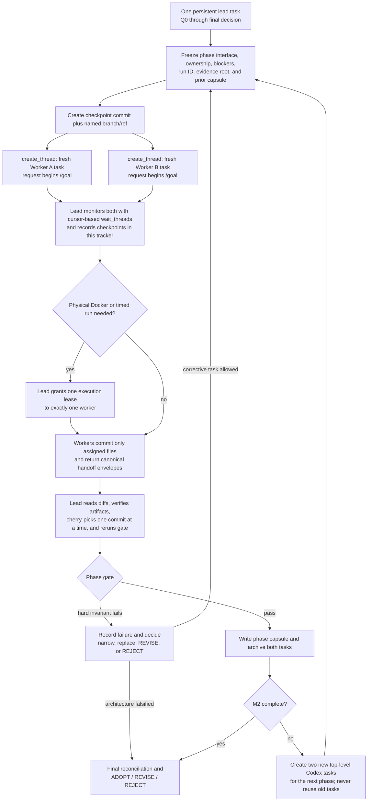

# Stage 04.6 MPLA PoC progress tracker

Status: `IN_PROGRESS`  
Current phase: `M0`  
Current gate: `Q0 qualification`  
Lead agent: `Codex task 019fa207-1e75-75a0-a714-664e03e8d3c6 on local`  
Active run ID: `m0-20260727T130703p0800`  
Started at: `2026-07-27T13:07:03+08:00`  
Last updated at: `2026-07-27T13:35:18+08:00`

## 1. Authority and update protocol

This is the authoritative implementation and verification tracker for the Stage 04.6 MPLA PoC.

- The persistent lead agent is the only writer to this file.
- Phase workers must not edit this file. They return the structured handoff required by their prompt; the lead incorporates it here.
- Update this tracker after qualification, every worker handoff, every gate decision, every failed invariant, and every evidence-suite run.
- Never erase a failure. Superseded results remain in the run ledger with their artifact path.
- A test is `PASS` only when its evidence artifact exists and its oracle and resource gates pass. Successful process exit alone is insufficient.
- Use absolute artifact paths and exact commands. Do not write “tests pass” without a run ID.

Allowed status values:

| Status | Meaning |
| --- | --- |
| `NOT_STARTED` | No implementation or qualifying run has begun |
| `IN_PROGRESS` | Assigned and actively being implemented or verified |
| `BLOCKED` | Cannot proceed without a named dependency or decision |
| `PASS` | Required implementation, oracle, limits, and artifact are verified |
| `FAIL` | A required invariant or threshold failed |
| `UNKNOWN` | Evidence is insufficient or a required control is incompatible |
| `INCOMPLETE` | Executed only partially or without all required artifacts |

`SKIPPED` is not a completion status for any SM or HV row.

## 2. Governing documents

Read these before implementation and at every phase rotation:

- `requirements_and_prohibitions.md`: normative authority.
- `new_plan.md`: selected product architecture.
- `test_matrix.md`: authoritative PoC test definitions.
- `implementation_plan.md`: implementation-ready PoC design and file sequence.
- `/Users/yifanxu/Ephemeral-AI-Lab/ephemeral-sandbox/AGENTS.md`
- `/Users/yifanxu/Ephemeral-AI-Lab/ephemeral-sandbox/CLAUDE.md`
- `/Users/yifanxu/Ephemeral-AI-Lab/ephemeral-sandbox/docs/maintainer-architecture.md`

If these conflict, record the conflict in §12 and stop the affected work. Normative requirements and the test matrix take precedence over this tracker and the prompts.

## 3. Time and agent budget

AI-agent estimates include implementation, compilation, Docker integration, debugging, verification, and reruns.

| Gate | Target cumulative elapsed | Replan threshold | Target cumulative agent-hours | Actual start | Actual finish | Actual agent-hours | Status |
| --- | ---: | ---: | ---: | --- | --- | ---: | --- |
| Q0 real OverlayFS receipt | 30–60 min | 90 min | 0.5–1 | 2026-07-27T13:07:03+08:00 | — | — | `IN_PROGRESS` |
| M0 stationary-adoption falsifier | 3–5 h | 8 h | 4–7 | — | — | — | `NOT_STARTED` |
| M1 complete smoke evidence | 7–11 h | 24 h | 18–28 | — | — | — | `NOT_STARTED` |
| M2 adoption-decision evidence | 12–20 h | 48 h | 36–55 | — | — | — | `NOT_STARTED` |

Reaching a replan threshold does not permit weaker durability, smaller fixtures, higher memory limits, or omitted tests. Record the blocker and issue a narrower corrective plan.

## 4. Codex task rotation and monitoring

The lead remains in one Codex task from Q0 through the final recommendation. Each worker runs in a newly created, top-level Codex task/session visible in the Codex task list, with an isolated git worktree. Do not use subagents. Worker tasks are completed and archived at each gate, then replaced with fresh tasks using the next phase prompts.

Every initial worker request must begin with the literal characters `/goal `. Each prompt file under `prompts/` is formatted that way. The lead must not prepend greetings, metadata, or commentary before `/goal`.

| Rotation | Prompt A | Prompt B | Task A thread/host | Task A cursor | Task B thread/host | Task B cursor | Checkpoint SHA/ref | Status |
| --- | --- | --- | --- | --- | --- | --- | --- | --- | --- |
| M0 | `prompts/m0_worker_a_qualification.md` | `prompts/m0_worker_b_durability.md` | `019fa211-4de5-7251-b94b-fd9c4cf76d62` / `local` | `5b33f554-edff-4879-994e-9edd19bfc335:3` | `019fa211-4de5-7251-b94b-fd7579a1e526` / `local` | `819b229d-6dfa-40c3-9c55-280c651b1bfe:4` | `4fef50e63` / `mpla-poc/m0-checkpoint-20260727T130703p0800` | `IN_PROGRESS` |
| M1 | `prompts/m1_worker_a_semantics.md` | `prompts/m1_worker_b_recovery.md` | — | — | — | — | — | `NOT_STARTED` |
| M2 | `prompts/m2_worker_a_scale.md` | `prompts/m2_worker_b_faults.md` | — | — | — | — | — | `NOT_STARTED` |

### 4.1 Creation and integration protocol

Before creating a phase’s worker tasks, the lead must:

1. Receive and integrate both prior task handoffs, if any.
2. Inspect and verify the integrated diff.
3. Update this tracker’s gate, ownership, interfaces, blockers, and handoff capsule.
4. Create a local phase-checkpoint commit containing only PoC-owned changes and a named local branch/ref pointing to it; never include unrelated user changes and never push.
5. Resolve the saved `ephemeral-sandbox` project with `list_projects`.
6. Call `create_thread` twice, using isolated `worktree` environments based on that branch/ref. Record the commit SHA for verification; do not assume the API accepts a raw SHA as its starting state.
7. Build each initial request from the complete phase prompt, beginning with `/goal `, followed by a clearly delimited lead assignment capsule. The capsule records checkpoint SHA/ref, interface version, exclusive paths, run ID, evidence root, current blockers, prior phase capsule, and physical execution-lease status. Never prepend text before `/goal `.
8. Record each returned `threadId`, `hostId`, and initial cursor immediately. A `clientThreadId` is setup-in-progress: resolve the ready task through task listing/waiting and never use the client ID as a ready thread ID.

Each worker commits only its assigned files in its isolated worktree and reports the commit SHA. The lead reviews and cherry-picks one worker commit at a time, runs focused verification after each, and records the integration SHA. Workers never edit the lead’s tracker.

### 4.2 Monitoring protocol

The lead must actively monitor both worker tasks while continuing lead-owned work:

1. Take an immediate `wait_threads` snapshot after both tasks are ready.
2. Wait on both tasks together with their last cursors and a bounded timeout, normally 120 seconds.
3. Persist every new cursor in the rotation table so completed output is not delivered twice.
4. Record meaningful task checkpoints in §4.3: `STARTED`, `DISCOVERY_COMPLETE`, `FIRST_BUILD`, `FOCUSED_TESTS`, `NEEDS_ATTENTION`, and `HANDOFF_READY`. Record actual commands and test runs separately in §11.
5. Prefer `wait_threads` snapshots over repeated full reads. Use `read_thread` only when a blocker or handoff needs detail.
6. If a task reports `NEEDS_ATTENTION`, answer with `send_message_to_thread` promptly and record the decision in §12.
7. If a task shows no concrete progress across three consecutive snapshots, inspect its latest turn, narrow the assignment, or stop and replace the task. Do not let it silently consume the phase budget.
8. Do not send status probes more frequently than necessary and do not interrupt a known long build/test merely because a wait timed out.
9. A task is not complete until its final handoff includes a scoped commit SHA, commands/results, artifacts, failures, and requested lead changes.
10. After cherry-pick and lead verification, archive the completed worker task. Do not reuse it in the next phase.
11. If a task is waiting for user input or an approval the lead cannot provide, mark it `NEEDS_ATTENTION` and surface the exact request to the user; do not manufacture authorization.
12. Route interface clarification and overlap decisions through the lead. Workers do not coordinate shared contracts or merge each other’s changes directly.
13. Do not open the next phase until both current handoffs are accepted or explicitly rejected and the phase capsule is complete.

The lead reports a concise user-facing status at Q0, M0, M1, and M2 and whenever a hard invariant fails.

### 4.3 Active-task monitor

The lead updates this table from cursor-based snapshots. “Progress” must name a file, build, test, artifact, or concrete blocker.

| Phase/worker | Thread/host | Last cursor | Last checkpoint | Last concrete progress | Needs attention | Lead response | Next check | State |
| --- | --- | --- | --- | --- | --- | --- | --- | --- |
| Current A | `019fa211-4de5-7251-b94b-fd9c4cf76d62` / `local` | `5b33f554-edff-4879-994e-9edd19bfc335:3` | DISCOVERY_COMPLETE | Frozen contracts are sufficient; atomic evidence durability, fail-closed Linux qualification collection, and the real SM-01 integration entrypoint are being implemented | None | Preserve the unrelated pre-existing `bin/sandbox-catalog-export` modification; continue qualification implementation and physical Q0/SM-01 under the recorded lease | Cursor-based wait, ≤120 s | `IN_PROGRESS` |
| Current B | `019fa211-4de5-7251-b94b-fd7579a1e526` / `local` | `819b229d-6dfa-40c3-9c55-280c651b1bfe:4` | FIRST_BUILD | Assigned allocation/durable/owner/lease modules are implemented; `cargo fmt` and manifest-scoped `cargo check --all-targets` pass at the frozen base | No | Continue host-only fault/replay and stale-token tests without a physical lease | Cursor-based wait, ≤120 s | `IN_PROGRESS` |

### 4.4 Physical execution lease

Compilation and pure unit tests may run concurrently. Real Docker/OverlayFS, crash, memory, storage, R0, and timed performance cases require a lead-issued execution lease.

- Only one measured physical campaign may run at a time on the fixed 4-vCPU/4-GiB Docker Desktop environment.
- The lead records the task, run ID, fixture, start, expected hard stop, and release below.
- A worker must request `NEEDS_ATTENTION: EXECUTION_LEASE` before starting a physical run if no lease was assigned in its task request.
- Worker artifacts are developmental evidence. M1/M2 gate evidence becomes authoritative only after the lead integrates both worker commits and reruns the required suite from the lead branch.
- A timed-out or crashed holder retains the lease until the lead verifies cleanup and releases it.

| Lease state | Holder thread/host | Run ID | Fixture/test | Granted at | Hard stop | Released at | Cleanup verified |
| --- | --- | --- | --- | --- | --- | --- | --- |
| `GRANTED` | `019fa211-4de5-7251-b94b-fd9c4cf76d62` / `local` | `m0-20260727T130703p0800` | Q0 / SM-01 real Docker and OverlayFS qualification only | 2026-07-27T13:35:18+08:00 | 2026-07-27T14:35:18+08:00 | — | Gateway rebuilt; final run-scoped cleanup remains required before release |

### 4.5 Cumulative-lead workflow



There is no worker-to-worker control edge. All interface changes, execution-lease grants, blockers, commit integration, and gate decisions pass through the persistent lead and this tracker.

## 5. File ownership and interface register

### 5.1 Permanent lead-owned files

The lead exclusively owns:

- `ephemeral-sandbox/Cargo.toml`
- `crates/sandbox-runtime/mpla-poc/Cargo.toml`
- `src/lib.rs`
- `src/config.rs`
- shared ID, error, state, protocol, and evidence-schema definitions
- `bin/mpla-poc`
- aggregate test modules and suite dispatch
- this progress tracker

Workers may request changes to these files in their handoff. They must not edit them.

### 5.2 Current exclusive ownership

| Path or module | Owner | Phase | Interface version | Status | Notes |
| --- | --- | --- | --- | --- | --- |
| Workspace skeleton/shared contracts | Lead | M0–M2 | `m0-iface-v1` | `PASS` | `Cargo.toml`, `Cargo.lock`, `bin/mpla-poc`, crate manifest, `src/lib.rs`, `src/config.rs`, `src/error.rs`, `src/id.rs`, `src/state.rs`, `src/protocol.rs`, `src/evidence_schema.rs`, `src/bin/mpla-poc.rs`, and `tests/config_roundtrip.rs` |
| Qualification/evidence modules | M0 Worker A | M0 | `m0-iface-v1` | `IN_PROGRESS` | Frozen exclusive paths: `src/evidence.rs`, `src/qualify.rs`, `src/docker_protocol.rs`, `tests/qualification.rs` |
| Allocation/durable owner/lease modules | M0 Worker B | M0 | `m0-iface-v1` | `IN_PROGRESS` | Frozen exclusive paths: `src/allocation.rs`, `src/durable.rs`, `src/owner.rs`, `src/lease.rs`, `tests/allocation_owner.rs` |
| Execution/quiescence/publication modules | Lead | M0 | `m0-lead-v1` | `IN_PROGRESS` | Direct process-group/cgroup runner, permanent-upper OverlayFS adapter, terminal Sealing, strict unmount, syncfs, stable double inventory, and stationary adoption path committed as `b48931ad6`; physical validation waits for the sole worker lease to be released |
| Semantic scanner/Merkle/oracle modules | M1 Worker A, then M2 Worker A | M1–M2 | — | `NOT_STARTED` | Ownership transfers only at a recorded phase boundary |
| Locator/ref/OCC/recovery modules | M1 Worker B, then M2 Worker B | M1–M2 | — | `NOT_STARTED` | Ownership transfers only at a recorded phase boundary |
| Activation/projection/resources/CLI/report | Lead | M1–M2 | — | `NOT_STARTED` | Lead integrates worker contracts |

### 5.3 Interface freezes

| Version | Phase | Types/functions frozen | Consumer agents | Verification command | Status |
| --- | --- | --- | --- | --- | --- |
| `m0-iface-v1` | M0 | `RunId`, `AllocationId`, `SessionId`, `OperationId`, `PublicationId`, `ActivationOperationId`; fixed `PocConfig`; `OwnerGeneration`, `OwnerSubject`, `SessionPhase`, `PublicationPhase`; allocation/lease/stable/adoption/qualification records; evidence schemas; exact public signatures in the seven worker modules | M0 A/B | `cargo clippy -p sandbox-runtime-mpla-poc --all-targets -- -D warnings && cargo test -p sandbox-runtime-mpla-poc --test config_roundtrip` | `PASS` |
| `m0-lead-v1` (additive; worker interface unchanged) | M0 | Lead-owned `overlay_adapter`, `process_tree`, `session`, `quiesce`, `publication`, `inventory`, and `fault` modules; direct real OverlayFS mount/strict-unmount, terminal Sealing, process/cgroup audit, syncfs, double inventory, stationary adoption receipt | Lead only | `cargo clippy -p sandbox-runtime-mpla-poc --all-targets -- -D warnings && cargo test -p sandbox-runtime-mpla-poc --test session_overlay --test stationary_publish --test config_roundtrip` | `PASS` |
| `m1-iface-v1` | M1 | `UNASSIGNED` | M1 A/B | `UNASSIGNED` | `NOT_STARTED` |
| `m2-iface-v1` | M2 | `UNASSIGNED` | M2 A/B | `UNASSIGNED` | `NOT_STARTED` |

An interface change after freeze is lead-owned. Record its affected workers and dependent tests before editing.

## 6. Q0 and M0 gate

### 6.1 Qualification receipt

| Requirement | Status | Evidence |
| --- | --- | --- |
| Docker Desktop reports exactly 4 vCPU and 4 GiB | `NOT_STARTED` | — |
| Qualified Linux/arm64 Ubuntu 24.04 image digest | `NOT_STARTED` | — |
| Real OverlayFS mount and strict unmount work | `NOT_STARTED` | — |
| Whiteouts, opaque dirs, and required xattrs work | `NOT_STARTED` | — |
| Payload and control volumes have distinct mount IDs | `NOT_STARTED` | — |
| cgroup v2, pidfd, syncfs, memory and OOM counters available | `NOT_STARTED` | — |
| Permanent upper and adjacent workdir verified | `NOT_STARTED` | — |
| Qualification JSON is durable and schema-valid | `NOT_STARTED` | — |

### 6.2 M0 invariant checklist

| Invariant | Status | Evidence or failure artifact |
| --- | --- | --- |
| PayloadStore creates a permanent allocation and stable `AllocationId` | `NOT_STARTED` | — |
| Epoch-fenced mutable lease admits only the current session | `NOT_STARTED` | — |
| Real OCI execution uses the allocation as OverlayFS upper | `NOT_STARTED` | — |
| Closing fences new commands and drains admitted commands | `NOT_STARTED` | — |
| Durable `Sealing` makes the old session terminal | `NOT_STARTED` | — |
| Holder tree is stopped and reaped | `NOT_STARTED` | — |
| Writable FDs, mappings, mount references, and mount are drained | `NOT_STARTED` | — |
| Allocation is syncfs/fsync flushed and verified stable twice | `NOT_STARTED` | — |
| Conditional owner transition yields exactly one owner | `NOT_STARTED` | — |
| Allocation ID, path, representative inodes, and allocation bytes do not move | `NOT_STARTED` | — |
| No rename, reflink, copy fallback, or second payload allocation occurs | `NOT_STARTED` | — |
| Stale writer and deleter tokens fail before payload path access | `NOT_STARTED` | — |
| Owner-edge crash replay is exact and idempotent | `NOT_STARTED` | — |

M0 verdict: `NOT_STARTED`

If any row above is `FAIL`, stop the current architecture. Do not build M1 as a workaround.

## 7. Implementation work packages

| Step | Primary owner | Phase | Status | Verification | Changed files / handoff |
| --- | --- | --- | --- | --- | --- |
| 0. Workspace skeleton | Lead | M0 | `PASS` | Build, clippy, two config/run-ID tests, and wrapper JSON round trip | `Cargo.toml`, `Cargo.lock`, `bin/mpla-poc`, `crates/sandbox-runtime/mpla-poc/**` |
| 1. Evidence/qualification | M0 Worker A | M0 | `IN_PROGRESS` | SM-01 qualification slice | Evidence root `/Users/yifanxu/Ephemeral-AI-Lab/experiment/mpla-poc-20260727/evidence/runs/m0-20260727T130703p0800` |
| 2. Permanent allocation and lease | M0 Worker B | M0 | `IN_PROGRESS` | allocation/owner tests | Permanent arena root `/var/lib/mpla-poc/payload/allocations` in the qualified container |
| 3. Execution/quiescence | Lead | M0 | `NOT_STARTED` | lifecycle and mount-drain tests | — |
| 4. First stationary publish | Lead | M0 | `NOT_STARTED` | M0 SM-03/04/12 subset | — |
| 5. Bounded semantic engine | M1 Worker A | M1 | `NOT_STARTED` | semantic vectors/spool bounds | — |
| 6. Independent oracle | M1 Worker A | M1 | `NOT_STARTED` | independent record/root comparison | — |
| 7. Locator and paired refs | M1 Worker B | M1 | `NOT_STARTED` | locator/ref/OCC recovery | — |
| 8. Activation and projection | Lead | M1 | `NOT_STARTED` | SM-05/06/14 | — |
| 9. Resources and reconciliation | Lead | M1 | `NOT_STARTED` | limits and `X_unexplained=0` | — |
| 10. Current controls and R0 | Lead | M1–M2 | `NOT_STARTED` | matched control receipt | — |
| 11. Evacuation and crash sweep | M2 Worker B | M2 | `NOT_STARTED` | HV-07/HV-09 | — |
| 12. Campaign CLI and reporting | Lead | M1–M2 | `NOT_STARTED` | artifact-schema verification | — |

## 8. Smoke traceability

The lead updates every row from a concrete run. M0 sentinel coverage does not make M1 complete.

| Test | Primary implementation owner | Status | Last run ID | Wall time | Artifact path | Failure / next action |
| --- | --- | --- | --- | ---: | --- | --- |
| SM-01 | M0 Worker A + Lead | `NOT_STARTED` | — | — | — | — |
| SM-02 | Lead | `NOT_STARTED` | — | — | — | — |
| SM-03 | Lead + M1 Worker A/B | `NOT_STARTED` | — | — | — | — |
| SM-04 | M0 Worker B + Lead | `NOT_STARTED` | — | — | — | — |
| SM-05 | Lead | `NOT_STARTED` | — | — | — | — |
| SM-06 | M1 Worker A + Lead | `NOT_STARTED` | — | — | — | — |
| SM-07 | M1 Worker A | `NOT_STARTED` | — | — | — | — |
| SM-08 | M1 Worker A + Lead | `NOT_STARTED` | — | — | — | — |
| SM-09 | M1 Worker A | `NOT_STARTED` | — | — | — | — |
| SM-10 | M1 Worker B + Lead | `NOT_STARTED` | — | — | — | — |
| SM-11 | M1 Worker B | `NOT_STARTED` | — | — | — | — |
| SM-12 | M1 Worker B + Lead | `NOT_STARTED` | — | — | — | — |
| SM-13 | Lead | `NOT_STARTED` | — | — | — | — |
| SM-14 | Lead | `NOT_STARTED` | — | — | — | — |

Smoke suite target: ≤150 seconds. Hard stop: <180 seconds.  
M1 verdict: `NOT_STARTED`

## 9. Heavy traceability

| Test | Primary implementation owner | Status | Last run ID | Wall time | Artifact path | Failure / next action |
| --- | --- | --- | --- | ---: | --- | --- |
| HV-01 | M2 Worker A | `NOT_STARTED` | — | — | — | — |
| HV-02 | M2 Worker A | `NOT_STARTED` | — | — | — | — |
| HV-03 | M2 Worker A | `NOT_STARTED` | — | — | — | — |
| HV-04 | M2 Worker A | `NOT_STARTED` | — | — | — | — |
| HV-05 | Lead | `NOT_STARTED` | — | — | — | — |
| HV-06 | M2 Worker B + Lead | `NOT_STARTED` | — | — | — | — |
| HV-07 | M2 Worker B | `NOT_STARTED` | — | — | — | — |
| HV-08 | Lead | `NOT_STARTED` | — | — | — | — |
| HV-09 | M2 Worker B | `NOT_STARTED` | — | — | — | — |
| HV-10 | Lead | `NOT_STARTED` | — | — | — | — |

Heavy suite target: ≤480 seconds. Hard stop: <600 seconds.  
M2 verdict: `NOT_STARTED`

## 10. Resource and reconciliation dashboard

| Metric or invariant | Required | Latest observed | Run/artifact | Status |
| --- | --- | ---: | --- | --- |
| Docker CPUs | 4 | — | — | `NOT_STARTED` |
| Docker memory | 4 GiB | — | — | `NOT_STARTED` |
| Candidate application pool | ≤8 MiB | — | — | `NOT_STARTED` |
| Storage-domain `memory.high` | 96 MiB | — | — | `NOT_STARTED` |
| Storage-domain `memory.max` | 128 MiB | — | — | `NOT_STARTED` |
| Active data workers | ≤4 | — | — | `NOT_STARTED` |
| Queued logical-agent payload allocations | 0 | — | — | `NOT_STARTED` |
| Job 33 admission | typed overload | — | — | `NOT_STARTED` |
| OOM events | 0 | — | — | `NOT_STARTED` |
| Unexplained physical storage | `X_unexplained=0` | — | — | `NOT_STARTED` |
| Leaked active leases/mounts/writable FDs | 0 | — | — | `NOT_STARTED` |

Do not change these limits to fix a test. A limit failure is design evidence.

## 11. Run and evidence ledger

Append one row for every meaningful build, test, suite, crash, or reconciliation run.

| Timestamp | Task/thread | Phase | Evidence class | Exact command | Run ID | Result | Duration | Artifact path | Notes |
| --- | --- | --- | --- | --- | --- | --- | ---: | --- | --- |
| 2026-07-27T13:13:52+08:00 | Lead `019fa1f2-f0a8-7aa1-b335-02a22bd223d9` | M0 | build | `cargo check -p sandbox-runtime-mpla-poc` | `m0-20260727T130703p0800` | `PASS` | 3.94 s | `/Users/yifanxu/Ephemeral-AI-Lab/ephemeral-sandbox/target/debug/mpla-poc` | Host build validates the new workspace member; it is not Q0 physical evidence. |
| 2026-07-27T13:14:31+08:00 | Lead `019fa1f2-f0a8-7aa1-b335-02a22bd223d9` | M0 | interface verification | `cargo clippy -p sandbox-runtime-mpla-poc --all-targets -- -D warnings && cargo test -p sandbox-runtime-mpla-poc --test config_roundtrip && bin/mpla-poc config` | `m0-20260727T130703p0800` | `PASS` | 10.03 s | `/Users/yifanxu/Ephemeral-AI-Lab/ephemeral-sandbox/target/debug/deps/config_roundtrip-ea3e27490cef3e7b` | Two tests passed; wrapper emitted schema-valid fixed config. This is not Q0 physical evidence. |
| 2026-07-27T13:32:18+08:00 | Lead `019fa207-1e75-75a0-a714-664e03e8d3c6` | M0 | interface re-verification | `cargo clippy -p sandbox-runtime-mpla-poc --all-targets -- -D warnings && cargo test -p sandbox-runtime-mpla-poc --test config_roundtrip && bin/mpla-poc config` | `m0-20260727T130703p0800` | `PASS` | 2.02 s | `/Users/yifanxu/Ephemeral-AI-Lab/ephemeral-sandbox/target/debug/deps/config_roundtrip-ea3e27490cef3e7b` | Current lead independently revalidated checkpoint `4fef50e63`; two tests passed and the wrapper emitted the fixed 4-vCPU/4-GiB, 8/96/128-MiB configuration. |
| 2026-07-27T13:33:20+08:00 | Lead `019fa207-1e75-75a0-a714-664e03e8d3c6` | M0 | required gateway rebuild | `bin/start-sandbox-docker-gateway --rebuild-binary` | `m0-20260727T130703p0800` | `PASS` | 49.71 s | `/tmp/eos-gateway.log` | Rebuilt and packaged `sandbox-daemon-linux-arm64` (`sha256:e3a7ba619f7b52daab703aca37f1b4cbb29114d9fe48d8f5b6968ccef238d9c9`); gateway started at `127.0.0.1:7878`. This is a build prerequisite, not Q0 physical evidence. |
| 2026-07-27T13:48:44+08:00 | Lead `019fa207-1e75-75a0-a714-664e03e8d3c6` | M0 | lead central-path verification | `cargo fmt --all && cargo clippy -p sandbox-runtime-mpla-poc --all-targets -- -D warnings && cargo test -p sandbox-runtime-mpla-poc --test session_overlay --test stationary_publish --test config_roundtrip` | `m0-20260727T130703p0800` | `PASS` | 9.18 s | `/Users/yifanxu/Ephemeral-AI-Lab/ephemeral-sandbox/target/debug/deps/session_overlay-f3bd21cf7fbb42be` | Six host tests passed. This validates additive lead contracts, deterministic terminal-fault classification, inventory stability/mutation detection, and command fencing; it is not real OverlayFS/Q0 evidence. |
| 2026-07-27T13:49:00+08:00 | M0 Worker B `019fa211-4de5-7251-b94b-fd7579a1e526` | M0 | FIRST_BUILD | `cargo fmt && cargo check --manifest-path crates/sandbox-runtime/mpla-poc/Cargo.toml --all-targets` | `m0-20260727T130703p0800` | `PASS` | — | `/Users/yifanxu/.codex/worktrees/dd06/ephemeral-sandbox/target` | Host-only isolated-worktree build of the assigned allocation/durable/owner/lease modules against unchanged `m0-iface-v1`; no physical execution. |

## 12. Blocker and decision log

Never delete resolved entries.

| ID | Timestamp | Phase | Owner | Evidence | Decision needed | Status | Resolution |
| --- | --- | --- | --- | --- | --- | --- | --- |
| `B-001` | 2026-07-27T13:07:03+08:00 | M0 | Lead/user | Initial `list_projects` returned only saved project `Ephemeral-AI-Lab` at `/Users/yifanxu/Ephemeral-AI-Lab` with `isGitRepository=false`; the nested repository was unavailable for worktree creation. At 2026-07-27T13:31:22+08:00, `list_projects` returned saved project `ephemeral-sandbox` (`ee4728aa-0a85-4270-a281-cbbb44c5ddb3`) at `/Users/yifanxu/Ephemeral-AI-Lab/ephemeral-sandbox` with `isGitRepository=true`. | Resolve the saved nested repository and create the two M0 workers from the named checkpoint ref. | `RESOLVED` | Use project `ee4728aa-0a85-4270-a281-cbbb44c5ddb3`, worktree environment, and starting branch `mpla-poc/m0-checkpoint-20260727T130703p0800`; no worker was created by the failed setup attempts. |

Immediate stop conditions include:

- stationary adoption needs a payload move, copy, rename, or reflink;
- exact ownership cannot be recovered;
- a durable post-`Sealing` session can execute again;
- canonical identity contains physical allocation information;
- a selected ref can expose incomplete canonical or locator state;
- memory can pass only by changing the fixed envelope.

## 13. Worker handoff ledger

The lead copies each worker’s structured handoff here or links an immutable handoff artifact.

A handoff is accepted only when it contains this complete envelope:

```yaml
phase:
worker:
thread_id:
host_id:
outcome: PASS | FAIL | BLOCKED
base_phase_checkpoint_sha:
base_phase_checkpoint_ref:
worker_commit_sha:
interface_version_consumed:
files_changed:
  - path
commands:
  - command:
    exit_status:
    duration:
tests:
  - id:
    status:
    artifact:
resource_maxima:
artifacts:
  - absolute_path
failures_and_unknowns:
requested_lead_changes:
recommended_next_action:
```

The lead rejects a handoff that omits the commit SHA, hides a failed command/test, lacks artifacts for a claimed pass, or changes unassigned files. After cherry-pick, the lead adds the integration SHA and its independent verification result.

| Phase | Worker task | Thread/host | Worker commit | Integrated commit | Outcome | Commands and artifacts | Unresolved items |
| --- | --- | --- | --- | --- | --- | --- | --- |
| M0 | A | — | — | — | — | — | — |
| M0 | B | — | — | — | — | — | — |
| M1 | A | — | — | — | — | — | — |
| M1 | B | — | — | — | — | — | — |
| M2 | A | — | — | — | — | — | — |
| M2 | B | — | — | — | — | — | — |

## 14. Phase handoff capsules

The lead completes a capsule and phase-checkpoint commit before creating the next fresh Codex worker tasks.

### M0 → M1

- M0 verdict:
- Stable interface version:
- Exact owner/allocation evidence:
- Accepted limitations:
- Changed files:
- Passing commands:
- Known failures:
- Evidence root:
- M1 worker constraints:

### M1 → M2

- M1 verdict:
- Smoke run ID and duration:
- Stable interface version:
- Root/oracle evidence:
- Recovery/ref evidence:
- Peak memory and storage reconciliation:
- Changed files:
- Known failures:
- Evidence root:
- M2 worker constraints:

### M2 → final decision

- M2 verdict:
- Heavy run ID and duration:
- Correctness verdict:
- Performance verdicts:
- Crash verdict:
- No-hidden-copy verdict:
- Resource verdict:
- Final `X_unexplained`:
- Evidence root:
- Recommendation: `ADOPT` / `REVISE` / `REJECT`
- Claims not proven:

## 15. Final completion checklist

- [ ] Every SM-01 through SM-14 row is `PASS`.
- [ ] Every HV-01 through HV-10 row executed and has an honest terminal status.
- [ ] `POC_CORRECTNESS_PASS` is true.
- [ ] Stable allocation and no-second-copy evidence is independently inspectable.
- [ ] Pre-/post-`Sealing`, stale-token, and exact-owner behavior is proven.
- [ ] Crash points converge to old-or-complete-new visibility and one exact owner.
- [ ] Candidate and independent oracle record streams and roots agree.
- [ ] Root and attribution identities remain unchanged under physical substitution.
- [ ] Memory, workers, queues, FDs, mounts, and OOM events satisfy the fixed envelope.
- [ ] Smoke and heavy hard stops are respected.
- [ ] Final reconciliation reports `X_unexplained=0`.
- [ ] Evidence manifest verification passes.
- [ ] All failures and `UNKNOWN` controls remain visible in the summary.
- [ ] The final recommendation follows the evidence rather than schedule pressure.
