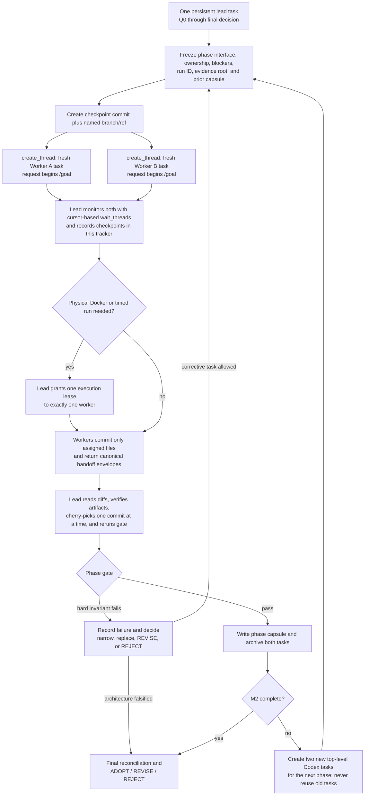

# Stage 04.6 MPLA PoC progress tracker

Status: `IN_PROGRESS`  
Current phase: `M2 worker implementation`  
Current gate: `host-only scale/fault build and focused verification`  
Lead agent: `Codex task 019fa207-1e75-75a0-a714-664e03e8d3c6 on local`  
Active run ID: `m2-20260727T230353p0800`  
Started at: `2026-07-27T13:07:03+08:00`  
Last updated at: `2026-07-27T23:15:02+08:00`

## 1. Authority and update protocol

This is the authoritative implementation and verification tracker for the Stage 04.6 MPLA PoC.

- The persistent lead agent is the only writer to this file.
- Phase workers must not edit this file. They return the structured handoff required by their prompt; the lead incorporates it here.
- Update this tracker after qualification, every worker handoff, every gate decision, every failed invariant, and every evidence-suite run.
- Never erase a failure. Superseded results remain in the run ledger with their artifact path.
- A test is `PASS` only when its evidence artifact exists and its oracle and resource gates pass. Successful process exit alone is insufficient.
- Use absolute artifact paths and exact commands. Do not write “tests pass” without a run ID.

Allowed status values:

| Status | Meaning |
| --- | --- |
| `NOT_STARTED` | No implementation or qualifying run has begun |
| `IN_PROGRESS` | Assigned and actively being implemented or verified |
| `BLOCKED` | Cannot proceed without a named dependency or decision |
| `PASS` | Required implementation, oracle, limits, and artifact are verified |
| `FAIL` | A required invariant or threshold failed |
| `UNKNOWN` | Evidence is insufficient or a required control is incompatible |
| `INCOMPLETE` | Executed only partially or without all required artifacts |

`SKIPPED` is not a completion status for any SM or HV row.

## 2. Governing documents

Read these before implementation and at every phase rotation:

- `requirements_and_prohibitions.md`: normative authority.
- `new_plan.md`: selected product architecture.
- `test_matrix.md`: authoritative PoC test definitions.
- `implementation_plan.md`: implementation-ready PoC design and file sequence.
- `/Users/yifanxu/Ephemeral-AI-Lab/ephemeral-sandbox/AGENTS.md`
- `/Users/yifanxu/Ephemeral-AI-Lab/ephemeral-sandbox/CLAUDE.md`
- `/Users/yifanxu/Ephemeral-AI-Lab/ephemeral-sandbox/docs/maintainer-architecture.md`

If these conflict, record the conflict in §12 and stop the affected work. Normative requirements and the test matrix take precedence over this tracker and the prompts.

## 3. Time and agent budget

AI-agent estimates include implementation, compilation, Docker integration, debugging, verification, and reruns.

| Gate | Target cumulative elapsed | Replan threshold | Target cumulative agent-hours | Actual start | Actual finish | Actual agent-hours | Status |
| --- | ---: | ---: | ---: | --- | --- | ---: | --- |
| Q0 real OverlayFS receipt | 30–60 min | 90 min | 0.5–1 | 2026-07-27T13:07:03+08:00 | 2026-07-27T14:02:45+08:00 | 1.8 | `PASS` |
| M0 stationary-adoption falsifier | 3–5 h | 8 h | 4–7 | 2026-07-27T14:02:45+08:00 | 2026-07-27T14:18:15+08:00 | 2.2 cumulative | `PASS` |
| M1 complete smoke evidence | 7–11 h | 24 h | 18–28 | 2026-07-27T14:27:33+08:00 | 2026-07-27T22:54:31+08:00 | 16.7 cumulative | `PASS` |
| M2 adoption-decision evidence | 12–20 h | 48 h | 36–55 | 2026-07-27T23:03:53+08:00 | — | 16.8 cumulative at checkpoint preparation | `IN_PROGRESS` |

Reaching a replan threshold does not permit weaker durability, smaller fixtures, higher memory limits, or omitted tests. Record the blocker and issue a narrower corrective plan.

## 4. Codex task rotation and monitoring

The lead remains in one Codex task from Q0 through the final recommendation. Each worker runs in a newly created, top-level Codex task/session visible in the Codex task list, with an isolated git worktree. Do not use subagents. Worker tasks are completed and archived at each gate, then replaced with fresh tasks using the next phase prompts.

Every initial worker request must begin with the literal characters `/goal `. Each prompt file under `prompts/` is formatted that way. The lead must not prepend greetings, metadata, or commentary before `/goal`.

| Rotation | Prompt A | Prompt B | Task A thread/host | Task A cursor | Task B thread/host | Task B cursor | Checkpoint SHA/ref | Status |
| --- | --- | --- | --- | --- | --- | --- | --- | --- | --- |
| M0 | `prompts/m0_worker_a_qualification.md` | `prompts/m0_worker_b_durability.md` | `019fa211-4de5-7251-b94b-fd9c4cf76d62` / `local` | `5b33f554-edff-4879-994e-9edd19bfc335:11` | `019fa211-4de5-7251-b94b-fd7579a1e526` / `local` | `819b229d-6dfa-40c3-9c55-280c651b1bfe:10` | `4fef50e63` / `mpla-poc/m0-checkpoint-20260727T130703p0800` | `PASS` |
| M1 | `prompts/m1_worker_a_semantics.md` | `prompts/m1_worker_b_recovery.md` | `019fa245-cba9-78e0-9362-05e89ac08eca` / `local` | `0a7dce8a-3437-4538-8275-7ef3215b6b72:92` | `019fa246-6f95-72e0-912c-6529a9ab0b2a` / `local` | `ac405121-a677-48ab-9ecc-e8a0b67a09de:7` | `650ef4422` / `mpla-poc/m1-checkpoint-20260727T142733p0800` | `PASS` |
| M2 | `prompts/m2_worker_a_scale.md` | `prompts/m2_worker_b_faults.md` | `019fa424-4437-76c3-af73-76a2e84905dd` / `local` | `0e627e25-2d23-4104-91dd-27575b8f4a73:1` | `019fa424-4437-76c3-af73-7689d9413f78` / `local` | `dbbfe292-01cb-4bb5-918a-0347cae71afa:1` | `addc2d311655ed4452e1f9bf4f6127a77ab75bea` / `mpla-poc/m2-checkpoint-20260727T230353p0800` | `IN_PROGRESS` |

### 4.1 Creation and integration protocol

Before creating a phase’s worker tasks, the lead must:

1. Receive and integrate both prior task handoffs, if any.
2. Inspect and verify the integrated diff.
3. Update this tracker’s gate, ownership, interfaces, blockers, and handoff capsule.
4. Create a local phase-checkpoint commit containing only PoC-owned changes and a named local branch/ref pointing to it; never include unrelated user changes and never push.
5. Resolve the saved `ephemeral-sandbox` project with `list_projects`.
6. Call `create_thread` twice, using isolated `worktree` environments based on that branch/ref. Record the commit SHA for verification; do not assume the API accepts a raw SHA as its starting state.
7. Build each initial request from the complete phase prompt, beginning with `/goal `, followed by a clearly delimited lead assignment capsule. The capsule records checkpoint SHA/ref, interface version, exclusive paths, run ID, evidence root, current blockers, prior phase capsule, and physical execution-lease status. Never prepend text before `/goal `.
8. Record each returned `threadId`, `hostId`, and initial cursor immediately. A `clientThreadId` is setup-in-progress: resolve the ready task through task listing/waiting and never use the client ID as a ready thread ID.

Each worker commits only its assigned files in its isolated worktree and reports the commit SHA. The lead reviews and cherry-picks one worker commit at a time, runs focused verification after each, and records the integration SHA. Workers never edit the lead’s tracker.

### 4.2 Monitoring protocol

The lead must actively monitor both worker tasks while continuing lead-owned work:

1. Take an immediate `wait_threads` snapshot after both tasks are ready.
2. Wait on both tasks together with their last cursors and a bounded timeout, normally 120 seconds.
3. Persist every new cursor in the rotation table so completed output is not delivered twice.
4. Record meaningful task checkpoints in §4.3: `STARTED`, `DISCOVERY_COMPLETE`, `FIRST_BUILD`, `FOCUSED_TESTS`, `NEEDS_ATTENTION`, and `HANDOFF_READY`. Record actual commands and test runs separately in §11.
5. Prefer `wait_threads` snapshots over repeated full reads. Use `read_thread` only when a blocker or handoff needs detail.
6. If a task reports `NEEDS_ATTENTION`, answer with `send_message_to_thread` promptly and record the decision in §12.
7. If a task shows no concrete progress across three consecutive snapshots, inspect its latest turn, narrow the assignment, or stop and replace the task. Do not let it silently consume the phase budget.
8. Do not send status probes more frequently than necessary and do not interrupt a known long build/test merely because a wait timed out.
9. A task is not complete until its final handoff includes a scoped commit SHA, commands/results, artifacts, failures, and requested lead changes.
10. After cherry-pick and lead verification, archive the completed worker task. Do not reuse it in the next phase.
11. If a task is waiting for user input or an approval the lead cannot provide, mark it `NEEDS_ATTENTION` and surface the exact request to the user; do not manufacture authorization.
12. Route interface clarification and overlap decisions through the lead. Workers do not coordinate shared contracts or merge each other’s changes directly.
13. Do not open the next phase until both current handoffs are accepted or explicitly rejected and the phase capsule is complete.

The lead reports a concise user-facing status at Q0, M0, M1, and M2 and whenever a hard invariant fails.

### 4.3 Active-task monitor

The lead updates this table from cursor-based snapshots. “Progress” must name a file, build, test, artifact, or concrete blocker.

| Phase/worker | Thread/host | Last cursor | Last checkpoint | Last concrete progress | Needs attention | Lead response | Next check | State |
| --- | --- | --- | --- | --- | --- | --- | --- | --- |
| Current A | `019fa424-4437-76c3-af73-76a2e84905dd` / `local` | `0e627e25-2d23-4104-91dd-27575b8f4a73:1` | STARTED | Verified assignment receipt and is checking the exact checkpoint, scope/rules, M1 PASS evidence, and lease status | None; physical execution remains correctly lease-gated | Continue host-only implementation and focused verification | Cursor-based wait while lead builds aggregate heavy harness | `ACTIVE` |
| Current B | `019fa424-4437-76c3-af73-7689d9413f78` / `local` | `dbbfe292-01cb-4bb5-918a-0347cae71afa:1` | STARTED | Confirmed base/run, began governing/interface/M1 journal reads, and remains host-only | None; physical execution remains correctly lease-gated | Continue host-only recovery/evacuation implementation and focused verification | Cursor-based wait while lead builds aggregate heavy harness | `ACTIVE` |

### 4.4 Physical execution lease

Compilation and pure unit tests may run concurrently. Real Docker/OverlayFS, crash, memory, storage, R0, and timed performance cases require a lead-issued execution lease.

- Only one measured physical campaign may run at a time on the fixed 4-vCPU/4-GiB Docker Desktop environment.
- The lead records the task, run ID, fixture, start, expected hard stop, and release below.
- A worker must request `NEEDS_ATTENTION: EXECUTION_LEASE` before starting a physical run if no lease was assigned in its task request.
- Worker artifacts are developmental evidence. M1/M2 gate evidence becomes authoritative only after the lead integrates both worker commits and reruns the required suite from the lead branch.
- A timed-out or crashed holder retains the lease until the lead verifies cleanup and releases it.

| Lease state | Holder thread/host | Run ID | Fixture/test | Granted at | Hard stop | Released at | Cleanup verified |
| --- | --- | --- | --- | --- | --- | --- | --- |
| `RELEASED` | `019fa211-4de5-7251-b94b-fd9c4cf76d62` / `local` | `m0-20260727T130703p0800` | Q0 / SM-01 real Docker and OverlayFS qualification only | 2026-07-27T13:35:18+08:00 | 2026-07-27T14:35:18+08:00 | 2026-07-27T14:02:45+08:00 | Exact stopped container and four exact run-labeled volumes removed; independent label queries found containers=0, live containers=0, volumes=0 |
| `RELEASED` | Lead `019fa207-1e75-75a0-a714-664e03e8d3c6` / `local` | `m0-20260727T130703p0800` | M0 real stationary allocation/OverlayFS lifecycle plus owner-selector SIGKILL edges only | 2026-07-27T14:07:10+08:00 | 2026-07-27T15:07:10+08:00 | 2026-07-27T14:17:30+08:00 | Both exact stopped containers and all three exact run-scoped volumes removed; exact-name and run-label queries found containers=0, live containers=0, volumes=0 |
| `RELEASED` | Lead `019fa207-1e75-75a0-a714-664e03e8d3c6` / `local` | `m1-diag11-20260727` | Fresh S1/S5 preparation plus SM-03 and SM-14 release-build optimization diagnostics only | 2026-07-27T20:02:00+08:00 | 2026-07-27T21:02:00+08:00 | 2026-07-27T20:06:00+08:00 | Evidence copied to the immutable diagnostic archive; exact container and four volumes removed; exact run-label queries found containers=0, live containers=0, volumes=0 |
| `RELEASED` | Lead `019fa207-1e75-75a0-a714-664e03e8d3c6` / `local` | `m1-diag12-20260727` | Fresh S1/S5 preparation plus SM-03 and SM-14 release-build remeasurement only | 2026-07-27T20:12:30+08:00 | 2026-07-27T21:12:30+08:00 | 2026-07-27T20:17:54+08:00 | Evidence archived under `evidence/diagnostics/m1-diag12-20260727`; exact container/four volumes removed; container/live-container/volume label queries all zero |
| `RELEASED` | Lead `019fa207-1e75-75a0-a714-664e03e8d3c6` / `local` | `m1-diag13-20260727` | Fresh smoke fixture preparation plus SM-14 direct-readiness remeasurement only | 2026-07-27T20:23:12+08:00 | 2026-07-27T21:23:12+08:00 | 2026-07-27T20:28:30+08:00 | Fresh preparation and one SM-14 run completed; immutable evidence archived, exact container and four volumes removed, and exact run-label queries found containers=0, live containers=0, volumes=0 |
| `RELEASED` | Lead `019fa207-1e75-75a0-a714-664e03e8d3c6` / `local` | `m1-diag14-20260727` | Fresh smoke fixture preparation plus SM-14 dedicated-readiness/warm-up remeasurement only | 2026-07-27T20:36:52+08:00 | 2026-07-27T21:36:52+08:00 | 2026-07-27T20:46:48+08:00 | Fresh preparation and one SM-14 run completed; immutable evidence archived, exact container and four volumes removed, and exact run-label queries found containers=0, live containers=0, volumes=0 |
| `RELEASED` | Lead `019fa207-1e75-75a0-a714-664e03e8d3c6` / `local` | `m1-diag15-20260727` | Fresh smoke fixture preparation plus SM-14 cold forked-adapter direct-syscall readiness remeasurement only | 2026-07-27T20:54:03+08:00 | 2026-07-27T21:54:03+08:00 | 2026-07-27T20:59:00+08:00 | Fresh preparation and one SM-14 run completed; immutable evidence archived, exact container and four volumes removed, and exact run-label queries found containers=0, live containers=0, volumes=0 |
| `RELEASED` | Lead `019fa207-1e75-75a0-a714-664e03e8d3c6` / `local` | `m1-diag16-20260727` | Fresh smoke fixture preparation plus one SM-14 inherited-cgroup direct-syscall readiness remeasurement only | 2026-07-27T21:03:56+08:00 | 2026-07-27T22:03:56+08:00 | 2026-07-27T21:07:00+08:00 | Fresh preparation and one SM-14 run completed; immutable evidence archived, exact container and four volumes removed, and exact run-label queries found containers=0, live containers=0, volumes=0 |
| `RELEASED` | Lead `019fa207-1e75-75a0-a714-664e03e8d3c6` / `local` | `m1-diag17-20260727` | Fresh smoke fixture preparation plus one SM-14 prepared-squash-selection remeasurement only | 2026-07-27T21:19:37+08:00 | 2026-07-27T22:19:37+08:00 | 2026-07-27T21:25:18+08:00 | Fresh preparation and SM-14 passed; immutable evidence archived, exact container and four volumes removed, and exact run-label queries found containers=0, live containers=0, volumes=0 |
| `RELEASED` | Lead `019fa207-1e75-75a0-a714-664e03e8d3c6` / `local` | `m1-20260727T142733p0800` | Authoritative fresh fixture preparation plus complete SM-01 through SM-14 smoke campaign only | 2026-07-27T21:27:58+08:00 | 2026-07-27T22:27:58+08:00 | 2026-07-27T21:33:01+08:00 | Fresh preparation passed; the complete campaign ran and failed closed in SM-06, SM-10, and downstream SM-13 reconciliation. The full evidence tree was copied to immutable diagnostic archive `m1-full-attempt-7-20260727`; the exact container and four volumes were removed, and exact run-label queries found containers=0, live containers=0, volumes=0. |
| `RELEASED` | Lead `019fa207-1e75-75a0-a714-664e03e8d3c6` / `local` | `m1-20260727T142733p0800` | Fresh attempt 8 fixture preparation plus complete SM-01 through SM-14 only | 2026-07-27T21:41:31+08:00 | 2026-07-27T22:41:31+08:00 | 2026-07-27T21:44:32+08:00 | Fresh preparation passed; the campaign fixed SM-10 but failed SM-06 root equivalence/campaign budget and SM-13 case budget. The full evidence tree was copied to immutable diagnostic archive `m1-full-attempt-8-20260727`; the exact container and four volumes were removed, and exact run-label queries found containers=0, live containers=0, volumes=0. |
| `RELEASED` | Lead `019fa207-1e75-75a0-a714-664e03e8d3c6` / `local` | `m1-20260727T142733p0800` | Fresh attempt 9 fixture preparation plus complete SM-01 through SM-14 only | 2026-07-27T21:54:57+08:00 | 2026-07-27T22:54:57+08:00 | 2026-07-27T22:03:26+08:00 | Fresh preparation passed; the campaign failed closed in SM-06 root equivalence/campaign budget, SM-14 activation budget, and SM-13 case budget. The full evidence tree was copied to immutable diagnostic archive `m1-full-attempt-9-20260727`; exact container and four volumes were removed, exact run-label queries found containers=0, live containers=0, volumes=0, and the authoritative run path remained absent. |
| `RELEASED` | Lead `019fa207-1e75-75a0-a714-664e03e8d3c6` / `local` | `m1-20260727T142733p0800` | Fresh attempt 10 fixture preparation plus complete SM-01 through SM-14 only | 2026-07-27T22:10:00+08:00 | 2026-07-27T23:10:00+08:00 | 2026-07-27T22:11:41+08:00 | Preparation failed immediately and fail-closed before fixture mutation because the container supplied unprefixed root variables while the frozen test contract requires `MPLA_POC_*` names. The exact container and four volumes were removed; exact run-label queries found containers=0, live containers=0, volumes=0, and the authoritative run path remained absent. |
| `RELEASED` | Lead `019fa207-1e75-75a0-a714-664e03e8d3c6` / `local` | `m1-20260727T142733p0800` | Fresh attempt 11 fixture preparation plus complete SM-01 through SM-14 only | 2026-07-27T22:12:00+08:00 | 2026-07-27T23:12:00+08:00 | 2026-07-27T22:16:16+08:00 | Fresh preparation passed; the campaign failed closed in SM-06 root equivalence/campaign budget, SM-14 squash service budget, and SM-13 case budget. The full evidence and exact compared semantic streams were copied to unique immutable diagnostic archives; exact container and four volumes were removed, exact run-label queries found containers=0, live containers=0, volumes=0, and the authoritative run path remained absent. |
| `RELEASED` | Lead `019fa207-1e75-75a0-a714-664e03e8d3c6` / `local` | `m1-20260727T142733p0800` | Fresh attempt 12 fixture preparation plus complete SM-01 through SM-14 only | 2026-07-27T22:26:41+08:00 | 2026-07-27T23:26:41+08:00 | 2026-07-27T22:32:52+08:00 | Fresh preparation passed and all fourteen rows ran. SM-13/SM-14 and all SM-06 speed gates passed; SM-06 failed closed only on root equivalence. Full evidence and exact compared streams were archived; exact container/four volumes were removed, exact run-label queries found containers=0, live containers=0, volumes=0, and the authoritative path remained absent. |
| `RELEASED` | Lead `019fa207-1e75-75a0-a714-664e03e8d3c6` / `local` | `m1-20260727T142733p0800` | Fresh attempt 13 fixture preparation plus complete SM-01 through SM-14 only | 2026-07-27T22:36:57+08:00 | 2026-07-27T23:36:57+08:00 | 2026-07-27T22:43:53+08:00 | Fresh preparation passed and all fourteen rows ran. All cases except SM-06 passed; SM-06 passed every speed/resource gate and failed only root equivalence. Full evidence and exact compared streams were archived; the exact container/four volumes were removed, exact run-label queries found containers=0, live containers=0, volumes=0, and the authoritative path remained absent. |
| `RELEASED` | Lead `019fa207-1e75-75a0-a714-664e03e8d3c6` / `local` | `m1-20260727T142733p0800` | Fresh attempt 14 fixture preparation plus complete SM-01 through SM-14 only | 2026-07-27T22:49:35+08:00 | 2026-07-27T23:49:35+08:00 | 2026-07-27T22:54:31+08:00 | Fresh preparation and all fourteen smoke cases passed. The 36-file authoritative tree was sealed, verified, and copied to the exact M1 run path; the exact container and four volumes were removed, and exact run-label queries found containers=0, live containers=0, volumes=0. |

### 4.5 Cumulative-lead workflow



There is no worker-to-worker control edge. All interface changes, execution-lease grants, blockers, commit integration, and gate decisions pass through the persistent lead and this tracker.

## 5. File ownership and interface register

### 5.1 Permanent lead-owned files

The lead exclusively owns:

- `ephemeral-sandbox/Cargo.toml`
- `crates/sandbox-runtime/mpla-poc/Cargo.toml`
- `src/lib.rs`
- `src/config.rs`
- shared ID, error, state, protocol, and evidence-schema definitions
- `bin/mpla-poc`
- aggregate test modules and suite dispatch
- this progress tracker

Workers may request changes to these files in their handoff. They must not edit them.

### 5.2 Current exclusive ownership

| Path or module | Owner | Phase | Interface version | Status | Notes |
| --- | --- | --- | --- | --- | --- |
| Workspace skeleton/shared contracts | Lead | M0–M2 | `m2-iface-v1` | `PASS` | Frozen at `addc2d311655ed4452e1f9bf4f6127a77ab75bea`, with lead-owned additive commit `582f82b63e69214f919d9295652bed54530078ec`: M0/M1 contracts plus fixed heavy envelope, FIFO promotion of already-admitted guards, exact durable locator replacement, current-I2 controls, complete named faultpoint registry, report/evidence API, and the evacuation module boundary |
| Qualification/evidence modules | M0 Worker A | M0 | `m0-iface-v1` | `PASS` | Integrated as `e7b317615`; physical qualification SHA-256 `d27b25985a92a3cfb432fc5c7f21345be0d6d23533094a3b53f0b8d0ed6764ba` |
| Allocation/durable owner/lease modules | M0 Worker B | M0 | `m0-iface-v1` | `PASS` | Integrated as `242459275`; nine focused tests plus lead physical owner crash recovery passed |
| Execution/quiescence/publication modules | Lead | M0 | `m0-lead-v1` | `PASS` | Core `b48931ad6`, physical falsifiers `35bf14a91`, and adopted-process reap fix `4889350f2`; real lifecycle and both owner-selector SIGKILL edges passed |
| Semantic scanner/Merkle/oracle modules | M2 Worker A | M2 | `m2-iface-v1` | `IN_PROGRESS` | Task `019fa424-4437-76c3-af73-76a2e84905dd`; exclusive paths: `src/semantic/**`, `src/oracle_scan.rs`, `src/oracle_record.rs`, `src/bin/mpla-poc-oracle.rs`, existing semantic/oracle tests, and new standalone `tests/heavy_scale.rs`; implements HV-01–HV-04 only |
| Recovery/evacuation modules | M2 Worker B | M2 | `m2-iface-v1` | `IN_PROGRESS` | Task `019fa424-4437-76c3-af73-7689d9413f78`; exclusive paths: `src/recovery.rs`, `src/evacuation.rs`, new `tests/crash_matrix.rs`, and new standalone `tests/heavy_faults.rs`; implements HV-06/07/09 without locator/ref/OCC ownership unless explicitly transferred |
| Activation/projection/resources/controls/CLI/report | Lead | M2 | `m2-iface-v1` | `IN_PROGRESS` | Lead owns HV-05, exact R0/HV-08, HV-10, aggregate heavy scheduling, artifact verification, physical leases, and final reconciliation |

### 5.3 Interface freezes

| Version | Phase | Types/functions frozen | Consumer agents | Verification command | Status |
| --- | --- | --- | --- | --- | --- |
| `m0-iface-v1` | M0 | `RunId`, `AllocationId`, `SessionId`, `OperationId`, `PublicationId`, `ActivationOperationId`; fixed `PocConfig`; `OwnerGeneration`, `OwnerSubject`, `SessionPhase`, `PublicationPhase`; allocation/lease/stable/adoption/qualification records; evidence schemas; exact public signatures in the seven worker modules | M0 A/B | `cargo clippy -p sandbox-runtime-mpla-poc --all-targets -- -D warnings && cargo test -p sandbox-runtime-mpla-poc --test config_roundtrip` | `PASS` |
| `m0-lead-v1` (additive; worker interface unchanged) | M0 | Lead-owned `overlay_adapter`, `process_tree`, `session`, `quiesce`, `publication`, `inventory`, and `fault` modules; direct real OverlayFS mount/strict-unmount, terminal Sealing, process/cgroup audit, syncfs, double inventory, stationary adoption receipt | Lead only | `cargo clippy -p sandbox-runtime-mpla-poc --all-targets -- -D warnings && cargo test -p sandbox-runtime-mpla-poc --test session_overlay --test stationary_publish --test config_roundtrip` | `PASS` |
| `m1-iface-v1` | M1 | `RootId`, `AttributionRootId`, `LocatorGeneration`, `RefSequence`; `CanonicalRootPair`, semantic request/receipt/phase/durability records, paired ref and locator durability records; fixed 32-KiB scan window, 4-MiB spool run, fan-in 8, 16 data FDs, 16-way trie, four data workers/8-MiB pool; complete compile-time named faultpoint registry and deterministic host injector; independent `mpla-poc-oracle` binary boundary | M1 A/B | `cargo fmt --check --manifest-path crates/sandbox-runtime/mpla-poc/Cargo.toml && cargo clippy --manifest-path crates/sandbox-runtime/mpla-poc/Cargo.toml --all-targets -- -D warnings && cargo test --manifest-path crates/sandbox-runtime/mpla-poc/Cargo.toml --all-targets && cargo check --target aarch64-unknown-linux-musl --manifest-path crates/sandbox-runtime/mpla-poc/Cargo.toml --all-targets` | `PASS` |
| `m2-iface-v1` | M2 | All `m1-iface-v1` identities and durability semantics unchanged; fixed `PocConfig` 4-vCPU/4-GiB, 8/96/128-MiB envelope; `AdmissionController` four-active/16-coordinator/16-descriptor/64-KiB typed-overload contract plus FIFO `AdmissionGuard::try_promote`; exact compare-and-replace `LocatorStore::replace_exact` with forward/reverse generation durability; current-I2 control receipts and exact cache/boundary classifications; heavy fixture plans; complete `NamedFaultPoint::ALL`; recovery, report, manifest seal/verify, physical reconciliation, and `evacuation` module boundaries | M2 A/B | `cargo fmt --check --manifest-path crates/sandbox-runtime/mpla-poc/Cargo.toml && cargo clippy --manifest-path crates/sandbox-runtime/mpla-poc/Cargo.toml --all-targets --no-deps -- -D warnings && cargo test --manifest-path crates/sandbox-runtime/mpla-poc/Cargo.toml --all-targets && cargo zigbuild --manifest-path crates/sandbox-runtime/mpla-poc/Cargo.toml --target aarch64-unknown-linux-musl --release --bins --tests` | `PASS` at checkpoint `addc2d311655ed4452e1f9bf4f6127a77ab75bea`; additive interface `PASS` at `582f82b63e69214f919d9295652bed54530078ec` |

An interface change after freeze is lead-owned. Record its affected workers and dependent tests before editing.

## 6. Q0 and M0 gate

### 6.1 Qualification receipt

| Requirement | Status | Evidence |
| --- | --- | --- |
| Docker Desktop reports exactly 4 vCPU and 4 GiB | `PASS` | `environment/qualification.json`: 4 CPUs, 4,294,967,296-byte configured memory |
| Qualified Linux/arm64 Ubuntu 24.04 image digest | `PASS` | Exact cached digest `sha256:4fbb8e6a8395de5a7550b33509421a2bafbc0aab6c06ba2cef9ebffbc7092d90`; Linux `arm64`, kernel `6.12.76-linuxkit` |
| Real OverlayFS mount and strict unmount work | `PASS` | Qualification probes include real mount, strict unmount, and `mount_absent_after_unmount=passed` |
| Whiteouts, opaque dirs, and required xattrs work | `PASS` | Qualification receipt has 41 probes and an empty mandatory-failure set |
| Payload and control volumes have distinct mount IDs | `PASS` | Receipt observed payload mount ID 144 and control mount ID 145 |
| cgroup v2, pidfd, syncfs, memory and OOM counters available | `PASS` | Q0 Linux/arm64 mandatory probes passed |
| Permanent upper and adjacent workdir verified | `PASS` | Q0 receipt used AllocationId `f57c3ba2-d2cf-4ef5-a8b9-649adb30e1fd` under the permanent arena |
| Qualification JSON is durable and schema-valid | `PASS` | `/Users/yifanxu/Ephemeral-AI-Lab/experiment/mpla-poc-20260727/evidence/runs/m0-20260727T130703p0800/environment/qualification.json`, SHA-256 `d27b25985a92a3cfb432fc5c7f21345be0d6d23533094a3b53f0b8d0ed6764ba` |

### 6.2 M0 invariant checklist

| Invariant | Status | Evidence or failure artifact |
| --- | --- | --- |
| PayloadStore creates a permanent allocation and stable `AllocationId` | `PASS` | Lifecycle allocation `99fef003-226c-4650-875c-caaf8c541f3e` at one final two-character-fanout path |
| Epoch-fenced mutable lease admits only the current session | `PASS` | Nine allocation/owner host tests plus lifecycle stale-capability checks |
| Real OCI execution uses the allocation as OverlayFS upper | `PASS` | Exact arm64 Ubuntu container ran the 10,000-file/128-MiB lifecycle through the permanent upper |
| Closing fences new commands and drains admitted commands | `PASS` | Physical holder drain plus host command-admission fencing; post-Sealing execute returned `StaleCapability` |
| Durable `Sealing` makes the old session terminal | `PASS` | `/Users/yifanxu/Ephemeral-AI-Lab/experiment/mpla-poc-20260727/evidence/runs/m0-20260727T130703p0800/cases/M0/stationary-lifecycle.json` |
| Holder tree is stopped and reaped | `PASS` | Receipt records signaled PIDs 11/13; both audits empty and holder `/proc` entry absent |
| Writable FDs, mappings, mount references, and mount are drained | `PASS` | Pre-unmount and post-unmount audit arrays are all empty; strict unmount completed |
| Allocation is syncfs/fsync flushed and verified stable twice | `PASS` | Both inventory hashes equal `7951277a53fd7489622f9286b4e2ffc0aa39d8d7647e96c5c3383eabb0b1fefa` |
| Conditional owner transition yields exactly one owner | `PASS` | Selected `PayloadOwned` epoch 2 exactly matches publication `51bf930c-77d3-49a8-945e-74455147bfa5` |
| Allocation ID, path, representative inodes, and allocation bytes do not move | `PASS` | Before/after device 65025, path, 16 representative inodes, and 165,281,792 allocated bytes are identical |
| No rename, reflink, copy fallback, or second payload allocation occurs | `PASS` | Allocation set changed from zero to exactly one at create and remained that set through adoption; stationary path contains no payload-moving operation |
| Stale writer and deleter tokens fail before payload path access | `PASS` | Physical lifecycle rejects both; host test repeats with the payload deliberately inaccessible |
| Owner-edge crash replay is exact and idempotent | `PASS` | `/Users/yifanxu/Ephemeral-AI-Lab/experiment/mpla-poc-20260727/evidence/runs/m0-20260727T130703p0800/cases/M0/owner-selector-sigkill.json`, both before/after selector edges |

M0 verdict: `PASS`

If any row above is `FAIL`, stop the current architecture. Do not build M1 as a workaround.

## 7. Implementation work packages

| Step | Primary owner | Phase | Status | Verification | Changed files / handoff |
| --- | --- | --- | --- | --- | --- |
| 0. Workspace skeleton | Lead | M0 | `PASS` | Build, clippy, two config/run-ID tests, and wrapper JSON round trip | `Cargo.toml`, `Cargo.lock`, `bin/mpla-poc`, `crates/sandbox-runtime/mpla-poc/**` |
| 1. Evidence/qualification | M0 Worker A | M0 | `PASS` | SM-01 qualification slice: 41 probes, zero mandatory failures | Evidence root `/Users/yifanxu/Ephemeral-AI-Lab/experiment/mpla-poc-20260727/evidence/runs/m0-20260727T130703p0800` |
| 2. Permanent allocation and lease | M0 Worker B | M0 | `PASS` | Nine focused allocation/owner tests; worker commit integrated as `242459275` and independently verified | Permanent arena root `/var/lib/mpla-poc/payload/allocations` in the qualified container |
| 3. Execution/quiescence | Lead | M0 | `PASS` | Host/Linux checks plus real lifecycle with holder drain, strict unmount, syncfs, double inventory | Commits `b48931ad6`, `35bf14a91`, `4889350f2` |
| 4. First stationary publish | Lead | M0 | `PASS` | Real stationary publish plus real SIGKILL immediately before/after owner selector replacement | `cases/M0/stationary-lifecycle.json`, `cases/M0/owner-selector-sigkill.json` |
| 5. Bounded semantic engine | M1 Worker A, then M2 Worker A | M1–M2 | `PASS` for M1; M2 scale pending | semantic vectors/spool bounds plus SM-03/06/07/08/09 | Integrated as `2cd67cd25`; authoritative candidate/full and independent-oracle smoke evidence passed with bounded input/FD/memory behavior |
| 6. Independent oracle | M1 Worker A, then M2 Worker A | M1–M2 | `PASS` for M1; M2 scale pending | independent record/root comparison | SM-09 candidate/oracle/substitution record stream, root, and attribution IDs match exactly; M2 extends the same boundary to scale |
| 7. Locator and paired refs | M1 Worker B | M1 | `PASS` | locator/ref/OCC recovery | Ten host-only locator/ref/OCC/replay tests, scoped warnings-denied clippy, and Linux/arm64 cross-build pass; worker integration `704d9b4cb`, lead expected-parent correction `1ce046626` |
| 8. Activation and projection | Lead | M1–M2 | `PASS` for M1; M2 scale pending | SM-05/06/14 and HV-05/08/10 | Authoritative smoke activation/projection passed; fresh upper inherits the selected payload-root metadata before mount, exact readiness is 6.60–7.26 ms, and squash service is 0.183–0.440 ms |
| 9. Resources and reconciliation | Lead | M1–M2 | `PASS` for M1; M2 scale pending | limits and `X_unexplained=0` | M1 peak 103071744 bytes, max/OOM/OOM-kill zero, physical bytes/inodes exactly classified, `X_unexplained=0`, and five leak counts zero |
| 10. Current controls and R0 | Lead | M1–M2 | `PASS` for M1 boundary; M2 R0 pending | matched control receipt | Direct programmatic LayerStack controls and exported-catalog binding are verified; the exact preserved R0 campaign and matched heavy control blocks remain M2 lead-owned |
| 11. Evacuation and crash sweep | M2 Worker B | M2 | `NOT_STARTED` | HV-07/HV-09 | — |
| 12. Campaign CLI and reporting | Lead | M1–M2 | `PASS` for M1; M2 heavy pending | artifact-schema verification | M1 36-file authoritative evidence tree sealed and independently verified; aggregate heavy dispatcher and M2 terminal summary remain pending |

## 8. Smoke traceability

The lead updates every row from a concrete run. M0 sentinel coverage does not make M1 complete.

| Test | Primary implementation owner | Status | Last run ID | Wall time | Artifact path | Failure / next action |
| --- | --- | --- | --- | ---: | --- | --- |
| SM-01 | M0 Worker A + Lead | `PASS` | `m1-20260727T142733p0800` | 0.000145 s | `/Users/yifanxu/Ephemeral-AI-Lab/experiment/mpla-poc-20260727/evidence/runs/m1-20260727T142733p0800/cases/SM-01/result.json` | Fresh M1 stationary-environment gate passed; frozen M0 qualification is included in the sealed M1 evidence tree |
| SM-02 | Lead | `PASS` | `m1-20260727T142733p0800` | 0.014095 s | `/Users/yifanxu/Ephemeral-AI-Lab/experiment/mpla-poc-20260727/evidence/runs/m1-20260727T142733p0800/cases/SM-02/result.json` | Allocation and lease behavior passed |
| SM-03 | Lead + M1 Worker A/B | `PASS` | `m1-20260727T142733p0800` | 1.036512 s | `/Users/yifanxu/Ephemeral-AI-Lab/experiment/mpla-poc-20260727/evidence/runs/m1-20260727T142733p0800/cases/SM-03/result.json` | Stationary publication, canonical build, durable ref, and no-payload-read evidence passed |
| SM-04 | M0 Worker B + Lead | `PASS` | `m1-20260727T142733p0800` | 0.001882 s | `/Users/yifanxu/Ephemeral-AI-Lab/experiment/mpla-poc-20260727/evidence/runs/m1-20260727T142733p0800/cases/SM-04/result.json` | Stale capability fencing passed |
| SM-05 | Lead | `PASS` | `m1-20260727T142733p0800` | 0.041174 s | `/Users/yifanxu/Ephemeral-AI-Lab/experiment/mpla-poc-20260727/evidence/runs/m1-20260727T142733p0800/cases/SM-05/result.json` | Activation/retirement lifecycle passed |
| SM-06 | M1 Worker A + Lead | `PASS` | `m1-20260727T142733p0800` | 2.909603 s | `/Users/yifanxu/Ephemeral-AI-Lab/experiment/mpla-poc-20260727/evidence/runs/m1-20260727T142733p0800/cases/SM-06/details.json` | Sixteen-hit campaign 1.263372 s; incremental and forced streams/roots agree at 29,835 records; affected input is 370 bytes/hit and immutable payload reads are zero |
| SM-07 | M1 Worker A | `PASS` | `m1-20260727T142733p0800` | 0.384511 s | `/Users/yifanxu/Ephemeral-AI-Lab/experiment/mpla-poc-20260727/evidence/runs/m1-20260727T142733p0800/cases/SM-07/result.json` | Independent incremental/full equivalence gate passed |
| SM-08 | M1 Worker A + Lead | `PASS` | `m1-20260727T142733p0800` | 6.508896 s | `/Users/yifanxu/Ephemeral-AI-Lab/experiment/mpla-poc-20260727/evidence/runs/m1-20260727T142733p0800/cases/SM-08/result.json` | Bounded semantic stress gate passed |
| SM-09 | M1 Worker A | `PASS` | `m1-20260727T142733p0800` | 4.282541 s | `/Users/yifanxu/Ephemeral-AI-Lab/experiment/mpla-poc-20260727/evidence/runs/m1-20260727T142733p0800/cases/SM-09/details.json` | Candidate, independent oracle, and physical substitution match record stream, root, and attribution IDs exactly |
| SM-10 | M1 Worker B + Lead | `PASS` | `m1-20260727T142733p0800` | 0.264782 s | `/Users/yifanxu/Ephemeral-AI-Lab/experiment/mpla-poc-20260727/evidence/runs/m1-20260727T142733p0800/cases/SM-10/result.json` | Five-publisher admission/selection gate passed |
| SM-11 | M1 Worker B | `PASS` | `m1-20260727T142733p0800` | 0.400643 s | `/Users/yifanxu/Ephemeral-AI-Lab/experiment/mpla-poc-20260727/evidence/runs/m1-20260727T142733p0800/cases/SM-11/result.json` | Competing-publisher OCC/ref selection passed |
| SM-12 | M1 Worker B + Lead | `PASS` | `m1-20260727T142733p0800` | 0.214719 s | `/Users/yifanxu/Ephemeral-AI-Lab/experiment/mpla-poc-20260727/evidence/runs/m1-20260727T142733p0800/cases/SM-12/result.json` | Real child-process recovery edge passed |
| SM-13 | Lead | `PASS` | `m1-20260727T142733p0800` | 0.941093 s | `/Users/yifanxu/Ephemeral-AI-Lab/experiment/mpla-poc-20260727/evidence/runs/m1-20260727T142733p0800/cases/SM-13/reconciliation.json` | Physical/classified bytes and inodes balance exactly; `X_unexplained=0`; all five leak counters are zero |
| SM-14 | Lead | `PASS` | `m1-20260727T142733p0800` | 3.552918 s | `/Users/yifanxu/Ephemeral-AI-Lab/experiment/mpla-poc-20260727/evidence/runs/m1-20260727T142733p0800/cases/SM-14/details.json` | Exported-catalog readiness passed; fork activations 6.60–7.26 ms and squash service 0.183–0.440 ms |

Smoke suite target: ≤150 seconds. Hard stop: <180 seconds.  
M1 verdict: `PASS`

## 9. Heavy traceability

| Test | Primary implementation owner | Status | Last run ID | Wall time | Artifact path | Failure / next action |
| --- | --- | --- | --- | ---: | --- | --- |
| HV-01 | M2 Worker A | `NOT_STARTED` | — | — | — | — |
| HV-02 | M2 Worker A | `NOT_STARTED` | — | — | — | — |
| HV-03 | M2 Worker A | `NOT_STARTED` | — | — | — | — |
| HV-04 | M2 Worker A | `NOT_STARTED` | — | — | — | — |
| HV-05 | Lead | `NOT_STARTED` | — | — | — | — |
| HV-06 | M2 Worker B + Lead | `NOT_STARTED` | — | — | — | — |
| HV-07 | M2 Worker B | `NOT_STARTED` | — | — | — | — |
| HV-08 | Lead | `NOT_STARTED` | — | — | — | — |
| HV-09 | M2 Worker B | `NOT_STARTED` | — | — | — | — |
| HV-10 | Lead | `NOT_STARTED` | — | — | — | — |

Heavy suite target: ≤480 seconds. Hard stop: <600 seconds.  
M2 verdict: `NOT_STARTED`

## 10. Resource and reconciliation dashboard

| Metric or invariant | Required | Latest observed | Run/artifact | Status |
| --- | --- | ---: | --- | --- |
| Docker CPUs | 4 | 4 | `m0-20260727T130703p0800` / `environment/qualification.json` | `PASS` |
| Docker memory | 4 GiB | 4,294,967,296 bytes | `m0-20260727T130703p0800` / `environment/qualification.json` | `PASS` |
| Candidate application pool | ≤8 MiB | 8,388,608 bytes | `m1-20260727T142733p0800` / environment and case receipts | `PASS` |
| Storage-domain `memory.high` | 96 MiB | 100,663,296 bytes | `m1-20260727T142733p0800` / environment receipt | `PASS` |
| Storage-domain `memory.max` | 128 MiB | 134,217,728 bytes | `m1-20260727T142733p0800` / environment receipt | `PASS` |
| Active data workers | ≤4 | 4 | `m1-20260727T142733p0800` / SM-10 | `PASS` |
| Queued logical-agent payload allocations | 0 | 0 | `m1-20260727T142733p0800` / SM-10 | `PASS` |
| Job 33 admission | typed overload | host contract only; heavy proof pending | `tests/resource_limits.rs` | `IN_PROGRESS` |
| OOM events | 0 | 0; OOM-kill 0; max 0 | `m1-20260727T142733p0800` / environment receipt | `PASS` |
| Unexplained physical storage | `X_unexplained=0` | 0 bytes; 0 inodes | `m1-20260727T142733p0800` / SM-13 | `PASS` |
| Leaked active leases/mounts/writable FDs | 0 | 0/0/0 | `m1-20260727T142733p0800` / SM-13 | `PASS` |

Do not change these limits to fix a test. A limit failure is design evidence.

## 11. Run and evidence ledger

Append one row for every meaningful build, test, suite, crash, or reconciliation run.

| Timestamp | Task/thread | Phase | Evidence class | Exact command | Run ID | Result | Duration | Artifact path | Notes |
| --- | --- | --- | --- | --- | --- | --- | ---: | --- | --- |
| 2026-07-27T13:13:52+08:00 | Lead `019fa1f2-f0a8-7aa1-b335-02a22bd223d9` | M0 | build | `cargo check -p sandbox-runtime-mpla-poc` | `m0-20260727T130703p0800` | `PASS` | 3.94 s | `/Users/yifanxu/Ephemeral-AI-Lab/ephemeral-sandbox/target/debug/mpla-poc` | Host build validates the new workspace member; it is not Q0 physical evidence. |
| 2026-07-27T13:14:31+08:00 | Lead `019fa1f2-f0a8-7aa1-b335-02a22bd223d9` | M0 | interface verification | `cargo clippy -p sandbox-runtime-mpla-poc --all-targets -- -D warnings && cargo test -p sandbox-runtime-mpla-poc --test config_roundtrip && bin/mpla-poc config` | `m0-20260727T130703p0800` | `PASS` | 10.03 s | `/Users/yifanxu/Ephemeral-AI-Lab/ephemeral-sandbox/target/debug/deps/config_roundtrip-ea3e27490cef3e7b` | Two tests passed; wrapper emitted schema-valid fixed config. This is not Q0 physical evidence. |
| 2026-07-27T13:32:18+08:00 | Lead `019fa207-1e75-75a0-a714-664e03e8d3c6` | M0 | interface re-verification | `cargo clippy -p sandbox-runtime-mpla-poc --all-targets -- -D warnings && cargo test -p sandbox-runtime-mpla-poc --test config_roundtrip && bin/mpla-poc config` | `m0-20260727T130703p0800` | `PASS` | 2.02 s | `/Users/yifanxu/Ephemeral-AI-Lab/ephemeral-sandbox/target/debug/deps/config_roundtrip-ea3e27490cef3e7b` | Current lead independently revalidated checkpoint `4fef50e63`; two tests passed and the wrapper emitted the fixed 4-vCPU/4-GiB, 8/96/128-MiB configuration. |
| 2026-07-27T13:33:20+08:00 | Lead `019fa207-1e75-75a0-a714-664e03e8d3c6` | M0 | required gateway rebuild | `bin/start-sandbox-docker-gateway --rebuild-binary` | `m0-20260727T130703p0800` | `PASS` | 49.71 s | `/tmp/eos-gateway.log` | Rebuilt and packaged `sandbox-daemon-linux-arm64` (`sha256:e3a7ba619f7b52daab703aca37f1b4cbb29114d9fe48d8f5b6968ccef238d9c9`); gateway started at `127.0.0.1:7878`. This is a build prerequisite, not Q0 physical evidence. |
| 2026-07-27T13:48:44+08:00 | Lead `019fa207-1e75-75a0-a714-664e03e8d3c6` | M0 | lead central-path verification | `cargo fmt --all && cargo clippy -p sandbox-runtime-mpla-poc --all-targets -- -D warnings && cargo test -p sandbox-runtime-mpla-poc --test session_overlay --test stationary_publish --test config_roundtrip` | `m0-20260727T130703p0800` | `PASS` | 9.18 s | `/Users/yifanxu/Ephemeral-AI-Lab/ephemeral-sandbox/target/debug/deps/session_overlay-f3bd21cf7fbb42be` | Six host tests passed. This validates additive lead contracts, deterministic terminal-fault classification, inventory stability/mutation detection, and command fencing; it is not real OverlayFS/Q0 evidence. |
| 2026-07-27T13:49:00+08:00 | M0 Worker B `019fa211-4de5-7251-b94b-fd7579a1e526` | M0 | FIRST_BUILD | `cargo fmt && cargo check --manifest-path crates/sandbox-runtime/mpla-poc/Cargo.toml --all-targets` | `m0-20260727T130703p0800` | `PASS` | — | `/Users/yifanxu/.codex/worktrees/dd06/ephemeral-sandbox/target` | Host-only isolated-worktree build of the assigned allocation/durable/owner/lease modules against unchanged `m0-iface-v1`; no physical execution. |
| 2026-07-27T13:51:13+08:00 | Lead `019fa207-1e75-75a0-a714-664e03e8d3c6` | M0 | Linux target verification | `cargo check --target aarch64-unknown-linux-musl -p sandbox-runtime-mpla-poc --all-targets` | `m0-20260727T130703p0800` | `PASS` | 11.69 s | `/Users/yifanxu/Ephemeral-AI-Lab/ephemeral-sandbox/target/aarch64-unknown-linux-musl/debug` | Compiled all Linux-only strict-unmount, `/proc` audit, xattr, process-group, and `syncfs` paths; this is not physical OverlayFS evidence. |
| 2026-07-27T13:53:00+08:00 | M0 Worker B `019fa211-4de5-7251-b94b-fd7579a1e526` | M0 | focused durability tests | `cargo test --manifest-path crates/sandbox-runtime/mpla-poc/Cargo.toml --test allocation_owner` | `m0-20260727T130703p0800` | `PASS` | — | `/Users/yifanxu/.codex/worktrees/dd06/ephemeral-sandbox/target/debug/deps/allocation_owner-*` | Nine host-only tests passed: final-path allocation, exact conditional adoption, stale/forged/fenced capabilities with inaccessible payload, inode/path stability, response-loss replay, torn journal-tail recovery, selector replacement fault/replay, exactly one selected PayloadOwned generation, and temp cleanup. No physical execution. |
| 2026-07-27T13:54:00+08:00 | M0 Worker A `019fa211-4de5-7251-b94b-fd9c4cf76d62` | M0 | FIRST_BUILD | `cargo check -p sandbox-runtime-mpla-poc --tests` | `m0-20260727T130703p0800` | `PASS` | — | `/Users/yifanxu/.codex/worktrees/ac46/ephemeral-sandbox/target` | Host build from the frozen checkpoint passed; four macOS target-gating warnings were subsequently removed before warnings-denied focused verification. No physical evidence claimed by this row. |
| 2026-07-27T13:56:00+08:00 | M0 Worker B `019fa211-4de5-7251-b94b-fd7579a1e526` | M0 | final scoped verification | `/usr/bin/time -p cargo fmt --check --manifest-path crates/sandbox-runtime/mpla-poc/Cargo.toml; /usr/bin/time -p cargo clippy --manifest-path crates/sandbox-runtime/mpla-poc/Cargo.toml --all-targets -- -D warnings; /usr/bin/time -p cargo check --manifest-path crates/sandbox-runtime/mpla-poc/Cargo.toml --all-targets; /usr/bin/time -p cargo test --manifest-path crates/sandbox-runtime/mpla-poc/Cargo.toml --test allocation_owner; /usr/bin/time -p cargo test --manifest-path crates/sandbox-runtime/mpla-poc/Cargo.toml --all-targets` | `m0-20260727T130703p0800` | `PASS` | 0.12 / 0.30 / 0.56 / 3.52 / 0.66 s | `/Users/yifanxu/.codex/worktrees/dd06/ephemeral-sandbox/target` | Final worker verification passed: nine focused and eleven all-target host tests. Earlier development-only fmt/clippy failures were disclosed in the handoff and corrected before commit `04e5e3e81`. |
| 2026-07-27T13:59:00+08:00 | Lead `019fa207-1e75-75a0-a714-664e03e8d3c6` | M0 | Worker B integration verification | `cargo fmt --check --all && cargo clippy -p sandbox-runtime-mpla-poc --all-targets -- -D warnings && cargo test -p sandbox-runtime-mpla-poc --test allocation_owner --test stationary_publish --test session_overlay --test config_roundtrip` | `m0-20260727T130703p0800` | `PASS` | 11.90 s | `/tmp/mpla-m0-b-lead-verify.log` | Cherry-picked worker commit as integration commit `242459275`; 15 tests passed and the integrated lead branch is clean. This is host-only evidence. |
| 2026-07-27T14:02:45+08:00 | M0 Worker A `019fa211-4de5-7251-b94b-fd9c4cf76d62` | Q0/M0 | SM-01 physical qualification | `docker start --attach mpla-m0-20260727-sm01` after the exact create/copy sequence in the accepted handoff | `m0-20260727T130703p0800` | `PASS` | 0.0351 s wall; Rust 0.02 s | `/Users/yifanxu/Ephemeral-AI-Lab/experiment/mpla-poc-20260727/evidence/runs/m0-20260727T130703p0800/environment/qualification.json` | Exact Ubuntu arm64 digest; 41 probes, zero mandatory failures; receipt SHA-256 `d27b25985a92a3cfb432fc5c7f21345be0d6d23533094a3b53f0b8d0ed6764ba`; exact container/four volumes removed and label queries zero. |
| 2026-07-27T14:07:55+08:00 | Lead `019fa207-1e75-75a0-a714-664e03e8d3c6` | M0 | Worker A integration verification | `cargo fmt --check --all && cargo clippy -p sandbox-runtime-mpla-poc --all-targets -- -D warnings && cargo test -p sandbox-runtime-mpla-poc --test qualification --test allocation_owner --test stationary_publish --test session_overlay --test config_roundtrip && cargo check --target aarch64-unknown-linux-musl -p sandbox-runtime-mpla-poc --all-targets` | `m0-20260727T130703p0800` | `PASS` | 12.72 s | `/Users/yifanxu/Ephemeral-AI-Lab/ephemeral-sandbox/target` | Worker A commit cherry-picked as `e7b317615`; 19 focused host tests, warnings-denied clippy, and complete Linux/arm64 target check passed. |
| 2026-07-27T14:11:38+08:00 | Lead `019fa207-1e75-75a0-a714-664e03e8d3c6` | M0 | stationary lifecycle physical falsifier attempt 1 | `/usr/bin/time -p docker start --attach mpla-m0-20260727-lead-stationary` | `m0-20260727T130703p0800` | `FAIL` | 3.08 s | Docker log for stopped exact container `mpla-m0-20260727-lead-stationary` | No hard payload/owner invariant failed. Post-drain `/proc/13/mountinfo` returned `EINVAL`; the process auditor treated the exited descendant race as fatal before adoption. Lease and exact resources remain held for diagnosis; second physical case not started. |
| 2026-07-27T14:16:38+08:00 | Lead `019fa207-1e75-75a0-a714-664e03e8d3c6` | M0 | stationary lifecycle physical falsifier retry | `/usr/bin/time -p docker start --attach mpla-m0-20260727-lead-stationary` | `m0-20260727T130703p0800` | `PASS` | 25.53 s | `/Users/yifanxu/Ephemeral-AI-Lab/experiment/mpla-poc-20260727/evidence/runs/m0-20260727T130703p0800/cases/M0/stationary-lifecycle.json` | Fresh empty volumes after preserving attempt 1; 10,000 files/135,679,996 logical bytes, stable 165,281,792 allocated bytes, exact path/inodes, empty process/mount audits, terminal stale capabilities, one PayloadOwned owner. SHA-256 `2334b7e38d7365a25f5d02594ca29b031ddbda12c74c4dc3b8e76aaef0b4fb32`. |
| 2026-07-27T14:16:55+08:00 | Lead `019fa207-1e75-75a0-a714-664e03e8d3c6` | M0 | owner selector process-crash edges | `/usr/bin/time -p docker start --attach mpla-m0-20260727-lead-ownercrash` | `m0-20260727T130703p0800` | `PASS` | 0.24 s | `/Users/yifanxu/Ephemeral-AI-Lab/experiment/mpla-poc-20260727/evidence/runs/m0-20260727T130703p0800/cases/M0/owner-selector-sigkill.json` | Real SIGKILL immediately before and after selector replacement; each replay produced exactly the committed epoch-2 owner and subsequent retry was idempotent. SHA-256 `2895c70301a24832bca98aaac629b6722e6c7c52153563857641929b60301eeb`. |
| 2026-07-27T14:18:05+08:00 | Lead `019fa207-1e75-75a0-a714-664e03e8d3c6` | M0 | final integrated gate verification | `cargo fmt --check --all && cargo clippy -p sandbox-runtime-mpla-poc --all-targets -- -D warnings && cargo test -p sandbox-runtime-mpla-poc --all-targets && cargo check --target aarch64-unknown-linux-musl -p sandbox-runtime-mpla-poc --all-targets` | `m0-20260727T130703p0800` | `PASS` | 9.38 s | `/Users/yifanxu/Ephemeral-AI-Lab/ephemeral-sandbox/target` | Nineteen non-ignored host tests pass, clippy is warning-free, every Linux/arm64 target compiles, git worktree is clean, and exact M0 physical containers/volumes are absent. |
| 2026-07-27T14:25:50+08:00 | Lead `019fa207-1e75-75a0-a714-664e03e8d3c6` | M1 | checkpoint validation attempt 1 | `cargo fmt --manifest-path crates/sandbox-runtime/mpla-poc/Cargo.toml && cargo fmt --check --manifest-path crates/sandbox-runtime/mpla-poc/Cargo.toml && cargo clippy --manifest-path crates/sandbox-runtime/mpla-poc/Cargo.toml --all-targets -- -D warnings && cargo test --manifest-path crates/sandbox-runtime/mpla-poc/Cargo.toml --all-targets && cargo check --target aarch64-unknown-linux-musl --manifest-path crates/sandbox-runtime/mpla-poc/Cargo.toml --all-targets` | `m1-20260727T142733p0800` | `FAIL` | 6.2 s | `/Users/yifanxu/Ephemeral-AI-Lab/ephemeral-sandbox/crates/sandbox-runtime/mpla-poc/tests/config_roundtrip.rs` | Deliberate interface bump exposed one stale lead-owned assertion expecting `m0-iface-v1`; clippy passed and the suite stopped at that exact assertion. No worker or physical execution was started. |
| 2026-07-27T14:26:55+08:00 | Lead `019fa207-1e75-75a0-a714-664e03e8d3c6` | M1 | checkpoint validation final | `cargo test --manifest-path crates/sandbox-runtime/mpla-poc/Cargo.toml --test config_roundtrip && cargo fmt --check --manifest-path crates/sandbox-runtime/mpla-poc/Cargo.toml && cargo clippy --manifest-path crates/sandbox-runtime/mpla-poc/Cargo.toml --all-targets -- -D warnings && cargo test --manifest-path crates/sandbox-runtime/mpla-poc/Cargo.toml --all-targets && cargo check --target aarch64-unknown-linux-musl --manifest-path crates/sandbox-runtime/mpla-poc/Cargo.toml --all-targets` | `m1-20260727T142733p0800` | `PASS` | 4.0 s | `/Users/yifanxu/Ephemeral-AI-Lab/ephemeral-sandbox/target` | The single stale assertion was updated to the frozen M1 version; all 19 non-ignored host tests, both binaries, warning-denied clippy, formatting, and all Linux/arm64 targets passed. |
| 2026-07-27T14:27:33+08:00 | Lead `019fa207-1e75-75a0-a714-664e03e8d3c6` | M1 | phase checkpoint | `git commit -m 'feat(mpla-poc): freeze M1 shared contract'; git update-ref refs/heads/mpla-poc/m1-checkpoint-20260727T142733p0800 650ef4422bb694714f53a035ff30c8306dbcb312` | `m1-20260727T142733p0800` | `PASS` | <1 s | `/Users/yifanxu/Ephemeral-AI-Lab/ephemeral-sandbox/.git` | Clean checkpoint `650ef4422bb694714f53a035ff30c8306dbcb312`; frozen `m1-iface-v1`, complete named-fault registry, independent oracle target, and disjoint worker module stubs. |
| 2026-07-27T14:38:40+08:00 | Lead `019fa207-1e75-75a0-a714-664e03e8d3c6` | M1 | lead activation/resource/reconciliation focused attempt 1 | `cargo fmt --manifest-path crates/sandbox-runtime/mpla-poc/Cargo.toml && cargo test --manifest-path crates/sandbox-runtime/mpla-poc/Cargo.toml --test activation_projection --test resource_limits --test reconcile && cargo clippy --manifest-path crates/sandbox-runtime/mpla-poc/Cargo.toml --all-targets -- -D warnings` | `m1-20260727T142733p0800` | `FAIL` | 1.00 s | `/Users/yifanxu/Ephemeral-AI-Lab/ephemeral-sandbox/crates/sandbox-runtime/mpla-poc/tests/{resource_limits,reconcile}.rs` | Development-only compile failure: one fixed-limit constant was imported from the crate root instead of `config`, and the `reconcile` module was called as a function. No test or physical execution ran; root cause was isolated to those two test imports. |
| 2026-07-27T14:39:15+08:00 | Lead `019fa207-1e75-75a0-a714-664e03e8d3c6` | M1 | lead activation/resource/reconciliation focused final | `cargo fmt --manifest-path crates/sandbox-runtime/mpla-poc/Cargo.toml && cargo test --manifest-path crates/sandbox-runtime/mpla-poc/Cargo.toml --test activation_projection --test resource_limits --test reconcile && cargo clippy --manifest-path crates/sandbox-runtime/mpla-poc/Cargo.toml --all-targets -- -D warnings` | `m1-20260727T142733p0800` | `PASS` | 3.18 s | `/Users/yifanxu/Ephemeral-AI-Lab/ephemeral-sandbox/target` | Six lead-owned host tests passed and warnings-denied clippy passed: bounded exact projection with zero build/hydration, alias/depth rejection, four-worker/32-job admission with pre-resource job-33 rejection, aggregate descriptor cap, hardlink-deduplicated physical union, and unexplained/leak fail-closed behavior. |
| 2026-07-27T14:41:00+08:00 | Lead `019fa207-1e75-75a0-a714-664e03e8d3c6` | M1 | lead activation/resource Linux final | `cargo fmt ... && cargo test ... --test activation_projection --test resource_limits --test reconcile && cargo clippy ... --all-targets -- -D warnings && cargo check --target aarch64-unknown-linux-musl ... --all-targets` | `m1-20260727T142733p0800` | `PASS` | 6.70 s | `/Users/yifanxu/Ephemeral-AI-Lab/ephemeral-sandbox/target` | Six host tests, warning-denied all-target clippy, and every Linux/arm64 target passed after reconciliation was tightened so a scope-root inode can be categorized without recursively masking unknown descendants. Committed as `484c119a2`. |
| 2026-07-27T14:44:45+08:00 | Lead `019fa207-1e75-75a0-a714-664e03e8d3c6` | M1 | evidence manifest CLI attempt 1 | `cargo fmt ... && cargo test ... --test artifact_schema --test report_cli && cargo clippy ... --all-targets -- -D warnings && cargo check --target aarch64-unknown-linux-musl ... --all-targets` | `m1-20260727T142733p0800` | `FAIL` | 4.17 s | `/Users/yifanxu/Ephemeral-AI-Lab/ephemeral-sandbox/crates/sandbox-runtime/mpla-poc/src/bin/mpla-poc.rs` | All three evidence/CLI behavior tests passed. Clippy then stopped on an unfulfilled historical `large_enum_variant` expectation because the revised command enum no longer triggered that lint; the obsolete expectation was removed. |
| 2026-07-27T14:45:55+08:00 | Lead `019fa207-1e75-75a0-a714-664e03e8d3c6` | M1 | evidence manifest CLI final | `cargo fmt ... && cargo test ... --test artifact_schema --test report_cli && cargo clippy ... --all-targets -- -D warnings && cargo check --target aarch64-unknown-linux-musl ... --all-targets` | `m1-20260727T142733p0800` | `PASS` | 1.74 s | `/Users/yifanxu/Ephemeral-AI-Lab/ephemeral-sandbox/target` | Atomic byte evidence, streaming SHA-256 manifest sealing, strict path-set/digest verification, tamper/unreported-file rejection, and real executable seal/verify round trip passed on host; clippy and Linux/arm64 passed. Committed as `ff5d0ae6f`. |
| 2026-07-27T14:49:30+08:00 | Lead `019fa207-1e75-75a0-a714-664e03e8d3c6` | M1 | deterministic fixture focused attempt 1 | `cargo fmt ... && cargo test ... --test fixtures && cargo clippy ... --all-targets -- -D warnings && cargo zigbuild ... --target aarch64-unknown-linux-musl --bins --tests` | `m1-20260727T142733p0800` | `FAIL` | — | `/Users/yifanxu/Ephemeral-AI-Lab/ephemeral-sandbox/crates/sandbox-runtime/mpla-poc/src/fixtures.rs` | Development-only E0382: the path string was moved into a record before the Linux xattr writer borrowed it. The xattr operation was reordered before record construction; no physical or measured run occurred. |
| 2026-07-27T14:52:30+08:00 | Lead `019fa207-1e75-75a0-a714-664e03e8d3c6` | M1 | deterministic fixture target attempt 2 | `cargo fmt ... && cargo test ... --test fixtures && cargo clippy ... --all-targets -- -D warnings && cargo zigbuild ... --target aarch64-unknown-linux-musl --bins --tests` | `m1-20260727T142733p0800` | `FAIL` | — | `/Users/yifanxu/Ephemeral-AI-Lab/ephemeral-sandbox/crates/sandbox-runtime/mpla-poc/src/fixtures.rs` | Three host tests and warnings-denied clippy passed; Linux compilation then identified the Rustix constant spelling as `Errno::ACCESS`, not `Errno::ACCES`. The target-gated error match was corrected; no physical run occurred. |
| 2026-07-27T14:54:30+08:00 | Lead `019fa207-1e75-75a0-a714-664e03e8d3c6` | M1 | deterministic fixture final | `cargo fmt --manifest-path crates/sandbox-runtime/mpla-poc/Cargo.toml && cargo test --manifest-path crates/sandbox-runtime/mpla-poc/Cargo.toml --test fixtures && cargo clippy --manifest-path crates/sandbox-runtime/mpla-poc/Cargo.toml --all-targets -- -D warnings && cargo zigbuild --manifest-path crates/sandbox-runtime/mpla-poc/Cargo.toml --target aarch64-unknown-linux-musl --bins --tests` | `m1-20260727T142733p0800` | `PASS` | — | `/Users/yifanxu/Ephemeral-AI-Lab/ephemeral-sandbox/target` | Three fixture-plan/durability/parser tests passed, warnings-denied all-target clippy passed, and all Linux/arm64 binaries/tests compiled. |
| 2026-07-27T14:57:45+08:00 | Lead `019fa207-1e75-75a0-a714-664e03e8d3c6` | M1 | unmeasured S5 smoke fixture audit | `cargo run --quiet --manifest-path crates/sandbox-runtime/mpla-poc/Cargo.toml -- fixture-prepare --root /tmp/mpla-fixture-audit.Rb9N0p/S5-semantics --fixture S5-semantics --tier smoke` | `m1-20260727T142733p0800` | `PASS` | 33.14 s wall; receipt build 31,453 ms | `/Users/yifanxu/.Trash/mpla-fixture-audit.Rb9N0p` | Offline macOS generation observed exact 5,000 paths, 67,108,864 logical bytes, 79,200,256 allocated bytes, 4,936 unique inodes, 64 hardlink aliases, 10 sparse files, and digest `98d05e3d36a697856983851fa4d9bf6ae1692154220c2811854091c8f6add853`. It is not measured physical evidence; xattrs are Linux-only. The temporary tree was moved recoverably to Trash. |
| 2026-07-27T15:15:00+08:00 | Lead `019fa207-1e75-75a0-a714-664e03e8d3c6` | M1 | current-I2 control Linux attempt | `cargo zigbuild --manifest-path crates/sandbox-runtime/mpla-poc/Cargo.toml --target aarch64-unknown-linux-musl --bins --tests` | `m1-20260727T142733p0800` | `FAIL` | — | `/Users/yifanxu/Ephemeral-AI-Lab/ephemeral-sandbox/crates/sandbox-runtime/mpla-poc/tests/controls.rs` | The ignored Linux characterization test used `fs::read(path)?`, but `PocError` intentionally has no generic `From<io::Error>` conversion. The test now maps the read error explicitly; no physical run occurred. |
| 2026-07-27T15:17:00+08:00 | Lead `019fa207-1e75-75a0-a714-664e03e8d3c6` | M1 | current-I2 control final | `cargo fmt --check --manifest-path crates/sandbox-runtime/mpla-poc/Cargo.toml; cargo test --manifest-path crates/sandbox-runtime/mpla-poc/Cargo.toml --all-targets; cargo test --manifest-path crates/sandbox-runtime/mpla-poc/Cargo.toml --test controls; cargo clippy --manifest-path crates/sandbox-runtime/mpla-poc/Cargo.toml --all-targets --no-deps -- -D warnings; cargo zigbuild --manifest-path crates/sandbox-runtime/mpla-poc/Cargo.toml --target aarch64-unknown-linux-musl --bins --tests` | `m1-20260727T142733p0800` | `PASS` | — | `/Users/yifanxu/Ephemeral-AI-Lab/ephemeral-sandbox/target` | Four control tests, full host suite, scoped warnings-denied clippy, formatting, and every Linux/arm64 binary/test passed; committed as `5b3608696`. The control directly uses production LayerStack hidden publication/materialization and binds exact catalog/exporter/Git identity. Physical readiness receipt remains pending. |
| 2026-07-27T15:18:00+08:00 | Lead `019fa207-1e75-75a0-a714-664e03e8d3c6` | M1 | whole-dependency clippy baseline | `cargo clippy --manifest-path crates/sandbox-runtime/mpla-poc/Cargo.toml --all-targets -- -D warnings` | `m1-20260727T142733p0800` | `FAIL` | — | `/Users/yifanxu/Ephemeral-AI-Lab/ephemeral-sandbox/crates/sandbox-runtime/layerstack/src/stack/candidate/materialization_operation.rs` | The PoC and its direct changes are warning-free under `--no-deps`; whole-dependency clippy fails only on unchanged LayerStack `nonminimal_bool` and `too_many_arguments` findings. Production LayerStack was preserved unchanged rather than broadening M1 scope. |
| 2026-07-27T15:24:00+08:00 | Lead `019fa207-1e75-75a0-a714-664e03e8d3c6` | M1 | Worker B integration verification | `git cherry-pick 0d96f607625a0b7056aa550fbe8cf16a380ebeb4; cargo test --manifest-path crates/sandbox-runtime/mpla-poc/Cargo.toml --test locator_ref_recovery --test m1_ref_integration; cargo clippy --manifest-path crates/sandbox-runtime/mpla-poc/Cargo.toml --all-targets --no-deps -- -D warnings; cargo zigbuild --manifest-path crates/sandbox-runtime/mpla-poc/Cargo.toml --target aarch64-unknown-linux-musl --bins --tests` | `m1-20260727T142733p0800` | `PASS` | — | `/Users/yifanxu/Ephemeral-AI-Lab/experiment/mpla-poc-20260727/evidence/runs/m1-20260727T142733p0800/worker-b` | Worker commit integrated as `704d9b4cb`; 10/10 focused tests passed. Lead review found the frozen expected-parent precondition was not enforced, added fail-closed enforcement plus regression coverage, and committed the correction as `1ce046626`; final scoped clippy and Linux/arm64 cross-build pass. |
| 2026-07-27T19:58:08+08:00 | Lead `019fa207-1e75-75a0-a714-664e03e8d3c6` | M1 | diagnostic 10 bootstrap attempt | `docker exec mpla-m1-diag10-20260727 ... /opt/smoke-test --ignored --exact smoke_campaign` | `m1-diag10-20260727` | `FAIL` | <1 s | `/Users/yifanxu/Ephemeral-AI-Lab/experiment/mpla-poc-20260727/evidence/diagnostics/m1-diag10-20260727` | Development-only launcher used singular `MPLA_POC_FIXTURE_ROOT`; the harness requires `MPLA_POC_FIXTURES_ROOT`. No case evidence was created. The stopped container was recreated against the same still-empty, run-scoped volumes with the corrected variable before fixture preparation. |
| 2026-07-27T19:58:08+08:00 | Lead `019fa207-1e75-75a0-a714-664e03e8d3c6` | M1 | SM-03 optimization diagnostic 10 | `docker exec mpla-m1-diag10-20260727 ... /opt/smoke-test --ignored --exact smoke_campaign` | `m1-diag10-20260727` | `FAIL` | 1.373313917 s forced; 122.865083 ms hit | `/Users/yifanxu/Ephemeral-AI-Lab/experiment/mpla-poc-20260727/evidence/diagnostics/m1-diag10-20260727/cases/SM-03/details.json` | The receipt hit exceeded 100 ms and forced miss exceeded 1.070 s. Forced phases: scan 860.787 ms, sort 9.229 ms, Merkle/hash 498.396 ms, install 4.705 ms over 135,106,178 logical bytes and 29,835 entries. Peak storage memory was 28,078,080 bytes; no high/max/OOM event. Details SHA-256 `44cffbea7f…`, result SHA-256 `9841ed2515…`. |
| 2026-07-27T19:58:08+08:00 | Lead `019fa207-1e75-75a0-a714-664e03e8d3c6` | M1 | SM-14 optimization diagnostic 10 | `docker exec mpla-m1-diag10-20260727 ... /opt/smoke-test --ignored --exact smoke_campaign` | `m1-diag10-20260727` | `FAIL` | 5.343 s | `/Users/yifanxu/Ephemeral-AI-Lab/experiment/mpla-poc-20260727/evidence/diagnostics/m1-diag10-20260727/cases/SM-14/details.json` | Fork activation samples 54.58/48.65/51.31 ms exceeded 10 ms; squash service samples 1.0528/1.6828/1.5963 ms exceeded 1 ms. Peak storage memory was 94,244,864 bytes, below `memory.high`; no high/max/OOM event. Details SHA-256 `37bfe41fff…`, result SHA-256 `cafc778134…`. |
| 2026-07-27T19:58:08+08:00 | Lead `019fa207-1e75-75a0-a714-664e03e8d3c6` | M1 | diagnostic 10 cleanup/reconciliation | `docker rm mpla-m1-diag10-20260727; docker volume rm <four exact run-scoped volumes>; docker ps -aq --filter label=com.ephemeralos.mpla-poc.run-id=m1-diag10-20260727; docker volume ls -q --filter label=com.ephemeralos.mpla-poc.run-id=m1-diag10-20260727` | `m1-diag10-20260727` | `PASS` | — | `/Users/yifanxu/Ephemeral-AI-Lab/experiment/mpla-poc-20260727/evidence/diagnostics/m1-diag10-20260727` | Exact container and four volumes removed; container/live-container/volume label queries all returned zero. The `docker exec` statuses were 143 because the outer launcher shell had been placed in the storage cgroup and the tested lifecycle correctly drained every non-test member. The next launcher keeps the outer shell in the init cgroup and moves only its child test process. Physical lease released. |
| 2026-07-27T19:58:08+08:00 | Lead `019fa207-1e75-75a0-a714-664e03e8d3c6` | M1 | post-diagnostic host verification attempt | `cargo test --manifest-path crates/sandbox-runtime/mpla-poc/Cargo.toml --test session_integration` | `m1-20260727T142733p0800` | `FAIL` | <1 s | `/Users/yifanxu/Ephemeral-AI-Lab/ephemeral-sandbox/crates/sandbox-runtime/mpla-poc/tests` | Development-only command named a nonexistent test target. Cargo listed the actual target `session_overlay`; no test binary ran. |
| 2026-07-27T19:58:08+08:00 | Lead `019fa207-1e75-75a0-a714-664e03e8d3c6` | M1 | bounded semantic/allocation optimization verification | `cargo fmt --check --manifest-path crates/sandbox-runtime/mpla-poc/Cargo.toml; cargo clippy --manifest-path crates/sandbox-runtime/mpla-poc/Cargo.toml --all-targets --no-deps -- -D warnings; cargo test --manifest-path crates/sandbox-runtime/mpla-poc/Cargo.toml --test allocation_owner --test m1_semantic --test oracle_crosscheck --test semantic_vectors --test session_overlay --test spool_bounded --test stationary_publish` | `m1-20260727T142733p0800` | `PASS` | — | `/Users/yifanxu/Ephemeral-AI-Lab/ephemeral-sandbox/target` | Twenty-six host tests pass after moving non-directory metadata work to four scanner workers, building content/attribution tries in parallel with shared immutable-object caches, truthfully reporting two incremental workers/three data FDs, and removing redundant allocation initialization fsync/stat/read work. Scoped Clippy is warning-free; frozen roots and fail-closed vectors remain passing. |
| 2026-07-27T20:02:00+08:00 | Lead `019fa207-1e75-75a0-a714-664e03e8d3c6` | M1 | diagnostic 11 volume bootstrap attempt | `set -- $spec` inside the zsh volume loop | `m1-diag11-20260727` | `FAIL` | <1 s | No artifact | Development-only shell setup failed because zsh did not split the scalar specification and `$2` was unset. No Docker resource had been created. The four exact labeled volume-create commands were then issued explicitly before the measured container was created. |
| 2026-07-27T20:03:41+08:00 | Lead `019fa207-1e75-75a0-a714-664e03e8d3c6` | M1 | SM-03 release diagnostic 11 | `docker exec mpla-m1-diag11-20260727 bash -c '(move child BASHPID to mpla-storage; exec /opt/smoke-test --ignored --exact smoke_campaign) & wait'` | `m1-diag11-20260727` | `FAIL` | 1.228161042 s case; 120.048708 ms hit; 1.023294334 s forced | `/Users/yifanxu/Ephemeral-AI-Lab/experiment/mpla-poc-20260727/evidence/diagnostics/m1-diag11-20260727/cases/SM-03/details.json` | Forced miss now passes the 1.070-s budget; the only failing assertion is receipt hit above 100 ms. Incremental validation/update was 95.999375 ms and install 14.839666 ms; forced scan/sort/hash/install were 725.535250/10.976375/284.052125/2.537792 ms. All roots, stationary-path, immutable-payload-read, cgroup, and cleanup invariants pass. Details SHA-256 `d577a26040…`; result SHA-256 `6498225f26…`. |
| 2026-07-27T20:04:18+08:00 | Lead `019fa207-1e75-75a0-a714-664e03e8d3c6` | M1 | SM-14 release diagnostic 11 | `docker exec mpla-m1-diag11-20260727 bash -c '(move child BASHPID to mpla-storage; exec /opt/smoke-test --ignored --exact smoke_campaign) & wait'` | `m1-diag11-20260727` | `FAIL` | 4.313237210 s | `/Users/yifanxu/Ephemeral-AI-Lab/experiment/mpla-poc-20260727/evidence/diagnostics/m1-diag11-20260727/cases/SM-14/details.json` | The only failing assertion is the first cold fork-to-ready sample at 30.387834 ms; later samples are 8.227583/8.430792 ms and pass. Fork metadata, rollback, and all squash samples pass, including squash service 0.695625/0.764084/0.692667 ms. Lifecycle semantics, resource release, and the 5-s case budget pass. Details SHA-256 `f2fe78af11…`; result SHA-256 `25755625b7…`. |
| 2026-07-27T20:06:00+08:00 | Lead `019fa207-1e75-75a0-a714-664e03e8d3c6` | M1 | diagnostic 11 cleanup/reconciliation | `docker cp <exact evidence root>; docker rm -f mpla-m1-diag11-20260727; docker volume rm mpla-m1-diag11-{payload,control,fixtures,evidence}; exact run-label queries` | `m1-diag11-20260727` | `PASS` | — | `/Users/yifanxu/Ephemeral-AI-Lab/experiment/mpla-poc-20260727/evidence/diagnostics/m1-diag11-20260727` | Immutable archive contains qualification, preparation, catalog binding, both case details/results, and suite summary. Exact container and four volumes were removed; container/live-container/volume queries all returned zero. The corrected child-only cgroup launcher left its outer shell alive and the storage cgroup empty after both cases. Physical lease released. |
| 2026-07-27T20:07:30+08:00 | Lead `019fa207-1e75-75a0-a714-664e03e8d3c6` | M1 | diagnostic-11 optimization host attempt | `cargo test --manifest-path crates/sandbox-runtime/mpla-poc/Cargo.toml --test allocation_owner; then loop included --test semantic` | `m1-20260727T142733p0800` | `FAIL` | — | `/Users/yifanxu/Ephemeral-AI-Lab/ephemeral-sandbox/target` | Formatting, all-target check, scoped warnings-denied Clippy, and 11 allocation tests passed. The next command named obsolete target `semantic`; Cargo rejected it and listed `m1_semantic_integration`. No semantic test binary ran in that failed command. |
| 2026-07-27T20:09:13+08:00 | Lead `019fa207-1e75-75a0-a714-664e03e8d3c6` | M1 | diagnostic-11 optimization host final | `cargo fmt --check; cargo check --all-targets; cargo clippy --all-targets --no-deps -- -D warnings; cargo test --test allocation_owner --test m1_semantic_integration --test oracle_crosscheck --test semantic_vectors --test session_overlay --test spool_bounds --test stationary_publish` | `m1-20260727T142733p0800` | `PASS` | — | `/Users/yifanxu/Ephemeral-AI-Lab/ephemeral-sandbox/target` | Twenty-six focused tests pass: allocation/durability 11, incremental semantics 3, independent oracle 1, semantic vectors 3, session/process 4, bounded spool 2, stationary faults 2. Incremental builds now use bounded point lookups instead of enumerating the full immutable store, while base session opening durably initializes the shared activation-control root before measured fork activation. |
| 2026-07-27T20:14:09+08:00 | Lead `019fa207-1e75-75a0-a714-664e03e8d3c6` | M1 | SM-03 release diagnostic 12 | `docker exec mpla-m1-diag12-20260727 bash -c '(move child BASHPID to mpla-storage; exec /opt/smoke-test --ignored --exact smoke_campaign) & wait'` | `m1-diag12-20260727` | `PASS` | 1.092442626 s case; 71.197500 ms hit; 934.821709 ms forced | `/Users/yifanxu/Ephemeral-AI-Lab/experiment/mpla-poc-20260727/evidence/diagnostics/m1-diag12-20260727/cases/SM-03/details.json` | Every assertion passed over 135,106,178 logical bytes and 29,835 entries. Incremental validate/update/install completed in 53.104917/10.231083 ms with zero immutable payload reads; forced scan/sort/hash/install completed in 649.094542/9.189916/272.604792/3.761334 ms. Details SHA-256 `1a5a445fac…`; result SHA-256 `5c52de6e55…`; storage cgroup ended empty with zero max/OOM/OOM-kill events. |
| 2026-07-27T20:14:53+08:00 | Lead `019fa207-1e75-75a0-a714-664e03e8d3c6` | M1 | SM-14 release diagnostic 12 | `docker exec mpla-m1-diag12-20260727 bash -c '(move child BASHPID to mpla-storage; exec /opt/smoke-test --ignored --exact smoke_campaign) & wait'` | `m1-diag12-20260727` | `FAIL` | 3.629188252 s | `/Users/yifanxu/Ephemeral-AI-Lab/experiment/mpla-poc-20260727/evidence/diagnostics/m1-diag12-20260727/cases/SM-14/details.json` | Lifecycle correctness, fork metadata, rollback, first-command readiness, close/release, and case budget passed. First fork-to-ready was 33.306458 ms (later 8.949583/8.526667 ms); squash service was 0.987916/1.175083/0.782500 ms. Durable timing witnesses localized the cold activation cost to `/bin/sh -c test -f` readiness; this violates the implementation plan's uploaded-binary/direct-syscall probe rule. Details SHA-256 `5a6df8da3d…`; result SHA-256 `ca367eb713…`; zero max/OOM/OOM-kill events. |
| 2026-07-27T20:17:54+08:00 | Lead `019fa207-1e75-75a0-a714-664e03e8d3c6` | M1 | diagnostic 12 archive and cleanup | `docker cp <exact evidence root>; docker rm -f mpla-m1-diag12-20260727; docker volume rm mpla-m1-diag12-{payload,control,fixtures,evidence}; exact run-label queries` | `m1-diag12-20260727` | `PASS` | — | `/Users/yifanxu/Ephemeral-AI-Lab/experiment/mpla-poc-20260727/evidence/diagnostics/m1-diag12-20260727` | Qualification, preparation, catalog binding, both case details/results, and suite summary were copied and SHA-256 inventoried before deletion. Exact container and four volumes were removed; container/live-container/volume queries all returned zero. Two development-only read commands failed harmlessly (`jq` absent in the minimal image; then zsh special variable `path` emptied `PATH` in one read-only shell). Physical lease released. |
| 2026-07-27T20:18:30+08:00 | M1 Worker A `019fa245-cba9-78e0-9362-05e89ac08eca` | M1 | handoff count correction | Worker handoff correction message | `m1-20260727T142733p0800` | `PASS` | — | `/Users/yifanxu/Ephemeral-AI-Lab/ephemeral-sandbox/target` | Corrected the canonical all-target worker suite total from 25 to 27: allocation_owner 9, config 2, M1 semantic 2, oracle 1, qualification 4, semantic vectors 3, session 2, spool 2, stationary publish 2. Commit SHA and every other handoff fact remain unchanged. |
| 2026-07-27T20:20:00+08:00 | Lead `019fa207-1e75-75a0-a714-664e03e8d3c6` | M1 | direct readiness host verification attempt | `target/debug/mpla-poc readiness --path Cargo.toml --contains workspace && ...` before relinking the debug binary | `m1-20260727T142733p0800` | `FAIL` | <1 s | `/Users/yifanxu/Ephemeral-AI-Lab/ephemeral-sandbox/target/debug/mpla-poc` | Development-only stale executable from the prior build did not know the new subcommand; `cargo check` had not relinked it. The command chain stopped before any focused test. |
| 2026-07-27T20:21:00+08:00 | Lead `019fa207-1e75-75a0-a714-664e03e8d3c6` | M1 | direct readiness host verification final | `cargo build --bin mpla-poc; mpla-poc readiness --path Cargo.toml --contains workspace; mpla-poc readiness --path Cargo.toml; cargo test --test allocation_owner --test m1_semantic_integration --test oracle_crosscheck --test semantic_vectors --test session_overlay --test spool_bounds --test stationary_publish` | `m1-20260727T142733p0800` | `PASS` | — | `/Users/yifanxu/Ephemeral-AI-Lab/ephemeral-sandbox/target` | The uploaded CLI now performs bounded streaming open/read readiness without a workload-image shell; both direct CLI probes and all 26 focused tests pass. Formatting, all-target check, and scoped warning-denied Clippy also pass. All five activation readiness call sites use this helper, including SM-06 content validation. |
| 2026-07-27T20:24:00+08:00 | Lead `019fa207-1e75-75a0-a714-664e03e8d3c6` | M1 | diagnostic 13 fixture replay attempt | `docker exec mpla-m1-diag13-20260727 ... /opt/smoke-test --ignored --exact smoke_campaign` with fixture-preparation mode against an already prepared run | `m1-diag13-20260727` | `FAIL` | <1 s | `/Users/yifanxu/Ephemeral-AI-Lab/experiment/mpla-poc-20260727/evidence/diagnostics/m1-diag13-20260727/environment/preparation.json` | Development-only replay was issued after the original preparation/SM-14 launcher had already completed around a turn interruption. Preparation failed closed on existing durable campaign state; no measured case reran and no evidence was overwritten. |
| 2026-07-27T20:24:30+08:00 | Lead `019fa207-1e75-75a0-a714-664e03e8d3c6` | M1 | SM-14 direct-readiness diagnostic 13 | `docker exec mpla-m1-diag13-20260727 bash -c '(move child BASHPID to mpla-storage; exec /opt/smoke-test --ignored --exact smoke_campaign) & wait'` | `m1-diag13-20260727` | `FAIL` | 4.730927877 s receipt; 4.730511628 s case | `/Users/yifanxu/Ephemeral-AI-Lab/experiment/mpla-poc-20260727/evidence/diagnostics/m1-diag13-20260727/cases/SM-14/details.json` | Direct uploaded-CLI readiness removed the workload shell from the activation boundary, and every correctness/resource/lifecycle gate passed. The sole failure remained fork-to-ready at 28.532167/9.754541/11.218000 ms versus 10 ms. Fork metadata outer was 1.611875/1.613709/1.553209 ms; squash service was 0.998958/0.706458/0.985084 ms. Details SHA-256 `eafafd6202b37e2ef0f0a89cb5587727e2c52c808d00bd031fc272412b0201f6`; result SHA-256 `44759af5e8d09614dd67f59695b2c305da422dba2fbc8df9f03b2b8de7f8ec3b`. |
| 2026-07-27T20:28:30+08:00 | Lead `019fa207-1e75-75a0-a714-664e03e8d3c6` | M1 | diagnostic 13 archive and cleanup | `docker cp <exact evidence root>; docker rm -f mpla-m1-diag13-20260727; docker volume rm mpla-m1-diag13-{payload,control,fixtures,evidence}; exact run-label queries` | `m1-diag13-20260727` | `PASS` | — | `/Users/yifanxu/Ephemeral-AI-Lab/experiment/mpla-poc-20260727/evidence/diagnostics/m1-diag13-20260727` | Qualification, fresh preparation, catalog binding, SM-14 details/result, and suite summary are archived with a complete SHA-256 inventory. Exact run-label queries now report containers=0, live containers=0, volumes=0; physical lease released. |
| 2026-07-27T20:37:30+08:00 | Lead `019fa207-1e75-75a0-a714-664e03e8d3c6` | M1 | diagnostic 14 cgroup setup attempt 1 | `docker exec mpla-m1-diag14-20260727 sh -c '<move PID 1 to init cgroup; enable memory/cpu/io>'` | `m1-diag14-20260727` | `FAIL` | <1 s | — | Development-only setup stopped before any test because the setup shell itself remained in the root cgroup, so enabling controllers returned `I/O error`. The corrected setup moved both PID 1 and the setup shell into `init`, enabled the three controllers individually, and then established `memory.high=100663296` and `memory.max=134217728`. |
| 2026-07-27T20:40:16+08:00 | Lead `019fa207-1e75-75a0-a714-664e03e8d3c6` | M1 | diagnostic 14 fresh smoke preparation | `docker exec mpla-m1-diag14-20260727 ... /opt/smoke-test --ignored --exact smoke_campaign` with fixture-preparation mode | `m1-diag14-20260727` | `PASS` | 23.64 s test; 23.70 s wall | `/Users/yifanxu/Ephemeral-AI-Lab/experiment/mpla-poc-20260727/evidence/diagnostics/m1-diag14-20260727/environment/preparation.json` | Fresh S1/S2/S3/S4/S5 smoke fixtures, canonical objects, refs, locator state, and catalog binding were prepared under the fixed cgroup envelope. Preparation SHA-256 `20f5acd3e471dcea7224879894c08548f6ccd9e33bc1318d847ffcf21288aa85`; storage cgroup peak was 102,576,128 bytes with max/OOM/OOM-kill all zero. |
| 2026-07-27T20:40:45+08:00 | Lead `019fa207-1e75-75a0-a714-664e03e8d3c6` | M1 | SM-14 dedicated-readiness diagnostic 14 | `docker exec mpla-m1-diag14-20260727 bash -c '(move child BASHPID to mpla-storage; exec /opt/smoke-test --ignored --exact smoke_campaign) & wait'` | `m1-diag14-20260727` | `FAIL` | 5.057799252 s case; 5.14 s wall | `/Users/yifanxu/Ephemeral-AI-Lab/experiment/mpla-poc-20260727/evidence/diagnostics/m1-diag14-20260727/cases/SM-14/details.json` | Lifecycle correctness, stationary publication, metadata-only fork, rollback, first-command readiness, close/release, and case budget passed. The explicit unmeasured warm-up was 35.727958 ms, yet the first measured fork-to-ready still failed at 25.410125 ms (later 9.583208/9.011041 ms); phase witnesses localize 18.285083 ms to cold execution/page-in of the dedicated helper. Squash service was 1.038625/0.833667/0.685584 ms, with the first sample 38.625 µs over budget. Details SHA-256 `a3feeda6d05c205e52553ab1b47f3f2ac3b8d1c13b13a982fef226801ebc0ef1`; result SHA-256 `bc6c256fcdefb5c8a9fb43ac29f808e10b504a139026c634ce53674381832efe`; storage max/OOM/OOM-kill remained zero. |
| 2026-07-27T20:46:48+08:00 | Lead `019fa207-1e75-75a0-a714-664e03e8d3c6` | M1 | diagnostic 14 archive and cleanup | `docker cp <exact evidence root>; docker rm -f mpla-m1-diag14-20260727; docker volume rm mpla-m1-diag14-{payload,control,fixtures,evidence}; exact run-label queries` | `m1-diag14-20260727` | `PASS` | — | `/Users/yifanxu/Ephemeral-AI-Lab/experiment/mpla-poc-20260727/evidence/diagnostics/m1-diag14-20260727` | Qualification, fresh preparation, catalog binding, SM-14 details/result, and suite summary are archived with a complete SHA-256 inventory. Exact run-label queries now report containers=0, live containers=0, volumes=0; physical lease released. The dedicated ELF helper experiment is rejected in favor of a forked adapter-process direct-syscall probe, consistent with the governing external-process/no-image-command rule. |
| 2026-07-27T20:47:30+08:00 | Lead `019fa207-1e75-75a0-a714-664e03e8d3c6` | M1 | direct adapter readiness host boundary | `cargo fmt; cargo test --manifest-path crates/sandbox-runtime/mpla-poc/Cargo.toml --test session_overlay; cargo clippy --manifest-path crates/sandbox-runtime/mpla-poc/Cargo.toml --all-targets --no-deps -- -D warnings` | `m1-20260727T142733p0800` | `PASS` | 0.06 s tests; 3.28 s Clippy | `/Users/yifanxu/Ephemeral-AI-Lab/ephemeral-sandbox/crates/sandbox-runtime/mpla-poc/tests/session_overlay.rs` | Five host tests pass, including a forked external adapter child performing normalized-path open, metadata probe, a content sentinel spanning the 4 KiB read boundary, mismatch rejection, invalid-path rejection, and clean reap. Strict scoped all-target Clippy passes. |
| 2026-07-27T20:48:00+08:00 | Lead `019fa207-1e75-75a0-a714-664e03e8d3c6` | M1 | Linux/arm64 cross-check attempt | `cargo check --target aarch64-unknown-linux-musl --manifest-path crates/sandbox-runtime/mpla-poc/Cargo.toml --all-targets` | `m1-20260727T142733p0800` | `FAIL` | 4.9 s | — | Development-only tool-selection failure: `zstd-sys` could not find `aarch64-linux-musl-gcc`. No code-generation or test failure occurred; the repository's established musl cross path is `cargo zigbuild`, used successfully below. |
| 2026-07-27T20:49:30+08:00 | Lead `019fa207-1e75-75a0-a714-664e03e8d3c6` | M1 | optimized host focused matrix | `cargo test --manifest-path crates/sandbox-runtime/mpla-poc/Cargo.toml --test allocation_owner --test m1_semantic_integration --test oracle_crosscheck --test semantic_vectors --test session_overlay --test spool_bounds --test stationary_publish` | `m1-20260727T142733p0800` | `PASS` | 19.04 s | `/Users/yifanxu/Ephemeral-AI-Lab/ephemeral-sandbox/target/debug/deps` | Twenty-seven focused host tests passed: allocation/ownership 11, semantic integration 3, independent oracle 1, semantic vectors 3, session/process/readiness 5, spool bounds 2, and stationary publication 2. |
| 2026-07-27T20:54:00+08:00 | Lead `019fa207-1e75-75a0-a714-664e03e8d3c6` | M1 | optimized Linux/arm64 release build | `cargo zigbuild --manifest-path crates/sandbox-runtime/mpla-poc/Cargo.toml --target aarch64-unknown-linux-musl --release --bins --tests` | `m1-20260727T142733p0800` | `PASS` | 80.00 s | `/Users/yifanxu/Ephemeral-AI-Lab/ephemeral-sandbox/target/aarch64-unknown-linux-musl/release` | Release bins and tests cross-built for Linux/arm64. Current smoke binary is `smoke_campaign-643c656206e0bcf1` (2,919,008 bytes, SHA-256 `5eb11d098067cb634f7244e3e814f9c0e97225e5415d10e7d96fe02fb7a897f3`); CLI SHA-256 `2f8bb664eacdcedcb628cf32e8975e339d9a0927509e97f2d3b60f39b568e08b`; independent oracle SHA-256 `1d7ccad803a18610a2a3439f8ddeeba554875a453fd6f0d48f8ecdf2c68c02df`. |
| 2026-07-27T20:57:23+08:00 | Lead `019fa207-1e75-75a0-a714-664e03e8d3c6` | M1 | diagnostic 15 fresh smoke preparation | `docker exec mpla-m1-diag15-20260727 sh -c 'move self to mpla-storage; exec /opt/smoke-test --ignored --exact m1_prepare_smoke_fixtures --nocapture'` | `m1-diag15-20260727` | `PASS` | 22.30 s test; 22.38 s wall | `/Users/yifanxu/Ephemeral-AI-Lab/experiment/mpla-poc-20260727/evidence/diagnostics/m1-diag15-20260727/environment/preparation.json` | Fresh S1/S2/S3/S4/S5 smoke fixtures and canonical control state were prepared under the fixed cgroup envelope. Preparation SHA-256 `1e0a0aa0f7c87ed3d6344bcf4ee8ded55e4e2373bd9ded87973ae812b4c5cd71`; storage cgroup peak was 102,662,144 bytes with max/OOM/OOM-kill all zero and no member remaining after preparation. |
| 2026-07-27T20:58:18+08:00 | Lead `019fa207-1e75-75a0-a714-664e03e8d3c6` | M1 | SM-14 forked-adapter diagnostic 15 | `docker exec mpla-m1-diag15-20260727 sh -c 'move self to mpla-storage; exec /opt/smoke-test --ignored --exact m1_smoke_campaign --nocapture'` | `m1-diag15-20260727` | `FAIL` | 4.589026544 s case; 4.67 s wall | `/Users/yifanxu/Ephemeral-AI-Lab/experiment/mpla-poc-20260727/evidence/diagnostics/m1-diag15-20260727/cases/SM-14/details.json` | Direct-syscall readiness removed all image commands and helper ELF execution. Lifecycle correctness, stationary publication, metadata-only fork, rollback, first-command readiness, close/release, squash, and case budget passed. The sole failure was first cold fork-to-ready at 28.219709 ms; later samples were 7.540791/6.216042 ms. Phase witnesses localize 21.925709 ms to the first forked readiness child; the first squash service now passes at 0.983291 ms. Details SHA-256 `b9b099028e826de473cbed150295fb1457772bef5f1b22297662072462da0b9b`; result SHA-256 `e1d1896f87836e97f75f75ec1d4dfc9d2f2fb126646db20cd406ff24237f54a6`; storage max/OOM/OOM-kill remained zero. |
| 2026-07-27T20:59:00+08:00 | Lead `019fa207-1e75-75a0-a714-664e03e8d3c6` | M1 | diagnostic 15 archive and cleanup | `docker cp <exact evidence root>; docker rm -f mpla-m1-diag15-20260727; docker volume rm mpla-m1-diag15-{payload,control,fixtures,evidence}; exact run-label queries` | `m1-diag15-20260727` | `PASS` | — | `/Users/yifanxu/Ephemeral-AI-Lab/experiment/mpla-poc-20260727/evidence/diagnostics/m1-diag15-20260727` | Fresh preparation, SM-14 details/result, and suite summary are archived with SHA-256 inventory (`details b9b09902…`, `result e1d1896f…`, `preparation 1e0a0aa0…`, `summary 1d99a14c…`). Exact run-label queries report containers=0, live containers=0, volumes=0; physical lease released. |
| 2026-07-27T21:01:00+08:00 | Lead `019fa207-1e75-75a0-a714-664e03e8d3c6` | M1 | inherited-cgroup readiness host and target verification | `cargo fmt; cargo test --test session_overlay; cargo clippy --all-targets --no-deps -- -D warnings; cargo zigbuild --target aarch64-unknown-linux-musl --release --bins --test smoke_campaign` | `m1-20260727T142733p0800` | `PASS` | 0.06 s focused tests; 63.72 s target build | `/Users/yifanxu/Ephemeral-AI-Lab/ephemeral-sandbox/target/aarch64-unknown-linux-musl/release` | Five session/process tests, strict scoped Clippy, and Linux/arm64 release bins plus smoke test passed. The readiness child now avoids a redundant cgroup-v2 migration only when the parent PID is read back as an exact target-cgroup member; otherwise the original child enrollment remains mandatory. Rebuilt smoke SHA-256 is `bc931d11df24b1cb47410bf0c5a2f7db3d191c4b469365ac461170e661bcaaf4`. |
| 2026-07-27T21:04:00+08:00 | Lead `019fa207-1e75-75a0-a714-664e03e8d3c6` | M1 | diagnostic 16 container-create attempt 1 | `docker create ... ubuntu@sha256:<exact digest>` | `m1-diag16-20260727` | `FAIL` | <1 s | — | Development-only shell invocation returned `invalid checksum digest length` before any container existed. The four exact run-labeled volumes were still empty. The retry shell-quoted the independently inspected immutable image reference, created the one intended container, and preserved the same fresh volumes and run ID. |
| 2026-07-27T21:06:08+08:00 | Lead `019fa207-1e75-75a0-a714-664e03e8d3c6` | M1 | diagnostic 16 fresh smoke preparation | `docker exec mpla-m1-diag16-20260727 sh -c 'move self to mpla-storage; exec /opt/smoke-test --ignored --exact m1_prepare_smoke_fixtures --nocapture'` | `m1-diag16-20260727` | `PASS` | 20.01 s test; 20.07 s wall | `/Users/yifanxu/Ephemeral-AI-Lab/experiment/mpla-poc-20260727/evidence/diagnostics/m1-diag16-20260727/environment/preparation.json` | Fresh smoke fixtures and canonical control state were prepared under the fixed cgroup envelope. Preparation SHA-256 `7cefe83e8c8e4bba66d9b6ed05a969283098cbe0efab01d9a603c1d0fe36e3e9`; storage peak was 102,412,288 bytes with max/OOM/OOM-kill all zero and no member remaining after preparation. |
| 2026-07-27T21:06:29+08:00 | Lead `019fa207-1e75-75a0-a714-664e03e8d3c6` | M1 | SM-14 inherited-cgroup diagnostic 16 | `docker exec mpla-m1-diag16-20260727 sh -c 'move self to mpla-storage; exec /opt/smoke-test --ignored --exact m1_smoke_campaign --nocapture'` | `m1-diag16-20260727` | `FAIL` | 4.582381210 s case; 4.67 s wall | `/Users/yifanxu/Ephemeral-AI-Lab/experiment/mpla-poc-20260727/evidence/diagnostics/m1-diag16-20260727/cases/SM-14/details.json` | The inherited-cgroup change removed the cold spike: all three fork-to-ready samples pass at 7.561375/8.537250/7.747959 ms, with readiness itself at 1.713917/1.742959/1.719500 ms. Every correctness/resource/budget gate except the first squash service sample passed. Squash service was 1.875750/0.770666/0.738250 ms; details SHA-256 `01024b828470f123ec3e80bfecf93411f68c453248a1603f6117397f5299917d`, result SHA-256 `2b1d81071281c3d0c07edd50492bd5de4d6fc6f9b622e0cfd9ee0c39f6b8cce1`; storage max/OOM/OOM-kill remained zero. |
| 2026-07-27T21:07:00+08:00 | Lead `019fa207-1e75-75a0-a714-664e03e8d3c6` | M1 | diagnostic 16 archive and cleanup | `docker cp <exact evidence root>; docker rm -f mpla-m1-diag16-20260727; docker volume rm mpla-m1-diag16-{payload,control,fixtures,evidence}; exact run-label queries` | `m1-diag16-20260727` | `PASS` | — | `/Users/yifanxu/Ephemeral-AI-Lab/experiment/mpla-poc-20260727/evidence/diagnostics/m1-diag16-20260727` | Fresh preparation, SM-14 details/result, and suite summary are archived with SHA-256 inventory (`details 01024b82…`, `result 2b1d8107…`, `preparation 7cefe83e…`, `summary f2db9771…`). Exact run-label queries report containers=0, live containers=0, volumes=0; physical lease released. |
| 2026-07-27T21:19:37+08:00 | Lead `019fa207-1e75-75a0-a714-664e03e8d3c6` | M1 | prepared squash selection host/target verification and diagnostic 17 lease | `cargo fmt --check; cargo test --test suite_cli; cargo clippy --all-targets --no-deps -- -D warnings; cargo zigbuild --target aarch64-unknown-linux-musl --release --bins --test smoke_campaign` | `m1-diag17-20260727` | `PASS` | 0.92 s focused tests; 64 s target build | `/Users/yifanxu/Ephemeral-AI-Lab/ephemeral-sandbox/target/aarch64-unknown-linux-musl/release` | Lifecycle now prepares the flattened metadata selection durably during initialize/fork/rollback, whose service/outer budgets remain visible, then squash commits the already-synced inode by same-filesystem hard-link temp, atomic rename, and branch-directory fsync. Repeated squash is idempotent and temporary-name cleanup is verified. Strict scoped Clippy passes. Rebuilt smoke SHA-256 is `6bae41e3d8df1508b0d883eb1cb5e3e966150c0d9e74da236442b5917c0000bd`; CLI SHA-256 is `0a8dace25bdeb0d4da94f6f623c7b450cb7f23229c22f7ca4a3844bf0025ae10`. One fresh SM-14-only physical diagnostic is leased until 22:19:37+08:00. |
| 2026-07-27T21:24:44+08:00 | Lead `019fa207-1e75-75a0-a714-664e03e8d3c6` | M1 | diagnostic 17 fresh smoke preparation | `docker exec mpla-m1-diag17-20260727 sh -c 'move self to mpla-storage; exec /opt/smoke-test --ignored --exact m1_prepare_smoke_fixtures --nocapture'` | `m1-diag17-20260727` | `PASS` | 17.37 s test; 17.44 s wall | `/Users/yifanxu/Ephemeral-AI-Lab/experiment/mpla-poc-20260727/evidence/diagnostics/m1-diag17-20260727/environment/preparation.json` | Fresh smoke fixtures and canonical control state were prepared under the fixed cgroup envelope. Preparation SHA-256 `9c75fae2c1cd6538f8a89b555e92eae30c8cb8c297c76feb4f4b22536b1a5733`; storage peak across preparation plus case was 102,547,456 bytes, with max/OOM/OOM-kill all zero and no member remaining after the case. |
| 2026-07-27T21:25:05+08:00 | Lead `019fa207-1e75-75a0-a714-664e03e8d3c6` | M1 | SM-14 prepared-selection diagnostic 17 | `docker exec mpla-m1-diag17-20260727 sh -c 'move self to mpla-storage; exec /opt/smoke-test --ignored --exact m1_smoke_campaign --nocapture'` | `m1-diag17-20260727` | `PASS` | 4.546469628 s case; 4.62 s wall | `/Users/yifanxu/Ephemeral-AI-Lab/experiment/mpla-poc-20260727/evidence/diagnostics/m1-diag17-20260727/cases/SM-14/details.json` | All correctness, lifecycle, stationary-publication, resource, cleanup, and timing assertions passed. Fork activation was 7.891042/6.250708/7.237708 ms; fork metadata outer was 2.132792/1.971042/3.117750 ms; rollback outer was 2.809541/2.489125/2.974750 ms; squash outer was 1.713250/1.320458/1.295125 ms; squash service was 0.475667/0.456000/0.394500 ms. Details SHA-256 `c86c0b8b3e87a469718b80075a029d07a0fb2cc003df2096492e9cef2a1ddb25`; result SHA-256 `97000ec07a59c68a72dda7ee07baf4cee435aff2ebb05c7cdae7f4601f1e90c6`. |
| 2026-07-27T21:25:18+08:00 | Lead `019fa207-1e75-75a0-a714-664e03e8d3c6` | M1 | diagnostic 17 archive and cleanup | `docker cp <exact evidence root>; docker rm -f mpla-m1-diag17-20260727; docker volume rm mpla-m1-diag17-{payload,control,fixtures,evidence}; exact run-label queries` | `m1-diag17-20260727` | `PASS` | — | `/Users/yifanxu/Ephemeral-AI-Lab/experiment/mpla-poc-20260727/evidence/diagnostics/m1-diag17-20260727` | Fresh preparation, SM-14 details/result, and suite summary are archived with SHA-256 inventory (`details c86c0b8b…`, `result 97000ec0…`, `preparation 9c75fae2…`, `summary 1f05298e…`). Exact run-label queries report containers=0, live containers=0, volumes=0; physical lease released. |
| 2026-07-27T21:27:58+08:00 | Lead `019fa207-1e75-75a0-a714-664e03e8d3c6` | M1 | final preflight host suite and authoritative lease | `cargo fmt --check --manifest-path crates/sandbox-runtime/mpla-poc/Cargo.toml; cargo test --quiet --manifest-path crates/sandbox-runtime/mpla-poc/Cargo.toml --all-targets; cargo clippy --quiet --manifest-path crates/sandbox-runtime/mpla-poc/Cargo.toml --all-targets --no-deps -- -D warnings` | `m1-20260727T142733p0800` | `PASS` | 0.36 s fmt; 19.48 s tests; 0.23 s Clippy | `/Users/yifanxu/Ephemeral-AI-Lab/ephemeral-sandbox/target/debug/deps` | The complete host all-target suite passes with two CLI smoke dispatch tests passing and only the intentionally ignored physical smoke test excluded; strict scoped warning-denied Clippy passes. No PoC Docker resources existed at lease grant. The lease covers exactly one fresh full SM-01–SM-14 campaign under the fixed 4-CPU/128-MiB physical envelope. |
| 2026-07-27T21:27:58+08:00 | Lead `019fa207-1e75-75a0-a714-664e03e8d3c6` | M1 | pre-final evidence segregation | `mv evidence/runs/m1-20260727T142733p0800 evidence/diagnostics/m1-pre-final-20260727T212758p0800` after validating the destination was absent | `m1-20260727T142733p0800` | `PASS` | — | `/Users/yifanxu/Ephemeral-AI-Lab/experiment/mpla-poc-20260727/evidence/diagnostics/m1-pre-final-20260727T212758p0800` | Prior diagnostic attempts and worker artifacts were moved intact to a dedicated immutable archive so the authoritative run path could be populated only by one fresh campaign. No evidence was deleted or overwritten. |
| 2026-07-27T21:30:01+08:00 | Lead `019fa207-1e75-75a0-a714-664e03e8d3c6` | M1 | fresh full-campaign preparation | `docker exec mpla-m1-final-20260727 ... /opt/smoke-test --ignored --exact m1_prepare_smoke_fixtures --nocapture` | `m1-20260727T142733p0800` | `PASS` | 21.95 s | `/Users/yifanxu/Ephemeral-AI-Lab/experiment/mpla-poc-20260727/evidence/diagnostics/m1-full-attempt-7-20260727/environment/preparation.json` | Fresh S1-S5 fixture preparation passed inside the exact immutable Ubuntu arm64 image, four-CPU container, 96-MiB `memory.high`, and 128-MiB `memory.max`. Preparation receipt SHA-256 is `653e875606b7a86cc4a053dacebab0482273d8af7b7ee59b2714cf58394e2e01`. |
| 2026-07-27T21:30:25+08:00 | Lead `019fa207-1e75-75a0-a714-664e03e8d3c6` | M1 | fresh full SM-01-SM-14 campaign attempt 7 | `docker exec mpla-m1-final-20260727 ... /opt/smoke-test --ignored --exact m1_smoke_campaign --nocapture` | `m1-20260727T142733p0800` | `FAIL` | 24.052265511 s | `/Users/yifanxu/Ephemeral-AI-Lab/experiment/mpla-poc-20260727/evidence/diagnostics/m1-full-attempt-7-20260727` | The complete case dispatcher ran all fourteen rows and failed closed only in SM-06 (`carrier materialization failed`, 0.977405792 s), SM-10 (`locator expected parent 11, observed 12`, 0.162443792 s), and SM-13 (`active_leases=1`, all other leak classes and unexplained bytes/inodes zero, 4.512249377 s). The suite summary SHA-256 is `a390901913c8363cf868294aff7982dab4e3aed340269f635b0f40ecc8f6e297`; cgroup peak was 103301120 bytes with max/OOM/OOM-kill all zero. Root cause analysis found that the SM-06 empty carrier omitted parent-directory creation and its error path retained its workspace lease; concurrent SM-10 candidates raced a correct locator parent CAS without a bounded retry. |
| 2026-07-27T21:33:01+08:00 | Lead `019fa207-1e75-75a0-a714-664e03e8d3c6` | M1 | full attempt 7 archive and cleanup | `docker cp <exact evidence root>; docker rm -f mpla-m1-final-20260727; docker volume rm mpla-m1-final-{payload,control,fixtures,evidence}; exact run-label queries` | `m1-20260727T142733p0800` | `PASS` | — | `/Users/yifanxu/Ephemeral-AI-Lab/experiment/mpla-poc-20260727/evidence/diagnostics/m1-full-attempt-7-20260727` | Qualification, catalog binding, fresh preparation, all fourteen case receipts, reconciliation, oracle stream, and suite summary were copied before cleanup. Exact container and four volumes were removed; exact run-label queries report containers=0, live containers=0, volumes=0. The physical lease is released before source changes. |
| 2026-07-27T21:37:00+08:00 | Lead `019fa207-1e75-75a0-a714-664e03e8d3c6` | M1 | attempt-7 root-cause fix and complete host verification | `cargo fmt; cargo check --all-targets; cargo clippy --all-targets --no-deps -- -D warnings; cargo test --all-targets` | `m1-20260727T142733p0800` | `PASS` | 2.8 s format/check/Clippy; 24.60 s complete tests | `/Users/yifanxu/Ephemeral-AI-Lab/ephemeral-sandbox/crates/sandbox-runtime/mpla-poc/tests/cases/smoke.rs` | SM-06 carrier materialization now creates the fixed nested parent directories and destroys the workspace allocation on session-open or execution failure. Locator installation now retries only stale-parent CAS conflicts, with a 64-attempt hard bound; incompatible mapping/owner conflicts remain terminal. The complete host suite passes, including the four-disjoint-publisher OCC test and SM-13 reconciliation unit tests. |
| 2026-07-27T21:38:30+08:00 | Lead `019fa207-1e75-75a0-a714-664e03e8d3c6` | M1 | attempt-7 fix Linux/arm64 release verification | `cargo zigbuild --target aarch64-unknown-linux-musl --release --bins --tests` | `m1-20260727T142733p0800` | `PASS` | 59.25 s wall | `/Users/yifanxu/Ephemeral-AI-Lab/ephemeral-sandbox/target/aarch64-unknown-linux-musl/release` | Linux/arm64 release bins and all tests cross-built cleanly. The rebuilt smoke binary is `smoke_campaign-643c656206e0bcf1`, 2922144 bytes, SHA-256 `77318f831bf9cf0c1489c40c1a24533e24b8205fe567c3dc15a5b22ab9be4b55`; CLI SHA-256 remains `0a8dace25bdeb0d4da94f6f623c7b450cb7f23229c22f7ca4a3844bf0025ae10`; independent oracle SHA-256 remains `1d7ccad803a18610a2a3439f8ddeeba554875a453fd6f0d48f8ecdf2c68c02df`. |
| 2026-07-27T21:43:16+08:00 | Lead `019fa207-1e75-75a0-a714-664e03e8d3c6` | M1 | fresh full-campaign preparation attempt 8 | `docker exec mpla-m1-full8-20260727 ... /opt/smoke-test --ignored --exact m1_prepare_smoke_fixtures --nocapture` | `m1-20260727T142733p0800` | `PASS` | 17.37 s test; 17.45 s wall | `/Users/yifanxu/Ephemeral-AI-Lab/experiment/mpla-poc-20260727/evidence/diagnostics/m1-full-attempt-8-20260727/environment/preparation.json` | Fresh S1/S2/S3/S5 fixtures and canonical control state were prepared inside the exact immutable Ubuntu arm64 image, four-CPU container, 96-MiB `memory.high`, and 128-MiB `memory.max`. Preparation receipt SHA-256 is `15e9518913e20b83c8658d4e7a6886c53fe7c59c553c8176cf65422e6736e294`; storage peak was 102670336 bytes with max/OOM/OOM-kill all zero and no member remaining. |
| 2026-07-27T21:43:43+08:00 | Lead `019fa207-1e75-75a0-a714-664e03e8d3c6` | M1 | fresh full SM-01-SM-14 campaign attempt 8 | `docker exec mpla-m1-full8-20260727 ... /opt/smoke-test --ignored --exact m1_smoke_campaign --nocapture` | `m1-20260727T142733p0800` | `FAIL` | 26.695800178 s suite; 26.77 s wall | `/Users/yifanxu/Ephemeral-AI-Lab/experiment/mpla-poc-20260727/evidence/diagnostics/m1-full-attempt-8-20260727` | All fourteen rows ran. SM-10 now passes its four concurrent publishers and bounded parent-CAS handling. SM-06 completed all sixteen incremental publications, but failed full-rebuild root equivalence and narrowly exceeded its `<2s` campaign gate at 2.013851792 s; each receipt hit remained below 46 ms with zero immutable payload reads. SM-13 is fully balanced with `X_unexplained=0`, all five leak counts zero, and fails only its `<5s` case gate at 5.739382418 s. Suite-summary SHA-256 is `c437850ac280b3278f7547e51c77bfd9ab3eec4569c8298d932041e5862d1128`; storage peak was 102670336 bytes with max/OOM/OOM-kill all zero. |
| 2026-07-27T21:44:32+08:00 | Lead `019fa207-1e75-75a0-a714-664e03e8d3c6` | M1 | full attempt 8 archive and cleanup | `docker cp <exact evidence root>; docker rm -f mpla-m1-full8-20260727; docker volume rm mpla-m1-full8-{payload,control,fixtures,evidence}; exact run-label queries` | `m1-20260727T142733p0800` | `PASS` | — | `/Users/yifanxu/Ephemeral-AI-Lab/experiment/mpla-poc-20260727/evidence/diagnostics/m1-full-attempt-8-20260727` | Qualification, catalog binding, preparation, all fourteen case receipts, reconciliation, oracle stream, and suite summary were copied before cleanup. Exact run-label queries report containers=0, live containers=0, volumes=0; the physical lease is released before further source changes. |
| 2026-07-27T21:53:20+08:00 | Lead `019fa207-1e75-75a0-a714-664e03e8d3c6` | M1 | attempt-8 root-cause fixes and complete host verification | `cargo fmt; cargo check --all-targets; cargo test --test reconcile --test activation_projection --test suite_cli --test semantic_vectors --test session_overlay; cargo clippy --all-targets --no-deps -- -D warnings; cargo test --all-targets` | `m1-20260727T142733p0800` | `PASS` | — | `/Users/yifanxu/Ephemeral-AI-Lab/ephemeral-sandbox/crates/sandbox-runtime/mpla-poc` | SM-06 now builds its net-delta carrier over the exact base and archive-copies only the eight delta files so canonical file and base-directory metadata are preserved; sources are validated before activation. SM-13 reconciliation now classifies every category during one physical union traversal instead of recursively scanning the scope and every category separately. Focused regressions, strict Clippy, and the complete all-target host suite pass. |
| 2026-07-27T21:54:57+08:00 | Lead `019fa207-1e75-75a0-a714-664e03e8d3c6` | M1 | attempt-8 fix Linux/arm64 release verification and attempt-9 lease | `cargo zigbuild --target aarch64-unknown-linux-musl --release --bins --tests; exact run-label and authoritative-path absence checks` | `m1-20260727T142733p0800` | `PASS` | 83.84 s release build | `/Users/yifanxu/Ephemeral-AI-Lab/ephemeral-sandbox/target/aarch64-unknown-linux-musl/release` | Linux/arm64 release bins and tests cross-built cleanly. Rebuilt smoke binary `smoke_campaign-643c656206e0bcf1` is 2923104 bytes, SHA-256 `5b0afbaeea80d4edc75e806b5510110d62d232177ad1afe5b28c935926be0da7`; CLI SHA-256 `0a8dace25bdeb0d4da94f6f623c7b450cb7f23229c22f7ca4a3844bf0025ae10`; oracle SHA-256 `1d7ccad803a18610a2a3439f8ddeeba554875a453fd6f0d48f8ecdf2c68c02df`. No exact run-labeled container/volume existed and the authoritative M1 run path was absent before the attempt-9 lease. |
| 2026-07-27T21:58:42+08:00 | Lead `019fa207-1e75-75a0-a714-664e03e8d3c6` | M1 | fresh full-campaign preparation attempt 9 | `docker exec mpla-m1-full9-20260727 ... /opt/smoke-test --ignored --exact m1_prepare_smoke_fixtures --nocapture` | `m1-20260727T142733p0800` | `PASS` | 21.22 s test; 21.28 s wall | `/Users/yifanxu/Ephemeral-AI-Lab/experiment/mpla-poc-20260727/evidence/diagnostics/m1-full-attempt-9-20260727/environment/preparation.json` | Fresh fixtures and canonical control state were prepared inside the exact immutable Ubuntu arm64 image, four-CPU container, 96-MiB `memory.high`, and 128-MiB `memory.max`. Preparation receipt SHA-256 is `b459baf30a3dcb03053c4684a5511e6d2f03fc20c3fbc374228efcd2318c7eaf`; storage peak was 102985728 bytes with max/OOM/OOM-kill all zero and no member remaining. |
| 2026-07-27T21:59:20+08:00 | Lead `019fa207-1e75-75a0-a714-664e03e8d3c6` | M1 | fresh full SM-01-SM-14 campaign attempt 9 | `docker exec mpla-m1-full9-20260727 ... /opt/smoke-test --ignored --exact m1_smoke_campaign --nocapture` | `m1-20260727T142733p0800` | `FAIL` | 26.916137679 s suite; 27.02 s wall | `/Users/yifanxu/Ephemeral-AI-Lab/experiment/mpla-poc-20260727/evidence/diagnostics/m1-full-attempt-9-20260727` | All fourteen rows ran. SM-06 again completed sixteen receipt hits but failed at 2.009161584 s and its forced stream contained exactly eight more records than the incremental stream, one per archive-copied carrier file, localizing the mismatch to copied raw OverlayFS xattrs. SM-14 failed only fork activation at 23.290750/23.892417/23.255000 ms; phase witnesses localize 11.95–12.24 ms to durable lease writes versus 2.18–2.64 ms in attempt 8. SM-13 remained fully balanced with `X_unexplained=0` and all five leak counts zero but took 6.705194586 s. Suite-summary SHA-256 is `8398af0b7700c323eea0938d5cf0142462d8fc483546b8bb493b2d409e7bd3f0`; storage peak was 102985728 bytes with max/OOM/OOM-kill all zero. |
| 2026-07-27T22:03:26+08:00 | Lead `019fa207-1e75-75a0-a714-664e03e8d3c6` | M1 | full attempt 9 archive and cleanup | `docker cp <exact evidence root>; docker rm -f mpla-m1-full9-20260727; docker volume rm mpla-m1-full9-{payload,control,fixtures,evidence}; exact run-label queries` | `m1-20260727T142733p0800` | `PASS` | — | `/Users/yifanxu/Ephemeral-AI-Lab/experiment/mpla-poc-20260727/evidence/diagnostics/m1-full-attempt-9-20260727` | Qualification, catalog binding, preparation, all fourteen case receipts, reconciliation, and suite summary were copied before cleanup with a 36-file SHA-256 inventory. Exact run-label queries report containers=0, live containers=0, volumes=0; the authoritative M1 run path is absent and the physical lease is released before source changes. |
| 2026-07-27T22:07:00+08:00 | Lead `019fa207-1e75-75a0-a714-664e03e8d3c6` | M1 | attempt-9 root-cause fixes and complete host verification | `cargo fmt; cargo check --all-targets; cargo test --test reconcile --test activation_projection --test suite_cli; cargo clippy --all-targets --no-deps -- -D warnings; cargo test --all-targets` | `m1-20260727T142733p0800` | `PASS` | — | `/Users/yifanxu/Ephemeral-AI-Lab/ephemeral-sandbox/crates/sandbox-runtime/mpla-poc` | SM-06 carrier materialization now preserves canonical mode, ownership, timestamps, and content without copying raw OverlayFS xattrs. SM-13 reconciliation partitions sorted immediate scope children across at most four bounded workers, then deterministically merges per-inode category unions and lexicographically minimal witnesses, including cross-subtree hardlinks. Focused regressions, strict Clippy, and the complete all-target host suite pass. |
| 2026-07-27T22:10:00+08:00 | Lead `019fa207-1e75-75a0-a714-664e03e8d3c6` | M1 | attempt-9 fix Linux/arm64 release verification and attempt-10 lease | `cargo zigbuild --target aarch64-unknown-linux-musl --release --bins --tests; exact run-label and authoritative-path absence checks` | `m1-20260727T142733p0800` | `PASS` | 88.97 s release build | `/Users/yifanxu/Ephemeral-AI-Lab/ephemeral-sandbox/target/aarch64-unknown-linux-musl/release` | Linux/arm64 release bins and tests cross-built cleanly. Rebuilt smoke binary `smoke_campaign-643c656206e0bcf1` has SHA-256 `17f4ee355ff6f89711a699ed075de63ba9a8dceaa68a297b15401cc6b1b5282b`; CLI SHA-256 `0a8dace25bdeb0d4da94f6f623c7b450cb7f23229c22f7ca4a3844bf0025ae10`; oracle SHA-256 `1d7ccad803a18610a2a3439f8ddeeba554875a453fd6f0d48f8ecdf2c68c02df`. No exact run-labeled container/volume existed and the authoritative M1 run path was absent before the attempt-10 lease. |
| 2026-07-27T22:11:41+08:00 | Lead `019fa207-1e75-75a0-a714-664e03e8d3c6` | M1 | full attempt 10 provisioning failure and cleanup | `docker exec mpla-m1-full10-20260727 ... /opt/smoke-test --ignored --exact m1_prepare_smoke_fixtures --nocapture; inspect untouched roots/cgroup; docker rm -f; docker volume rm; exact run-label queries` | `m1-20260727T142733p0800` | `FAIL` | 0.00 s test; 0.08 s wall | `/Users/yifanxu/Ephemeral-AI-Lab/ephemeral-sandbox/crates/sandbox-runtime/mpla-poc/tests/cases/smoke.rs` | The preparation test failed before fixture or result creation with `MPLA_POC_PAYLOAD_ROOT is required`; the container used unprefixed root/evidence/cgroup variable names. Inspection found empty payload/control/fixtures roots, only the three immutable copied environment inputs, cgroup peak 548864 bytes, and max/OOM/OOM-kill zero. Source inspection confirmed all exact required names. The exact container and four volumes were removed; run-label queries report containers=0, live containers=0, volumes=0, and the authoritative path remains absent. |
| 2026-07-27T22:13:20+08:00 | Lead `019fa207-1e75-75a0-a714-664e03e8d3c6` | M1 | fresh full-campaign preparation attempt 11 | `docker exec mpla-m1-full11-20260727 ... /opt/smoke-test --ignored --exact m1_prepare_smoke_fixtures --nocapture` | `m1-20260727T142733p0800` | `PASS` | 18.63 s test; 18.69 s wall | `/Users/yifanxu/Ephemeral-AI-Lab/experiment/mpla-poc-20260727/evidence/diagnostics/m1-full-attempt-11-20260727/environment/preparation.json` | Fresh fixtures and canonical control state were prepared under the exact prefixed environment contract inside the immutable Ubuntu arm64 image, four-CPU container, 96-MiB `memory.high`, and 128-MiB `memory.max`. Preparation receipt SHA-256 is `d49ff6404925fbde68e2086af2d7f05721530e3c0b0116f9afeffa8e6e587105`; storage peak was 102395904 bytes with max/OOM/OOM-kill all zero and no member remaining. |
| 2026-07-27T22:14:10+08:00 | Lead `019fa207-1e75-75a0-a714-664e03e8d3c6` | M1 | fresh full SM-01-SM-14 campaign attempt 11 | `docker exec mpla-m1-full11-20260727 ... /opt/smoke-test --ignored --exact m1_smoke_campaign --nocapture` | `m1-20260727T142733p0800` | `FAIL` | 26.899161595 s suite; 26.97 s wall | `/Users/yifanxu/Ephemeral-AI-Lab/experiment/mpla-poc-20260727/evidence/diagnostics/m1-full-attempt-11-20260727` | All fourteen rows ran. SM-06 incremental and forced streams now both contain 29835 records and differ in exactly one record: the root directory mtime, which carrier delta copying advanced after the base copy; it also took 2.047454459 s. SM-14 passed fork readiness and failed only one squash service sample at 1.112375 ms versus the exact 1 ms gate. SM-13 remained fully balanced with `X_unexplained=0` and all five leak counts zero, but the four-worker traversal regressed to 7.825406962 s. Suite-summary SHA-256 is `bccf4415844504e49af096b0fa960c1a6808542820f5f12bd3e3cc11b16e6271`; storage peak was 102825984 bytes with max/OOM/OOM-kill all zero. |
| 2026-07-27T22:16:16+08:00 | Lead `019fa207-1e75-75a0-a714-664e03e8d3c6` | M1 | full attempt 11 archive, root-stream localization, and cleanup | `docker cp <exact evidence root and two exact SM-06 record streams/manifests>; bounded frame comparison; docker rm -f mpla-m1-full11-20260727; docker volume rm mpla-m1-full11-{payload,control,fixtures,evidence}; exact run-label queries` | `m1-20260727T142733p0800` | `PASS` | — | `/Users/yifanxu/Ephemeral-AI-Lab/experiment/mpla-poc-20260727/evidence/diagnostics/m1-full-attempt-11-20260727` | The complete 36-file evidence inventory and a separate immutable control-debug archive preserve both 29835-record streams and manifests. Bounded frame decoding found one differing record only: canonical root node mode/owner/kind were identical while mtime differed. Exact run-label queries report containers=0, live containers=0, volumes=0; the authoritative path is absent and the physical lease is released before source changes. |
| 2026-07-27T22:25:48+08:00 | Lead `019fa207-1e75-75a0-a714-664e03e8d3c6` | M1 | attempt-11 root-cause fixes and complete host verification | `cargo fmt; cargo check --all-targets; cargo test --test suite_cli --test reconcile --test semantic_vectors; cargo clippy --all-targets --no-deps -- -D warnings; cargo test --all-targets` | `m1-20260727T142733p0800` | `PASS` | 3.21 s check; 11.22 s focused; 5.23 s Clippy; 49.75 s complete suite | `/Users/yifanxu/Ephemeral-AI-Lab/ephemeral-sandbox/crates/sandbox-runtime/mpla-poc` | SM-06 restores the carrier workspace-root timestamp from the immutable base and moves full record-stream materialization outside the sixteen-hit measured campaign. SM-13 now uses one sequential traversal with an inode `HashMap`, compact category indices, no categorized witness-path retention, and exact lexicographic hardlink-category precedence. SM-14 idempotent squash returns the already-selected durable record without another hard-link/rename/fsync; the host regression proves the branch directory is not rewritten. Fifty-nine non-ignored host tests pass and scoped strict Clippy is clean. Whole-dependency Clippy was also rerun and stopped only on the unchanged, previously recorded LayerStack baseline findings. |
| 2026-07-27T22:25:48+08:00 | Lead `019fa207-1e75-75a0-a714-664e03e8d3c6` | M1 | attempt-11 fix Linux/arm64 release verification | `cargo zigbuild --manifest-path crates/sandbox-runtime/mpla-poc/Cargo.toml --target aarch64-unknown-linux-musl --release --bins --test smoke_campaign; shasum -a 256 <exact artifacts>` | `m1-20260727T142733p0800` | `PASS` | 64.32 s | `/Users/yifanxu/Ephemeral-AI-Lab/ephemeral-sandbox/target/aarch64-unknown-linux-musl/release` | Linux/arm64 release binaries and the physical smoke test cross-built cleanly. Current smoke binary `smoke_campaign-643c656206e0bcf1` has SHA-256 `7e43b59452b50fd11d182281060ce415cfc493d0755eb4d651d1a1cbf4749c33`; CLI SHA-256 `3137ad42bbe5035fef70d146eca556cc3be50cc579c7ecb1dfa0e81167373fdb`; oracle SHA-256 `1d7ccad803a18610a2a3439f8ddeeba554875a453fd6f0d48f8ecdf2c68c02df`. |
| 2026-07-27T22:29:00+08:00 | Lead `019fa207-1e75-75a0-a714-664e03e8d3c6` | M1 | fresh full-campaign preparation attempt 12 | `docker exec mpla-m1-full12-20260727 ... /opt/smoke-test --ignored --exact m1_prepare_smoke_fixtures --nocapture` | `m1-20260727T142733p0800` | `PASS` | 16.57 s test; 16.62 s wall | `/Users/yifanxu/Ephemeral-AI-Lab/experiment/mpla-poc-20260727/evidence/diagnostics/m1-full-attempt-12-20260727/environment/preparation.json` | Exact in-container hashes matched the rebuilt smoke/CLI/oracle and immutable qualification/catalog inputs. Fresh fixtures passed under 4 CPUs and the 96/128-MiB cgroup; preparation receipt SHA-256 is `c6fb2fa3c387a2763d989566697a234aa40dec9ad543aaee5c66ef100100ed4f`, peak was 102567936 bytes, max/OOM/OOM-kill were zero, and no storage-cgroup member remained. |
| 2026-07-27T22:30:00+08:00 | Lead `019fa207-1e75-75a0-a714-664e03e8d3c6` | M1 | fresh full SM-01-SM-14 campaign attempt 12 | `docker exec mpla-m1-full12-20260727 ... /opt/smoke-test --ignored --exact m1_smoke_campaign --nocapture` | `m1-20260727T142733p0800` | `FAIL` | 21.34 s test; 21.39 s wall | `/Users/yifanxu/Ephemeral-AI-Lab/experiment/mpla-poc-20260727/evidence/diagnostics/m1-full-attempt-12-20260727` | All fourteen rows ran and only SM-06 root equivalence failed. Its sixteen-hit measured campaign passed at 1.171177792 s, every hit was 27–44 ms, zero immutable payload bytes were read, and both streams contained 29835 records. SM-13 passed at 886.724917 ms with `X_unexplained=0` and all leaks zero. SM-14 passed, including fork readiness at 6.27–7.36 ms and squash service at 0.498/0.184/0.182 ms. Suite-summary SHA-256 is `db8e3401dd41c42e8268a059fce74a6dd8aae99383255cbd7e12a19d52d12722`; storage peak was 102998016 bytes and max/OOM/OOM-kill were zero. |
| 2026-07-27T22:32:52+08:00 | Lead `019fa207-1e75-75a0-a714-664e03e8d3c6` | M1 | attempt 12 archive, root-stream localization, and cleanup | `docker cp <full evidence and exact SM-06 streams/manifests>; bounded frame comparison; docker rm -f mpla-m1-full12-20260727; docker volume rm mpla-m1-full12-{payload,control,fixtures,evidence}; exact run-label queries` | `m1-20260727T142733p0800` | `PASS` | — | `/Users/yifanxu/Ephemeral-AI-Lab/experiment/mpla-poc-20260727/evidence/diagnostics/m1-full-attempt-12-20260727` | The 35-file evidence tree and separate control-debug archive preserve both exact record streams/manifests. Bounded comparison found one difference at record 15304 only: root directory mode/owner/kind matched while incremental mtime was `1785162569.043472002` and forced mtime was `1785162598.613632002`. This proves top-recent-delta ancestor copy-up metadata, not carrier content or stream cardinality, is the remaining mismatch. Exact run-label cleanup counts are containers=0, live containers=0, volumes=0; the authoritative path is absent and the lease is released. |
| 2026-07-27T22:36:57+08:00 | Lead `019fa207-1e75-75a0-a714-664e03e8d3c6` | M1 | SM-06 delta-root normalization host/target verification and attempt-13 lease | `cargo fmt; cargo check --all-targets; cargo test --test m1_semantic_integration --test suite_cli; cargo clippy --all-targets --no-deps -- -D warnings; cargo zigbuild --target aarch64-unknown-linux-musl --release --bins --test smoke_campaign; exact run-label and authoritative-path absence checks` | `m1-20260727T142733p0800` | `PASS` | 14.10 s host chain; 39.88 s target build | `/Users/yifanxu/Ephemeral-AI-Lab/ephemeral-sandbox/target/aarch64-unknown-linux-musl/release` | The fresh delta upper root is normalized from the immutable base immediately after each edit, eliminating the only record difference proven by attempt 12 while leaving measured incremental work unchanged. Formatting, all-target check, five focused tests, scoped strict Clippy, and Linux/arm64 release build pass. Current smoke binary `smoke_campaign-643c656206e0bcf1` has SHA-256 `022bd81db9c3a3ddac3940d0065a0e3eedab55db58518e2a08a22064f661c1a2`; CLI SHA-256 `3137ad42bbe5035fef70d146eca556cc3be50cc579c7ecb1dfa0e81167373fdb`; oracle SHA-256 `1d7ccad803a18610a2a3439f8ddeeba554875a453fd6f0d48f8ecdf2c68c02df`. No exact run-labeled resource or authoritative evidence path existed before the fresh attempt-13 lease. |
| 2026-07-27T22:39:26+08:00 | Lead `019fa207-1e75-75a0-a714-664e03e8d3c6` | M1 | fresh full-campaign preparation attempt 13 | `docker exec mpla-m1-full13-20260727 ... /opt/smoke-test --ignored --exact m1_prepare_smoke_fixtures --nocapture` | `m1-20260727T142733p0800` | `PASS` | 20.62 s test; 20.68 s wall | `/Users/yifanxu/Ephemeral-AI-Lab/experiment/mpla-poc-20260727/evidence/diagnostics/m1-full-attempt-13-20260727/environment/preparation.json` | Exact in-container hashes matched the rebuilt smoke/CLI/oracle and immutable qualification/catalog inputs. Fresh fixtures passed under 4 CPUs and the 96/128-MiB cgroup; preparation receipt SHA-256 is `94f71c63107ef0210b3f61e5c04d0fe709344b5cfdf937f2216479ed0501f2ec`, peak was 103100416 bytes, max/OOM/OOM-kill were zero, and no storage-cgroup member remained. |
| 2026-07-27T22:40:00+08:00 | Lead `019fa207-1e75-75a0-a714-664e03e8d3c6` | M1 | fresh full SM-01-SM-14 campaign attempt 13 | `docker exec mpla-m1-full13-20260727 ... /opt/smoke-test --ignored --exact m1_smoke_campaign --nocapture` | `m1-20260727T142733p0800` | `FAIL` | 20.66 s test; 20.73 s wall | `/Users/yifanxu/Ephemeral-AI-Lab/experiment/mpla-poc-20260727/evidence/diagnostics/m1-full-attempt-13-20260727` | All fourteen rows ran; thirteen passed and only SM-06 root equivalence failed. Its sixteen-hit measured campaign passed at 1.199464959 s, every hit was 28–42 ms, zero immutable payload bytes were read, and both streams contained 29835 records. SM-13 passed at 1.204125376 s with `X_unexplained=0` and all leaks zero; SM-14 passed at 3.819996669 s. Suite-summary SHA-256 is `b4d1027281ee878b7966ef50b874d642d1c3da3b505d1acbf0a772ee659bfee3`; storage peak was 103100416 bytes and max/OOM/OOM-kill were zero. |
| 2026-07-27T22:43:53+08:00 | Lead `019fa207-1e75-75a0-a714-664e03e8d3c6` | M1 | attempt 13 archive, activation-root localization, and cleanup | `docker cp <full evidence and exact SM-06 streams/manifests>; bounded frame comparison; docker rm -f mpla-m1-full13-20260727; docker volume rm mpla-m1-full13-{payload,control,fixtures,evidence}; exact run-label queries` | `m1-20260727T142733p0800` | `PASS` | — | `/Users/yifanxu/Ephemeral-AI-Lab/experiment/mpla-poc-20260727/evidence/diagnostics/m1-full-attempt-13-20260727` | The 35-file evidence tree and separate control-debug archive preserve both exact record streams/manifests. Bounded comparison again found one difference at record 15304 only: incremental root mtime `1785163161.777729013`, forced root mtime `1785163213.685913009`; all other record bytes and cardinality match. The edit-time delta normalization succeeded, exposing the true remaining cause: every exact activation creates a fresh empty upper whose root inode timestamp shadows the selected newest payload root. Exact run-label cleanup counts are containers=0, live containers=0, volumes=0; the authoritative path is absent and the lease is released. |
| 2026-07-27T22:49:35+08:00 | Lead `019fa207-1e75-75a0-a714-664e03e8d3c6` | M1 | production activation-root invariant host/target verification and attempt-14 lease | `cargo fmt; cargo fmt --check; cargo check --all-targets; cargo test --test activation_projection --test m1_semantic_integration --test suite_cli; cargo clippy --all-targets --no-deps -- -D warnings; cargo zigbuild --target aarch64-unknown-linux-musl --release --bins --test smoke_campaign; exact run-label and authoritative-path absence checks` | `m1-20260727T142733p0800` | `PASS` | 35.80 s host chain; 64.31 s target build | `/Users/yifanxu/Ephemeral-AI-Lab/ephemeral-sandbox/target/aarch64-unknown-linux-musl/release` | Every fresh activation now copies the selected newest payload-root node's mode, ownership, atime, and mtime onto its verified-empty upper root and fsyncs that directory before mount, so OverlayFS root metadata is stable without test-only normalization. Focused tests, scoped strict Clippy, and Linux/arm64 release build pass; the fresh physical SM-06 campaign then proved exact incremental/forced root equality through the production activation path. Current smoke binary SHA-256 is `fba5da41e8966cdd1835142e4febaa6f165a57364ecee113ade1a8d3c2b586b0`; CLI SHA-256 is `3137ad42bbe5035fef70d146eca556cc3be50cc579c7ecb1dfa0e81167373fdb`; oracle SHA-256 is `1d7ccad803a18610a2a3439f8ddeeba554875a453fd6f0d48f8ecdf2c68c02df`. Preflight found no exact run-labeled resource and no authoritative M1 path before attempt 14. |
| 2026-07-27T22:52:00+08:00 | Lead `019fa207-1e75-75a0-a714-664e03e8d3c6` | M1 | fresh full-campaign preparation attempt 14 | `docker exec mpla-m1-full14-20260727 ... /opt/smoke-test --ignored --exact m1_prepare_smoke_fixtures --nocapture` | `m1-20260727T142733p0800` | `PASS` | 17.30 s test; 17.38 s wall | `/Users/yifanxu/Ephemeral-AI-Lab/experiment/mpla-poc-20260727/evidence/runs/m1-20260727T142733p0800/environment/preparation.json` | Exact in-container hashes matched the rebuilt smoke/CLI/oracle and frozen qualification/catalog inputs. Fresh fixtures passed under 4 CPUs and the 96/128-MiB cgroup. Preparation receipt SHA-256 is `621e52433098d426d070c3cdbb67c80da8c27ffceac5d4e092249458b8e131e0`; peak was 102780928 bytes, max/OOM/OOM-kill were zero, and no storage-cgroup member remained. |
| 2026-07-27T22:53:00+08:00 | Lead `019fa207-1e75-75a0-a714-664e03e8d3c6` | M1 | authoritative fresh SM-01-SM-14 campaign attempt 14 | `docker exec mpla-m1-full14-20260727 ... /opt/smoke-test --ignored --exact m1_smoke_campaign --nocapture` | `m1-20260727T142733p0800` | `PASS` | 20.581661510 s suite; 20.65 s wall | `/Users/yifanxu/Ephemeral-AI-Lab/experiment/mpla-poc-20260727/evidence/runs/m1-20260727T142733p0800` | All fourteen cases passed under the frozen image and resource envelope, well below the 150-second target and 180-second hard stop. SM-06's sixteen hits completed in 1.263371625 s with identical 29,835-record incremental/forced streams and roots, 370 affected bytes per hit, and zero immutable payload reads. SM-09 candidate/oracle/substitution streams, content root, and attribution root match exactly. SM-13 passed in 0.941093292 s with `X_unexplained=0` and five zero leak counts. SM-14 fork activation was 6.60–7.26 ms and squash service 0.183–0.440 ms. Peak memory was 103071744 bytes; max/OOM/OOM-kill were zero. Suite-summary SHA-256 is `03cada99479a2c265308e4837d146b758346c3262cb371d7e86bef68cdff2ab1`. |
| 2026-07-27T22:54:31+08:00 | Lead `019fa207-1e75-75a0-a714-664e03e8d3c6` | M1 | authoritative evidence seal, publication, verification, and cleanup | `/opt/mpla-poc evidence-seal; /opt/mpla-poc evidence-verify; docker cp <sealed run root>; shasum -a 256 -c manifest.sha256; jq exact suite/case assertions; docker rm -f mpla-m1-full14-20260727; docker volume rm mpla-m1-full14-{payload,control,fixtures,evidence}; exact run-label queries` | `m1-20260727T142733p0800` | `PASS` | — | `/Users/yifanxu/Ephemeral-AI-Lab/experiment/mpla-poc-20260727/evidence/runs/m1-20260727T142733p0800/manifest.sha256` | The authoritative tree contains 36 files. In-container strict verification and an independent host `shasum -a 256 -c` pass for every manifest entry; manifest SHA-256 is `fe02d5b960f3e9c1937a3d1c1c745dc2f3f7fd59bee5335d5f4bf33e5939f45c`. Host assertions confirm empty suite failures, 14 exact passed outcomes, and duration below target/hard-stop. The exact container and four volumes were removed; exact run-label cleanup counts are containers=0, live containers=0, volumes=0. |
| 2026-07-27T23:11:29+08:00 | Lead `019fa207-1e75-75a0-a714-664e03e8d3c6` | M2 | common checkpoint verification | `cargo fmt --check --manifest-path crates/sandbox-runtime/mpla-poc/Cargo.toml; cargo clippy --manifest-path crates/sandbox-runtime/mpla-poc/Cargo.toml --all-targets --no-deps -- -D warnings; cargo test --manifest-path crates/sandbox-runtime/mpla-poc/Cargo.toml --all-targets; cargo zigbuild --manifest-path crates/sandbox-runtime/mpla-poc/Cargo.toml --target aarch64-unknown-linux-musl --release --bins --tests; source-policy and diff checks` | `m2-20260727T230353p0800` | `PASS` | 0.37 / 3.28 / 43.34 / 78.29 s; final policy/static recheck 6.6 s | `/Users/yifanxu/Ephemeral-AI-Lab/ephemeral-sandbox/target` | The complete 59-test host suite, strict scoped Clippy, formatting, and Linux/arm64 release binaries/tests pass with `m2-iface-v1`. A final source-policy pass confirms no newly added production comments, no tests in `src/`, all-target check success, and no diff whitespace errors. No physical execution occurred. |
| 2026-07-27T23:29:31+08:00 | Lead `019fa207-1e75-75a0-a714-664e03e8d3c6` | M2 | additive interface verification | `cargo fmt --check --manifest-path crates/sandbox-runtime/mpla-poc/Cargo.toml; cargo clippy -p sandbox-runtime-mpla-poc --all-targets --no-deps -- -D warnings; cargo test --manifest-path crates/sandbox-runtime/mpla-poc/Cargo.toml --all-targets; cargo zigbuild -p sandbox-runtime-mpla-poc --target aarch64-unknown-linux-musl --tests` | `m2-20260727T230353p0800` | `PASS` | focused 10/10; complete PoC 66/66; Linux/arm64 dev tests 26.89 s | `582f82b63e69214f919d9295652bed54530078ec` | Published one lead-owned `m2-iface-v1` addendum: already-admitted jobs can advance in FIFO order without changing their ordinal, and one payload-root locator can atomically replace an exact source allocation/owner epoch with an exact target mapping. Replacement replay passed all five locator durability fault boundaries and preserves complete forward/reverse coverage. Whole-dependency Clippy was attempted and stopped only on two unchanged LayerStack baseline lints; scoped strict PoC Clippy passed. No physical execution occurred. |

## 12. Blocker and decision log

Never delete resolved entries.

| ID | Timestamp | Phase | Owner | Evidence | Decision needed | Status | Resolution |
| --- | --- | --- | --- | --- | --- | --- | --- |
| `B-001` | 2026-07-27T13:07:03+08:00 | M0 | Lead/user | Initial `list_projects` returned only saved project `Ephemeral-AI-Lab` at `/Users/yifanxu/Ephemeral-AI-Lab` with `isGitRepository=false`; the nested repository was unavailable for worktree creation. At 2026-07-27T13:31:22+08:00, `list_projects` returned saved project `ephemeral-sandbox` (`ee4728aa-0a85-4270-a281-cbbb44c5ddb3`) at `/Users/yifanxu/Ephemeral-AI-Lab/ephemeral-sandbox` with `isGitRepository=true`. | Resolve the saved nested repository and create the two M0 workers from the named checkpoint ref. | `RESOLVED` | Use project `ee4728aa-0a85-4270-a281-cbbb44c5ddb3`, worktree environment, and starting branch `mpla-poc/m0-checkpoint-20260727T130703p0800`; no worker was created by the failed setup attempts. |
| `B-002` | 2026-07-27T13:59:30+08:00 | Q0 | M0 Worker A/Lead | The Worker A assignment capsule fixed the run and permanent arena but omitted the exact lead-supplied AllocationId; all host/Linux preparation had passed and no physical resource had yet been created. | Supply one exact safe AllocationId without broadening the leased case. | `RESOLVED` | Lead supplied `f57c3ba2-d2cf-4ef5-a8b9-649adb30e1fd` at 2026-07-27T14:00:00+08:00 for every Q0/SM-01 receipt/path. Existing Q0/SM-01-only lease remains unchanged. |
| `B-003` | 2026-07-27T14:11:38+08:00 | M0 | Lead | Physical attempt 1 stopped during post-unmount audit: reading `/proc/13/mountinfo` returned `EINVAL` after the managed process group was killed. Payload adoption had not begun and no move/copy/rename/reflink occurred. | Determine whether this is an exited-descendant race or a failed tree reap; preserve fail-closed behavior for live processes and rerun only after host/Linux verification. | `RESOLVED` | PID 13 was the killed persistent grandchild, reparented to the PID-1 test process and left zombie. Commit `4889350f2` enables child-subreaper behavior, reaps only recorded process groups/PIDs, and ignores `EINVAL` only for a task proven zombie/gone. Host/Linux checks and fresh physical retry pass; holder `/proc` entry is absent. |
| `B-004` | 2026-07-27T14:36:45+08:00 | M1 | M1 Worker A/Lead | Frozen `SemanticBuildRequest` describes a complete sealed-tree build but intentionally has no durable prior receipt/root-record handle or affected-range completeness proof, so Worker A could not safely claim receipt-hit incrementality through that shared request. | Either change the frozen shared contract or keep receipt discovery lead-owned and add an explicit incremental engine entry point inside Worker A's exclusive semantic modules. | `RESOLVED` | Lead chose the second path and kept `m1-iface-v1` frozen. Worker A was instructed to expose a fail-closed non-shared prior-state + affected-record/range entry point, prove incremental/full equivalence and proportional input accounting, while lead integration owns durable receipt selection/linkage and physical SM-03/SM-06 hit/miss orchestration. |
| `B-005` | 2026-07-27T23:20:00+08:00 | M2 | M2 Worker B/Lead | The frozen admission API could drop a released guard but could not promote an already-admitted coordinator/descriptor, leaving ordinal 33 permanently pending; `LocatorStore::install` intentionally rejected a changed physical mapping, so HV-09 could not durably replace one exact source locator without editing lead-owned modules. | Publish one narrow lead-owned additive interface or transfer the affected files. | `RESOLVED` | Lead kept ownership and published commit `582f82b63e69214f919d9295652bed54530078ec`. `AdmissionGuard::try_promote` preserves the stable job ordinal and FIFO order while advancing one tier at a time; `LocatorStore::replace_exact` compares the selected parent plus exact source allocation/owner epoch and durably selects an exact target forward/reverse generation. Focused fault/replay, complete host, strict scoped Clippy, and Linux/arm64 build gates pass; Worker B was sent the exact SHA. |

Immediate stop conditions include:

- stationary adoption needs a payload move, copy, rename, or reflink;
- exact ownership cannot be recovered;
- a durable post-`Sealing` session can execute again;
- canonical identity contains physical allocation information;
- a selected ref can expose incomplete canonical or locator state;
- memory can pass only by changing the fixed envelope.

## 13. Worker handoff ledger

The lead copies each worker’s structured handoff here or links an immutable handoff artifact.

A handoff is accepted only when it contains this complete envelope:

```yaml
phase:
worker:
thread_id:
host_id:
outcome: PASS | FAIL | BLOCKED
base_phase_checkpoint_sha:
base_phase_checkpoint_ref:
worker_commit_sha:
interface_version_consumed:
files_changed:
  - path
commands:
  - command:
    exit_status:
    duration:
tests:
  - id:
    status:
    artifact:
resource_maxima:
artifacts:
  - absolute_path
failures_and_unknowns:
requested_lead_changes:
recommended_next_action:
```

The lead rejects a handoff that omits the commit SHA, hides a failed command/test, lacks artifacts for a claimed pass, or changes unassigned files. After cherry-pick, the lead adds the integration SHA and its independent verification result.

| Phase | Worker task | Thread/host | Worker commit | Integrated commit | Outcome | Commands and artifacts | Unresolved items |
| --- | --- | --- | --- | --- | --- | --- | --- |
| M0 | A | `019fa211-4de5-7251-b94b-fd9c4cf76d62` / `local` | `52c1cf0f9b30c2849dcf154d0a8bc45e9b352656` | `e7b317615` | `PASS` | Exact assigned four-path diff; host focused 4/4, full crate worker suite 6/6, clippy, and Linux zigbuild passed; SM-01 physical 1/1 with 41 probes; qualification artifact SHA-256 `d27b25985a92a3cfb432fc5c7f21345be0d6d23533094a3b53f0b8d0ed6764ba`; lead integration verification passed | SM-03/SM-13 primitives unlocked but not claimed. Development-only failures and exact cleanup were fully disclosed; unrelated worktree change preserved. |
| M0 | B | `019fa211-4de5-7251-b94b-fd7579a1e526` / `local` | `04e5e3e8190eb55e31b600d13d747553ee05eb91` | `242459275` | `PASS` | Exact assigned five-path diff; final fmt 0.12 s, clippy 0.30 s, check 0.56 s, focused nine-test suite 3.52 s, all-target eleven-test suite 0.66 s; lead integration log `/tmp/mpla-m0-b-lead-verify.log` | No physical run by design; lead retains real OverlayFS/process-crash integration. Unrelated worktree `bin/sandbox-catalog-export` change was preserved unstaged. |
| M1 | A | `019fa245-cba9-78e0-9362-05e89ac08eca` / `local` | `b7fa38c2def2325fb37f737c42af2fc09bcb7008` | `2cd67cd25` | `PASS` | Exact assigned 14-path diff; worker final fmt check, 8 focused tests, strict all-target Clippy, Linux/arm64 bins+tests cross-build, and 27-test canonical suite pass. Lead independently reran fmt, all 8 focused tests in 43.83 s, strict no-dependency Clippy, and Linux/arm64 bins+tests cross-build. | No physical lease was used. Authoritative SM-03/06/07/08/09 Docker/large/timed/raw-memory execution and durable receipt selection remain lead-owned. |
| M1 | B | `019fa246-6f95-72e0-912c-6529a9ab0b2a` / `local` | `0d96f607625a0b7056aa550fbe8cf16a380ebeb4` | `704d9b4cb`; lead correction `1ce046626` | `PASS` | Exact assigned six-path diff; focused locator/ref/recovery and integration suites 10/10 pass; scoped warnings-denied clippy and Linux/arm64 cross-build pass; worker logs under `/Users/yifanxu/Ephemeral-AI-Lab/experiment/mpla-poc-20260727/evidence/runs/m1-20260727T142733p0800/worker-b/` | Physical SM/HV, real process-kill crash edges, and aggregate reconciliation remain lead-owned. Expected-parent omission was found in lead review and corrected with a regression test before acceptance. |
| M2 | A | — | — | — | — | — | — |
| M2 | B | — | — | — | — | — | — |

## 14. Phase handoff capsules

The lead completes a capsule and phase-checkpoint commit before creating the next fresh Codex worker tasks.

### M0 → M1

- M0 verdict: `PASS`; Q0 and both M0 stationary/crash gates passed, both worker handoffs were independently integrated, and exact physical resources were cleaned before M1.
- Stable interface version: `m1-iface-v1` at commit `650ef4422bb694714f53a035ff30c8306dbcb312`, ref `mpla-poc/m1-checkpoint-20260727T142733p0800`.
- Exact owner/allocation evidence: allocation `99fef003-226c-4650-875c-caaf8c541f3e` remained at one permanent final path on device 65025 with 16 representative inodes and 165,281,792 allocated bytes unchanged; owner transitioned exactly once from workspace epoch 1 to payload epoch 2; old writer/deleter capabilities and post-Sealing execution were rejected.
- Accepted limitations: M0 proves the stationary mechanism and owner durability, not canonical-root equality, paired locator/ref durability, activation, full smoke reconciliation, or the full crash registry. The first `/proc` zombie audit attempt remains recorded as a failure and was fixed before a fresh passing physical retry.
- Changed files: M0 worker/lead implementations under `src/{allocation,durable,owner,lease,evidence,qualify,docker_protocol,overlay_adapter,process_tree,session,quiesce,publication,inventory,fault}.rs` plus scoped tests; M1 checkpoint adds only lead-owned contracts/IDs/config/manifest/library entry points, independent oracle target, complete named fault registry, and worker-owned empty module boundaries.
- Passing commands: final M0 fmt/clippy/all-target tests/Linux target chain; M1 checkpoint fmt/clippy/all-target tests/Linux target chain; physical Q0/SM-01, M0 stationary lifecycle, and owner-selector SIGKILL-before/after cases.
- Known failures: M0 lifecycle attempt 1 hit an exited-grandchild zombie audit `EINVAL` and is preserved in §11; M1 checkpoint validation attempt 1 found the stale interface-version assertion and is preserved in §11. Neither failure crossed a hard architectural stop.
- Evidence root: `/Users/yifanxu/Ephemeral-AI-Lab/experiment/mpla-poc-20260727/evidence/runs/m0-20260727T130703p0800`; new M1 root `/Users/yifanxu/Ephemeral-AI-Lab/experiment/mpla-poc-20260727/evidence/runs/m1-20260727T142733p0800`.
- M1 worker constraints: exactly two fresh top-level isolated worktree tasks at the common checkpoint; Worker A exclusively owns candidate semantic/oracle files and `tests/m1_semantic_integration.rs`; Worker B exclusively owns locator/ref/OCC/recovery files and `tests/m1_ref_integration.rs`; neither edits manifests, `src/lib.rs`, shared contracts/fault registry, aggregate dispatch, M0 modules, or tracker. Pure host unit/fault tests only until a lead-issued physical execution lease; lead owns all integrated real Docker/OverlayFS/timed smoke execution.

### M1 → M2

- M1 verdict: `PASS`; all SM-01 through SM-14 passed in one fresh authoritative run under the qualified image and fixed resource envelope.
- Smoke run ID and duration: `m1-20260727T142733p0800`; 20.581661510 seconds test time and 20.65 seconds wall, below the 150-second target and 180-second hard stop.
- Stable interface version: `m2-iface-v1` at common checkpoint `addc2d311655ed4452e1f9bf4f6127a77ab75bea`, ref `mpla-poc/m2-checkpoint-20260727T230353p0800`; all M1 semantic, locator/ref, ownership, evidence, current-control, resource, and faultpoint contracts remain unchanged.
- Root/oracle evidence: SM-06 incremental and forced streams both contain 29,835 records with record-stream SHA-256 `1ce94347bad7a38cb35eadd9cc4326564105235a67eda0e076afbdbf4163fec2`, root `50773dbd521701a9a6fb2e2fd5e7e6463d0404fda2f19c54c694e3509e3452e8`, attribution root `bc88aff2af89f46e5eebc2ee4d2b8540fb64bd7cc7dc675fb76081f08cc0e220`, 370 affected bytes per hit, and zero immutable payload reads. SM-09 candidate/oracle/substitution share stream `9c53723893b11be8bb1578688db62296f271aacdf583fe18f120ef2ec142dfad`, root `15e3f7f334a1622ff3fc7b606a6dd1a74fafa06679fd70199d5a5c1a3239506c`, and attribution root `bdf75fcb39a2845108364d06f25af934356e12a3a9b939e1206545d4b3e5e186`.
- Recovery/ref evidence: SM-10/11/12 passed exact admission, competing-publisher OCC/ref selection, and real child-process recovery. Host recovery suites passed 10/10 after lead review added expected-parent enforcement; no mixed locator/ref/root or ambiguous owner was observed.
- Peak memory and storage reconciliation: peak `103071744` bytes below `memory.max`; `memory.max`, OOM, and OOM-kill events were zero. SM-13 classified exactly `1093726208` physical bytes and `127542` inodes with `X_unexplained=0` and zero lease/mount/writable-FD/retirement/staging leaks.
- Changed files: accepted M1 implementation is confined to the MPLA PoC crate, principally semantic/oracle, locator/ref/OCC/recovery, activation/projection, resources/reconciliation, process/session, controls/fixtures/report/CLI, and aggregate smoke tests. The M2 checkpoint additionally bumps only the shared interface marker and opens the `src/evacuation.rs` module boundary.
- Known failures: M1 attempts 7–13 and their immutable diagnostic artifacts remain recorded. The last root mismatch was isolated to fresh activation-upper root timestamps and fixed in production by inheriting selected payload-root mode/ownership/atime/mtime before mount; attempt 14 then passed all cases. No hard M0/M1 architecture invariant remains failed.
- Evidence root: `/Users/yifanxu/Ephemeral-AI-Lab/experiment/mpla-poc-20260727/evidence/runs/m1-20260727T142733p0800`; 36 files; manifest SHA-256 `fe02d5b960f3e9c1937a3d1c1c745dc2f3f7fd59bee5335d5f4bf33e5939f45c`.
- M2 worker constraints: exactly two fresh top-level isolated-worktree tasks at the common checkpoint. Worker A owns only semantic/oracle scale paths and standalone `tests/heavy_scale.rs` for HV-01–HV-04. Worker B owns only `src/recovery.rs`, `src/evacuation.rs`, `tests/crash_matrix.rs`, and standalone `tests/heavy_faults.rs` for HV-06/07/09; locator/ref/OCC ownership is not transferred. Neither edits manifests, `src/lib.rs`, shared contracts/config/fault registry, lead modules, aggregate dispatch, or tracker. Physical Docker/OverlayFS/crash/memory/storage/timed/R0 execution requires a specific lead-issued lease; initial lease status is `NONE`. Lead owns HV-05, exact R0/HV-08, HV-10, aggregate scheduling, authoritative reruns, artifact verification, and final reconciliation.

### M2 → final decision

- M2 verdict:
- Heavy run ID and duration:
- Correctness verdict:
- Performance verdicts:
- Crash verdict:
- No-hidden-copy verdict:
- Resource verdict:
- Final `X_unexplained`:
- Evidence root:
- Recommendation: `ADOPT` / `REVISE` / `REJECT`
- Claims not proven:

## 15. Final completion checklist

- [x] Every SM-01 through SM-14 row is `PASS`.
- [ ] Every HV-01 through HV-10 row executed and has an honest terminal status.
- [ ] `POC_CORRECTNESS_PASS` is true.
- [ ] Stable allocation and no-second-copy evidence is independently inspectable.
- [ ] Pre-/post-`Sealing`, stale-token, and exact-owner behavior is proven.
- [ ] Crash points converge to old-or-complete-new visibility and one exact owner.
- [ ] Candidate and independent oracle record streams and roots agree.
- [ ] Root and attribution identities remain unchanged under physical substitution.
- [ ] Memory, workers, queues, FDs, mounts, and OOM events satisfy the fixed envelope.
- [ ] Smoke and heavy hard stops are respected.
- [ ] Final reconciliation reports `X_unexplained=0`.
- [ ] Evidence manifest verification passes.
- [ ] All failures and `UNKNOWN` controls remain visible in the summary.
- [ ] The final recommendation follows the evidence rather than schedule pressure.
