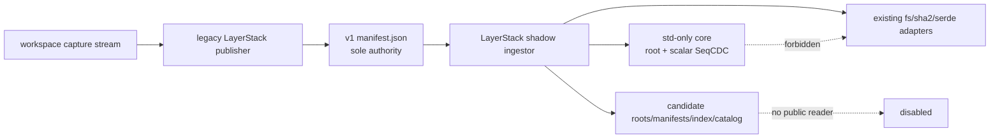
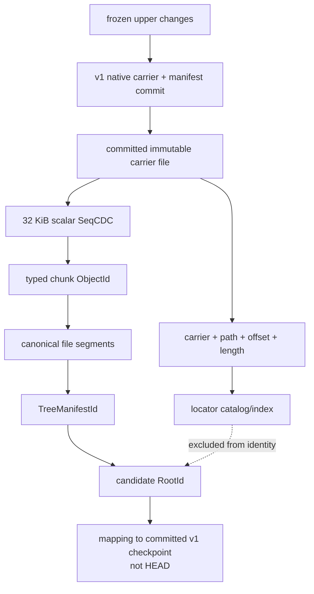
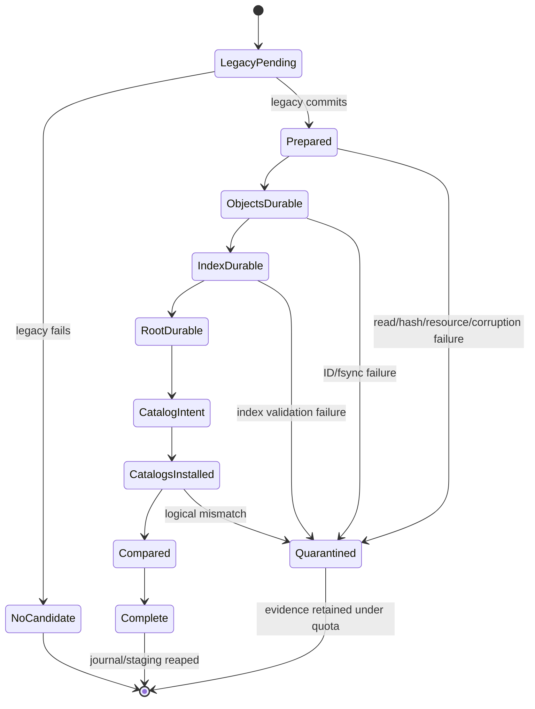

# Stage 04 — Shadow CAS ingest

[Implementation overview](../index.md) · [Stage 04 E2E plan](e2e_test.md) · [Preparation 01](../../prep/01-cdc-cas-space-time-materialization-spec.md) · [Preparation 03](../../prep/03-seqcdc-cas-and-squash-decision.md) · [Preparation 04](../../prep/04-seqcdc-space-time-complexity-and-acceptance-criteria.md)

Product root: `/Users/yifanxu/Ephemeral-AI-Lab/ephemeral-sandbox`
Test root: `/Users/yifanxu/Ephemeral-AI-Lab/ephemeral-sandbox-test`

## 1. Stage contract

| Field | Contract |
| --- | --- |
| Status | Proposed; first candidate-artifact writer; POC proof tier only. Planning creates no branch. Implementation requires exact branch `upgrade-2.0-phase-1`, created from the newest approved immutable product revision, with immutable product/test/doc bases recorded first. |
| Depends on | Stage 02 portable root contract and Stage 03 scalar SeqCDC POC exits, transitively using Stage 00 bounded observations. Stage 01 remains an independent parallel branch until Stage 10. |
| Owners / affected crates | `sandbox-runtime-layerstack-core` values/SeqCDC; existing `sandbox-runtime` LayerStack hashing, persistence, catalogs, recovery, and physical locators; workspace capture stream; operation orchestration/observability; `sandbox-config`; focused external E2E. |
| Objective | After a successful authoritative v1 publication, synchronously ingest the committed immutable native carrier into a transactionally durable **shadow** v2 root/manifest/index/catalog observation using bounded scalar SeqCDC and native-carrier locators. |
| Authority invariant | Legacy v1 `manifest.json` is the only read, write, OCC, revision, and publication authority. Shadow artifacts have no `HEAD`, no public resolver, no mount route, no response authority, and no right to delay/undo/delete a committed v1 root. |
| Payload strategy | Candidate chunks are identified and indexed to verified immutable v1 carrier byte ranges. Stage 04 writes no duplicate chunk payload to loose objects or packs; the native carrier remains the sole authoritative payload location. |
| Scope | `legacy`/`shadow_write` rollout mode; streaming/disk-spooled capture metadata; post-v1-commit shadow transaction; canonical roots/manifests; typed chunk IDs; locator/index/root catalogs; journals/recovery/quarantine; bounded worker/queue/cache/permit ownership; structured comparison observations. |
| Non-goals | Candidate public read/materialization; authoritative v2 publication; hydration; pack writing/compaction/GC; retention/lease authority; legacy deletion; migration; squash; StreamCDC fallback/selection; SIMD; broad/release/final performance, RSS, space, or portability qualification. |
| Entry | Stages 02–03 pass; exact dependency baseline is unchanged; legacy route is healthy; candidate subtree absent or valid empty initialized format; case has enough accounted space for metadata/journal staging; rollout defaults remain `legacy`. |
| Exit | In `shadow_write`, one changed public publish first commits exactly one v1 revision, then produces one matching durable candidate observation keyed to that immutable v1 checkpoint; injected failures never change the public v1 result; recovery is idempotent; candidate resources quiesce; configured bounds and zero external dependency delta pass. In `legacy`, no candidate path or work occurs. |
| Rollback | Set rollout to `legacy`, stop admitting shadow work, finish/quarantine exact candidate transactions, and remove only the versioned candidate subtree after evidence retention. Never change or delete legacy manifest/base/layers. |

“Shadow complete” means “candidate bytes and locators passed internal comparison for this v1 checkpoint.” It does not mean the v2 root is published or readable. A candidate mismatch is retained as a defect and cannot be masked by the successful legacy response.

## 2. Current evidence

| Status | Repository/path | Current fact | Stage decision |
| --- | --- | --- | --- |
| observed | product `crates/sandbox-runtime/layerstack/src/stack/ops/publish.rs:55-127` | Legacy writes/fsyncs staging, renames the native layer, writes metadata, rereads active manifest for OCC, then atomically writes the manifest. | Preserve this linearization and authority. Shadow starts only after the committed v1 checkpoint/result is known. |
| observed | product `crates/sandbox-runtime/layerstack/src/stack/layer/write.rs:19-39` | `WriteFile` copies the source into the immutable native layer. | Chunk the committed carrier, not a mutable upper path, so candidate locators reference verified immutable bytes. |
| observed | product `crates/sandbox-runtime/layerstack/src/storage/fs.rs:34-52,113-179` | LayerStack owns same-filesystem staging allocation, atomic rename, fsync, and `syncfs` behavior. | Concrete candidate persistence/recovery stays in LayerStack and reuses these OS responsibilities. |
| observed | product `crates/sandbox-runtime/layerstack/src/model/mod.rs:170-228` | Capture changes are aggregated in a resident `BTreeMap`/`Vec`. | In `shadow_write`, replace whole-publication resident metadata with bounded run files plus an 8-way external merge. Legacy mode remains behavior-compatible. |
| observed | product `crates/sandbox-runtime/workspace/src/overlay/capture.rs:104-228` | `capture_upperdir` walks, sorts per directory, and collects the full change list. | Introduce a freeze-scoped `CaptureEventStream` and bounded metadata spool; never queue payload bytes. |
| observed | product `crates/sandbox-runtime/workspace/src/service/impls/capture_changes.rs:67-106` | Service also materializes `changed_paths` and a path-kind map. | Replace them in shadow mode with counts, bounded samples, and the disk-backed canonical event stream. |
| observed | product `crates/sandbox-config/src/configs/runtime.rs:130-190` | LayerStack config has no candidate writer mode. | Add closed `shadow_write`; default/production configs remain `legacy`; unknown values fail validation. |
| observed | product `config/prd.yml`, `config/bench.yml` | Existing roots point to `/eos/layer-stack`, `/eos/workspace`, and old compatibility root. | Add explicit `rollout_mode: legacy`; E2E owns a run-scoped `shadow_write` config. No new root mount is required. |
| observed | Stage 02 | Core provides canonical root/object/path values and narrow sink/digest contracts; LayerStack retains `sha2`/`serde`. | LayerStack implements all filesystem/catalog/journal/provider adapters. Core remains std-only. |
| observed | Stage 03 | Scalar SeqCDC is bounded by one 32 KiB ring/≤2 slices and validated against the oracle. | Invoke this exact implementation synchronously inside bounded storage workers. |
| observed | [Preparation 03 §5](../../prep/03-seqcdc-cas-and-squash-decision.md#5-cdccas-and-native-materialization-decision) | A native immutable carrier may be an authoritative chunk location; duplicating current payload merely for “CAS coverage” is forbidden. | Stage 04 locator records point at carrier ID + canonical relative bytes + offset/length; locator is outside object/root identity. |
| observed | [Preparation 04 §4.2](../../prep/04-seqcdc-space-time-complexity-and-acceptance-criteria.md#42-publication) | Normal publication is `O(U+E+K)` plus bounded external ordering; memory is `O(B)`. | Incremental shadow ingest must meet this. One explicitly labeled bootstrap may scan current state once and is not a normal publication sample. |
| observed | [Preparation 04 §6](../../prep/04-seqcdc-space-time-complexity-and-acceptance-criteria.md#6-application-memory-complexity-and-limits) | Worker, ring, queue, encoder, cache, publication, and global semaphore limits are fixed. | Every admitted allocation is charged; exhaustion backpressures until deadline then returns shadow `ResourceExhausted` without affecting v1. |
| open | candidate read correctness | No v2 materializer/resolver exists. | Do not add one here. Comparison uses canonical tree/export evidence, not mounting candidate state. |

The key ordering follows the authority invariant:

```text
freeze captured session
→ durable legacy carrier and manifest OCC commit
→ immutable v1 checkpoint returned by LayerStack
→ bounded candidate ingest from committed carrier
→ durable shadow observation or explicit shadow failure
→ unchanged legacy public response
```

## 3. Resulting file and folder structure

### Product source tree

```text
ephemeral-sandbox/
├── Cargo.toml                                [unchanged contract] — no external package/version/feature/direct-edge delta
├── Cargo.lock                                [unchanged contract] — no external package/version/feature/direct-edge delta
├── config/
│   ├── prd.yml                               [modify] — explicit rollout_mode: legacy
│   └── bench.yml                             [modify] — explicit rollout_mode: legacy
├── docs/maintainer-architecture.md           [modify] — shadow authority and adapter boundary
└── crates/
    ├── sandbox-config/src/configs/runtime.rs  [modify] — Legacy | ShadowWrite
    └── sandbox-runtime/
        ├── layerstack-core/src/
        │   ├── tree.rs                       [modify] — bounded segment/locator-neutral records
        │   └── port.rs                       [modify] — only if concrete Stage 04 need proves seam
        ├── workspace/src/
        │   ├── overlay/capture.rs            [modify] — freeze-scoped CaptureEventStream
        │   └── service/impls/capture_changes.rs [modify] — bounded spool/counts, no full path map
        ├── layerstack/src/
        │   ├── lib.rs                        [modify] — shadow service exports
        │   ├── shadow/
        │   │   ├── mod.rs                    [add] — construction and public internal API
        │   │   ├── ingest.rs                 [add] — incremental stream/SeqCDC/locator flow
        │   │   ├── transaction.rs            [add] — journal state and fsync ordering
        │   │   ├── store.rs                  [add] — canonical layout/catalog/index adapter
        │   │   ├── recovery.rs               [add] — idempotent exact-txn recovery
        │   │   └── observe.rs                [add] — bounded counters/gauges
        │   └── stack/ops/publish.rs          [modify] — invoke shadow only after v1 commit
        └── operation/src/
            └── observability.rs              [modify] — additive bounded shadow projection
```

Tests and failpoint adapters stay under test modules/integration tests. No diagnostic daemon, sidecar, database, target-image helper, or second scheduler is added.

### Complete `/eos` tree after Stage 04

Annotation tags:

- `existing` means pre-v2 legacy/runtime state;
- `candidate` means durable shadow evidence, never public authority;
- `reserved-empty` fixes a canonical namespace but accepts no Stage 04 child writes;
- `remove-later` is compatibility-only;
- `truth`, `candidate-truth`, `index`, `staging`, `scratch`, `quarantine`, and `trash` identify physical class.

The main workspace/namespace-execution portion is the deterministic Stage 00
shape and is Stage 04's required branch-independent state. Stage 01 may finish
in parallel; its separately labeled replacement delta is valid only after its
own exit and is not a Stage 04 entry, exit, or rollout assumption.

```text
/eos/                                                                  [E0]
├── layer-stack/                                                       [L0]
│   ├── .storage-writer.lock                                           [L1]
│   ├── manifest.json                                                  [L2]
│   ├── workspace.json                                                 [L3]
│   ├── base/<base_id>/                                                [L4]
│   ├── layers/<layer_id>/                                             [L5]
│   ├── staging/<layer_id>.staging/                                    [L6]
│   ├── .layer-metadata/
│   │   ├── <layer_id>.digest                                          [L7]
│   │   └── <layer_id>.bytes                                           [L8]
│   ├── format-v2.json                                                 [V0]
│   ├── roots/v2/<prefix>/<RootId>.root                               [V1]
│   ├── manifests/v2/<prefix>/<TreeManifestId>.manifest               [V2]
│   ├── objects/v1/loose/                                              [O0]
│   │   └── <prefix>/<object_id>.obj                                  [O1]
│   ├── packs/v1/
│   │   ├── open/<transaction_id>.pack                                [P1]
│   │   └── sealed/<pack_id>.pack                                     [P2]
│   ├── indexes/v1/
│   │   ├── pages/<page_id>.idx                                       [I1]
│   │   └── index.catalog                                              [I2]
│   ├── catalogs/v1/
│   │   ├── roots.catalog                                              [C1]
│   │   ├── locators.catalog                                           [C2]
│   │   ├── materializations.catalog                                   [C3]
│   │   ├── leases.catalog                                             [C4]
│   │   └── retention.catalog                                          [C5]
│   ├── journals/v1/
│   │   ├── publication/<transaction_id>.journal                       [J1]
│   │   ├── hydration/                                                 [J2]
│   │   ├── squash/                                                    [J3]
│   │   ├── compaction/                                                [J4]
│   │   └── migration/                                                 [J5]
│   ├── staging/v2/
│   │   ├── publication/<transaction_id>/                              [T1]
│   │   ├── hydration/                                                 [T2]
│   │   ├── squash/                                                    [T3]
│   │   ├── compaction/                                                [T4]
│   │   └── migration/                                                 [T5]
│   ├── leases/v1/                                                     [A1]
│   ├── retention/v1/                                                  [A2]
│   ├── maintenance/v1/                                                [A3]
│   ├── materializations/docker-overlayfs/v1/                          [M0]
│   ├── quarantine/v1/<transaction_id>/                                [Q1]
│   └── trash/v1/<durable_epoch>/<artifact_id>                          [X1]
├── storage/
│   ├── file_auditability/                                             [S1]
│   └── workspace_recovery/                                            [S2]
├── workspace/
│   ├── manager.json                                                   [W1]
│   ├── .export/<spool_id>                                             [W2]
│   └── <workspace_session_id>/                                        [W3]
│       ├── upper/                                                     [W4]
│       └── work/                                                      [W5]
├── namespace_execution/                                               [N0]
│   └── <namespace_execution_id>/transcript.log                        [N1]
└── runtime/daemon/
    ├── runtime.sock                                                   [R1]
    └── runtime.pid                                                    [R2]
```

Optional Stage 01 parallel-world replacement delta:

```text
/eos/workspace/<workspace_session_id>/executions/<command_session_id>/transcript.log [PW0]
/eos/namespace_execution/<legacy_namespace_execution_id>/transcript.log              [PN0; compatibility-only, may be absent]
```

| Code/path | State and physical class | Owner | Lifecycle, fsync, recovery, deletion | Root/identity participation | Stage 04 access | Bound and `T(t)` category | Permissions/exposure |
| --- | --- | --- | --- | --- | --- | --- | --- |
| `E0 /eos` | existing namespace | installation/daemon | external provision → boot validate → installation removal only | none | daemon R/W | one; all `T(t)` terms | masked |
| `L0 layer-stack` | existing authority namespace plus candidate subtree | LayerStack | open/format validate → child-specific durability/recovery; never broad transaction delete | contains v1 authority and non-authoritative v2 evidence | legacy and candidate adapters R/W | `L_hot+P_staging+M`; `H_cold=0` here | daemon-only, same filesystem |
| `L1 .storage-writer.lock` | existing writer coordination | LayerStack | open → acquire process lock → kernel-held exclusion → reacquire after restart → close with owner | none | legacy coordination; candidate transactions share the existing exclusion domain | one file/FD; `M` | daemon-only |
| `L2 manifest.json` | **sole authoritative truth** | legacy publisher | temp/write/fsync → rename/parent fsync → OCC/boot validate → atomic supersede | v1 public hash; checkpoint correlation input, never v2 `RootId` | legacy R/W/publication only | one; `M` | daemon-only |
| `L3 workspace.json` | existing base/workspace binding truth | base builder | bootstrap → atomic replace/fsync → boot validate → installation removal | physical v1 binding/correlation only; excluded from v2 `RootId` | legacy R/W; candidate may correlate but never mutate | one; `M` | daemon-only |
| `L4 base/<id>` | authoritative native carrier | base builder | verify/install/fsync → v1 reachability → legacy-approved delete only | possible candidate payload locator, but carrier/path excluded from IDs | legacy R; shadow verified reads | one base; `L_hot` | lower read-only/masked |
| `L5 layers/<id>` | authoritative native carrier | legacy publisher | legacy stage/fsync/rename → v1 commit → existing lease/squash delete policy | candidate payload locator only; excluded from object/root ID | legacy R/W; shadow post-commit R | existing `D`, final≤64; `L_hot` | immutable lower/masked |
| `L6 legacy staging` | existing transaction staging | legacy publisher | private create/write/fsync → rename or abort/boot reap | none | legacy W only | admitted v1 transaction; `P_staging` | `0700` |
| `L7 digest` | v1 truth-adjacent metadata | legacy publisher | atomic write/recompute/delete with carrier | comparison only, not typed object ID | legacy R/W; shadow may verify | one/carrier; `M` | daemon-only |
| `L8 bytes` | accounting metadata | legacy publisher | atomic write/recount/delete with carrier | none | legacy R/W; accounting read | one/carrier; `M` | daemon-only |
| `V0 format-v2.json` | candidate format truth | LayerStack format initializer | create-once temp/fsync/rename/parent fsync → exact boot validation → never mutate; rollback removes candidate subtree only | names root/object/chunker/catalog versions, not itself in `RootId` | candidate R; W once | one ≤64 KiB; `M` | daemon-only |
| `V1 roots/v2/<prefix>/<RootId>.root` | immutable candidate-truth | shadow transaction | staged canonical bytes → verify ID → fsync/rename/dir fsync → recovery validate → delete only candidate rollback/retention later | bytes hash to filename `RootId`; no `HEAD` | candidate W/R; no public reader | one per completed shadow checkpoint; ≤256 KiB/root; `M` | daemon-only |
| `V2 manifests/v2/<prefix>/<TreeManifestId>.manifest` | immutable candidate-truth/reconstruction metadata | shadow transaction | streamed staged manifest → domain-typed ID verify → fsync/rename → recovery validate → candidate retention later | strong edge from root; bytes hash to `TreeManifestId` | candidate W/R | bounded records, disk-backed tree; `M` | daemon-only |
| `O0 objects/v1/loose` | candidate namespace, **reserved-empty** | future evacuation/small-object writer | initialized/validated only; Stage 04 rejects child creation | future typed object locations | no child R/W | zero payload; `H_cold=0` | daemon-only |
| `O1 loose object` | absent/reserved | future owner | no Stage 04 lifecycle; unexpected file quarantines/fails | would be typed object | forbidden | must be zero | daemon-only |
| `P1 packs/open` | reserved-empty staging namespace | Stage 08 pack writer | initialized only; boot requires empty in Stage 04 | none now | forbidden child writes | zero; no `P_staging` | daemon-only |
| `P2 packs/sealed` | reserved-empty cold-truth namespace | Stage 08 | initialized only | future object locators | forbidden child writes | zero; `H_cold=0` | daemon-only |
| `I1 index pages` | candidate disk-backed index | shadow transaction | page staged → checksum/fsync/rename → catalog install → recovery keep/quarantine → later GC | locators/index excluded from root/object IDs | candidate R/W | 4 KiB pages; cache max 4,096 pages=16 MiB; `M` | daemon-only |
| `I2 index.catalog` | candidate atomic index generation truth | shadow transaction | staged generation → fsync → atomic rename/parent fsync → boot generation validation → superseded-page cleanup later | outside `RootId`; selects candidate index generation only | candidate R/W | one active + bounded previous recovery generation; `M` | daemon-only |
| `C1 roots.catalog` | candidate checkpoint-correlation truth | shadow transaction | append/build staged → root durable → atomic generation install/fsync → recovery reconcile | maps `(v1 version,v1 hash)` to candidate `RootId` + status; **not HEAD** | candidate R/W; observability only | disk-backed, bounded page/cache; `M` | daemon-only |
| `C2 locators.catalog` | candidate physical-locator truth | shadow transaction | verified carrier ranges → staged catalog → fsync/atomic generation → recovery revalidate | maps typed chunk ID to carrier/range; locator excluded from ID | candidate R/W | one descriptor/chunk, ≤96 B amortized target; `M` | daemon-only |
| `C3 materializations.catalog` | reserved-empty provider catalog | Stage 05 materializer | initialize one empty generation and validate it at boot; Stage 04 must not install a record | no materialization identity exists in Stage 04 | candidate validation read only after initialization | fixed empty generation; `M` | daemon-only |
| `C4 leases.catalog` | reserved-empty authority catalog | future lease stage | initialized with empty generation only; Stage 04 cannot grant a v2 lease | none now | R validation; no mutation except initialization | fixed empty; `M` | daemon-only |
| `C5 retention.catalog` | reserved-empty authority catalog | future retention stage | initialized empty; no root selected for authoritative retention here | none now | R validation only | fixed empty; `M` | daemon-only |
| `J1 publication journal` | candidate recovery truth | shadow transaction/recovery | create/fsync before candidate writes → monotonic states each fsynced → COMPLETE → delete after catalogs durable and dir fsync; boot resumes/quarantines exact txn | records expected IDs/checkpoint; journal bytes excluded | candidate R/W | one/admitted shadow txn; residue bound; `P_staging+M` | `0600`, daemon-only |
| `J2 hydration` | reserved-empty journal namespace | Stage 05 | initialized only | none | forbidden child writes | zero | daemon-only |
| `J3 squash` | reserved-empty journal namespace | Stage 09 | initialized only | none | forbidden child writes | zero | daemon-only |
| `J4 compaction` | reserved-empty journal namespace | Stage 08 | initialized only | none | forbidden child writes | zero | daemon-only |
| `J5 migration` | reserved-empty journal namespace | Stage 10 | initialized only | none | forbidden child writes | zero | daemon-only |
| `T1 publication staging` | candidate transaction staging | shadow transaction | exact txn mkdir → capture runs/pages/records → file/tree fsync → promote or quarantine/delete → boot journal recovery | staged bytes never identity until verified/promoted | candidate W/R | metadata only; payload staging=0; `P_staging` | `0700`, masked |
| `T2 hydration` | reserved-empty staging | Stage 05 | initialized only | none | forbidden | zero | daemon-only |
| `T3 squash` | reserved-empty staging | Stage 09 | initialized only | none | forbidden | zero | daemon-only |
| `T4 compaction` | reserved-empty staging | Stage 08 | initialized only | none | forbidden | zero | daemon-only |
| `T5 migration` | reserved-empty staging | Stage 10 | initialized only | none | forbidden | zero | daemon-only |
| `A1 leases/v1` | reserved-empty lease-record namespace | future lease authority | initialized only; no candidate lease can protect/delete a v1 carrier | none now | validation only | zero/fixed metadata; `M` | daemon-only |
| `A2 retention/v1` | reserved-empty policy namespace | future retention owner | initialized only | none now | validation only | zero/fixed metadata; `M` | daemon-only |
| `A3 maintenance/v1` | reserved-empty cursor namespace | Stage 08+ | initialized only; no background maintenance admitted | none | validation only | zero; `M` | daemon-only |
| `M0 materializations/docker-overlayfs/v1` | reserved-empty provider namespace | Stage 05 materializer | initialize directory only; any Stage 04 child is a format error | no materialization identity exists in Stage 04 | validation read only; child writes forbidden | zero carriers; `C_target=0` | daemon-only |
| `Q1 quarantine` | candidate failure evidence, non-truth | recovery/diagnostics | atomic move of exact corrupt/ambiguous txn after journal decision → fsync → explicit operator/rollback deletion | never selected by root/catalog | candidate W/R | configured quota; counted in `M/P_staging` | daemon-only, redacted metadata |
| `X1 trash` | reserved-empty deletion staging | future GC | initialized only; Stage 04 cannot trash any authority/candidate root | none | forbidden child writes | zero | daemon-only |
| `S1 file_auditability` | existing audit truth | FileService | operation durable update → boot recovery → retention cleanup | blame separate from content identity | service R/W | configured; `M` | authenticated API |
| `S2 workspace_recovery` | conditional recovery truth | workspace recovery | exact failed owner/fsync → bounded retry → delete after reap | none | recovery R/W | failures only; `P_staging+M` | daemon-only |
| `W1 manager.json` | workspace owner truth | WorkspaceManager | atomic update/fsync → boot reconcile → supersede | none | workspace R/W | one; `M` | daemon-only |
| `W2 .export/<spool_id>` | existing export scratch | export operation | request creates a private bounded spool → close makes it API-readable without truth-publication durability → exact-spool cleanup after consumption/drop; boot reaps the whole `.export` directory | none | operation R/W, independent of shadow ingestion | configured active-spool bound; `P_staging` | daemon-only, masked |
| `W3 session` | active scratch | WorkspaceManager | create/freeze/mount → publish/destroy → exact-ID recovery cleanup | none | workspace R/W | active sessions; `ΣU_active` | `0700` |
| `W4 upper` | writable capture scratch | workspace/capture | create/native writes → freeze → stream legacy capture → teardown | bytes influence future manifest/chunks; host path excluded | workspace R/W; frozen read during publish | `C_capture`/active bytes; `ΣU_active` | `/workspace` projection only |
| `W5 work` | OverlayFS scratch | overlay/kernel | mount → kernel use → unmount/reap | none | provider R/W | one/session; `ΣU_active` | masked |
| `N0 namespace_execution` | existing command-scratch namespace | namespace execution owner | provision/validate → active child visibility → owner cleanup/boot reconcile → installation removal | none | command R/W, independent of shadow ingestion | active commands; `ΣU_active+M` | masked |
| `N1 command transcript` | existing command scratch | command owner | admit/append under cap → terminal close → Drop/boot exact-id cleanup | none | command R/W | transcript/terminal caps; `ΣU_active+M` | `0700`, API-only |
| `PW0 Stage 01 consolidated transcript` | optional Stage 01 command scratch | command owner | create beneath owning workspace session → append/close → Drop/session/boot cleanup | none | command R/W only if Stage 01 passed | transcript/terminal caps; `ΣU_active+M` | API-only |
| `PN0 Stage 01 legacy transcript` | optional compatibility scratch, remove-later | Stage 01 cleanup adapter | **no new writes** → exact pre-upgrade reap → absence after compatibility window | none | cleanup only if Stage 01 passed | converges zero; legacy cap while present; `P_staging` | `0700`, masked |
| `R1 runtime.sock` | ephemeral control | daemon | stale-owner validate/bind → unlink shutdown/recovery | none | authenticated control | one; `M` | `0600`, no image helper |
| `R2 runtime.pid` | ephemeral identity | gateway/daemon | atomic boot write → identity recovery → shutdown remove | none | daemon R/W | one; `M` | daemon-only |

Only `V0–V2`, `I1–I2`, `C1–C3`, `J1`, `T1`, and failure-only `Q1` may contain new Stage 04 children. `M0` is initialized but reserved-empty; all other candidate namespaces are likewise initialized-empty and treated as a format violation if populated.

## 4. SRP, SOLID, and coupling design

### Component responsibilities

| Component | One responsibility | Dependencies | Dependents | Change trigger | Must not own |
| --- | --- | --- | --- | --- | --- |
| `CaptureEventStream` | Yield freeze-consistent backend-neutral changes and source handles | workspace/overlay capture | legacy planner, spool | capture semantics | hashing, catalogs, publication lock |
| `CaptureRunSpool` | Bound and canonically order metadata using disk runs | `std`, candidate txn staging | shadow ingestor | ordering/budget changes | payload copies, root authority |
| legacy publisher | Commit v1 carrier/manifest with current OCC | existing LayerStack | public response, shadow trigger | legacy publication semantics | candidate root authority |
| `ShadowIngestor` | Transform committed carrier changes into canonical objects, locators, and root candidate | core SeqCDC/types, bounded store APIs | shadow transaction | v2 ingest schema/profile | v1 commit/rollback, mount/read |
| `ShadowTransaction` | Enforce journal/fsync/promotion/recovery state machine | LayerStack filesystem adapter | recovery/ingest | durability protocol | logical codec/cut loop |
| `ShadowStore` | Concrete candidate layout, index, catalog, and native-carrier locator persistence | existing OS/fs/serde/sha edges + core | transaction/observability | physical format | workspace capture, public policy |
| `ShadowRecovery` | Resolve exact incomplete candidate transactions without changing legacy | journal/store + current v1 checkpoint | LayerStack boot | journal states | broad sweep/delete, legacy repair |
| bounded observation | Report scalar status/resources and correlation IDs | atomics/capped state | operation/E2E | schema version | per-path/chunk telemetry |
| core | Portable canonical values/SeqCDC only | std | LayerStack | portable schema/algorithm | OS, serde, sha implementation, config |

LayerStack implements hashing, persistence, index/catalog, recovery, and physical provider/locator ports using existing dependencies. The std-only core owns no filesystem repository. Dependency direction remains acyclic:

```text
workspace/operation/provider → LayerStack adapters → portable core
```

### Exact dependency delta and portability

| Boundary | Required Stage 04 result |
| --- | --- |
| external packages/versions/sources/checksums | exact canonical equality with baseline |
| enabled external features | exact canonical equality |
| direct external manifest-edge multiset | exact equality; no addition/removal/relocation |
| core dependencies | std-only and internal types only |
| LayerStack edges | reuse existing `sha2`, `serde`, `rustix`, and filesystem responsibilities; add no external edge |
| Python/npm/system/image/runtime | no package, tool, service, helper, sidecar, FUSE, database, C/FFI, network, download, or privilege delta |
| target image | no code/userland runs for ingest; daemon reads host-mounted carrier |
| host/CPU identity | canonical bytes use explicit order/width and scalar SeqCDC; physical carrier/path/offset is outside IDs |
| future backend | supplies its own capture/materialization/locator adapter; root/object contract unchanged |

## 5. Type, class, and field design

```rust
#[derive(Clone, Copy, Debug, Eq, PartialEq, serde::Deserialize)]
#[serde(rename_all = "snake_case")]
pub enum StorageRolloutMode {
    Legacy,
    ShadowWrite,
}

pub struct LegacyCheckpoint {
    pub manifest_version: u64,
    pub root_hash: String,       // bounded validated v1 value; correlation only
    pub new_layer_id: Option<LayerId>,
}

pub enum CaptureEvent {
    UpsertFile {
        path: CanonicalPath,
        source: FrozenSourceHandle, // adapter-only, never canonical identity
        metadata: PortableMetadata,
    },
    UpsertDirectory { path: CanonicalPath, metadata: PortableMetadata },
    UpsertSymlink { path: CanonicalPath, target: Vec<u8>, metadata: PortableMetadata },
    RemoveEntry { path: CanonicalPath },
    ReplaceSubtree { path: CanonicalPath },
}

pub struct ChunkDescriptor {
    pub object: ObjectId,
    pub file_offset: u64,
    pub length: u32,
}

pub struct NativeCarrierLocator {
    pub layer_id: LayerId,       // physical; excluded from all portable IDs
    pub relative_path: Vec<u8>,  // physical adapter bytes; excluded
    pub offset: u64,
    pub length: u32,
    pub verified_object: ObjectId,
}

pub struct ShadowCheckpoint {
    pub source: LegacyCheckpoint,
    pub root_id: RootId,
    pub tree_manifest: TreeManifestId,
    pub legacy_projection_digest: Digest32,
    pub profile: ChunkProfileId,
}

pub enum ShadowTransactionState {
    Prepared,
    ManifestObjectsDurable,
    LocatorIndexDurable,
    RootDurable,
    CatalogIntentDurable,
    CatalogsInstalled,
    Compared,
    Complete,
    Quarantined,
}

pub enum ShadowStatus {
    Disabled,
    Completed { root_id: RootId },
    Mismatch { bounded_reason: ShadowMismatchKind },
    Failed { bounded_reason: ShadowFailureKind },
    RecoveryPending { transaction: TransactionId },
}
```

`FrozenSourceHandle` and `LayerId` are LayerStack/workspace adapter values and never cross into core canonical records. Root records contain the exact Stage 02 `RootRecordV2` fields: format, required capabilities, chunk profile, `TreeManifestId`, parent/base candidate IDs when available, and `PublicationIdentity { generation, id: PublicationId }`. For a shadow checkpoint, the publication ID is deterministically derived from the correlated immutable v1 checkpoint and a collision-safe transaction value. The root record does not contain the v1 hash string or layer locator.

The roots catalog record is:

```text
(legacy_manifest_version, legacy_root_hash)
    → (shadow_status=complete, RootId, TreeManifestId, transaction_id, evidence_digest)
```

It is a comparison index, not `HEAD`. There is no API to resolve a workspace by this mapping.

`ShadowStore` uses generation catalogs and immutable pages. Index probes have format-bounded fan-out. Capture metadata is sorted by canonical raw path bytes using runs with merge fan-in eight and 64 KiB per-run buffers. Duplicate path events within one frozen publication coalesce to the final state before root encoding; already durable v1 checkpoints are never coalesced.

## 6. Data and compatibility design

| Concern | Rule |
| --- | --- |
| V1 public contract | Request/response/revision/layer order/content/OCC remain exactly legacy. Shadow fields appear only on the existing authenticated observability projection. |
| Rollout default | Missing config remains backward-compatible `legacy`; `prd.yml`/`bench.yml` explicitly say `legacy`; `shadow_write` is opt-in POC. |
| V1→v2 correlation | Exact immutable v1 manifest version/hash captured after commit; never infer from staging or pre-OCC snapshot. |
| Candidate bootstrap | If no predecessor candidate exists, one explicitly labeled bootstrap may stream the current merged native tree. Its `O(C_current+E_current)` work is excluded from normal incremental publication timing. |
| Incremental root | External-merge prior disk-backed tree records with current canonical events; no full tree/path/chunk list in memory. |
| Payload | Read committed immutable carrier sequentially; scalar SeqCDC; typed SHA-256; locator points to verified range. No loose/pack payload written. |
| Canonical metadata | Stage 02 path/mode/uid/gid/mtime/xattr/sparse/hardlink/symlink schema; unsupported required state rejects shadow and leaves v1 successful. |
| Root publication | None. Root file/catalog entry is candidate evidence only; no current-root symlink/file/catalog field exists. |
| No-op v1 publish | Produces no new candidate checkpoint because there is no new authoritative v1 checkpoint. Counters report skipped-no-op. |
| Corruption | Invalid candidate file/page/catalog/journal is quarantined or ignored by shadow recovery; it cannot poison v1 open/mount/public operations. |
| Rollback | Disable mode, drain/recover exact candidate txns, retain/export evidence, delete only candidate namespace; v1 files untouched. |

Canonical objects are immutable and content addressed. Physical locator records, compression, filesystem block placement, catalog page IDs, journal IDs, and native carrier identities are not hashed into them.

## 7. Workflow and failure semantics

### Happy path and linearization

1. Validate `shadow_write`, admit one bounded publication, acquire byte permits, and freeze the workspace session.
2. Stream capture events into bounded sorted metadata runs; never queue payload bytes.
3. Invoke the existing legacy publisher. It performs its current staging/fsync/rename/OCC/manifest commit.
4. Record the committed `LegacyCheckpoint`. From this point, v1 is authoritative even if the client disconnects or shadow fails.
5. Create/fsync `J1` at `Prepared`; ingest only the new immutable carrier plus the prior candidate tree/index (or labeled bootstrap).
6. For each file, run scalar SeqCDC over committed carrier bytes; hash borrowed slices; emit bounded segment and native-carrier locator metadata.
7. Stream/fsync candidate manifests, index pages, and root in `T1`; verify typed IDs and the canonical logical-tree comparison against the bounded legacy projection digest.
8. Promote immutable files, fsync their parents, record each monotonic journal state, then atomically install locator/index/root catalog generations; validate that the materialization catalog remains its empty generation.
9. Mark `Compared`, emit one bounded observation, mark `Complete`, fsync, and remove the journal/staging directory after parent fsync.
10. Return the unchanged legacy public result. The operation observation separately reports shadow status.

### Authority-preserving failure rules

| Failure point | Candidate action | Legacy/public action |
| --- | --- | --- |
| before v1 commit | discard/reap candidate metadata spool under existing operation failure | existing legacy error/OCC semantics |
| v1 commit succeeds, client cancels | journal owns candidate continuation or recovery; fence original request callbacks | committed v1 remains; response-loss semantics remain legacy |
| candidate admission/space unavailable | record bounded `shadow_failed(ResourceExhausted)`; delete exact unpromoted staging | v1 success unchanged; no authority deletion |
| reader/SeqCDC/hash/metadata error | stop, journal, quarantine exact candidate txn if diagnostic bytes needed | v1 success unchanged |
| typed-ID/index/root comparison mismatch | never install complete root mapping; quarantine and increment mismatch | v1 success unchanged |
| fsync/rename/catalog error | leave monotonic journal; boot recovery resumes or quarantines idempotently | v1 remains sole boot/read authority |
| crash after root but before catalogs | recovery sees root durable but no catalog intent/install; validate and resume or reap exact orphan | no v1 change |
| crash after catalog intent/install | compare catalog generation/idempotently finish; never double-add | no v1 change |
| corrupt journal | move exact candidate txn to quarantine if safely attributable; otherwise fail shadow initialization closed | v1 service still opens; candidate route disabled |
| `ENOSPC` | preflight before visibility; never delete v1 source; candidate cleanup only | v1 remains authoritative |
| daemon shutdown | stop admission, cancel/fence tasks, drain/journal within deadline, join all four workers | normal legacy shutdown |

Candidate recovery is linear in pending journals and bounded cursor work, never all history. It checks whether the referenced v1 checkpoint/carrier still exists. If it cannot complete because the legacy carrier was legitimately removed, it records `missed_source`, quarantines/reaps candidate-only data, and does not resurrect or alter legacy.

### Memory/resource lifecycle

| Resource | Owner | Acquire | Hard limit / permit charge | Backpressure/exhaustion | Normal release | Error/cancel/panic | Shutdown/restart |
| --- | --- | --- | --- | --- | --- | --- | --- |
| storage worker pool | LayerStack shadow service | service start | 4 globally | no fifth worker | idle after task | task guard returns state; panic marks txn failed | stop admission, join all 4; boot rebuilds |
| SeqCDC ring/borrow | one active worker | file scan | 32 KiB; one borrowed chunk/worker, ≤4 global | worker synchronous | callback/file end | RAII | no retained payload |
| downstream payload | none | never | 0 bytes | synchronous visitor | N/A | N/A | 0 |
| descriptor queue | shadow publication | admission | ≤16 items and ≤64 KiB serialized | wait until deadline, then shadow `ResourceExhausted` | drained to zero | guard drains/fences | recovered txn owns only disk cursor |
| capture/sort metadata | transaction | event stream | ≤4 MiB managed/publication excluding shared cache; each changed path≤256 B+path | spill run; never grow tree map | run merge/delete | journaled exact staging | boot exact-txn reap/resume |
| manifest/journal encoder | transaction | record encode | ≤256 KiB/admitted operation | stream/spill or fail | after fsync | drop, journal remains | resume from durable state |
| merge readers | transaction | merge phase | fan-in 8 ×64 KiB | multipass runs | close each pass | close + exact run cleanup | journal cursor |
| shared index cache | shadow store | first lookup | 4,096 ×4 KiB=16 MiB | bounded eviction | warmed idle retained | poisoned page evicted/fails txn | service drop/rebuild |
| global storage byte permits | LayerStack | admission/allocation | 64 MiB | wait to deadline → failure | exact RAII return | unwind/cancel returns | gauge must be zero before shutdown |
| transaction FDs/mappings | transaction | file/page operations | bounded by workers + merge fan-in + current journal/catalog; no mmap required | close before next phase | close after fsync | RAII/cleanup | boot does not inherit FDs |
| task/transaction registry | LayerStack | admission | bounded by four workers/admitted publications | reject/backpressure | terminal entry removed | fenced terminal state | reconstructed only from journals |
| observer counters | service | construction | fixed scalars/capped last error | saturate with explicit flag | owner drop | no path/payload retention | epoch changes on restart |

Quiescence is: admitted shadow tasks zero; descriptor queue/bytes zero; byte permits zero; open shadow transactions zero or durably recovery-owned; worker pool at configured idle four; no borrowed chunk; staging/journal absent for completed transactions; cache ≤4,096 pages. Poll every 100 ms for ≤5 seconds in POC. Logical release is distinct from physical RSS.

## 8. Complexity and performance contract

### Stage operations

| Operation | Expected/worst time | Application memory | Payload/space |
| --- | --- | --- | --- |
| normal incremental capture + shadow ingest | `O(U+E+K)` plus bounded external-sort comparison/I/O | `O(B)` | reads `U`; writes metadata only |
| first labeled bootstrap | `O(C_current+E_current+K_current)` | `O(B)` | reads current native tree; excluded from normal latency sample |
| SeqCDC + typed hash | `O(U+K)=O(U)` | one 32 KiB ring/worker | no payload copy |
| index/catalog update | format-bounded `O(K)` probes plus external merge | cache 16 MiB shared, bounded run readers | immutable pages + catalog metadata |
| candidate recovery | `O(pending journals + bounded cursor work)` | `O(B)` | exact candidate transaction only |
| legacy publication | existing behavior | existing + bounded shadow admission | sole public authority |

### Exact Preparation 04 gate disposition

| Preparation 04 requirement | Disposition in Stage 04 |
| --- | --- |
| Portable canonical IDs/paths/metadata; physical locator excluded; safe/std-only core | **stage-gating** |
| Exact scalar author-v1 profile, oracle cuts, 8,192/16,384/32,768 B, threshold5/opposing50/jump512, 32 KiB ring,≤2 slices, chunk-count bounds | **stage-gating** inherited and integrated |
| Scalar cut core≤300 non-test lines; no unsafe/SIMD | **stage-gating** |
| Incremental publication `O(U+E+K)` plus bounded external ordering; no whole tree/history/chunk list | **stage-gating**; labeled first bootstrap is separately `O(C_current+E_current)` and cannot be scored as normal |
| 4 global workers; per-worker 32 KiB ring; ≤4 borrowed chunks; downstream payload 0; metadata queue16/≤64KiB; encoder≤256KiB; cache4096×4KiB;≤4MiB/publication excl cache; global semaphore64MiB | **stage-gating** |
| External merge fan-in 8 with 64 KiB/run | **stage-gating** for capture/tree/index ordering |
| 256 KiB pack-read and hydration-output buffers | **not-applicable**; no pack read or hydration exists |
| Publication payload peak `C_capture` plus staging≤5% of `C_capture`; metadata visible in `M` | **stage-gating**: candidate payload staging is exactly 0; legacy `C_capture` unchanged; all candidate metadata/staging separately measured. Final total envelope remains Stage 11. |
| ENOSPC preflight; never delete authority to make room | **stage-gating** |
| Metadata budgets chunk≤96 B, segment≤64 B, changed path≤256 B+path | **stage-gating** on encoded/amortized candidate records; total-corpus accounting `deferred-to-stage_11` |
| Journal residue ≤`1MiB + min(1% retained,64MiB)` and no pending transaction at clean settle | **stage-gating** for Stage 04 candidate journals/staging |
| Warm resolve/session + mount p50/p95≤baseline+5%+2ms and zero CAS reads | zero candidate/CAS reads **stage-gating**; normative p50/p95 `deferred-to-stage_11` |
| No-op exec p50/p95≤+3%+0.5ms; command/native sequential I/O≥97%; PTY create≤+3%+1ms; drain/stdin/C/D≤+3%+0.5ms; unsupported unchanged | behavior compatibility **stage-gating**; normative performance `deferred-to-stage_11` |
| Small-edit publish p95≤baseline+15%+5ms; report scanned/new bytes | Stage 04 reports diagnostic paired values; normative gate **deferred-to-stage_11** |
| Concurrent disjoint publication≥90% baseline and OCC | **deferred-to-stage_07** |
| Cold hydration≥70% copy; activation p95≤1.5× copy+warm | **deferred-to-stage_05** |
| Packs≤64MiB payload/100k records/80MiB allocation; compact≥20% dead, urgent>5%, settle≤2%; slice≤100k or64MiB; grace≥1 epoch | **not-applicable** to reserved-empty pack/maintenance paths; implementation **deferred-to-stage_08** |
| Depth async≥48/hard≤64; routine squash benefit≥8/manual≥2; squash timing/identity | **deferred-to-stage_09** |
| Candidate hard fails on warm byte growth/CAS read, maintenance hot path, superlinear hydration, monotonic settled latency, operation>60s | no read/maintenance/hydration path **not-applicable**; every Stage 04 operation<60s **stage-gating** |
| SeqCDC selection≥10% for localized source/mixed tree; no-dedup/small-files≤3% regression; 3 matched sets,≥5 interleaved, counterbalanced, bootstrap 95% LCB≥.10; equal mean≤5%, p10/p50/p90≤10% | **deferred-to-stage_11** |
| Unique payload≤1.14× StreamCDC; locality target change+2×32KiB+segment for `F≥16MiB`, change≤64KiB; hard median>4× or any≥25%F | Stage 04 reports candidate logical unique/locality diagnostics; normative corpus gate **deferred-to-stage_11** |
| `T=L_hot+H_cold+ΣU_active+P_staging+M`; `D_ideal=C_current+H_unique`; mixed/no-dedup target≤1.08/hard>1.15; small target≤1.15/hard>1.25 | complete accounting fields **stage-gating** for POC; threshold qualification **deferred-to-stage_11** |
| avoidable duplicate≤1%/hard>3%; pack slack≤2%/hard>5%; unexplained unreachable=0/any; depth<64/hard>64 | duplicate candidate payload=0 and unexplained candidate residue=0 **stage-gating**; full thresholds `deferred-to-stage_11`; pack slack N/A |
| RSS≤384MiB absolute/≤128MiB above idle; 64/256/1024MiB×roots1/16/64×3 cold; final/peak variation≤16MiB and each4×≤8MiB | **deferred-to-stage_11**; Stage 04 runs a short logical-release/RSS diagnostic |
| Long-lived release without restart, `malloc_trim`, allocator change, cache purge, arbitrary sleep | logical resource release **stage-gating**; final physical slope/noise qualification **deferred-to-stage_11** |
| Required-release host matrix on sole pinned Ubuntu 24.04 OCI index `sha256:4fbb8e6a8395de5a7550b33509421a2bafbc0aab6c06ba2cef9ebffbc7092d90`, resolved platform manifest recorded, no target-image userland/network/helper/new privilege | source/dependency/no-userland contract **stage-gating**; executed host rows **deferred-to-stage_11**; cross-image portability is beyond Phase 1 and non-gating |
| candidate/baseline pair≤5min | **not-applicable** to this POC; final benchmark pairs `deferred-to-stage_11` |

Stage 04 does not implement StreamCDC fallback. A SeqCDC shadow failure produces an explicit shadow failure while v1 remains authority; it must not silently run another chunker and call the comparison complete.

## 9. Diagrams

### Dependency and authority boundary



### Dataflow and identity separation



### Successful publication sequence

```mermaid
sequenceDiagram
  participant Client
  participant Op as Operation/workspace
  participant V1 as Legacy LayerStack
  participant S as Shadow transaction
  participant Disk as Candidate store
  Client->>Op: public publish
  Op->>V1: frozen capture stream
  V1->>V1: stage + fsync + rename + OCC
  V1->>Disk: atomic manifest.json commit
  V1-->>Op: committed v1 checkpoint
  Op->>S: ingest committed carrier
  S->>Disk: journal PREPARED (fsync)
  S->>Disk: manifests/index/root (verify + fsync)
  S->>Disk: catalog intent/install (atomic + fsync)
  S->>S: compare canonical logical tree
  S->>Disk: COMPLETE; reap journal/staging
  Op-->>Client: unchanged legacy result
  Note over V1,S: candidate never becomes public authority
```

### Crash and recovery state machine



## 10. Implementation sequence

1. Create/use exact `upgrade-2.0-phase-1` from the newest approved immutable product revision; record immutable product/test/doc bases; verify Stage 02–03 exits and exact dependency snapshots. Planning itself creates no branch.
2. Add `ShadowWrite` config parsing/validation with compatible default `Legacy`; keep checked-in production/benchmark configs explicitly legacy.
3. Add canonical candidate layout initialization/validation. Initialize reserved namespaces empty; reject wrong versions/unknown populated Stage 04 namespaces.
4. Refactor capture behind `CaptureEventStream` with freeze ownership and bounded metadata run spool. First prove byte-for-byte v1 behavior under `legacy`.
5. Add bounded external ordering/coalescing with eight 64 KiB readers, encoder≤256 KiB, per-publication≤4 MiB, and no payload queue.
6. Implement `ShadowStore` immutable files/pages, atomic generation catalogs, native-carrier locators, and format validation using existing LayerStack filesystem/serde/sha responsibilities.
7. Implement monotonic `ShadowTransaction` journal states and failpoints around every write/fsync/rename/catalog intent/install/comparison/cleanup boundary.
8. Invoke shadow only from the committed v1 result. Fence cancellation/late callbacks; ensure every shadow error maps to observation only and never rewrites public result.
9. Integrate the exact Stage 03 scalar SeqCDC/typed hash visitor over committed carrier files; emit bounded segment/locator records and no payload object.
10. Build incremental root by disk merge with the prior completed candidate. Implement separately labeled one-time bootstrap without using it for normal timing.
11. Add logical comparison, root/locator/index catalogs, idempotent recovery, quarantine, and exact-txn cleanup. Initialize but keep materialization state empty; prohibit any candidate resolver/mount route.
12. Add bounded route/status/resource/accounting observations and saturation tests; no path/chunk labels.
13. Run focused legacy-off, shadow happy/no-op/failure/restart/corruption/resource/long-lived tests plus the external POC and tiny diagnostic in [e2e_test.md](e2e_test.md).
14. Compare exact dependencies/source/system/image inventories and inspect the annotated `/eos` tree. Any unexpected child or pending clean-settle journal blocks.
15. Preserve all defects/evidence. Stage 05 is unblocked only for candidate read/materialization work; authority remains v1.

## 11. Observability

The existing authenticated observation gains a versioned bounded shadow record:

| Field | Meaning / bound |
| --- | --- |
| `configured_mode` | `legacy` or `shadow_write` |
| `read_authority`, `write_authority`, `publication_authority` | always `legacy_v1` in Stage 04 |
| `shadow_status` | closed enum disabled/completed/mismatch/failed/recovery_pending |
| `source_manifest_version`, `source_root_hash_digest` | bounded correlation; hash string may be represented by a digest, never path |
| `candidate_root_id` | optional one ID for last completed transaction |
| `shadow_completed/mismatch/failed/recovered` | saturating counters |
| `bootstrap_count`, `incremental_count`, `skipped_no_op_count` | scalar |
| `bytes_scanned`, `bytes_hashed`, `chunks_seen`, `unique_chunk_ids`, `reused_locator_count`, `new_locator_count` | saturating totals/current operation |
| `payload_bytes_written` | must be `0` |
| `active_tasks`, `idle_workers`, `queue_items`, `queue_bytes`, `permits_in_use`, `open_transactions`, `open_fds`, `mapped_bytes` | current and high-water where meaningful; unavailable explicit |
| `index_cache_pages`, `managed_publication_bytes`, `encoder_bytes`, `sort_fan_in` | current/high-water and configured cap |
| `L_hot`, `H_cold`, `U_active`, `P_staging`, `M`, `quarantine_bytes`, `journal_bytes`, `unreachable_candidate_bytes` | physical accounting; `H_cold=0` and candidate payload duplicate=0 |
| `last_failure_kind`, `last_journal_state`, `counter_saturated` | closed/bounded diagnostic |
| `quiescence_epoch` | changes only after completed drain; restart gets a new process epoch |

Public publish responses do not expose `RootId` or shadow status and retain their existing schema. Logs never carry arbitrary paths, object IDs per chunk, payload bytes, xattrs, or unbounded failure text. Evidence stores a bounded transaction/root correlation and aggregate digest; missing accounting is a failure, not zero.

## 12. Completion checklist

- [ ] Exact `upgrade-2.0-phase-1` and its newest approved immutable product base, immutable test/doc bases, and clean scoped worktrees are recorded; planning itself created no branch.
- [ ] Stage 02 canonical contract and Stage 03 scalar oracle/memory/dependency gates pass unchanged.
- [ ] `legacy` is the compatible/default/checked-in mode; `shadow_write` is opt-in POC only.
- [ ] V1 manifest remains the sole read/write/OCC/revision/publication authority and public response.
- [ ] Shadow begins only after a committed immutable v1 checkpoint; no candidate `HEAD`, reader, mount, or resolver exists.
- [ ] Candidate payload is not duplicated: loose/packs remain empty and locators point to verified immutable v1 carrier ranges outside identity.
- [ ] Capture/tree/index paths are streaming/disk-backed and meet all worker/ring/queue/encoder/cache/publication/semaphore/fan-in bounds.
- [ ] Incremental normal work is `O(U+E+K)` plus bounded external ordering; bootstrap is explicit and excluded from normal samples.
- [ ] Journal/fsync/rename/catalog ordering and every failpoint recover idempotently without altering v1.
- [ ] ENOSPC, corruption, cancellation, panic, mismatch, restart, and cleanup preserve v1 and leave only bounded explained candidate residue.
- [ ] Clean settle has no pending transaction and journal residue is within the strict bound.
- [ ] Candidate record metadata meets 96/64/256+path budgets; payload staging/writes are zero.
- [ ] Logical resources quiesce with four idle workers, zero tasks/queue/permits/transactions/borrows, and bounded cache.
- [ ] Exact external package/version/feature/direct-edge delta is zero; no system/image/runtime helper/dependency exists.
- [ ] Legacy mode creates no candidate namespace/work; shadow mode creates only the explicitly active canonical paths.
- [ ] Full annotated `/eos` layout, at least three diagrams, metrics, failure semantics, and exact gate dispositions agree.
- [ ] E2E verdict is POC-only and claims no candidate authority, final selection, final performance/RSS/space, portability matrix, broad CI, release, or production readiness.
