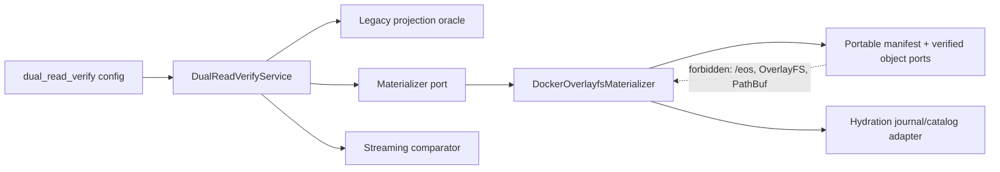
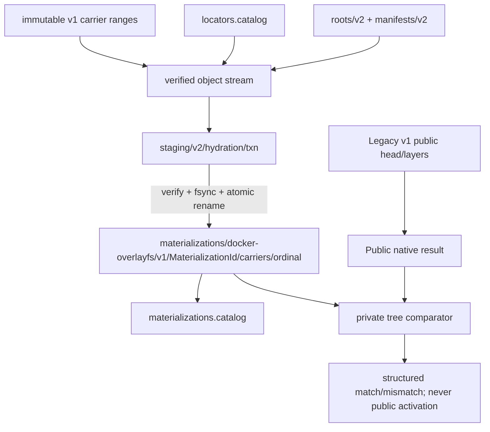
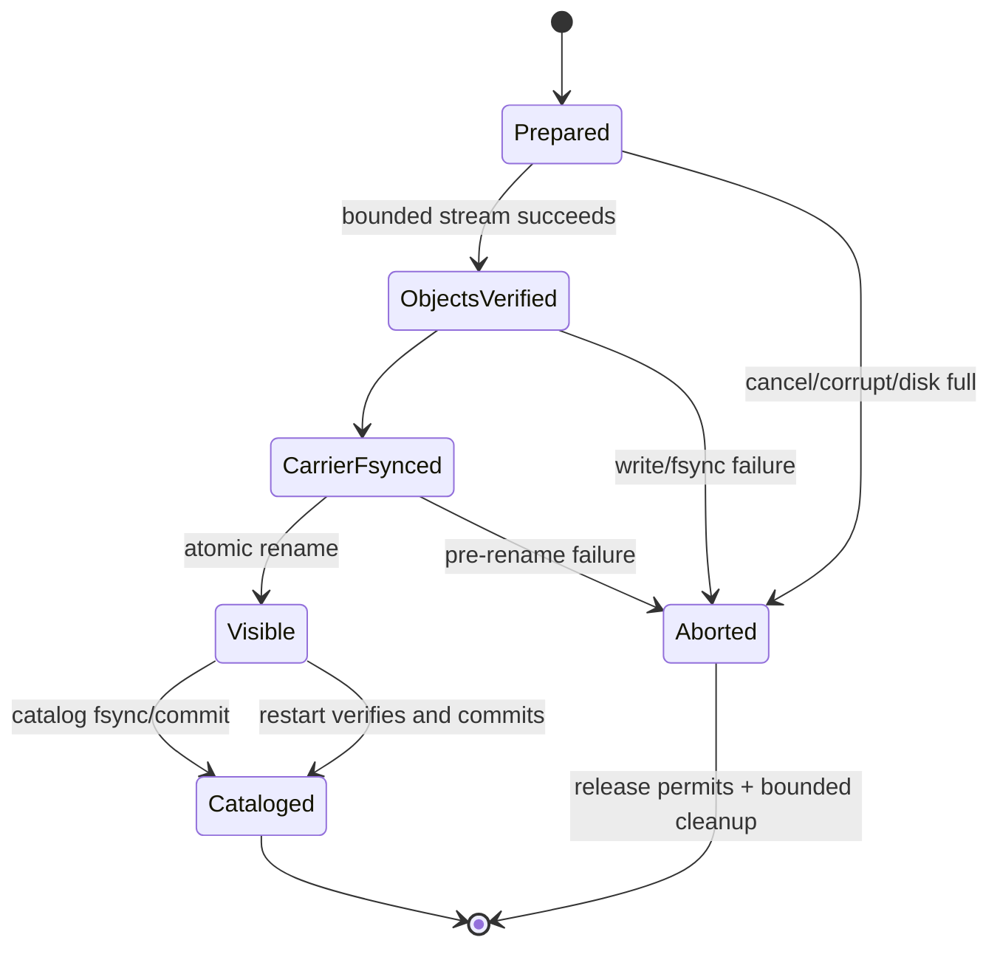

# Stage 05 — Private candidate materialization and dual-read verification

Links: [implementation overview](../index.md) · [stage E2E plan](e2e_test.md) · [portable storage contract](../../prep/01-cdc-cas-space-time-materialization-spec.md) · [recovery and migration contract](../../prep/03-seqcdc-cas-and-squash-decision.md) · [quantitative contract](../../prep/04-seqcdc-space-time-complexity-and-acceptance-criteria.md)

Proof tier: **POC proof tier**. This stage makes candidate roots reconstructable into a private native carrier and compares them with the legacy oracle. It does not serve that carrier to a sandbox.

## 1. Stage contract

| Item | Contract |
| --- | --- |
| Status | Proposed, implementation-ready |
| Depends on | Stage 04, transitively Stage 00 and Stages 02–03: frozen baseline, portable v2 root/schema, fixed scalar SeqCDC/typed object identities, and shadow locator ingest with legacy publication authority. Stage 01 remains independent until Stage 10. |
| Owners / affected crates | `sandbox-runtime-layerstack-core`, `sandbox-runtime-layerstack`, `sandbox-runtime`, configuration, external LayerStack/workspace E2E and benchmark lab |
| Objective | Stream a Stage 04 candidate `RootId` into a verified, crash-atomic Docker/OverlayFS native materialization and privately compare its exact tree/content/metadata with the legacy projection. |
| Visible outcome | In opt-in `dual_read_verify`, public create/execute/publish still uses legacy v1; structured evidence reports candidate hydration class, bytes, generation, comparison, and mismatch without mounting the candidate. |
| In scope | Provider-neutral materialization request/receipt; Docker filesystem adapter; bounded hydration transaction; durable hydration journal/catalog/locator; atomic carrier visibility; private tree comparator; corruption quarantine; restart cleanup. |
| Non-goals | No candidate activation or fallback; no candidate publication authority; no public root switch; no pack compaction/GC; no candidate squash/remount; no legacy deletion; no acceleration. |
| Entry | A committed legacy publication has exactly one Stage 04 shadow v2 root; scalar object verification/goldens pass; graph delta is zero; implementation is on `upgrade-2.0-phase-1` created from the newest approved immutable product revision. Planning creates no branch. |
| Exit gate | Focused private dual-read route proves byte/metadata/tree equivalence, cold and warm-idempotent hydration, no partial visibility, corruption failure/quarantine, bounded memory/space, restart cleanup, and zero silent mismatch. |
| Rollback | Set mode to `shadow_write`; stop scheduling hydration/comparison; delete only catalog-proven rebuildable candidate materializations and hydration staging. Candidate roots/objects and legacy public state remain. |

Migration-mode contract:

| Mode | Writer / publication authority | Public reader | Candidate work | Fallback | Accepted roots | Failure / rollback |
| --- | --- | --- | --- | --- | --- | --- |
| `legacy` | legacy v1 | legacy v1 | none | not applicable | v1 | unchanged |
| `shadow_write` | legacy v1 | legacy v1 | Stage 04 root/manifest/object-locator ingest | not applicable | public v1; private v2 | shadow error observable; legacy unaffected |
| `dual_read_verify` | **legacy v1** | **legacy v1** | privately materialize matching v2 root, compare to legacy oracle | not a serving fallback; candidate never serves | public v1; candidate verifier only v2 | mismatch/corruption fails stage and quarantines candidate evidence; legacy result remains authoritative |

## 2. Current evidence

| Status | Repository evidence | Finding / preserved contract |
| --- | --- | --- |
| observed | `ephemeral-sandbox/crates/sandbox-runtime/layerstack/src/stack/projection/mod.rs:43-181,269-275`, `MergedView::{read_bytes_limited,read_entry_limited,read_classified,project}` | Current projection resolves legacy physical layers and validates logical layer paths. |
| observed | `ephemeral-sandbox/crates/sandbox-runtime/layerstack/src/stack/projection/delta.rs:61-244`, `delta_layer_refs`, `fold_delta_winners`, `describe_layer_delta`, and `fold_layer` | Legacy whole-file fold is the comparison oracle for additions, deletion, opaque directories, metadata, and ordering. |
| observed | `ephemeral-sandbox/crates/sandbox-runtime/layerstack/src/stack/projection/emit_stream.rs:1-5,40-84`, `emit_delta_stream` | Current emitter is stream-oriented but tied to legacy projection; it is not a verified CAS materializer. |
| observed | `ephemeral-sandbox/crates/sandbox-runtime/layerstack/src/storage/fs.rs:113-139,151-179,201-240`, `write_atomic`, `fsync_dir`, `syncfs_storage_root`, `read_manifest`, and `write_manifest` | Existing filesystem storage already supplies write/fsync/rename primitives whose semantics must be preserved. |
| observed | `ephemeral-sandbox/crates/sandbox-runtime/layerstack/src/workspace_base/binding.rs:11-45,127-137`, `WorkspaceBinding`, `read_workspace_binding`, and `write_workspace_binding_at` | Workspace base binding is physical/native and must not enter logical `RootId`. |
| observed | `ephemeral-sandbox/crates/sandbox-runtime/overlay/src/kernel_mount.rs:38-48,105-210,287-354`, `OverlayHandle`, `mount_overlay`, and `ValidatedMountInputs::open` | Docker/OverlayFS consumes newest-first native lower directories; this is provider-specific. |
| observed | `ephemeral-sandbox/crates/sandbox-runtime/operation/src/layerstack/service/impls/export.rs:62-103,184-298`, `run_export_layerstack`, `run_read_export_chunk`, and `ExportFlight` | Export already uses bounded workspace `.export` spool and has restart-rerun behavior; materialization must not repurpose that scratch. |
| observed | `ephemeral-sandbox/crates/sandbox-runtime/workspace/src/overlay/capture.rs:104-194,241-388`, `capture_upperdir` and its whiteout/opaque/path helpers | Capture handles modes, symlinks, whiteouts and opaque metadata; comparison must cover these exact semantics. |
| observed | `ephemeral-sandbox/crates/sandbox-runtime/namespace-process/src/runner/mod.rs:48-92`, `run` and `mask_model_shell_paths` | Runtime mount/process behavior is Linux/provider-specific and independent of target-image shell tools. |
| proposed from Stage 02–04 | `crates/sandbox-runtime/layerstack-core`; `/eos/layer-stack/format-v2.json`; `/eos/layer-stack/roots/v2`; `/eos/layer-stack/manifests/v2`; reserved-empty `/eos/layer-stack/objects/v1/loose`; `/eos/layer-stack/catalogs/v1`; `/eos/layer-stack/journals/v1`; `/eos/layer-stack/staging/v2`; `/eos/layer-stack/quarantine/v1` | Candidate identities and canonical object ranges are portable; physical Stage 04 locators still name verified immutable v1 carriers, and legacy remains authority. |
| inferred | A native carrier is necessary for current OverlayFS lowerdir use | A direct “mount CAS objects” shortcut would leak provider details and cannot preserve current native execution unchanged. |
| open | Exact performance baselines after Stage 04 implementation | Freeze current-host control artifacts before Stage 05 gates; do not synthesize thresholds. |

## 3. Resulting file and folder structure

### Product, tests, fixtures, and documentation

```text
ephemeral-sandbox/
├── crates/sandbox-runtime/layerstack-core/
│   ├── src/materialization.rs                                      [add] — provider-neutral key/request/receipt/port
│   ├── src/manifest.rs                                             [modify] — expose canonical streaming entry iterator
│   ├── src/object.rs                                               [modify] — verified bounded object reader port
│   ├── src/error.rs                                                [modify] — typed verify/materialization errors
│   └── src/lib.rs                                                  [modify] — export neutral contracts
├── crates/sandbox-runtime/layerstack/src/
│   ├── materialization/mod.rs                                      [add] — adapter construction
│   ├── materialization/docker_overlayfs.rs                         [add] — filesystem carrier builder
│   ├── materialization/journal.rs                                  [add] — hydration transaction/recovery
│   ├── materialization/catalog.rs                                  [add] — durable locator/generation records
│   ├── materialization/compare.rs                                  [add] — private legacy/candidate tree comparator
│   ├── storage/fs.rs                                               [modify] — scoped atomic directory promotion/quarantine
│   └── lib.rs                                                      [modify] — adapter exports
├── crates/sandbox-runtime/operation/src/
│   ├── layerstack/service/impls/materialize.rs                     [add] — bounded orchestration and dual-read scheduling
│   ├── layerstack/service/core.rs                                  [modify] — inject materializer/comparator ports
│   ├── services.rs                                                 [modify] — validated rollout construction and recovery hook
│   └── projection/observability.rs                                 [modify] — structured route/hydration/comparison result
├── crates/sandbox-config/src/configs/runtime.rs                    [modify] — add validated `dual_read_verify`
├── crates/sandbox-runtime/layerstack/tests/
│   ├── materialization_golden.rs                                  [add] — exact tree/metadata vectors
│   └── materialization_recovery.rs                                [add] — failpoint/restart transaction tests
└── crates/sandbox-runtime/operation/tests/dual_read_verify.rs      [add] — legacy authority/private candidate integration

ephemeral-sandbox-test/
├── e2e/runtime/layerstack_phase1/
│   ├── materialization_helpers.py                                 [add] — public actions + bounded outside inspection
│   ├── test_candidate_materialization.py                          [add] — focused cases
│   └── test_spec.md                                               [modify] — stable Phase 1 declarations
├── benchmark/presets/candidate-materialization-tiny.yml           [add]
├── benchmark/tests/fixtures/golden/layerstack_phase1/
│   ├── candidate-materialization-tiny.json                        [add] — deterministic corpus manifest
│   └── materialization_result_v1.json                             [add] — result validation fixture
├── .e2e-state/runs/<run-id>/evidence/                             [add] — emitted at run time; route/tree/resource/dependency evidence
├── .benchmark-state/runs/<benchmark-run-id>/                      [add] — emitted at run time; lab-owned raw artifacts
└── .benchmark-state/results/<benchmark-run-id>/                   [add] — emitted at run time; lab-owned derived artifacts

ephemeral-sandbox-docs/implementation-plan/2.0 migration/phase 1/implementation/stage_05_candidate_materialization/
├── spec.md                                                        [add]
└── e2e_test.md                                                    [add]
```

### Resulting runtime storage

Every candidate entry is owner-only and hidden from workloads. “RootId input: yes” applies only to canonical manifest/object content, never locators, journals, paths, carriers, permissions, or timestamps.

```text
/eos/
├── runtime/daemon/
│   ├── runtime.sock                                               [existing] runtime IPC; M; not RootId
│   └── runtime.pid                                                [existing] runtime lifecycle; M; not RootId
├── layer-stack/                                                    [existing parent] legacy v1 remains sole public authority
│   ├── .storage-writer.lock                                       [existing] legacy writer exclusion; M
│   ├── manifest.json                                              [existing] public v1 head; atomic/fsynced; L_hot+M; v1 Root hash
│   ├── workspace.json                                             [existing] legacy binding; M
│   ├── base/B000001-base/                                         [existing] native base carrier; L_hot
│   ├── layers/<layer_id>/                                         [existing] whole-file legacy layers; L_hot+H_cold
│   ├── staging/<layer_id>.staging/                                [existing] legacy transaction staging; P_staging
│   ├── .layer-metadata/
│   │   ├── <layer_id>.digest                                     [existing] legacy digest sidecar; M
│   │   └── <layer_id>.bytes                                      [existing] legacy byte-count sidecar; M
│   ├── format-v2.json                                             [compat from Stage 02] version/profile marker; fsynced; not RootId; M
│   ├── roots/v2/<prefix>/<RootId>.root                            [compat from Stage 02/04] canonical logical root; source of truth; RootId yes; M
│   ├── manifests/v2/<prefix>/<TreeManifestId>.manifest            [compat] canonical path/descriptor stream; source of truth; typed hash yes; M
│   ├── objects/v1/loose/                                          [compat reserved-empty] Stage 04 wrote no duplicate payload; Stage 05 has no payload writer; Stage 07 first activates loose-object writes
│   ├── packs/v1/
│   │   ├── open/                                                  [compat reserved] no Stage 05 writer; Stage 08 bound
│   │   └── sealed/                                                [compat reserved] no Stage 05 writer; Stage 08 bound
│   ├── indexes/v1/
│   │   ├── pages/<page_id>.idx                                   [compat] bounded immutable object/locator index pages; M
│   │   └── index.catalog                                         [compat] atomic generation pointer; M
│   ├── catalogs/v1/
│   │   ├── roots.catalog                                         [compat] root/head generations; candidate-private reads; M
│   │   ├── locators.catalog                                      [compat] object physical locators into verified immutable v1 carrier ranges; never RootId; M
│   │   ├── materializations.catalog                              [add] MaterializationKey=(RootId,backend_kind,backend_format_version,target_profile) -> MaterializationId, generation, carriers; rebuildable; M
│   │   ├── leases.catalog                                        [compat reserved] Stage 07 durable lease authority
│   │   └── retention.catalog                                     [compat reserved] Stage 08 retention authority
│   ├── journals/v1/
│   │   ├── publication/                                          [compat] Stage 04 shadow records only; Stage 07 transaction writer
│   │   ├── hydration/<txn_id>.journal                            [add] bounded state/receipt; fsynced at transitions; P_staging+M
│   │   ├── squash/                                               [compat reserved] Stage 09
│   │   ├── compaction/                                           [compat reserved] Stage 08
│   │   └── migration/                                            [compat] additive migration evidence
│   ├── staging/v2/
│   │   ├── publication/                                          [compat] Stage 04 shadow staging; Stage 07
│   │   ├── hydration/<txn_id>/                                   [add] private incomplete carrier; atomic rename only after verify/fsync; P_staging
│   │   ├── squash/                                               [compat reserved] Stage 09
│   │   ├── compaction/                                           [compat reserved] Stage 08
│   │   └── migration/                                            [compat reserved]
│   ├── leases/v1/                                                [compat reserved] Stage 07; no Stage 05 authority
│   ├── retention/v1/                                             [compat reserved] Stage 08
│   ├── maintenance/v1/                                           [compat reserved] Stage 08 cursors
│   ├── materializations/docker-overlayfs/v1/
│   │   └── <MaterializationId>/                                  [add] rebuildable verified native materialization; candidate-private; U/C_target; not RootId
│   │       └── carriers/
│   │           └── <ordinal>/                                    [add] verified native lower carrier; catalog-named; U/C_target; not RootId
│   ├── quarantine/v1/<typed-id>/                                 [add] bounded corrupt evidence/locator tombstone; never read; M/P_staging
│   └── trash/v1/                                                 [compat reserved] Stage 08 two-phase deletion
├── workspace/
│   ├── manager.json                                              [existing] recovery catalog; M
│   ├── .export/<spool_id>                                        [existing] export staging; P_staging
│   └── <workspace_session_id>/
│       ├── upper/                                                 [existing from Stage 01] active native writes; ΣU_active; never RootId
│       ├── work/                                                  [existing from Stage 01] OverlayFS work; ΣU_active; never RootId
│       └── executions/<execution_id>/
│           └── transcript.log                                    [existing from Stage 01] command scratch; ΣU_active; never RootId
├── namespace_execution/<legacy_id>/transcript.log                 [compat][remove-later Stage 11] no new writes; bounded safe reaping
└── storage/
    ├── file_auditability/                                        [existing] audit; M
    └── workspace_recovery/                                       [existing] recovery; P_staging
```

Delta from Stage 04: add only hydration journal/staging, materialization catalog records, provider-native carriers, and corruption quarantine used by hydration. Candidate roots/manifests and typed object-to-verified-v1-carrier locator records are already shadow-produced; `objects/v1/loose/` remains reserved-empty. No legacy path is replaced, no candidate payload store is added, and no candidate carrier is mounted.

## 4. SRP, SOLID, and coupling design

Current projection combines legacy physical semantics with native emission; treating it as a CAS reader would couple v2 identity to OverlayFS paths and make partial carriers visible. The minimum integrity-preserving change separates canonical manifest/object verification, a provider-neutral materialization port, a provider filesystem transaction, and comparison orchestration.

| Component | One responsibility | Boundary / dependency | Forbidden knowledge |
| --- | --- | --- | --- |
| `layerstack-core::MaterializationSpec` | Describe desired logical root and provider capability key | portable core value | `/eos`, `PathBuf`, Docker/OverlayFS |
| `VerifiedObjectReader` | Stream typed-hash-verified object bytes under permits | portable port implemented by store adapter | native carrier layout |
| `DockerOverlayfsMaterializer` | Reconstruct manifest entries into private native tree | provider adapter → core ports | legacy publication decisions |
| `HydrationJournalStore` | Persist/recover one transaction state machine | persistence adapter | public CLI/session policy |
| `MaterializationCatalog` | Publish verified carrier locator/generation atomically | persistence adapter | logical identity construction |
| `CandidateTreeComparator` | Normalize and compare legacy/candidate trees | orchestration support | choose public reader |
| `DualReadVerifyService` | Schedule candidate work after committed legacy result and emit bounded outcome | operation orchestration | object layout/chunk parsing internals |

Narrow ports:

```rust
pub trait VerifiedObjectReader {
    fn stream_verified(
        &self,
        id: ObjectId,
        out: &mut dyn std::io::Write,
        permits: &dyn BytePermit,
    ) -> Result<VerifiedObjectStats, ObjectReadError>;
}

pub trait Materializer {
    type Locator;
    fn ensure(
        &self,
        request: &MaterializationRequest,
        cancel: &CancellationToken,
    ) -> Result<MaterializationReceipt<Self::Locator>, MaterializationError>;
}
```

The associated provider locator is outside `RootId` and is not serialized into portable manifests. Core types remain concrete because one canonical schema/object/chunk contract is required; a trait exists only at I/O/materialization seams proven variant by Docker now and Phase 3 providers later. Construction is config → core codecs/store → filesystem stores → Docker adapter → dual-read orchestrator. Core verification errors stay typed; the adapter adds path/fsync/disk errors; orchestration translates to comparison status without changing the public legacy result.

| Manifest/graph | Baseline packages/features/edges | Resolved package/version delta | Feature delta | Direct external edge delta or relocation | System/runtime delta | Internal edge change | Evidence |
| --- | --- | --- | --- | --- | --- | --- | --- |
| Product `cargo metadata` | Stage 04 canonical set/feature/edge multiset | none | none | none; no relocation expected | none | `sandbox-runtime-layerstack` consumes `sandbox-runtime-layerstack-core`; operation consumes adapter | canonical before/after JSON |
| Cargo manifests/lock | Stage 04 files | none | none | none | none | workspace-only edges if not already present | manifest/lock diff |
| Python test/benchmark env | Stage 04 frozen env | none | none | none | none | cases/preset only | environment snapshot |
| Host/image runtime | Docker/OverlayFS, existing syscalls | none | none | none | no shell, tar, libc utility, package manager, daemon | none | process trace/structured adapter evidence |

| Boundary | Host/image assumption before | Assumption after | Portable core / provider adapter | Evidence now | Later evidence |
| --- | --- | --- | --- | --- | --- |
| Object/root decode | host-independent canonical bytes from Stages 02–04 | unchanged; streaming verification | portable core | scalar goldens/current CPUs | required host triples on the sole pinned image in Stage 11 |
| Native tree construction | legacy projection on Linux filesystem | candidate private builder uses Rust filesystem APIs | Docker/OverlayFS adapter | Ubuntu 24.04 OCI index `sha256:4fbb8e6a8395de5a7550b33509421a2bafbc0aab6c06ba2cef9ebffbc7092d90`; resolved platform manifest recorded | same image on required hosts in Stage 11 |
| Target userland | ordinary execution may have userland | hydration needs none | provider adapter outside target namespace | public API plus read-only/non-root runtime variants of the sole pinned Ubuntu image | cross-image portability after Phase 1; not an acceptance or retirement gate |
| Phase 3 provider | none | neutral request/receipt and opaque locator | new adapter only | design/contract test | OCI/Firecracker/WASM implementations later |

Change-impact exercises: Phase 2 branch/checkpoint/MCTS consumes `RootId` and manifest ports without native locator fields; a new object backend implements `VerifiedObjectReader` without changing materializer/comparator; Firecracker/WASM supplies its own `Materializer::Locator` without changing identity. Cycle audit forbids core → adapter/orchestration, comparator → mode config, or catalog → service. No materialization manager also publishes roots. Stage 05 transition pieces are dual-read comparator (retained through qualification, removable after Stage 11 policy) and unmounted private carriers; Stage 06 consumes the same port.

## 5. Type, class, and field design

| Type / status / owner / visibility | Exact fields | Ownership, bounds, persistence, invariant | Release, errors, concurrency |
| --- | --- | --- | --- |
| `MaterializationKey` — new, core, public within workspace crates | `root_id: RootId`; `backend_kind: BackendKind`; `backend_format_version: BackendFormatVersion`; `target_profile: TargetProfileId` | Exact canonical four-field key; fixed discriminants and explicit-width version; no locator/generation/path | unknown kind/version/profile fails before I/O; never a `RootId` input |
| `MaterializationId` — new, core, public within workspace crates | `Digest32` newtype | Domain-separated typed SHA-256 over the canonical `MaterializationKey=(RootId,backend_kind,backend_format_version,target_profile)`; never a `RootId` input | fixed-width value; hash mismatch or unknown domain fails closed |
| `MaterializationRequest` — new, core, public within workspace crates | `key: MaterializationKey`; `expected_tree_manifest: TreeManifestId` | Owned value; canonical IDs; transient; no path | no allocation beyond bounded IDs; invalid kind/version/profile fails before I/O |
| `BackendKind` / `BackendFormatVersion` / `TargetProfileId` — new, core, public | `DockerOverlayfs`; explicit `1`; `NativeLowerV1`, respectively | Provider family, on-disk format version, and target semantics have separate canonical fields; none enters `RootId` | exhaustive match; a new provider, format, or profile is independently additive |
| `MaterializationReceipt<L>` — new, core, public | `materialization_id: MaterializationId`; `root_id`; `generation: u64`; `carriers: Vec<L>`; `class: Warm|Cold`; `reconstructed_bytes: u64`; `entry_count: u64`; `tree_manifest_id: TreeManifestId`; `verified: bool` | Returned value; carrier count bounded by provider profile; counters checked overflow; locators adapter-owned; transient copy of durable record | no cache ownership; false verified is never published |
| `MaterializationCatalogRecord` — new, layerstack adapter, crate-visible | `materialization_id`; `key: MaterializationKey`; `generation: u64`; `carriers: Vec<RelativeCarrierPath>`; `tree_manifest_id`; `tree_digest`; `created_epoch: u64`; `state: Ready` | Durable canonical record; contained relative carrier paths; atomic catalog generation; not `RootId` | old record stays authoritative until new fsync+rename+catalog commit |
| `HydrationTxn` — new, adapter, private | `txn_id: HydrationTxnId`; `request`; `state`; `staging: RelativeStagingPath`; `bytes_written: u64`; `entries_written: u64`; `cancel`; `permit`; `workers: Vec<JoinHandle>` | One orchestration owner; journaled; ≤4 workers, 64 MiB global byte semaphore | owner cancels/joins ≤5 s; drop cannot detach; incomplete staging recovered |
| `HydrationState` — new, adapter, serialized | `Prepared`, `ObjectsVerified`, `CarrierFsynced`, `Visible`, `Cataloged`, `Aborted` | monotonic state; fixed-width tag; durable journal | illegal transition/corrupt/truncated journal fails closed |
| `RelativeCarrierPath` — new, adapter, private fields | normalized relative components | no absolute/parent/symlink traversal; provider-only | typed containment error |
| `CandidateTreeDigest` — new, adapter comparator, internal | `content_sha256`; `metadata_sha256`; `entry_count: u64` | streaming canonical comparator result; path bytes length-prefixed; transient/evidence | no complete tree retained; mismatch typed |
| `StorageRolloutMode` — modified, config | add `DualReadVerify` | default remains legacy; explicit opt-in; serialized config | invalid mode/version combination rejected |

No `Arc` is required for transaction back-references: shared immutable store/permit/supervisor handles may be `Arc`, while tasks receive clones and the owner holds joins; any observation back-reference is `Weak` or an ID. The catalog cache is capped by the inherited shared 4,096 × 4 KiB (16 MiB) index cache. Existing public command/workspace DTOs, legacy manifests/layers/projection, Stage 02 `RootId`, Stage 03 chunk/object identities, and Stage 04 publication result remain unchanged.

## 6. Data and compatibility design

The Stage 02 portable logical schema remains authoritative for candidate identity: versioned root → typed `TreeManifestId` values → canonical entries → file descriptors → fixed SeqCDC chunk/object descriptors. All typed hashes use the frozen domain-separated SHA-256 tags; integers are explicit unsigned widths in big-endian canonical encoding; lengths precede byte strings; path bytes are not lossy UTF-8; entries sort by canonical raw path bytes; duplicate/non-canonical paths are rejected. SeqCDC remains scalar `seqcdc-scalar-author-v1` with min 8,192, target 16,384, max/window 32,768, threshold 5, opposing 50, jump 512.

Stage 05 adds only provider-specific durable records. The exact key is `MaterializationKey=(RootId,backend_kind,backend_format_version,target_profile)` and deterministically yields `MaterializationId`, but neither the key nor `MaterializationId` is hashed into `RootId`; carrier locators are contained relative paths. Hydration resolves each typed object through the Stage 04 locator catalog, streams and verifies the named byte range from an immutable v1 native carrier, and never requires a loose or packed candidate payload. It writes a transaction journal and staging directory, constructs exact file types/modes/symlink targets/whiteouts/opaque markers/sparse semantics defined by the manifest, fsyncs files/directories, computes a normalized tree digest, atomically renames the complete directory to `materializations/docker-overlayfs/v1/<MaterializationId>/`, fsyncs its parent, then atomically advances the materialization catalog with the generation and ordered carrier locators. No partial directory is catalog-visible.

Legacy v1 and candidate v2 coexist. Public reads accept v1 only in this stage; the private candidate verifier accepts v2 only and never silently interprets one as the other. Upgrade builds a rebuildable carrier; downgrade stops reading its catalog and safely leaves/deletes it without touching v2 roots/manifests/locators or v1 source carriers. A missing/corrupt/truncated/hash-mismatched object range or index aborts, quarantines only proven corrupt candidate evidence/locator (never a possibly healthy shared v1 carrier without proof), retains the last ready generation, and records a typed mismatch. Existing v1 fixtures/identities are never mutated. There is no accelerated chunker; equivalence is against the scalar golden oracle.

## 7. Workflow and failure semantics

Happy path: legacy publication commits → Stage 04 supplies its single derived v2 shadow root plus typed object locators into immutable v1 carrier ranges → `DualReadVerifyService` requests `MaterializationKey(root,DockerOverlayfs,1,NativeLowerV1)` → catalog hit with matching manifest/tree digest is warm and performs zero object-source reads → otherwise a cold transaction acquires byte/worker permits, streams and verifies the locator-backed object ranges into private staging, fsyncs and atomically promotes a generation, advances the catalog → comparator streams normalized legacy and candidate trees → structured exact match is emitted; public legacy result is unchanged.

Retry with the same key is idempotent: it returns the ready generation or resumes/cleans a non-visible transaction; it never creates two visible authoritative carrier locators. Cancellation or five-second join deadline prevents catalog visibility, releases permits, and leaves journaled staging for bounded restart recovery. Disk full before visibility aborts; after carrier rename but before catalog commit, restart verifies and either commits the catalog or deletes the unreferenced carrier. Corrupt journal/catalog fails closed and is quarantined; last valid generation remains.

There is no publication/OCC/lease authority change here: Stage 04 legacy publication supplies input; Stage 07 owns durable candidate publication and leases. Squash/remount is Stage 09; pack/compaction/retention/GC is Stage 08. Rollback stops scheduling private work and reaps only records proven rebuildable.

| Resource retained in memory | Owner | Acquire point | Hard item/byte bound and permit | Normal release | Error/cancel/panic release | Shutdown/restart behavior | Evidence |
| --- | --- | --- | --- | --- | --- | --- | --- |
| Manifest decoder | hydration coordinator | cold start | ≤256 KiB encoder/decoder budget per admitted op | EOF/drop | drop on typed decode error | recreate from durable manifest | live bytes/high-water |
| Object read buffer | hydration worker | object stream | 256 KiB per worker; ≤4 global storage workers | object complete | RAII drop | no process retention | buffer/worker gauges |
| Hydration output buffer | worker | reconstruct entry | 256 KiB per worker | flushed/drop | drop + staging retained/reaped | recover transaction | buffer gauge |
| SeqCDC ring/borrowed views | object verification path | chunk stream | one 32 KiB ring/worker; ≤4 borrowed chunks globally, ≤2 per stream | chunk accepted | views drop before error | none retained | borrowed-count gauge |
| Global data permits | storage supervisor | before buffers/I/O | 64 MiB byte semaphore | RAII permit drop | unwind/cancel guard | supervisor rebuilt at boot | permits in-use/available |
| Metadata queue | coordinator | entry scheduling | 16 descriptors and ≤64 KiB | drained | close, cancel, join | journal replay, no queue replay | item/byte gauge |
| Worker tasks/joins | hydration owner | admitted transaction | ≤4 global; one join per worker | owner joins ≤5 s | cancel then join; panic becomes typed failure | startup recovery before new work | active/join gauge |
| Shared index cache | storage service | locator lookup | 4,096 × 4 KiB = 16 MiB; bounded eviction | retained by design | poisoned entry evicted | empty/rebuilt on restart | cache count/bytes |
| Catalog/journal buffers | transaction owner | encode/commit | ≤256 KiB per admitted op | fsync/commit/drop | drop; durable residue recovered | monotonic replay | txn/live bytes |
| Comparator state | dual-read service | after carrier ready | O(path depth) with depth ≤64; no full tree | end compare | typed mismatch/drop | comparison reruns | entries/bytes scanned |
| FDs/mappings | adapter | object/carrier operations | bounded by workers + small constant; no mmap required | close before commit return | RAII close | OS closes; journal recovery | FD/mapping gauges |

Quiescence, polled every 100 ms for ≤5 s, is: hydration queue empty; active transaction/worker/task/borrowed-chunk/permit counts zero; journal has no nonterminal transaction except a deliberately crash-recoverable fixture; file descriptors return to warmed idle; comparator is idle; catalog/cache cardinality is within explicit capacity. Missing stage-gating evidence blocks. No strong cycle exists: supervisor owns shared services and join handles; tasks own `Arc` service clones and a cancellation child, but no task owns the supervisor or its join collection.

## 8. Complexity and performance contract

Let `R` be reconstructed logical bytes, `E` entries, `K` chunks, `C_target` final allocated carrier size, and `C_old` an already ready carrier.

| Operation | Inputs | Expected time | Worst-case time | Peak app memory | Temporary disk | Settled physical disk | I/O pattern |
| --- | --- | --- | --- | --- | --- | --- | --- |
| Warm `ensure` | root/key catalog hit | O(1) expected / O(log pages) | bounded index traversal | shared cache + O(1) | 0 | `C_old` | metadata only; zero CAS payload reads |
| Cold hydrate | manifest `E`, bytes `R`, chunks `K` | O(`R+E+K`) | O(`R+E+K`) | ≤4 MiB/publication-equivalent op excluding shared cache; bounded by 4×buffers + metadata + 64 MiB global permit | `C_target` + journal, with old authoritative | `C_target + M` | sequential object reads/writes; bounded index access |
| Verify/tree digest | `R,E` | O(`R+E`) | O(`R+E`) | O(depth≤64)+buffers | 0 | 0 | streaming tree walk |
| Atomic promotion | one staging tree | O(entries/fsync) | O(`E`) | O(path depth) | staging becomes final | unchanged total bytes | fsync + same-filesystem rename |
| Recovery | `J` bounded journals/residue | O(`J + residue metadata`) | streaming O(entries in affected tx) | bounded one transaction | may delete/finalize one staging tree | only cataloged generation | journal/catalog scan |
| Cleanup rebuildable carrier | one cataloged generation | O(`E`) | O(`E`) | bounded walker | 0 | frees `C_target` | streaming unlink |

Complete space is `T = L_hot + H_cold + ΣU_active + P_staging + M`. During hydration, the exact hard peak is `current T + C_target + journal/metadata`, with the old authoritative legacy native state retained; candidate carrier overhead target is `C_target + ≤5%`. Carrier bytes are `L_hot` only after a later activation chooses them; here they are rebuildable materialization/cache bytes reported separately. No complete file/tree/history/global index is resident.

| Inherited gate family | Disposition | Exact contract |
| --- | --- | --- |
| Fixed SeqCDC profile and chunk-count range `ceil(U/32KiB) ≤ K ≤ ceil(U/8KiB)` | stage-gating for input verification; identity goldens inherited | Stage 05 must not change boundaries; last chunk may be shorter |
| Warm materialization | stage-gating diagnostic | ready key returns correct generation, zero CAS payload reads; final p50/p95 `≤ baseline+5%+2 ms` deferred-to-final |
| Cold hydration | stage-gating diagnostic | O(`R+E`), exact tree, throughput diagnostic against verified copy control; final `≥70%` and activation p95 `≤1.5× copy + warm allowance` deferred-to-final |
| Hydration buffers/workers/semaphore | stage-gating | 256 KiB read + 256 KiB output per worker, ≤4 global workers, 64 MiB semaphore |
| App/RSS memory | stage-gating | ≤4 MiB managed/op excluding 16 MiB cache; RSS ≤384 MiB and ≤128 MiB above idle; logical release mandatory |
| Materialization physical peak | stage-gating | no partial visible; peak candidate carrier ≤`C_target+5%` while legacy remains authoritative |
| One operation / pair | stage-gating | each operation ≤60 s; tiny paired invocation ≤5 min and planned here ≤60 s |
| Warm session/root prep and mount | deferred-to-stage_06 | candidate is not activated/mounted |
| Publication/OCC/small edit/concurrency | deferred-to-stage_07 | candidate publication absent |
| Pack slack, amplification, GC/compaction | deferred-to-stage_08 | verified locator-backed object reader only; loose and pack payload namespaces remain reserved |
| Squash/remount | deferred-to-stage_09 | absent |
| Candidate authority/mixed-root migration | deferred-to-stage_10 | public legacy only |
| Normative corpus/p50/p95, 64MiB–1GiB × roots matrix, required host triples on the sole pinned Ubuntu image | deferred-to-final | Stage 11 qualification; cross-image coverage is outside Phase 1 |

Working set is `W = shared_index_cache(≤16 MiB) + admitted_ops × (manifest/journal≤256 KiB + metadata≤64 KiB) + workers × (read256 KiB + output256 KiB + ring32 KiB)`, subject to ≤4 workers and the 64 MiB global semaphore; shared cache does not multiply. Active peak includes filesystem/page cache and is measured separately. At quiescence all per-transaction terms release; only bounded shared cache/catalog metadata may remain.

## 9. Diagrams







## 10. Implementation sequence

1. **Core seam, no behavior change.** Add neutral request/receipt/reader/materializer contracts and golden compile tests; preserve existing Stage 02–04 codecs. Run `cargo test -p sandbox-runtime-layerstack-core materialization_contract`. Rollback removes unused seam.
2. **Persistence transaction.** Add relative locators, journal states, catalog generation, scoped fsync/rename/quarantine, and exhaustive failpoint tests. No mode invokes it yet. Run layerstack recovery tests; checkpoint is adapter-internal.
3. **Docker/OverlayFS materializer.** Implement streaming file/metadata reconstruction under exact buffers/workers/permits, no target helper. Validate the deterministic golden tree. Rollback leaves source objects untouched.
4. **Private comparator and orchestration.** After one committed legacy result, schedule one candidate request, compare normalized trees, and emit typed status. Public legacy result remains unchanged even on candidate error. Run operation integration test.
5. **Mode/config/recovery wiring.** Add default-off `DualReadVerify`, reject invalid combinations, recover incomplete hydration before work, and support rollback to `shadow_write`. Run config and restart tests.
6. **Packaged proof and tiny sentinel.** Add E2E helpers/cases/preset/schema; append report before live commands; prove route, no partial visibility, corruption quarantine, logical release, physical caps, and graph equality.
7. **Review.** Audit dependency direction, root/provider field separation, all failpoints, annotated tree, external graph identity, and explicit Stage 06/07/08/09/10/11 deferrals.

## 11. Observability

Each request emits one bounded structured record:

`storage_mode=dual_read_verify`, `write_authority=legacy_v1`, `public_read_source=legacy_v1`, `candidate_read_source=v2`, `candidate_served=false`, `fallback_count=0` (semantic “not serving,” never evidence of activation), `root_id`, `tree_manifest_id`, `materialization_id`, `materialization_backend`, `materialization_generation`, `carrier_count`, `hydration_class=warm|cold`, `objects_read`, `bytes_read`, `bytes_reconstructed`, `entries_reconstructed`, `cas_payload_reads`, `journal_state`, `comparison_count`, `mismatch_count`, `content_match`, `metadata_match`, `quarantine_count`, and failure reason enum.

Resource fields include live/high-water buffers/owned bytes/workers/tasks/queue items/queue bytes/borrowed chunks/permits/index-cache entries/FDs/mappings/transactions, cleanup state/quiescence ms, process anonymous/file RSS, cgroup current/peak, first/last settled delta/slope, and allocated bytes per full storage category. Root/object/path cardinality is aggregated; no raw path or chunk log stream. Missing route/mismatch/resource evidence is a blocker.

## 12. Completion checklist

- [ ] Neutral materialization types/ports contain no `/eos`, `PathBuf`, Docker, OverlayFS, host timestamp, or native locator in identity.
- [ ] Docker adapter streams exact manifest semantics and publishes only verified/fsynced/atomic carriers.
- [ ] Legacy remains sole writer, publication authority, and public reader; candidate is never mounted or used as fallback.
- [ ] Full `/eos/layer-stack`, workspace scratch, legacy global root, delta, permissions, lifecycle, RootId, and space annotations are verified.
- [ ] Warm idempotency gives zero CAS payload reads; cold hydration/tree comparison and corruption/restart failpoints pass.
- [ ] Exact SeqCDC/object/root goldens remain unchanged; v1 artifacts are not mutated.
- [ ] Buffers, workers, queue, cache, semaphore, depth, duration, physical peak, and RSS stage gates pass.
- [ ] Logical release and short repeated-cycle physical stability pass with no strong cycle/detached work.
- [ ] External resolved packages/features/direct-edge multiset and system/runtime dependencies have exact zero delta.
- [ ] Current-host helper-independence evidence passes on the pinned Ubuntu 24.04 target; untested host rows remain unverified until Stage 11 and cross-image coverage remains deferred.
- [ ] E2E, tiny benchmark, structured artifacts, and append-only report are complete and linked.
- [ ] Activation, candidate publication/leases, packs/GC, squash, authority cutover, and full qualification remain assigned to Stages 06, 07, 08, 09, 10, and 11.
