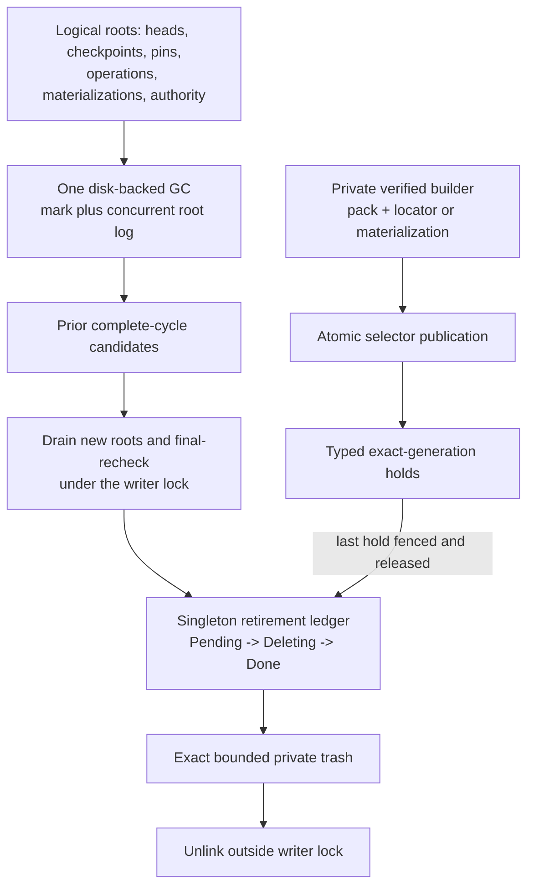
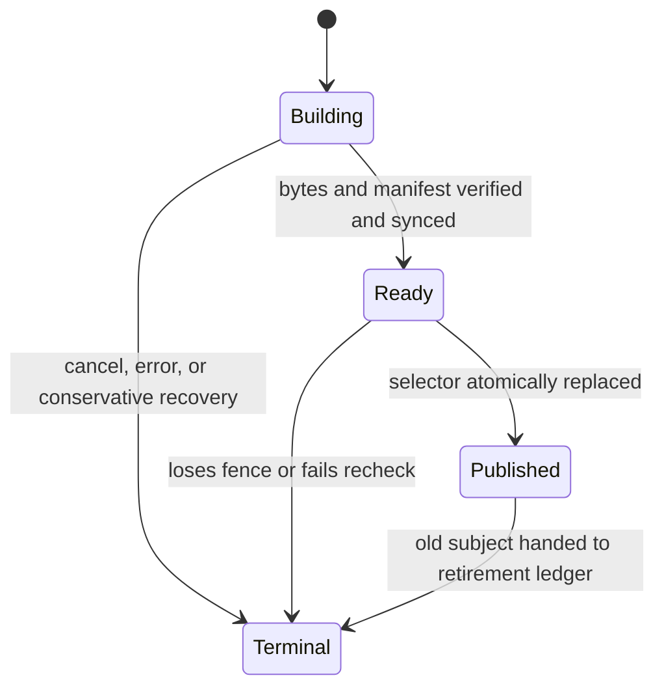
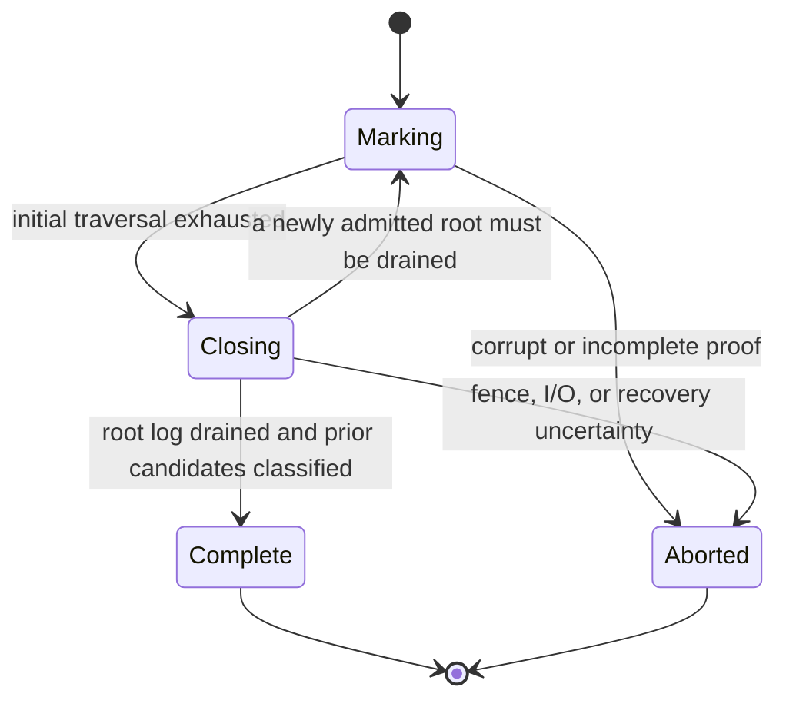

# Stage 05 — retention, physical compaction, GC, and squash retirement

Status: specification only. No Stage 05 implementation, passing E2E result, or passing
benchmark result exists yet. Requirements below are normative architecture; performance
and safety remain `OPEN` until the linked evidence records a measured `PASS`.

Normative dependencies:

- [implementation index](../index.md)
- [minimal storage contract](../layerstack_storage_contract.md)
- [Stage 04](../stage_04_candidate_materialization/spec.md)
- [Stage 04.5 alignment gate](../stage_04_5_materialization_gc_alignment/spec.md)
- [incoming Stage 04.5 implementation handoff](handoff_from_stage_04_5.md)
- [Stage 06](../stage_06_candidate_authority/spec.md)
- [Preparation 04](../../prep/04-seqcdc-space-time-complexity-and-acceptance-criteria.md)

## 1. Outcome and boundary

Stage 05 is the first stage authorized to remove logical objects or physical carriers.
It implements the smallest coherent lifecycle with deletion authority:

1. one disk-backed logical tracing-GC operation;
2. one common verified-generation protocol for physical replacement;
3. one singleton typed retirement ledger for all exact-path deletion; and
4. one owned maintenance supervisor enforcing shared resource limits.

The common replacement protocol is:

```text
build privately -> verify and sync -> publish one selector
-> hold the old generation -> retire it
```

The protocol is shared, but the selectors and their failure domains remain independent:

- `gc/CURRENT` names at most one active GC;
- `objects/locators/CURRENT` selects the active bounded locator run set;
- each `materializations/<id>/CURRENT` selects one native generation.

Stage 05 does not add a global pointer joining those selectors.

The following remain unchanged:

- `RootId` and `AttributionRootId` are independent of physical storage;
- packing, locator consolidation, evacuation, squash, and retirement do not change
  logical identity or attribution;
- Stage 04/04.5 owns private construction and verification of materialization/squash
  generations;
- the common publisher performs bounded GC admission and `CURRENT` replacement;
  Stage 05 owns durable old-generation handoff, eligibility, and retirement;
- v1 remains public authority and is not deleted; Stage 06 owns authority switching and
  Stage 07 owns irreversible legacy retirement;
- LayerStack owns only `/eos/layer-stack`; it never scans or deletes
  WorkspaceManager-, storage-manager-, or runtime-owned paths.

No reference count, wall clock, lease expiry, directory age, or resident in-memory set
is deletion authority. A design that retains uncertainty is safe; a design that leaves
unexplained unreachable residue after uncertainty and holds are gone fails liveness.

### 1.1 Speed and space claim status

The unified lifecycle removes duplicate correctness machinery; it does not claim free
performance or space improvements. It preserves the required asymptotic shapes and
adds hard admission/accounting boundaries, but implementation evidence is still
`OPEN`:

| Property | Normative design requirement | Evidence status |
| --- | --- | --- |
| lookup and startup | bounded by current locator runs/selectors and capped recovery state, never history | `OPEN` |
| foreground latency | no mark, sweep, sort, full-tree, full-history, or full-locator scan; only bounded barrier/publication metadata under the writer lock | `OPEN` |
| maintenance speed | large work is streamed, externally merged, sliced, and measured with foreground p50/p95/p99/maximum latency | `OPEN` |
| settled space | exact Preparation 04 amplification, slack, duplication, and unexplained-residue gates remain unchanged | `OPEN` |
| peak space | admit work only when `settled + T_build + H_gen + H_gc + H_trash` fits the configured store budget | `OPEN` |
| `ENOSPC` safety | fail before visibility; never delete an authoritative source to make room for an unverified target | unimplemented |
| reclamation | two complete GC observations plus bounded ledger service; holds, churn, failure, or insufficient `W_gc` may postpone it but must be explained | `OPEN` |

The unavoidable safety costs are one bounded root-log append/fsync during an active GC,
old/new replacement overlap, two complete reachability observations before deleting a
last logical copy, and retention of old generations while exact readers hold them.
Equivalent physical-generation replacement does not wait for the two GC observations.
Caps make those costs bounded; they do not prove that the bounds meet latency or disk
targets. If `W_gc` or free-space admission is insufficient, GC retains data and
reports the blocking reason rather than trading safety for reclamation. Destructive
enablement remains `NO-GO` until the E2E, fault-injection, and matched benchmark gates
pass.

## 2. Architecture and ownership



No new top-level durable namespace is required. Common build, GC, and retirement state
use the storage contract's existing `operations/<id>/STATE` and
`operations/<id>/work`. The retirement ledger is one stable, store-scoped operation;
it is not one transaction family per carrier type.

The storage contract uses the same split: GC produces deletion eligibility, while the
singleton retirement operation owns the exact trash inventory and unlink. The existing
`operations/<id>/work` ownership boundary is unchanged. The E2E and benchmark plans
define the required evidence; their results remain `OPEN` until implementation and
execution.

| Mechanism | Owner | Durable authority | Not authority |
| --- | --- | --- | --- |
| logical roots | ref, operation, materialization, or Stage 06 authority owner | atomic typed ref/operation/`CURRENT`/`CONTROL` record | an `Arc`, cache entry, or path age |
| locator generation | locator replacement operation until publication; then store | locator `CURRENT` plus exact typed holds on older generations | existence of a pack/run directory |
| materialization generation | Stage 04 builder until publication; then materialization owner | materialization `CURRENT`, pin, or exact session hold | an in-memory ticket or wall-clock expiry |
| active GC | GC operation | `gc/CURRENT` and its checksummed `STATE`/work | newest directory or mtime |
| deletion | maintenance supervisor | retirement `STATE` containing an exact source/destination inventory | recursive directory discovery |

The maintenance supervisor owns every Stage 05 worker, queue, byte/FD permit,
temporary path, retry timer, and shutdown token. It cancels and joins children before
releasing operation ownership. Detached cleanup and process-exit cleanup are forbidden.

## 3. Persistent state machines

### 3.1 Common verified build

Locator replacement and Stage 04 materialization replacement use the same transition
rules, encoded in an ordinary common operation:



- `Building` output is private and cannot be selected.
- `Ready` names immutable bytes, their checksums, exact relative paths, and verification
  result. It still has no visibility.
- `Published` is recorded only after the selector replacement and parent fsync.
- `Terminal` records success or an aborted/cancelled/failed outcome and may be
  compacted after the bounded response/recovery window.
- A pack has no independent `CURRENT`: it becomes usable only when a verified locator
  generation naming it is published.
- Evacuation is pack/locator replacement followed by retirement of source carriers. It
  is not a fourth state machine.
- Squash is a Stage 04 generation build followed by the same selector switch and
  retirement handoff. It is not a Stage 05 build or transaction family.

### 3.2 Logical GC

Only one GC may be active:



`Complete` is the only state that may contribute negative reachability evidence.
`Aborted`, corrupt, missing, truncated, checksum-invalid, or ambiguous state retains
all data.

At most the active cycle and the immediately preceding complete cycle are needed:

- cycle `n` records disk-backed unreachable candidates but does not delete them;
- cycle `n+1` may retire a candidate only if it is absent from both complete marks,
  the concurrent root log has been drained, and the final typed eligibility predicate
  passes;
- after cycle `n+1` is durable, cycle `n` work is no longer needed.

This is sequence-based grace. Time may schedule work but never supplies deletion
authority.

### 3.3 Typed retirement ledger

One store-scoped ledger owns bounded batches of loose objects, packs, locator runs,
materialization generations, and approved non-authoritative external carriers.
Authoritative v1 paths are ineligible until Stage 07:

```mermaid
stateDiagram-v2
    [*] --> Pending: exact inventory synced
    Pending --> Deleting: final recheck and exact rename synced
    Pending --> Done: eligibility withdrawn; source retained
    Deleting --> Done: exact destination unlinked and parent synced
```



Each entry contains:

- subject kind and immutable identity;
- eligibility proof references and fencing values;
- exact normalized source path under an allowed LayerStack prefix;
- exact normalized private-trash destination under this operation;
- expected type, length/allocation, and checksum or manifest digest;
- state sequence and retry count.

Every recorded path is relative to a pre-opened LayerStack-owned directory, contains no
empty, `.` or `..` component, and is resolved without following symlinks. The expected
file type and owner root are rechecked immediately before rename and unlink.

The inventory is written and fsynced before rename. A batch is serviced in fixed
writer-lock slices; the batch remains `Pending` until every exact source has moved:

1. acquire the writer lock for at most one retirement lock slice;
2. recheck every applicable root, operation, selector, typed hold, migration/authority
   fence, and last-usable-carrier condition for that slice;
3. for a slice relying on logical-unreachability evidence, verify that the active GC
   root log has no undrained relevant root; a fully equivalent replaced generation
   does not require GC evidence;
4. rename only that slice's exact sources to their exact private destinations and
   fsync both parent directories;
5. release the writer lock, then repeat from step 1 for the next slice;
6. after all sources are durably moved, record and fsync `Deleting`; and
7. unlink only the recorded destinations outside the writer lock, fsync the parent,
   and record `Done`.

Between slices, a new mutation is admitted normally and therefore participates in
root admission. The next slice rechecks it. A root targeting an already moved last
copy cannot validate and cannot become visible. `Pending` recovery restores every
exact moved destination, so slicing adds no durable state.

Crash recovery is deterministic:

| Durable state and paths | Recovery before mutation admission |
| --- | --- |
| `Pending`, source present, destination absent | retain source; retry or cancel |
| `Pending`, source absent, destination present | restore exact destination to source and fsync |
| `Pending`, source and destination both present, or both absent | stop deletion, retain what exists, and report corruption |
| `Deleting`, destination present | resume exact destination unlink; any independently reinstalled source remains |
| `Deleting`, destination absent | deletion completed; record `Done`; any independently reinstalled source remains |
| metadata corrupt or paths outside the recorded owner root | stop deletion, retain what can be identified, and never infer authority |

There is no broad recursive deletion, permanent trash hierarchy, or second grace state
inside the ledger. Grace belongs to GC/eligibility; trash is only the recoverable
physical step of an already authorized bounded retirement batch.

## 4. Retention roots, strong edges, and holds

Logical mark seeds are typed and separate from physical-carrier ownership:

- `ContentRoot(RootId)` and `AttributionRoot(AttributionRootId)` from branch,
  checkpoint, pin, lease/policy, and Stage 06 authority snapshots;
- content/attribution roots and direct `Object(ObjectId)` subjects from prepared or
  committing operations;
- the content root represented by every active or pinned materialization;
- roots and proof subjects named by an active migration or rollback operation.

Strong edges are only the canonical v3 content root/tree/file/segment/chunk graph and
the separate attribution-root/page graph. Parent, base, provenance, publication
ancestry, locator generations, and carrier membership are not strong logical edges.
Otherwise a locator or mixed pack would incorrectly keep every contained object live.

Physical safety uses one typed hold schema with subject variants for:

- content/attribution snapshot;
- locator generation;
- materialization generation;
- carrier/source location; and
- active operation.

Every hold names an exact subject, fencing value, owner token, and bounded reason class.
A reader obtains its exact locator/materialization hold before using the resource and
keeps that immutable selection for its lifetime. Replacing `CURRENT` affects only new
readers.

Expiry is only evidence that recovery should fence an owner. Retirement additionally
requires a durable owner/session terminal state or takeover fence proving that no late
renewal can succeed. Clock movement or expiry alone can never authorize deletion.

Checkpoint or ref deletion removes a seed; it never synchronously deletes payload.
Conservative extra roots may delay reclamation but cannot authorize it.

## 5. Root admission and concurrent marking

Any mutation that can make a new logical root visible—including a head, checkpoint,
pin, prepared/committing operation, materialization, or Stage 06 authority change—uses
this two-phase admission:

1. validate the root envelope and acquire resource permits outside the writer lock;
2. under the writer lock, read `gc/CURRENT`; when present, append and fsync a
   provisional typed root to that cycle's root log;
3. release the lock and validate the complete selected graph through protected,
   verified locators using bounded traversal;
4. reacquire the writer lock, register with a different active GC if the fence changed,
   recheck the expected ref/authority generation, and atomically make the mutation
   visible; then
5. release provisional operation resources. An abandoned provisional root is harmless
   conservative retention for that cycle.

This ordering closes the validation-to-visibility race: while deletion is possible, a
prospective root is in the active log before graph validation; immediately before
visibility it participates in whichever GC is then active. If no GC is active, no
Stage 05 logical deletion may run.

GC marking:

1. creates the operation, root log, cursors, and spill work;
2. under the writer lock installs `gc/CURRENT` and snapshots all typed logical seeds;
3. traverses edges in bounded pages, spilling immutable mark runs;
4. external-sorts/deduplicates runs with bounded fan-in;
5. repeatedly drains root-log additions to a fixed point;
6. during `Closing`, processes bounded prior-cycle candidate/retirement slices;
7. under the writer lock confirms no undrained root remains and atomically records
   `Complete` and clears `gc/CURRENT`.

A mutation racing `Closing` either registers before the final check and returns the
cycle to marking, or observes no active cycle after the complete state is durable.
Checkpoint deletion during mark can only retain extra data. Stage 06 authority
preparation and switching use the same root admission and writer lock; Stage 05 cannot
retire v1 sources while rollback policy or a migration hold requires them.

## 6. Packing, locator replacement, and evacuation

Loose objects are found by typed ID and need no locator record. Locator runs map only
objects stored in an immutable pack or approved external carrier to verified physical
extents.

Packing:

1. selects at most one bounded transaction of streamed records;
2. obtains exact source-location holds and verifies every envelope, length, ID, extent,
   and checksum before allocation or copy;
3. writes and fsyncs one immutable pack;
4. externally sorts and fsyncs an immutable locator run;
5. builds a `Ready` locator generation with a fixed run count and encoded size;
6. under the writer lock rechecks source holds and atomically replaces locator
   `CURRENT`; and
7. submits redundant source carriers to the retirement ledger only after the selector
   fence, holds, and final predicate permit it. A record intentionally omitted from
   the replacement must independently have two-cycle logical-deletion evidence; a
   byte-for-byte equivalent replacement does not wait for GC.

Locator consolidation reads only a bounded selected run set and publishes another
generation through the same protocol. Startup and lookup never inspect historical
runs. A current or held locator generation keeps every pack/run it names physically
retained but does not make dead logical records reachable.

A mixed live/dead pack is never deleted wholesale while a live object lacks another
selected usable locator. Evacuation copies and verifies every still-required extent,
publishes a locator generation selecting its replacement, and retires the old carrier
only after no current or held locator generation can select it. The only legacy locator
cannot be removed until an independently verified replacement is selected.

## 7. Materialization and squash retirement

Stage 04 owns materialization and squash planning, reconstruction, verification, and
the private generation. Stage 05 provides only the shared publication/retirement
mechanics:

1. Stage 04 protects the root, source locators, and active generation;
2. Stage 04 builds, verifies, and syncs a private replacement generation;
3. the common publisher participates in root admission and atomically replaces
   materialization `CURRENT`;
4. new sessions select the replacement while admitted sessions keep exact old
   generation holds; and
5. the old generation enters the retirement ledger only when it is non-current,
   unpinned, fenced from new admission, unheld, and not the last usable carrier for any
   retained object.

The materialization ID, `RootId`, `AttributionRootId`, checkpoint, branch, MCTS, and
publication generations do not change. Manual, depth-triggered, fragmentation,
evacuation, and repair squash use the Stage 04 builder; Stage 05 does not add trigger
types or a squash state machine.

LayerStack deletion is confined to exact immutable generation paths under
`/eos/layer-stack/materializations`. It never scans or deletes
`/eos/workspace/<session>/{upper,work,executions}`.

## 8. Concurrency, ownership, and lock order

The only Stage 05 cross-process exclusion is the existing storage writer lock. Heavy
work, graph traversal, sorting, waiting, allocation, and directory scans never run
under it. A bounded record append/fsync, generation recheck, selector replacement, or
exact retirement rename may run under it and must be measured.

Required acquisition order:

```text
byte/worker/FD permits
    -> optional per-key single-flight ownership
        -> storage writer lock
```

Code holding the writer lock may not acquire a permit, wait for a single-flight owner,
join a task, or enter provider I/O beyond the bounded metadata/fsync/rename operation.
No other Stage 05 lock domain is permitted without a separate specification amendment
and deadlock proof.

| Operation | Owner | RAM and queue bound | Workers | FDs / mappings | Disk staging | Cancellation or panic |
| --- | --- | --- | ---: | --- | --- | --- |
| mark traversal | active GC | permits from `min(B,64 MiB)`; 16 records/64 KiB queue | shared pool, at most 4 global | at most 16/operation, 64 global; 0 mappings | bounded spill runs and root log | stop admission, join, persist resumable cursor or abort/retain |
| sort/dedup | active GC or locator builder | fan-in 8 × 64 KiB readers plus bounded output | shared pool | within same FD caps; 0 mappings | immutable input/output runs | discard incomplete output; retain inputs |
| sweep | active GC | one allocation page, mark cursors, bounded candidate page | shared pool | within caps; 0 mappings | disk candidate inventory | cursor persists or cycle aborts/retains |
| pack creation | build operation | one 256 KiB read buffer/worker; metadata queue cap | shared pool | within caps; 0 mappings | one pack, at most 80 MiB allocation | incomplete private pack removed or resumed exactly |
| locator consolidation | build operation | fan-in and queue caps above | shared pool | within caps; 0 mappings | one bounded replacement run set | old `CURRENT` remains |
| evacuation | build operation | same as pack plus locator build | shared pool | within caps; 0 mappings | one bounded replacement transaction | source hold remains |
| retirement rename/unlink | singleton ledger | at most 1,024 paths/64 MiB per batch; 16 paths/64 KiB per lock slice | one shared worker | within caps; 0 mappings | one exact trash batch | durable `Pending` restores; `Deleting` resumes |
| squash | Stage 04 build owner | Stage 04/Preparation 04 caps | shared global pool | provider caps; Stage 05 adds none | one admitted replacement generation | Stage 04 joins builder; old generation remains |
| restart recovery | maintenance supervisor | paginated operations/ledger scan; never collect all entries | one recovery worker before maintenance admission | within caps; 0 mappings | existing exact work only | restart repeats idempotently |

All decoders validate magic, version, checksum, declared count, length, offset, and
`offset + length` with checked arithmetic before allocation or slicing. Counts and
lengths are capped before `Vec`/map reservation. Directory enumeration is paginated;
no `collect()` proportional to history is allowed.

Stage 05 new code is safe Rust by default and uses no memory mapping. Any proposed
`unsafe` block or mapping requires a specification amendment documenting its necessity,
safety contract, enforcing owner, cancellation/replacement behavior, Miri or sanitizer
coverage, and safe-Rust alternative. Until that inventory and evidence pass, it is a
release blocker.

No `Arc` cycle, detached task, unbounded `Vec`/map/set/channel/cache/registry, forgotten
permit, or unjoined worker is allowed. All retry loops have a count and deadline.

## 9. Initial hard limits and backpressure

Preparation 04 remains normative and tighter limits win. These initial Stage 05 caps
close previously implicit resource bounds; changing one requires a measured spec
amendment.

| Resource | Initial hard cap |
| --- | ---: |
| shared storage-owned byte permits | `min(B, 64 MiB)` total; Stage 05 receives no additional pool and cannot expand when `B` is larger |
| storage data-plane/background workers | 4 globally |
| admitted heavy Stage 05 build/GC operation | 1 |
| downstream metadata queue | 16 descriptors and 64 KiB encoded |
| same-key waiters | 16 |
| external merge fan-in / buffer | 8 runs / 64 KiB per run |
| active locator runs / encoded `CURRENT` | 8 / 64 KiB |
| sealed pack payload / records / allocation | 64 MiB / 100,000 / 80 MiB |
| GC or compaction transaction | 64 MiB payload or 100,000 records |
| retirement batch | 1,024 exact paths and 64 MiB |
| retirement writer-lock slice | 16 exact paths and 64 KiB encoded inventory |
| open FDs | 16 per operation, 64 Stage 05 global |
| Stage 05 memory mappings | 0 |
| active typed holds | 4,096 |
| nonterminal common operations | 64 |
| retained terminal operation records | 256 records and 64 MiB encoded total |
| one operation manifest/`STATE` encoding | 256 KiB |
| active GC root log before drain/abort | 64 MiB |
| active plus previous complete GC work `W_gc` | configured at store creation; initially the lesser of 4 GiB and 10% of the LayerStack capacity |
| retirement ledger | 64 batches, 65,536 paths, and 4 GiB renamed bytes |
| operation retry attempts | 8 and the caller/maintenance deadline |
| active or pinned materialization generations `G` | 64 |

On a limit:

1. do not allocate or spawn first and account later;
2. apply bounded backpressure until the operation deadline;
3. return `ResourceExhausted`, or for a full GC root log abort that GC under the writer
   lock and retain all candidates before admitting the mutation;
4. expose no unverified carrier or incomplete root; and
5. leave only exact operation-owned recovery state.

Disk admission accounts for current bytes plus the complete worst-case target, mark
runs, retirement trash, and protected old generations. `ENOSPC` never authorizes
deleting an authoritative source to make room for an unverified target.
If the supported store's worst-case mark and candidate encoding cannot fit in `W_gc`,
destructive GC remains disabled until an explicit larger store quota is qualified; GC
work may not grow beyond the configured quota.

## 10. Complexity and space

For this section:

- `V` is live logical objects, `A` allocated objects/locator records, and `E` strong
  graph edges;
- `R` is logical root size, `S` materialization size, and `E_s` squash reconstruction
  work;
- `P` is pack count, `L` active locator-run count and encoded bytes, and `Q` concurrent
  foreground requests;
- `B` is the configured RAM budget, `D` materialization depth, and `G` active/pinned
  materialization generations.

`Sort(n)` denotes the bounded external sort/merge cost. The external-sort design does
not claim strict linear CPU/I/O for mark deduplication.

| Operation | Required time shape | Resident-memory and foreground rule |
| --- | --- | --- |
| GC mark | `O(V + E + Sort(V + E))` | `O(B)`; asynchronous slices; no resident all-live set |
| sweep | sequential merge/sliced `O(A + V)` after mark ordering | fixed pages and candidate batches |
| pack creation | proportional to selected bytes and records | bounded streaming; no foreground tree/history scan |
| locator consolidation | proportional to selected runs and records | `L≤8`; bounded merge |
| lookup | deterministic loose lookup or at most `L` indexed-run probes | fixed active run/byte cap; no historical scan |
| startup | current selectors, active holds, and capped nonterminal recovery state | independent of total historical runs/operations |
| squash | Stage 04 streamed `O(S + E_s)` | outside bounded selector switch; `D≤64` |
| foreground publication | unchanged Stage 03 incremental work plus bounded barrier append | no `O(V)`, `O(A)`, full-tree, full-history, or full-locator scan |
| recovery | capped nonterminal operations plus exact work pages | never load total history |

Large work is asynchronous, checkpointed, and scheduled in bounded slices. The
specification does not hide `O(A)`, `O(V)`, or `Sort(V+E)` work behind “background”:
benchmarks must report maintenance throughput and foreground p50/p95/p99/maximum
latency during each operation.

Let:

- `H_gen` be bytes of old locator/materialization generations protected by exact holds;
- `H_gc≤W_gc` be active plus immediately previous GC work;
- `H_trash` be the bounded retirement batch; and
- `T_build` be the one admitted complete replacement target.

Then the required peak accounting is:

```text
peak <= settled + T_build + H_gen + H_gc + H_trash
```

Every term is measured separately. `T_build`, `H_gc`, and `H_trash` have admission
caps; `H_gen` is bounded by the typed-hold and `G` caps but may remain large while
legitimate readers live. New admissions backpressure rather than exceed those caps.
After readers, failures, and uncertainty clear, the retirement ledger must converge
and unexplained unreachable/unleased payload must be zero.

Settled amplification, pack slack, avoidable native-plus-pack duplication, write
amplification, and peak operation overlap use the exact Preparation 04 thresholds.
Nothing in this specification claims a measured pass.

## 11. Recovery summary

| Crash boundary | Selected state and recovery |
| --- | --- |
| build incomplete | old selector wins; resume/reap exact private work |
| verified build, selector old | old generation wins; new bytes are bounded orphan/resumable work |
| selector new | new generation wins; old subject remains held and enters retirement |
| locator replacement corrupt | reject replacement; old `CURRENT` and sources remain |
| GC mark/root log incomplete | resume checked cursor or abort and retain |
| GC closure ambiguous | abort; neither mark nor candidates authorize deletion |
| complete cycle candidates | readable at normal locations until a later complete cycle |
| `Pending` rename crash | exact source/destination reconciliation restores readable source |
| durable `Deleting` | resume exact destination unlink |
| reader holds old locator/materialization generation | exact generation and every required carrier remain |
| Stage 06 preparation/cutover crash | `CONTROL`, migration operation, ordinary holds, and GC root log fence recovery; Stage 05 retains v1 |
| corrupt or missing retirement/hold/selector record | stop deletion and retain what can be identified |

Recovery selects only a complete old or complete new selector named by durable state.
It never chooses from directory contents, mtime, maximum generation number, or an
unverified orphan. Startup may page through exact operation work, but its resident
metadata is bounded by the caps above.

## 12. Safety and liveness argument

### Logical safety

1. Every visible root names a fully durable graph.
2. A prospective root is logged before graph validation whenever deletion can run and
   is logged again if the GC fence changes before visibility.
3. A logical object becomes a candidate only after one complete conservative mark and
   can be retired only after absence from the next complete conservative mark.
4. Before each bounded rename, all newly logged roots are drained and selectors,
   operations, holds, authority state, and last-carrier status are rechecked under the
   same writer lock used by visibility mutations.
5. Each slice's exact rename occurs before that lock acquisition is released. A later
   ref must validate the graph and therefore cannot make a missing last copy visible;
   the next slice rechecks any mutation admitted between slices.
6. Mixed packs and old generations are deleted only when no current or held selector
   needs them.
7. Ambiguity, corruption, overflow, missing evidence, I/O failure, or an unfenced owner
   retains data.

Therefore no reachable logical object, last usable locator, active generation, or
Stage 06 rollback source is an authorized retirement target.

### Reclamation liveness

An allocation is eligible when it is absent from two consecutive complete marks and
passes its final typed physical predicate. A replaced physical generation is eligible
when it is non-current, fenced from new admission, unheld, and not a last required
carrier.

Expected reclamation delay is:

```text
remainder of cycle n
+ one complete later cycle
+ bounded retirement queue service time
```

Churn, active readers, pins/policy, prepared operations, authority rollback protection,
I/O failure, resource pressure, corruption investigation, or an unfenced abandoned
owner may postpone it. After those conditions clear, bounded retries either reclaim
the entry or expose a terminal reason code. Operators can query the subject, first and
last candidate cycle, blocking root/selector/hold/fence, retry count, bytes, and next
action. Persistent unreachable, unleased bytes without one of those reasons fail the
Stage 05 gate.

## 13. Validation and exit criteria

The [E2E plan](e2e_test.md) must pass all named GC phases and replacement/deletion
boundaries, including concurrent ref/checkpoint/materialization/authority mutation,
mixed packs, last locators, long readers, multiple cycles, cancellation, panic,
restart, corrupt metadata, response loss, and `ENOSPC` at every write/fsync/rename
boundary.

The [benchmark note](benchmark_note.md) must record matched baseline/proposal campaigns
with exact command, revision, corpus hash, machine/kernel/filesystem/architecture,
configuration and caps, raw artifact, samples/distribution, threshold, measured value,
and `PASS`/`FAIL`/`OPEN`. Required cells include configured
`B=64/256/1,024 MiB` campaigns, the independent Preparation 04
64/256/1,024 MiB input/history scale, 1/16/64 retained roots, loose-heavy and
pack-heavy stores, shallow and deeply shared
graphs, mostly-live and mostly-dead stores, continuous foreground traffic, long
readers, restart storms, and disk pressure.

Release gates:

- every Stage 05 `unsafe` block and mapping has a documented, enforced, tested safety
  contract; the initial expected inventory is zero;
- Miri-capable units, deterministic concurrency tests or Loom models, sanitizers where
  supported, decoder fuzzing, fault injection, leak/resource accounting, and
  long-running cancellation/restart stress pass;
- every task, queue, buffer, map/set/cache, retry, FD, mapping, hold, temporary path,
  and terminal record stays within its cap and returns to its quiescent owner;
- checkpoint attribution remains queryable after packing, GC, squash, evacuation, and
  restart;
- foreground and maintenance thresholds, Preparation 04 space amplification, and peak
  overlap all record measured passes;
- no approved non-authoritative legacy/external carrier is retired until an
  independently verified selected locator is durable; authoritative v1 paths remain
  excluded; and
- public authority remains v1.

Until all gates pass, destructive Stage 05 enablement is `NO-GO`; missing evidence is
`OPEN`, never an inferred `PASS`.
